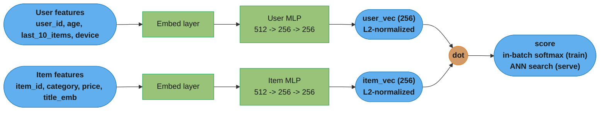
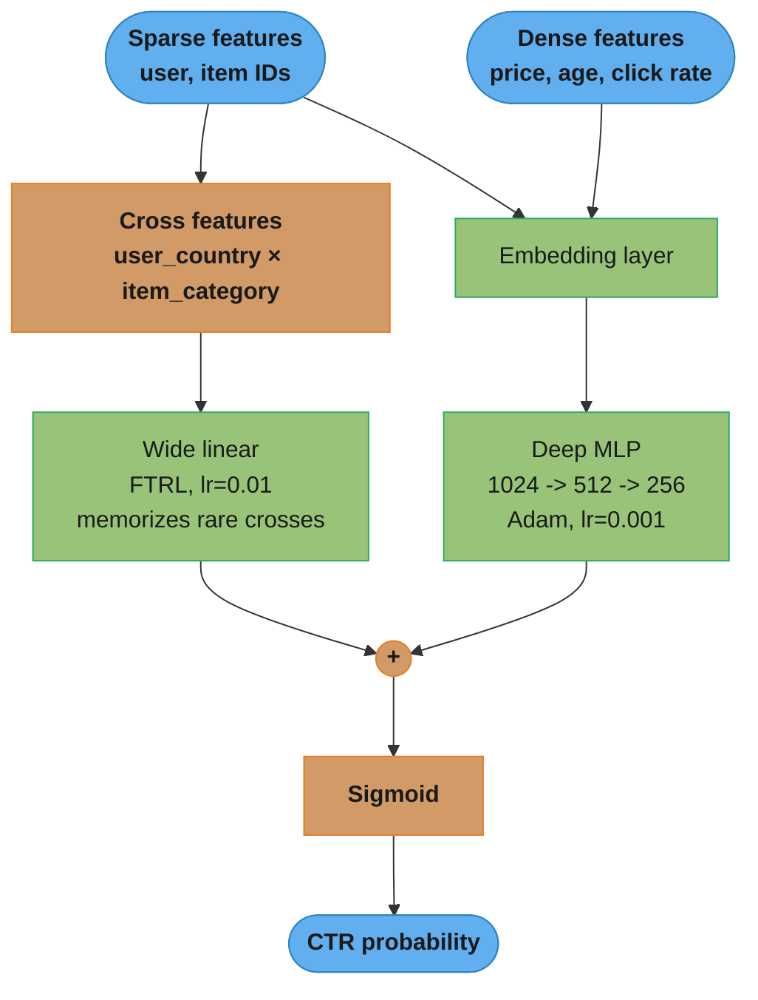
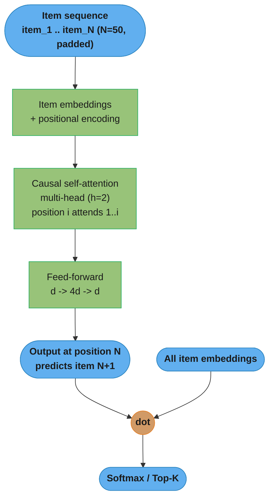
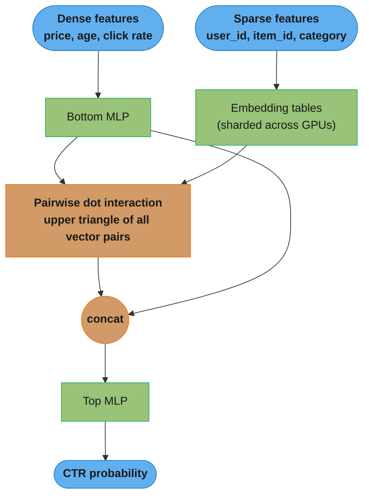

# Deep Learning Recommenders

## 1. Concept Overview

Deep learning recommenders replace hand-crafted similarity functions and shallow matrix factorization with learned neural representations that can capture complex, non-linear interactions between users, items, and context. They are the foundation of modern large-scale recommendation systems at Google (Wide & Deep, YouTube two-tower), Meta (DLRM), and Pinterest (PinSage).

The key advancement over collaborative filtering is the ability to incorporate heterogeneous features: sparse ID features (user_id, item_id, category), dense numerical features (price, age, click rate), and sequential features (last 50 items viewed) — all jointly learned in a single model. Deep models also learn cross-feature interactions automatically, eliminating manual feature engineering.

---

## 2. Intuition

One-line analogy: Where matrix factorization gives each user and item a fixed address in latent space, a two-tower neural network gives each user a GPS coordinate computed from everything known about them right now — and each item a coordinate computed from its full description.

Mental model: The user tower is a function user_vec = f(user_id, history, context) and the item tower is item_vec = g(item_id, category, metadata). Both towers output vectors in the same d-dimensional space. Retrieval is a nearest-neighbor search in this space. The beauty: at serving time, item vectors are pre-computed and cached; only the user vector is computed on the fly.

Key insight for Wide & Deep: Memorization and generalization are complementary. A feature cross like "user searched 'action movie' AND device=mobile AND time=evening" is a strong signal for recommending a specific film — but it is too rare to be captured by a deep network alone. The wide (linear) component memorizes such rare but reliable patterns while the deep component generalizes across them.

---

## 3. Core Principles

**Representation Learning**: Learn dense vector representations (embeddings) for all categorical features (user IDs, item IDs, categories). These embeddings are trained end-to-end with the recommendation objective.

**Feature Interaction**: Deep models can learn high-order feature interactions (user age × item category × time of day) that are prohibitively expensive to enumerate manually.

**Two-Stage Architecture**: Separate the representation (towers) from the interaction (scoring). This enables efficient ANN-based retrieval for the user-item dot product while keeping model expressiveness in the towers.

**Sequential Modeling**: A user's recent interaction sequence is highly predictive of their next action. Self-attention (SASRec, BERT4Rec) or RNNs (GRU4Rec) model temporal dynamics.

**Negative Sampling**: Training data is sparse positive examples. Models need negative examples (items not clicked). Uniform negative sampling is simple but biased toward popular items. Hard negative mining (sample items the model nearly recommends) improves discrimination.

**In-Batch Negatives**: In two-tower training, use all other items in the batch as negatives for each user. Efficient — no extra sampling needed. Requires correction for sampling bias because popular items appear as negatives more often.

---

## 4. Types / Architectures / Strategies

### 4.1 Two-Tower (Dual Encoder)

User tower: [user_id, demographics, watch history] → MLP → user_embedding (256-dim)
Item tower: [item_id, category, text features] → MLP → item_embedding (256-dim)
Score: dot product (or cosine similarity)
Training: sampled softmax or in-batch negatives
Serving: FAISS ANN search over pre-computed item embeddings

### 4.2 Neural Collaborative Filtering (NCF)

Combines Generalized Matrix Factorization (GMF, dot product) and MLP in parallel:
GMF: element-wise product of user and item embeddings
MLP: concatenate user+item embeddings, pass through deep MLP
Output: sigmoid(W * concat(GMF_output, MLP_output))
Directly predicts click probability (binary classification)

### 4.3 Wide & Deep

Wide part: linear model on raw + crossed features (e.g., user_country × item_category)
Deep part: MLP on dense embeddings of all features
Training: jointly optimized end-to-end
Serving: Google Play, 10B+ recommendations/day

### 4.4 DeepFM

Factorization Machine layer: models all pairwise feature interactions via inner products of embeddings
Deep layer: MLP on concatenated embeddings
Advantage over Wide & Deep: no manual feature cross engineering; FM handles all pairwise crosses automatically

### 4.5 Sequential Models

GRU4Rec: GRU over item sequence, session-based (no persistent user profile)
SASRec: Transformer decoder (causal self-attention) over item sequence (N=50 typical)
BERT4Rec: Bidirectional Transformer (Cloze task — mask random items and predict them)

### 4.6 DLRM (Facebook/Meta)

Bottom MLP: processes dense features
Embedding tables: sparse feature lookup (user_id, item_id, category)
Feature interaction: dot product between all pairs of embedding vectors (upper triangle)
Top MLP: scores interaction output
Optimized for commodity hardware with massive embedding table sharding

---

## 5. Architecture Diagrams

### 5.1 Two-Tower Architecture



### 5.2 Wide & Deep Architecture



### 5.3 SASRec Sequential Model



### 5.4 DLRM Feature Interaction



DLRM keeps dense features in a bottom MLP and sparse IDs in sharded embedding
tables, then computes explicit pairwise dot products between every vector pair —
a more interpretable, hardware-friendly interaction than the learned crosses in DeepFM.

---

## 6. How It Works — Detailed Mechanics

```python
from __future__ import annotations

import torch
import torch.nn as nn
import torch.nn.functional as F
from dataclasses import dataclass
from typing import Optional
import numpy as np


# ─────────────────────────────────────────────────────────────────────────────
# Two-Tower Model
# ─────────────────────────────────────────────────────────────────────────────

@dataclass
class TwoTowerConfig:
    n_users: int = 1_000_000
    n_items: int = 500_000
    n_categories: int = 1000
    user_embed_dim: int = 64
    item_embed_dim: int = 64
    category_embed_dim: int = 32
    dense_user_dim: int = 8      # age, days_since_signup, etc.
    dense_item_dim: int = 4      # price, avg_rating, etc.
    output_dim: int = 256
    dropout: float = 0.1
    temperature: float = 0.07    # for in-batch contrastive loss


class UserTower(nn.Module):
    def __init__(self, cfg: TwoTowerConfig) -> None:
        super().__init__()
        self.user_embed = nn.Embedding(cfg.n_users, cfg.user_embed_dim)
        self.category_embed = nn.Embedding(cfg.n_categories, cfg.category_embed_dim)
        in_dim = cfg.user_embed_dim + cfg.category_embed_dim + cfg.dense_user_dim
        self.mlp = nn.Sequential(
            nn.Linear(in_dim, 512),
            nn.ReLU(),
            nn.Dropout(cfg.dropout),
            nn.Linear(512, 256),
            nn.ReLU(),
            nn.Dropout(cfg.dropout),
            nn.Linear(256, cfg.output_dim),
        )

    def forward(
        self,
        user_ids: torch.Tensor,          # (B,)
        fav_category_ids: torch.Tensor,  # (B,)
        dense_features: torch.Tensor,    # (B, dense_user_dim)
    ) -> torch.Tensor:
        u_emb = self.user_embed(user_ids)        # (B, user_embed_dim)
        c_emb = self.category_embed(fav_category_ids)  # (B, category_embed_dim)
        x = torch.cat([u_emb, c_emb, dense_features], dim=-1)
        out = self.mlp(x)
        return F.normalize(out, dim=-1)           # L2-normalize for cosine sim


class ItemTower(nn.Module):
    def __init__(self, cfg: TwoTowerConfig) -> None:
        super().__init__()
        self.item_embed = nn.Embedding(cfg.n_items, cfg.item_embed_dim)
        self.category_embed = nn.Embedding(cfg.n_categories, cfg.category_embed_dim)
        in_dim = cfg.item_embed_dim + cfg.category_embed_dim + cfg.dense_item_dim
        self.mlp = nn.Sequential(
            nn.Linear(in_dim, 512),
            nn.ReLU(),
            nn.Dropout(cfg.dropout),
            nn.Linear(512, 256),
            nn.ReLU(),
            nn.Dropout(cfg.dropout),
            nn.Linear(256, cfg.output_dim),
        )

    def forward(
        self,
        item_ids: torch.Tensor,         # (B,)
        category_ids: torch.Tensor,     # (B,)
        dense_features: torch.Tensor,   # (B, dense_item_dim)
    ) -> torch.Tensor:
        i_emb = self.item_embed(item_ids)
        c_emb = self.category_embed(category_ids)
        x = torch.cat([i_emb, c_emb, dense_features], dim=-1)
        out = self.mlp(x)
        return F.normalize(out, dim=-1)


class TwoTowerModel(nn.Module):
    def __init__(self, cfg: TwoTowerConfig) -> None:
        super().__init__()
        self.user_tower = UserTower(cfg)
        self.item_tower = ItemTower(cfg)
        self.temperature = cfg.temperature

    def forward(
        self,
        user_ids: torch.Tensor,
        user_cat_ids: torch.Tensor,
        user_dense: torch.Tensor,
        item_ids: torch.Tensor,
        item_cat_ids: torch.Tensor,
        item_dense: torch.Tensor,
    ) -> torch.Tensor:
        user_vecs = self.user_tower(user_ids, user_cat_ids, user_dense)  # (B, D)
        item_vecs = self.item_tower(item_ids, item_cat_ids, item_dense)  # (B, D)
        # In-batch contrastive: user i should match item i, not items j != i
        # Similarity matrix: (B, B)
        logits = (user_vecs @ item_vecs.T) / self.temperature
        return logits

    def in_batch_loss(self, logits: torch.Tensor) -> torch.Tensor:
        """Diagonal of the similarity matrix should be maximized (positive pairs)."""
        batch_size = logits.shape[0]
        labels = torch.arange(batch_size, device=logits.device)
        # Symmetric cross-entropy loss
        loss_user = F.cross_entropy(logits, labels)
        loss_item = F.cross_entropy(logits.T, labels)
        return (loss_user + loss_item) / 2


# ─────────────────────────────────────────────────────────────────────────────
# SASRec: Self-Attentive Sequential Recommendation
# ─────────────────────────────────────────────────────────────────────────────

class SASRec(nn.Module):
    """Simplified SASRec (Kang & McAuley, 2018).

    Predicts the next item given a sequence of N past items.
    Uses causal (masked) self-attention so position i only sees positions 1..i.
    """

    def __init__(
        self,
        n_items: int,
        embed_dim: int = 64,
        n_heads: int = 2,
        n_layers: int = 2,
        max_seq_len: int = 50,
        dropout: float = 0.2,
    ) -> None:
        super().__init__()
        self.item_embed = nn.Embedding(n_items + 1, embed_dim, padding_idx=0)
        self.pos_embed = nn.Embedding(max_seq_len, embed_dim)
        self.max_seq_len = max_seq_len

        encoder_layer = nn.TransformerEncoderLayer(
            d_model=embed_dim,
            nhead=n_heads,
            dim_feedforward=embed_dim * 4,
            dropout=dropout,
            batch_first=True,
        )
        self.transformer = nn.TransformerEncoder(encoder_layer, num_layers=n_layers)
        self.layer_norm = nn.LayerNorm(embed_dim)
        self.dropout = nn.Dropout(dropout)
        self.output_proj = nn.Linear(embed_dim, n_items)

    def _causal_mask(self, seq_len: int, device: torch.device) -> torch.Tensor:
        """Upper triangular mask: position i cannot attend to i+1, i+2, ..."""
        mask = torch.triu(torch.ones(seq_len, seq_len, device=device), diagonal=1)
        return mask.bool()  # True = ignore

    def forward(
        self,
        item_seq: torch.Tensor,    # (B, N) padded item ID sequences
    ) -> torch.Tensor:
        B, N = item_seq.shape
        positions = torch.arange(N, device=item_seq.device).unsqueeze(0)  # (1, N)

        x = self.item_embed(item_seq) + self.pos_embed(positions)  # (B, N, D)
        x = self.dropout(self.layer_norm(x))

        causal_mask = self._causal_mask(N, item_seq.device)  # (N, N)
        x = self.transformer(x, mask=causal_mask)            # (B, N, D)

        # Use the output at the last position to predict next item
        logits = self.output_proj(x[:, -1, :])               # (B, n_items)
        return logits

    def recommend(
        self,
        item_seq: torch.Tensor,   # (1, N) single user sequence
        top_k: int = 10,
    ) -> list[int]:
        self.eval()
        with torch.no_grad():
            logits = self.forward(item_seq)  # (1, n_items)
            scores = logits[0]
            # Mask already interacted items
            for item_id in item_seq[0]:
                if item_id.item() != 0:
                    scores[item_id] = float("-inf")
            top_items = torch.topk(scores, k=top_k).indices.tolist()
        return top_items


# ─────────────────────────────────────────────────────────────────────────────
# Wide & Deep
# ─────────────────────────────────────────────────────────────────────────────

class WideAndDeep(nn.Module):
    """Wide & Deep for click-through rate prediction.

    Wide part: linear model on raw + crossed sparse features
    Deep part: MLP on concatenated embeddings of sparse + dense features
    """

    def __init__(
        self,
        n_users: int,
        n_items: int,
        n_wide_features: int,    # number of wide (raw + cross) binary features
        embed_dim: int = 32,
        dense_feature_dim: int = 10,
        deep_hidden: tuple[int, ...] = (1024, 512, 256),
    ) -> None:
        super().__init__()
        # Wide part
        self.wide = nn.Linear(n_wide_features, 1, bias=True)

        # Deep part
        self.user_embed = nn.Embedding(n_users, embed_dim)
        self.item_embed = nn.Embedding(n_items, embed_dim)
        deep_input_dim = embed_dim * 2 + dense_feature_dim
        layers: list[nn.Module] = []
        in_dim = deep_input_dim
        for h in deep_hidden:
            layers += [nn.Linear(in_dim, h), nn.ReLU(), nn.Dropout(0.1)]
            in_dim = h
        self.deep = nn.Sequential(*layers)
        self.deep_output = nn.Linear(in_dim, 1)

        # Combined output
        self.output = nn.Sigmoid()

    def forward(
        self,
        wide_features: torch.Tensor,    # (B, n_wide_features) binary sparse features
        user_ids: torch.Tensor,          # (B,)
        item_ids: torch.Tensor,          # (B,)
        dense_features: torch.Tensor,   # (B, dense_feature_dim)
    ) -> torch.Tensor:
        wide_out = self.wide(wide_features)                      # (B, 1)
        u_emb = self.user_embed(user_ids)                        # (B, embed_dim)
        i_emb = self.item_embed(item_ids)                        # (B, embed_dim)
        deep_in = torch.cat([u_emb, i_emb, dense_features], dim=-1)
        deep_out = self.deep_output(self.deep(deep_in))         # (B, 1)
        logit = wide_out + deep_out
        return self.output(logit).squeeze(-1)                    # (B,) CTR probability


# ─────────────────────────────────────────────────────────────────────────────
# Hard Negative Mining for Two-Tower Training
# ─────────────────────────────────────────────────────────────────────────────

def mine_hard_negatives(
    user_vecs: np.ndarray,    # (B, D) current user embeddings
    item_vecs: np.ndarray,    # (N_items, D) all item embeddings
    positive_item_ids: list[int],
    n_hard_negatives: int = 4,
    n_easy_negatives: int = 4,
) -> list[int]:
    """Select hard negatives: items with high similarity to user but not interacted.

    Hard negatives improve model discrimination at the boundary.
    Mixing hard and easy negatives prevents training collapse.
    """
    # Compute similarity to all items
    similarities = user_vecs @ item_vecs.T       # (B, N_items)
    positive_set = set(positive_item_ids)

    hard_negs: list[int] = []
    for b in range(len(user_vecs)):
        sims = similarities[b].copy()
        # Zero out positives
        for pos in positive_set:
            sims[pos] = -np.inf
        # Top similar non-positive items = hard negatives
        top_hard = np.argpartition(sims, -n_hard_negatives)[-n_hard_negatives:]
        hard_negs.extend(top_hard.tolist())

    # Easy negatives: random items not in positives
    all_items = set(range(len(item_vecs)))
    available = list(all_items - positive_set)
    easy_negs = np.random.choice(available, size=n_easy_negatives, replace=False).tolist()

    return hard_negs + easy_negs
```

---

## 7. Real-World Examples

**YouTube Two-Tower (2016)**: Google's "Deep Neural Networks for YouTube Recommendations" paper described a candidate generation network that replaced the previous CF system. User tower inputs: watch history (average of video embeddings), search history, demographic features, geographic features, device, time. Item tower: video ID, topic, description embeddings. Trained with sampled softmax on 1M+ candidate videos. The key challenge was training scale: hundreds of millions of users, millions of videos, billions of training examples. Solution: use in-batch negatives for efficiency.

**Google Play Wide & Deep (2016)**: Deployed for Google Play app recommendations. Wide component: feature crosses between app and user features (e.g., "user_installed_app=X AND query=Y"). Deep component: 1B+ parameters with embedding tables for categorical features. Served to over 1 billion Android users. Key insight: the wide component was essential for memorizing specific user-app combinations that the deep component could not generalize from (too rare in training data).

**Pinterest PinSage (2018)**: Graph convolutional network for pin recommendation. Treats the user-item interaction graph as a graph; pin embeddings are computed by aggregating neighborhood pin features via GCN. Scales to 3 billion pins. Key innovation: importance-based neighborhood sampling (not all neighbors equally — sample proportional to random walk visit count) makes GCN tractable at Pinterest's scale.

**Netflix SASRec-style Sequential Modeling**: Netflix uses sequential models to capture "session context" — the series you are currently watching matters more than your 5-year watch history. A self-attention model over the last 20 watched items significantly improves same-session next-episode recommendations compared to static user embeddings.

---

## 8. Tradeoffs

| Model | Training Cost | Serving Latency | Feature Support | Cold Start | Interpretability |
|-------|--------------|----------------|----------------|------------|-----------------|
| Two-Tower | High | Very Low (ANN) | All feature types | OK with features | Low |
| NCF | Medium | Medium | ID features only | Poor | Low |
| Wide & Deep | High | Low | All feature types | OK | Medium (wide part) |
| DeepFM | High | Low | All feature types | OK | Low |
| SASRec | High | Medium | Sequential | OK (content init) | Low |
| DLRM | Very High | High | All + interaction | OK | Very Low |

| Design Choice | Benefit | Cost |
|--------------|---------|------|
| In-batch negatives | No extra sampling, efficient | Popularity bias in negatives |
| Hard negative mining | Better discrimination | More complex pipeline, risk of false negatives |
| Temperature scaling | Controls confidence of dot product | Requires tuning |
| L2 normalization of tower outputs | Cosine similarity instead of dot product | May lose magnitude signal |

---

## 9. When to Use / When NOT to Use

**Use two-tower when:**
- Catalog > 1M items (ANN retrieval required)
- You have rich user and item features beyond IDs
- Retrieval recall@100 > 95% is the primary goal
- Infrastructure supports FAISS or equivalent ANN

**Use Wide & Deep / DeepFM when:**
- You have both sparse (categorical) and dense (numerical) features
- Feature crosses are important (e.g., location × category)
- You are building a ranking model (not retrieval) — scoring 100s of candidates

**Use SASRec when:**
- User interaction sequence is informative (e-commerce, video streaming, music)
- Session context matters (last N actions predict next action)
- You can tolerate O(N^2) attention complexity for sequence length N

**Do NOT use deep models when:**
- Training data is sparse (<100K interactions) — simpler MF will outperform
- Serving latency budget is <5ms — two-tower ANN is fine, but deep rankers are not
- Team lacks ML infrastructure to train, serve, and monitor neural models

**Do NOT use BERT4Rec for very long sequences:**
Bidirectional attention is O(N^2) in sequence length. For sequences longer than 200 items, SASRec (causal attention) or hierarchical approaches are preferred.

---

## 10. Common Pitfalls

**Pitfall 1 — Popularity bias in in-batch negatives**: A two-tower model trained with in-batch negatives consistently recommended only the top 500 most popular items. Root cause: popular items appear as negatives in many batches; the model learns to push their embeddings far from most users' vectors, which paradoxically makes them stand out from true negatives. Fix: apply importance sampling correction — divide the loss contribution of each negative by its sampling probability (proportional to item popularity).

**Pitfall 2 — Embedding table size explosion**: A Wide & Deep model was built with embedding_dim=128 for 50M user IDs and 10M item IDs. Embedding tables alone: (50M + 10M) * 128 * 4 bytes = 30GB. Exceeded GPU memory. Fix: use feature hashing (hash user_id to a bucket of size 5M), reduce embedding dim for high-cardinality features, or use embedding pruning for rare IDs.

**Pitfall 3 — Gradient mismatch between wide and deep in Wide & Deep**: The wide part (linear, few parameters) received enormous gradients because it must learn quickly; the deep part (millions of parameters) received small gradients. Training was unstable — the wide part learned to near-zero all deep outputs, becoming the sole predictor. Fix: use different learning rates for wide (0.01 via FTRL) and deep (0.001 via Adam); this is exactly what the original Wide & Deep paper specifies and many re-implementations miss.

**Pitfall 4 — Not sharing category embeddings between user and item towers**: A team used independent category embedding tables for the user tower and item tower. The user's "favorite category = Electronics" and the item's "category = Electronics" got different representations. The model could not align them in the shared embedding space. Fix: use a shared category embedding table across both towers — the same category ID maps to the same vector.

**Pitfall 5 — Sequence padding causing attention leakage**: SASRec was deployed with right-padding (padding tokens at the end of sequences). The causal mask was applied based on position, but padding tokens at end positions were attended to by real tokens at earlier positions (padding appearing at "future" positions violated the causal assumption). Fix: use left-padding for causal sequence models (padding at the beginning, real items at the end), and apply attention masking to ignore padding tokens.

---

## 11. Technologies & Tools

| Tool | Use Case |
|------|----------|
| PyTorch | Two-tower, SASRec, NCF — custom deep models |
| TensorFlow Recommenders (TFRS) | Two-tower with built-in retrieval tasks, Google's framework |
| RecBole | Benchmark 70+ models including NCF, BERT4Rec, SASRec |
| FAISS | ANN index for two-tower retrieval |
| PyTorch Geometric | Graph-based models (PinSage) |
| Merlin (NVIDIA) | GPU-accelerated recommendation training (DLRM at scale) |
| Triton Inference Server | Serving deep models at low latency |
| Feast / Tecton | Feature stores for user and item dense features |
| Weights & Biases | Experiment tracking for hyperparameter search |

---

## 12. Interview Questions with Answers

**Q: How does a two-tower model work for recommendation retrieval?**
A two-tower model has a user tower and an item tower, each a separate neural network. The user tower takes user features (user ID, demographics, interaction history) and outputs a dense vector. The item tower takes item features (item ID, category, metadata) and outputs a dense vector of the same dimension. During training, the score for a (user, item) pair is their dot product, and training maximizes the score for observed (user, item) interactions using in-batch negatives or sampled softmax. At serving time, all item vectors are pre-computed and stored in a FAISS index; only the user vector is computed per request, and ANN search returns the top candidates in milliseconds.

**Q: What are in-batch negatives and why are they used in two-tower training?**
In-batch negatives use all other items in the training batch as negative examples for each user. If batch size is 1024, each user sees 1023 negative items (the positive items of other users in the batch). This is efficient because no extra negative sampling is needed — the batch naturally provides negatives. The loss is cross-entropy: the model must identify the one true positive item among all items in the batch. The caveat: popular items appear as negatives more often than rare items, creating a biased estimator. Correction: logQ correction (subtract log(Q(item)) from the score, where Q is the sampling probability proportional to item frequency).

**Q: What is the difference between DeepFM and Wide & Deep?**
Both combine a component for feature interactions with a deep MLP. Wide & Deep uses a manually crafted linear model for the "wide" part, requiring feature engineering (explicitly defining feature crosses). DeepFM replaces the wide linear model with a Factorization Machine that automatically models all pairwise feature interactions via learned embeddings — no manual cross feature specification. DeepFM is generally preferred when the team cannot enumerate all relevant feature crosses manually. Wide & Deep is preferred when domain knowledge can specify a small set of high-impact crosses.

**Q: How does SASRec differ from BERT4Rec for sequential recommendation?**
SASRec uses a Transformer decoder with causal (left-to-right) self-attention: each position can only attend to past positions. It is trained to predict the next item given all previous items. BERT4Rec uses bidirectional self-attention (like BERT) with a masked item prediction objective: random items in the sequence are masked and the model predicts them from both past and future context. SASRec is better for online inference (only one forward pass to predict the next item), while BERT4Rec can capture bidirectional context but requires masking at serving time (mask the last item and predict it).

**Q: Explain the temperature parameter in contrastive learning for two-tower models.**
The temperature parameter T scales the dot product similarity before softmax: logits = dot(user_vec, item_vec) / T. Small T (e.g., 0.07) sharpens the distribution — the model has high confidence that one item is clearly positive and all others are negative. Large T softens the distribution. In practice, a small temperature (0.05–0.1) works best for retrieval models because it forces the model to maximize the similarity for the positive pair relative to negatives. Annealing temperature during training (starting high, decreasing) can help avoid local minima early in training.

**Q: How would you handle the embedding table memory problem for a 1B user recommendation model?**
Strategy 1: Feature hashing — hash user IDs into a smaller bucket space (e.g., 10M buckets for 1B users). Hash collisions mean some users share embeddings, but the loss is small for high-cardinality features. Strategy 2: Frequency-based pruning — only maintain separate embeddings for users with more than K interactions; hash rare users into shared buckets. Strategy 3: Embedding compression — reduce dimension for high-cardinality features and use higher dimensions for low-cardinality features with higher predictive power. Strategy 4: Model parallelism — shard embedding tables across GPUs; each GPU holds a subset of the embedding table, and embeddings are gathered from remote GPUs during forward pass (DLRM approach).

**Q: What is hard negative mining and when is it beneficial?**
Hard negatives are items that are similar to the user's preferred items but are not actually positive (the user did not interact with them). Training with only random negatives means the model easily distinguishes the positive from completely irrelevant items. Hard negatives force the model to learn fine-grained distinctions. Mining: after a training epoch, compute user-item similarities; for each user, the top-K most similar non-positive items are hard negatives for the next epoch. Benefit: improves recall@K for similar items (the "hard" region of the embedding space). Risk: false hard negatives — items the user would actually like but has not yet seen — can harm training. Mitigation: mix 50% hard and 50% random negatives.

**Q: How does Wide & Deep handle the memorization-generalization tradeoff?**
The wide (linear) part memorizes specific feature combinations by directly modeling raw and crossed features — e.g., "if user installed Word AND searched for Excel, show Excel App." These combinations are rare but highly predictive. A deep neural network would rarely see this exact combination in training and cannot generalize to it reliably. The deep part generalizes across features it has not seen together by learning dense representations — e.g., "productivity apps" cluster together in embedding space. Joint training ensures both components complement each other rather than one dominating.

**Q: How do you evaluate a two-tower retrieval model?**
Primary metric: Recall@K — what fraction of the true positive items appear in the top-K retrieved candidates. Target: Recall@100 > 95% (so the ranking stage has enough good candidates). Also measure: Hit@1 (fraction of users for whom the true positive item is ranked #1, useful for next-item prediction tasks), and catalog coverage. Use temporal evaluation: train on interactions before date T, evaluate on interactions at T+1 to T+7. Compare against an ALS baseline — two-tower with features should outperform ALS significantly when item content features are informative.

**Q: What causes the "representation collapse" problem in two-tower models?**
Representation collapse occurs when user and item embeddings all converge to nearly the same vector, making similarity scores uniform. Root cause: the in-batch contrastive loss can be minimized by collapsing all representations to a single point because every pair (user, item) becomes equally similar. Prevention: L2 normalization forces representations onto the unit hypersphere, preventing magnitude collapse; temperature scaling with small T prevents uniform similarity; batch normalization of intermediate layers. Symptoms: if the standard deviation of pairwise similarities approaches zero during training, collapse is occurring.

**Q: How would you incorporate real-time user signals (last 3 clicks) into a two-tower model?**
The user tower input should include a "recent interaction sequence" feature. Two approaches: (1) average pooling — compute the mean of the item embeddings for the last 3 clicked items and concatenate with the static user embedding. This is cheap and effective. (2) Attention pooling — learn an attention weight over the recent items conditioned on the user's static embedding, allowing the model to weight recent clicks differently. At serving time, the last 3 item IDs are fetched from a real-time store (Redis, with TTL 1 hour), their embeddings looked up, pooled, and fed into the user tower. The user vector is computed per request — not pre-cached — which adds ~3ms to latency.

**Q: What is the role of the output dimension in a two-tower model?**
The output dimension D determines the resolution of the embedding space. Larger D allows the model to encode more user/item attributes but increases memory (FAISS index size = N_items * D * bytes) and ANN search time. Smaller D compresses information but may lose fine-grained distinctions. Typical values: 64–512 dimensions. In practice, 256 is a common default. Important: both towers must output the same dimension for dot product computation. The output layer is L2-normalized so the dot product equals cosine similarity, which is scale-invariant.

**Q: How does DLRM (Facebook) handle the interaction between sparse and dense features?**
DLRM first processes dense features through a "bottom MLP" producing a dense vector. Sparse features (user ID, item ID, category) are looked up in embedding tables to produce vectors of the same dimension as the bottom MLP output. Then explicit feature interactions are computed: the dot product of all pairs of these vectors (bottom MLP output + all sparse embeddings), forming the upper triangle of the interaction matrix. This explicit interaction layer is then fed into a "top MLP" that produces the final prediction. The explicit interaction design is more interpretable than learned interactions in DeepFM and is highly optimized for commodity CPU/GPU hardware.

**Q: How do you prevent overfitting in embedding tables for rare items?**
Rare items have very few training examples, so their embedding vectors can overfit to those few interactions. Strategies: (1) L2 regularization on embedding weights — penalize large embedding magnitudes; (2) dropout on embeddings — randomly zero out embedding dimensions during training; (3) frequency-based initialization — initialize rare item embeddings as the average of their content features or their category embedding, giving a better starting point; (4) embedding sharing — items in the same category share part of their embedding representation via a shared category embedding; (5) minimum frequency threshold — items with fewer than K interactions use a special "unknown" embedding rather than a dedicated entry.

**Q: Describe the serving architecture for a two-tower model in production.**
Offline: item tower runs as a batch job (nightly or streaming) over the full item catalog, computing and storing item_vectors (N_items x D) in a FAISS IVF index (sharded across machines for large catalogs). Online: (1) fetch user features from feature store (<1ms); (2) run user tower inference (GPU, ~3ms); (3) ANN search in FAISS (CPU cluster, ~5ms, returns top 500); (4) filter already-interacted items (Redis set lookup, ~1ms); pass candidates to ranking stage. Total retrieval latency: ~10ms. Item FAISS index rebuild triggered by: new items added, existing items metadata changed, or daily refresh. FAISS IVF with nprobe=64 achieves ~95% recall@100 at ~5ms latency on 10M vectors.

**Q: What is the sampling bias problem in two-tower training with in-batch negatives?**
When using in-batch negatives, popular items appear as negatives for many users in the batch (because they frequently appear as positives for other users). The model is trained to push popular items away from most user vectors, even though popular items are often actually relevant to many users. This causes the trained model to systematically underrank popular items at serving time. Fix: logQ correction — subtract log(Q_i) from the dot product score during training, where Q_i is the item's sampling probability (proportional to its training frequency). This removes the popularity bias from the gradient signal.

**Q: How would you design a two-tower model to handle new items (item cold start)?**
Design the item tower to operate purely on content features — no item ID embedding (or use it only as a residual when available). The item tower takes: category embedding, text embedding (from pre-trained language model), numerical features (price, rating). At serving time, new items can immediately receive a vector from the content-only item tower without needing interaction history. As interactions accumulate, a fine-tuning step or online update adds the item ID embedding as a correction term. This is the "content-based initialization → collaborative refinement" pattern used at platforms with high item turnover (news, e-commerce).

**Why does a two-tower model cap accuracy compared to a single-tower cross-attention ranker?**
The two towers never interact until the final dot product, so the model cannot learn fine-grained user-item feature crosses that a cross-attention ranker captures. This "late interaction" is exactly the property that makes item vectors precomputable and ANN-searchable, but it forfeits expressiveness — the score is just a dot product of two independently computed vectors. That is why production stacks use two-tower for cheap high-recall retrieval (top-500) and then a heavier cross-feature ranker (Wide & Deep, DLRM) to re-score those candidates for the final ordering.

---

## 13. Best Practices

1. L2-normalize user and item tower outputs — this converts dot product to cosine similarity and prevents embedding magnitude domination.
2. Use separate learning rates for embedding tables and MLP layers — embeddings need smaller LR than dense weights.
3. Apply logQ correction when using in-batch negatives — prevents popularity bias from contaminating gradients.
4. Mix hard negatives (50%) and easy negatives (50%) — pure hard negatives cause training instability.
5. Share category/brand embedding tables between user and item towers — ensures semantically aligned representations.
6. Start with a simpler two-tower architecture before adding complexity (DeepFM, attention pooling) — diminishing returns kick in fast.
7. Monitor cosine similarity distribution during training — if std of similarities collapses, representation collapse is occurring.
8. Cache item vectors with TTL matching catalog update frequency — stale item vectors cause silent recommendation quality degradation.
9. Evaluate recall@100 (retrieval quality) separately from NDCG@10 (ranking quality) — they require different optimizations.
10. For sequences, left-pad rather than right-pad — causal attention models should have real items at the rightmost positions.

---

## 14. Case Study

**Problem**: A video streaming service (50M users, 2M videos, 500M watch events/month) wants to replace its ALS-based homepage recommendations with a neural two-tower model to incorporate rich content features (genres, director, cast, plot embeddings) and improve cold-start handling for new video releases (500 new titles/week).

**Architecture**:

```
USER TOWER                              ITEM TOWER
  user_id embed (64-dim)                video_id embed (64-dim)
  age group embed (16-dim)              genre embed (32-dim)
  country embed (16-dim)                director embed (16-dim)
  device embed (8-dim)                  text embed from BERT (128-dim, frozen)
  recent_10_videos (avg pool, 64-dim)   release_year (1-dim, normalized)
  dense: [watch_rate, days_since       dense: [avg_rating, n_views_log]
          signup, n_watches_log]
         |                                      |
   [MLP: 400->256->256]               [MLP: 341->256->256]
         |                                      |
   L2-normalize                         L2-normalize
         |                                      |
         |___________dot product_______________|
                          |
                 in-batch loss (T=0.07)
```

**Training**: 500M watch events, 90-day window, 30 negative samples per positive (20 in-batch + 10 hard). Trained on 8xA100 for 48 hours.

**Serving**: Item FAISS IVFFlat index (nprobe=32), 2M vectors x 256-dim = 2GB RAM on index servers. User vector computed per request in ~4ms.

**Results vs ALS baseline**:
- Recall@100: 93.5% (two-tower) vs 87% (ALS) — new items now appear in candidates
- NDCG@10 (ranking stage): +11% improvement
- New video cold-start CTR: +34% — content features allow immediate representation
- Latency p99: 18ms end-to-end (within 20ms budget)
