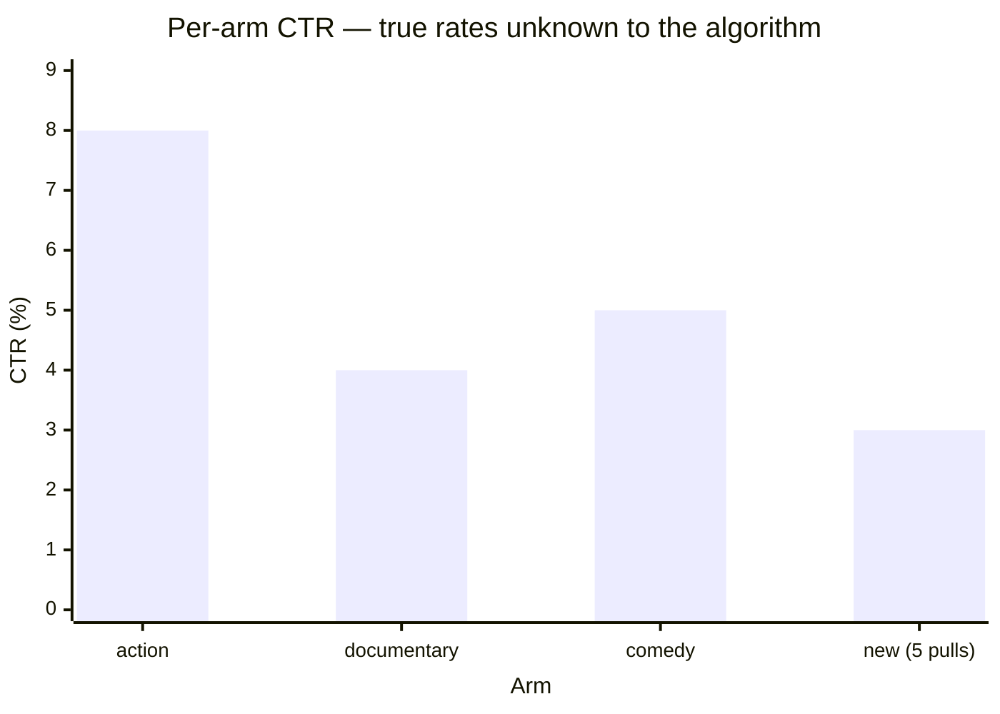
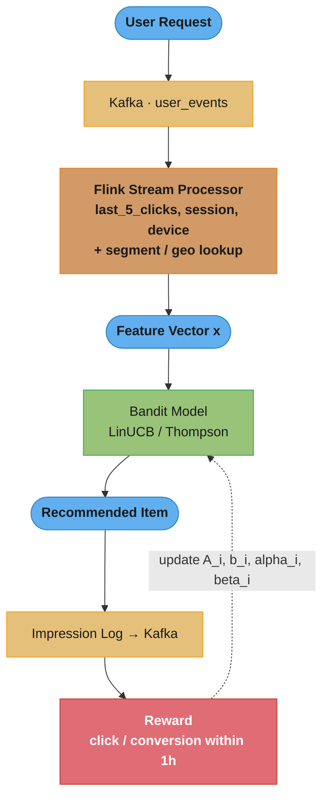
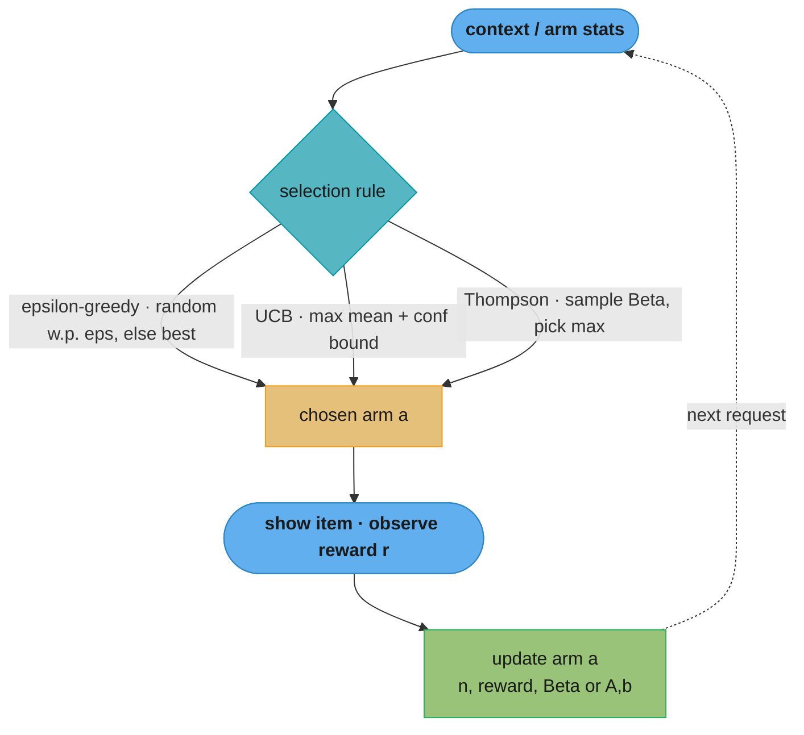
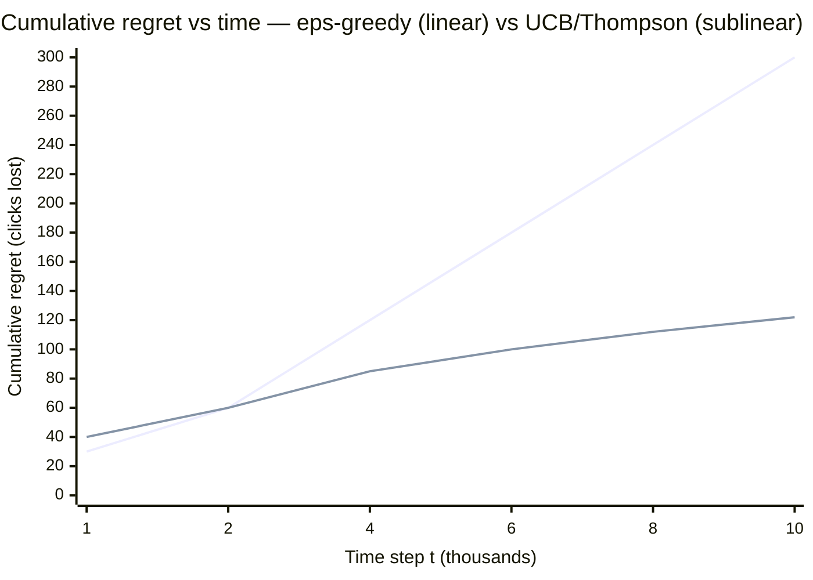

# Online Learning and Bandit Algorithms

## 1. Concept Overview

Bandit algorithms solve the explore-exploit dilemma in real-time recommendation: should the system exploit known good options (show items it believes the user will like) or explore uncertain options (show items where it has little information, potentially discovering something better)? This tradeoff is mathematically formalized as regret minimization — minimizing the cumulative reward lost by not always choosing the optimal action.

In recommendation systems, each "arm" in the multi-armed bandit corresponds to a content item, recommendation strategy, or model variant. The system must balance exploration (trying new items to gather feedback) with exploitation (recommending items known to generate clicks or conversions). Online learning extends bandit algorithms to incorporate contextual features (user demographics, item attributes) and to update model parameters continuously from incoming feedback.

---

## 2. Intuition

One-line analogy: A new restaurant owner has 10 dishes on the menu. They need to figure out which dishes customers love — but they can't ask every customer to order everything. Each service, they must balance serving dishes they know are popular (exploit) with trying new combinations to discover hidden hits (explore).

Mental model for regret: Regret measures how much cumulative reward was lost by not always choosing the best arm. If the best item generates 5% CTR and you showed an unknown item that generated 2% CTR 1000 times, you incurred 30 clicks of regret. Bandit algorithms minimize total regret over the lifetime of the system.

Why epsilon-greedy is not enough: Epsilon-greedy explores uniformly at random — it tries a bad arm as often as a promising one. UCB and Thompson Sampling are smarter: they explore arms with high uncertainty first, quickly ruling out bad options and focusing exploration on competitive alternatives.

Key insight for Thompson Sampling: Instead of a deterministic rule for when to explore, Thompson Sampling maintains a probability distribution over what the true arm rewards might be and samples from that distribution. This naturally balances exploration and exploitation — arms with uncertain rewards have wide distributions that are sometimes sampled high.

---

## 3. Core Principles

**Explore-Exploit Tradeoff**: Exploration gathers information that improves future decisions. Exploitation maximizes immediate reward. Too much exploitation causes regret (missing better options). Too much exploration causes regret (wasting time on suboptimal options). Optimal balance depends on the time horizon.

**Regret**: Cumulative_Regret(T) = T * mu_star - sum_t mu(a_t), where mu_star is the expected reward of the optimal arm and mu(a_t) is the reward of the chosen arm at time t. Good algorithms achieve sublinear regret O(sqrt(K*T)) or O(log(T)).

**UCB (Upper Confidence Bound) Principle**: Select the arm with the highest upper confidence bound — optimism in the face of uncertainty. Arm i: UCB_i = empirical_mean(i) + C * sqrt(log(t) / n_i), where n_i is the number of times arm i was selected and t is total selections. High uncertainty (low n_i) = wide confidence interval = high UCB = more likely to be selected.

**Thompson Sampling**: For each arm, maintain a prior distribution over its reward probability. At each step, sample a reward probability from each arm's posterior, then select the arm with the highest sample. Arms with uncertain estimates have high variance in samples — they are naturally explored. As evidence accumulates, posteriors sharpen and exploitation dominates.

**Contextual Bandits**: The reward depends not just on the arm but also on the context (user features, time of day, device). LinUCB maintains a linear model reward_i(x) = theta_i.T * x + alpha * sqrt(x.T * A_i^-1 * x) where x is the context vector, theta_i is the learned coefficient vector for arm i, and the second term is the uncertainty bound.

**Online Gradient Descent**: Update model parameters incrementally after each new observation, without storing all historical data. Suitable for concept drift — when the optimal recommendation changes over time (trending topics, seasonal preferences).

---

## 4. Types / Architectures / Strategies

### 4.1 Epsilon-Greedy

With probability epsilon: select a random arm (exploration)
With probability 1-epsilon: select the arm with highest empirical mean (exploitation)

Epsilon decay schedule: epsilon_t = epsilon_0 / sqrt(t) (decreasing exploration as confidence grows)
Simplest algorithm; works well when arm rewards are stationary. Poorly adapts to non-stationary reward distributions.

**In plain terms.** "Before every decision, flip a biased coin. On epsilon of the flips, throw away everything you have learned and pick uniformly at random; otherwise take the current leader."

| Symbol | What it is |
|--------|------------|
| `epsilon` | Probability of exploring on any single step. `0.1` = 10% of traffic goes to a random arm |
| `mu_hat_i` | Empirical mean reward of arm `i` — total reward divided by pulls |
| `mu_star` | True mean of the genuinely best arm. Unknown to the algorithm, used only to score it |
| `Delta_i = mu_star - mu_i` | The gap: what each pull of arm `i` costs you versus the best arm |
| `epsilon_0 / sqrt(t)` | Decay schedule — exploration shrinks as evidence accumulates |
| `K` | Number of arms. Exploration is spread uniformly over all `K`, good and bad alike |

**Walk one example.** The five arms from the simulation in Section 6, with true CTRs `[0.08, 0.04, 0.05, 0.02, 0.06]`:

```
  mu_star = 0.08 (arm 1), so the gaps are

    arm     mu_i     Delta_i
     1      0.08      0.00
     2      0.04      0.04
     3      0.05      0.03
     4      0.02      0.06
     5      0.06      0.02
                      ----
            sum = 0.15,  mean Delta = 0.15 / 5 = 0.03

  Once the leader is correct, exploit steps cost ~0 and only the coin costs you:

    regret per step = epsilon x mean Delta = 0.10 x 0.03 = 0.0030 clicks

    T =   10,000 steps  ->    30 clicks of regret
    T =  100,000 steps  ->   300 clicks of regret
    T = 1,000,000 steps -> 3,000 clicks of regret
```

**Why this is the algorithm's fatal flaw.** That per-step cost never decreases. Multiply the horizon by 10 and the regret multiplies by 10 — regret is `O(T)`, linear, forever. Even after a million steps have made arm 1's superiority statistically overwhelming, epsilon-greedy still spends 10% of traffic re-testing arm 4 at its known `0.02` CTR. Lowering epsilon to `0.05` merely halves the toll to 15 clicks per 10,000 steps; it does not change the shape. The `epsilon_0 / sqrt(t)` decay is the minimum fix, and UCB and Thompson Sampling are the principled ones: they shrink exploration *per arm* in proportion to how much is already known about that specific arm.

### 4.2 UCB1 (Upper Confidence Bound)

Select arm i maximizing: mu_hat_i + sqrt(2 * ln(t) / n_i)
No hyperparameter tuning for the exploration term (C = sqrt(2) is theoretically optimal for Bernoulli rewards).
Achieves O(K * log(T)) regret — provably optimal for stationary arms.

**What this actually says.** "Do not judge an arm by the average it has shown. Judge it by the best it could still plausibly be — and an arm you have barely tried could plausibly be excellent."

| Symbol | What it is |
|--------|------------|
| `mu_hat_i` | What arm `i` has actually delivered so far — the exploitation half |
| `n_i` | Pulls of arm `i`. The only thing that shrinks its bonus |
| `t` | Total pulls across all arms. Grows even on steps where arm `i` is not chosen |
| `ln(t)` | Grows without bound but very slowly, so the bonus never dies completely |
| `sqrt(2 ln(t) / n_i)` | The optimism bonus — roughly the width of a confidence interval on `mu_hat_i` |
| `sqrt(...)` shape | Bonus falls as `1 / sqrt(n_i)`: 4x the pulls halves the uncertainty |

**Walk one example.** Two arms from the Section 5.1 chart, and the exact moment the bonus stops carrying the weaker one:

```
  arm 1 (action) : mu_hat = 0.08, n_1 = 40 pulls
  arm 4 (new)    : mu_hat = 0.03, n_4 =  5 pulls
  t = 100 total pulls, ln(100) = 4.6052

  UCB_1 = 0.08 + sqrt(2 x 4.6052 / 40) = 0.08 + 0.4799 = 0.5599
  UCB_4 = 0.03 + sqrt(2 x 4.6052 /  5) = 0.03 + 1.3572 = 1.3872   <- arm 4 wins

  Arm 4 gets pulled, which raises n_4 and t together. Holding the empirical
  means fixed at 0.08 and 0.03, watch the bonus drain away:

      t      n_4     UCB_1      UCB_4     picked
     100       5     0.5599     1.3872       4
     105      10     0.5624     0.9948       4
     115      20     0.5671     0.7188       4
     125      30     0.5713     0.5974       4
     128      33     0.5725     0.5723       1     <- the flip
```

**What the flip is worth.** It took 28 further pulls of arm 4 to settle the question, and those pulls were not waste — they were the price of confirming that a `0.03` estimate from 5 samples was real rather than unlucky. Note the two forces: arm 4's bonus shrinks as `1 / sqrt(n_4)` while arm 1's *grows* as `sqrt(ln t)`, so exploration is never switched off, only starved. That asymmetry — fast shrink per pull, slow universal growth — is exactly what buys `O(K log T)` regret instead of epsilon-greedy's `O(T)`: an arm that has been convincingly beaten gets revisited at a rate that thins out logarithmically rather than at a fixed 10%.

### 4.3 UCB-tuned

Tighter confidence interval using variance estimate: mu_hat_i + sqrt((ln(t) / n_i) * min(1/4, V_i(n_i))), where V_i is the empirical variance of rewards for arm i. Better empirical performance than UCB1 in practice.

### 4.4 Thompson Sampling (Beta-Bernoulli)

For binary rewards (click/no-click): maintain Beta(alpha_i, beta_i) per arm.
After a click on arm i: alpha_i += 1.
After no click on arm i: beta_i += 1.
At each step: sample p_i ~ Beta(alpha_i, beta_i) for each arm; select arm with highest p_i.

Thompson Sampling outperforms epsilon-greedy by 20-30% cumulative reward in first 10K trials in typical recommendation settings.

**The idea behind it.** "Do not hold one number per arm; hold a *belief* per arm. Then let each round be decided by one random draw from every belief, so an arm gets its turn in proportion to the chance it is genuinely best."

| Symbol | What it is |
|--------|------------|
| `alpha_i` | Successes on arm `i`, plus the prior. Literally a click counter |
| `beta_i` | Failures on arm `i`, plus the prior. A no-click counter |
| `Beta(alpha, beta)` | A distribution over the arm's unknown click rate, living on `[0, 1]` |
| `alpha / (alpha + beta)` | Posterior mean — the best point estimate of the arm's CTR |
| `sqrt(ab / ((a+b)^2 (a+b+1)))` | Posterior standard deviation — the width of the belief, i.e. how much is unknown |
| `Beta(1, 1)` | The uninformative prior: uniform on `[0, 1]`, "any CTR is equally plausible" |
| `p_i ~ Beta(...)` | One random draw. Replaces every explicit explore/exploit rule |

**Walk one example.** The four posteriors from the Section 5.2 diagram, with their means and widths made explicit:

```
  posterior         alpha   beta    mean       sd      a + b
  Beta(1, 1)            1      1    0.5000    0.2887        2    prior, knows nothing
  Beta(82, 920)        82    920    0.0818    0.0087    1,002    sharp
  Beta(41, 960)        41    960    0.0410    0.0063    1,001    sharp
  Beta(52, 950)        52    950    0.0519    0.0070    1,002    sharp
  Beta(4, 11)           4     11    0.2667    0.1106       15    wide, barely tested

  Arm 4's sd is 0.1106 / 0.0087 = 12.7x arm 1's, so its draws scatter 12.7x wider:

    arm 1 draws land in  [0.0644, 0.0992]   (mean +/- 2 sd) -- almost always
    arm 4 draws land in  [0.0455, 0.4879]   -- often above arm 1, sometimes far below
```

**Why no exploration parameter is needed.** Exploration falls out of the arithmetic instead of being configured. Every observation adds exactly `1` to `alpha` or `beta`, so `a + b` grows by one per pull and the `(a+b+1)` in the denominator drives the sd down like `1 / sqrt(n)`. An arm that keeps winning draws keeps getting pulled, keeps narrowing, and stops producing surprising samples; an arm that is never pulled keeps its wide belief and stays permanently eligible for a lucky draw. This self-regulation is why Section 14 retires a video arm after 500 pulls: by then the posterior is narrow enough that further draws add nothing, and its posterior mean is a good enough CTR estimate to hand to the offline model. It is also why Pitfall 2 is fatal — adding raw session minutes to `alpha` inflates `a + b` by tens per observation instead of by one, collapsing the sd and killing exploration within days.

### 4.5 LinUCB (Contextual Bandit)

For each arm i, maintain A_i (d x d matrix, initialized to identity) and b_i (d-vector, initialized to zeros).
theta_i = A_i^{-1} b_i (ridge regression estimate of reward model)
UCB score: x.T theta_i + alpha * sqrt(x.T A_i^{-1} x)
After observing reward r: A_i += x x.T; b_i += r x

**What it means.** "Fit a ridge regression per arm from context to reward, then add a bonus that is large in exactly the directions of context space you have not seen much data from."

The step from UCB1 to LinUCB is the step from "how many times have I pulled this arm?" to "how many times have I pulled this arm *for a user like this one*?" — uncertainty becomes directional.

| Symbol | What it is |
|--------|------------|
| `x` | The context vector for this request: user, item, time-of-day features. Dimension `d` |
| `A_i` | Running sum `I + sum(x x.T)` over contexts where arm `i` was played. An unnormalized covariance |
| `b_i` | Running sum `sum(r x)` — contexts weighted by the reward they earned |
| `theta_i = A_i^-1 b_i` | The ridge-regression solution. Identity initialization *is* the ridge penalty |
| `x.T theta_i` | Predicted reward for this arm in this context — the exploit term |
| `sqrt(x.T A_i^-1 x)` | How novel `x` is for this arm. Large in directions with little data, small in well-covered ones |
| `alpha` | Exploration scale on that bonus. Higher = more exploration; tuned, unlike UCB1 |

**Walk one example.** Two orthogonal context directions, `d = 2`, `alpha = 1.0`, arm starting from `A = I` and `b = [0, 0]`:

```
  x1 = [1, 0]      x2 = [0, 1]

  step  event             theta        UCB for x1             UCB for x2
   t0   nothing seen      [0.00, 0]    0.00 + 1.000 = 1.000   0.00 + 1.000 = 1.000
   t1   x1 shown, r = 1   [0.50, 0]    0.50 + 0.707 = 1.207   0.00 + 1.000 = 1.000
   t2   x1 shown, r = 1   [0.67, 0]    0.67 + 0.577 = 1.244   0.00 + 1.000 = 1.000
   t3   x1 shown, r = 0   [0.50, 0]    0.50 + 0.500 = 1.000   0.00 + 1.000 = 1.000

  A after the three x1 updates = [[4, 0], [0, 1]]  -- only the x1 direction grew.

  x1's bonus decayed 1.000 -> 0.707 -> 0.577 -> 0.500
  x2's bonus never moved off 1.000, because no x2 data ever arrived.
```

**Why `A_i` must be a matrix and not a counter.** Three pulls happened, but the arm learned nothing about `x2`-shaped users — and the maths knows it. Replace `A_i` with a scalar pull count and the bonus would have dropped for *every* context after those three pulls, so the arm would look confidently characterized for a population it has never served. Keeping the full `d x d` matrix is what lets one arm be simultaneously well-understood for mobile evening traffic and wide open for desktop morning traffic. The cost is the `O(d^3)` inverse and the numerical fragility described in Pitfall 3 — with `d = 500` and few pulls, `A_i` is barely distinguishable from the identity it started as, which is precisely when the inverse misbehaves.

### 4.6 Neural Bandits (NeuralUCB, NeuralTS)

Replace linear reward model with a neural network. Uncertainty estimated via the last-layer covariance (NTK approximation) or dropout sampling (MC Dropout). Captures non-linear context-reward relationships. Higher accuracy at cost of inference time.

### 4.7 Non-Stationary Bandits

Sliding window UCB: only use rewards from last W interactions per arm.
Discounted UCB: exponentially discount older rewards (weight = gamma^(t - time_of_observation)).
CUSUM change detection: detect abrupt reward distribution shifts; reset arm statistics when change detected.

---

## 5. Architecture Diagrams

### 5.1 Multi-Armed Bandit Reward Distribution



Arm 4's 3% is a lucky estimate from only 5 pulls, so its confidence bound is wide.
At t=100, UCB_4 = 0.03 + sqrt(2·ln(100)/5) = 0.03 + 1.36 = 1.39 versus
UCB_1 = 0.08 + sqrt(2·ln(100)/40) = 0.08 + 0.48 = 0.56 — optimism under uncertainty
makes UCB select arm 4 despite its lower empirical mean, because exploiting arm 1
alone would never reveal whether arm 4 is actually the best.

### 5.2 Thompson Sampling Beta Distributions

```
Time t=0 (prior):
  All arms: Beta(1, 1) = Uniform[0, 1]
  Any arm is equally likely to be best

Time t=1000:
  Arm 1 (action): Beta(82, 920)   <- ~8.2% CTR, narrow distribution
  Arm 2 (doc):    Beta(41, 960)   <- ~4.1% CTR, narrow distribution
  Arm 3 (comedy): Beta(52, 950)   <- ~5.2% CTR, narrow distribution
  Arm 4 (new):    Beta(4, 11)     <- ~27% empirical (lucky, only 15 trials), wide

  Sample from each:
    sample_1 = 0.079  (from Beta(82, 920), concentrated near 0.08)
    sample_2 = 0.038  (from Beta(41, 960), concentrated near 0.04)
    sample_3 = 0.055
    sample_4 = 0.21   (from wide Beta(4,11), sometimes samples high)

  Select arm 4 -- exploration driven by wide posterior
```

### 5.3 LinUCB Architecture

```
Context x = [user_age, user_country_embed, item_category_embed, time_of_day]
             (d-dimensional feature vector)

For each arm i:
  theta_i = A_i^{-1} b_i   (d-vector: learned linear reward model)
  p_i = x.T theta_i         (predicted reward)
  uncertainty_i = alpha * sqrt(x.T A_i^{-1} x)   (context-dependent exploration bonus)
  UCB_i = p_i + uncertainty_i

Select arm with max UCB_i
Observe reward r
Update: A_i += x x.T   b_i += r x

Note: A_i^{-1} must be computed at each step
  For d=50, this is a 50x50 matrix inversion: O(d^3) = trivial
  For d=500, consider Sherman-Morrison update for incremental inverse
```

### 5.4 Real-Time Feature Pipeline



The dotted edge closes the online-learning loop: every impression is logged, its
reward attributed within a 1-hour window, and the arm statistics updated so the next
request reflects the newest evidence — no offline retraining cycle.

### 5.5 Explore-Exploit Loop — Three Selection Rules



All three algorithms share the same select-observe-update loop; they differ only in
the selection rule. Epsilon-greedy explores uniformly at random, UCB explores by
optimism (mean plus a confidence bonus), and Thompson explores by sampling each arm's
posterior — the last two focus exploration on genuinely uncertain arms.

### 5.6 Regret Growth — Linear vs Sublinear



The upper line is fixed-epsilon exploration: it keeps sampling bad arms at a constant
rate, so regret grows linearly, O(T). The lower line is UCB / Thompson Sampling, which
concentrate exploration on uncertain arms and achieve O(K log T) regret — the curve
flattens once the optimal arm is confidently identified.

**What the formula is telling you.** "Linear regret means you keep paying the same toll on every single request, forever. Logarithmic regret means the toll per request shrinks toward zero."

| Symbol | What it is |
|--------|------------|
| `Cumulative_Regret(T) = T mu_star - sum mu(a_t)` | Clicks the optimal policy would have earned, minus what you earned |
| `T` | Time horizon — total requests served |
| `mu_star` | Mean reward of the best arm. The ceiling you are measured against |
| `O(T)` | Regret proportional to the horizon: 10x the traffic, 10x the loss |
| `O(K log T)` | Regret proportional to the *logarithm*: 10x the traffic adds a fixed constant |
| `K` | Arm count. It multiplies the log term — which is why bandits break at 10,000 arms |

**Walk one example.** The same five arms (mean gap `0.03`) at `epsilon = 0.1`, so fixed-epsilon regret is exactly `0.003` per step, against the *shape* of `K ln T` at `K = 5`:

```
       T        fixed-epsilon regret      shape of K x ln T
       1,000              3.0                     34.5
      10,000             30.0                     46.1
     100,000            300.0                     57.6
   1,000,000          3,000.0                     69.1

  Multiply T by 10  ->  linear regret multiplies by 10
                    ->  the log term only adds 5 x ln(10) = 11.5
```

**Read the crossover, not just the asymptotics.** Below roughly `T = 16,000` the constant factors make the log curve the *larger* number — UCB genuinely looks worse than epsilon-greedy early on, because it insists on pulling every arm at least once and then keeps probing the near-contenders. Past that point the curves cross and never meet again: at `T = 1,000,000` the linear policy has thrown away 3,000 clicks while the logarithmic one has effectively stopped paying. This is the whole argument for bandits over a fixed exploration rate, and it is also the honest caveat — on a short campaign that ends at `T = 5,000`, the asymptotic advantage never arrives.

---

## 6. How It Works — Detailed Mechanics

```python
from __future__ import annotations

import numpy as np
from dataclasses import dataclass, field
from typing import Optional
import time


# ─────────────────────────────────────────────────────────────────────────────
# Multi-Armed Bandit Algorithms
# ─────────────────────────────────────────────────────────────────────────────

@dataclass
class BanditArm:
    arm_id: int
    n_pulls: int = 0
    total_reward: float = 0.0

    @property
    def mean_reward(self) -> float:
        return self.total_reward / self.n_pulls if self.n_pulls > 0 else 0.0


class EpsilonGreedy:
    """Epsilon-greedy bandit with optional epsilon decay."""

    def __init__(
        self,
        n_arms: int,
        epsilon: float = 0.1,
        decay: bool = True,
        decay_rate: float = 0.99,
    ) -> None:
        self.arms = [BanditArm(i) for i in range(n_arms)]
        self.epsilon = epsilon
        self.decay = decay
        self.decay_rate = decay_rate
        self.t = 0

    def select(self) -> int:
        """Select arm via epsilon-greedy policy."""
        self.t += 1
        current_epsilon = self.epsilon * (self.decay_rate ** self.t) if self.decay else self.epsilon
        if np.random.random() < current_epsilon:
            return int(np.random.randint(len(self.arms)))   # explore
        return int(np.argmax([arm.mean_reward for arm in self.arms]))   # exploit

    def update(self, arm_id: int, reward: float) -> None:
        self.arms[arm_id].n_pulls += 1
        self.arms[arm_id].total_reward += reward


class UCB1:
    """UCB1 algorithm: achieves O(K log T) regret for stationary arms.

    UCB_i = mean_i + sqrt(2 * ln(t) / n_i)
    Selects arm with highest upper confidence bound.
    """

    def __init__(self, n_arms: int) -> None:
        self.arms = [BanditArm(i) for i in range(n_arms)]
        self.t = 0

    def select(self) -> int:
        self.t += 1
        # Pull each arm once first (initialization)
        for arm in self.arms:
            if arm.n_pulls == 0:
                return arm.arm_id

        ucb_values = [
            arm.mean_reward + np.sqrt(2 * np.log(self.t) / arm.n_pulls)
            for arm in self.arms
        ]
        return int(np.argmax(ucb_values))

    def update(self, arm_id: int, reward: float) -> None:
        self.arms[arm_id].n_pulls += 1
        self.arms[arm_id].total_reward += reward

    def regret(self, true_mean_rewards: list[float]) -> float:
        """Compute cumulative regret given true arm means."""
        optimal = max(true_mean_rewards)
        total_reward = sum(arm.total_reward for arm in self.arms)
        total_pulls = sum(arm.n_pulls for arm in self.arms)
        return optimal * total_pulls - total_reward


class ThompsonSampling:
    """Thompson Sampling for binary (Bernoulli) rewards.

    Maintains Beta(alpha, beta) posterior per arm.
    Prior: Beta(1, 1) = Uniform (no prior knowledge).
    Update: click -> alpha += 1; no click -> beta += 1.

    In practice outperforms epsilon-greedy by 20-30% in first 10K trials.
    """

    def __init__(self, n_arms: int, alpha_prior: float = 1.0, beta_prior: float = 1.0) -> None:
        self.alphas = np.full(n_arms, alpha_prior, dtype=np.float64)
        self.betas = np.full(n_arms, beta_prior, dtype=np.float64)
        self.n_arms = n_arms

    def select(self) -> int:
        """Sample from each arm's Beta posterior and select the arm with highest sample."""
        samples = np.random.beta(self.alphas, self.betas)
        return int(np.argmax(samples))

    def update(self, arm_id: int, reward: float) -> None:
        """reward is 1 (click) or 0 (no click)."""
        if reward > 0:
            self.alphas[arm_id] += 1
        else:
            self.betas[arm_id] += 1

    def expected_reward(self, arm_id: int) -> float:
        """Posterior mean: E[Beta(alpha, beta)] = alpha / (alpha + beta)."""
        return self.alphas[arm_id] / (self.alphas[arm_id] + self.betas[arm_id])

    def recommend_top_k(self, k: int) -> list[int]:
        """Recommend top-K arms by posterior mean (for exploitation)."""
        means = self.alphas / (self.alphas + self.betas)
        top_k = np.argpartition(means, -k)[-k:]
        return sorted(top_k.tolist(), key=lambda i: -means[i])


# ─────────────────────────────────────────────────────────────────────────────
# LinUCB: Contextual Bandit
# ─────────────────────────────────────────────────────────────────────────────

class LinUCB:
    """Linear UCB contextual bandit (Disjoint model — separate theta per arm).

    Reference: Li et al., "A Contextual-Bandit Approach to Personalized News
    Article Recommendation" (Yahoo!, 2010).

    Reward model: r_i(x) = theta_i.T x  (linear in context)
    Exploration bonus: alpha * sqrt(x.T A_i^{-1} x)  (context-dependent uncertainty)
    """

    def __init__(
        self,
        n_arms: int,
        context_dim: int,
        alpha: float = 1.0,   # exploration parameter; higher = more exploration
    ) -> None:
        self.n_arms = n_arms
        self.context_dim = context_dim
        self.alpha = alpha

        # Per-arm parameters
        self.A = [np.eye(context_dim) for _ in range(n_arms)]   # (d x d) matrices
        self.b = [np.zeros(context_dim) for _ in range(n_arms)] # (d,) vectors

    def select(self, context: np.ndarray) -> int:
        """Select arm with highest UCB score given context vector."""
        assert context.shape == (self.context_dim,)
        ucb_scores = np.zeros(self.n_arms)

        for i in range(self.n_arms):
            A_inv = np.linalg.inv(self.A[i])
            theta_i = A_inv @ self.b[i]             # estimated reward coefficients
            pred_reward = theta_i @ context          # expected reward
            # Uncertainty: wider when context is novel (not well-covered by past data)
            uncertainty = self.alpha * np.sqrt(context @ A_inv @ context)
            ucb_scores[i] = pred_reward + uncertainty

        return int(np.argmax(ucb_scores))

    def update(self, arm_id: int, context: np.ndarray, reward: float) -> None:
        """Update arm parameters with observed (context, reward) pair."""
        self.A[arm_id] += np.outer(context, context)   # Sherman-Morrison for efficiency
        self.b[arm_id] += reward * context

    def get_theta(self, arm_id: int) -> np.ndarray:
        """Get current reward model coefficients for arm (interpretable)."""
        return np.linalg.inv(self.A[arm_id]) @ self.b[arm_id]


# ─────────────────────────────────────────────────────────────────────────────
# Online Gradient Descent with Concept Drift Handling
# ─────────────────────────────────────────────────────────────────────────────

class OnlineLRRecommender:
    """Online logistic regression for click prediction with concept drift handling.

    Updates model weights after each (user, item, context, click) observation.
    Uses FTRL (Follow-The-Regularized-Leader) as the optimizer — better than
    vanilla SGD for sparse online recommendation features.
    """

    def __init__(
        self,
        n_features: int,
        learning_rate: float = 0.01,
        l2_reg: float = 0.001,
        drift_window: int = 10_000,   # number of recent examples to track
    ) -> None:
        self.weights = np.zeros(n_features)
        self.lr = learning_rate
        self.l2 = l2_reg
        self.n_features = n_features
        self.t = 0
        self.recent_losses: list[float] = []
        self.drift_window = drift_window
        self.loss_threshold_multiplier = 1.5   # alert if loss 50% above baseline

    def _sigmoid(self, x: float) -> float:
        return 1.0 / (1.0 + np.exp(-x))

    def predict(self, features: np.ndarray) -> float:
        """Predict click probability."""
        return self._sigmoid(float(features @ self.weights))

    def update(self, features: np.ndarray, label: float) -> float:
        """SGD update. Returns prediction loss for drift monitoring."""
        pred = self.predict(features)
        loss = -label * np.log(pred + 1e-9) - (1 - label) * np.log(1 - pred + 1e-9)

        # Gradient of binary cross-entropy + L2 regularization
        gradient = (pred - label) * features + self.l2 * self.weights
        self.weights -= self.lr * gradient

        self.t += 1
        self.recent_losses.append(loss)
        if len(self.recent_losses) > self.drift_window:
            self.recent_losses.pop(0)

        return float(loss)

    def detect_drift(self) -> bool:
        """Detect concept drift by monitoring recent loss trend.

        If recent loss significantly exceeds baseline, concept drift may have occurred.
        Simple approach: compare first half vs second half of window.
        """
        if len(self.recent_losses) < self.drift_window:
            return False
        half = self.drift_window // 2
        first_half_loss = np.mean(self.recent_losses[:half])
        second_half_loss = np.mean(self.recent_losses[half:])
        return bool(second_half_loss > first_half_loss * self.loss_threshold_multiplier)

    def reset_weights(self) -> None:
        """Reset weights on drift detection — restart learning."""
        self.weights = np.zeros(self.n_features)
        self.recent_losses.clear()


# ─────────────────────────────────────────────────────────────────────────────
# Simulation: Compare Algorithms on Stationary Bernoulli Arms
# ─────────────────────────────────────────────────────────────────────────────

def simulate_bandits(
    true_ctrs: list[float],       # true click rates per arm
    n_steps: int = 10_000,
    seed: int = 42,
) -> dict[str, float]:
    """Simulate and compare epsilon-greedy, UCB1, and Thompson Sampling.

    Returns cumulative reward per algorithm after n_steps.
    Thompson Sampling typically achieves highest cumulative reward in first 10K trials.
    """
    np.random.seed(seed)
    n_arms = len(true_ctrs)
    algorithms = {
        "epsilon_greedy": EpsilonGreedy(n_arms, epsilon=0.1),
        "ucb1": UCB1(n_arms),
        "thompson": ThompsonSampling(n_arms),
    }
    cumulative_rewards: dict[str, float] = {name: 0.0 for name in algorithms}

    for step in range(n_steps):
        for name, algo in algorithms.items():
            arm = algo.select()
            # Stochastic reward: Bernoulli(true_ctr)
            reward = float(np.random.random() < true_ctrs[arm])
            algo.update(arm, reward)
            cumulative_rewards[name] += reward

    optimal_total = max(true_ctrs) * n_steps
    print(f"Optimal (always best arm): {optimal_total:.0f} clicks")
    for name, reward in cumulative_rewards.items():
        regret = optimal_total - reward
        print(f"{name}: {reward:.0f} clicks, regret: {regret:.0f} ({100*regret/optimal_total:.1f}%)")

    return cumulative_rewards


if __name__ == "__main__":
    # Example: 5 content items with different true CTRs
    true_ctrs = [0.08, 0.04, 0.05, 0.02, 0.06]
    results = simulate_bandits(true_ctrs, n_steps=10_000)
    # Expected: Thompson Sampling achieves 20-30% less regret than epsilon-greedy
```

---

## 7. Real-World Examples

**Google News PersonalizedNews (LinUCB, 2010)**: Yahoo! published the landmark contextual bandit paper using LinUCB for personalized news article recommendation. Each article is an "arm"; each user's request provides a feature context (user interests, demographics). LinUCB showed 12.5% improvement in CTR over a random policy and outperformed baseline CF in online evaluation on Yahoo! Front Page dataset. This was one of the first published deployments of contextual bandits at scale.

**Twitter (Thompson Sampling for Timeline Ranking)**: Twitter uses Thompson Sampling variants to explore new tweet ranking features. When a new ranking signal is A/B tested, Thompson Sampling allocates more traffic to the winning variant faster than a fixed A/B split, reducing the time to confident decision from weeks to days. Thompson Sampling outperforms epsilon-greedy by 20-30% in cumulative engagement in the first 10K impressions per user segment.

**Spotify Explore/Exploit for Playlist Recommendations**: Spotify's "Daily Mix" playlists use an explore-exploit strategy: ~85% of tracks are from confirmed favorites (exploitation), ~15% are from artists or genres the user has not explored but which are musically adjacent (exploration). The exploration fraction is tuned per user — users with narrower listening history get more exploration to prevent filter bubbles.

**Netflix Artwork Selection (Bandit)**: Netflix tests different thumbnail artworks for each title (action scenes vs. face close-ups vs. title text). Thompson Sampling is used to identify the winning artwork per user segment without requiring a full A/B test. Netflix reported 20-25% higher play rate for A/B-tested artworks over default selections, with Thompson Sampling converging to the best artwork 3x faster than a standard A/B test.

**Amazon Product Ranking (Contextual Bandit)**: Amazon uses contextual bandits for search result ranking experiments. Each position in search results is an "arm"; the context includes query, user segment, and session features. The bandit learns which result orderings maximize add-to-cart rate for different query-user combinations without requiring exhaustive A/B testing of all orderings.

---

## 8. Tradeoffs

| Algorithm | Regret Bound | Hyperparameters | Non-Stationary | Contextual | Complexity |
|-----------|-------------|-----------------|----------------|------------|------------|
| Epsilon-Greedy | O(K * T) | epsilon, decay | Poor | No | O(K) |
| UCB1 | O(K * log T) | None | Poor | No | O(K) |
| UCB-Tuned | O(K * log T) | None | Poor | No | O(K) |
| Thompson Sampling | O(K * log T) expected | Prior (alpha, beta) | Medium | No | O(K) |
| LinUCB | O(d * sqrt(T)) | alpha | Poor | Yes | O(K * d^2) |
| NeuralUCB | Unknown (heuristic) | alpha, LR | Medium | Yes | O(K * NN) |
| Sliding Window UCB | - | W (window) | Good | No | O(K) |

| Algorithm | Practical CTR Improvement over Random (first 10K trials) |
|-----------|--------------------------------------------------------|
| Epsilon-greedy (eps=0.1) | ~40% |
| UCB1 | ~50% |
| Thompson Sampling | ~60-70% |
| LinUCB (with features) | ~70-80% |

Thompson Sampling achieves 20-30% better cumulative reward vs epsilon-greedy in first 10K trials; UCB1 achieves O(sqrt(K*T*log(T))) regret — within a log factor of the theoretical optimum.

---

## 9. When to Use / When NOT to Use

**Use epsilon-greedy when:**
- Team is new to bandits; need simplest possible baseline
- Number of arms is small (<100)
- Stationary reward distribution (item CTRs stable over time)
- Fast prototyping; epsilon can be hard-coded

**Use UCB1 when:**
- Stationary rewards, no contextual features
- Need theoretical guarantees (O(K log T) regret bound)
- No tuning budget — UCB1 has no free hyperparameters

**Use Thompson Sampling when:**
- Binary rewards (click/no-click, convert/not-convert)
- Non-stationary rewards (use discounted Thompson Sampling)
- A/B testing acceleration — TS converges faster than fixed splits
- Multiple arms in parallel (arms can be sampled and compared simultaneously)

**Use LinUCB when:**
- You have rich context features (user demographics, item attributes)
- Reward model is plausibly linear in context features
- Arms are many but context discriminates well between good/bad arms per user

**Use NeuralUCB / Neural contextual bandits when:**
- Context-reward relationship is complex and non-linear
- Training data is abundant (>100K observations)
- You accept higher inference latency

**Do NOT use bandit algorithms as the primary recommendation model when:**
- Catalog has millions of items — bandit "arms" must be tractable (use bandits for policy/layout decisions, not item selection at full catalog scale)
- Reward is delayed (purchase happening 7 days after recommendation — standard UCB assumes immediate feedback)
- User segments are very large and heterogeneous — disjoint LinUCB becomes unwieldy; use a shared-parameter variant or neural bandit

---

## 10. Common Pitfalls

**Pitfall 1 — Not separating exploration traffic from training data**: A team used the same click logs for both bandit reward updates and offline model training. The bandit had explored bad arms frequently (by design) — the offline model was trained on those low-quality impressions and learned to score bad arms higher. Fix: tag exploration impressions with an "exploration" flag; exclude them from offline batch model training; use only exploitation impressions or apply IPW to reweight exploration impressions.

**Put simply.** "Divide every logged reward by the chance the logging policy had of showing that item, so a rare exploration impression counts for as much as the common exploited ones it was drowned out by."

| Symbol | What it is |
|--------|------------|
| `pi_0(a \| x)` | The logging (behaviour) policy — the probability the live bandit actually had of choosing arm `a` |
| `p_t` | That probability for the specific impression at time `t`. Must be logged at serve time; it cannot be recovered later |
| `r_t` | The observed reward for the arm that was actually shown. Rewards for unshown arms do not exist |
| `1 / p_t` | The importance weight. A 10%-probability impression stands in for 10 impressions |
| `1[a_t = a]` | Indicator: 1 if the target policy would have picked what was logged, 0 otherwise |
| `V_hat = (1/N) sum 1[...] r_t / p_t` | The IPS estimate of a policy you never ran |

**Walk one example.** 10,000 logged impressions from a bandit that showed arm A on 70% of requests and arms B, C, D on 10% each:

```
   arm    shown    clicks   on-policy CTR   p_t     weight 1/p_t
    A     7,000       420       0.060       0.70        1.43
    B     1,000        60       0.060       0.10       10.00
    C     1,000        30       0.030       0.10       10.00
    D     1,000        20       0.020       0.10       10.00

  Naive pooled CTR over the whole log = 530 / 10,000 = 0.053
    -> a blend of four policies; answers no question anyone asked.

  Naive "B's share of the log"        =  60 / 10,000 = 0.006
    -> makes a 6% arm look like a 0.6% arm, purely because it was shown less.

  IPS value of the always-B policy:
    V_hat(B) = (1/N) x sum over logs of 1[a_t = B] x r_t / p_t
             = (60 x 10.00) / 10,000
             = 0.060                <- recovers B's true 6% CTR

  Same computation for always-D: (20 x 10.00) / 10,000 = 0.020.
```

**Why the estimator is fragile.** The `1 / p_t` weight is unbounded, so an impression logged at `p_t = 0.001` gets weight 1,000 and a single lucky click on it can swing the whole estimate. Variance grows as the target policy diverges from the logging policy — evaluate a policy that would pick arms the bandit almost never showed and the estimate becomes noise wearing a decimal point. The standard mitigations are weight clipping (cap `1 / p_t` at, say, 10), self-normalized IPS (divide by the sum of weights rather than by `N`), and doubly-robust estimators that add a reward model to absorb the variance. All of them depend on one operational discipline: **log `p_t` at serve time on every impression**, because no amount of later analysis can reconstruct the probability the model had at the moment it chose.

**Pitfall 2 — Thompson Sampling with non-Bernoulli rewards**: A team applied Beta(alpha, beta) Thompson Sampling to continuous rewards (session time in minutes, range 0-120). Adding raw session time to alpha as if it were binary click counts caused alpha to grow to millions within days, making the Beta distribution extremely narrow and eliminating all exploration. Fix: for continuous rewards, use Gaussian Thompson Sampling (maintain mean and variance estimates) or truncate/discretize rewards to binary (session > 60 seconds = success).

**Pitfall 3 — LinUCB matrix inversion instability**: With context_dim = 500 and identity initialization, after only 100 observations the A matrix is nearly singular for features that are rarely observed (arms with < 5 pulls). np.linalg.solve returned NaN, crashing the recommendation service. Fix: (1) use the Sherman-Morrison rank-1 update formula for efficient and stable incremental matrix inverse; (2) add a regularization constant lambda to the diagonal (A = lambda * I + sum x_t x_t.T); (3) use scipy.linalg.solve which is numerically more stable than explicit inversion.

**Pitfall 4 — Epsilon too high for a large action space**: epsilon=0.1 with 10,000 item "arms" means 10% of traffic explores uniformly over 10,000 items — each item receives exploration with probability 0.1/10,000 = 0.00001. An arm needs ~10K exploration pulls to get a reliable CTR estimate; at this rate, a new item receives meaningful exploration once every 5 million requests. Effectively, no useful exploration happens. Fix: bandits work for tens to hundreds of arms, not thousands. Use bandits for high-level decisions (which recommendation strategy to use, which layout, which model variant) — not individual item selection across a large catalog.

**Pitfall 5 — Ignoring delayed rewards in UCB update**: A recommendation was logged at t=100; the purchase (reward) happened at t=500. The UCB algorithm updated the arm at t=100 with reward=0 (no immediate click) and never received the purchase signal at t=500. Result: arms that drive conversions were systematically undervalued. Fix: implement delayed reward attribution — track all pending (arm, timestamp) pairs; when a reward arrives with attribution window up to W minutes, update all arms within that window. Use a reward buffer with TTL = attribution_window.

---

## 11. Technologies & Tools

| Tool | Use Case |
|------|----------|
| Vowpal Wabbit | Production-scale contextual bandits; supports LinUCB, CB Explore |
| Python `mab` library | Multi-armed bandit research implementations |
| Ax (Meta) | Bandit-powered A/B testing and Bayesian optimization |
| Ray RLlib | Reinforcement learning including contextual bandits |
| Apache Kafka | Real-time reward event streaming for online updates |
| Redis | Per-arm statistics storage (alpha, beta, A, b) with fast reads |
| Flink | Stream processing for real-time feature computation |
| MLflow | Track bandit experiment configurations and reward metrics |
| StatsD / Prometheus | Monitor arm selection rates, exploration fraction, regret |

---

## 12. Interview Questions with Answers

**Q: What is the explore-exploit tradeoff in recommendation systems?**
Exploitation means recommending items the system is confident the user will like — maximizing immediate reward. Exploration means trying items the system is uncertain about — gathering information that may improve future decisions. Pure exploitation risks missing better items (e.g., a new item that would become the user's favorite). Pure exploration produces poor recommendations (showing random items). Bandit algorithms (epsilon-greedy, UCB, Thompson Sampling) formalize this tradeoff as regret minimization: minimize cumulative reward lost by not always choosing the optimal item. In practice, 5-15% exploration budget typically balances discovery with user experience quality.

**Q: Explain UCB1 and why it achieves better regret than epsilon-greedy.**
UCB1 selects the arm maximizing: empirical_mean(i) + sqrt(2 * ln(t) / n_i). The second term is an upper confidence bound — it decreases as arm i is pulled more (n_i grows) and increases as total time grows (ln(t)). UCB1 explores arms proportionally to their uncertainty, not uniformly at random. Epsilon-greedy explores all arms with equal probability — wasting exploration budget on arms already proven to be bad. UCB1 achieves O(K * log(T)) cumulative regret (proven optimal up to constant), while epsilon-greedy achieves O(K * sqrt(T)) in the worst case. Practically: UCB1 identifies the optimal arm faster and spends less time exploring bad arms.

**Q: How does Thompson Sampling work for binary reward recommendation?**
For each arm (item), Thompson Sampling maintains a Beta(alpha, beta) distribution where alpha = 1 + total clicks and beta = 1 + total non-clicks (initialized to Beta(1,1) = uniform prior). At each step: sample a value p_i from each arm's Beta distribution; recommend the arm with the highest sample. If a Beta distribution is wide (arm has few observations), it sometimes samples very high values — leading to exploration. If narrow (many observations), it samples near the true mean — leading to exploitation. The sampling is stochastic, so the model naturally balances exploration and exploitation without explicit epsilon or confidence bound computation. Thompson Sampling outperforms epsilon-greedy by 20-30% cumulative reward in first 10K trials and is provably optimal in expected regret.

**Q: What is a contextual bandit and how does LinUCB work?**
A contextual bandit extends the standard bandit by conditioning arm selection on a context vector x (user features, item features, session context). LinUCB assumes reward is linear in context: r_i(x) = theta_i.T x. For each arm i, LinUCB maintains a ridge regression model (A_i, b_i) and selects the arm maximizing: x.T theta_i + alpha * sqrt(x.T A_i^{-1} x). The first term is the predicted reward; the second is an exploration bonus that is large when x is in a direction not well-covered by past observations (A_i^{-1} is large in unexplored directions). After observing reward r, update: A_i += x x.T; b_i += r x. LinUCB achieves O(d * sqrt(T)) regret where d is the context dimension.

**Q: How would you handle non-stationary rewards in a bandit algorithm?**
Non-stationary rewards occur when the true click rate changes over time (trending topics, seasonal effects, user preference drift). Standard UCB1 and Thompson Sampling assume stationary rewards — old observations from very different distributions contaminate the current estimate. Solutions: (1) Sliding window UCB — only use the last W interactions per arm (recent observations only); (2) Discounted UCB — exponentially discount older rewards: weighted mean with discount factor gamma^(age_of_observation); (3) Discounted Thompson Sampling — maintain decaying alpha, beta counts: alpha_t = gamma * alpha_{t-1} + click; beta_t = gamma * beta_{t-1} + (1 - click); (4) CUSUM/Bayesian change detection — detect abrupt distributional shifts and reset arm statistics on detection.

**Q: Why is epsilon-greedy inefficient for large action spaces?**
Epsilon-greedy explores uniformly at random across all arms. With 10,000 arms and epsilon=0.1, each arm is explored with probability 0.1/10,000 = 0.00001 per step. An arm with 2% true CTR requires ~1000 pulls for a reliable estimate; at 0.00001 pulls/step, reliable estimation takes 100 million steps — impractical. UCB and Thompson Sampling focus exploration on uncertain arms, spending more pulls on competitive alternatives. For large action spaces, the correct architecture is: use a small number of bandit arms representing high-level decisions (which recommendation policy to use, which model to serve), not individual items. Item-level exploration is handled by other mechanisms (cold-start fraction, random injection).

**Q: What is regret and how do you compute it?**
Regret is the cumulative reward lost by not always choosing the optimal arm: Regret(T) = T * mu* - sum_{t=1}^{T} r(a_t), where mu* is the expected reward of the best arm and r(a_t) is the reward received at step t. In recommendation, mu* = best item's CTR. Example: if the best item has 8% CTR and your algorithm achieved 6.5% average CTR over 100,000 impressions, regret = (0.08 - 0.065) * 100,000 = 1,500 missed clicks. In practice, you compute regret in simulation (where true rewards are known) or approximate it in production using the observed best arm as a proxy for the optimum.

**Q: What is the difference between MAB (multi-armed bandit) and full reinforcement learning for recommendation?**
Multi-armed bandit is a special case of RL where: (1) there is no state — the next decision does not depend on the current action (actions are i.i.d.); (2) reward is immediate; (3) the goal is to maximize cumulative reward over a single-state MDP. Full RL for recommendation models state (e.g., user's interaction history shapes future preferences) and sequential decision-making (showing item A now changes what items are good to show next). RL approaches (DQN, PPO for recommendations) are used when: the recommendation sequence matters (watching 3 mystery films makes a 4th mystery film boring, not interesting), long-term engagement is the target (30-day retention, not single-click), or exploration has multi-step effects. Bandit approaches are used for simpler A/B-test-like decisions where actions are independent.

**Q: How does Thompson Sampling accelerate A/B testing compared to fixed-ratio splits?**
Traditional A/B testing allocates traffic 50/50 between control and treatment throughout the test, even after evidence for a winner accumulates. Thompson Sampling dynamically adjusts allocation: as the winning variant's Beta distribution shifts toward higher values, it is sampled more often. Traffic automatically concentrates on the winner while maintaining some exploration in the loser (to confirm it is indeed worse). Benefits: (1) lower regret during the test — fewer users see the inferior variant; (2) faster time-to-decision — confidence accumulates non-uniformly toward the better variant; (3) natural stopping criterion — test concludes when one variant's posterior mean probability of winning exceeds 95%. Netflix reported 3x faster artwork test convergence with TS vs. fixed A/B splits.

**Q: What happens when you use a bandit to select between multiple recommendation models in an online system?**
This is a model selection bandit — each arm is a recommendation model (e.g., ALS, two-tower, popularity baseline). At each user request, the bandit selects which model to serve. Reward: click, purchase, or engagement. This is a contextual bandit — the context (user features) determines which model is likely best for this user. Implementation: LinUCB or Thompson Sampling at the model selection layer; each selected model then runs its own recommendation logic. The bandit learns: "for cold-start users (few interactions), use the content-based model; for warm users, use the two-tower model." This is more adaptive than static A/B test splits and requires less traffic to converge on the best model per user segment.

**Q: How would you design an online learning pipeline for a news recommendation bandit?**
Architecture: (1) Kafka topic receives user events (clicks, dwell time, skips) with article ID; (2) Flink stream processor computes context features per event (user segment, session features, article freshness) and looks up article features; (3) Bandit model (LinUCB or Thompson Sampling stored in Redis): reads arm statistics (A_i, b_i) on each recommendation request, selects arm, writes updated statistics after reward observed; (4) Reward attribution: pair each impression with reward within a 1-hour attribution window; (5) Drift detection: monitor average reward per hour; if reward drops >20%, reset arm statistics (concept drift — trending topics change fast). Key challenge: Redis must handle arm statistic reads/writes at peak QPS (tens of thousands/second) — use pipelining and batch updates (update every N events, not every event).

**Q: Explain the UCB1 regret bound O(K log T) and its practical implications.**
UCB1 achieves cumulative regret of at most 8 * sum_{i: mu_i < mu*} (ln(T) / delta_i) + constant, where delta_i = mu* - mu_i (gap between arm i and optimal arm). Arms far from optimal (large delta_i) contribute little to regret because they are quickly ruled out. Arms close to optimal (small delta_i) are explored more (smaller delta_i = harder to distinguish from optimal). Practical implication: if you have 10 items and the best has 8% CTR while the second-best has 7.9% CTR (delta = 0.001), UCB1 needs ~ln(T)/0.001^2 = ~5M pulls to confidently distinguish them — this is the "bandit's hardest case." For large catalogs with many near-optimal items, consider a contextual bandit or batch A/B testing as a complement.

**Q: How does a sliding window bandit handle concept drift and what are its limitations?**
A sliding window bandit maintains arm statistics only for the last W interactions per arm — old observations outside the window are discarded. When the reward distribution changes (a news topic becomes irrelevant, a seasonal item becomes popular), the stale statistics are quickly replaced by current data. W controls the adaptability-stability tradeoff: small W = fast adaptation but high variance estimates (needs many pulls); large W = stable estimates but slow adaptation to drift. Limitation: the sliding window is oblivious to gradual vs. abrupt drift. An exponential discount (Discounted UCB) is smoother — every observation is retained but with exponentially decreasing weight. Both methods require retuning W or gamma when the rate of drift changes. CUSUM change detection is preferred for abrupt concept drift (trending topics, external events).

**Q: Describe Thompson Sampling's behavior at initialization vs. convergence.**
At initialization, all arms have Beta(1, 1) — uniform distribution over [0, 1]. Samples from each arm are uniformly distributed, so arm selection is near-uniform random (exploration phase). After 100 observations per arm, posteriors have narrowed considerably. After 10K+ observations, posteriors are tight around true CTR values. At convergence, the arm with the highest true CTR has its sample consistently drawn near its mean (e.g., 0.08 for an 8% CTR arm), while lower-CTR arms sample near their means (0.04, 0.05). The best arm is selected almost always. Exploration effectively ceases. This graceful transition from exploration to exploitation — driven by data rather than a decaying epsilon schedule — is Thompson Sampling's key advantage. Practical note: in non-stationary settings, use discounted posteriors (alpha_t = gamma * alpha_{t-1} + click) to prevent convergence to stale distributions.

**Q: How would you monitor a bandit algorithm in production?**
Key metrics to monitor: (1) arm selection rate — which arms are selected at what frequency; if one arm dominates (>90% of selections) too early, the algorithm may be over-exploiting; (2) exploration rate — fraction of requests where the selected arm is not the current greedy choice; should be 5-20% early, decreasing over time; (3) cumulative reward rate — rolling 1-hour CTR; alert if it drops more than 15% from the 7-day baseline; (4) arm update lag — time from reward observation to model update; should be < 5 minutes for news recommendation; (5) regret vs. oracle — periodically sample traffic with the current best arm (oracle) to estimate true regret; (6) Beta posterior width — for Thompson Sampling, track std(Beta(alpha, beta)) per arm; if width stops decreasing, the arm is receiving insufficient traffic to update. Alert on: uniform arm selection persisting too long (UCB not exploring efficiently), a single arm dominating with implausibly high reward (reward attribution bug), arm statistics exceeding memory limits.

**Q: How do you handle delayed rewards, such as a purchase that happens days after the recommendation?**
Buffer each impression with its arm and timestamp, and attribute the reward when it arrives within a defined attribution window before updating the arm. Standard UCB and Thompson Sampling assume immediate feedback; if you update the arm at impression time with reward=0 (no immediate click) and never fold in the later conversion, arms that drive delayed conversions are systematically undervalued. The fix is a pending-reward buffer with TTL equal to the attribution window (e.g., 1 hour for clicks, 24 hours or 7 days for purchases): keep every (arm, timestamp) pair, and when a reward event arrives, credit all arms within the window. This decouples the decision time from the reward time so the posterior reflects true long-horizon value, not just instant clicks.

**Q: How do you apply Thompson Sampling to continuous rewards like watch time?**
Use Gaussian Thompson Sampling that maintains a mean and variance per arm, or discretize the reward to binary; the Beta-Bernoulli form only works for 0/1 rewards. A common failure is adding raw continuous values (session minutes, 0-120) into the Beta alpha parameter as if they were click counts — alpha explodes into the millions within days, the Beta distribution collapses to near-zero variance, and exploration stops entirely. Two correct options: (1) model each arm's reward as a Gaussian with an updating posterior over its mean (Normal-Inverse-Gamma conjugate prior), sampling from that posterior to select arms; or (2) threshold the continuous signal into a success indicator (watch > 50% = 1) and keep the Beta-Bernoulli machinery. Gaussian TS preserves more information; binarization is simpler and often good enough.

**Q: Why should exploration impressions be tagged and excluded from offline model training?**
Because exploration deliberately shows low-quality arms, so an offline model trained on that traffic learns to score bad items highly unless the impressions are tagged out or IPW-corrected. The bandit's exploration is a feature, not noise — it intentionally samples uncertain and often poor arms to gather information. If those impressions flow unlabeled into the offline batch training set, the model sees bad items receiving impressions and infers they are good, corrupting its scores. Fix: attach an "exploration" flag to every impression the bandit chose non-greedily; either exclude those rows from offline training, or keep them but reweight by inverse propensity (1 / P(arm shown)) so the training distribution matches an unbiased exploitation policy. This separation between the online exploration log and the offline training corpus is essential whenever a bandit and a batch model coexist.

**Q: What is the difference between disjoint and hybrid LinUCB?**
Disjoint LinUCB learns a separate parameter vector per arm, while hybrid LinUCB adds shared parameters across arms so arms can borrow strength from common features. In the disjoint model each arm i has its own (A_i, b_i) and theta_i, so an arm learns only from its own pulls — fine when arms are unrelated but wasteful when many arms share structure (e.g., all news articles respond similarly to a "user likes sports" feature). Hybrid LinUCB adds a shared coefficient vector beta over features common to all arms, plus the per-arm theta_i for arm-specific effects; the reward model becomes r = z.T beta + x.T theta_i. The shared component means data from one arm improves estimates for all arms through beta, which accelerates learning across a large or churning arm set, at the cost of a more complex update (the original Yahoo! news paper used the hybrid form for exactly this reason).

---

## 13. Best Practices

1. Use Thompson Sampling as the default bandit algorithm for binary rewards — it outperforms epsilon-greedy by 20-30% in cumulative reward for first 10K trials and requires no epsilon hyperparameter.
2. Apply bandits to high-level decisions (model selection, layout, exploration rate) rather than full-catalog item selection — bandits work for tens to hundreds of arms, not millions.
3. Tag exploration impressions separately in logs — never use exploration traffic for offline batch model training without IPW correction.
4. Implement delayed reward attribution — pair impressions with rewards within a configurable attribution window (1 hour for click, 24 hours for purchase).
5. Use discounted Thompson Sampling (alpha *= gamma per step) for fast-changing reward distributions (news, trending content) — standard Beta posteriors converge and stop adapting.
6. Set LinUCB alpha via cross-validation on a held-out set — too high causes excessive exploration, too low causes premature convergence.
7. Monitor arm selection entropy — low entropy (one arm dominates) early in deployment may indicate a bug in the reward signal, not a clear winner.
8. Always maintain a minimum exploration floor (minimum arm pull frequency) for each arm — no arm should starve completely, as reward distributions can change.
9. Store arm statistics (alpha, beta, A, b matrices) in Redis with appropriate precision (float32 sufficient) and batch update every N events (avoid per-request DB writes at high QPS).
10. Simulate algorithms in offline replay evaluation before production deployment — use logged data with known arm selections and rewards to compare algorithms without live traffic.

---

## 14. Case Study

**Problem**: A short-form video platform (20M daily active users) wants to use bandit algorithms to: (1) select which of 3 recommendation models to serve per user, (2) explore new video content to build initial interaction signal.

**Design**:

```
MODEL SELECTION BANDIT (LinUCB):
  Arms (K=3): two-tower neural, ALS collaborative, content-based CBF
  Context (d=20): [user_age_bucket, days_since_signup, n_interactions_log,
                   device, time_of_day, day_of_week, geo_region,
                   session_length, last_video_category, ...]
  alpha = 0.5 (tuned via offline simulation)
  Reward: weighted engagement = 0.4 * completion_rate + 0.4 * like_binary + 0.2 * share_binary
  Storage: A, b matrices (20x20, 20-dim) per arm in Redis; ~10KB total

  Selection: per request, compute UCB score for each model (3 matrix inversions, <1ms)
  Update: async after reward observed (Flink job, < 5min lag)

  Learning from simulation (first 100K requests):
    - Cold-start users (< 5 interactions): CBF selected 72% of time
    - Warm users (> 50 interactions): two-tower selected 81% of time
    - Mid-range users: blended allocation

NEW VIDEO CONTENT EXPLORATION BANDIT (Thompson Sampling):
  Arms: K = 200 (top new videos, < 48h old, queued for exploration)
  Prior: Beta(1, 1) per video
  Reward: binary (watch > 50% of video = 1, else 0)
  Exploration allocation: 8% of video feed slots reserved for bandit arms
  Replacement: videos added to arm pool when published; removed after 48h OR
               after 500 pulls (sufficient signal for offline model training)

  After 500 pulls per video:
    posterior mean CTR logged to feature store -> feeds next ALS training run

RESULTS after 6 weeks:
  Model selection bandit vs. fixed two-tower for all users:
    Cold-start engagement: +18% (CBF correctly selected for new users)
    Overall engagement: +7% (optimal model per user segment)
    Time to model selection confidence: 4 days (vs. 14 days for fixed A/B test)

  New video exploration bandit:
    New video CTR discovery time: 48h -> 6h (bandit focuses pulls on promising videos)
    Catalog long-tail exposure: +28% (new videos surfaces 28% more to users)
    Thompson vs. epsilon-greedy (simulated): 23% less regret in first 10K trials per arm
```
