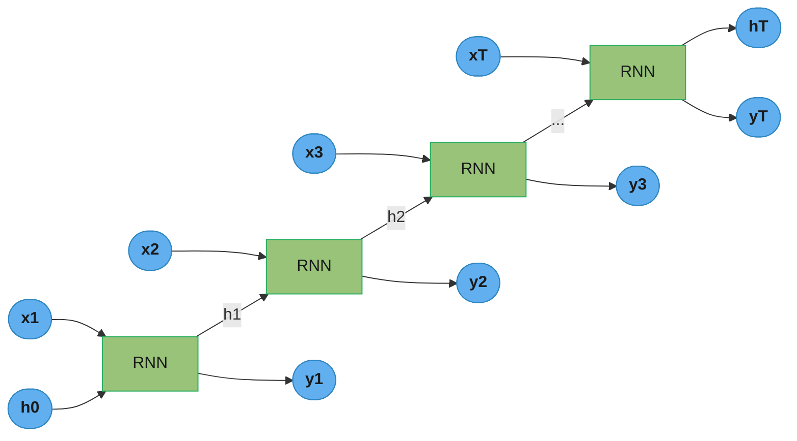
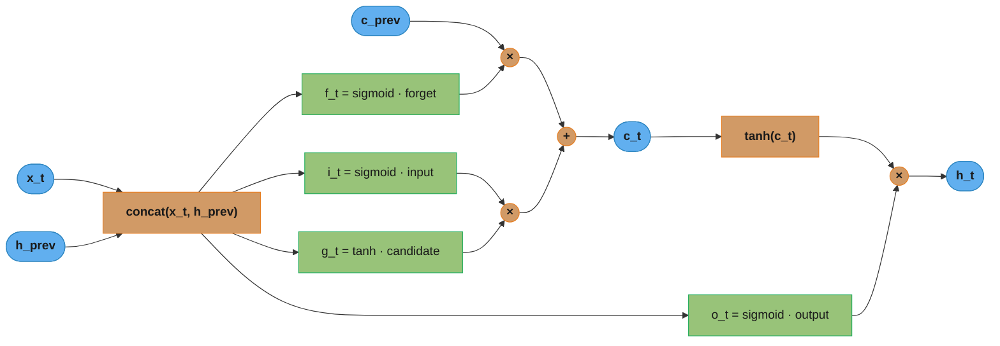
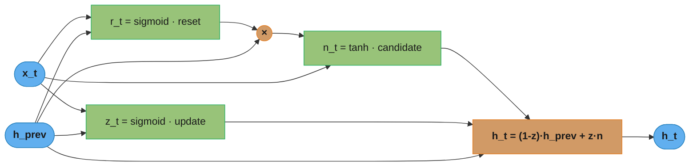
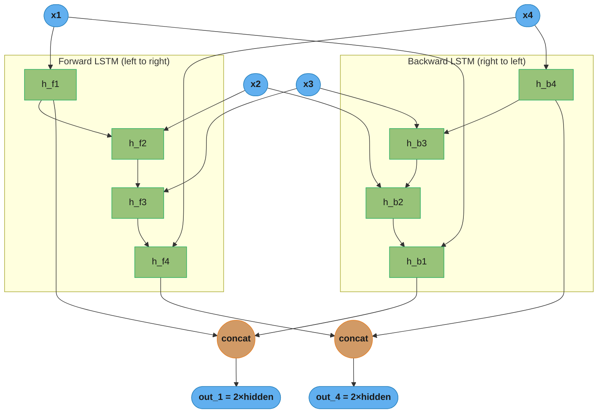
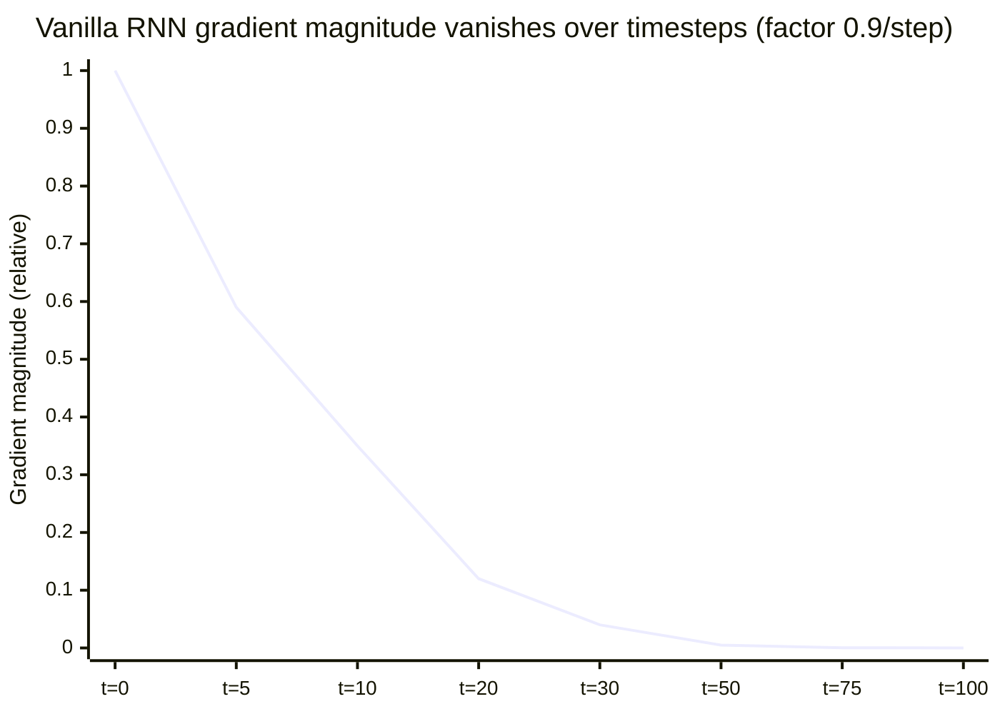
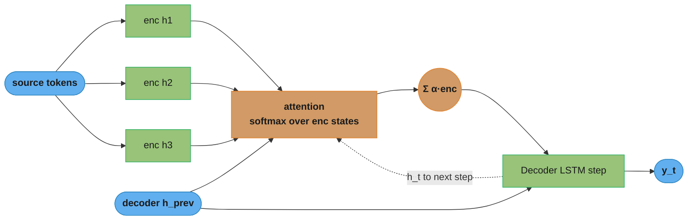

# Recurrent Neural Networks (RNN / LSTM / GRU)

## 1. Concept Overview

A Recurrent Neural Network (RNN) is a neural network that processes sequential data by maintaining a hidden state that is updated at each time step. Unlike feedforward networks that treat each input independently, RNNs share parameters across all time steps and carry information from previous steps through the hidden state. This makes them natural models for sequences of variable length: text, audio, time series, sensor data.

The fundamental limitation of vanilla RNNs is the vanishing gradient problem: gradients decay exponentially as they are backpropagated through time (BPTT), making it impossible to learn long-range dependencies. LSTM (Long Short-Term Memory) and GRU (Gated Recurrent Unit) address this with gating mechanisms that selectively control information flow, enabling gradients to propagate hundreds of steps without vanishing.

Transformers have largely replaced RNNs for NLP tasks because attention can model any pairwise dependency in O(1) steps (regardless of distance) and the entire sequence can be processed in parallel on GPU. However, RNNs remain relevant for streaming inference, edge deployment, and time-series tasks where their sequential, low-memory nature is an advantage.

---

## 2. Intuition

One-line analogy: a vanilla RNN is like a person with severe short-term memory — they remember yesterday's headline but forget last week's news; LSTM gives them a notepad (cell state) where they can write, erase, and read information as needed.

Mental model: the hidden state h_t is a compressed summary of all information seen up to time t. The challenge is keeping this summary relevant over long sequences — vanilla RNNs overwrite it too aggressively; LSTMs use gates to decide what to keep, what to forget, and what to output.

Why it matters: RNNs were the dominant architecture for sequence modeling from 2014-2018 and produced breakthroughs in machine translation (seq2seq), speech recognition (CTC), and language modeling. Understanding them is essential for grasping why Transformers were designed the way they were.

Key insight: gating is the critical innovation. By multiplying information by values in [0,1] (sigmoid-gated), LSTM can implement "ignore this token" (forget gate ~0) or "remember this forever" (forget gate ~1). The cell state flows with minimal modification when forget gate is near 1, creating an unobstructed gradient highway.

---

## 3. Core Principles

**Vanishing gradient in vanilla RNN**: in BPTT, the gradient at step t flows backward through T-t matrix multiplications by W_hh. If the largest eigenvalue of W_hh is < 1, gradients shrink exponentially. If > 1, they explode. For T=100 steps, a factor of 0.9 per step gives gradient magnitude 0.9^100 ≈ 2.7e-5 — effectively zero for the first tokens.

**Gating mechanism**: a gate is a sigmoid(linear transformation) of inputs, producing values in (0,1). Multiplying the hidden state or input by a gate either passes or blocks information. This is differentiable, so gates are learned end-to-end.

**Cell state in LSTM**: the cell state c_t is a separate memory vector that flows through the network with only element-wise operations (no tanh squashing on the main path). This enables gradients to flow through long sequences nearly unchanged.

**Bidirectional RNN**: runs two RNNs — one forward, one backward over the sequence — and concatenates their hidden states. Output hidden size is 2x the single-direction size. Cannot be used for streaming/autoregressive tasks since the backward RNN requires the full sequence.

**Teacher forcing**: during training, the decoder receives the ground truth token as input at each step (not the model's prediction). At inference, it receives its own previous prediction. This mismatch is called exposure bias and can cause cascading errors at inference time for long sequences.

**CTC loss (Connectionist Temporal Classification)**: enables training sequence-to-sequence models when input-output alignment is unknown. Used for speech recognition and OCR where the network outputs one label per input frame but consecutive frames can have the same label or be blanks.

---

## 4. Types / Architectures / Strategies

| Architecture | Gates | Params (hidden=256) | Long-range | Streaming | Use Case |
|-------------|-------|---------------------|-----------|-----------|---------|
| Vanilla RNN | 0 | ~65K | Poor | Yes | Toy tasks only |
| LSTM | 4 | ~263K | Good | Yes | NLP, time series |
| GRU | 2 | ~198K | Good | Yes | Faster LSTM alternative |
| Bidirectional LSTM | 4x2 | ~526K | Excellent | No | Encoding (BERT-like) |
| Stacked LSTM | 4 per layer | ~1M (3-layer) | Best | Yes | Deep sequence models |

**GRU vs LSTM tradeoff**: GRU has 2/3 the parameters of LSTM (fewer gate computations) and often matches LSTM performance on tasks with sequences < 200 steps. LSTM consistently outperforms GRU on very long sequences (>500 steps) where the separate cell state matters. In practice, GRU is preferred when training speed matters; LSTM when maximum sequence modeling quality is needed.

**Seq2seq architecture**: encoder RNN processes the input sequence into a context vector (final hidden state); decoder RNN generates the output sequence conditioned on that context. Without attention, long input sequences compress into a fixed-size context vector, losing information. Adding cross-attention (Bahdanau/Luong) allows the decoder to dynamically attend to different encoder steps.

---

## 5. Architecture Diagrams

**Vanilla RNN unrolled over time:**



Parameters are shared across every step; the hidden state h is the only channel
carrying the past forward. During BPTT the gradient flows back through all T of
these cells, so the per-step multiply by W_hh compounds T times.

**LSTM cell — gate and cell-state flow:**



The cell state c_t is updated by ADDITION (the orange `+` node), not multiplication.
That additive path is the gradient highway: when the forget gate f_t is near 1, the
gradient of the loss w.r.t. c_{t-1} passes through unshrunk, letting LSTMs remember
hundreds of steps.

**GRU cell — merged gates, no separate cell state:**



GRU merges forget and input into a single update gate z and drops the separate cell
state; h_t simply interpolates the old state and the new candidate, giving roughly
2/3 the parameters of an LSTM.

**Bidirectional LSTM — two directions concatenated:**



Two LSTMs read the sequence in opposite directions and their per-position states are
concatenated (2× hidden). The backward pass needs the whole sequence up front, which
is exactly why bidirectional models cannot be used for streaming.

**Vanishing gradient over timesteps:**



With a per-step gradient factor of 0.9 the magnitude decays as 0.9^t — effectively
zero by ~30 steps (0.9^100 ≈ 2.7e-5). This is why vanilla RNNs cannot learn
long-range dependencies and why the LSTM's additive cell-state path was needed.

**Seq2seq with attention:**



Attention lets the decoder recompute a weighted context over all encoder states at
every step, removing the fixed-size context-vector bottleneck of plain seq2seq. The
dotted edge is the recurrence: the decoder's hidden state feeds the next step's
attention.

---

## 6. How It Works — Detailed Mechanics

### LSTM Gate Equations

```python
import torch
import torch.nn as nn
from torch import Tensor
import math


class LSTMCellManual(nn.Module):
    """Manual LSTM cell to expose gate equations."""

    def __init__(self, input_size: int, hidden_size: int) -> None:
        super().__init__()
        self.hidden_size = hidden_size
        # Combined weight matrix for all 4 gates: [forget, input, candidate, output]
        # Shape: (4 * hidden_size, input_size + hidden_size)
        self.W = nn.Linear(input_size + hidden_size, 4 * hidden_size, bias=True)
        self._init_weights()

    def _init_weights(self) -> None:
        # Orthogonal init for recurrent weights (preserves gradient norms better than random)
        nn.init.orthogonal_(self.W.weight)
        nn.init.zeros_(self.W.bias)
        # Initialize forget gate bias to 1 (common trick: helps remember by default)
        self.W.bias.data[self.hidden_size:2 * self.hidden_size].fill_(1.0)

    def forward(
        self,
        x: Tensor,           # (batch, input_size)
        h_prev: Tensor,      # (batch, hidden_size)
        c_prev: Tensor,      # (batch, hidden_size)
    ) -> tuple[Tensor, Tensor]:
        combined = torch.cat([x, h_prev], dim=1)  # (batch, input_size + hidden_size)
        gates = self.W(combined)                   # (batch, 4 * hidden_size)

        # Split into 4 gates
        f, i, g, o = gates.chunk(4, dim=1)

        f_t = torch.sigmoid(f)      # forget gate: what to erase from cell state
        i_t = torch.sigmoid(i)      # input gate: what to write to cell state
        g_t = torch.tanh(g)         # candidate values to write
        o_t = torch.sigmoid(o)      # output gate: what to expose as hidden state

        # Cell state update: ADDITION (not multiplication) -> gradient highway
        c_t = f_t * c_prev + i_t * g_t  # element-wise

        # Hidden state
        h_t = o_t * torch.tanh(c_t)     # element-wise

        return h_t, c_t
```

### Gradient Clipping — Production Standard

```python
def train_rnn_step(
    model: nn.Module,
    x: Tensor,
    y: Tensor,
    optimizer: torch.optim.Optimizer,
    criterion: nn.Module,
    max_grad_norm: float = 1.0,
) -> tuple[float, float]:
    optimizer.zero_grad()
    output = model(x)
    loss = criterion(output, y)
    loss.backward()

    # Clip gradient norm to prevent exploding gradients
    # Returns total gradient norm BEFORE clipping (useful for monitoring)
    grad_norm = nn.utils.clip_grad_norm_(model.parameters(), max_norm=max_grad_norm)

    optimizer.step()
    return loss.item(), grad_norm.item()
```

`clip_grad_norm_` computes the global L2 norm of all parameter gradients and scales them so the norm equals `max_norm` if the norm exceeds it. Typical values: max_norm=1.0 for RNNs, 0.5 for very deep stacked RNNs. This is more principled than `clip_grad_value_` (per-element clipping) because it preserves gradient direction.

### Seq2Seq with Attention

```python
class Encoder(nn.Module):
    def __init__(self, vocab_size: int, embed_dim: int, hidden_size: int, num_layers: int = 2) -> None:
        super().__init__()
        self.embedding = nn.Embedding(vocab_size, embed_dim, padding_idx=0)
        self.lstm = nn.LSTM(
            embed_dim, hidden_size,
            num_layers=num_layers,
            batch_first=True,
            dropout=0.3,           # dropout between LSTM layers (not on last)
            bidirectional=True,
        )
        # Project bidirectional output to decoder hidden size
        self.hidden_proj = nn.Linear(hidden_size * 2, hidden_size)
        self.cell_proj   = nn.Linear(hidden_size * 2, hidden_size)

    def forward(self, src: Tensor) -> tuple[Tensor, tuple[Tensor, Tensor]]:
        # src: (batch, src_len)
        embedded = self.embedding(src)                           # (batch, src_len, embed_dim)
        outputs, (h_n, c_n) = self.lstm(embedded)               # outputs: (batch, src_len, 2*hidden)
        # Combine forward and backward final states
        # h_n shape: (num_layers*2, batch, hidden_size)
        h = torch.cat([h_n[-2], h_n[-1]], dim=1)                # (batch, 2*hidden)
        c = torch.cat([c_n[-2], c_n[-1]], dim=1)
        h = torch.tanh(self.hidden_proj(h)).unsqueeze(0)        # (1, batch, hidden)
        c = torch.tanh(self.cell_proj(c)).unsqueeze(0)
        return outputs, (h, c)   # encoder_outputs for attention, initial decoder state


class BahdanauAttention(nn.Module):
    def __init__(self, hidden_size: int) -> None:
        super().__init__()
        self.W1 = nn.Linear(hidden_size * 2, hidden_size)   # for encoder outputs
        self.W2 = nn.Linear(hidden_size, hidden_size)       # for decoder state
        self.v  = nn.Linear(hidden_size, 1, bias=False)

    def forward(self, decoder_hidden: Tensor, encoder_outputs: Tensor) -> tuple[Tensor, Tensor]:
        # decoder_hidden: (batch, hidden)
        # encoder_outputs: (batch, src_len, 2*hidden)
        src_len = encoder_outputs.size(1)
        decoder_hidden = decoder_hidden.unsqueeze(1).repeat(1, src_len, 1)  # (batch, src_len, hidden)
        energy = torch.tanh(self.W1(encoder_outputs) + self.W2(decoder_hidden))  # (batch, src_len, hidden)
        attention_weights = torch.softmax(self.v(energy).squeeze(-1), dim=1)     # (batch, src_len)
        context = (attention_weights.unsqueeze(-1) * encoder_outputs).sum(dim=1) # (batch, 2*hidden)
        return context, attention_weights
```

### Teacher Forcing vs Free Running

```python
def decode_with_teacher_forcing(
    decoder: nn.Module,
    encoder_outputs: Tensor,
    encoder_state: tuple[Tensor, Tensor],
    target: Tensor,
    teacher_forcing_ratio: float = 0.5,  # 50% teacher forcing during training
) -> Tensor:
    batch_size, tgt_len = target.size()
    outputs = []
    decoder_input = target[:, 0]   # start token

    h, c = encoder_state
    for t in range(1, tgt_len):
        output, (h, c), _ = decoder(decoder_input, h, c, encoder_outputs)
        outputs.append(output)
        # Teacher forcing: use ground truth with probability teacher_forcing_ratio
        use_teacher_forcing = torch.rand(1).item() < teacher_forcing_ratio
        decoder_input = target[:, t] if use_teacher_forcing else output.argmax(dim=1)

    return torch.stack(outputs, dim=1)  # (batch, tgt_len-1, vocab_size)
```

---

## 7. Real-World Examples

**Machine translation (Google Translate, 2016)**: the first production neural MT system used a 8-layer stacked LSTM with attention. Before attention, LSTM was limited to ~30-word sentences. Attention enabled accurate translation of 100+ word sentences by letting the decoder look at any encoder position.

**Speech recognition (DeepSpeech)**: Baidu's DeepSpeech used a 5-layer bidirectional LSTM with CTC loss to directly transcribe audio to text without phoneme alignment. Training used gradient clipping with max_norm=400 (speech has much longer sequences than text — up to 2000 frames).

**Time series forecasting (LSTM at Uber)**: Uber's demand forecasting pipeline used stacked LSTMs with external covariates (hour of day, weather, events). They found vanilla LSTM with hidden_size=128-256 outperformed GRU for 7-day forecasts but GRU trained 30% faster. For 1-day forecasts, GRU matched LSTM at lower compute.

**Streaming inference (on-device)**: RNNs/LSTMs are preferred over Transformers for streaming audio processing on embedded hardware because they process one time step at a time with constant O(hidden_size^2) memory per step. Transformers need to cache all previous keys/values, which is infeasible for long streams on low-memory devices.

---

## 8. Tradeoffs

| Model | Params | Long-range | Training Speed | Inference | Best For |
|-------|--------|-----------|---------------|---------|---------|
| Vanilla RNN | Fewest | Poor (< 10 steps) | Fast | Fastest | Not recommended |
| GRU | Medium | Good (< 200 steps) | Medium | Fast | Short-medium sequences |
| LSTM | Most | Excellent (< 500 steps) | Slower | Slower | Long sequences |
| Transformer | Variable | Perfect (any range) | Parallelizable | Requires KV cache | Any length, GPU-rich |

| RNN vs Transformer | RNN | Transformer |
|-------------------|-----|-------------|
| Parallelization | Sequential (cannot parallelize training time steps) | Fully parallel |
| Memory (inference) | O(hidden_size) — constant | O(seq_len * hidden) — grows with sequence |
| Long-range | Degrades with distance | O(1) — any token to any token |
| Streaming | Natural | Needs KV cache management |
| Small dataset | Better (stronger inductive bias) | Worse (needs more data) |

---

## 9. When to Use / When NOT to Use

**Use RNN/LSTM/GRU when:**
- Streaming inference with constant memory budget (edge devices, audio processing)
- Time series with short-to-medium sequences (< 500 steps) and structured temporal patterns
- Small datasets where the sequential inductive bias improves generalization vs Transformer
- Autoregressive generation where each step depends on one previous step (no attention needed)

**Do NOT use vanilla RNN when:**
- Sequences longer than ~20 steps (vanishing gradients make learning impossible)
- Any NLP task where LSTM or Transformer is available

**Do NOT use bidirectional when:**
- Streaming or real-time inference (requires entire input sequence upfront)
- Language generation (causal constraint: cannot peek at future tokens)

**Prefer Transformer when:**
- Large dataset (> 100K sequences), GPU available
- Long-range dependencies are critical
- Training speed is paramount (parallel training)
- Fine-tuning pretrained models (BERT, GPT, T5)

---

## 10. Common Pitfalls

**War story 1 — Exploding gradients causing NaN loss:**
A team trained a 3-layer stacked LSTM on financial time series (sequence length 500). Training loss was NaN by step 50. Root cause: no gradient clipping. With 3 LSTM layers and 500 time steps, gradients could amplify 1500-fold through recurrent connections. Fix: add `clip_grad_norm_(params, max_norm=1.0)` after `loss.backward()`. Gradient norms stabilized at 0.5-2.0, loss converged normally.

```python
# BROKEN: no gradient clipping for RNNs
loss.backward()
optimizer.step()

# FIX
loss.backward()
torch.nn.utils.clip_grad_norm_(model.parameters(), max_norm=1.0)
optimizer.step()
```

**War story 2 — Exposure bias causing hallucination at inference:**
A seq2seq translation model trained with 100% teacher forcing generated accurate short translations (<15 words) but hallucinated on longer ones. The model was never trained to handle its own prediction errors — any small error in an early token was amplified at each subsequent step. Fix: curriculum learning — start with 100% teacher forcing, linearly decay to 50% by epoch 10. This trains the model to recover from its own mistakes.

**War story 3 — Bidirectional LSTM used for streaming:**
A production system used bidirectional LSTM for audio-to-text transcription. In offline evaluation, accuracy was 94%. In production streaming mode, the system buffered 30 seconds of audio before processing (backward LSTM needed the full segment). Latency was 30 seconds + inference time, making it useless for real-time subtitles. Fix: replace with unidirectional LSTM or add a streaming Transformer with sliding attention window.

**War story 4 — LSTM hidden state not reset between independent sequences:**
A text classification system packed multiple documents into a single batch without resetting the LSTM hidden state between documents. Hidden state from document N leaked into document N+1. Validation accuracy was 82%, suspiciously high — investigation revealed the model was memorizing document order in the training set. Fix: reset hidden state at the start of each sequence (pass `None` as initial state to `nn.LSTM` or explicitly set `h_0 = torch.zeros(...)`).

```python
# BROKEN: hidden state leaks across sequences
h, c = None, None
for batch in dataloader:
    out, (h, c) = lstm(batch, (h, c))  # h, c carry over from previous batch

# FIX: detach or reset hidden state each batch for independent sequences
for batch in dataloader:
    out, _ = lstm(batch, None)   # None initializes h0, c0 to zeros automatically
    # OR: out, (h, c) = lstm(batch, (h.detach(), c.detach())) for stateful streaming
```

---

## 11. Technologies & Tools

| Tool | Purpose |
|------|---------|
| `torch.nn.LSTM` | Built-in LSTM (cuDNN-accelerated, batch_first option) |
| `torch.nn.GRU` | Built-in GRU (similar API to LSTM) |
| `torch.nn.RNN` | Vanilla RNN (Elman RNN) |
| `torch.nn.utils.rnn.pack_padded_sequence` | Efficient variable-length sequence handling |
| `torch.nn.utils.rnn.pad_packed_sequence` | Unpack after LSTM for variable-length |
| `torch.nn.utils.clip_grad_norm_` | Gradient clipping (essential for RNNs) |
| `torchtext` | Vocabulary building, tokenization for text RNNs |
| `torchaudio` | Audio feature extraction (MFCC, spectrograms) for speech RNNs |

Key API notes:
- `nn.LSTM(..., batch_first=True)`: input shape (batch, seq, features) instead of (seq, batch, features). Prefer batch_first=True for clarity.
- `nn.LSTM(..., dropout=0.3)`: applies dropout between stacked LSTM layers (not on the last layer output). dropout=0 when num_layers=1.
- `nn.LSTM(..., bidirectional=True)`: output shape is (batch, seq, 2*hidden), h_n shape is (2*num_layers, batch, hidden).
- Pack/pad for variable-length sequences to avoid computing on padding tokens.

---

## 12. Interview Questions with Answers

**Q: What is the vanishing gradient problem in vanilla RNNs and how do LSTMs address it?**
In vanilla RNNs, gradients flow backward through T time steps by repeated multiplication with the recurrent weight matrix W_hh. If the spectral norm of W_hh is less than 1, gradients decay exponentially; if greater than 1, they explode. For a 100-step sequence with factor 0.9 per step: 0.9^100 ≈ 2.7e-5, making gradients effectively zero for early tokens. LSTMs address this via the cell state, which is updated by addition (c_t = f_t * c_{t-1} + i_t * g_t), not multiplication. The gradient of the loss with respect to c_{t-1} can flow through the addition without shrinking, as long as the forget gate f_t is near 1. This creates a gradient highway analogous to ResNet skip connections.

**Q: Explain the four gates in LSTM and what each controls.**
Forget gate (f_t = sigmoid(W_f * [h_{t-1}, x_t])): controls how much of the previous cell state to retain. Value near 0 erases, near 1 preserves. Input gate (i_t = sigmoid(...)): controls how much new information to write to the cell state. Candidate gate (g_t = tanh(...)): the actual candidate values to potentially write. Output gate (o_t = sigmoid(...)): controls what portion of the cell state to expose as the hidden state h_t. The cell update is: c_t = f_t * c_{t-1} + i_t * g_t. A common initialization trick is setting the forget gate bias to 1.0 so the LSTM starts by remembering everything, giving it a chance to learn what to forget.

**Q: How does GRU differ from LSTM and when would you prefer each?**
GRU has 2 gates (reset and update) versus LSTM's 4, and no separate cell state. The update gate z_t simultaneously controls how much old hidden state to keep and how much new candidate to adopt: h_t = (1-z_t)*h_{t-1} + z_t*n_t. The reset gate r_t controls how much of h_{t-1} to use when computing the candidate. GRU has roughly 2/3 the parameters of LSTM and trains ~25% faster. Prefer GRU for sequences < 200 steps, speed-constrained training, or when GRU reaches the same validation metric with fewer resources. Prefer LSTM for very long sequences (>500 steps) or when accuracy on benchmarks is the primary concern.

**Q: What is teacher forcing and what is exposure bias?**
Teacher forcing is a training technique for autoregressive decoders where the ground truth token is fed as the next-step input rather than the model's previous prediction. This makes training stable and fast because errors do not accumulate. Exposure bias is the mismatch: at inference, the model receives its own (possibly incorrect) previous prediction, not the ground truth. A small early error can cascade — the model has never been trained to handle its own mistakes. Fix: scheduled sampling (gradually decay teacher forcing ratio during training from 100% to 50%), or beam search (explore multiple hypothesis sequences at inference).

**Q: What is gradient clipping and what value should you use?**
Gradient clipping limits the global L2 norm of all parameter gradients to a maximum value. If the norm exceeds max_norm, all gradients are scaled down proportionally (direction preserved). This prevents the optimizer step from moving parameters catastrophically far when gradients explode. Typical max_norm=1.0 for LSTM on NLP tasks; 0.5 for very deep stacked RNNs; 400 was used by DeepSpeech for speech (longer sequences, larger natural gradient norms). You should monitor the pre-clipping gradient norm — if it consistently exceeds max_norm by large factors, investigate the learning rate or architecture, not just clip harder.

**Q: Why can't bidirectional RNNs be used for streaming inference?**
Bidirectional RNNs run a forward LSTM (left to right) and a backward LSTM (right to left). The backward LSTM requires knowing the entire input sequence to begin processing (it starts at the last token). This means for a 10-second audio clip, you must wait for all 10 seconds before generating any output — incompatible with real-time streaming requirements. Bidirectional models are excellent for encoding tasks (classification, named entity recognition, embeddings) where the full input is available. For streaming generation, use unidirectional models or causal Transformers.

**Q: What is the CTC loss and when is it used?**
CTC (Connectionist Temporal Classification) is a loss function for sequence-to-sequence tasks where the alignment between input and output is unknown. In speech recognition, a 1-second audio clip at 100 frames/second produces 100 output frames, but the transcript may have only 20 characters. CTC introduces a blank token and marginalizes over all valid alignments (using dynamic programming) that map the output sequence to the target label sequence by collapsing repeated non-blank characters. It enables end-to-end training without explicit frame-level alignment labels. Used in DeepSpeech, wav2vec, and OCR systems.

**Q: How do you handle variable-length sequences in LSTM efficiently?**
Use `torch.nn.utils.rnn.pack_padded_sequence` before the LSTM and `pad_packed_sequence` after. Packing removes padding tokens from computation — the LSTM only processes real tokens at each step, skipping padding. This is faster than processing padded sequences (especially when length variance is high) and ensures BatchNorm/statistics are not contaminated by padding. Input lengths must be sorted descending (enforce_sorted=True, the default, or set enforce_sorted=False in newer PyTorch).

**Q: Why did Transformers replace RNNs for NLP tasks?**
Three core reasons: (1) Parallelization — RNNs are inherently sequential (step t depends on step t-1), so training a sequence of length T on a GPU takes T sequential matrix multiplications. Transformers apply attention over all pairs simultaneously, utilizing GPU parallelism fully. Training is 10-100x faster in practice. (2) Long-range dependencies — attention connects any two tokens in O(1) operations regardless of distance. RNNs must carry information through all intermediate hidden states. (3) Scalability — Transformers scale more favorably with data and compute (GPT, BERT, T5 are all Transformer-based). RNNs struggle to train on datasets > 1 billion tokens.

**Q: What is the forget gate bias initialization trick and why does it help?**
Initializing the forget gate bias to 1.0 (instead of 0.0) makes the LSTM start training in a "remember by default" state: f_t ≈ sigmoid(1.0) ≈ 0.73. This means the cell state retains ~73% of its previous value by default at the start of training. Without this, f_t ≈ 0.5 and the LSTM aggressively forgets early in training before it has learned what to preserve. The biased initialization gives the LSTM a head start on modeling long-range dependencies, often leading to faster convergence and better performance on long sequences. Proposed by Jozefowicz et al. (2015) and Greff et al. (2017).

**Q: How do you prevent the hidden state from leaking between independent sequences in a batch?**
Pass `None` as the initial hidden state (h_0, c_0) to `nn.LSTM` or explicitly create zero tensors. In PyTorch, passing None initializes to zeros automatically. For stateful streaming (one long continuous sequence), carry the hidden state across batches but call `.detach()` to prevent gradients from flowing into previous batches (avoids memory explosion): `h = h.detach()`. For independent sequences (document classification), always reset to None between sequences.

**Q: What are the tradeoffs between a deep stacked LSTM and a wide single-layer LSTM?**
A stacked LSTM (multiple layers) learns hierarchical representations: lower layers capture local patterns, higher layers capture abstract semantics — analogous to deep CNNs. A single wide LSTM has all representational capacity at one level. Empirically, 2-4 LSTM layers outperform 1 very wide layer for complex tasks. Beyond 4 layers, training becomes unstable without careful initialization and learning rate tuning. Dropout between layers (not on the last layer) is essential for regularization in stacked LSTMs. Typical hidden_size=256-512 per layer; dropout_between_layers=0.2-0.5.

**Q: Why do exploding gradients, not vanishing gradients, cause NaN loss in RNN training?**
When the recurrent weight's spectral norm exceeds 1, gradients grow exponentially through timesteps and overflow to NaN, whereas vanishing gradients merely stall learning without crashing. A 3-layer LSTM over 500 steps can amplify gradients 1500-fold, so a single large update sends weights to inf and the next forward pass returns NaN. The fix is gradient clipping (`clip_grad_norm_`, max_norm=1.0), which caps the global gradient norm while preserving its direction; vanishing is instead addressed architecturally by gating.

**Q: Why does BatchNorm not work well in RNNs, and what normalization is used instead?**
BatchNorm computes statistics over the batch at each timestep, but sequence lengths vary and per-timestep batch statistics are noisy and undefined for late timesteps that few sequences reach. LayerNorm is used instead: it normalizes across the feature dimension within a single example, so it is independent of batch size and sequence position and behaves identically at train and inference. This is why LayerNorm became the default in recurrent and transformer sequence models.

**Q: Where should dropout be applied in a stacked LSTM, and why not on the recurrent connections?**
Dropout should be applied between stacked LSTM layers, not on the hidden-to-hidden recurrent path, because randomly zeroing recurrent activations erases the very memory the cell is trying to carry across timesteps. PyTorch's `nn.LSTM(dropout=p)` correctly applies dropout only between layers (and is a no-op when num_layers=1). If you need recurrent regularization, use variational dropout, which applies the same dropout mask at every timestep rather than a fresh one each step.

**Q: What is the difference between the hidden state h_t and the cell state c_t in an LSTM?**
The cell state c_t is the long-term memory that flows along the additive gradient highway, while the hidden state h_t is the tanh-squashed view of c_t exposed to the next layer. The output gate decides how much of c_t becomes h_t at each step, so c_t can hold information that is not currently exposed to the output. Vanilla RNNs and GRUs have only one state vector; the separate cell state is exactly what lets LSTMs preserve information across very long spans.

**Q: What problem does the fixed context vector in a plain (no-attention) seq2seq model create?**
A plain seq2seq compresses the entire input into one fixed-size context vector (the encoder's final hidden state), so long inputs lose information as everything is squeezed through that bottleneck. Translation quality degrades sharply beyond ~30 words because early tokens are overwritten in the summary. Attention removes the bottleneck by letting the decoder attend to all encoder states directly at each step, which is what enabled accurate translation of 100+ word sentences.

---

## 13. Best Practices

- Always use gradient clipping with `clip_grad_norm_(params, max_norm=1.0)` for any RNN/LSTM training — exploding gradients are a near-certainty without it on sequences > 50 steps.
- Initialize forget gate biases to 1.0 in LSTM implementations to improve long-range dependency learning from step 1.
- Use `batch_first=True` in `nn.LSTM` for readability (batch dimension first, consistent with other PyTorch layers).
- Use `pack_padded_sequence` / `pad_packed_sequence` for variable-length datasets — never waste GPU compute on padding tokens.
- Detach hidden states between independent sequences (`.detach()` for stateful streaming) or reset to None for independent-sequence batches.
- Monitor pre-clipping gradient norm every N steps — if it is consistently 100x above max_norm, investigate architecture or learning rate rather than just clipping harder.
- Prefer bidirectional LSTM for classification and encoding tasks; prefer unidirectional for generation and streaming.
- For seq2seq, implement scheduled sampling (decay teacher forcing ratio) rather than pure teacher forcing — this improves inference robustness by ~5-10% BLEU on machine translation.
- Typical hyperparameters: hidden_size=256-512, num_layers=2-4, dropout_between_layers=0.3, lr=0.001 with Adam, gradient clipping max_norm=1.0.

---


## 14. Case Study

**Scenario: LSTM-based log anomaly detection for cloud infrastructure at 10k events/sec.** A platform team monitors 500 microservices generating 10k structured log events/sec. Manual log review is infeasible. An LSTM sequence model learns normal log token patterns from 90 days of history and flags sequences deviating from the learned distribution as anomalies. Latency SLA: detection within 2 seconds of log ingestion, false positive rate < 1%.

```
Log anomaly detection pipeline:

  Kafka (10k events/sec)
        │
  [Tokenizer + sliding window (50 events)]
        │
  [LSTM anomaly model — inference 4ms p99]
        │
  ┌─────┴──────┐
  [Normal]   [Anomaly score > threshold]
                │
          [PagerDuty alert + Kibana link]
```

**Model architecture and training:**

```python
import torch
import torch.nn as nn
from torch.utils.data import DataLoader

class LogLSTM(nn.Module):
    def __init__(self, vocab_size: int, embed_dim: int = 64,
                 hidden_size: int = 256, num_layers: int = 2,
                 dropout: float = 0.3) -> None:
        super().__init__()
        self.embed = nn.Embedding(vocab_size, embed_dim, padding_idx=0)
        self.lstm = nn.LSTM(
            input_size=embed_dim,
            hidden_size=hidden_size,
            num_layers=num_layers,
            batch_first=True,
            dropout=dropout,
        )
        self.head = nn.Linear(hidden_size, vocab_size)

    def forward(self, x: torch.Tensor) -> torch.Tensor:
        # x: (batch, seq_len) token IDs
        emb = self.embed(x)                          # (batch, seq_len, embed_dim)
        out, _ = self.lstm(emb)                      # (batch, seq_len, hidden_size)
        logits = self.head(out)                      # (batch, seq_len, vocab_size)
        return logits                                 # predict next token at each step
```

**Anomaly scoring via cross-entropy on unseen sequences:**

```python
import numpy as np

def anomaly_score(model: LogLSTM, tokens: list[int],
                  device: torch.device) -> float:
    """Returns mean cross-entropy loss on the sequence.
    High loss = sequence is unlikely under trained distribution = anomaly."""
    model.eval()
    x = torch.tensor([tokens[:-1]], dtype=torch.long, device=device)
    y = torch.tensor([tokens[1:]],  dtype=torch.long, device=device)
    with torch.no_grad():
        logits = model(x)                             # (1, seq-1, vocab_size)
        loss = nn.functional.cross_entropy(
            logits.view(-1, logits.size(-1)),
            y.view(-1),
            reduction="mean",
        )
    return float(loss)

# Threshold set at 99th percentile of normal log scores on validation set
THRESHOLD = 2.85   # tuned to <1% false positive rate
```

**Streaming inference with sliding window:**

```python
from collections import deque

class AnomalyDetector:
    def __init__(self, model: LogLSTM, tokenizer, window: int = 50,
                 threshold: float = THRESHOLD, device: torch.device = None) -> None:
        self.model = model
        self.tokenizer = tokenizer
        self.window: deque[int] = deque(maxlen=window)
        self.threshold = threshold
        self.device = device or torch.device("cpu")

    def ingest(self, log_line: str) -> bool:
        """Returns True if anomaly detected."""
        token = self.tokenizer.encode(log_line)
        self.window.append(token)
        if len(self.window) < 10:           # need minimum context
            return False
        score = anomaly_score(self.model, list(self.window), self.device)
        return score > self.threshold
```

**Pitfall 1 — Training on mixed normal + anomaly logs poisons the model.**

```python
# BROKEN: training set includes anomalous sequences (outages, incidents)
# Model learns anomalies as valid patterns → threshold inflated → real anomalies missed
train_data = load_all_logs("2024-01-01", "2024-03-31")   # includes 3 incident windows

# FIX: filter training set to confirmed-normal windows only
normal_windows = [w for w in load_all_logs(...)
                  if not incident_calendar.overlaps(w.timestamp)]
# Label anomalies only during threshold calibration on a held-out validation set
```

**Pitfall 2 — Vanishing gradients with long sequences and no gradient clipping.**

```python
# BROKEN: no gradient clipping — LSTM over 200-step sequences diverges in 3 epochs
optimizer = torch.optim.Adam(model.parameters(), lr=1e-3)
loss.backward()
optimizer.step()   # gradients explode on long sequences → NaN weights

# FIX: clip before optimizer step
loss.backward()
torch.nn.utils.clip_grad_norm_(model.parameters(), max_norm=1.0)
optimizer.step()
# Monitor: log grad_norm = sum(p.grad.norm() for p in model.parameters()) / n_params
```

**Pitfall 3 — Tokenizer mismatch between training and inference causes silent degradation.**

```python
# BROKEN: training tokenizer built on raw logs; inference tokenizer re-built monthly
# New microservice names added monthly → OOV tokens silently map to <unk>
# Model sees all new services as the same token → anomalies from new services undetected

# FIX: freeze tokenizer at training time; save vocab alongside model checkpoint
import json, pathlib

def save_checkpoint(model, tokenizer, path: str) -> None:
    p = pathlib.Path(path)
    torch.save(model.state_dict(), p / "model.pt")
    json.dump(tokenizer.vocab, open(p / "vocab.json", "w"))
    # At inference: load vocab from checkpoint — never rebuild from inference data
```

**Metrics and results:**

| Metric | Value |
|---|---|
| Training data | 90 days, 78B log tokens |
| Vocab size | 12,847 unique tokens |
| Model parameters | 4.2M |
| Training time | 6h on 1×A100 |
| Inference latency p99 | 4ms per 50-event window |
| False positive rate | 0.7% (threshold at 99th percentile) |
| Recall on known incidents | 91% (14/15 incidents caught within 30s) |
| Throughput | 2,500 windows/sec per GPU replica |

**Interview discussion points:**

**Why model log anomaly detection as next-token prediction rather than binary classification?** Binary classification requires labeled anomalies — expensive to collect and biased toward known anomaly types. Next-token prediction is self-supervised: the model learns the "grammar" of normal log sequences from vast unlabeled normal data. Anything that deviates from this grammar scores high cross-entropy, including novel anomaly types never seen during training. This is the key advantage for infrastructure monitoring where anomaly types evolve continuously.

**How do you calibrate the anomaly threshold without labeled anomalies?** Collect a validation set of confirmed-normal windows (e.g., stable production period with no incidents). Run the model on all windows and compute the distribution of cross-entropy scores. Set the threshold at the 99th percentile — this gives a 1% false positive rate on normal traffic. Validate recall against a small set of labeled incident windows from a historical outage postmortem.

**What is the risk of using a fixed sliding window size?** A window of 50 events may capture a complete burst (e.g., a restart sequence) or split it across two windows. A split anomaly may score below threshold in both halves. Mitigate by using overlapping windows (stride = 25 instead of 50) so an anomalous burst is fully contained in at least one window. The cost is 2× inference volume, worth it for detection recall.

**How do you handle log schema changes when a new microservice is deployed?** With a frozen vocab, new service names become `<unk>` tokens, and the model cannot distinguish between different new services. Two mitigations: (1) use subword tokenization (BPE) so "payment-service-v2" shares tokens with "payment-service"; (2) periodically fine-tune the model on recent normal data with the new vocab (warm-start from existing checkpoint — fast, 1-2h vs 6h from scratch).

**What are the latency trade-offs between CPU and GPU inference for this use case?** At 10k events/sec with 50-event windows → 200 window evaluations/sec per service replica. A single LSTM forward pass on CPU takes ~15ms for a 4M-param model (batch size 1), GPU ~4ms. CPU is viable for < 70 windows/sec (suitable for smaller clusters); GPU is required for 200+. Use ONNX export + ONNX Runtime for CPU serving — typically 3-5× faster than plain PyTorch CPU inference.

**Why is pack_padded_sequence important for production training?** Log sequences have variable lengths. Without packing, padding tokens consume GPU compute and LSTM states are updated on padding — introducing spurious gradient signal. `pack_padded_sequence` tells LSTM to skip padding, reducing compute by up to 40% on highly variable-length datasets. At 78B training tokens, this 40% reduction saves ~2.4h of A100 time per training run.
