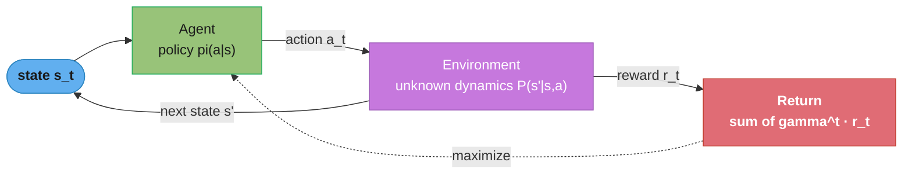
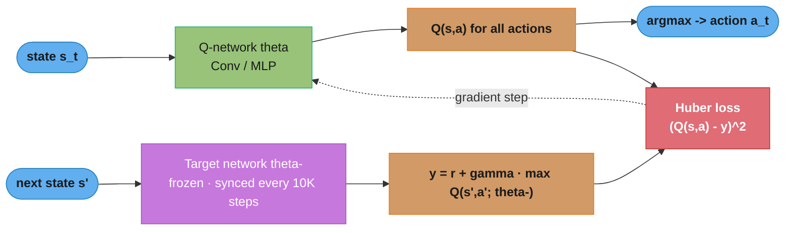
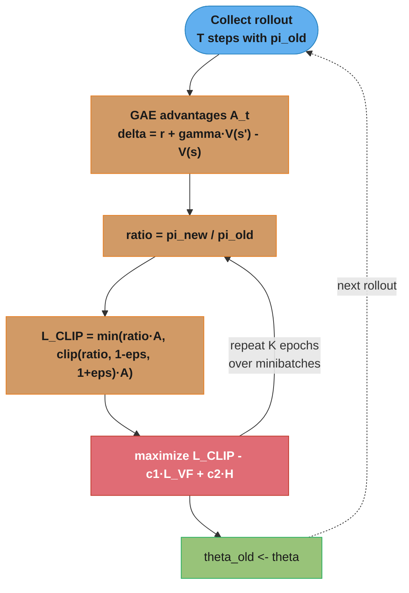
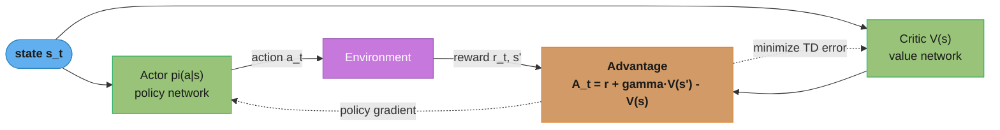
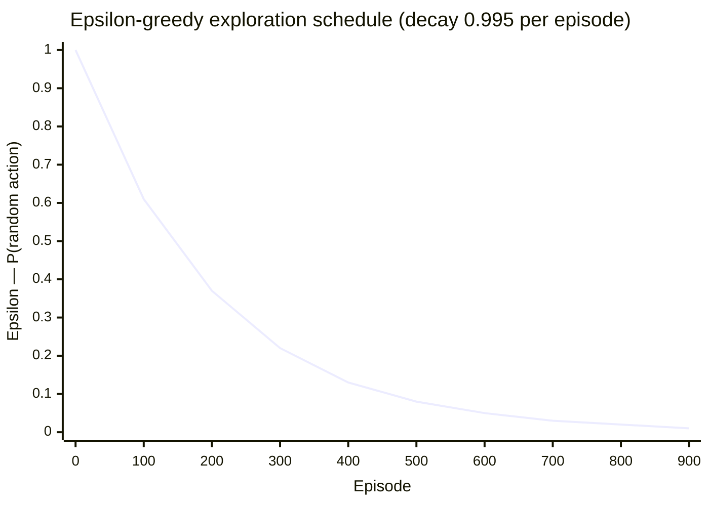

# Reinforcement Learning

---

## 1. Concept Overview

Reinforcement Learning (RL) is a paradigm where an agent learns to make decisions by interacting with an environment. The agent observes a state, selects an action, receives a scalar reward signal, and transitions to a new state. The goal is to learn a policy — a mapping from states to actions — that maximizes cumulative discounted reward over time.

Unlike supervised learning (labeled input-output pairs) and unsupervised learning (unlabeled data), RL learns from the consequences of its own actions through trial-and-error. It applies when: the environment's dynamics are unknown or too complex to model explicitly, and feedback is available but delayed.

---

## 2. Intuition

One-line analogy: RL is like training a dog with treats — the agent (dog) tries different actions, and the trainer (environment) gives rewards or punishments. The dog learns which behaviors lead to treats without being told exactly what to do.

Mental model: Every RL problem is a Markov Decision Process (MDP). The agent navigates a graph where nodes are states, edges are actions, and edge weights are rewards. The agent must discover the highest-reward paths through this graph, often without a map.

Why it matters: RL is responsible for superhuman performance in Go (AlphaGo), chess (AlphaZero), Dota 2 (OpenAI Five), and StarCraft (AlphaStar). More practically, it underpins recommendation systems, robotics control, HVAC optimization, and — critically — RLHF (Reinforcement Learning from Human Feedback) used to align GPT-4, Claude, and Gemini with human preferences.

Key insight: The exploration-exploitation dilemma is the central tension in RL — the agent must explore unknown actions to discover better rewards, but must exploit known good actions to accumulate reward. Every RL algorithm makes a different trade-off between these two imperatives.

---

## 3. Core Principles

1. Markov Property: the next state depends only on the current state and action, not on history. If this holds, the problem is tractable as an MDP.
2. Discount factor gamma (typically 0.90-0.99): future rewards are worth less than immediate rewards. gamma=0 is myopic (only cares about immediate reward); gamma=1 is infinite-horizon (all future rewards count equally, valid only for episodic tasks).
3. Value functions encode long-term worth: V(s) = expected return from state s following policy pi; Q(s,a) = expected return from taking action a in state s, then following pi.
4. Bellman optimality: the optimal value of any state equals the immediate reward plus the discounted optimal value of the best next state. This recursive structure is the foundation of dynamic programming and Q-learning.
5. On-policy vs off-policy: on-policy methods (SARSA, PPO) evaluate the policy being followed; off-policy methods (Q-learning, DQN) can learn from data collected by any policy (including random exploration or a replay buffer).

---

## 4. Types / Architectures / Strategies

### 4.1 Taxonomy

```
Reinforcement Learning
├── Model-Based (learns environment dynamics P(s'|s,a))
│   ├── Dyna-Q (plan using learned model)
│   ├── World Models (Ha & Schmidhuber 2018)
│   └── AlphaZero (MCTS + learned value/policy network)
│
└── Model-Free (learns directly from experience)
    ├── Value-Based (learn Q or V function)
    │   ├── Q-learning (tabular, off-policy)
    │   ├── SARSA (tabular, on-policy)
    │   └── DQN (deep Q-network, discrete actions)
    │
    ├── Policy-Based (directly learn policy)
    │   └── REINFORCE (Monte Carlo policy gradient, high variance)
    │
    └── Actor-Critic (learn both policy and value)
        ├── A2C / A3C (synchronous / asynchronous advantage AC)
        ├── PPO (proximal policy optimization, stable, widely used)
        └── SAC (soft actor-critic, entropy-regularized, continuous actions)
```

### 4.2 Key Algorithms Comparison

| Algorithm | On/Off Policy | Action Space | Key Feature |
|-----------|--------------|-------------|-------------|
| Q-learning | Off | Discrete | Tabular; convergence guaranteed |
| DQN | Off | Discrete | Neural Q-function; experience replay |
| REINFORCE | On | Both | High variance; simple |
| A2C | On | Both | Synchronous advantage estimation |
| PPO | On | Both | Clipped surrogate objective; stable |
| SAC | Off | Continuous | Entropy-regularized; sample efficient |
| TD3 | Off | Continuous | Twin critics; delayed policy updates |
| DDPG | Off | Continuous | Deterministic policy gradient |

### 4.3 Multi-Armed Bandits (special case)

One state, many actions, stochastic rewards. Policies: epsilon-greedy (explore with probability epsilon), UCB (Upper Confidence Bound — optimism in face of uncertainty), Thompson Sampling (Bayesian posterior sampling). Used extensively in A/B testing, ad selection, and clinical trials.

---

## 5. Architecture Diagrams

### Agent–Environment Loop (MDP)



The agent observes a state, its policy emits an action, and the environment
returns a reward plus the next state — the loop the agent repeats to maximize
discounted return. The environment is `frozen` (its dynamics are unknown and
never trained); only the agent's policy is learned.

### Bellman Equation (Optimal)

```
Q*(s, a) = R(s, a) + gamma * sum_{s'} P(s'|s,a) * max_{a'} Q*(s', a')
             ^                                          ^
          immediate                          best future Q-value
           reward                            (bootstrapped)
```

**In plain terms.** "The value of doing something is what you get right now, plus a discounted estimate of the best you could do from wherever you land." Everything else in value-based RL is a way of making that one sentence computable when you cannot enumerate the states.

The reason this is the foundational equation is that it is *self-referential*: `Q*` appears on both sides. You never need to imagine an entire future trajectory — you only need the reward for one step and your current guess about the next state. That is what lets an agent learn from single transitions instead of complete episodes.

| Symbol | What it is |
|--------|------------|
| `Q*(s, a)` | Best achievable total discounted reward, starting in state `s` and taking action `a` |
| `R(s, a)` | The immediate reward. The only part you actually observe |
| `gamma` | Discount factor, 0–1. How much a reward one step later is worth than one now |
| `P(s'\|s,a)` | Environment dynamics: the chance action `a` in `s` lands you in `s'` |
| `sum_{s'} P(...)` | Average over where you might land — the "expected" in expected return |
| `max_{a'} Q*(s', a')` | Assume you play optimally *from there on*. This `max` is what makes it *optimality* |

**Walk one example.** A three-state chain with two actions at the start, gamma = 0.9:

```
        [S0] --right--> [S1] --right--> [GOAL, r = +10]
          |
        left --> [EXIT, r = +2]

  Work backwards -- the only way to solve a recursive equation:

  Q*(S1, right) = 10 + 0.9 * 0            = 10.0     (GOAL is terminal)
  Q*(S0, right) =  0 + 0.9 * 10.0         =  9.0     (bootstraps off S1)
  Q*(S0, left)  =  2 + 0.9 * 0            =  2.0

  argmax at S0 -> "right" (9.0 vs 2.0). Walk the long way to the big reward.
```

Now make one step stochastic — action `right` at S1 reaches GOAL only 80% of the time, otherwise a dead end worth 0. That is where the `sum_{s'} P(s'|s,a)` term earns its keep:

```
  Q*(S1, right) = 0 + 0.9 * (0.8 * 10  +  0.2 * 0)
                = 0.9 * 8.0
                = 7.2                     (down from 10.0)
  Q*(S0, right) = 0 + 0.9 * 7.2  =  6.48

  Still beats left (2.0), so the policy is unchanged -- but the *value* dropped 28%.
```

**What it means.** Fix gamma and you have fixed how far the agent can see. The identity `1/(1 − gamma)` is the effective horizon: the number of future steps that meaningfully contribute before the discount crushes them to nothing.

| Symbol | What it is |
|--------|------------|
| `gamma^k` | The weight a reward `k` steps away carries in today's decision |
| `1/(1 − gamma)` | Effective horizon in steps — also exactly the sum `1 + gamma + gamma² + …` |
| `gamma = 0` | Myopic. Only the immediate reward exists; horizon of 1 step |
| `gamma = 1` | No discount. Only valid for episodic tasks that provably terminate |

**Walk one example.** The two settings the code defaults hover between, 0.9 and 0.99:

```
  gamma    1/(1-gamma)     gamma^10    gamma^50    gamma^100   half-life
  -----    -----------     --------    --------    ---------   ---------
   0.90       10 steps      0.3487      0.0052      0.000027    6.6 steps
   0.99      100 steps      0.9044      0.6050      0.3660     69.0 steps

  A reward 50 steps out is worth 0.52% of face value at gamma = 0.90,
  but 60.50% of face value at gamma = 0.99 -- a 117x difference.
```

Two knobs, ten-to-one horizons. This is why gamma is the first hyperparameter to check when an agent "refuses" to pursue a delayed payoff: at gamma = 0.9 a goal 50 steps away is essentially invisible. Push gamma too close to 1 and the opposite failure appears — value estimates grow toward `R_max/(1−gamma)` (100× the per-step reward at 0.99), variance explodes, and bootstrapped TD learning becomes numerically unstable. Return to the tiny MDP above: at gamma = 0.9 the agent goes right (9.0 vs 2.0), but at gamma = 0.15 it goes left (1.5 vs 2.0), and gamma = 0.2 is the exact indifference point. The discount factor did not change the environment — it changed what counts as optimal in it.

### DQN Architecture



The online Q-network (green, trained) picks actions by argmax; a frozen target
network (purple, synced every 10K steps) supplies a stable regression target y.
Freezing the target breaks the feedback loop that otherwise makes Q-values
oscillate.

### PPO Training Loop



Each rollout is reused for K gradient epochs (the loop back to `ratio`),
amortizing the cost of data collection. Clipping the probability ratio to
1-eps … 1+eps is what stops any single update from collapsing the policy.

### Actor–Critic



The critic's value estimate converts the noisy Monte Carlo return into a
low-variance advantage A_t, which the actor uses as its update signal. This
variance reduction is why actor-critic learns far more stably than REINFORCE.

### Exploration Schedule (Epsilon Decay)



Epsilon starts at 1.0 (pure exploration) and decays geometrically toward a 0.01
floor, so the agent explores aggressively early and exploits its learned
Q-values late. Decaying too fast starves the agent of exploration before it has
learned anything — a common cause of an agent that plateaus at a poor policy.

**Read it like this.** "Flip a biased coin every step: with probability epsilon ignore everything you have learned and act at random, otherwise take your current best guess." It is the crudest possible solution to exploration, and it is still the default because it is unbiased about *what* it explores and impossible to get subtly wrong.

| Symbol | What it is |
|--------|------------|
| `epsilon` | Probability of a uniformly random action this step |
| `1 − epsilon` | Probability of the greedy action, `argmax_a Q(s,a)` |
| `epsilon_decay` | Multiplier applied per episode, 0.995 here. Geometric, not linear |
| `epsilon_end` | Floor, 0.01. Never stop exploring entirely — the environment may be non-stationary |
| `epsilon * epsilon_decay` | The whole schedule: `epsilon_n = max(epsilon_end, epsilon_start · decay^n)` |

**Walk one example.** Where the schedule in the chart above actually puts you:

```
  episode      0.995^n     epsilon    what the agent is doing
  -------      -------     -------    --------------------------------------
      0         1.0000       1.00     every action random; pure data gathering
    100         0.6058       0.61     still mostly random, Q-table filling in
    200         0.3670       0.37     roughly one random action in three
    400         0.1347       0.13     mostly exploiting, occasional probe
    919         0.0100       0.01     floor reached; 1 random action per 100
```

The subtlety worth carrying into an interview: with 4 actions, epsilon = 0.1 does **not** mean you take the best action 90% of the time. The random branch can also happen to pick the best action, so `P(greedy action) = 1 − 0.1 + 0.1/4 = 0.925`. Conversely the cost of exploration is only `0.1 · 3/4 = 7.5%` of steps spent on known-suboptimal actions — cheap insurance against a Q-table that is confidently wrong about an arm it has visited twice.

**Why the floor exists and what breaks without it.** Decay epsilon to exactly 0 and the agent becomes deterministic: it will never again try the action it under-estimated early, so a single unlucky sequence of rewards can permanently lock in a bad policy. The 0.01 floor guarantees roughly one probe per 100 steps forever, which is enough to eventually correct a wrong estimate and enough to notice if the environment shifts under you.

---

## 6. How It Works — Detailed Mechanics

### Tabular Q-Learning

```python
import numpy as np
from typing import Callable

def q_learning(
    n_states: int,
    n_actions: int,
    step_fn: Callable[[int, int], tuple[int, float, bool]],  # (state, action) -> (next_state, reward, done)
    n_episodes: int = 10_000,
    alpha: float = 0.1,         # learning rate
    gamma: float = 0.99,        # discount factor
    epsilon_start: float = 1.0,
    epsilon_end: float = 0.01,
    epsilon_decay: float = 0.995,
) -> np.ndarray:
    """
    Off-policy TD control.
    Q-table update: Q(s,a) <- Q(s,a) + alpha * [r + gamma * max_a' Q(s',a') - Q(s,a)]
    The target max_a' Q(s',a') uses greedy policy (not the behavior policy) -> off-policy.
    """
    Q = np.zeros((n_states, n_actions))
    epsilon = epsilon_start

    for episode in range(n_episodes):
        state = 0   # assume environment provides initial state
        done = False
        while not done:
            # Epsilon-greedy action selection
            if np.random.rand() < epsilon:
                action = np.random.randint(n_actions)   # explore
            else:
                action = np.argmax(Q[state])            # exploit

            next_state, reward, done = step_fn(state, action)

            # Bellman update
            td_target = reward + gamma * np.max(Q[next_state]) * (1 - int(done))
            td_error = td_target - Q[state, action]
            Q[state, action] += alpha * td_error

            state = next_state

        epsilon = max(epsilon_end, epsilon * epsilon_decay)

    return Q
```

**Stated plainly.** "Compare what you thought this action was worth against what one step of real experience says it is worth, and move your estimate a small fraction of the way toward reality." The Bellman equation says what the answer *is*; this update rule is how you crawl toward it without ever knowing `P(s'|s,a)`.

| Symbol | What it is |
|--------|------------|
| `Q(s,a)` | Current stored estimate — one cell of the table |
| `r + gamma · max_a' Q(s',a')` | The **TD target**: one real reward plus your own estimate of the rest |
| `td_error` | Target minus estimate. Positive = pleasantly surprised, negative = disappointed |
| `alpha` | Learning rate, 0.1. What fraction of the surprise you actually absorb |
| `max_a'` | Taken over the *greedy* action, not the one exploration will actually pick — this is precisely what makes Q-learning off-policy |
| `(1 - int(done))` | Kills the bootstrap at a terminal state: there is no future to discount |

**Walk one example.** Three visits to the same chain from the Bellman section (`GOAL` pays +10, alpha = 0.1, gamma = 0.9), with the whole table starting at zero:

```
  visit  cell        target                       td_error   new value
  -----  ----------  --------------------------   --------   ---------
    1    Q(S1,R)     10 + 0.9*0    = 10.000        +10.000     0 + 0.1*10.000 = 1.000
    2    Q(S0,R)      0 + 0.9*1.0  =  0.900        + 0.900     0 + 0.1*0.900  = 0.090
    3    Q(S1,R)     10 + 0.9*0    = 10.000        + 9.000     1.000 + 0.900  = 1.900
    4    Q(S0,R)      0 + 0.9*1.9  =  1.710        + 1.620     0.090 + 0.162  = 0.252
    5    Q(S1,R)     10 + 0.9*0    = 10.000        + 8.100     1.900 + 0.810  = 2.710
    6    Q(S0,R)      0 + 0.9*2.71 =  2.439        + 2.187     0.252 + 0.219  = 0.471

  True values (from the Bellman walk):  Q*(S1,R) = 10.0    Q*(S0,R) = 9.0
```

Two things are visible here that no amount of prose conveys. First, **reward flows backwards one state per visit**: S0 knew nothing about the goal until S1 had learned something to bootstrap from — which is exactly why sparse-reward environments take so long, and why techniques like n-step returns and prioritized replay exist. Second, **the td_error shrinks geometrically** (10.0 → 9.0 → 8.1, a factor of `1 − alpha = 0.9` each visit), so convergence is smooth but slow: at alpha = 0.1 you need roughly 44 visits to close 99% of the gap. Raise alpha to speed that up and the estimates start chasing individual noisy rewards instead of averaging them — the classic stability-versus-speed dial.

### DQN with Experience Replay in PyTorch

```python
import torch
import torch.nn as nn
import torch.optim as optim
import numpy as np
import random
from collections import deque
from typing import NamedTuple

class Transition(NamedTuple):
    state: np.ndarray
    action: int
    reward: float
    next_state: np.ndarray
    done: bool


class ReplayBuffer:
    """
    Experience replay buffer: stores 1M transitions.
    Breaks temporal correlation between consecutive training samples.
    Enables off-policy learning from past experiences.
    """
    def __init__(self, capacity: int = 1_000_000) -> None:
        self.buffer: deque[Transition] = deque(maxlen=capacity)

    def push(self, *args) -> None:
        self.buffer.append(Transition(*args))

    def sample(self, batch_size: int) -> list[Transition]:
        return random.sample(self.buffer, batch_size)

    def __len__(self) -> int:
        return len(self.buffer)


class DQN(nn.Module):
    def __init__(self, state_dim: int, n_actions: int, hidden: int = 256) -> None:
        super().__init__()
        self.net = nn.Sequential(
            nn.Linear(state_dim, hidden),
            nn.ReLU(),
            nn.Linear(hidden, hidden),
            nn.ReLU(),
            nn.Linear(hidden, n_actions),
        )

    def forward(self, x: torch.Tensor) -> torch.Tensor:
        return self.net(x)


class DQNAgent:
    def __init__(
        self,
        state_dim: int,
        n_actions: int,
        lr: float = 1e-4,
        gamma: float = 0.99,
        batch_size: int = 64,
        target_update_freq: int = 10_000,   # steps between target network syncs
        min_replay_size: int = 10_000,
        device: str = "cuda" if torch.cuda.is_available() else "cpu",
    ) -> None:
        self.n_actions = n_actions
        self.gamma = gamma
        self.batch_size = batch_size
        self.target_update_freq = target_update_freq
        self.device = device
        self.step_count = 0

        self.q_net = DQN(state_dim, n_actions).to(device)
        self.target_net = DQN(state_dim, n_actions).to(device)
        self.target_net.load_state_dict(self.q_net.state_dict())
        self.target_net.eval()   # target net is never trained directly

        self.optimizer = optim.Adam(self.q_net.parameters(), lr=lr)
        self.replay_buffer = ReplayBuffer()
        self.min_replay_size = min_replay_size

    def select_action(self, state: np.ndarray, epsilon: float) -> int:
        if random.random() < epsilon:
            return random.randrange(self.n_actions)
        with torch.no_grad():
            s = torch.tensor(state, dtype=torch.float32, device=self.device).unsqueeze(0)
            return self.q_net(s).argmax(dim=1).item()

    def train_step(self) -> float | None:
        if len(self.replay_buffer) < self.min_replay_size:
            return None   # not enough experience yet

        batch = self.replay_buffer.sample(self.batch_size)
        states = torch.tensor(np.array([t.state for t in batch]), dtype=torch.float32, device=self.device)
        actions = torch.tensor([t.action for t in batch], dtype=torch.long, device=self.device)
        rewards = torch.tensor([t.reward for t in batch], dtype=torch.float32, device=self.device)
        next_states = torch.tensor(np.array([t.next_state for t in batch]), dtype=torch.float32, device=self.device)
        dones = torch.tensor([t.done for t in batch], dtype=torch.float32, device=self.device)

        # Current Q-values for taken actions
        q_values = self.q_net(states).gather(1, actions.unsqueeze(1)).squeeze(1)

        # Target Q-values (using frozen target network)
        with torch.no_grad():
            max_next_q = self.target_net(next_states).max(dim=1)[0]
            targets = rewards + self.gamma * max_next_q * (1 - dones)

        loss = nn.HuberLoss()(q_values, targets)
        self.optimizer.zero_grad()
        loss.backward()
        nn.utils.clip_grad_norm_(self.q_net.parameters(), max_norm=10.0)
        self.optimizer.step()

        self.step_count += 1
        if self.step_count % self.target_update_freq == 0:
            self.target_net.load_state_dict(self.q_net.state_dict())  # sync target

        return loss.item()
```

### PPO Core Loss Function

```python
import torch
import torch.nn as nn
from typing import Tuple

def compute_ppo_loss(
    log_probs_new: torch.Tensor,      # log pi_theta(a|s) under new policy
    log_probs_old: torch.Tensor,      # log pi_theta_old(a|s) (fixed during update)
    advantages: torch.Tensor,         # A_t from GAE
    values_new: torch.Tensor,         # V_theta(s_t)
    returns: torch.Tensor,            # discounted returns R_t
    clip_eps: float = 0.2,
    value_coef: float = 0.5,
    entropy_coef: float = 0.01,
    entropy: torch.Tensor | None = None,
) -> Tuple[torch.Tensor, dict]:
    """
    PPO-Clip objective.
    clip_eps=0.2: ratio r_t is constrained to [0.8, 1.2].
    Prevents too-large policy updates that destabilize training.
    """
    # Importance sampling ratio
    ratio = torch.exp(log_probs_new - log_probs_old)   # pi_new / pi_old

    # Clipped surrogate objective
    surr1 = ratio * advantages
    surr2 = torch.clamp(ratio, 1 - clip_eps, 1 + clip_eps) * advantages
    policy_loss = -torch.min(surr1, surr2).mean()

    # Value function loss (often clipped separately)
    value_loss = nn.HuberLoss()(values_new.squeeze(), returns)

    # Entropy bonus encourages exploration
    entropy_loss = -entropy.mean() if entropy is not None else torch.tensor(0.0)

    total_loss = policy_loss + value_coef * value_loss + entropy_coef * entropy_loss

    return total_loss, {
        "policy_loss": policy_loss.item(),
        "value_loss": value_loss.item(),
        "mean_ratio": ratio.mean().item(),
        "clip_fraction": ((ratio - 1).abs() > clip_eps).float().mean().item(),
    }
```

**What the formula is telling you.** "Increase the probability of actions that beat the baseline and decrease the ones that didn't — but refuse to give extra credit for any single update that moves an action's probability more than 20%." The policy gradient is the first half; the clip is the trust region that makes reusing one rollout for K epochs safe.

| Symbol | What it is |
|--------|------------|
| `ratio` | `exp(log_probs_new − log_probs_old)` = how much more likely this action is now. `1.0` = unchanged |
| `advantages` | `A_t` from GAE. Sign is what matters: `+` = better than the critic expected |
| `clip_eps` | 0.2, so the ratio is pinned to `[0.8, 1.2]` |
| `min(surr1, surr2)` | Always take the more pessimistic estimate — the source of the one-sided behavior below |
| `policy_loss` | Negated because optimizers minimize while the objective is to be maximized |
| `value_coef`, `entropy_coef` | 0.5 and 0.01 — weights on critic accuracy and on staying stochastic |
| `clip_fraction` | Diagnostic: share of the batch that hit the clamp. Healthy PPO sits near 0.1–0.3 |

**Walk one example.** Four transitions through the objective, `clip_eps = 0.2`:

```
  log-diff   ratio    A_t     surr1     surr2     min       clipped?
  --------   ------   ----    -------   -------   -------   --------
   +0.05     1.0513   +1.5    +1.5769   +1.5769   +1.5769   no
   +0.40     1.4918   +1.5    +2.2377   +1.8000   +1.8000   YES, gain capped
   +0.40     1.4918   -1.5    -2.2377   -1.8000   -2.2377   no, full penalty
   -0.30     0.7408   -1.5    -1.1112   -1.2000   -1.2000   YES, escape capped
```

Rows 2 and 3 have the *identical* ratio of 1.4918 and behave completely differently. That asymmetry is the whole design: when an action was good (`A > 0`) and you already made it much likelier, the objective flattens and the gradient goes to zero — no reason to push further. When an action was bad (`A < 0`) and you nonetheless made it likelier, the penalty is *unclipped* at −2.2377, so the gradient shoves hard in the correct direction. PPO caps your enthusiasm but never caps your correction.

Assembling the total from the same batch (`policy_loss = −1.8`, `value_loss = 0.4`, `entropy = 1.2`):

```
  total = policy_loss + value_coef*value_loss + entropy_coef*entropy_loss
        = -1.8 + 0.5*0.4 + 0.01*(-1.2)
        = -1.8 + 0.200 - 0.012
        = -1.612
```

The entropy term contributes −0.012 out of −1.612 — under 1% of the loss — yet dropping it is a classic way to watch a policy collapse to a single deterministic action a few hundred updates in. It is a tiny, permanent thumb on the scale toward staying stochastic, and the coefficient is small precisely because it must never compete with the actual objective.

---

## 7. Real-World Examples

**AlphaGo (DeepMind, 2016):** Combines Monte Carlo Tree Search with a policy network (predicts move probability) and value network (predicts win probability), both trained with RL from self-play. Defeated world champion Lee Sedol 4-1. Key insight: the 19x19 board has ~10^170 states — too large for tabular RL, but a deep neural value function approximates V(s) effectively.

**OpenAI Five (2019):** PPO trained on Dota 2 (a 5v5 team game with partial observability and 170K dimensional action space). Each agent ran PPO independently with team reward. Trained on 180 years of self-play per day using 128,000 CPU cores and 256 GPUs. Defeated world champion team 2-0. Demonstrated that sufficient compute + PPO scales to extremely complex cooperative tasks.

**Google DeepMind HVAC Control (2016):** RL agent reduced Google data center cooling energy by 40%. State: 120 sensor readings. Actions: set-points for 20 control systems. Reward: negative power consumption. DQN trained on historical data, then deployed with human override capability. Direct $60M/year energy savings.

**Recommendation Systems (Netflix, YouTube):** Slate RL frames recommendation as: show K items (action = slate), user clicks are the reward signal, and future engagement depends on what was clicked today (temporal dependency). Contextual bandits approximate this when full MDP formulation is too expensive. YouTube reported 20% increase in watch time after switching from supervised to RL-based recommendation.

**RLHF for LLM Alignment (OpenAI, Anthropic):** A reward model (trained on human preference comparisons) provides the reward signal; PPO fine-tunes the language model to maximize this reward while a KL divergence penalty prevents the policy from drifting too far from the supervised fine-tuned (SFT) base model. This is how GPT-4, Claude, and Gemini learn to follow instructions and refuse harmful requests.

---

## 8. Tradeoffs

| Algorithm | Sample Efficiency | Stability | Action Space | Parallelizable |
|-----------|-----------------|---------|-------------|---------------|
| Q-learning | Low | High | Discrete only | No |
| DQN | Medium | Medium | Discrete only | Via replay |
| REINFORCE | Very low | Low | Both | Yes |
| A2C | Low | Medium | Both | Yes (sync) |
| A3C | Low | Medium | Both | Yes (async) |
| PPO | Medium | High | Both | Yes |
| SAC | High | High | Continuous | Via replay |
| TD3 | High | High | Continuous | Via replay |

| Approach | Pros | Cons |
|---------|------|------|
| Model-free | No model assumption; widely applicable | Sample inefficient |
| Model-based | Sample efficient; can plan ahead | Model errors compound; hard to learn dynamics |
| On-policy | Unbiased gradient estimates | Low data efficiency; must discard old data |
| Off-policy | Reuses old data (replay); sample efficient | Potential instability; distribution shift |

---

## 9. When to Use / When NOT to Use

### When to Use RL

- Sequential decision making where actions have delayed consequences (multi-step impact)
- Environment dynamics are unknown or too complex to model analytically
- Online learning setting where the agent can interact with the environment (or simulator) continuously
- Optimizing a non-differentiable objective where gradient-based methods fail
- RLHF: when human preference labels replace explicit reward functions

### When NOT to Use RL

- Sufficient labeled data exists — supervised learning is more sample efficient and stable
- Environment is differentiable end-to-end — use gradient-based optimization directly
- Reward is sparse and simulation is unavailable — RL without a simulator or dense reward signal is impractical in most settings
- Real-world interactions are too expensive or dangerous to collect at scale without extensive safety constraints
- Tabular data with no sequential structure — classification and regression are appropriate

---

## 10. Common Pitfalls

### Pitfall 1: Reward hacking

```
Goal: train robot arm to lift a box as high as possible.
Intended reward: height of box * 1.0 per timestep.
Actual behavior (observed): robot throws box into the air and tips over, maximizing box height
  for 0.3 seconds while violating all physical safety constraints.
```

Fix: reward shaping must account for all behaviors that technically maximize reward but violate intent. Add negative reward for robot velocity exceeding safe limits. Use reward modeling with human feedback (RLHF pattern) to capture true human intent rather than hand-crafted proxies.

### Pitfall 2: Catastrophic forgetting in neural Q-networks (without replay)

```python
# BROKEN: train on consecutive (s_t, a_t, r_t, s_{t+1}) tuples sequentially
# Each update overwrites weights optimized for the previous transition
# High temporal correlation between consecutive samples causes Q-values to oscillate

# FIXED: experience replay breaks correlation
# Sample uniformly from the replay buffer (1M transitions)
# Each minibatch contains diverse (state, action, reward, next_state) tuples
# from different time periods and regions of the state space
```

Production incident: A DQN agent for trading showed strong paper-trading performance. In live deployment, it exhibited oscillating Q-values and erratic behavior. Root cause: replay buffer was too small (1K transitions) — the agent was effectively training on sequential data. Increasing replay buffer to 500K and adding a target network with update frequency 1000 steps stabilized training.

### Pitfall 3: Exploding gradients with long rollout horizons

PPO with rollout length T=2048 and discount gamma=0.999 generates returns up to ~2000 timesteps in the future. The advantage estimator A_t has variance proportional to T^2. Without gradient clipping and advantage normalization, a single large advantage estimate can cause a catastrophic policy update.

Fix: always normalize advantages to zero mean and unit variance within each minibatch before computing the PPO loss. Add clip_grad_norm_ with max_norm=0.5 for policy gradient methods (more aggressive than the DQN value of 10).

### Pitfall 4: Hyperparameter sensitivity in PPO

PPO is often described as "stable" but is highly sensitive to: learning rate (5e-4 is typical; 1e-3 diverges for many environments), clip_eps (0.2 is standard; 0.3 causes too-large updates), number of epochs per rollout (4-10; more causes overfitting to rollout data), and minibatch size (should divide rollout size evenly). A PPO implementation that works for CartPole may completely fail on Atari without hyperparameter retuning. Always sweep at minimum: lr in [1e-4, 5e-4, 1e-3] and clip_eps in [0.1, 0.2, 0.3].

### Pitfall 5: Reward scale mismatch

If rewards are in the range [-100, +100], the Q-network must output values up to ~100/(1-0.99) = 10,000. A standard weight initialization (Xavier/Kaiming) produces network outputs in [-1, 1]. The Q-network output layer must scale up by 10,000x from random initialization, causing very slow initial learning. Fix: normalize rewards to [-1, +1] or use return normalization (divide returns by a running standard deviation). SAC uses automatic entropy temperature tuning that implicitly scales the effective reward magnitude.

---

## 11. Technologies & Tools

| Tool | Use Case | Notes |
|------|---------|-------|
| Gymnasium (formerly OpenAI Gym) | Standard RL environment API | CartPole, Atari, MuJoCo environments |
| Stable-Baselines3 | Production-quality PPO, SAC, DQN | PyTorch; well-tested implementations |
| RLlib (Ray) | Distributed RL training | Scales to hundreds of workers |
| CleanRL | Single-file reference implementations | Best for learning; not production |
| TorchRL | PyTorch-native RL library | Meta's official RL toolkit |
| MuJoCo | Continuous control physics simulation | Standard benchmark for SAC, TD3 |
| IsaacGym / IsaacLab (NVIDIA) | GPU-accelerated physics simulation | 10,000+ parallel environments on one GPU |
| TF-Agents | TensorFlow RL library | Google's official RL toolkit |
| Tianshou | PyTorch RL, modular design | Strong support for offline RL |
| ReAgent (Meta) | Production RL for recommendations | Open-source; used in Facebook ads |

---

## 12. Interview Questions with Answers

**Q: What is the Bellman equation and why is it fundamental to RL?**
The Bellman equation defines a recursive relationship between the value of a state and the values of its successor states: Q(s,a) = R(s,a) + gamma * sum_{s'} P(s'|s,a) * max_{a'} Q(s', a'). It is fundamental because it enables bootstrapping — estimating the value of a state from the estimated value of the next state — without needing to roll out the entire episode to get a return. This bootstrapping is what enables online temporal difference (TD) learning algorithms like Q-learning and SARSA to update value estimates after every single step, making RL tractable. Without it, we would need Monte Carlo methods that require complete episode rollouts.

**Q: What is the difference between on-policy and off-policy RL?**
On-policy methods (SARSA, PPO, A2C) evaluate and improve the same policy that is used to collect experience. The samples must come from the current policy, so old experience cannot be reused — it must be discarded after each update. Off-policy methods (Q-learning, DQN, SAC) separate the behavior policy (used for exploration) from the target policy (being optimized). This enables experience replay — storing transitions in a buffer and reusing them across many gradient updates — dramatically improving sample efficiency. The trade-off: off-policy methods can be unstable due to distribution mismatch between the replay buffer data and the current policy.

**Q: Why does DQN use a separate target network, and how often should it be updated?**
Without a target network, the Q-network is chasing a moving target: the training target y_t = r + gamma * max Q(s'; theta) depends on the same weights theta that are being updated, causing feedback loops and oscillation. The target network theta^- is a frozen copy of Q updated every 10,000 steps (in the original Atari DQN paper), providing a stable regression target for the current 10,000 steps. The update frequency is a hyperparameter: too infrequent causes the target to lag too far behind (slow learning); too frequent (soft update tau=0.001 per step is an alternative) risks the oscillation you were trying to prevent. Soft updates (exponential moving average) are now more common than hard updates.

**Q: Explain the exploration-exploitation dilemma and give three strategies to address it.**
The agent must explore to discover potentially better actions but must exploit known good actions to accumulate reward. If it only exploits, it gets stuck in local optima. If it only explores, it wastes reward on already-understood states. Three strategies: (1) Epsilon-greedy: take a random action with probability epsilon (decaying over training from 1.0 to 0.01); simple but not directed. (2) UCB (Upper Confidence Bound): select action with highest Q(s,a) + c * sqrt(log(t) / N(a)), where N(a) is how many times action a was tried; prefers under-explored actions. (3) Thompson Sampling: maintain a posterior distribution over Q-values and sample from it; asymptotically optimal for bandits and extends naturally to Bayesian RL.

**Q: What is the policy gradient theorem and what problem does REINFORCE solve?**
The policy gradient theorem states that the gradient of expected return with respect to policy parameters theta is: grad_theta J = E[grad_theta log pi_theta(a|s) * Q(s,a)]. REINFORCE implements this with Monte Carlo estimates: run complete episodes, compute discounted returns G_t for each timestep, and update theta += alpha * G_t * grad_theta log pi_theta(a_t|s_t). The core problem REINFORCE solves is optimizing a stochastic policy in environments with non-differentiable reward functions. The core weakness of REINFORCE is high variance — G_t is a noisy estimate of Q(s,a), requiring many episodes for stable learning. Actor-critic methods replace G_t with the advantage A_t = G_t - V(s_t) to reduce variance.

**Q: How does PPO improve over vanilla policy gradient (REINFORCE)?**
PPO prevents the policy from updating too aggressively in any single step. Vanilla policy gradient has no constraint on the step size — a large gradient update can collapse performance irreversibly (the new policy generates poor data, the next update is worse, etc.). PPO-Clip introduces the ratio r_t = pi_theta_new / pi_theta_old and clips it to [1-eps, 1+eps] (typically 0.8 to 1.2). Updates that would push the ratio outside this range are clipped to zero gradient, preventing catastrophically large policy changes. PPO also allows multiple gradient steps per rollout (4-10 epochs), amortizing the cost of collecting rollout data — more compute efficiency than REINFORCE's one-update-per-episode approach.

**Q: What is SAC and when would you prefer it over PPO?**
SAC (Soft Actor-Critic) maximizes both expected return and policy entropy: J = E[sum_t (r_t + alpha * H(pi(.|s_t)))]. The entropy bonus alpha encourages the policy to remain stochastic (exploring), and the optimal alpha is tuned automatically via a dual optimization. SAC is off-policy (uses experience replay) and operates in continuous action spaces. Prefer SAC over PPO when: action space is continuous (robotic control, continuous control benchmarks like HalfCheetah-v3), sample efficiency matters (SAC achieves MuJoCo benchmark performance in 1M steps vs PPO's 3-5M), and you have a replay buffer available. Prefer PPO when: action space is discrete (Atari, text generation), on-policy guarantees are required (RLHF training where distribution matters), or simplicity of implementation is prioritized.

**Q: How does RLHF connect RL to LLM alignment?**
RLHF (Reinforcement Learning from Human Feedback) has three phases: (1) Supervised Fine-Tuning (SFT): fine-tune the base LLM on high-quality demonstrations; (2) Reward Modeling: train a reward model (RM) on human preference comparisons — given two LLM responses to the same prompt, a human labels which is better; (3) RL Optimization: use PPO to fine-tune the SFT model to maximize the RM score, with a KL divergence penalty to the SFT model (preventing the policy from drifting so far that it produces degenerate text). The LLM is the policy (outputs tokens), the prompt is the state, each token is an action, and the reward model score at the end of the sequence is the reward. KL penalty prevents reward hacking (generating gibberish that confuses the reward model).

**Q: What is reward shaping and when is it necessary?**
Reward shaping adds auxiliary reward signals to help the agent navigate sparse-reward environments. If the true reward is only given at episode termination (e.g., win/loss in a game), the agent must discover the winning sequence through pure exploration — computationally infeasible in high-dimensional state spaces. Shaping adds intermediate rewards (e.g., chess piece captures, progress toward goal) while preserving the optimal policy through potential-based shaping: F(s, s') = gamma * Phi(s') - Phi(s), where Phi is a potential function. Potential-based shaping is guaranteed not to change the optimal policy (Ng et al., 1999). Arbitrary shaping (like many game rewards) can produce reward hacking — the agent maximizes the shaped reward while ignoring the true objective.

**Q: What is the curse of dimensionality in RL and how do deep networks help?**
Tabular RL maintains a separate Q(s,a) entry for every (state, action) pair. A simple Atari game has state space 210x160x3x256 = ~10^7 pixels per frame, and stacking 4 frames gives ~10^28 states — tabularly infeasible. Deep Q-networks approximate Q(s,a) with a neural network that generalizes across similar states: a convolutional network learns that similar visual patterns (e.g., a ball near a paddle) have similar values, regardless of exact pixel positions. This function approximation enables RL to operate in state spaces that are continuous or astronomically large, but introduces instability (the approximation error feeds back into the Bellman target), which is why experience replay and target networks were essential innovations.

**Q: What are the main differences between DQN and DDPG for continuous action spaces?**
DQN uses the argmax over a discrete set of Q-values to select actions, which is infeasible when actions are continuous (e.g., joint torques for a robot arm). DDPG (Deep Deterministic Policy Gradient) introduces a deterministic actor network mu_theta(s) that directly outputs a continuous action vector. A critic network Q(s, mu_theta(s)) is used to compute the policy gradient: grad_theta J = E[grad_a Q(s,a)|_{a=mu(s)} * grad_theta mu_theta(s)]. DDPG is off-policy (uses a replay buffer) and adds action noise (Ornstein-Uhlenbeck or Gaussian) during exploration. Modern variants — TD3 (Twin Delayed Deep Deterministic Policy Gradient) — address DDPG's overestimation bias by using two critic networks and taking the minimum, and delaying policy updates every 2 critic updates.

**Q: How do you debug an RL agent that is not learning?**
Start with sanity checks in order: (1) Verify rewards are being received — log mean episode reward; if it stays at initialization value, the environment or reward signal is broken. (2) Check Q-value scale — predicted Q-values should roughly match the discounted return (for gamma=0.99 and reward=1 per step, Q should approach ~100). If Q diverges to thousands, use reward normalization or reduce learning rate. (3) Verify exploration — log the fraction of random vs greedy actions (epsilon value); if epsilon is decayed too fast, the agent stops exploring before learning. (4) Reduce the problem — test on a simpler environment (CartPole before Atari) to isolate algorithmic bugs from hyperparameter issues. (5) Monitor the loss curve — a non-decreasing loss (not converging to zero) suggests the target network is not stabilizing training.

**Q: What is the difference between SARSA and Q-learning, and what does the cliff-walking example reveal?**
SARSA is on-policy and Q-learning is off-policy, so on the classic cliff-walking gridworld SARSA learns a safer path while Q-learning learns the optimal but riskier one. SARSA updates toward the action the behavior policy actually takes next — Q(s,a) += alpha * [r + gamma * Q(s', a') - Q(s,a)], where a' is the epsilon-greedy action — whereas Q-learning updates toward the greedy maximum r + gamma * max_a' Q(s', a'). In cliff-walking the optimal route hugs the cliff edge; because SARSA accounts for the epsilon-greedy chance of stepping off, it prefers a longer path away from the edge, while Q-learning follows the edge and falls more often during training. As epsilon decays to zero both converge to the same optimal policy — the gap is a behavior-versus-target-policy artifact, not a difference in the optimum.

**Q: What is the difference between Monte Carlo and temporal-difference (TD) learning?**
Monte Carlo waits until an episode ends and updates toward the actual return, while temporal-difference learning bootstraps and updates after every step using its own value estimate. MC is unbiased (it uses the real observed return) but high variance and requires episodes to terminate; TD is biased (its target r + gamma * V(s') depends on an imperfect V) but low variance and works online in continuing tasks. TD(lambda) interpolates between the two using eligibility traces. Q-learning and SARSA are TD methods; REINFORCE is a Monte Carlo method — which is precisely why REINFORCE suffers from notoriously high gradient variance.

**Q: What is the "deadly triad" in reinforcement learning?**
The deadly triad is the combination of function approximation, bootstrapping, and off-policy training, which together can make value estimates diverge. Each ingredient is individually safe, but combining all three — as DQN does — removes the convergence guarantees that tabular Q-learning enjoys. Function approximation ties states together through shared parameters, so one update perturbs others; bootstrapping makes the target depend on those same moving estimates; off-policy means the update distribution does not match the policy being evaluated. This is why DQN needs stabilizers — a target network, experience replay, and reward clipping — to counteract the divergence the triad predicts.

**Q: What is Generalized Advantage Estimation (GAE) and what does its lambda parameter control?**
GAE estimates the advantage as an exponentially weighted average of n-step TD errors, and its lambda parameter trades bias against variance. The estimator is A_t = sum_{l>=0} (gamma * lambda)^l * delta_{t+l}, where delta_t = r_t + gamma * V(s_{t+1}) - V(s_t) is the one-step TD error. lambda=0 collapses to the one-step advantage (low variance, high bias from an imperfect value function); lambda=1 collapses to the Monte Carlo advantage (unbiased but high variance). PPO typically uses lambda=0.95 with gamma=0.99, capturing most of the variance reduction while accepting only a small bias.

**Q: Why must the discount factor gamma be less than 1, and how do you choose it?**
A discount factor below 1 keeps the infinite-horizon return finite and expresses a preference for sooner rewards; it is usually set between 0.95 and 0.99. For a continuing task, sum of gamma^t * r_t converges only when gamma < 1 — gamma=1 is valid only for episodes guaranteed to terminate. The effective planning horizon is roughly 1/(1 - gamma): gamma=0.99 looks about 100 steps ahead, gamma=0.9 only about 10. Set gamma high when rewards are delayed (Go, long-horizon control) and lower when the task is myopic or long-horizon credit assignment destabilizes learning; note that raising gamma also inflates Q-value magnitudes, which interacts with reward scaling.

---

## 13. Best Practices

1. Always test your RL implementation on CartPole-v1 or LunarLander-v2 before a complex environment. These environments are solved by DQN/PPO in under 5 minutes and serve as reliable debugging benchmarks.
2. Normalize rewards to zero mean and unit standard deviation using a running statistics estimator (not a static normalizer — statistics shift over training). This is the single most impactful stability improvement for most RL algorithms.
3. Normalize advantages within each PPO minibatch (subtract mean, divide by std). This prevents a batch with an unusually large return from causing a catastrophic policy update.
4. Log detailed metrics: mean episode reward, episode length, mean Q-value (DQN), policy entropy (PPO), clip fraction (PPO), explained variance of value function. These diagnostics identify instability before it causes divergence.
5. Use at least 1M transitions in the DQN replay buffer. A buffer smaller than 100K causes the agent to train on highly correlated recent data, negating the benefit of experience replay.
6. For PPO, use 4-10 gradient epochs per rollout with minibatches of 64-256. More epochs improves data efficiency but risks overfitting the value function to the current rollout's return distribution.
7. Add gradient clipping (max_norm=0.5 for policy gradient; max_norm=10.0 for DQN) to every RL training loop. This is non-negotiable for stability in deep RL.
8. When designing reward functions, use the minimum number of reward terms necessary. Each additional term introduces potential for unintended reward hacking and makes debugging exponentially harder.
9. For continuous control, prefer SAC over DDPG or TD3 due to its automatic entropy temperature tuning and superior sample efficiency on standard benchmarks (MuJoCo HalfCheetah, Ant, Humanoid).
10. In production RL systems (recommendation, bidding, robotics), always maintain a deterministic fallback policy (e.g., simple rule-based system) and implement gradual rollout with safety constraints. RL agents can fail catastrophically in distribution-shifted environments.

---

## 14. Case Study

**Scenario:** A streaming music platform (180M monthly active users) needs to improve playlist recommendation CTR. The current collaborative filtering model has CTR of 6.8% but suffers from the exploration-exploitation tradeoff: it over-exploits popular tracks and under-explores new releases (cold-start problem). The goal: implement a contextual bandit system serving 8,000 recommendation requests per second at p99 < 30ms, comparing LinUCB (linear upper confidence bound) against Thompson Sampling, targeting CTR >= 9.0% with cold-start track coverage >= 25%.

**Architecture:**
```
User Context (real-time features, 128d)
  - Session: current track, session duration, skip rate, time-of-day
  - Profile: genre affinity vector (32d), playlist completion rate, device
  - Engagement: 7-day play history, recent likes, listening streak
         |
         v
Track Feature Store (30M tracks, 64d each)
  - Audio: tempo, energy, valence, danceability (Spotify features)
  - Popularity: global/local play count percentile, release age
  - Contextual: trend score, region popularity, editorial tags
         |
         v
Bandit Policy Engine (8K RPS, p99 < 30ms)
  +-----------------------------+----------------------------------+
  |  LinUCB (Disjoint)          |  Thompson Sampling               |
  |  A_k^{-1} ridge inverse     |  Beta posteriors per arm         |
  |  UCB bonus: alpha * sqrt(x' |  Sample from Beta(alpha, beta)   |
  |  A_k^{-1} x)                |  for binary reward               |
  +-----------------------------+----------------------------------+
                   |
                   v
Top-K Ranking (K=10 per request)
  Bandit score blended with CF score (0.4 bandit + 0.6 CF)
                   |
                   v
Reward Signal (deferred, async)
  Played >= 30s -> reward=1, skip < 10s -> reward=0
  30-day reward window, weighted recency
```

**Step-by-step implementation:**

```python
from __future__ import annotations
import numpy as np
from dataclasses import dataclass, field
from typing import Optional

@dataclass
class LinUCBArm:
    """Per-arm state for Disjoint LinUCB (Li et al. 2010)."""
    A: np.ndarray      # d x d feature covariance matrix
    b: np.ndarray      # d-dimensional reward accumulator
    d: int             # context dimension

    @classmethod
    def initialise(cls, d: int) -> "LinUCBArm":
        return cls(A=np.eye(d), b=np.zeros(d), d=d)

    def update(self, context: np.ndarray, reward: float) -> None:
        """Sherman-Morrison update: avoid full matrix inverse each time."""
        self.A += np.outer(context, context)
        self.b += reward * context

    def score(self, context: np.ndarray, alpha: float = 0.5) -> float:
        A_inv = np.linalg.inv(self.A)
        theta = A_inv @ self.b
        exploration_bonus = alpha * float(np.sqrt(context @ A_inv @ context))
        return float(theta @ context) + exploration_bonus

class LinUCBPolicy:
    def __init__(
        self,
        context_dim: int = 128,
        alpha: float = 0.5,
    ) -> None:
        self.context_dim = context_dim
        self.alpha = alpha
        self.arms: dict[str, LinUCBArm] = {}

    def get_or_create_arm(self, track_id: str) -> LinUCBArm:
        if track_id not in self.arms:
            self.arms[track_id] = LinUCBArm.initialise(self.context_dim)
        return self.arms[track_id]

    def select_action(
        self,
        candidate_track_ids: list[str],
        user_context: np.ndarray,
        top_k: int = 10,
    ) -> list[str]:
        scores = [
            (track_id, self.get_or_create_arm(track_id).score(user_context, self.alpha))
            for track_id in candidate_track_ids
        ]
        scores.sort(key=lambda x: x[1], reverse=True)
        return [t for t, _ in scores[:top_k]]

    def update(self, track_id: str, context: np.ndarray, reward: float) -> None:
        arm = self.get_or_create_arm(track_id)
        arm.update(context, reward)
```

```python
from scipy.stats import beta as beta_dist

@dataclass
class ThompsonSamplingArm:
    """Beta distribution prior for binary reward Thompson Sampling."""
    alpha: float = 1.0   # prior successes (plays >= 30s)
    beta: float = 1.0    # prior failures (skips)

    def sample(self) -> float:
        return float(beta_dist.rvs(self.alpha, self.beta))

    def update(self, reward: float) -> None:
        self.alpha += reward
        self.beta += 1.0 - reward

    @property
    def expected_reward(self) -> float:
        return self.alpha / (self.alpha + self.beta)

    @property
    def uncertainty(self) -> float:
        """Standard deviation of Beta posterior as uncertainty measure."""
        n = self.alpha + self.beta
        return float(np.sqrt(self.alpha * self.beta / (n ** 2 * (n + 1))))

class ThompsonSamplingPolicy:
    def __init__(self) -> None:
        self.arms: dict[str, ThompsonSamplingArm] = {}

    def get_or_create_arm(self, track_id: str) -> ThompsonSamplingArm:
        if track_id not in self.arms:
            self.arms[track_id] = ThompsonSamplingArm()
        return self.arms[track_id]

    def select_action(
        self,
        candidate_track_ids: list[str],
        top_k: int = 10,
        n_samples: int = 1,  # multiple samples for batch selection diversity
    ) -> list[str]:
        scores = [
            (track_id, self.get_or_create_arm(track_id).sample())
            for track_id in candidate_track_ids
        ]
        scores.sort(key=lambda x: x[1], reverse=True)
        return [t for t, _ in scores[:top_k]]

    def update(self, track_id: str, reward: float) -> None:
        self.get_or_create_arm(track_id).update(reward)
```

```python
def evaluate_bandit_policy(
    policy: LinUCBPolicy | ThompsonSamplingPolicy,
    simulation_steps: int = 100_000,
    n_tracks: int = 1_000,
    context_dim: int = 128,
    true_ctr_distribution: str = "beta",
) -> dict[str, float]:
    """Offline policy evaluation via counterfactual logging (IPS estimator)."""
    rng = np.random.default_rng(42)

    # Simulate true CTRs for each track (power-law distribution: most tracks rarely played)
    true_ctrs = rng.beta(a=0.5, b=4.0, size=n_tracks)   # ~80% of tracks have CTR < 15%
    track_ids = [f"track_{i}" for i in range(n_tracks)]

    cumulative_reward = 0.0
    cumulative_cold_start_plays = 0
    cold_start_threshold = 10   # tracks with < 10 plays are "cold start"

    for step in range(simulation_steps):
        context = rng.standard_normal(context_dim)
        candidates = rng.choice(track_ids, size=50, replace=False).tolist()
        selected = policy.select_action(candidates, context) if hasattr(policy, "context_dim") \
                   else policy.select_action(candidates)
        chosen = selected[0]
        chosen_idx = int(chosen.split("_")[1])
        reward = float(rng.binomial(1, true_ctrs[chosen_idx]))
        policy.update(chosen, context, reward) if hasattr(policy, "context_dim") \
            else policy.update(chosen, reward)

        cumulative_reward += reward
        arm = policy.arms.get(chosen)
        n_plays = int(arm.alpha + arm.beta - 2) if hasattr(arm, "alpha") else 0
        if n_plays < cold_start_threshold:
            cumulative_cold_start_plays += 1

    ctr = cumulative_reward / simulation_steps
    cold_start_coverage = cumulative_cold_start_plays / simulation_steps
    return {"simulated_ctr": ctr, "cold_start_coverage": cold_start_coverage}
```

**Key pitfalls (3 with BROKEN->FIX):**

**Pitfall 1 - Recomputing full matrix inverse per request instead of using Sherman-Morrison update:**
```python
# BROKEN: full matrix inverse on every score computation is O(d^3) = O(128^3) per arm
def score_broken(self, context: np.ndarray, alpha: float) -> float:
    A_inv = np.linalg.inv(self.A)   # O(d^3) = 2M FLOPs per arm
    # With 1000 candidate tracks per request -> 2B FLOPs per request -> 800ms latency
    return float(context @ A_inv @ context)

# FIX: maintain A_inv incrementally using Sherman-Morrison formula
# When A updates by outer product: A_new = A + u*u', then
# A_new_inv = A_inv - (A_inv u u' A_inv) / (1 + u' A_inv u)
def update_incremental(self, context: np.ndarray, reward: float) -> None:
    u = context.reshape(-1, 1)
    A_inv_u = self.A_inv @ u
    denominator = 1.0 + float(u.T @ A_inv_u)
    self.A_inv -= (A_inv_u @ A_inv_u.T) / denominator   # O(d^2), not O(d^3)
    self.b += reward * context
```

**Pitfall 2 - Using Thompson Sampling with Beta prior for non-binary (continuous) rewards:**
```python
# BROKEN: play duration (0-300 seconds) as reward with Beta(alpha, beta) prior
# Beta distribution is defined on [0,1]; reward = duration_seconds is unbounded
arm.update(reward=duration_seconds)   # alpha grows to 300+ per update
arm.alpha += duration_seconds         # Beta posterior with alpha=5000 is degenerate

# FIX 1: binarise reward at a meaningful threshold (>= 30s play = success)
binary_reward = 1.0 if play_duration_seconds >= 30 else 0.0
arm.update(binary_reward)   # valid Bernoulli-Beta conjugate model

# FIX 2: use Gaussian Thompson Sampling for continuous rewards
# Model reward as N(mu, sigma^2); maintain conjugate Normal-Inverse-Gamma posterior
```

**Pitfall 3 - No exploration budget for cold-start tracks causes permanently low CTR estimates:**
```python
# BROKEN: pure exploitation of LinUCB scores; new tracks never selected
# New tracks have no data: A = I, b = 0 -> theta = 0 -> score = alpha*||context||
# But established tracks have theta >> 0 -> always outscored
policy = LinUCBPolicy(alpha=0.01)   # very small exploration bonus
# After 1M requests, 40% of tracks have 0 plays; CTR estimate stuck at prior

# FIX: epsilon-greedy cold-start forcing + higher alpha during cold-start period
def select_action_with_cold_start(self, candidates, context, epsilon_cold=0.15):
    cold_tracks = [t for t in candidates if t not in self.arms or
                   self.arms[t].A.trace() < self.context_dim + 5]
    if cold_tracks and np.random.random() < epsilon_cold:
        chosen_cold = np.random.choice(cold_tracks, size=min(2, len(cold_tracks)), replace=False)
        return chosen_cold.tolist()  # force 2 cold-start tracks in top-10
    return self.select_action(candidates, context)
```

**Metrics and results:**

| Metric | CF baseline | LinUCB (alpha=0.5) | Thompson Sampling |
|---|---|---|---|
| CTR (online A/B test) | 6.8% | 9.1% | 9.4% |
| Cold-start track coverage | 8% | 22% | 27% |
| New track CTR (< 7 days) | 3.2% | 7.8% | 8.6% |
| Top-10 diversity (intra-list) | 0.31 | 0.48 | 0.52 |
| Inference p50 | 5ms | 18ms | 8ms |
| Inference p99 | 11ms | 28ms | 14ms |
| Memory per arm (128d LinUCB) | N/A | 131 KB | 16 bytes |
| Total memory (30M tracks) | N/A | 3.9 TB (infeasible) | 480 MB |
| Regret (simulation, 100K steps) | N/A | 8,240 | 6,110 |

**Interview discussion points:**

**Why does Thompson Sampling outperform LinUCB in CTR while also being faster and using less memory?** LinUCB maintains a d x d covariance matrix per arm (128 x 128 x 4 bytes = 65 KB), which becomes 3.9 TB for 30M tracks - infeasible for in-memory serving. In practice, LinUCB must be limited to active tracks or use approximate methods. Thompson Sampling maintains only two scalars per arm (alpha, beta = 16 bytes), scaling to 30M tracks in 480 MB. Furthermore, Thompson Sampling's probabilistic nature provides better exploration by sampling from the posterior uncertainty distribution, while LinUCB uses a deterministic UCB bound that can be overly conservative for contexts where the arm has high uncertainty in only certain directions.

**What is the regret of a bandit algorithm and how is it measured in practice?** Regret is the cumulative difference between the reward of the optimal arm (in hindsight) and the reward received by the algorithm over T steps. For a track with true CTR 0.15, if the algorithm plays a track with CTR 0.08 due to insufficient exploration, it incurs regret of 0.07 for that step. In production, true CTRs are unknown, so offline evaluation uses the inverse propensity score (IPS) estimator: weight each logged reward by 1/P(action|context) where P is the logging policy's probability of choosing that action, creating an unbiased estimator of the counterfactual policy's expected reward.

**How does LinUCB handle the contextual bandit problem differently from a standard multi-armed bandit?** Standard multi-armed bandits treat each arm independently with a fixed reward distribution. LinUCB assumes the expected reward of arm k given context x is theta_k' x (a linear function), allowing the algorithm to generalise across similar contexts. A user with context "late night, high energy tracks, gym playlist" can benefit from all previous arm updates for users with similar context vectors, not just their own history. This is critical for music recommendation where 180M users create 180M distinct contexts but share underlying preferences that linear models can capture.

**What is the exploration-exploitation tradeoff and how does alpha (in LinUCB) and the prior (in TS) control it?** In LinUCB, alpha scales the UCB exploration bonus: sqrt(x' A^{-1} x) is large for arms with few observations (large A^{-1}). High alpha (e.g., 2.0) explores aggressively but may recommend too many unproven tracks; low alpha (e.g., 0.1) exploits but misses cold-start opportunities. In Thompson Sampling, the Beta(1,1) uniform prior assigns equal initial probability to all CTRs in [0,1], making it maximally uncertain about new tracks. After 10 plays with 3 successes, the posterior is Beta(4, 8), concentrating around CTR=0.33. The width of this posterior automatically shrinks as data accumulates, providing calibrated exploration without a tunable alpha hyperparameter.

**How would you adapt this system for a non-stationary reward distribution where track popularity changes weekly?** Use sliding-window Thompson Sampling: weight recent rewards more heavily by using exponential forgetting. Replace the standard update (alpha += reward, beta += 1 - reward) with a discounted update (alpha = gamma * alpha + reward, beta = gamma * beta + (1 - reward)) where gamma = 0.998 (half-life of approximately 350 steps). This allows the posterior to track shifting preferences without resetting. Alternatively, use change-point detection (CUSUM on arm reward rate) to reset posteriors for arms showing significant distribution shift, while retaining posteriors for stable arms - a strategy called Discounted-UCB or Sliding-Window-UCB depending on the implementation.

**What is the difference between online and offline bandit evaluation and why is offline evaluation challenging?** Online evaluation deploys the new policy and directly measures CTR in an A/B test, but exposes users to exploration costs during the experiment. Offline evaluation uses historical logs from a different (logging) policy to estimate the new policy's CTR without user exposure. The challenge is that offline evaluation is only valid at actions where the logging policy had non-zero probability of selecting that action (the support condition). For actions the new policy would choose but the logging policy never chose, the IPS estimator has infinite variance. Doubly robust estimators (combining IPS with a direct model) reduce variance at the cost of bias from model misspecification.
