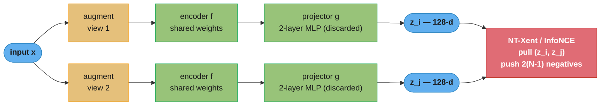
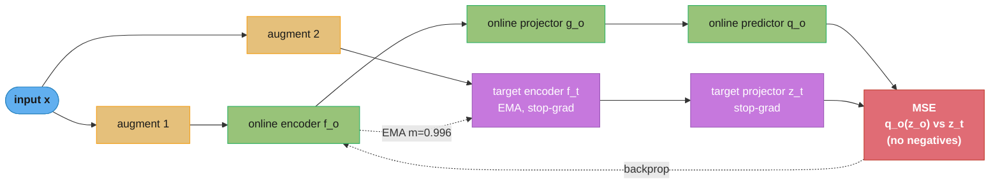
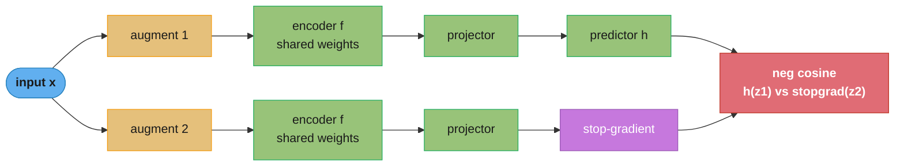
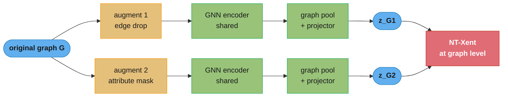

# Self-Supervised and Contrastive Learning

## 1. Concept Overview

Self-supervised learning (SSL) is a machine learning paradigm where supervisory signals are automatically generated from the input data, eliminating the need for human-annotated labels. The model learns general-purpose representations through pretext tasks, which are auxiliary objectives designed so that solving them requires understanding the underlying structure of the data.

SSL is the foundation of modern pre-trained models: BERT, GPT, SimCLR, MAE, and DINO all use self-supervised objectives. The learned representations are then transferred to downstream tasks via linear evaluation or fine-tuning, often matching or exceeding supervised baselines with a fraction of labeled data.

Note: this module covers the general SSL landscape — theoretical foundations, NLP SSL, graph SSL, and tabular SSL. Vision-specific SSL (SimCLR, MAE, DINO, MoCo) is covered in `computer_vision/self_supervised_vision.md`.

---

## 2. Intuition

One-line analogy: SSL is how humans learn language as children — by predicting what comes next, filling in missing words, and understanding context — without anyone labeling each sentence with its meaning.

Mental model: create a game the model must play using only the raw data. The game is designed so the model cannot win by memorizing patterns — it must understand the data's structure. The understanding generalizes.

Why it matters: labeled data is expensive and scarce. ImageNet has 1.2M labeled images. The internet has trillions of unlabeled images. SSL unlocks this data. GPT-4 was trained on trillions of tokens with no human labels — the next-token prediction objective is self-supervised.

Key insight: the pretext task is a proxy. What matters is not solving the pretext task well, but what representations are learned in the process. A poorly designed pretext task can be solved by shortcuts (e.g., detecting JPEG artifacts) that do not generalize.

---

## 3. Core Principles

**Pretext task:** the auxiliary task used to generate training signal from unlabeled data. Must be solvable only by learning useful representations.

**Downstream task:** the real task of interest. The quality of SSL is measured by how well the learned representations perform on downstream tasks with limited labels.

**Data augmentation:** for contrastive learning, augmentation defines what "similar" means. If crop + color jitter produces two views that must match, the model learns to be invariant to crops and color — a useful visual prior. Poor augmentation choices can cause the model to ignore task-relevant features.

**Representation collapse:** contrastive methods without proper design collapse to constant representations (all embeddings identical). Solutions: negative samples (SimCLR), momentum encoder (MoCo), stop-gradient + predictor (BYOL), centering + sharpening (DINO).

**Linear evaluation protocol:** freeze the encoder after SSL pretraining, train only a linear classifier on top. This measures the quality of representations independent of fine-tuning capability. A high linear evaluation score indicates the encoder has separated class structure without labels.

**InfoMax principle:** good representations maximize mutual information I(Z; X) between the representation Z and input X, while discarding task-irrelevant information (noise). Contrastive loss is a lower bound on mutual information.

---

## 4. Types / Architectures / Strategies

**Taxonomy of SSL by mechanism:**

| Category | Mechanism | Examples | Negatives Needed |
|---|---|---|---|
| Predictive (masked) | Mask + predict | BERT (MLM), MAE, BEiT | No |
| Autoregressive | Predict next token/patch | GPT, VideoGPT | No |
| Contrastive | Pull positives, push negatives | SimCLR, MoCo, CPC | Yes |
| Non-contrastive | Asymmetric networks or constraints | BYOL, DINO, Barlow Twins | No |
| Generative | Reconstruct input | VAE, diffusion pretraining | No |
| Graph-specific | Graph augmentations | DGI, GraphCL, GRACE | Depends |
| Tabular-specific | Feature corruption/subset | SCARF, SubTab, VIME | Depends |

**NLP SSL architectures:**

- BERT (MLM): mask 15% of tokens randomly (80% replace with [MASK], 10% random word, 10% unchanged). Predict original tokens at masked positions. Learns bidirectional context.
- GPT (CLM): predict token t+1 given tokens 1..t. Causal attention mask. Naturally scales to any sequence length. Generative capability is a bonus.
- ELECTRA: trains a small generator (BERT-like) to produce plausible replacements. A discriminator (the actual model) predicts which tokens were replaced. All positions are supervised — 4x more sample-efficient than BERT.
- SpanBERT: mask contiguous spans (2–10 tokens) instead of random tokens. Span boundary objective. Better for span-extraction tasks (QA, NER).

**Contrastive learning objectives:**

InfoNCE loss (also called NT-Xent in SimCLR):
```
L = -log( exp(sim(z_i, z_j) / tau) / sum_{k=1}^{2N} 1[k != i] exp(sim(z_i, z_k) / tau) )
```
Where sim is cosine similarity, tau is temperature (0.07–0.2), and the 2N denominator includes 2(N-1) negatives from the batch plus the positive. Lower temperature sharpens the distribution — the model is penalized more for near-misses.

**What this actually says.** "Out of every view in this batch, pick your own twin — the loss is plain cross-entropy over that multiple-choice question."

Reading it as a classification problem is the whole point: the numerator is the one right answer, the denominator is the full answer sheet, and the loss is zero exactly when the model is certain the twin is the twin. That also explains why nothing about the loss changes if you add more wrong answers that are obviously wrong.

| Symbol | What it is |
|--------|------------|
| `z_i` | The anchor — one projected, L2-normalized view of one sample |
| `z_j` | The positive: the *other* augmented view of that same sample. The one right answer |
| `z_k` | Every other view in the batch. The distractors |
| `sim(a, b)` | Cosine similarity of two unit vectors. `+1` = same direction, `0` = unrelated, `-1` = opposite |
| `tau` | Temperature. Divides every similarity before the exponential — a contrast knob |
| `exp(sim/tau)` | Turns a similarity into an unnormalized score. Small `tau` makes small gaps explode |
| `1[k != i]` | "Skip k = i" — an item is not its own negative, which is why the diagonal is masked out |
| `sum_{k}` | The denominator: positive score plus all `2(N-1)` negative scores |
| `-log(...)` | Loss. `0` when the positive owns all the probability, climbing as it loses share |

**Walk one example.** Same anchor, same positive, only the negatives change — `tau = 0.1`:

```
  anchor z_i, one positive z_j, three negatives z_k       tau = 0.1

  EASY negatives (unrelated samples)
                       sim     sim/tau     exp(sim/tau)
    positive  z_j      0.90      9.0           8103.08
    negative  z_k1     0.10      1.0              2.72
    negative  z_k2     0.00      0.0              1.00
    negative  z_k3    -0.10     -1.0              0.37
                                  sum  =       8107.17

    p(positive) = 8103.08 / 8107.17 = 0.999496
    loss = -log(0.999496) = 0.000504       <- already solved, no gradient

  HARD negatives (same class, different instance)
                       sim     sim/tau     exp(sim/tau)
    positive  z_j      0.90      9.0           8103.08
    negative  z_k1     0.85      8.5           4914.77
    negative  z_k2     0.80      8.0           2980.96
    negative  z_k3     0.75      7.5           1808.04
                                  sum  =      17806.85

    p(positive) = 8103.08 / 17806.85 = 0.455054
    loss = -log(0.455054) = 0.787339       <- 1562x the easy-negative loss
```

The anchor and its positive never moved — `sim = 0.90` in both runs — yet the loss jumped by three orders of magnitude. **All of the learning signal lives in the denominator.** This is why "just use a bigger batch" works: a batch of 4096 is not valuable because it has 8190 negatives, it is valuable because a handful of them happen to be hard. It is equally why aggressive false-negative filtering can silently kill training — strip out the near-misses and you are left with the top block, where the loss is `0.0005` and the gradient is effectively zero.

**Why the positive alone is not enough.** Delete the negatives from the denominator and the loss becomes `-log(exp(sim/tau)/exp(sim/tau)) = -log(1) = 0` for *any* pair of vectors, including the degenerate solution where the encoder maps every input to the same point. The negatives are the only term that punishes collapse.

**Graph SSL:**

- DGI (Deep Graph Infomax): maximize mutual information between node embeddings and a global graph summary. Negatives: corrupted graph (shuffle node features). Does not need class labels.
- GraphCL: apply four augmentation types (node dropout, edge dropout, attribute masking, subgraph sampling) to create two views of the same graph. Apply SimCLR contrastive loss at graph level.
- GRACE: node-level contrastive learning with two augmented graph views. Same node in both views is positive pair; other nodes are negatives.

**Tabular SSL:**

- SCARF: randomly corrupt a fraction (20–40%) of features by sampling from their marginal distributions. Predict which features were corrupted. Learns feature correlations.
- SubTab: split features into two subsets (views). Learn representations that reconstruct the other subset from each view.

---

## 5. Architecture Diagrams

### Contrastive Learning (SimCLR / NT-Xent)



Two augmentations of one image become a positive pair; every other view in the batch is a negative. The projector is trained only to satisfy the invariance objective and is thrown away afterward — downstream tasks use the encoder output h, not z.

### BERT — Masked Language Modeling


Only the masked positions contribute to the loss, forcing the model to infer each hidden token from bidirectional context. The 80/10/10 masking mix (mask / random / unchanged) reduces the train/inference mismatch caused by the [MASK] token never appearing at fine-tuning time.

### BYOL — No Negatives (Predictor + EMA Target)



The predictor sits on the online branch only, and gradients never flow through the EMA target (stop-grad). This asymmetry plus the slow-moving target gives the online network a stable but non-trivial thing to predict, so BYOL avoids collapse without a single negative.

### SimSiam — Stop-Gradient, No Momentum Encoder



SimSiam drops BYOL's momentum encoder entirely — collapse is prevented by the predictor plus a stop-gradient on the sibling branch alone. Ablations show removing either the predictor or the stop-gradient collapses the encoder to a constant.

### Graph Contrastive Learning (GraphCL)



GraphCL builds two augmented views of one graph and applies SimCLR's contrastive loss on graph-level embeddings. Augmentation choice is domain-critical: subgraph sampling and attribute masking preserve molecular chemistry, while edge dropout suits social graphs.

---

## 6. How It Works — Detailed Mechanics

```python
import torch
import torch.nn as nn
import torch.nn.functional as F
from torch.utils.data import DataLoader, Dataset
from typing import Tuple, Optional
import numpy as np


# ── NT-Xent (InfoNCE) Loss ───────────────────────────────────────────────────

class NTXentLoss(nn.Module):
    """
    NT-Xent loss from SimCLR.
    Batch of N samples produces 2N augmented views.
    For view i, the positive is view i+N (or i-N).
    All other 2(N-1) views are negatives.
    """
    def __init__(self, temperature: float = 0.07) -> None:
        super().__init__()
        self.temperature = temperature

    def forward(self, z1: torch.Tensor, z2: torch.Tensor) -> torch.Tensor:
        """
        z1, z2: [N, D] — L2-normalized projection vectors
        """
        N = z1.size(0)
        # Concatenate both views: [2N, D]
        z = torch.cat([z1, z2], dim=0)

        # Similarity matrix: [2N, 2N]
        sim = torch.mm(z, z.T) / self.temperature

        # Mask diagonal (self-similarity)
        mask = torch.eye(2 * N, dtype=torch.bool, device=z.device)
        sim = sim.masked_fill(mask, -1e9)

        # Positive pairs: (i, i+N) and (i+N, i)
        # For row i (0..N-1), positive is at col i+N
        # For row i+N (N..2N-1), positive is at col i
        labels = torch.cat([
            torch.arange(N, 2 * N),   # positives for first N rows
            torch.arange(0, N),        # positives for last N rows
        ]).to(z.device)

        loss = F.cross_entropy(sim, labels)
        return loss


# ── SimCLR-style SSL encoder ─────────────────────────────────────────────────

class SimCLR(nn.Module):
    def __init__(
        self,
        encoder: nn.Module,    # backbone (ResNet, transformer, etc.)
        encoder_dim: int,      # output dim of encoder
        projection_dim: int = 128,
        hidden_dim: int = 2048,
    ) -> None:
        super().__init__()
        self.encoder = encoder
        # 2-layer MLP projector (discarded after pretraining)
        self.projector = nn.Sequential(
            nn.Linear(encoder_dim, hidden_dim),
            nn.BatchNorm1d(hidden_dim),
            nn.ReLU(inplace=True),
            nn.Linear(hidden_dim, projection_dim),
        )

    def forward(
        self, x1: torch.Tensor, x2: torch.Tensor
    ) -> Tuple[torch.Tensor, torch.Tensor]:
        h1 = self.encoder(x1)   # [N, encoder_dim]
        h2 = self.encoder(x2)
        z1 = F.normalize(self.projector(h1), dim=1)  # [N, projection_dim]
        z2 = F.normalize(self.projector(h2), dim=1)
        return z1, z2


# ── BYOL (Bootstrap Your Own Latent) — no negatives ─────────────────────────

class BYOL(nn.Module):
    def __init__(
        self,
        encoder: nn.Module,
        encoder_dim: int,
        projection_dim: int = 256,
        prediction_dim: int = 128,
        ema_decay: float = 0.996,
    ) -> None:
        super().__init__()
        # Online network
        self.online_encoder = encoder
        self.online_projector = self._build_mlp(encoder_dim, projection_dim)
        self.online_predictor = self._build_mlp(projection_dim, prediction_dim)

        # Target network: separate copy, updated via EMA (not gradient)
        import copy
        self.target_encoder = copy.deepcopy(encoder)
        self.target_projector = copy.deepcopy(self.online_projector)

        # Freeze target network
        for p in self.target_encoder.parameters():
            p.requires_grad_(False)
        for p in self.target_projector.parameters():
            p.requires_grad_(False)

        self.ema_decay = ema_decay

    @staticmethod
    def _build_mlp(in_dim: int, out_dim: int) -> nn.Sequential:
        return nn.Sequential(
            nn.Linear(in_dim, 4096),
            nn.BatchNorm1d(4096),
            nn.ReLU(inplace=True),
            nn.Linear(4096, out_dim),
        )

    @torch.no_grad()
    def update_target(self) -> None:
        """EMA update: theta_target = m * theta_target + (1-m) * theta_online"""
        m = self.ema_decay
        for p_o, p_t in zip(
            self.online_encoder.parameters(), self.target_encoder.parameters()
        ):
            p_t.data = m * p_t.data + (1 - m) * p_o.data
        for p_o, p_t in zip(
            self.online_projector.parameters(), self.target_projector.parameters()
        ):
            p_t.data = m * p_t.data + (1 - m) * p_o.data

    def forward(
        self, x1: torch.Tensor, x2: torch.Tensor
    ) -> torch.Tensor:
        # Online: encode -> project -> predict
        z1_online = self.online_projector(self.online_encoder(x1))
        z2_online = self.online_projector(self.online_encoder(x2))
        p1 = self.online_predictor(z1_online)  # predictor only on online
        p2 = self.online_predictor(z2_online)

        # Target: encode -> project (stop gradient)
        with torch.no_grad():
            z1_target = self.target_projector(self.target_encoder(x1))
            z2_target = self.target_projector(self.target_encoder(x2))

        # Symmetrized MSE loss (on L2-normalized vectors)
        def regression_loss(q: torch.Tensor, z: torch.Tensor) -> torch.Tensor:
            q = F.normalize(q, dim=1)
            z = F.normalize(z, dim=1)
            return 2 - 2 * (q * z.detach()).sum(dim=1).mean()

        loss = regression_loss(p1, z2_target) + regression_loss(p2, z1_target)
        return loss


# ── SCARF: Self-supervised Contrastive Learning for tabular data ──────────────

class SCARFEncoder(nn.Module):
    def __init__(self, input_dim: int, emb_dim: int = 256,
                 hidden_dim: int = 256, n_layers: int = 4) -> None:
        super().__init__()
        layers: list[nn.Module] = []
        in_d = input_dim
        for _ in range(n_layers):
            layers += [nn.Linear(in_d, hidden_dim), nn.ReLU()]
            in_d = hidden_dim
        layers.append(nn.Linear(hidden_dim, emb_dim))
        self.net = nn.Sequential(*layers)

    def forward(self, x: torch.Tensor) -> torch.Tensor:
        return self.net(x)


class SCARF(nn.Module):
    """
    SCARF: corrupt a fraction of features by sampling from marginal distributions.
    Apply contrastive loss between clean and corrupted views.
    """
    def __init__(
        self,
        encoder: SCARFEncoder,
        corruption_rate: float = 0.6,
        projection_dim: int = 128,
    ) -> None:
        super().__init__()
        self.encoder = encoder
        self.corruption_rate = corruption_rate
        emb_dim = encoder.net[-1].out_features  # type: ignore[union-attr]
        self.projector = nn.Sequential(
            nn.Linear(emb_dim, emb_dim),
            nn.ReLU(),
            nn.Linear(emb_dim, projection_dim),
        )

    def corrupt(
        self, x: torch.Tensor, marginals: torch.Tensor
    ) -> torch.Tensor:
        """
        x: [N, D] — original batch
        marginals: [M, D] — random reference batch drawn from dataset
        For each sample and feature, with probability corruption_rate,
        replace the feature value with a random sample from marginals.
        """
        N, D = x.shape
        mask = torch.rand(N, D, device=x.device) < self.corruption_rate
        # Sample marginals: for each corrupted position, pick a random row
        idx = torch.randint(0, marginals.size(0), (N,), device=x.device)
        x_corrupted = x.clone()
        x_corrupted[mask] = marginals[idx].expand_as(x)[mask]
        return x_corrupted

    def forward(
        self, x: torch.Tensor, marginals: torch.Tensor
    ) -> torch.Tensor:
        x_corrupted = self.corrupt(x, marginals)
        z_clean = F.normalize(self.projector(self.encoder(x)), dim=1)
        z_corrupt = F.normalize(self.projector(self.encoder(x_corrupted)), dim=1)
        loss_fn = NTXentLoss(temperature=0.07)
        return loss_fn(z_clean, z_corrupt)


# ── Graph SSL: DGI (Deep Graph Infomax) ──────────────────────────────────────

class DGI(nn.Module):
    """
    Maximize mutual information between node embeddings and global graph summary.
    Negatives: corrupted graph (shuffled node features).
    """
    def __init__(self, gnn_encoder: nn.Module, hidden_dim: int) -> None:
        super().__init__()
        self.encoder = gnn_encoder
        # Readout: mean of node embeddings -> graph summary
        self.discriminator = nn.Bilinear(hidden_dim, hidden_dim, 1)

    def forward(
        self,
        x: torch.Tensor,           # [N, F] node features
        edge_index: torch.Tensor,
    ) -> torch.Tensor:
        # Positive: real graph
        h_pos = self.encoder(x, edge_index)               # [N, hidden]
        s = h_pos.mean(dim=0, keepdim=True)               # [1, hidden] summary

        # Negative: shuffle node features (breaks node-graph alignment)
        perm = torch.randperm(x.size(0))
        h_neg = self.encoder(x[perm], edge_index)         # [N, hidden]

        # Discriminate: does (node_emb, graph_summary) come from real graph?
        pos_scores = self.discriminator(h_pos, s.expand_as(h_pos))  # [N, 1]
        neg_scores = self.discriminator(h_neg, s.expand_as(h_neg))  # [N, 1]

        pos_loss = F.binary_cross_entropy_with_logits(
            pos_scores, torch.ones_like(pos_scores)
        )
        neg_loss = F.binary_cross_entropy_with_logits(
            neg_scores, torch.zeros_like(neg_scores)
        )
        return pos_loss + neg_loss


# ── Training loop skeleton ────────────────────────────────────────────────────

def ssl_pretrain(
    model: SimCLR,
    loader: DataLoader,
    epochs: int = 200,
    lr: float = 3e-4,
    temperature: float = 0.07,
) -> None:
    criterion = NTXentLoss(temperature=temperature)
    optimizer = torch.optim.Adam(model.parameters(), lr=lr,
                                 weight_decay=1e-6)
    scheduler = torch.optim.lr_scheduler.CosineAnnealingLR(
        optimizer, T_max=epochs
    )

    for epoch in range(epochs):
        model.train()
        total_loss = 0.0
        for x1, x2 in loader:   # augmented view pairs
            z1, z2 = model(x1, x2)
            loss = criterion(z1, z2)
            optimizer.zero_grad()
            loss.backward()
            optimizer.step()
            total_loss += loss.item()
        scheduler.step()
        if epoch % 10 == 0:
            print(f"Epoch {epoch:03d} | Loss: {total_loss / len(loader):.4f} "
                  f"| LR: {scheduler.get_last_lr()[0]:.6f}")
```

**Key hyperparameters and their effects:**
- Temperature tau: lower (0.05) sharpens distribution, harder negatives dominate, risk of unstable gradients. Higher (0.2) softens, easier optimization but weaker representation.
- Batch size: SimCLR needs large batches (4096+) for enough negatives. MoCo maintains a separate queue (65536 negatives) enabling small batches.
- EMA decay (BYOL): 0.996 at start, linear ramp to 0.9999 over training. Too low: target updates too fast, instability. Too high: target barely changes, collapse.
- Projection head: 2-layer MLP with hidden 2048, output 128. Critical insight: use the encoder output (before projector) for downstream tasks — projector throws away task-relevant info to satisfy the invariance objective.

### Decoding the temperature tau

`sim = torch.mm(z, z.T) / self.temperature` is one line of the loss, and it is the line that decides whether training is stable.

**Read it like this.** "Dividing by tau before the softmax is a contrast dial: small tau magnifies tiny similarity gaps into huge probability gaps, large tau flattens real gaps into near-ties."

| Symbol | What it is |
|--------|------------|
| `tau` | Temperature, `0.07` in the code above. Always divides, never multiplies |
| `sim/tau` | The logit. Halving `tau` doubles every logit and doubles every gap between them |
| `softmax(sim/tau)` | Probability mass over the positive and all negatives. What the loss actually scores |
| small `tau` (0.05) | Sharp. The hardest negative dominates the gradient; low loss, high variance |
| large `tau` (0.5) | Flat. Every negative contributes about equally; high loss, weak discrimination |

**Walk one example.** The same hard-negative similarity vector at three temperatures, scores shown relative to the positive so `exp(0.90/tau)` normalizes to `1.0000`:

```
  similarities held fixed: 0.90 (positive), 0.85, 0.80, 0.75 (negatives)

  tau = 0.05    rel exp : 1.0000   0.3679   0.1353   0.0498    sum 1.5530
                softmax :  0.644    0.237    0.087    0.032
                loss = log(1.5530) = 0.4402     <- sharp, positive wins clearly

  tau = 0.10    rel exp : 1.0000   0.6065   0.3679   0.2231    sum 2.1975
                softmax :  0.455    0.276    0.167    0.101
                loss = log(2.1975) = 0.7873     <- SimCLR's default region

  tau = 0.50    rel exp : 1.0000   0.9048   0.8187   0.7408    sum 3.4643
                softmax :  0.289    0.261    0.236    0.214
                loss = log(3.4643) = 1.2425     <- flat, near a 4-way coin flip
```

Now run the *easy* negatives (`0.10 / 0.00 / -0.10`) through the same sweep: loss `0.00000013` at `tau = 0.05`, `0.000504` at `0.10`, `0.4072` at `0.50`. Temperature barely matters when the negatives are far away and matters enormously when they are close — tau is, in effect, a hard-negative amplifier.

**What breaks at each extreme.** At `tau = 0.05` the exponentials span `exp(18)`-scale ratios, so a single hardest negative absorbs nearly the whole gradient; if that negative is a false negative (same class, mislabeled as a distractor), the model is actively taught to separate two things that belong together. At `tau = 0.5` the softmax is nearly uniform, the positive gets only `0.289` of the mass, and the gradient carries almost no information about which negative was wrong — the encoder learns slowly and under-separates. The `0.07–0.2` band in the formula above is the empirical compromise.

### Decoding the batch-size / negative-count effect

**Stated plainly.** "At random initialization the model cannot tell the twin from anything else, so it spreads probability evenly across all `2N-1` candidates and the loss starts at exactly `log(2N-1)`."

| Symbol | What it is |
|--------|------------|
| `N` | Batch size in *samples*, before augmentation |
| `2N` | Total views after two augmentations per sample |
| `2N - 1` | Candidates row `i` scores against: itself is masked out by the diagonal mask |
| `2(N-1)` | Of those, how many are true negatives (the remaining one is the positive) |
| `log(2N-1)` | Starting loss at uniform probability — and the ceiling on the mutual information InfoNCE can certify |

**Walk one example.** Uniform probability `1/(2N-1)` over every candidate:

```
  loss at random init = -log( 1 / (2N-1) ) = log(2N-1)

    batch N        candidates 2N-1      starting loss
       64                127                4.84
      256                511                6.24
     4096               8191                9.01
    MoCo queue        65537               11.09
```

Two consequences worth stating out loud. First, **loss values are not comparable across batch sizes** — a run at `N = 4096` reporting loss `2.1` is far better trained than a run at `N = 64` reporting `2.1`, because the first started at `9.01` and the second at `4.84`. Second, InfoNCE is a lower bound on mutual information that saturates at `log(2N-1)` nats, so at `N = 64` the objective can certify at most `4.84` nats no matter how good the encoder is. That ceiling is the real reason SimCLR needs `4096+`, and the reason MoCo's `65536`-entry queue exists: it buys `11.09` nats of headroom with a small batch, because the queue entries need no gradient.

### Decoding BYOL's regression loss

The line `return 2 - 2 * (q * z.detach()).sum(dim=1).mean()` looks arbitrary until you expand it.

**Put simply.** "Minimizing `2 - 2 cos` is exactly minimizing squared distance between two unit vectors — it says 'point the same way' and says nothing else."

| Symbol | What it is |
|--------|------------|
| `q` | Online prediction, L2-normalized by `F.normalize` |
| `z` | Target projection, L2-normalized and detached from the graph |
| `(q * z).sum(dim=1)` | Dot product of two unit vectors, which for unit vectors *is* the cosine |
| `.detach()` | The stop-gradient. Gradients reach `q` only, never the target branch |
| `2 - 2 cos` | Squared Euclidean distance between the two unit vectors |

**Walk one example.** Expand the squared distance for unit-norm vectors:

```
  ||q|| = ||z|| = 1  (both L2-normalized)

  ||q - z||^2 = ||q||^2 + ||z||^2 - 2 (q . z)
              = 1 + 1 - 2 cos
              = 2 - 2 cos          <- the code, exactly

    cos(q, z)     loss = 2 - 2 cos
       1.0             0.0     same direction -- the target state
       0.9             0.2     close
       0.5             1.0
       0.0             2.0     orthogonal
      -1.0             4.0     opposite -- worst case
```

**Why this loss should collapse, and why it does not.** Note what is missing: no denominator, no negatives, nothing pushing anything apart. Map every input to one constant vector and `cos = 1`, giving loss `0.0` for every pair — a perfect, useless global minimum. The only things standing between BYOL and that solution are the predictor `q_o` on the online branch and the `.detach()` on the target. The online network is chasing a target that lags behind it, so it never catches a stationary point; SimSiam's ablations show that deleting either piece collapses the encoder within a few epochs.

### Decoding the EMA target update

**The idea behind it.** "`theta_target = m * theta_target + (1-m) * theta_online` is a running average — the target is where the online network has *been* lately, not where it is right now."

| Symbol | What it is |
|--------|------------|
| `m` | EMA decay, `0.996` at start, ramping to `0.9999`. How much of the old target is kept |
| `1 - m` | How much of the current online network leaks in each step. `0.004` at `m = 0.996` |
| `theta_online` | The gradient-trained weights |
| `theta_target` | The frozen-by-`requires_grad_(False)` copy, moved only by this arithmetic |
| `1/(1-m)` | Effective memory length in steps — the useful way to read any EMA decay |

**Walk one example.** One scalar parameter, `m = 0.996`:

```
  target = 0.500, online = 1.500

  theta_target <- 0.996 x 0.500 + 0.004 x 1.500
                = 0.498 + 0.006
                = 0.504            <- moved 0.4% of the gap, not 100%

  Memory length 1/(1-m):
    m = 0.996    ->  1 / 0.004  =    250 steps of averaging
    m = 0.9999   ->  1 / 0.0001 = 10000 steps

  After 250 steps at m = 0.996, 0.996^250 = 0.3671 of the original value remains.
```

That `250 -> 10000` ramp is a deliberate stabilization schedule: early in training the online network changes fast and a short-memory target keeps up, while late in training a `10000`-step memory freezes the target into an almost-constant teacher so the representations settle. Set `m` too low and target and online move as one — the asymmetry vanishes and so does the protection against collapse; set it near `1.0` from step zero and the target never learns anything worth predicting.

---

## 7. Real-World Examples

**BERT — NLP foundation:** Trained with MLM on 3.3B tokens (BooksCorpus + Wikipedia) for 1M steps on 64 TPU chips (~4 days). The 15% masking rate is a balance: too few masked tokens = weak signal; too many = insufficient context for prediction. BERT-base (110M params) achieves 84.6 GLUE, outperforming all prior task-specific models simultaneously.

**GPT-4 — autoregressive SSL at scale:** Next-token prediction on ~13 trillion tokens. No explicit label — the next token is the label. At trillion-token scale, the model encounters enough context to implicitly learn reasoning, math, and code. Emergent capabilities arise from scale, not architecture changes.

**MoCo (Facebook AI) — memory bank for negatives:** Addresses SimCLR's large batch requirement. Maintains a FIFO queue of 65536 past encoder outputs as negatives. Encoder for query uses gradient. Encoder for keys uses EMA-updated copy (momentum encoder). Query key pairs are positive; queue entries are negatives. Trains effectively with batch size 256.

**SCARF (Snap Inc.) — tabular SSL:** Applied to click-through rate prediction. 6M+ rows, 200 features, ~0.1% labeled. SCARF pretraining + fine-tuning with 1% labels matched XGBoost trained on 100% labels. Key: feature corruption must sample from marginal distributions (not just zero out) to prevent the model from detecting corruption by absence rather than value.

**GraphCL — molecule property prediction:** Pretrained on 2M unlabeled molecules from ZINC database. Downstream: HIV antiviral activity (1.5K labeled). GraphCL + fine-tuning improved ROC-AUC from 0.74 (supervised only) to 0.80. Subgraph augmentation was most effective for molecular graphs — preserves local chemistry.

---

## 8. Tradeoffs

| Method | Needs Negatives | Batch Size | Collapse Risk | Compute | Downstream Quality |
|---|---|---|---|---|---|
| SimCLR | Yes (batch) | Very large (4096+) | Low (negatives) | High | High |
| MoCo v2 | Yes (queue) | Small (256) | Low | Medium | High |
| BYOL | No | Medium (512) | Medium (need EMA) | Medium | High |
| DINO | No | Medium | Low (centering) | Medium | Very High |
| Barlow Twins | No | Medium | Low (redundancy) | Medium | High |
| BERT MLM | No | Medium | N/A (generative) | High | Very High (NLP) |
| ELECTRA | No | Medium | N/A | Medium | Higher than BERT/compute |

**Representation collapse:** contrastive methods collapse without negatives because the trivially optimal solution (all embeddings identical) minimizes positive distances. BYOL avoids this via the predictor asymmetry + EMA target — the online network must predict a moving target, creating a non-trivial optimization landscape. Barlow Twins avoids collapse via cross-correlation matrix regularization (penalize redundancy between dimensions).

---

## 9. When to Use / When NOT to Use

**Use SSL when:**
- Large unlabeled dataset available, few labeled samples
- Annotation is expensive (medical images, legal documents)
- You want to pretrain a general encoder reused across multiple downstream tasks
- Domain shift is expected — pretrained representations transfer better
- Data augmentation can be designed to preserve task-relevant semantics

**Do NOT use SSL when:**
- Small dataset (<10K samples) with full labels — supervised training directly is simpler
- Data augmentations cannot be designed without destroying task-relevant signal (e.g., tabular data with all features equally important)
- Latency budget prohibits large pretrained encoders
- Task is simple enough for a shallow model (logistic regression on well-engineered features)

**NLP-specific:** always use a pretrained LLM rather than training SSL from scratch. Pretraining cost is prohibitive. Fine-tuning is the standard.

---

## 10. Common Pitfalls

**Pitfall 1 — Augmentation collapse (semantic violation):**
A team trained SimCLR on medical chest X-rays using standard image augmentations including horizontal flips and color jitter. The model learned flip-invariant representations — but left/right asymmetry is diagnostically critical (dextrocardia, pneumothorax laterality). Linear evaluation on pathology classification: 51% accuracy, worse than random for asymmetric conditions. Fix: domain augmentations must be semantically valid. For X-rays: only mild rotation (<15 deg), no flip, no aggressive color distortion.

**Pitfall 2 — Using projector head for downstream tasks:**
A team froze the SimCLR encoder including the projector, then trained a linear head on the projector's 128-dim output. Performance was 12% below the same architecture trained with features from before the projector. The projector is trained to maximize invariance — it discards information useful for fine-grained classification. Fix: always strip the projector after pretraining; use the encoder's final representation (h, not z).

**Pitfall 3 — Representation collapse in BYOL with wrong EMA schedule:**
Setting EMA decay m=0.5 (too low) caused the target network to track the online network too closely, collapsing both to degenerate representations within 10 epochs. Loss reached zero but linear evaluation was 23% (near-random). Fix: start EMA at 0.996, cosine-schedule it to 0.9999 over training. The slow-moving target provides stable pseudo-labels.

**Pitfall 4 — BERT masked token bias:**
The [MASK] token appears only during pretraining (not fine-tuning), creating a train/test mismatch. BERT partially mitigates this by only replacing 80% of chosen tokens with [MASK], 10% with a random word, and 10% with the original. Teams that modify this ratio (e.g., masking 100% with [MASK]) see degraded fine-tuning performance. ELECTRA avoids this entirely — no [MASK] token, uses replaced token detection.

**Pitfall 5 — Ignoring the linear evaluation protocol:**
A team evaluated SSL quality by fine-tuning the full model and comparing to supervised baselines. Fine-tuning can mask poor representations — the additional supervised signal can compensate. They reported excellent results, deployed, and found the pretrained features were not actually generalized. Fix: always report linear evaluation alongside fine-tuning results to diagnose representation quality independently.

---

## 11. Technologies & Tools

| Tool | Purpose | Notes |
|---|---|---|
| HuggingFace Transformers | BERT, GPT, ELECTRA pretraining/fine-tuning | Industry standard |
| VISSL (Facebook) | Vision SSL: SimCLR, MoCo, BYOL, DINO | PyTorch-based, production-ready |
| Lightly AI | SSL for computer vision, active learning | Commercial + open-source |
| PyTorch Lightning | SSL training boilerplate | Simplifies distributed training |
| PyTorch Geometric | Graph SSL: DGI, GraphCL | GNN-specific |
| sentence-transformers | Contrastive learning for text embeddings | SimCSE, NLI supervision |
| SimCSE | Contrastive sentence embeddings | Dropout as augmentation, strong baseline |
| FAISS | ANN search for evaluating embedding quality | Used in retrieval benchmarks |

---

## 12. Interview Questions with Answers

**Q: What is self-supervised learning and how does it differ from unsupervised learning?**
Self-supervised learning is a subset of unsupervised learning that creates supervisory signals automatically from the input data. Traditional unsupervised learning methods (clustering, PCA, autoencoders) aim to model the data distribution or find low-dimensional structure. SSL explicitly trains on a pretext task with generated pseudo-labels — next token prediction, masked token prediction, or predicting one view from another. The distinction matters because SSL produces representations directly optimized for prediction tasks, which transfer significantly better to downstream classification and regression.

**Q: What is the InfoNCE loss and what does it optimize?**
InfoNCE (noise-contrastive estimation) loss is a lower bound on the mutual information I(z_i; z_j) between two views. It optimizes the encoder to make the positive pair's similarity score higher than any negative pair's score. The temperature parameter tau controls sharpness: lower temperature creates a harder classification problem (more focus on near-miss negatives), higher temperature distributes gradient more uniformly. InfoNCE is equivalent to cross-entropy classification where the correct class is the positive pair among 2N-1 candidates.

**Q: How does BYOL avoid representation collapse without negative samples?**
BYOL uses three mechanisms together: (1) an asymmetric predictor network on the online branch only — the online network must predict the target's projection, which is a harder, non-trivial task, (2) a momentum (EMA) target network — the target moves slowly, providing a stable but non-trivial prediction target, and (3) stop-gradient on the target — gradients do not flow through the target network, preventing the trivial solution where both networks collapse together. Remove any single mechanism and collapse occurs.

**Q: What is the difference between linear evaluation and fine-tuning for evaluating SSL representations?**
Linear evaluation freezes the pretrained encoder and trains only a linear classifier on top. This measures the quality of representations independent of subsequent adaptation. Fine-tuning updates all weights with labeled data — the additional capacity can compensate for poor representations. Linear evaluation scores are more diagnostic: if linear evaluation is high (>70% on ImageNet), representations have learned class structure without labels. A high fine-tuning score with low linear evaluation suggests the fine-tuning process is doing the heavy lifting, not the SSL pretraining.

**Q: Why does BERT use a 15% masking rate and what happens if you change it?**
15% is a balance between signal strength and context availability. Too low (5%): too few positions receive gradient signal, learning is slow. Too high (40%): insufficient context remains for the model to accurately predict masked tokens — the task becomes too hard, and the model learns to rely on local statistical patterns rather than long-range semantics. The 15% rate was determined empirically and has remained standard across BERT variants. SpanBERT found that masking contiguous spans (rather than random tokens) is more effective for span-extraction tasks.

**Q: How does the temperature parameter affect contrastive learning?**
Temperature tau (typically 0.07–0.2) controls the sharpness of the softmax distribution over similarities. Low tau: the loss is dominated by the hardest negatives (near-miss samples with high similarity to the anchor). This creates strong gradients when the model nearly confuses a negative for the positive, pushing apart similar-looking negatives aggressively. High tau: softer distribution, more uniform gradient across all negatives, slower convergence but more stable. SimCLR uses tau=0.07, MoCo uses 0.07–0.1. Setting tau too low (<0.03) causes gradient explosion and instability.

**Q: What is ELECTRA and why is it more efficient than BERT?**
ELECTRA trains a discriminator model to detect replaced tokens in a sequence. A small generator (MLM-style) produces plausible token replacements. The discriminator sees every token and predicts which are genuine vs. generated. All N tokens receive gradient signal (not just 15% as in BERT MLM). This makes ELECTRA ~4x more compute-efficient: the same model performance is achieved in 1/4 the compute. The discriminator (the actual model) never sees [MASK] tokens, eliminating the pretraining/fine-tuning mismatch. ELECTRA-base matches BERT-large with 1/4 the FLOPs.

**Q: What augmentation strategies work for graph SSL and why are they different from vision SSL?**
Graph augmentations must preserve graph semantics. Standard augmentations: (1) edge dropout — randomly remove 10–20% of edges, models learn robust to missing connections, (2) node feature masking — zero out 10–30% of node feature dimensions, (3) subgraph sampling — random walk to extract a subgraph, (4) node dropout — remove nodes with low degree. Unlike vision SSL where all augmentations are roughly equivalent, graph augmentations are highly domain-dependent: for molecular graphs, removing edges means breaking bonds (semantically invalid for drug-like properties), so attribute masking works better. For social networks, edge dropout is appropriate.

**Q: How would you apply SSL to a tabular dataset with no natural augmentations?**
Use SCARF (feature corruption): for each training sample, randomly select 20–60% of features and replace their values by sampling from that feature's marginal distribution (computed over the full dataset). This simulates "what if some measurements were taken from a different patient." The model must predict which features were corrupted or use contrastive loss between the clean and corrupted views. Alternative: SubTab — split features randomly into two halves, learn representations that reconstruct each half from the other. Both approaches exploit feature correlations for representation learning.

**Q: What is the SimCSE approach for sentence embeddings?**
SimCSE (Simple Contrastive Learning of Sentence Embeddings) creates positive pairs from a single sentence passed through the encoder twice with different dropout masks. The stochastic nature of dropout (p=0.1) produces two slightly different representations of the same sentence — these are the positive pair. All other sentences in the batch are negatives. This minimal augmentation is sufficient because sentence meaning is preserved, while dropout creates just enough variation. Hard negative version adds NLI-contradictory sentences as explicit negatives. SimCSE improved STS benchmarks by 2–3 points over supervised SimCSE baselines.

**Q: Why do we need a projector in SimCLR and why is it discarded after pretraining?**
The projector (MLP head mapping encoder output to lower-dimensional z) serves two purposes: (1) it absorbs the invariance objective — the contrastive loss forces z to be invariant to augmentations. If this invariance were imposed directly on the encoder, the encoder would lose discriminative information needed for downstream tasks. The projector acts as a "sacrifice layer" that becomes maximally invariant. (2) It prevents the encoder from collapsing — the encoder only needs to encode enough information for the projector to succeed, not be perfectly invariant itself. Empirically, using h (encoder output) instead of z (projector output) for linear evaluation improves accuracy by 10+ points.

**Q: What is the false-negative problem in contrastive learning and how do you mitigate it?**
It is when two samples of the same class land in the batch as a negative pair, so the loss wrongly pushes apart embeddings that should be close. InfoNCE treats every other in-batch sample as a negative, but with few classes or very large batches many "negatives" are actually same-class, injecting label noise that caps representation quality. Mitigations: use supervised contrastive loss (SupCon) when labels exist to pull same-class samples together, raise the temperature slightly to soften penalties, apply debiased contrastive loss, or filter obvious false negatives above a similarity threshold.

**Q: Why is the stop-gradient essential in SimSiam, and how does it differ from BYOL?**
Without the stop-gradient both branches minimize the loss by collapsing to a constant vector, so it is the single mechanism that keeps SimSiam from degenerating. SimSiam uses a predictor on one branch and a stop-gradient on the other, with shared encoder weights, no momentum encoder, and no negatives. BYOL adds an EMA target network; SimSiam's ablations show the EMA is optional but the stop-gradient is not — remove it and linear accuracy crashes to near-random within a few epochs. The predictor plus stop-gradient together create the asymmetry that yields a non-trivial optimization target.

**Q: Why can masked image modeling (MAE) mask 75% of patches while BERT masks only 15% of tokens?**
Because images are spatially redundant, even with 75% of patches hidden the visible ones give enough context, whereas language is information-dense and 15% is already a hard task. A masked pixel patch is highly predictable from its neighbors, so a low masking ratio makes the pretext task trivial (copy adjacent patches); MAE needs aggressive 75% masking to force semantic understanding, and it also makes the encoder cheap by processing only visible patches. Text tokens carry far more information per unit, so masking 40%+ removes too much context and the model falls back on local statistics.

**Q: What is the difference between generative (masked/autoregressive) SSL and contrastive SSL?**
Generative SSL reconstructs or predicts raw data (masked or next tokens), while contrastive SSL learns by pulling augmented views together and pushing others apart in embedding space. Generative methods (BERT MLM, GPT, MAE) need no negatives and directly model the data distribution, which suits language and dense reconstruction; contrastive methods (SimCLR, MoCo) optimize an instance-discrimination objective and depend heavily on augmentation design and negatives. Non-contrastive methods (BYOL, DINO, SimSiam) sit in between — no negatives and no reconstruction, relying on architectural asymmetry to avoid collapse.

**Q: How does DINO avoid representation collapse without negative pairs?**
DINO uses self-distillation with centering and sharpening on the teacher outputs, which together prevent both constant collapse and uniform collapse. A student network matches the softmax output of an EMA teacher across multi-crop views. Centering (subtract a running mean of teacher outputs) stops any one dimension from dominating, while sharpening (a low teacher temperature) stops the output distribution from becoming uniform — the two forces balance each other. This yields emergent object-segmentation attention maps in vision transformers with no labels and no negatives.

**Q: What is dimensional collapse and how do Barlow Twins and VICReg prevent it?**
Dimensional collapse is when embeddings span only a low-dimensional subspace, wasting model capacity even though the vectors are not all identical. Unlike full collapse to a constant, the embeddings still vary but become redundant across dimensions. Barlow Twins pushes the cross-correlation matrix of the two views toward the identity — diagonal ones enforce invariance and off-diagonal zeros enforce decorrelation — so dimensions carry non-redundant information. VICReg makes this explicit with three terms: variance (keep each dimension's std above a floor), invariance (match views), and covariance (decorrelate dimensions). Neither method needs negatives or a momentum encoder.


---

## 13. Best Practices

- Design augmentations first — the augmentation strategy defines the invariances the encoder learns. Wrong augmentations (semantically invalid) produce useless representations.
- Use the encoder output (h), not the projector output (z), for all downstream tasks. The projector is a training artifact.
- For contrastive methods, batch size matters more than epochs. Larger batch = more negatives per step. If GPU memory limits batch size, use MoCo's queue instead.
- Linear evaluation is mandatory for reporting SSL quality. Do not report only fine-tuning results.
- For tabular SSL with SCARF, corruption rate 0.6 is a strong default; tune on a validation set.
- Monitor embedding collapse early: compute average cosine similarity across the batch every epoch. If it exceeds 0.95 before epoch 20, collapse is occurring.
- Use cosine learning rate schedule with warmup (5% of steps) for all SSL methods — loss landscapes are non-convex and sharp early.
- For NLP, do not pretrain from scratch unless you have >10B tokens and >100 GPU-days of compute. Fine-tune existing pretrained models.
- Temperature sweep: try tau in {0.05, 0.07, 0.1, 0.2} on a validation task. Optimal tau is dataset-dependent.
- Projection head dimension 128 is sufficient; increasing to 256 rarely helps after the encoder is >1M parameters.

---

## 14. Case Study

**Scenario: Self-supervised pretraining for product image embeddings.** An e-commerce platform has a 50M-product catalog but only 100k labeled images. SimCLR with an NT-Xent contrastive loss pretrains a ResNet-50 backbone on 200M unlabeled product images, producing 256-dim embeddings. The pretrained encoder powers visual search and a category classifier that reaches strong accuracy with very few labels.

```
200M unlabeled product images
        |
   two augmented views per image (crop, color jitter, blur)
        |
   ResNet-50 encoder f(.) -> 2048d -> projection head g(.) -> 256d
        |
   NT-Xent loss: pull the two views together, push all others apart
        |
   freeze/fine-tune encoder
        |
   +--> visual search: cosine kNN  (recall@100 = 0.87)
   +--> category head: 1k labels   (acc 0.94 vs 0.71 from scratch)
```

Downstream: visual search top-10 recall@100 = 0.87; category classification reaches 0.94 accuracy with only 1k labeled samples, versus 0.71 training from scratch on the same 1k labels. The label efficiency, 23 points from pretraining, is the whole point of SSL here.

**NT-Xent loss (the core of SimCLR):**

```python
import torch
import torch.nn.functional as F

def nt_xent(z1: torch.Tensor, z2: torch.Tensor,
            temperature: float = 0.1) -> torch.Tensor:
    """z1, z2: (B, D) projections of the two augmented views."""
    z = F.normalize(torch.cat([z1, z2], dim=0), dim=1)   # (2B, D)
    sim = z @ z.T / temperature                          # (2B, 2B)
    n = z1.size(0)
    # positive pairs: i <-> i+n
    targets = torch.arange(2 * n, device=z.device)
    targets = (targets + n) % (2 * n)
    sim.fill_diagonal_(float("-inf"))                    # exclude self-similarity
    return F.cross_entropy(sim, targets)
```

**The augmentation pipeline (semantic-preserving):**

```python
import torchvision.transforms as T

def simclr_augment(size: int = 224) -> T.Compose:
    return T.Compose([
        T.RandomResizedCrop(size, scale=(0.4, 1.0)),   # not too aggressive
        T.RandomHorizontalFlip(),
        T.RandomApply([T.ColorJitter(0.4, 0.4, 0.4, 0.1)], p=0.8),
        T.RandomGrayscale(p=0.2),
        T.RandomApply([T.GaussianBlur(kernel_size=23)], p=0.5),
        T.ToTensor(),
    ])
```

**Linear-probe evaluation (frozen encoder, few labels):**

```python
import torch
from torch import nn

def linear_probe(encoder: nn.Module, n_classes: int) -> nn.Module:
    for p in encoder.parameters():
        p.requires_grad = False          # freeze the SSL backbone
    return nn.Sequential(encoder, nn.Linear(2048, n_classes))
```

**Pitfall 1 — Small batch shrinks the NT-Xent denominator.** Contrastive learning needs many negatives; a small batch gives too few, and the embeddings barely separate.

```python
# BROKEN: batch_size=64 -> only 126 negatives, weak contrastive signal
loss = nt_xent(z1, z2)   # with B=64

# FIX: large batch (4096) with mixed precision / gradient accumulation, or a
# memory bank / MoCo queue to supply many negatives without huge batches.
# with B=4096 the denominator has ~8190 negatives -> sharp embeddings
```

**Pitfall 2 — Augmentation too strong destroys the semantic signal.** An extreme crop scale can remove the product entirely, so the two "views" share no content and the model learns nothing useful.

```python
# BROKEN: scale=(0.05, 1.0) crops can contain only background
T.RandomResizedCrop(224, scale=(0.05, 1.0))

# FIX: tune crop scale so both views still contain the product; for product
# images a higher lower-bound (0.4) preserves the object.
T.RandomResizedCrop(224, scale=(0.4, 1.0))
```

**Pitfall 3 — Representation collapse.** Without negatives or an asymmetry, the encoder maps everything to a constant vector that trivially minimizes a naive loss.

```python
# BROKEN: a similarity-only objective with no negatives -> all-equal embeddings
loss = -F.cosine_similarity(z1, z2).mean()   # collapses to a constant

# FIX: keep negatives (SimCLR/NT-Xent), or use an asymmetric design, MoCo's
# momentum encoder or SimSiam's stop-gradient, to prevent collapse.
loss = nt_xent(z1, z2)   # negatives in the denominator prevent collapse
```

**Interview Q&A:**

**Why use self-supervised pretraining when you only have 100k labels?** Labels are expensive, but unlabeled product images are abundant (200M). SSL learns general visual structure from the unlabeled data, so the downstream classifier needs far fewer labels to reach high accuracy (0.94 with 1k labels vs 0.71 from scratch). It converts cheap unlabeled data into label efficiency.

**What does the NT-Xent loss actually optimize?** It is a softmax over cosine similarities scaled by temperature: for each anchor it maximizes similarity to its positive (the other augmented view) relative to all other samples in the batch (negatives). The temperature controls how sharply it penalizes hard negatives; lower temperature emphasizes the hardest negatives.

**Why does batch size matter so much in SimCLR?** The negatives come from the same batch, so a larger batch provides more and harder negatives, which sharpens the learned representation. This is why SimCLR famously used batches of thousands. Methods like MoCo decouple the negative count from batch size using a momentum-updated queue, achieving similar quality with smaller batches.

**What is representation collapse and how do contrastive vs non-contrastive methods avoid it?** Collapse is when the encoder outputs a constant regardless of input, trivially satisfying a similarity objective. Contrastive methods (SimCLR, MoCo) prevent it with negatives that push embeddings apart. Non-contrastive methods avoid it structurally: BYOL/SimSiam use a momentum encoder and/or stop-gradient asymmetry; VICReg/Barlow Twins add variance and decorrelation terms.

**How do you evaluate a self-supervised encoder?** Standard protocol is linear probing, freeze the encoder and train only a linear classifier on a labeled set; the accuracy measures representation quality. Also report fine-tuning accuracy and downstream task metrics (here, kNN visual-search recall). Linear probe isolates representation quality from the capacity of the downstream head.

**Why is the projection head discarded after pretraining?** The projection head g(.) maps features into the space where the contrastive loss is applied, and it absorbs information specific to the pretext task. The backbone features before the head transfer better to downstream tasks, so you keep the encoder output (2048d here) and drop g(.) for inference and fine-tuning.

**Pitfall — Representation collapse when negative mining is too easy.**

```python
# BROKEN: random negatives from the same batch — most pairs are obviously dissimilar
# Contrastive loss saturates near 0; gradients vanish; encoder learns nothing
loss = nt_xent_loss(anchors, positives, random_negatives)  # trivial task, no learning

# FIX: hard negative mining — use in-batch semi-hard negatives (far in label space
# but closer in embedding space than the positive pair)
from pytorch_metric_learning.miners import MultiSimilarityMiner
miner = MultiSimilarityMiner(epsilon=0.1)
hard_pairs = miner(embeddings, labels)
loss = criterion(embeddings, labels, hard_pairs)
# Embedding clustering (silhouette score): 0.12 (random) → 0.61 (hard negatives)
```

**Why does momentum encoder (MoCo) outperform standard contrastive learning at small batch sizes?** Standard contrastive learning (SimCLR) needs large batches (4096+) to have enough negatives per anchor for a meaningful loss signal. MoCo decouples batch size from number of negatives by maintaining a queue of recent encoded negatives (65,536) updated with an exponential moving average (EMA) encoder (momentum=0.999). At batch size 256, MoCo achieves 67.5% ImageNet linear accuracy vs. SimCLR's 61.9%, while using 16× less GPU memory.

**How do you evaluate self-supervised representations without labeled data?** Use probing tasks: train a linear classifier on frozen representations with 1% labeled data (linear evaluation protocol). Report top-1 accuracy. For NLP, run BERTScore on generation tasks or zero-shot classification accuracy on MNLI/SST-2. For vision, use low-shot (1%, 10%) fine-tuning accuracy. The key insight: a good SSL representation should be linearly separable for the downstream task — if you need more than a linear head to get good performance, the representation hasn't disentangled the task-relevant factors.

**What is the role of the projection head in SimCLR, and why is it discarded after training?** SimCLR appends a 2-3 layer MLP projection head after the backbone encoder. The contrastive loss is applied to the projection head's output (z), not the backbone's output (h). Empirically, the representation at h (backbone output) is more general and transfers better to downstream tasks than z (projection output). The projection head specializes in making augmentation-invariant representations — useful for the contrastive loss but too specifically tuned to the SSL task. Discarding it and using h for downstream linear probing or fine-tuning achieves better transfer accuracy by 5-15% on ImageNet linear evaluation.

**How does BYOL (Bootstrap Your Own Latent) avoid representation collapse without negative pairs?** BYOL uses an online encoder and an exponential moving average (EMA) target encoder. The online encoder is trained to predict the target encoder's representation of a differently augmented view of the same image. The EMA prevents both encoders from collapsing to a constant (if both were trained with gradients, they'd converge to outputting the same vector). The asymmetry — one network trained with gradients, one updated only via EMA — creates a stable learning signal without negatives. This is counterintuitive: the model learns by predicting itself, but the moving average target is always slightly "ahead", creating a useful learning signal.

**How do you apply contrastive SSL to tabular data, and what augmentations make sense?** For tabular data, image augmentations (crop, flip) don't apply. Effective tabular augmentations: (1) feature masking — randomly mask 30-50% of features and train the model to recover them (BERT-style MLM for tabular); (2) feature corruption — replace feature values with random samples from the marginal distribution; (3) mixup — blend two rows with a random weight. SCARF (Self-supervised Contrastive Learning using Random Feature Corruption) applies these and achieves competitive downstream classification with 1% labels vs. 100% baseline, particularly valuable in regulated domains (healthcare, finance) where labels are expensive.

**Why does the temperature parameter in NT-Xent loss matter, and how do you tune it?** Temperature τ scales the similarity scores before softmax: `loss = -log(exp(sim(z_i, z_j)/τ) / Σ exp(sim(z_i, z_k)/τ))`. A low τ (e.g., 0.07) sharpens the distribution — the model is penalized heavily for any non-zero similarity to negatives, encouraging tight clusters but risking false-negative penalties (similar images that happen to be different classes are treated as negatives). A high τ (e.g., 0.5) smooths the distribution — more tolerant of false negatives but weaker learning signal. SimCLR uses τ=0.07 as the default for ImageNet; domain-specific datasets with higher class overlap often benefit from τ=0.1-0.2. Tune τ via grid search on linear probe accuracy.

---

**Quick-reference comparison table:**

| Approach | When to use | Trade-off |
|---|---|---|
| Rule-based baseline | Always — establish before ML | Interpretable, brittle on edge cases |
| Simple ML (LR, RF) | < 100k rows, tabular, fast iteration | Lower ceiling than deep models |
| Deep learning | Large data, unstructured input (images/text) | Expensive training, needs GPU |
| Ensembling | Final 1-2% accuracy gain in competition | Complexity, inference latency |
| Distillation/quantization | Inference cost reduction | Accuracy-efficiency trade-off |
