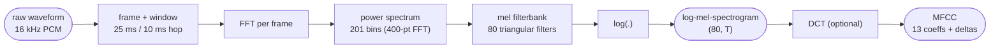
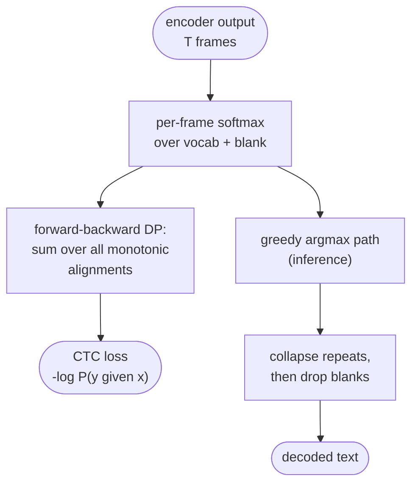
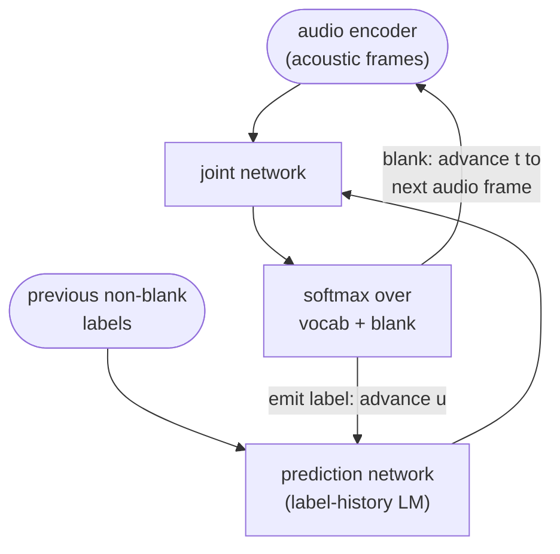
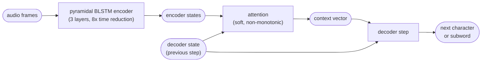
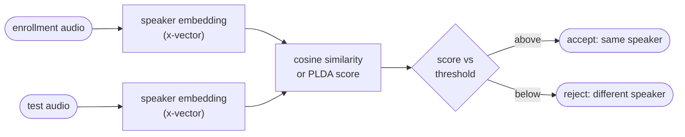
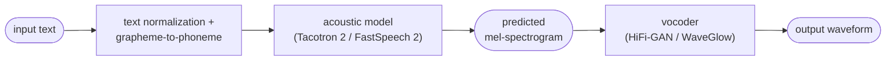
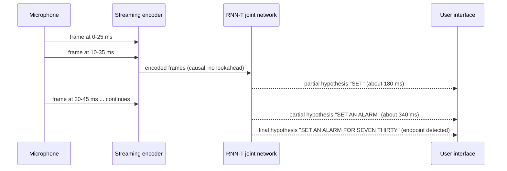
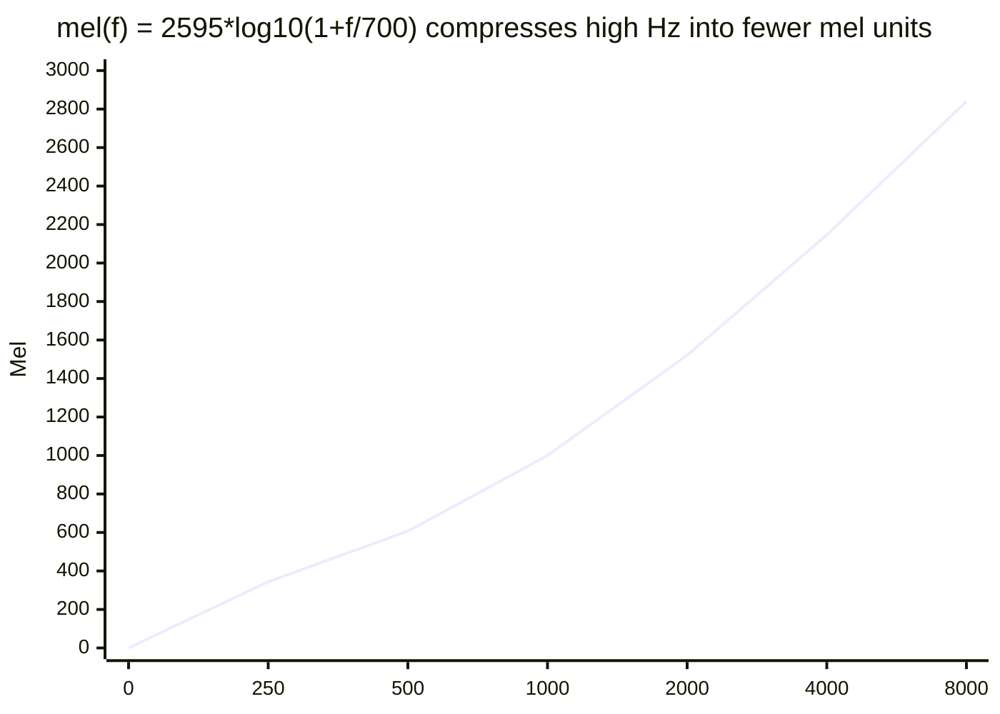

# Speech & Audio Machine Learning

## 1. Concept Overview

Speech and audio machine learning is the discipline of turning acoustic waveforms into structured predictions: transcribed words (automatic speech recognition, ASR), speaker labels (identification, verification, diarization), wake-word triggers (keyword spotting, KWS), and synthesized speech (text-to-speech, TTS). The central engineering problem is representation: a raw waveform sampled at 16,000 samples/second is far too dense and phase-sensitive for a model to consume directly, so nearly every pipeline first converts it into a compact time-frequency representation — a spectrogram, mel-spectrogram, or MFCC — before any acoustic model sees it.

The second central problem is alignment. Text is short (a sentence might be 10 words) while audio is long (the same sentence might span 300 frames), and the mapping between the two is unknown at training time — nobody hand-labels which exact 10 ms frame corresponds to which phoneme. CTC, RNN-Transducer (RNN-T), and attention-based sequence-to-sequence models (LAS) are three different mathematical answers to "how do you train a model when you don't know the alignment between a long input sequence and a short output sequence."

The field has moved through three eras: hand-engineered features (MFCC) feeding GMM-HMM systems (pre-2012); end-to-end deep sequence models (CTC, RNN-T, LAS) trained from spectrograms directly (2012-2019); and today's self-supervised foundation models (wav2vec 2.0, HuBERT, Whisper) that pretrain on hundreds of thousands of hours of raw or weakly-labeled audio and then fine-tune or zero-shot transfer to downstream tasks. This module covers all three eras — the classical representations and CTC/RNN-T/LAS remain the mechanics that every modern system, including Whisper, is still built on top of.

Boundary with the LLM section: [Multimodal Models](../../llm/multimodal_models/README.md) covers how ASR/TTS models are integrated as components of multimodal LLMs (Whisper's training recipe, native speech-to-speech models like GPT-4o realtime). This module covers the audio ML foundations underneath — the representations, alignment algorithms, and evaluation metrics those systems depend on.

---

## 2. Intuition

One-line analogy: audio ML is like teaching someone to read sheet music from a recording of a live performance — you first have to convert the raw sound pressure wave into a note-like grid (a spectrogram) before anything resembling "words" or "phonemes" can be recognized in it.

Mental model: every pipeline is a funnel. Start with 16,000 numbers per second of raw amplitude; frame it into short quasi-stationary chunks; convert each chunk into a frequency-domain fingerprint; compress that fingerprint onto a perceptual scale (mel); optionally decorrelate it (MFCC). Only after this funnel narrows the signal down to roughly 80 numbers per 10 ms frame does an acoustic model — CTC, RNN-T, LAS, or a pretrained transformer — get to work turning those frames into text, speaker labels, or a wake-word decision.

Why it matters: speech is the interface for voice assistants (Siri, Alexa, Google Assistant), meeting transcription (Otter.ai, Zoom), call-center analytics, accessibility captioning, and voice biometrics for authentication. Nearly every one of these products is a composition of the same handful of building blocks covered here: feature extraction, an ASR paradigm, and often a speaker or keyword model running alongside it.

Key insight: alignment is the problem, not classification. Once you accept that the hard part is "which audio frames correspond to which output token, when nobody labeled that mapping," the entire design space of ASR architectures becomes a menu of alignment strategies — CTC marginalizes over all monotonic alignments with a dynamic program, RNN-T does the same but factors in an internal language model and supports streaming, and attention learns a soft, non-monotonic alignment implicitly. Everything else — which network computes the per-frame scores — is a comparatively ordinary sequence-modeling choice.

---

## 3. Core Principles

**Sampling rate and the Nyquist theorem**: a continuous audio signal must be sampled at more than twice the highest frequency it contains to be reconstructed without aliasing (Nyquist-Shannon theorem). Human speech intelligibility lives mostly below 8 kHz, so 16 kHz sampling (Nyquist frequency 8 kHz) is the de facto standard for ASR research and production models (LibriSpeech, wav2vec 2.0, and Whisper all use 16 kHz). Telephone audio is sampled at 8 kHz (Nyquist 4 kHz) — this is exactly why phone calls sound muffled: everything above 4 kHz, including consonant fricatives like "s" and "f", is discarded before transmission.

**Stated plainly.** Nyquist, `f_max = sample_rate / 2`, says: "a recording can only represent frequencies below half its sample rate — everything above that is not merely quiet, it is gone before your model ever loads the file."

The asymmetry is what makes this an operational rule rather than trivia. Upsampling 8 kHz audio to 16 kHz creates a 16 kHz-shaped tensor with an 8 kHz-shaped hole in it, and no exception is raised anywhere.

| Symbol | What it is |
|--------|------------|
| `sample_rate` | Samples captured per second. 8 kHz phone, 16 kHz ASR standard, 44.1 kHz CD |
| `f_max` (Nyquist frequency) | `sample_rate / 2` — the highest frequency the recording can represent |
| Aliasing | What happens to content above `f_max`: it folds back down and masquerades as a lower tone |
| "more than twice" | The strict inequality: a tone exactly at `f_max` can be sampled to a flat line |

**Walk one example.** The three sample rates that show up in practice, and what each throws away:

```
    sample rate        Nyquist = sr/2      what survives           what is lost
    ---------------    ------------      --------------------    ----------------------
    8 kHz  (phone)       4,000 Hz        vowels, low formants    /s/ /f/ fricative energy
    16 kHz (ASR)         8,000 Hz        all speech content      nothing that matters
    44.1 kHz (CD)       22,050 Hz        full audible band       (overkill for ASR)

    Storage at 16-bit mono, 16 kHz: 16,000 samples/s x 2 bytes = 32,000 bytes/s = 32 kB/s

    Going 16 kHz -> 32 kHz doubles storage and compute and buys ASR nothing: speech is
    already fully captured under the 8 kHz Nyquist limit. Going 16 kHz -> 8 kHz halves
    the cost and destroys the fricatives, which is the entire "phone calls sound
    muffled" phenomenon in one division.
```

**Framing and windowing**: speech is non-stationary over long spans (formants shift as the mouth moves) but quasi-stationary over short spans, so every pipeline chops the waveform into short overlapping frames. The industry-standard values are a 25 ms window with a 10 ms hop (60% overlap), which at 16 kHz is exactly 400 samples per window and 160 samples per hop — clean integers, which is part of why this combination became the default. A window function (Hamming or Hann) is applied to each frame before the FFT to taper its edges to zero, reducing the spectral leakage a hard rectangular cut would introduce.

**STFT (Short-Time Fourier Transform)**: applying an FFT to each windowed frame produces a complex spectrum per frame; stacking these across time gives a spectrogram. Most speech tasks discard the phase and keep only the magnitude (or power) spectrogram, because phase is largely perceptually redundant for recognition tasks — though vocoders for TTS must reconstruct or predict it to synthesize audible waveforms.

**Mel scale**: human pitch perception is roughly linear below 1 kHz and logarithmic above it. The mel scale, `mel(f) = 2595 * log10(1 + f/700)`, warps frequency onto this perceptual axis. A mel filterbank (typically 80 overlapping triangular filters) is applied to the power spectrogram, compressing 201 linear FFT bins (from a 400-point FFT) down to 80 mel bins while devoting more resolution to the low frequencies where speech information is densest.

**MFCC (Mel-Frequency Cepstral Coefficients)**: taking the log of the mel-filterbank energies and applying a Discrete Cosine Transform (DCT) decorrelates the mel bands and compacts the energy into a small number of coefficients — 13 is classic, plus delta and delta-delta for velocity/acceleration, giving 39-dim vectors. MFCCs were essential for GMM-HMM systems, which assumed diagonal-covariance Gaussians and needed decorrelated features; modern CNN/transformer acoustic models can learn correlations themselves, so most deep pipelines (Whisper, wav2vec 2.0) skip the DCT and feed the log-mel-spectrogram directly.

**The alignment problem**: an utterance of T audio frames must be mapped to a much shorter sequence of U output tokens, and the correspondence between them is unknown and variable per example. CTC, RNN-T, and attention (LAS) are three distinct solutions, covered fully in Sections 4 and 6.

**Self-supervised pretraining**: rather than requiring aligned (audio, transcript) pairs, models like wav2vec 2.0 mask spans of a learned latent audio representation and train the model to identify the true masked latent among distractors via a contrastive loss, using only raw audio and no labels. A small amount of labeled data — even 10 minutes — is then enough to fine-tune a CTC head on top and reach competitive WER.

**WER (Word Error Rate)**: the standard ASR metric, `WER = (S + D + I) / N`, where S/D/I are substitutions/deletions/insertions from the minimum-edit-distance alignment between hypothesis and reference, and N is the reference word count. Because insertions are unbounded, WER can exceed 100% — this is why it is a rate, not an accuracy, and the two are not interchangeable (full worked example in Section 6).

---

## 4. Types / Architectures / Strategies

### ASR paradigms

| Paradigm | Alignment strategy | Streaming? | Needs external LM? | Notes |
|---|---|---|---|---|
| CTC | Marginalize over monotonic alignments via forward-backward DP + blank token | Yes (frame-synchronous) | Helps, but assumes conditional independence between output tokens | Simple, fast to train; DeepSpeech, wav2vec 2.0 fine-tuning head |
| RNN-Transducer (RNN-T) | Same DP idea as CTC but over a 2D (t, u) lattice with an internal label predictor | Yes — production standard for on-device streaming | Built in (prediction network); can still shallow-fuse an external LM | Google's on-device Gboard/Recorder ASR |
| Attention (LAS) | Learned soft alignment via cross-attention, no conditional-independence assumption | No — needs most of the utterance | Awkward to fuse | Best offline accuracy historically; can skip/repeat words on long or noisy audio |
| Whisper (encoder-decoder + massive weak supervision) | Attention, same family as LAS | Chunked (30 s windows), not frame-streaming | Multitask-trained in; no separate LM needed | 680K hours weakly-supervised training (see [Multimodal Models](../../llm/multimodal_models/README.md)) |
| wav2vec 2.0 / HuBERT + CTC head | Self-supervised pretraining, then CTC fine-tuning | Yes (via the CTC head) | Same as CTC | Best low-resource option — competitive WER from minutes of labeled data |

### Speaker tasks

| Task | Question answered | Output | Typical metric |
|---|---|---|---|
| Speaker identification | "Which of these N known speakers is this?" | Closed-set class label | Top-1 accuracy |
| Speaker verification | "Is this the same speaker as the enrolled voiceprint?" | Binary accept/reject from a similarity score | Equal Error Rate (EER) |
| Speaker diarization | "Who spoke when, in this multi-speaker audio?" | Time-segmented speaker labels (Speaker A / B / C) | Diarization Error Rate (DER) |

### Keyword spotting (KWS)

A small-footprint classifier — a few hundred KB, sometimes under 20K parameters — that runs continuously on-device to detect a fixed wake phrase ("Hey Siri", "OK Google") without streaming audio to the cloud. Production systems typically cascade two models: a tiny always-on detector on a low-power DSP tuned for high recall (and therefore some false accepts), followed by a larger confirmation model on the main application processor that cuts the false-accept rate before waking the full assistant.

### TTS (Text-to-Speech) at a high level

| Stage | Autoregressive (Tacotron 2) | Non-autoregressive (FastSpeech / FastSpeech 2) |
|---|---|---|
| Acoustic model | Attention-based encoder-decoder; generates the mel-spectrogram frame by frame | Transformer with an explicit duration predictor; generates all frames in parallel |
| Alignment source | Learned attention (location-sensitive) | Duration predictor, distilled from a teacher's attention or forced alignment |
| Inference speed | Slow — O(output length) sequential steps | Fast — single forward pass |
| Failure mode | Can skip or repeat words on out-of-distribution text (attention loses track) | Robust to skipping/repeating, but quality is capped by duration-predictor accuracy |
| Vocoder | Converts the predicted mel-spectrogram to a waveform: WaveNet (autoregressive, highest quality, slowest), WaveGlow/HiFi-GAN (parallel, near real-time, standard in production since ~2020) | Same |

Speech encoders built on top of these representations are usually LSTM/GRU or Transformer stacks (see [Recurrent Neural Networks](../recurrent_neural_networks/README.md) for the gating and BPTT mechanics underneath the CTC/RNN-T/LAS encoders and decoders described in Section 6).

---

## 5. Architecture Diagrams

**Audio front-end pipeline — waveform to features:**



Every task-specific pipeline in this module (ASR, speaker, KWS) branches off after the log-mel-spectrogram step; the DCT into MFCC is now optional rather than default for deep models.

**CTC — alignment-free training via forward-backward, and greedy decoding:**



Training marginalizes over every valid alignment via dynamic programming; inference instead takes the single most-likely path per frame and must explicitly collapse it (Section 6, and the ASCII diagram below).

**RNN-Transducer — joint network with a dual advance rule:**



Emitting a real label advances the label position u without consuming new audio; emitting blank advances the audio frame t. This dual-advance rule is what makes RNN-T naturally streaming — everything inferable from frames up to t has already been emitted.

**Attention-based (LAS) encoder-decoder:**



Unlike CTC/RNN-T, nothing here enforces monotonic alignment — the attention weights are free to jump around, which is exactly what allows LAS to skip or repeat words on hard audio.

**Speaker verification pipeline:**



Diarization reuses the same embedding step but replaces the single 1:1 comparison with clustering across many short segments of a multi-speaker recording to assign "who spoke when" labels without a 1:1 threshold decision.

**TTS pipeline:**



**Streaming partial-hypothesis timeline:**



Each partial hypothesis is emitted from only past and current audio, which is the entire reason RNN-T bounds latency to roughly one frame's worth of computation instead of waiting for the whole utterance.

**Mel scale compresses high frequencies:**



Doubling frequency from 250 Hz to 500 Hz adds about 263 mel units, but doubling from 4000 Hz to 8000 Hz adds only about 694 mel units on a much larger Hz range — the mel filterbank spends most of its 80 bins on the low frequencies where phonetic information is densest.

**CTC blank-collapse rule — why the blank symbol must exist:**

```
Frame:                    1    2    3    4    5    6    7    8    9
Raw CTC output:           S    S    _    E    E    _    E    E    _

Step 1 - merge adjacent repeats (S S -> S; each E-run -> one E):
                          S         _    E         _    E         _

Step 2 - drop every blank ("_"):
                          S              E              E

Result: S, E, E -> "SEE" (9 frames collapse to 3 letters)
```

The blank between the two E-runs is not decoration — without it, all four E frames would be adjacent identical symbols and would collapse to a single E, producing "SE" instead of "SEE". This is exactly why CTC needs a blank symbol distinct from every real label: it is the only way to represent a genuinely repeated letter.

**Frame overlap at 25 ms window / 10 ms hop:**

```
ms:           0         10        20        30        40        50
              |         |         |         |         |         |
frame 1:      [=======================]
frame 2:                [=======================]
frame 3:                          [=======================]
frame 4:                                    [=======================]

hop = 10 ms between frame starts; window = 25 ms -> 15 ms (60%) overlap
```

Every point in the middle of the signal is covered by 2-3 overlapping windows, which is why a 1-second clip yields a nominal 100 frames rather than 40 non-overlapping ones — the overlap is what lets short-lived acoustic events (a stop-consonant burst) land fully inside at least one frame.

**Put simply.** The whole front-end is four divisions: "milliseconds become samples by multiplying by the sample rate, the hop sets how many frames per second you get, and the FFT size sets how finely you can tell two frequencies apart."

Every one of these numbers is baked into the trained model. Feature-extraction parameters are model weights in disguise — change the hop from 10 ms to 12.5 ms after training and every frame index the model learned now points at the wrong moment in time.

| Symbol | What it is |
|--------|------------|
| `win_length` | Window length in *samples* = `sample_rate x win_ms / 1000`. 400 at 16 kHz / 25 ms |
| `hop_length` | Samples between consecutive frame *starts* = `sample_rate x hop_ms / 1000`. 160 here |
| `n_fft` | FFT size. Set equal to `win_length` (400) in Whisper's convention — no zero-padding |
| frames/sec | `sample_rate / hop_length` — set by the hop alone, not by the window |
| bins | `n_fft / 2 + 1` — real-valued input gives a symmetric spectrum, so half of it plus DC |
| bin spacing | `sample_rate / n_fft` Hz — the frequency resolution of one FFT bin |
| overlap | `(win_ms - hop_ms) / win_ms` — how much of each frame it shares with its neighbour |

**Walk one example.** Every front-end number in this module, derived from four inputs:

```
    Given: sample_rate = 16,000 Hz, window = 25 ms, hop = 10 ms, n_fft = 400

    Time axis
      win_length  = 16000 x 0.025  =  400 samples    <- one FFT input frame
      hop_length  = 16000 x 0.010  =  160 samples    <- distance between frame starts
      overlap     = (25 - 10) / 25 = 0.60            <- 15 ms shared with each neighbour
      coverage    = 25 / 10        = 2.5             <- each instant sits in 2-3 frames
      frames/sec  = 16000 / 160    = 100             <- the "nominal 100 fps" figure

    Frequency axis
      bins        = 400 / 2 + 1    = 201             <- matches the 201 in the diagram
      bin spacing = 16000 / 400    = 40 Hz per bin   <- frequency resolution
      top bin     = 200 x 40       = 8,000 Hz        <- exactly the Nyquist frequency

    Exact frame count, 10-second clip = 160,000 samples
      1 + (160000 - 400) // 160 = 1 + 997 = 998 frames

    998, not 1000: the first frame consumes a full 400-sample window before any hop
    happens, and the leftover tail at the end is too short to start another window.
    "100 frames per second" is the nominal rate; the exact count is the floor formula.
```

**Why window and hop are two separate knobs.** The window sets *frequency* resolution (longer window = narrower bins = finer pitch detail) while the hop sets *time* resolution (smaller hop = more frames per second). They trade against each other — this is the time-frequency uncertainty principle. A 100 ms window would give 10 Hz bins but smear a 30 ms stop consonant into mush; a 5 ms window would catch every transient but at 200 Hz bins, too coarse to separate formants. 25 ms / 10 ms is the empirical compromise, and the fact that it lands on the round integers 400 and 160 at 16 kHz is a large part of why it stuck.

---

## 6. How It Works — Detailed Mechanics

### Loading audio and verifying the sample rate

```python
import torch
import torchaudio
from torch import Tensor

TARGET_SR = 16_000  # Hz - matches wav2vec 2.0, Whisper, and LibriSpeech training data


def load_and_resample(path: str, target_sr: int = TARGET_SR) -> Tensor:
    """Load audio and resample it to the model's expected sampling rate.

    Silently accepting whatever sample rate the file has is a common production
    bug: 8 kHz telephone audio fed into a 16 kHz-trained model degrades WER
    sharply (see Common Pitfalls, War Story 2) without ever raising an error.
    """
    waveform, sr = torchaudio.load(path)              # (channels, samples)
    if waveform.shape[0] > 1:
        waveform = waveform.mean(dim=0, keepdim=True)  # downmix to mono
    if sr != target_sr:
        waveform = torchaudio.functional.resample(waveform, sr, target_sr)
    return waveform.squeeze(0)                          # (samples,)
```

### Framing, windowing, and the STFT

```python
import numpy as np
import numpy.typing as npt


def frame_signal(
    signal: npt.NDArray[np.float32],
    sample_rate: int = TARGET_SR,
    win_ms: float = 25.0,
    hop_ms: float = 10.0,
) -> npt.NDArray[np.float32]:
    """Slice a 1-D waveform into overlapping, Hamming-windowed frames.

    25 ms / 10 ms is the industry-standard framing: at 16 kHz that is exactly
    win_length=400 samples, hop_length=160 samples (60% frame overlap).
    """
    win_length = int(sample_rate * win_ms / 1000)   # 400 samples
    hop_length = int(sample_rate * hop_ms / 1000)   # 160 samples
    window = np.hamming(win_length).astype(np.float32)

    num_frames = 1 + (len(signal) - win_length) // hop_length
    frames = np.stack([
        signal[i * hop_length: i * hop_length + win_length] * window
        for i in range(num_frames)
    ])
    return frames   # (num_frames, win_length)
```

### Mel-spectrogram and MFCC

```python
import torchaudio.transforms as T

mel_transform = T.MelSpectrogram(
    sample_rate=TARGET_SR,
    n_fft=400,          # matches the 25 ms window exactly (Whisper's convention)
    win_length=400,
    hop_length=160,     # 10 ms hop -> a nominal 100 frames/sec
    n_mels=80,          # 80 mel bins - Whisper base through large-v2 default
    power=2.0,          # power spectrogram, not amplitude
)
# Whisper's large-v3 checkpoint switched to 128 mel bins; 80 remains the
# most common baseline and is what this module uses throughout.

mfcc_transform = T.MFCC(
    sample_rate=TARGET_SR,
    n_mfcc=13,
    melkwargs={"n_fft": 400, "hop_length": 160, "n_mels": 80},
)


def extract_features(waveform: Tensor) -> tuple[Tensor, Tensor]:
    log_mel = torch.log(mel_transform(waveform) + 1e-6)   # (80, T)
    mfcc = mfcc_transform(waveform)                          # (13, T)
    return log_mel, mfcc
```

**The idea behind it.** The MFCC pipeline is a chain of deliberate compressions: "start with 400 raw samples of a 25 ms slice and squeeze them down to 13 numbers, throwing away — in order — phase, then linear frequency resolution, then dynamic range, then inter-band correlation."

Each stage discards something a specific downstream consumer did not need. Reading it as a lossy funnel rather than a list of transforms is what makes the modern "skip the DCT" decision obvious.

| Stage | What it is |
|-------|------------|
| Power spectrum | The squared FFT magnitude. Squaring discards phase, keeping only "how much energy" |
| Mel filterbank | 80 overlapping triangular filters, dense at low Hz, wide at high Hz, per `mel(f)` |
| `log(.)` | Compresses dynamic range — matches loudness perception and turns products into sums |
| DCT | Decorrelates the 80 correlated mel bands; energy concentrates in the first few coefficients |
| Keep first 13 | Cepstral truncation: the low coefficients are the vocal-tract shape, the rest is pitch/noise |
| delta / delta-delta | First and second time-derivatives, `13 x 3 = 39`, giving velocity and acceleration |

**Walk one example.** One 25 ms frame at 16 kHz, dimension by dimension:

```
    stage                          dims/frame     what just happened
    --------------------------     ----------     -----------------------------------
    windowed samples                    400       25 ms of audio, Hamming-tapered
    |FFT|^2 power spectrum              201       40 Hz per bin, spanning 0 - 8000 Hz
    mel filterbank (80 triangles)        80       201 / 80 = 2.51x compression
    log(.)                               80       dynamic range compressed
    DCT, keep the first 13               13       decorrelated; 80 / 13 = 6.2x more
    + delta + delta-delta                39       13 x 3, the classic GMM-HMM feature

    Total funnel: 400 -> 39 is a 10.3x reduction per frame, before any model runs.

    Deep pipelines (Whisper, wav2vec 2.0) stop after log(.) and feed all 80 dims.
```

**Why the mel warp is not just "fewer bins".** It is a *non-uniform* rebinning, and the `mel(f) = 2595 * log10(1 + f/700)` curve is where the non-uniformity comes from:

```
    band            mel span              Hz span      mel units per Hz
    -----------     -----------------     -------      ----------------
    250 -> 500      344.2 -> 607.4        250 Hz            1.053
    4000 -> 8000    2146.1 -> 2840.0     4000 Hz            0.173

    Ratio: 1.053 / 0.173 = 6.07x more mel resolution per Hz down where speech lives.
```

Both bands are a single doubling of frequency, yet the low one earns `263.3` mel units and the high one only `694.0` across a range 16x wider. That is the filterbank spending its 80 filters where phonetic information actually is. A uniform 80-bin rebinning of the 201 FFT bins would give every 40 Hz slice equal weight and waste most of its capacity above 4 kHz.

**Why modern models drop the DCT.** The DCT exists to decorrelate, and it exists only because GMM-HMM systems assumed diagonal-covariance Gaussians — a model that literally cannot represent correlations between input dimensions. A CNN or transformer models correlations natively, so the DCT now only destroys information (the discarded coefficients 14-80) for no benefit, and it also breaks the local structure a convolution wants to exploit along the frequency axis. That is the whole reason Whisper and wav2vec 2.0 stop at the log-mel.

### CTC loss and greedy decoding

```python
import torch.nn as nn
import torch.nn.functional as F

BLANK_ID = 0
ctc_loss_fn = nn.CTCLoss(blank=BLANK_ID, zero_infinity=True)


def ctc_training_step(
    log_probs: Tensor,       # (T, batch, vocab_size) - already log_softmax'd
    targets: Tensor,         # (batch, max_target_len)
    input_lengths: Tensor,   # (batch,) - real (unpadded) frame counts
    target_lengths: Tensor,  # (batch,) - real (unpadded) label counts
) -> Tensor:
    return ctc_loss_fn(log_probs, targets, input_lengths, target_lengths)


def ctc_greedy_decode(log_probs: Tensor, id_to_char: dict[int, str]) -> str:
    """Greedy CTC decode: argmax per frame, then collapse repeats, then drop blanks.

    Skipping the "collapse repeats" step is a classic bug (War Story 3): it turns
    "hello" into "hheelllloo" because each character is naturally held for
    several consecutive frames, exactly like the "SEE" example in Section 5.
    """
    ids = log_probs.argmax(dim=-1).tolist()   # one id per frame
    collapsed: list[int] = []
    prev = None
    for i in ids:
        if i != prev:                # merge adjacent repeats
            collapsed.append(i)
        prev = i
    return "".join(id_to_char[i] for i in collapsed if i != BLANK_ID)  # drop blanks
```

### RNN-Transducer joint network

```python
class RNNTJointNetwork(nn.Module):
    """Combines the audio encoder state and the label-history state at each
    (t, u) lattice cell, producing a distribution over vocab + blank.

    Emitting a real label advances u (consumes a label, same audio frame);
    emitting blank advances t (moves to the next audio frame). This dual
    advance is what makes RNN-T naturally streaming: everything inferable from
    frames <= t has already been emitted before frame t+1 arrives.
    """

    def __init__(self, enc_dim: int, pred_dim: int, joint_dim: int, vocab_size: int) -> None:
        super().__init__()
        self.enc_proj = nn.Linear(enc_dim, joint_dim)
        self.pred_proj = nn.Linear(pred_dim, joint_dim)
        self.output = nn.Linear(joint_dim, vocab_size + 1)   # +1 for blank

    def forward(self, enc_out: Tensor, pred_out: Tensor) -> Tensor:
        # enc_out: (batch, T, enc_dim)   pred_out: (batch, U, pred_dim)
        enc = self.enc_proj(enc_out).unsqueeze(2)       # (batch, T, 1, joint_dim)
        pred = self.pred_proj(pred_out).unsqueeze(1)    # (batch, 1, U, joint_dim)
        joint = torch.tanh(enc + pred)                   # (batch, T, U, joint_dim)
        return self.output(joint)                        # (batch, T, U, vocab+1)


# torchaudio >= 0.10 ships the RNN-T loss as a fused, memory-efficient kernel
import torchaudio.functional as AF

loss = AF.rnnt_loss(
    logits=joint_logits,           # (batch, T, U+1, vocab+1), pre-softmax
    targets=targets,               # (batch, U)
    logit_lengths=input_lengths,   # (batch,)
    target_lengths=target_lengths,
    blank=BLANK_ID,
)
```

### Attention-based (LAS) decoding

```python
# Reuses the same Bahdanau-style cross-attention mechanics as
# ../recurrent_neural_networks/README.md - the query is the decoder state, the
# keys/values are the pyramidal encoder's outputs.
class LASDecoder(nn.Module):
    def __init__(self, vocab_size: int, hidden_size: int, enc_dim: int) -> None:
        super().__init__()
        self.embedding = nn.Embedding(vocab_size, hidden_size)
        self.attention = nn.MultiheadAttention(hidden_size, num_heads=4, batch_first=True)
        self.enc_key_proj = nn.Linear(enc_dim, hidden_size)
        self.rnn = nn.LSTMCell(hidden_size * 2, hidden_size)
        self.out = nn.Linear(hidden_size, vocab_size)

    def step(
        self, prev_token: Tensor, h: Tensor, c: Tensor, encoder_states: Tensor,
    ) -> tuple[Tensor, Tensor, Tensor]:
        query = self.embedding(prev_token).unsqueeze(1)             # (batch, 1, hidden)
        keys = self.enc_key_proj(encoder_states)                     # (batch, T', hidden)
        context, _ = self.attention(query, keys, keys)                # (batch, 1, hidden)
        rnn_input = torch.cat([query.squeeze(1), context.squeeze(1)], dim=-1)
        h, c = self.rnn(rnn_input, (h, c))
        return self.out(h), h, c
```

### wav2vec 2.0 self-supervised pretraining and fine-tuning

```python
def wav2vec2_contrastive_loss(
    context_vectors: Tensor,    # (batch, T, dim) - transformer output at masked steps
    quantized_targets: Tensor,  # (batch, T, dim) - true quantized latent per step
    distractors: Tensor,        # (batch, T, K, dim) - K negatives from the same utterance
    temperature: float = 0.1,
) -> Tensor:
    """InfoNCE-style loss: identify the true quantized latent among K distractors
    for each masked timestep, using cosine similarity. This is the same InfoNCE
    family as ../self_supervised_and_contrastive_learning/README.md's NT-Xent
    loss, applied to masked spans of audio instead of augmented image views.
    """
    pos_sim = F.cosine_similarity(context_vectors, quantized_targets, dim=-1) / temperature
    neg_sim = F.cosine_similarity(
        context_vectors.unsqueeze(2), distractors, dim=-1
    ) / temperature                                        # (batch, T, K)
    logits = torch.cat([pos_sim.unsqueeze(-1), neg_sim], dim=-1)   # positive is index 0
    labels = torch.zeros(logits.shape[:-1], dtype=torch.long, device=logits.device)
    return F.cross_entropy(logits.view(-1, logits.size(-1)), labels.view(-1))


# The feature encoder that produces context_vectors is a stack of seven 1-D
# convolutional layers over the raw waveform (see
# ../convolutional_neural_networks/README.md for the receptive-field/stride
# math), downsampling 16 kHz audio to roughly 49 latent frames per second
# before the Transformer context network and the loss above ever run.

# Fine-tuning: freeze (or lightly fine-tune) the pretrained transformer, add a
# linear CTC head, and train on as little as 10 minutes of labeled audio - the
# original paper reports 4.8/8.2 WER on LibriSpeech test-clean/test-other from
# just 10 minutes of labels plus 53,000 hours of unlabeled pretraining audio.
from transformers import Wav2Vec2ForCTC, Wav2Vec2Processor

processor = Wav2Vec2Processor.from_pretrained("facebook/wav2vec2-base-960h")
model = Wav2Vec2ForCTC.from_pretrained("facebook/wav2vec2-base-960h")
for param in model.wav2vec2.feature_extractor.parameters():
    param.requires_grad = False   # freeze the CNN feature encoder; fine-tune the rest
```

### Speaker embeddings (x-vector) and Equal Error Rate

```python
class XVectorExtractor(nn.Module):
    """TDNN frame-level layers -> statistics pooling -> segment-level embedding.

    Statistics pooling (mean + std across time) is what converts a variable-length
    utterance into a single fixed-size speaker embedding.
    """

    def __init__(self, in_dim: int = 80, hidden: int = 512, emb_dim: int = 512) -> None:
        super().__init__()
        self.tdnn = nn.Sequential(
            nn.Conv1d(in_dim, hidden, kernel_size=5, dilation=1), nn.ReLU(),
            nn.Conv1d(hidden, hidden, kernel_size=3, dilation=2), nn.ReLU(),
            nn.Conv1d(hidden, hidden, kernel_size=3, dilation=3), nn.ReLU(),
        )
        self.embedding = nn.Linear(hidden * 2, emb_dim)   # *2 for mean + std

    def forward(self, log_mel: Tensor) -> Tensor:
        # log_mel: (batch, 80, T)
        frames = self.tdnn(log_mel)                            # (batch, hidden, T')
        mean = frames.mean(dim=-1)
        std = frames.std(dim=-1)
        stats = torch.cat([mean, std], dim=-1)                   # (batch, hidden*2)
        return F.normalize(self.embedding(stats), dim=-1)        # unit-norm embedding


def compute_eer(genuine_scores: npt.NDArray, impostor_scores: npt.NDArray) -> tuple[float, float]:
    """Sweep thresholds to find where False Accept Rate equals False Reject Rate.

    Returns (eer, threshold). Strong VoxCeleb x-vector/ECAPA-TDNN systems reach
    an EER around 1-2%; legacy i-vector/PLDA systems were closer to 5-8%.
    """
    thresholds = np.linspace(-1.0, 1.0, 2001)
    far = np.array([(impostor_scores >= t).mean() for t in thresholds])
    frr = np.array([(genuine_scores < t).mean() for t in thresholds])
    idx = np.argmin(np.abs(far - frr))
    eer = (far[idx] + frr[idx]) / 2
    return float(eer), float(thresholds[idx])
```

### SpecAugment

```python
time_mask = T.TimeMasking(time_mask_param=40)      # mask up to 40 consecutive frames
freq_mask = T.FrequencyMasking(freq_mask_param=27)  # mask up to 27 consecutive mel bins


def spec_augment(log_mel: Tensor, training: bool, num_masks: int = 2) -> Tensor:
    """Apply SpecAugment (Park et al., 2019) directly on the log-mel-spectrogram.

    Must ONLY run during training (see Common Pitfalls, War Story 4); masking
    at inference time destroys real information the model needs to decode.
    """
    if not training:
        return log_mel
    augmented = log_mel
    for _ in range(num_masks):
        augmented = freq_mask(time_mask(augmented))
    return augmented
```

### TTS length regulator (FastSpeech-style, non-autoregressive)

```python
def length_regulator(phoneme_embeddings: Tensor, durations: Tensor) -> Tensor:
    """FastSpeech's core non-autoregressive trick: expand each phoneme embedding
    to as many frames as its predicted duration, producing a frame-level
    sequence the acoustic model decodes in a single parallel forward pass, with
    no attention alignment needed at inference time.
    """
    expanded = []
    for emb, dur in zip(phoneme_embeddings, durations.round().long()):
        expanded.append(emb.unsqueeze(0).expand(int(dur.item()), -1))
    return torch.cat(expanded, dim=0)   # (total_frames, embed_dim)
```

### The WER metric — worked example

```python
def word_errors(reference: str, hypothesis: str) -> tuple[int, int, int, int]:
    """Minimum-edit-distance alignment between two word sequences.
    Returns (substitutions, deletions, insertions, reference_word_count).
    """
    ref, hyp = reference.split(), hypothesis.split()
    n, m = len(ref), len(hyp)
    dp = [[0] * (m + 1) for _ in range(n + 1)]
    for i in range(n + 1):
        dp[i][0] = i
    for j in range(m + 1):
        dp[0][j] = j
    for i in range(1, n + 1):
        for j in range(1, m + 1):
            if ref[i - 1] == hyp[j - 1]:
                dp[i][j] = dp[i - 1][j - 1]
            else:
                dp[i][j] = 1 + min(dp[i - 1][j - 1], dp[i - 1][j], dp[i][j - 1])
    # backtrace to split the single edit-distance number into S/D/I
    i, j = n, m
    s = d = ins = 0
    while i > 0 or j > 0:
        if i > 0 and j > 0 and ref[i - 1] == hyp[j - 1]:
            i, j = i - 1, j - 1
        elif i > 0 and j > 0 and dp[i][j] == dp[i - 1][j - 1] + 1:
            s += 1; i, j = i - 1, j - 1
        elif i > 0 and dp[i][j] == dp[i - 1][j] + 1:
            d += 1; i -= 1
        else:
            ins += 1; j -= 1
    return s, d, ins, n


reference = "PLEASE SET AN ALARM FOR SEVEN THIRTY IN THE MORNING"
hypothesis = "OK PLEASE SET AN ALARM FOR SEVEN THIRTEEN THE MORNING"
s, d, ins, n = word_errors(reference, hypothesis)
wer = (s + d + ins) / n * 100
print(f"S={s} D={d} I={ins} N={n} WER={wer:.1f}%")
# S=1 D=1 I=1 N=10 WER=30.0%
# "THIRTY" -> "THIRTEEN" is a substitution, "IN" is deleted, "OK" is an
# inserted hallucination. Because insertions are unbounded, a hypothesis that
# hallucinates many extra words can push WER past 100% - something that
# cannot happen with a bounded, per-instance classification accuracy.
```

**What it means.** `WER = (S + D + I) / N` reads: "count every edit a proofreader would have to make to turn the model's transcript into the truth, then divide by how long the truth was."

The denominator is the reference length, not the hypothesis length — and that single asymmetry is the source of every WER surprise, including the >100% one.

| Symbol | What it is |
|--------|------------|
| `S` | Substitutions — a reference word the model got wrong ("THIRTY" heard as "THIRTEEN") |
| `D` | Deletions — a reference word the model never emitted ("IN" dropped) |
| `I` | Insertions — a word the model emitted that is not in the reference ("OK" hallucinated) |
| `N` | Reference word count. **Only the reference** — insertions never grow the denominator |
| `C` | Correct words. `N = S + D + C`, so `I` is the one term outside that identity |
| minimum-edit-distance | The alignment is the *cheapest* S/D/I combination, found by the DP table above |

**Walk one example.** The exact transcript pair from the code, aligned word by word:

```
    ref:  -   PLEASE  SET  AN  ALARM  FOR  SEVEN  THIRTY    IN  THE  MORNING
    hyp:  OK  PLEASE  SET  AN  ALARM  FOR  SEVEN  THIRTEEN  -   THE  MORNING
    op:   I   ok      ok   ok  ok     ok   ok     S         D   ok   ok

    N = 10   reference words (OK is not in the reference, so it never counts toward N)
    C =  8   correct
    S =  1   THIRTY -> THIRTEEN
    D =  1   IN dropped
    I =  1   OK hallucinated at the front
             check: N = S + D + C = 1 + 1 + 8 = 10  ok

    WER = (S + D + I) / N = (1 + 1 + 1) / 10 = 0.30 = 30.0%
```

Note that only `S` and `D` are capped by `N` — together they can never exceed 10 here. `I` has no ceiling at all:

```
    Same 10-word reference, a model that hallucinates 15 extra words and gets the
    rest right:

      S = 0,  D = 0,  I = 15,  N = 10
      WER = (0 + 0 + 15) / 10 = 1.50 = 150%

    A "150% error rate" is not a bug. It is what happens when a metric divides an
    unbounded numerator by a fixed denominator.
```

**Why the alignment must be minimum-edit-distance.** Without the "cheapest edit path" rule, `S`, `D`, and `I` are not well defined — a single misheard word could be scored as one substitution *or* as one deletion plus one insertion, and the second reading costs twice as much. The DP table above forces the cheapest reading, which is why WER is reproducible across implementations. What is *not* standardized is text normalization: casing, punctuation, and number formatting ("SEVEN THIRTY" vs "7:30") each shift WER by several points, which is why two WER numbers computed under different normalizers cannot be compared at all.

---

## 7. Real-World Examples

**Whisper (OpenAI)**: a production-grade multilingual ASR/translation model trained on 680,000 hours of weakly-supervised web audio; the full training recipe and its integration as a component of multimodal LLMs lives in [Multimodal Models](../../llm/multimodal_models/README.md). This module's mel-spectrogram parameters — 400-point FFT, 160-sample hop, 80 mel bins — are literally Whisper's own front-end configuration.

**Google Gboard / Android Recorder (on-device RNN-T)**: Google shipped a fully on-device streaming RNN-T recognizer for Gboard voice typing, chosen specifically because RNN-T's frame-synchronous decoding needs no server round-trip and bounds first-partial latency, unlike server-side LAS/Whisper-style batch transcription.

**Apple "Hey Siri" (cascaded keyword spotting)**: Apple's published design runs a small always-on DNN on a low-power Always-On Processor to catch candidate wake-word segments, then hands off to a larger confirmation model on the main processor before waking the full assistant — trading a higher false-accept rate on the tiny always-on model for near-zero standby power, then cleaning up false accepts with the bigger second-stage model.

**Call-center analytics (diarization)**: speaker diarization (x-vector embeddings plus clustering) is the standard way production systems split a recorded call into "agent" and "customer" turns before running sentiment analysis, compliance keyword search, or QA scoring on each speaker's segments independently.

**Voice biometrics for banking authentication**: speaker-verification systems used for phone-based identity checks typically target EER in the 1-3% range, with the acceptance threshold set as a deliberate business tradeoff between fraud risk (false accepts) and customer friction (false rejects).

**wav2vec 2.0 for low-resource languages**: the original wav2vec 2.0 paper (Baevski et al., 2020) showed that pretraining on 53,000 hours of unlabeled audio and fine-tuning on just 10 minutes of labeled data reached a WER of 4.8/8.2 on LibriSpeech test-clean/test-other — a result that made ASR viable for languages with little to no transcribed data.

---

## 8. Tradeoffs

**ASR paradigm tradeoffs:**

| Paradigm | Training complexity | Inference latency | Typical data need | Best WER regime |
|---|---|---|---|---|
| CTC | Simple (single loss) | Fast, near non-autoregressive decode | Large labeled corpus | Good, but behind RNN-T/attention on hard audio due to conditional independence |
| RNN-T | Moderate (2D lattice loss, memory-heavy) | Lowest — frame-synchronous, streaming | Large labeled corpus | Best of the streaming options |
| LAS / Attention | Simple loss (cross-entropy), but exposure bias at inference | Highest — needs full/most of utterance | Large labeled corpus | Best offline accuracy, historically |
| wav2vec 2.0 + CTC | Two-stage: self-supervised pretrain, then fine-tune | Same as CTC once fine-tuned | Small labeled + large unlabeled | Best in low-resource settings |
| Whisper | Massive multitask supervised pretraining | Chunked batch (30 s), not true streaming | None (zero-shot) or small (fine-tune) | Best general-purpose/multilingual robustness |

**Feature representation tradeoffs:**

| Representation | Dimensionality | Decorrelated? | Typical consumer | Robustness |
|---|---|---|---|---|
| Raw waveform | 16,000/sec | No | Raw-audio CNNs (wav2vec 2.0 encoder), WaveNet | Needs the most data/compute to learn useful structure |
| STFT power spectrogram | 201 bins/frame (400-pt FFT) | No | Vocoders, source separation | Preserves the most information; largest |
| Log-mel-spectrogram | 80 bins/frame | No | Whisper, most modern deep ASR/TTS acoustic models | Standard choice — best accuracy/compute tradeoff |
| MFCC | 13-39 dims/frame | Yes (DCT) | GMM-HMM, lightweight KWS/speaker systems | Most compact; historically robust to channel noise |

**Speaker task tradeoffs:**

| Aspect | Identification (closed-set) | Verification (open-set 1:1) | Diarization |
|---|---|---|---|
| Scales to a new speaker without retraining? | No — fixed N-way classifier | Yes — just enroll a new embedding | Yes — unsupervised clustering |
| Needs enrollment audio? | Yes, per known speaker, at train time | Yes, per user, at enrollment time | No — unsupervised |
| Error metric | Top-1 accuracy | EER | DER |
| Typical production use | Small fixed speaker sets (device profiles) | Authentication (banking, call centers) | Multi-speaker transcript segmentation |

**TTS vocoder tradeoffs:**

| Vocoder | Type | Speed | Quality |
|---|---|---|---|
| Griffin-Lim | Iterative phase reconstruction, no learning | Fast | Low — robotic artifacts |
| WaveNet | Autoregressive, sample-by-sample | Very slow (real-time factor much greater than 1 originally) | Highest historically |
| WaveGlow / HiFi-GAN | Parallel (flow-based / GAN-based) | Near real-time | High — standard in production since ~2020 |

---

## 9. When to Use / When NOT to Use

**Use CTC when:**
- Conditional independence between output tokens is an acceptable simplification and monotonic alignment holds (true for speech-to-phoneme/character)
- You want a simple, single-loss training setup and a fast, near-parallel decode

**Use RNN-T when:**
- You need real production streaming ASR — on-device, low-latency, partial hypotheses as the user speaks
- You want an implicit internal language model (the prediction network) without a separate LM fusion step

**Use attention (LAS) when:**
- Full-utterance offline/batch transcription is acceptable and you want the best accuracy the data supports
- Do NOT use it for streaming — it needs (most of) the whole utterance — and be alert to skip/repeat failures on long or noisy audio, since nothing enforces monotonic alignment

**Use wav2vec 2.0 / HuBERT-style SSL pretraining when:**
- Labeled audio is scarce (low-resource languages or domains) but large unlabeled audio corpora exist
- You can fine-tune with a small labeled set plus a CTC head rather than training from scratch

**Use Whisper when:**
- You need robust, off-the-shelf multilingual ASR quickly and can afford GPU inference
- Do NOT use it where sub-second frame-level streaming is required — it processes fixed 30-second chunks, not a continuous stream

**Use keyword spotting when:**
- You need always-on, low-power wake-word detection on an edge/embedded device
- Do NOT run a full ASR model continuously for this — the compute and power cost is orders of magnitude higher than a dedicated KWS model

**Use speaker verification vs. identification vs. diarization when:**
- Verification: 1:1 authentication/access-control use cases
- Identification: a small, closed, known set of speakers (e.g., household device profiles)
- Diarization: you need "who spoke when" segmentation without necessarily knowing speakers' real identities

**Do NOT:**
- Skip resampling when the input's native sample rate does not match the model's training rate
- Use MFCC with a modern CNN/Transformer acoustic model by default — log-mel-spectrogram is the stronger baseline; reserve MFCC for GMM-HMM or very lightweight KWS/speaker pipelines
- Apply SpecAugment (or any augmentation) outside the training path

---

## 10. Common Pitfalls

**War story 1 — Speaker leakage inflating verification accuracy:**
A team built a speaker-verification model and split their dataset randomly 80/10/10 by utterance rather than by speaker. Because the same speaker's utterances appeared in both train and test, the model could partly succeed by memorizing per-speaker recording artifacts — microphone, room reverb, codec — correlated with that speaker's training clips, rather than learning genuinely speaker-discriminative voice characteristics. Reported test EER was 0.8%, suspiciously good for the architecture and data volume; re-evaluated on a proper speaker-disjoint test set (test speakers never seen anywhere in training), EER jumped to 6.4% — roughly 8x worse, revealing the original number was almost entirely leakage.

```python
# BROKEN: random utterance-level split - the same speaker appears in train and test
train_utts, test_utts = train_test_split(all_utterances, test_size=0.1, random_state=0)
# speaker "S042" can have 9 utterances in train and 1 in test -> leakage

# FIX: split by speaker ID first, THEN assign all of a speaker's utterances to
# exactly one split, and assert zero overlap before training
speaker_ids = sorted({u.speaker_id for u in all_utterances})
train_speakers, test_speakers = train_test_split(speaker_ids, test_size=0.1, random_state=0)
train_utts = [u for u in all_utterances if u.speaker_id in train_speakers]
test_utts = [u for u in all_utterances if u.speaker_id in test_speakers]
assert not (set(train_speakers) & set(test_speakers))   # zero speaker overlap, enforced
```

This is the audio equivalent of a temporal leakage bug in tabular ML — the model was cheating on a variable (speaker identity/recording channel) that will not exist at real deployment time for a genuinely unseen speaker.

**War story 2 — Sample-rate mismatch between training and a new audio channel:**
A voice-assistant team trained their ASR model exclusively on 16 kHz far-field microphone recordings, then routed an 8 kHz telephone-support integration through the same model without resampling. `torchaudio.load` happily returned an 8 kHz tensor with no exception, but WER on phone-channel audio was 41% versus 9% on the 16 kHz test set the model was validated against — the mel-filterbank's frequency mapping no longer corresponded to any real acoustic energy once every sample was silently treated as if it were 16 kHz-spaced.

```python
# BROKEN: no sample-rate check before feature extraction
waveform, sr = torchaudio.load(audio_path)    # sr can be 8000, 16000, 44100...
features = mel_transform(waveform)             # mel_transform assumes 16 kHz internally

# FIX: assert/resample at the boundary, every time, and log when it fires
waveform, sr = torchaudio.load(audio_path)
if sr != TARGET_SR:
    logging.warning("resampling %s: %d Hz -> %d Hz", audio_path, sr, TARGET_SR)
    waveform = torchaudio.functional.resample(waveform, sr, TARGET_SR)
features = mel_transform(waveform)
```

**War story 3 — CTC greedy decode forgetting to collapse repeats:**
An engineer wired up a new CTC-based ASR endpoint by arg-maxing each frame's output and dropping blanks, but skipped the repeat-collapsing step first. Since each character is naturally held for multiple consecutive frames (a phoneme lasting 80 ms spans roughly 8 frames at a 10 ms hop), every transcription came back with 6-10x more characters than expected — "hello" decoded as "hheeelllllooo" — and the team spent most of a day suspecting a vocabulary or tokenizer bug before finding the missing collapse step.

```python
# BROKEN: drops blanks but forgets to merge adjacent repeats first
ids = log_probs.argmax(dim=-1).tolist()
text = "".join(id_to_char[i] for i in ids if i != BLANK_ID)
# "hello" (held over ~40 frames) decodes as "hheeelllllooo"

# FIX: collapse adjacent repeats BEFORE dropping blanks - the blank symbol is
# exactly what lets a genuinely repeated letter ("ll" in "hello") survive
# collapsing, so the two steps must run in this order, never merged into one filter
collapsed, prev = [], None
for i in ids:
    if i != prev:
        collapsed.append(i)
    prev = i
text = "".join(id_to_char[i] for i in collapsed if i != BLANK_ID)   # "hello"
```

**War story 4 — SpecAugment accidentally applied at evaluation time:**
A team's data-loading pipeline applied SpecAugment as a shared preprocessing step for both training and evaluation dataloaders, gated only by a module-level `AUGMENT = True` flag that a refactor left hardcoded instead of tying it to the model's train/eval mode. Offline validation WER (computed on the same augmenting dataloader) looked fine at 11%, while true production WER — measured independently on unmasked live traffic — was actually 9%; the team spent a sprint chasing a phantom "2-point regression" that was really their own validation set being artificially harder than production, not a production bug at all.

```python
# BROKEN: augmentation flag is a hardcoded module constant, not tied to mode
AUGMENT = True   # left over from a training script, imported into eval code too

def get_features(waveform: Tensor) -> Tensor:
    mel = mel_transform(waveform)
    if AUGMENT:
        mel = spec_augment(mel, training=True)   # runs during eval too!
    return mel

# FIX: gate augmentation strictly on the actual train/eval mode
def get_features(waveform: Tensor, training: bool) -> Tensor:
    mel = mel_transform(waveform)
    if training:
        mel = spec_augment(mel, training=True)
    return mel   # eval/production path never masks real information
```

---

## 11. Technologies & Tools

| Tool | Purpose |
|------|---------|
| `torchaudio` | Audio I/O, resampling, STFT/mel/MFCC transforms, SpecAugment, RNN-T loss |
| `librosa` | Research-oriented audio analysis and feature extraction |
| Kaldi | Legacy but still-deployed GMM-HMM/hybrid ASR toolkit; origin of the x-vector recipe |
| NVIDIA NeMo | Production ASR/TTS/speaker toolkit (Conformer, Citrinet, TitaNet) |
| ESPnet | Research toolkit spanning CTC/RNN-T/attention/SSL ASR and TTS |
| SpeechBrain | PyTorch-native speech toolkit (ASR, speaker, diarization recipes) |
| HuggingFace `transformers` | `Wav2Vec2ForCTC`, `WhisperForConditionalGeneration`, model hub checkpoints |
| `pyannote.audio` | Pretrained speaker-diarization pipelines |
| WebRTC VAD / Silero VAD | Voice activity detection — trims silence before feature extraction |
| `jiwer` | Standardized WER/CER computation with configurable text normalization |
| HiFi-GAN / WaveGlow (official repos) | Neural vocoders for TTS |

Key API notes:
- `torchaudio.transforms.MelSpectrogram(..., n_fft=400, hop_length=160, n_mels=80)` reproduces Whisper's own front-end configuration at 16 kHz.
- `torch.nn.CTCLoss(blank=0, zero_infinity=True)` is built into core PyTorch; `zero_infinity=True` avoids NaN losses on pathologically short target sequences.
- `torchaudio.functional.rnnt_loss` expects pre-softmax joint-network logits shaped `(batch, T, U+1, vocab+1)`.
- `jiwer.wer(reference, hypothesis)` requires the reference and hypothesis to use the same text normalization (casing, punctuation) — comparing WER computed under different normalization rules is meaningless.

---

## 12. Interview Questions with Answers

**Why does training a speaker verification model with the same speakers in train and test inflate accuracy, and how do you fix it?**
Overlapping speakers let the model partly memorize per-speaker recording artifacts instead of learning genuinely speaker-discriminative features. If a random utterance-level split places 9 of speaker S042's clips in train and 1 in test, the model can recognize S042's microphone and room acoustics rather than their voice, and the reported metric looks far better than real-world performance. In one production incident this inflated EER from a real 6.4% down to a leaked 0.8% — roughly 8x too optimistic. The fix is a speaker-disjoint split: partition speaker IDs first, then assign every utterance from a given speaker to exactly one split, and assert zero ID overlap between splits before training.

**Why can Word Error Rate (WER) exceed 100%, and how does it differ from classification accuracy?**
WER is a rate — (substitutions + deletions + insertions) divided by the reference word count — and unbounded insertions can push it past 100%. A hallucinating hypothesis that inserts many extra words has no upper limit on insertions, unlike classification accuracy, which is a bounded fraction of correct-vs-total instances in [0,1]. For example, reference "PLEASE SET AN ALARM FOR SEVEN THIRTY IN THE MORNING" (10 words) against hypothesis "OK PLEASE SET AN ALARM FOR SEVEN THIRTEEN THE MORNING" has 1 substitution (THIRTY to THIRTEEN), 1 deletion (IN), and 1 insertion (OK), giving WER = 3/10 = 30%. Always compare WER computed with the same text normalization, since normalization choices alone can shift WER by several points.

**Why does feeding 8 kHz telephone audio into a model trained on 16 kHz audio silently degrade accuracy instead of raising an error?**
Audio loaders return whatever sample rate a file has, and an 8 kHz file loads without error even though every frame/hop/mel parameter tuned in samples now spans the wrong real-time duration. A telephone codec has already discarded everything above its 4 kHz Nyquist limit, so fricative consonants like "s" and "f" are gone before the model ever sees the audio, and treating the remaining samples as if they were 16 kHz-spaced further scrambles the mel-filterbank's frequency mapping. In one incident this combination pushed WER from 9% (matched 16 kHz test set) to 41% on live phone traffic with no exception ever thrown. Always assert or resample to the model's training sample rate at the exact boundary where audio enters the pipeline, and log every time a resample actually fires.

**What happens if you forget to collapse repeated characters when greedily decoding CTC output?**
Each character is naturally held for several consecutive frames, so skipping the collapse step turns a clean argmax path into a garbled transcript with the character repeated once per frame it occupied. "Hello" held over roughly 40 frames decodes as something like "hheeelllllooo" instead of "hello," because dropping blanks alone does nothing to merge the repeated per-frame symbols. The fix is ordering: collapse adjacent repeats first, then drop blanks — reversing the order or skipping collapsing entirely is a classic first-week CTC bug. This is exactly the mechanic the "SEE" alignment diagram in Section 5 visualizes: the blank is what lets a genuinely doubled letter survive the collapse step.

**Why must SpecAugment (or any training-time augmentation) be disabled during evaluation and inference?**
Masking real time/frequency content is a training-time regularizer, and applying it during evaluation destroys information the model needs, making the eval metric reflect the augmentation rather than the model. A team that left an `AUGMENT = True` flag active in shared eval/train preprocessing code saw offline validation WER of 11% while true unmasked production WER was actually 9% — a full sprint was lost chasing a phantom regression that was really an artificially harder validation set. Gate any augmentation strictly on the model or dataloader's actual train/eval mode, never on a standalone constant.

**What is the Nyquist theorem, and why do virtually all ASR models standardize on 16 kHz audio?**
The Nyquist theorem states a signal must be sampled at more than twice its highest frequency component to be reconstructed without aliasing, so 16 kHz sampling captures frequencies up to its 8 kHz Nyquist limit. Speech intelligibility content lives mostly below 8 kHz, making 16 kHz the sweet spot used by LibriSpeech, wav2vec 2.0, and Whisper alike. By contrast, telephone audio is sampled at 8 kHz (Nyquist 4 kHz), which is exactly why phone calls sound muffled — fricatives like "s" and "f" live partly above 4 kHz and are discarded before transmission. Always confirm a dataset's or API's stated sample rate rather than assuming 16 kHz by default.

**Why do you window and frame audio into short overlapping chunks instead of taking one FFT of the whole signal?**
Speech is only quasi-stationary over short spans, so a single FFT over a whole utterance would blur together sounds from very different times. Its frequency content changes continuously as the mouth and vocal tract move, which is why framing at 25 ms with a 10 ms hop (400/160 samples at 16 kHz) keeps each frame short enough that its spectral content is approximately stable, while the 60% overlap ensures short-lived events like stop-consonant bursts land fully inside at least one frame. A Hamming or Hann window is applied before the FFT to taper each frame's edges to zero, avoiding the spectral leakage a hard rectangular cut would introduce. Changing win/hop values without retraining is a common bug — feature extraction parameters are effectively part of the model, not a free-standing preprocessing choice.

**What is the mel scale, and why do mel-spectrograms compress the raw FFT bins down to around 80 bins?**
The mel scale warps frequency onto a perceptual pitch axis — linear below about 1 kHz, logarithmic above — via `mel(f) = 2595*log10(1+f/700)`, matching how human hearing resolves pitch. It compresses 201 linear FFT bins (from a 400-point FFT) down to roughly 80 mel bins, devoting more resolution to the low frequencies where phonetic information is densest: doubling frequency from 250 Hz to 500 Hz adds about 263 mel units, while doubling from 4000 Hz to 8000 Hz adds only about 694 mel units across a much wider Hz range. This compression is why 80 mel bins is enough for state-of-the-art ASR (Whisper's own default) despite starting from a much higher-dimensional spectrogram. Using linear FFT bins directly instead of mel bins wastes model capacity on high-frequency resolution that contributes little to intelligibility.

**How does MFCC differ from a log-mel-spectrogram, and why do most modern deep ASR models skip the MFCC's DCT step?**
MFCC applies a Discrete Cosine Transform to log-mel-filterbank energies, decorrelating the mel bands into a small number of coefficients. Classically that means 13 coefficients plus delta and delta-delta terms for velocity and acceleration — GMM-HMM systems needed this decorrelation because they modeled features with diagonal-covariance Gaussians that assume independent dimensions. CNN and transformer acoustic models can learn cross-band correlations themselves, so Whisper and wav2vec 2.0 both feed the log-mel-spectrogram directly and skip the DCT; MFCC remains common only for lightweight keyword spotting and some legacy speaker-verification pipelines where compactness matters more than raw information content. Choosing MFCC by default for a modern deep model is usually a step backward, not a safe default.

**How does CTC loss let you train a sequence model without frame-level alignment labels?**
CTC introduces a blank symbol and a forward-backward dynamic-programming recursion that marginalizes over every valid monotonic alignment between the T-frame input and the shorter label sequence. Instead of requiring "frame 37 is phoneme /k/," the loss sums the probability mass over all paths through an expanded label sequence (with blanks inserted) that collapse to the correct output, and backpropagates through that sum. The blank symbol is essential specifically for repeated letters: two adjacent identical labels only survive collapsing if a blank separates them, otherwise they merge into one. This alignment-free property is why CTC became the default loss for training acoustic models directly from spectrograms without any forced-alignment preprocessing step.

**What is RNN-Transducer (RNN-T), and why is it the standard architecture for on-device streaming ASR?**
RNN-T extends CTC's alignment idea with a prediction network — a label-history language model — plus a joint network combining audio and label state at each lattice cell. Emitting blank advances the audio frame t; emitting a real label advances the label position u without waiting for more audio, so the model can stream out partial hypotheses using only past and current frames. This is exactly why Google ships RNN-T on-device for Gboard voice typing and the Recorder app: no server round-trip is needed, and latency is bounded to roughly one frame's worth of computation rather than the whole utterance. The tradeoff is a heavier, more memory-intensive training loss than plain CTC, computed over a full 2D lattice instead of a 1D one.

**How does an attention-based (LAS) ASR model differ from CTC/RNN-T, and what is its main weakness?**
LAS (Listen, Attend, Spell) learns a soft, non-monotonic alignment via cross-attention between a pyramidal encoder and an autoregressive decoder. Unlike CTC/RNN-T it makes no conditional-independence assumption between output tokens, but its main weakness is that it needs most of the full utterance before decoding can begin, so it is not naturally streaming, and because nothing enforces monotonic alignment, attention can skip or repeat words on long or noisy audio. It historically achieved the best offline accuracy of the three paradigms precisely because it is not constrained to monotonic alignments. Whisper is in the same architectural family, and inherits the same "needs a full chunk before decoding" limitation, just at a coarser 30-second chunk granularity rather than a whole utterance.

**How does wav2vec 2.0 learn useful speech representations without any labeled data?**
wav2vec 2.0 masks spans of a CNN-derived latent audio representation and trains a Transformer to identify the true quantized latent among distractor latents, via a contrastive InfoNCE-style loss. The distractors are sampled from the same utterance, and the feature encoder producing the latents is a stack of seven 1-D convolutional layers over the raw waveform, downsampling 16 kHz audio to about 49 latent frames per second before the Transformer and contrastive loss ever run. Fine-tuning simply attaches a linear CTC head on top of the pretrained Transformer; the original paper reports 4.8/8.2 WER on LibriSpeech test-clean/test-other using just 10 minutes of labeled data on top of 53,000 hours of unlabeled pretraining audio. This makes SSL pretraining the strongest option whenever labeled audio is scarce but raw audio is abundant.

**What is an x-vector, and how is it used for speaker verification?**
An x-vector is a fixed-size speaker embedding produced by a TDNN that processes frame-level features, pools statistics across time, and projects the result into a compact vector. The TDNN layers are dilated 1-D convolutions, and statistics pooling — concatenating the mean and standard deviation across time — is the key step that converts a variable-length utterance into a single fixed-size embedding, typically 512-dim, comparable across recordings of any duration. At test time, two x-vectors (an enrollment embedding and a test embedding) are compared with cosine similarity or a PLDA backend, and the score is thresholded to accept or reject. x-vectors replaced the older i-vector/PLDA pipeline as the standard speaker-embedding approach because they train end-to-end on far more data.

**What is Equal Error Rate (EER), and how is it computed?**
EER is the operating point on a verification system's threshold sweep where the False Accept Rate equals the False Reject Rate, and a lower EER means a better-separated genuine/impostor score distribution. It is computed by sweeping candidate thresholds over genuine-pair and impostor-pair similarity scores, computing FAR and FRR at each threshold, and finding where the two curves cross (interpolating between the nearest thresholds if they never exactly meet). Strong modern x-vector/ECAPA-TDNN systems on VoxCeleb-style benchmarks reach EER around 1-2%, versus roughly 5-8% for legacy i-vector/PLDA systems. EER should always be calibrated on a held-out, speaker-disjoint validation set — never on the test set you report final numbers on.

**How does speaker diarization differ from speaker identification, and what algorithm is typically used?**
Diarization answers "who spoke when" in multi-speaker audio without necessarily knowing speakers' real identities, while identification assigns each utterance to one of a fixed, known set of N speakers. A typical diarization pipeline runs voice activity detection, segments the audio into short overlapping windows, extracts a speaker embedding (x-vector) per window, clusters the embeddings with agglomerative clustering when the number of speakers is unknown, and then merges adjacent same-cluster segments into speaker turns. The standard evaluation metric is Diarization Error Rate (DER), which combines false-alarm speech, missed speech, and speaker-confusion time. Diarization can be combined with identification by matching each resulting cluster's centroid against enrolled voiceprints, turning "Speaker A/B" labels into real names.

**How does keyword spotting differ architecturally from full ASR, and why does that distinction matter for on-device deployment?**
Keyword spotting is a small, fixed-vocabulary classifier that only detects one wake phrase, whereas full ASR is an open-vocabulary transcriber needing far more parameters and compute. KWS models often run under a few hundred KB versus orders of magnitude more for full ASR, and this size gap is what makes an always-on listening budget of under a milliwatt feasible on a dedicated DSP: the tiny KWS model runs continuously, and only after it triggers does a much larger ASR model wake up on the main processor or in the cloud. Production systems typically cascade two KWS stages — a very small, high-recall always-on detector followed by a larger confirmation model — trading a higher false-accept rate on the tiny model for near-zero standby power. Running full ASR continuously instead of a dedicated KWS model would be both a power and a privacy non-starter.

**What is SpecAugment, and why does masking outperform additive noise for ASR data augmentation?**
SpecAugment applies time masking and frequency masking directly on the log-mel-spectrogram — zeroing out contiguous time steps or mel channels during training — with no need for any extra audio data. Because masking removes information the model must otherwise reconstruct from surrounding context, it forces the model to rely on redundant cues spread across time and frequency rather than any single fragile region, which is a stronger regularizer than simply adding background noise on top of an otherwise-intact spectrogram. Park et al. (2019) reached state-of-the-art LibriSpeech WER using only this augmentation, with no external language model. It must be disabled at evaluation and inference time, since masking real content there only hurts accuracy (see Common Pitfalls, War Story 4).

**What is the difference between an autoregressive TTS acoustic model (Tacotron 2) and a non-autoregressive one (FastSpeech)?**
Tacotron 2 generates the mel-spectrogram one frame at a time with attention-based alignment, while FastSpeech generates all frames in parallel using an explicit duration predictor. That predictor drives a length regulator which expands each phoneme embedding to as many frames as its predicted duration, so Tacotron 2 can skip or repeat words on hard inputs since its attention is not constrained to be monotonic, whereas FastSpeech is both faster and more robust to that failure mode, though its output quality is capped by how accurate the duration predictor is. Both still require a separate vocoder — WaveGlow or HiFi-GAN in production — to convert the predicted mel-spectrogram into an audible waveform. Non-autoregressive TTS is the standard choice today for latency-sensitive production systems.

**Why does streaming ASR trade accuracy for latency, and how does RNN-T bound that latency?**
Streaming forces a model to commit to output using only past and current audio frames, with no lookahead into future context that could disambiguate an unclear sound. A batch/offline model is free to use exactly that future context, which is the accuracy streaming gives up; RNN-T bounds the resulting latency because its joint network only ever needs the current encoder frame and current label history to decide whether to emit a label or advance to the next frame, so it can produce a partial hypothesis within roughly one frame's worth of computation (tens of milliseconds) rather than waiting for endpoint detection on the full utterance. Attention-based models like LAS or Whisper instead need most or all of a chunk before decoding, which is why Whisper's 30-second chunking is "streaming" only at a coarse chunk granularity, not the frame-level streaming RNN-T provides. Choosing between them is a direct latency-vs-accuracy tradeoff decision, not a strictly dominant choice either way.

---

## 13. Best Practices

- Always resample and validate the sample rate matches the training configuration before inference — assert `sr == 16000` (or whatever the model expects) at the exact point audio enters the pipeline, rather than trusting the source.
- Always use speaker-disjoint (and ideally session-disjoint) train/validation/test splits for any speaker-related task — partition speaker IDs first, then assign utterances.
- Disable augmentation (SpecAugment, noise injection) at evaluation and inference time — gate it strictly on `model.training` or an explicit, single source-of-truth flag, never a standalone constant.
- Normalize audio consistently (peak or RMS normalization) using the exact same procedure and statistics at train time and serve time.
- Prefer the log-mel-spectrogram over raw MFCC for deep CNN/Transformer acoustic models; reserve MFCC for legacy GMM-HMM systems or very lightweight keyword-spotting models.
- Use RNN-T (or a streaming-chunked attention variant) for on-device/real-time ASR; reserve full attention (LAS) or Whisper-style batch decoding for offline/batch transcription.
- Report WER (or CER for character-based languages) using a standardized library (`jiwer`) with an explicitly agreed text-normalization policy — casing and punctuation choices alone can shift WER by several points.
- Calibrate the EER decision threshold on a held-out, speaker-disjoint validation set, never on the test set used for final reporting.
- Run voice activity detection (VAD) to trim silence before feature extraction — it reduces compute and cuts false wake-word triggers.
- Budget keyword-spotting model size and power explicitly (hundreds of KB, sub-milliwatt) since it runs continuously; treat any regression in that budget as a release blocker.
- Version and freeze the feature-extraction configuration (sample rate, n_fft, hop length, n_mels) alongside the model checkpoint — treat it as part of the model, not a preprocessing afterthought that can drift independently.
- Build a golden-vector parity test between any on-device (fixed-point/DSP) feature extractor and the training-time (float32) implementation, and gate firmware releases on it.

---

## 14. Case Study

**Scenario: on-device wake-word detection plus streaming ASR for a smart speaker serving 2M daily active devices.** A voice-assistant team must detect a custom wake phrase ("Hey Aria") entirely on-device within a sub-1 mW power budget for the always-on stage, then stream the following command to a server-side RNN-T model and return a usable partial transcript before the user finishes speaking. Targets: KWS false-accept rate under 1 per 24 hours of continuous ambient audio, false-reject rate under 5%, ASR first-partial latency p99 under 400 ms, in-domain command WER under 8%.

```
Voice assistant streaming pipeline:

  Mic (16 kHz, always on)
        |
  [Stage 1: tiny KWS - Always-On DSP, ~18K params, ~0.4 mW]
        |  (candidate wake word detected)
  [Stage 2: confirmation KWS - main CPU, ~210K params]
        |  (confirmed - wake full assistant)
  [VAD trims leading/trailing silence]
        |
  [Streaming audio encoder (causal) -> RNN-T joint network]
        |
  [Partial hypotheses streamed to UI every ~100 ms]
        |
  [Endpoint detected -> final transcript -> NLU]
```

**Stage 1 model — always-on wake-word detector:**

```python
class TinyKWS(nn.Module):
    """~18K-parameter always-on wake-word detector: depthwise-separable convs
    over a short rolling window of log-mel frames, running on a DSP.
    """

    def __init__(self, n_mels: int = 40, num_classes: int = 2) -> None:
        super().__init__()   # binary: {wake word, everything else}
        # Only 40 mel bins here, versus 80 for full ASR - KWS needs far less
        # spectral resolution, and that halving is part of how this model
        # stays small enough for a sub-milliwatt power budget.
        self.conv = nn.Sequential(
            nn.Conv2d(1, 8, kernel_size=(10, 4), stride=(2, 1)), nn.ReLU(),
            nn.Conv2d(8, 8, kernel_size=(1, 4), groups=8), nn.ReLU(),   # depthwise
            nn.AdaptiveAvgPool2d(1),
        )
        self.head = nn.Linear(8, num_classes)

    def forward(self, log_mel: Tensor) -> Tensor:
        # log_mel: (batch, 1, n_mels, T) - a ~1 s rolling window
        x = self.conv(log_mel).flatten(1)
        return self.head(x)
```

**Streaming ring buffer feeding Stage 1:**

```python
class StreamingRingBuffer:
    """Fixed-size rolling window of audio for the always-on KWS stage."""

    def __init__(self, window_sec: float = 1.0, sample_rate: int = TARGET_SR) -> None:
        self.buf = torch.zeros(int(window_sec * sample_rate))

    def push(self, chunk: Tensor) -> Tensor:
        n = chunk.shape[-1]
        self.buf = torch.cat([self.buf[n:], chunk])   # shift left, append new audio
        return self.buf
```

**Metrics and results:**

| Metric | Value |
|---|---|
| KWS params (Stage 1 / Stage 2) | 18K / 210K |
| KWS power (Stage 1, DSP) | 0.4 mW continuous |
| KWS false-accept rate | 1 per 31 hours continuous ambient audio |
| KWS false-reject rate | 3.8% |
| ASR training data | 60,000 hours, 40 locales |
| ASR streaming encoder params | 115M |
| First-partial latency (p50 / p99) | 165 ms / 380 ms |
| In-domain command WER | 6.9% |
| Open-domain WER | 15.2% |
| Optional speaker-personalization EER | 2.6% |

**Pitfall A — fixed-point feature drift between the DSP and the training pipeline.**
The on-device DSP computed log-mel features in 16-bit fixed-point for power efficiency, while the training pipeline used float32, and the two implementations were not bit-exact. The accumulated rounding difference was enough to shift the KWS operating point: offline validation reported a 3.8% false-reject rate, but the same model measured 9.1% in an on-device field trial.

```python
# BROKEN: no parity check between training-time and on-device feature extraction
# train_features = float32_mel_transform(waveform)   # used to train the model
# device_features = dsp_fixed_point_mel(waveform)      # used to run the model
# ... shipped without ever comparing the two ...

# FIX: golden-vector regression test, run on every firmware build
def assert_feature_parity(waveform: Tensor, tol: float = 1e-2) -> None:
    ref = mel_transform(waveform).numpy()      # float32, training-time reference
    dut = dsp_fixed_point_mel(waveform)          # device-under-test implementation
    max_diff = float(np.abs(ref - dut).max())
    assert max_diff < tol, f"feature parity broken: max abs diff {max_diff:.4f}"
```

**Pitfall B — wake-word false triggers from TV and media audio.**
Field data showed a disproportionate share of false accepts occurred while a TV was playing in the same room, because the negative-class training set was mostly quiet-room human speech and under-represented compressed broadcast media audio. The fix was mining hard negatives specifically from TV/media audio — compressed, reverberant, often containing show hosts saying phrases close to the wake word — which cut the TV-specific false-accept rate by roughly 70%.

**Pitfall C — streaming buffer underrun clipping the first word.**
The ring buffer feeding the confirmation-stage KWS was too short relative to the time Stage 1 took to trigger Stage 2, so by the time the streaming ASR encoder began consuming audio, the first 200-300 ms of the actual command — often its first word — had already scrolled out of the buffer and was never sent. The fix was retaining a 500 ms pre-roll buffer that is prepended to the audio stream sent to the ASR encoder once the wake word is confirmed, so the command's first word is never lost to the detection latency itself.

**Interview discussion points:**

**Why use a two-stage cascade instead of running the confirmation-quality KWS model always-on?** Power. The always-on stage must run continuously within a sub-milliwatt DSP budget, which only a few-thousand-parameter model can hit, while the larger confirmation model only needs to run for the handful of seconds after a candidate trigger, so its extra accuracy comes essentially free within the overall power budget.

**Why route to a server-side RNN-T instead of running full ASR on-device too?** Model size and vocabulary coverage. A 115M-parameter, 40-locale streaming encoder is far too large and power-hungry for the same DSP running the wake-word detector, and an open-vocabulary command benefits from the accuracy only a much bigger model provides — the wake-word stage's entire job is to avoid streaming audio to the server for the vast majority of the day nobody is addressing the device.

**How would you validate that on-device feature extraction genuinely matches training-time features, beyond a one-time golden-vector check?** Run the golden-vector parity assertion as a release gate on every firmware build, not just once, and additionally sample and log on-device feature checksums back to a monitoring pipeline in production, so a silent drift — a new DSP compiler flag, a library upgrade — surfaces as a metric regression rather than a field complaint.

**What is the tradeoff in setting the KWS decision threshold?** Every threshold choice trades false accepts (unwanted, privacy-concerning activations) against false rejects (the user has to repeat the wake word); production systems typically tune the operating point against a target false-accept-per-hour budget first and accept whatever false-reject rate results, since unwanted activations are the more damaging failure mode for user trust.

**Why does open-domain WER (15.2%) look so much worse than in-domain command WER (6.9%)?** The 60,000-hour training distribution is weighted toward the device's core command vocabulary (timers, weather, music control), so rare proper nouns and unusual phrasing outside that distribution are undertrained relative to frequent command patterns — this is exactly why production teams track both numbers separately rather than a single blended WER, since a blended metric can hide a large regression in either regime.
