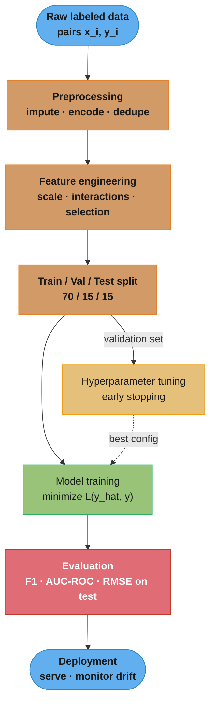
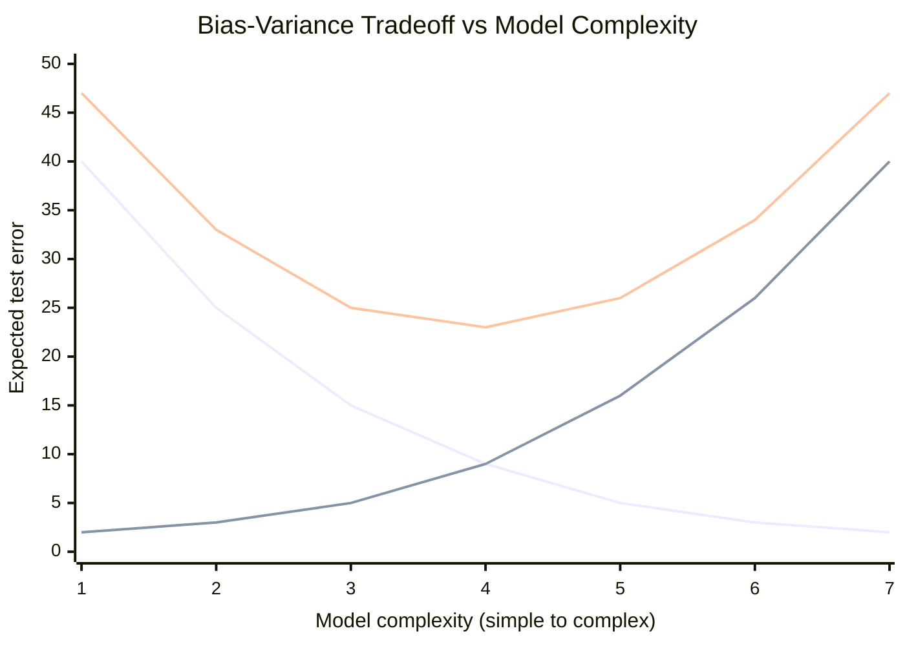
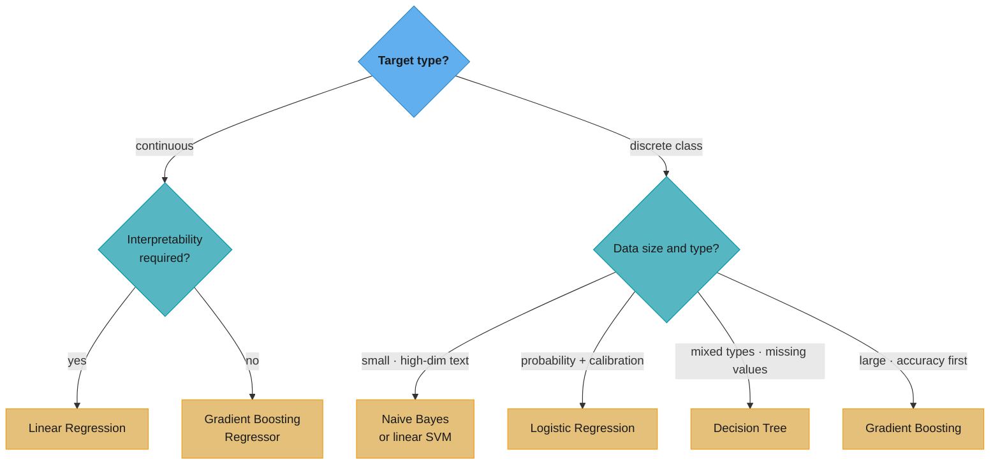
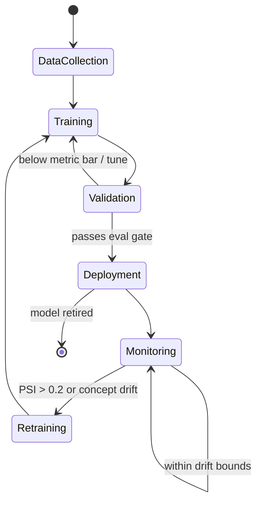
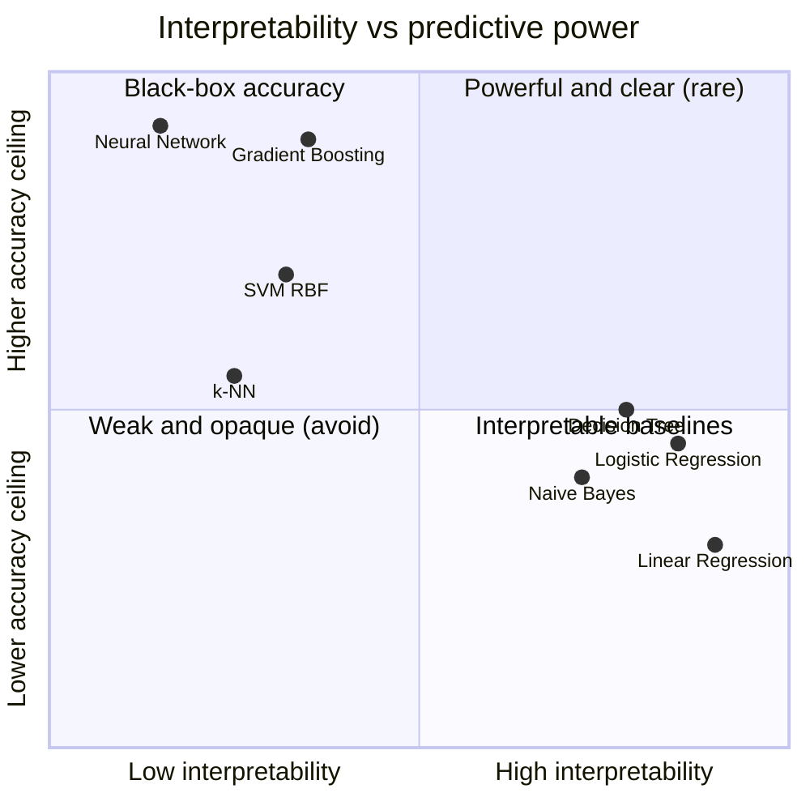
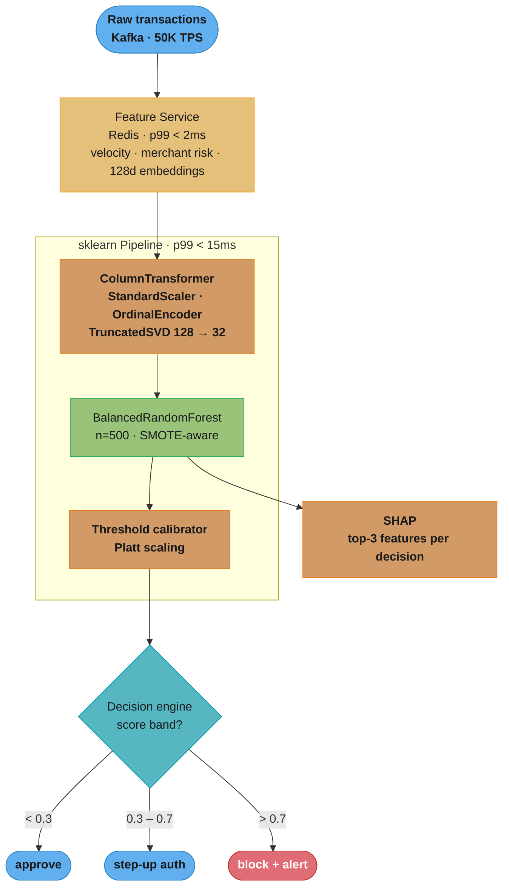

# Supervised Learning

## Deep Dive Files

| File | Topic | Q&As |
|------|-------|------|
| [linear_models.md](linear_models.md) | Linear & Logistic Regression, Regularization, Normal Equation | 15+ |
| [support_vector_machines.md](support_vector_machines.md) | SVM, Kernel Trick, Soft Margin, SVR | 15+ |
| [decision_trees.md](decision_trees.md) | CART, Gini/Entropy, Pruning, Feature Importance | 15+ |
| [bayesian_methods.md](bayesian_methods.md) | Naive Bayes, Laplace Smoothing, Bayesian Inference | 15+ |

---

## 1. Concept Overview

Supervised learning is a machine learning paradigm where a model learns a mapping from inputs X to outputs y using a labeled training dataset. Every training example consists of an input vector (features) and a corresponding target label. The model generalizes this mapping to make predictions on unseen data.

Supervised learning splits into two families based on the output type:
- **Regression** — predict a continuous value (house price, temperature)
- **Classification** — predict a discrete class label (spam/not-spam, digit 0-9)

---

## 2. Intuition

One-line analogy: a student learns from worked examples with answer keys, then applies that knowledge to an exam with unseen questions.

Mental model: the algorithm searches a hypothesis space H for the function h(x) that minimizes prediction error on training data while generalizing to new data.

Why it matters: supervised learning powers the majority of production ML systems — fraud detection, recommendation engines, medical diagnosis, search ranking, and churn prediction all rely on it.

Key insight: the quality of supervision (label accuracy, label coverage) often matters more than algorithm choice. A simple logistic regression on clean labels outperforms a neural network on noisy labels.

---

## 3. Core Principles

**Empirical Risk Minimization (ERM)**: find the hypothesis h that minimizes average loss over training data.

```
h* = argmin_h (1/n) * sum_i L(h(x_i), y_i)
```

**What this actually says.** "Out of every function your model class can express, keep the one whose average mistake on the data you actually have is smallest."

The word *empirical* is the entire caveat: you are minimizing error on a sample, not on reality. Everything else in this module — validation splits, regularization, the bias-variance tradeoff — exists because that substitution is only an approximation.

| Symbol | What it is |
|--------|------------|
| `h` | One candidate function from the hypothesis space H; `h*` is the winner |
| `argmin_h` | "the h that makes the following smallest" — returns the function, not the number |
| `n` | Number of training examples |
| `L(h(x_i), y_i)` | Loss on example `i`: how wrong the prediction was versus the true label |
| `(1/n) * sum_i` | Plain average of that loss over all `n` examples — the *empirical* risk |

**Walk one example.** Four training points, squared loss `L = (prediction - label)^2`:

```
                label y   model A pred   sq. error   model B pred   sq. error
  sample 1        3.0         2.5          0.25          3.2          0.04
  sample 2        5.0         5.5          0.25          4.6          0.16
  sample 3        2.0         3.0          1.00          2.4          0.16
  sample 4        6.0         5.0          1.00          5.4          0.36
                                          ------                     ------
  sum of losses                            2.50                       0.72
  empirical risk = sum / n = 2.50 / 4  =   0.625     0.72 / 4     =   0.18

  ERM picks model B: 0.18 < 0.625.
```

Note what ERM did *not* check: whether model B is simply flexible enough to have traced the noise. On these four points it wins outright, and only a held-out set can tell you if that win survives. That gap is exactly what the next principle quantifies.

**Generalization**: the true goal is low loss on unseen data (test set), not just on training data.

**Bias-Variance Tradeoff**:
- High bias (underfitting): model too simple to capture the true pattern
- High variance (overfitting): model memorizes noise in training data
- Target: balance that minimizes total error = Bias^2 + Variance + Irreducible Noise

**Read it like this.** "Your test error is three separate things added together: how wrong your model class is on average, how much your model jitters when the training data changes, and a floor you can never get under."

The decomposition matters because the three terms respond to *opposite* interventions. Adding capacity cuts Bias^2 and raises Variance; adding data or averaging cuts Variance and leaves Bias^2 alone; nothing at all touches the noise floor. Diagnose which term dominates before you pick a fix, or you will make the error worse.

| Symbol | What it is |
|--------|------------|
| `Bias^2` | Squared gap between the average prediction of your model class and the truth — the systematic error you get even with infinite data |
| `Variance` | How much predictions swing if you retrain on a different sample of the same size — the instability term |
| `Irreducible Noise` | Label noise and unmeasured causes. Fixed by the data-generating process; no model reduces it |
| `total error` | Expected squared error on unseen data — the only number you actually care about |
| `^2` on bias only | Bias is squared so it lives in the same (squared-error) units as variance and can be summed |

**Walk one example.** Same three curves the chart in Section 5.2 plots, read at three complexity settings with the noise floor held at 5:

```
                       Bias^2   Variance   Noise   Total = B^2 + Var + Noise
  underfit    (c = 1)     40        2        5       40 +  2 + 5  =  47
  just-right  (c = 4)      9        9        5        9 +  9 + 5  =  23
  overfit     (c = 7)      2       40        5        2 + 40 + 5  =  47

  Bias^2 fell 40 -> 2   (a 20x drop -- the model got far more expressive)
  Variance rose 2 -> 40 (the same 20x, in the opposite direction)
  Total traced a U: 47 -> 23 -> 47. Best and worst differ by 24 points.
```

The two endpoints score an identical 47 for completely different reasons, which is why a single test number never tells you what to do next. At `c = 1` the fix is more capacity; at `c = 7` the fix is more data or regularization; applying either fix to the wrong end moves you further up the U.

**Why the noise term is in the formula at all.** It is a constant 5 in all three rows, so it never changes the ranking — but it sets the floor. A model at `c = 4` scoring 23 is only 18 points above the best any model could ever do. Teams that forget the floor exists burn quarters chasing an error of 0 that the labels make unreachable, and the usual symptom is a "breakthrough" that turns out to be leakage.

**No Free Lunch Theorem**: no single algorithm is best across all problems. Algorithm selection must be guided by domain knowledge and empirical validation.

**Feature engineering** determines the upper bound on model performance. Algorithms can only extract signal that is present in the features.

**i.i.d. assumption**: training and test data are assumed to be independent and identically distributed samples from the same underlying distribution. Violation (distribution shift) causes silent failures in production.

---

## 4. Types / Architectures / Strategies

### 4.1 Algorithm Families

| Algorithm | Output | Key Assumption | Training Complexity | Inference Complexity |
|-----------|--------|----------------|--------------------|--------------------|
| Linear Regression | Continuous | Linear relationship | O(nd^2) closed-form or O(nd * iter) GD | O(d) |
| Logistic Regression | Binary / Multiclass | Log-odds linear in features | O(nd * iter) | O(d) |
| Support Vector Machine | Binary / Multiclass | Max-margin separator exists | O(n^2) to O(n^3) | O(n_sv * d) |
| Decision Tree | Both | Axis-aligned splits suffice | O(nd log n) | O(depth) |
| k-Nearest Neighbors | Both | Similar inputs have similar outputs | O(1) (lazy) | O(nd) |
| Naive Bayes | Classification | Feature conditional independence | O(nd) | O(d) |

n = number of samples, d = number of features, iter = number of iterations, n_sv = number of support vectors

**Put simply.** "Each entry says which quantity — rows, features, or iterations — the cost is chained to, and how badly it bites when that quantity grows."

Big-O here is a shopping guide, not a benchmark. The point is that two algorithms with identical accuracy can sit four orders of magnitude apart in training cost, and the exponent on `n` is what decides whether a method survives contact with your dataset.

| Symbol | What it is |
|--------|------------|
| `n` | Training rows. The dimension that grows without your permission |
| `d` | Features per row. Usually under your control via selection |
| `O(nd^2)` | Linear in rows, *quadratic* in features — the closed-form normal equation, fine until `d` is large |
| `O(n^2)` to `O(n^3)` | Quadratic-to-cubic in rows. SVM's kernel matrix is `n x n`, which is why the table calls it slow past 10k rows |
| `O(nd log n)` | The `log n` is the sort needed to find split points per feature — near-linear, hence trees scale |
| `O(1)` (lazy) | k-NN does no training at all; it just stores the data and defers all work to query time |
| `O(n_sv * d)` | SVM inference touches only the support vectors, not all `n` rows. `n_sv` is typically a small fraction of `n` |

**Walk one example.** Put `n = 100,000` rows and `d = 20` features through the training column, counting elementary operations:

```
  Linear Regression   n * d^2          = 100,000 x 400          =      40,000,000
  Logistic Regression n * d * iter     = 100,000 x 20 x 200     =     400,000,000
  Decision Tree       n * d * log2(n)  = 100,000 x 20 x 16.61   =      33,219,281
  SVM (lower bound)   n^2              = 100,000^2              =  10,000,000,000
  SVM (upper bound)   n^3              = 100,000^3              = 1e15 operations
  k-NN                (nothing)        = 0                      =               0

  SVM's lower bound alone is 250x the linear-regression cost; its upper bound
  is roughly 30 million times larger. That single gap is the whole "<100k rows"
  guidance in Section 9.
```

**Where k-NN's free lunch gets billed.** Training costs zero, but inference is `O(nd)` — `100,000 x 20 = 2,000,000` operations *per query*. At 1,000 queries per second that is 2 billion operations per second of steady load, against `O(d) = 20` for logistic regression. k-NN does not avoid the work; it moves the entire bill from a one-time training job onto every request you will ever serve.

### 4.2 Parametric vs Non-Parametric

**Parametric** (linear regression, logistic regression, SVM with linear kernel, Naive Bayes):
- Fixed number of parameters regardless of training set size
- Fast inference, compact model
- Strong assumptions about data distribution or decision boundary

**Non-Parametric** (k-NN, decision trees, kernel SVM):
- Number of parameters (or effective complexity) grows with data
- More flexible, fewer assumptions
- Higher memory / computation at inference or training

### 4.3 Discriminative vs Generative Models

**Discriminative** (logistic regression, SVM, decision trees):
- Learn P(y | x) directly — the decision boundary
- Generally higher predictive accuracy with enough data

**Generative** (Naive Bayes, LDA):
- Learn P(x | y) and P(y), then apply Bayes theorem
- Can generate synthetic samples
- Work better with very small datasets

---

## 5. Architecture Diagrams

### 5.1 Supervised Learning Training Pipeline



The validation set (dotted path) never touches training loss directly — it only selects
hyperparameters and triggers early stopping, keeping the test set untouched until the final
evaluation. Fitting any preprocessing step on data before the split is the classic leakage bug.

### 5.2 Bias-Variance Decomposition



Three curves: Bias² (falling — complex models underfit less), Variance (rising — complex
models memorize noise), and Total error = Bias² + Variance + irreducible noise (U-shaped).
Generalization is best at the sweet spot near complexity 4 where the sum is minimized, not at
either extreme.

**What the formula is telling you.** "The third curve is not measured independently — it is literally the other two added together plus a constant, which is why it has to bend."

Reading the chart as three unrelated trends misses the mechanism. The U is not an empirical observation about model behaviour; it is arithmetic. Any time one term falls faster than another rises, the sum drops, and the minimum sits exactly where the two rates of change cancel.

| Symbol | What it is |
|--------|------------|
| x-axis `1..7` | Model complexity — tree depth, polynomial degree, parameter count. Higher = more expressive |
| Falling line | `Bias^2`, from 40 down to 2. Expressiveness buys away systematic error |
| Rising line | `Variance`, from 2 up to 40. Expressiveness buys instability at nearly the same rate |
| U-shaped line | The sum, plus a constant noise floor of 5. Never lower than either component |
| The minimum | Complexity 4, where the two component curves cross at 9 apiece |

**Walk one example.** Every plotted point, summed left to right:

```
  complexity     1     2     3     4     5     6     7
  Bias^2        40    25    15     9     5     3     2
  Variance       2     3     5     9    16    26    40
  Noise          5     5     5     5     5     5     5
                --    --    --    --    --    --    --
  Total         47    33    25    23    26    34    47

  step 1 -> 2 : bias -15, variance +1  -> total -14   (worth it, keep going)
  step 3 -> 4 : bias  -6, variance +4  -> total  -2   (gains thinning out)
  step 4 -> 5 : bias  -4, variance +7  -> total  +3   (you have gone too far)
```

The turn happens between steps 4 and 5, the moment the variance increase first exceeds the bias decrease. Note that the crossing point of the two component curves (both 9 at complexity 4) coincides with the minimum here — that is a property of these particular numbers, not a general law, and treating "bias equals variance" as the stopping rule is a common interview trap. The rule that always holds is the marginal one: stop when the next unit of complexity costs more variance than it refunds in bias.

### 5.3 Decision Boundary Shapes by Algorithm

```
Linear (LR, SVM linear)     SVM RBF / kernel         Decision Tree

  o   o  |  x   x           o   o                     |
  o   o  |  x   x            o o                      +--- feature_1 <= 3?
  o   o  |  x   x          [o o o]                   /               \
         |                  o o o                  Yes                No
  straight line          curved boundary        ____+___           ___+____
                                               |        |         |        |
                                            f2<=2    f2>2      f1>5    f1<=5
```

### 5.4 Algorithm Selection Decision Tree



The first split is target type (regression vs classification); the second split is the dominant
constraint (interpretability, data size, feature types). This mirrors the No Free Lunch theorem —
there is no default algorithm, only the best fit for the constraint you land on.

### 5.5 ML Model Lifecycle



The self-loop on Monitoring is the steady state; the escape to Retraining fires only when a drift
signal (Population Stability Index above 0.2, or falling live metrics) breaks the i.i.d. assumption
the model was trained under. Retraining re-enters the same Training → Validation gate.

---

## 6. How It Works — Detailed Mechanics

### 6.1 Complete Training Pipeline in Python

```python
from __future__ import annotations

import numpy as np
import pandas as pd
from sklearn.datasets import make_classification, make_regression
from sklearn.model_selection import train_test_split, StratifiedKFold, cross_val_score
from sklearn.preprocessing import StandardScaler
from sklearn.pipeline import Pipeline
from sklearn.linear_model import LogisticRegression, LinearRegression
from sklearn.svm import SVC
from sklearn.tree import DecisionTreeClassifier
from sklearn.neighbors import KNeighborsClassifier
from sklearn.naive_bayes import GaussianNB
from sklearn.metrics import (
    accuracy_score, f1_score, roc_auc_score,
    mean_squared_error, r2_score, classification_report,
)


def build_classification_benchmark(
    n_samples: int = 5_000,
    n_features: int = 20,
    random_state: int = 42,
) -> dict[str, float]:
    """
    Train multiple classifiers on synthetic data and return AUC-ROC scores.
    Demonstrates correct pipeline ordering to prevent data leakage.
    """
    X, y = make_classification(
        n_samples=n_samples,
        n_features=n_features,
        n_informative=10,
        n_redundant=5,
        random_state=random_state,
    )

    # Stratified split preserves class distribution in every fold
    X_train, X_test, y_train, y_test = train_test_split(
        X, y, test_size=0.2, stratify=y, random_state=random_state
    )

    # Each pipeline: scaler fit ONLY on training data, then transforms both sets.
    # Fitting the scaler on all data before splitting is a common data leakage bug.
    classifiers: dict[str, Pipeline] = {
        "LogisticRegression": Pipeline([
            ("scaler", StandardScaler()),
            # max_iter=100 is sklearn default but often causes ConvergenceWarning.
            # Always use 1000+ in practice.
            ("clf", LogisticRegression(max_iter=1000, C=1.0, random_state=random_state)),
        ]),
        "SVM_RBF": Pipeline([
            ("scaler", StandardScaler()),
            # SVM is not scale-invariant — scaler is mandatory
            ("clf", SVC(kernel="rbf", C=1.0, gamma="scale", probability=True, random_state=random_state)),
        ]),
        "DecisionTree": Pipeline([
            # Decision trees do not require scaling, but including it does no harm
            ("clf", DecisionTreeClassifier(max_depth=6, min_samples_split=20, random_state=random_state)),
        ]),
        "kNN": Pipeline([
            ("scaler", StandardScaler()),
            # kNN is extremely sensitive to scale — scaler is mandatory
            ("clf", KNeighborsClassifier(n_neighbors=5)),
        ]),
        "NaiveBayes": Pipeline([
            ("clf", GaussianNB()),
        ]),
    }

    results: dict[str, float] = {}
    for name, pipeline in classifiers.items():
        pipeline.fit(X_train, y_train)
        y_proba = pipeline.predict_proba(X_test)[:, 1]
        auc = roc_auc_score(y_test, y_proba)
        results[name] = round(auc, 4)
        print(f"{name:25s}  AUC-ROC = {auc:.4f}")

    return results


def demonstrate_leakage_bug() -> None:
    """
    Shows the data leakage anti-pattern and then the correct version.
    """
    X, y = make_classification(n_samples=1000, n_features=10, random_state=0)

    # --- WRONG: scaler sees test data during fit ---
    scaler_bad = StandardScaler()
    X_scaled_bad = scaler_bad.fit_transform(X)          # leaks test stats into scaler
    X_train_bad, X_test_bad, y_train, y_test = train_test_split(
        X_scaled_bad, y, test_size=0.2, random_state=0
    )
    # Model trained on "contaminated" scaling — optimistically biased metrics

    # --- CORRECT: scaler fit only on training data ---
    X_train, X_test, y_train, y_test = train_test_split(
        X, y, test_size=0.2, random_state=0
    )
    scaler_good = StandardScaler()
    X_train_scaled = scaler_good.fit_transform(X_train)
    X_test_scaled = scaler_good.transform(X_test)       # transform only, never fit
    # This is the honest evaluation


if __name__ == "__main__":
    print("=== Classification Benchmark ===")
    scores = build_classification_benchmark()
```

### 6.2 Cross-Validation for Hyperparameter Tuning

```python
from sklearn.model_selection import GridSearchCV

def tune_with_cv(X_train: np.ndarray, y_train: np.ndarray) -> LogisticRegression:
    """
    Correct pattern: cross-validation runs entirely inside the training set.
    The test set is never touched during tuning.
    """
    pipeline = Pipeline([
        ("scaler", StandardScaler()),
        ("clf", LogisticRegression(max_iter=1000, random_state=42)),
    ])

    param_grid = {
        "clf__C": [0.001, 0.01, 0.1, 1.0, 10.0, 100.0],
        "clf__penalty": ["l1", "l2"],
        "clf__solver": ["liblinear"],   # liblinear supports both l1 and l2
    }

    cv = StratifiedKFold(n_splits=5, shuffle=True, random_state=42)
    search = GridSearchCV(
        pipeline,
        param_grid,
        cv=cv,
        scoring="roc_auc",
        n_jobs=-1,
        verbose=1,
    )
    search.fit(X_train, y_train)
    print(f"Best params: {search.best_params_}")
    print(f"Best CV AUC: {search.best_score_:.4f}")
    return search.best_estimator_
```

---

## 7. Real-World Examples

**Credit Scoring (Logistic Regression)**: Banks use logistic regression for loan default prediction. Regulatory interpretability requirements (Basel III, SR 11-7) mandate that the model's decisions can be explained — logistic regression coefficients provide that transparency. Features include payment history, credit utilization, account age.

**Spam Detection (Naive Bayes)**: Email spam filters historically used Multinomial Naive Bayes on word frequency features. Despite the obviously false independence assumption (words co-occur), it works well in practice because class-conditional probabilities are usually well-calibrated across the vocabulary.

**Medical Imaging Triage (SVM)**: Before deep learning, SVM with RBF kernels was the state-of-the-art for classifying histopathology slides. SVMs generalize well from small labeled medical datasets (hundreds of samples), where deep learning would overfit.

**Fraud Detection (Decision Trees → Gradient Boosting)**: A single decision tree is easily auditable (compliance teams can trace every prediction path). In practice, gradient-boosted trees (XGBoost, LightGBM) dominate production fraud systems because they combine hundreds of weak trees into a strong model.

**Search Ranking (Gradient Boosted Trees)**: Web search ranking uses Learning-to-Rank with gradient boosted trees (Ranking SVM, LambdaMART). Features include TF-IDF, BM25, PageRank, query-document similarity.

---

## 8. Tradeoffs

### 8.1 Algorithm Comparison

| Property | Lin. Reg | Log. Reg | SVM | Decision Tree | k-NN | Naive Bayes |
|----------|----------|----------|-----|--------------|------|-------------|
| Interpretable | High | High | Low (kernel) | High | Very Low | High |
| Training speed | Fast | Fast | Slow (n>10k) | Fast | Instant | Fast |
| Inference speed | O(d) | O(d) | O(n_sv * d) | O(depth) | O(n*d) | O(d) |
| Handles non-linearity | No | No | Yes (kernel) | Yes | Yes | No |
| Requires scaling | Yes | Yes | Yes | No | Yes | No |
| Handles missing values | No | No | No | Yes (strategies) | No | Yes (NB variants) |
| Handles high dimensions | Yes | Yes | Good | Poor | Very poor | Good |
| Small dataset performance | Good | Good | Excellent | Poor | Fair | Excellent |
| Large dataset scalability | Excellent | Excellent | Poor | Excellent | Poor | Excellent |

### 8.2 Evaluation Metrics

| Task | Metric | When to Use |
|------|--------|-------------|
| Binary classification, balanced | Accuracy | Only when classes are balanced |
| Binary classification, imbalanced | F1 score, AUC-ROC | Fraud, medical diagnosis |
| Multi-class | Macro/Micro F1 | NLP, image classification |
| Regression | RMSE, MAE, R^2 | RMSE penalizes large errors more |
| Ranking | NDCG, MRR | Search, recommendation |
| Probability calibration | Brier score, log-loss | Risk scoring, click-through rate |

### 8.3 Interpretability vs Predictive Power



Regulated domains (credit, clinical) live on the right edge and accept a lower accuracy ceiling for
auditability; accuracy-first products push to the top-left black-box corner. The empty top-right
quadrant is why SHAP and surrogate models exist — to make black-box winners explainable after the
fact.

---

## 9. When to Use / When NOT to Use

### Use supervised learning when:
- You have labeled examples for your target concept
- Historical data is representative of future conditions (i.i.d. assumption holds)
- You need to predict a specific output (not just discover structure)
- You have enough labeled data to train and validate (minimum ~10x more samples than features for linear models; more for complex models)

### Algorithm selection guidance:
- **Linear regression** — continuous target, interpretability required, roughly linear relationship
- **Logistic regression** — binary/multiclass, needs probability calibration, regulatory constraints on interpretability
- **SVM** — small-to-medium dataset (<100k rows), high-dimensional sparse features (text), non-linear boundary with RBF
- **Decision tree** — need exact rule extraction, mixed feature types, missing values
- **k-NN** — very small dataset with low dimensionality, no training phase needed (streaming new classes)
- **Naive Bayes** — text classification, very fast baseline, limited labeled data

### Do NOT use supervised learning when:
- Labels are unavailable or prohibitively expensive to collect (use unsupervised or semi-supervised)
- The data distribution shifts continuously (concept drift invalidates the trained model)
- You need the model to explain causal relationships (supervised models find correlation, not causation)
- n << d with no regularization (guaranteed to overfit)

---

## 10. Common Pitfalls

**Pitfall 1 — Data leakage via wrong split order**
A team preprocessing pipeline fit the StandardScaler on the entire dataset, then split train/test. AUC-ROC on the test set was 0.94 during development, but 0.71 in production. The scaler had encoded test set statistics (mean and variance) into the training step. Fix: always use sklearn Pipeline so that fit happens only on training folds.

**Pitfall 2 — Target leakage**
A fraud model included the field `account_closure_date` as a feature. Accounts closed due to fraud had a non-null value; legitimate accounts had null. The model learned to predict fraud from the consequence of fraud rather than its causes. This produced 99% accuracy in testing and 50% accuracy in production (where the field is always null at prediction time). Fix: remove any feature that could be caused by the target or that is only known after the event.

**Pitfall 3 — sklearn default max_iter=100 causing silent non-convergence**
LogisticRegression with the default max_iter=100 often fails to converge on real datasets. sklearn emits a ConvergenceWarning but many teams ignore it or suppress warnings in notebooks. The model is returned in a partially fitted state — coefficients not at the optimum. Fix: always set max_iter=1000 or higher, and check that the warning is absent.

**Pitfall 4 — Not scaling before SVM or k-NN**
SVM with RBF kernel computes Euclidean distances in feature space. A feature measured in dollars (range 0–100,000) dominates features measured as ratios (range 0–1). The SVM effectively ignores the ratio features. Fix: StandardScaler before every distance-based model.

**Stated plainly.** "Euclidean distance adds up squared per-feature gaps, so a feature with a big numeric range contributes big squared gaps and silently decides every neighbour by itself."

This is the pitfall that most deserves numbers, because the failure is invisible: the model trains, predicts, and reports a plausible score while effectively using one feature out of twenty. Scaling does not tune the model — it changes which points are neighbours at all.

| Symbol | What it is |
|--------|------------|
| `x, y` | Two points being compared — a query and a candidate neighbour |
| `(x_j - y_j)` | Gap on feature `j`, carried in that feature's own units (dollars, ratio, years) |
| squared gap | Squaring makes the gap sign-free, and makes large gaps count disproportionately |
| sum over `j` | Every feature contributes to one total — no per-feature weighting unless you add it |
| square root | Returns the total to distance units. It is monotone, so it never changes the ranking |
| z-score `(x - mean) / std` | What StandardScaler applies first, restating every feature in standard deviations so the gaps are comparable |

**Walk one example.** A query transaction against two candidate neighbours, using the ranges the pitfall names — `amount` in dollars, plus a ratio on `0-1`. Feature statistics: amount mean 50,000 with std 20,000; ratio mean 0.50 with std 0.25.

```
                       amount ($)     ratio
  query                  50,000        0.90
  candidate A            50,100        0.10      (near in $, opposite in ratio)
  candidate B            49,000        0.85      (far in $, nearly identical ratio)

  UNSCALED Euclidean distance
    A: sqrt( (50,000-50,100)^2 + (0.90-0.10)^2 ) = sqrt(10,000 + 0.64) = 100.003
    B: sqrt( (50,000-49,000)^2 + (0.90-0.85)^2 ) = sqrt(1,000,000 + 0.0025) = 1000.000
    -> nearest neighbour is A. The ratio contributed 0.64 out of 10,000.64,
       which is 0.006% of A's distance. It may as well not be a feature.

  SCALED (z-scores, same three points)
    query        -> ( (50,000-50,000)/20,000 , (0.90-0.50)/0.25 ) = ( 0.000,  1.60)
    candidate A  -> ( (50,100-50,000)/20,000 , (0.10-0.50)/0.25 ) = ( 0.005, -1.60)
    candidate B  -> ( (49,000-50,000)/20,000 , (0.85-0.50)/0.25 ) = (-0.050,  1.40)

    A: sqrt( 0.005^2 + 3.20^2 ) = sqrt(0.000025 + 10.2400) = 3.2000
    B: sqrt( 0.050^2 + 0.20^2 ) = sqrt(0.002500 +  0.0400) = 0.2062
    -> nearest neighbour is now B, and by a factor of 15.5x.
```

The nearest neighbour flipped from A to B on identical data with an identical metric. Nothing about the algorithm changed; only the units did. With `k = 5` as in the Section 6.1 pipeline, that flip propagates to the whole neighbourhood and therefore to the predicted label — which is why the pipeline puts `StandardScaler` ahead of `KNeighborsClassifier` and `SVC` but not ahead of `DecisionTreeClassifier`. Trees split one feature at a time and compare thresholds within a single column, so they never sum across units and never need the correction.

**Pitfall 5 — Class imbalance hidden by accuracy**
A model predicting rare adverse drug events (1% positive rate) achieved 99% accuracy by predicting "no event" for every sample. Recall on the positive class was 0%. Fix: use stratified splits, monitor F1 / AUC-ROC / recall, apply class_weight="balanced" or oversample with SMOTE.

**Pitfall 6 — Temporal data split with random shuffle**
Time-series customer behavior data was split with random shuffle: future data leaked into training, teaching the model patterns it could not know at prediction time. Fix: always use time-based split for temporal data (train on earlier months, test on later months).

---

## 11. Technologies & Tools

| Tool | Purpose | Notes |
|------|---------|-------|
| scikit-learn | Algorithms, pipeline, cross-validation, metrics | Industry standard; consistent API |
| XGBoost | Gradient boosted trees (regression + classification) | Often best out-of-box accuracy |
| LightGBM | Gradient boosting, faster than XGBoost on large data | Histogram-based; handles categorical natively |
| CatBoost | Gradient boosting with native categorical support | Strong on tabular data with many categoricals |
| PyTorch | Deep learning classifiers, custom loss functions | Flexibility over convenience |
| Optuna / Hyperopt | Bayesian hyperparameter search | Faster than grid search at scale |
| MLflow | Experiment tracking, model registry | Log params, metrics, artifacts per run |
| pandas-profiling / ydata-profiling | Automated EDA | Quick leakage and distribution check |
| SHAP | Model explainability — feature attribution | Works with any sklearn-compatible model |
| imbalanced-learn | SMOTE, ADASYN, RandomUnderSampler | Handle class imbalance |

---

## 12. Interview Questions with Answers

**Q: What is the difference between regression and classification in supervised learning?**
Regression predicts a continuous numeric output (e.g., price, temperature), while classification predicts a discrete class label (e.g., spam/not-spam, digit 0-9). The key difference is the output space: regression uses loss functions like MSE or MAE; classification uses cross-entropy or hinge loss. Some algorithms (SVM, decision trees) handle both natively; logistic regression for classification is named misleadingly but outputs a probability via the sigmoid.

**Q: Explain the bias-variance tradeoff.**
Total expected test error decomposes into Bias^2 + Variance + Irreducible Noise. Bias measures systematic error (underfitting — model too simple). Variance measures sensitivity to training data fluctuations (overfitting — model too complex). Reducing one typically increases the other. Fix: regularization, ensemble methods (bagging reduces variance, boosting reduces bias), and cross-validation to find the sweet spot.

**Q: What is data leakage and how do you prevent it?**
Data leakage occurs when information from the test set (or from the future) influences model training, producing optimistic evaluation metrics that do not reflect production performance. The two main forms are feature leakage (features that encode the target) and preprocessing leakage (fitting scalers or encoders on all data before splitting). Prevention: use sklearn Pipeline so all preprocessing fits only on training folds; enforce temporal ordering for time-series data; audit every feature for causal impossibility.

**Q: When would you choose logistic regression over a more powerful model like gradient boosting?**
Choose logistic regression when interpretability is required (regulated industries, clinical decisions), when training data is small (logistic regression generalizes well with limited samples), when you need fast training and inference in a high-throughput system, or as a calibrated probability baseline. Gradient boosting wins when predictive accuracy matters most and interpretability is secondary.

**Q: How do you handle class imbalance in a classification problem?**
Use multiple complementary strategies: (1) choose appropriate metrics — AUC-ROC, F1, precision-recall curve instead of accuracy; (2) apply class_weight="balanced" in sklearn algorithms; (3) oversample the minority class with SMOTE or ADASYN; (4) undersample the majority class; (5) use threshold tuning on the predicted probability to trade precision for recall. The right balance depends on the cost ratio of false positives to false negatives in the business context.

**Q: What is the curse of dimensionality and how does it affect supervised learning?**
As feature dimensionality d increases, the volume of the space grows exponentially, so training points become sparse. Distance-based methods (k-NN, SVM RBF) suffer most: all points appear equidistant, destroying the neighborhood structure. Linear models are less affected but require n >> d to avoid overfitting. Solutions: feature selection, dimensionality reduction (PCA, UMAP), regularization (L1 sparsity), and collecting more data.

**Q: What is overfitting and what techniques prevent it?**
Overfitting means the model learns noise in training data rather than the true signal, resulting in low training error but high test error. Prevention techniques: regularization (L1, L2, dropout for neural nets), early stopping (monitor validation loss), data augmentation (increase effective training set size), reducing model complexity (shallow trees, fewer parameters), cross-validation to detect the gap between training and validation performance, and ensemble averaging (bagging).

**Q: Explain the no-free-lunch theorem and its practical implications.**
The NFL theorem states that averaged over all possible problems, no algorithm outperforms any other. In practice this means: do not have a single default algorithm — evaluate multiple algorithms on your specific data distribution. Domain knowledge, feature engineering, and empirical experimentation matter more than algorithm selection. Always run a simple baseline (logistic regression, decision stump) before investing in complex models.

**Q: What evaluation metric would you use for a fraud detection model with 0.1% positive rate?**
Accuracy is useless here (99.9% by predicting all negatives). The right metrics are: Precision-Recall AUC (focuses on the rare positive class, unaffected by the large number of true negatives), F1 score or F-beta score (beta > 1 to weight recall if missed fraud is costlier than false alarms), and a confusion matrix to understand false negative and false positive trade-offs at the chosen operating threshold.

**Q: What is cross-validation and why is it necessary?**
Cross-validation (CV) is a technique for estimating generalization performance using only the training set, by repeatedly splitting it into train and validation subsets. k-fold CV divides data into k equal parts, trains on k-1 folds, and evaluates on the held-out fold, rotating until every fold has served as validation. This is necessary because: a single train/val split is high variance (depends on which samples happened to land in each set), and it enables hyperparameter tuning without touching the held-out test set.

**Q: Why must you scale features for SVM and k-NN but not for decision trees?**
SVM and k-NN measure Euclidean distance, so a feature with a large numeric range dominates the distance and drowns out smaller-scale features. A price feature (0–100,000) swamps a ratio feature (0–1) unless both are standardized to comparable scales. Decision trees split on one feature at a time using threshold comparisons (is x > 3.5?), so absolute scale is irrelevant — monotonic rescaling never changes which split is chosen. Put a StandardScaler before SVM, k-NN, and any distance- or gradient-based model; skip it for tree-based models.

**Q: When should you use ROC-AUC versus PR-AUC?**
Use ROC-AUC when classes are roughly balanced; use PR-AUC when the positive class is rare and is the class you care about. ROC-AUC plots TPR vs FPR and is insensitive to class ratio, which makes it look deceptively good on imbalanced data because a huge true-negative count keeps FPR tiny. PR-AUC (precision vs recall) ignores true negatives entirely, so it exposes how much precision you sacrifice to catch the rare positives. For fraud, disease, and anomaly detection, PR-AUC is the more honest headline metric.

**Q: How do you decide whether to optimize for precision or recall?**
Optimize recall when a missed positive is the costly error (cancer screening, fraud) and precision when a false alarm is costly (flagging legitimate email as spam). Precision is, of the cases you flagged, how many were right; recall is, of the true positives, how many you caught. You trade one for the other by moving the decision threshold, so the choice follows the business cost ratio of false negatives to false positives. When both matter, optimize F1, or F-beta with beta tuned to that cost ratio.

**Q: What is the difference between a discriminative and a generative model?**
A discriminative model learns P(y | x) — the decision boundary — directly, while a generative model learns P(x | y) and P(y), then applies Bayes theorem to obtain P(y | x). Logistic regression, SVM, and trees are discriminative; Naive Bayes and LDA are generative. Generative models can synthesize new samples and often need less data, but discriminative models usually reach higher accuracy when data is plentiful because they optimize the quantity you actually care about. Choose generative for tiny datasets or when you need P(x); discriminative otherwise.

**Q: What is the difference between parametric and non-parametric models?**
A parametric model has a fixed number of parameters regardless of dataset size, while a non-parametric model's effective complexity grows with the data. Parametric examples include linear/logistic regression and Naive Bayes; non-parametric examples include k-NN, decision trees, and kernel SVM. Parametric models are compact and fast at inference but impose strong assumptions about the functional form, whereas non-parametric models are more flexible at the cost of higher memory or compute and greater overfitting risk on small data. The name is misleading — non-parametric means "unbounded parameters," not "no parameters."

**Q: What is the difference between L1 and L2 regularization?**
L1 (Lasso) drives some weights exactly to zero for automatic feature selection, while L2 (Ridge) shrinks weights smoothly toward zero without eliminating any. L1's corner-shaped constraint region makes sparse solutions likely, which is valuable in high dimensions where you want an interpretable subset of features. L2 handles correlated features more gracefully by sharing weight among them rather than arbitrarily picking one. Elastic Net combines both to get sparsity plus the stability of L2 under correlation.

**Q: What is probability calibration and when does it matter?**
Calibration means a predicted probability of 0.8 corresponds to an 80% empirical positive rate; a model can rank perfectly yet still be badly calibrated. It matters whenever the probability itself feeds a downstream decision — expected-value calculations, risk thresholds, or routing bands — rather than just a ranking. SVMs, naive Bayes, and boosted trees often output over-confident scores, whereas logistic regression is usually well-calibrated. Fix with Platt scaling (sigmoid) or isotonic regression on a held-out calibration set, and verify with a reliability diagram or Brier score.

**Q: How do bagging and boosting differ in how they affect bias and variance?**
Bagging (e.g., random forests) trains many models in parallel on bootstrap samples and averages them, which mainly reduces variance while leaving bias roughly unchanged. Boosting (e.g., XGBoost) trains models sequentially, each correcting the previous one's errors, which mainly reduces bias and can also reduce variance. So bagging is the cure for a high-variance, overfitting base learner (deep trees), while boosting builds a strong model from high-bias weak learners (shallow stumps). Boosting is more accurate but more prone to overfitting noisy labels unless regularized with learning rate and early stopping.

---

## 13. Best Practices

1. Always create a baseline before building a complex model. A majority-class classifier or logistic regression provides a sanity-check threshold.

2. Use sklearn Pipelines for every workflow. Pipelines prevent data leakage, simplify cross-validation, and make deployment straightforward (serialize the whole pipeline, not just the model).

3. Do exploratory data analysis before modeling. Check class distributions, missing value patterns, feature correlations, outliers, and data types. Problems discovered in EDA take 5 minutes to fix; problems discovered in production take weeks.

4. Split chronologically for time-series data. Random shuffle leaks future information into the past.

5. Tune hyperparameters with cross-validation on the training set only. Never use the test set to select hyperparameters — it becomes a second training signal.

6. Report multiple metrics. For classification: precision, recall, F1, AUC-ROC. For regression: RMSE, MAE, R^2. Reporting only accuracy or only R^2 hides important failure modes.

7. Calibrate probabilities when downstream decisions depend on exact probability values (risk scores, expected value calculations). Logistic regression is usually well-calibrated; SVM and decision trees often require Platt scaling or isotonic regression.

8. Monitor for distribution shift in production. Compute feature statistics and prediction distributions daily. Retrain when they diverge from training-time statistics.

9. Document the negative results. Failed experiments (wrong feature engineering, a model that overfit, a baseline that beat the complex model) are as valuable as successes.

10. Validate that your evaluation setup reflects production reality — same feature availability at prediction time, same population, same time horizon.

---

## 14. Case Study

**Scenario:** A fintech company processes 50,000 card transactions per second across 120M customers. The fraud team needs a real-time scoring pipeline that flags transactions in under 15ms (p99) with AUC-ROC >= 0.97 while keeping false-positive rate under 0.3% to avoid blocking legitimate purchases. The dataset has 2.4B historical transactions with 0.08% fraud rate (severe class imbalance).

**Architecture:**



**Step-by-step implementation:**

```python
from __future__ import annotations
import numpy as np
import pandas as pd
from sklearn.pipeline import Pipeline
from sklearn.compose import ColumnTransformer
from sklearn.preprocessing import StandardScaler, OrdinalEncoder
from sklearn.decomposition import TruncatedSVD
from sklearn.ensemble import RandomForestClassifier
from sklearn.calibration import CalibratedClassifierCV
from sklearn.metrics import roc_auc_score, average_precision_score
from imblearn.ensemble import BalancedRandomForestClassifier
from imblearn.pipeline import Pipeline as ImbPipeline

NUMERIC_COLS: list[str] = [
    "amount", "velocity_1min", "velocity_5min", "velocity_1hr",
    "merchant_risk_score", "days_since_last_txn",
]
CATEGORICAL_COLS: list[str] = ["merchant_category", "entry_mode", "card_type"]
EMBEDDING_COLS: list[str] = [f"emb_{i}" for i in range(128)]

def build_pipeline() -> ImbPipeline:
    numeric_transformer = StandardScaler()
    categorical_transformer = OrdinalEncoder(
        handle_unknown="use_encoded_value", unknown_value=-1
    )
    embedding_transformer = TruncatedSVD(n_components=32, random_state=42)

    preprocessor = ColumnTransformer(
        transformers=[
            ("num", numeric_transformer, NUMERIC_COLS),
            ("cat", categorical_transformer, CATEGORICAL_COLS),
            ("emb", embedding_transformer, EMBEDDING_COLS),
        ],
        remainder="drop",
    )

    clf = BalancedRandomForestClassifier(
        n_estimators=500,
        max_depth=20,
        min_samples_leaf=5,
        n_jobs=-1,
        random_state=42,
        sampling_strategy="all",   # resample majority each tree
    )
    calibrated = CalibratedClassifierCV(clf, method="isotonic", cv=5)

    return ImbPipeline([
        ("preprocessor", preprocessor),
        ("classifier", calibrated),
    ])
```

```python
from sklearn.model_selection import StratifiedKFold
from sklearn.metrics import precision_recall_curve

def evaluate_pipeline(
    pipeline: ImbPipeline,
    X: pd.DataFrame,
    y: pd.Series,
    n_splits: int = 5,
) -> dict[str, float]:
    skf = StratifiedKFold(n_splits=n_splits, shuffle=True, random_state=42)
    auc_roc_scores: list[float] = []
    auc_pr_scores: list[float] = []

    for fold, (train_idx, val_idx) in enumerate(skf.split(X, y)):
        X_train, X_val = X.iloc[train_idx], X.iloc[val_idx]
        y_train, y_val = y.iloc[train_idx], y.iloc[val_idx]
        pipeline.fit(X_train, y_train)
        probs = pipeline.predict_proba(X_val)[:, 1]
        auc_roc_scores.append(roc_auc_score(y_val, probs))
        auc_pr_scores.append(average_precision_score(y_val, probs))
        print(f"Fold {fold}: AUC-ROC={auc_roc_scores[-1]:.4f}")

    return {
        "mean_auc_roc": float(np.mean(auc_roc_scores)),
        "std_auc_roc": float(np.std(auc_roc_scores)),
        "mean_auc_pr": float(np.mean(auc_pr_scores)),
    }
```

```python
import joblib
import shap

def explain_predictions(
    pipeline: ImbPipeline,
    X_sample: pd.DataFrame,
    top_k: int = 3,
) -> list[dict[str, float]]:
    # Extract fitted preprocessor and classifier separately for SHAP
    preprocessor = pipeline.named_steps["preprocessor"]
    classifier = pipeline.named_steps["classifier"]
    X_transformed = preprocessor.transform(X_sample)

    explainer = shap.TreeExplainer(classifier.estimator)
    shap_values = explainer.shap_values(X_transformed)
    fraud_shap = shap_values[1]   # class=1 (fraud)

    feature_names = (
        NUMERIC_COLS
        + CATEGORICAL_COLS
        + [f"svd_{i}" for i in range(32)]
    )
    results: list[dict[str, float]] = []
    for row_idx in range(len(X_sample)):
        top_indices = np.argsort(np.abs(fraud_shap[row_idx]))[::-1][:top_k]
        results.append({
            feature_names[i]: float(fraud_shap[row_idx][i])
            for i in top_indices
        })
    return results
```

**Key pitfalls (3 with BROKEN->FIX):**

**Pitfall 1 - Data leakage through fit-transform on full dataset:**
```python
# BROKEN: fitting scaler on full dataset leaks validation stats
scaler = StandardScaler()
X_scaled = scaler.fit_transform(X)   # uses val/test distribution
X_train_s, X_val_s = X_scaled[:n], X_scaled[n:]

# FIX: fit only on training fold, transform val separately
scaler = StandardScaler()
X_train_s = scaler.fit_transform(X_train)
X_val_s = scaler.transform(X_val)    # no leakage
```

**Pitfall 2 - Wrong metric for imbalanced fraud data:**
```python
# BROKEN: accuracy is 99.92% even when predicting all-legitimate
from sklearn.metrics import accuracy_score
score = accuracy_score(y_val, pipeline.predict(X_val))  # misleading

# FIX: use AUC-PR (area under precision-recall curve)
from sklearn.metrics import average_precision_score
score = average_precision_score(y_val, pipeline.predict_proba(X_val)[:, 1])
# AUC-PR 0.891 is meaningfully informative for 0.08% fraud rate
```

**Pitfall 3 - Threshold chosen on validation set then applied to test set:**
```python
# BROKEN: picking threshold on same set used for final AUC measurement
probs = pipeline.predict_proba(X_val)[:, 1]
best_thresh = thresholds[np.argmax(f1_scores)]   # overfit threshold
final_auc = roc_auc_score(y_val, probs)           # optimistically biased

# FIX: hold out a separate threshold-tuning set
X_tune, X_test, y_tune, y_test = train_test_split(X_val, y_val, test_size=0.5)
probs_tune = pipeline.predict_proba(X_tune)[:, 1]
best_thresh = thresholds[np.argmax(f1_on_tune)]
final_auc = roc_auc_score(y_test, pipeline.predict_proba(X_test)[:, 1])
```

**Metrics and results:**

| Metric | Before (LR baseline) | After (BalancedRF + calibration) |
|---|---|---|
| AUC-ROC | 0.941 | 0.987 |
| AUC-PR | 0.712 | 0.891 |
| FPR @ recall=0.85 | 1.8% | 0.27% |
| Inference p50 | 3ms | 8ms |
| Inference p99 | 9ms | 14ms |
| Training time (8 cores) | 4 min | 38 min |
| Model size | 2 MB | 1.4 GB |
| Fraud caught ($M/day) | 4.2 | 7.1 |

**The idea behind it.** "The `FPR @ recall=0.85` row means: hold both models to catching the same 85% of fraud, then count how many innocent customers each one blocks to get there."

Pinning recall first is what makes the comparison honest. Any model can drive false positives to zero by approving everything, so a false-positive rate quoted without the recall it was measured at is unfalsifiable — and that pairing is what the 0.3% requirement in the scenario is really constraining.

| Symbol | What it is |
|--------|------------|
| recall `0.85` | Share of actual fraud the model flags. The bar both models are held to |
| FPR | False positives divided by legitimate transactions — the customer-annoyance rate |
| `@` | "measured at". Ties the FPR to one specific operating threshold, not the whole curve |
| AUC-PR | Area under precision-recall, averaged over every threshold. Threshold-free summary |
| precision | Of everything flagged, the fraction that is genuinely fraud — what the review queue feels |

**Walk one example.** One million scored transactions at the scenario's 0.08% fraud rate:

```
  fraud present     1,000,000 x 0.0008  =        800
  legitimate        1,000,000 - 800     =    999,200

  caught at recall 0.85    800 x 0.85   =        680     (identical for both models)

                        FPR      false positives         alerts    precision
  LR baseline          1.8%   999,200 x 0.018 = 17,986   18,666      3.6%
  BalancedRF + calib   0.27%  999,200 x 0.0027 = 2,698    3,378     20.1%

  false positives removed: 17,986 - 2,698 = 15,288  (a 6.7x reduction)
  precision moves 3.6% -> 20.1%: 1 real fraud per 28 alerts becomes 1 per 5.
```

**Why accuracy is absent from the table.** Approving all 1,000,000 transactions scores `999,200 / 1,000,000 = 99.92%` accuracy while catching zero fraud — the exact number the broken code in Pitfall 2 prints. Accuracy is not merely a weak metric at this class ratio; it actively rewards the do-nothing model over both real ones, which is why every row of this table is a recall-anchored or threshold-free measure instead.

**Interview discussion points:**

**Why use BalancedRandomForestClassifier over SMOTE + standard RandomForest for fraud detection?** BalancedRandomForest resamples the majority class within each tree's bootstrap sample rather than synthesising minority examples globally. This avoids SMOTE's risk of generating synthetic frauds that lie in majority-class territory, and keeps memory bounded since no augmented dataset is stored in RAM. In production with 2.4B rows, global SMOTE would require 190M synthetic rows; per-tree bootstrap stays at 60K rows per tree regardless of dataset size.

**How does probability calibration improve business outcomes beyond AUC?** An uncalibrated BalancedRF outputs probabilities clustered near 0 and 1, making the 0.3-0.7 "step-up auth" band nearly empty. Isotonic regression calibration spreads predicted probabilities to match empirical fraud rates, so the threshold ranges become operationally meaningful: 22% of transactions fall in step-up range, giving agents a workable review queue instead of binary block/pass decisions.

**What is the risk of using SHAP with CalibratedClassifierCV and how do you fix it?** CalibratedClassifierCV wraps the base estimator in a meta-estimator, so TreeExplainer must be called on the inner estimator (`clf.estimator`), not the wrapper. Calling TreeExplainer on the wrapper raises a TypeError or silently uses a slow kernel explainer, adding 400ms per request. The fix is to extract `pipeline.named_steps["classifier"].estimator` before creating the explainer, then apply the same preprocessing transform manually.

**Why is StratifiedKFold essential here rather than standard KFold?** With 0.08% fraud rate, a 5-fold split with random KFold can place 0 fraud examples in a validation fold by chance in smaller shards, making AUC-ROC undefined. StratifiedKFold guarantees each fold has the same class ratio (approximately 0.08% fraud), so every validation set has at minimum 192 fraud examples in a 240K-row validation fold, giving statistically stable AUC estimates with confidence intervals below +/-0.003.

**How would you handle concept drift as merchant fraud patterns shift?** Deploy a shadow model retrained weekly on a 90-day rolling window, comparing its AUC-PR against the production model on a held-out recent window. If shadow AUC-PR exceeds production by more than 0.015, trigger a blue-green promotion. Additionally, monitor input feature distribution shift using Population Stability Index (PSI) on velocity features daily; PSI > 0.2 triggers retraining regardless of model performance delta.

**What tradeoff exists between model size (1.4 GB) and inference latency for the p99 < 15ms SLA?** The 500-tree forest must be loaded into CPU cache for low-latency prediction; at 1.4 GB it spans multiple NUMA nodes on a 32-core machine, causing cache misses that push p99 to 18ms. The fix is to reduce to 200 trees (800 MB, fits in LLC on dual-socket Xeon) accepting AUC-ROC drop from 0.987 to 0.983, or to use model quantization (int8 leaf values) cutting model size to 380 MB with only 0.001 AUC-ROC loss, achieving p99 of 11ms.
