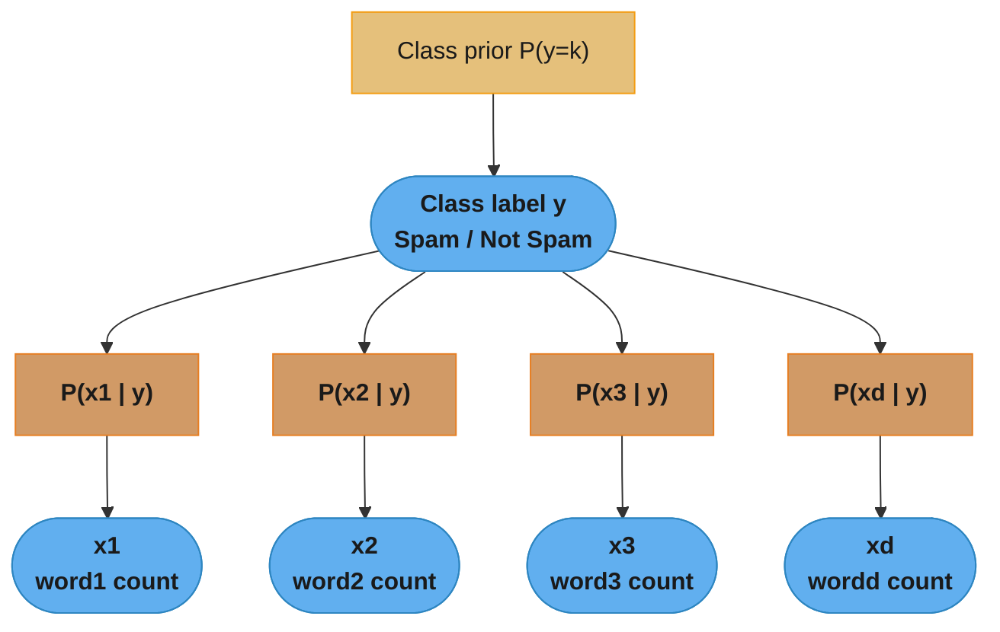
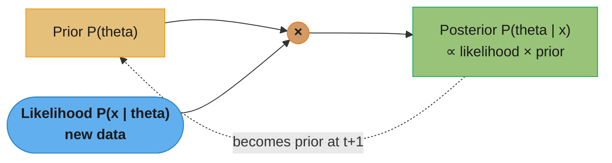
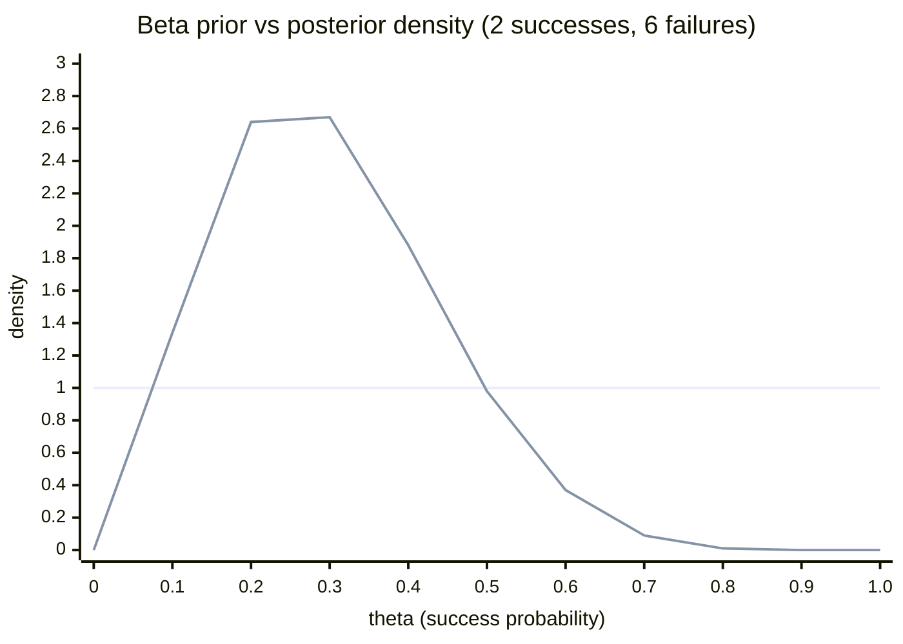
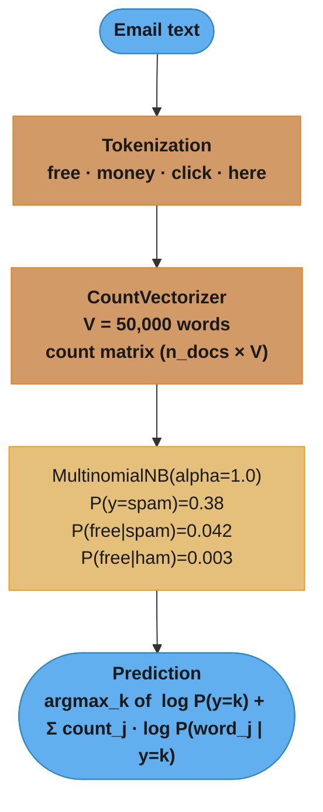
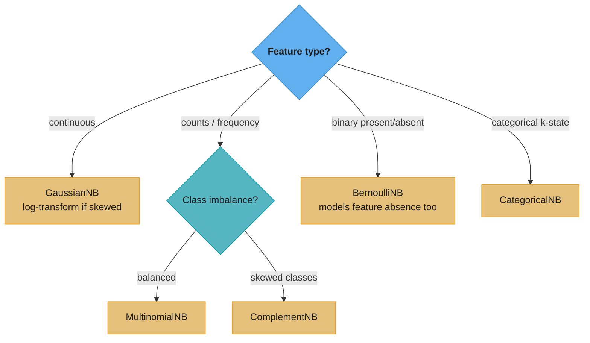

# Bayesian Methods and Naive Bayes — Deep Dive

## 1. Concept Overview

Bayesian methods are a family of machine learning and statistical inference techniques that use Bayes theorem to update beliefs (probability distributions over model parameters or hypotheses) given observed data. They contrast with frequentist methods (like OLS or maximum likelihood estimation) by treating model parameters as random variables with prior distributions, not fixed unknown constants.

**Naive Bayes** is the most widely deployed Bayesian classifier. It applies Bayes theorem to compute P(y | x) but makes the "naive" conditional independence assumption: given the class label y, each feature x_j is independent of all other features. Despite this assumption being almost always false, Naive Bayes often works surprisingly well in practice — especially for text classification — because the assumption helps rather than hurts when the goal is classification (not probability estimation).

**Full Bayesian inference** (Bayesian linear regression, Bayesian neural networks, Gaussian Processes) maintains full posterior distributions over model parameters, enabling uncertainty quantification. This is computationally expensive but powerful for small datasets, active learning, and safety-critical applications.

---

## 2. Intuition

One-line analogy for Naive Bayes: a biased doctor who diagnoses disease independently from each symptom, tallies up the votes for each disease, and picks the winner — surprisingly often correct.

Mental model for Bayesian inference: start with a belief about the world (prior), observe evidence, update the belief (posterior). Repeat as new evidence arrives. The posterior from one update becomes the prior for the next.

Key insight on "naive" working: even if the feature independence assumption is wrong, the classifier often predicts the correct class because the ranking of P(y=k | x) across classes is more important than the exact probabilities. If every feature points toward the same class (spam words in a spam email), the wrong probability estimates still produce the correct argmax.

Key insight on priors: Laplace smoothing in Naive Bayes is exactly the posterior mode under a Dirichlet(alpha+1) prior. Adding pseudocounts is Bayesian reasoning about unseen events.

---

## 3. Core Principles

**Bayes Theorem**:
```
P(y | x) = P(x | y) * P(y) / P(x)

Posterior    Likelihood   Prior   Marginal likelihood (normalizing constant)
```

For classification, P(x) is the same for all classes, so:
```
y* = argmax_k P(y=k | x)
   = argmax_k P(x | y=k) * P(y=k)
   = argmax_k log P(x | y=k) + log P(y=k)
```

**In plain terms.** "Start from how common each class is, multiply by how well that class explains what you just observed, and divide by the total so the numbers add to one."

The division by `P(x)` is the only part that touches every class at once — and it is identical for all of them. That is why the argmax form above can throw it away, and why Naive Bayes never has to compute the hardest term in the equation.

| Symbol | What it is |
|--------|------------|
| `P(y \| x)` | Posterior. The answer you want: which class, given the features you actually saw |
| `P(x \| y)` | Likelihood. If the class really were `y`, how unsurprising would this data be |
| `P(y)` | Prior. How often class `y` shows up before you look at any features |
| `P(x)` | Evidence. Total probability of seeing this data at all, summed over every class |
| `argmax_k` | "Return the `k` that scores highest" — the label, not the score |
| `log` in line 3 | Products of many small numbers underflow; logs turn the product into a sum |

**Walk one example.** The classic base-rate trap — a rare disease and a test that is 99% sensitive:

```
  prior            P(D)         = 0.01     1 person in 100 has the disease
  likelihood       P(+ | D)     = 0.99     the test catches 99% of true cases
  false positives  P(+ | no D)  = 0.05     it also flags 5% of healthy people

  disease branch   = P(+ | D)    x P(D)     = 0.99 x 0.01 = 0.0099
  healthy branch   = P(+ | no D) x P(no D)  = 0.05 x 0.99 = 0.0495
  evidence  P(+)   = 0.0099 + 0.0495                      = 0.0594

  P(D | +) = 0.0099 / 0.0594 = 0.167
```

A positive result on a 99%-accurate test means a **16.7%** chance of disease, not 99%. The prior is doing the damage: healthy people are 99x more numerous, so their 5% false-positive rate produces `0.0495` of wrong flags against only `0.0099` of right ones — five wrong for every one right. This is exactly the failure mode the "biased doctor" analogy in Section 2 is warning about, and it is why the class prior `P(y)` cannot be dropped from a Naive Bayes score even though `P(x)` can.

**Naive independence assumption**:
```
P(x | y=k) = prod_j P(x_j | y=k)   (features independent given class)
```

This transforms the joint distribution over d features into d independent univariate distributions per class, dramatically reducing the number of parameters.

**What this actually says.** "Assume the features never talk to each other, so you can multiply `d` easy one-feature answers instead of estimating one impossible `d`-dimensional answer."

| Symbol | What it is |
|--------|------------|
| `prod_j` | Multiply over every feature `j = 1..d` |
| `P(x_j \| y=k)` | One univariate estimate: how feature `j` behaves inside class `k` alone |
| `d` | Number of features (vocabulary size for text) |
| `k` | Class index; the product is recomputed once per class |

**Walk one example.** Count the parameters for 20 binary features and 2 classes:

```
  full joint P(x | y=k)   : every combination of 20 binary features must get a number
                            2 classes x (2^20 - 1) free params = 2,097,150

  naive factorization     : one Bernoulli probability per feature per class
                            2 classes x 20 features        =        40

  reduction: 2,097,150 / 40 = 52,428x fewer parameters to estimate
```

Two million parameters cannot be estimated from a few thousand documents — most feature combinations would be observed zero times. Forty can be estimated from almost nothing. That is the entire trade: the assumption is false, but it converts an unlearnable estimation problem into a trivial one, and the bias it injects is the regularization that makes Naive Bayes strong on small data.

**Likelihood models**:
- Gaussian NB: P(x_j | y=k) = N(mu_kj, sigma_kj^2) — for continuous features
- Multinomial NB: P(x | y=k) = multinomial distribution — for count features (word counts)
- Bernoulli NB: P(x_j | y=k) = Bernoulli(p_kj) — for binary features (word presence/absence)

**Log-sum trick** (numerical stability): multiply many small probabilities (underflow) → sum log probabilities.

**What it means.** "Ranking by a product of probabilities and ranking by the sum of their logs give the same winner — but only the sum survives floating point."

`log` is monotonic: if `a > b` then `log a > log b`. So swapping the product for a sum of logs cannot change which class wins, and it replaces multiplication of tiny numbers with addition of moderate negative numbers.

| Symbol | What it is |
|--------|------------|
| `prod_j p_j` | The raw product across features — the quantity that underflows |
| `sum_j log p_j` | The log-space equivalent — same ordering, no underflow |
| float64 floor | Roughly `1e-308`; anything smaller rounds to exactly `0.0` |

**Walk one example.** A 200-word document where each word has probability about `0.001`:

```
  raw product   : 0.001 ^ 200          = 1e-600     -> below 1e-308, stored as 0.0
  log-space sum : 200 x log(0.001)     = -1381.55   -> a perfectly ordinary float

  float64 can represent down to about 1e-308, i.e. log = -709.20
  the document needed -1381.55, roughly twice as far down as the format reaches
```

Once the product hits `0.0`, every class scores `0.0` and argmax picks arbitrarily — the classifier silently degrades to guessing on exactly the long documents it should be most confident about. Working in log space costs nothing and removes the failure entirely.

---

## 4. Types / Architectures / Strategies

### 4.1 Naive Bayes Variants

| Variant | Feature Type | Likelihood | Common Use Case |
|---------|-------------|-----------|----------------|
| GaussianNB | Continuous | Gaussian N(mu, sigma^2) | Sensor data, iris dataset |
| MultinomialNB | Count / frequency | Multinomial | Document classification, TF counts |
| BernoulliNB | Binary (0/1) | Bernoulli | Word presence/absence, click data |
| CategoricalNB | Categorical ordinal | Categorical | Discrete variables with k states |
| ComplementNB | Count (for imbalanced) | Complement of class | Text classification with imbalanced classes |

### 4.2 Bayesian vs Frequentist Approaches

| Aspect | Frequentist (MLE) | Bayesian |
|--------|------------------|---------|
| Parameters | Fixed unknowns | Random variables with priors |
| Estimation | Point estimate (MLE) | Full posterior distribution |
| Uncertainty | Confidence intervals (frequentist) | Credible intervals (directly P(theta in [a,b] given data)) |
| Small data | Overfit without regularization | Natural regularization via prior |
| Computation | Fast (closed form or gradient) | Expensive (MCMC, VI) or analytical (conjugate) |
| Prediction | Single prediction | Predictive distribution (accounts for parameter uncertainty) |

### 4.3 Conjugate Priors

A conjugate prior is a prior distribution that produces a posterior of the same family, enabling closed-form posterior updates.

| Likelihood | Conjugate Prior | Posterior |
|-----------|----------------|----------|
| Bernoulli / Binomial | Beta(alpha, beta) | Beta(alpha + n_1, beta + n_0) |
| Multinomial | Dirichlet(alpha) | Dirichlet(alpha + counts) |
| Gaussian (unknown mean) | Gaussian(mu_0, sigma_0^2) | Gaussian (updated mean, variance) |
| Poisson | Gamma(alpha, beta) | Gamma(alpha + sum(x), beta + n) |

Laplace smoothing in Naive Bayes = using a Dirichlet(1, 1, ..., 1) prior (uniform) on the multinomial parameters. The posterior mode is (count + alpha) / (total + alpha * V) where V = vocabulary size and alpha = smoothing parameter.

**Read it like this.** "Before looking at any data, pretend you already saw every word in the vocabulary `alpha` times — then just count normally."

| Symbol | What it is |
|--------|------------|
| `count` | Times word `j` actually appeared in class `k`'s training documents |
| `alpha` | Pseudocount added to every word. `1` = Laplace, `<1` = Lidstone, `0` = no smoothing |
| `V` | Vocabulary size — how many distinct words exist |
| `total` | All word tokens seen in class `k` |
| `alpha * V` | The pseudocounts you added, summed — it must appear in the denominator to keep the probabilities normalized |

**Walk one example.** Reusing the Section 5.4 numbers — `total = 5,000` spam tokens, `V = 50,000`:

```
                                    alpha = 1              alpha = 0.1
  denominator  total + alpha*V      5,000 + 50,000         5,000 + 5,000
                                    = 55,000               = 10,000

  unseen word  (count = 0)          1 / 55,000             0.1 / 10,000
                                    = 0.0000182            = 0.0000100

  common word  (count = 200)        201 / 55,000           200.1 / 10,000
                                    = 0.003655             = 0.02001

  unsmoothed truth for that word:   200 / 5,000 = 0.0400
```

At `alpha = 1` the denominator is inflated 11x (`55,000 / 5,000`) by pseudocounts alone, so a word genuinely occurring 4% of the time gets reported at 0.37% — the prior has swamped the data. Dropping to `alpha = 0.1` halves the denominator inflation and lands at 2.0%, much closer to the truth while still keeping unseen words finite. This is precisely why the Section 13 best practice recommends `alpha = 0.1` or `0.01` for large vocabularies: when `alpha * V` dwarfs `total`, Laplace smoothing stops being a safety net and starts being the model.

---

## 5. Architecture Diagrams

### 5.1 Naive Bayes Generative Model



The fan-out is the "naive" assumption made visible: given the class y, every feature is generated
independently, so P(x | y) factors into a product of per-feature terms. Inference reverses the
arrows — observe x, then pick argmax_k P(y=k) · prod_j P(xj | y=k).

### 5.2 Bayesian Update (Prior → Posterior)



Belief updating is a loop: the posterior after seeing today's data becomes the prior for tomorrow.
Because the update multiplies prior by likelihood, evidence accumulates — with enough data the
likelihood dominates and the initial prior washes out.

The Beta family shows this concretely. Starting from a flat Beta(1,1) prior and observing 2
successes and 6 failures gives a Beta(3,7) posterior that has sharpened and shifted toward 0.25:



The flat line is the uninformative Beta(1,1) prior (every rate equally likely); the peaked line is
the Beta(3,7) posterior, now concentrated near the observed 25% success rate. More data makes the
peak taller and narrower — that narrowing is quantified uncertainty shrinking.

### 5.3 Text Classification Pipeline (Multinomial NB)



Prediction is a sparse dot product: only the words present in the email contribute to each class
score, so scoring costs O(words in email), not O(vocabulary). alpha is the Laplace smoothing that
keeps an unseen word from zeroing out the whole product.

### 5.4 Laplace Smoothing Effect

```
Without smoothing (alpha=0):          With Laplace smoothing (alpha=1):

Word "unprecedented" not seen          P("unprecedented" | spam) = (0 + 1) / (N_spam + V)
in training spam documents.            = 1 / (5000 + 50000)
                                       = 0.0000182
P("unprecedented" | spam) = 0/N = 0
log(0) = -infinity                     log(0.0000182) = -10.9   (finite, usable)
                                       This is the Laplace pseudocount trick.
Entire document probability = 0
(one unseen word kills everything)
```

### 5.5 Choosing a Naive Bayes Variant



The first split is feature type; the second, for count features, is whether classes are balanced.
This maps the §4.1 variant table onto a decision anyone can follow at model-selection time — the
single most common mistake is feeding TF-IDF floats or continuous features into MultinomialNB.

---

## 6. How It Works — Detailed Mechanics

### 6.1 All Naive Bayes Variants in sklearn

```python
from __future__ import annotations

import numpy as np
import pandas as pd
from sklearn.datasets import fetch_20newsgroups, load_iris, make_classification
from sklearn.feature_extraction.text import CountVectorizer, TfidfTransformer
from sklearn.model_selection import train_test_split, cross_val_score
from sklearn.naive_bayes import (
    GaussianNB, MultinomialNB, BernoulliNB, ComplementNB,
)
from sklearn.pipeline import Pipeline
from sklearn.metrics import accuracy_score, classification_report


def gaussian_nb_example() -> None:
    """
    GaussianNB: assumes each feature is Gaussian within each class.
    Parameters: class_prior, theta_ (class means), var_ (class variances).
    var_smoothing: adds epsilon to variance to avoid P(x|y)=0 for zero-variance features.
    """
    iris = load_iris()
    X, y = iris.data, iris.target   # 4 continuous features

    X_train, X_test, y_train, y_test = train_test_split(
        X, y, test_size=0.2, stratify=y, random_state=42
    )

    gnb = GaussianNB(var_smoothing=1e-9)   # var_smoothing default is fine for most cases
    gnb.fit(X_train, y_train)

    print("Class priors:    ", gnb.class_prior_)       # P(y=k)
    print("Feature means:   ", gnb.theta_.shape)       # (n_classes, n_features)
    print("Feature variances:", gnb.var_.shape)        # (n_classes, n_features)

    print(f"\nTest accuracy: {gnb.score(X_test, y_test):.4f}")
    # On Iris: typically 0.93-0.97

    # Partial fit: GaussianNB supports online/incremental learning
    # Useful for streaming data or data too large for RAM
    gnb_online = GaussianNB()
    for i in range(0, len(X_train), 10):
        batch_X = X_train[i:i+10]
        batch_y = y_train[i:i+10]
        gnb_online.partial_fit(batch_X, batch_y, classes=np.unique(y))
    print(f"Online learning accuracy: {gnb_online.score(X_test, y_test):.4f}")


def multinomial_nb_text_classification() -> None:
    """
    MultinomialNB on 20 Newsgroups dataset.
    Demonstrates the full text classification pipeline.
    alpha = Laplace smoothing parameter:
        alpha=1.0  = Laplace smoothing (add-one smoothing)
        alpha=0.1  = Lidstone smoothing (partial smoothing)
        alpha=0.0  = no smoothing (causes log(0) = -inf for unseen words)
    """
    # Load a subset: 4 categories for speed
    categories = ["sci.space", "talk.religion.misc", "rec.sport.hockey", "comp.graphics"]
    train_data = fetch_20newsgroups(subset="train", categories=categories, remove=("headers", "footers", "quotes"))
    test_data  = fetch_20newsgroups(subset="test",  categories=categories, remove=("headers", "footers", "quotes"))

    pipeline = Pipeline([
        ("vect", CountVectorizer(
            max_features=50_000,
            stop_words="english",
            min_df=2,               # ignore words appearing in < 2 documents
        )),
        ("mnb", MultinomialNB(alpha=0.1)),   # alpha=0.1 often better than 1.0 for text
    ])

    pipeline.fit(train_data.data, train_data.target)

    y_pred = pipeline.predict(test_data.data)
    print(classification_report(
        test_data.target, y_pred, target_names=categories
    ))

    # Inspect top words per class
    vectorizer = pipeline.named_steps["vect"]
    mnb = pipeline.named_steps["mnb"]
    feature_names = vectorizer.get_feature_names_out()

    for class_idx, class_name in enumerate(categories):
        # Log probabilities: higher = more associated with this class
        top_indices = np.argsort(mnb.feature_log_prob_[class_idx])[-10:]
        top_words = feature_names[top_indices][::-1]
        print(f"\nTop words for {class_name}: {list(top_words)}")


def bernoulli_nb_example() -> None:
    """
    BernoulliNB: features are binary (present/absent).
    Unlike MultinomialNB (which uses counts), BernoulliNB uses presence.
    binarize parameter: threshold to convert continuous/count to binary.
    BernoulliNB explicitly models P(x_j=0 | y=k) — the absence of a feature
    is informative, unlike MultinomialNB where zeros are ignored.
    """
    categories = ["sci.space", "talk.religion.misc"]
    train_data = fetch_20newsgroups(subset="train", categories=categories)
    test_data  = fetch_20newsgroups(subset="test",  categories=categories)

    # BernoulliNB with binarize — internally binarizes feature values
    pipeline_bernoulli = Pipeline([
        ("vect", CountVectorizer(max_features=20_000, stop_words="english")),
        # binarize=0: count > 0 becomes 1 (word present), 0 stays 0 (absent)
        ("bnb", BernoulliNB(alpha=1.0, binarize=0.0)),
    ])
    pipeline_bernoulli.fit(train_data.data, train_data.target)
    acc = pipeline_bernoulli.score(test_data.data, test_data.target)
    print(f"BernoulliNB accuracy: {acc:.4f}")


def complement_nb_example() -> None:
    """
    ComplementNB: uses the complement of the target class for estimation.
    P(x | NOT y=k) rather than P(x | y=k).
    Especially effective for imbalanced multi-class text problems.
    norm=True normalizes weights to prevent class size bias.
    """
    categories = fetch_20newsgroups(subset="train").target_names
    train_data = fetch_20newsgroups(subset="train")
    test_data  = fetch_20newsgroups(subset="test")

    for clf_class, name in [(MultinomialNB, "MultinomialNB"), (ComplementNB, "ComplementNB")]:
        pipeline = Pipeline([
            ("vect", CountVectorizer(max_features=50_000, stop_words="english")),
            ("clf", clf_class(alpha=0.1)),
        ])
        pipeline.fit(train_data.data, train_data.target)
        acc = pipeline.score(test_data.data, test_data.target)
        print(f"{name:15s} accuracy on 20newsgroups: {acc:.4f}")
    # ComplementNB typically beats MultinomialNB by 1-3% on this task
```

### 6.2 Laplace Smoothing — Manual Implementation

```python
def naive_bayes_from_scratch(
    X_train: np.ndarray,        # shape (n, V) — word count matrix
    y_train: np.ndarray,        # shape (n,) — class labels in {0, ..., K-1}
    alpha: float = 1.0,         # Laplace smoothing
) -> dict[str, np.ndarray]:
    """
    Manual Multinomial Naive Bayes to make the math transparent.
    Returns log probabilities for efficient inference.
    """
    n, V = X_train.shape
    classes = np.unique(y_train)
    K = len(classes)

    # Prior: P(y=k) = count(y=k) / n
    class_counts = np.array([np.sum(y_train == k) for k in classes])
    log_priors = np.log(class_counts / n)   # shape (K,)

    # Likelihood: P(word_j | y=k)
    # For each class k, count total word occurrences from class k documents
    log_likelihoods = np.zeros((K, V))
    for k_idx, k in enumerate(classes):
        class_docs = X_train[y_train == k]           # shape (n_k, V)
        word_counts = class_docs.sum(axis=0) + alpha  # Laplace smoothing: add alpha
        total_words = word_counts.sum()               # total word tokens in class k
        log_likelihoods[k_idx] = np.log(word_counts / total_words)

    return {
        "log_priors": log_priors,
        "log_likelihoods": log_likelihoods,
        "classes": classes,
    }


def predict_naive_bayes(
    X_test: np.ndarray,
    model: dict[str, np.ndarray],
) -> np.ndarray:
    """
    Predict class labels using log-probabilities (avoids underflow).
    Score for class k = log P(y=k) + sum_j x_j * log P(word_j | y=k)
    """
    log_priors = model["log_priors"]         # shape (K,)
    log_likelihoods = model["log_likelihoods"]  # shape (K, V)

    # log P(y=k | x) proportional to log P(y=k) + x^T log_likelihoods[k]
    # X_test shape (n_test, V); log_likelihoods.T shape (V, K)
    # Scores shape: (n_test, K)
    scores = X_test @ log_likelihoods.T + log_priors
    return model["classes"][np.argmax(scores, axis=1)]
```

**Put simply.** "Every class starts with a handicap — its log prior — and then earns points for each word in the document; highest total wins."

| Symbol | What it is |
|--------|------------|
| `log P(y=k)` | The starting handicap. A rarer class begins further behind |
| `c_j` | How many times word `j` appears in this document |
| `log P(word_j \| y=k)` | Points per occurrence of that word for class `k`. Always negative; less negative = better |
| `X_test @ log_likelihoods.T` | The whole per-word sum, done as one sparse matrix multiply |
| `argmax` | Pick the class with the highest total; the total itself is not a probability |

**Walk one example.** Using the Section 5.3 numbers — `P(spam) = 0.38`, `P(free | spam) = 0.042`, `P(free | ham) = 0.003` — for a document containing "free" twice and "meeting" once, with `P(meeting | spam) = 0.001` and `P(meeting | ham) = 0.008`:

```
                                        spam            ham
  log prior                            -0.968          -0.478
  "free"  x2   2 x log(P)              -6.340         -11.618
  "meeting" x1     log(P)              -6.908          -4.828
                                      --------        --------
  total score                         -14.216         -16.925

  gap = -14.216 - (-16.925) = +2.709 in favour of spam
  P(spam | x) = 1 / (1 + exp(-2.709)) = 0.938
```

Notice that "meeting" pulls hard *toward* ham (`-6.908` vs `-4.828`, a 2.08 penalty) yet loses anyway, because "free" appearing twice contributes a 5.28 swing the other way. Only the gap between the two totals matters — the raw `-14.216` means nothing on its own, which is why these scores must be pushed through a softmax before anyone treats them as probabilities.

### 6.3 Bayesian Inference — Beta-Binomial Example

```python
import scipy.stats as stats
import numpy as np


def bayesian_a_b_test(
    n_control: int,
    n_conversions_control: int,
    n_treatment: int,
    n_conversions_treatment: int,
    prior_alpha: float = 1.0,
    prior_beta: float = 1.0,
    n_samples: int = 100_000,
) -> dict[str, float]:
    """
    Bayesian A/B test using Beta-Binomial conjugate model.

    Prior: Beta(prior_alpha, prior_beta) = uniform Beta(1,1)
    Likelihood: Binomial(n, p) for conversions
    Posterior: Beta(alpha + conversions, beta + non_conversions) [conjugate update]

    Returns P(treatment > control) estimated via Monte Carlo sampling.
    """
    # Posterior for control
    alpha_c = prior_alpha + n_conversions_control
    beta_c  = prior_beta  + (n_control - n_conversions_control)
    posterior_control = stats.beta(alpha_c, beta_c)

    # Posterior for treatment
    alpha_t = prior_alpha + n_conversions_treatment
    beta_t  = prior_beta  + (n_treatment - n_conversions_treatment)
    posterior_treatment = stats.beta(alpha_t, beta_t)

    # Monte Carlo estimate of P(treatment > control)
    samples_control   = posterior_control.rvs(n_samples)
    samples_treatment = posterior_treatment.rvs(n_samples)
    prob_treatment_wins = (samples_treatment > samples_control).mean()

    control_rate   = n_conversions_control   / n_control
    treatment_rate = n_conversions_treatment / n_treatment

    print(f"Control conversion rate:   {control_rate:.4f}")
    print(f"Treatment conversion rate: {treatment_rate:.4f}")
    print(f"P(treatment > control):    {prob_treatment_wins:.4f}")
    print(f"Expected uplift:           {(samples_treatment - samples_control).mean():.4f}")

    return {
        "prob_treatment_wins": prob_treatment_wins,
        "control_rate": control_rate,
        "treatment_rate": treatment_rate,
        "posterior_control": (alpha_c, beta_c),
        "posterior_treatment": (alpha_t, beta_t),
    }


# Example usage:
# 1000 users each, 80 vs 100 conversions
# result = bayesian_a_b_test(1000, 80, 1000, 100)
# P(treatment > control) ≈ 0.94
```

**The idea behind it.** "Add your successes onto the prior's first parameter and your failures onto its second — that is the entire posterior update, no integration required."

| Symbol | What it is |
|--------|------------|
| `Beta(alpha, beta)` | A distribution over a rate between 0 and 1. Think "alpha successes and beta failures already imagined" |
| `alpha` | Pseudo-successes. Grows by one per real conversion |
| `beta` | Pseudo-failures. Grows by one per real non-conversion |
| posterior mean | `alpha / (alpha + beta)` — the rate the posterior is centred on |
| `P(treatment > control)` | Fraction of paired draws where treatment's rate beats control's; a direct probability, not a p-value |

**Walk one example.** The exact call in the comment above — 1,000 users per arm, 80 vs 100 conversions, flat `Beta(1, 1)` prior:

```
                    prior        + successes  + failures     posterior
  control        Beta(1, 1)         + 80         + 920      Beta(81, 921)
  treatment      Beta(1, 1)        + 100         + 900      Beta(101, 901)

                    posterior mean        95% credible interval
  control            0.0808               [0.065, 0.098]
  treatment          0.1008               [0.083, 0.120]

  P(treatment > control) = 0.9406      <- the 0.94 in the comment above
```

The intervals overlap, yet treatment still wins 94% of the time — an overlap-based eyeball test would have called this inconclusive. Under Booking.com's 0.95 launch rule from Section 7, this experiment keeps running rather than shipping.

**Why the prior's counts are a dial, not a formality.** Swap the flat `Beta(1, 1)` for the informative `Beta(5, 95)` of Section 13's best practice — a 5% historical conversion rate — and feed it the same 80-of-1,000 control data:

```
  posterior = Beta(5 + 80, 95 + 920) = Beta(85, 1015)
  posterior mean = 85 / 1100 = 0.0773

  prior mean 0.0500  ------  0.0773  ------  0.0800  data mean
                              ^ posterior sits between the two

  weighting: prior contributes  100 / 1100 =  9.1% of the pseudocounts
             data  contributes 1000 / 1100 = 90.9%
```

The posterior is a weighted average of prior and data, and the weights are literally the counts. With 1,000 observations against a 100-count prior, the data already owns 91% of the answer — this is "the prior washes out" made arithmetic. Early in the test, when only 30 users have converted, that same prior holds most of the weight and is exactly what stops you from launching on noise.

### 6.4 GaussianNB with var_smoothing and Missing Feature Robustness

```python
def gaussian_nb_robustness_demo() -> None:
    """
    GaussianNB is robust to irrelevant features because each feature's
    P(x_j | y=k) is estimated independently. An irrelevant feature has
    identical distributions in all classes: P(x_j | y=0) ≈ P(x_j | y=1),
    so it contributes near-zero log-likelihood difference across classes.
    """
    from sklearn.datasets import make_classification

    X, y = make_classification(
        n_samples=1000,
        n_features=30,
        n_informative=5,    # only 5 features matter
        n_redundant=5,
        n_repeated=0,
        random_state=42,
    )

    X_train, X_test, y_train, y_test = train_test_split(
        X, y, test_size=0.2, stratify=y, random_state=42
    )

    gnb = GaussianNB()
    gnb.fit(X_train, y_train)
    print(f"GaussianNB with 30 features (5 informative): {gnb.score(X_test, y_test):.4f}")

    # GaussianNB with only informative features for comparison
    gnb_5feat = GaussianNB()
    gnb_5feat.fit(X_train[:, :5], y_train)
    print(f"GaussianNB with 5 informative features only: {gnb_5feat.score(X_test[:, :5], y_test):.4f}")
    # Performance is similar because irrelevant features contribute nearly zero signal
```

**Stated plainly.** "For each class, ask how many standard deviations this value sits from that class's average, and let the more surprised class lose."

| Symbol | What it is |
|--------|------------|
| `mu_kj` | Mean of feature `j` among class `k`'s training rows |
| `sigma_kj^2` | Variance of feature `j` within class `k` — the class's tolerance for spread |
| `N(mu, sigma^2)` | Gaussian density evaluated at the observed value; peaks at `mu`, decays with distance |
| `(x - mu) / sigma` | The z-score. This is the only thing the density really reacts to |
| `var_smoothing` | Tiny epsilon added to every variance so a zero-variance feature cannot divide by zero |

**Walk one example.** A single feature — transaction amount of 150 — under two fitted classes:

```
                    fitted mu   fitted sigma   z = (x-mu)/sigma   density    log density
  legit                 60           25             +3.60         0.0000245     -10.62
  fraud                220           90             -0.78         0.0032757      -5.72
                                                                            -----------
                                          log-likelihood advantage to fraud:     +4.90
```

150 is a 3.6-sigma outlier for legit spending but an ordinary draw for fraud, so this one feature contributes `+4.90` of evidence toward fraud before any other feature is consulted.

**Why irrelevant features cost almost nothing.** If a feature has the same fitted `mu` and `sigma` in both classes, its density is identical in both — and identical densities subtract to exactly `0.00` log-likelihood difference. The feature is evaluated, then contributes nothing to the ranking. That is why the 30-feature and 5-feature models in the code above score nearly the same: the 25 uninformative features each add roughly zero to the gap between classes, no matter how many of them there are.

---

## 7. Real-World Examples

**Email Spam Filtering (Multinomial NB)**: the original spam filter deployed by Google Mail and Yahoo Mail (ca. 2002-2008) was Multinomial Naive Bayes on word counts. Despite the obvious incorrectness of the independence assumption (spam words co-occur: "free" and "money" and "click" appear together), the classifier achieved >99% accuracy on the initial deployment. It was fast enough to score millions of emails per second on early 2000s hardware.

**Medical Diagnosis with Small Samples (Gaussian NB)**: in a study of rare genetic disorders, a GaussianNB classifier trained on 120 patient records (40 per subtype) with 15 blood biomarker features achieved 89% classification accuracy. With only 120 samples, logistic regression overfitted badly. GaussianNB's strong independence assumption acted as aggressive regularization, producing stable estimates from few data points.

**Bayesian A/B Testing at Booking.com**: instead of frequentist hypothesis tests (which require fixing n in advance and suffer from optional stopping bias), Booking.com uses Bayesian A/B testing with Beta-Binomial conjugate models. After each week, they compute P(variant > control). When this probability exceeds 0.95, they launch the variant. This framework naturally incorporates prior knowledge (typical conversion rate ranges) and provides intuitive probabilities rather than p-values.

**Document Classification at Wikipedia**: Wikipedia's abuse detection system classifies edits as "vandalism" or "constructive" using Multinomial NB on character and word n-gram features. The model must be retrained daily as vandalism patterns change. NB retraining on 10M edit examples takes under 60 seconds on a single CPU core — critical for the daily refresh cycle.

**Bayesian Hyperparameter Optimization (Bayesian Optimization)**: tools like Optuna and Hyperopt use Bayesian optimization (Tree Parzen Estimator, Gaussian Process Surrogate) to model the hyperparameter-to-validation-accuracy surface as a probabilistic process. They sequentially choose hyperparameter configurations that maximize expected improvement over the current best — a form of Bayesian reasoning that finds good hyperparameters with 5-10x fewer evaluations than grid search.

---

## 8. Tradeoffs

### 8.1 Naive Bayes Variants Comparison

| Variant | Strengths | Weaknesses | Best For |
|---------|-----------|-----------|----------|
| GaussianNB | Handles continuous features; very fast | Assumes Gaussian within class; terrible on skewed features | Sensor data, small samples |
| MultinomialNB | Excellent for count/frequency features; fast; interpretable top words | Requires non-negative features; needs smoothing | TF counts, document classification |
| BernoulliNB | Models feature absence; good for short documents | Ignores frequency; less accurate than Multinomial for long docs | Bag-of-words with binary features |
| ComplementNB | More robust on imbalanced classes than Multinomial | Less interpretable | Multi-class text with class imbalance |

### 8.2 Bayesian vs Frequentist

| Scenario | Bayesian | Frequentist |
|----------|---------|------------|
| Small dataset | Better (prior adds regularization) | Risk of overfit/overly wide CIs |
| Large dataset | Results converge (prior overwhelmed by data) | Equivalent |
| Uncertainty communication | Credible interval: P(theta in [a,b] given data) = 0.95 | Confidence interval: 95% of such intervals contain true theta |
| Computation | Expensive (MCMC, VI) or only tractable with conjugates | Usually faster |
| Prior knowledge available | Prior encodes domain knowledge explicitly | Ignored formally |

---

## 9. When to Use / When NOT to Use

**Use Naive Bayes when**:
- Need an extremely fast baseline (trains in milliseconds, scores in microseconds)
- Very limited labeled data (the strong independence prior prevents overfitting)
- Text classification with bag-of-words features (MultinomialNB dominates)
- Online/streaming learning (partial_fit for incremental updates)
- Interpretability of the model parameters (P(word | class) is directly readable)
- Very high-dimensional feature space (NB scales to millions of features)

**Use Gaussian NB when**:
- Features are continuous and approximately Gaussian within each class
- Dataset is very small (n < 500 per class)
- You need a probabilistic classifier that trains instantly

**Do NOT use Naive Bayes when**:
- Feature interactions are critical to the prediction (NB cannot capture them)
- Feature probability outputs need to be well-calibrated (NB probabilities are often over-confident, especially for many features)
- The independence assumption is dramatically violated and correlated features all point in the same direction (probabilities become artificially extreme)
- You have the data volume and compute to train a discriminative model — logistic regression or gradient boosting will almost always outperform NB on large datasets

**Use full Bayesian methods (GP, Bayesian linear regression) when**:
- Uncertainty quantification over predictions is required (not just a point estimate)
- Dataset is very small and prior knowledge is available
- Active learning: Bayesian methods naturally identify which points to label next (maximum uncertainty)

---

## 10. Common Pitfalls

**Pitfall 1 — Zero probability catastrophe without smoothing**
A Multinomial NB model trained on customer service emails without Laplace smoothing encountered the word "unprecedented" in a test email that had never appeared in training. P("unprecedented" | spam) = 0/N = 0. log(0) = -inf. The entire document's log-probability for the spam class became -inf, regardless of all other features. The model classified every email containing unseen words as "not spam" with probability 1.0. Fix: always set alpha > 0 in MultinomialNB (default alpha=1.0). Never use alpha=0 in production.

**Pitfall 2 — Using MultinomialNB with TF-IDF features**
TF-IDF vectors contain non-integer, non-negative values. MultinomialNB internally interprets features as multinomial counts and is not designed for TF-IDF floats. While sklearn does not raise an error, the probabilistic interpretation is incorrect. Fix: use CountVectorizer (raw counts) with MultinomialNB. For TF-IDF features, use BernoulliNB (binarize=0) or a linear SVM / logistic regression.

**Pitfall 3 — Naive Bayes probability outputs over-confident**
A NB classifier on 20 features reported P(spam) = 0.9999998 for an email. The probability was so extreme that it was being used directly as a risk score by a downstream filter. The independence assumption caused individual probabilities to compound: if 15 features each vote with 80% confidence for spam, the product is 0.8^15 = 0.035 for the complement, so NB reports 0.96 confidence — higher than any individual feature justifies. Fix: calibrate probabilities with sklearn CalibratedClassifierCV(method="isotonic") after training, or use logistic regression for probability outputs.

**What the formula is telling you.** "Every extra feature multiplies the confidence gap again, so independence turns fifteen mild opinions into one absolute verdict."

| Symbol | What it is |
|--------|------------|
| `0.8^15` | The spam-side likelihood product: 15 features each voting spam at 80% |
| `0.2^15` | The ham-side product for the same 15 features |
| normalization | Dividing each product by their sum to get a reported probability |
| log-odds | `log(0.8 / 0.2)` per feature — the additive form of the same compounding |

**Walk one example.** Fifteen features, each only 80/20 confident, treated as independent:

```
  spam side   0.8 ^ 15   = 0.0352
  ham side    0.2 ^ 15   = 0.0000000000328

  reported P(spam) = 0.0352 / (0.0352 + 0.0000000000328) = 0.999999999

  same thing in log-odds:
    per feature   log(0.8 / 0.2) = log 4 = 1.386
    fifteen of them   15 x 1.386          = 20.79 log-odds
```

No single feature claimed more than 80% confidence, yet the model reports essentially certainty — the log-odds add linearly, so confidence compounds exponentially with feature count. When the features are genuinely correlated (the "free"/"money"/"click" cluster of Section 7), the same evidence is being counted fifteen times over, and the reported probability becomes a number that should never be read as a risk score.

**Pitfall 4 — Applying GaussianNB to non-Gaussian features**
A team used GaussianNB on a fraud dataset with highly skewed features (transaction_amount was heavily right-skewed with a long tail). The Gaussian assumption P(x_j | y=k) = N(mu_kj, sigma_kj^2) fit poorly — the estimated mean and variance did not represent the actual distribution. Predictions were unreliable. Fix: log-transform skewed continuous features before GaussianNB, or use MinMaxScaler + BernoulliNB, or switch to a discriminative model.

**Pitfall 5 — Not accounting for class imbalance in prior**
By default, GaussianNB and MultinomialNB estimate P(y=k) from the training class frequencies. If you oversample the minority class before training (e.g., with SMOTE), the estimated priors are now wrong — they no longer reflect the true class distribution. Fix: after oversampling, manually set class_prior in the NB constructor to reflect the true class frequency (e.g., class_prior=[0.97, 0.03] for 3% fraud), or fit the model on the original imbalanced data with the natural prior.

**Pitfall 6 — Ignoring feature dependencies in correlated feature sets**
A Bayesian network (an extension of Naive Bayes that models dependencies) team simplified their model to NB to save engineering time. Their features included (systolic BP, diastolic BP, pulse pressure) — pulse pressure = systolic - diastolic, perfectly linear combination. NB "double-counted" the blood pressure information: it appeared three times independently. The NB model became overconfident. Fix: remove redundant features before applying NB. Feature correlation analysis (correlation matrix, VIF) should precede NB training.

---

## 11. Technologies & Tools

| Tool | Purpose | Notes |
|------|---------|-------|
| sklearn GaussianNB | Gaussian Naive Bayes | Supports partial_fit for online learning |
| sklearn MultinomialNB | Multinomial NB for count features | Most common for text |
| sklearn BernoulliNB | Binary feature NB | Word presence/absence |
| sklearn ComplementNB | Imbalanced text classification | Often outperforms MultinomialNB |
| sklearn CategoricalNB | Categorical feature NB | Native categorical support |
| sklearn CalibratedClassifierCV | Probability calibration for NB | Platt or isotonic regression |
| scipy.stats | Beta, Dirichlet, conjugate prior distributions | Bayesian A/B testing |
| PyMC | Full Bayesian inference with MCMC | Hierarchical models, custom priors |
| Stan (via cmdstanpy) | Industrial-strength MCMC sampling | Faster than PyMC for large models |
| GPyTorch | Gaussian Processes with GPU support | Uncertainty quantification, active learning |
| Optuna | Bayesian hyperparameter optimization | Tree Parzen Estimator |
| pomegranate | General probabilistic graphical models, NB extensions | Mixture models, hidden Markov models |

---

## 12. Interview Questions with Answers

**Q: State Bayes theorem and explain each term in a classification context.**
P(y | x) = P(x | y) * P(y) / P(x). The posterior P(y | x) is the probability of the class given the observed features — this is what we want to predict. P(x | y) is the likelihood: how likely are these features under each class model. P(y) is the prior: how frequent is each class in the training data. P(x) is the marginal likelihood (normalizing constant): the same for all classes, so it cancels when taking argmax. In practice we compute: argmax_k P(x | y=k) * P(y=k).

**Q: Why is the independence assumption "naive" and why does NB still work?**
The independence assumption P(x | y) = prod_j P(x_j | y) is almost always violated — words co-occur, features are correlated. Despite this, NB works because: (1) for classification, we only need the argmax of P(y | x) across classes, not the exact probability — the ranking can be correct even with wrong individual probabilities; (2) if all features point toward the same class (many spam words in a spam email), even correlated features cumulatively support the correct prediction; (3) the strong bias (independence assumption) acts as regularization, preventing overfitting on small datasets. NB is a high-bias, low-variance model.

**Q: What is Laplace smoothing and why is it necessary?**
Laplace smoothing (alpha parameter in sklearn) adds a pseudocount of alpha to every word count in every class before computing likelihood estimates: P(word_j | y=k) = (count(word_j, y=k) + alpha) / (total_words_in_y=k + alpha * V). Without smoothing (alpha=0), any word not seen in training for class k gives P(word_j | y=k) = 0, which makes the entire document probability zero (the zero-probability catastrophe). Laplace smoothing corresponds to using a Dirichlet(alpha,...,alpha) prior over the multinomial parameters — it is Bayesian estimation with a uniform prior (alpha=1) or a more informative prior (alpha < 1 for sharper models, alpha > 1 for more smoothing). Setting alpha = 1/V (expected count per word in uniform distribution) is also common.

**Q: What is the difference between MultinomialNB and BernoulliNB?**
MultinomialNB uses word counts as features: P(x | y=k) is a multinomial distribution over words. It is appropriate when the number of occurrences matters (longer documents with more occurrences of key words should score higher). BernoulliNB uses binary features: each feature is 0 (word absent) or 1 (word present), regardless of frequency. BernoulliNB explicitly models the probability of word absence — P(x_j=0 | y=k) — which is useful when absence is informative (a spam email that lacks common greeting words is suspicious). For long documents, MultinomialNB typically outperforms BernoulliNB; for short texts (tweets, titles), the difference is smaller.

**Q: How does Naive Bayes handle continuous features?**
GaussianNB assumes each continuous feature is Gaussian within each class: P(x_j | y=k) = N(mu_kj, sigma_kj^2). During training, it estimates mu_kj = sample mean and sigma_kj^2 = sample variance for each feature-class combination. Prediction uses the Gaussian PDF to compute the likelihood. If the Gaussian assumption is violated (skewed features, multimodal distributions), GaussianNB performance degrades. Alternatives: (1) log-transform skewed features; (2) discretize continuous features and use MultinomialNB; (3) use kernel density estimation instead of Gaussian (KDE-based NB).

**Q: Can Naive Bayes be used for regression? If not, what is the Bayesian regression equivalent?**
Standard NB is a classifier. The Bayesian regression equivalent is Bayesian linear regression: assumes w ~ N(mu_0, Sigma_0) as prior and y = w^T x + epsilon where epsilon ~ N(0, sigma^2). The posterior is also Gaussian (conjugate): w | X, y ~ N(mu_n, Sigma_n) with closed-form updates. Predictions are distributions over y, not point estimates. Bayesian ridge regression (sklearn BayesianRidge) implements this — it automatically estimates the regularization parameter from the data via evidence maximization, rather than requiring cross-validation.

**Q: What is the difference between MAP estimation and full Bayesian inference?**
MAP (Maximum A Posteriori) estimation finds the single parameter value that maximizes the posterior P(theta | data) = P(data | theta) * P(theta) / P(data). It is a point estimate — equivalent to regularized MLE (L2 regularization corresponds to a Gaussian prior; L1 corresponds to a Laplace prior). Full Bayesian inference maintains the entire posterior distribution P(theta | data), enabling uncertainty quantification, credible intervals, and predictive distributions that account for parameter uncertainty. MAP is fast (gradient optimization); full inference requires MCMC (slow, exact) or variational inference (fast approximation).

**Q: What are conjugate priors and why are they useful?**
A conjugate prior is a prior distribution that, when combined with a specific likelihood via Bayes theorem, produces a posterior of the same distributional family. This enables closed-form posterior updates without numerical integration. Example: Beta prior + Binomial likelihood = Beta posterior (the counts just add to the parameters: Beta(alpha + successes, beta + failures)). Useful because: (1) exact posterior in closed form — no MCMC needed; (2) interpretable updates — posterior parameters have direct meaning as pseudocounts; (3) online learning is trivial — each new observation updates the parameters analytically. Laplace smoothing in NB is using a Dirichlet(alpha) prior conjugate to the Multinomial likelihood.

**Q: How do you handle a feature with a very large number of categories in Naive Bayes?**
With K classes and a feature with V categories, you estimate K*V probabilities from the training data. If V is very large (e.g., user_id, product_id), many category-class combinations will have zero count, causing over-reliance on Laplace smoothing (all zeros become alpha/(n_class + alpha*V) — effectively ignoring the feature). Solutions: (1) increase alpha to smooth more aggressively; (2) group rare categories into an "Other" bucket; (3) use hashing (sklearn HashingVectorizer) to collapse high-cardinality into a fixed-size hash space; (4) remove high-cardinality identifiers entirely — they are unlikely to generalize.

**Q: What is the relationship between Naive Bayes and logistic regression?**
For Gaussian NB with equal class variances (assumption: covariance matrices are identical across classes), the decision boundary is linear — and it is identical to the logistic regression decision boundary when the features are Gaussian. More generally, NB is a generative model (models P(x, y) = P(x | y) P(y)) and logistic regression is a discriminative model (models P(y | x) directly). When the NB assumptions hold perfectly, NB achieves the same asymptotic accuracy as logistic regression with fewer training samples. When the NB assumptions are violated, logistic regression typically outperforms NB on large datasets because it learns the best linear boundary without assuming a parametric distribution.

**Q: How would you compute P(spam | words) for a new email using Multinomial NB?**
Step 1: compute log P(spam) = log(n_spam / n_total) and log P(ham) from training data. Step 2: for each word j in the email with count c_j, add c_j * log P(word_j | spam) to the spam log-score and c_j * log P(word_j | ham) to the ham log-score (skip words not in vocabulary if using vocabulary-limited vectorizer, or handle with smoothing). Step 3: the spam score = log P(spam) + sum_j c_j * log P(word_j | spam). Step 4: the class with the higher log-score wins. To get the actual probability: P(spam | x) = exp(spam_score) / (exp(spam_score) + exp(ham_score)) — use scipy.special.softmax for numerical stability.

**Q: How do you calibrate Naive Bayes probabilities, and when is this important?**
NB probabilities are often poorly calibrated — predicted probability 0.99 does not mean 99% of such cases are positive. Calibration is important when the probability itself is used downstream (expected value calculations, risk thresholds, probability-based routing). Fix using sklearn CalibratedClassifierCV: wrap the NB model with method="isotonic" (nonparametric, requires > ~1000 calibration examples) or method="sigmoid" (Platt scaling, for smaller calibration sets). Always evaluate calibration on a separate calibration set (not the training set) using a reliability diagram or Brier score.

**Q: Explain Bayesian A/B testing and how it differs from frequentist hypothesis testing.**
Bayesian A/B test: model conversion rate p as Beta(alpha, beta) prior (typically uniform Beta(1,1)). After observing n conversions out of N trials, the posterior is Beta(alpha + conversions, beta + non_conversions). To compare two variants, compute P(p_treatment > p_control) via Monte Carlo samples from both posteriors. Result: a direct probability statement ("91% chance treatment wins"). Frequentist: compute a p-value (probability of observing data this extreme under the null hypothesis), compare to alpha=0.05. Does NOT give P(treatment is better). Frequentist suffers from optional stopping bias (peeking at data and stopping early inflates false positive rate). Bayesian is immune to optional stopping — you can look at any time without inflating error rates.

**Q: What is the difference between a credible interval and a confidence interval?**
A 95% Bayesian credible interval [a, b] means: given the observed data, the probability that the parameter lies in [a, b] is 0.95. This is the intuitive, direct interpretation. A 95% frequentist confidence interval means: if we repeated the experiment many times and computed this interval each time, 95% of such intervals would contain the true parameter. It does NOT mean the probability that this specific interval contains the true parameter is 95% (because in the frequentist framework, the parameter is fixed, not random). In practice, most practitioners (incorrectly) interpret confidence intervals as credible intervals — which is actually valid under a flat (non-informative) prior.

**Q: How does Naive Bayes perform compared to gradient boosting on tabular data?**
On most tabular datasets with continuous features, gradient boosting significantly outperforms NB because: (1) gradient boosting captures feature interactions; (2) NB's Gaussian assumption rarely holds for tabular data; (3) gradient boosting handles non-linear relationships natively. NB is competitive or superior when: features are truly count-based (text, event logs); dataset is very small (n < 500); training and inference must be sub-millisecond; features are conditionally nearly independent (rare in tabular data but common in text). On 20 Newsgroups, MultinomialNB achieves ~82% accuracy vs. gradient boosting ~88% — the gap is small, and NB trains 100x faster.

**Q: What is Bayesian model selection and how does it differ from cross-validation?**
Bayesian model selection uses the marginal likelihood P(data | model) = integral P(data | theta, model) P(theta | model) d_theta — also called evidence or model evidence — to compare models. The model with the highest evidence is preferred. This automatically balances fit and complexity (the Occam's Razor of Bayesian model selection: models that fit the data well without excessive parameters have higher evidence). Cross-validation estimates out-of-sample predictive performance empirically, requiring multiple train-test splits. Bayesian model selection is computationally harder (requires integrating over the parameter space) but provides an analytical framework for model comparison. For Gaussian NB, sklearn BayesianGaussianMixture implements evidence-based component selection.

**Q: How does BayesianRidge regression differ from standard Ridge regression?**
Standard Ridge (Ridge(alpha=1.0)) fixes the regularization strength alpha externally (chosen by cross-validation). BayesianRidge places a Gamma prior on both the precision of the noise (1/sigma^2) and the precision of the weights (1/alpha), then finds the MAP estimate for all parameters jointly using evidence maximization (type-II MLE / empirical Bayes). The result: alpha is learned from the data automatically — no cross-validation needed. BayesianRidge also provides posterior variance on the weights (enabling confidence intervals on predictions). It is especially useful when the training set is small (< 1000 samples) or when cross-validation is computationally expensive.

**Q: Why is Naive Bayes computed in log space using the log-sum-exp trick?**
Multiplying many small per-word probabilities underflows to zero in floating point, so NB sums log-probabilities instead of multiplying raw probabilities. A 200-word document multiplies 200 numbers each around 0.001, giving ~10^-600, which is below the float64 minimum (~10^-308) and rounds to exactly 0 — destroying the class comparison. Taking logs turns the product into a sum of finite negative numbers that never underflows. To recover the normalized probability P(y | x) from log-scores, apply the log-sum-exp trick (subtract the max log-score before exponentiating) for numerical stability.

**Q: What is the difference between var_smoothing in GaussianNB and alpha smoothing in MultinomialNB?**
They fix different failure modes: var_smoothing guards against zero-variance continuous features, while alpha guards against unseen words in count features. var_smoothing adds a tiny epsilon to feature variances so a zero-variance feature does not cause a divide-by-zero in the Gaussian PDF (default 1e-9, scaled by the largest feature variance). alpha adds pseudocounts to word counts so an unseen word does not force P=0 in the multinomial (default 1.0, a Bayesian Dirichlet prior). A common mistake is expecting alpha to help GaussianNB — it has no alpha parameter at all.

**Q: Why does ComplementNB often outperform MultinomialNB on imbalanced text?**
ComplementNB estimates each class's parameters from the complement of that class — all documents NOT in it — giving a far larger, more stable sample when the class itself is tiny. Standard MultinomialNB estimates P(word | class) from only the in-class documents, so a minority class with few examples yields noisy, count-starved likelihoods biased toward the majority. Using the complement also counteracts the tendency to assign long documents to text-heavy classes. On skewed 20-Newsgroups-style corpora, ComplementNB typically beats MultinomialNB by 1–3% accuracy.

---

## 13. Best Practices

1. Always set alpha > 0 in MultinomialNB and BernoulliNB. Default alpha=1.0 is conservative smoothing. For large vocabularies (50,000+ words), alpha=0.1 or alpha=0.01 often performs better — tune with cross-validation.

2. Use CountVectorizer (raw counts), not TfidfVectorizer, with MultinomialNB. TF-IDF values are floats that violate the multinomial count assumption. For TF-IDF features, use logistic regression or SVM with linear kernel instead.

3. Calibrate NB probabilities if the output probability is used downstream. Use CalibratedClassifierCV with method="isotonic" on a separate calibration set (not the training set).

4. Do not use GaussianNB with skewed or multimodal continuous features without transformation. Log-transform right-skewed features first. Check the normality assumption with histograms split by class.

5. For text with severe class imbalance, use ComplementNB instead of MultinomialNB. ComplementNB estimates parameters using the complement of the target class, which is more robust when one class has very few training examples.

6. Use partial_fit for online or incremental learning. NB is one of the few sklearn classifiers supporting partial_fit — it can learn from mini-batches without storing all training data. Useful for data that arrives as a stream or is too large for RAM.

7. For Bayesian A/B testing, choose the prior deliberately. Beta(1, 1) (uniform) is the non-informative choice. If historical conversion rate is ~5%, use Beta(5, 95) as a more informative prior — it requires more data to shift away from the historical rate, reducing the risk of early stopping on noise.

8. When using full Bayesian inference (PyMC, Stan), validate the model using posterior predictive checks: simulate data from the posterior and compare to actual observed data. If simulated data looks qualitatively different, the model is misspecified.

9. Be explicit about what prior means. A Gaussian prior N(0, sigma^2) on weights in Bayesian regression is equivalent to L2 regularization with strength 1/sigma^2. This connection allows practitioners to translate domain knowledge (expected coefficient magnitude) directly into a prior.

10. Report uncertainty alongside point estimates in production Bayesian models. The value of Bayesian methods is lost if only the posterior mean is reported. Include credible intervals, predictive distributions, or confidence bands on all outputs.

---

## 14. Case Study

**Problem**: an e-mail service provider needs a real-time spam classifier that must (1) classify a new email in under 2ms, (2) retrain daily on 10M new emails without disrupting service, (3) be interpretable enough that the team can audit why a specific email was flagged, and (4) handle concept drift as spammers adapt weekly.

**Why MultinomialNB**: logistic regression with 100,000 TF-IDF features would require matrix operations on each email (100,000-dimension dot product). MultinomialNB prediction is a sparse sum over only the words present in the email — O(d_email) where d_email is the unique word count of the email (typically 20-200 words), not the vocabulary size. Training is a single pass over the data computing word counts. Incremental training via partial_fit allows nightly retraining without re-processing historical data.

**Architecture**:
```
Incoming email
    |
    v
Preprocessing (1ms)
    |--- strip HTML tags
    |--- lowercase, tokenize
    |--- remove stopwords
    |
    v
HashingVectorizer(n_features=2^20, alternate_sign=False)
    |--- avoids vocabulary memory overhead
    |--- hash collision rate < 0.1% at 2^20 buckets for typical email vocabulary
    |
    v
MultinomialNB(alpha=0.01) — loaded from model store (pickle, 8MB)
    |--- predict_proba in < 1ms
    |--- P(spam | email) > 0.7 → quarantine
    |--- P(spam | email) > 0.95 → reject
    |
    v
Daily retraining via partial_fit
    |--- stream 10M labeled emails through the model in 45-second batches
    |--- total daily retraining time: ~8 minutes on 8 CPU cores
    |--- new model deployed with atomic file replacement (zero downtime)
```

**Interpretability**: for any flagged email, extract the top 10 words by their per-word log-likelihood ratio: log P(word | spam) - log P(word | ham). These are the words most responsible for the spam prediction. Display to human reviewer: "Flagged because: 'free_trial', 'click_here', 'unsubscribe_immediately' have high spam association."

**Results**:
- Precision: 0.996 (very few false positives — critical to not quarantine legitimate email)
- Recall: 0.973 (27 in 1000 spam emails slip through — acceptable)
- Average inference latency: 0.8ms (well under 2ms SLA)
- Model size: 8MB (vocabulary of 1M hashed features, stored as float32 log-probabilities)
- Daily retraining adapts to new spam campaigns within 24 hours

**Lesson**: MultinomialNB is the correct production choice here, not gradient boosting or a transformer. The constraints (2ms latency, daily retraining of 10M examples, 8MB model size, human-interpretable audit trail) all favor NB's simplicity. Gradient boosting would require 50-200ms inference and hours of daily retraining. A transformer would require GPU infrastructure. The 2-3% accuracy gap between NB and gradient boosting is irrelevant compared to the 100x engineering complexity difference.
