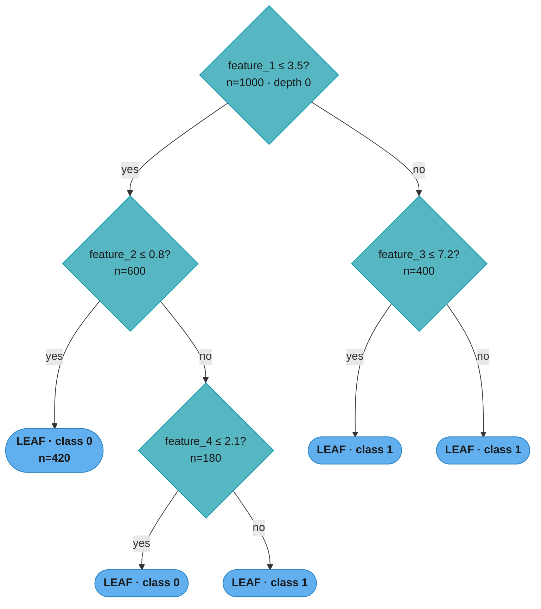
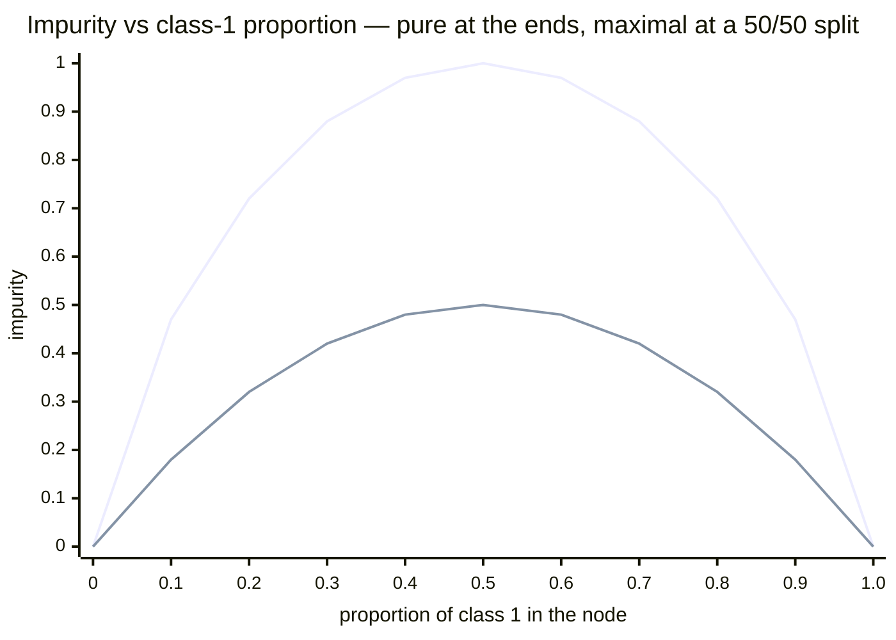
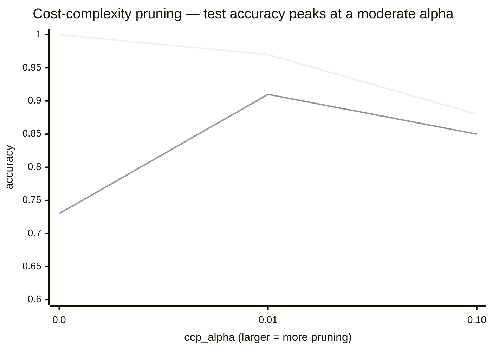
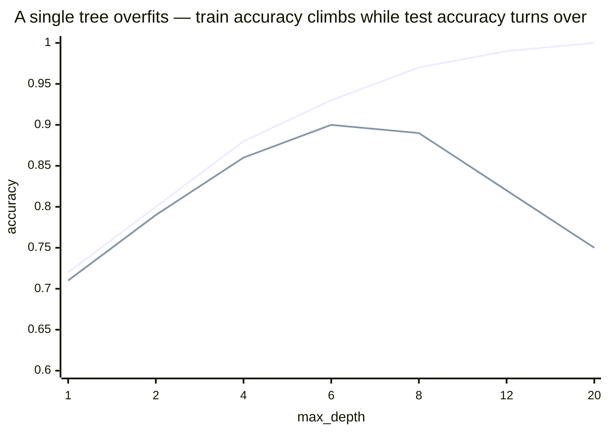
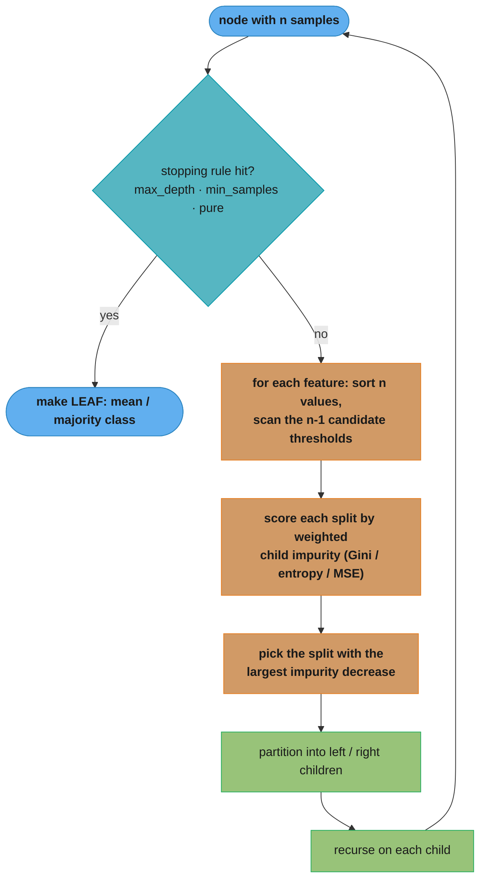

# Decision Trees — Deep Dive

## 1. Concept Overview

A decision tree is a hierarchical model that partitions the feature space into rectangular regions through a sequence of binary (CART) or multi-way splits. Each internal node tests a feature against a threshold; each leaf node contains a prediction (mean target value for regression, majority class or class distribution for classification). The CART (Classification and Regression Trees) algorithm is the standard implementation in sklearn and most modern frameworks.

Decision trees are the building block for ensemble methods — Random Forests (bagging of trees) and Gradient Boosted Trees (boosting of trees) — which are among the most powerful models for tabular data. Understanding a single decision tree deeply is prerequisite to understanding any tree ensemble.

---

## 2. Intuition

One-line analogy: a decision tree is a flowchart — a series of yes/no questions that leads you to a conclusion, like a medical diagnosis guide.

Mental model: at each node, the algorithm asks "which single feature and threshold best separates the target values?" It greedily picks the split that maximizes purity in the resulting child nodes, then recurses on each child until a stopping criterion is met.

Key insight: decision trees are the only common supervised algorithm that naturally handles mixed data types (continuous, categorical, ordinal, binary), missing values, feature interactions, and non-linear boundaries — all without preprocessing — at O(nd log n) training time.

Overfitting intuition: an unconstrained decision tree will grow until each leaf contains exactly one training sample (zero training error). It memorizes the training data perfectly and generalizes to nothing. Controlling tree depth is the primary regularization tool.

---

## 3. Core Principles

**Recursive partitioning**: the tree is built top-down by greedily selecting the best split at each node. This greedy strategy does not guarantee a globally optimal tree (the optimal tree problem is NP-hard), but works well in practice.

**Split criterion (classification)**:
```
Gini impurity:    Gini(t) = 1 - sum_k p_k^2
                  Gini = 0.0 when all samples in node are one class (pure)
                  Gini = 0.5 when 2-class split is 50/50 (maximally impure)

Entropy:          H(t) = -sum_k p_k * log2(p_k)
                  H = 0.0 when pure, H = 1.0 for 50/50 binary split

Information gain: IG = H(parent) - [weighted_avg of H(left) + H(right)]
                  CART maximizes IG at each split
```

**What this actually says.** "Score how mixed-up a node's labels are, then pick the split whose two children are — on average, weighted by how many samples land in each — the least mixed-up." Impurity is not a loss you optimize globally; it is a local scoring function for ranking candidate splits at one node. Every remaining detail of CART is bookkeeping around that one comparison.

| Symbol | What it is |
|--------|------------|
| `t` | A single node — one box in the tree, holding some subset of the training samples |
| `p_k` | Fraction of samples in node `t` that belong to class `k`. All `p_k` sum to 1 |
| `sum_k p_k^2` | Chance two samples drawn from the node share a class. Higher = purer node |
| `Gini(t)` | 1 minus that chance = probability two draws disagree. `0` = pure, `0.5` = 50/50 binary |
| `H(t)` | Entropy in bits: how many yes/no questions to name a random sample's class. `0` = pure, `1.0` = 50/50 binary |
| `log2(p_k)` | Negative for any probability below 1, which is why the minus sign out front makes `H` positive |
| `weighted_avg` | `(n_left/n) * child_left + (n_right/n) * child_right` — big children count more |
| `IG` | Parent impurity minus weighted child impurity. How much mixing this split removed |

**Walk one example.** One parent node, two candidate splits, both criteria scored side by side. Parent: 100 customers, 60 stay (A) and 40 churn (B):

```
  Parent:  60 A / 40 B      p_A = 0.60   p_B = 0.40

    Gini(parent) = 1 - (0.60^2 + 0.40^2) = 1 - (0.3600 + 0.1600) = 0.4800
    H(parent)    = -(0.60*log2 0.60 + 0.40*log2 0.40)            = 0.9710 bits

  ---- Split A:  tenure <= 12 months ----
                       n     class mix      Gini      Entropy
    left child        50      45 A / 5 B    0.1800     0.4690
    right child       50      15 A / 35 B   0.4200     0.8813
    weights           0.50 and 0.50

    weighted Gini = 0.50*0.1800 + 0.50*0.4200 = 0.3000
    Gini decrease = 0.4800 - 0.3000                     = 0.1800
    weighted H    = 0.50*0.4690 + 0.50*0.8813 = 0.6751
    info gain     = 0.9710 - 0.6751                     = 0.2958 bits

  ---- Split B:  monthly_charges > 65 ----
                       n     class mix      Gini      Entropy
    left child        40      35 A / 5 B    0.2188     0.5436
    right child       60      25 A / 35 B   0.4861     0.9799
    weights           0.40 and 0.60

    weighted Gini = 0.40*0.2188 + 0.60*0.4861 = 0.3792
    Gini decrease = 0.4800 - 0.3792                     = 0.1008
    weighted H    = 0.40*0.5436 + 0.60*0.9799 = 0.8053
    info gain     = 0.9710 - 0.8053                     = 0.1656 bits

  Verdict:  Gini    picks A (0.1800 > 0.1008)
            Entropy picks A (0.2958 > 0.1656)   -- same winner
```

Both criteria rank the two splits the same way, and they disagree on the *scale* only: entropy's gain (0.2958 bits) is larger than Gini's (0.1800) because entropy peaks at 1.0 while Gini peaks at 0.5. Since CART only ever needs the *argmax* over candidate splits, a monotone rescaling changes nothing — which is the concrete reason Gini and entropy produce nearly identical trees, and why sklearn defaults to the one without a `log` call.

**Why the weighting is not optional.** Drop `n_left/n` and `n_right/n` and CART would happily carve off a single-sample child: that child has impurity exactly `0`, so an unweighted average of child impurities looks fantastic. Weighting by size makes a 1-sample pure child contribute `1/100` of its perfection, so the split is scored on what it did for the *bulk* of the data. This is the same reasoning behind `min_samples_leaf`, enforced from a different direction.

**Split criterion (regression)**:
```
Variance reduction: Var(t) = (1/n_t) * sum_i (y_i - y_bar_t)^2
Best split maximizes: Var(parent) - [n_left/n * Var(left) + n_right/n * Var(right)]
Prediction in leaf: y_bar (mean of training samples in leaf)
```

**Read it like this.** "For regression there is no 'class mix' to measure, so spread stands in for impurity: a good split is one whose two children each have targets tightly clustered around their own mean." Swap `Gini` for `Var` and the entire CART machinery above runs unchanged — same greedy scan, same size-weighted average, same argmax.

| Symbol | What it is |
|--------|------------|
| `y_i` | The true target of one training sample in the node |
| `y_bar_t` | Mean target of all samples in node `t` — also the value the leaf will predict |
| `(y_i - y_bar_t)^2` | Squared error of predicting the node mean for that one sample |
| `Var(t)` | Average of those squared errors = MSE if the node became a leaf right now |
| `n_left/n`, `n_right/n` | Same size weighting as classification, for the same reason |
| `Var(parent) - [...]` | Variance reduction. How much total squared error this split eliminated |

**Walk one example.** Eight houses, target = price in units of $10k, sorted by square footage:

```
  Parent:  y = [3, 5, 7, 9, 20, 22, 24, 26]      y_bar = 14.5

    Var(parent) = mean of (y_i - 14.5)^2 = 77.2500

  ---- Split at sqft threshold between the 4th and 5th house ----
                       n    y values           y_bar     Var
    left child         4    [3, 5, 7, 9]         6.0     5.0000
    right child        4    [20, 22, 24, 26]    23.0     5.0000

    weighted Var = 0.50*5.0000 + 0.50*5.0000 = 5.0000
    reduction    = 77.2500 - 5.0000           = 72.2500     <- 93.5% of the spread gone

  ---- A badly placed split, same data, wrong grouping ----
                       n    y values           y_bar     Var
    left child         4    [3, 5, 7, 20]        8.75   44.1875
    right child        4    [9, 22, 24, 26]     20.25   44.1875

    weighted Var = 0.50*44.1875 + 0.50*44.1875 = 44.1875
    reduction    = 77.2500 - 44.1875            = 33.0625   <- less than half as good
```

The good split leaves each child with variance `5.0`, so the tree predicts `6.0` for small houses and `23.0` for large ones and is off by about `2.2` on average. The bad split strands one cheap house among expensive ones in each child, and the leaf means (`8.75`, `20.25`) fit nobody well. Because the leaf always predicts the mean, variance reduction is not an analogy for squared error — it *is* the training squared error the tree would incur, which is why sklearn calls this criterion `"squared_error"`.

**Best split search**: for each feature, sort the n samples by feature value (O(n log n)), then scan all n-1 split thresholds. Total per node: O(d * n log n). Full tree training: O(d * n * log^2(n)) amortized.

---

## 4. Types / Architectures / Strategies

### 4.1 Splitting Criteria Comparison

| Criterion | Formula | Properties |
|-----------|---------|-----------|
| Gini impurity | 1 - sum p_k^2 | Computationally cheaper (no log); favors larger partitions |
| Entropy (ID3, C4.5) | -sum p_k log p_k | Sensitive to rare classes; theoretically principled |
| Log-loss | Same as entropy | Used in sklearn with criterion="log_loss" |
| MSE (regression) | mean squared error | Default for DecisionTreeRegressor |
| MAE (regression) | mean absolute error | More robust to outliers; slower to compute |

Gini and entropy produce almost identical trees in practice. sklearn default: criterion="gini" for classification.

### 4.2 Stopping Criteria (Pre-Pruning)

| Parameter | Default | Effect |
|-----------|---------|--------|
| max_depth | None (unlimited) | Limits tree height; most important regularizer |
| min_samples_split | 2 | Minimum samples needed to split an internal node |
| min_samples_leaf | 1 | Minimum samples required in any leaf |
| max_features | None | Number of features to consider per split |
| min_impurity_decrease | 0.0 | Minimum gain for a split to proceed |

### 4.3 Post-Pruning (Cost-Complexity Pruning)

sklearn implements Minimal Cost-Complexity Pruning (also known as weakest link pruning). The pruning criterion for a subtree T rooted at node t:

```
R_alpha(T) = R(T) + alpha * |T|
```

where R(T) = misclassification rate of T, |T| = number of leaves in T, alpha = ccp_alpha parameter.

**Put simply.** "Charge the tree rent for every leaf it owns, then keep whichever pruned version has the lowest total bill of errors-plus-rent." Alpha is the rent rate, and it is the only knob — sweep it from 0 upward and the tree shrinks in a fixed, nested sequence.

| Symbol | What it is |
|--------|------------|
| `T` | A candidate tree — the full tree or any pruned version of it |
| `R(T)` | Error rate of `T` on the training data. Always lowest for the biggest tree |
| `\|T\|` | Leaf count — the complexity measure. Not depth: a lopsided deep tree can have few leaves |
| `alpha` | Price per leaf, in units of error rate. `ccp_alpha` in sklearn |
| `alpha * \|T\|` | The complexity rent. Grows linearly as the tree adds leaves |
| `R_alpha(T)` | Total bill. The quantity actually minimized over the pruning path |

**Walk one example.** Four nested trees from the same pruning path, scored at three rent rates:

```
  tree              leaves   R(T)      R_alpha at alpha = 0.00 / 0.01 / 0.10
  full (depth 10)      50    0.000        0.000     0.500     5.000
  pruned (depth 6)     18    0.030        0.030     0.210     1.830
  pruned (depth 4)     10    0.120        0.120     0.220     1.120
  pruned (depth 2)      4    0.270        0.270     0.310     0.670

  winner per column:               full tree   18 leaves   4 leaves
```

At `alpha = 0` rent is free, so the memorizing 50-leaf tree wins on training error alone — this is exactly why `ccp_alpha=0` is not pruning. At `alpha = 0.01` the 50-leaf tree pays `0.500` in rent to save `0.030` in error and loses to the 18-leaf tree, the same optimum cross-validation finds in Section 5.4. Crank rent to `0.10` and even useful splits stop paying for themselves, collapsing the tree to 4 leaves and underfitting.

**Where the alpha values in the path come from.** sklearn never guesses alphas; it computes, for each internal node `t`, the exact rent at which collapsing that node's subtree becomes break-even: `alpha_eff = (R(t) - R(T_t)) / (|T_t| - 1)`, where `R(t)` is the error if the subtree were replaced by one leaf. A 4-leaf subtree whose collapse raises error from `0.020` to `0.050` has `alpha_eff = 0.030/3 = 0.010`; an 8-leaf subtree going from `0.030` to `0.036` has `alpha_eff = 0.006/7 = 0.000857`. The second is the weakest link and gets pruned first, despite having more leaves — cost per leaf is what ranks, not size.

At alpha=0: no pruning (full tree). As alpha increases, subtrees with the weakest benefit-to-size ratio are collapsed first. sklearn's cost_complexity_pruning_path returns all alpha values and their corresponding tree sizes, enabling selection of alpha via cross-validation.

### 4.4 Feature Importance

**Mean Decrease in Impurity (MDI, default)**:
```
Importance(f) = sum over nodes t where feature f is used of:
    n_t / n * impurity_decrease(t)
```
where n_t = samples reaching node t, n = total samples. Normalized to sum to 1.

**What the formula is telling you.** "Every time a feature was used for a split, credit it with the impurity that split removed — scaled down by how few samples were actually affected — then add up each feature's credits." It is a bookkeeping sum over the tree that was already built, not a fresh statistical test, which is the root of every limitation below.

| Symbol | What it is |
|--------|------------|
| `f` | The feature whose importance is being scored |
| `t` | An internal node that split on `f`. A feature can win many nodes and collects from all |
| `n_t` | Samples reaching node `t`. Deep nodes see few samples and earn little |
| `n_t / n` | Weight of that node. Root = `1.0`, and it shrinks as you descend |
| `impurity_decrease(t)` | The parent-minus-weighted-child gain from Section 3, at node `t` |
| `sum over nodes` | Total credit for `f`, then divided by the tree's grand total so all features sum to 1 |

**Walk one example.** A 3-internal-node tree on 1,000 customers, splitting on only two features:

```
  node    feature    n_t    weight     impurity   weighted child   decrease   contribution
  root    tenure    1000    1.000       0.480         0.300         0.180        0.180
  n1      charges    600    0.600       0.320         0.180         0.140        0.084
  n2      tenure     400    0.400       0.375         0.250         0.125        0.050

  raw totals:  tenure  = 0.180 + 0.050 = 0.230
               charges = 0.084         = 0.084
               grand total             = 0.314

  normalized:  tenure  = 0.230 / 0.314 = 0.7325
               charges = 0.084 / 0.314 = 0.2675
                                         ------
                                         1.0000
```

Note node `n2`: its raw impurity decrease (`0.125`) is nearly as large as the root's (`0.180`), yet after the `400/1000` weighting it contributes only `0.050`. Depth is a discount rate — a split that looks impressive locally earns little if it only sorts out a small slice of the data.

**Why the `n_t / n` weight is the whole defense — and why it is not enough.** Without it, a hairline split affecting 5 samples would score the same as the root split affecting all 1,000, and the deepest, noisiest nodes would dominate the ranking. The weight fixes that. What it cannot fix is a `user_id`-style feature that wins the root: a high-cardinality column offers ~n candidate thresholds, so by sheer search volume one of them will look best on training data and collect the full `1.0` weight. MDI credits the split that *was chosen*, never asks whether it deserved to be — hence the pitfall in Section 10 and the standing advice to confirm with permutation importance.

**Limitation of MDI**: biased toward high-cardinality features (features with many unique values can create many split points, inflating their apparent importance). Always validate with permutation importance.

**Permutation Importance**: shuffle feature f in the test set, measure accuracy drop. Model-agnostic, unbiased, measures actual predictive contribution. Available in sklearn.inspection.permutation_importance.

---

## 5. Architecture Diagrams

### 5.1 Decision Tree Structure



Each internal node (teal) tests one feature against a threshold and routes samples left (yes) or right (no); each leaf (blue) emits a prediction — the majority class of the training samples that reach it. Depth is the primary regularizer: deeper trees carve finer rectangular regions and eventually memorize the training set.

### 5.2 Gini Impurity Visualization

```
Pure node (all class A)     Mixed node (50/50)         Impure but not 50/50

 A A A A A                   A A A B B                  A A A A B B B
 A A A A A                   A B B A B                  A A A B B B
 Gini = 1 - (1^2) = 0.0     Gini = 1 - (0.5^2+0.5^2)  Gini = 1-(0.57^2+0.43^2)
                                   = 0.50               = 0.49
```

**Gini vs entropy as a node's class balance shifts** — both are zero at a pure node and peak at 50/50:



The upper curve peaking at 1.0 is entropy; the lower curve peaking at 0.5 is Gini. CART chooses the threshold that most reduces the weighted average of whichever curve you pick, pushing child nodes toward the pure ends. Because the two curves are nearly proportional, Gini and entropy produce almost identical trees.

### 5.3 Effect of max_depth on Decision Boundary

```
max_depth=1                max_depth=3                max_depth=None (overfit)

  o  o | x  x              o  o | x  x               o  o . x  x
  o  o | x  x              o +--+--+ x               o  o . x  x
  o  o | x  x              o |o | x| x               o  o . x  x
                            o +--+--+ x               . . . . . .
Single vertical line        Box-shaped regions        Complex jagged boundary
High bias                   Good generalization       Memorized training data
                                                      High variance
```

### 5.4 Cost-Complexity Pruning Path



The line falling monotonically from 1.00 is training accuracy; the line that rises to 0.91 then dips to 0.85 is test accuracy. The full tree (alpha=0, depth 10, 50 leaves) memorizes the training set; heavy pruning (alpha=0.10, depth 2, 4 leaves) underfits. The optimal alpha=0.01 (depth 6, 18 leaves), chosen by cross-validation, closes the train/test gap and maximizes test accuracy.

### 5.5 Train vs Test Accuracy Across max_depth



The line reaching 1.0 is training accuracy — an unconstrained tree eventually places one leaf per sample and memorizes the data. The line that peaks near depth 6 (~0.90) then falls to ~0.75 is test accuracy; the widening vertical gap is variance. The sweet spot (depth 4–8 here) minimizes that gap — beyond it, extra depth only fits noise.

---

## 6. How It Works — Detailed Mechanics

**How CART builds a node** — greedy best-split search, then recurse:



At every node CART tries all features and all thresholds, keeps the single split that most reduces child impurity, then recurses — a greedy procedure that is locally optimal but not globally optimal (the optimal-tree problem is NP-hard). The loop exits only when a stopping rule fires, which is why setting max_depth and min_samples_leaf is what actually bounds tree growth.

### 6.1 Decision Tree Training and Evaluation

```python
from __future__ import annotations

import numpy as np
import pandas as pd
from sklearn.datasets import make_classification, load_iris
from sklearn.model_selection import train_test_split, cross_val_score, GridSearchCV
from sklearn.tree import DecisionTreeClassifier, DecisionTreeRegressor, export_text
from sklearn.inspection import permutation_importance
from sklearn.metrics import accuracy_score, classification_report
from sklearn.pipeline import Pipeline


def decision_tree_basic_example() -> None:
    """
    Basic decision tree with correct hyperparameter constraints.
    Unconstrained tree always overfits: max_depth=None, min_samples_split=2
    results in a leaf for every training sample.
    """
    X, y = make_classification(
        n_samples=2000,
        n_features=20,
        n_informative=10,
        n_redundant=5,
        random_state=42,
    )

    X_train, X_test, y_train, y_test = train_test_split(
        X, y, test_size=0.2, stratify=y, random_state=42
    )

    # --- WRONG: unconstrained tree overfits ---
    bad_tree = DecisionTreeClassifier(random_state=42)   # max_depth=None
    bad_tree.fit(X_train, y_train)
    print(f"Unconstrained tree depth: {bad_tree.get_depth()}")           # ~20+
    print(f"Training accuracy: {bad_tree.score(X_train, y_train):.4f}")  # 1.000
    print(f"Test accuracy:     {bad_tree.score(X_test, y_test):.4f}")    # ~0.75

    # --- CORRECT: constrained tree ---
    good_tree = DecisionTreeClassifier(
        max_depth=6,
        min_samples_split=20,    # require 20 samples to split (prevents tiny splits)
        min_samples_leaf=10,     # require 10 samples in each leaf
        random_state=42,
    )
    good_tree.fit(X_train, y_train)
    print(f"Constrained tree depth: {good_tree.get_depth()}")           # 6
    print(f"Training accuracy: {good_tree.score(X_train, y_train):.4f}")
    print(f"Test accuracy:     {good_tree.score(X_test, y_test):.4f}")


def tune_decision_tree_with_ccp(
    X_train: np.ndarray,
    y_train: np.ndarray,
    X_test: np.ndarray,
    y_test: np.ndarray,
) -> DecisionTreeClassifier:
    """
    Cost-complexity pruning: find optimal alpha via cross-validation.
    More principled than tuning max_depth manually.
    """
    # Step 1: compute the full pruning path
    dt = DecisionTreeClassifier(random_state=42)
    path = dt.cost_complexity_pruning_path(X_train, y_train)
    ccp_alphas = path.ccp_alphas[:-1]   # exclude the last alpha (trivial root)

    print(f"Number of alpha candidates: {len(ccp_alphas)}")

    # Step 2: for each alpha, measure 5-fold CV accuracy
    cv_scores: list[float] = []
    for alpha in ccp_alphas:
        tree = DecisionTreeClassifier(ccp_alpha=alpha, random_state=42)
        scores = cross_val_score(tree, X_train, y_train, cv=5, scoring="accuracy")
        cv_scores.append(scores.mean())

    # Step 3: pick alpha with highest CV accuracy
    best_alpha = ccp_alphas[np.argmax(cv_scores)]
    print(f"Optimal ccp_alpha: {best_alpha:.6f}")

    # Step 4: retrain on full training set with best alpha
    best_tree = DecisionTreeClassifier(ccp_alpha=best_alpha, random_state=42)
    best_tree.fit(X_train, y_train)
    print(f"Pruned tree depth: {best_tree.get_depth()}")
    print(f"Test accuracy: {best_tree.score(X_test, y_test):.4f}")

    return best_tree


def compare_criteria() -> None:
    """
    Compare Gini vs Entropy splitting criteria.
    In practice they produce nearly identical trees.
    """
    iris = load_iris()
    X, y = iris.data, iris.target
    X_train, X_test, y_train, y_test = train_test_split(
        X, y, test_size=0.2, stratify=y, random_state=42
    )

    for criterion in ["gini", "entropy", "log_loss"]:
        tree = DecisionTreeClassifier(
            criterion=criterion,
            max_depth=4,
            random_state=42,
        )
        tree.fit(X_train, y_train)
        acc = tree.score(X_test, y_test)
        print(f"criterion={criterion:10s}  test_accuracy={acc:.4f}")
```

### 6.2 Feature Importance — MDI vs Permutation

```python
def compare_feature_importances(
    X: np.ndarray,
    y: np.ndarray,
    feature_names: list[str],
) -> pd.DataFrame:
    """
    MDI importance is biased toward high-cardinality features.
    Permutation importance is unbiased but requires a test set.

    Demonstrates the discrepancy on a dataset with a high-cardinality feature.
    """
    X_train, X_test, y_train, y_test = train_test_split(
        X, y, test_size=0.3, random_state=42
    )

    tree = DecisionTreeClassifier(max_depth=6, random_state=42)
    tree.fit(X_train, y_train)

    # MDI importance (built-in, fast but biased)
    mdi_importances = pd.Series(
        tree.feature_importances_, index=feature_names
    ).sort_values(ascending=False)

    # Permutation importance (slower, unbiased)
    result = permutation_importance(
        tree, X_test, y_test, n_repeats=20, random_state=42, n_jobs=-1
    )
    perm_importances = pd.Series(
        result.importances_mean, index=feature_names
    ).sort_values(ascending=False)

    comparison = pd.DataFrame({
        "MDI Importance":   mdi_importances,
        "Permutation Imp.": perm_importances,
    })

    print("Feature Importance Comparison:")
    print(comparison.head(10))
    return comparison


def visualize_tree_rules(tree: DecisionTreeClassifier, feature_names: list[str]) -> None:
    """
    Print human-readable decision rules — one of the key advantages of decision trees.
    """
    text_repr = export_text(
        tree,
        feature_names=feature_names,
        max_depth=4,        # limit output for readability
        decimals=3,
    )
    print(text_repr)
```

### 6.3 Handling Missing Values

```python
def missing_value_strategies_for_trees() -> None:
    """
    Decision trees in sklearn do NOT handle missing values natively (as of sklearn 1.x).
    CART implementations in R and XGBoost/LightGBM handle missing values natively.

    Strategies for sklearn DecisionTreeClassifier with missing data:
    """
    from sklearn.impute import SimpleImputer, KNNImputer

    rng = np.random.default_rng(42)
    X = rng.standard_normal((500, 10))
    y = (X[:, 0] + X[:, 1] > 0).astype(int)

    # Introduce 20% missing values randomly
    mask = rng.random(X.shape) < 0.2
    X[mask] = np.nan

    X_train, X_test, y_train, y_test = train_test_split(X, y, test_size=0.2)

    strategies: dict[str, object] = {
        "median_impute": Pipeline([
            ("imputer", SimpleImputer(strategy="median")),
            ("tree", DecisionTreeClassifier(max_depth=5, random_state=42)),
        ]),
        "knn_impute": Pipeline([
            ("imputer", KNNImputer(n_neighbors=5)),
            ("tree", DecisionTreeClassifier(max_depth=5, random_state=42)),
        ]),
        "constant_impute": Pipeline([
            # Use a sentinel value — tree can learn a split at the sentinel
            ("imputer", SimpleImputer(strategy="constant", fill_value=-9999)),
            ("tree", DecisionTreeClassifier(max_depth=5, random_state=42)),
        ]),
    }

    for name, pipeline in strategies.items():
        pipeline.fit(X_train, y_train)
        acc = pipeline.score(X_test, y_test)
        print(f"{name:20s}  accuracy={acc:.4f}")

    # NOTE: XGBoost and LightGBM handle NaN natively — they learn which child branch
    # to send missing values down during training (optimal direction per split).
    # This is generally superior to imputation for tree-based models.
```

### 6.4 Decision Tree Regression

```python
from sklearn.tree import DecisionTreeRegressor
from sklearn.datasets import make_regression
from sklearn.metrics import mean_squared_error, r2_score


def regression_tree_example() -> None:
    """
    Decision tree for regression: predicts the mean of training samples in each leaf.
    Piecewise constant predictions — good for detecting discontinuities.
    """
    X, y = make_regression(
        n_samples=1000, n_features=10, n_informative=5, noise=20.0, random_state=42
    )
    X_train, X_test, y_train, y_test = train_test_split(
        X, y, test_size=0.2, random_state=42
    )

    for depth in [2, 4, 6, 8, None]:
        tree = DecisionTreeRegressor(max_depth=depth, min_samples_leaf=5, random_state=42)
        tree.fit(X_train, y_train)
        y_pred = tree.predict(X_test)
        rmse = mean_squared_error(y_test, y_pred) ** 0.5
        r2 = r2_score(y_test, y_pred)
        print(f"max_depth={str(depth):4s}  RMSE={rmse:7.2f}  R2={r2:.4f}")
    # Typical output: depth=None overfits (high RMSE), depth=6 is optimal
```

---

## 7. Real-World Examples

**Medical Diagnosis Rules**: decision trees are used in clinical decision support because the rules are directly readable by physicians. A tree predicting sepsis risk based on vital signs produces rules like "if heart_rate > 120 AND temperature > 38.5 AND WBC > 12,000 then HIGH RISK." Physicians can verify, override, and explain these rules to patients — no black box.

**Loan Default Prediction (Interpretable Baseline)**: credit card companies use shallow decision trees (max_depth=4 to 6) as interpretable baselines. Regulators under the Equal Credit Opportunity Act require explainability of adverse action. A decision tree's rules are directly translatable to legal reasons for rejection.

**Manufacturing Quality Control**: in semiconductor manufacturing, decision trees identify yield loss causes. Features are sensor readings (temperature, pressure, gas flow rates); target is pass/fail. The tree identifies thresholds that separate failures — providing actionable guidance to process engineers without requiring statistical expertise.

**Customer Segmentation Rules**: marketing teams use decision trees to generate actionable customer segments. A tree on customer features produces mutually exclusive, exhaustive segments with clear business interpretation ("Segment A: age < 35 AND purchases_per_month > 3 AND last_purchase < 7 days").

---

## 8. Tradeoffs

| Property | Decision Tree | Random Forest | Gradient Boosting |
|----------|--------------|--------------|------------------|
| Interpretability | High (single tree) | Low (ensemble) | Low (ensemble) |
| Variance | High (overfit) | Low (averaged) | Low (boosted) |
| Bias | Low (flexible) | Low | Very low |
| Training speed | Fast O(nd log n) | Slower (100x trees) | Slower (sequential) |
| Missing values | No (sklearn) | No (sklearn) | Yes (XGBoost, LGB) |
| Feature scaling needed | No | No | No |
| Non-linear boundaries | Yes | Yes | Yes |
| Extrapolation | Poor (step function) | Poor | Poor |

---

## 9. When to Use / When NOT to Use

**Use decision trees when**:
- Interpretability is a hard requirement (rules must be auditable by humans)
- Dataset has mixed feature types (continuous, categorical, binary) — no preprocessing needed
- Rules must be extracted and embedded in a rule engine or decision table
- As a fast, interpretable baseline before trying ensemble methods

**Do NOT use a single decision tree when**:
- Predictive accuracy is the primary goal (use Random Forest or gradient boosting)
- Dataset is large and feature space is continuous — trees can grow very deep and overfit
- Features have many missing values and you need native handling (use XGBoost or LightGBM)
- Target relationships are smooth and continuous (regression trees produce piecewise constant predictions — poor extrapolation)

---

## 10. Common Pitfalls

**Pitfall 1 — Unconstrained tree always overfits**
A data science intern trained a DecisionTreeClassifier with default parameters on a 10,000-sample churn dataset. Training accuracy was 100%; test accuracy was 67%. The tree had depth 32 with 4,800 leaves — one leaf per remaining distinct training example. The intern reported "perfect training performance" as a success. Fix: always set max_depth (try 4, 6, 8) and min_samples_leaf (try 10–50). Cross-validate to select these hyperparameters.

**Pitfall 2 — MDI feature importance biased by high-cardinality features**
A team analyzed a tree model and reported that `user_id` (unique per user, 100,000 values) was the most important feature. MDI was ~0.45 for user_id. User_id has many possible split points, so the CART algorithm frequently splits on it even if the splits are nearly random. This creates the illusion of high importance. Fix: use permutation importance or SHAP on a held-out test set. Better fix: remove unique identifiers before training.

**Pitfall 3 — Using decision trees for extrapolation in time-series**
A decision tree trained to forecast electricity demand predicted September demand using August training data. A heat wave in September pushed temperatures above the maximum value seen in August. The tree's prediction was the leaf mean from the hottest training examples — a gross underestimate. Decision trees cannot extrapolate beyond the training range. Fix: use linear regression for extrapolation, or add lag features and use gradient boosting (which has the same limitation but handles it better with more training data).

**Pitfall 4 — Ignoring class imbalance**
A fraud detection decision tree trained on 99% non-fraud / 1% fraud data always predicted "not fraud" — a leaf node covering 99% of training samples. Gini impurity of that leaf = 1 - (0.99^2 + 0.01^2) = 0.0198, already very low, so the tree never gained enough to split further. Fix: set class_weight="balanced", or oversample the minority class before training, or use a threshold other than 0.5 on predict_proba.

**Pitfall 5 — Comparing max_depth across different datasets**
A team tuned max_depth=6 on their credit dataset and reused the same parameter for a new text classification dataset without re-tuning. Text features have very different depth requirements than structured tabular data. Always re-tune tree hyperparameters per dataset via cross-validation.

**Pitfall 6 — Not pruning after achieving high training accuracy**
Post-pruning (ccp_alpha) is more principled than pre-pruning with max_depth but is rarely used in practice because it is less intuitive. A team that spent hours tuning max_depth would have achieved better results in less time by growing a full tree and then calling cost_complexity_pruning_path + cross-validation to find the optimal alpha. Use pruning when interpretability of the final tree is important — the pruned tree is guaranteed to be smaller than a max_depth-limited tree at the same accuracy.

---

## 11. Technologies & Tools

| Tool | Purpose | Notes |
|------|---------|-------|
| sklearn DecisionTreeClassifier / Regressor | Standard CART implementation | MDI importance, CCP pruning, export_text |
| sklearn export_text | Print human-readable decision rules | Use for rule extraction |
| sklearn plot_tree | Visualize tree (requires matplotlib) | Use for shallow trees only (depth <= 5) |
| sklearn permutation_importance | Unbiased feature importance | Runs on any model |
| XGBoost | Gradient boosted trees with native missing value handling | Industry standard |
| LightGBM | Histogram-based boosting; faster than XGBoost on large data | Native categorical support |
| CatBoost | Ordered boosting; strong on categoricals | Target encoding built-in |
| dtreeviz (pip install dtreeviz) | Rich decision tree visualizations | Better than sklearn's plot_tree |
| SHAP (shap library) | Tree SHAP for fast, exact feature attribution on tree models | O(TLD) per prediction |

---

## 12. Interview Questions with Answers

**Q: What is Gini impurity and how is it computed?**
Gini impurity measures the probability that a randomly chosen sample from a node would be incorrectly classified if labeled randomly according to the class distribution in that node. Formula: Gini(t) = 1 - sum_k p_k^2, where p_k is the fraction of class k samples in node t. Gini = 0 means the node is pure (all samples are the same class). Gini = 0.5 for a perfectly balanced two-class split. CART selects the split that minimizes the weighted average Gini of the two child nodes.

**Q: What is the difference between Gini impurity and entropy? Which should you use?**
Entropy uses a logarithm: H(t) = -sum_k p_k log2(p_k). Both measure node impurity and produce nearly identical trees in practice. Gini is computationally cheaper (no log operation). Entropy is slightly more sensitive to changes in the class distribution near zero probability (the log term goes to infinity). In practice, the choice rarely matters — cross-validate both if it is uncertain. sklearn default is Gini; ID3 and C4.5 algorithms use entropy.

**Q: Explain the CART algorithm step by step.**
CART (Classification and Regression Trees) builds a binary tree: (1) at the root, consider all features and all possible split thresholds; (2) for each candidate split, compute the weighted average impurity of the two resulting child nodes; (3) select the feature and threshold that minimizes this weighted impurity (maximizes information gain); (4) split the node into two children; (5) recursively apply steps 1-4 to each child; (6) stop recursion when a stopping criterion is met (max_depth, min_samples_split, all samples in node are same class, or impurity gain below threshold). Leaves predict the majority class (classification) or mean value (regression).

**Q: What is the time complexity of training a decision tree?**
For a balanced tree of depth log(n): at each level, we scan through d features and sort n samples per feature — O(d * n log n) per level, times log(n) levels = O(d * n * log^2(n)) total. sklearn's implementation sorts once per feature and reuses the sorted order across splits, achieving O(d * n * log n) for the full tree. Inference is O(depth) — follow one path from root to leaf.

**Q: What is the difference between pre-pruning and post-pruning?**
Pre-pruning (early stopping) stops tree growth based on hyperparameters set before training: max_depth, min_samples_split, min_samples_leaf, min_impurity_decrease. It is fast and simple but may stop splitting prematurely (a split that looks bad locally might lead to much better splits in child nodes). Post-pruning grows a full tree and then removes nodes bottom-up when removal does not significantly hurt validation accuracy. Cost-complexity pruning (sklearn's ccp_alpha) is the standard post-pruning method — it is more principled but requires computing the full pruning path.

**Q: How is feature importance computed in a decision tree and what are its limitations?**
Mean Decrease in Impurity (MDI): sum over all nodes where feature f is used of (n_t / n * impurity_decrease_t), normalized to sum to 1. This reflects how much each feature reduces impurity when used as a split. Limitations: (1) biased toward high-cardinality features — a random unique identifier may appear more important than truly predictive features just because it has many split points; (2) measures training-set importance, not generalization; (3) does not account for feature redundancy (correlated features share importance). Use permutation importance on a held-out test set for unbiased estimates.

**Q: How do decision trees handle categorical features?**
sklearn's decision tree does not natively support string categoricals — you must encode them first. Options: (1) ordinal encoding for ordered categories; (2) one-hot encoding for nominal categories (creates binary features); (3) target encoding (replace each category with its mean target value — beware of leakage, use cross-fitted target encoding). CART implementations in R, XGBoost, and LightGBM support optimal categorical splitting: for a feature with K categories, the algorithm searches over 2^K possible binary splits (exact for K <= 32) to find the one that maximizes impurity gain. This is exponential but fast in practice for K <= 10.

**Q: What is the relationship between decision trees and random forests?**
A random forest is an ensemble of decision trees trained via bagging (bootstrap aggregating): each tree is trained on a bootstrap sample (n samples drawn with replacement from training data) and at each split considers a random subset of sqrt(d) features (for classification) or d/3 features (for regression). The forest prediction is the majority vote (classification) or mean (regression) across all trees. Random forests reduce variance without increasing bias — a single deep tree has high variance; averaging many independently trained trees cancels out their individual errors. The bias of the ensemble equals the bias of each individual tree.

**Q: Why can a decision tree overfit even with max_depth set?**
Even with max_depth=6, a tree can overfit if min_samples_split and min_samples_leaf are too low. A node with 2 samples at depth 5 can still create a leaf that perfectly separates those 2 samples, memorizing noise. Additionally, with many features, the tree can find spurious correlations that disappear in new data. Setting min_samples_leaf=10 to 50 (depending on dataset size) prevents leaves from being defined by too few samples. Cross-validation on validation data is the only reliable way to detect overfitting.

**Q: How do decision trees handle class imbalance?**
By default, decision tree splitting maximizes impurity reduction without regard to class frequency, which causes the tree to favor the majority class. Fix: (1) set class_weight="balanced" — sklearn weights each class inversely proportional to its frequency, scaling the impurity contribution of each sample; (2) set class_weight={0: 1, 1: 10} for custom weighting; (3) oversample the minority class before training (SMOTE); (4) use sample_weight parameter in fit() for per-sample weights. After training, adjust the prediction threshold (not 0.5) based on precision-recall tradeoffs.

**Q: What makes decision trees poor at extrapolation?**
Decision trees partition feature space into rectangular regions and predict the mean (or mode) of training samples in each leaf. If a test sample has a feature value outside the range seen in training, it falls into the leaf containing the most extreme training values — the tree predicts the edge value, not a sensible extrapolation. A linear regression would extrapolate by following the fitted line. For problems where extrapolation matters (forecasting demand for next year when this year's peak was never seen before), linear models or splines are better choices than trees.

**Q: What is cost-complexity pruning and how do you select the alpha parameter?**
Cost-complexity pruning evaluates trees T by minimizing R_alpha(T) = misclassification_rate(T) + alpha * n_leaves(T). At alpha=0, the full tree minimizes this. As alpha increases, the penalty for complexity forces subtree collapses. sklearn's cost_complexity_pruning_path(X_train, y_train) returns the sequence of (alpha, n_leaves, impurity) for each pruning step. To select alpha: for each alpha in the path, train a pruned tree and measure 5-fold CV accuracy. Select alpha with the highest CV accuracy, then retrain on the full training set. This is analogous to selecting the regularization parameter in Lasso.

**Q: How do you extract rules from a decision tree for a rule engine?**
Use sklearn's export_text (text output) or export_graphviz (for visualization). For programmatic rule extraction, traverse the tree using tree_.feature (which feature at each node), tree_.threshold (split threshold), tree_.children_left, tree_.children_right (child node indices). Each path from root to leaf is a conjunction of conditions — collect all conditions along the path, strip the class label at the leaf. These rules can be inserted directly into SQL CASE WHEN statements, business rule engines (Drools), or decision tables. A tree of depth 4 produces at most 2^4 = 16 rules.

**Q: Explain information gain and information gain ratio. Why does information gain ratio matter?**
Information gain (IG) = H(parent) - weighted_avg(H(children)). A problem with plain IG: it favors features with many categories. A feature with one unique value per sample produces perfect splits (all leaves pure) with maximum IG — this is why ID3 (which uses IG) performs poorly with high-cardinality features. Information gain ratio (IGR) normalizes IG by the split information: IGR = IG / H(split_values), where H(split_values) is the entropy of the split itself. Features with many categories have high H(split_values), penalizing their IGR. C4.5 uses IGR instead of IG; CART uses Gini (which has a similar normalizing effect implicitly). sklearn uses Gini or entropy, not IGR, and does not natively penalize high-cardinality features — making MDI importance analysis unreliable for high-cardinality features.

**Q: What happens when you set max_features in a decision tree?**
max_features controls how many features are considered at each split point. When max_features < d, the algorithm randomly selects a subset of features at each node and finds the best split among only those features. This is the key mechanism in Random Forest (sqrt(d) for classification). For a single decision tree, max_features < d introduces bias (the globally best split may not be considered) but reduces variance — sometimes useful as additional regularization. Setting max_features="sqrt" for a single tree is unusual but valid; it is mostly a Random Forest hyperparameter.

**Q: How would you interpret a decision tree to a non-technical business stakeholder?**
A decision tree can be presented as a flowchart of questions. Trace the path a customer takes through the tree and read off the conditions: "Customers who placed more than 3 orders in the last 30 days AND whose last order was within 7 days have a 4% churn risk. Customers who placed fewer than 3 orders AND have not visited the app in 14 days have a 72% churn risk." Each leaf gives a prediction with a confidence (fraction of training samples in that leaf that belong to each class). This level of transparency is impossible with gradient boosting or neural networks without post-hoc explanation methods.

**Q: What is the depth at which a decision tree begins to overfit on a typical medium-sized dataset?**
On a typical tabular dataset with n=10,000 samples and d=20 features, a tree with max_depth=None typically reaches depth 15-25 with training accuracy near 100% and test accuracy 10-20% below training accuracy. Depth 4-8 is typically the sweet spot for a single tree, depending on the complexity of the true decision boundary. Cross-validation on a validation set is the correct way to determine the optimal depth. As a rule of thumb: if the tree depth exceeds log2(n) = 13 for 10,000 samples, it is very likely overfitting.

---

## 13. Best Practices

1. Never train a decision tree with default hyperparameters on real data. Always set max_depth (start with 4-8) and min_samples_leaf (start with 10-50). Default parameters guarantee overfitting.

2. Use cost-complexity pruning (ccp_alpha) as an alternative or complement to max_depth tuning. It is more principled and produces smaller, more interpretable trees at equivalent accuracy.

3. Validate feature importance with permutation importance, not only MDI. Report both and investigate discrepancies — they signal high-cardinality features or correlated features inflating MDI.

4. Use export_text or export_graphviz to verify the tree makes business sense. A tree that splits on user_id or transaction_id is learning artifacts, not signal.

5. For class imbalance, set class_weight="balanced" before tuning other hyperparameters. Unbalanced training without this parameter causes the tree to mostly predict the majority class.

6. Prefer a single decision tree only when interpretability is a hard requirement. For predictive performance, use Random Forest or gradient boosting (XGBoost, LightGBM, CatBoost) — they consistently outperform single trees.

7. When the dataset has missing values and you are using sklearn trees, use SimpleImputer with sentinel value (-9999 or a domain-specific constant) rather than mean/median imputation. This allows the tree to learn a specific branch for missing values. Alternatively, switch to XGBoost or LightGBM, which handle missing values natively by learning the optimal branch direction during training.

8. For very large datasets (n > 1M), sklearn's decision tree is slow. Use histogram-based methods (HistGradientBoostingClassifier in sklearn, LightGBM) which discretize features into 256 bins and run much faster.

---

## 14. Case Study

**Problem**: a telecommunications company wants to predict customer churn (binary classification) and extract explicit retention rules that the CRM team can operationalize without a data scientist present. The CRM system can only execute if-then rules, not run model inference. Dataset: 50,000 customers, 30 features (account tenure, monthly charges, service types, support call count, payment method, contract type).

**Requirement**: the final output must be a set of rules that the CRM team can enter manually into their rule engine. Predictions must be explainable to the customer: "We noticed [reason] and want to offer you [incentive]."

**Pipeline**:
```
Raw customer data (50,000 x 30 features)
    |
    v
Preprocessing
    |--- median imputation for 3 numeric features with < 2% missing
    |--- OHE for contract_type (3 values), payment_method (4 values)
    |--- no scaling (decision tree does not require it)
    |
    v
Temporal train/test split
    |--- train: first 40,000 customers (by account creation date)
    |--- test: last 10,000 customers
    |
    v
Cost-complexity pruning path
    |--- DecisionTreeClassifier(class_weight="balanced").fit(X_train, y_train)
    |--- path = tree.cost_complexity_pruning_path(X_train, y_train)
    |--- 5-fold CV over ccp_alphas
    |--- optimal alpha selected: 0.0008
    |
    v
Final tree: depth=5, 18 leaves
    |--- test AUC-ROC: 0.83
    |--- test F1: 0.74
    |--- test recall (churners): 0.81
    |
    v
Rule extraction
    |--- export_text(tree, feature_names=feature_names)
    |--- 18 rules extracted, each with churn probability and sample size
```

**Top Rules Extracted**:
```
Rule 1: contract_type=month-to-month AND tenure_months <= 12 AND monthly_charges > 65
        → churn probability: 0.78, n=2,340 customers
        → Action: call center proactive outreach with 2-year contract discount

Rule 2: contract_type=month-to-month AND support_calls_last_90d >= 3
        → churn probability: 0.69, n=1,890 customers
        → Action: escalate to senior support, offer service credit

Rule 3: tenure_months > 60 AND contract_type!=month-to-month
        → churn probability: 0.04, n=8,100 customers
        → Action: no intervention needed (loyal long-term customers)
```

**Business Outcome**: the CRM team entered the 18 rules directly into Salesforce. No model serving infrastructure was needed. Targeted retention calls to Rule 1 and Rule 2 customers over a 90-day pilot reduced churn in those segments by 23%. The total cost of the initiative: 2 weeks of data science time, zero infrastructure cost.

**Lesson**: a well-tuned, pruned decision tree (AUC 0.83) with directly extractable rules delivered more business value than a gradient boosting model (AUC 0.91) would have, because the CRM team could not consume a black-box model. The constraint on interpretability made the simpler model the correct engineering choice.
