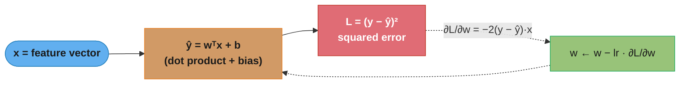
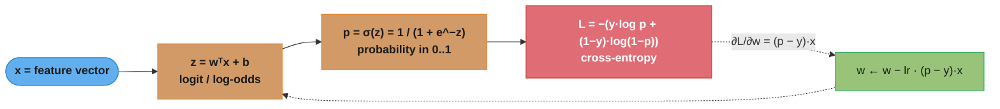
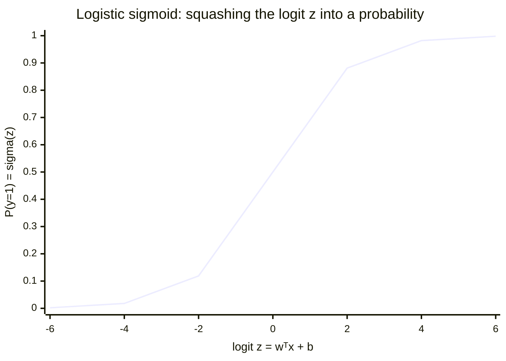
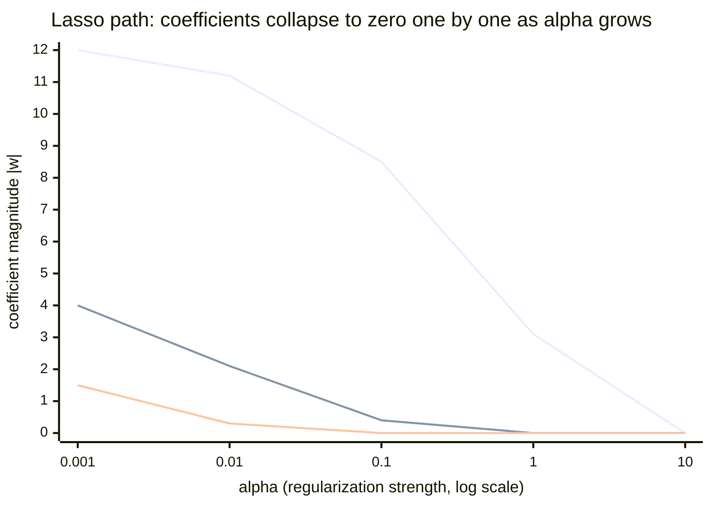
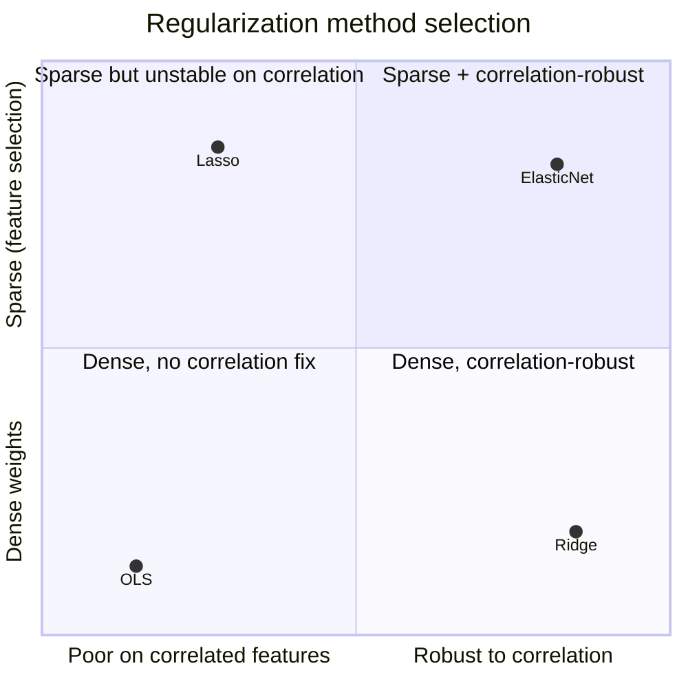
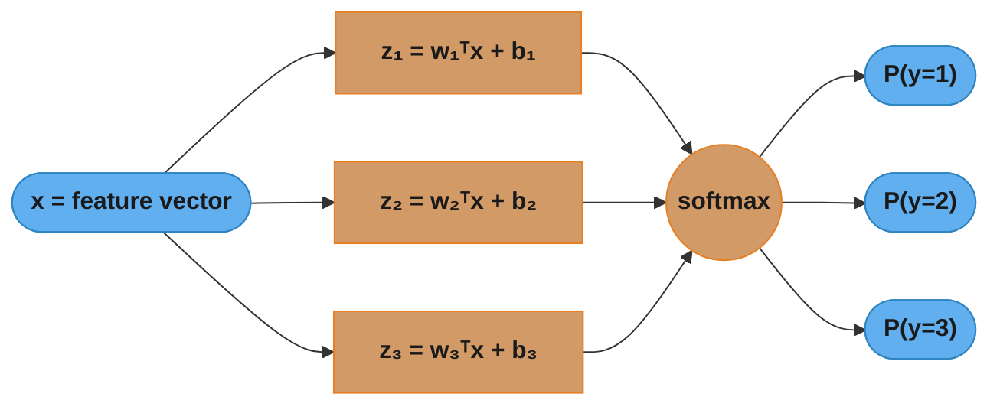

# Linear and Logistic Regression — Deep Dive

## 1. Concept Overview

Linear models are the foundation of supervised machine learning. They assume the target is either a linear combination of the input features (regression) or that the log-odds of the target is a linear combination of features (logistic regression). Despite their simplicity, linear models are competitive in many production settings because of their interpretability, training speed, and well-understood regularization behavior.

**Linear Regression** learns a weight vector w and bias b such that the prediction y_hat = w^T x + b minimizes the sum of squared residuals over training data.

**Logistic Regression** passes the linear combination through a sigmoid function to produce a probability: P(y=1 | x) = sigma(w^T x + b), where sigma(z) = 1 / (1 + exp(-z)).

---

## 2. Intuition

One-line analogy: linear regression fits the best ruler through your data points; logistic regression fits the best S-curve to separate two clouds of points.

Mental model for regularization: think of the weight vector as a rubber band attached to the origin. L2 (Ridge) applies uniform tension, shrinking all weights toward zero but never to exactly zero. L1 (Lasso) applies tension that can collapse individual weights to exactly zero, performing automatic feature selection.

Key insight: logistic regression does NOT assume the features are Gaussian or independent (that is Naive Bayes). It only assumes the log-odds are linear in the features — a much weaker assumption.

---

## 3. Core Principles

**Ordinary Least Squares (Linear Regression)**:
```
Loss = (1/n) * sum_i (y_i - w^T x_i)^2
Optimal solution (closed form): w* = (X^T X)^{-1} X^T y
```
Existence of closed form requires X^T X to be invertible (no perfect multicollinearity and n >= d).

**What this actually says.** "Draw a straight line, measure how far off each point is, square those misses so big ones hurt disproportionately, and average — then solve for the line that makes that average as small as possible, in one shot."

The squaring is the whole personality of OLS. It is why one outlier can drag the entire line, and it is also why a closed form exists at all: squares make the loss a parabola in w, and a parabola has exactly one bottom you can solve for algebraically.

| Symbol | What it is |
|--------|------------|
| `y_i` | The true target for training row `i` — the number you wish you had predicted |
| `w^T x_i` | The prediction: each feature multiplied by its weight, summed. A dot product |
| `(y_i - w^T x_i)` | The residual — signed miss. Positive means you under-predicted |
| `(...)^2` | Squares the miss. Kills the sign, and punishes a miss of 4 sixteen times more than a miss of 1 |
| `(1/n) * sum_i` | Average over all n rows, so the loss does not grow just because you added data |
| `X` | The full data matrix, n rows by d columns (one row per example) |
| `X^T X` | A d x d "how do features co-vary" matrix. Singular when two features duplicate each other |
| `X^T y` | A d-length "how does each feature co-vary with the target" vector |
| `(X^T X)^{-1}` | The undo step — divides out feature overlap so each weight gets credit only for what it uniquely explains |

**Walk one example.** Three points, one feature plus a bias column, solved end to end:

```
  data:  x = 1, 2, 3          y = 2, 4, 7

  X (bias column first)      X^T X            X^T y
    [1  1]                   [ 3   6]         [13]
    [1  2]                   [ 6  14]         [31]
    [1  3]

  (X^T X)^{-1} = [ 2.3333  -1.0000 ]     (det = 3*14 - 6*6 = 6)
                 [-1.0000   0.5000 ]

  w = (X^T X)^{-1} X^T y
    bias = 2.3333*13 + (-1.0000)*31 = 30.3333 - 31.0000 = -0.6667
    slope = -1.0000*13 +   0.5000*31 = -13.0000 + 15.5000 = +2.5000

  best line:  y_hat = -0.6667 + 2.5*x

  x     y     y_hat    residual   residual^2
  1     2     1.8333   -0.1667      0.0278
  2     4     4.3333   +0.3333      0.1111
  3     7     6.8333   -0.1667      0.0278

  MSE = (0.0278 + 0.1111 + 0.0278) / 3 = 0.0556
```

No iteration, no learning rate, no convergence check — one matrix inverse and the optimum is exact. The catch is the `d^3` cost of that inverse, which is why the table in Section 4.1 caps the Normal Equation at roughly `d < 10,000`.

**What breaks without the inverse.** If two features are perfect duplicates, `X^T X` has a zero eigenvalue, `det = 0`, and `(X^T X)^{-1}` does not exist. Infinitely many weight vectors then fit the data equally well — which is exactly the +50,000 / -50,000 coefficient pair in Pitfall 5.

**Cross-Entropy Loss (Logistic Regression)**:
```
Loss = -(1/n) * sum_i [y_i * log(p_i) + (1-y_i) * log(1-p_i)]
```
where p_i = sigma(w^T x_i). This is the negative log-likelihood of a Bernoulli model. No closed-form solution — requires iterative optimization.

**Read it like this.** "Look up the probability the model assigned to the answer that actually happened, and charge it `-log` of that number — free if it said 1.0, infinite if it said 0.0."

The `y_i` and `(1-y_i)` factors are not math, they are an if-statement written in algebra. When `y = 1` the second term is multiplied by zero and vanishes; when `y = 0` the first term vanishes. Only one half of that expression is ever alive for a given row.

| Symbol | What it is |
|--------|------------|
| `z = w^T x + b` | The logit — the raw linear score, any real number from -inf to +inf |
| `sigma(z) = 1/(1+exp(-z))` | The squasher. Turns any logit into a probability strictly between 0 and 1 |
| `p_i` | The model's predicted P(y=1) for row `i` |
| `y_i` | The truth, exactly 0 or 1. Acts as a switch selecting which log term survives |
| `log(p_i)` | Negative for any p < 1, approaching -inf as p approaches 0 |
| `-(...)` | Flips the sign so the quantity is a cost to minimize, not a likelihood to maximize |
| `(1/n) * sum_i` | Average across the batch |

**Walk one example.** A single prediction pushed all the way from raw features to loss and gradient. Two standardized features, `w = [1.5, -0.8]`, `b = -0.4`, `x = [2.0, 1.0]`:

```
  step 1 -- the logit
    z = 1.5*2.0 + (-0.8)*1.0 + (-0.4)
      = 3.0 - 0.8 - 0.4
      = 1.8

  step 2 -- the sigmoid
    exp(-1.8) = 0.16530
    p = 1 / (1 + 0.16530) = 1 / 1.16530 = 0.85815
    so the model says: 85.8% chance this is class 1

  step 3 -- the loss, and it depends entirely on the truth
    if y = 1 :  loss = -log(0.85815)  = 0.15298    cheap, it was confident and right
    if y = 0 :  loss = -log(1-0.85815)
                     = -log(0.14185)  = 1.95298    12.8x worse, confident and wrong

  step 4 -- the gradient (y = 1 case)
    dL/dz = p - y = 0.85815 - 1 = -0.14185
    dL/dw = (p - y) * x = -0.14185 * [2.0, 1.0] = [-0.28370, -0.14185]
    w <- w - lr * dL/dw    (a small nudge UP, since the gradient is negative)

  sanity check on the odds reading
    odds = p/(1-p) = 0.85815/0.14185 = 6.0496
    exp(z)         = exp(1.8)        = 6.0496     <- identical, by construction
```

That last line is the whole reason logistic regression is called a *log-odds* model: `z` is not a probability, it literally *is* the log of the odds. Exponentiate a coefficient and you get an odds multiplier, which is what Section 6.4 and Pitfall 3 are both about.

**Why `-log` and not squared error on p.** Squared error on a probability gives a tiny gradient when the model is confidently wrong (the sigmoid is flat out in the tails, so the error signal gets multiplied by a near-zero slope and learning stalls). Cross-entropy's `-log` blows up exactly where squared error goes quiet, and the sigmoid derivative cancels against it to leave the clean `(p - y) * x` above. That cancellation is the single most-asked derivation in this topic.

**Maximum Likelihood Estimation**: both OLS (under Gaussian noise) and logistic regression (under Bernoulli likelihood) are instances of MLE. The squared error loss IS the negative log-likelihood under Gaussian noise.

**Convexity**: both loss functions are convex in w, guaranteeing that gradient descent finds the global optimum.

---

## 4. Types / Architectures / Strategies

### 4.1 Solving Linear Regression

| Method | Complexity | Use When |
|--------|-----------|----------|
| Normal Equation (closed form) | O(nd^2 + d^3) | d < 10,000 and n fits in memory |
| Batch Gradient Descent | O(nd * iter) | Large d, full-batch feasible |
| Stochastic Gradient Descent | O(d * iter * n) | Very large n, online learning |
| Mini-Batch Gradient Descent | O(d * batch * iter) | Most practical; default in deep learning |

The d^3 term in the Normal Equation comes from inverting the d x d matrix X^T X. For d > 10,000 this becomes prohibitive.

### 4.2 Regularization Variants

| Method | Penalty | Effect | Hyperparameter |
|--------|---------|--------|----------------|
| Ridge (L2) | lambda * ||w||^2 | Shrinks all weights; handles multicollinearity | alpha (sklearn), C=1/alpha (LogisticRegression) |
| Lasso (L1) | lambda * ||w||_1 | Sparse weights; automatic feature selection | alpha |
| ElasticNet | a * ||w||_1 + b * ||w||^2 | Combines L1 and L2; groups correlated features | l1_ratio, alpha |

**C parameter in sklearn LogisticRegression**: C = 1 / lambda. Smaller C = stronger regularization. Default C=1.0.

**The idea behind it.** "Add a fee for having large weights. L2 charges a fee proportional to the weight squared, so the fee shrinks as the weight shrinks; L1 charges a flat fee per unit of weight, so the pressure to shrink never lets up — even at 0.0001."

That one difference — does the penalty's *slope* fade near zero or stay constant — is the entire explanation for sparsity, and it is more convincing than the usual diamond-versus-circle picture.

| Symbol | What it is |
|--------|------------|
| `lambda` | Penalty strength. Zero = plain OLS; large = weights crushed toward the origin |
| `\|\|w\|\|^2` | Sum of squared weights (L2 penalty). Its derivative is `2*lambda*w` — shrinks with w |
| `\|\|w\|\|_1` | Sum of absolute weights (L1 penalty). Its derivative is `lambda*sign(w)` — constant, whatever w is |
| `sign(w)` | +1 if w is positive, -1 if negative, undefined at 0 (any value in [-1, 1] is a valid subgradient) |
| `l1_ratio` | ElasticNet's mixing dial. 0 = pure Ridge, 1 = pure Lasso, 0.5 = half and half |
| `alpha` (sklearn) | The library's name for lambda in Ridge/Lasso/ElasticNet |
| `C` (LogisticRegression) | The *inverse*, `C = 1/lambda`. Small C means strong penalty — the direction that trips people up |

**Walk one example.** The same useless noise feature, the same starting weight `w = 0.5`, the same `lr = 0.1` and `lambda = 1.5`, run through both penalties. Assume the data-fit gradient is negligible for this feature — it explains nothing, so only the penalty moves it:

```
  L1 -- step size is lr*lambda*sign(w) = 0.1*1.5*1 = 0.15, CONSTANT
    step 1   0.500000  ->  0.350000
    step 2   0.350000  ->  0.200000
    step 3   0.200000  ->  0.050000
    step 4   0.050000  ->  0.000000   <- 0.05 - 0.15 = -0.10 would OVERSHOOT past
                                         zero, so it is clamped exactly to 0
    step 5   0.000000  ->  0.000000   <- sign(0) can be 0; the penalty no longer
    step 6   0.000000  ->  0.000000      pushes, and the weight STICKS at zero

  L2 -- step is lr*2*lambda*w = 0.3*w, so each step just multiplies by 0.7
    step 1   0.500000  ->  0.350000   <- identical to L1 so far
    step 2   0.350000  ->  0.245000   <- and here they part ways
    step 3   0.245000  ->  0.171500
    step 4   0.171500  ->  0.120050
    step 5   0.120050  ->  0.084035
    step 6   0.084035  ->  0.058824

  keep going with L2:
    after 20 steps   0.5 * 0.7^20 = 0.00039896
    after 50 steps   0.5 * 0.7^50 = 0.0000000090

  never exactly zero -- 0.7 times something positive is always positive
```

Both start at 0.5 and both land on 0.350000 after one step, which is what makes the contrast so sharp: the mechanism, not the magnitude, is what differs. L1 subtracts a fixed 0.15 every time, so it *arrives* at zero in four steps and the vanishing subgradient holds it there. L2 multiplies by 0.7 every time, an infinite sequence that approaches zero asymptotically and reaches it never. Ask sklearn to count `np.abs(coef_) < 1e-6` (as `compare_regularization` does in Section 6.1) and Lasso reports real zeros while Ridge reports none.

**Why the clamp matters.** A naive L1 subgradient step from `0.05` would land on `-0.10` and then bounce back to `+0.05` forever, oscillating around zero instead of settling. Real solvers apply the proximal / soft-thresholding operator shown above — "if the step would cross zero, stop at zero" — which is why coordinate descent, not plain gradient descent, is the standard Lasso solver and why sklearn's `Lasso` needs `max_iter=5000` on hard problems.

### 4.3 Logistic Regression Variants

**Binary logistic regression**: sigmoid output, binary cross-entropy loss.

**Multinomial (softmax) regression**: for K classes, learn K weight vectors. Prediction:
```
P(y=k | x) = exp(w_k^T x) / sum_j exp(w_j^T x)
```

**Put simply.** "Give every class its own score, make all the scores positive by exponentiating them, then divide by the total so they read as shares of a pie."

Exponentiating before normalizing is what makes softmax *soft*: it preserves the ordering of the logits but exaggerates the gaps, so a small lead in logit space becomes a decisive lead in probability space.

| Symbol | What it is |
|--------|------------|
| `w_k` | The weight vector belonging to class `k` — K of them, one per class |
| `w_k^T x` | Class `k`'s raw score (logit) for this input. Can be negative |
| `exp(...)` | Forces every score positive and stretches the gaps between them |
| `sum_j exp(w_j^T x)` | The normalizer — total across all K classes. Guarantees the outputs sum to 1 |
| `P(y=k \| x)` | Class `k`'s share of that total |

**Walk one example.** Three classes, logits already computed:

```
  class    logit z     exp(z)      exp(z) / 11.2125      probability
    1        2.0       7.38906          0.65900             65.9%
    2        1.0       2.71828          0.24243             24.2%
    3        0.1       1.10517          0.09857              9.9%
                      --------                             -------
              sum =   11.21251                              100.0%

  the logit gap 2.0 - 1.0 = 1.0 became a probability ratio of
    0.65900 / 0.24243 = 2.718 = exp(1.0)
```

That final line is the invariant worth memorizing: the *ratio* of any two softmax probabilities is `exp` of their logit difference, and nothing else in the vector affects it. It also shows why adding a constant to every logit changes nothing — the constant factors out of numerator and denominator, which is exactly the trick numerically-stable implementations use (subtract the max logit before exponentiating, so `exp` never overflows).

**One-vs-Rest (OvR)**: train K binary classifiers, predict class with highest probability. Default for most sklearn solvers.

**Ordinal logistic regression**: for ordered categories (low/medium/high), uses proportional odds model.

---

## 5. Architecture Diagrams

### 5.1 Linear Regression — Forward Pass and Loss



Solid arrows are the forward pass (predict then score); dotted arrows are the
backward pass — the gradient flows out of the loss and updates w, which feeds the
next forward pass. The whole loop is one gradient-descent step.

### 5.2 Logistic Regression — Sigmoid and Cross-Entropy



The sigmoid is the only extra step over linear regression, yet the gradient
collapses to the same clean form — prediction error (p − y) times the input x. The
dotted return edge shows that update feeding the next logit computation.

### 5.3 Regularization Effect on Coefficients

```
No regularization      L2 Ridge               L1 Lasso

w1 = 12.4              w1 = 3.2               w1 = 4.1
w2 = -8.7              w2 = -2.1              w2 = 0.0   <- zeroed
w3 = 31.0              w3 = 7.8               w3 = 0.0   <- zeroed
w4 = -0.1              w4 = -0.1              w4 = 0.0   <- zeroed
w5 = 0.9               w5 = 0.4               w5 = 0.3

(large weights,         (all shrunk,           (sparse: automatic
 potential overfit)      no zeroing)            feature selection)
```

### 5.4 Multicollinearity Visualization

```
Without multicollinearity     With multicollinearity
(X^T X invertible)            (X^T X near-singular)

Loss landscape:               Loss landscape:
       *                             ~~~~
      ***    single well             ~~~~~~~~~~~
       *                             ~~~   ~~~
    clear minimum                   elongated valley
                                 many near-optimal w vectors
```

### 5.5 The Sigmoid Curve — Logit to Probability



The S-curve is why a positive coefficient does not raise probability linearly: near
z=0 the slope is steepest (a unit change moves p a lot), but out in the tails the
curve saturates and the same unit change barely moves p. This is the geometric root
of Pitfall 3 — coefficients are linear in log-odds, not in probability.

### 5.6 Lasso Regularization Path — Feature Selection in Action



Each line is one feature's |coefficient| as alpha increases. The noise features (the
two lower lines) hit exactly zero first; the strong signal (top line) survives
longest before it too is zeroed. That staircase-to-zero is Lasso's automatic feature
selection — the last feature to drop is the most important.

### 5.7 Choosing a Regularizer — Sparsity vs Correlation-Robustness



Ridge shrinks all weights and tolerates correlated features but never zeroes them;
Lasso zeroes weights but picks arbitrarily among a correlated group; ElasticNet lands
top-right — sparse and correlation-robust — which is why it is the default when you
want feature selection but suspect correlation.

### 5.8 Multinomial (Softmax) Regression — K Weight Vectors



Binary logistic regression has one weight vector and a sigmoid; multinomial
regression learns one weight vector per class and replaces the sigmoid with a
softmax that normalizes the K logits into probabilities summing to 1. Sigmoid is
exactly the K=2 special case of this diagram.

---

## 6. How It Works — Detailed Mechanics

### 6.1 Normal Equation vs Gradient Descent

```python
from __future__ import annotations

import numpy as np
from sklearn.datasets import make_regression
from sklearn.preprocessing import StandardScaler
from sklearn.model_selection import train_test_split
from sklearn.linear_model import LinearRegression, Ridge, Lasso, ElasticNet
from sklearn.metrics import mean_squared_error, r2_score


def normal_equation(X: np.ndarray, y: np.ndarray) -> np.ndarray:
    """
    Closed-form OLS solution: w = (X^T X)^{-1} X^T y
    Adds a bias column of ones to X.
    O(nd^2 + d^3) — impractical for d > 10,000.
    """
    X_b = np.column_stack([np.ones(len(X)), X])   # prepend bias column
    # lstsq is numerically stable (SVD internally); never use np.linalg.inv directly
    w, _, _, _ = np.linalg.lstsq(X_b, y, rcond=None)
    return w   # w[0] is bias, w[1:] are feature weights


def gradient_descent_linear(
    X: np.ndarray,
    y: np.ndarray,
    lr: float = 0.01,
    n_iter: int = 1000,
) -> tuple[np.ndarray, float]:
    """
    Batch gradient descent for linear regression.
    Returns (weight_vector, bias).
    """
    n, d = X.shape
    w = np.zeros(d)
    b = 0.0

    for i in range(n_iter):
        y_hat = X @ w + b
        residuals = y_hat - y
        grad_w = (2 / n) * X.T @ residuals
        grad_b = (2 / n) * residuals.sum()
        w -= lr * grad_w
        b -= lr * grad_b

        if i % 100 == 0:
            loss = np.mean(residuals ** 2)
            print(f"Iter {i:4d}  MSE={loss:.4f}")

    return w, b


def compare_regularization(
    n_samples: int = 500,
    n_features: int = 30,
    noise: float = 10.0,
) -> None:
    """
    Compare Ridge, Lasso, and ElasticNet on the same dataset.
    Demonstrates that Lasso produces sparse coefficients.
    """
    X, y, true_coef = make_regression(
        n_samples=n_samples,
        n_features=n_features,
        n_informative=10,       # only 10 of 30 features actually matter
        noise=noise,
        coef=True,
        random_state=42,
    )

    X_train, X_test, y_train, y_test = train_test_split(
        X, y, test_size=0.2, random_state=42
    )

    scaler = StandardScaler()
    X_train_s = scaler.fit_transform(X_train)
    X_test_s = scaler.transform(X_test)

    models: dict[str, object] = {
        "OLS":        LinearRegression(),
        "Ridge":      Ridge(alpha=1.0),
        "Lasso":      Lasso(alpha=0.1, max_iter=5000),
        "ElasticNet": ElasticNet(alpha=0.1, l1_ratio=0.5, max_iter=5000),
    }

    for name, model in models.items():
        model.fit(X_train_s, y_train)
        y_pred = model.predict(X_test_s)
        rmse = mean_squared_error(y_test, y_pred) ** 0.5
        n_zero = int(np.sum(np.abs(model.coef_) < 1e-6))
        print(f"{name:12s}  RMSE={rmse:7.2f}  zero_coefs={n_zero}/{n_features}")
```

**Stated plainly.** The two lines `w -= lr * grad_w` and `b -= lr * grad_b` say: "the gradient points uphill toward more loss, so take a step in the opposite direction, and take a step whose size is `lr` times how steep it is here."

Both halves matter. The *direction* comes from the minus sign; the *distance* comes from `lr` multiplied by the slope — which means steps shrink automatically as you approach the bottom, because the slope flattens there. That self-braking is why a fixed learning rate can converge at all.

| Symbol | What it is |
|--------|------------|
| `w` | The current weight vector — where you are standing on the loss surface |
| `grad_w` | Slope of the loss at that point. Points in the direction of steepest *increase* |
| `-` (the minus) | Turns "steepest uphill" into "steepest downhill". Without it you maximize the loss |
| `lr` | Learning rate — how much of the gradient you actually apply. Typically 0.001 to 0.1 |
| `:=` / `-=` | Assignment, not equality. This is a repeated overwrite, not an equation to solve |
| `(2/n) * X.T @ residuals` | The MSE gradient. The `2` comes from differentiating the square; the `1/n` keeps it batch-size independent |

**Walk one example.** Strip away the data and use the simplest possible loss with the same shape as MSE: `f(w) = w^2`, whose gradient is `2w`, with the minimum obviously at `w = 0`. Start at `w = 4`, learning rate `0.1`:

```
  RUN A -- lr = 0.1  (well chosen)

  step   w before    f(w)      gradient 2w    w - 0.1*grad     w after
    1     4.0000    16.0000       8.0000      4.0 - 0.8         3.2000
    2     3.2000    10.2400       6.4000      3.2 - 0.64        2.5600
    3     2.5600     6.5536       5.1200      2.56 - 0.512      2.0480

  after 3 steps: w went 4.0000 -> 2.0480, loss 16.0000 -> 4.1943
  each step multiplies w by (1 - 0.1*2) = 0.8, so w shrinks 20% per step
  and the steps themselves shrink too: 0.80, 0.64, 0.512 -- self-braking
  step 4 continues the trend: 2.0480 -> 1.6384, loss 2.6844
```

Now the same function, the same start, one knob changed:

```
  RUN B -- lr = 1.1  (too large)

  step   w before    f(w)      gradient 2w    w - 1.1*grad     w after
    1     4.0000    16.0000       8.0000      4.0 - 8.8        -4.8000
    2    -4.8000    23.0400      -9.6000     -4.8 + 10.56       5.7600
    3     5.7600    33.1776      11.5200      5.76 - 12.672    -6.9120
    4    -6.9120    47.7757     -13.8240     -6.912 + 15.2064   8.2944

  after 4 steps: w went 4.0000 -> 8.2944, loss 16.0000 -> 68.7971
```

Put the two runs side by side and the contrast is not subtle:

```
  step      lr = 0.1                      lr = 1.1
            w          loss               w           loss
    0     4.0000     16.0000            4.0000      16.0000
    1     3.2000     10.2400           -4.8000      23.0400
    2     2.5600      6.5536            5.7600      33.1776
    3     2.0480      4.1943           -6.9120      47.7757
    4     1.6384      2.6844            8.2944      68.7971

          loss falls monotonically       loss RISES every step, and the
          toward 0 -- CONVERGENCE        sign of w flips each time as it
                                         overshoots the minimum -- DIVERGENCE
```

The alternating sign in Run B is the fingerprint of a too-large learning rate: the step from `w = 4` is so long it lands past zero at `-4.8`, *further* from the minimum than it started, and the next gradient is bigger, so the next overshoot is bigger. The threshold for `f(w) = w^2` is exact — the per-step multiplier is `(1 - 2*lr)`, so `lr < 1.0` converges, `lr = 1.0` oscillates forever between `+4` and `-4`, and `lr > 1.0` diverges. In production you see this as a loss curve that goes to `NaN` within a few dozen batches, and the first thing to try is always dividing the learning rate by 10.

**Why this connects back to Pitfall 2.** With unscaled features, one feature's gradient is thousands of times larger than another's, and a single scalar `lr` must serve both. Pick an `lr` small enough to keep the large-scale feature in Run A territory and the small-scale feature barely moves; pick one big enough to train the small feature and the large one goes full Run B. `StandardScaler` exists to put every feature on a scale where one learning rate works for all of them.

### 6.2 Logistic Regression — sklearn with Correct Settings

```python
from sklearn.linear_model import LogisticRegression
from sklearn.pipeline import Pipeline
from sklearn.metrics import classification_report, roc_auc_score
from sklearn.datasets import make_classification


def logistic_regression_full_example() -> None:
    """
    Correct logistic regression setup:
    - StandardScaler before LR (features on same scale)
    - max_iter=1000 (default 100 causes ConvergenceWarning on real data)
    - class_weight="balanced" for imbalanced classes
    """
    X, y = make_classification(
        n_samples=10_000,
        n_features=20,
        weights=[0.85, 0.15],   # imbalanced: 15% positive
        random_state=42,
    )

    X_train, X_test, y_train, y_test = train_test_split(
        X, y, test_size=0.2, stratify=y, random_state=42
    )

    # --- WRONG: default max_iter=100 causes ConvergenceWarning ---
    bad_model = LogisticRegression(max_iter=100)   # do not do this
    import warnings
    with warnings.catch_warnings(record=True) as w_list:
        warnings.simplefilter("always")
        bad_model.fit(X_train, y_train)
        if w_list:
            print(f"WARNING caught: {w_list[0].category.__name__}")

    # --- CORRECT ---
    pipeline = Pipeline([
        ("scaler", StandardScaler()),
        ("lr", LogisticRegression(
            C=1.0,
            penalty="l2",
            max_iter=1000,
            class_weight="balanced",
            solver="lbfgs",
            random_state=42,
        )),
    ])
    pipeline.fit(X_train, y_train)

    y_pred = pipeline.predict(X_test)
    y_proba = pipeline.predict_proba(X_test)[:, 1]

    print(classification_report(y_test, y_pred, target_names=["Negative", "Positive"]))
    print(f"AUC-ROC: {roc_auc_score(y_test, y_proba):.4f}")


def multinomial_logistic_regression() -> None:
    """
    Multi-class logistic regression using softmax.
    """
    from sklearn.datasets import load_iris

    iris = load_iris()
    X, y = iris.data, iris.target

    X_train, X_test, y_train, y_test = train_test_split(
        X, y, test_size=0.2, stratify=y, random_state=42
    )

    pipeline = Pipeline([
        ("scaler", StandardScaler()),
        ("lr", LogisticRegression(
            multi_class="multinomial",  # softmax instead of OvR
            solver="lbfgs",
            max_iter=1000,
            C=1.0,
        )),
    ])
    pipeline.fit(X_train, y_train)
    print(f"Iris test accuracy: {pipeline.score(X_test, y_test):.4f}")
```

### 6.3 Multicollinearity Detection via VIF

```python
import pandas as pd
from statsmodels.stats.outliers_influence import variance_inflation_factor


def compute_vif(X_df: pd.DataFrame) -> pd.DataFrame:
    """
    Variance Inflation Factor (VIF) measures multicollinearity.
    VIF = 1          : no correlation with other features
    VIF = 1..5       : moderate, acceptable
    VIF = 5..10      : high, investigate
    VIF > 10         : severe multicollinearity — drop or combine the feature
    """
    vif_data = pd.DataFrame()
    vif_data["feature"] = X_df.columns
    vif_data["VIF"] = [
        variance_inflation_factor(X_df.values, i)
        for i in range(X_df.shape[1])
    ]
    return vif_data.sort_values("VIF", ascending=False)


```

**What it means.** `VIF_j = 1 / (1 - R^2_j)` says: "regress feature j on all the other features; whatever fraction of it they can already reproduce is `R^2_j`, and this formula turns that fraction into a blow-up factor for feature j's coefficient variance."

Reading it as a blow-up factor is what makes the thresholds intuitive rather than arbitrary. VIF is not a correlation — it is "how many times wider this coefficient's confidence interval got because the feature is redundant."

| Symbol | What it is |
|--------|------------|
| `R^2_j` | Fraction of feature j explained by the *other* features. 0 = unique, 1 = perfectly redundant |
| `1 - R^2_j` | The unique part of feature j — the only signal OLS can use to pin its coefficient down |
| `1 / (1 - R^2_j)` | One over that unique part. Small denominator means an explosive result |
| `sqrt(VIF)` | The multiplier on the coefficient's *standard error* (VIF is on the variance scale) |

**Walk one example.** The thresholds in the docstring, derived rather than memorized:

```
  R^2_j      1 - R^2_j      VIF = 1/(1-R^2)     sqrt(VIF)     verdict
   0.00        1.0000              1.00           1.00        fully unique
   0.50        0.5000              2.00           1.41        moderate, fine
   0.80        0.2000              5.00           2.24        soft warning line
   0.90        0.1000             10.00           3.16        severe -- act
   0.99        0.0100            100.00          10.00        near-duplicate
   0.9999      0.0001          10000.00         100.00        Pitfall 5 territory
```

So "VIF > 10" is not a magic number — it is the point where 90% of a feature is already reproducible from its neighbours, leaving only 10% unique signal, and the coefficient's standard error is 3.16x what it would be with independent features. Pitfall 5's reported VIF of 8,500 corresponds to `R^2_j = 0.99988`: the feature was an exact product of two others, so essentially none of it was unique, and the +50,000 / -50,000 coefficient pair was OLS dividing by something indistinguishable from zero.

**Why Ridge fixes it.** Ridge replaces `(X^T X)^{-1}` with `(X^T X + alpha*I)^{-1}`, and adding `alpha` to the diagonal lifts every eigenvalue by `alpha`. Concretely, for a near-collinear `X^T X = [[2, 2], [2, 2.0001]]` the eigenvalues are `0.00005` and `4.00005`, the determinant is `0.0002`, and entries of the inverse reach `10,000.5` — coefficients explode. Add `alpha = 1.0` and the eigenvalues become `1.00005` and `5.00005`, the determinant becomes `5.0003`, and the largest inverse entry drops to `0.60` — a 16,700x reduction in the amplification. The matrix is now strictly positive definite, so it is always invertible no matter how redundant the features are.

```python
def handle_multicollinearity_demo() -> None:
    """
    Demonstrates that Ridge is robust to multicollinearity while OLS is not.
    """
    np.random.seed(42)
    n = 200

    # Create two nearly identical features: x1 and x2 = x1 + tiny noise
    x1 = np.random.randn(n)
    x2 = x1 + np.random.randn(n) * 0.01   # nearly perfectly correlated
    x3 = np.random.randn(n)               # independent feature
    X = np.column_stack([x1, x2, x3])
    y = 2 * x1 + 3 * x3 + np.random.randn(n) * 0.5

    from sklearn.linear_model import LinearRegression, Ridge

    ols = LinearRegression().fit(X, y)
    ridge = Ridge(alpha=10.0).fit(X, y)

    print("OLS coefficients:  ", np.round(ols.coef_, 2))
    # OLS: wildly unstable large +/- values for x1 and x2
    print("Ridge coefficients:", np.round(ridge.coef_, 2))
    # Ridge: sensible small values, stability restored
```

### 6.4 Coefficient Interpretation

```python
def interpret_logistic_coefficients(
    model: LogisticRegression,
    feature_names: list[str],
) -> pd.DataFrame:
    """
    Logistic regression coefficients represent change in log-odds.
    exp(coef) = odds ratio: for a 1-unit increase in feature,
    the odds of the positive class are multiplied by exp(coef).

    Example: coef=0.5 for 'age' means odds ratio = exp(0.5) = 1.65
    — each additional year of age multiplies fraud odds by 1.65x.
    """
    coefs = model.coef_[0]   # shape (n_features,) for binary
    odds_ratios = np.exp(coefs)

    df = pd.DataFrame({
        "feature": feature_names,
        "coefficient": coefs,
        "odds_ratio": odds_ratios,
    }).sort_values("odds_ratio", ascending=False)

    return df
```

**What the formula is telling you.** `odds_ratio = exp(coef)` says: "this coefficient is not an amount to add to the probability — it is a number to *multiply the odds* by, once per unit of the feature."

Additive in log-odds, multiplicative in odds, and neither in probability. Getting that chain right is the difference between a defensible statement to a regulator and the mistake Pitfall 3 warns about.

| Symbol | What it is |
|--------|------------|
| `coef` (`w_j`) | Change in **log-odds** per one-unit increase in feature j, all else held fixed |
| `odds` | `p / (1 - p)` — "how many times more likely than not". Ranges 0 to infinity |
| `exp(coef)` | The **odds ratio**. Multiply the odds by this for each unit of the feature |
| `exp(coef) > 1` | Feature raises risk. `= 1` means no effect. `< 1` means it lowers risk |
| `p = odds / (1 + odds)` | The way back from odds to a probability |

**Walk one example.** One coefficient, `coef = 0.3`, so `exp(0.3) = 1.3499` — the odds always get multiplied by the same 1.3499. Watch what that does to the *probability* at three different baselines:

```
  baseline p    odds = p/(1-p)    new odds = odds*1.3499    new p      change in p
     0.10           0.1111               0.1500            0.1304       +0.0304
     0.50           1.0000               1.3499            0.5744       +0.0744
     0.90           9.0000              12.1487            0.9239       +0.0239

  identical coefficient, identical odds multiplier -- but the probability
  moved +7.4 points in the middle and only +2.4 points near the top
```

The odds ratio is constant down that middle column; the probability change is not. This is the numeric version of the S-curve in Section 5.5 — the sigmoid is steepest at `p = 0.5` and flattens in both tails, so the same coefficient buys the most probability where the model is most uncertain. It is precisely why "a one-unit increase in X raises churn probability by 0.3" is never a valid sentence, while "it multiplies the odds of churn by 1.35" is true at every baseline.

**Where this shows up in the case study.** Section 14 reports the top-3 features by absolute coefficient magnitude, and that ranking is only meaningful because `StandardScaler` put every feature on the same scale first. Compare raw, unscaled coefficients and you are comparing "per dollar" against "per year" — a large coefficient may just mean the feature has small units.

---

## 7. Real-World Examples

**Credit Card Approval (Logistic Regression)**: FICO scoring models are logistic regression under the hood. Features: payment history (35%), credit utilization (30%), account age (15%), credit mix (10%), new inquiries (10%). Coefficients are fixed globally and updated quarterly. Regulators require the bank to provide the top 4 reasons for any rejection — logistic regression coefficient signs make this trivial.

**House Price Prediction (Ridge Regression)**: Zillow's Zestimate (in its early form) used Ridge regression with hundreds of property features. L2 regularization was critical because many features (square footage, lot size, number of rooms) are correlated. Ridge prevents individual correlated features from getting absurdly large compensating weights.

**A/B Test Uplift Modeling (Logistic Regression)**: E-commerce companies estimate the causal effect of promotional emails using logistic regression with an interaction term between treatment assignment and user features. The coefficients on the interaction terms are the estimated heterogeneous treatment effects.

---

## 8. Tradeoffs

| Aspect | Linear Regression | Logistic Regression | Ridge | Lasso |
|--------|------------------|--------------------|----|------|
| Output type | Continuous | Probability (0,1) | Continuous | Continuous |
| Closed form | Yes | No | Yes (w = (X^TX + lambdaI)^{-1}X^Ty) | No |
| Feature selection | No | No | No | Yes (sparse) |
| Handles multicollinearity | Poorly | Poorly | Well | Moderately |
| Interpretability | High | High | High | High (+ sparsity) |
| Computational cost | O(nd^2 + d^3) | O(nd*iter) | O(nd^2 + d^3) | O(nd*iter) |

---

## 9. When to Use / When NOT to Use

**Use linear regression when**:
- Target is continuous and the linear assumption is reasonable
- Interpretability is required (regulatory, clinical)
- Training data is limited (low variance estimator)
- Features are already informative (not needing complex transformations)

**Use logistic regression when**:
- Binary or multiclass output
- Probability calibration is important (output is used in downstream expected-value calculations)
- Sparse, high-dimensional features (text: use L1 / L2 penalty)
- Model must be auditable

**Do NOT use linear models when**:
- The decision boundary is highly non-linear (complex feature interactions)
- Features have strong non-linear relationships with the target that cannot be captured by polynomial features without exploding dimensionality
- Text or image raw inputs without learned embeddings

---

## 10. Common Pitfalls

**Pitfall 1 — sklearn LogisticRegression default max_iter=100**
Real datasets commonly require 500–2000 iterations to converge. The default 100 leaves the optimizer at a sub-optimal point and raises a ConvergenceWarning. Many pipelines suppress all warnings in Jupyter notebooks with `warnings.filterwarnings("ignore")`, masking this bug entirely. The "model" deployed is not the optimal logistic regression — it has worse AUC and miscalibrated probabilities. Fix: always set max_iter=1000 or higher; check that no ConvergenceWarning appears.

**Pitfall 2 — Not scaling features before logistic regression**
When features have wildly different scales (income in thousands vs. age in decades), the gradient update for the large-scale feature has a much larger magnitude, causing oscillation and slow convergence. StandardScaler before fitting solves this. Decision trees do not need scaling; logistic regression and SVM always do.

**Pitfall 3 — Interpreting logistic regression coefficients as linear effects on probability**
A positive coefficient does NOT mean the feature linearly increases the predicted probability. It means the log-odds increase linearly. The probability effect is non-linear (S-shaped, compressed near 0 and 1). Never tell a business stakeholder "a one-unit increase in feature X increases churn probability by 0.3" — that is only true at one specific baseline. Correct statement: "it multiplies the odds of churn by exp(0.3) = 1.35."

**Pitfall 4 — Using OLS for a binary target**
Some analysts run linear regression on a 0/1 outcome (Linear Probability Model). It can produce predictions outside [0, 1] and is heteroscedastic by construction. It is occasionally acceptable as a fast approximation but always replace with logistic regression for production systems.

**Pitfall 5 — Ignoring multicollinearity**
A team built a credit risk model with features: total_credit_limit, credit_utilization, outstanding_balance (= total_credit_limit * credit_utilization). Perfect multicollinearity. OLS assigned total_credit_limit a coefficient of +50,000 and credit_utilization a coefficient of -50,000 — meaningless individually but summing to the correct prediction. Any small change in training data caused the coefficients to flip signs. VIF was 8,500 for both features. Fix: remove one of the three correlated features or use Ridge.

**Pitfall 6 — Using Lasso when features are correlated**
Lasso has a tendency to arbitrarily select one feature from a group of correlated features and zero out the rest. This produces unstable feature selection — a different random seed drops a different feature. Use ElasticNet (l1_ratio=0.5 to 0.9) when you want sparsity but the features may be correlated.

---

## 11. Technologies & Tools

| Tool | Use |
|------|-----|
| sklearn LinearRegression / Ridge / Lasso / ElasticNet | Standard implementations |
| sklearn LogisticRegression | Binary and multiclass; supports L1, L2, ElasticNet penalties |
| statsmodels OLS / Logit | Full statistical inference: p-values, confidence intervals, AIC/BIC |
| scipy.stats | Correlation tests, hypothesis tests for coefficient significance |
| statsmodels VIF | Variance Inflation Factor for multicollinearity detection |
| sklearn CalibratedClassifierCV | Post-hoc probability calibration (Platt scaling, isotonic regression) |
| sklearn SGDClassifier | Online / stochastic gradient descent for logistic regression at scale |

---

## 12. Interview Questions with Answers

**Q: Derive the gradient of binary cross-entropy loss with respect to w in logistic regression.**
The loss for a single example is L = -[y log(sigma(z)) + (1-y) log(1 - sigma(z))], where z = w^T x. Using the chain rule: dL/dw = dL/dz * dz/dw. The key identity is d(sigma(z))/dz = sigma(z)(1 - sigma(z)). Working through the chain rule, dL/dz = sigma(z) - y = p - y. And dz/dw = x. Therefore dL/dw = (p - y) * x. This beautiful result means the gradient is simply the prediction error times the input.

**Q: Why does L1 regularization produce sparse models while L2 does not?**
Geometrically, the L1 constraint region is a diamond (in 2D) with corners on the axes. The optimal constrained solution (where the loss contour first touches the constraint region) is very likely to land at a corner, where one or more weights are exactly zero. The L2 constraint is a sphere — smooth everywhere — so the touching point is almost never at a zero. Algebraically, L1's subdifferential at zero includes zero, so the optimizer can stay at zero; L2's gradient at zero is zero, but any perturbation pulls the weight away.

**Q: What is the difference between Ridge and the Normal Equation, and how does Ridge handle multicollinearity?**
The Normal Equation is w = (X^T X)^{-1} X^T y. When features are collinear, X^T X becomes singular (or near-singular), making the inverse numerically unstable and the coefficients explode. Ridge adds a regularization term: w = (X^T X + alpha * I)^{-1} X^T y. Adding alpha to the diagonal makes the matrix strictly positive definite and always invertible, producing stable, shrunk coefficients. This is the closed-form Ridge solution.

**Q: When would you choose Lasso over Ridge?**
Choose Lasso when you believe only a small subset of features are truly predictive and you want automatic feature selection — Lasso will zero out irrelevant coefficients, producing a sparse model that is easier to interpret and faster at inference. Choose Ridge when features are correlated (Lasso arbitrarily picks one of a correlated pair) or when you want all features to contribute with small weights rather than hard zeros.

**Q: What is the VIF and what threshold indicates a problem?**
Variance Inflation Factor (VIF) for feature j is 1 / (1 - R^2_j), where R^2_j is the R-squared from regressing feature j on all other features. VIF = 1 means no correlation with other features. VIF = 5 is the soft warning threshold; VIF > 10 indicates severe multicollinearity and requires action (drop the feature, combine features, or switch to Ridge). VIF above 100 means near-perfect multicollinearity.

**Q: How do you interpret a logistic regression coefficient?**
The coefficient w_j represents the change in log-odds of the positive class per unit increase in feature x_j, holding all other features constant. Equivalently, exp(w_j) is the odds ratio: a one-unit increase in x_j multiplies the odds by exp(w_j). For binary features, exp(w_j) is the odds ratio comparing the two groups. Do not interpret coefficients as changes in probability — the probability effect is non-linear.

**Q: What is the difference between the sigmoid and softmax functions?**
Sigmoid is used for binary classification: it maps a single scalar to (0, 1), representing P(y=1). Softmax is used for multi-class classification with K classes: it maps a K-dimensional vector of logits to a K-dimensional probability vector summing to 1. Sigmoid is a special case of softmax with K=2. For multi-label classification (multiple independent binary outputs), apply sigmoid independently to each output — do not use softmax.

**Q: Why does logistic regression require iterative optimization while linear regression has a closed-form solution?**
Linear regression with MSE loss produces a quadratic function of w, so setting the gradient to zero yields a linear system of equations solvable in closed form (Normal Equation). Logistic regression's cross-entropy loss involves log(sigma(w^T x)), which is non-linear in w. Setting the gradient to zero does not produce a linear system — the equation has no closed-form solution. However, the loss is convex, so iterative methods (gradient descent, L-BFGS, Newton's method) are guaranteed to find the global optimum.

**Q: What is regularization path and how is it used for feature selection?**
The regularization path is the sequence of coefficient values as the regularization strength (alpha or 1/C) varies from very weak to very strong. For Lasso, as alpha increases, coefficients drop to zero one by one — the last ones to drop are the most important features. Plotting the path reveals feature importance and helps select the number of features to retain. sklearn's LassoCV automatically finds the optimal alpha via cross-validation across the path.

**Q: How do you handle a categorical feature with 1,000 distinct values in logistic regression?**
One-hot encoding 1,000 categories adds 999 binary features (dropping one for identifiability). With high cardinality, this leads to sparsity and potential overfitting. Better approaches: (1) target encoding — replace each category with its mean target value, then add regularization to prevent leakage; (2) frequency encoding — replace with log frequency; (3) embedding via a neural network if the dataset is large enough; (4) grouping rare categories into an "Other" bucket. Always apply Lasso or Ridge after any of these to handle the resulting sparsity or collinearity.

**Q: What is ElasticNet and when is it preferred over pure L1 or L2?**
ElasticNet combines L1 and L2 penalties: alpha * [l1_ratio * ||w||_1 + (1 - l1_ratio) * ||w||^2]. It handles correlated features better than pure Lasso (which arbitrarily selects one from a correlated group) while still producing sparse solutions. Preferred when: features are correlated AND you still want some sparsity; n << d (very high-dimensional data with correlated features, such as genomics). The l1_ratio parameter controls the mix: 0 = Ridge, 1 = Lasso.

**Q: How would you detect and handle non-linearity in a linear regression problem?**
Detection: plot residuals vs. fitted values — systematic patterns (U-shape, funnel) indicate non-linearity or heteroscedasticity. Also plot each feature vs. the target residuals. Handling options: (1) polynomial features (x^2, x^3, x1*x2 interactions) — sklearn PolynomialFeatures; (2) log/sqrt transformation of skewed features; (3) spline regression (piecewise polynomial, smooth at knots); (4) generalized additive models (GAMs) via pyGAM library. If non-linearity is pervasive and unstructured, switch to gradient boosted trees or a neural network.

**Q: What solver should you use for sklearn LogisticRegression and why?**
Solver choice depends on the dataset: lbfgs is the default and handles L2 penalty well for small-to-medium datasets; it supports multinomial (softmax). liblinear is fast for small datasets and supports L1 penalty but is limited to OvR multi-class. saga supports L1, L2, ElasticNet, is faster on large datasets (stochastic gradient), and supports multinomial. sag (without A) supports only L2 but is faster on very large datasets. Always check that your chosen penalty is supported by the chosen solver — sklearn raises an error if incompatible.

**Q: How does probability calibration work and when is it necessary?**
A model is well-calibrated if predicted probability 0.8 corresponds to an 80% empirical event rate. Logistic regression is generally well-calibrated; SVM and boosted trees are not — they tend to push probabilities toward 0 and 1. Calibration is necessary whenever the downstream system uses the raw probability (expected value calculations, risk scoring, multi-model ensemble). Fix with sklearn CalibratedClassifierCV: use Platt scaling (sigmoid fit) for small datasets or isotonic regression for larger ones.

**Q: Explain the difference between L-BFGS and gradient descent for optimizing logistic regression.**
Gradient descent makes small steps in the direction of the negative gradient, requiring O(1/epsilon^2) iterations for epsilon-accuracy. L-BFGS (Limited-memory Broyden–Fletcher–Goldfarb–Shanno) approximates the inverse Hessian (second-order information) using a fixed-size history of gradient vectors, achieving superlinear convergence — O(1/epsilon) iterations or better. L-BFGS uses more memory per iteration but converges in far fewer iterations. For logistic regression, L-BFGS (solver="lbfgs") is typically 5-20x faster than gradient descent in wall time.

**Q: How do you choose C (regularization strength) for logistic regression in production?**
Use k-fold cross-validation (typically 5-fold or 10-fold, stratified for imbalanced data) with a logarithmic grid: C in [0.0001, 0.001, 0.01, 0.1, 1, 10, 100]. sklearn's LogisticRegressionCV does this efficiently by exploiting the warm-start property of the solver. Optimize for your business metric — AUC-ROC for ranking, F1 for balanced precision/recall, log-loss for probability calibration. Once C is chosen, retrain on the full training set (train + validation) before final evaluation on the held-out test set.

---

## 13. Best Practices

1. Always use sklearn Pipeline so the scaler is fit exclusively on training data. This prevents data leakage and makes the pipeline directly serializable for deployment.

2. Set max_iter=1000 or higher for LogisticRegression. The default of 100 is too low for most real datasets. Check for ConvergenceWarning explicitly — do not suppress all warnings.

3. Use StandardScaler for logistic regression. Standardization puts features on the same scale, accelerates convergence, and makes regularization penalties comparable across features. Min-max scaling is an alternative but StandardScaler is generally preferable.

4. Detect multicollinearity with VIF before fitting. VIF > 10 means Ridge is likely better than OLS/Lasso. Report VIF alongside model coefficients to stakeholders.

5. Use statsmodels for statistical inference. sklearn does not report p-values or confidence intervals on coefficients. statsmodels Logit / OLS gives standard errors, z-scores, p-values, and AIC/BIC — critical for scientific and regulatory contexts.

6. Calibrate probabilities if using SVM or tree-based outputs downstream in logistic pipelines. Use CalibratedClassifierCV with method="sigmoid" (Platt) for smaller calibration sets and method="isotonic" for larger ones.

7. Apply class_weight="balanced" for imbalanced binary problems or pass sample_weight manually. This reweights the cross-entropy loss proportional to inverse class frequency, preventing the model from predicting all-negative.

8. Interpret coefficients in terms of odds ratios (exp(coef)) for binary logistic regression. Provide confidence intervals on the odds ratios — use statsmodels or bootstrap.

9. Use ElasticNet when features are correlated and you still want sparsity. Pure Lasso's arbitrary feature selection among correlated groups is a reproducibility problem (different seeds select different features).

10. Version and track every training run (feature set, hyperparameters, train/test split seed, metric results) in MLflow or a similar experiment tracker. This enables reproducibility and rollback.

---

## 14. Case Study

**Problem**: an insurance company needs a model to predict whether a submitted claim is fraudulent (binary classification). Approximately 3% of submitted claims are fraudulent. Regulatory requirement: the model must be explainable — every rejection must cite the top contributing features. Inference must complete in under 5ms per claim.

**Dataset**: 800,000 historical claims over 3 years. Features include: claim amount, claim type (11 categories), days since policy start, number of prior claims, geographic region, adjuster ID, time between incident and filing, relationship of claimant to policy holder.

**Pipeline**:
```
Raw claim JSON
    |
    v
Feature Engineering
    |--- log(claim_amount)              (right-skewed: log normalizes)
    |--- days_since_policy_start        (continuous)
    |--- prior_claims_count             (count feature, capped at 10)
    |--- filing_delay_days              (days between incident and filing)
    |--- claim_type (OHE, 11 categories)
    |--- region (target-encoded, 50 states)
    |
    v
StandardScaler (fit on 80% training portion of 2-year window)
    |
    v
LogisticRegression(
    C=0.01,           # strong regularization — 50+ features, prevent overfit
    penalty="l2",
    max_iter=1000,
    class_weight="balanced",  # 3% positive rate
    solver="lbfgs",
)
    |
    v
Threshold calibration: 0.30 (custom threshold based on cost matrix:
    FP cost = $200 investigator time; FN cost = $4,500 average fraud loss)
```

**Results**:
- AUC-ROC: 0.87 on held-out test set (temporal split: train on years 1-2, test on year 3)
- Precision at threshold 0.30: 0.42
- Recall at threshold 0.30: 0.81
- Expected value gain vs. no model: +$3.1M per quarter

**Explainability**: top-3 features by absolute coefficient magnitude: filing_delay_days (+ risk if > 30 days), log_claim_amount (+ risk if > $15k), prior_claims_count (+ risk if > 2). Every rejected claim generates a human-readable explanation citing these factors — satisfying the regulatory requirement.

**Inference latency**: the entire pipeline (feature engineering + scaler transform + logistic regression forward pass) runs in 1.8ms on a single CPU core. Deployed as a FastAPI microservice. The simplicity of logistic regression was decisive — no GPU, no model server, no batching complexity.

**Lesson**: the interpretability constraint eliminated gradient boosting (which would have scored AUC 0.91 but requires SHAP for post-hoc explanation, which does not satisfy the regulation). Logistic regression at AUC 0.87 with native coefficient interpretability was the correct production choice.
