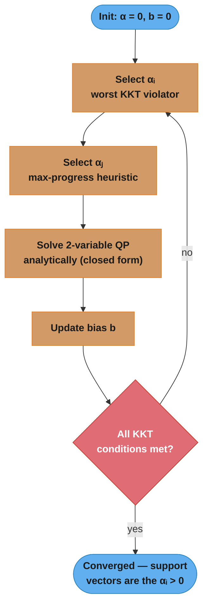
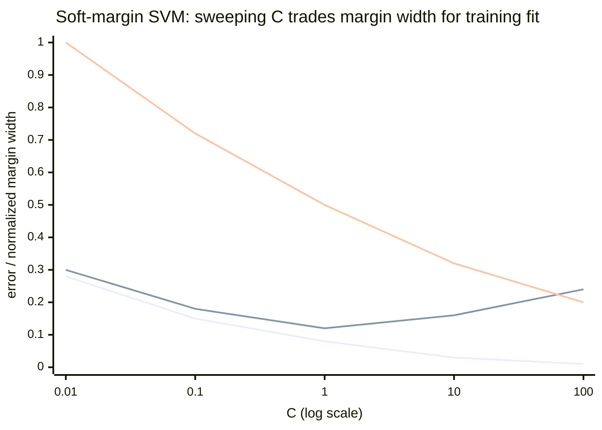

# Support Vector Machines — Deep Dive

## 1. Concept Overview

A Support Vector Machine (SVM) finds the hyperplane that separates two classes while maximizing the margin — the distance between the hyperplane and the nearest training points from each class. Those nearest points are called support vectors. The SVM objective combines geometric margin maximization with an optional tolerance for misclassification (soft margin), controlled by the regularization parameter C.

The kernel trick allows SVMs to operate implicitly in a high-dimensional (potentially infinite-dimensional) feature space without computing the mapping explicitly, enabling non-linear decision boundaries in the original input space at the computational cost of working in the original dimensionality.

SVMs generalize well from small labeled datasets, are robust in high-dimensional spaces, and have solid theoretical foundations (VC dimension, structural risk minimization). Their main weakness is training complexity: O(n^2) to O(n^3) in the number of training samples, making them impractical for n > 100,000 without approximations.

---

## 2. Intuition

One-line analogy: SVM is like finding the widest road between two neighborhoods — the road is the decision boundary and its width is the margin. Only the houses right on the edge of each neighborhood (support vectors) determine where the road goes.

Mental model: instead of minimizing training error (ERM), SVM minimizes model complexity (maximizes margin) subject to a constraint on training error. This is structural risk minimization — a tighter theoretical bound on generalization error.

Key insight: only the support vectors matter. After training, you can delete all non-support-vector training points and the model is identical. In practice, 5–20% of training points become support vectors.

Why the kernel trick works: the dual formulation of SVM only requires dot products between pairs of input vectors. Replacing x_i^T x_j with a kernel function K(x_i, x_j) = phi(x_i)^T phi(x_j) implicitly computes the dot product in the mapped space without ever computing phi(x).

---

## 3. Core Principles

**Hard margin SVM** (linearly separable data):
```
Minimize:   (1/2) ||w||^2
Subject to: y_i (w^T x_i + b) >= 1  for all i
```

**What this actually says.** "Find the flattest possible weight vector that still keeps every point at least one unit away from the boundary — because a shorter `w` is literally a wider road."

The constraint pins the *functional* margin at 1, which fixes the arbitrary scale of `(w, b)`. Once that scale is nailed down, the only remaining freedom is the length of `w`, and geometric width is `2/||w||`. Shrinking `||w||` is therefore the same act as widening the margin — the objective and the picture are one thing.

| Symbol | What it is |
|--------|------------|
| `w` | Normal vector of the hyperplane — points perpendicular to the boundary. Its direction sets the tilt, its length sets the scale |
| `b` | Bias / intercept. Slides the boundary along `w` without rotating it |
| `w^T x_i + b` | Signed distance to the boundary, times `\|\|w\|\|`. Positive on one side, negative on the other |
| `y_i` | Label, `+1` or `-1`. Multiplying by it turns "signed distance" into "how correct" |
| `y_i (w^T x_i + b)` | Functional margin. `>= 1` = correct and outside the margin; `0` = on the boundary; `< 0` = misclassified |
| `\|\|w\|\|` | Euclidean length of `w`, `sqrt(w_1^2 + w_2^2 + ...)`. Inversely proportional to margin width |
| `(1/2) \|\|w\|\|^2` | The thing minimized. The `1/2` and the square are conveniences — the square makes it differentiable and convex, the `1/2` cancels the 2 when you differentiate |

**Walk one example.** A concrete 2-D separator, `w = (2, 1)` and `b = -5`:

```
  ||w||   = sqrt(2^2 + 1^2) = sqrt(5)   = 2.2361
  ||w||^2 = 5
  margin  = 2 / ||w|| = 2 / 2.2361      = 0.8944   <- total road width
  half    = 1 / ||w||                   = 0.4472   <- boundary to either gutter

  point        y     w^T x + b    y(w^T x + b)   distance = |f| / ||w||
  A (2.5, 1)   +1      +1.0           1.0            0.4472   support vector
  B (1.5, 1)   -1      -1.0           1.0            0.4472   support vector
  C (4.0, 2)   +1      +5.0           5.0            2.2361   safely interior
  D (2.0, 1)   +1       0.0           0.0            0.0000   sits ON the boundary

  Halve w to (1, 0.5), b = -2.5: every f above halves too, so the SAME
  boundary now reports functional margin 0.5 for A and B -- the geometry
  did not change, only the units. That is why the "= 1" constraint is
  needed: it fixes the units so ||w|| can stand in for margin width.
```

Points A and B have functional margin exactly 1 — they *are* the support vectors, and they alone pin the boundary. Point C could be deleted from the training set without moving anything. Halving `||w||` from 2.2361 to 1.1180 would double the road from 0.8944 to 1.7889, which is precisely why the objective pushes `||w||` down.

**Soft margin SVM** (allow some misclassification via slack variables xi_i >= 0):
```
Minimize:   (1/2) ||w||^2 + C * sum_i xi_i
Subject to: y_i (w^T x_i + b) >= 1 - xi_i  and  xi_i >= 0
```
- C large: penalize misclassification heavily (small margin, risks overfitting)
- C small: accept more misclassification (large margin, more regularization)

**In plain terms.** "Still make the road as wide as you can, but now you may let some points stand inside it or on the wrong side — you just get billed `C` dollars per unit of trespass."

The whole soft-margin idea is a price, not a rule. `C` is the exchange rate between two currencies that would otherwise be incomparable: margin width and training mistakes. Hard margin is simply this objective at `C = infinity`, where no trespass is affordable at any price — which is why hard margin has no solution at all when the data overlaps.

| Symbol | What it is |
|--------|------------|
| `xi_i` | Slack for point `i`. How far *short* of the required functional margin 1 this point falls. `0` = clean, `0 < xi <= 1` = inside the margin but still correct, `> 1` = misclassified |
| `C` | Price per unit of slack. Small `C` = trespass is cheap, wide road; large `C` = trespass is ruinous, road narrows to avoid it |
| `C * sum_i xi_i` | Total fine paid across the training set |
| `>= 1 - xi_i` | The relaxed constraint. Each point can buy itself `xi_i` units of leniency |
| `xi_i >= 0` | You cannot earn credit for being extra-correct. Beyond margin 1 there is no further reward |

**Walk one example.** Two candidate solutions on the same data — one wide and sloppy, one narrow and exact:

```
  solution W (wide) : ||w||^2 =  5   total slack = 1.4   margin = 2/sqrt(5)  = 0.8944
  solution N (narrow): ||w||^2 = 20   total slack = 0.0   margin = 2/sqrt(20) = 0.4472

  objective = (1/2)||w||^2 + C * sum xi

     C        solution W          solution N       winner
    0.1   2.5 + 0.14 =  2.64    10.0 + 0 = 10.0     W
    1.0   2.5 + 1.40 =  3.90    10.0 + 0 = 10.0     W
    5.0   2.5 + 7.00 =  9.50    10.0 + 0 = 10.0     W  (barely)
   10.0   2.5 + 14.0 = 16.50    10.0 + 0 = 10.0     N
  100.0   2.5 + 140. = 142.5    10.0 + 0 = 10.0     N

  crossover: 2.5 + 1.4C = 10.0  ->  C = 7.5 / 1.4 = 5.357
```

Below `C = 5.357` the optimizer prefers the twice-as-wide road and eats 1.4 units of slack; above it, the same optimizer halves the margin to buy those mistakes back. Nothing about the data changed — only the price did. That single crossover number is why `C` must be cross-validated: it is not a property of the algorithm, it is your stated exchange rate between generalization and training fit, and the right rate depends on how noisy the labels are.

**What breaks without the slack term.** Delete `C * sum_i xi_i` and you are back to hard margin. Add one mislabeled point deep inside the opposite class and the constraint set becomes empty — the quadratic program is infeasible and there is no answer, not a bad answer. Slack is what converts "impossible" into "expensive."

**Dual formulation**: using Lagrange multipliers alpha_i >= 0:
```
Maximize:   sum_i alpha_i - (1/2) sum_{i,j} alpha_i alpha_j y_i y_j K(x_i, x_j)
Subject to: sum_i alpha_i y_i = 0  and  0 <= alpha_i <= C
```

At optimum: alpha_i > 0 only for support vectors. Prediction: f(x) = sign(sum_i alpha_i y_i K(x_i, x) + b).

**Read it like this.** "Give every training point a vote weight. Reward yourself for handing out weight, but penalize every pair of same-class points you weight together — so the optimizer ends up funding only the few points sitting on the frontier."

The dual is the single most consequential rewrite in SVM, and not because it is easier to solve. It is because `w` disappears entirely: the data now enters *only* through `K(x_i, x_j)`, a dot product between pairs. That is the doorway the kernel trick walks through — no dual, no kernels.

| Symbol | What it is |
|--------|------------|
| `alpha_i` | Lagrange multiplier for point `i`. Read it as "how hard this point pushes on the boundary." `0` = irrelevant, `> 0` = support vector |
| `sum_i alpha_i` | The reward term. Pushes weights up |
| `alpha_i alpha_j y_i y_j K(x_i, x_j)` | The penalty term. Positive when two same-class, similar points are both weighted — so the optimizer stops funding redundant interior points |
| `K(x_i, x_j)` | Similarity between two points. For a linear SVM this is just `x_i^T x_j` |
| `sum_i alpha_i y_i = 0` | Balance constraint. Total push from the `+1` side must equal total push from the `-1` side, or the boundary would slide |
| `0 <= alpha_i <= C` | Box constraint. The upper bound `C` is exactly the soft-margin price — no single point may push harder than `C`, which is what stops one outlier from dictating the boundary |
| `alpha_i (y_i f(x_i) - 1) = 0` | The KKT complementary-slackness condition. A product forced to zero: either the weight is zero, or the point sits exactly on the margin |

**Walk one example.** Two points, hard margin, worked all the way through both formulations:

```
  x1 = (1, 1)  y1 = +1        x2 = (0, 0)  y2 = -1

  PRIMAL: the widest separator between them is w = (1, 1), b = -1
    check x1:  1(1) + 1(1) - 1 = +1   ->  y1 * f = +1   on the margin
    check x2:  1(0) + 1(0) - 1 = -1   ->  y2 * f = +1   on the margin
    ||w||^2 = 2,  margin = 2/sqrt(2) = 1.4142
    primal objective = (1/2)(2) = 1.0

  DUAL: recover w from the alphas via w = sum_i alpha_i y_i x_i
    w = a*(+1)*(1,1) + a*(-1)*(0,0) = (a, a)  ->  must equal (1,1)  ->  a = 1
    balance check: sum alpha_i y_i = 1(+1) + 1(-1) = 0             satisfied
    box check:     0 <= 1 <= C for any C >= 1                      satisfied

    dual objective = sum alpha - (1/2) sum_ij alpha_i alpha_j y_i y_j (x_i . x_j)
      pair (1,1): 1*1*(+1)(+1)*(x1.x1 = 2) = +2
      pair (1,2): 1*1*(+1)(-1)*(x1.x2 = 0) =  0
      pair (2,1): 1*1*(-1)(+1)*(x2.x1 = 0) =  0
      pair (2,2): 1*1*(-1)(-1)*(x2.x2 = 0) =  0
      double sum = 2
      dual = (1 + 1) - (1/2)(2) = 2 - 1 = 1.0

  primal 1.0 == dual 1.0    <- strong duality; the two views are the same problem

  Now add x3 = (3, 3), y3 = +1:
    f(x3) = 1(3) + 1(3) - 1 = 5   ->  y3 * f = 5, which is > 1
    KKT: alpha_3 * (5 - 1) = 0, and (5 - 1) != 0, so alpha_3 MUST be 0
    x3 is not a support vector. Delete it and the model is byte-identical.
```

That last step is the KKT condition doing real work, and it is the cleanest way to answer "why do only support vectors matter?" in an interview. The condition `alpha_i (y_i f(x_i) - 1) = 0` is a product of two things forced to equal zero, so at least one of them must be zero for every single point. Any point strictly outside the margin has `y_i f(x_i) - 1 > 0`, which leaves `alpha_i = 0` as the only option. Sparsity is not an approximation or a pruning heuristic here — it falls out of the optimality conditions exactly.

The three KKT regimes are worth memorizing as a table, because interviewers probe the middle row:

| `alpha_i` value | Where the point sits | Slack |
|-----------------|---------------------|-------|
| `alpha_i = 0` | Strictly outside the margin, correctly classified | `xi_i = 0` |
| `0 < alpha_i < C` | Exactly on the margin boundary — a "free" support vector, and the points used to solve for `b` | `xi_i = 0` |
| `alpha_i = C` | Inside the margin or misclassified — a "bound" support vector that has maxed out its allowed push | `xi_i > 0` |

**Hinge loss**: the soft-margin SVM is equivalent to minimizing: (1/2)||w||^2 + C * sum_i max(0, 1 - y_i f(x_i)). This is hinge loss with L2 regularization.

**Put simply.** "Charge a point nothing once it is confidently right, and charge it linearly more the further short of confidence it falls — where 'confident' means a functional margin of at least 1, not merely being on the correct side."

This rewrite is what lets you drop the constraints entirely and train an SVM with plain gradient descent — it is exactly what `SGDClassifier(loss="hinge")` in Section 11 does. The `max(0, ...)` *is* the optimal slack: given a fixed `w`, the cheapest legal `xi_i` is precisely `max(0, 1 - y_i f(x_i))`, so substituting it in loses nothing.

| Symbol | What it is |
|--------|------------|
| `f(x_i)` | The raw decision value `w^T x_i + b`, before any sign or squashing |
| `y_i f(x_i)` | Signed confidence. Same quantity as the functional margin |
| `1 - y_i f(x_i)` | Shortfall from the confidence target |
| `max(0, ...)` | The hinge. Clamps negative shortfalls to zero — no refund for excess confidence |
| `(1/2)\|\|w\|\|^2` | L2 regularizer. The margin-maximizing term, now wearing its regression-textbook name |
| `C` | Same price as before, now reading as "loss weight vs regularization weight" |

**Walk one example.** One point with true label `y = +1`, swept across decision values:

```
  y = +1

    f(x)     y*f(x)    1 - y*f(x)    hinge = max(0, .)   verdict
    +2.0      +2.0        -1.0             0.0           right, and beyond the margin
    +1.0      +1.0         0.0             0.0           right, exactly ON the margin
    +0.5      +0.5        +0.5             0.5           right side, but INSIDE the margin
     0.0       0.0        +1.0             1.0           sitting on the boundary
    -1.0      -1.0        +2.0             2.0           wrong
    -2.0      -2.0        +3.0             3.0           wrong, and confidently so

  Note the hinge is already paying at f = +0.5 -- a point that argmax accuracy
  scores as CORRECT. That gap between "correct" and "confident" is the margin,
  and it is the only reason SVM generalizes better than a boundary that merely
  separates the training data.
```

The kink at `y*f = 1` is where hinge differs from every smooth loss. Log loss keeps nudging already-correct points forever; hinge goes flat and their gradient becomes exactly zero. That is the same sparsity as the KKT argument above, arriving from the loss-function direction: points with zero gradient contribute nothing, and those are precisely the non-support vectors. The price is that hinge is non-differentiable at the kink, which is why solvers use subgradients or the dual QP rather than vanilla calculus.

---

## 4. Types / Architectures / Strategies

### 4.1 Kernel Functions

| Kernel | Formula K(x, z) | Parameters | Best For |
|--------|----------------|-----------|----------|
| Linear | x^T z | None | High-dimensional sparse (text), linearly separable data |
| RBF (Gaussian) | exp(-gamma * ||x-z||^2) | gamma | General-purpose, unknown boundary shape |
| Polynomial | (gamma * x^T z + r)^d | gamma, d, r | Image classification, NLP (some tasks) |
| Sigmoid | tanh(gamma * x^T z + r) | gamma, r | Rarely used; behaves like RBF in practice |
| Chi-squared | sum_k (x_k - z_k)^2 / (x_k + z_k) | None | Histogram features (bag-of-words variants) |

**What the formula is telling you.** "Every one of these is a stand-in for a dot product in some other, bigger space — you get the geometry of that space while only ever touching the original coordinates."

A function is a valid kernel exactly when it equals `phi(x)^T phi(z)` for *some* feature map `phi` (Mercer's condition). You never need to know what `phi` is. The polynomial kernel is the one case where `phi` is small enough to write down, which makes it the right one to verify the trick by hand.

| Symbol | What it is |
|--------|------------|
| `K(x, z)` | Kernel — a similarity score between two input vectors. Large = similar |
| `phi(x)` | The implicit feature map into the higher-dimensional space. Never computed |
| `x^T z` | Plain dot product in the original input space. The only thing actually evaluated |
| `d` | Polynomial degree. Sets how many original features can be multiplied together into one new feature |
| `r` (`coef0`) | Constant offset inside the polynomial. Non-zero `r` keeps the lower-degree terms alive |
| `gamma` | RBF/poly width. Controls how fast similarity decays with distance |
| `\|\|x - z\|\|^2` | Squared Euclidean distance. `0` when identical, grows as points separate |

**Walk one example.** Take the degree-2 polynomial kernel `K(x, z) = (x^T z + 1)^2` on 2-D inputs. Its explicit feature map is 6-dimensional:

```
  phi(x) = ( x1^2, x2^2, sqrt(2)*x1*x2, sqrt(2)*x1, sqrt(2)*x2, 1 )

  Let  x = (2, 3)   and   z = (1, 4).

  KERNEL SIDE  -- stay in 2-D
    x^T z  = 2*1 + 3*4 = 2 + 12 = 14
    K      = (14 + 1)^2 = 15^2  = 225

  EXPLICIT SIDE -- actually build the 6-D vectors
    phi(x) = ( 4,  9,  8.485281,  2.828427,  4.242641,  1 )
    phi(z) = ( 1, 16,  5.656854,  1.414214,  5.656854,  1 )

    component-wise products:
       4 * 1        =    4
       9 * 16       =  144
       8.485281 * 5.656854 =  48
       2.828427 * 1.414214 =   4
       4.242641 * 5.656854 =  24
       1 * 1        =    1
                      -----
       phi(x)^T phi(z) =  225

  225 == 225    <- identical, to the last digit

  OPERATION COUNT
    kernel side  : 2 mults + 1 add (dot) + 1 add (+1) + 1 mult (square) =    5 flops
    explicit side: build both 6-D maps (12 mults) + 6-D dot (6 mults,
                   5 adds)                                              =   23 flops
                                                                      4.6x saved

  Now scale to d = 100 features. The degree-2 map has (d+1)(d+2)/2 = 5,151 dims.
    kernel side  : 100 mults + 99 adds + 1 add + 1 mult                 =  201 flops
    explicit side: 2 * 5,151 to build + 5,151 mults + 5,150 adds        = 20,603 flops
                                                                    102.5x saved
```

The 4.6x saving at `d = 2` is a curiosity; the 102.5x at `d = 100` is the point, and it keeps widening — the explicit cost grows as `d^2` while the kernel cost grows as `d`. Push to the RBF kernel and `phi` is *infinite*-dimensional, so the explicit column is not merely slower, it does not exist. The kernel column still costs one distance computation. That asymmetry is the entire trick, and the dual formulation in Section 3 is what makes it legal: the optimizer never asks for `phi(x)`, only for `K(x_i, x_j)`.

**RBF gamma parameter**:
- gamma = "scale" (sklearn default): 1 / (n_features * X.var())
- gamma = "auto": 1 / n_features
- Large gamma: narrow Gaussian, complex boundary, risk of overfitting
- Small gamma: wide Gaussian, smoother boundary, risk of underfitting

**The idea behind it.** "Similarity is 1 when two points coincide and decays toward 0 as they separate — and `gamma` is the dial for how fast that decay happens, i.e. how far a single training point's influence reaches."

Read `1/sqrt(gamma)` as a radius of influence. Large `gamma` gives each support vector a tiny bubble, so the decision boundary can wrap tightly around individual points — that is overfitting made geometric. Small `gamma` gives every support vector a wide, overlapping bubble, and the boundary smooths toward a near-linear one.

**Walk one example.** `K(x, z) = exp(-gamma * ||x - z||^2)` at two separations, under two gammas:

```
                        gamma = 0.1 (wide)      gamma = 2.0 (narrow)
  distance   ||x-z||^2   -g*d^2      K          -g*d^2       K

   0.5         0.25      -0.025    0.9753       -0.5       0.6065
   2.0         4.00      -0.400    0.6703       -8.0       0.0003

  ratio of near-K to far-K:
    gamma = 0.1  ->  0.9753 / 0.6703 =    1.46x
    gamma = 2.0  ->  0.6065 / 0.0003 = 1807.9x
```

Under `gamma = 0.1` a point 2.0 units away still contributes 0.6703 — nearly as much as a neighbour at 0.5 units. Every support vector votes on every prediction, so the boundary is smooth and global. Under `gamma = 2.0` that same far point contributes 0.0003, effectively nothing: predictions are decided by whichever support vector you are practically sitting on top of. Push `gamma` high enough and the model memorizes the training set as a lookup table — perfect training accuracy, worthless test accuracy.

This is also the arithmetic reason unscaled features destroy an RBF SVM (Pitfall 1 in Section 10). `||x - z||^2` sums squared differences across features, so a feature ranging over `$0–$50,000` contributes squared terms near `10^9` while a scaled feature contributes terms near `1`. A single `gamma` multiplies that whole sum, so the dollar feature alone decides every kernel value and the rest of the features are numerically invisible. And because `gamma` and `C` both regulate boundary complexity from different directions — `gamma` through influence radius, `C` through slack price — the right value of one depends on the other, which is exactly why Pitfall 3 insists they be tuned on a joint 2-D grid rather than one after the other.

### 4.2 Multi-Class SVMs

| Strategy | Description | Complexity |
|----------|-------------|-----------|
| One-vs-One (OvO) | K(K-1)/2 binary classifiers, majority vote | O(K^2) classifiers |
| One-vs-Rest (OvR) | K binary classifiers, highest score wins | O(K) classifiers |
| Crammer-Singer | Single multi-class objective | Slower, rarely used |

sklearn SVC defaults to OvO for multi-class problems.

### 4.3 SVM for Regression (SVR)

Support Vector Regression uses an epsilon-insensitive loss: ignore errors within epsilon of the prediction, penalize errors beyond epsilon.

```
Minimize:   (1/2)||w||^2 + C * sum_i (xi_i + xi_i*)
Subject to: y_i - (w^T x_i + b) <= epsilon + xi_i
            (w^T x_i + b) - y_i <= epsilon + xi_i*
            xi_i, xi_i* >= 0
```

### 4.4 One-Class SVM (Anomaly Detection)

Learns a boundary enclosing the training data (all assumed normal). Points outside the boundary are anomalies. Parameter nu controls the fraction of training points allowed to be outside the boundary (approximate upper bound on false positive rate).

---

## 5. Architecture Diagrams

### 5.1 SVM Margin and Support Vectors

```
Class -1 (circles)         Decision boundary        Class +1 (crosses)

  o   o                                                x   x
    o   o      <--- margin --->  w^T x + b = 0        x   x
      o  [o]   w^T x + b = -1                   [x]  x   x
               |   support vectors               |
               |     (bracketed)                 |
               |<---------- margin = 2/||w|| --->|
```

### 5.2 Effect of C Parameter

```
C = 0.01 (high regularization)     C = 100 (low regularization)

  o  o x                            o   o | x   x
 o o   x x                         o o    |x   x
o o  x   x                        o o  x x|  x x
 o  x o x                          o  x   | x
  o   o x                           o   o |x

Wide margin, some misclassified     Narrow margin, fewer misclassified
Fewer support vectors               More support vectors
Better generalization (maybe)       May overfit noise
```

### 5.3 Kernel Trick — RBF Lifting to Feature Space

```mermaid
%%{init: {'flowchart': {'curve': 'basis', 'nodeSpacing': 45, 'rankSpacing': 55}}}%%
flowchart LR
    classDef io      fill:#61afef,stroke:#2e86c1,color:#1a1a1a,font-weight:bold
    classDef frozen  fill:#c678dd,stroke:#9b59b6,color:#fff
    classDef train   fill:#98c379,stroke:#27ae60,color:#1a1a1a
    classDef mathOp  fill:#d19a66,stroke:#e67e22,color:#1a1a1a,font-weight:bold
    classDef lossN   fill:#e06c75,stroke:#c0392b,color:#fff,font-weight:bold
    classDef req     fill:#56b6c2,stroke:#0097a7,color:#1a1a1a
    classDef base    fill:#e5c07b,stroke:#f39c12,color:#1a1a1a

    xin(["x, z in input space\n(non-separable in 2D)"]) --> K["K(x,z) = φ(x)·φ(z)\ncomputed directly, φ never formed"]
    K --> dual["Dual SVM\nneeds only dot products K(xᵢ,xⱼ)"]
    dual --> hsp["Linear separator in\nhigh-dim feature space"]
    hsp --> bnd(["Non-linear boundary\nback in input space"])

    class xin,bnd io
    class K,dual mathOp
    class hsp base
```



The trick is that the dual objective touches the data only through dot products, so
replacing xᵢᵀxⱼ with a kernel K implicitly lifts every point into a high- (even
infinite-) dimensional space at O(d) cost — φ(x) is never actually computed. A plain
hyperplane there is a curved boundary back in the original input space.

### 5.4 SMO Algorithm (Sequential Minimal Optimization)



SMO never materializes the full n×n kernel matrix. It repeatedly picks the two most
KKT-violating multipliers and solves that tiny 2-variable sub-problem in closed form,
so each step is O(n) not O(n²) — the trick that made SVMs practical past a few hundred
points.

### 5.5 Soft-Margin Tradeoff — Choosing C (Bias–Variance)



Three curves versus C: training error (top-to-bottom monotone decrease), test error
(the U-shaped middle curve), and normalized margin width (the falling curve). Large C
drives training error toward zero but narrows the margin and overfits; small C keeps a
wide margin but underfits. The U-shaped test error bottoms out at an intermediate C —
which is exactly why C must be cross-validated, not maximized.

---

## 6. How It Works — Detailed Mechanics

### 6.1 SVM Classification with sklearn

```python
from __future__ import annotations

import numpy as np
import pandas as pd
from sklearn.datasets import make_classification, make_moons
from sklearn.model_selection import train_test_split, GridSearchCV, StratifiedKFold
from sklearn.preprocessing import StandardScaler
from sklearn.pipeline import Pipeline
from sklearn.svm import SVC, SVR, OneClassSVM
from sklearn.metrics import (
    classification_report, roc_auc_score, mean_squared_error,
)


def svm_pipeline_example() -> None:
    """
    Correct SVM pipeline:
    1. StandardScaler is mandatory — SVM uses Euclidean distances
    2. Always tune C and gamma together (they interact)
    3. Use probability=True only if you need calibrated probabilities (adds Platt scaling cost)
    """
    # Non-linearly separable data — needs RBF kernel
    X, y = make_moons(n_samples=2000, noise=0.25, random_state=42)
    X_train, X_test, y_train, y_test = train_test_split(
        X, y, test_size=0.2, stratify=y, random_state=42
    )

    pipeline = Pipeline([
        ("scaler", StandardScaler()),
        # probability=True adds significant overhead (5-fold internal CV for Platt scaling)
        # Only set True if you need predict_proba()
        ("svm", SVC(kernel="rbf", C=1.0, gamma="scale", probability=True, random_state=42)),
    ])
    pipeline.fit(X_train, y_train)

    y_pred = pipeline.predict(X_test)
    y_proba = pipeline.predict_proba(X_test)[:, 1]
    print(classification_report(y_test, y_pred))
    print(f"AUC-ROC: {roc_auc_score(y_test, y_proba):.4f}")


def tune_svm_hyperparameters(
    X_train: np.ndarray,
    y_train: np.ndarray,
) -> Pipeline:
    """
    Grid search over C and gamma.
    CRITICAL: C and gamma must be tuned jointly — they trade off against each other.
    Use logarithmic grid: small to large, powers of 10.
    """
    pipeline = Pipeline([
        ("scaler", StandardScaler()),
        ("svm", SVC(kernel="rbf", probability=True, random_state=42)),
    ])

    param_grid = {
        "svm__C":     [0.01, 0.1, 1.0, 10.0, 100.0],
        "svm__gamma": [0.001, 0.01, 0.1, 1.0, 10.0],
    }

    cv = StratifiedKFold(n_splits=5, shuffle=True, random_state=42)
    search = GridSearchCV(
        pipeline,
        param_grid,
        cv=cv,
        scoring="roc_auc",
        n_jobs=-1,
        verbose=2,
    )
    search.fit(X_train, y_train)
    print(f"Best C={search.best_params_['svm__C']}, gamma={search.best_params_['svm__gamma']}")
    print(f"Best CV AUC: {search.best_score_:.4f}")
    return search.best_estimator_


def compare_kernels() -> None:
    """
    Compare linear, RBF, and polynomial kernels on non-linear data.
    Shows that linear kernel fails on non-linearly separable problems.
    """
    X, y = make_moons(n_samples=1000, noise=0.2, random_state=42)
    X_train, X_test, y_train, y_test = train_test_split(
        X, y, test_size=0.2, stratify=y, random_state=42
    )

    scaler = StandardScaler()
    X_train_s = scaler.fit_transform(X_train)
    X_test_s = scaler.transform(X_test)

    kernels: dict[str, dict] = {
        "linear":     {"kernel": "linear", "C": 1.0},
        "RBF":        {"kernel": "rbf", "C": 1.0, "gamma": "scale"},
        "polynomial": {"kernel": "poly", "C": 1.0, "degree": 3, "gamma": "scale"},
    }

    for name, params in kernels.items():
        svm = SVC(**params, random_state=42)
        svm.fit(X_train_s, y_train)
        acc = svm.score(X_test_s, y_test)
        n_sv = svm.n_support_.sum()
        print(f"{name:12s}  accuracy={acc:.4f}  support_vectors={n_sv}")
```

### 6.2 SVM for Regression (SVR)

```python
from sklearn.svm import SVR
from sklearn.datasets import make_regression


def svr_example() -> None:
    """
    SVR: epsilon-insensitive tube around the prediction.
    Points within epsilon of the prediction incur zero loss.
    C controls the penalty for points outside the tube.
    epsilon controls the tube width (larger = fewer support vectors).
    """
    X, y = make_regression(n_samples=500, n_features=5, noise=10.0, random_state=42)
    X_train, X_test, y_train, y_test = train_test_split(
        X, y, test_size=0.2, random_state=42
    )

    scaler = StandardScaler()
    X_train_s = scaler.fit_transform(X_train)
    X_test_s = scaler.transform(X_test)

    # Scale target too for SVR — often improves convergence
    from sklearn.preprocessing import StandardScaler as SS
    y_scaler = SS()
    y_train_s = y_scaler.fit_transform(y_train.reshape(-1, 1)).ravel()

    svr = SVR(kernel="rbf", C=10.0, epsilon=0.1, gamma="scale")
    svr.fit(X_train_s, y_train_s)

    y_pred_s = svr.predict(X_test_s)
    y_pred = y_scaler.inverse_transform(y_pred_s.reshape(-1, 1)).ravel()

    rmse = mean_squared_error(y_test, y_pred) ** 0.5
    print(f"SVR RMSE: {rmse:.4f}")
    print(f"Number of support vectors: {svr.n_support_.sum()}")
```

### 6.3 One-Class SVM for Anomaly Detection

```python
from sklearn.svm import OneClassSVM


def one_class_svm_anomaly() -> None:
    """
    One-Class SVM learns a boundary around normal training data.
    nu: upper bound on the fraction of training errors (outliers in training).
    nu = 0.05 means at most 5% of training points are outside the boundary.
    Prediction: +1 = normal, -1 = anomaly.
    """
    rng = np.random.default_rng(42)

    # Normal data: Gaussian blob
    X_normal = rng.multivariate_normal(mean=[0, 0], cov=[[1, 0.5], [0.5, 1]], size=500)

    # Anomaly data: scattered far from center
    X_anomaly = rng.uniform(low=-5, high=5, size=(50, 2))

    X_all = np.vstack([X_normal, X_anomaly])
    labels = np.array([1] * 500 + [-1] * 50)   # 1=normal, -1=anomaly (ground truth)

    scaler = StandardScaler()
    X_train_s = scaler.fit_transform(X_normal)     # fit on normal data ONLY
    X_all_s = scaler.transform(X_all)

    # nu controls the trade-off: lower nu = tighter boundary (more false negatives)
    ocsvm = OneClassSVM(kernel="rbf", nu=0.05, gamma="scale")
    ocsvm.fit(X_train_s)

    predictions = ocsvm.predict(X_all_s)   # +1 = normal, -1 = anomaly
    n_anomalies_detected = (predictions == -1).sum()
    print(f"Anomalies detected: {n_anomalies_detected} / 50")


def svm_feature_importance_via_permutation() -> None:
    """
    SVM has no built-in feature importance.
    For linear SVM: |w_j| = feature importance (w is recoverable).
    For kernel SVM: use permutation importance (model-agnostic).
    """
    from sklearn.inspection import permutation_importance
    from sklearn.datasets import load_breast_cancer

    data = load_breast_cancer()
    X, y = data.data, data.target
    X_train, X_test, y_train, y_test = train_test_split(
        X, y, test_size=0.2, stratify=y, random_state=42
    )

    pipeline = Pipeline([
        ("scaler", StandardScaler()),
        ("svm", SVC(kernel="linear", C=1.0, random_state=42)),
    ])
    pipeline.fit(X_train, y_train)

    # For linear kernel: direct coefficient access
    linear_svm = pipeline.named_steps["svm"]
    importances = np.abs(linear_svm.coef_[0])
    feature_names = data.feature_names
    top_features = sorted(
        zip(feature_names, importances), key=lambda x: x[1], reverse=True
    )[:5]
    print("Top 5 features (linear SVM):")
    for name, imp in top_features:
        print(f"  {name}: {imp:.4f}")
```

### 6.4 Scaling Issue Demonstration (Critical Bug)

```python
def demonstrate_scaling_bug() -> None:
    """
    SVM without scaling: features with large magnitude dominate.
    Shows the dramatic accuracy difference.
    """
    from sklearn.datasets import load_breast_cancer

    data = load_breast_cancer()
    X, y = data.data, data.target

    # Features have very different scales:
    # mean radius: ~10-30, mean area: ~140-2500, mean fractal dimension: ~0.05-0.1

    X_train, X_test, y_train, y_test = train_test_split(
        X, y, test_size=0.2, stratify=y, random_state=42
    )

    # --- WRONG: No scaling ---
    svm_bad = SVC(kernel="rbf", C=1.0, gamma="scale", random_state=42)
    svm_bad.fit(X_train, y_train)
    acc_bad = svm_bad.score(X_test, y_test)
    print(f"SVM WITHOUT scaling: accuracy = {acc_bad:.4f}")

    # --- CORRECT: StandardScaler before SVM ---
    scaler = StandardScaler()
    X_train_s = scaler.fit_transform(X_train)
    X_test_s = scaler.transform(X_test)

    svm_good = SVC(kernel="rbf", C=1.0, gamma="scale", random_state=42)
    svm_good.fit(X_train_s, y_train)
    acc_good = svm_good.score(X_test_s, y_test)
    print(f"SVM WITH scaling:    accuracy = {acc_good:.4f}")
    # Typical result: without scaling ~0.63, with scaling ~0.97
```

---

## 7. Real-World Examples

**Text Classification (SVM + TF-IDF)**: Before transformer models, SVM with linear kernel was the dominant approach for document classification (news categorization, sentiment analysis). The high-dimensional sparse TF-IDF vectors (50,000+ dimensions) suit linear SVM perfectly — it finds a separating hyperplane in sparse space efficiently. sklearn's LinearSVC (based on liblinear) handles this in O(n * nnz) where nnz is the average number of non-zero TF-IDF values per document.

**Cancer Detection (SVM with RBF)**: Radiology studies from the early 2010s used SVM with RBF kernel on engineered features extracted from tissue samples (texture, gradient magnitude, compactness). With 200–500 labeled samples — too few for deep learning — SVM consistently outperformed neural networks due to its maximum-margin generalization guarantee.

**Handwritten Digit Recognition (SVM with RBF)**: The MNIST benchmark was first solved competitively with SVMs. An SVM with RBF kernel on raw pixels achieves ~0.98 accuracy on MNIST. The support vectors are the ambiguous digit images — the ones the classifier needs to memorize because they sit near the decision boundary.

**Anomaly Detection in Industrial Monitoring**: semiconductor fabs use One-Class SVM to detect equipment anomalies from sensor streams. Training data is exclusively normal operation (anomalies are rare and diverse, so cannot be labeled). One-class SVM learns the distribution of normal behavior; deviations trigger alerts. nu = 0.01 sets the expected false positive rate at 1%.

---

## 8. Tradeoffs

| Aspect | Linear SVM | RBF SVM | Polynomial SVM |
|--------|-----------|---------|---------------|
| Training complexity | O(n) via SGD | O(n^2)–O(n^3) | O(n^2)–O(n^3) |
| Inference complexity | O(d) | O(n_sv * d) | O(n_sv * d) |
| Interpretable | Yes (coef_) | No | No |
| Non-linear boundaries | No | Yes | Yes |
| Hyperparameters | C only | C, gamma | C, gamma, degree |
| Memory for large n | Low | High (kernel matrix) | High |
| Best dataset size | Up to 10M rows | Up to 100k rows | Up to 100k rows |

---

## 9. When to Use / When NOT to Use

**Use SVM with linear kernel when**:
- High-dimensional sparse features (text with TF-IDF, one-hot encoded categoricals)
- Need for interpretable coefficients (similar to logistic regression)
- n up to a few million (use LinearSVC for scalability beyond sklearn SVC)

**Use SVM with RBF kernel when**:
- Small to medium dataset (n < 100,000)
- Unknown or complex decision boundary shape
- Feature dimensionality is manageable (d < 1,000)
- More labeled data is expensive to acquire (medical, industrial)

**Use One-Class SVM when**:
- Only normal-class training data available
- Anomaly definition is "far from normal" rather than "belongs to class B"

**Do NOT use kernel SVM when**:
- n > 100,000: training becomes prohibitively slow (consider LinearSVC, gradient boosting, or neural networks)
- Very high-dimensional dense features (d > 10,000 with kernel SVM): kernel matrix dominates memory
- You need real-time online learning (SVM requires full retraining or approximate updates)
- Probability outputs are needed without paying the cost of Platt scaling (prefer logistic regression)

---

## 10. Common Pitfalls

**Pitfall 1 — Not scaling before SVM**
A production fraud detection team achieved 63% accuracy with RBF SVM. After investigation, the transaction_amount feature (range $0–$50,000) dominated the Euclidean distance computation, making the RBF kernel effectively measure only that one feature. Adding StandardScaler raised accuracy to 91%. This is the single most common SVM bug in production ML code. Distance-based models (SVM, k-NN) always require feature scaling.

**Pitfall 2 — Using SVC when n > 50,000**
An NLP team tried SVC with RBF kernel on 500,000 text documents. Training ran for 18 hours and never completed. The O(n^2)–O(n^3) complexity of the quadratic programming solver made it infeasible. Fix: use LinearSVC (via liblinear, O(n * iter)) or SGDClassifier with hinge loss (online, constant memory) for large-scale text.

**Pitfall 3 — Tuning C and gamma independently**
A team did a grid search: first tuned C (fixing gamma="scale"), then tuned gamma (fixing best C). This missed the interaction — at large C, small gamma performs differently than at small C. C and gamma must be tuned jointly in a 2D grid search. The optimal point (C=10, gamma=0.01) may be far from the result of sequential tuning.

**Pitfall 4 — probability=True overhead misunderstood**
SVC(probability=True) performs an internal 5-fold cross-validation to fit Platt scaling parameters. This multiplies training time by ~5x. A team set probability=True by default in all experiments even when they only needed the class prediction (not probability). Fix: set probability=False for all experiments where predict_proba is not needed. If calibrated probabilities are needed, consider CalibratedClassifierCV as a wrapper around SVC(probability=False) — more flexible.

**Pitfall 5 — One-Class SVM for structured anomalies**
A team used One-Class SVM to detect network intrusions but found 80% false negative rate on novel attack patterns. One-Class SVM works when anomalies are "far from normal." If anomalies cluster in a specific region of feature space (a known attack signature), a binary SVM (trained on labeled examples of normal and attack) outperforms the one-class variant. One-class SVM is the right tool only when anomalies are genuinely unknown and diverse.

**Pitfall 6 — Forgetting to scale the target in SVR**
SVR's epsilon parameter is in the units of the target variable. If the target has large variance (e.g., house prices in dollars, range $50k–$5M), a default epsilon=0.1 is meaningless. Scaling the target to zero mean, unit variance (then inverse-transforming predictions) makes epsilon meaningful and training more stable.

---

## 11. Technologies & Tools

| Tool | Purpose | Notes |
|------|---------|-------|
| sklearn SVC | Full SVM with all kernels, soft margin | Uses libsvm internally; O(n^2-n^3) |
| sklearn LinearSVC | SVM with linear kernel, liblinear backend | Much faster for n > 10k, no predict_proba |
| sklearn SGDClassifier(loss="hinge") | Online SVM approximation | Constant memory, handles n = billions |
| sklearn SVR | SVM regression | epsilon-insensitive loss |
| sklearn OneClassSVM | Anomaly detection | nu parameter controls boundary tightness |
| libsvm | C library underlying sklearn SVC | Direct access for custom kernels |
| ThunderSVM | GPU-accelerated SVM | 10-100x speedup for large datasets |
| sklearn CalibratedClassifierCV | Add probability calibration to SVC | Wraps SVC(probability=False) |

---

## 12. Interview Questions with Answers

**Q: What are support vectors and why do only they matter after training?**
Support vectors are the training points that lie on or within the margin boundaries — they have non-zero Lagrange multipliers (alpha_i > 0) in the dual formulation. After training, the decision function is f(x) = sum_i alpha_i y_i K(x_i, x) + b, which only involves the support vectors (all non-support points have alpha_i = 0). This means the trained model only needs to store and evaluate support vectors at inference time, not the entire training set.

**Q: Explain the kernel trick. Why is it computationally advantageous?**
The kernel trick exploits that the SVM dual formulation requires only pairwise dot products between training points: K(x_i, x_j) = phi(x_i)^T phi(x_j). By defining a kernel function K that computes this inner product without explicitly computing phi, we can operate in very high or infinite-dimensional feature spaces at O(d) cost per kernel evaluation (the original feature dimensionality). For example, the RBF kernel implicitly maps to an infinite-dimensional space but each evaluation costs O(d) not O(infinity).

**Q: What is the role of the C parameter in soft-margin SVM?**
C controls the trade-off between maximizing the margin and minimizing training error. Large C: heavily penalizes misclassification — small margin, model fits training data tightly, risks overfitting. Small C: allows more misclassification — large margin, more regularization, risks underfitting. C is the inverse of regularization strength: C = 1/lambda. Tuning C via cross-validation is essential; common range: 10^{-3} to 10^3 on a log scale.

**Q: What is the difference between the primal and dual formulation of SVM, and why is the dual used?**
The primal is a d-dimensional QP (d = feature dimension): minimize over w, b. The dual is an n-dimensional QP (n = samples): maximize over alpha. For kernel SVM with high or infinite-dimensional feature space (RBF), the primal formulation requires operating in that space, which may be computationally intractable. The dual formulation requires only kernel evaluations K(x_i, x_j), which cost O(d) regardless of the implicit feature space dimension. For n << d (small datasets, high dimensions), the primal can be preferable; for large n with kernels, the dual is necessary.

**Q: How does the RBF gamma parameter affect the decision boundary?**
Gamma controls the width of the Gaussian kernel: K(x, z) = exp(-gamma * ||x-z||^2). Large gamma: the Gaussian is narrow — each training point influences only its immediate neighborhood. The decision boundary becomes complex and wiggly, following individual training points closely — high variance, risk of overfitting. Small gamma: wide Gaussian — each point influences a broad region. The boundary is smooth and almost linear — high bias, risk of underfitting. gamma="scale" (default in sklearn) sets gamma = 1/(n_features * X.var()), which is a good starting point.

**Q: Why is SVM effective in high-dimensional spaces despite the curse of dimensionality?**
SVM maximizes the margin, which provides a generalization bound independent of the input dimensionality d. The VC dimension of a linear SVM is min(d, n) + 1, but the effective VC dimension (fat-shattering dimension) of the margin classifier is bounded by the margin, not d. In high-dimensional sparse spaces (text), the data is often linearly separable with a large margin — SVM exploits this. This contrasts with k-NN, where all distances collapse in high dimensions.

**Q: Compare SVM and logistic regression. When would you choose each?**
Both SVM (hinge loss + L2) and logistic regression (log-loss + L2) produce linear classifiers in their primal form and have similar generalization performance on large datasets. Choose SVM: small dataset where maximizing margin matters, kernel trick for non-linearity, sparse text features (LinearSVC). Choose logistic regression: when you need calibrated probabilities, interpretable coefficients, faster training on large data, or online learning. SVM does not natively output calibrated probabilities (Platt scaling is an approximation). On very large datasets, SGD-based logistic regression (sklearn SGDClassifier with log loss) wins on speed.

**Q: How does One-Class SVM differ from isolation forest for anomaly detection?**
One-Class SVM learns a boundary enclosing the training data in a kernel-induced feature space; it is sensitive to the kernel choice and gamma parameter, and scales as O(n^2). It works well when normal data is compact and anomalies are far from the center. Isolation Forest randomly partitions the feature space and assigns anomaly scores based on the average path length to isolate a point; it scales as O(n log n), handles high-dimensional data better, and is generally more robust to outliers in the training set. In practice, Isolation Forest outperforms One-Class SVM on most tabular anomaly detection benchmarks.

**Q: What is the SMO algorithm and why was it important for practical SVM training?**
Sequential Minimal Optimization (Platt 1998) decomposes the large n-variable QP of SVM dual into a series of minimal 2-variable sub-problems, each solvable analytically in closed form. This avoids storing the full n x n kernel matrix (O(n^2) memory) and avoids large matrix operations. SMO selects the two most violating variables at each step (heuristic), making progress toward the KKT optimum. SMO made SVM practical for datasets with tens of thousands of points — before it, only hundreds of points were feasible.

**Q: How do you use an SVM for multi-class classification?**
sklearn SVC uses One-vs-One (OvO) by default: for K classes, it trains K(K-1)/2 binary classifiers and uses majority vote. For 10 classes, that is 45 classifiers. LinearSVC uses One-vs-Rest (OvR): K classifiers, each separating one class from all others; assign the class with highest decision function value. OvO is typically more accurate because each binary classifier trains on a balanced subset; OvR is faster. For K > 10, OvR or the Crammer-Singer multi-class SVM formulation are preferred.

**Q: Why does SVM with probability=True slow training significantly?**
SVC(probability=True) adds Platt scaling: after the SVM is trained, it fits a sigmoid function A * f(x) + B = logit(P(y=1|x)) using another internal k-fold cross-validation (default 5-fold). This multiplies total training time by approximately 5-6x. The resulting probabilities are approximate and the sigmoid fitting can be unstable for small datasets or when class distributions are extreme. For better-calibrated probabilities, use CalibratedClassifierCV with cv=5 externally, giving more control over the calibration process.

**Q: What is the hinge loss and how does it relate to the SVM objective?**
Hinge loss for a single example: L = max(0, 1 - y * f(x)), where y in {-1, +1} and f(x) = w^T x + b. It is zero when the example is correctly classified with margin >= 1, and linear in the margin violation otherwise. The soft-margin SVM minimizes (1/2)||w||^2 + C * sum_i max(0, 1 - y_i f(x_i)), which is L2 regularization of the weight vector plus C times the sum of hinge losses. This is exactly a regularized ERM with hinge loss. Compared to logistic regression's log loss, hinge loss is zero beyond the margin (sparser gradient updates, fewer support vectors) but is not differentiable at margin = 1.

**Q: How would you debug an SVM that achieves near-random performance on a binary classification task?**
Systematic diagnosis: (1) check that features are scaled — unscaled features with high variance dominate RBF kernel; (2) print n_support_ — very high number (~50% of training data) indicates the model is underfitting (C too low or data is not separable with current kernel); (3) try LinearSVC first — if linear kernel fails, the boundary is genuinely non-linear; (4) reduce the dataset to 2 features and plot the decision boundary to visually confirm the kernel is learning; (5) check for label issues — if classes are mislabeled or highly imbalanced and class_weight is not set, the model predicts all-majority-class; (6) verify C and gamma range in grid search — if the optimal point is at the boundary of your grid, expand the search.

**Q: How does SVR differ from linear regression, and when would you prefer it?**
SVR minimizes ||w||^2 subject to all predictions being within epsilon of the true values — errors within the tube incur no loss (epsilon-insensitivity). Points outside the tube are penalized linearly. This produces a sparser solution than OLS (only out-of-tube points are support vectors) and is more robust to outliers (the epsilon tube absorbs small errors). SVR is preferred when: the target has significant noise that should be ignored (measured sensor readings with ±5% instrument error); outliers in y are possible and should not dominate the fit; a non-linear kernel gives better generalization than polynomial feature expansion. For most tabular regression tasks, gradient boosted trees dominate SVR in practice.

**Q: How do you handle very large datasets (n > 1 million) with SVMs?**
Kernel SVMs are impractical beyond ~100,000 samples due to O(n^2)–O(n^3) training complexity. Options: (1) LinearSVC or SGDClassifier(loss="hinge") — linear SVM via liblinear or online SGD, both O(n); (2) Nystrom approximation — approximate the kernel matrix with a low-rank factorization, reducing to a linear problem in the approximated feature space; (3) Random Fourier Features (sklearn RBFSampler) — approximate RBF kernel with random feature maps, then use linear SVM; (4) Mini-batch training with gradient-based solvers. In practice, for n > 1M, gradient boosted trees or neural networks are the standard choice.

**Q: What are the KKT conditions for SVM and what do they tell us about support vectors?**
The Karush-Kuhn-Tucker (KKT) conditions for the SVM dual are: (1) alpha_i >= 0; (2) y_i f(x_i) - 1 + xi_i >= 0; (3) alpha_i (y_i f(x_i) - 1 + xi_i) = 0; (4) mu_i xi_i = 0, where mu_i = C - alpha_i. From condition (3): if alpha_i > 0 (a support vector), then y_i f(x_i) = 1 - xi_i. Three regimes: alpha_i = 0 (non-support vector, correctly classified with margin > 1); 0 < alpha_i < C (on the margin boundary, xi_i = 0); alpha_i = C (inside or on the wrong side of the margin, xi_i > 0). The SMO algorithm uses KKT violation as its selection criterion for which alpha pairs to optimize next.

**Q: How do you extract feature importance from a kernel SVM?**
For linear SVM: the weight vector w = sum_i alpha_i y_i x_i is explicitly available as model.coef_. Feature importance is |w_j| — larger absolute values indicate stronger linear influence. For kernel SVM (RBF, polynomial): w is implicitly defined in the infinite-dimensional feature space and is not directly interpretable in the input space. Use model-agnostic methods: permutation importance (sklearn.inspection.permutation_importance) — randomly shuffle each feature and measure accuracy drop; SHAP kernel explainer (slower but theoretically grounded); or switch to a linear kernel for interpretability and accept the lower accuracy.

---

## 13. Best Practices

1. Always apply StandardScaler before SVM. Wrap in a sklearn Pipeline to prevent leakage. This is the single most impactful step for SVM performance.

2. Tune C and gamma jointly in a 2D grid search. Use a log-scale grid: C in [0.01, 0.1, 1, 10, 100], gamma in [0.001, 0.01, 0.1, 1, 10]. The optimal region is often a diagonal band in this 2D space.

3. For n > 50,000 with a linear kernel, use LinearSVC instead of SVC(kernel="linear"). LinearSVC uses the liblinear solver, which scales as O(n * iter) rather than O(n^2).

4. Set probability=False unless predict_proba is genuinely needed. The overhead of Platt scaling (5x training time) is not justified for experiments where only class predictions are needed.

5. For anomaly detection with labeled normal data only, use OneClassSVM with nu set to the expected contamination rate in training (e.g., nu=0.01 if you expect 1% of your training data to be mislabeled anomalies).

6. For SVR, scale both features and target. SVR's epsilon parameter is in target units; an unscaled target makes epsilon meaningless and training unstable.

7. When SVM performance is poor, check n_support_. If support vectors are > 30% of training set, the model is underfitting: try larger C, different kernel, or more features. If support vectors are < 5% and training error is near zero but test error is high, the model is overfitting: reduce C or increase gamma.

8. Use permutation importance or SHAP for feature importance with kernel SVMs. Never report model.coef_ for RBF or polynomial kernels — it does not exist in the input space.

---

## 14. Case Study

**Problem**: a bioinformatics team needs to classify cancer subtypes from gene expression microarray data. Dataset: 200 tumor samples, 20,000 gene expression features (d >> n), 3 cancer subtypes (multi-class). Constraint: need to identify the most discriminative genes for biological interpretation.

**Why SVM**: with n=200 and d=20,000, the feature space is extremely high-dimensional relative to sample count. Neural networks would overfit catastrophically. SVM's maximum-margin principle provides strong generalization guarantees even in this d >> n regime, especially with a linear kernel (the data may be linearly separable in gene expression space).

**Pipeline**:
```
Raw gene expression matrix (200 x 20,000)
    |
    v
Variance filtering (keep top 5,000 genes by variance across samples)
    |
    v
StandardScaler (fit on training folds only)
    |
    v
LinearSVC(C=0.01, multi_class="ovr", max_iter=5000)
    |
    v
5-fold cross-validation for C in [0.001, 0.01, 0.1, 1.0]
    |
    v
Optimal: C=0.01  (strong regularization appropriate for n=160 effective training)
    |
    v
Evaluation on held-out 20% test set (40 samples)
    |--- Accuracy: 0.88
    |--- Macro F1: 0.87
    |
    v
Feature extraction: model.coef_ shape (3, 5000) → |w_j| per subtype
```

**Results**:
- 88% accuracy on held-out test set (40 samples) across 3 cancer subtypes
- Baseline (majority class): 45%
- Top discriminative genes matched known biomarkers from literature for 2 of 3 subtypes, providing biological validation
- The sparse support vector set (12 support vectors out of 160 training samples) indicated a clean linear boundary in gene expression space

**Alternative considered**: RBF SVM scored 82% (lower — the linear kernel fits better in this very high-dimensional space, which is expected). Gradient boosting scored 79% due to insufficient data for ensemble methods.

**Biological insight from coefficients**: the top 20 genes by |w_j| for subtype 1 included 14 genes from the HER2 pathway, matching established HER2-amplified breast cancer biology. The linear SVM's interpretable coefficients were critical for publication and FDA regulatory review of the diagnostic claim.
