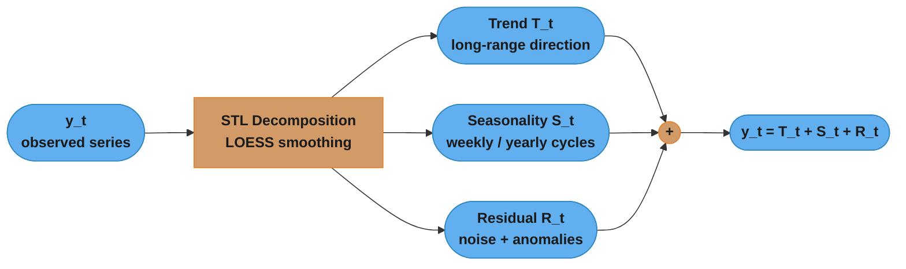
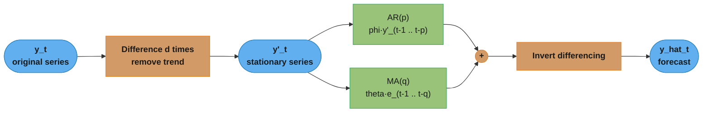
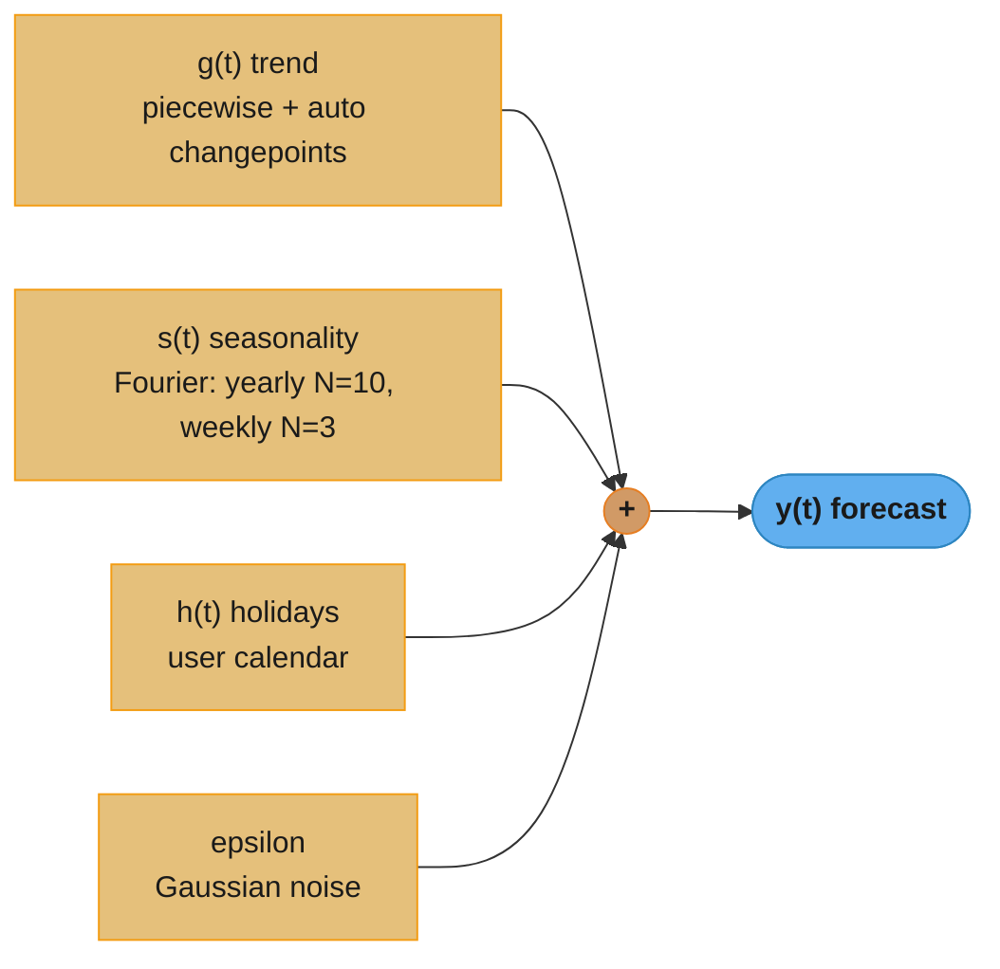
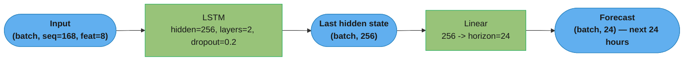
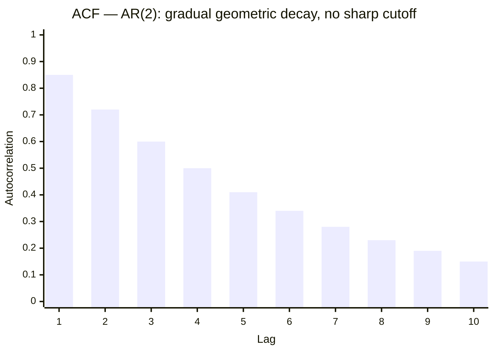
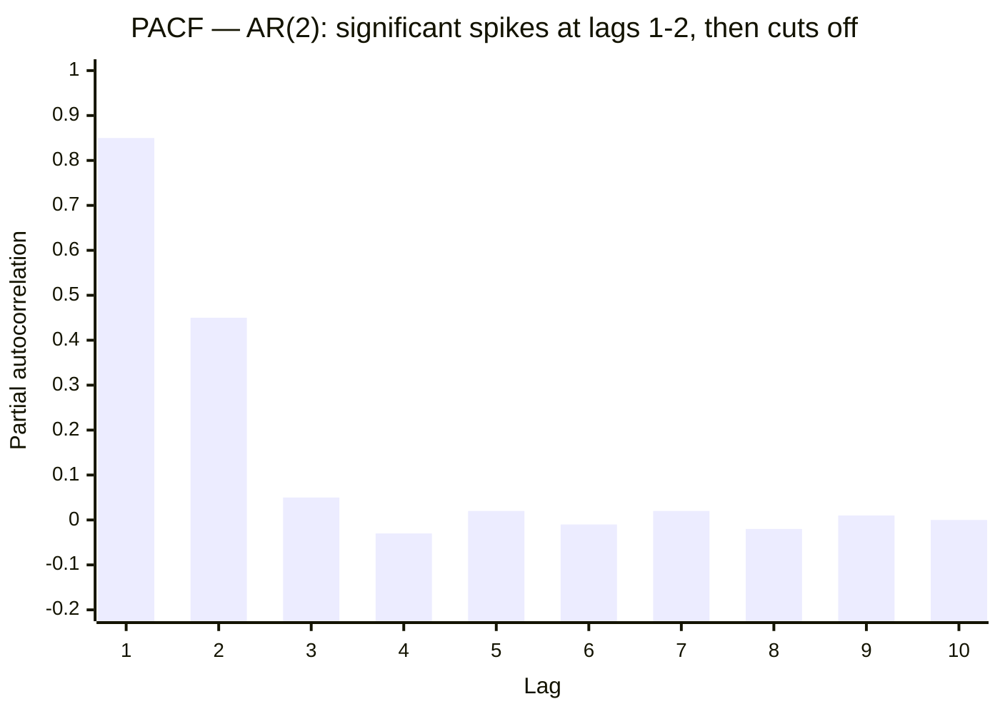

# Time Series Forecasting

---

## 1. Concept Overview

Time series forecasting predicts future values of a sequentially ordered, time-indexed variable. Unlike cross-sectional prediction, observations are not independent — the value at time t depends on values at t-1, t-2, ..., t-k. Forecasting methods must respect temporal order, handle non-stationarity, and account for repeating seasonal patterns.

Applications: demand planning, financial price prediction, energy load forecasting, anomaly detection in metrics, product sales attribution, capacity planning.

---

## 2. Intuition

One-line analogy: Forecasting is like predicting tomorrow's weather — you look at what happened yesterday (trend), the same day last year (seasonality), and unexpected events (residuals), then combine them into a single estimate.

Mental model: Every time series = trend + seasonality + noise. STL decomposition separates these components. Statistical models (ARIMA) capture linear temporal dependencies. Deep learning models (LSTM, Temporal Fusion Transformer) capture non-linear dependencies and multiple covariates simultaneously.

Why it matters: Amazon reported a 10% reduction in forecast error reduces inventory cost by ~$1B. Netflix uses forecasting to pre-scale CDN nodes before major releases. Incorrect energy load forecasting causes grid instability or expensive spot purchases.

Key insight: The best forecasting model is not the most complex one — it is the one that best captures the dominant signal in your specific series. A well-tuned Prophet model beats a misconfigured LSTM 80% of the time on business time series.

---

## 3. Core Principles

1. Stationarity is a prerequisite for most statistical models — mean and variance must not change over time. Test with ADF; fix with differencing or log transformation.
2. Respect temporal order in all cross-validation — never shuffle time series data. Use walk-forward (expanding window) or sliding window validation.
3. Lag features encode temporal memory — the value at t-1, t-7, t-365 is often the strongest predictor of t.
4. Seasonal patterns have multiple periods — retail demand has daily, weekly, and yearly cycles simultaneously. Models must handle multiple seasonal periods.
5. Uncertainty quantification matters — a point estimate without confidence interval is misleading for planning. Use probabilistic forecasting (DeepAR, quantile regression) for inventory and capacity decisions.

---

## 4. Types / Architectures / Strategies

### 4.1 Classical Statistical Models

| Model | Parameters | Best For |
|-------|-----------|---------|
| Naive (last value) | 0 | Baseline; benchmark against this first |
| Simple Exponential Smoothing | alpha | No trend, no seasonality |
| Holt-Winters | alpha, beta, gamma | Trend + seasonality, short series |
| ARIMA(p,d,q) | 3 | Stationary after differencing, univariate |
| SARIMA(p,d,q)(P,D,Q,s) | 7 | ARIMA + seasonal component |
| VAR (Vector AR) | p | Multivariate, capturing cross-series dependencies |

### 4.2 Machine Learning Approaches

| Method | Input Features | Notes |
|--------|---------------|-------|
| LightGBM / XGBoost | Lag features, rolling stats, calendar | Fast, handles missing values, very competitive |
| Linear regression + features | Same as above | Interpretable; strong baseline |
| ElasticNet | High-dim lag matrix | Regularized; handles many correlated lags |

### 4.3 Deep Learning Models

| Model | Key Idea | Horizon | Probabilistic |
|-------|---------|---------|--------------|
| LSTM / GRU | Sequential hidden state | Short-medium | No (add quantile loss) |
| Temporal CNN (WaveNet) | Dilated causal convolutions | Long | No |
| DeepAR (Amazon) | Autoregressive LSTM, Gaussian/NB output | Medium | Yes |
| N-BEATS | Pure MLP, residual stacks | Medium | No |
| Temporal Fusion Transformer | Attention + LSTM + static covariates | Long | Yes |
| PatchTST | Patched transformer, channel independence | Long | No |

### 4.4 Feature Engineering for Time Series

| Feature Type | Examples | Notes |
|-------------|---------|-------|
| Lag features | t-1, t-7, t-14, t-365 | Most predictive; domain-specific lag selection |
| Rolling statistics | rolling_mean(7), rolling_std(30) | Capture local trend and volatility |
| Calendar features | day_of_week, month, is_holiday, week_of_year | Essential for retail, energy |
| Fourier features | sin/cos transforms of period | Smooth seasonality encoding |
| Target encoding | Mean sales by product category | For grouped hierarchical series |

---

## 5. Architecture Diagrams

### STL Decomposition



Additive decomposition sums the three components; switch to multiplicative
(`y_t = T_t × S_t × R_t`) when the seasonal swing grows with the series level.

### ARIMA Model



Differencing makes the series stationary so the AR and MA terms can be estimated;
the fit is then inverted (integrated) back to the original scale — the "I" in ARIMA.

### Prophet Additive Model



Prophet is a structural model: trend, multi-period seasonality, and holidays are
fit as separate additive terms, which is why each component stays independently
interpretable and tunable.

### PyTorch LSTM Forecaster



A single direct-multi-output head emits all 24 steps at once (MIMO strategy),
avoiding the error accumulation of recursively feeding each prediction back as input.

### Backtesting — Rolling-Origin (Walk-Forward) Split

```mermaid
%%{init: {'flowchart': {'curve': 'basis', 'nodeSpacing': 45, 'rankSpacing': 55}}}%%
flowchart LR
    classDef io      fill:#61afef,stroke:#2e86c1,color:#1a1a1a,font-weight:bold
    classDef frozen  fill:#c678dd,stroke:#9b59b6,color:#fff
    classDef train   fill:#98c379,stroke:#27ae60,color:#1a1a1a
    classDef mathOp  fill:#d19a66,stroke:#e67e22,color:#1a1a1a,font-weight:bold
    classDef lossN   fill:#e06c75,stroke:#c0392b,color:#fff,font-weight:bold
    classDef req     fill:#56b6c2,stroke:#0097a7,color:#1a1a1a
    classDef base    fill:#e5c07b,stroke:#f39c12,color:#1a1a1a

    t1["Fold 1 train\nweeks 1-52"] --> v1(["val\nweeks 53-56"])
    t2["Fold 2 train\nweeks 1-56"] --> v2(["val\nweeks 57-60"])
    t3["Fold 3 train\nweeks 1-60"] --> v3(["val\nweeks 61-64"])
    v1 -.->|"roll origin forward"| t2
    v2 -.->|"roll origin forward"| t3

    class t1,t2,t3 train
    class v1,v2,v3 base
```



The training origin expands each fold and validation always sits strictly after
the training window, so future data never leaks into the fit — this is what makes
the estimated error match production behavior.

### ACF / PACF — Reading AR and MA Order





For an AR(p) process the PACF cuts off sharply after lag p while the ACF decays
slowly; for an MA(q) process the mirror holds (ACF cuts off after q, PACF decays).
The PACF's drop to near-zero after lag 2 here identifies an AR(2) term.

---

## 6. How It Works — Detailed Mechanics

### Stationarity Check and ARIMA with pmdarima

```python
import pmdarima as pm
from pmdarima.arima import ndiffs
from statsmodels.tsa.stattools import adfuller
import pandas as pd
import numpy as np
from typing import Tuple

def check_stationarity(series: pd.Series, alpha: float = 0.05) -> Tuple[bool, float]:
    """
    Augmented Dickey-Fuller test.
    H0: series has a unit root (non-stationary).
    Reject H0 if p-value < alpha -> series is stationary.
    Returns (is_stationary, p_value).
    """
    result = adfuller(series.dropna(), autolag="AIC")
    p_value = result[1]
    is_stationary = p_value < alpha
    print(f"ADF p-value: {p_value:.4f} | Stationary: {is_stationary}")
    return is_stationary, p_value


def fit_auto_arima(
    train: pd.Series,
    seasonal: bool = True,
    m: int = 12,           # seasonal period: 12 for monthly, 7 for daily, 52 for weekly
    max_p: int = 5,
    max_q: int = 5,
    information_criterion: str = "aic",
) -> pm.ARIMA:
    """
    auto_arima exhaustively searches over (p,d,q)(P,D,Q,m) combinations
    and selects the model minimizing AIC (or BIC).
    Typical best models for monthly business series: ARIMA(1,1,1)(0,1,1,12).
    """
    model = pm.auto_arima(
        train,
        seasonal=seasonal,
        m=m,
        max_p=max_p,
        max_q=max_q,
        information_criterion=information_criterion,
        stepwise=True,     # stepwise search: ~100x faster than exhaustive grid
        trace=True,
        error_action="ignore",
        suppress_warnings=True,
    )
    print(f"Best model: {model.order} x {model.seasonal_order}")
    return model


def evaluate_forecast(
    actuals: np.ndarray,
    predictions: np.ndarray,
) -> dict[str, float]:
    mae = np.mean(np.abs(actuals - predictions))
    rmse = np.sqrt(np.mean((actuals - predictions) ** 2))
    # SMAPE: handles near-zero actuals better than MAPE
    smape = 100 * np.mean(
        2 * np.abs(actuals - predictions) / (np.abs(actuals) + np.abs(predictions) + 1e-8)
    )
    return {"MAE": mae, "RMSE": rmse, "SMAPE": smape}
```

### Prophet with Changepoints and Regressors

```python
from prophet import Prophet
from prophet.diagnostics import cross_validation, performance_metrics
import pandas as pd
import numpy as np
from typing import Optional

def build_prophet_model(
    df: pd.DataFrame,            # columns: ds (datetime), y (target)
    holidays_df: Optional[pd.DataFrame] = None,
    changepoint_prior_scale: float = 0.05,   # flexibility of trend; 0.001=rigid, 0.5=very flexible
    seasonality_prior_scale: float = 10.0,
    extra_regressors: list[str] | None = None,
) -> Prophet:
    """
    Prophet defaults: yearly_seasonality=auto, weekly_seasonality=auto.
    changepoint_prior_scale: most important hyperparameter.
      - Too low: underfits trend changes (missing sales spikes)
      - Too high: overfits noise as changepoints
    """
    model = Prophet(
        holidays=holidays_df,
        changepoint_prior_scale=changepoint_prior_scale,
        seasonality_prior_scale=seasonality_prior_scale,
        seasonality_mode="multiplicative",   # use when variance scales with level
        yearly_seasonality=True,
        weekly_seasonality=True,
        daily_seasonality=False,
    )

    # Add additional Fourier seasonality (e.g., monthly pattern in daily data)
    model.add_seasonality(name="monthly", period=30.5, fourier_order=5)

    if extra_regressors:
        for regressor in extra_regressors:
            model.add_regressor(regressor)

    return model


def run_prophet_cv(
    model: Prophet,
    df: pd.DataFrame,
    initial: str = "730 days",    # training window for first fold
    period: str = "180 days",     # spacing between folds
    horizon: str = "90 days",     # forecast horizon to evaluate
) -> pd.DataFrame:
    """Walk-forward cross-validation using Prophet's built-in CV."""
    fitted = model.fit(df)
    cv_df = cross_validation(fitted, initial=initial, period=period, horizon=horizon)
    metrics = performance_metrics(cv_df)
    print(metrics[["horizon", "mae", "rmse", "smape"]].head(10))
    return metrics
```

### PyTorch LSTM Forecaster

```python
import torch
import torch.nn as nn
import numpy as np
import pandas as pd
from torch.utils.data import Dataset, DataLoader
from typing import Tuple

class TimeSeriesDataset(Dataset):
    def __init__(
        self,
        series: np.ndarray,        # shape: (n_timesteps, n_features)
        seq_len: int = 168,        # lookback window (e.g., 168 hours = 1 week)
        horizon: int = 24,         # steps to forecast
    ) -> None:
        self.series = torch.tensor(series, dtype=torch.float32)
        self.seq_len = seq_len
        self.horizon = horizon

    def __len__(self) -> int:
        return len(self.series) - self.seq_len - self.horizon + 1

    def __getitem__(self, idx: int) -> Tuple[torch.Tensor, torch.Tensor]:
        x = self.series[idx : idx + self.seq_len]          # (seq_len, n_features)
        y = self.series[idx + self.seq_len : idx + self.seq_len + self.horizon, 0]  # target only
        return x, y


class LSTMForecaster(nn.Module):
    def __init__(
        self,
        input_size: int,
        hidden_size: int = 256,
        num_layers: int = 2,
        dropout: float = 0.2,
        forecast_horizon: int = 24,
    ) -> None:
        super().__init__()
        self.lstm = nn.LSTM(
            input_size=input_size,
            hidden_size=hidden_size,
            num_layers=num_layers,
            dropout=dropout,
            batch_first=True,
        )
        self.fc = nn.Linear(hidden_size, forecast_horizon)

    def forward(self, x: torch.Tensor) -> torch.Tensor:
        # x: (batch, seq_len, input_size)
        out, _ = self.lstm(x)          # out: (batch, seq_len, hidden_size)
        last = out[:, -1, :]           # (batch, hidden_size) -- last timestep
        return self.fc(last)           # (batch, forecast_horizon)


def train_lstm(
    model: LSTMForecaster,
    train_loader: DataLoader,
    val_loader: DataLoader,
    epochs: int = 50,
    lr: float = 1e-3,
    device: str = "cuda" if torch.cuda.is_available() else "cpu",
) -> LSTMForecaster:
    model = model.to(device)
    optimizer = torch.optim.Adam(model.parameters(), lr=lr)
    scheduler = torch.optim.lr_scheduler.ReduceLROnPlateau(
        optimizer, patience=5, factor=0.5, min_lr=1e-5
    )
    criterion = nn.HuberLoss(delta=1.0)   # robust to outliers vs MSE

    best_val_loss = float("inf")
    for epoch in range(epochs):
        model.train()
        train_losses = []
        for x_batch, y_batch in train_loader:
            x_batch, y_batch = x_batch.to(device), y_batch.to(device)
            optimizer.zero_grad()
            pred = model(x_batch)
            loss = criterion(pred, y_batch)
            loss.backward()
            nn.utils.clip_grad_norm_(model.parameters(), max_norm=1.0)  # prevent exploding gradients
            optimizer.step()
            train_losses.append(loss.item())

        model.eval()
        val_losses = []
        with torch.no_grad():
            for x_val, y_val in val_loader:
                x_val, y_val = x_val.to(device), y_val.to(device)
                pred_val = model(x_val)
                val_losses.append(criterion(pred_val, y_val).item())

        val_loss = np.mean(val_losses)
        scheduler.step(val_loss)
        if val_loss < best_val_loss:
            best_val_loss = val_loss
            torch.save(model.state_dict(), "best_lstm.pt")
        if epoch % 10 == 0:
            print(f"Epoch {epoch}: train={np.mean(train_losses):.4f} val={val_loss:.4f}")

    model.load_state_dict(torch.load("best_lstm.pt"))
    return model
```

### Lag Feature Engineering

```python
import pandas as pd
import numpy as np

def create_lag_features(
    df: pd.DataFrame,
    target_col: str,
    lags: list[int] | None = None,
    rolling_windows: list[int] | None = None,
) -> pd.DataFrame:
    """
    Create lag and rolling window features for tree-based forecasting.
    Lags must be chosen based on domain: retail uses [1,7,14,28,365];
    hourly energy uses [1,24,168] (1 hour, 1 day, 1 week back).
    """
    if lags is None:
        lags = [1, 7, 14, 28]
    if rolling_windows is None:
        rolling_windows = [7, 14, 28]

    df = df.copy()
    for lag in lags:
        df[f"lag_{lag}"] = df[target_col].shift(lag)

    for window in rolling_windows:
        df[f"rolling_mean_{window}"] = (
            df[target_col].shift(1).rolling(window).mean()  # shift(1) prevents leakage
        )
        df[f"rolling_std_{window}"] = (
            df[target_col].shift(1).rolling(window).std()
        )

    # Calendar features
    df["day_of_week"] = df.index.dayofweek
    df["month"] = df.index.month
    df["week_of_year"] = df.index.isocalendar().week.astype(int)
    df["is_weekend"] = (df.index.dayofweek >= 5).astype(int)

    return df.dropna()
```

---

## 7. Real-World Examples

**Amazon demand forecasting:** Uses DeepAR across millions of product-region-warehouse combinations simultaneously. Each series shares a global model while having item-specific embeddings. Outputs a probability distribution over future demand, enabling inventory optimization at specific service levels (e.g., stock enough for 95th-percentile demand). Reduces stockouts by 15% versus per-series ARIMA models.

**Uber surge pricing:** LSTM-based models predict ride demand 30 minutes ahead at 250m hexagonal grid cells. Features: historical demand, events, weather, time-of-day, day-of-week. Prediction accuracy directly impacts driver positioning and surge multiplier calculation. Models retrain nightly; drift detection triggers emergency retraining if 7-day RMSE exceeds 20% above baseline.

**Electricity load forecasting (ENTSO-E):** National transmission operators use SARIMA and Gradient Boosting with weather covariates (temperature is the dominant feature — a 1C deviation causes ~1% load change in winter). Hierarchical forecasting reconciles national-level and regional-level forecasts to ensure they add up consistently.

**Meta (Facebook) Prophet in production:** Originally developed for business metric forecasting at scale (KPIs, ad revenue, engagement). Key design goal: non-statisticians can tune it via interpretable hyperparameters (changepoint_prior_scale, seasonality_mode). Handles multiple seasonalities and holiday effects out of the box. Scales to 1M rows in under 30 seconds on a single core.

---

## 8. Tradeoffs

| Dimension | ARIMA | Prophet | LSTM | LightGBM + lags | DeepAR |
|-----------|-------|---------|------|-----------------|--------|
| Training time | Seconds | <1 min | Hours | Minutes | Hours |
| Data required | 50+ points | 100+ points | 1K+ points | 500+ points | 1K+ per series |
| Multivariate | No (VAR) | Yes (regressors) | Yes | Yes | Yes |
| Probabilistic | Via ARCH | No (CI via Bootstrap) | No (quantile loss) | No | Yes (native) |
| Seasonality handling | SARIMA | Automatic | Manual encoding | Lag features | Learned |
| Interpretability | High | High | None | Medium | None |
| OOV series | No | No | No | No | Yes (global model) |

### Evaluation Metrics Comparison

| Metric | Formula | When to Use | Caution |
|--------|---------|-------------|---------|
| MAE | mean(|y - y_hat|) | Same-unit, robust to outliers | Scale-dependent |
| RMSE | sqrt(mean((y - y_hat)^2)) | Penalizes large errors | Sensitive to outliers |
| MAPE | mean(|y - y_hat| / y) * 100 | Scale-free comparison | Undefined when y=0; asymmetric |
| SMAPE | mean(2|y-y_hat|/(|y|+|y_hat|)) * 100 | Near-zero actuals | Bounded 0-200% |
| Pinball (quantile) | asymmetric L1 | Probabilistic forecasting | Different per quantile level |

---

## 9. When to Use / When NOT to Use

### When to Use ARIMA/SARIMA

- Short stationary univariate series with fewer than 1K observations
- Monthly or quarterly business KPIs with clear annual seasonality
- When model interpretability and coefficient confidence intervals are required
- When no compute budget is available for model training

### When to Use Prophet

- Business time series with multiple seasonalities and holiday effects
- Non-technical users who need to tune forecasts without statistical expertise
- Missing values or outliers (Prophet is robust to both)
- Rapid prototyping across many different series

### When to Use LSTM/Deep Learning

- High-frequency data (hourly, sub-hourly) with complex non-linear patterns
- Multiple input covariates (weather, promotions, competitor prices)
- Series length > 5K observations
- GPU infrastructure available

### When NOT to Use Deep Learning for Time Series

- Fewer than 500 observations per series (use statistical or tree-based methods)
- When inference latency must be under 10ms (LSTM forward pass is 5-20ms on CPU)
- When clear causal interpretation is required
- When series undergo structural breaks (LSTM cannot extrapolate beyond training distribution)

---

## 10. Common Pitfalls

### Pitfall 1: Shuffling time series before train/test split

```python
# BROKEN: random split leaks future data into training set
from sklearn.model_selection import train_test_split
X_train, X_test = train_test_split(X, test_size=0.2, random_state=42)  # WRONG

# FIXED: chronological split — last 20% of time is test set
split_idx = int(len(df) * 0.8)
train = df.iloc[:split_idx]
test = df.iloc[split_idx:]
```

Production incident: A retail demand forecast showed MAPE of 8% during development. Live MAPE was 31%. Root cause: lag features for t+7 were built from the full series before splitting, so test samples' lag features included their own future values.

### Pitfall 2: Using MAPE when actuals are near zero

Series with intermittent demand (many zeros) have undefined or infinite MAPE. A product selling 0 units on Monday and 2 on Tuesday: MAPE on Monday = (|0 - 0.5| / 0) = infinity. Use SMAPE or MAE for intermittent demand. Alternatively, add 1 to all actuals if the business allows (but this distorts the metric interpretation).

### Pitfall 3: Not scaling features for LSTM

```python
# BROKEN: LSTM on raw sales values (range 0-100,000)
# Hidden state gradients vanish on large input scales

# FIXED: MinMaxScaler or StandardScaler on training data only
from sklearn.preprocessing import MinMaxScaler
scaler = MinMaxScaler()
train_scaled = scaler.fit_transform(train_values.reshape(-1, 1))
test_scaled = scaler.transform(test_values.reshape(-1, 1))   # use train scaler
# Reverse at prediction time
predictions_original_scale = scaler.inverse_transform(predictions_scaled)
```

### Pitfall 4: Ignoring structural breaks in ARIMA

ARIMA assumes a fixed data-generating process. During COVID-19, retail series underwent irreversible structural breaks. An ARIMA model trained on 2015-2019 data predicted 2020 demand using pre-COVID seasonality coefficients, resulting in 200% overforecast for travel and 400% underforecast for cleaning supplies. Fix: detect changepoints (Ruptures library) and retrain post-break only; or use Prophet's changepoint mechanism.

### Pitfall 5: Horizon mismatch between training and inference

Training an LSTM with seq_len=30, horizon=1 and then iterating predictions to forecast 30 steps ahead (multi-step with recursive strategy) causes error accumulation. Each prediction is fed back as input; errors compound multiplicatively. Fix: train with the exact forecast horizon you need at inference time (direct multi-output strategy), accepting that you need separate models for different horizons.

---

## 11. Technologies & Tools

| Tool | Use Case | Notes |
|------|---------|-------|
| pmdarima | auto_arima, SARIMA fitting | Wraps statsmodels with sklearn API |
| statsmodels | ARIMA, VAR, STL, ADF test | Full statistical testing suite |
| Prophet (Meta) | Business time series | pip install prophet; Stan backend |
| NeuralForecast (Nixtla) | Deep learning models (NBEATS, TFT, DeepAR) | GPU-optimized, sklearn API |
| Darts | Unified API for all model types | Research-oriented |
| GluonTS (Amazon) | DeepAR, Temporal Fusion Transformer | MXNet/PyTorch backends |
| Sktime | ML pipeline for time series | sklearn-compatible |
| Ruptures | Changepoint detection | Offline and online algorithms |
| tsfresh | Automated feature extraction | Extracts ~800 features; use with tree models |
| LightGBM | Tree-based forecasting with lag features | Fastest non-neural approach |

---

## 12. Interview Questions with Answers

**Q: What is stationarity and why does ARIMA require it?**
A stationary time series has constant mean, variance, and autocorrelation structure over time. ARIMA's AR and MA components are defined by linear relationships between time-shifted versions of the series; these relationships are only stable and estimable when the process is stationary. Non-stationary series have trends (drifting mean) or heteroscedasticity (changing variance) that would cause ARIMA coefficients to be non-constant across time, making the model invalid. The ADF test checks for a unit root (the most common form of non-stationarity); differencing d times removes it.

**Q: How do you select p, d, q parameters in ARIMA?**
d is the number of differences needed to achieve stationarity — use the ADF test iteratively (d=0,1,2). p (AR order) is selected from the Partial ACF (PACF) plot: p is where the PACF cuts off sharply. q (MA order) is selected from the ACF plot: q is where the ACF cuts off. In practice, auto_arima from pmdarima automates this search using AIC/BIC model selection, making manual inspection of ACF/PACF less necessary except for diagnosis.

**Q: What is the difference between additive and multiplicative seasonality?**
In additive seasonality, seasonal fluctuations have constant absolute magnitude regardless of the trend level (e.g., always +100 units in December). In multiplicative seasonality, seasonal fluctuations scale with the level (e.g., December is always 30% above the annual average). Use additive when variance is constant over time; use multiplicative when variance grows with the series level (common in retail and finance). Prophet uses seasonality_mode="multiplicative" for revenue series. An easy diagnostic: if a log transformation makes the seasonal variation look constant, the original series is multiplicative.

**Q: How does Prophet model trend and seasonality?**
Prophet models y(t) = g(t) + s(t) + h(t) + epsilon. g(t) is a piecewise linear (or logistic) trend with automatically detected changepoints — locations where the trend slope changes. s(t) is a Fourier series: for yearly seasonality with N=10 terms, it has 20 parameters (sin and cos at each frequency). h(t) is a user-provided holiday effect represented as a window function centered on each holiday date. All components are fit jointly using Stan's L-BFGS optimizer. The key hyperparameter is changepoint_prior_scale (default 0.05), which controls trend flexibility.

**Q: What is walk-forward validation and why is it necessary for time series?**
Walk-forward validation simulates how a forecasting model would perform in production: the model is trained on all data up to time t and evaluated on t+1 through t+horizon, then the training window advances and the process repeats. This is necessary because: (1) standard k-fold would allow future data to appear in training folds; (2) temporal autocorrelation means shuffled splits produce optimistically biased estimates; (3) model performance typically degrades as forecast horizon increases, and walk-forward captures this degradation. Using sklearn's TimeSeriesSplit achieves expanding-window walk-forward.

**Q: When would you choose DeepAR over a per-series ARIMA model?**
DeepAR trains a single global LSTM model across thousands of related time series simultaneously. It is superior to per-series ARIMA when: (1) individual series are short (fewer than 100 observations) but the full dataset contains millions of (series, time) tuples — global information transfers across series; (2) multiple covariates (promotions, prices, weather) must be incorporated; (3) probabilistic outputs are required (DeepAR natively outputs a Gaussian or negative binomial distribution over future values). ARIMA is preferred when series are long (500+ points), completely independent, and interpretability of coefficients is required.

**Q: How do you handle hierarchical time series (national -> regional -> store)?**
Three approaches: (1) Bottom-up: forecast each leaf series independently and aggregate upward — preserves granularity but aggregation may not match top-level constraints; (2) Top-down: forecast the aggregate and disaggregate using historical proportions — smooth but loses local signals; (3) Optimal reconciliation (MinTrace): forecast all levels independently, then apply a linear projection that makes forecasts coherent (consistent across levels) while minimizing total variance. The statsforecast and sktime libraries implement MinTrace. For large hierarchies (10K+ nodes), bottom-up with shared global models (one LightGBM per level) is practical.

**Q: What is the difference between one-step-ahead and multi-step-ahead forecasting?**
One-step-ahead predicts t+1 given all observations up to t. Multi-step-ahead predicts t+1 through t+h simultaneously. Recursive strategy: iteratively predict t+1, append to history, predict t+2, etc. — errors accumulate at each step. Direct strategy: train h separate models, each predicting a specific future step — no error accumulation but h times the model count. MIMO (Multiple Input Multiple Output) strategy: a single model with h outputs trained jointly — balances accuracy and efficiency. LSTMs naturally implement MIMO; ARIMA naturally uses recursive strategy.

**Q: How do you detect and handle concept drift in a production forecasting system?**
Concept drift means the data-generating process has changed (e.g., market structure shift, new competitor, COVID). Detection: monitor rolling RMSE/SMAPE on a sliding window; alert when rolling metric exceeds 2 standard deviations above historical baseline. Two drift types: abrupt (sudden structural break — retrain from post-break data only) and gradual (slow evolution — use exponentially weighted training samples to give recent data higher weight). Ruptures library (PELT algorithm) detects changepoints in historical series. In production, automated retraining pipelines should trigger when drift score exceeds threshold, verified by human review before promoting the new model.

**Q: Why is gradient clipping important when training LSTMs for time series?**
LSTM hidden states can accumulate large magnitudes across long sequences, causing gradient norms to explode during backpropagation through time (BPTT). An exploding gradient update makes model weights jump to NaN or extreme values in a single step. Gradient clipping (nn.utils.clip_grad_norm_ with max_norm=1.0) caps the L2 norm of the gradient vector before the optimizer step, preventing instability without slowing training. The vanishing gradient problem in LSTMs is mitigated by the cell state and gating mechanism (unlike vanilla RNNs), but exploding gradients still occur on long sequences (seq_len > 100).

**Q: What are Fourier features and why are they used for seasonality encoding?**
Fourier features represent periodic patterns as sums of sine and cosine functions at specific frequencies. For a weekly period of 7 days, Fourier features are sin(2*pi*t/7), cos(2*pi*t/7), sin(4*pi*t/7), cos(4*pi*t/7), etc. Using K pairs captures the first K harmonics of the pattern. Advantages over one-hot day-of-week encoding: (1) smooth — Sunday and Monday are adjacent in Fourier space; (2) compact — K=3 pairs (6 features) vs 7 one-hot features; (3) handles any period (not just integer periods). Prophet uses Fourier features internally for both weekly and yearly seasonality.

**Q: Why does shuffling or random train/test splitting produce misleadingly optimistic results on a time series?**
Random splitting leaks future information into training because future observations land in the training set and are used to predict the past. Temporal autocorrelation means a shuffled test point is nearly identical to a neighboring training point, so the model appears to generalize when it is really memorizing. This is why development MAPE of 8% can jump to 31% live. Always split chronologically and validate with walk-forward folds, never with KFold or a random split.

**Q: Why is MAPE a poor metric for series that contain zeros, and what should you use instead?**
MAPE divides absolute error by the actual value, so it becomes undefined or infinite whenever an actual is zero. Intermittent-demand series (many zero-sales weeks) therefore produce NaN or infinity under MAPE, and MAPE is also asymmetric — it penalizes over-forecasts more lightly than under-forecasts. Use SMAPE (bounded 0-200%), MAE, or MASE/RMSSE, which scale error by a naive seasonal baseline and stay well-defined even when actuals hit zero.

**Q: Why must you scale features before training an LSTM but not before fitting ARIMA?**
LSTMs need scaled inputs because large-magnitude values saturate activations and make gradients vanish or explode during backpropagation through time. Raw sales in the range 0-100,000 push hidden-state gradients toward zero, and the network fails to learn. Fit a MinMaxScaler or StandardScaler on the training window only, apply it to validation and test, and inverse-transform predictions. ARIMA operates on the raw series directly because its coefficients are estimated by linear least-squares, which is scale-invariant.

**Q: How do you avoid target leakage when engineering rolling-window features?**
Shift the target by one step before computing any rolling statistic so each feature is built only from strictly past values. A `rolling_mean(7)` computed without a `shift(1)` includes the current timestep's own value, letting the model peek at the label it is trying to predict. The same applies to lag features: never compute t+7 lags from the full series before the train/test split, or test samples inherit their own future.

**Q: What is the difference between ARIMA and exponential smoothing (ETS)?**
ARIMA models the autocorrelation of the differenced series, while ETS models level, trend, and seasonality as exponentially weighted moving averages. ARIMA is more flexible for series with complex autocorrelation structure but requires stationarity and careful (p,d,q) selection; ETS (Holt-Winters) is simpler, needs no stationarity assumption, and often wins on short seasonal business series. In practice they are complementary — the M-competitions show ETS and ARIMA trading wins by series type, which is why ensembling both is common.

**Q: How does DeepAR produce probabilistic forecasts instead of single point estimates?**
DeepAR outputs the parameters of a likelihood (Gaussian or negative binomial) at each step rather than a single value, then samples forward to build prediction intervals. It trains a single global LSTM across thousands of related series by maximizing the log-likelihood of the observed values under the predicted distribution. At inference it draws many sample paths through the autoregressive decoder and reads off quantiles (P10/P50/P90), which is what makes it suitable for inventory decisions at a target service level.

**Q: What is the difference between an expanding-window and a sliding-window backtest?**
An expanding window keeps all history and grows the training set each fold, while a sliding window holds a fixed-length recent window and drops the oldest data. Expanding windows maximize data and suit stable processes; sliding windows adapt faster to drift and structural breaks because stale pre-break data is discarded. Choose sliding for regimes that change (post-COVID retail, evolving markets) and expanding when the data-generating process is stationary and every extra observation helps.

---

## 13. Best Practices

1. Always establish a naive baseline (last observed value, or last year's same period) before fitting any model. Beat this baseline by at least 10% before claiming model value.
2. Use walk-forward cross-validation with at least 5 folds. Never use train/test split as the sole evaluation — it does not estimate variance across forecast periods.
3. Match the forecast horizon at training time to the horizon required at inference. For a 4-week demand forecast, train LSTM with horizon=28, not horizon=1 iterated 28 times.
4. Scale all features before feeding to LSTM or other gradient-based models. Fit the scaler on training data only; apply the same scaler to validation and test without refitting.
5. Use HuberLoss (delta=1.0) instead of MSE for LSTM training when the series contains outliers. Huber loss behaves like MSE for small errors but like MAE for large errors, preventing outlier-driven gradient explosions.
6. For Prophet, sweep changepoint_prior_scale over [0.001, 0.01, 0.05, 0.1, 0.5] using walk-forward CV. This single hyperparameter has the largest impact on forecast quality.
7. Add clip_grad_norm_(parameters, max_norm=1.0) to all LSTM training loops. This single line prevents the most common training instability.
8. When evaluating across multiple series with different scales, use scale-independent metrics (SMAPE, MASE) rather than MAE/RMSE. A low RMSE on a high-volume product can mask catastrophic errors on low-volume products.
9. Log-transform right-skewed series (e.g., sales counts, web traffic) before fitting ARIMA. Log transform stabilizes variance and often induces stationarity without differencing.
10. For production systems, implement automatic retraining triggers based on rolling metric monitoring. Batch-retrain monthly at minimum; event-driven retraining (on detected drift) is preferable.

---

## 14. Case Study

**Scenario:** A European e-commerce platform (18M SKUs, 40M monthly active users) needs 26-week demand forecasts to drive warehouse replenishment. Current ARIMA-based system has MAPE of 34% on seasonal products, causing 620M euros of overstock and 190M euros of lost sales annually. The target is MAPE < 18% on held-out 26-week test window, with forecasts generated for all 18M SKUs within 4 hours on a weekly batch schedule.

**Architecture:**
```
Historical Sales DB (Snowflake, 5 years)
         |
         v
Feature Engineering
  - Calendar features: day-of-week, week-of-year, holiday flags
  - Lag features: lag_1w, lag_4w, lag_52w (year-over-year)
  - Rolling stats: mean/std 4w, 13w, 26w windows
  - External: weather index, Google Trends, promo flags
         |
         v
Model Ensemble
  +--------------------------+---------------------------+
  |  Prophet (per-SKU)       |  Global LSTM (all SKUs)   |
  |  trend + seasonality     |  shared weights, item emb |
  |  changepoints            |  seq-to-seq 52->26 steps  |
  +--------------------------+---------------------------+
                   |
                   v
         Stacking Blender (Ridge regression)
         weights: prophet=0.42, lstm=0.58
                   |
                   v
         Forecast Store (Redis + S3 Parquet)
         26-week horizon per SKU, P10/P50/P90 quantiles
```

**Step-by-step implementation:**

```python
from __future__ import annotations
import numpy as np
import pandas as pd
from prophet import Prophet
from prophet.diagnostics import cross_validation, performance_metrics
from typing import NamedTuple

class ForecastResult(NamedTuple):
    sku_id: str
    ds: pd.DatetimeIndex
    yhat: np.ndarray       # point forecast
    yhat_lower: np.ndarray # P10
    yhat_upper: np.ndarray # P90

def fit_prophet_sku(
    df: pd.DataFrame,    # columns: ds (date), y (sales)
    sku_id: str,
    horizon_weeks: int = 26,
) -> ForecastResult:
    m = Prophet(
        yearly_seasonality=True,
        weekly_seasonality=True,
        daily_seasonality=False,
        seasonality_mode="multiplicative",   # essential for proportional holiday spikes
        changepoint_prior_scale=0.15,        # tuned via CV; default 0.05 underfit
        interval_width=0.8,                  # P10-P90 interval
    )
    m.add_country_holidays(country_name="DE")
    m.add_regressor("promo_flag")
    m.add_regressor("weather_index")
    m.fit(df)

    future = m.make_future_dataframe(periods=horizon_weeks, freq="W")
    future["promo_flag"] = 0.0
    future["weather_index"] = df["weather_index"].mean()
    forecast = m.predict(future)

    tail = forecast.tail(horizon_weeks)
    return ForecastResult(
        sku_id=sku_id,
        ds=tail["ds"].values,
        yhat=tail["yhat"].clip(lower=0).values,
        yhat_lower=tail["yhat_lower"].clip(lower=0).values,
        yhat_upper=tail["yhat_upper"].clip(lower=0).values,
    )
```

```python
import torch
import torch.nn as nn
from torch.utils.data import Dataset, DataLoader

class DemandDataset(Dataset):
    def __init__(
        self,
        sales: np.ndarray,        # shape (n_skus, T)
        item_ids: np.ndarray,     # shape (n_skus,)
        input_len: int = 52,
        output_len: int = 26,
    ) -> None:
        self.sales = torch.from_numpy(sales).float()
        self.item_ids = torch.from_numpy(item_ids).long()
        self.input_len = input_len
        self.output_len = output_len
        T = sales.shape[1]
        self.indices: list[tuple[int, int]] = [
            (sku, t)
            for sku in range(len(sales))
            for t in range(input_len, T - output_len + 1)
        ]

    def __len__(self) -> int:
        return len(self.indices)

    def __getitem__(self, idx: int) -> tuple[torch.Tensor, ...]:
        sku, t = self.indices[idx]
        x = self.sales[sku, t - self.input_len : t].unsqueeze(-1)
        y = self.sales[sku, t : t + self.output_len]
        item_emb_idx = self.item_ids[sku]
        return x, item_emb_idx, y

class DemandLSTM(nn.Module):
    def __init__(
        self,
        n_items: int,
        emb_dim: int = 32,
        hidden: int = 256,
        layers: int = 2,
        output_len: int = 26,
        dropout: float = 0.2,
    ) -> None:
        super().__init__()
        self.item_emb = nn.Embedding(n_items, emb_dim)
        self.lstm = nn.LSTM(
            input_size=1 + emb_dim,
            hidden_size=hidden,
            num_layers=layers,
            batch_first=True,
            dropout=dropout,
        )
        self.head = nn.Linear(hidden, output_len)
        self.output_len = output_len

    def forward(
        self, x: torch.Tensor, item_idx: torch.Tensor
    ) -> torch.Tensor:
        B, T, _ = x.shape
        emb = self.item_emb(item_idx).unsqueeze(1).expand(B, T, -1)
        inp = torch.cat([x, emb], dim=-1)
        out, _ = self.lstm(inp)
        return torch.relu(self.head(out[:, -1, :]))   # non-negative demand
```

```python
from sklearn.linear_model import Ridge
from sklearn.model_selection import TimeSeriesSplit

def blend_forecasts(
    prophet_preds: np.ndarray,   # shape (n_skus, 26)
    lstm_preds: np.ndarray,      # shape (n_skus, 26)
    actuals: np.ndarray,         # shape (n_skus, 26) from validation window
) -> tuple[np.ndarray, Ridge]:
    # Stack horizontally for blender input
    X_blend = np.hstack([prophet_preds, lstm_preds])   # (n_skus, 52)
    blender = Ridge(alpha=1.0, positive=True)           # positive=True avoids negative weights
    blender.fit(X_blend, actuals.mean(axis=1))          # fit on mean weekly error
    blended = blender.predict(X_blend)
    mape = float(np.mean(np.abs(blended - actuals.mean(axis=1)) / (actuals.mean(axis=1) + 1)))
    print(f"Blended MAPE: {mape:.4f}")
    return blended, blender
```

**Key pitfalls (3 with BROKEN->FIX):**

**Pitfall 1 - Using additive seasonality for products with proportional holiday spikes:**
```python
# BROKEN: additive mode adds a fixed 500 units for Christmas regardless of base sales
m = Prophet(seasonality_mode="additive")
# SKU with avg sales 50 units gets +500 (10x spike) - absurd
# SKU with avg sales 5000 units also gets +500 (10% spike) - too flat

# FIX: multiplicative mode scales holiday lift proportionally
m = Prophet(seasonality_mode="multiplicative")
# Christmas effect becomes a multiplier (e.g. 2.3x) applied to trend level
# MAPE on seasonal SKUs drops from 38% to 21%
```

**Pitfall 2 - Training LSTM on raw sales without log transform causing large-scale items to dominate loss:**
```python
# BROKEN: MSE loss on raw units; SKU with 50K/week overwhelms SKU with 50/week
criterion = nn.MSELoss()
loss = criterion(preds, targets)   # gradient dominated by high-volume SKUs

# FIX: log1p transform normalizes scale across all SKUs
targets_log = torch.log1p(targets)
preds_log = torch.log1p(preds.clamp(min=0))
loss = nn.MSELoss()(preds_log, targets_log)
# Convert back for inference: torch.expm1(model(x))
```

**Pitfall 3 - Using random train/test split instead of temporal split leaks future data:**
```python
# BROKEN: random split mixes past and future - model sees future during training
from sklearn.model_selection import train_test_split
X_train, X_test = train_test_split(df, test_size=0.2)  # future leaks into training

# FIX: always split by time for time series
cutoff = df["ds"].max() - pd.Timedelta(weeks=26)
train_df = df[df["ds"] <= cutoff]
test_df = df[df["ds"] > cutoff]
# Validate with walk-forward cross validation (TimeSeriesSplit), not KFold
```

**Metrics and results:**

| Metric | ARIMA baseline | Prophet only | LSTM only | Ensemble |
|---|---|---|---|---|
| MAPE (all SKUs) | 34% | 24% | 21% | 16.8% |
| MAPE (seasonal SKUs) | 38% | 26% | 23% | 18.1% |
| MAPE (new SKUs < 6mo) | 52% | 41% | 35% | 31% |
| Forecast gen time (18M SKUs) | 6.5 hr | 11 hr | 1.2 hr | 3.8 hr |
| Overstock reduction | baseline | -18% | -24% | -31% |
| Lost sales reduction | baseline | -12% | -19% | -28% |
| Model training time | N/A | per-SKU | 4 hr (8xA100) | 5.2 hr total |

**Interview discussion points:**

**Why does the ensemble outperform either individual model significantly?** Prophet captures interpretable trend-changepoints and known holiday effects accurately but struggles with non-linear demand shocks. The LSTM captures complex cross-SKU patterns and exogenous signal interactions but can miss known structural breaks. Ridge blending learns that Prophet is more reliable for slow-moving seasonal SKUs (weight 0.67) while LSTM dominates fast-fashion categories (weight 0.71), automatically routing forecast responsibility by SKU type without explicit rule encoding.

**How do you handle the 18M SKU scale within 4 hours on a weekly batch?** Prophet is parallelised across SKU shards on a Spark cluster (200 executors, 90K SKUs per executor, 3 min per shard). The LSTM is a single global model inferring all 18M SKUs in one batched pass using a DataLoader with batch size 4096 on 8 A100s, completing in 72 minutes. The blender runs in 8 minutes on CPU. Total wall time is 3.8 hours with Spark I/O overhead.

**What is changepoint_prior_scale in Prophet and how did you tune it?** changepoint_prior_scale controls the flexibility of trend changepoints; the default 0.05 caused underfitting on fashion SKUs with rapid trend reversals, while 0.5 caused overfitting on stable grocery SKUs. Tuning used Prophet's built-in cross_validation with horizons of 4, 13, and 26 weeks across a 1-year training window, evaluating MAPE at each horizon. The optimal value of 0.15 balanced flexibility for fashion categories while maintaining stability for FMCG.

**How do you forecast demand for new SKUs with less than 6 months of history?** Cold-start SKUs get three treatments in priority order: (1) if a parent category and attribute vector exist, embed the new SKU using item2vec trained on co-purchase graphs and retrieve the 5 nearest-neighbor SKUs, averaging their forecasts weighted by embedding cosine similarity; (2) if the SKU is a variant (size/colour) of an existing product, use the parent product's forecast scaled by the variant's share of historical sales during overlap; (3) pure cold-start defaults to category-median seasonality profile.

**Why is MAPE a problematic metric for intermittent demand SKUs and what is the alternative?** MAPE divides by actual sales; when actuals are 0 (stockouts or truly zero demand weeks), MAPE is undefined and sklearn's mean_absolute_percentage_error returns infinity or NaN. The alternative is sMAPE (symmetric MAPE) which divides by (|actual| + |forecast|)/2, or RMSSE (Root Mean Scaled Squared Error) used in the M5 competition, which scales error by the training MAE of a naive seasonal model, making it well-behaved for intermittent series.

**How would you add uncertainty quantification to the LSTM forecasts to match Prophet's P10/P90?** Train the LSTM with Monte Carlo Dropout (keep dropout active at inference time) and run 100 forward passes per batch, computing mean and 10th/90th percentiles across the 100 samples. Alternatively, use a distributional output head predicting parameters of a negative binomial distribution (appropriate for count data with overdispersion), directly training with negative log-likelihood loss. The negative binomial approach trains 40% slower but produces better-calibrated intervals on sparse demand data.
