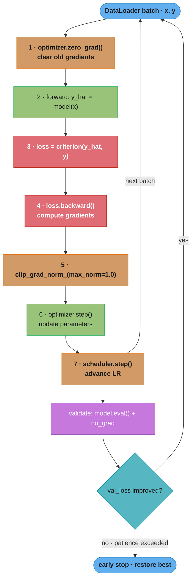
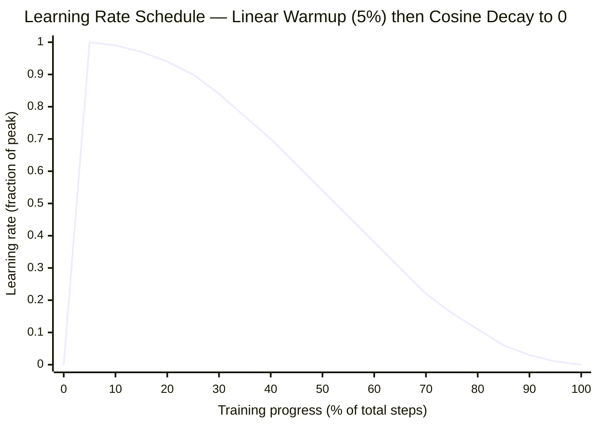
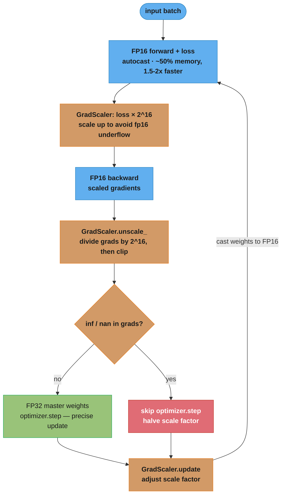
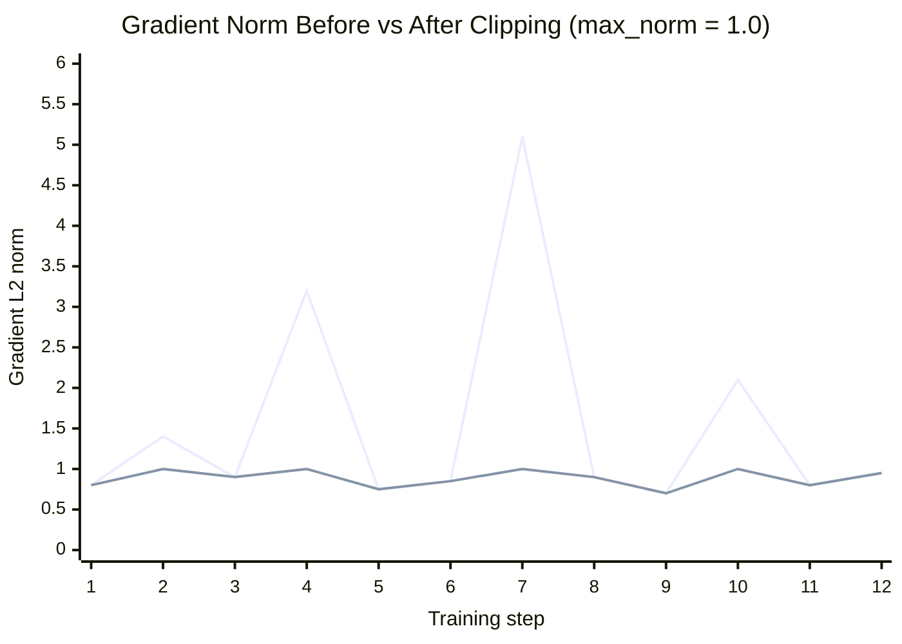

# Training Deep Networks

## 1. Concept Overview

Training a deep neural network is an iterative optimization process: compute a forward pass to get predictions, calculate the loss, backpropagate gradients, and update parameters with an optimizer. The surface of the loss landscape for modern deep networks is non-convex with many local minima, saddle points, and sharp cliffs — yet stochastic gradient descent (SGD) and its variants reliably find solutions that generalize well. The difference between a model that converges and one that explodes, underfit, or overfits often comes down to the mechanics of the training loop: learning rate schedule, regularization, gradient management, and numerical precision.

This module covers the complete production training loop with all best practices: learning rate scheduling, gradient clipping, regularization techniques, data augmentation, mixed precision training, gradient accumulation, and early stopping.

---

## 2. Intuition

One-line analogy: the training loop is a hiker descending a foggy mountain — the learning rate controls step size (too large and you walk off a cliff, too small and you never reach the valley), the schedule adjusts step size as terrain changes, and gradient clipping prevents you from sliding uncontrollably on an icy slope.

Mental model: the optimizer is not a magic box. Every hyperparameter choice — learning rate, weight decay, batch size, warmup steps — directly affects the trajectory through the loss landscape. Understanding each component lets you diagnose training failures systematically rather than by trial and error.

Why it matters: a good architecture trained poorly will lose to a mediocre architecture trained well. Google Brain's research shows that training recipe (optimizer, LR schedule, augmentation) often contributes more to final accuracy than architectural choices alone.

Key insight: learning rate is the single most important hyperparameter. A correctly scheduled LR with warmup and cosine decay can recover from many poor choices elsewhere. No amount of architectural sophistication compensates for a wildly misset learning rate.

---

## 3. Core Principles

**Stochastic Gradient Descent (SGD)**: update parameters in the direction of negative gradient computed on a mini-batch. Noise from small batches acts as regularization (helps escape sharp minima).

**Adam optimizer**: maintains per-parameter adaptive learning rates using first moment (m_t, momentum) and second moment (v_t, uncentered variance). `m_t = beta1*m_{t-1} + (1-beta1)*g_t`, `v_t = beta2*v_{t-1} + (1-beta2)*g_t^2`. Parameter update: `theta -= lr * m_t_hat / (sqrt(v_t_hat) + eps)`. Defaults: lr=0.001, beta1=0.9, beta2=0.999, eps=1e-8. AdamW adds weight decay correctly (decoupled from gradient update — not equivalent to L2 regularization in Adam).

**Learning rate scheduling**: the LR should change over training. Warmup prevents large updates when parameters are poorly initialized; decay prevents overshooting near convergence.

**Gradient clipping**: limits gradient norm before the optimizer step to prevent exploding gradients from destabilizing training.

**Stated plainly.** Backpropagation through a depth-`L` network multiplies the gradient by one Jacobian factor per layer, so the gradient reaching layer 1 is roughly `g_L * r^L`: "whatever average per-layer factor `r` your network happens to have, depth raises it to the power `L` — and anything other than exactly 1.0 becomes an exponential." That is why "vanishing" and "exploding" are the same phenomenon with the exponent pointing in opposite directions, and why the fix is always to control `r` (normalization, careful init, residual connections) or to cap the result (clipping).

| Symbol | What it is |
|--------|------------|
| `g_L` | The gradient arriving at the last layer — the healthy, un-amplified signal |
| `r` | Average per-layer multiplicative factor (roughly the Jacobian's typical singular value) |
| `L` | Network depth in layers — the exponent |
| `r^L` | Total scaling applied to the gradient by the time it reaches layer 1 |
| `r < 1` | Vanishing regime: early layers get near-zero gradient and stop learning |
| `r > 1` | Exploding regime: early layers get huge gradients, weights jump, loss goes NaN |

**Walk one example.** A 50-layer network, one factor per layer:

```
  per-layer factor r, depth L = 50, so layer 1 sees its gradient scaled by r^50

      r = 0.9   ->  0.9^50  =   0.00515      194x smaller  (vanishing)
      r = 1.0   ->  1.0^50  =   1.0          the knife edge
      r = 1.1   ->  1.1^50  = 117.39         117x larger   (exploding)

  a healthy upstream gradient of 0.01 arrives at layer 1 as:
      r = 0.9   ->  0.01 x   0.00515 = 5.15e-05
                    below fp16's smallest normal value 6.10e-05, so it lands in
                    the subnormal range and loses precision -- layer 1 barely moves
      r = 1.1   ->  0.01 x 117.39    = 1.17
                    117x the intended step -- one batch can wreck the weights

  the two factors differ by only 0.2 per layer, yet after 50 layers the paths are
  117.39 / 0.00515 = 22778x apart

  at depth 10 the same factors are nearly harmless:
      0.9^10 = 0.3487        1.1^10 = 2.5937
```

Depth is the multiplier on the problem: the identical `r` that is a rounding error at 10 layers is a training failure at 50. Clipping does not fix `r` — it only truncates the exploding side, which is why it is a safety net layered on top of normalization and good initialization, never a substitute for them.

**Regularization**: techniques that penalize model complexity to improve generalization: L2 weight decay, dropout, label smoothing, data augmentation.

**Mixed precision**: use 16-bit floats (float16 or bfloat16) for most operations, keeping a float32 master copy for parameter updates. Reduces memory ~50% and speeds up matrix multiplications on Tensor Core GPUs.

---

## 4. Types / Architectures / Strategies

**Optimizers:**

| Optimizer | Adaptive LR | Momentum | Weight Decay | Best For |
|-----------|-------------|----------|-------------|---------|
| SGD | No | Optional (0.9 typical) | Native | CV tasks with tuned LR schedule |
| Adam | Yes (per-param) | Yes (beta1=0.9) | Not decoupled | NLP, fast convergence |
| AdamW | Yes | Yes | Decoupled (correct) | Transformers, modern default |
| RMSprop | Yes | No | Optional | RNNs |
| LAMB | Yes | Yes | Yes | Large-batch distributed training |

**Learning Rate Schedules:**

| Schedule | Shape | Best For |
|----------|-------|---------|
| Linear warmup + cosine decay | Ramps up then cosine curve down | Transformers, fine-tuning |
| OneCycleLR | Triangle up then fast cosine down | Super-convergence for CNNs |
| ReduceLROnPlateau | Halve LR when val loss plateaus | When schedule isn't known upfront |
| Constant + step decay | Flat then sudden drops | Classic SGD training |
| Warmup + linear decay | Ramps then linear down | BERT-style fine-tuning |

**Regularization Techniques:**

| Technique | Mechanism | Typical Value |
|-----------|-----------|--------------|
| L2 weight decay | Penalizes large weights | 1e-4 to 1e-2 |
| Dropout | Random neuron zeroing | 0.1-0.5 depending on layer |
| Label smoothing | Softens one-hot targets | 0.1 |
| Batch size | Larger batches = less noise = less regularization | 32-256 for images |
| Early stopping | Stop when val loss stops improving | patience=10 epochs |

### Decoding Normalization and Dropout

**What this actually says.** Batch normalization computes `y = gamma * (x - mu_B) / sqrt(var_B + eps) + beta`: "measure this activation's mean and spread across the current mini-batch, squash it onto a standard mean-0 variance-1 scale, then hand the layer two learnable dials to put back whatever scale and offset it actually wants."

The two stages have opposite natures and that is the whole design: the normalize half is *fixed statistics* (no parameters, recomputed per batch), the scale-and-shift half is *learned*. Read war story 4 in Section 10 through this lens — applying weight decay to `gamma` and `beta` drags the learned dials toward 1.0 and 0.0, which is exactly the freedom the layer needs to keep.

| Symbol | What it is |
|--------|------------|
| `x` | One activation value for one channel, for one sample in the batch |
| `mu_B` | Mean of that activation across the mini-batch — the `B` means "this batch only" |
| `var_B` | Biased variance across the batch (divide by N, not N-1) |
| `eps` | Numerical floor, PyTorch default 1e-5 — stops a divide-by-zero on a constant batch |
| `x_hat` | The normalized value `(x - mu_B) / sqrt(var_B + eps)`, mean 0 and variance 1 |
| `gamma` | Learned scale dial, initialized to 1.0 — lets the layer re-widen the distribution |
| `beta` | Learned shift dial, initialized to 0.0 — lets the layer re-center the distribution |

**Walk one example.** One channel, mini-batch of 4, with `gamma = 1.5` and `beta = 0.5`:

```
  x = [2.0, 4.0, 6.0, 8.0]

  step 1  batch mean      mu_B  = (2 + 4 + 6 + 8) / 4                    = 5.0
  step 2  batch variance  var_B = (9 + 1 + 1 + 9) / 4                    = 5.0
                                  deviations are -3, -1, +1, +3
  step 3  denominator     sqrt(var_B + eps) = sqrt(5.0 + 1e-5)           = 2.23607

  step 4  normalize       x_hat = (x - 5.0) / 2.23607
              2.0  ->  -1.3416
              4.0  ->  -0.4472
              6.0  ->  +0.4472
              8.0  ->  +1.3416         mean(x_hat) = 0.0, var(x_hat) = 1.0

  step 5  scale + shift   y = 1.5 * x_hat + 0.5
             -1.3416  ->  -1.5125
             -0.4472  ->  -0.1708
             +0.4472  ->  +1.1708
             +1.3416  ->  +2.5125      mean(y) = 0.5 = beta, std(y) = 1.5 = gamma

  net effect: a batch spanning 2.0..8.0 around mean 5.0 became -1.5125..2.5125
  around mean 0.5 -- the layer downstream now sees a stable, known scale
```

Without `gamma` and `beta`, every BN layer would force its output to mean 0 and variance 1 forever, which strips the network of the ability to represent an identity mapping or to sit in a saturating region of an activation on purpose. Setting `gamma = sqrt(var_B)` and `beta = mu_B` recovers the original activations exactly, so the layer can always undo the normalization if that is what minimizes the loss. Note the `_B` subscripts: these are *batch* statistics, which is why `model.eval()` swaps in the running averages instead, and why `drop_last=True` matters — a final batch of size 1 has `var_B = 0` and produces a meaningless normalization.

**Put simply.** Inverted dropout multiplies each surviving activation by `1 / (1 - p)` during training: "delete a random `p` fraction of the units, then inflate the survivors by exactly enough that the layer's total output is unchanged on average — so inference, which drops nothing, sees the scale it was trained on."

| Symbol | What it is |
|--------|------------|
| `p` | Drop probability — the fraction of units zeroed, 0.1-0.5 in the table above |
| `1 - p` | Keep probability — the chance any given unit survives the mask |
| `mask` | Fresh Bernoulli(`1 - p`) draw per unit per forward pass, resampled every batch |
| `1 / (1 - p)` | The compensation factor applied to survivors, so `E[output]` matches the clean output |
| `model.eval()` | Turns the mask off entirely — inference is deterministic and unscaled |

**Walk one example.** A 4-unit layer with `p = 0.5`, so `1 / (1 - p) = 2.0`:

```
  TRAIN -- one sampled mask [0, 1, 0, 1]

      unit    a     mask   after mask   x 1/(1-p) = x 2.0
       u1    1.0     0        0.0            0.0
       u2    2.0     1        2.0            4.0
       u3    3.0     0        0.0            0.0
       u4    4.0     1        4.0            8.0

  averaged over all possible masks, u2 contributes:
      E[u2] = (1-p) x (2.0 x 2.0) + p x 0.0
            =  0.5  x  4.0        + 0.5 x 0.0   = 2.0   <- its clean value

  INFERENCE -- model.eval(), no mask, no scaling:  [1.0, 2.0, 3.0, 4.0]
      train-time expectation and inference output agree, unit for unit

  WITHOUT the 1/(1-p) factor at train time:
      E[u2] = 0.5 x 2.0 = 1.0     <- the next layer is calibrated on 1.0
      inference then feeds it 2.0  -- every activation doubles, and the doubling
      compounds layer over layer, so accuracy collapses the instant you eval()
```

The factor exists purely to keep train and inference statistics aligned. The alternative, "classic" dropout multiplies by `1 - p` at *inference* instead — mathematically equivalent, but it makes the deployed model pay a cost and makes the trained weights meaningless if you forget the step. PyTorch, TensorFlow, and JAX all use the inverted form so that inference is a plain forward pass.

---

## 5. Architecture Diagrams

### Complete Training Loop — One Iteration as a Cycle



The seven numbered steps must run in exactly this order every iteration: `zero_grad`
before `backward` (else stale gradients accumulate) and `optimizer.step()` before
`scheduler.step()`. The loop repeats per batch; a validation pass then feeds the
early-stopping check that either continues training or restores the best checkpoint.

### Learning Rate Schedule — Linear Warmup + Cosine Decay



The LR ramps linearly from 0 to peak over the first 5% of steps (warmup protects
cold, poorly-initialized parameters), then follows `0.5·(1 + cos(π·progress))` down
to 0 across the remaining 95%. This is the GPT-3 and BERT fine-tuning recipe: warmup
over roughly 5% of steps, cosine decay to a small final LR.

### Mixed Precision Training — FP16 Compute, FP32 Master Weights



Fast fp16 matmuls run the forward/backward pass while a precise fp32 master copy
takes the optimizer step. `GradScaler` multiplies the loss by 2^16 so small
gradients do not underflow fp16, then unscales before clipping; if any gradient is
inf/nan the step is skipped and the scale factor is halved. bfloat16 has the fp32
exponent range, so it skips the scaling dance entirely.

### Gradient Clipping — Taming Norm Spikes



The upper spiky line is the raw gradient norm; the lower line is the norm after
`clip_grad_norm_(max_norm=1.0)`, which rescales any step whose norm exceeds 1.0 back
down to 1.0. Healthy training sits in the stable 0.6-1.0 band; without clipping the
occasional spike to 3-5 (or 142, as in the failed run in the case study) destabilizes
or diverges the optimizer.

**Read it like this.** Clip-by-norm is the two-line rule `if ||g||_2 > c: g <- g * (c / ||g||_2)`: "measure how long the whole gradient vector is; if it is longer than the budget `c`, shrink every component by the same ratio so it lands exactly at `c` — and if it already fits, leave it completely alone."

The phrase "by the same ratio" is the part interviewers probe. Clipping by norm is a pure rescale, so the *direction* of the update — which parameter moves relative to which — is untouched. Only the step length changes. Clipping each element independently (`clip_grad_value_`) does not have this property: it bends the update direction and is why norm clipping is the default.

| Symbol | What it is |
|--------|------------|
| `g` | The full gradient, all parameters flattened into one long vector |
| `norm(g)` | Written `\|\|g\|\|_2` — the L2 norm `sqrt(sum of squares)`, one scalar for the whole model |
| `c` | `max_norm`, the budget — 1.0 in the diagram above and in the GPT-3 recipe |
| `c / norm(g)` | The shrink factor, always < 1 when the rule fires; identical for every component |
| `g <-` | In-place overwrite: `clip_grad_norm_`'s trailing underscore means it mutates `.grad` |

**Walk one example.** Three parameters, `max_norm = 1.0`:

```
  g = [3.0, 4.0, 12.0]

  step 1  norm       ||g|| = sqrt(3^2 + 4^2 + 12^2)
                           = sqrt(9 + 16 + 144) = sqrt(169)      = 13.0
  step 2  compare    13.0 > 1.0   -> the rule fires
  step 3  factor     c / ||g|| = 1.0 / 13.0                      = 0.076923
  step 4  rescale    g' = [3.0, 4.0, 12.0] x 0.076923
                        = [0.230769, 0.307692, 0.923077]
  step 5  verify     ||g'|| = sqrt(0.053254 + 0.094675 + 0.852071)
                            = sqrt(1.0)                          = 1.000

  the third parameter still gets 4x the step of the first (12 : 3 before,
  0.923077 : 0.230769 after) -- proportions preserved, length capped

  a normal step, g = [0.6, 0.4, 0.2]:  ||g|| = 0.74833 < 1.0 -> passes untouched

  the case study's 142 spike:  factor = 1.0 / 142 = 0.007042, an update shrunk
  142x -- effectively a skipped step, which is precisely the intent
```

Note that clipping happens *after* `loss.backward()` and *before* `optimizer.step()`, and under mixed precision it must come after `scaler.unscale_()` — clipping scaled fp16 gradients would compare a 2^16-inflated norm against `c` and clip every single step to nothing.

---

## 6. How It Works — Detailed Mechanics

### The Complete Best-Practices Training Loop

```python
import torch
import torch.nn as nn
import torch.optim as optim
from torch.cuda.amp import GradScaler, autocast
from torch.utils.data import DataLoader
from typing import Optional
import math


def train_one_epoch(
    model: nn.Module,
    loader: DataLoader,
    optimizer: optim.Optimizer,
    criterion: nn.Module,
    scaler: GradScaler,
    device: torch.device,
    gradient_accumulation_steps: int = 1,
    max_grad_norm: float = 1.0,
    epoch: int = 0,
) -> dict[str, float]:
    model.train()
    total_loss = 0.0
    total_correct = 0
    total_samples = 0
    optimizer.zero_grad()  # zero once before accumulation loop

    for step, (x, y) in enumerate(loader):
        x, y = x.to(device, non_blocking=True), y.to(device, non_blocking=True)

        # Mixed precision forward pass
        with torch.amp.autocast(device_type="cuda", dtype=torch.float16):
            logits = model(x)
            loss = criterion(logits, y)
            # Scale loss for gradient accumulation (average, not sum)
            loss = loss / gradient_accumulation_steps

        # Backward with gradient scaling
        scaler.scale(loss).backward()

        if (step + 1) % gradient_accumulation_steps == 0:
            # Unscale before clipping (scaler modifies gradients for fp16)
            scaler.unscale_(optimizer)
            grad_norm = nn.utils.clip_grad_norm_(model.parameters(), max_norm=max_grad_norm)

            # scaler.step() calls optimizer.step() only if no inf/nan gradients
            scaler.step(optimizer)
            scaler.update()
            optimizer.zero_grad()  # zero after step for accumulation

        total_loss += loss.item() * gradient_accumulation_steps  # undo scaling for logging
        preds = logits.argmax(dim=1)
        total_correct += (preds == y).sum().item()
        total_samples += y.size(0)

    return {
        "loss": total_loss / len(loader),
        "accuracy": total_correct / total_samples,
    }


@torch.no_grad()
def validate(
    model: nn.Module,
    loader: DataLoader,
    criterion: nn.Module,
    device: torch.device,
) -> dict[str, float]:
    model.eval()  # CRITICAL: disables dropout, uses BN running stats
    total_loss = 0.0
    total_correct = 0
    total_samples = 0

    for x, y in loader:
        x, y = x.to(device, non_blocking=True), y.to(device, non_blocking=True)
        with torch.amp.autocast(device_type="cuda", dtype=torch.float16):
            logits = model(x)
            loss = criterion(logits, y)
        total_loss += loss.item()
        total_correct += (logits.argmax(1) == y).sum().item()
        total_samples += y.size(0)

    return {
        "val_loss": total_loss / len(loader),
        "val_accuracy": total_correct / total_samples,
    }
```

### Learning Rate Schedules

```python
def build_scheduler(
    optimizer: optim.Optimizer,
    total_steps: int,
    warmup_fraction: float = 0.05,  # 5% of total steps for warmup
) -> torch.optim.lr_scheduler.LambdaLR:
    """Linear warmup + cosine decay — standard for Transformers and fine-tuning."""
    warmup_steps = int(total_steps * warmup_fraction)

    def lr_lambda(current_step: int) -> float:
        if current_step < warmup_steps:
            # Linear warmup: 0 -> 1
            return float(current_step) / max(1, warmup_steps)
        # Cosine decay: 1 -> 0
        progress = float(current_step - warmup_steps) / max(1, total_steps - warmup_steps)
        return max(0.0, 0.5 * (1.0 + math.cos(math.pi * progress)))

    return torch.optim.lr_scheduler.LambdaLR(optimizer, lr_lambda)


def build_one_cycle_scheduler(
    optimizer: optim.Optimizer,
    max_lr: float,
    steps_per_epoch: int,
    epochs: int,
) -> torch.optim.lr_scheduler.OneCycleLR:
    """
    OneCycleLR: ramp LR up to max_lr, then cosine down.
    Super-convergence: can train CNNs 10x faster with appropriate max_lr.
    Use torch-lr-finder to determine max_lr experimentally.
    """
    return torch.optim.lr_scheduler.OneCycleLR(
        optimizer,
        max_lr=max_lr,
        steps_per_epoch=steps_per_epoch,
        epochs=epochs,
        pct_start=0.3,        # 30% of steps for warmup phase
        anneal_strategy="cos",
        div_factor=25.0,      # initial_lr = max_lr / 25
        final_div_factor=1e4, # final_lr = initial_lr / 10000
    )
```

**What the formula is telling you.** `lr_lambda` returns a *multiplier* on the peak LR, built from two pieces glued at `warmup_steps`: the ramp `step / warmup_steps` and the decay `0.5 * (1 + cos(pi * progress))`. "For the first 5% of training climb linearly from nothing to full speed, then coast down a cosine curve that starts flat, falls fastest through the middle, and flattens again as it lands on zero."

The cosine's shape is doing deliberate work at both ends. Flat at the start means the model gets a long stretch near peak LR to explore; flat at the end means the last thousands of steps are tiny, careful refinements rather than an abrupt stop. A linear decay spends the same total LR but distributes it uniformly — which is why BERT fine-tuning (short, 3-5 epochs) uses linear and long pretraining runs use cosine.

| Symbol | What it is |
|--------|------------|
| `peak_lr` | The LR you pass to the optimizer — the multiplier's 1.0 point, 6e-4 for GPT-3 |
| `warmup_steps` | `int(total_steps * warmup_fraction)` — where the ramp ends and the cosine begins |
| `step / warmup_steps` | Warmup multiplier: 0.0 at step 0, rising linearly to 1.0 |
| `progress` | Fraction of the *post-warmup* run completed: 0.0 at peak, 1.0 at the final step |
| `cos(pi * progress)` | Sweeps +1 down to -1 across the decay phase — the shape of the curve |
| `0.5 * (1 + ...)` | Remaps that -1..+1 sweep onto a 0.0..1.0 multiplier |

**Walk one example.** GPT-3's `peak_lr = 6.0e-04` over `total_steps = 100000` with the default 5% warmup:

```
  warmup_steps = int(100000 x 0.05) = 5000

  WARMUP PHASE   mult = step / 5000
      step      0    mult = 0 / 5000    = 0.0000    lr = 0.000e+00
      step   1000    mult = 1000 / 5000 = 0.2000    lr = 1.200e-04
      step   2500    mult = 2500 / 5000 = 0.5000    lr = 3.000e-04
      step   5000    mult = 1.0000  (peak)          lr = 6.000e-04

  COSINE PHASE   progress = (step - 5000) / (100000 - 5000) = (step - 5000) / 95000
                 mult     = 0.5 x (1 + cos(pi x progress))

      step   20000   progress = 0.1579   cos =  0.8795   mult = 0.9397   lr = 5.638e-04
      step   52500   progress = 0.5000   cos =  0.0000   mult = 0.5000   lr = 3.000e-04
      step   80000   progress = 0.7895   cos = -0.7891   mult = 0.1054   lr = 6.326e-05
      step  100000   progress = 1.0000   cos = -1.0000   mult = 0.0000   lr = 0.000e+00

  read the spacing: the first 16% of the decay costs only 6% of the LR
  (1.0000 -> 0.9397), the halfway point sits at exactly 0.5000, and the last 20%
  crawls from 0.1054 to 0 -- fine-grained polish, not a cliff

  STEP DECAY for contrast (the ResNet-50 recipe: lr0 = 0.1, x0.1 at epochs 30/60/90)
      epoch  0-29    0.1 x 0.1^0  = 0.1
      epoch 30-59    0.1 x 0.1^1  = 0.01
      epoch 60-89    0.1 x 0.1^2  = 0.001
      epoch 90+      0.1 x 0.1^3  = 0.0001

  a 1000x total reduction like the cosine's tail, but delivered in three
  discontinuous jumps -- the loss curve visibly steps down at each boundary
```

The `max(1, warmup_steps)` and `max(1, total_steps - warmup_steps)` guards exist for the degenerate configs: `warmup_fraction=0` would otherwise divide by zero on step 0, and a single-step run would divide by zero in `progress`. The outer `max(0.0, ...)` matters when the scheduler is stepped past `total_steps` — floating-point drift can push `cos` marginally below -1's remap and produce a tiny negative LR, which would reverse the update direction on every remaining step.

### Gradient Accumulation for Large Effective Batch Size

```python
# Simulate batch size 1024 when GPU memory only fits 128 samples
# gradient_accumulation_steps = 1024 / 128 = 8
# Loss must be divided by accumulation steps to keep scale consistent

accumulation_steps = 8
optimizer.zero_grad()

for micro_step, (x, y) in enumerate(loader):
    with torch.amp.autocast(device_type="cuda", dtype=torch.float16):
        loss = criterion(model(x), y) / accumulation_steps  # normalize

    scaler.scale(loss).backward()  # accumulate gradients

    if (micro_step + 1) % accumulation_steps == 0:
        scaler.unscale_(optimizer)
        nn.utils.clip_grad_norm_(model.parameters(), max_norm=1.0)
        scaler.step(optimizer)
        scaler.update()
        optimizer.zero_grad()
        scheduler.step()
```

### Data Augmentation

```python
from torchvision import transforms
import torchvision.transforms.functional as TF
import torch
from torch import Tensor


# Standard augmentation for ImageNet training
train_transform = transforms.Compose([
    transforms.RandomResizedCrop(224, scale=(0.08, 1.0)),  # random crop from 224-resized
    transforms.RandomHorizontalFlip(p=0.5),
    transforms.ColorJitter(brightness=0.4, contrast=0.4, saturation=0.4, hue=0.1),
    transforms.ToTensor(),
    transforms.Normalize(mean=[0.485, 0.456, 0.406], std=[0.229, 0.224, 0.225]),
    transforms.RandomErasing(p=0.25, scale=(0.02, 0.33)),  # CutOut variant
])

# No augmentation at validation/test time — only normalization
val_transform = transforms.Compose([
    transforms.Resize(256),
    transforms.CenterCrop(224),
    transforms.ToTensor(),
    transforms.Normalize(mean=[0.485, 0.456, 0.406], std=[0.229, 0.224, 0.225]),
])


def mixup_batch(
    x: Tensor,
    y: Tensor,
    alpha: float = 0.2,
) -> tuple[Tensor, Tensor, Tensor, float]:
    """
    Mixup data augmentation: interpolates two samples linearly.
    label = lambda * y_a + (1-lambda) * y_b (soft labels)
    lambda ~ Beta(alpha, alpha); alpha=0.2 is typical.
    """
    lam = float(torch.distributions.Beta(alpha, alpha).sample())
    batch_size = x.size(0)
    index = torch.randperm(batch_size, device=x.device)
    mixed_x = lam * x + (1 - lam) * x[index]
    y_a, y_b = y, y[index]
    return mixed_x, y_a, y_b, lam


def label_smoothing_loss(
    logits: Tensor,
    targets: Tensor,
    num_classes: int,
    smoothing: float = 0.1,
) -> Tensor:
    """
    Label smoothing: replace hard 1-hot targets with:
      (1-eps) for correct class, eps/(K-1) for others.
    Prevents overconfidence; improves calibration and generalization.
    nn.CrossEntropyLoss(label_smoothing=0.1) is the simpler alternative.
    """
    confidence = 1.0 - smoothing
    smooth_val = smoothing / (num_classes - 1)
    one_hot = torch.zeros_like(logits).scatter_(1, targets.unsqueeze(1), 1)
    smooth_labels = one_hot * confidence + (1 - one_hot) * smooth_val
    log_probs = torch.log_softmax(logits, dim=1)
    return -(smooth_labels * log_probs).sum(dim=1).mean()
```

### Early Stopping

```python
class EarlyStopping:
    def __init__(self, patience: int = 10, min_delta: float = 1e-4, mode: str = "min") -> None:
        self.patience = patience
        self.min_delta = min_delta
        self.mode = mode
        self.best_score: float | None = None
        self.counter = 0
        self.should_stop = False

    def step(self, score: float) -> bool:
        """Returns True if training should stop."""
        if self.best_score is None:
            self.best_score = score
        elif self._is_improvement(score):
            self.best_score = score
            self.counter = 0
        else:
            self.counter += 1
            if self.counter >= self.patience:
                self.should_stop = True
        return self.should_stop

    def _is_improvement(self, score: float) -> bool:
        if self.mode == "min":
            return score < self.best_score - self.min_delta
        return score > self.best_score + self.min_delta
```

---

## 7. Real-World Examples

**GPT-3 training recipe**: AdamW with lr=6e-4, beta1=0.9, beta2=0.95, weight_decay=0.1. Linear warmup over 375M tokens (0.003% of 300B total), cosine decay to 10% of peak LR. Gradient clipping max_norm=1.0. Batch size 3.2M tokens (achieved via gradient accumulation across 256 A100 GPUs). Mixed precision (bfloat16 for stability over float16).

**ImageNet training (ResNet-50)**: SGD with momentum=0.9, lr=0.1, weight_decay=1e-4. LR decays by 10x at epochs 30, 60, 90. Batch size 256. Training time: ~90 epochs, ~24 hours on 4 V100s. Mixed precision cuts this to ~14 hours.

**BERT fine-tuning**: AdamW, lr=2e-5, warmup over 6% of steps, linear decay. Batch size 32. Weight decay 0.01. 3-5 epochs on downstream tasks. Label smoothing not used (BERT uses cross-entropy directly).

**Production training at Stability AI (Stable Diffusion)**: gradient accumulation across 32 A100s to simulate batch size 2048. GradScaler with initial scale 65536 (2^16). Checkpoint saving every 5000 steps (training crashed ~3 times, requiring restarts from checkpoints).

---

## 8. Tradeoffs

| Configuration | Memory | Speed | Stability | Accuracy |
|--------------|--------|-------|---------|---------|
| fp32 training | Baseline | Baseline | Best | Baseline |
| fp16 + GradScaler | ~50% less | 1.5-2x faster | Good (can have NaN) | Same |
| bf16 (Ampere+) | ~50% less | 1.5-2x faster | Best (no overflow) | Same |
| Gradient accumulation (8 steps) | Same | ~Same (I/O bound) | Same | Better (larger effective batch) |

| LR Schedule | Convergence Speed | Final Accuracy | Robustness to LR Choice |
|-------------|-----------------|---------------|------------------------|
| Constant | Fast initially | Poor | Low |
| Step decay | Good | Good | Medium |
| Cosine decay | Good | Better | Medium |
| Warmup + cosine | Best for large models | Best | High |
| OneCycleLR | Super-convergence possible | Excellent | Low (sensitive to max_lr) |

---

## 9. When to Use / When NOT to Use

**Use mixed precision when:**
- Training on Volta (V100), Turing (T4/RTX 20xx), Ampere (A100/RTX 30xx) or newer GPU
- Memory is the primary bottleneck (enables larger batches or models)
- Prefer bfloat16 on Ampere+ GPUs (wider dynamic range, no overflow risk)

**Use gradient accumulation when:**
- GPU memory limits batch size but theory or empirical results suggest larger batches help
- Training large language models or diffusion models (effective batches of thousands)

**Use warmup when:**
- Training Transformers (nearly always needed — cold parameters produce unstable updates at high LR)
- Fine-tuning pretrained models (5-10% warmup is standard)
- Warmup fraction: 5-10% of total training steps; linear warmup is standard

**Do NOT use:**
- High constant LR throughout training — always decay, especially near convergence
- SGD without momentum for Transformers — Adam/AdamW converges much faster
- label_smoothing on binary classification — CE with logits is sufficient

---

## 10. Common Pitfalls

**War story 1 — optimizer.zero_grad() called in wrong place:**
A training loop called `optimizer.zero_grad()` after `optimizer.step()`, not before `loss.backward()`. Because `zero_grad()` came after the step, it cleared gradients immediately after they were used — this seems correct. But when gradient accumulation was added (accumulating over 4 batches before stepping), the developer placed `zero_grad()` at the end of every iteration, clearing gradients before all 4 accumulation steps completed. The actual gradient used was always the last micro-batch only. Effective batch size was 1x not 4x. Fix: zero_grad at the start of the accumulation block; step and zero only every N micro-batches.

```python
# BROKEN: zero_grad at top of every iteration during accumulation
for step, (x, y) in enumerate(loader):
    optimizer.zero_grad()             # clears accumulated gradients!
    loss = criterion(model(x), y) / accum_steps
    loss.backward()
    if (step + 1) % accum_steps == 0:
        optimizer.step()

# FIX: zero_grad only at the accumulation boundary
optimizer.zero_grad()
for step, (x, y) in enumerate(loader):
    loss = criterion(model(x), y) / accum_steps
    loss.backward()
    if (step + 1) % accum_steps == 0:
        nn.utils.clip_grad_norm_(model.parameters(), 1.0)
        optimizer.step()
        optimizer.zero_grad()
```

**War story 2 — GradScaler not updated after NaN gradients:**
A training run had fp16 overflow: gradients became inf/nan for certain batches with large activations. `scaler.step()` correctly skips the optimizer update when inf/nan is detected. However, the developer also called `scheduler.step()` unconditionally. The scheduler incremented its step counter even when the optimizer did not take a step, causing LR to decay faster than intended — by epoch 5, LR was 30% lower than expected. This resulted in slower final convergence. Fix: only call `scheduler.step()` when the optimizer step actually executed (check `scaler.get_scale()` or track whether the step was skipped).

```python
# FIX: track whether optimizer actually stepped
old_scale = scaler.get_scale()
scaler.step(optimizer)
scaler.update()
new_scale = scaler.get_scale()
if old_scale == new_scale:  # scale did not decrease -> no inf/nan -> step was taken
    scheduler.step()
```

**War story 3 — Augmentation applied at validation time:**
A team applied `RandomCrop` and `RandomHorizontalFlip` in a single transform pipeline used for both train and validation loaders. Validation accuracy fluctuated by +-3% across runs depending on which random crops were applied. The model appeared to stop improving at epoch 12 based on one run but improved until epoch 20 in another. Early stopping triggered prematurely. Fix: separate transforms for train (augmented) and val (deterministic center crop + normalize only).

**War story 4 — Weight decay applied to bias and BatchNorm parameters:**
A training run applied AdamW weight decay to all parameters including bias terms and BatchNorm's gamma/beta. This is incorrect: weight decay penalizes the magnitude of all parameters, including BatchNorm scale parameters that should be free to take any value for normalization. The BatchNorm layers struggled to learn proper scale factors, degrading validation accuracy by ~1.5% on ImageNet. Fix: exclude bias and normalization parameters from weight decay using parameter groups.

```python
def get_optimizer_groups(
    model: nn.Module, weight_decay: float = 1e-4
) -> list[dict]:
    """Exclude bias, BN weight/bias from weight decay — standard best practice."""
    decay_params, no_decay_params = [], []
    for name, param in model.named_parameters():
        if not param.requires_grad:
            continue
        if param.ndim <= 1 or name.endswith(".bias"):
            no_decay_params.append(param)  # bias, BN params (1D)
        else:
            decay_params.append(param)     # weight matrices (2D+)
    return [
        {"params": decay_params,    "weight_decay": weight_decay},
        {"params": no_decay_params, "weight_decay": 0.0},
    ]

optimizer = optim.AdamW(get_optimizer_groups(model, weight_decay=1e-4), lr=1e-3)
```

---

## 11. Technologies & Tools

| Tool | Purpose |
|------|---------|
| `torch.amp.autocast` | Automatic mixed precision context manager |
| `torch.cuda.amp.GradScaler` | Gradient scaling for fp16 stability |
| `torch.optim.AdamW` | Decoupled weight decay optimizer (standard for Transformers) |
| `torch.optim.lr_scheduler` | Built-in LR schedulers (OneCycleLR, CosineAnnealingLR, etc.) |
| `torch.nn.utils.clip_grad_norm_` | Gradient norm clipping |
| `torchmetrics` | Standard metric implementations (accuracy, F1, AUROC) |
| Weights & Biases (`wandb`) | Experiment tracking, LR curves, gradient histograms |
| TensorBoard | Loss curves, learning rate visualization |
| `torch.compile` (PyTorch 2.0+) | Graph compilation for 1.5-2x training speedup |
| `torch.utils.data.DataLoader` | `num_workers=4`, `pin_memory=True`, `persistent_workers=True` |

Key DataLoader settings for GPU training:
```python
loader = DataLoader(
    dataset,
    batch_size=256,
    shuffle=True,
    num_workers=4,           # parallel data loading (typical: 4-8)
    pin_memory=True,         # page-lock host memory for faster H->D transfer
    persistent_workers=True, # keep worker processes alive between epochs
    prefetch_factor=2,       # each worker prefetches 2 batches ahead
    drop_last=True,          # drop final incomplete batch (important for BatchNorm)
)
```

---

## 12. Interview Questions with Answers

**Q: What is the correct order of operations in a training iteration?**
The correct order is: (1) `optimizer.zero_grad()` — clear accumulated gradients from the previous step; (2) `model(x)` — forward pass to compute predictions; (3) `criterion(output, y)` — compute scalar loss; (4) `loss.backward()` — compute gradients via backpropagation; (5) `clip_grad_norm_` (optional but recommended) — clip gradient norm; (6) `optimizer.step()` — update parameters using gradients; (7) `scheduler.step()` — advance LR schedule. Calling `zero_grad` after `backward` but before `step` discards computed gradients. Calling `step` before `backward` uses stale gradients from the previous iteration.

**Q: What is Adam and how does it differ from SGD?**
Adam (Adaptive Moment Estimation) maintains per-parameter adaptive learning rates by tracking the first moment (exponential moving average of gradients, beta1=0.9) and second moment (exponential moving average of squared gradients, beta2=0.999). The update divides the gradient by the square root of the second moment plus epsilon (eps=1e-8), effectively normalizing each parameter's update by its historical gradient magnitude. Parameters with consistent large gradients get smaller effective LRs; rare-but-important parameters get larger effective updates. SGD uses the same LR for all parameters. Adam converges faster and requires less LR tuning, but SGD + momentum often achieves slightly better final accuracy on computer vision tasks with careful tuning.

**Q: What is learning rate warmup and why is it important?**
Warmup linearly increases the LR from near-zero to the target LR over the first 5-10% of training steps. At initialization, parameters are random and the loss landscape is steep and unstable. A large LR at this stage causes large, noisy gradient steps that can push parameters into poor regions of the loss landscape from which recovery is slow. Warmup gives the optimizer a chance to orient itself with small, conservative steps before taking larger ones. It is especially critical for Transformers: without warmup, Adam's adaptive learning rates are poorly calibrated (the second moment estimate is initialized to zero and converges over many steps), causing the effective LR to be much larger than intended in early iterations.

**Q: How does mixed precision training work and what are its benefits?**
Mixed precision uses 16-bit floats (float16 or bfloat16) for the forward and backward passes (matrix multiplications, activations, gradients), while maintaining a float32 master copy of parameters for the optimizer update. Benefits: ~50% memory reduction (fp16 tensors are half the size of fp32), 1.5-2x throughput speedup on Tensor Core GPUs (which have 2-8x higher throughput for fp16 matmul vs fp32), and larger effective batch sizes. Risk: fp16 has a smaller dynamic range (max ~65504) than fp32, so gradients can overflow to inf or underflow to 0. GradScaler addresses this by multiplying the loss by a large scale factor (typically 2^16 = 65536) before backward, then unscaling gradients before the optimizer step. bfloat16 (Ampere+ GPUs) has the same range as fp32 with lower precision, avoiding overflow entirely.

**Q: What is gradient accumulation and when would you use it?**
Gradient accumulation simulates a larger effective batch size by accumulating gradients over multiple forward/backward passes before calling `optimizer.step()`. If GPU memory fits only 32 samples but you want an effective batch size of 256, set accumulation_steps=8 and divide the loss by 8 at each micro-step. After 8 micro-steps, call step() and zero_grad(). The parameter update is mathematically identical to a single 256-sample batch. Use it when training large models (LLMs, diffusion models) where even a single example barely fits in GPU memory, or when theory indicates larger batches improve convergence (as in distributed training parity).

**Q: What is the difference between L2 weight decay in Adam vs AdamW?**
In standard Adam with L2 regularization, the regularization gradient (lambda * theta) is added to the gradient before computing the adaptive update. Because the adaptive update divides by the second moment estimate, the effective weight decay is scaled by the per-parameter learning rate, making it stronger for parameters with small gradients and weaker for those with large gradients. AdamW (decoupled weight decay) adds weight decay directly to the parameter after the adaptive gradient update: `theta -= lr * (adaptive_update + lambda * theta)`. This is the mathematically correct implementation and consistently outperforms L2 Adam on Transformer models. Always prefer AdamW over Adam + L2 for modern deep learning.

**Q: What is label smoothing and what problem does it solve?**
Label smoothing replaces the hard 1-hot target vector with soft targets: `(1-eps)` for the correct class and `eps/(K-1)` for all others (typical eps=0.1). It prevents the model from becoming overconfident — cross-entropy loss with hard targets pushes logits to +infinity for the correct class, which saturates softmax and makes the model poorly calibrated. Label smoothing provides a calibration benefit (predicted probabilities better reflect true uncertainty) and a slight accuracy improvement by acting as regularization. It is standard in image classification (Inception-v3+, EfficientNet training recipes) and machine translation (Transformer original paper). Do not use it for knowledge distillation (which uses soft teacher labels as targets) or tasks where 100% confidence is correct.

**Q: How does OneCycleLR differ from cosine annealing and when would you use each?**
OneCycleLR ramps LR from a low value up to max_lr (typically over 30% of training) then decays via cosine to a very low final LR. The rising phase can enable "super-convergence" — reaching good accuracy in 1/10 the usual epochs when max_lr is correctly calibrated (found via LR range test). Cosine annealing simply decays the LR from start to end following a cosine curve, often combined with linear warmup. Use OneCycleLR for CNNs on image tasks when training time is constrained and you are willing to tune max_lr via the LR finder. Use warmup + cosine for Transformers and fine-tuning tasks where training is less sensitive to max_lr and standard recipes exist.

**Q: What is the effect of batch size on training dynamics?**
Larger batches produce more accurate gradient estimates (lower variance) but reduce the implicit regularization from SGD noise, often leading to models that generalize worse (sharp minima). The linear scaling rule states: if batch size increases by k, multiply LR by k to maintain training dynamics. In practice, this rule breaks down for very large batches (> 8192). Warmup becomes even more important at large batch sizes. Small batches (32-64) provide stronger regularization via noise, which can improve final accuracy at the cost of slower convergence per epoch. For Transformers, batch size (in tokens) of 256K-2M is common in pretraining; fine-tuning uses 16-128 samples.

**Q: What is early stopping and what are the tradeoffs of different patience values?**
Early stopping terminates training when validation loss has not improved by more than `min_delta` for `patience` consecutive epochs. Low patience (5) stops training quickly but may terminate before the model reaches its best generalization — val loss often plateaus then improves again after the optimizer escapes a local plateau. High patience (20) wastes compute on a potentially overfit model. Typical values: patience=10 for image classification (epochs are fast), patience=5 for large-model fine-tuning (epochs are slow). Save the best checkpoint (by val loss, not by final weights) and restore it after early stopping triggers. Monitor val loss, not train loss — the model is early-stopped based on generalization performance.

**Q: What DataLoader settings matter most for GPU training performance?**
`num_workers` controls how many parallel CPU processes load and preprocess data while the GPU is computing. Setting num_workers=0 means the main process loads data, causing the GPU to wait. num_workers=4 is typical — a rule of thumb is 2-4x the number of GPUs. `pin_memory=True` pre-allocates the host-side tensor in page-locked (pinned) memory, enabling faster CPU-to-GPU transfers via DMA. `persistent_workers=True` keeps worker processes alive between epochs (avoids the overhead of spawning workers per epoch, which can take 30+ seconds for large num_workers). `prefetch_factor=2` (default) means each worker prefetches 2 batches ahead of the current batch, keeping the data pipeline full.

**Q: How do you implement gradient checkpointing and what is the tradeoff?**
Gradient checkpointing (`torch.utils.checkpoint.checkpoint`) trades memory for compute. Instead of storing all intermediate activations during the forward pass (needed for backward), only selected "checkpoint" activations are stored. During backward, the missing intermediate activations are recomputed from the nearest checkpoint. This reduces activation memory by ~sqrt(N) for a model with N layers (storing every sqrt(N)-th activation). The cost is ~33% more forward compute (one extra partial forward pass during backward). Use gradient checkpointing when training very deep models or large batch sizes that would otherwise OOM. In Transformers, it is applied per-layer: `nn.utils.checkpoint.checkpoint(layer, x)`.

**Q: Why is gradient clipping used and what problem does it solve?**
Gradient clipping caps the gradient norm before the optimizer step to prevent exploding gradients from destabilizing or diverging training. `clip_grad_norm_(max_norm=1.0)` computes the global L2 norm across all parameters and, if it exceeds max_norm, rescales every gradient by `max_norm / total_norm` so the update direction is preserved but its magnitude is bounded. Exploding gradients are common in RNNs (long backprop chains), Transformers early in training, and any run with a loss spike — a single step with norm 142 (vs a healthy 0.6-1.0) can push parameters into a bad region from which recovery is slow or impossible. max_norm=1.0 is the standard default for Transformers; clip-by-value is a cruder alternative that distorts the update direction.

**Q: How do you debug a training run that suddenly produces NaN loss?**
Check for fp16 gradient overflow, division by zero (e.g., in normalization), log or sqrt of non-positive numbers, and an overly high learning rate. Systematic steps: (1) enable `torch.autograd.set_detect_anomaly(True)` to locate the offending op; (2) log the gradient norm each step — a spike to inf just before the NaN points to overflow, fixed by GradScaler (fp16) or switching to bfloat16; (3) reduce the LR or add warmup if the loss explodes early; (4) inspect the data for NaN/inf inputs or labels; (5) verify loss functions guard against log(0) with an eps. fp16 without a GradScaler is the single most common cause — gradients overflow the fp16 max of 65504 and become inf, then NaN propagates to every parameter.

**Q: Why should you exclude bias and normalization parameters from weight decay?**
Weight decay should penalize weight matrices, not bias terms or BatchNorm/LayerNorm scale and shift parameters, which need freedom to represent any value. Decaying a BatchNorm gamma toward zero fights the layer's job of rescaling normalized activations, and decaying biases shifts the function for no regularization benefit. In practice you build two parameter groups — one with weight_decay for tensors with ndim >= 2 (weight matrices), one with weight_decay=0.0 for 1D params (bias, norm gamma/beta). Skipping this degraded ImageNet validation accuracy by ~1.5% in one production run; it is standard in every modern recipe (GPT, ViT, ResNet).

**Q: How do you diagnose overfitting during training?**
Overfitting shows as a widening gap between a still-decreasing training loss and a rising or plateaued validation loss. Monitor both curves every epoch: while they track together the model is still learning generalizable structure; once train loss keeps dropping but val loss turns upward, the model is memorizing training noise. Remedies in order of typical impact: more or stronger data augmentation, weight decay, dropout, early stopping (restore the best-val checkpoint), and reducing model capacity. A large train-val gap with high train accuracy signals overfitting; both metrics being poor signals underfitting (need more capacity, longer training, or a higher LR).

**Q: Does early stopping replace regularization like weight decay and dropout?**
No — early stopping and explicit regularization are complementary; early stopping limits how long you fit, while weight decay and dropout shape what you fit. Early stopping is a form of implicit regularization (it caps the effective number of optimization steps, keeping weights closer to their small initialization), but it does not constrain the model's capacity at any given step. Weight decay penalizes large weights throughout training and dropout forces redundant representations — both change the loss landscape, not just where you stop on it. Production recipes use all three together: weight decay 1e-4 to 1e-2, dropout 0.1-0.5, and early stopping with patience 10 as a compute-saving safety net.

**Q: Why does data augmentation improve generalization?**
Augmentation synthesizes new label-preserving training examples (crops, flips, color jitter, mixup), enlarging the effective dataset and teaching invariances. A model that sees each image at many crops, flips, and lighting conditions cannot memorize pixel-exact patterns, so it learns features that transfer to unseen data — directly reducing the train-val gap. Augmentations must be label-preserving: a horizontal flip is fine for natural images but wrong for a digit 6/9 or text. Apply it only to the training set, never to validation or test; mixup/CutMix additionally soften labels, which regularizes like label smoothing.

**Q: When should you use bfloat16 instead of float16 for training?**
Prefer bfloat16 on Ampere or newer GPUs because it shares fp32's 8-bit exponent range, avoiding the gradient overflow/underflow that forces fp16 to use a GradScaler. float16 has only 5 exponent bits (max ~65504, min normal ~6e-5), so small gradients underflow to zero and large ones overflow to inf — the reason GradScaler multiplies the loss by 2^16. bfloat16 trades mantissa precision (7 bits vs fp16's 10) for that wider range; the lower precision is harmless because SGD tolerates gradient noise. Use fp16 + GradScaler only on older hardware (V100/T4) that lacks bf16 support; on A100/H100 bf16 is the default for LLM and large-model training.

**Q: How do you make training reproducible and resume correctly from a checkpoint?**
Seed all RNGs (Python, NumPy, torch, CUDA), set deterministic algorithms, and save the optimizer, scheduler, scaler, and RNG state alongside the model weights. A checkpoint with only `model.state_dict()` loses the Adam first/second moments, the LR scheduler step count, and the GradScaler scale factor — resuming without them restarts warmup and re-accumulates optimizer momentum, adding ~500 wasted steps and a visible loss bump. Full determinism also needs `torch.use_deterministic_algorithms(True)`, fixed DataLoader worker seeds (`worker_init_fn`), and `cudnn.deterministic=True` (which can cost throughput). Exact bit-reproducibility across different GPU counts or library versions is generally unachievable — save enough state to resume seamlessly rather than to reproduce byte-for-byte.

---

## 13. Best Practices

- Use AdamW, not Adam, for all Transformer and modern network training. Correct weight decay matters.
- Exclude bias and normalization parameters (BatchNorm gamma/beta) from weight decay using parameter groups.
- Always use learning rate warmup for Transformers (5-10% of steps) and for large-batch training of any architecture.
- Mixed precision is the default for any GPU training — use `torch.amp.autocast` + `GradScaler` for fp16, or just autocast with bfloat16 on Ampere+ GPUs.
- Set DataLoader `num_workers=4`, `pin_memory=True`, `persistent_workers=True` — these settings routinely double training throughput by eliminating the data loading bottleneck.
- Monitor gradient norms every N steps — log the value returned by `clip_grad_norm_` before clipping. Consistently large norms indicate architectural or LR issues; values near or below max_norm indicate healthy training.
- Use `drop_last=True` in DataLoader for training — the final batch may be much smaller, causing BatchNorm to compute unreliable statistics and creating a LR schedule artifact.
- Save checkpoints every K epochs (not just the best) — training crashes happen; a checkpoint from 20 epochs ago is better than starting over.
- Use `torch.compile` (PyTorch 2.0+) on stable training loops for 1.5-2x free speedup: `model = torch.compile(model)`.
- Apply augmentation only to training data, never to validation or test data.

---

## 14. Case Study

**Scenario:** A research lab fine-tunes a 7B-parameter LLaMA-3 on 40B tokens of domain-specific instruction data using 8 A100-80GB GPUs. The first training attempt with fp16 and standard Adam fails at step 1,800 with NaN loss; the second attempt with fp32 takes 9 days and $28,000 in compute. The goal: use bf16 mixed precision, gradient checkpointing, gradient accumulation, and proper normalisation to achieve convergence in under 48 hours ($7,200 compute cost) with perplexity <= 2.95 on a held-out validation set.

**Architecture:**
```
8x A100 80GB (DDP via PyTorch FSDP, ZeRO Stage 2)
  Per-GPU memory budget: 80GB
  Model weights (bf16): 14 GB
  Gradient checkpointing: reduces activation memory 10x -> 2.1 GB
  Optimizer state (fp32 AdamW, FSDP sharded): 8 GB per GPU
  Activations (with checkpointing): 2.1 GB
  Buffer/workspace: 8 GB
  Total: ~34 GB -> 46 GB headroom for batch size scaling
         |
         v
Training Configuration
  Global batch: 4 seq/GPU * 8 GPU * 8 accum = 256 seq = 1.05M tokens/step
  Sequence length: 4096 tokens
  Steps: ~38,000 for 40B tokens at 1.05M tokens/step
  Warmup: 2,000 steps (5.3%), cosine decay to 10% of peak LR
  Peak LR: 3e-4, weight decay: 0.1, gradient clip: 1.0
```

**Step-by-step implementation:**

```python
from __future__ import annotations
import torch
import torch.nn as nn
from torch.distributed.fsdp import FullyShardedDataParallel as FSDP
from torch.distributed.fsdp.fully_sharded_data_parallel import (
    CPUOffload, MixedPrecision, BackwardPrefetch, ShardingStrategy,
)
from torch.utils.checkpoint import checkpoint
from torch.optim import AdamW
import math

def get_mixed_precision_policy() -> MixedPrecision:
    """bf16 for compute, fp32 for reduction operations."""
    return MixedPrecision(
        param_dtype=torch.bfloat16,
        reduce_dtype=torch.float32,     # fp32 all-reduce to avoid gradient underflow
        buffer_dtype=torch.bfloat16,
    )

def wrap_model_with_fsdp(model: nn.Module, device: torch.device) -> FSDP:
    return FSDP(
        model,
        sharding_strategy=ShardingStrategy.SHARD_GRAD_OP,   # ZeRO Stage 2
        mixed_precision=get_mixed_precision_policy(),
        backward_prefetch=BackwardPrefetch.BACKWARD_PRE,    # prefetch next shard
        cpu_offload=CPUOffload(offload_params=False),        # keep params on GPU
        device_id=device,
    )

class GradientCheckpointedTransformerBlock(nn.Module):
    """Wrap transformer blocks with activation checkpointing to reduce memory 10x."""
    def __init__(self, block: nn.Module) -> None:
        super().__init__()
        self.block = block

    def forward(self, *args, **kwargs) -> torch.Tensor:
        # During forward pass: discard activations, recompute during backward
        # Trades ~40% compute for 10x memory reduction in activations
        return checkpoint(self.block, *args, use_reentrant=False, **kwargs)

def enable_gradient_checkpointing(model: nn.Module) -> None:
    """Apply gradient checkpointing to all transformer decoder layers."""
    for layer in model.model.layers:   # LLaMA-style architecture
        layer.__class__ = type(
            "CheckpointedLayer",
            (GradientCheckpointedTransformerBlock,),
            {},
        )
    print(f"Gradient checkpointing enabled for {len(model.model.layers)} layers")
```

```python
from contextlib import contextmanager
import torch.distributed as dist

class TrainingEngine:
    def __init__(
        self,
        model: FSDP,
        optimizer: AdamW,
        scheduler,
        gradient_accumulation_steps: int = 8,
        max_grad_norm: float = 1.0,
        device: torch.device = torch.device("cuda"),
    ) -> None:
        self.model = model
        self.optimizer = optimizer
        self.scheduler = scheduler
        self.gradient_accumulation_steps = gradient_accumulation_steps
        self.max_grad_norm = max_grad_norm
        self.device = device
        self.global_step = 0
        self._loss_scale_history: list[float] = []

    def train_micro_step(
        self,
        input_ids: torch.Tensor,
        labels: torch.Tensor,
        is_last_accumulation_step: bool,
    ) -> float:
        input_ids = input_ids.to(self.device)
        labels = labels.to(self.device)

        # Use autocast for bf16 mixed precision
        with torch.cuda.amp.autocast(dtype=torch.bfloat16):
            outputs = self.model(input_ids=input_ids, labels=labels)
            loss = outputs.loss / self.gradient_accumulation_steps

        # No GradScaler needed for bf16 (sufficient dynamic range)
        loss.backward()

        if is_last_accumulation_step:
            grad_norm = self._optimizer_step()
            self.global_step += 1
            return float(grad_norm)
        return 0.0

    def _optimizer_step(self) -> float:
        # FSDP handles unsharding before clip_grad_norm_
        grad_norm = torch.nn.utils.clip_grad_norm_(
            self.model.parameters(), self.max_grad_norm
        )
        if torch.isnan(grad_norm) or torch.isinf(grad_norm):
            # Skip this step to avoid corrupting weights
            self.optimizer.zero_grad(set_to_none=True)
            if dist.get_rank() == 0:
                print(f"WARNING: grad_norm={grad_norm:.4f} at step {self.global_step}; skipping step")
            return float(grad_norm)

        self.optimizer.step()
        self.scheduler.step()
        self.optimizer.zero_grad(set_to_none=True)
        return float(grad_norm)

    def validate(self, val_loader) -> float:
        self.model.eval()
        total_loss = 0.0
        n_batches = 0
        with torch.no_grad():
            for input_ids, labels in val_loader:
                with torch.cuda.amp.autocast(dtype=torch.bfloat16):
                    outputs = self.model(input_ids=input_ids.to(self.device),
                                        labels=labels.to(self.device))
                total_loss += float(outputs.loss)
                n_batches += 1
        self.model.train()
        val_loss = total_loss / n_batches
        return math.exp(min(val_loss, 20))   # perplexity
```

```python
import numpy as np
from collections import deque

class TrainingDiagnostics:
    """Monitor training health: loss, gradient norm, learning rate, NaN detection."""

    def __init__(self, window_size: int = 100) -> None:
        self.loss_history: deque[float] = deque(maxlen=window_size)
        self.grad_norm_history: deque[float] = deque(maxlen=window_size)
        self.nan_steps: list[int] = []

    def record(self, step: int, loss: float, grad_norm: float, lr: float) -> dict[str, float]:
        self.loss_history.append(loss)
        self.grad_norm_history.append(grad_norm)

        if not np.isfinite(loss):
            self.nan_steps.append(step)

        metrics = {
            "loss": loss,
            "perplexity": math.exp(min(loss, 20)),
            "grad_norm": grad_norm,
            "lr": lr,
            "loss_rolling_mean": float(np.mean(self.loss_history)),
            "grad_norm_rolling_mean": float(np.mean(self.grad_norm_history)),
            "grad_norm_spike": grad_norm > 5 * float(np.mean(self.grad_norm_history) + 1e-8),
            "loss_spike": loss > 3 * float(np.mean(self.loss_history) + 1e-8),
        }
        return metrics

    def should_restart_from_checkpoint(self) -> bool:
        """Detect divergence: if rolling loss increases for 500 consecutive steps."""
        if len(self.loss_history) < 200:
            return False
        recent = list(self.loss_history)[-200:]
        older = list(self.loss_history)[-400:-200]
        return float(np.mean(recent)) > float(np.mean(older)) * 1.15   # 15% increase
```

**Key pitfalls (3 with BROKEN->FIX):**

**Pitfall 1 - fp16 training without GradScaler causes NaN loss from gradient underflow:**
```python
# BROKEN: bf16/fp16 without loss scaling; gradients for small learning signal underflow to 0
with torch.cuda.amp.autocast(dtype=torch.float16):
    loss = model(input_ids, labels).loss
loss.backward()   # gradients for embeddings are O(1e-7), below fp16 min_normal 6e-5 -> zero
optimizer.step()  # parameters don't update; model stagnates, then diverges at step 1800

# FIX option A: use bfloat16 (same exponent range as fp32; no underflow at same magnitude)
with torch.cuda.amp.autocast(dtype=torch.bfloat16):
    loss = model(input_ids, labels).loss
loss.backward()   # bf16 min_normal = 1.175e-38; gradients never underflow

# FIX option B: if fp16 required (e.g., older hardware), use GradScaler
scaler = torch.cuda.amp.GradScaler()
with torch.cuda.amp.autocast(dtype=torch.float16):
    loss = model(input_ids, labels).loss
scaler.scale(loss).backward()
scaler.unscale_(optimizer)
torch.nn.utils.clip_grad_norm_(model.parameters(), 1.0)
scaler.step(optimizer)
scaler.update()
```

**Pitfall 2 - Gradient checkpointing with use_reentrant=True causes silent autograd graph corruption in FSDP:**
```python
# BROKEN: use_reentrant=True (PyTorch default before 2.0) is incompatible with
# FSDP and custom autograd functions; causes hooks to fire twice, doubling gradients
output = checkpoint(layer, x, use_reentrant=True)   # default
# In FSDP with gradient hooks, some gradients are applied twice -> 2x learning rate effectively
# Gradients for Q/K/V projections in attention diverge at step ~3000

# FIX: use_reentrant=False (required with FSDP, torch.compile, and custom autograd)
output = checkpoint(layer, x, use_reentrant=False)   # explicit, FSDP-safe
# Also required: pass deterministic=True when using PyTorch Lightning or accelerate
```

**Pitfall 3 - Zero-initialising all parameters causes symmetry breaking failure in LayerNorm and attention:**
```python
# BROKEN: initialising all weights to zero; all neurons in a layer learn identical representations
# Standard PyTorch default avoids this for Linear, but custom code may accidentally zero-init
for module in model.modules():
    if hasattr(module, "weight"):
        nn.init.zeros_(module.weight)   # catastrophic: all attention heads identical
# Loss stagnates at log(vocab_size)=10.8 nats for 500 steps, then fails to improve

# FIX: use model-appropriate initialisation (Kaiming for ReLU, Xavier for sigmoid/tanh)
for name, module in model.named_modules():
    if isinstance(module, nn.Linear):
        nn.init.normal_(module.weight, mean=0.0, std=0.02 / math.sqrt(2 * n_layers))
        # Residual scaling: 1/sqrt(2L) prevents variance explosion at depth
        if module.bias is not None:
            nn.init.zeros_(module.bias)
    elif isinstance(module, nn.LayerNorm):
        nn.init.ones_(module.weight)    # gamma=1: identity normalisation at init
        nn.init.zeros_(module.bias)     # beta=0
```

**Metrics and results:**

| Metric | fp32 Adam | fp16 + Adam (failed) | bf16 + AdamW + checkpointing |
|---|---|---|---|
| Training time (40B tokens) | 9 days | Failed at step 1800 | 44 hr |
| Compute cost (8xA100 @ $4/hr) | $28,800 | $1,440 (wasted) | $7,040 |
| Peak GPU memory per device | 78 GB | 41 GB | 34 GB |
| Validation perplexity | 2.91 | N/A (NaN) | 2.88 |
| Gradient norm (stable range) | 0.6-1.0 | Exploded 142 | 0.7-0.95 |
| NaN loss incidents | 0 | 1 (fatal) | 0 |
| Tokens/second throughput | 180K | 310K | 820K |
| FSDP communication overhead | N/A | N/A | 12% |
| Checkpoint size | 56 GB | N/A | 14 GB (bf16) |

**Interview discussion points:**

**Why is bfloat16 preferred over float16 for LLM training despite having lower precision?** Float16 has 5 exponent bits (range 6e-5 to 65,504) and 10 mantissa bits (relative precision ~0.1%). Bfloat16 has 8 exponent bits (range 1.2e-38 to 3.4e38, same as fp32) and 7 mantissa bits (~0.8% precision). The critical failure mode for LLM training is gradient underflow: embedding gradients can be O(1e-6) to O(1e-8), which rounds to zero in fp16 (minimum normal = 6e-5) but is representable in bf16 (minimum normal = 1.2e-38). The lower mantissa precision of bf16 versus fp16 has negligible impact because SGD-based training is robust to gradient noise at this level.

**What is gradient checkpointing and what is its exact memory-time tradeoff?** Gradient checkpointing (activation checkpointing) discards intermediate activations during the forward pass and recomputes them during the backward pass by running the forward pass again for each checkpointed segment. For a transformer with L layers, standard training stores O(L * seq_len * hidden_dim) activations; gradient checkpointing stores O(sqrt(L) * seq_len * hidden_dim) by checkpointing at every sqrt(L) layers. This reduces activation memory from 21 GB to 2.1 GB for 7B LLaMA-3 at seq_len=4096, at the cost of ~33% more compute (one extra forward pass worth of computation per backward pass).

**How does FSDP ZeRO Stage 2 reduce memory and what is the communication cost?** ZeRO Stage 2 shards gradient tensors and optimizer states across all 8 GPUs, while keeping parameters replicated. For 7B parameters: fp32 optimizer state (Adam first and second moment) = 56 GB total, sharded to 7 GB per GPU. Gradient sharding reduces peak gradient memory from 14 GB to 1.75 GB per GPU. The communication cost is two all-reduce operations per step (one forward parameter broadcast, one backward gradient all-reduce), adding approximately 12% wall-clock overhead at 8xA100 interconnected via NVLink (600 GB/s). ZeRO Stage 3 also shards parameters, further reducing memory but doubling communication overhead to ~24%.

**What is the residual stream initialisation scaling (1/sqrt(2L)) and why is it necessary for deep transformers?** In a transformer with L residual blocks, each block adds its output to the residual stream: x_{l+1} = x_l + f_l(x_l). If each f_l has weight variance sigma^2, the variance of the residual stream after L layers is approximately L * sigma^2 (assuming independence). For L=32 layers, variance explodes by 32x, causing the softmax attention and LayerNorm to receive inputs with variance far outside the trained range. Scaling each residual block's output projection by 1/sqrt(2L) ensures the residual stream variance stays O(1) at initialisation regardless of depth, stabilising training for the first 500 steps when gradients are largest.

**How would you debug a training run that shows increasing loss after 15,000 steps?** Follow a systematic diagnosis: (1) check if the LR schedule is decaying correctly - a bug where cosine decay overshoots to negative LR would cause increasing loss; (2) plot gradient norm over time - if norm suddenly increases, the model has entered a loss landscape region with large gradients suggesting a data quality issue (corrupted batch); (3) examine validation loss separately from training loss - if training loss increases but validation is stable, a data pipeline issue is introducing bad training batches; (4) compare checkpoint at step 14,000 versus 16,000 parameter norms per layer - if specific layers' norms explode while others are stable, the issue is layer-specific (often the output projection or embedding layers); (5) rerun with loss logging per sample to identify specific training examples causing loss spikes.

**What is the correct way to save and resume FSDP training without state dict inconsistencies?** FSDP's default local_state_dict stores each GPU's shard separately, requiring the same number of GPUs to resume. The correct approach is to use FSDP's full_state_dict context manager to consolidate all shards to rank-0 before saving: with FSDP.state_dict_type(model, StateDictType.FULL_STATE_DICT). This saves a single checkpoint loadable on any number of GPUs. For 7B bf16 parameters, the consolidated checkpoint is 14 GB. When resuming, load the full state dict to rank-0 and use FSDP's scatter mechanism to distribute shards. Always save optimizer state alongside model state - resuming without optimizer state (Adam moments) extends warmup by ~500 steps as moments rebuild from scratch.
