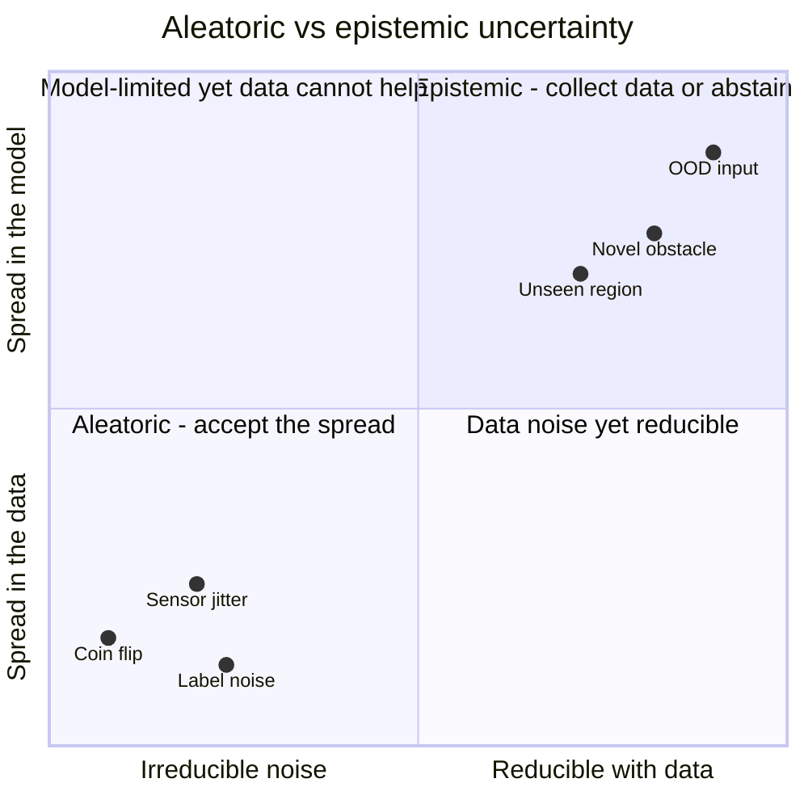
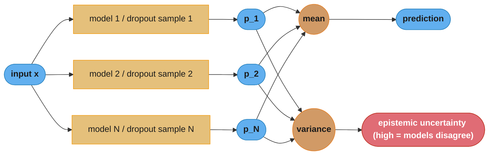
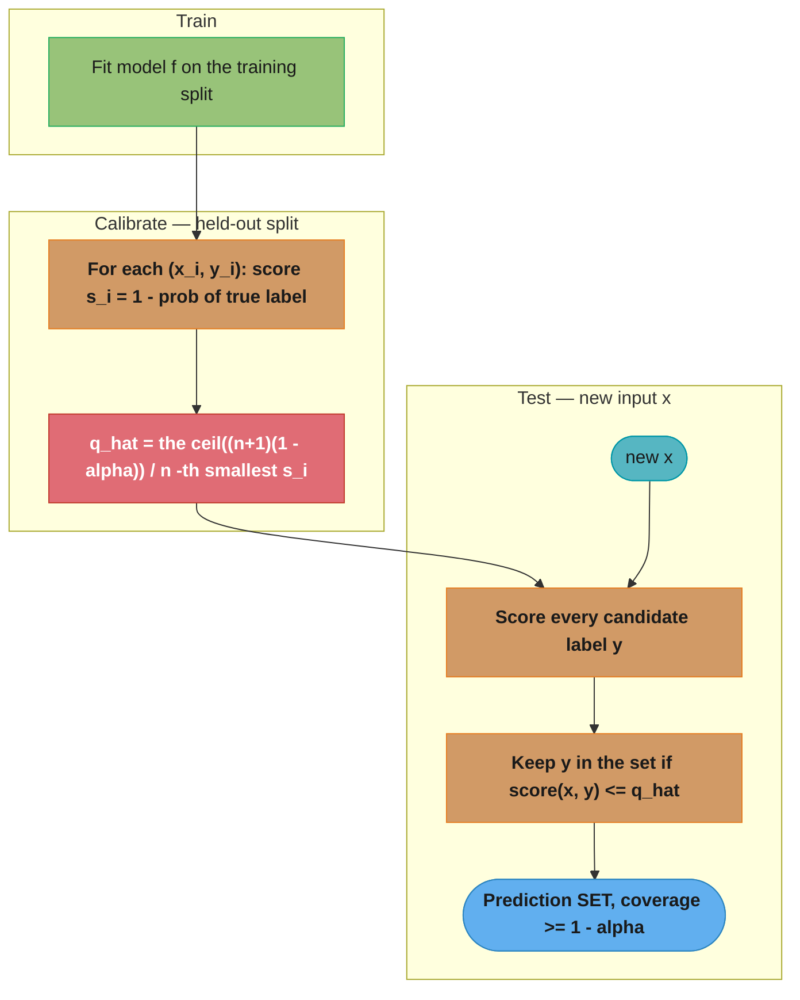
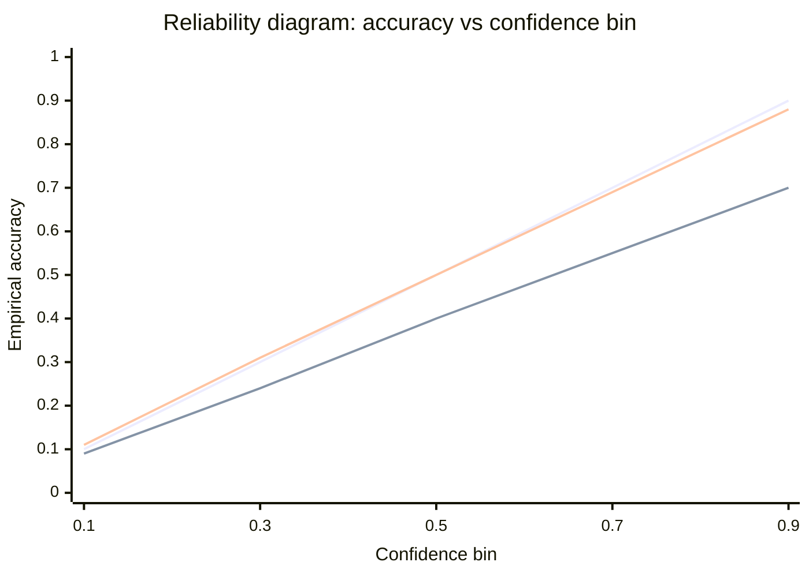
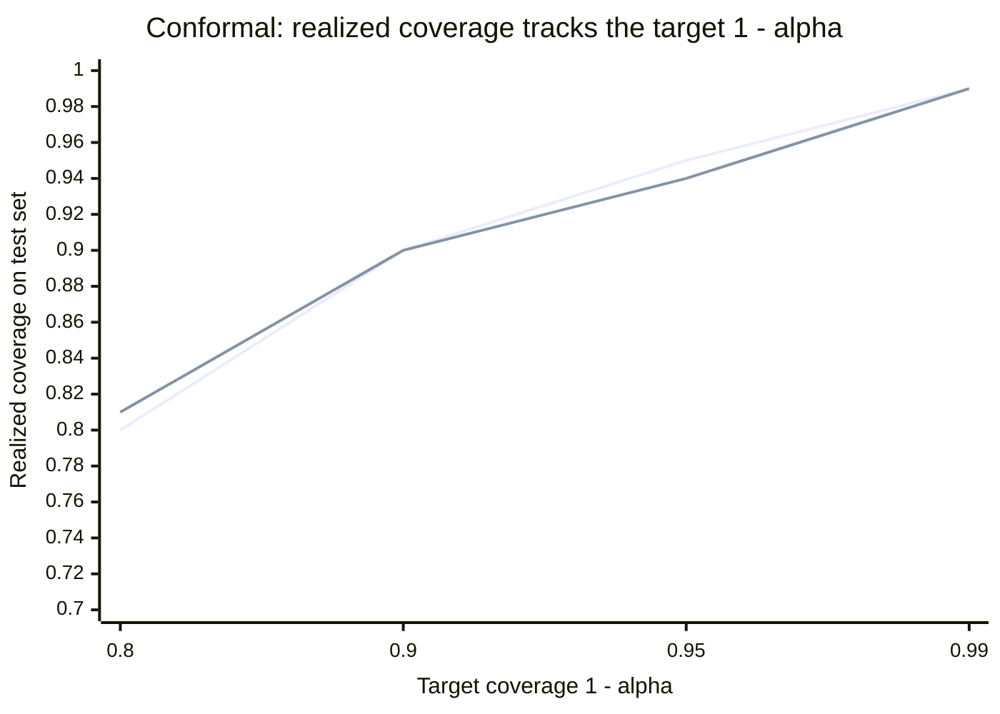

# Uncertainty Quantification and Conformal Prediction

> Phase 7 (Advanced Topics). This module covers how to make a model say "I don't know":
> aleatoric vs epistemic uncertainty, MC dropout, deep ensembles, and conformal prediction
> (distribution-free prediction sets/intervals with coverage guarantees). It extends the
> calibration material in [`model_calibration_and_thresholding.md`](../case_studies/cross_cutting/model_calibration_and_thresholding.md)
> from "are my probabilities trustworthy?" to "give me a set/interval I can guarantee."

---

## 1. Concept Overview

A point prediction ("class 3", "ETA 14 minutes") hides a critical question: how sure is the model? A high-stakes system — medical triage, lending, autonomous control, scientific screening — needs not just a prediction but a trustworthy measure of its reliability, so it can defer, abstain, or escalate when the model is uncertain.

Uncertainty quantification (UQ) provides that measure. Two ideas anchor the module:

1. **Sources of uncertainty.** *Aleatoric* uncertainty is irreducible noise in the data itself (a coin flip is 50/50 no matter how much data you collect). *Epistemic* uncertainty is the model's ignorance from limited data or being asked about a region it never saw; it shrinks with more data. Distinguishing them tells you whether to collect more data (epistemic) or accept the noise (aleatoric).

2. **Calibration vs guarantees.** A *calibrated* model's confidence matches its accuracy (when it says 80%, it is right 80% of the time) — but calibration is a statistical property that can still be locally wrong. **Conformal prediction** goes further: it wraps *any* model to produce prediction sets (classification) or intervals (regression) that contain the true answer with a user-chosen probability (e.g. 90%) under a single mild assumption (exchangeability), with no distributional assumptions and a finite-sample guarantee.

The senior takeaway: softmax probabilities are not uncertainty; deep networks are overconfident by default; and conformal prediction is the cheapest way to attach a real, distribution-free guarantee to a model you already have.

---

## 2. Intuition

One-line analogy: a point prediction is a single dart throw; uncertainty quantification draws the circle the dart will land in, and conformal prediction guarantees how often the bullseye is inside that circle.

Mental model: imagine a weather forecaster. A bad one always says "70% rain" and is wrong half the time (miscalibrated, overconfident). A calibrated one is right 70% of the time when it says 70%. A *conformal* forecaster instead says "tomorrow's high will be in [18C, 24C], and I guarantee this kind of interval covers the truth 90% of the time" — the guarantee holds regardless of the underlying model's quality (a worse model just gives wider intervals).

Why it matters: deep networks trained with cross-entropy are systematically overconfident — a modern image classifier routinely outputs 99% on inputs it gets wrong, including inputs from classes it never trained on. Deploying such confidence as if it were probability causes silent failures exactly where the model is weakest (out-of-distribution inputs).

Key insight: you can get a rigorous coverage guarantee for free, post-hoc, on a frozen model. Conformal prediction needs only a held-out calibration set and turns any score into a guaranteed prediction set — no retraining, no distributional assumptions. The price is set/interval *size*, not validity: a poor or uncertain model yields valid-but-wide sets, which is itself an honest signal.

---

## 3. Core Principles

1. **Softmax is not probability.** A high softmax value is a score, not a calibrated likelihood, and certainly not uncertainty. Treat it as such until proven calibrated.
2. **Separate aleatoric from epistemic.** Irreducible noise (aleatoric) calls for accepting/representing the spread; model ignorance (epistemic) calls for more data or abstention, and spikes out-of-distribution.
3. **Epistemic uncertainty needs model disagreement.** A single deterministic forward pass cannot express ignorance. Sampling (MC dropout) or multiple models (ensembles) reveal where the model disagrees with itself.
4. **Calibrate before you trust confidences.** Temperature scaling is a one-parameter, post-hoc fix that makes confidences match accuracy without changing predictions.
5. **Coverage is the contract; size is the quality.** Conformal prediction guarantees the *coverage* you ask for (validity); a better model delivers that coverage with *smaller* sets (efficiency).
6. **Exchangeability is the one assumption.** Conformal's guarantee holds if calibration and test data are exchangeable (roughly: i.i.d.). Distribution shift breaks it — and there are adaptive variants for that case.

---

## 4. Types / Architectures / Strategies

### 4.1 Uncertainty methods

| Method | Captures | Cost (train / infer) | Guarantee |
|--------|----------|----------------------|-----------|
| Softmax confidence | Nothing reliable | 1x / 1x | None (overconfident) |
| Temperature scaling | Calibrated confidence | post-hoc / 1x | Better calibration, no coverage |
| MC dropout | Epistemic (approx.) | 1x / N passes | Approximate |
| Deep ensembles | Epistemic (best practical) | Nx / Nx | Approximate, strong empirically |
| Bayesian NN (VI/SWAG) | Epistemic (principled) | higher / sampling | Approximate posterior |
| Conformal prediction | Distribution-free coverage | post-hoc / ~1x | Finite-sample, exact |

### 4.2 Calibration metrics

- **Expected Calibration Error (ECE):** bin predictions by confidence, average `|accuracy - confidence|` across bins. Lower is better; a well-calibrated classifier is <0.03.
- **Reliability diagram:** plot accuracy vs confidence per bin; the diagonal is perfect calibration.
- **Negative log-likelihood / Brier score:** proper scoring rules that reward calibrated probabilities.

### 4.3 Conformal prediction variants

| Variant | Task | Output | Note |
|---------|------|--------|------|
| Split (inductive) conformal | Any | Set / interval | Single calibration split; cheap, standard |
| APS (Adaptive Prediction Sets) | Classification | Label set | Adapts set size to difficulty |
| RAPS | Classification | Label set | APS + regularization for smaller sets |
| Conformalized Quantile Regression (CQR) | Regression | Interval | Adapts width to local noise |
| Mondrian / class-conditional | Any | Set | Coverage guaranteed per group/class |
| Adaptive (ACI) | Streaming | Interval | Maintains coverage under drift |

---

## 5. Architecture Diagrams

### Aleatoric vs epistemic



The two axes are *does more data help?* (left/right) and *where does the spread live —
in the data or the model?* (bottom/top). Aleatoric points cluster bottom-left (irreducible,
data-side); epistemic points cluster top-right (shrinks with data, model-side). The label
tells you the fix: collect data / abstain for epistemic, accept the spread for aleatoric.

### Deep ensemble / MC dropout (epistemic via disagreement)



A single deterministic pass cannot express ignorance, so both methods generate *several*
predictions — N separately-trained models (ensemble) or N dropout sub-networks (MC dropout).
Their mean is the prediction; their variance is the epistemic signal, spiking exactly where
the sampled models disagree (novel or out-of-distribution inputs).

### Split conformal prediction (the whole method)



The whole method is three phases: fit once, calibrate a single threshold q_hat on a
held-out split, then at test time keep every label scoring below q_hat. The red node is the
only learned quantity — the finite-sample quantile that turns raw scores into a set with a
guaranteed 1-alpha coverage, on any model.

### Temperature scaling and the reliability diagram



The straight diagonal is perfect calibration (accuracy == confidence). The line sagging
below it at high confidence is the raw, overconfident network (ECE ~0.15 — it says 0.9 but
is right ~0.7 of the time). The line hugging the diagonal is the same model after
temperature scaling (ECE <0.03); T>1 softened the logits without moving any argmax.

### Conformal coverage: the guarantee you contract for



Realized coverage sits on the target line whatever alpha you pick — that validity is the
contract. Model quality does not change this curve; a weaker model still lands on it, paying
instead with larger prediction sets (the efficiency the chart deliberately does not show).

---

## 6. How It Works — Detailed Mechanics

### MC dropout (keep dropout ON at inference)

```python
import torch
import torch.nn as nn


@torch.no_grad()
def mc_dropout_predict(
    model: nn.Module, x: torch.Tensor, n_samples: int = 50
) -> tuple[torch.Tensor, torch.Tensor]:
    """
    Estimate predictive mean and epistemic uncertainty by sampling with dropout
    enabled at inference. Returns (mean_probs, predictive_variance).
    """
    model.train()  # CRITICAL: enables dropout layers; do NOT use model.eval()
    probs = torch.stack(
        [torch.softmax(model(x), dim=-1) for _ in range(n_samples)], dim=0
    )                                   # (n_samples, batch, classes)
    mean = probs.mean(dim=0)
    variance = probs.var(dim=0).sum(dim=-1)   # total variance per input
    return mean, variance
```

### Deep ensembles (the strongest practical epistemic estimate)

```python
import torch
import torch.nn as nn


@torch.no_grad()
def ensemble_predict(
    models: list[nn.Module], x: torch.Tensor
) -> tuple[torch.Tensor, torch.Tensor]:
    """
    Train N models from different random seeds; average their probabilities.
    Disagreement (variance) spikes on out-of-distribution inputs.
    """
    probs = torch.stack([torch.softmax(m(x), dim=-1) for m in models], dim=0)
    mean = probs.mean(dim=0)
    epistemic = probs.var(dim=0).sum(dim=-1)
    return mean, epistemic
```

### Temperature scaling (post-hoc calibration)

```python
import torch
import torch.nn as nn


def fit_temperature(val_logits: torch.Tensor, val_labels: torch.Tensor) -> float:
    """
    Learn a single scalar T that divides logits to fix overconfidence.
    Does NOT change argmax predictions, only their confidence. Fit on a
    validation set in ~seconds. Typical effect: ECE 0.15 -> <0.03.
    """
    T = torch.nn.Parameter(torch.ones(1))
    optimizer = torch.optim.LBFGS([T], lr=0.01, max_iter=50)

    def closure() -> torch.Tensor:
        optimizer.zero_grad()
        loss = nn.functional.cross_entropy(val_logits / T, val_labels)
        loss.backward()
        return loss

    optimizer.step(closure)
    return float(T.detach())
```

### Split conformal — classification prediction sets

```python
import numpy as np


def conformal_calibrate(
    cal_softmax: np.ndarray, cal_labels: np.ndarray, alpha: float = 0.1
) -> float:
    """
    Compute the conformal threshold q_hat for 1-alpha coverage.
    Nonconformity score = 1 - softmax probability of the TRUE label.
    """
    n = len(cal_labels)
    scores = 1.0 - cal_softmax[np.arange(n), cal_labels]   # higher = more "wrong"
    # finite-sample correction: the ceil((n+1)(1-alpha))/n quantile
    q_level = np.ceil((n + 1) * (1 - alpha)) / n
    q_hat = np.quantile(scores, min(q_level, 1.0), method="higher")
    return float(q_hat)


def conformal_predict_set(test_softmax: np.ndarray, q_hat: float) -> list[np.ndarray]:
    """
    Return, per test input, the SET of labels whose score is below q_hat.
    Guarantees: P(true label in set) >= 1 - alpha (marginal coverage).
    """
    keep = (1.0 - test_softmax) <= q_hat          # label included if 1-p <= q_hat
    return [np.where(row)[0] for row in keep]


if __name__ == "__main__":
    # toy: a 90% set covers the truth ~90% of the time; ambiguous inputs get
    # bigger sets ({3,8}), confident inputs get singletons ({3}), and OOD inputs
    # can get empty sets (an honest "this matches nothing").
    pass
```

### Conformalized quantile regression (intervals with adaptive width)

```python
import numpy as np


def cqr_calibrate(
    cal_lo: np.ndarray, cal_hi: np.ndarray, cal_y: np.ndarray, alpha: float = 0.1
) -> float:
    """
    Given a quantile-regression model's lower/upper predictions on a calibration
    set, compute the conformal correction so the FINAL interval has 1-alpha
    coverage. Intervals widen where the model's quantiles miss the truth.
    """
    # conformity score: how far outside [lo, hi] the truth fell (signed max)
    scores = np.maximum(cal_lo - cal_y, cal_y - cal_hi)
    n = len(cal_y)
    q_level = np.ceil((n + 1) * (1 - alpha)) / n
    return float(np.quantile(scores, min(q_level, 1.0), method="higher"))
    # final interval at test time: [lo(x) - q, hi(x) + q]
```

---

## 7. Real-World Examples

**Medical triage and screening:** instead of a single diagnosis, a conformal classifier returns a label *set* guaranteed to contain the true condition 95% of the time; a singleton set auto-confirms, a multi-label set routes to a clinician. This turns model uncertainty into an explicit, auditable abstention policy.

**Autonomous perception:** epistemic uncertainty from ensembles spikes on objects unlike anything in training (a novel obstacle), letting the planner slow down or hand off rather than act confidently on an unfamiliar input.

**Weather and energy forecasting:** prediction intervals (not point forecasts) are the product. Conformalized quantile regression produces calibrated intervals that widen in volatile conditions and tighten in stable ones, which downstream optimization (grid balancing, inventory) depends on.

**Drug/material screening:** when scoring millions of candidates, epistemic uncertainty flags promising-but-unexplored regions for active learning, focusing expensive lab validation where the model is both optimistic and unsure.

**LLM hallucination signals:** token-level and answer-level uncertainty (e.g. semantic-entropy over sampled generations) is an active research direction for deciding when an LLM should abstain or retrieve. The aleatoric/epistemic framing here carries over; see `../../llm/evaluation_and_benchmarks/`.

---

## 8. Tradeoffs

| Dimension | Single softmax | MC dropout | Deep ensembles | Conformal |
|-----------|----------------|------------|----------------|-----------|
| Inference cost | 1x | Nx | Nx | ~1x |
| Training cost | 1x | 1x | Nx (N models) | post-hoc |
| Epistemic capture | None | Approx. | Best practical | N/A (wraps any) |
| Coverage guarantee | None | None | None | Yes (finite-sample) |
| Code complexity | Trivial | Low | Low | Low |

| Conformal: what you control | Effect |
|------------------------------|--------|
| Smaller alpha (e.g. 0.01) | Higher coverage, larger sets/intervals |
| Better base model | Same coverage, smaller sets (more efficient) |
| Class-conditional (Mondrian) | Per-group coverage, slightly larger sets |
| Adaptive (ACI) | Maintains coverage under drift, variable width |

---

## 9. When to Use / When NOT to Use

### Invest in uncertainty quantification when

- Wrong-but-confident predictions are costly: medical, financial, safety-critical, scientific screening.
- The system can *act* on uncertainty: defer to a human, abstain, request more data, widen a safety margin.
- You face out-of-distribution inputs and need to detect them (epistemic uncertainty / OOD).
- A downstream consumer needs intervals or guaranteed sets, not point estimates.

### Use conformal prediction specifically when

- You need a *guarantee*, not just a heuristic confidence, and cannot retrain the model.
- You already have a trained model and a held-out calibration set — it is the cheapest path to validity.

### It may be unnecessary when

- The task is low-stakes and nothing downstream uses uncertainty (a point prediction is consumed as-is).
- Inference budget forbids ensembles or many MC samples and conformal's single-pass guarantee suffices (then prefer conformal).

### Caution

- Conformal's guarantee assumes exchangeability; under heavy distribution shift use adaptive variants and monitor empirical coverage.

---

## 10. Common Pitfalls

### Pitfall 1: Treating softmax as probability/uncertainty

```python
# BROKEN: using raw confidence as a trustworthy probability
conf = torch.softmax(model(x), dim=-1).max()
if conf > 0.9:                # a deep net says 0.99 on inputs it gets wrong, incl. OOD
    auto_approve()

# FIX: calibrate first (temperature scaling), and/or use a real uncertainty estimate
# (ensemble variance) plus a conformal set for a guarantee.
```

Modern deep networks are systematically overconfident; uncalibrated 0.99s on out-of-distribution inputs are routine.

### Pitfall 2: Forgetting to keep dropout on for MC dropout

```python
# BROKEN: eval() disables dropout -> identical forward passes -> zero "uncertainty"
model.eval()
samples = [model(x) for _ in range(50)]   # all the same; variance = 0

# FIX: put the model in train() mode (or selectively enable dropout layers) so
# each pass samples a different sub-network.
model.train()
```

### Pitfall 3: Calibrating or conformalizing on the training set

```python
# BROKEN: temperature/conformal fit on data the model trained on -> optimistic,
# the coverage guarantee is void (exchangeability with the test point is broken).

# FIX: always use a separate held-out calibration split, disjoint from training.
```

### Pitfall 4: Expecting conformal to fix a bad model

Conformal prediction guarantees *coverage*, not accuracy. A weak or uncertain model still gets 90% coverage — by returning very large sets or very wide intervals. Huge sets are not a bug; they are the method honestly reporting that the model cannot discriminate. Improve efficiency by improving the base model or the nonconformity score, not by blaming conformal.

### Pitfall 5: Ignoring distribution shift

The coverage guarantee assumes calibration and test data are exchangeable. Under covariate shift or temporal drift, realized coverage drops below the target. Monitor empirical coverage in production and switch to adaptive conformal (ACI) or weighted conformal under known shift.

### Pitfall 6: Confusing marginal and conditional coverage

Standard conformal guarantees *marginal* coverage (averaged over all inputs), not *per-group* coverage. A model can hit 90% overall while covering only 70% for a minority subgroup. If per-group validity matters (fairness, safety), use class-conditional/Mondrian conformal.

---

## 11. Technologies & Tools

| Tool | Use Case | Notes |
|------|----------|-------|
| MAPIE | Conformal prediction (classification + regression) | sklearn-compatible, batteries-included |
| crepes | Conformal classifiers/regressors + Venn-Abers | Lightweight, research-friendly |
| TorchUQ / Uncertainty Toolbox | UQ metrics, calibration, plots | Evaluation and visualization |
| Laplace (laplace-torch) | Post-hoc Bayesian (Laplace approx.) | Cheap epistemic on a trained net |
| Pyro / NumPyro | Bayesian neural networks (VI/MCMC) | Principled but heavier |
| netcal | Calibration methods + ECE | Temperature/Platt/isotonic |
| scikit-learn | `CalibratedClassifierCV`, isotonic/Platt | Classical calibration |

---

## 12. Interview Questions with Answers

**Q: What is the difference between aleatoric and epistemic uncertainty?**
Aleatoric uncertainty is irreducible noise inherent in the data — label noise, sensor jitter, or genuine ambiguity (a blurry image, a coin flip). It does not shrink with more data. Epistemic uncertainty is the model's ignorance due to limited training data or being queried outside its training distribution; it *does* shrink as you collect more relevant data. The distinction is actionable: epistemic uncertainty says "collect more data or abstain," while aleatoric says "accept and represent the spread."

**Q: Why are softmax probabilities not a good measure of uncertainty?**
A softmax output is a normalized score, not a calibrated probability or an uncertainty estimate. Deep networks trained with cross-entropy are systematically overconfident and will output 99% on inputs they get wrong, including out-of-distribution inputs from classes they never saw — because a single deterministic forward pass has no way to express "I haven't seen anything like this." You need calibration to trust the magnitude and disagreement-based methods (ensembles/MC dropout) to capture epistemic uncertainty.

**Q: How does MC dropout estimate uncertainty?**
Monte Carlo dropout keeps dropout layers *active at inference* and runs many forward passes, each sampling a different sub-network. The mean of the softmax outputs is the prediction and their variance approximates epistemic uncertainty — high variance means the sampled sub-networks disagree, which happens in poorly-supported regions. It is theoretically interpretable as approximate variational inference. The catch: you must use `model.train()` (or selectively enable dropout), not `eval()`, or every pass is identical and variance is zero.

**Q: Why are deep ensembles considered the strongest practical uncertainty method?**
Training several networks from different random initializations (and data shuffles) yields models that agree on well-supported inputs and disagree on novel or ambiguous ones; the variance across their predictions is a robust epistemic signal that reliably spikes out-of-distribution. Empirically, deep ensembles beat MC dropout and many Bayesian approximations on calibration and OOD detection. The cost is N times the training and inference compute, which is the main reason people seek cheaper alternatives.

**Q: How do you decompose total predictive uncertainty into aleatoric and epistemic parts?**
Use the law of total variance: total predictive uncertainty splits into the mean of each model's own entropy (aleatoric) plus the variance across the models' predictions (epistemic). With an ensemble or MC samples you compute both from the same N softmax outputs — average the per-sample entropies for the irreducible-noise term, and measure the disagreement (the mutual information between predictions and model parameters, i.e. the BALD score) for the model-ignorance term. This decomposition is what lets a system react differently: high aleatoric means "the data is genuinely ambiguous, accept it," while high epistemic means "I am in unfamiliar territory, abstain or gather data."

**Q: What is calibration and how does temperature scaling achieve it?**
Calibration means a model's confidence matches its empirical accuracy — among predictions made at 80% confidence, 80% are correct. Temperature scaling is a post-hoc method that divides the logits by a single learned scalar T (fit on a validation set to minimize NLL) before the softmax. T>1 softens overconfident outputs. It is essentially free, fixes most overconfidence (e.g. ECE 0.15 -> <0.03), and crucially does not change the argmax prediction — only the confidence attached to it.

**Q: Can you reuse the same held-out set for temperature scaling and conformal calibration?**
Prefer separate splits; reusing one set makes the conformal scores depend on a threshold tuned on the same data, which weakens the finite-sample guarantee. Temperature scaling fits only a single scalar, so in practice the leakage is mild and many teams do reuse the calibration set — but the clean recipe is a three-way split (train / fit-temperature / conformal-calibrate) so the conformal scores stay exchangeable with the test point. The same discipline applies to choosing alpha or the nonconformity score: any decision made by looking at the calibration labels erodes the exchangeability the coverage guarantee rests on.

**Q: What is Expected Calibration Error (ECE)?**
ECE measures miscalibration by bucketing predictions into confidence bins, computing each bin's average confidence and its actual accuracy, and averaging the absolute gap weighted by bin size. An ECE near 0 means confidences are trustworthy; well-calibrated classifiers are below ~0.03. Its weakness is bin sensitivity, so pair it with reliability diagrams and a proper scoring rule (Brier or NLL).

**Q: Explain conformal prediction in one paragraph.**
Conformal prediction wraps any trained model to produce prediction *sets* (classification) or *intervals* (regression) that contain the true answer with a user-chosen probability 1-alpha, using only a held-out calibration set and one mild assumption (exchangeability). You define a nonconformity score (e.g. 1 minus the true-label softmax), compute those scores on the calibration set, take the appropriate quantile as a threshold q_hat, and at test time include every label whose score is below q_hat. The guarantee is finite-sample and distribution-free — no assumptions about the model or the data distribution.

**Q: What is a nonconformity score, and what makes a good one?**
A nonconformity score measures how unusual a labeled example looks to the model — higher means the (x, y) pair fits worse — and conformal thresholds it to build sets. For classification a common choice is 1 minus the true-label softmax probability; for regression it is the absolute residual |y - f(x)|, or the signed distance outside a quantile pair in CQR. Validity holds for *any* score, but efficiency does not: a good score ranks genuinely hard examples higher so that easy inputs fall well below q_hat and yield small sets, while a poorly-chosen score inflates set size without ever breaking coverage. Designing the score is therefore where almost all the engineering effort in conformal prediction goes.

**Q: What exactly does conformal prediction guarantee, and what does it not?**
It guarantees *marginal coverage*: averaged over the data distribution, the true label/value falls inside the predicted set/interval at least 1-alpha of the time, for any model and any distribution (given exchangeability). It does *not* guarantee accuracy, small sets, or per-group (conditional) coverage. A bad model still achieves coverage — by emitting large sets or wide intervals — so set size, not validity, reflects model quality.

**Q: If conformal prediction always achieves coverage, why does model quality matter?**
Because coverage is achieved through set/interval *size*. A strong, confident model covers the truth 90% of the time with tiny sets (often singletons) and narrow intervals; a weak or uncertain model achieves the same 90% only by returning large multi-label sets or very wide intervals. Efficiency (small sets at the target coverage) is the quality metric, and it improves with a better base model or a smarter nonconformity score.

**Q: Does conformal prediction require the underlying model to be calibrated first?**
No — conformal prediction works on any score from any model, calibrated or not, because it recalibrates coverage empirically on the held-out set. It does not even need probabilities: a raw logit, a distance, or an anomaly score is a valid nonconformity score. Calibration and conformal are complementary rather than sequential — temperature scaling makes the *reported confidence number* trustworthy, while conformal makes the *set/interval coverage* guaranteed — and you often do both, but conformal's validity never depends on the model being calibrated. Calibrating first can still help indirectly by producing a better-ranked score, which yields smaller sets.

**Q: How do APS and RAPS improve on the basic 1-minus-softmax conformal score?**
APS builds sets by accumulating sorted class probabilities until they exceed the threshold, giving adaptive sizes, and RAPS adds a regularizer that penalizes long tails for smaller sets. The naive 1-softmax score tends to sweep in many low-probability classes on hard inputs, producing bloated sets; APS (Adaptive Prediction Sets) instead accumulates the softmax mass of ranked labels so ambiguous inputs get larger-but-honest sets and confident ones stay small. RAPS (Regularized APS) discourages including many unlikely tail classes, cutting the average set size further while preserving the exact coverage guarantee — so on hard classification tasks you almost always prefer APS/RAPS over the raw score.

**Q: Can a conformal prediction set be empty or contain every label, and what does each mean?**
Yes — an empty set means no label scored below the threshold (an out-of-distribution or "nothing fits" signal), and a full set means the model cannot discriminate at all. With the 1-softmax score an empty set occurs when every label's score exceeds q_hat, which is an honest OOD flag you can route to human review; a near-full set means the input is genuinely ambiguous or the model is weak on it. Neither breaks the guarantee — marginal coverage still holds averaged over the distribution — and if empty sets are undesirable, APS avoids them by always including at least the top-ranked label.

**Q: What assumption does conformal prediction rely on, and what breaks it?**
Exchangeability of the calibration and test data — roughly, that they are drawn i.i.d. from the same distribution (order doesn't matter). Distribution shift breaks it: under covariate shift or temporal drift, realized coverage falls below the target. Remedies include weighted conformal prediction (reweight calibration scores by likelihood ratio under known covariate shift) and adaptive conformal inference (ACI), which adjusts the threshold online to maintain long-run coverage in streaming/drifting settings.

**Q: What is the difference between marginal and conditional coverage?**
Marginal coverage holds on average across all inputs; conditional coverage holds within every subgroup or region (e.g. per class, per demographic). Standard split conformal gives only marginal coverage, so it can systematically under-cover a minority subgroup while looking fine overall. When per-group validity matters, use class-conditional (Mondrian) conformal, which calibrates separately within each group to guarantee coverage in each.

**Q: How would you turn uncertainty into a production decision policy?**
Define thresholds that map uncertainty to actions: confident/singleton conformal set -> automate; uncertain/large set or high epistemic variance -> defer to a human, abstain, or request more information; out-of-distribution (very high epistemic) -> reject and alert. Calibrate the model first so confidences are meaningful, choose alpha from the business risk tolerance, and monitor automation rate, deferral rate, and realized coverage/accuracy so the policy can be tuned as data drifts.

**Q: When would you choose conformal prediction over a Bayesian neural network?**
Choose conformal when you need a rigorous, distribution-free coverage guarantee cheaply on a model you already have — it is post-hoc, single-pass at inference, and assumption-light. Choose a Bayesian NN (or ensemble) when you specifically need a full predictive distribution, decomposition into aleatoric/epistemic components, or epistemic estimates for active learning and OOD detection. They are complementary: a common pattern is an ensemble for rich uncertainty plus conformal on top for the guarantee.

**Q: How do you produce a calibrated prediction interval for a regression model?**
Use conformalized quantile regression (CQR): train a model to predict lower and upper quantiles (e.g. 5th and 95th), then on a calibration set compute how far the truth falls outside `[lo, hi]`, take the appropriate quantile of those conformity scores as a correction q, and widen the test interval to `[lo(x)-q, hi(x)+q]`. This yields the target coverage with intervals that adapt their width to local noise — wide where data is volatile, narrow where it is stable.

**Q: How does uncertainty quantification connect to active learning?**
Epistemic uncertainty is the signal active learning queries on: the model is most worth labeling exactly where it is ignorant (high epistemic variance), not where the data is just noisy (aleatoric). Disagreement-based uncertainty (ensembles, BALD) drives query-by-committee and information-theoretic acquisition. So UQ provides the scoring function that an active-learning loop uses to choose the next labels — see `../active_learning_and_weak_supervision/`.

---

## 13. Best Practices

1. Never expose raw softmax as "confidence" in a high-stakes system; calibrate first (temperature scaling is nearly free) and validate with ECE plus a reliability diagram.
2. Always calibrate and conformalize on a held-out split disjoint from training data, or the guarantee/calibration is void.
3. Use deep ensembles when you can afford them (best practical epistemic uncertainty); fall back to MC dropout when you cannot, remembering to keep dropout active at inference.
4. Add conformal prediction whenever you need a guarantee on a frozen model — it is the cheapest path to validity and works on top of any other method.
5. Report set/interval *size* alongside coverage; a method that hits coverage with huge sets is honestly telling you the model is weak.
6. Choose alpha from the business risk tolerance, not by default; smaller alpha buys higher coverage at the cost of larger sets.
7. Monitor *realized* coverage in production; if it drifts below target, suspect distribution shift and move to adaptive/weighted conformal.
8. When subgroup fairness or safety matters, use class-conditional conformal to get per-group coverage, not just marginal.

---

## 14. Case Study

**Scenario: prediction sets for a clinical decision-support classifier.** A model classifies dermatology images into 20 condition classes to assist (not replace) clinicians. The first version returns a top-1 label with a softmax confidence, and a triage rule auto-confirms cases above 0.90. In review, several auto-confirmed cases were wrong with 0.95+ confidence — the model was overconfident, especially on rare conditions and images unlike its training set. The requirement becomes: a guaranteed 95% chance the true condition is surfaced, with an explicit, auditable deferral path.

**Step 1 — Calibrate.** Temperature scaling on a held-out validation split:

```python
T = fit_temperature(val_logits, val_labels)   # e.g. T = 1.8
# ECE drops from 0.17 to 0.02; predictions unchanged, confidences now trustworthy.
```

**Step 2 — Conformalize for a coverage guarantee.** Split conformal at alpha = 0.05:

```python
q_hat = conformal_calibrate(cal_softmax, cal_labels, alpha=0.05)
sets = conformal_predict_set(test_softmax, q_hat)
# Realized coverage on the test set: ~0.95, exactly as contracted.
```

**Step 3 — Turn set size into a triage policy.**

```
prediction set for a case
   |
size == 1  -> high-confidence: surface single condition, auto-route
size 2-3   -> ambiguous: surface the set, clinician chooses
size >= 4  -> low-confidence: full clinician review
size == 0  -> out-of-distribution: flag "no confident match", escalate
```

Singletons (~62% of cases) automate safely; multi-label sets (~33%) give the clinician a guaranteed-to-contain shortlist; empty/large sets (~5%) are the honest "I don't know" that the old softmax never produced.

**Step 4 — Per-group validity.** Marginal 95% coverage hid that a rare condition was covered only 84% of the time. They switch to class-conditional (Mondrian) conformal so each condition gets its own threshold and its own 95% guarantee — at the cost of slightly larger sets for rare classes.

**Broken -> fix during the build:** the team first computed q_hat on the *training* set because it was convenient.

```python
# BROKEN: calibration scores computed on data the model trained on
q_hat = conformal_calibrate(train_softmax, train_labels, alpha=0.05)
# -> training scores are optimistically low -> q_hat too small -> realized
#    coverage on real cases was only ~88%, silently violating the 95% contract.

# FIX: use a calibration split the model never saw during training.
q_hat = conformal_calibrate(cal_softmax, cal_labels, alpha=0.05)
```

**Step 5 — Monitor.** They track realized coverage, average set size, automation rate, and per-class coverage weekly. When a new imaging device shifts the input distribution, realized coverage dips to 0.91; that triggers re-calibration on fresh data and a review for adaptive conformal.

**Outcome.** Overconfident auto-confirmations are eliminated: every automated decision now carries a finite-sample 95% guarantee, uncertain cases route to clinicians with a guaranteed shortlist, and OOD inputs are flagged instead of silently misclassified. The change required no model retraining — only calibration and conformal wrapping on the existing network.

**Interview discussion points.** Why softmax 0.95 was untrustworthy and temperature scaling fixed the magnitude without changing predictions; what the conformal guarantee does and does not promise; why set size became the triage signal; why training-set calibration broke the guarantee; and why marginal coverage needed to become class-conditional for rare conditions.

---

## See Also

- [model_calibration_and_thresholding.md](../case_studies/cross_cutting/model_calibration_and_thresholding.md) — Platt/isotonic, ECE, cost-sensitive thresholds (the calibration foundation)
- [model_evaluation_and_selection](../model_evaluation_and_selection/README.md) — calibration in the evaluation toolkit
- [active_learning_and_weak_supervision](../active_learning_and_weak_supervision/README.md) — epistemic uncertainty drives acquisition
- [probability_and_statistics](../probability_and_statistics/README.md) — distributions, quantiles, exchangeability
- `../../llm/evaluation_and_benchmarks/` — uncertainty/abstention signals for LLM outputs
