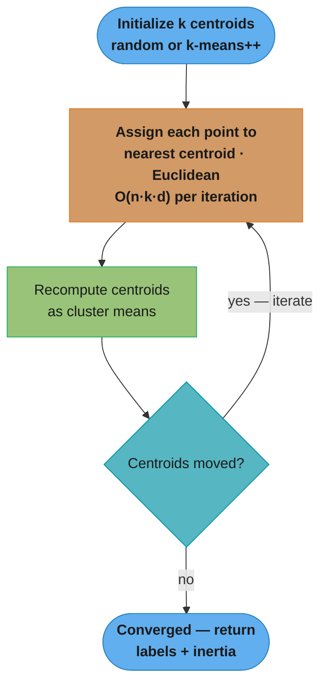
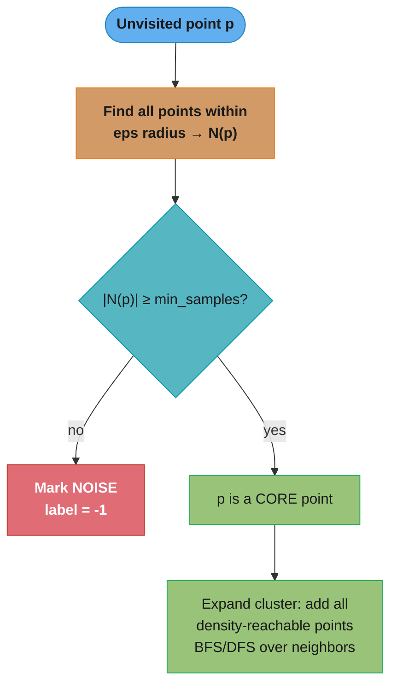
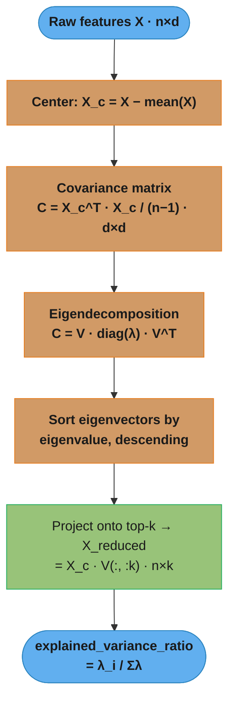
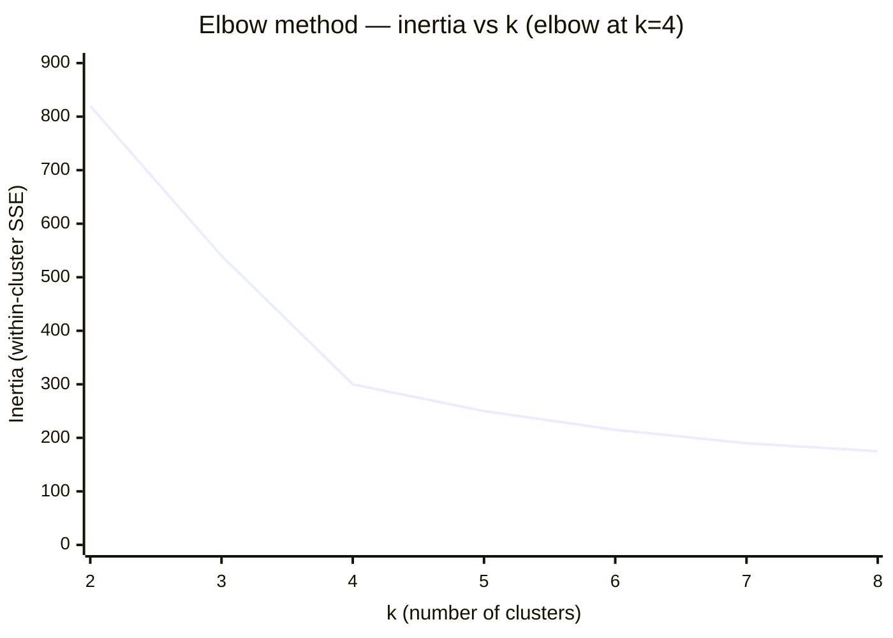
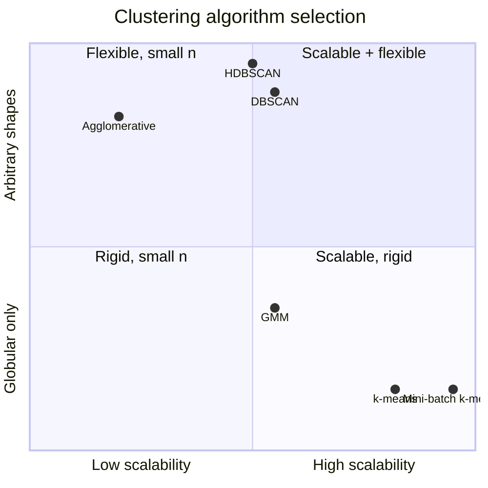

# Unsupervised Learning

## 1. Concept Overview

Unsupervised learning discovers hidden structure in unlabeled data. There is no target variable — the algorithm finds patterns, groupings, or compressed representations purely from feature distributions. The three primary tasks are clustering (group similar observations), dimensionality reduction (compress features while preserving structure), and density estimation (model the underlying data distribution).

Core algorithms covered here:
- **k-means**: partition-based clustering with centroid updates (Lloyd's algorithm)
- **DBSCAN**: density-based clustering, handles arbitrary shapes and noise
- **Hierarchical clustering**: agglomerative tree structure, no k required up front
- **PCA**: linear dimensionality reduction via eigenvector decomposition
- **t-SNE**: non-linear 2-D/3-D visualization (not suitable for production inference)
- **UMAP**: non-linear reduction that preserves global structure, faster than t-SNE
- **Autoencoders**: neural compression and reconstruction

---

## 2. Intuition

One-line analogy: unsupervised learning is like organizing a messy library with no catalogue — you group books by cover art, weight, and theme without knowing the official genres.

Mental model:
- Clustering = "which data points are neighbors?"
- Dimensionality reduction = "which directions carry the most information?"
- Autoencoders = "what is the most compact code that reconstructs the original?"

Why it matters: most real-world data is unlabeled. Customer segmentation, anomaly detection, feature pre-processing, and exploratory analysis all rely on unsupervised methods.

Key insight: the definition of "similar" is baked into the distance metric and algorithm choice. Changing Euclidean to cosine distance on the same data can produce completely different clusters.

---

## 3. Core Principles

1. **No supervision signal** — the algorithm has no labels to optimize toward; it optimizes an internal objective (inertia for k-means, density reachability for DBSCAN, reconstruction loss for autoencoders).
2. **Distance/similarity is everything** — feature scaling, metric choice, and curse of dimensionality all directly affect output quality.
3. **Evaluation is hard** — without ground truth you rely on intrinsic metrics (silhouette score, Davies-Bouldin index) or downstream task performance.
4. **Scale before you cluster** — unscaled features let high-magnitude variables dominate distance calculations.
5. **Stochasticity** — k-means and t-SNE have random initializations; set `random_state` for reproducibility.

---

## 4. Types / Architectures / Strategies

### Clustering

| Algorithm        | Init needed | Shape assumption | Noise robust | Complexity per iter | Best for |
|-----------------|-------------|-----------------|--------------|---------------------|----------|
| k-means         | k (n_clusters) | Globular, equal size | No (outliers shift centroids) | O(n * k * d) | Large n, known k, globular |
| k-means++       | k           | Globular         | No           | O(n * k * d)        | Better init than random |
| Mini-batch k-means | k        | Globular         | No           | O(b * k * d), b=batch | Very large n (millions) |
| DBSCAN          | eps, min_samples | Arbitrary   | Yes (labels noise as -1) | O(n log n) with index | Unknown k, irregular shapes |
| HDBSCAN         | min_cluster_size | Arbitrary  | Yes          | O(n log n)          | Varying density clusters |
| Agglomerative   | linkage criterion | Any       | Moderate     | O(n^2 log n)        | Small n, dendrogram insight |
| Gaussian Mixture| n_components  | Elliptical     | Soft assignment | O(n * k * d^2) | Soft cluster membership |

### Dimensionality Reduction

| Method  | Linear | Preserves       | New data | Speed   | Typical use |
|---------|--------|-----------------|----------|---------|-------------|
| PCA     | Yes    | Global variance  | Yes      | Fast    | Pre-processing, noise removal |
| t-SNE   | No     | Local structure  | No       | O(n^2)  | 2-D visualization only |
| UMAP    | No     | Local + global   | Yes      | ~10x faster than t-SNE | Visualization + feature extraction |
| Autoencoder | No | Learned         | Yes      | GPU-dependent | Compression, anomaly detection |

---

## 5. Architecture Diagrams

### k-means Lloyd's Algorithm



The loop back to the assignment step is the heart of Lloyd's algorithm: assignment and centroid-update alternate until no point changes cluster, then k-means returns the labels and the final inertia (within-cluster sum of squares).

### DBSCAN Reachability



A point seeds a cluster only when its eps-neighborhood holds at least min_samples points (a CORE point); sparser points are labeled noise (-1). Because clusters grow by chaining density-reachable neighbors, DBSCAN recovers arbitrary shapes that centroid-based k-means cannot.

### PCA Pipeline



Centering first is essential — PCA finds directions of maximum variance, and an off-center cloud would bias the first component toward the mean vector rather than the true spread. Keeping the top-k eigenvectors retains the most variance per dimension kept.

### Choosing k — the Elbow Method



Inertia always falls as k rises, so you look for the "elbow" — the k where the marginal drop flattens (here k=4, where the curve bends from steep to shallow). Pair it with the silhouette peak; when the elbow is ambiguous on real high-dimensional data, the silhouette score is the more reliable signal.

### Picking a Clustering Algorithm — Two-Axis Tradeoff



The x-axis is how well a method scales to large n; the y-axis is how flexible its cluster-shape assumption is. k-means and its mini-batch variant sit bottom-right (scale to millions but assume globular clusters); DBSCAN/HDBSCAN sit top-middle (arbitrary shapes, moderate scale); agglomerative sits top-left (rich dendrogram, but O(n^2) confines it to small n).

---

## 6. How It Works — Detailed Mechanics

```python
from __future__ import annotations

import numpy as np
import pandas as pd
from sklearn.cluster import KMeans, DBSCAN, AgglomerativeClustering
from sklearn.decomposition import PCA
from sklearn.manifold import TSNE
from sklearn.preprocessing import StandardScaler
from sklearn.metrics import silhouette_score, davies_bouldin_score
from sklearn.datasets import make_blobs, make_moons
from typing import Tuple
import warnings

warnings.filterwarnings("ignore")


# ── k-means with elbow method and k-means++ init ──────────────────────────────

def fit_kmeans_elbow(
    X: np.ndarray,
    k_range: range = range(2, 11),
    random_state: int = 42,
) -> Tuple[KMeans, int]:
    """
    Try k values, compute inertia (sum of squared distances to centroid).
    Elbow = point where marginal gain in inertia drops sharply.
    """
    inertias: list[float] = []
    silhouette_scores: list[float] = []

    for k in k_range:
        km = KMeans(n_clusters=k, init="k-means++", n_init=10, random_state=random_state)
        km.fit(X)
        inertias.append(km.inertia_)  # within-cluster sum of squares
        sil = silhouette_score(X, km.labels_)
        silhouette_scores.append(sil)
        print(f"k={k}  inertia={km.inertia_:.1f}  silhouette={sil:.3f}")

    # Simple elbow detection: largest second derivative of inertia curve
    diffs = np.diff(inertias)
    second_diffs = np.diff(diffs)
    elbow_k = int(k_range[np.argmax(second_diffs) + 2])  # +2 accounts for double-diff offset
    print(f"\nElbow at k={elbow_k}")

    best_km = KMeans(n_clusters=elbow_k, init="k-means++", n_init=10, random_state=random_state)
    best_km.fit(X)
    return best_km, elbow_k


# ── DBSCAN ────────────────────────────────────────────────────────────────────

def run_dbscan(
    X: np.ndarray,
    eps: float = 0.5,
    min_samples: int = 5,
) -> np.ndarray:
    """
    DBSCAN labels:
      -1  = noise point (not assigned to any cluster)
       0+ = cluster id

    eps: neighborhood radius (tune with k-distance plot: sort distances to kth neighbor,
         look for knee; k = min_samples)
    min_samples: minimum points to form a core point (rule of thumb: 2 * n_features)
    """
    db = DBSCAN(eps=eps, min_samples=min_samples, metric="euclidean", n_jobs=-1)
    labels = db.fit_predict(X)

    n_clusters = len(set(labels)) - (1 if -1 in labels else 0)
    n_noise = np.sum(labels == -1)
    noise_pct = 100 * n_noise / len(labels)

    print(f"DBSCAN: {n_clusters} clusters, {n_noise} noise points ({noise_pct:.1f}%)")
    return labels


def kdistance_plot_eps(X: np.ndarray, k: int = 5) -> float:
    """
    Heuristic for eps selection: compute distance to kth nearest neighbor for
    every point, sort, find the 'knee' in the curve.
    Returns suggested eps (95th percentile of k-distances — practical heuristic).
    """
    from sklearn.neighbors import NearestNeighbors
    nbrs = NearestNeighbors(n_neighbors=k).fit(X)
    distances, _ = nbrs.kneighbors(X)
    k_distances = np.sort(distances[:, k - 1])[::-1]
    suggested_eps = float(np.percentile(k_distances, 5))  # knee approximation
    print(f"Suggested eps (5th percentile of {k}-distances): {suggested_eps:.4f}")
    return suggested_eps


# ── PCA ───────────────────────────────────────────────────────────────────────

def pca_variance_analysis(
    X: np.ndarray,
    target_variance: float = 0.95,
) -> Tuple[np.ndarray, int]:
    """
    Fit PCA and report how many components explain target_variance.
    MUST scale before PCA — unscaled features with different units
    (e.g., age 0-100, salary 0-200000) bias the covariance matrix.
    """
    scaler = StandardScaler()
    X_scaled = scaler.fit_transform(X)

    pca_full = PCA(random_state=42)
    pca_full.fit(X_scaled)

    cumulative_variance = np.cumsum(pca_full.explained_variance_ratio_)
    n_components = int(np.argmax(cumulative_variance >= target_variance) + 1)

    print(f"Components for {target_variance*100:.0f}% variance: {n_components}")
    for i, (ev, cum) in enumerate(
        zip(pca_full.explained_variance_ratio_[:10], cumulative_variance[:10])
    ):
        print(f"  PC{i+1}: {ev*100:.1f}%  cumulative: {cum*100:.1f}%")

    pca = PCA(n_components=n_components, random_state=42)
    X_reduced = pca.fit_transform(X_scaled)
    return X_reduced, n_components


# ── t-SNE vs UMAP ─────────────────────────────────────────────────────────────

def reduce_for_visualization(
    X: np.ndarray,
    method: str = "umap",
    n_components: int = 2,
    perplexity: float = 30.0,
    random_state: int = 42,
) -> np.ndarray:
    """
    t-SNE: perplexity 5-50 (balance local vs global); typical 30.
           O(n^2) — do NOT use on n > 10_000 without PCA pre-reduction.
           Cannot transform new data points.
    UMAP:  n_neighbors=15, min_dist=0.1 defaults work well.
           ~5-10x faster than t-SNE for same n.
           Can transform new points (fit/transform).
    """
    if method == "tsne":
        # Pre-reduce with PCA to 50 dims first — standard practice
        if X.shape[1] > 50:
            X = PCA(n_components=50, random_state=random_state).fit_transform(X)
        reducer = TSNE(
            n_components=n_components,
            perplexity=perplexity,
            learning_rate="auto",
            init="pca",
            random_state=random_state,
        )
        return reducer.fit_transform(X)

    elif method == "umap":
        try:
            import umap  # pip install umap-learn
            reducer = umap.UMAP(
                n_components=n_components,
                n_neighbors=15,
                min_dist=0.1,
                metric="euclidean",
                random_state=random_state,
            )
            return reducer.fit_transform(X)
        except ImportError:
            raise ImportError("Install umap-learn: pip install umap-learn")
    else:
        raise ValueError(f"Unknown method: {method}. Use 'tsne' or 'umap'.")


# ── Cluster quality evaluation ────────────────────────────────────────────────

def evaluate_clustering(X: np.ndarray, labels: np.ndarray) -> dict[str, float]:
    """
    Silhouette score: -1 (wrong cluster) to +1 (dense, well-separated).
      > 0.7: strong structure
      0.5-0.7: reasonable structure
      0.25-0.5: weak structure
      < 0.25: no substantial structure

    Davies-Bouldin index: lower is better (0 = perfect).
    Both require at least 2 clusters and no noise-only labels.
    """
    valid_mask = labels != -1  # exclude DBSCAN noise points
    if len(set(labels[valid_mask])) < 2:
        print("Need at least 2 clusters to evaluate.")
        return {}

    sil = silhouette_score(X[valid_mask], labels[valid_mask])
    db = davies_bouldin_score(X[valid_mask], labels[valid_mask])
    print(f"Silhouette score: {sil:.4f}  (higher is better, range -1 to +1)")
    print(f"Davies-Bouldin:   {db:.4f}  (lower is better)")
    return {"silhouette": sil, "davies_bouldin": db}


# ── Autoencoder sketch (PyTorch) ──────────────────────────────────────────────

AUTOENCODER_EXAMPLE = '''
import torch
import torch.nn as nn

class Autoencoder(nn.Module):
    def __init__(self, input_dim: int, latent_dim: int) -> None:
        super().__init__()
        self.encoder = nn.Sequential(
            nn.Linear(input_dim, 128),
            nn.ReLU(),
            nn.Linear(128, latent_dim),
        )
        self.decoder = nn.Sequential(
            nn.Linear(latent_dim, 128),
            nn.ReLU(),
            nn.Linear(128, input_dim),
        )

    def forward(self, x: torch.Tensor) -> tuple[torch.Tensor, torch.Tensor]:
        z = self.encoder(x)        # compressed representation
        x_hat = self.decoder(z)    # reconstruction
        return x_hat, z

# Training: minimize reconstruction loss (MSE for continuous, BCE for binary)
# Anomaly detection: high reconstruction error = anomaly
# model = Autoencoder(input_dim=784, latent_dim=32)
# loss_fn = nn.MSELoss()
'''
```

---

## 7. Real-World Examples

**Customer segmentation (k-means):** E-commerce platform segments 5M customers on RFM (recency, frequency, monetary) features. After StandardScaler, k=6 chosen via silhouette score peak. Centroids interpreted as: "churned high-value", "active bargain hunters", "one-time buyers", etc. Each segment receives a different email campaign.

**Fraud ring detection (DBSCAN):** Credit card transactions form dense clusters around merchant terminals. DBSCAN with eps=0.3, min_samples=10 identifies tight groups of transactions sharing device fingerprints — noise points (-1) flagged for manual review. k-means would have missed irregular-shaped rings.

**Image compression (PCA):** MNIST 784-pixel images compressed to 154 components retaining 95% explained variance. Reconstruction quality acceptable for classification pre-processing; 5x storage reduction. Feature matrix shrinks from 784 to 154, cutting downstream model training time by ~60%.

**Drug discovery visualization (UMAP):** 200,000 molecular fingerprints (2048-dim) projected to 2-D in 4 minutes with UMAP vs 3+ hours with t-SNE. Chemical clusters visually separate by scaffold family. New query molecules can be projected without refit (unlike t-SNE).

**Anomaly detection (autoencoder):** Network intrusion detection system trains autoencoder on normal traffic (95% of data). At inference, reconstruction error threshold at 99th percentile of training error. Attack traffic reconstructs poorly (error > threshold), triggering alert. Achieves 94% recall on known attack types without any labeled attack data.

---

## 8. Tradeoffs

| Concern                  | k-means       | DBSCAN        | Hierarchical   | PCA            | t-SNE          | UMAP           |
|--------------------------|---------------|---------------|----------------|----------------|----------------|----------------|
| Scalability              | Good (O(nkd)) | Moderate      | Poor (O(n^2))  | Good           | Poor (O(n^2))  | Good           |
| Shape assumption         | Globular       | None          | None           | Linear         | None           | None           |
| Requires k               | Yes           | No            | No (dendrogram)| No (variance%) | No (perplexity)| No             |
| Handles noise/outliers   | No            | Yes (-1 label)| Moderate       | No             | No             | No             |
| Transform new data       | Yes           | No            | No             | Yes            | No             | Yes            |
| Interpretability         | High (centroids)| Low         | High (dendrogram)| High (loadings)| Low           | Low            |
| Sensitive to scale       | Yes (must scale)| Yes        | Yes            | Yes (must scale)| Yes           | Yes            |

---

## 9. When to Use / When NOT to Use

**k-means — use when:**
- n > 10,000 (scales to millions with mini-batch variant)
- You expect roughly equal-sized, globular clusters
- You have a good estimate of k (domain knowledge or elbow/silhouette analysis)
- Centroids need to be interpretable (marketing segment profiles)

**k-means — do NOT use when:**
- Clusters are non-convex or have very different densities
- Data has significant outliers (they pull centroids)
- k is completely unknown and exploration is the goal

**DBSCAN — use when:**
- Cluster shapes are irregular (geographic data, network traffic)
- You need explicit noise/outlier labeling
- k is unknown
- Data has clear density differences between clusters and background

**DBSCAN — do NOT use when:**
- Varying density between clusters (use HDBSCAN instead)
- Very high-dimensional data (distances become uniform — curse of dimensionality)
- n > 1M without spatial indexing (ball tree or KD-tree, already in sklearn)

**Hierarchical clustering — use when:**
- n < 5,000 (O(n^2) memory)
- You need the full dendrogram to choose k post-hoc
- Cluster merging history matters (phylogenetics, document taxonomy)

**PCA — use when:**
- Pre-processing before a supervised model (remove noise, reduce compute)
- Features are linearly correlated
- Interpretability of principal components matters

**t-SNE — use when:**
- 2-D or 3-D visualization ONLY
- n < 10,000 (or pre-reduce with PCA to 50 dims first)
- Exploring local neighborhood structure

**t-SNE — do NOT use when:**
- You need to project new data points
- Global distances need to be preserved
- n > 100,000 (intractable without Barnes-Hut approximation)

**UMAP — use when:**
- Visualization at any scale (faster than t-SNE)
- Both local AND global structure matter
- You need fit/transform for new data

---

## 10. Common Pitfalls

**Pitfall 1: Forgetting to scale before k-means or PCA.**
A team building a customer churn model ran k-means on raw features: age (0–80), annual_spend (0–500,000), and login_count (0–200). The `annual_spend` variable dominated all distances — every cluster was split by spend level regardless of other features. Fix: always apply `StandardScaler` (or `RobustScaler` if outliers present) before any distance-based algorithm.

```python
# BROKEN — age and login_count are irrelevant due to scale
km = KMeans(n_clusters=5).fit(X_raw)

# FIXED
from sklearn.preprocessing import StandardScaler
X_scaled = StandardScaler().fit_transform(X_raw)
km = KMeans(n_clusters=5).fit(X_scaled)
```

**Pitfall 2: Choosing k arbitrarily.**
A data scientist ran k-means with k=10 "because it seemed right." Production segments were too granular; marketing could not act on 10 personas. Fix: use the elbow method (inertia plot) AND silhouette score, then validate the number of clusters with domain experts.

**Pitfall 3: Using t-SNE distances for downstream tasks.**
A researcher used 2-D t-SNE coordinates as input features for a downstream classifier. t-SNE distances are meaningless — the algorithm distorts global distances to preserve local topology. The classifier performed worse than random on held-out data. Fix: use UMAP (which can transform new points and preserves more structure) or PCA for feature extraction; use t-SNE for visualization only.

**Pitfall 4: DBSCAN eps sensitivity.**
Setting eps=0.5 on un-scaled data with mixed feature ranges caused DBSCAN to produce a single massive cluster (everything was "nearby" in relative terms). Fix: always scale; use k-distance plot to select eps empirically.

**Pitfall 5: Ignoring noise points in evaluation.**
Team computed silhouette score on DBSCAN output including noise label -1. sklearn raised a warning and produced NaN. Fix: mask out noise points (`labels != -1`) before calling `silhouette_score`.

**Pitfall 6: PCA on categorical features.**
PCA requires numeric, preferably continuous features. Applying PCA to one-hot encoded binary columns produces valid math but misleading principal components (variance in binary indicators is not the same as variance in continuous measurements). Fix: use MCA (multiple correspondence analysis) for categorical data, or encode then standardize carefully.

---

## 11. Technologies & Tools

| Tool              | Purpose                          | Notes |
|-------------------|----------------------------------|-------|
| scikit-learn      | k-means, DBSCAN, PCA, agglomerative, t-SNE | production-ready, CPU |
| HDBSCAN (pip)     | Robust density clustering        | Often better than DBSCAN |
| umap-learn (pip)  | UMAP reduction                   | GPU support via cuML |
| FAISS (Meta)      | Billion-scale nearest-neighbor   | Used in DBSCAN at scale |
| cuML (RAPIDS)     | GPU-accelerated k-means, PCA, UMAP | 10-100x speedup |
| PyTorch / TF      | Autoencoders, VAEs               | Flexible architectures |
| yellowbrick       | Elbow/silhouette visualization   | sklearn-compatible |
| plotly / seaborn  | Cluster visualization            | 2-D/3-D scatter |

---

## 12. Interview Questions with Answers

**Q: What is k-means++ initialization and why does it matter?**
k-means++ selects the first centroid randomly, then chooses each subsequent centroid with probability proportional to its squared distance from the nearest already-selected centroid. This spreads initial centroids apart, reducing the chance of poor local minima. In practice it reduces the number of required restarts from 10–20 (random init) to 3–5, cutting wall time while improving final inertia by 10–30%.

**Q: What is the silhouette score and how do you interpret it?**
The silhouette score measures how similar each point is to its own cluster versus the nearest other cluster: `(b - a) / max(a, b)` where `a` = mean intra-cluster distance and `b` = mean nearest-cluster distance. Range is -1 to +1; > 0.7 indicates strong structure, 0.25–0.5 is weak, negative values mean the point likely belongs to a different cluster. Use the mean silhouette score across all k values to pick the best k (complement elbow method with this).

**Q: How does DBSCAN define a cluster, and what are core, border, and noise points?**
DBSCAN classifies points as: core (has at least `min_samples` neighbors within radius `eps`), border (within eps of a core point but not itself a core point), or noise (neither). A cluster is the set of all density-connected core points and their border points. Noise points receive label -1. This allows DBSCAN to find arbitrarily shaped clusters and explicitly identify outliers.

**Q: When would you choose DBSCAN over k-means?**
Choose DBSCAN when: (1) the number of clusters is unknown, (2) clusters have non-convex or irregular shapes (e.g., ring-shaped, geographic), (3) you need outlier labeling built into the algorithm. Use k-means when you have large n (millions of rows), expect globular clusters, and interpretable centroids are needed.

**Q: How do you select the number of PCA components?**
Plot cumulative explained variance ratio against number of components (scree plot). Select the number of components that explain 95% of variance for noise reduction, or look for the "elbow" where marginal variance gain drops sharply. For downstream supervised learning, also validate by running cross-validation with different component counts and selecting based on held-out score.

**Q: Why must you scale features before PCA?**
PCA finds directions of maximum variance. If feature scales differ (e.g., one feature ranges 0–100,000 and another 0–1), the high-magnitude feature contributes almost all variance and the first principal component will nearly align with it. StandardScaler gives each feature zero mean and unit variance, ensuring PCA treats all features equally before decomposition.

**Q: What is the curse of dimensionality and how does it affect clustering?**
In high dimensions (d > ~50), Euclidean distances between all pairs of points converge to the same value — there is no meaningful notion of "near" versus "far". This makes distance-based clustering (k-means, DBSCAN) unreliable. Mitigation: reduce dimensionality with PCA or UMAP before clustering, use cosine similarity (better for text), or switch to algorithms designed for high-dimensional data.

**Q: Can you use t-SNE embeddings as input features for a classifier? Why or why not?**
No. t-SNE is not suitable for feature extraction because: (1) it cannot transform new/unseen data points — it requires rerunning the optimization on the full dataset, (2) distances in t-SNE space are not meaningful for global structure — only local neighborhoods are preserved, and (3) results change with different random seeds. Use UMAP or PCA for feature extraction; reserve t-SNE for visualization only.

**Q: How do you evaluate clustering when you have no ground truth labels?**
Use intrinsic metrics: silhouette score (higher is better, -1 to +1), Davies-Bouldin index (lower is better), and Calinski-Harabasz index (higher is better). None of these tell you if the clusters are meaningful — validate by having domain experts inspect cluster contents, or use extrinsic evaluation if a small labeled subset is available (adjusted Rand index, normalized mutual information).

**Q: Explain the difference between t-SNE and UMAP. When would you choose each?**
Both are non-linear dimensionality reduction methods for visualization, but they differ in: (1) speed — UMAP is ~5-10x faster than t-SNE for equivalent n; (2) global structure — UMAP better preserves inter-cluster distances, t-SNE distorts them; (3) new data — UMAP supports `transform()` on new points, t-SNE does not; (4) reproducibility — UMAP with fixed seed is deterministic, t-SNE can vary. Choose UMAP in almost all new projects; t-SNE is useful when you need maximum local neighborhood fidelity for small n.

**Q: What is the Davies-Bouldin index?**
The Davies-Bouldin index measures the average similarity between each cluster and its most similar other cluster. Similarity is defined as the ratio of within-cluster scatter to between-cluster distance. Lower values indicate better clustering (0 is perfect). It is easier to compute than silhouette score for large n because it only requires cluster centroids, not all pairwise distances.

**Q: Why does k-means struggle with clusters of different sizes, densities, or non-globular shapes?**
k-means assumes clusters are convex, roughly spherical, and similarly sized, because it assigns every point to its nearest centroid — a Voronoi partition. A crescent-shaped or ring cluster gets sliced across the straight Voronoi boundaries; a dense small cluster next to a sparse large one gets absorbed because the shared centroid is pulled toward the denser mass. When shapes are irregular or densities vary, switch to DBSCAN (arbitrary shapes) or HDBSCAN (varying density); if clusters are elliptical, a Gaussian Mixture Model with full covariance fits better than k-means.

**Q: When should you use cosine distance instead of Euclidean distance for clustering?**
Use cosine distance when only the direction of a vector matters and its magnitude does not — most notably for text and other high-dimensional sparse embeddings. Two documents with the same topic mix but different lengths point in the same direction yet sit far apart in Euclidean space, so Euclidean k-means would wrongly separate them. Spherical k-means (L2-normalize each vector, then run k-means) is the standard workaround, and cosine also resists the curse of dimensionality better than raw Euclidean distance in high dimensions.

**Q: How do you choose eps and min_samples for DBSCAN?**
Set min_samples to roughly 2 × n_features and pick eps from the knee of the k-distance plot, where k = min_samples. Compute the distance from each point to its kth nearest neighbor, sort those distances descending, and read eps off the sharp bend in the curve — points beyond the knee are the sparse tail that should become noise. Too-small eps labels almost everything as noise; too-large eps merges everything into one giant cluster; and because eps is an absolute distance, you must scale features first or one high-range feature dominates it.

**Q: Does k-means find the globally optimal clustering, and why run it multiple times?**
No — Lloyd's algorithm only converges to a local optimum, so the result depends on the initial centroids. k-means clustering is NP-hard in general, and a bad random start can leave two centroids inside one true cluster while another cluster is split. The fix is `n_init=10` (run the whole algorithm 10 times from different seeds and keep the lowest-inertia result) combined with k-means++ initialization, which spreads the initial centroids apart to make good starts far more likely.

**Q: What is the difference between k-means and a Gaussian Mixture Model (GMM)?**
k-means makes hard assignments to the nearest centroid, while a GMM makes soft probabilistic assignments and models each cluster as a Gaussian with its own mean and covariance. Because a GMM learns covariance, it fits elliptical and differently-oriented clusters that k-means (which only sees distance to a point) cannot; it is fit by Expectation-Maximization rather than Lloyd's updates. k-means is effectively the limiting case of a GMM with spherical, equal-variance components and hard assignment — use GMM when you need calibrated membership probabilities or non-spherical clusters.

**Q: How does agglomerative hierarchical clustering work, and what do the linkage criteria mean?**
Agglomerative clustering starts with every point as its own cluster and repeatedly merges the two closest clusters until one remains, producing a dendrogram. The linkage criterion defines "closest": single linkage uses the minimum pairwise distance (finds elongated chains but is prone to chaining), complete linkage uses the maximum (compact, equal-diameter clusters), average linkage averages all pairwise distances, and Ward linkage merges the pair that minimizes the increase in total within-cluster variance (the common default). You choose the number of clusters after fitting by cutting the dendrogram at a chosen height, which is why no k is required up front.

**Q: What is the difference between PCA and an autoencoder for dimensionality reduction?**
PCA is a linear projection onto the top-variance orthogonal directions, while an autoencoder learns a possibly non-linear compression through neural-network encoder and decoder layers. A single-layer linear autoencoder trained with MSE loss actually recovers the same subspace as PCA, so autoencoders only add value when the data lies on a non-linear manifold that linear components cannot capture. The tradeoff: PCA is deterministic, fast, and interpretable (components have explained-variance ratios), whereas autoencoders need more data, GPU compute, and tuning but can model curved structure and power reconstruction-error anomaly detection.

---

## 13. Best Practices

1. Always `StandardScaler` (or `RobustScaler` for outlier-heavy data) before any distance-based algorithm — k-means, DBSCAN, PCA, t-SNE, UMAP.
2. Use `k-means++` initialization (`init="k-means++"`, default in sklearn >= 1.0) — never rely on random init for production.
3. Run k-means with `n_init=10` (10 random restarts); higher for noisy data. Mini-batch k-means for n > 100,000.
4. For DBSCAN, use the k-distance plot to select eps; k = `min_samples`; `min_samples` default rule of thumb = `2 * n_features`.
5. For high-dimensional data (d > 50), always reduce with PCA to ~50 components before running t-SNE or DBSCAN.
6. Plot silhouette scores for all candidate k values, not just the elbow point — silhouette peak and elbow may differ.
7. Mask noise points (label == -1) before computing silhouette or Davies-Bouldin on DBSCAN output.
8. Set `random_state` for all stochastic algorithms (k-means, t-SNE, UMAP) to ensure reproducible results.
9. For UMAP in production: use `fit_transform` on training data, then `transform` on new data — do not refit on every request.
10. Validate clusters with domain experts; intrinsic metrics measure internal consistency, not business meaning.

---

## 14. Case Study

**Scenario: Customer segmentation for a 10M-user e-commerce platform.** The marketing team wants behavioral segments to drive targeted email campaigns. The pipeline reduces 50 behavioral features to principal components, then clusters with k-means (k=8) on RFM features (Recency, Frequency, Monetary). Segments are recomputed weekly on a Spark cluster and pushed to the campaign system.

```
50 behavioral features (page views, session length, category mix, ...)
        |
   StandardScaler  (zero mean, unit variance)
        |
   PCA -> 15 components (85% cumulative explained variance)
        |
   append RFM features (also standardized)
        |
   k-means (k=8, k-means++ init, 10 restarts)
        |
   silhouette score = 0.42  -> 8 named segments
        |
   campaign system (per-segment email templates)
```

Outcome: targeted campaigns based on segments produced a 15% CTR lift over the previous one-size-fits-all blast. The "high-value at-risk" segment (high Monetary, low Recency) became a retention-campaign target with measurable win-back.

**Choosing k with the elbow + silhouette:**

```python
import numpy as np
from sklearn.cluster import KMeans
from sklearn.metrics import silhouette_score

def select_k(X: np.ndarray, k_range: range) -> dict[int, tuple[float, float]]:
    """Return inertia (for elbow) and silhouette for each k."""
    results: dict[int, tuple[float, float]] = {}
    for k in k_range:
        km = KMeans(n_clusters=k, init="k-means++", n_init=10, random_state=0)
        labels = km.fit_predict(X)
        sil = silhouette_score(X, labels, sample_size=50_000)  # subsample at scale
        results[k] = (km.inertia_, sil)
    return results
```

**The full segmentation pipeline:**

```python
import numpy as np
from sklearn.preprocessing import StandardScaler
from sklearn.decomposition import PCA
from sklearn.cluster import KMeans
from sklearn.pipeline import Pipeline

def build_segmenter(n_components: int = 15, k: int = 8) -> Pipeline:
    return Pipeline([
        ("scale", StandardScaler()),
        ("pca", PCA(n_components=n_components, random_state=0)),
        ("kmeans", KMeans(n_clusters=k, init="k-means++",
                          n_init=10, random_state=0)),
    ])

def name_segments(pipe: Pipeline, X: np.ndarray,
                  rfm: np.ndarray) -> dict[int, str]:
    labels = pipe.named_steps["kmeans"].labels_
    names: dict[int, str] = {}
    for c in np.unique(labels):
        r, f, m = rfm[labels == c].mean(axis=0)
        if m > 0.8 and r < -0.5:   # high spend, long since last visit (z-scores)
            names[c] = "high_value_at_risk"
        elif f > 0.8:
            names[c] = "loyal_frequent"
        else:
            names[c] = f"segment_{c}"
    return names
```

**Pitfall 1 — k-means on non-normalized features.** Monetary value ranges 0-10000 while Recency is 0-365 days; without scaling, Euclidean distance is dominated by the largest-magnitude feature and clusters split purely on spend.

```python
# BROKEN: raw features -> monetary (scale ~10000) dominates the distance
km = KMeans(n_clusters=8).fit(np.column_stack([recency, frequency, monetary]))

# FIX: standardize so every feature contributes comparably to the distance
X = StandardScaler().fit_transform(np.column_stack([recency, frequency, monetary]))
km = KMeans(n_clusters=8, n_init=10).fit(X)
```

**Pitfall 2 — Choosing k arbitrarily.** Picking k=10 because "10 segments sounds good" yields unstable, low-silhouette clusters that change every week.

```python
# BROKEN: hard-coded k with no validation
km = KMeans(n_clusters=10).fit(X)

# FIX: plot inertia vs k (elbow) and silhouette vs k; pick the k where
# inertia's marginal drop flattens AND silhouette is near its peak.
scores = select_k(X, range(2, 15))   # inspect both curves before deciding
```

**Pitfall 3 — DBSCAN too slow on 10M points.** A naive DBSCAN over 10M rows is O(n^2) in the worst case and never finishes within the weekly batch window.

```python
# BROKEN: DBSCAN on 10M points -> hours, memory blowup
from sklearn.cluster import DBSCAN
DBSCAN(eps=0.5, min_samples=10).fit(X_10m)   # intractable

# FIX: MiniBatchKMeans for scale, or HDBSCAN with approximate neighbors,
# or cluster a representative sample then assign the rest by nearest centroid.
from sklearn.cluster import MiniBatchKMeans
MiniBatchKMeans(n_clusters=8, batch_size=10_000, n_init=5).fit(X_10m)
```

**Interview Q&A:**

**Why apply PCA before k-means?** PCA removes correlated and noisy dimensions, mitigating the curse of dimensionality where distances become uninformative in high dimensions. Keeping 15 components that explain 85% of variance speeds up clustering and usually produces tighter, more stable clusters than running k-means on all 50 raw features.

**What does the silhouette score measure and what is a good value?** Silhouette compares each point's average distance to its own cluster against the nearest other cluster, ranging -1 to 1. Values near 1 mean well-separated clusters; near 0 means overlapping; negative means likely misassigned. 0.42 indicates moderate, usable structure, common for real behavioral data which rarely forms crisp spheres.

**Why k-means++ initialization and multiple restarts?** Random initialization can land k-means in a poor local optimum. k-means++ spreads initial centroids proportional to distance, giving better starts. n_init=10 runs the whole algorithm 10 times and keeps the lowest-inertia result, reducing sensitivity to initialization.

**When would you choose DBSCAN or HDBSCAN over k-means?** When clusters are non-spherical or of varying density, when the number of clusters is unknown, or when you need to label outliers as noise rather than forcing every point into a cluster. The cost is sensitivity to the eps/min_samples parameters and worse scalability, which is why MiniBatchKMeans is preferred at 10M scale.

**How do you validate clusters without ground-truth labels?** Use internal metrics (silhouette, Davies-Bouldin, inertia elbow), check cluster stability across resampling, and most importantly validate against business outcomes, here whether segment-targeted campaigns actually lift CTR. Stability plus a downstream lift is stronger evidence than any single internal metric.

**Why standardize RFM features specifically?** Recency (days), Frequency (counts), and Monetary (currency) live on wildly different scales. Without standardization, Monetary's large numeric range dominates the Euclidean distance and the clustering effectively ignores Recency and Frequency, collapsing the segmentation into a spend-only split.

**Pitfall — k-means sensitive to initialization causes non-reproducible clusters.**

```python
# BROKEN: random k-means initialization produces different clusters each run
# Model serving pipeline uses cluster IDs as features → feature values shift between reruns
from sklearn.cluster import KMeans
kmeans = KMeans(n_clusters=50)  # default init="k-means++", random_state=None
labels = kmeans.fit_predict(embeddings)  # cluster 7 this run ≠ cluster 7 next run

# FIX: fix random seed AND use k-means++ with n_init=10 for stability
kmeans = KMeans(n_clusters=50, init="k-means++", n_init=10, random_state=42)
labels = kmeans.fit_predict(embeddings)
# For downstream feature engineering: always re-use the FITTED kmeans object
# (saved to disk) rather than re-fitting — cluster IDs then remain stable
```

**When does DBSCAN outperform k-means for production clustering?** DBSCAN excels when: (1) the number of clusters is unknown and varies over time (it determines it automatically); (2) clusters are non-spherical (elongated, irregular shapes); (3) there are outliers to exclude (DBSCAN marks them as noise, k-means assigns every point). Use case: anomaly detection — DBSCAN marks low-density regions as noise, naturally isolating anomalies. Limitation: DBSCAN is O(n log n) with a k-d tree (good to ~1M points) but scales poorly to 10M+; use HDBSCAN or MiniBatchKMeans for larger datasets.

**How do you validate unsupervised cluster quality without ground truth labels?** Use internal metrics on the embedding space: (1) Silhouette score (−1 to +1): measures cohesion within clusters vs. separation between clusters; target > 0.5 for production use; (2) Davies-Bouldin index: lower is better; (3) Calinski-Harabasz index: higher is better. For business validation, sample 20-30 points per cluster and manually review with a domain expert — check if cluster members share meaningful business properties. Automated metrics can be gamed by trivial solutions (one cluster = score 0 Silhouette); always combine with business review.

**When does dimensionality reduction with PCA before clustering hurt rather than help?** PCA maximizes variance explained — it preserves the directions of maximum global spread. If the cluster structure lives in low-variance directions (e.g., rare but coherent clusters), PCA discards those directions. UMAP preserves local neighborhood structure and finds cluster separation in low-dimensional space more reliably than PCA for complex, non-linear cluster geometries. Safe heuristic: use PCA for noise reduction (keep 95% variance) before k-means on high-dimensional numerical data; use UMAP for visualization and clustering of text/image embeddings where cluster structure is non-linear.

**What is the elbow method for choosing k in k-means, and when does it fail?** Plot within-cluster sum of squares (WCSS/inertia) vs. k. WCSS always decreases as k grows (more clusters = smaller clusters = lower inertia). The "elbow" — where the rate of decrease slows sharply — suggests the optimal k. The method fails when the WCSS curve is smooth with no clear elbow, which is common for real-world high-dimensional data. Alternative: silhouette score (peaks at the optimal k), or domain knowledge (e.g., "we want 10 customer segments for business reasons"). In practice, test k = {5, 10, 20, 50} and evaluate each on a downstream business metric (segment homogeneity, CTR per segment) rather than relying solely on internal validity metrics.

**How does autoencoders-based anomaly detection work, and what are its failure modes?** An autoencoder is trained on normal data to reconstruct its input. At inference, reconstruction error (MSE) is the anomaly score — anomalous inputs produce high reconstruction error because the autoencoder has no capacity for patterns it never saw. Failure modes: (1) Overfitting to training data including rare normal patterns → low reconstruction error for all inputs; (2) The autoencoder memorizes the training distribution too broadly → can reconstruct anomalies that resemble compressed versions of normal data; (3) High-dimensional inputs with small anomalies (e.g., a single corrupted pixel) → reconstruction error diluted across all dimensions. Mitigation: use a bottleneck dimension proportional to the expected information content; combine reconstruction error with a classifier on the latent space.

---

**Quick-reference comparison table:**

| Approach | When to use | Trade-off |
|---|---|---|
| Rule-based baseline | Always — establish before ML | Interpretable, brittle on edge cases |
| Simple ML (LR, RF) | < 100k rows, tabular, fast iteration | Lower ceiling than deep models |
| Deep learning | Large data, unstructured input (images/text) | Expensive training, needs GPU |
| Ensembling | Final 1-2% accuracy gain in competition | Complexity, inference latency |
| Distillation/quantization | Inference cost reduction | Accuracy-efficiency trade-off |
