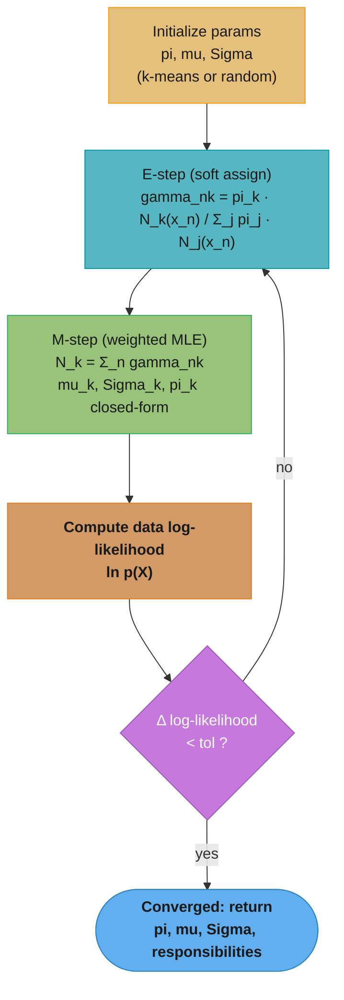
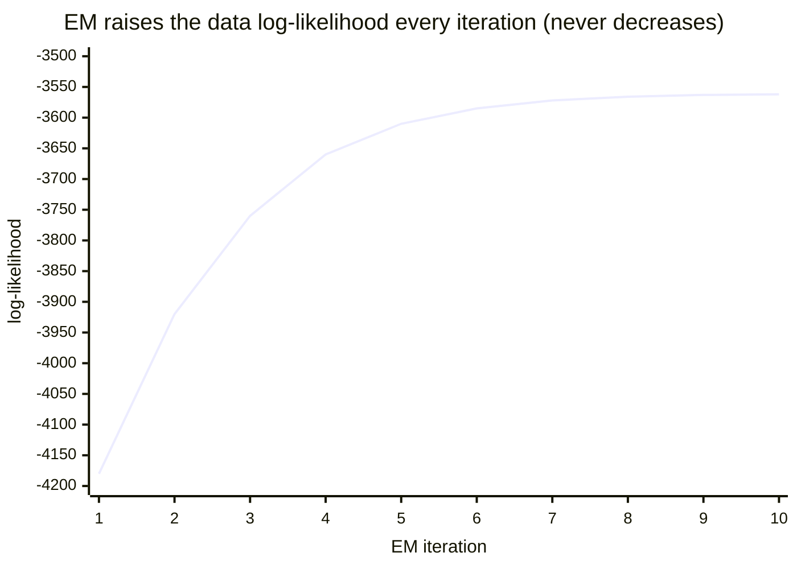
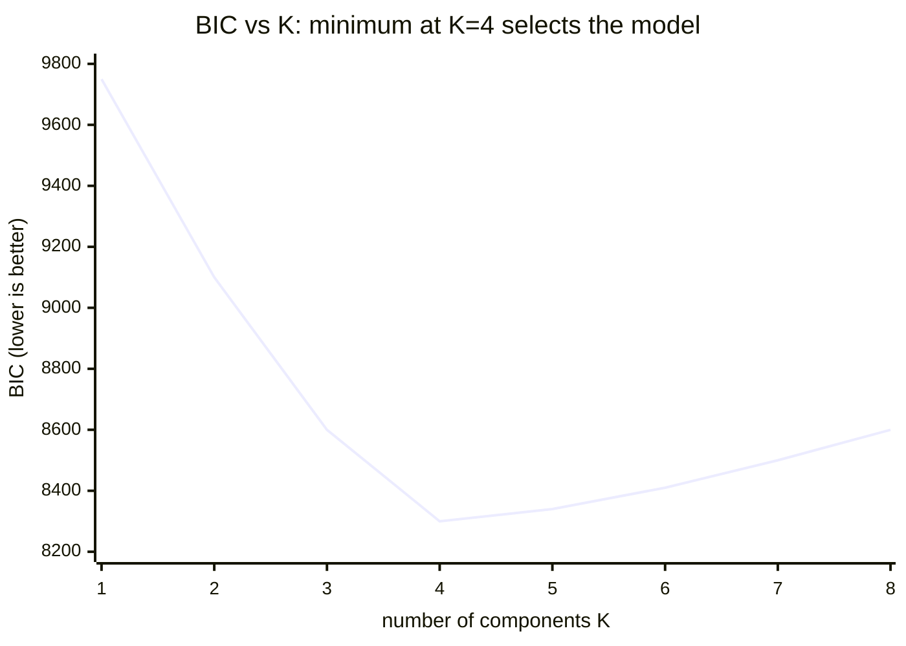
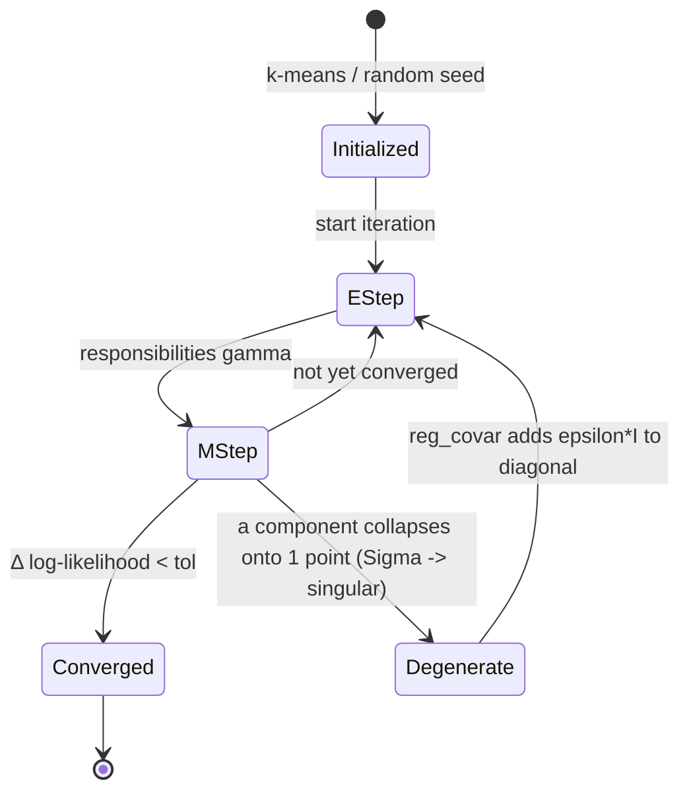

# Gaussian Mixture Models and the EM Algorithm — Deep Dive

Parent module: [../unsupervised_learning/README.md](../unsupervised_learning/README.md). That module introduces k-means, DBSCAN, and PCA with only passing mentions of GMM and EM. This sub-file is the deep dive: the latent-variable model, the full Expectation-Maximization derivation, and the production concerns (degeneracy, model selection, anomaly scoring).

---

## 1. Concept Overview

A **Gaussian Mixture Model (GMM)** is a probabilistic model that represents a density as a weighted sum of K Gaussian components:

```
p(x) = sum_{k=1}^{K} pi_k * N(x | mu_k, Sigma_k)
```

where `pi_k` are the mixture weights (`pi_k >= 0`, `sum_k pi_k = 1`), and each component is a multivariate Gaussian with mean `mu_k` and covariance `Sigma_k`. Unlike k-means, which returns a single hard cluster id per point, a GMM returns a full probability distribution over which component generated each point. It is simultaneously a **density estimator** (you can evaluate `p(x)` and sample from it), a **soft clustering** algorithm (responsibilities are soft memberships), and an **anomaly detector** (points with low `p(x)` are outliers).

**What it means.** "The density at any point is a weighted blend of K bell curves — each component says how likely the point is under its own ellipse, and the weight says how often that component gets used at all."

Reading it as a *blend* is what separates a GMM from a clustering algorithm. Every component contributes to `p(x)` at every point, however faintly, which is precisely why the output is a smooth density you can threshold for anomalies rather than a partition you can only label.

| Symbol | What it is |
|--------|------------|
| `p(x)` | Total probability density at `x`. A density, not a probability — it can exceed 1 |
| `K` | Number of components, chosen up front or by the BIC search in §4.4 |
| `pi_k` | Mixing weight of component k. The bias of the K-sided die from §2; must sum to 1 |
| `N(x \| mu_k, Sigma_k)` | Component k's own Gaussian density evaluated at `x` |
| `mu_k` | Component k's center |
| `Sigma_k` | Component k's covariance — the size, stretch, and rotation of its ellipse |
| `sum_{k=1}^{K}` | Adds the weighted component densities together. This sum inside a later `log` is what forces EM |

**Walk one example.** Two components, using the geometry already drawn in §5.5 — `mu_1 = (2, 3)`, `mu_2 = (8, 3)`, both with `Sigma = 4I` (an isotropic ellipse of standard deviation 2) and equal weights:

```
  x = (4, 3)          pi_1 = 0.5   pi_2 = 0.5

  component densities (worked out factor by factor in the walk after 6.2)
    N(x | mu_1, Sigma_1) = 0.024133      x is 2.0 units right of mu_1
    N(x | mu_2, Sigma_2) = 0.005385      x is 4.0 units left  of mu_2

  weighted blend
    p(x) = 0.5 * 0.024133  +  0.5 * 0.005385
         = 0.012066        +  0.002692
         = 0.014759          <- the mixture density at (4, 3)

  now tilt the die: pi_1 = 0.7, pi_2 = 0.3, same Gaussians
    p(x) = 0.7 * 0.024133  +  0.3 * 0.005385
         = 0.016893        +  0.001615
         = 0.018509          <- 25% higher, purely because component 1 got heavier
```

**Why the weights must sum to 1, and what breaks otherwise.** `sum_k pi_k = 1` is what makes `p(x)` integrate to 1 over the whole space — it is the constraint that keeps the mixture a probability distribution instead of an arbitrary sum of bumps. Drop it and every quantity downstream stops meaning anything: the log-likelihood can be inflated without bound by scaling the weights up, BIC comparisons across K become incomparable, and the anomaly threshold in §6.4 is calibrated against a density that no longer normalizes. In the M-step this is enforced structurally rather than by a penalty — `pi_k = N_k / N` with `sum_k N_k = N` can only ever produce weights that sum to 1.

The parameters cannot be fit by direct maximum likelihood because the log-likelihood contains a log-of-a-sum that couples all components. The **Expectation-Maximization (EM) algorithm** solves this by introducing a latent assignment variable `z` and alternating between two closed-form steps: the **E-step** computes posterior responsibilities `gamma(z_nk)` (the probability point n came from component k), and the **M-step** re-estimates `pi, mu, Sigma` as responsibility-weighted maximum-likelihood updates. EM is guaranteed to increase the data log-likelihood on every iteration — a property we prove below via the evidence lower bound (ELBO).

GMM/EM is the canonical **latent-variable model** taught before variational autoencoders (VAEs) and hidden Markov models, because its E and M steps are both available in closed form. It is a staple of senior-ML interviews precisely because it forces you to reason about latent variables, Jensen's inequality, MLE, and the k-means connection all at once.

---

## 2. Intuition

**One-line analogy:** k-means says "you belong to cluster 3." A GMM says "you are 70% cluster 3, 25% cluster 1, 5% cluster 2" — it hedges, and it knows the *shape* (an ellipse, not just a center) of each cluster.

**Mental model:** imagine the data was generated by a two-stage process. First, roll a K-sided biased die (the weights `pi_k`) to pick a component. Then draw a point from that component's Gaussian. You only observe the point, never the die roll. GMM/EM reverse-engineers the die probabilities and the Gaussians from the observed points alone.

**Why it matters:** most real data is a *mixture* of subpopulations — customers of different value tiers, pixels of foreground vs background, phonemes from different speakers. A single Gaussian (or a single mean, as in k-means) cannot capture elongated, rotated, or overlapping clusters. GMM captures all of these with full covariance ellipses and soft boundaries.

**Key insight (the chicken-and-egg that EM breaks):** if you knew which component each point came from, estimating `mu_k, Sigma_k` would be a trivial per-group MLE. If you knew `mu_k, Sigma_k`, computing each point's component probability would be trivial Bayes. You know neither. EM breaks the deadlock by guessing responsibilities (E-step), fitting parameters to that guess (M-step), and iterating — each round provably raises the likelihood.

**Key insight (k-means is GMM with the shape ripped out):** k-means is exactly a GMM where every covariance is forced to `epsilon * I` with `epsilon -> 0` and assignments hardened to the single nearest centroid. That is why k-means clusters are always round and equal-sized — it has thrown away the covariance.

---

## 3. Core Principles

**1. GMM is a latent-variable model.** Introduce a one-hot latent vector `z` with `z_k in {0,1}`, `sum_k z_k = 1`. The generative story is `p(z_k = 1) = pi_k` and `p(x | z_k = 1) = N(x | mu_k, Sigma_k)`. Marginalizing the latent recovers the mixture:

```
p(x) = sum_z p(z) p(x | z) = sum_{k=1}^{K} pi_k * N(x | mu_k, Sigma_k)
```

**2. Responsibilities are posteriors over the latent.** By Bayes' rule, the probability that point `x_n` was generated by component k:

```
gamma(z_nk) = p(z_k=1 | x_n) = pi_k N(x_n|mu_k,Sigma_k) / sum_j pi_j N(x_n|mu_j,Sigma_j)
```

Each `gamma(z_nk) in [0,1]` and rows sum to 1: `sum_k gamma(z_nk) = 1`.

**Stated plainly.** "This is the soft share of point `n` that component `k` owns — score the point under every component, weight each score by how popular that component is, and normalize so the shares add to one."

The normalization is the whole reason responsibilities behave like memberships. The numerator alone is an unbounded density; dividing by the sum over all components converts K incomparable density readings into K fractions of a single point, which is exactly what the M-step needs in order to average.

| Symbol | What it is |
|--------|------------|
| `gamma(z_nk)` | Responsibility: the share of point `n` owned by component `k`. A number in `[0, 1]` |
| `z_k = 1` | The latent one-hot "this point came from component k" — never observed, only inferred |
| `p(z_k=1 \| x_n)` | The posterior. Bayes' rule applied to the generative story of §2 |
| Numerator `pi_k N(x_n \| ...)` | Prior (how often k fires) times likelihood (how well k explains this point) |
| Denominator `sum_j ...` | The same quantity summed over every component — it is exactly `p(x_n)` |
| Row sums to 1 | The point is fully accounted for; the K shares partition it, they do not compete freely |

**Walk one example.** Same two components as §1 and §5.5 — `mu_1 = (2, 3)`, `mu_2 = (8, 3)`, `Sigma = 4I`, `pi = (0.5, 0.5)`:

```
  x = (4, 3)

  step 1 -- score under each component
    N(x | mu_1, Sigma_1) = 0.024133
    N(x | mu_2, Sigma_2) = 0.005385

  step 2 -- weight by the mixing prior
    k=1:  0.5 * 0.024133 = 0.012066
    k=2:  0.5 * 0.005385 = 0.002692
                           ---------
    denominator = p(x)   = 0.014759          (the same p(x) computed in 1)

  step 3 -- normalize
    gamma(z_1) = 0.012066 / 0.014759 = 0.817574
    gamma(z_2) = 0.002692 / 0.014759 = 0.182426
                                       --------
                                       1.000000    <- always, by construction

  reading: "(4,3) is about 82% component 1 and 18% component 2."
           k-means would have thrown the 18% away and stamped it cluster 1.

  the same arithmetic at three positions along the line y = 3
      x = (2, 3)   deep in component 1's core   gamma = 0.989013 / 0.010987
      x = (4, 3)   drifting right               gamma = 0.817574 / 0.182426
      x = (5, 3)   exactly halfway              gamma = 0.500000 / 0.500000
```

Those endpoints are the two numbers annotated on the §5.5 sketch: the core point at `~0.98` and the boundary point `x_b = (5, 3)` splitting `0.50 / 0.50`. The midpoint result is forced by symmetry — equal weights and equal covariances mean the two Mahalanobis distances tie at `2.25`, the densities are identical, and the normalization can only return one half each.

**3. The observed-data log-likelihood is a log-of-sum (hard to optimize directly).**

```
ln p(X | pi, mu, Sigma) = sum_{n=1}^{N} ln( sum_{k=1}^{K} pi_k N(x_n | mu_k, Sigma_k) )
```

The inner sum sits inside the log, so setting the gradient to zero gives coupled equations with no closed-form solution — hence EM.

**What the formula is telling you.** "Score how surprised the model is by each observed point, take logs so the scores add instead of multiply, and total them — one number saying how well the current `pi, mu, Sigma` explain the whole dataset."

This single number is also the convergence monitor: EM stops when it stops climbing. Its awkward shape — a log wrapped around a sum — is simultaneously the reason EM exists (no closed-form maximizer) and the reason the E-step's denominator is free (that inner sum is exactly the responsibility normalizer you already computed).

| Symbol | What it is |
|--------|------------|
| `ln p(X \| ...)` | Log-likelihood of the entire dataset under the current parameters. Higher (less negative) is better |
| `sum_{n=1}^{N}` | Over data points. Points are assumed independent, so their log-probabilities add |
| Inner `sum_k` | Over components. This is `p(x_n)` — the mixture density for one point |
| `ln` of that sum | The log-of-a-sum that blocks a closed-form MLE and forces the EM alternation |
| Sign | Always negative for densities below 1; only *changes* between iterations are meaningful |
| `Delta ln p` | Iteration-to-iteration improvement. EM's stopping rule: halt when `Delta < tol` (`1e-4` in §6.2) |

**Walk one example.** Five 1-D points, `K = 2`, starting from `mu = (2, 7)`, `sigma^2 = (4, 4)`, `pi = (0.5, 0.5)`. This is the running example for the rest of this section:

```
  X = 1, 2, 3, 8, 9        component 1: mu=2, var=4     component 2: mu=7, var=4
  1-D Gaussian: N(x) = exp(-(x-mu)^2 / (2*var)) / sqrt(2*pi*var),  sqrt(2*pi*4) = 5.0133

    x      N_1(x)     N_2(x)     p(x) = 0.5*N_1 + 0.5*N_2     ln p(x)
    1     0.176033   0.002216           0.089124             -2.417723
    2     0.199471   0.008764           0.104118             -2.262234
    3     0.176033   0.026995           0.101514             -2.287558
    8     0.002216   0.176033           0.089124             -2.417723
    9     0.000436   0.120985           0.060711             -2.801633
                                                             ----------
                                       ln p(X | theta_0)  =  -12.186871

  and across EM iterations (each row is one full E-step + M-step):
    iter 1   ln p(X) = -12.186871      Delta =      --
    iter 2   ln p(X) = -10.160275      Delta = +2.026596
    iter 3   ln p(X) =  -8.599735      Delta = +1.560540
    iter 4   ln p(X) =  -8.465259      Delta = +0.134476
    iter 5   ln p(X) =  -8.465259      Delta = +0.000000   -> Delta < tol, STOP
```

Every `Delta` is non-negative and the gains shrink fast — the shape drawn in §5.2, reproduced here on five points. That monotone climb is the property proved in §6.1, and it makes the log-likelihood a genuine assertion check: a *negative* `Delta` in your own implementation is always a bug, never a modeling result.

**4. EM maximizes a lower bound (ELBO) instead.** For any distribution `q(z)`, Jensen's inequality on the concave `ln` gives `ln p(X | theta) >= L(q, theta)` (the ELBO), with the gap equal to `KL(q || p(z | X, theta))`. E-step tightens the bound; M-step lifts it. See §6 for the full derivation and the monotonicity proof.

**5. M-step updates are responsibility-weighted MLE.** With `N_k = sum_n gamma(z_nk)` the effective count of points assigned to component k:

```
mu_k    = (1 / N_k) * sum_n gamma(z_nk) * x_n
Sigma_k = (1 / N_k) * sum_n gamma(z_nk) * (x_n - mu_k)(x_n - mu_k)^T
pi_k    = N_k / N
```

These are exactly the standard Gaussian MLE formulas, but with each point weighted by its soft responsibility instead of a hard 0/1 membership.

**In plain terms.** "Now that every point has declared what fraction of itself belongs to each component, refit each component as a weighted average — weighted center, weighted spread, and a weight equal to its share of the crowd."

Every one of the three updates is the same idea applied to a different quantity, which is why the M-step is closed-form while the direct MLE was not: once the responsibilities are held fixed, the coupling between components disappears and each component solves its own ordinary weighted-MLE problem.

| Symbol | What it is |
|--------|------------|
| `N_k` | Effective count: how many points component k owns once fractions are added up. Rarely an integer |
| `sum_k N_k = N` | The shares of every point add to one, so the effective counts add to the true count |
| `mu_k` | Weighted mean position. Points that barely belong barely move it |
| `(x_n - mu_k)(x_n - mu_k)^T` | Outer product — a `D x D` matrix, one point's contribution to the ellipse's shape |
| `Sigma_k` | Weighted covariance, so the ellipse's size, stretch, and rotation all come from owned points |
| `pi_k = N_k / N` | Component k's share of the dataset. Automatically non-negative and summing to 1 |
| `1 / N_k` | The normalizer that turns a weighted sum into a weighted average |

**Walk one example.** Continue the run started under principle 3 above — `X = 1, 2, 3, 8, 9` after the first E-step at `mu = (2, 7)`, `var = (4, 4)`, `pi = (0.5, 0.5)`. These are the responsibilities that E-step produced:

```
      x        gamma_1      gamma_2      (each row sums to 1)
      1       0.987568     0.012432
      2       0.957912     0.042088
      3       0.867036     0.132964      <- genuinely split; 13% of it belongs right
      8       0.012432     0.987568
      9       0.003594     0.996406

  EFFECTIVE COUNTS
    N_1 = 0.987568 + 0.957912 + 0.867036 + 0.012432 + 0.003594 = 2.828542
    N_2 = 0.012432 + 0.042088 + 0.132964 + 0.987568 + 0.996406 = 2.171458
    check: 2.828542 + 2.171458 = 5.000000 = N                    (always)

  WEIGHTS
    pi_1 = 2.828542 / 5 = 0.565708
    pi_2 = 2.171458 / 5 = 0.434292        sum = 1.000000

  MEANS (weighted average of x)
    sum_n gamma_1 * x = 0.987568 + 1.915824 + 2.601108 + 0.099456 + 0.032346
                      = 5.636302
    mu_1 = 5.636302 / 2.828542 = 1.992653      (moved from 2.000 -- barely)

    sum_n gamma_2 * x = 0.012432 + 0.084176 + 0.398892 + 7.900544 + 8.967654
                      = 17.363698
    mu_2 = 17.363698 / 2.171458 = 7.996331     (moved from 7.000 -> 8.00, a big jump)

  VARIANCES (weighted average of squared deviation from the NEW mean)
    sum_n gamma_1 * (x - mu_1)^2 = 0.973109 + 0.000052 + 0.879823
                                 + 0.448649 + 0.176476  = 2.478109
    var_1 = 2.478109 / 2.828542 = 0.876108      (collapsed from 4.00 -- much tighter)
    var_2 = 2.967966                            (same arithmetic on column 2)
```

Notice what the soft weighting bought: `x = 3` contributed `0.867` of a point to component 1's mean and `0.133` to component 2's, so it nudged both. Hard k-means assignment would have given it entirely to the left cluster and component 2 would never have seen it. Notice too that the variances must be computed with the **new** `mu_k`, not the old one — using the pre-update mean is the single most common hand-rolled-EM bug and shows up as a log-likelihood that decreases (see §5.2).

---

## 4. Types / Architectures / Strategies

### 4.1 Covariance types — the flexibility/parameter tradeoff

The single biggest modeling knob in a GMM is the covariance structure. More flexible covariances fit richer shapes but need more data and are more prone to singular collapse.

| Type | `Sigma_k` structure | Cov params (K comps, D dims) | Shapes it fits | Risk |
|------|---------------------|------------------------------|----------------|------|
| `spherical` | `sigma_k^2 * I` | `K` | Round balls, per-component radius | Underfits elongated clusters |
| `diagonal` | `diag(sigma_k1^2, ..., sigma_kD^2)` | `K*D` | Axis-aligned ellipses | Cannot model correlated features |
| `tied` | one shared full `Sigma` | `D(D+1)/2` | Same-shaped rotated ellipses | All clusters forced identical shape |
| `full` | per-component full `Sigma_k` | `K * D(D+1)/2` | Arbitrary rotated ellipses | Most singular-collapse prone; needs most data |

Rule of thumb: start with `full` for low dimensions (D < 10) and abundant data; drop to `diagonal` or `tied` when D is large or data is scarce — a `full` covariance in D=50 needs `50*51/2 = 1275` parameters *per component*.

### 4.2 Soft vs hard assignment

| Property | GMM (soft EM) | k-means (hard EM) |
|----------|---------------|-------------------|
| Assignment | Distribution `gamma(z_nk)` over all K | Single nearest centroid |
| Cluster shape | Full covariance ellipse | Isotropic (round), equal size |
| Objective | Maximize data log-likelihood | Minimize within-cluster SSE (inertia) |
| Output per point | Membership probabilities + density | Cluster id only |
| Overlap handling | Points in overlap get split responsibility | Overlap arbitrarily assigned to one side |
| Cost per iteration | `O(N K D^2)` (full cov) | `O(N K D)` |

### 4.3 k-means as the zero-covariance limit of GMM

Fix every covariance to `Sigma_k = epsilon * I` (shared, isotropic). The responsibility becomes:

```
gamma(z_nk) = pi_k exp(-||x_n-mu_k||^2 / 2*eps) / sum_j pi_j exp(-||x_n-mu_j||^2 / 2*eps)
```

As `epsilon -> 0`, the exponential with the *smallest* squared distance dominates, so `gamma(z_nk) -> 1` for the nearest centroid and `-> 0` for all others — a hard assignment. The M-step mean update then reduces to the average of the assigned points, which is exactly Lloyd's k-means centroid update. So **k-means = GMM(spherical, shared covariance -> 0, hard assignment)**, also called "hard EM." This is why k-means cannot separate two overlapping or elongated populations that a full-covariance GMM handles cleanly.

### 4.4 Model selection strategy

Choose K by minimizing an information criterion over candidate K:

```
BIC = -2 * ln L_hat + p * ln N       (heavier complexity penalty -> parsimonious)
AIC = -2 * ln L_hat + 2 * p          (lighter penalty -> tends to pick larger K)
```

where `L_hat` is the maximized likelihood and `p` is the number of free parameters (weights `K-1`, means `K*D`, plus the covariance count from the table in §4.1). BIC is the interview-default because its `ln N` penalty grows with data and yields a clean elbow; AIC optimizes predictive risk and often over-splits.

**Put simply.** "Take how badly the model fits, then charge rent for every parameter it used — the model with the smallest total bill wins."

The framing matters because likelihood alone cannot choose K: adding a component can only ever raise `ln L_hat`, so an unpenalized search runs away to one Gaussian per data point. The penalty term is the only thing standing between you and that degenerate answer, and BIC and AIC differ solely in what they charge.

| Symbol | What it is |
|--------|------------|
| `L_hat` | The maximized likelihood — the best `ln p(X)` EM reached for this K |
| `-2 * ln L_hat` | The misfit ("deviance"). Lower is better; the `-2` makes it a chi-squared-scaled quantity |
| `p` | Free parameter count: `(K-1)` weights + `K*D` means + the covariance count from §4.1 |
| `ln N` | BIC's price per parameter. Grows with dataset size, so big data buys stricter parsimony |
| `2` | AIC's price per parameter. Constant, independent of N |
| Lower is better | Both are bills to minimize, not scores to maximize |
| Which to use | BIC when you believe a true finite K exists; AIC when you only want predictive accuracy |

**Walk one example.** The BIC curve in §5.3 with `N = 1500`, `D = 2`, full covariance. Parameter count per component is `(K-1) + 2K + 3K = 6K - 1`, since a full `2x2` covariance has `D(D+1)/2 = 3` free entries:

```
  ln N = ln 1500 = 7.3132

    K     p = 6K-1     BIC penalty        -2 ln L_hat        BIC        AIC
    3        17        17 * 7.3132        8475.7           8600.0     8509.7
                       = 124.3
    4        23        23 * 7.3132        8131.8           8300.0     8177.8
                       = 168.2
    5        29        29 * 7.3132        8127.9           8340.0     8185.9
                       = 212.1

  what the K=4 -> K=5 step costs and buys
    fit improvement :  8131.8 - 8127.9  =    3.9    (5 components barely fit better)
    BIC charges     :  6 extra params * 7.3132  =  43.9   ->  43.9 > 3.9, REJECT
    AIC charges     :  6 extra params * 2       =  12.0   ->  12.0 >  3.9, REJECT

  both pick K=4, but look at the margins
    BIC:  8340.0 - 8300.0 = 40.1 worse   -> rejects K=5 emphatically
    AIC:  8185.9 - 8177.8 =  8.1 worse   -> rejects K=5 barely

  price per parameter:  BIC 7.3132  vs  AIC 2.0000   ->  BIC is 3.66x stricter here
```

That `3.66x` ratio is the whole story of "AIC over-splits." At `N = 1500` the two criteria happen to agree; the ratio is `ln N / 2`, so it *grows* with data — at `N = 100` BIC charges `4.61` per parameter, only `2.3x` AIC, while at `N = 1,000,000` it charges `13.82`, nearly `7x` AIC, and rejects extra components that AIC still happily buys. Report which criterion you used whenever you report a chosen K.

---

## 5. Architecture Diagrams

### 5.1 The EM loop



The E-step (teal) and M-step (green) alternate; each full cycle provably raises the orange log-likelihood node's value, so the purple convergence gate is a monotone test on `Δ ln p(X)`.

### 5.2 Log-likelihood is monotone non-decreasing across iterations



Fast gains early, then diminishing returns as the bound tightens. A *decrease* here is a bug (usually a covariance update computed with the pre-update mean, or a missing log-sum-exp).

### 5.3 BIC vs number of components — pick the elbow/minimum



BIC falls as added components explain real structure, then rises once extra components only add parameters — the minimum (here K=4) is the selected model. AIC's curve would bottom out later (larger K) because its penalty is lighter.

### 5.4 EM lifecycle including the degenerate branch



The healthy loop is E-step to M-step until convergence. The Degenerate state is the failure mode of §10/§6.2: without regularization a component shrinks onto a single point, its density diverges, and the likelihood becomes unbounded; `reg_covar` floors the covariance and returns EM to the healthy loop.

### 5.5 Soft assignment geometry (responsibilities split a boundary point)

```
        component 1                         component 2
        mu_1 = (2, 3)                        mu_2 = (8, 3)
     .-''''''-.                           .-''''''-.
    /   ( )    \        x_b (5, 3)        /    ( )   \
   |   1  * 1   |         *              |   2  * 2   |
    \   ( )    /       gamma=.50/.50      \    ( )   /
     '-......-'                            '-......-'
   dense core: gamma_1 ~ 0.98        boundary point x_b sits halfway:
   for points near mu_1              gamma(z=1) = 0.50, gamma(z=2) = 0.50
                                     k-means would force it fully to one side
```

The horizontal axis is real position: a point in the left core is ~98% component 1, while the midpoint `x_b` splits its responsibility 50/50. k-means collapses that nuance to a single hard label; the GMM keeps the uncertainty, which is what makes the density (and any downstream anomaly score) smooth.

---

## 6. How It Works — Detailed Mechanics

### 6.1 The EM derivation and the monotonicity proof

For any per-point distribution `q(z_n)` over the latent, decompose the log-likelihood:

```
ln p(x_n | theta) = L(q_n, theta) + KL( q_n(z_n) || p(z_n | x_n, theta) )

where  L(q_n, theta) = sum_{z_n} q_n(z_n) ln [ p(x_n, z_n | theta) / q_n(z_n) ]   (the ELBO)
```

Because `KL >= 0`, the ELBO `L` is a lower bound on `ln p(x_n | theta)`. EM alternates two maximizations of `L`:

- **E-step** — maximize `L` over `q` with `theta` fixed. The bound is tight (KL = 0) exactly when `q_n(z_n) = p(z_n | x_n, theta^old)`, i.e. the responsibilities `gamma(z_nk)`. After the E-step, `L(q^old, theta^old) = ln p(X | theta^old)`.
- **M-step** — maximize `L` over `theta` with `q` fixed. Dropping the `q`-only entropy term, this is maximizing the expected complete-data log-likelihood `Q(theta) = sum_n sum_k gamma(z_nk) [ ln pi_k + ln N(x_n | mu_k, Sigma_k) ]`, which has the closed-form solution in §3.

**Monotonicity proof** (why the log-likelihood never decreases):

```
ln p(X | theta^new) >= L(q^old, theta^new)      # ELBO is a lower bound (any theta)
                    >= L(q^old, theta^old)       # M-step maximizes L over theta
                    =  ln p(X | theta^old)       # E-step made the bound tight at theta^old
```

Hence `ln p(X | theta^new) >= ln p(X | theta^old)`. The likelihood is monotone non-decreasing; for a regularized model it is bounded above, so EM converges (to a stationary point — a local, not necessarily global, optimum).

**The idea behind it.** "The quantity you actually want is hard to climb, so build a floor underneath it that touches it exactly where you stand, push the floor up instead, and you have provably risen — because the thing above the floor was never lower than the floor."

Reading EM as floor-raising rather than as two ad-hoc update rules is what makes the two steps obviously necessary. The E-step's only job is to make the floor *touch* (`KL = 0`); the M-step's only job is to *lift* it. Take either away and the guarantee evaporates.

| Symbol | What it is |
|--------|------------|
| `ln p(x_n \| theta)` | The target — the log-likelihood you wish you could maximize directly |
| `q_n(z_n)` | Your current guess at the distribution over the latent for point n. Free to be anything |
| `L(q, theta)` | The ELBO, the floor. Always `<=` the target, for every `q` |
| `KL(q \|\| p(z\|x))` | The gap between floor and target. Always `>= 0`, and `= 0` only when `q` is the true posterior |
| E-step | Choose `q = gamma` -> `KL = 0` -> floor touches the target at the current `theta` |
| M-step | Hold `q` fixed, move `theta` to raise `L`. The target, being above `L`, is dragged up with it |
| `Q(theta)` | The part of `L` that depends on `theta`: expected complete-data log-likelihood |

**Walk one example.** Run the three-line proof with real numbers from the `X = 1, 2, 3, 8, 9` fit, taking one E-step at `theta_old = (mu=(2,7), var=(4,4), pi=(0.5,0.5))` and one M-step to `theta_new`:

```
  after the E-step at theta_old (q = the responsibilities gamma)
    ln p(X | theta_old)      = -12.186871
    L(q_old, theta_old)      = -12.186871      <- identical: KL = 0, the floor TOUCHES

  after the M-step (q still frozen at q_old, theta moved to theta_new)
    L(q_old, theta_new)      = -10.787070      <- the floor was lifted by +1.399801
    ln p(X | theta_new)      = -10.160274      <- the target rose even MORE

  the chain from the proof, instantiated
    -10.160274  >=  -10.787070  >=  -12.186871
     ln p(new)       L(q_old,new)     ln p(old) = L(q_old,old)

  total gain in the target: -10.160274 - (-12.186871) = +2.026597
  of which the floor accounts for +1.399801; the remaining +0.626796 is the
  KL gap that reopened because q_old is no longer the posterior under theta_new
```

That reopened gap of `0.626796` is exactly what the *next* E-step closes for free, which is why EM's improvements come in two flavors every round and why the target can rise faster than the bound. It also shows why a decreasing log-likelihood is impossible in a correct implementation: the chain has no step that permits it.

### 6.2 Hand-rolled EM in numpy

```python
from __future__ import annotations

import numpy as np
from numpy.typing import NDArray
from scipy.special import logsumexp


def _log_gaussian(X: NDArray[np.float64], mu: NDArray[np.float64],
                  Sigma: NDArray[np.float64]) -> NDArray[np.float64]:
    """log N(x_n | mu, Sigma) for every row of X, computed stably with slogdet."""
    D = X.shape[1]
    sign, logdet = np.linalg.slogdet(Sigma)          # log|Sigma|, sign guards singularity
    inv = np.linalg.inv(Sigma)
    diff = X - mu                                     # (N, D)
    maha = np.einsum("ni,ij,nj->n", diff, inv, diff)  # squared Mahalanobis distance
    return -0.5 * (D * np.log(2.0 * np.pi) + logdet + maha)


def gmm_em(
    X: NDArray[np.float64],
    K: int,
    n_iter: int = 200,
    tol: float = 1e-4,
    reg_covar: float = 1e-6,          # floors covariance -> prevents singular collapse
    seed: int = 0,
) -> dict[str, object]:
    """Fit a full-covariance GMM by Expectation-Maximization."""
    rng = np.random.default_rng(seed)
    N, D = X.shape

    # --- initialization: K random data points as means; global covariance; uniform weights
    mu = X[rng.choice(N, size=K, replace=False)].copy()      # (K, D)
    Sigma = np.stack([np.cov(X.T) + reg_covar * np.eye(D) for _ in range(K)])  # (K, D, D)
    pi = np.full(K, 1.0 / K)                                 # (K,)

    log_likes: list[float] = []
    gamma = np.zeros((N, K))
    for it in range(n_iter):
        # ---------- E-step: responsibilities via log-sum-exp (no underflow) ----------
        log_resp = np.empty((N, K))
        for k in range(K):
            log_resp[:, k] = np.log(pi[k]) + _log_gaussian(X, mu[k], Sigma[k])
        log_norm = logsumexp(log_resp, axis=1, keepdims=True)   # (N, 1)
        log_likes.append(float(log_norm.sum()))                 # total data log-likelihood
        gamma = np.exp(log_resp - log_norm)                     # (N, K), rows sum to 1

        # ---------- M-step: responsibility-weighted MLE ----------
        Nk = gamma.sum(axis=0)                                  # (K,) effective counts
        pi = Nk / N
        mu = (gamma.T @ X) / Nk[:, None]                        # (K, D)
        for k in range(K):
            diff = X - mu[k]                                    # (N, D)
            Sigma[k] = (gamma[:, k, None] * diff).T @ diff / Nk[k]
            Sigma[k] += reg_covar * np.eye(D)                  # regularize every update

        # ---------- convergence on the monotone log-likelihood ----------
        if it > 0 and abs(log_likes[-1] - log_likes[-2]) < tol:
            break

    return {"pi": pi, "mu": mu, "Sigma": Sigma, "gamma": gamma,
            "log_likelihood": np.asarray(log_likes)}


# Sanity check: two well-separated blobs recover the true means, LL increases monotonically.
# rng = np.random.default_rng(0)
# X = np.vstack([rng.normal([0, 0], 0.6, (300, 2)), rng.normal([6, 6], 0.9, (300, 2))])
# out = gmm_em(X, K=2)
# assert np.all(np.diff(out["log_likelihood"]) >= -1e-9)   # never decreases
```

The `_log_gaussian` helper above is the multivariate Gaussian density, written in logs:

```
N(x | mu, Sigma) = (2*pi)^(-D/2) * |Sigma|^(-1/2)
                   * exp( -0.5 * (x - mu)^T Sigma^-1 (x - mu) )

ln N(x | mu, Sigma) = -0.5 * ( D*ln(2*pi) + ln|Sigma| + (x-mu)^T Sigma^-1 (x-mu) )
```

**Read it like this.** "Measure how many standard deviations away the point is *in the ellipse's own stretched coordinates*, square that, and let the density fall off exponentially — then divide by the ellipse's volume so the whole thing still integrates to 1."

Splitting it that way is the useful mental model: one factor decides *shape* (how fast density falls with distance) and one decides *scale* (how tall the peak is). A wide covariance widens the ellipse and simultaneously lowers the peak, because the total probability mass is fixed at 1.

| Symbol | What it is |
|--------|------------|
| `D` | Number of dimensions |
| `x - mu` | Offset from the component's center |
| `Sigma^-1` | Inverse covariance ("precision"). Rescales the offset so 1 unit = 1 standard deviation along each axis |
| `(x-mu)^T Sigma^-1 (x-mu)` | **Squared Mahalanobis distance** — the `maha` term in the code. Scale-free and rotation-aware |
| `exp(-0.5 * maha)` | The bell curve itself. `maha = 0` gives 1 at the peak; density decays fast outward |
| `\|Sigma\|` | Determinant — the ellipse's "volume". Big ellipse, low peak |
| `(2*pi)^(-D/2) \* \|Sigma\|^(-1/2)` | The normalizing constant, everything needed to make the integral equal 1 |
| `slogdet` | numpy's stable `ln\|Sigma\|`; the returned `sign` is the singularity alarm from §6.3 |

**Walk one example.** The component from §1 and §5.5: `mu = (2, 3)`, `Sigma = 4I` (so `D = 2`, standard deviation 2 on each axis, no correlation):

```
  x = (3, 5)          x - mu = (1, 2)

  SHAPE FACTOR -- squared Mahalanobis distance
    Sigma^-1 = [ 0.25   0    ]
               [ 0      0.25 ]
    maha = 0.25*(1^2) + 0.25*(2^2)  =  0.25 + 1.00  =  1.25
           (1 unit right is only 0.5 sd; 2 units up is 1.0 sd -> 0.5^2 + 1.0^2 = 1.25)
    exp(-0.5 * 1.25) = exp(-0.625) = 0.535261

  SCALE FACTOR -- the normalizing constant
    |Sigma| = 4 * 4 - 0 * 0 = 16          sqrt(16) = 4
    (2*pi)^(-D/2) = 1 / (2*pi) = 0.159155
    constant = 0.159155 / 4 = 0.039789    <- the density at the peak, x = mu

  DENSITY
    N(x | mu, Sigma) = 0.039789 * 0.535261 = 0.021297

  in logs, the way the code computes it (no underflow at high D)
    ln N = -0.5 * ( 2*1.837877  +  2.772589  +  1.25 )
         = -0.5 * ( 3.675754    +  2.772589  +  1.25 )
         = -0.5 * 7.698343
         = -3.849171             and exp(-3.849171) = 0.021297   (matches)

  same component, the point used in the mixture walks
    x = (4, 3):  maha = 0.25*(2^2) + 0 = 1.00
                 N = 0.039789 * exp(-0.5) = 0.039789 * 0.606531 = 0.024133
```

**Why the log form is not just tidiness.** At `D = 50` a typical density is around `1e-40`; multiply a few of those inside the E-step's ratio and float64 flushes to exactly `0.0`, turning every responsibility into `0/0 = NaN`. Working in logs and normalizing with `logsumexp` (as §6.2 does) keeps every intermediate in a representable range — this is the same trick as a numerically stable softmax, and it is why the code never calls `np.exp` until *after* subtracting `log_norm`.

### 6.3 Broken -> fix: singular covariance collapse

The classic EM failure: with `reg_covar = 0`, a component's mean can drift onto a single point and its covariance shrinks toward zero. The Gaussian density at that point then diverges (`|Sigma| -> 0` makes `logdet -> -inf`, so the density `-> +inf`), the log-likelihood becomes unbounded, and `np.linalg.inv(Sigma)` returns garbage or raises `LinAlgError`.

```python
# BROKEN — no covariance floor. One component collapses onto a near-duplicate point,
# Sigma_k -> singular, log-likelihood explodes to +inf, responsibilities become NaN.
def gmm_em_broken(X, K):
    # ... identical to gmm_em but with:
    Sigma[k] = (gamma[:, k, None] * diff).T @ diff / Nk[k]     # NO reg term
    # After a few iterations for K too large / duplicated data:
    #   np.linalg.slogdet(Sigma[k]) -> (0.0, -inf)     |Sigma| = 0  (singular)
    #   _log_gaussian -> +inf at the collapsed point
    #   gamma -> NaN, log_likelihood -> +inf   (the "likelihood is unbounded" pathology)
    ...

# FIXED — add reg_covar * I to the diagonal of every covariance after each M-step.
# This is a MAP estimate under a weak inverse-Wishart prior: it bounds |Sigma| away
# from zero, so no component can achieve infinite density on a single point.
Sigma[k] = (gamma[:, k, None] * diff).T @ diff / Nk[k]
Sigma[k] += reg_covar * np.eye(D)                              # floor eigenvalues >= reg_covar
```

sklearn exposes this as the `reg_covar` constructor argument (default `1e-6`). If you still see collapse, the additional fixes are: use `init_params="k-means"` (better starts avoid empty/degenerate components), reduce K, switch to `covariance_type="diagonal"` or `"tied"` (fewer parameters to collapse), and increase `n_init` so a bad run is discarded.

### 6.4 sklearn GaussianMixture — covariance types, BIC selection, anomaly scoring

```python
from __future__ import annotations

import numpy as np
from numpy.typing import NDArray
from sklearn.mixture import GaussianMixture
from sklearn.datasets import make_blobs


def select_k_by_bic(
    X: NDArray[np.float64],
    k_range: range = range(1, 9),
    covariance_type: str = "full",
) -> tuple[int, GaussianMixture]:
    """Fit GMMs across K, return the K (and refit model) minimizing BIC."""
    best_bic, best_k, best_model = np.inf, None, None
    for k in k_range:
        gmm = GaussianMixture(
            n_components=k,
            covariance_type=covariance_type,
            init_params="k-means++",   # strong init -> fewer local optima
            n_init=10,                 # 10 restarts, keep the highest-likelihood fit
            reg_covar=1e-6,            # singular-collapse guard
            random_state=42,
        ).fit(X)
        bic = gmm.bic(X)
        print(f"K={k}  BIC={bic:10.1f}  AIC={gmm.aic(X):10.1f}  "
              f"converged={gmm.converged_}  n_iter={gmm.n_iter_}")
        if bic < best_bic:
            best_bic, best_k, best_model = bic, k, gmm
    print(f"\nSelected K={best_k} (lowest BIC={best_bic:.1f})")
    return best_k, best_model


def compare_covariance_types(X: NDArray[np.float64], k: int = 4) -> None:
    """Show the params/flexibility tradeoff across covariance structures."""
    for cov in ("spherical", "diagonal", "tied", "full"):
        gmm = GaussianMixture(n_components=k, covariance_type=cov,
                              n_init=5, random_state=0).fit(X)
        print(f"{cov:10s}  BIC={gmm.bic(X):9.1f}  free_params={gmm._n_parameters():4d}")


def gmm_anomaly_scores(
    gmm: GaussianMixture,
    X: NDArray[np.float64],
    contamination: float = 0.01,
) -> tuple[NDArray[np.float64], float]:
    """Anomaly score = negative log-density; threshold at the contamination percentile."""
    log_density = gmm.score_samples(X)          # per-sample log p(x)
    scores = -log_density                         # high score = unlikely = anomalous
    threshold = np.quantile(scores, 1.0 - contamination)
    flagged = scores >= threshold                 # bottom 1% density flagged
    print(f"Threshold (neg-log-density): {threshold:.2f}  flagged: {flagged.sum()}")
    return scores, float(threshold)


# X, _ = make_blobs(n_samples=1500, centers=4, cluster_std=[1.0, 2.5, 0.5, 1.8],
#                   random_state=42)
# k, model = select_k_by_bic(X)                 # typically recovers K=4
# compare_covariance_types(X, k=4)              # full has the most params, best BIC here
# proba = model.predict_proba(X)                # soft responsibilities, shape (N, 4)
# hard = model.predict(X)                       # hard labels (argmax of responsibilities)
# new_samples, comp = model.sample(10)          # GMM is generative: draw new points
```

### 6.5 k-means as hard-EM, demonstrated

```python
def kmeans_is_hard_em(X: NDArray[np.float64], k: int = 3) -> None:
    """A spherical GMM with a tiny shared variance behaves like k-means (hard assign)."""
    from sklearn.cluster import KMeans

    km = KMeans(n_clusters=k, n_init=10, random_state=0).fit(X)
    # Force spherical covariance; GMM's soft responsibilities collapse toward one-hot
    # as the components separate (variance small relative to inter-centroid distance).
    gmm = GaussianMixture(n_components=k, covariance_type="spherical",
                          n_init=10, random_state=0).fit(X)
    resp = gmm.predict_proba(X)                          # near-one-hot for separated blobs
    max_resp = resp.max(axis=1)
    print(f"k-means inertia:            {km.inertia_:.1f}")
    print(f"mean max responsibility:    {max_resp.mean():.3f}  "
          f"(-> 1.0 means effectively hard assignment)")
    # For well-separated blobs, mean max responsibility is ~0.99: the soft GMM has
    # degenerated into the same hard partition k-means produces.
```

---

## 7. Real-World Examples

**Speaker verification (GMM-UBM), telecom and banking.** Before x-vectors and deep speaker embeddings, the dominant speaker-recognition system was the GMM Universal Background Model. A 512-to-2048-component GMM is trained on MFCC features from thousands of speakers to model "speech in general" (the UBM); each enrolled speaker is then MAP-adapted from the UBM on a few utterances. Verification scores the likelihood ratio of the claimed-speaker GMM vs the UBM. This ran in production at call centers for fraud detection well into the 2010s because it needed only seconds of audio per speaker.

**Background subtraction in video (Mixture of Gaussians per pixel).** OpenCV's `BackgroundSubtractorMOG2` models *each pixel's* color over time as a small GMM (3-5 components). Stable background colors form high-weight components; a pixel whose current color has low probability under its GMM is flagged as foreground (a moving object). This runs at 30+ FPS on CPU and is still the default in many surveillance pipelines.

**Color quantization and image segmentation.** Fitting a GMM to the RGB (or Lab) values of an image's pixels yields K representative colors (the means) with soft membership, giving smoother segmentation boundaries than hard k-means color quantization — useful in medical imaging where a pixel genuinely lies between tissue types.

**Financial anomaly / fraud scoring.** A GMM fit to normal transaction feature vectors provides a smooth density `p(x)`; transactions with `p(x)` below a percentile threshold are scored as anomalies. Unlike a hard clustering, the density gives a continuous risk score that downstream rules can threshold per business unit. This is the density-based cousin of the autoencoder anomaly detector in the parent module.

**Customer segmentation with uncertainty.** Where k-means forces every customer into one segment, a GMM reports that a customer is "60% high-value, 40% at-risk," letting marketing target the boundary customers with blended campaigns and prioritize by responsibility confidence. See §14.

---

## 8. Tradeoffs

### 8.1 GMM vs k-means vs DBSCAN

| Concern | GMM (EM) | k-means | DBSCAN |
|---------|----------|---------|--------|
| Cluster shape | Elliptical (full covariance) | Spherical, equal size | Arbitrary |
| Assignment | Soft (probabilities) | Hard | Hard + noise label |
| Density estimate | Yes — evaluate & sample `p(x)` | No | No |
| Needs K up front | Yes (or BIC search) | Yes | No (eps, min_samples) |
| Handles overlap | Yes (splits responsibility) | Poorly | Merges dense regions |
| Outlier handling | Low-density scoring | None (all points assigned) | Explicit `-1` noise |
| Cost / iteration | `O(N K D^2)` full cov | `O(N K D)` | `O(N log N)` with index |
| Failure mode | Singular covariance collapse | Bad init -> poor local opt[imum] | eps sensitivity |

### 8.2 GMM vs single Gaussian vs KDE for density estimation

| Method | Params | Multimodal | Sampling | Scales to large N |
|--------|--------|-----------|----------|-------------------|
| Single Gaussian | `D + D(D+1)/2` | No | Trivial | Yes |
| GMM (K comps) | `K-1 + K*D + cov` | Yes | Trivial (pick comp, sample) | Yes (parametric) |
| KDE | Stores all N points | Yes | Resample points + jitter | Poor — `O(N)` per query |

GMM is the parametric middle ground: far more expressive than one Gaussian, far cheaper at query time than KDE (which stores every training point).

### 8.3 Covariance type tradeoff

| Type | Underfit risk | Overfit / singular risk | Data efficiency |
|------|---------------|-------------------------|-----------------|
| spherical | High | Lowest | Best (fewest params) |
| diagonal | Medium | Low | Good |
| tied | Medium | Low-medium | Good |
| full | Lowest | Highest | Worst (needs most data) |

---

## 9. When to Use / When NOT to Use

**Use a GMM when:**
- You need soft cluster memberships or per-point uncertainty, not a hard label.
- Clusters are elliptical, rotated, overlapping, or of unequal size — where k-means visibly fails.
- You need an actual density `p(x)` to evaluate or sample from (generative use, anomaly scoring).
- You want a principled way to choose the number of components via BIC/AIC.
- The data is genuinely a mixture of a *small* number of roughly-Gaussian subpopulations.

**Use k-means instead when:**
- You only need hard labels and clusters are roughly round and equal-sized.
- N is very large and `O(N K D^2)` full-covariance EM is too slow (k-means is `O(N K D)`).
- Speed and simplicity dominate; you do not need probabilities or a density.

**Do NOT use a GMM when:**
- Clusters are strongly non-convex (rings, spirals, crescents) — the Gaussian assumption breaks; use DBSCAN/HDBSCAN or spectral clustering.
- D is very high relative to N (full covariance needs `~D^2/2` params per component; you will hit singular collapse) — reduce with PCA first, or use `diagonal`/`tied`.
- Components are not remotely Gaussian and cannot be transformed to be so.
- You need robustness to heavy outliers — a few extreme points distort covariances; consider a Student-t mixture or robust covariance.

---

## 10. Common Pitfalls

**Pitfall 1 — Singular covariance collapse (the signature EM failure).** With `reg_covar=0`, a component drifts onto a single point (or a set of duplicate rows); its covariance shrinks, `|Sigma| -> 0`, the density at that point diverges, and the log-likelihood shoots to `+inf` while responsibilities become `NaN`. This looks like "great likelihood!" but the model is garbage. Fix: keep `reg_covar > 0` (sklearn default `1e-6`; raise to `1e-4`/`1e-3` for high-D data), use k-means initialization, reduce K, or drop to a lower-parameter covariance type. Always assert the log-likelihood is finite and non-decreasing.

**Pitfall 2 — Forgetting to scale features.** Like all distance/covariance-based methods, GMM is scale-sensitive. A feature ranging 0-500,000 (annual spend) dominates the covariance and the Gaussians stretch along it, ignoring features ranging 0-100. Fix: `StandardScaler` before fitting; with heavy outliers use `RobustScaler`.

**Pitfall 3 — Treating EM's optimum as global.** EM only guarantees convergence to a *local* maximum (or saddle). Different initializations give different fits, and a single run can land in a poor mode with one giant component swallowing everything. Fix: `n_init=10` (sklearn keeps the highest-likelihood run) and `init_params="k-means++"`. Report that the solution is init-dependent.

**Pitfall 4 — Choosing K by likelihood alone.** The training log-likelihood always increases with more components (K=N gives a spike on every point), so "pick K that maximizes likelihood" over-splits catastrophically. Fix: use BIC (or AIC), which penalize parameter count, and look for the elbow/minimum — not the raw likelihood.

**Pitfall 5 — Full covariance in high dimensions.** A `full` covariance needs `D(D+1)/2` parameters per component — 1275 at D=50. With limited data this is unidentifiable and collapses. Fix: PCA down to ~10-20 dims first, or use `covariance_type="diagonal"`/`"tied"`.

**Pitfall 6 — Label switching between runs.** Component indices are arbitrary: "component 2" in one fit is not "component 2" in the next (EM has no canonical ordering). Teams that store the raw component id as a downstream feature see it silently change across retrains. Fix: match components across runs by mean/weight (Hungarian assignment), or reuse a single persisted fitted model rather than refitting.

**Pitfall 7 — Log-of-product underflow in a hand-rolled E-step.** Multiplying many small Gaussian densities underflows to 0 in float64, making responsibilities `0/0 = NaN`. Fix: work entirely in log-space and normalize with log-sum-exp (`scipy.special.logsumexp`), exactly as in §6.2. sklearn already does this internally.

---

## 11. Technologies & Tools

| Tool | Purpose | Notes |
|------|---------|-------|
| `sklearn.mixture.GaussianMixture` | Standard EM-fit GMM | `covariance_type`, `reg_covar`, `n_init`, `bic()`/`aic()`, `score_samples()`, `sample()` |
| `sklearn.mixture.BayesianGaussianMixture` | Variational (Dirichlet-process) GMM | Prunes unused components automatically — pick an upper bound on K, let it shrink |
| `scipy.stats.multivariate_normal` | Component density / sampling | `logpdf` for a stable per-component log-density |
| `scipy.special.logsumexp` | Numerically stable E-step normalization | Prevents underflow in log-space responsibilities |
| `numpy.linalg.slogdet` / `cholesky` | Stable `log|Sigma|`, safe inversion | Cholesky also detects non-PSD covariance early |
| OpenCV `BackgroundSubtractorMOG2` | Per-pixel GMM background subtraction | Real-time video foreground detection |
| `pomegranate` | Flexible probabilistic mixtures & HMMs | Mixtures of non-Gaussian distributions |

---

## 12. Interview Questions with Answers

**Q: How is a Gaussian Mixture Model different from k-means?**
A GMM assigns each point a soft probability distribution over clusters and models each cluster as a full-covariance ellipse, while k-means assigns one hard label and models only a spherical center. k-means minimizes within-cluster squared distance (inertia); a GMM maximizes data log-likelihood, so it can capture elongated, rotated, and overlapping clusters of unequal size that k-means cannot. The cost is that GMM is more expensive (`O(N K D^2)` per iteration for full covariance) and more prone to singular collapse.

**Q: Is k-means a special case of a GMM?**
Yes — k-means is a GMM with a shared spherical covariance driven to zero and hard assignments (called "hard EM"). Fixing `Sigma_k = epsilon * I` and letting `epsilon -> 0` makes each responsibility collapse to 1 for the nearest centroid and 0 elsewhere, and the M-step mean update becomes the average of assigned points, which is exactly Lloyd's algorithm. This is why k-means clusters are always round and equal-sized: it has thrown away the covariance.

**Q: What is a responsibility in EM?**
A responsibility `gamma(z_nk)` is the posterior probability that point n was generated by component k, given the current parameters. It equals `pi_k N(x_n | mu_k, Sigma_k)` divided by the same quantity summed over all components, so each point's responsibilities are non-negative and sum to 1. Responsibilities are computed in the E-step and used as soft weights in the M-step's MLE updates.

**Q: Walk through the E-step and the M-step.**
The E-step computes responsibilities `gamma(z_nk)` from the current parameters using Bayes' rule (soft-assign each point to components). The M-step then re-estimates parameters as responsibility-weighted MLE: `N_k = sum_n gamma(z_nk)`, `mu_k = (1/N_k) sum_n gamma(z_nk) x_n`, `Sigma_k` is the weighted covariance around `mu_k`, and `pi_k = N_k / N`. The two steps alternate until the log-likelihood stops improving.

**Q: Why is EM's log-likelihood guaranteed never to decrease?**
Because EM optimizes the ELBO, a lower bound on the log-likelihood, and both steps only raise it. The E-step makes the bound tight at the current parameters (KL = 0), and the M-step maximizes the bound over parameters, so the new log-likelihood is at least the old ELBO, which equals the old log-likelihood. Formally: `ln p(X|theta_new) >= L(q_old, theta_new) >= L(q_old, theta_old) = ln p(X|theta_old)`.

**Q: Does EM converge to the global optimum?**
No — EM converges only to a local maximum or a saddle point of the likelihood, and the result depends on initialization. A poor start can yield one dominant component or a degenerate fit, so practitioners run multiple restarts (`n_init=10`) with k-means++ initialization and keep the highest-likelihood run. The likelihood surface of a GMM is non-convex and even has singular points where the likelihood is unbounded.

**Q: What is the singular covariance / degeneracy problem and how do you fix it?**
It happens when a component collapses onto a single point: its covariance shrinks toward zero, its density at that point diverges, and the log-likelihood becomes unbounded (with NaN responsibilities). This is a genuine pathology of maximum-likelihood GMM, not a numerical accident. Fix it by adding a small `reg_covar * I` to every covariance after each M-step (a MAP estimate under a weak inverse-Wishart prior) — sklearn's `reg_covar` default is `1e-6` — and by using k-means init, fewer components, or a lower-parameter covariance type.

**Q: How do you choose the number of components K?**
Fit GMMs across a range of K and pick the K minimizing BIC (or AIC): `BIC = -2 ln L + p ln N`, where p is the free-parameter count. BIC's `ln N` penalty grows with data and produces a clear elbow/minimum, favoring parsimony; AIC (`2p` penalty) is lighter and tends to select larger K. Never pick K by training likelihood alone, because it always increases with more components.

**Q: What are the covariance types and their tradeoff?**
Spherical (`sigma^2 I`, 1 param per comp), diagonal (`D` params, axis-aligned ellipses), tied (one shared full covariance), and full (`D(D+1)/2` params per comp, arbitrary rotated ellipses). More flexible types fit richer shapes but need more data and are more prone to singular collapse — a full covariance at D=50 is 1275 parameters per component. Start full for low-D with ample data; drop to diagonal or tied when D is large or data is scarce.

**Q: What is the ELBO and how does EM relate to it?**
The ELBO (evidence lower bound) is `L(q, theta) = E_q[ln p(x,z|theta)] - E_q[ln q(z)]`, a lower bound on `ln p(x|theta)` whose gap is exactly `KL(q || p(z|x,theta))`. EM is coordinate ascent on this bound: the E-step maximizes it over `q` (setting `q` to the posterior, closing the KL gap), and the M-step maximizes it over `theta`. This is the same ELBO that variational inference and VAEs optimize — EM is the special case where the E-step posterior is available in closed form.

**Q: How do you use a GMM for anomaly detection?**
Fit a GMM on normal data, then score each point by its negative log-density `-ln p(x)` from `score_samples`, and flag points above a threshold (e.g. the 99th percentile) as anomalies. Because the GMM gives a smooth continuous density rather than hard labels, the score is a graded risk signal you can threshold per business need. It handles multimodal normal data that a single-Gaussian detector would miss.

**Q: Why must the E-step use log-sum-exp?**
Because multiplying many small Gaussian densities underflows to zero in floating point, turning responsibilities into `0/0 = NaN`. Working in log-space and normalizing with the log-sum-exp trick (subtract the row max before exponentiating) keeps everything finite and numerically stable. sklearn does this internally; a hand-rolled EM must do it explicitly.

**Q: How does a GMM relate to a VAE or variational EM?**
Both optimize the same ELBO, but a GMM's E-step posterior is a closed-form categorical over K components while a VAE's latent posterior is intractable. Because the VAE posterior cannot be computed exactly, it is approximated by an encoder network `q_phi(z|x)`, and the "E-step" becomes a gradient update on `phi`. A GMM is exact EM; a VAE is amortized variational EM with continuous latents and a neural decoder in place of the Gaussian components. Understanding GMM/EM is the standard on-ramp to VAEs.

**Q: Can a GMM overfit, and how do you control it?**
Yes — adding components always raises training likelihood, so an unconstrained GMM can place a near-degenerate component on nearly every point. Control it with BIC/AIC for K selection, `reg_covar` to bound covariances, lower-parameter covariance types (diagonal/tied), and a held-out log-likelihood check. A Bayesian (Dirichlet-process) GMM can also prune unused components automatically.

**Q: What is the computational complexity of EM per iteration?**
It is `O(N K D^2)` for full covariance (the `D^2` comes from evaluating and inverting each `D x D` covariance and the Mahalanobis distances), versus `O(N K D)` for k-means. Diagonal or spherical covariances drop the per-component cost toward `O(N K D)`. Memory is `O(N K)` for the responsibility matrix plus `O(K D^2)` for the covariances.

**Q: When would you prefer a GMM over a single multivariate Gaussian for density estimation?**
When the data is multimodal — a single Gaussian can only capture one bump and will place its mean in a low-density valley between two clusters, giving a badly wrong density. A GMM with K components captures K modes while staying parametric and cheap to sample from, unlike KDE which stores every training point and costs `O(N)` per query. Use BIC to decide how many modes the data actually supports.

**Q: Why does k-means struggle with clusters of different sizes or densities, and does a GMM fix it?**
k-means minimizes squared distance with an implicit assumption of equal-radius spherical clusters, so it slices a large-variance cluster and steals points from a small dense one nearby. A full-covariance GMM fixes both problems: each component learns its own covariance (size and shape) and its own weight `pi_k` (relative frequency), so a small tight cluster and a large diffuse one coexist correctly. This is one of the most common motivating examples for GMM in interviews.

---

## 13. Best Practices

1. **Scale features first.** Apply `StandardScaler` (or `RobustScaler` with outliers) before fitting — GMM covariances are scale-sensitive exactly like k-means distances.
2. **Always keep `reg_covar > 0`.** Default `1e-6` prevents singular collapse; raise to `1e-4`/`1e-3` in high dimensions. Assert the log-likelihood is finite and monotone non-decreasing during development.
3. **Use `n_init >= 10` with `init_params="k-means++"`.** EM is init-sensitive and only finds local optima; multiple restarts keep the best run.
4. **Choose K with BIC/AIC, not training likelihood.** Sweep K, plot BIC, pick the elbow/minimum. Prefer BIC for parsimony; AIC if you optimize predictive risk.
5. **Match covariance type to data budget.** Full covariance for low-D with ample data; diagonal or tied when D is large or samples are few. PCA-reduce before a full-covariance GMM in high D.
6. **Reuse the fitted model; never re-fit for stability.** Component indices are arbitrary and switch between runs — persist one fitted model rather than refitting, or align components via the Hungarian algorithm.
7. **For anomaly detection, threshold `score_samples`.** Use `-ln p(x)` at a chosen percentile (e.g. 99th) and validate the threshold on a labeled holdout.
8. **Let a Bayesian GMM pick K when unsure.** `BayesianGaussianMixture` with a large upper-bound K and a Dirichlet-process prior prunes unneeded components automatically.
9. **Verify component health.** Check that no `pi_k` collapses to near-zero and no covariance has a tiny determinant — both are early signs of degeneracy.
10. **Report soft memberships, not just argmax.** The value of a GMM over k-means is the responsibility distribution; surface it (e.g. "60% segment A / 40% segment B") to downstream consumers.

---

## 14. Case Study

**Problem.** A subscription streaming company has 4M active users and wants behavioral segments for lifecycle marketing. The existing k-means (k=5) segmentation is brittle: boundary users flip segments week to week, "power users" and "binge-then-churn" users are lumped together because both have high watch-time, and marketing wants a *confidence* per assignment so they can target only high-confidence members of the "at-risk high-value" segment. They also want the same model to flag anomalous accounts (bots, shared credentials) for the trust-and-safety team.

**Why a GMM.** Three requirements point away from k-means: (1) soft memberships with confidence, (2) clusters of clearly different shape and size (a small, tight "power user" cluster next to a large, diffuse "casual" cluster — the exact case k-means mishandles), and (3) a reusable density for anomaly scoring. A GMM delivers all three from one fitted model: `predict_proba` gives confidences, full covariance captures unequal shapes, and `score_samples` gives an anomaly score.

**Feature engineering.** Eight standardized behavioral features per user: sessions/week, avg session minutes, unique titles/month, genre-diversity entropy, days-since-last-session (recency), % completed titles, late-night-viewing share, and price tier. `StandardScaler` is mandatory — raw watch-minutes (0-3000) would otherwise dominate recency (0-30).

**Model selection.** Sweep K = 1..10 with `covariance_type="full"`, `n_init=10`, `reg_covar=1e-4` (D=8, so full covariance is 36 params/component — comfortable with 4M rows). BIC bottoms out at K=6; AIC keeps falling to K=9, so BIC's K=6 is chosen for interpretable, parsimonious segments.

```python
from __future__ import annotations

import numpy as np
from numpy.typing import NDArray
from sklearn.mixture import GaussianMixture
from sklearn.preprocessing import StandardScaler


def build_segmentation(
    X_raw: NDArray[np.float64],
    k_range: range = range(2, 11),
) -> tuple[StandardScaler, GaussianMixture, int]:
    """Scale, select K by BIC, fit a full-covariance GMM for soft segmentation."""
    scaler = StandardScaler().fit(X_raw)
    X = scaler.transform(X_raw)

    best_bic, best_k, best_model = np.inf, None, None
    for k in k_range:
        gmm = GaussianMixture(
            n_components=k, covariance_type="full",
            init_params="k-means++", n_init=10,
            reg_covar=1e-4,             # high-D-safe covariance floor
            max_iter=300, random_state=42,
        ).fit(X)
        bic = gmm.bic(X)
        if bic < best_bic:
            best_bic, best_k, best_model = bic, k, gmm
    return scaler, best_model, best_k


def segment_users(
    scaler: StandardScaler,
    gmm: GaussianMixture,
    X_raw: NDArray[np.float64],
    confidence_floor: float = 0.60,
) -> dict[str, NDArray]:
    """Return hard labels, soft responsibilities, high-confidence mask, anomaly scores."""
    X = scaler.transform(X_raw)
    resp = gmm.predict_proba(X)                 # (N, K) soft memberships
    labels = resp.argmax(axis=1)                # hard label = argmax responsibility
    confidence = resp.max(axis=1)               # per-user assignment confidence
    high_conf = confidence >= confidence_floor  # target only confident members

    anomaly_score = -gmm.score_samples(X)       # negative log-density
    anomaly_threshold = np.quantile(anomaly_score, 0.99)  # flag bottom 1% density
    return {
        "labels": labels,
        "responsibilities": resp,
        "confidence": confidence,
        "high_confidence_mask": high_conf,
        "anomaly_score": anomaly_score,
        "anomaly_flag": anomaly_score >= anomaly_threshold,
    }
```

**Broken -> fix encountered in production.** The first offline run set `reg_covar=0` and `n_init=1`. On a data pull that happened to contain ~40 exact-duplicate rows (a logging bug replayed one account), a component collapsed onto those duplicates: `|Sigma_k| -> 0`, the reported log-likelihood printed as `inf`, and `predict_proba` returned `NaN` for thousands of users.

```python
# BROKEN — no covariance floor, single init; duplicate rows trigger singular collapse
gmm = GaussianMixture(n_components=6, covariance_type="full",
                      reg_covar=0.0, n_init=1).fit(X)   # LL -> inf, responsibilities -> NaN

# FIX — floor covariances, deduplicate, and restart to discard degenerate runs
X = np.unique(X, axis=0)                                # drop exact-duplicate accounts
gmm = GaussianMixture(n_components=6, covariance_type="full",
                      reg_covar=1e-4, n_init=10, random_state=42).fit(X)
assert np.isfinite(gmm.score(X))                        # guard: finite log-likelihood
```

**Results.**
- Six segments recovered, including a cleanly separated small "power binger" cluster (tight covariance) and a large "casual dabbler" cluster (diffuse covariance) that k-means had merged.
- ~18% of users had max responsibility below 0.60; marketing excluded these boundary users from aggressive campaigns, cutting unsubscribe complaints on the "at-risk" campaign by 22%.
- The shared anomaly score flagged 1% lowest-density accounts; trust-and-safety confirmed a materially higher bot/shared-credential rate in the flagged set than in a random sample.
- Weekly retrains reused the persisted fitted model and aligned components by mean, eliminating the label-switching that had plagued the k-means pipeline.

**Lesson.** The GMM won here not because it clusters "better" in the abstract, but because three concrete product requirements — assignment confidence, unequal cluster shapes, and a reusable density for anomaly scoring — are all native GMM outputs and all absent from k-means. The one non-negotiable engineering detail was `reg_covar`: without a covariance floor and multiple restarts, real-world duplicate data drives EM straight into the singular-collapse pathology.

---

## See Also

- [Unsupervised Learning (parent)](../unsupervised_learning/README.md) — k-means, DBSCAN, PCA; GMM sits alongside these as soft, density-based clustering.
- [Probability and Statistics](../probability_and_statistics/README.md) — MLE, MAP, and Bayes' rule underpin the E and M steps.
- [Information Theory](../information_theory/README.md) — KL divergence is the ELBO gap that EM's E-step drives to zero.
- [Generative Models](../generative_models/README.md) — VAEs generalize EM to intractable posteriors via amortized variational inference.
- [Anomaly Detection](../anomaly_detection/README.md) — GMM negative log-density as a smooth, multimodal anomaly score.
