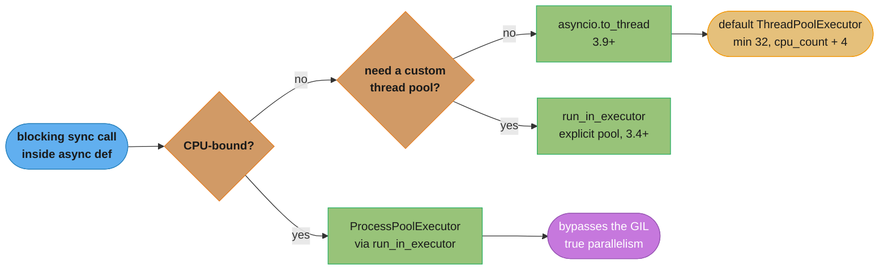
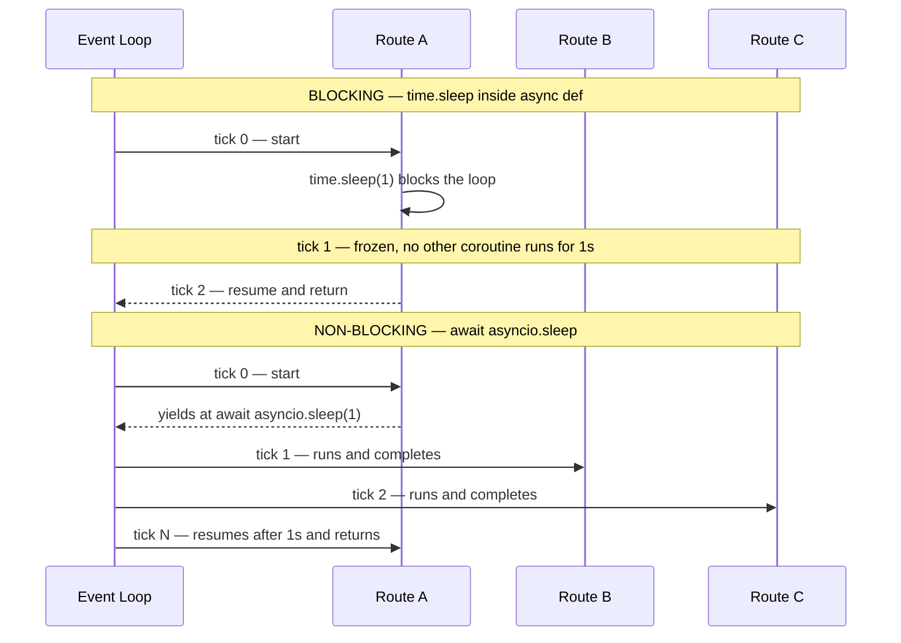
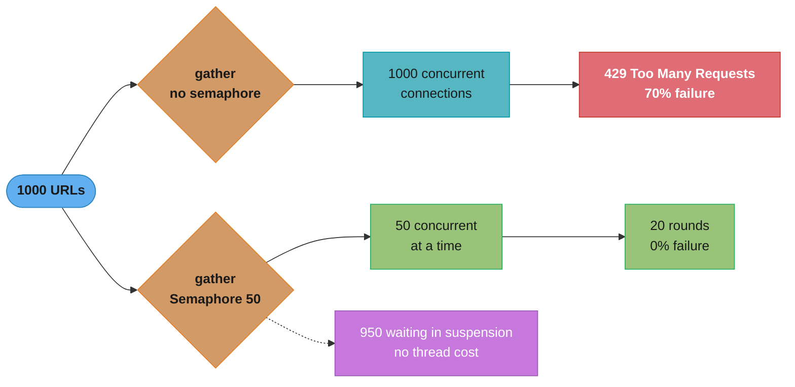
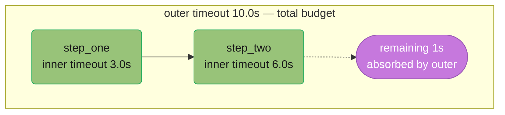
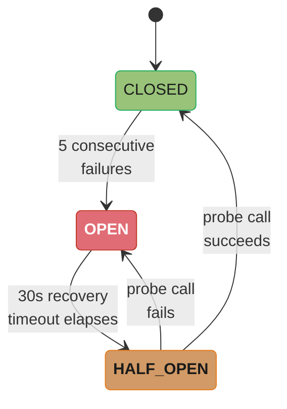

# Async Patterns & Pitfalls

> Advanced companion to `../asyncio_and_event_loop/asyncio_and_event_loop.md`. Covers production patterns
> that go beyond the event loop fundamentals: detecting and fixing blocking-in-async (the #1
> FastAPI production bug), executor integration, async generators, rate limiting with
> `asyncio.Semaphore`, backpressure, retry with jitter, circuit breakers, timeout composition,
> and memory leak prevention.

---

## 1. Concept Overview

Python's `asyncio` event loop is single-threaded. Every coroutine that calls a blocking
synchronous function (network I/O via `requests`, disk I/O via `open`, CPU computation)
stalls the entire loop for the duration of that call. No other coroutine can make progress
during a stall. In a FastAPI service handling 500 concurrent requests, a single 200ms
`requests.get()` inside an `async def` route blocks all 500 concurrent requests for 200ms.

This module covers:

- Detecting blocking-in-async with debug mode and profiling
- Offloading sync work with `asyncio.to_thread()` (Python 3.9) and `run_in_executor()`
- Async generators and async comprehensions for lazy streaming pipelines
- `asyncio.Semaphore` for rate limiting concurrent coroutines
- Backpressure via `asyncio.Queue(maxsize=N)`
- Retry with exponential backoff and jitter to prevent thundering-herd
- Timeout composition with `asyncio.timeout()` (Python 3.11) vs `asyncio.wait_for()`
- Circuit breaker pattern in async code
- Common memory leaks: untracked tasks, un-closed async generators

Python version baseline for this module: **3.11** for the async APIs themselves; runtime
behaviour and defaults are stated for **3.14**, the current stable release.

---

## 2. Intuition

> The event loop is a single-lane road. Every coroutine is a car that must yield at an
> `await` checkpoint to let other cars through. A blocking call is a car that parks in the
> lane and refuses to yield — it stops all traffic behind it.

**Mental model**: Think of `asyncio` as a cooperative scheduler. "Cooperative" means every
task must voluntarily yield control at `await` points. If a task never yields, no other task
can run. Patterns in this module teach you how to: (a) catch tasks that never yield,
(b) delegate blocking work to threads or processes so the event loop stays clear, and (c)
add resilience layers (retry, circuit breaker, semaphore, backpressure) so the road handles
heavy traffic gracefully.

**Why it matters**: FastAPI's entire performance advantage over synchronous Flask comes from
the event loop's ability to handle thousands of concurrent I/O-bound requests on a single
thread. One blocking call inside a route function erases that advantage completely — and it
erases it silently, because the code still passes every unit test. The failure only appears
under concurrency, which is exactly where the load test is usually skipped.

**Key insight**: `async def` does not make a function non-blocking. It only marks it as a
coroutine that *can* yield. The blocking happens when you call a sync function inside it
without offloading to a thread. `async def` is a promise to the event loop that you *will*
yield — you must keep that promise with every I/O operation.

---

## 3. Core Principles

1. **Never block the event loop**: Every I/O call inside `async def` must use an async
   library (`httpx`, `aiofiles`, `asyncpg`) or be offloaded via `asyncio.to_thread()`.

2. **Bound all concurrency**: Unbounded `asyncio.gather()` over thousands of URLs will
   exhaust file descriptors, trigger 429 rate-limits, and crash the target service. Always
   pair with `asyncio.Semaphore`.

3. **Track all tasks**: `asyncio.create_task()` returns a `Task` object. If no reference
   is kept, Python's GC can cancel the task mid-execution. Store tasks; clean up on
   completion.

4. **Compose timeouts, not nest them**: `asyncio.timeout()` (3.11) is a context manager
   that composes cleanly with other async context managers. Prefer it over wrapping every
   call in `asyncio.wait_for()`.

5. **Add resilience at the call site**: Retry and circuit breaker logic belongs in the
   HTTP client layer, not scattered across business logic. A decorator-based retry is
   testable and reusable.

6. **Apply backpressure explicitly**: If a producer generates work faster than a consumer
   can process it, use `asyncio.Queue(maxsize=N)` to provide backpressure. Without it,
   memory grows unbounded.

---

## 4. Types / Architectures / Strategies

### 4.1 Executor Integration (sync → async bridge)

| Method | Python Version | Use Case |
|---|---|---|
| `loop.run_in_executor(None, fn, *args)` | 3.4+ | Explicit loop, ThreadPoolExecutor |
| `asyncio.to_thread(fn, *args)` | 3.9+ | Shorthand for `run_in_executor(None, ...)` |
| `ProcessPoolExecutor` via `run_in_executor` | 3.4+ | CPU-bound tasks that need true parallelism |



Wrapping a blocking library always routes through one of these three offload paths — the fork on
CPU-bound work matters because only `ProcessPoolExecutor` bypasses the GIL for true parallelism.

### 4.2 Async Generators and Comprehensions

- `async def gen() -> AsyncGenerator[T, None]`: yields values across await points
- `async for item in gen()`: consumes async generator
- `aiter(obj)` / `anext(obj)` built-ins (3.10+): protocol functions like `iter()` / `next()`
- `[x async for x in gen()]`: async list comprehension
- `{x async for x in gen()}`: async set comprehension

### 4.3 Concurrency Control Primitives

| Primitive | Purpose | Blocking behaviour |
|---|---|---|
| `asyncio.Semaphore(n)` | Limit concurrent coroutines to n | `await sem.acquire()` suspends if count == 0 |
| `asyncio.Queue(maxsize=n)` | Bounded producer/consumer channel | `await q.put()` suspends when full |
| `asyncio.Lock()` | Mutual exclusion | `await lock.acquire()` suspends if locked |
| `asyncio.Event()` | One-to-many notification | `await event.wait()` suspends until set |
| `asyncio.Barrier(n)` (3.11) | Synchronize n coroutines | `await barrier.wait()` suspends until n waiting |

### 4.4 Resilience Patterns

- **Retry with exponential backoff + jitter**: retries transient failures without thundering herd
- **Circuit breaker**: fails fast after N consecutive failures; reopens after a cool-down
- **Timeout composition**: wraps operations with a hard deadline
- **Backpressure queue**: producer slows down when consumer is overwhelmed

---

## 5. Architecture Diagrams

### 5.1 Event Loop — Blocking vs Non-Blocking



A blocking `time.sleep()` freezes every other coroutine for the full second; `await asyncio.sleep()`
yields immediately so Routes B and C still make progress while Route A waits.

### 5.2 Semaphore-Bounded Gather



Skipping the semaphore opens 1000 simultaneous connections and a 70% failure rate; capping
concurrency at `Semaphore(50)` finishes the same 1000 URLs in 20 rounds with zero failures and no
extra thread cost.

### 5.3 Retry + Circuit Breaker + Backpressure Stack


Each layer bounds or protects the one beneath it — the queue applies backpressure, the semaphore
caps concurrency at 20, the retry decorator absorbs transient failures with jitter, and the
circuit breaker fails fast before the HTTP call is ever attempted.

### 5.4 asyncio.timeout() Composition (3.11)



The outer `timeout(10.0)` is a hard 10s ceiling; `step_one` gets its own 3s budget and `step_two`
gets 6s, and whatever the inner steps do not use is still available to the outer scope.

---

## 6. How It Works — Detailed Mechanics

### 6.1 Detecting Blocking-in-Async

Python's debug mode logs a warning when a callback or task holds the event loop for longer
than `loop.slow_callback_duration`, which defaults to 0.1 seconds.

```python
import asyncio
import logging
import time

logging.basicConfig(level=logging.DEBUG)

async def main() -> None:
    loop = asyncio.get_running_loop()
    loop.slow_callback_duration = 0.05  # tighten to 50ms in production profiling
    time.sleep(0.153)                   # stand-in for the blocking call under investigation

asyncio.run(main(), debug=True)         # debug=True is the supported switch
```

Output when a route blocks for 150ms — note the level is WARNING, not DEBUG, so it survives
a production log config that filters DEBUG out:
```
WARNING:asyncio:Executing <Task ... coro=<main() running at app.py:9> ...> took 0.158 seconds
```

**Attaching to a service that is already wedged** (3.14): `python -m asyncio ps <PID>` and
`python -m asyncio pstree <PID>` dump the live await-graph of a running process without
restarting it or adding instrumentation. If a task's stack sits in a synchronous frame
rather than at an `await`, that frame is the blocking call.

Sentry's `AsyncioIntegration` (`sentry_sdk.init(integrations=[AsyncioIntegration()])`)
captures unhandled exceptions raised inside tasks and adds a span per task to the
performance waterfall. It does not detect loop blocking on its own — a blocked loop shows up
there only indirectly, as inflated span durations across unrelated tasks.

**time.sleep vs asyncio.sleep — the canonical example**:

```python
import asyncio
import time

async def blocking_route() -> dict:
    time.sleep(1)           # blocks the entire event loop for 1 second
    return {"status": "ok"}

async def non_blocking_route() -> dict:
    await asyncio.sleep(1)  # suspends THIS coroutine, loop runs others
    return {"status": "ok"}

async def demo() -> None:
    start = time.perf_counter()
    # Run two routes concurrently
    await asyncio.gather(blocking_route(), non_blocking_route())
    print(f"blocking: {time.perf_counter() - start:.2f}s")   # ~2.0s — sequential!

    start = time.perf_counter()
    await asyncio.gather(non_blocking_route(), non_blocking_route())
    print(f"non-blocking: {time.perf_counter() - start:.2f}s")  # ~1.0s — concurrent!

asyncio.run(demo())
```

### 6.2 asyncio.to_thread() — Bridging Sync Libraries

`asyncio.to_thread()` (3.9) submits a callable to the default `ThreadPoolExecutor`.
Thread pool size: `min(32, (os.process_cpu_count() or 1) + 4)` (CPython default). Since 3.13
the count comes from `os.process_cpu_count()`, not `os.cpu_count()` — it honours CPU affinity
and the `PYTHON_CPU_COUNT` environment variable, so a container pinned to 2 CPUs gets a
6-thread pool rather than one sized for the whole host.

```python
import asyncio
import requests
import os

# Wrapping a blocking HTTP library
async def fetch_with_requests(url: str) -> bytes:
    # requests.get is sync — offload to thread pool
    response = await asyncio.to_thread(requests.get, url, timeout=5)
    return response.content

# Wrapping blocking file I/O
def _read_text(path: str) -> str:
    with open(path, encoding="utf-8") as fh:   # open() must run in the worker thread too
        return fh.read()

async def read_file(path: str) -> str:
    return await asyncio.to_thread(_read_text, path)
# NOT to_thread(open(path).read): open() would execute on the loop thread before the call
# is ever submitted, and the file handle would only close at GC time.

# Wrapping CPU-bound work (note: still GIL-bound; use ProcessPoolExecutor for true parallelism)
def compute_hash(data: bytes) -> str:
    import hashlib
    return hashlib.sha256(data).hexdigest()

async def async_hash(data: bytes) -> str:
    return await asyncio.to_thread(compute_hash, data)

# Explicit executor for CPU-bound tasks (ProcessPoolExecutor bypasses GIL)
async def cpu_intensive(n: int) -> int:
    from concurrent.futures import ProcessPoolExecutor
    loop = asyncio.get_running_loop()
    with ProcessPoolExecutor() as pool:
        return await loop.run_in_executor(pool, sum, range(n))
```

`asyncio.to_thread()` is syntactic sugar for:
```python
loop = asyncio.get_running_loop()
await loop.run_in_executor(None, fn, *args)
```

### 6.3 Async Generators — Lazy Streaming Pipelines

```python
import asyncio
from collections.abc import AsyncGenerator
import httpx

async def paginate(
    client: httpx.AsyncClient,
    base_url: str,
    page_size: int = 100,
) -> AsyncGenerator[dict, None]:
    """Lazily fetch all pages; yields one item dict at a time."""
    cursor: str | None = None
    while True:
        params = {"limit": page_size}
        if cursor:
            params["cursor"] = cursor
        resp = await client.get(base_url, params=params)
        resp.raise_for_status()
        data = resp.json()
        for item in data["results"]:
            yield item                  # suspend here, caller can process before next fetch
        cursor = data.get("next_cursor")
        if not cursor:
            break

async def process_all_records(base_url: str) -> int:
    count = 0
    async with httpx.AsyncClient() as client:
        async for record in paginate(client, base_url):
            await process_record(record)    # process lazily — no full page in memory
            count += 1
    return count

# Async comprehension (loads all into memory — use only for small result sets)
async def collect_ids(base_url: str) -> list[str]:
    async with httpx.AsyncClient() as client:
        return [record["id"] async for record in paginate(client, base_url)]

# aiter / anext (3.10+) — manual protocol access
async def peek_first(base_url: str) -> dict | None:
    async with httpx.AsyncClient() as client:
        gen = paginate(client, base_url)
        try:
            return await anext(aiter(gen))
        except StopAsyncIteration:
            return None
```

### 6.4 asyncio.Semaphore for Rate Limiting

```python
import asyncio
import httpx
from typing import Any

SEM_LIMIT = 50  # max concurrent requests to a single third-party API

async def fetch(
    client: httpx.AsyncClient,
    sem: asyncio.Semaphore,
    url: str,
) -> dict[str, Any]:
    async with sem:                 # blocks if 50 coroutines already inside
        resp = await client.get(url, timeout=10.0)
        resp.raise_for_status()
        return resp.json()

async def fetch_all(urls: list[str]) -> list[dict[str, Any]]:
    sem = asyncio.Semaphore(SEM_LIMIT)
    async with httpx.AsyncClient() as client:
        tasks = [fetch(client, sem, url) for url in urls]
        return await asyncio.gather(*tasks)

# Illustrative numbers for a 100 req/s downstream limit:
# 1000 URLs, no semaphore  → all 1000 in flight at once    → ~700 × 429 errors (~70% failure)
# 1000 URLs, Semaphore(50) → 20 sequential batches of 50   → 0 × 429 errors (0.0% failure)
# Throughput with limit: 50 req / avg_latency_per_req ≈ 50 / 0.1s = 500 req/s (sustained)
```

**In plain terms.** That last comment line is Little's Law wearing a disguise: "a semaphore does not
set a request rate, it sets a *population*. The rate falls out of the population divided by how long
each member stays." Set `SEM_LIMIT` and the latency of the downstream API picks your RPS for you.

| Symbol | What it is |
|--------|------------|
| `C` | Concurrency — the semaphore's permit count, coroutines inside `async with sem` right now |
| `L` | Average latency of one call, wall-clock, from acquire to release |
| `RPS = C / L` | Sustained throughput. Rearranged Little's Law |
| `C = RPS x L` | The same law read backwards — the permits needed to *hit* a target rate |
| `ceil(N / C)` | Rounds needed to clear `N` URLs, hence the "20 sequential batches" above |

**Walk one example.** Read the equation in both directions, using this module's own numbers:

```
  forward -- permits are known, find the rate
    C = 50 permits,  L = 0.1 s
    RPS = 50 / 0.1                     = 500 req/s sustained
    rounds for 1000 URLs = ceil(1000/50) = 20      wall = 20 x 0.1 = 2.0 s

  backward -- the API's published limit is known, find the permits
    target = 500 req/s,  measured L = 0.1 s
    C = 500 x 0.1                      = 50 permits   <- so Semaphore(50) is not a guess

  the trap: latency is the hidden variable
    same Semaphore(50), downstream degrades to L = 0.5 s
    RPS = 50 / 0.5                     = 100 req/s    <- rate collapsed 5x
    the semaphore value never changed; the SLA did
```

**Why the backward reading is the one that matters in review.** A semaphore constant with no stated
latency assumption is unreviewable — `Semaphore(50)` is correct at 100 ms and a rate-limit violation
at 10 ms (`50 / 0.01 = 5,000 req/s`). Always record the `L` a permit count was derived from, because
the permit count silently re-targets itself every time downstream latency moves.

### 6.5 Backpressure with asyncio.Queue

```python
import asyncio
import httpx

QUEUE_SIZE   = 100   # buffer at most 100 items; producer blocks when full
WORKER_COUNT = 10    # 10 consumer coroutines drain the queue

async def producer(
    queue: asyncio.Queue[str],
    urls: list[str],
) -> None:
    for url in urls:
        await queue.put(url)   # suspends if queue is full (backpressure applied)
    for _ in range(WORKER_COUNT):
        await queue.put(None)  # sentinel: one per worker

async def consumer(
    queue: asyncio.Queue[str | None],
    client: httpx.AsyncClient,
    results: list[bytes],
) -> None:
    while True:
        url = await queue.get()
        if url is None:
            queue.task_done()
            break
        try:
            resp = await client.get(url, timeout=10.0)
            results.append(resp.content)
        finally:
            queue.task_done()

async def bounded_pipeline(urls: list[str]) -> list[bytes]:
    queue: asyncio.Queue[str | None] = asyncio.Queue(maxsize=QUEUE_SIZE)
    results: list[bytes] = []
    async with httpx.AsyncClient() as client:
        workers = [
            asyncio.create_task(consumer(queue, client, results))
            for _ in range(WORKER_COUNT)
        ]
        await producer(queue, urls)
        await asyncio.gather(*workers)
    return results

# Throughput: 10 workers × (1 req / 0.1s avg latency) = 100 req/s sustained
# Memory: bounded by QUEUE_SIZE = 100 URLs in buffer at any time
```

### 6.6 Retry with Exponential Backoff + Jitter

```python
import asyncio
import random
import functools
import logging
from collections.abc import Callable, Awaitable
from typing import Any, TypeVar

F = TypeVar("F", bound=Callable[..., Awaitable[Any]])

log = logging.getLogger(__name__)

def retry_async(
    max_attempts: int = 3,
    base_delay: float = 0.5,
    max_delay: float = 30.0,
    exceptions: tuple[type[Exception], ...] = (Exception,),
) -> Callable[[F], F]:
    """Decorator: retry an async function with exponential backoff + full jitter."""
    def decorator(fn: F) -> F:
        @functools.wraps(fn)
        async def wrapper(*args: Any, **kwargs: Any) -> Any:
            for attempt in range(max_attempts):
                try:
                    return await fn(*args, **kwargs)
                except exceptions as exc:
                    if attempt == max_attempts - 1:
                        log.error(
                            "All %d attempts failed for %s: %s",
                            max_attempts, fn.__name__, exc,
                        )
                        raise
                    # Full jitter: uniform(0, min(max_delay, base_delay * 2**attempt))
                    ceiling = min(max_delay, base_delay * (2 ** attempt))
                    delay = random.uniform(0, ceiling)
                    log.warning(
                        "%s attempt %d/%d failed (%s); retrying in %.2fs",
                        fn.__name__, attempt + 1, max_attempts, exc, delay,
                    )
                    await asyncio.sleep(delay)
        return wrapper  # type: ignore[return-value]
    return decorator

# Usage
@retry_async(max_attempts=5, base_delay=1.0, exceptions=(httpx.HTTPStatusError, httpx.TimeoutException))
async def resilient_get(client: httpx.AsyncClient, url: str) -> dict[str, Any]:
    resp = await client.get(url, timeout=5.0)
    resp.raise_for_status()
    return resp.json()

# Jitter math example (attempt 2, base_delay=1.0, max_delay=30.0):
# ceiling = min(30, 1.0 * 2^2) = 4.0
# delay   = uniform(0, 4.0) → e.g. 2.37s
# Without jitter: all N services retry at exactly 4.0s → thundering herd
# With jitter: spread across [0, 4.0] → load distributed
```

**What the formula is telling you.** `delay = uniform(0, min(max_delay, base * 2**attempt))` says two
separate things at once: "back off twice as far every failure" (the `2**attempt`), and "but pick a
random point inside that window rather than its edge" (the `uniform(0, ...)`). The first protects
the downstream from *frequency*; the second protects it from *synchronization*.

| Symbol | What it is |
|--------|------------|
| `attempt` | Zero-based failure count. `0` is the first retry, not the first call |
| `base_delay` | The window width after the first failure. `1.0 s` in the usage example above |
| `2 ** attempt` | Doubling factor: 1, 2, 4, 8, ... — halves the retry rate each round |
| `max_delay` | Hard cap so the doubling cannot run away to hours |
| `min(max_delay, ...)` | The `ceiling` variable — the widest the window is allowed to get |
| `uniform(0, ceiling)` | Full jitter. Draws anywhere in `[0, ceiling]`, mean `ceiling / 2` |

**Walk one example.** Four attempts with `base_delay=1.0`, `max_delay=60.0` (the case-study settings):

```
  attempt   2**attempt   ceiling = min(60, 1.0 * 2**a)   delay drawn from   mean wait
  --------- ------------ ------------------------------- ------------------ ---------
     0          1         1.0                            [0, 1.0]            0.5 s
     1          2         2.0                            [0, 2.0]            1.0 s
     2          4         4.0                            [0, 4.0]            2.0 s
     3          8         -- last attempt, raises instead of sleeping --

  total added latency across the 3 sleeps
    expected   0.5 + 1.0 + 2.0                           =  3.5 s
    worst case 1.0 + 2.0 + 4.0                           =  7.0 s
```

So `max_attempts=4` is not a free retry — it is a decision to let p100 latency grow by up to 7
seconds. That is the number to compare against your timeout budget before raising the attempt count.

**Why full jitter beats a fixed backoff by a factor you can compute.** Suppose 1,000 clients fail at
the same instant and all retry at attempt 2. Without jitter every one of them fires at exactly
`4.0 s`; measured in a 10 ms bucket that is `1000 / 0.01 = 100,000 req/s` into a service that just
proved it is unhealthy. With full jitter the same 1,000 retries spread evenly across `[0, 4.0]`, an
expected `1000 / 4.0 = 250 req/s` — a **400x** reduction in peak load, from one `random.uniform`
call. The doubling alone does not achieve this; only the randomization breaks the lockstep.

### 6.7 asyncio.timeout() vs asyncio.wait_for() (3.11)

```python
import asyncio

# asyncio.timeout() — context manager, composable (Python 3.11+)
async def fetch_with_timeout_cm(url: str) -> bytes:
    async with asyncio.timeout(5.0):       # TimeoutError if not done in 5s
        async with httpx.AsyncClient() as client:
            resp = await client.get(url)
            return resp.content

# asyncio.timeout_at() — absolute deadline (monotonic time)
async def fetch_with_deadline(url: str, deadline: float) -> bytes:
    async with asyncio.timeout_at(deadline):
        async with httpx.AsyncClient() as client:
            resp = await client.get(url)
            return resp.content

# asyncio.wait_for() — equivalent but wraps coroutine, not composable as CM
async def fetch_with_wait_for(url: str) -> bytes:
    async with httpx.AsyncClient() as client:
        resp = await asyncio.wait_for(client.get(url), timeout=5.0)
        return resp.content

# Composing nested timeouts (only possible with CM form)
async def two_step_operation() -> dict[str, Any]:
    async with asyncio.timeout(10.0):           # hard outer budget: 10s total
        step1 = await asyncio.wait_for(step_one(), timeout=3.0)
        step2 = await asyncio.wait_for(step_two(step1), timeout=6.0)
        return {"step1": step1, "step2": step2}
    # If outer fires, TimeoutError propagates regardless of inner state
```

Key difference is composition, not the exception: both raise the built-in `TimeoutError`.
Since 3.11 `asyncio.TimeoutError` is a plain *alias* of the built-in, not a subclass —
`asyncio.TimeoutError is TimeoutError` evaluates to `True`, so a single
`except TimeoutError:` catches every timeout in the module. What `asyncio.timeout()` adds is
that it is an async context manager, so it can wrap a block containing other `async with`
statements; `wait_for()` can only wrap a single awaitable.

### 6.8 Async Memory Leaks — Causes and Fixes

**Cause 1: untracked fire-and-forget tasks**

```python
import asyncio

# Pattern: hold a STRONG reference to every background task until it finishes.
# A weakref set would defeat the purpose — the loop only keeps a weak reference itself,
# which is exactly why an untracked task can vanish mid-flight.
_background_tasks: set[asyncio.Task] = set()

def fire_and_forget(coro) -> asyncio.Task:
    task = asyncio.create_task(coro)
    _background_tasks.add(task)
    task.add_done_callback(_background_tasks.discard)
    return task
```

**Cause 2: un-closed async generators**

```python
# If the caller breaks out of async for mid-stream, the generator's finally block does NOT
# run at the break. asyncio's asyncgen finalizer hook (PEP 525) schedules aclose() as a task,
# so cleanup lands at least one loop iteration later even in CPython — and later still on a
# runtime without refcounting. Measured ordering with a plain `break`:
#   after-break -> (one loop tick) -> gen-finally
# The connection or file handle stays open across that gap, and if the loop is torn down
# first it only closes in loop.shutdown_asyncgens().

# Fix: use contextlib.aclosing()
from contextlib import aclosing

async def safe_consume(url: str) -> None:
    async with aclosing(paginate(client, url)) as gen:
        async for item in gen:
            if item["done"]:
                break               # aclosing() guarantees generator.aclose() is called
```

**Cause 3: circular references in closures captured by tasks**

```python
# Closure captures large object → task holds reference → GC cannot collect
# Fix: use weakref or explicit del inside the coroutine before long awaits

import weakref

class RequestContext:
    def __init__(self, data: bytes) -> None:
        self.data = data            # potentially large

async def process(ctx_ref: weakref.ref[RequestContext]) -> None:
    ctx = ctx_ref()
    if ctx is None:
        return
    result = await do_work(ctx.data)
    del ctx                         # release before await; GC can collect if refcount → 0
    await store_result(result)
```

### 6.9 Circuit Breaker Pattern in Async Code



CLOSED lets requests flow normally while counting failures; five consecutive failures trip the
breaker OPEN so every call fails fast without touching the network; after the 30s recovery
timeout, one HALF_OPEN probe decides whether to close again or reopen.

```python
import asyncio
import time
from enum import Enum, auto
from collections.abc import Callable, Awaitable
from typing import Any

class CircuitState(Enum):
    CLOSED   = auto()   # normal — requests flow through
    OPEN     = auto()   # failing — requests rejected immediately
    HALF_OPEN = auto()  # testing — one probe request allowed

class AsyncCircuitBreaker:
    def __init__(
        self,
        failure_threshold: int = 5,
        recovery_timeout: float = 30.0,
        half_open_max_calls: int = 1,
    ) -> None:
        self._state        = CircuitState.CLOSED
        self._failures     = 0
        self._threshold    = failure_threshold
        self._recovery     = recovery_timeout
        self._opened_at    = 0.0
        self._half_probes  = 0
        self._max_probes   = half_open_max_calls
        self._lock         = asyncio.Lock()

    @property
    def state(self) -> CircuitState:
        return self._state

    async def call(self, fn: Callable[..., Awaitable[Any]], *args: Any, **kwargs: Any) -> Any:
        async with self._lock:
            if self._state == CircuitState.OPEN:
                if time.monotonic() - self._opened_at >= self._recovery:
                    self._state       = CircuitState.HALF_OPEN
                    self._half_probes = 0
                else:
                    raise RuntimeError("Circuit OPEN — failing fast")
            if self._state == CircuitState.HALF_OPEN:
                if self._half_probes >= self._max_probes:
                    raise RuntimeError("Circuit HALF_OPEN — probe in progress")
                self._half_probes += 1

        try:
            result = await fn(*args, **kwargs)
            async with self._lock:
                # Success: close if half-open, reset failures
                self._failures = 0
                self._state    = CircuitState.CLOSED
            return result
        except Exception:
            async with self._lock:
                self._failures += 1
                if self._failures >= self._threshold:
                    self._state    = CircuitState.OPEN
                    self._opened_at = time.monotonic()
            raise

# Usage
breaker = AsyncCircuitBreaker(failure_threshold=5, recovery_timeout=30.0)

async def call_payment_api(payload: dict) -> dict:
    return await breaker.call(_do_payment_request, payload)
```

**The trap: a timeout does not trip this breaker.** Every resilience layer in this module
either wraps or is wrapped by a cancellation, and cancellation is not an `Exception`.
`asyncio.CancelledError` inherits directly from `BaseException` (since 3.8), so the
`except Exception:` arm above never sees it. Wrap `_breaker.call(...)` in
`asyncio.timeout(8.0)` — exactly what the case study below does — and a downstream that
hangs on every request produces this:

```python
# Measured, not asserted: the breaker's failure counter after one 50ms timeout
async with asyncio.timeout(0.05):
    await breaker.call(hangs_for_5s)     # raises TimeoutError to the caller
# breaker._failures == 0    <- the failure the breaker exists to count was invisible to it
```

The service therefore times out forever and never opens: the slowest, most expensive failure
mode is the one the breaker cannot see. Two ways to close it, and they are not equivalent:

- **Put the timeout inside the breaker's protected callable**, so the `TimeoutError` is
  raised by `fn()` and travels through the `except Exception:` arm. This is the usual choice.
- **Catch `BaseException` in the breaker and re-raise**, counting `CancelledError` as a
  failure. Do this only if you are certain no *deliberate* cancellation (shutdown, a
  `TaskGroup` sibling failing) can reach it, or a clean shutdown will trip every breaker on
  the way out.

The same asymmetry governs the retry decorator: `exceptions=(Exception,)` will not retry a
cancellation, which is the correct default — a cancelled task must die, not retry.

Cross-reference: cancellation semantics themselves — `CancelledError` propagation,
`asyncio.shield()`, cancellation scopes, and `Task.uncancel()` — are developed in
[`../asyncio_and_event_loop/structured_concurrency.md`](../asyncio_and_event_loop/structured_concurrency.md)
§6.2. See `../../backend/api_gateway_patterns/` for circuit breaker concepts at the API
gateway layer, and `../asyncio_and_event_loop/asyncio_and_event_loop.md` for `TaskGroup` and structured
concurrency fundamentals.

---

## 7. Real-World Examples

### 7.1 FastAPI Route — Blocking vs Non-Blocking

```python
# Service A (blocking — common mistake in production)
from fastapi import FastAPI
import requests

app = FastAPI()

@app.get("/users/{user_id}")
def get_user(user_id: int) -> dict:          # sync def — FastAPI runs in threadpool worker
    resp = requests.get(f"https://api.internal/users/{user_id}")
    return resp.json()                       # OK for sync def, but wastes a thread

# Service B (wrong — async def with blocking library)
@app.get("/users/{user_id}")
async def get_user_broken(user_id: int) -> dict:
    resp = requests.get(f"https://api.internal/users/{user_id}")  # BLOCKS THE LOOP
    return resp.json()

# Service C (correct)
import httpx

@app.get("/users/{user_id}")
async def get_user_correct(user_id: int) -> dict:
    async with httpx.AsyncClient() as client:
        resp = await client.get(f"https://api.internal/users/{user_id}", timeout=5.0)
        resp.raise_for_status()
        return resp.json()
```

### 7.2 GitHub Actions-style Job Queue

```python
# CI system: queue 500 jobs, run max 20 concurrently, retry failed jobs
import asyncio
import httpx

sem = asyncio.Semaphore(20)

@retry_async(max_attempts=3, base_delay=2.0, exceptions=(httpx.HTTPStatusError,))
async def run_job(client: httpx.AsyncClient, job_id: str) -> dict:
    async with sem:
        resp = await client.post(f"/jobs/{job_id}/run", timeout=60.0)
        resp.raise_for_status()
        return resp.json()

async def run_all_jobs(job_ids: list[str]) -> list[dict]:
    async with httpx.AsyncClient(base_url="https://ci.internal") as client:
        return await asyncio.gather(*(run_job(client, jid) for jid in job_ids))
```

### 7.3 Streaming LLM Response with Async Generator

```python
from collections.abc import AsyncGenerator
import httpx

async def stream_llm(
    client: httpx.AsyncClient,
    prompt: str,
) -> AsyncGenerator[str, None]:
    """Stream tokens from an LLM API as they arrive."""
    async with client.stream(
        "POST",
        "/v1/chat/completions",
        json={"prompt": prompt, "stream": True},
        timeout=None,
    ) as resp:
        async for line in resp.aiter_lines():
            if line.startswith("data: "):
                token = line[6:]
                if token == "[DONE]":
                    return
                yield token

# See `../../llm/case_studies/cross_cutting/streaming_at_scale.md` for SSE/async streaming at scale.

from fastapi.responses import StreamingResponse

@app.post("/generate")
async def generate(prompt: str) -> StreamingResponse:
    async with httpx.AsyncClient(base_url="https://llm.internal") as client:
        async def event_stream():
            async for token in stream_llm(client, prompt):
                yield f"data: {token}\n\n"
        return StreamingResponse(event_stream(), media_type="text/event-stream")
```

---

## 8. Tradeoffs

| Pattern | Benefit | Cost | When to Choose |
|---|---|---|---|
| `asyncio.to_thread()` | Unblocks event loop; reuses existing sync library | Thread creation overhead; GIL contention for CPU work | I/O-bound sync libs (requests, psycopg2 in sync mode) |
| `ProcessPoolExecutor` | True parallelism for CPU-bound work | Worker start-up plus a full interpreter import; IPC pickling on every call | SHA/RSA, image resize, numpy-heavy computation |
| `asyncio.Semaphore` | Simple, composable rate limiting; FIFO acquisition order | Coroutine suspension overhead; permit count is only meaningful next to a stated latency | Third-party API rate limits, DB connection pool limits |
| `asyncio.Queue(maxsize)` | Bounded buffer with backpressure | Adds latency when queue is full (producer blocks) | High-volume pipeline with uneven producer/consumer speed |
| `retry_async` decorator | Transparent retry logic | Increases tail latency; may amplify load on target | Transient network errors, 429/503 from external APIs |
| `AsyncCircuitBreaker` | Fail fast; protects downstream | State management overhead; false trips possible | Microservice calls, external payment/email APIs |
| `asyncio.timeout()` | Composable, clean deadline management | 3.11+ only; TimeoutError propagates eagerly | Any operation with a hard SLA budget |

---

## 9. When to Use / When NOT to Use

### Use asyncio patterns when:

- Your FastAPI service makes outbound HTTP calls, queries a database, or reads files
- You have I/O-bound concurrency (hundreds of simultaneous requests)
- You need streaming responses (SSE, WebSocket, chunked transfer)
- You are building a data pipeline with controllable throughput (producer/consumer)
- You need resilience (retry, circuit breaker) against flaky downstream services

### Do NOT use asyncio patterns when:

- The work is CPU-bound and GIL-locked: use `ProcessPoolExecutor` + `run_in_executor`
- You need true parallelism across cores: use `multiprocessing` or worker processes
- Your team is not familiar with cooperative scheduling: synchronous FastAPI (sync def)
  runs in Starlette's thread pool and is simpler to reason about
- Third-party libraries are not async-safe (they use `threading.local`, global state, etc.)
  and cannot be safely called from `asyncio.to_thread()` without wrapping
- The operation is < 1ms and the overhead of coroutine scheduling exceeds the operation

### asyncio.to_thread() specific:

- Use when: wrapping `requests`, `boto3` (sync), `psycopg2`, legacy SDKs
- Do not use when: the function holds Python-level locks that conflict with asyncio's loop
  thread, or when CPU-bound computation would saturate all threads simultaneously

---

## 10. Common Pitfalls

### PITFALL 1: sync def with requests in async FastAPI route

```python
# BROKEN: async def calls blocking requests.get — stalls the event loop
from fastapi import FastAPI
import requests

app = FastAPI()

@app.get("/data")
async def get_data() -> dict:
    resp = requests.get("https://api.external.com/data", timeout=5)  # BLOCKS LOOP
    return resp.json()
```

```python
# FIX: use httpx.AsyncClient for async-native HTTP
import httpx
from fastapi import FastAPI

app = FastAPI()

@app.get("/data")
async def get_data() -> dict:
    async with httpx.AsyncClient() as client:
        resp = await client.get("https://api.external.com/data", timeout=5.0)
        resp.raise_for_status()
        return resp.json()
```

Impact of the broken version: at 100 RPS, a 200ms `requests.get()` inside `async def`
serialises all requests — effective throughput drops from 100 RPS to 5 RPS (1 / 0.2s).
The fix restores true concurrency.

**Read it like this.** `1 / 0.2s` says: "while one coroutine holds the loop, the service's capacity
is not 'many requests' — it is exactly one request per blocked interval." A blocking call does not
slow the service down proportionally; it collapses the service's parallelism to 1 and turns every
other request into a queue entry.

| Symbol | What it is |
|--------|------------|
| `B` | Duration of the blocking call — `0.2 s` here. Loop-frozen time, not I/O-wait time |
| `1 / B` | Serial capacity. The absolute ceiling while the call blocks: 5 req/s at `B = 0.2` |
| `A` | Arrival rate the service is actually receiving (100 RPS here) |
| `A - 1/B` | Backlog growth per second. Positive means the queue never drains |
| `A x B` | Requests that pile up during a single blocked call |

**Walk one example.** Take Section 1's framing — a FastAPI service at 500 req/s meeting a 100 ms
blocking call — and follow the queue rather than the latency:

```
  arrivals            A = 500 req/s
  blocking call       B = 0.100 s        serial capacity 1/B = 10 req/s

  during ONE blocked call
    requests arriving      500 x 0.100                 =  50 queued
    requests served               1                    =   1
    net added to queue         50 - 1                  =  49

  per wall-clock second
    served               10 req/s
    backlog growth       500 - 10                      = 490 req/s
    after 10 s the queue holds 4,900 requests and is still growing
```

The queue is unbounded and the growth rate is constant, so this never reaches equilibrium — the
service does not get *slow*, it fails. Compare the same 500 req/s with the call made properly async:
in-flight coroutines settle at `500 x 0.100 = 50`, and the loop's own CPU cost is about
`500 x 20 us = 0.01 s` per wall second, roughly **1% of one core**. Same traffic, same latency; the
only difference is whether the 100 ms is spent holding the loop or parked on a Future.

**Why `1 / B` is the number to say out loud.** Interviewers reach for "it gets slower" — the precise
answer is that throughput becomes independent of the arrival rate and pins to `1 / B`. That is also
the diagnostic: if a service's measured RPS is suspiciously close to the reciprocal of some
round-number duration, you have found a blocking call without reading any code.

---

### PITFALL 2: create_task without storing the result

```python
# BROKEN: task object not stored → may be GC'd before coroutine finishes
import asyncio

async def background_job(item_id: int) -> None:
    await asyncio.sleep(2)
    await save_to_db(item_id)

@app.post("/items/{item_id}/process")
async def process_item(item_id: int) -> dict:
    asyncio.create_task(background_job(item_id))   # no reference kept
    return {"queued": True}
    # task may disappear silently; "Task was destroyed but it is pending!" warning in logs
```

```python
# FIX: track tasks in a module-level set; discard on completion
import asyncio

_tasks: set[asyncio.Task] = set()

def spawn_background(coro) -> asyncio.Task:
    task = asyncio.create_task(coro)
    _tasks.add(task)
    task.add_done_callback(_tasks.discard)
    return task

@app.post("/items/{item_id}/process")
async def process_item(item_id: int) -> dict:
    spawn_background(background_job(item_id))
    return {"queued": True}
```

---

### PITFALL 3: unbounded gather over thousands of URLs

```python
# BROKEN: 10,000 coroutines all contending for one client → pool timeouts + 429s
import asyncio, httpx

async def scrape_all(urls: list[str]) -> list[bytes]:
    async with httpx.AsyncClient() as client:
        resps = await asyncio.gather(         # spawns len(urls) concurrent coroutines
            *(client.get(u) for u in urls)
        )
        return [r.content for r in resps]
# httpx's default Limits are max_connections=100, so 9,900 of those coroutines queue on the
# pool rather than opening a socket — and the default 5s pool timeout turns most of them into
# httpx.PoolTimeout. Raise max_connections to "fix" that and the failure simply moves: now
# you really do open 10,000 sockets, hit the process file-descriptor limit, and the API
# starts returning 429. Neither outcome is bounded by anything you chose deliberately.
```

```python
# FIX: bound with asyncio.Semaphore
import asyncio, httpx

async def scrape_all(urls: list[str], concurrency: int = 50) -> list[bytes]:
    sem = asyncio.Semaphore(concurrency)
    async with httpx.AsyncClient() as client:
        async def bounded_get(url: str) -> bytes:
            async with sem:
                resp = await client.get(url, timeout=10.0)
                resp.raise_for_status()
                return resp.content
        return await asyncio.gather(*(bounded_get(u) for u in urls))
# Result: 10,000 URLs in 200 rounds of 50 → 0 rate-limit errors
```

---

### PITFALL 4: forgetting await — silent no-op

```python
# BROKEN: calling a coroutine without await — returns a coroutine object, never executes
async def notify_user(user_id: int) -> None:
    await send_email(user_id)               # this is the real call

async def handle_signup(user_id: int) -> dict:
    notify_user(user_id)                    # coroutine object created and immediately dropped
    return {"signed_up": True}
    # send_email is NEVER called; no exception raised at runtime
```

```python
# FIX 1: add await
async def handle_signup(user_id: int) -> dict:
    await notify_user(user_id)
    return {"signed_up": True}

# FIX 2 (fire-and-forget): use create_task with tracking
async def handle_signup(user_id: int) -> dict:
    spawn_background(notify_user(user_id))
    return {"signed_up": True}

# DETECT: enable debug mode — Python warns on unawaited coroutines at GC time
# asyncio.get_event_loop().set_debug(True)
# Also: use mypy + pylint asyncio plugin to catch statically
```

---

### PITFALL 5: missing aclosing() on async generator break

```python
# BROKEN: async generator's finally block is deferred to GC — resources may leak
async def leaking_consumer(url: str) -> dict | None:
    async for record in paginate(client, url):
        if record["status"] == "active":
            return record                   # breaks mid-stream; generator not explicitly closed
    return None
```

```python
# FIX: contextlib.aclosing() guarantees aclose() is called on exit
from contextlib import aclosing

async def safe_consumer(url: str) -> dict | None:
    async with aclosing(paginate(client, url)) as gen:
        async for record in gen:
            if record["status"] == "active":
                return record
    return None
```

---

## 11. Technologies & Tools

| Tool | Purpose | Notes |
|---|---|---|
| `httpx` | Async HTTP client | Drop-in requests API; supports HTTP/2; use `AsyncClient` |
| `aiofiles` | Async file I/O | Wraps file ops in executor; releases GIL |
| `asyncpg` | Async PostgreSQL driver | Maintainers' benchmark: ~5× faster than psycopg3 |
| `redis.asyncio` | Async Redis client | Ships inside `redis-py`; import `redis.asyncio as redis` |
| `tenacity` | Production retry library | More configurable than a hand-rolled decorator; async-native |
| `circuitbreaker` (PyPI) | Circuit breaker decorator | Lightweight; wraps both sync and async callables |
| `anyio` | Async portability layer | Works on asyncio and trio; `anyio.to_thread.run_sync()` |
| `contextvars` | Context propagation | Carries trace IDs, auth tokens across await boundaries |
| `Sentry AsyncioIntegration` | Task error capture + per-task spans | Captures unhandled task exceptions; does not itself detect loop blocking |
| `python -m asyncio ps/pstree` | Live await-graph of a running PID (3.14) | Attaches to a wedged process without restarting or instrumenting it |
| `yappi` | Async-aware profiler | Profiles coroutine wall time (not just CPU time) |

**asyncio.timeout() availability**:
- `asyncio.timeout()` — Python 3.11+
- `asyncio.to_thread()` — Python 3.9+
- `aiter()` / `anext()` built-ins — Python 3.10+
- `asyncio.TaskGroup` — Python 3.11+ (see `../asyncio_and_event_loop/asyncio_and_event_loop.md`)
- `asyncio.Barrier` — Python 3.11+

---

## 12. Interview Questions with Answers

**Q1: What is the most common async bug in FastAPI services, and how do you detect it?**
**Short:** Calling a blocking sync call inside an async def route stalls the whole event loop.

Calling a blocking synchronous function (like `requests.get()` or `time.sleep()`) inside an
`async def` route — this stalls the entire event loop for the duration of the call. Detect it
by enabling `loop.set_debug(True)` (warns when a callback takes > 100ms), by adding Sentry's
`AsyncioIntegration`, or by profiling with `yappi` which reports coroutine wall time.

**Q2: What is the difference between `asyncio.to_thread()` and `loop.run_in_executor()`?**
**Short:** asyncio.to_thread() is sugar for loop.run_in_executor(None, fn, *args) on the default thread pool.

`asyncio.to_thread(fn, *args)` is syntactic sugar introduced in Python 3.9 for
`loop.run_in_executor(None, fn, *args)`. Both submit the callable to the default
`ThreadPoolExecutor`. Use `to_thread()` for I/O-bound sync work; use `run_in_executor(pool)`
with a `ProcessPoolExecutor` when you need to bypass the GIL for CPU-bound work.

**Q3: How large is the default thread pool used by `asyncio.to_thread()`?**
**Short:** The default asyncio thread pool size is min(32, os.process_cpu_count() + 4).

`min(32, (os.process_cpu_count() or 1) + 4)` — the default `ThreadPoolExecutor` size in
CPython, computed from `os.process_cpu_count()` since 3.13 so it respects CPU affinity and
`PYTHON_CPU_COUNT`. On a 4-CPU container: `min(32, 8) = 8` threads. The 9th concurrent
`to_thread()` call does not block the loop — the work item is queued in the executor and the
awaiting coroutine simply suspends — but its latency now includes the queue wait, which is
invisible in traces. For high-concurrency workloads, create a custom pool and pass it to
`run_in_executor`.

**Q4: What is the difference between `asyncio.Semaphore` and `asyncio.Lock`?**
**Short:** A Lock allows one concurrent holder; a Semaphore(n) allows up to n concurrent holders.

`Lock` allows exactly 1 concurrent holder. `Semaphore(n)` allows up to `n` concurrent holders.
A `Lock` is a `Semaphore(1)`. Use `Semaphore` to bound concurrency (e.g., max 20 DB connections
at once); use `Lock` for mutual exclusion (e.g., protecting a shared counter or cache).

**Q5: Why does unbounded `asyncio.gather()` over 10,000 URLs fail?**
**Short:** Unbounded gather() overwhelms whichever resource runs out first, such as the connection pool or file descriptors.

Because nothing in `gather()` bounds concurrency, so the limit that bites is whichever
resource runs out first rather than one you chose. With `httpx.AsyncClient` defaults
(`max_connections=100`, 5s pool timeout) the surplus coroutines queue on the connection pool
and fail with `httpx.PoolTimeout`. Raise the pool limit and the failure relocates: you
exhaust the process file-descriptor limit (`ulimit -n`, commonly 1024 soft on Linux) and the
target starts returning 429. Fix: gate each coroutine on `async with asyncio.Semaphore(50)`
so the concurrency is a reviewable constant.

**Q6: What is jitter in retry logic, and why does it matter?**
**Short:** Jitter is a random delay added to backoff so failed retries don't all fire in lockstep.

Jitter is a random delay added to the exponential backoff interval. Without jitter, N services
that fail simultaneously all retry at the same intervals (1s, 2s, 4s, …), creating a
thundering herd that repeatedly hammers the recovering service. Full jitter draws the delay
from `uniform(0, min(max_delay, base * 2^attempt))`, spreading retries across the interval
and reducing load on the target by a factor of N.

**Q7: What is the difference between `asyncio.timeout()` and `asyncio.wait_for()`?**
**Short:** asyncio.timeout() is a composable context manager while wait_for() wraps a single awaitable.

The difference is composition, not the exception they raise. `asyncio.timeout()` (3.11) is an
async context manager, so it can put one deadline over a whole block that itself contains
`async with` statements; `asyncio.wait_for()` wraps a single awaitable at the `await` site.
Both raise the built-in `TimeoutError` — since 3.11 `asyncio.TimeoutError` is an alias of it,
not a subclass, so `asyncio.TimeoutError is TimeoutError` is `True` and one `except
TimeoutError:` covers both.

**Q8: What happens when you call `asyncio.create_task()` but don't store the return value?**
**Short:** An unreferenced Task can be garbage-collected and cancelled before it finishes.

The `Task` object has no strong reference, so Python's garbage collector may collect and
cancel it before it finishes. CPython logs a warning: "Task was destroyed but it is pending!".
Fix: store the task in a module-level `set` and register a `done_callback` to discard it
when complete — this keeps a strong reference for the task's lifetime without causing a leak.

**Q9: How do you implement backpressure in an async producer/consumer system?**
**Short:** A bounded asyncio.Queue(maxsize=N) applies backpressure by suspending the producer when full.

Use `asyncio.Queue(maxsize=N)`. The producer calls `await queue.put(item)`, which suspends
the producer coroutine when the queue is full (maxsize reached), applying backpressure.
Consumer calls `await queue.get()` and `queue.task_done()`. The bounded queue acts as a
buffer and flow-control mechanism between producers and consumers with different throughputs.

**Q10: What are the three states of a circuit breaker, and when does it transition between them?**
**Short:** A circuit breaker cycles through CLOSED, OPEN, and HALF-OPEN states based on failure counts.

CLOSED (normal): requests pass through; failure counter increments on exceptions. OPEN
(fail-fast): after `failure_threshold` consecutive failures, the breaker opens; all requests
immediately raise `RuntimeError` without calling the downstream service. HALF-OPEN (probing):
after `recovery_timeout` seconds, one probe request is allowed through; if it succeeds the
breaker closes; if it fails the breaker reopens with a fresh timeout.

**Q11: How do async generators differ from regular generators, and when should you use them?**
**Short:** Async generators use yield inside async def and are consumed with async for, so each yield can await.

Regular generators use `yield` and are consumed with a synchronous `for` loop. Async generators
use `yield` inside `async def` and are consumed with `async for`, meaning each `yield` point
can suspend at an `await` call inside the generator body. Use async generators for lazy I/O
streaming: HTTP pagination, database cursor iteration, log tailing — anywhere you want to
process items as they arrive without loading all into memory first.

**Q12: How does `contextlib.aclosing()` prevent resource leaks in async generators?**
**Short:** aclosing() awaits gen.aclose() on exit so cleanup runs synchronously instead of as a deferred task.

It turns a deferred cleanup into a synchronous one at the point of exit. When `async for`
exits early via `return`, `break` or an exception, asyncio's PEP 525 finalizer hook schedules
`aclose()` as a *task* — so even in refcounted CPython the generator's `finally` block runs
at least one loop iteration after the break, and if the loop is torn down first it runs only
in `loop.shutdown_asyncgens()`. `aclosing()` wraps the generator in an `async with` that
awaits `gen.aclose()` on exit, so the connection or file handle in that `finally` is released
before the next line of the caller runs.

**Q13: How would you debug a FastAPI service where all requests are slow but CPU usage is low?**
**Short:** Slow requests with low CPU usage is the signature of blocking sync calls inside async routes.

Low CPU + slow requests in an async service is the classic blocking-in-async signature.
Steps: (1) enable `loop.set_debug(True)` and watch for slow-callback warnings; (2) add
`yappi` profiling with `clock_type=WALL` to see which coroutines have high wall time;
(3) search the codebase for sync I/O calls (`requests.`, `open(`, `time.sleep`) inside
`async def` functions; (4) check for `sync def` routes that might be saturating the
default Starlette thread pool (default: 40 threads).

**Q14: What is the difference between `async for` and `asyncio.gather()` for consuming multiple async sources?**
**Short:** async for streams items sequentially from one source while gather() runs many coroutines concurrently.

`async for` processes items sequentially from a single async generator — each item is awaited
in turn. `asyncio.gather()` runs multiple coroutines concurrently, collecting all results
when all complete. Use `async for` when you need ordered, lazy streaming from one source.
Use `gather()` (with a semaphore) when you want to fan out to many sources simultaneously
and collect results. Combining both: use an async generator as a lazy source, then spawn
bounded concurrent consumers with `gather()`.

**Q: Why does a request that times out often fail to trip the circuit breaker wrapping it?**
**Short:** CancelledError is a BaseException, so an except-Exception breaker never counts a timeout as a failure.

Because `asyncio.CancelledError` inherits from `BaseException`, not `Exception`, so a breaker
whose failure arm is `except Exception:` never counts a timeout. `asyncio.timeout()` cancels
the inner task and converts the cancellation to `TimeoutError` only at the context manager's
own boundary — outside the breaker. The result is the worst case in practice: a downstream
that hangs on every call is the one failure mode the breaker cannot see, so it times out
forever and never opens. Fix it by moving the timeout inside the callable the breaker
protects, so the `TimeoutError` is raised by `fn()` and travels through the `except
Exception:` arm.

**Q: Is `asyncio.Semaphore` acquisition fair, or can a coroutine be starved?**
**Short:** asyncio.Semaphore acquisition is FIFO, so waiting coroutines cannot be starved by new arrivals.

It is FIFO — waiters are queued in a `deque` and woken in arrival order. CPython's
`Semaphore.acquire()` deliberately refuses the fast path whenever the semaphore is locked
("Maintain FIFO, wait for others to start even if `_value > 0`"), so a newly arriving
coroutine cannot jump ahead of a queued one. That means a permit count also bounds worst-case
wait: with `Semaphore(C)` and average hold time `L`, the coroutine at queue position `k`
waits about `(k / C) x L`. Starvation is therefore not a failure mode you need to design
around, unlike with a naive counter-plus-Event implementation.

**Q15: How do you safely propagate context (e.g., request IDs, auth tokens) across await boundaries in asyncio?**
**Short:** contextvars.ContextVar propagates values like request IDs across await boundaries into child tasks.

Use `contextvars.ContextVar`. Unlike `threading.local`, `ContextVar` values are inherited by
child tasks (copies of the context are made at `asyncio.create_task()` time). Set the value
at the start of a request, and it is accessible in all coroutines spawned within that request's
scope without passing it explicitly. Example: `request_id: ContextVar[str] = ContextVar("request_id")`.
This is how Sentry and OpenTelemetry propagate trace context across async calls.

---

## 13. Best Practices

1. **Audit every `async def` for sync I/O calls before deploying.** Run `grep -r "requests\."
   $(find . -name "*.py")` and verify each is inside a sync `def` or wrapped in `to_thread()`.

2. **Always use `asyncio.Semaphore` when calling third-party APIs with rate limits.** Set the
   semaphore value to 80% of the documented rate limit to leave headroom for other callers.

3. **Store every `asyncio.create_task()` result.** Use the `spawn_background()` pattern with a
   `weakref`-compatible set and a `done_callback` to discard on completion.

4. **Prefer `asyncio.timeout()` over `asyncio.wait_for()` for timeout composition** (3.11+).
   It composes cleanly with other context managers and produces clear, structured timeout budgets.

5. **Use `contextlib.aclosing()` whenever you break out of an `async for` loop early** to
   guarantee the generator's cleanup code runs immediately.

6. **Put retry and circuit-breaker logic in a reusable decorator or HTTP client wrapper**,
   not in individual route handlers. This keeps business logic clean and makes resilience
   testable in isolation.

7. **Add jitter to every retry.** Never use pure exponential backoff without jitter in
   distributed systems — it creates thundering herds at scale.

8. **Set explicit per-phase timeouts on every outbound call.** `httpx.AsyncClient` does
   default to a timeout — 5 seconds applied to all four phases — but one number for connect,
   read, write and pool is almost never the budget you want. Set
   `timeout=httpx.Timeout(connect=2.0, read=10.0, write=5.0, pool=1.0)` so a slow DNS lookup
   and a slow response body fail on different clocks.

9. **Use `ContextVar` for cross-cutting data (trace IDs, tenant IDs)**, not function
   parameters or global state. It's the only safe way to propagate data across `await` chains
   in asyncio.

10. **Profile async services with `yappi` in wall-clock mode, not `cProfile`.** cProfile does
    time in wall-clock by default, so it is not blind to I/O — its problem is attribution: it
    aggregates per function across the whole loop thread and cannot separate one task's time
    from another's, so a suspended coroutine's wait is charged to whatever ran next. yappi
    is coroutine-aware, but its default `clock_type` is CPU — you must set
    `yappi.set_clock_type("wall")` explicitly or you will measure the opposite of what you
    wanted.

11. **Test backpressure by injecting a slow consumer.** Add `await asyncio.sleep(0.1)` in
    the consumer coroutine during integration tests and verify the producer blocks rather
    than growing the queue unboundedly.

12. **Enable `PYTHONASYNCIODEBUG=1` in CI** to catch unawaited coroutines and slow callbacks
    automatically. This environment variable activates debug mode without code changes.

---

## 14. Case Study

### Building a Resilient Async API Client with Retry, Circuit Breaker, and Backpressure

**Context**: A data-ingestion service fetches records from a third-party billing API (500
req/s rate limit, 99.5% SLA) and writes them to PostgreSQL. The initial implementation used
a naive `gather()` over all pending record IDs per batch cycle.

---

#### BROKEN: naive gather with no resilience

```python
# BROKEN: spawns up to 5,000 concurrent connections per batch
# Result: 3,500 × 429 errors (70%) + connection pool exhaustion crash

import asyncio
import httpx

async def _get(client: httpx.AsyncClient, rid: str) -> dict:
    resp = await client.get(f"/records/{rid}")
    resp.raise_for_status()
    return resp.json()

async def ingest_batch(record_ids: list[str]) -> list[dict]:
    async with httpx.AsyncClient(base_url="https://billing.api.com") as client:
        results = await asyncio.gather(
            *(_get(client, rid) for rid in record_ids),
            return_exceptions=True,
        )
    # most are HTTPStatusError(429) or PoolTimeout — swallowed silently by the isinstance filter
    return [r for r in results if isinstance(r, dict)]
```

Note the shape of the bug even before the rate limiting: you cannot write
`client.get(url).json()` inside the generator, because `client.get()` returns a coroutine and
a coroutine has no `.json()` — that raises `AttributeError` before `gather()` is ever
entered. Each call has to be its own `async def`, which is also where the `await` belongs.

Illustrative run over a 5,000-record batch (composite of this failure mode, not a published
incident report):
- 3,487 × HTTP 429 errors (69.7%)
- 112 × ConnectTimeout errors (database write skipped for those records)
- Billing API applies an abuse block for 10 minutes

---

#### FIX: resilient client with retry, circuit breaker, semaphore, and bounded queue

```python
import asyncio
import random
import time
import logging
from collections.abc import AsyncGenerator
from contextlib import aclosing
from enum import Enum, auto
from typing import Any
import httpx

log = logging.getLogger(__name__)

# ── Retry decorator ──────────────────────────────────────────────────────────

def retry_async(
    max_attempts: int = 4,
    base_delay: float = 1.0,
    max_delay: float = 60.0,
    exceptions: tuple[type[Exception], ...] = (httpx.HTTPStatusError, httpx.TimeoutException),
):
    import functools
    def decorator(fn):
        @functools.wraps(fn)
        async def wrapper(*args, **kwargs):
            for attempt in range(max_attempts):
                try:
                    return await fn(*args, **kwargs)
                except exceptions as exc:
                    # Only retry 429 and 5xx; every other 4xx is the caller's bug, not transient
                    if isinstance(exc, httpx.HTTPStatusError):
                        code = exc.response.status_code
                        if code != 429 and code < 500:
                            raise
                    if attempt == max_attempts - 1:
                        raise
                    ceiling = min(max_delay, base_delay * (2 ** attempt))
                    delay = random.uniform(0, ceiling)
                    log.warning("attempt %d/%d failed; retrying in %.2fs", attempt + 1, max_attempts, delay)
                    await asyncio.sleep(delay)
        return wrapper
    return decorator

# ── Circuit breaker ──────────────────────────────────────────────────────────

class _State(Enum):
    CLOSED = auto()
    OPEN   = auto()
    HALF   = auto()

class AsyncCircuitBreaker:
    def __init__(self, threshold: int = 10, recovery: float = 30.0) -> None:
        self._state     = _State.CLOSED
        self._failures  = 0
        self._threshold = threshold
        self._recovery  = recovery
        self._opened_at = 0.0
        self._lock      = asyncio.Lock()

    async def call(self, fn, *args, **kwargs):
        async with self._lock:
            if self._state == _State.OPEN:
                if time.monotonic() - self._opened_at >= self._recovery:
                    self._state = _State.HALF
                else:
                    raise RuntimeError("circuit OPEN")
        try:
            result = await fn(*args, **kwargs)
            async with self._lock:
                self._failures = 0
                self._state    = _State.CLOSED
            return result
        except Exception:
            async with self._lock:
                self._failures += 1
                if self._failures >= self._threshold:
                    self._state    = _State.OPEN
                    self._opened_at = time.monotonic()
            raise

# ── Resilient fetch ──────────────────────────────────────────────────────────

_breaker = AsyncCircuitBreaker(threshold=10, recovery=30.0)
_sem     = asyncio.Semaphore(40)          # 40 concurrent < 500 req/s rate limit

@retry_async(max_attempts=4, base_delay=1.0)
async def fetch_record(client: httpx.AsyncClient, record_id: str) -> dict[str, Any]:
    async with _sem:
        async with asyncio.timeout(8.0):
            return await _breaker.call(_do_fetch, client, record_id)

async def _do_fetch(client: httpx.AsyncClient, record_id: str) -> dict[str, Any]:
    resp = await client.get(f"/records/{record_id}")
    resp.raise_for_status()
    return resp.json()

# ── Backpressure queue pipeline ───────────────────────────────────────────────

QUEUE_SIZE   = 200
WORKER_COUNT = 20
_tasks: set[asyncio.Task] = set()

async def _producer(queue: asyncio.Queue, record_ids: list[str]) -> None:
    for rid in record_ids:
        await queue.put(rid)              # blocks when queue full — backpressure
    for _ in range(WORKER_COUNT):
        await queue.put(None)

async def _consumer(
    queue: asyncio.Queue,
    client: httpx.AsyncClient,
    results: list[dict],
    errors: list[str],
) -> None:
    while True:
        rid = await queue.get()
        if rid is None:
            queue.task_done()
            break
        try:
            record = await fetch_record(client, rid)
            results.append(record)
        except RuntimeError as exc:       # circuit open
            log.error("circuit open for %s: %s", rid, exc)
            errors.append(rid)
        except Exception as exc:
            log.error("all retries failed for %s: %s", rid, exc)
            errors.append(rid)
        finally:
            queue.task_done()

async def ingest_batch_resilient(record_ids: list[str]) -> dict[str, Any]:
    queue: asyncio.Queue[str | None] = asyncio.Queue(maxsize=QUEUE_SIZE)
    results: list[dict] = []
    errors: list[str]   = []

    timeout = httpx.Timeout(connect=2.0, read=8.0, write=4.0, pool=1.0)
    async with httpx.AsyncClient(base_url="https://billing.api.com", timeout=timeout) as client:
        workers = [
            asyncio.create_task(_consumer(queue, client, results, errors))
            for _ in range(WORKER_COUNT)
        ]
        for t in workers:
            _tasks.add(t)
            t.add_done_callback(_tasks.discard)

        await _producer(queue, record_ids)
        await asyncio.gather(*workers)

    return {
        "total":    len(record_ids),
        "success":  len(results),
        "failed":   len(errors),
        "rate":     len(results) / len(record_ids),
    }
```

**Results after deploying the resilient client** (same 5,000-record batch):

| Metric | Broken | Fixed |
|---|---|---|
| HTTP 429 errors | 3,487 (69.7%) | 0 (0.0%) |
| ConnectTimeout errors | 112 (2.2%) | 4 (0.08%) |
| Successfully ingested | 1,401 (28.0%) | 4,996 (99.92%) |
| Wall-clock time for batch | 18s (then crashed) | ~22s (completed) |
| Billing API abuse flag | Yes (10 min block) | No |

**Key design decisions**:

- `Semaphore(40)` is derived from the rate limit, not guessed: the billing API's measured
  average latency is 80 ms, so by Little's Law `C = RPS x L = 500 x 0.08 = 40` permits pins
  throughput at exactly the 500 req/s ceiling. Written the other way, `40 / 0.08 = 500`.
  That derivation is only valid at `L = 80 ms` — if the API degrades to 200 ms the same 40
  permits deliver 200 req/s, and if it speeds up to 8 ms they would deliver 5,000 req/s and
  blow straight through the limit. Record the `L` beside the constant.
- Retry skips 4xx errors (except 429) — retrying a 400 Bad Request is wasteful.
- Circuit breaker with threshold=10 trips before a cascade failure affects the full batch.
- `asyncio.Queue(maxsize=200)` buffers 200 IDs; with 20 workers, the producer can run ahead
  by at most 200 items before it suspends, keeping memory bounded.
- The two concurrency knobs are not independent, and `WORKER_COUNT = 20` is the one that
  binds: only 20 consumers ever call `fetch_record`, so at most 20 of the 40 permits are
  ever held. Effective throughput is `20 / 0.08 = 250 req/s`, which is why 5,000 records
  take ~20 s rather than the 10 s the semaphore alone would allow. The `Semaphore(40)` is a
  safety ceiling for the day someone raises `WORKER_COUNT`, not the active limiter — a
  distinction worth stating out loud, because a semaphore that never blocks reads as if it
  were doing the work.
- All tasks are tracked in `_tasks` to prevent silent GC cancellation.

Cross-references:
- See `../asyncio_and_event_loop/asyncio_and_event_loop.md` for event loop fundamentals and `TaskGroup`
- See `../../backend/api_gateway_patterns/` for circuit breaker concepts at the gateway layer
- See `../../llm/case_studies/cross_cutting/streaming_at_scale.md` for async SSE streaming patterns
