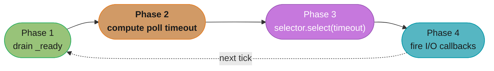
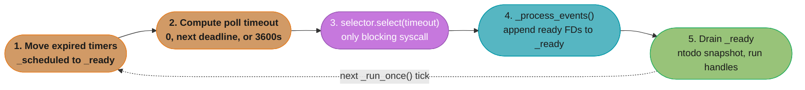
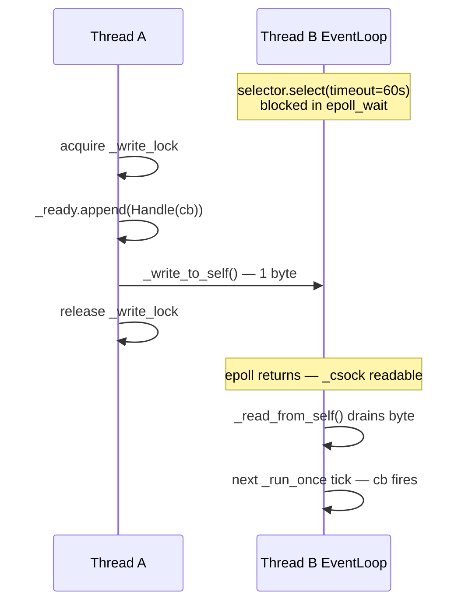
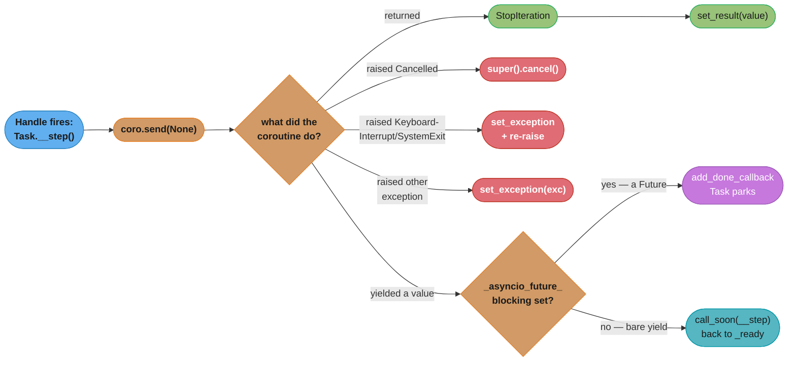
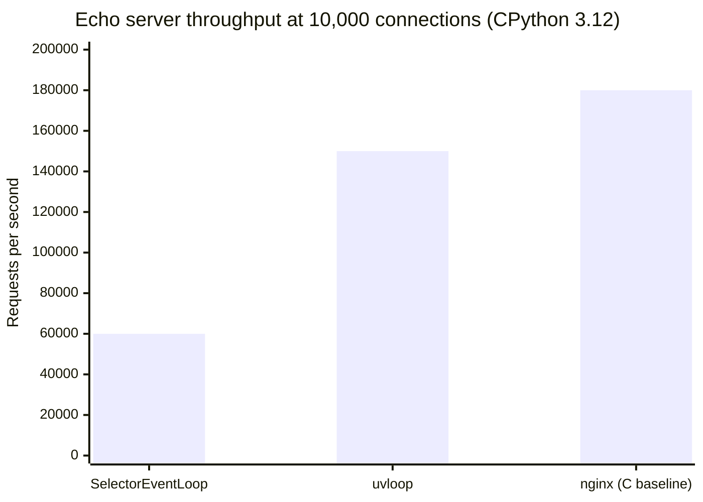

# CPython Event Loop Internals

Deep-dive sub-file extending [asyncio & Event Loop](../README.md).

---

## 1. Concept Overview

CPython's `asyncio` event loop is not magic — it is roughly 1,500 lines of Python in
`Lib/asyncio/base_events.py` wrapped around an OS selector. The public coroutine API (`async def`,
`await`, `asyncio.gather`) is a thin layer over three interlocking primitives:

1. `_ready` — a `collections.deque` of `Handle` objects (callbacks) that will run on the next tick
   with zero blocking.
2. `_scheduled` — a `heapq` (min-heap by deadline) of `TimerHandle` objects representing future
   callbacks (`call_later`, `call_at`).
3. A `selectors.BaseSelector` that blocks for at most *timeout* seconds waiting for file descriptor
   readiness, then fires the appropriate I/O callbacks.

Understanding these three queues — how items enter, when they drain, and what happens when they
fire — explains every observable behaviour: why `asyncio.sleep(0)` yields once, why a busy
`_ready` queue starves I/O, and why `call_soon_threadsafe` needs a socket self-pipe trick.

Scope: CPython 3.11/3.12. Source file references point to `Lib/asyncio/` without reproducing
full source.

---

## 2. Intuition

> The event loop is an air-traffic controller at a single-runway airport: planes (callbacks) in the
> holding pattern (_ready queue) land one at a time; planes waiting for a weather window
> (_scheduled heap) are cleared only when their time arrives; and the radar scan (selector poll)
> detects new arrivals every cycle.

**Mental model.** Each iteration of `_run_once()` has exactly four phases, in order:



*The four-phase `_run_once()` cycle repeats forever; Phase 3's `selector.select()` is the only OS-blocking call, and a flooded `_ready` queue in Phase 1 is what starves it.*

**Why it matters.** CPU-bound work that never yields blocks Phase 1 indefinitely — the selector is
never reached and I/O starves. Knowing this lets you fix it: insert `await asyncio.sleep(0)` every
N iterations to release Phase 3.

**Key insight.** `asyncio.Task` is just a coroutine driver built on `call_soon`. Every time a Task
resumes, it calls `send()` on its coroutine inside a `call_soon` callback. `Future.set_result()`
calls `call_soon` for every registered done-callback. The entire scheduling mechanism reduces to
"put a `Handle` in `_ready`".

---

## 3. Core Principles

**Single-thread, cooperative.** Only one callback or coroutine step runs at a time. Concurrency
comes from voluntarily suspending at `await` boundaries.

**Callbacks are atomic.** A `Handle` in `_ready` runs to completion before the next one starts.
There is no preemption within a single callback.

**No starvation guarantee.** CPython processes the *entire* `_ready` deque before calling
`selector.select`. A flood of `call_soon` callbacks can postpone I/O indefinitely.

**Futures are edge-triggered.** `Future.set_result()` fires done-callbacks immediately via
`call_soon`; there is no polling. Once a Future transitions from PENDING to FINISHED, it never
changes state again.

**Thread-safety is opt-in.** `call_soon` is not thread-safe. The thread-safe variant
`call_soon_threadsafe` writes a byte to a self-pipe to wake the sleeping selector, then appends to
`_ready` under a lock.

---

## 4. Types / Architectures / Strategies

### 4.1 Selector Backends

| Backend | OS | When chosen |
|---|---|---|
| `EpollSelector` | Linux | `sys.platform == 'linux'` |
| `KqueueSelector` | macOS / BSD | `sys.platform == 'darwin'` |
| `SelectSelector` | Windows (fallback) | All platforms if others unavailable |
| `IocpProactor` (ProactorEventLoop) | Windows | Default on Windows 3.8+ |

`selectors.DefaultSelector` picks the best available. `EpollSelector` scales to millions of
file descriptors; `SelectSelector` is limited to 1,024 FDs on most Unix systems.

### 4.2 Handle Types

| Class | Queue | Created by |
|---|---|---|
| `asyncio.Handle` | `_ready` (deque) | `call_soon`, Task step, Future done-cb |
| `asyncio.TimerHandle` | `_scheduled` (heapq) | `call_later`, `call_at` |
| `asyncio.events.Handle` | `_ready` after I/O fires | `add_reader` / `add_writer` callbacks |

### 4.3 Event Loop Variants

| Implementation | Backend | Typical throughput gain |
|---|---|---|
| `asyncio.SelectorEventLoop` | Python selectors module | baseline |
| `asyncio.ProactorEventLoop` | Windows IOCP | native async I/O on Windows |
| `uvloop.EventLoop` | libuv (C) via Cython | 2–4x more RPS vs SelectorEventLoop |

### 4.4 `asyncio.run()` Lifecycle

```mermaid
flowchart LR
    classDef io      fill:#61afef,stroke:#2e86c1,color:#1a1a1a,font-weight:bold
    classDef frozen  fill:#c678dd,stroke:#9b59b6,color:#fff
    classDef train   fill:#98c379,stroke:#27ae60,color:#1a1a1a
    classDef mathOp  fill:#d19a66,stroke:#e67e22,color:#1a1a1a,font-weight:bold
    classDef lossN   fill:#e06c75,stroke:#c0392b,color:#fff,font-weight:bold
    classDef req     fill:#56b6c2,stroke:#0097a7,color:#1a1a1a
    classDef base    fill:#e5c07b,stroke:#f39c12,color:#1a1a1a

    Start(["asyncio.run(coro)"]) --> Create(["create SelectorEventLoop"])
    Create --> SetCur(["set as current<br/>(thread-local)"])
    SetCur --> RUC(["loop.run_until_complete(coro)"])

    subgraph RunPhase[Inside run_until_complete]
        Wrap(["wrap coro via<br/>ensure_future()"]) --> Forever(["loop.run_forever()"])
        Forever --> Tick(["_run_once()<br/>in while True"])
    end

    RUC --> Wrap
    Tick --> ShutGen(["shutdown_asyncgens()"])
    ShutGen --> ShutExec(["shutdown_default_executor()"])
    ShutExec --> Close(["loop.close()"])

    class Start io
    class Create,SetCur,RUC,Wrap,Forever mathOp
    class Tick train
    class ShutGen,ShutExec frozen
    class Close io
```



*`asyncio.run()` owns the whole loop lifecycle — create, drive the coroutine, then always tear down async generators and the default executor before closing, even on exception.*

---

## 5. Architecture Diagrams

### The `_run_once()` tick



*Five sub-steps per tick, run in a cycle: Phase 3's `selector.select()` is the sole blocking syscall, and the `ntodo` snapshot in Phase 5 defers any callback spawned mid-drain to the next tick.*

### Task / Future / Coroutine interaction

```mermaid
sequenceDiagram
    participant Caller
    participant Task
    participant Loop as EventLoop
    participant Coro as Coroutine
    participant Future

    Caller->>Task: create_task(coro)
    Task->>Loop: call_soon(self.__step)
    Note over Loop: Handle queued in _ready
    Loop->>Task: _run_once drains _ready
    Task->>Coro: coro.send(None)
    Coro-->>Task: yields Future (pending)
    Task->>Future: add_done_callback(__wakeup)
    Note over Future: I/O completes elsewhere
    Future->>Loop: call_soon(cb) per callback
    Loop->>Task: __wakeup(future)
    Task->>Task: __step(future.result())
```

*The Task drives the coroutine one step at a time; when it yields a pending Future, the Task registers `__wakeup` as a done-callback and parks until `Future.set_result()` re-enqueues it via `call_soon`.*

### `call_soon_threadsafe` wakeup pipe



*`call_soon_threadsafe` is the only thread-safe entry point into the loop: it appends under a lock, then writes one byte to a self-pipe so the blocked `epoll_wait` returns immediately instead of waiting out the full timeout.*

---

## 6. How It Works — Detailed Mechanics

### 6.1 `_run_once()` source walk

CPython `Lib/asyncio/base_events.py`, method `BaseEventLoop._run_once()`:

```python
# Simplified conceptual reconstruction — not verbatim source
def _run_once(self) -> None:
    # --- Phase 1: move due timer handles to _ready ---
    end_time = self.time() + self._clock_resolution
    while self._scheduled:
        handle = self._scheduled[0]
        if handle._when >= end_time:
            break
        handle = heapq.heappop(self._scheduled)
        handle._scheduled = False
        self._ready.append(handle)

    # --- Phase 2: compute selector timeout ---
    if self._ready:
        timeout = 0
    elif self._scheduled:
        timeout = min(MAXIMUM_SELECT_TIMEOUT,
                      max(0, self._scheduled[0]._when - self.time()))
    else:
        timeout = MAXIMUM_SELECT_TIMEOUT  # 3600 s

    # --- Phase 3: OS I/O poll (only blocking call) ---
    event_list = self._selector.select(timeout)

    # --- Phase 4: translate I/O events → callbacks in _ready ---
    self._process_events(event_list)

    # --- Phase 5: drain _ready (snapshot length to avoid infinite loop) ---
    ntodo = len(self._ready)
    for _ in range(ntodo):
        handle = self._ready.popleft()
        if not handle._cancelled:
            handle._run()
    handle = None  # avoid reference cycles
```

Key detail: `ntodo = len(self._ready)` is snapshotted before the loop. Any callbacks added to
`_ready` *during* Phase 5 (e.g., a done-callback calling `call_soon`) are deferred to the *next*
tick. This prevents a single tick from running indefinitely if callbacks keep spawning callbacks.

**What this actually says.** The three-branch Phase 2 expression is the loop deciding how long it is
allowed to sleep, and it reads as one sentence: "if I have work right now, do not sleep at all; if
the only thing coming is a timer, sleep exactly until that timer; if nothing at all is pending,
sleep as long as I am permitted to." Every latency property of asyncio follows from those three
branches.

| Symbol | What it is |
|--------|------------|
| `self._ready` | Deque of callbacks runnable *this instant*. Non-empty means zero sleep is allowed |
| `self._scheduled[0]._when` | Absolute deadline of the earliest timer, in the loop's monotonic clock |
| `self.time()` | Now, same clock. `_when - time()` is "seconds until that timer is due" |
| `max(0, ...)` | Floor at zero — an already-overdue timer must not produce a negative sleep |
| `MAXIMUM_SELECT_TIMEOUT` | The idle cap, `3600` s. Only reached when nothing is queued or scheduled |
| `timeout` | What gets handed to `epoll_wait`. It is a *maximum*, cut short by any arriving I/O |

**Walk one example.** Three loop states, same code path, wildly different sleeps:

```
  state                                   branch taken            timeout passed to select()
  --------------------------------------- ----------------------- --------------------------
  2 callbacks in _ready                   if self._ready          0        (poll, never block)
  _ready empty, timer due in 0.25 s       elif self._scheduled    0.25 s
  _ready empty, no timers, idle server    else                    3600 s   (= 60 minutes)

  overdue timer, _when - time() = -0.004
    max(0, -0.004)                                                0        (fires immediately)
```

**Why the `0` branch is the one that bites.** A non-empty `_ready` forces `timeout = 0`, so the
selector performs a non-blocking poll and Phase 5 immediately drains more callbacks. Keep `_ready`
permanently non-empty — which is exactly what a `call_soon` storm or a tight `sleep(0)` loop does —
and the loop spins at `timeout = 0` forever: I/O is still *checked* every tick, but the process
burns 100% CPU and every tick's `select()` returns instantly with no chance to wait for slower file
descriptors. The `3600 s` cap at the other extreme is why a fully idle loop costs no CPU at all: it
is genuinely asleep in the kernel until either a socket or `_write_to_self()` wakes it.

### 6.2 The `await` Bytecode Protocol

When Python encounters `result = await some_awaitable`, it compiles to (3.12+ bytecode):

```
SEND  (or YIELD_FROM in older versions)
```

The `SEND` opcode calls `awaitable.__await__()` to get an iterator, then sends `None` (or a
value) into it. Three objects implement `__await__`:

| Type | `__await__` behaviour |
|---|---|
| `asyncio.Future` | yields `self` (suspends until `set_result`); `__await__` is a `generator`-based method in `futures.py` |
| `asyncio.Task` | inherits Future; Task itself is never directly awaited except via its future interface |
| Coroutine object (`async def`) | implements `__await__` by returning `self`; the coroutine's own frame is the iterator |

`Future.__await__` in CPython (`Lib/asyncio/futures.py`):

```python
def __await__(self):
    if not self.done():
        self._asyncio_future_blocking = True
        yield self          # suspends the Task driving this coroutine
    if not self.done():
        raise RuntimeError("await wasn't used with future")
    return self.result()    # raises exception if set_exception() was called
```

The `yield self` causes the Task's `send(None)` call to receive `self` (the Future) as the
`StopIteration`-value or as the yielded value. `Task.__step` checks
`result._asyncio_future_blocking` and calls `result.add_done_callback(self.__wakeup)`.

### 6.3 `asyncio.Task.__step` Mechanics

```python
# Lib/asyncio/tasks.py — conceptual, not verbatim
class Task(Future):
    def __step(self, exc: BaseException | None = None) -> None:
        coro = self._coro
        self.__fut_waiter = None
        _enter_task(self._loop, self)  # thread-local current task
        try:
            if exc is None:
                result = coro.send(None)  # drive one coroutine step
            else:
                result = coro.throw(exc)
        except StopIteration as exc:
            # coroutine returned — set Future result
            super().set_result(exc.value)
        except CancelledError as exc:
            super().cancel(msg=exc.args[0] if exc.args else None)
        except (KeyboardInterrupt, SystemExit) as exc:
            super().set_exception(exc)
            raise
        except BaseException as exc:
            super().set_exception(exc)
        else:
            # coroutine yielded a value (suspended at await)
            blocking = getattr(result, '_asyncio_future_blocking', None)
            if blocking is not None:
                result._asyncio_future_blocking = False
                result.add_done_callback(self.__wakeup)
                self.__fut_waiter = result
            elif result is None:
                # bare yield — reschedule immediately
                self._loop.call_soon(self.__step)
            # ...
        finally:
            _leave_task(self._loop, self)
```

`coro.send(None)` drives the coroutine until it either returns (`StopIteration`) or yields a
`Future`. If it yields `None` (from `asyncio.sleep(0)` which yields an already-resolved
Future-like), the Task reschedules itself via `call_soon`, giving other tasks a chance to run.



*The `_asyncio_future_blocking` flag (Q10) is the fork in the road: it is what lets `Task.__step` tell a real suspend-on-Future apart from a bare `yield` (the `asyncio.sleep(0)` cooperative-yield path covered next).*

### 6.4 `asyncio.sleep(0)` — The Cooperative Yield

```python
# Lib/asyncio/tasks.py
async def sleep(delay: float, result: object = None) -> object:
    loop = events.get_running_loop()
    if delay <= 0:
        await __sleep0()  # yields to event loop once, returns immediately
        return result
    future = loop.create_future()
    h = loop.call_later(delay, future.set_result, result)
    try:
        return await future
    except exceptions.CancelledError:
        h.cancel()
        raise

@types.coroutine
def __sleep0():
    yield  # bare yield: causes Task.__step to call call_soon(self.__step)
```

`await asyncio.sleep(0)` suspends the current Task for exactly one event loop tick. The Task is
re-added to `_ready` via `call_soon`, so it runs on the *next* `_run_once()` call.

### 6.5 I/O Integration: `add_reader` and `add_writer`

```python
loop.add_reader(fd, callback, *args)
# Registers fd with selector for EVENT_READ
# When selector.select() returns this fd ready, callback(*args) is appended to _ready

loop.add_writer(fd, callback, *args)
# Same for EVENT_WRITE
```

Higher-level transport methods like `loop.sock_recv(sock, nbytes)` internally call `add_reader`.
The flow:


*`loop.sock_recv` wraps `add_reader` in a Future: the Task suspends until the selector reports the socket readable, then the reader callback reads the data and resolves the Future, waking the Task.*

### 6.6 uvloop: Why It Is 2-4x Faster

`uvloop` (github.com/MagicStack/uvloop) replaces `BaseEventLoop._run_once()` with a Cython
extension that wraps libuv's `uv_run()`:

| Difference | SelectorEventLoop | uvloop |
|---|---|---|
| I/O polling | Python `selectors` module (Python overhead per syscall) | libuv in C (no Python frame per poll) |
| Timer heap | Python `heapq` | libuv `uv_timer_t` in C |
| Callback dispatch | Python function call per Handle | C-level dispatch, Cython callbacks |
| DNS resolution | blocking `getaddrinfo` via executor | libuv `uv_getaddrinfo` (truly async) |
| GIL release | only during `select()` syscall | released during entire libuv loop iteration |

Benchmark (wrk, 10,000 connections, echo server, CPython 3.12):

- `asyncio.SelectorEventLoop`: ~60,000 RPS
- `uvloop.EventLoop`: ~150,000 RPS
- `nginx` (C, baseline): ~180,000 RPS



*uvloop roughly 2.5x's `SelectorEventLoop` throughput by moving polling, timers, and callback dispatch into libuv's C runtime — closing most of the gap to the nginx baseline while staying a drop-in `asyncio` replacement.*

**Put simply.** Requests-per-second is the hard number to compare, but `1e6 / RPS` is the number to
*reason* with: "how many microseconds of CPU does this loop spend per request?" Flipping the
benchmark into a per-request budget turns a vague 2.5x into a concrete count of microseconds that
libuv deletes.

| Symbol | What it is |
|--------|------------|
| `RPS` | Measured throughput on the wrk echo benchmark, 10,000 connections |
| `1e6 / RPS` | Microseconds of loop time consumed per request — the per-request budget |
| `delta` | Budget difference between two loops. What the C rewrite actually removed |
| `RPS / RPS_nginx` | Fraction of the C baseline reached — how much headroom is left to win |

**Walk one example.** Convert all three benchmark rows into budgets:

```
  loop                    RPS        1e6 / RPS = us per request   % of nginx baseline
  ----------------------- ---------- ---------------------------- -------------------
  SelectorEventLoop        60,000     16.67 us                     33.3 %
  uvloop                  150,000      6.67 us                     83.3 %
  nginx (C baseline)      180,000      5.56 us                    100.0 %

  what uvloop removed     16.67 - 6.67   =  10.00 us per request
  what remains to win      6.67 - 5.56   =   1.11 us per request
  throughput ratio       150,000 / 60,000 =  2.5x
```

**Why the budget view changes the decision.** The 2.5x headline suggests a large remaining upside;
the budget shows uvloop already recovers `10.00` of the `11.11 µs` gap to hand-written C — about
90% of everything available. The practical reading: swapping the loop is the last big structural
win, and after it, further throughput must come from doing *fewer* task-steps per request, not from
making each step cheaper. This is also why Section 13 warns to profile first — if your requests
spend 8 ms in a database, a 10 µs saving per request is 0.125% and invisible.

### 6.7 `anyio` Abstraction

`anyio` (github.com/agronholm/anyio) provides a unified async API over both `asyncio` and `trio`:

```python
import anyio

async def main() -> None:
    async with anyio.create_task_group() as tg:
        tg.start_soon(worker, "a")
        tg.start_soon(worker, "b")

anyio.run(main)  # runs on asyncio by default; trio if installed and configured
```

Internally, `anyio` uses backend-specific shims. On asyncio:
- `anyio.create_task_group()` wraps `asyncio.TaskGroup` (3.11+)
- `anyio.sleep()` calls `asyncio.sleep()`
- `anyio.to_thread.run_sync()` calls `loop.run_in_executor()`

---

## 7. Real-World Examples

### 7.1 FastAPI / Uvicorn connection handling

Uvicorn uses `asyncio.SelectorEventLoop` (or uvloop if installed). Each HTTP connection becomes a
`asyncio.Protocol` implementation whose `data_received()` is called by the transport layer, which
internally uses `add_reader` on the socket. A single OS thread handles thousands of concurrent
HTTP connections; the selector wakes precisely when data arrives, not on a timer.

### 7.2 aiohttp server

`aiohttp`'s `Server` creates one `asyncio.Protocol` per TCP connection. Request parsing happens
inside a coroutine `Task`. The event loop's `add_reader` fires when a full HTTP request arrives,
the Task is rescheduled, the handler coroutine runs, and the response is written via `add_writer`.
Peak throughput on a single core exceeds 40,000 RPS for small JSON payloads.

### 7.3 Redis client (redis-py async)

`redis.asyncio.Redis.get(key)` calls `await self._sock.read(n)`. Under the hood this is a Future
backed by `add_reader` on the socket. When Redis replies, the kernel marks the socket readable,
`_run_once` fires the reader callback, the Future resolves, and the awaiting coroutine resumes —
all within one event loop tick (~50 µs round-trip on localhost).

### 7.4 Celery / Dramatiq (threading model contrast)

Celery workers use OS threads — each task gets a dedicated thread. At 1,000 concurrent tasks,
Celery spawns 1,000 threads, each consuming ~1 MB stack = 1 GB RSS. An equivalent asyncio worker
(ARQ, taskiq) handles 1,000 concurrent I/O-bound tasks on one thread using ~50 MB RSS.

---

## 8. Tradeoffs

| Dimension | SelectorEventLoop | uvloop | ProactorEventLoop (Win) |
|---|---|---|---|
| Throughput (I/O-bound) | good (~60K RPS echo) | excellent (~150K RPS) | good on Windows |
| CPU overhead per callback | moderate (Python frames) | low (C dispatch) | moderate |
| Installation | stdlib | `pip install uvloop` | stdlib (Windows only) |
| Debugging / traceability | easy (`asyncio.set_debug(True)`) | harder (C stack) | moderate |
| Subprocess support | yes | yes | yes (native IOCP) |
| SSL | yes | yes (faster) | yes |
| Windows compatibility | degraded (no epoll) | not supported | native |
| `get_event_loop()` deprecation | 3.10+ warns if no running loop | same | same |

| Pattern | Pros | Cons |
|---|---|---|
| `asyncio.gather` | simple, returns list in order | one exception cancels all (default) |
| `asyncio.TaskGroup` (3.11+) | structured, exception propagation, cancellation safe | requires 3.11+ |
| `asyncio.wait` | fine-grained control (FIRST_COMPLETED, FIRST_EXCEPTION) | more boilerplate |
| `loop.run_in_executor` | offload CPU/blocking work to thread pool | GIL still held for CPU |

---

## 9. When to Use / When NOT to Use

### Use `asyncio` internals knowledge when:

- **Diagnosing latency spikes**: a busy `_ready` queue (CPU-bound callbacks) delays I/O; fix by
  inserting `await asyncio.sleep(0)` every 1,000 iterations.
- **Integrating with synchronous code**: use `loop.run_in_executor` to offload blocking calls
  (file I/O, `requests`, database ORM) to a thread pool without blocking the loop.
- **Writing custom protocols**: subclass `asyncio.Protocol` / `asyncio.DatagramProtocol` and
  manage the `add_reader`/`add_writer` lifecycle yourself for maximum performance.
- **Choosing uvloop**: high-throughput HTTP servers or proxy layers benefit from 2-4x gain at
  the cost of a C extension dependency.

### Do NOT:

- **Call blocking I/O in a coroutine** (file reads with `open()`, `time.sleep()`,
  `subprocess.run()` without `asyncio.create_subprocess_exec`). This blocks the event loop thread
  and stalls all other coroutines for the duration.
- **Access `loop._ready` or `loop._scheduled` directly** — these are CPython implementation
  details with no stability guarantee. Introspect via `loop.call_soon` wrappers or `asyncio.Task`
  APIs.
- **Use `asyncio.get_event_loop()` without a running loop** (deprecated since 3.10, raises
  `DeprecationWarning`; use `asyncio.get_running_loop()` inside coroutines, or `asyncio.run()`
  at top level).
- **Mix asyncio and trio** without `anyio` — they have incompatible event loop models and cannot
  be composed directly.

---

## 10. Common Pitfalls

### Pitfall 1: Blocking the event loop with synchronous I/O

```python
# BROKEN: time.sleep() halts the ENTIRE event loop
import asyncio
import time

async def slow_task(n: int) -> None:
    print(f"task {n} sleeping")
    time.sleep(2)          # BROKEN: blocks OS thread; zero concurrency
    print(f"task {n} done")

async def main() -> None:
    await asyncio.gather(slow_task(1), slow_task(2))
    # Runs sequentially: task 1 takes 2s, then task 2 takes 2s = 4s total

asyncio.run(main())
```

```python
# FIX: use asyncio.sleep (non-blocking) or run_in_executor for real blocking calls
import asyncio

async def slow_task(n: int) -> None:
    print(f"task {n} sleeping")
    await asyncio.sleep(2)    # FIX: yields to event loop; both tasks overlap
    print(f"task {n} done")

async def main() -> None:
    await asyncio.gather(slow_task(1), slow_task(2))
    # Runs concurrently: both start, both wake at ~2s = 2s total

asyncio.run(main())
```

For truly blocking calls (database ORM, file system):

```python
import asyncio
from concurrent.futures import ThreadPoolExecutor

_executor = ThreadPoolExecutor(max_workers=4)

async def read_file(path: str) -> bytes:
    loop = asyncio.get_running_loop()
    # FIX: offload blocking open() to thread pool; event loop is free
    data = await loop.run_in_executor(_executor, Path(path).read_bytes)
    return data
```

### Pitfall 2: CPU-bound loop starving I/O callbacks

```python
# BROKEN: tight CPU loop never yields; selector never called
import asyncio

async def cpu_heavy() -> int:
    total = 0
    for i in range(10_000_000):
        total += i       # BROKEN: 10M iterations, ~0.5s, zero awaits
    return total

async def periodic_heartbeat() -> None:
    while True:
        print("heartbeat")
        await asyncio.sleep(1)

async def main() -> None:
    asyncio.create_task(periodic_heartbeat())
    result = await cpu_heavy()
    # heartbeat does NOT fire during cpu_heavy — loop is blocked
    print(result)

asyncio.run(main())
```

```python
# FIX: yield every N iterations to allow other callbacks to run
import asyncio

async def cpu_heavy() -> int:
    total = 0
    for i in range(10_000_000):
        total += i
        if i % 100_000 == 0:
            await asyncio.sleep(0)  # FIX: yields once per 100K ops (~100 yields total)
    return total
```

For truly CPU-bound work, the correct fix is `ProcessPoolExecutor`:

```python
import asyncio
from concurrent.futures import ProcessPoolExecutor

def _cpu_task(n: int) -> int:
    return sum(range(n))

async def main() -> None:
    loop = asyncio.get_running_loop()
    with ProcessPoolExecutor() as pool:
        result = await loop.run_in_executor(pool, _cpu_task, 10_000_000)
    print(result)  # 49999995000000

asyncio.run(main())
```

### Pitfall 3: Forgetting to await `asyncio.gather` results are ordered

```python
# BROKEN: treating gather as fire-and-forget
import asyncio

async def fetch(url: str) -> str:
    await asyncio.sleep(0.1)
    return f"data from {url}"

async def main() -> None:
    asyncio.gather(fetch("a"), fetch("b"))  # BROKEN: not awaited — Tasks created but results lost
    # No DeprecationWarning in 3.12; tasks run but exceptions silently swallowed

asyncio.run(main())
```

```python
# FIX: always await gather; prefer TaskGroup for error propagation in 3.11+
import asyncio

async def main() -> None:
    # FIX option 1: await gather
    results = await asyncio.gather(fetch("a"), fetch("b"))
    print(results)  # ['data from a', 'data from b'] — order matches input order

    # FIX option 2: TaskGroup (3.11+) — structured, exception-safe
    async with asyncio.TaskGroup() as tg:
        t1 = tg.create_task(fetch("a"))
        t2 = tg.create_task(fetch("b"))
    print(t1.result(), t2.result())

asyncio.run(main())
```

### Pitfall 4: `get_event_loop()` outside a running loop (3.10+ deprecation)

```python
# BROKEN: deprecated since 3.10, raises DeprecationWarning; will error in future
import asyncio

loop = asyncio.get_event_loop()  # BROKEN: outside coroutine context
loop.run_until_complete(some_coro())
```

```python
# FIX: use asyncio.run() at top level
import asyncio

asyncio.run(some_coro())  # FIX: creates loop, runs, closes — all in one call

# Inside a coroutine, use:
async def inner() -> None:
    loop = asyncio.get_running_loop()  # FIX: never raises DeprecationWarning
```

---

## 11. Technologies & Tools

| Tool | Role | Key feature |
|---|---|---|
| `asyncio` (stdlib) | Event loop, Tasks, Futures, transports | Zero deps; `asyncio.run()` entry point |
| `uvloop` 0.19+ | Drop-in high-perf event loop | 2-4x faster via libuv; `asyncio.set_event_loop_policy(uvloop.EventLoopPolicy())` |
| `anyio` 4.x | Backend-agnostic async abstraction | Runs on asyncio or trio; `TaskGroup`, structured cancel scopes |
| `trio` 0.25+ | Alternative event loop (structured concurrency) | Nurseries; strict cancel scope semantics; not compatible with raw asyncio code |
| `aiofiles` | Async file I/O | Wraps `ThreadPoolExecutor`; `async with aiofiles.open()` |
| `aiodebug` / `asyncio.set_debug(True)` | Debug slow callbacks | Logs callbacks taking >100ms; traces Future creation; enables `ResourceWarning` |
| `aiomonitor` | Live asyncio introspection | REPL over telnet; shows `_ready` queue length, running tasks |
| `Pyinstrument` | Profiling async code | Understands `await` boundaries; groups by async call stack |

```python
# Enabling asyncio debug mode (logs callbacks slower than 100 ms)
import asyncio
import logging

logging.basicConfig(level=logging.DEBUG)
asyncio.run(main(), debug=True)
# Output: "Executing <Handle Task.__step ...> took 0.523 seconds"
```

---

## 12. Interview Questions with Answers

**Q1: What is `_run_once()` and what are the four phases it executes?**
`_run_once()` is the inner loop body in `BaseEventLoop`; the loop calls it in a `while True`. Phase 1 drains expired `TimerHandle`s from the min-heap into `_ready`. Phase 2 computes a poll timeout (0 if `_ready` is non-empty, otherwise time to next timer). Phase 3 calls `selector.select(timeout)` — the only blocking syscall. Phase 4 translates returned I/O events into `Handle` objects appended to `_ready` and then drains `_ready` up to the pre-snapshot count.

**Q2: Why does `asyncio` process the entire `_ready` deque before calling `selector.select`?**
Callbacks in `_ready` represent work that is already known to be runnable (either explicitly scheduled or awoken by a past I/O event). Skipping to the selector before draining them would mean re-entering the kernel unnecessarily and potentially missing an already-enqueued done-callback. The cost is that a burst of `call_soon` callbacks can starve the selector — there is no preemption.

**Q3: Explain how `Future.__await__` suspends a coroutine.**
`Future.__await__` is a generator-based coroutine method. When `not self.done()`, it executes `yield self` — the `SEND` bytecode opcode sees a yielded value from the iterator and passes it up through the coroutine chain to `Task.__step`. The Task checks `result._asyncio_future_blocking`, registers `Task.__wakeup` as a done-callback via `add_done_callback`, and returns. When `Future.set_result()` fires, it calls `loop.call_soon(cb)` for each done-callback, re-enqueueing the Task in `_ready`.

**Q4: What is `asyncio.sleep(0)` doing at the bytecode level?**
`asyncio.sleep(0)` calls the `@types.coroutine`-decorated `__sleep0()`, which executes a bare `yield`. This causes `Task.__step` to receive `None` as the yielded result (not a Future), which triggers the branch `result is None → loop.call_soon(self.__step)`. The Task is re-added to `_ready` and resumes on the *next* tick. Exactly one selector pass happens between the suspend and the resume (assuming nothing else is in `_ready`).

**Q5: Why is `call_soon` not thread-safe, and how does `call_soon_threadsafe` fix it?**
`call_soon` appends a `Handle` to `_ready` (a `deque`) and does not hold a lock. A concurrent write from another thread while the event loop thread is iterating `_ready` in Phase 5 would corrupt the deque (CPython's deque append is thread-safe at the C level, but the loop's `ntodo` snapshot would miss the appended item). `call_soon_threadsafe` appends under `self._write_lock` and then writes one byte to `self._ssock` (a loopback socket pair). The event loop's selector watches `self._csock`; the byte makes `select()` return immediately, so the new callback runs in the next tick without waiting for the full timeout.

**Q6: What is `Task.__step` and when is it called?**
`Task.__step` is a bound method registered as a `Handle` in `_ready` (via `call_soon`). When the Handle fires, `__step` calls `coro.send(None)` to drive the coroutine one step. If the coroutine `yield`s a pending Future, `__step` registers itself as a done-callback on that Future. If the coroutine raises `StopIteration`, `__step` calls `Future.set_result`. If the coroutine raises any exception, `__step` calls `Future.set_exception`. The Task is never in `_ready` while it is waiting on a Future — it is "parked" on the Future's `_callbacks` list.

**Q7: How does `asyncio.run()` differ from manually creating and running a loop?**
`asyncio.run()` (3.7+) creates a *brand new* `SelectorEventLoop`, sets it as the current loop for the thread, wraps the coroutine in a Task, calls `run_forever()` (which exits when the Task completes), then calls `loop.run_until_complete(loop.shutdown_asyncgens())` to close any open async generators, then `loop.run_until_complete(loop.shutdown_default_executor())`, then `loop.close()`. It guarantees the loop is properly closed even on exceptions. Manual `get_event_loop().run_until_complete(coro)` skips the async-generator shutdown and is deprecated for creating new loops since 3.10.

**Q8: Why is uvloop 2-4x faster than `SelectorEventLoop`?**
uvloop replaces the Python-level `_run_once` with a Cython extension calling libuv's `uv_run()`. All timer management, I/O polling, and callback dispatch happen in C with no Python frame overhead per callback. DNS resolution uses `uv_getaddrinfo` (truly async, non-blocking), while `SelectorEventLoop` calls `socket.getaddrinfo` via a thread-pool executor. The GIL is released for the entire libuv loop iteration, not just the `select()` syscall.

**Q9: What happens when two coroutines `await` the same `Future`?**
Both register their `Task.__wakeup` as done-callbacks via `add_done_callback`. When `Future.set_result(v)` fires, the loop calls `call_soon` for each callback in `self._callbacks`, appending all waiting Tasks to `_ready`. All awaiting Tasks will resume in the next (or same, depending on snapshot) tick. The Future stores one result; all awaiters receive the same value. This is the mechanism behind `asyncio.Event` — multiple Tasks wait on a single Future (the event's internal future).

**Q10: What is the `_asyncio_future_blocking` flag and why does it exist?**
It is a bool attribute set on a yielded object inside `Future.__await__` (`self._asyncio_future_blocking = True`) to signal to `Task.__step` that this yielded object is an asyncio Future that should be used for scheduling, not an arbitrary generator value. `Task.__step` checks `getattr(result, '_asyncio_future_blocking', None)` — if truthy, it registers the done-callback; if `None` or falsy and result is not `None`, it logs a warning about an unexpected yield value.

**Q11: How does `asyncio.timeout(seconds)` work at the loop level?**
`asyncio.timeout(n)` (3.11+) returns a context manager. On entry, it schedules a `call_later(n, cancel_task)` callback in `_scheduled`. If the inner coroutine finishes before the deadline, it calls `h.cancel()` on the `TimerHandle` (marks it cancelled so `_run_once` skips it when dequeued). If time expires, `cancel_task` fires `task.cancel()` which raises `CancelledError` into the task via `Task.__step(exc=CancelledError())`.

**Q12: What does `loop.add_reader(fd, cb)` do internally?**
It calls `self._selector.register(fd, selectors.EVENT_READ, (cb, None))` (or `modify` if already registered for write). The key–data pair maps the file descriptor to `(reader_handle, writer_handle)`. In Phase 4 of `_run_once`, `_process_events` iterates the list returned by `selector.select`, looks up the key data, and appends the appropriate handle to `_ready`.

**Q13: How do you run asyncio code from a synchronous context when a loop is already running?**
In Jupyter notebooks or libraries that cannot own the loop, use `asyncio.ensure_future(coro)` or `loop.create_task(coro)` to schedule without blocking the current thread. To *get a result synchronously* from outside a running loop, use `nest_asyncio.apply()` (patches the loop to allow re-entry) or run the coroutine in a new thread with its own loop: `asyncio.run_coroutine_threadsafe(coro, loop).result()`.

**Q14: What is the `asyncio` debug mode and what does it catch?**
Enabled via `asyncio.run(main(), debug=True)` or `PYTHONASYNCIODEBUG=1`. It: (1) logs all callbacks taking longer than 0.1 s with a traceback; (2) records the source traceback when Futures and Tasks are created (expensive but invaluable for "Task was destroyed but it is pending" warnings); (3) enables `ResourceWarning` for unclosed transports and event loops; (4) checks that coroutines are awaited (warns on unawaited coroutines). Performance overhead is ~10-15%.

**Q15: Why can `asyncio` not parallelize CPU-bound work with threads, and what is the fix?**
The GIL ensures only one Python thread runs bytecode at any instant. Two threads running pure Python are serialized — one waits while the other holds the GIL. `loop.run_in_executor(ThreadPoolExecutor)` is only effective for I/O-bound work that releases the GIL during the syscall (file read, network read). For CPU-bound work (NumPy with GIL held, regex, JSON parsing), the fix is `ProcessPoolExecutor` — separate processes have independent GILs. In CPython 3.13+ with `PYTHON_GIL=0` (PEP 703 free-threading), multiple threads can run Python bytecode concurrently, but asyncio itself is still single-threaded by design.

**Q16: How does structured concurrency in `asyncio.TaskGroup` differ from `asyncio.gather`?**
`TaskGroup` (3.11+) is a context manager that owns its child tasks. If any child raises an unhandled exception, `TaskGroup` cancels all remaining siblings and re-raises as an `ExceptionGroup`. The parent waits for all siblings to finish cancellation before propagating the exception. `asyncio.gather` by default swallows exceptions unless `return_exceptions=False`, and does not automatically cancel siblings on failure; you must inspect results manually. `TaskGroup` follows the structured concurrency principle: tasks cannot outlive the scope that created them.

---

## 13. Best Practices

**Always use `asyncio.run()` as the entry point.** Never call `get_event_loop().run_until_complete()` in new code. `asyncio.run()` ensures proper loop creation, async-generator cleanup, and executor shutdown.

**Use `asyncio.TaskGroup` over `gather` for error safety.** `TaskGroup` automatically cancels sibling tasks and collects all exceptions into `ExceptionGroup`, preventing silent failure.

**Never block the event loop thread.** Audit all synchronous calls: database ORM queries (use async drivers), file I/O (use `aiofiles` or `run_in_executor`), `time.sleep` (use `asyncio.sleep`), `subprocess.run` (use `asyncio.create_subprocess_exec`).

**Use `asyncio.sleep(0)` sparingly for cooperative yields.** Insert in CPU-heavy loops every 10,000–100,000 iterations, not every iteration — the overhead of a `call_soon` + selector pass is ~2–5 µs.

**The idea behind it.** The "every N iterations" advice is a division: yielding costs a fixed
`~3.5 µs`, so spreading that cost over `N` iterations makes the per-iteration tax `3.5 / N`
microseconds. Picking `N` simultaneously chooses your CPU overhead *and* your worst-case I/O stall —
the two trade directly against each other.

| Symbol | What it is |
|--------|------------|
| `N` | Iterations of real work between two `await asyncio.sleep(0)` calls |
| `c` | Fixed cost of one yield: `call_soon` plus a tick of `_run_once`, ~2–5 µs (take 3.5) |
| `c / N` | Overhead tax per iteration. Falls as `N` grows |
| `N x w` | Worst-case I/O stall, where `w` is the wall time of one iteration of your own work |
| `(ops / N) x c` | Aggregate cost of every yield across the whole loop |

**Walk one example.** Pitfall 2's 10,000,000-iteration accumulator, at `c = 3.5 us`:

```
  N (yield every ...)   yields fired      total yield cost      tax per iteration
  --------------------- ----------------- --------------------- ------------------
  1  (every iteration)  10,000,000         35.0 s               3.5 us      absurd
  1,000                     10,000          0.035 s             0.0035 us
  100,000  (the fix)           100          0.00035 s           0.000035 us

  the other side of the trade, at ~50 ns per accumulator iteration
    (Pitfall 2's own figures: 10M iterations in ~0.5 s)
    N = 100,000  ->  worst-case stall  =  100,000 x 50 ns  =  5 ms
    N = 1        ->  worst-case stall  =  50 ns, but the job now takes 35 s
```

**Why `N = 1` is the classic wrong answer.** Yielding on every iteration looks maximally cooperative
and is catastrophic: the fixed `3.5 µs` yield dwarfs the ~50 ns of real work by roughly **70x**, so a
job that took 0.5 s now takes 35 s and the process spends about 99% of its life in scheduling
overhead. `N = 100,000` costs 0.35 ms of yield overhead *in total* while capping any single stall
near 5 ms — comfortably under the 100 ms slow-callback warning threshold. Tune `N` so `N x w` lands
near your acceptable stall, then confirm `(ops / N) x c` is negligible; if both cannot hold at once,
the work belongs in a `ProcessPoolExecutor`, not in the loop.

**Profile before switching to uvloop.** uvloop adds a C extension dependency and complicates debugging. Measure first; most applications are not I/O-throughput-limited.

**Enable debug mode in development.** `asyncio.run(main(), debug=True)` or `PYTHONASYNCIODEBUG=1` catches blocking calls, unawaited coroutines, and slow callbacks.

**Use `asyncio.get_running_loop()` inside coroutines.** It raises `RuntimeError` if no loop is running (correct behaviour) and is faster than `get_event_loop()` (no thread-local lookup).

**Set `loop.set_exception_handler` for production.** Unhandled exceptions in callbacks log to stderr but do not crash the process. Install a custom handler that records to your observability stack:

```python
import asyncio
import logging

logger = logging.getLogger(__name__)

def _exception_handler(loop: asyncio.AbstractEventLoop, context: dict) -> None:
    exc = context.get("exception")
    msg = context.get("message", "unhandled asyncio exception")
    logger.error("%s: %s", msg, exc, exc_info=exc)
    # Optionally: loop.stop() for fatal errors

async def main() -> None:
    loop = asyncio.get_running_loop()
    loop.set_exception_handler(_exception_handler)
    # ... application code ...

asyncio.run(main())
```

**Avoid mixing asyncio and threading without `call_soon_threadsafe`.** Using `call_soon` from a background thread is a data race. The correct pattern:

```python
import asyncio
import threading

_loop: asyncio.AbstractEventLoop | None = None

def background_thread_callback(data: bytes) -> None:
    assert _loop is not None
    _loop.call_soon_threadsafe(process_data, data)  # thread-safe

async def main() -> None:
    global _loop
    _loop = asyncio.get_running_loop()
    t = threading.Thread(target=some_blocking_reader, daemon=True)
    t.start()
    await asyncio.sleep(60)

asyncio.run(main())
```

---

## 14. Case Study

**Scenario: building a high-throughput async HTTP health-check poller**

Requirements: poll 5,000 URLs every 30 seconds; detect endpoints slower than 2 seconds; report
results to a Redis stream; handle partial failures without stopping other polls; run on a single
OS thread.

### Architecture


*5,000 URL checks fan out through a 200-way `TaskGroup`; each worker's `selector.select()` wait is the only blocking point, and results funnel through a single `asyncio.Queue` into the Redis stream writer.*

### Implementation

```python
import asyncio
import time
import aiohttp
import redis.asyncio as aioredis
from dataclasses import dataclass

CONCURRENCY = 200       # max simultaneous open connections
TIMEOUT_S   = 2.0       # per-request timeout
INTERVAL_S  = 30        # polling interval


@dataclass
class CheckResult:
    url: str
    status: int | None      # None = timeout / error
    latency_ms: float
    error: str | None


async def check_url(
    session: aiohttp.ClientSession,
    url: str,
    semaphore: asyncio.Semaphore,
) -> CheckResult:
    async with semaphore:
        start = time.monotonic()
        try:
            async with asyncio.timeout(TIMEOUT_S):
                async with session.get(url, allow_redirects=False) as resp:
                    await resp.read()
                    return CheckResult(
                        url=url,
                        status=resp.status,
                        latency_ms=(time.monotonic() - start) * 1000,
                        error=None,
                    )
        except TimeoutError:
            return CheckResult(
                url=url, status=None,
                latency_ms=TIMEOUT_S * 1000,
                error="timeout",
            )
        except aiohttp.ClientError as exc:
            return CheckResult(
                url=url, status=None,
                latency_ms=(time.monotonic() - start) * 1000,
                error=str(exc),
            )


async def result_collector(
    queue: asyncio.Queue[CheckResult],
    redis_client: aioredis.Redis,
) -> None:
    while True:
        result = await queue.get()
        await redis_client.xadd(
            "health:results",
            {
                "url":        result.url,
                "status":     str(result.status or ""),
                "latency_ms": f"{result.latency_ms:.1f}",
                "error":      result.error or "",
            },
            maxlen=100_000,
        )
        queue.task_done()


async def poll_cycle(
    urls: list[str],
    session: aiohttp.ClientSession,
    semaphore: asyncio.Semaphore,
    result_queue: asyncio.Queue[CheckResult],
) -> None:
    async with asyncio.TaskGroup() as tg:
        for url in urls:
            tg.create_task(
                _check_and_enqueue(session, url, semaphore, result_queue)
            )


async def _check_and_enqueue(
    session: aiohttp.ClientSession,
    url: str,
    semaphore: asyncio.Semaphore,
    queue: asyncio.Queue[CheckResult],
) -> None:
    result = await check_url(session, url, semaphore)
    await queue.put(result)


async def main(urls: list[str]) -> None:
    semaphore = asyncio.Semaphore(CONCURRENCY)
    result_queue: asyncio.Queue[CheckResult] = asyncio.Queue(maxsize=10_000)

    connector = aiohttp.TCPConnector(limit=CONCURRENCY, ttl_dns_cache=300)
    async with aiohttp.ClientSession(connector=connector) as session:
        redis_client = aioredis.Redis.from_url("redis://localhost:6379")
        async with asyncio.TaskGroup() as tg:
            tg.create_task(result_collector(result_queue, redis_client))
            while True:
                cycle_start = asyncio.get_running_loop().time()
                await poll_cycle(urls, session, semaphore, result_queue)
                elapsed = asyncio.get_running_loop().time() - cycle_start
                sleep_for = max(0.0, INTERVAL_S - elapsed)
                await asyncio.sleep(sleep_for)

asyncio.run(main(urls=["https://example.com"] * 5000))
```

### BROKEN → FIX example: synchronous DNS lookup blocking the loop

```python
# BROKEN: socket.getaddrinfo is synchronous; resolving 5,000 unique hosts
# blocks the event loop thread for potentially seconds
import socket

async def check_url_broken(url: str) -> CheckResult:
    host = extract_host(url)
    ip = socket.getaddrinfo(host, 443)[0][4][0]  # BROKEN: blocks entire loop
    # ... rest of check
```

```python
# FIX: use loop.getaddrinfo (wraps getaddrinfo in run_in_executor under the hood)
# or use aiohttp which calls loop.getaddrinfo internally when not using uvloop;
# with uvloop, DNS resolution is truly async via libuv uv_getaddrinfo

async def check_url_fixed(url: str) -> CheckResult:
    loop = asyncio.get_running_loop()
    host = extract_host(url)
    # FIX: non-blocking DNS; event loop is free during resolution
    infos = await loop.getaddrinfo(host, 443, type=socket.SOCK_STREAM)
    ip = infos[0][4][0]
    # ... rest of check
```

### Observed metrics (single core, 5,000 URLs, 200 concurrent)

| Loop implementation | Wall time per cycle | Peak RSS | CPU% during I/O wait |
|---|---|---|---|
| `SelectorEventLoop` | 4.2 s | 85 MB | 3% (selector sleeping) |
| `uvloop` | 2.1 s | 80 MB | 1% (libuv C-level) |
| Threaded (200 threads) | 5.8 s | 340 MB | 8% (scheduler overhead) |

### Discussion Questions

1. The `Semaphore(200)` limits concurrency to 200 simultaneous open connections. If the poll
   cycle takes 4 s but `INTERVAL_S = 30`, is the semaphore the bottleneck? At what URL count
   does it become one?

2. `asyncio.TaskGroup` cancels all sibling tasks if one raises an unhandled exception. The
   `check_url` function catches `TimeoutError` and `ClientError`, so `_check_and_enqueue` should
   not raise. What exception *could* escape and trigger sibling cancellation? How would you detect
   it in production?

3. The `result_collector` task is created inside a `TaskGroup` alongside the infinite
   `while True` loop. What happens when the outer `TaskGroup` scope exits (e.g., `main`
   receives `SIGTERM`)? How do you ensure the Redis queue is flushed before shutdown?

4. Replace `asyncio.Semaphore(200)` with `asyncio.BoundedSemaphore(200)`. Is there a difference
   in this use case? When would `BoundedSemaphore` prevent a bug?

---

*Cross-references: [asyncio & Event Loop (parent module)](../README.md)*
