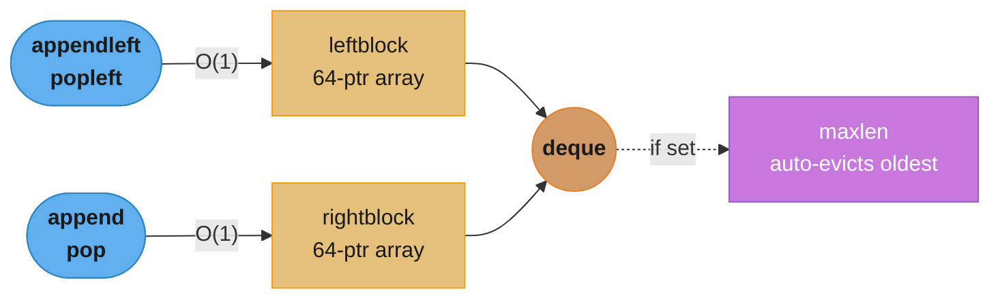
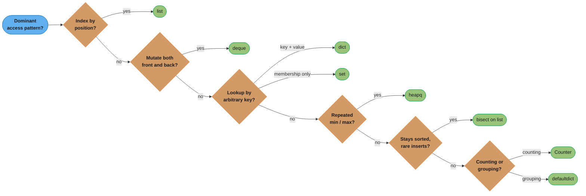
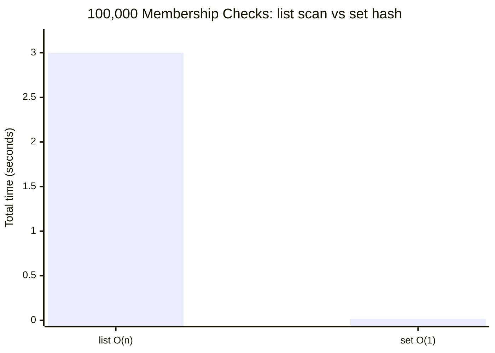
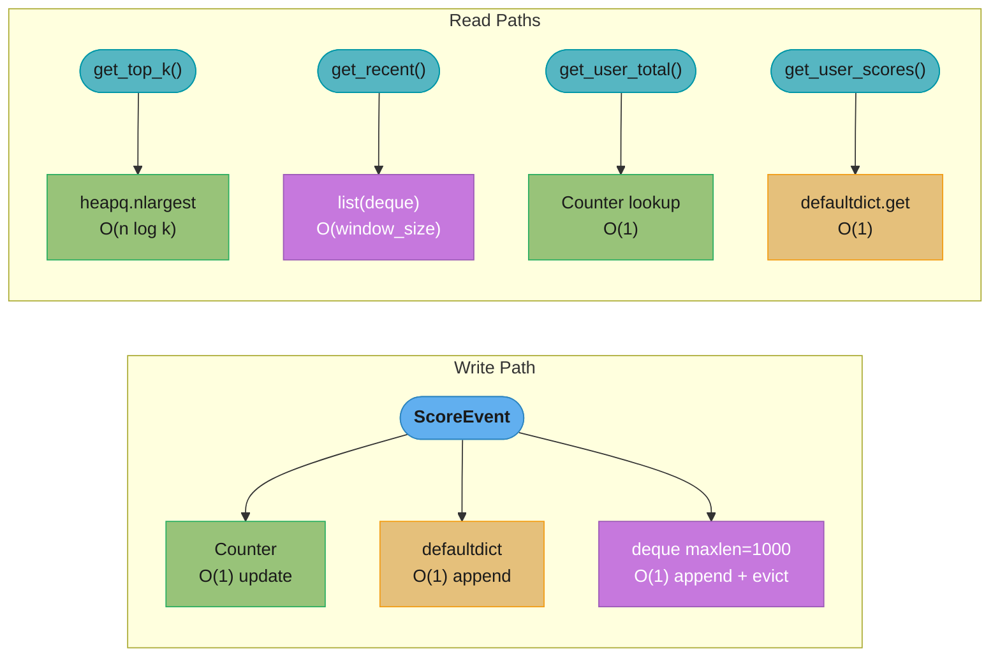

# Collections & Data Structures

## 1. Concept Overview

Python's built-in collections (`list`, `dict`, `set`, `tuple`) are implemented in CPython as highly optimized C structures. The `collections` module extends these with specialized containers designed for common algorithmic patterns. The `heapq`, `bisect`, and `array` modules round out the standard library toolkit for performance-critical code.

Understanding the internals — how memory is laid out, what hash functions guarantee, where O(1) claims break down — is the difference between code that works in a test and code that survives 10 million requests per day.

This module covers:
- Built-in collection internals with CPython implementation details
- Big-O analysis for every significant operation
- `collections` module: `deque`, `Counter`, `defaultdict`, `OrderedDict`, `namedtuple`, `ChainMap`
- `heapq`, `bisect`, and `array` for performance-critical and interview-critical patterns
- Production pitfalls, broken-then-fixed examples, and a full case study

---

## 2. Intuition

> A Python `dict` is a self-expanding filing cabinet where each drawer label is computed from the file name in constant time — until two files hash to the same drawer and you need a collision strategy.

**Mental model:** Every Python collection is a tradeoff between memory layout and access pattern. Contiguous memory (list, array) wins for indexed reads and cache locality. Hash tables (dict, set) win for arbitrary-key lookup. Linked structures (deque) win for front-and-back mutations. Choosing the wrong one is the most common source of O(n) loops that should be O(1).

**Why it matters:** In a FastAPI endpoint processing 50,000 requests per minute, a single `if x in mylist` check on a 10,000-element list costs 10,000 pointer dereferences per call — roughly 500ms of wasted CPU per second. Replacing it with a `set` drops that to a single hash computation.

**Key insight:** Python's type system encourages treating collections as interchangeable sequences, but their performance envelopes differ by orders of magnitude at the same logical operation. The algorithm is in the data structure choice, not just the loop body.

---

## 3. Core Principles

**Separation of concerns between interface and implementation.** `list` looks like an array; it is a dynamic array. `deque` looks like a sequence; it is a block-based doubly-linked structure. The interface is stable; the implementation determines performance.

**Hash table guarantees are probabilistic.** O(1) average for `dict` and `set` lookup assumes a good hash distribution. Under adversarial key patterns or a degenerate `__hash__`, worst-case degrades to O(n). CPython uses a randomized hash seed (PYTHONHASHSEED) per process start to mitigate hash-flooding denial of service.

**Mutability determines hashability.** `list`, `dict`, `set` are mutable and not hashable. `tuple`, `frozenset`, `str`, `int` are immutable and hashable. Only hashable objects can be dict keys or set members.

**Reference semantics throughout.** A Python `list` stores pointers to objects, not the objects themselves. `a = b = []` creates two names pointing to the same list. Mutations through one name are visible through the other.

**Memory over-allocation is intentional.** `list.append()` is O(1) amortized because CPython over-allocates when growing, paying an O(n) copy only on capacity doubling. The over-allocation growth factor is approximately 1.125 (12.5%) for large lists.

---

## 4. Types / Architectures / Strategies

### Built-in Sequence Types

| Type | Underlying Structure | Mutable | Hashable | Ordered |
|------|---------------------|---------|----------|---------|
| `list` | Dynamic C array of PyObject pointers | Yes | No | Yes (insertion) |
| `tuple` | Fixed C array of PyObject pointers | No | Yes (if elements hashable) | Yes (insertion) |
| `str` | Immutable Unicode array (3 internal encodings) | No | Yes | Yes |
| `bytes` | Immutable C byte array | No | Yes | Yes |
| `bytearray` | Mutable C byte array | Yes | No | Yes |

### Built-in Mapping / Set Types

| Type | Underlying Structure | Ordered |
|------|---------------------|---------|
| `dict` | Open-addressing hash table (compact, 3.6+) | Yes (insertion, guaranteed 3.7+) |
| `set` | Open-addressing hash table (keys only) | No |
| `frozenset` | Immutable hash table | No |

### `collections` Module

| Class | Best Use Case |
|-------|--------------|
| `deque` | Queue, stack, sliding window, circular buffer |
| `Counter` | Frequency counting, multiset arithmetic |
| `defaultdict` | Graph adjacency lists, grouping, memoization scaffolding |
| `OrderedDict` | LRU cache implementation, ordered removal |
| `namedtuple` | Lightweight records without class overhead |
| `ChainMap` | Layered configuration (local overrides global) |

### Performance Modules

| Module | Purpose |
|--------|---------|
| `heapq` | Priority queue on a plain list |
| `bisect` | Binary search + sorted insert on a plain list |
| `array` | Typed C array (int, float) — compact memory, no boxing |

---

## 5. Architecture Diagrams

### `list` Memory Layout (64-bit CPython 3.11)

```
list object
┌────────────────────────────────────┐
│ ob_refcnt   (8 bytes)              │
│ ob_type     → list_type (8 bytes)  │
│ ob_size     = 3 (8 bytes)          │
│ allocated   = 4 (8 bytes)  ← over-alloc
│ ob_item     → ─────────────────────┼──┐
└────────────────────────────────────┘  │
                                        ▼
                          ┌─────┬─────┬─────┬─────┐
                          │ptr0 │ptr1 │ptr2 │NULL │  each ptr = 8 bytes
                          └─────┴─────┴─────┴─────┘
                            │     │     │
                            ▼     ▼     ▼
                          int   str  float  (heap objects)
```

### `dict` Compact Representation (Python 3.6+)

```
dict object
┌────────────────────────┐
│ indices array          │   sparse — maps hash slot → entry index
│  [_, 0, _, 1, _, 2, _] │   size = 8 (next power of 2 after n/0.67)
└────────────────────────┘
         │
         ▼
┌───────────────────────────────────────┐
│ entries array (compact, insertion order)
│  [hash0, key0, val0]                  │  index 0
│  [hash1, key1, val1]                  │  index 1
│  [hash2, key2, val2]                  │  index 2
└───────────────────────────────────────┘
```

### `deque` Block Structure


*Each end writes into its own fixed 64-pointer block with no element shifting, so both `appendleft`/`popleft` and `append`/`pop` are O(1); new blocks are allocated on demand and freed once empty.*

### `heapq` Min-Heap Shape

```
         [0]
        /    \
      [1]    [2]
     /   \   /  \
   [3]  [4] [5] [6]

Stored as flat list: [root, left, right, ...]
Parent of i = (i-1) // 2
Left child of i = 2*i + 1
Right child of i = 2*i + 2
```

---

## 6. How It Works — Detailed Mechanics

### 6.1 `list` Internals

```python
import sys

empty: list = []
print(sys.getsizeof(empty))        # 56 bytes — base list object

three_items: list[int] = [1, 2, 3]
print(sys.getsizeof(three_items))  # 88 bytes = 56 + 4*8 (allocated=4 slots)
# Each slot is a C pointer: 8 bytes on 64-bit. The integers live on the heap.

# Over-allocation pattern
sizes: list[int] = []
prev = sys.getsizeof([])
for i in range(20):
    sizes.append(i)
    curr = sys.getsizeof(sizes)
    if curr != prev:
        print(f"Realloc at len={i+1}, size={curr} bytes")
        prev = curr
# Output: reallocs at 1, 5, 9, 17 — growth by ~4 each time for small lists,
# ~12.5% for large lists (CPython listobject.c, list_resize).
```

**Timsort** (`list.sort()`, `sorted()`):
- Stable — equal elements preserve original order.
- O(n) for nearly-sorted input (detects natural runs).
- O(n log n) worst case.
- In-place for `list.sort()`; returns a new list for `sorted()`.

```python
records = [("alice", 3), ("bob", 1), ("carol", 3), ("dan", 2)]
# Stable sort: items with equal key maintain original relative order.
by_score = sorted(records, key=lambda r: r[1])
# [("bob",1), ("dan",2), ("alice",3), ("carol",3)]
# alice precedes carol among score=3 items — insertion order preserved.
```

**Critical Big-O for list:**

| Operation | Complexity | Note |
|-----------|-----------|------|
| `a[i]` | O(1) | Direct pointer offset |
| `a.append(x)` | O(1) amortized | O(n) on realloc, rare |
| `a.insert(0, x)` | O(n) | Shifts all elements right |
| `a.pop()` | O(1) | Last element |
| `a.pop(0)` | O(n) | Shifts all elements left |
| `x in a` | O(n) | Linear scan |
| `a.sort()` | O(n log n) | Timsort |
| `len(a)` | O(1) | Stored in ob_size |

---

### 6.2 `dict` Internals

```python
# Python 3.7+: insertion order is guaranteed.
d: dict[str, int] = {}
d["z"] = 1
d["a"] = 2
d["m"] = 3
print(list(d.keys()))  # ["z", "a", "m"] — insertion order

# Load factor threshold: ~0.67 (2/3).
# A dict with 8 slots triggers resize at the 6th insertion.
# Resize doubles the index array; entries array grows proportionally.

# Collision resolution: open addressing with perturbation.
# next_slot = (5 * slot + 1 + perturb) % size
# perturb >>= 5 each step — mixes high bits of hash into probe sequence.

# Worst-case O(n) — degenerate hash:
class BadHash:
    def __hash__(self) -> int:
        return 42  # all instances collide

bad_keys = [BadHash() for _ in range(1000)]
bad_dict: dict[BadHash, int] = {k: i for i, k in enumerate(bad_keys)}
# Lookup now probes all 1000 entries — O(n).
```

---

### 6.3 `set` and `frozenset`

```python
# set uses the same hash table as dict, storing only keys.
# In operator: O(1) average, O(n) worst case.
import time

large_list: list[int] = list(range(1_000_000))
large_set: set[int] = set(large_list)
target = 999_999

# list membership: linear scan
t0 = time.perf_counter()
_ = target in large_list
print(f"list: {(time.perf_counter()-t0)*1e6:.1f} µs")   # ~50-200 µs

# set membership: hash lookup
t0 = time.perf_counter()
_ = target in large_set
print(f"set:  {(time.perf_counter()-t0)*1e6:.1f} µs")   # ~0.05-0.1 µs

# frozenset is hashable — can be a dict key or a set element.
fs: frozenset[int] = frozenset([1, 2, 3])
lookup: dict[frozenset[int], str] = {fs: "triangle"}
```

---

### 6.4 `deque` — Doubly-Linked Block Array

```python
from collections import deque

# O(1) append and appendleft — no element shifting.
buf: deque[int] = deque(maxlen=5)   # circular buffer of last 5 items
for i in range(8):
    buf.append(i)
print(buf)  # deque([3, 4, 5, 6, 7], maxlen=5)

# Use as a BFS queue — faster than list.pop(0).
from collections import deque as Queue
def bfs(graph: dict[str, list[str]], start: str) -> list[str]:
    visited: set[str] = set()
    order: list[str] = []
    q: Queue[str] = Queue([start])
    while q:
        node = q.popleft()   # O(1)
        if node in visited:
            continue
        visited.add(node)
        order.append(node)
        q.extend(graph.get(node, []))
    return order

# rotate(n): rotate n steps right (negative = left). O(n).
d: deque[int] = deque([1, 2, 3, 4, 5])
d.rotate(2)
print(d)  # deque([4, 5, 1, 2, 3])
```

---

### 6.5 `Counter`

```python
from collections import Counter

words = "the cat sat on the mat the cat".split()
freq: Counter[str] = Counter(words)
print(freq)                     # Counter({'the': 3, 'cat': 2, ...})
print(freq.most_common(2))      # [('the', 3), ('cat', 2)]
# most_common(n) uses heapq.nlargest internally — O(n log k).

# Arithmetic operators
a: Counter[str] = Counter(a=3, b=1)
b: Counter[str] = Counter(a=1, b=2, c=5)
print(a + b)   # Counter({'c': 5, 'a': 4, 'b': 3})   — union, keeps positives
print(a - b)   # Counter({'a': 2})                    — subtract, drop non-positives
print(a & b)   # Counter({'a': 1, 'b': 1})            — intersection (min counts)
print(a | b)   # Counter({'c': 5, 'a': 3, 'b': 2})   — union (max counts)

# Counter is a dict subclass — all dict methods available.
print(freq["missing_key"])   # 0, not KeyError — overrides __missing__
```

---

### 6.6 `defaultdict`

```python
from collections import defaultdict

# Graph adjacency list — default_factory=list creates [] on first access.
graph: defaultdict[str, list[str]] = defaultdict(list)
edges = [("A", "B"), ("A", "C"), ("B", "D")]
for src, dst in edges:
    graph[src].append(dst)
# graph["A"] = ["B", "C"], graph["B"] = ["D"]

# Grouping words by length
words = ["cat", "dog", "elephant", "ant", "fox"]
by_len: defaultdict[int, list[str]] = defaultdict(list)
for w in words:
    by_len[len(w)].append(w)
# by_len[3] = ["cat", "dog", "ant", "fox"], by_len[8] = ["elephant"]

# default_factory is called with NO arguments — it's a zero-arg callable.
# This works:
d1: defaultdict[str, list] = defaultdict(list)        # list() → []
d2: defaultdict[str, int] = defaultdict(int)           # int() → 0
d3: defaultdict[str, set] = defaultdict(set)           # set() → set()

# This fails at runtime — int is not callable with a specific value:
# defaultdict(42)   # TypeError: first argument must be callable or None
```

---

### 6.7 `heapq` — Min-Heap on a List

```python
import heapq

nums: list[int] = [5, 1, 8, 2, 9, 3]
heapq.heapify(nums)                  # O(n) in-place
print(nums[0])                       # 1 — always the minimum

heapq.heappush(nums, 0)              # O(log n)
print(heapq.heappop(nums))           # 0 — O(log n)

# Top-K smallest/largest
data: list[int] = [50, 10, 30, 80, 20, 60, 40, 70]
print(heapq.nsmallest(3, data))      # [10, 20, 30] — O(n log k)
print(heapq.nlargest(3, data))       # [80, 70, 60] — O(n log k)

# Priority queue with (priority, item) tuples — Python compares tuples lexicographically.
from dataclasses import dataclass, field
from typing import Any

@dataclass(order=True)
class PrioritizedTask:
    priority: int
    task: Any = field(compare=False)

pq: list[PrioritizedTask] = []
heapq.heappush(pq, PrioritizedTask(3, "low"))
heapq.heappush(pq, PrioritizedTask(1, "urgent"))
heapq.heappush(pq, PrioritizedTask(2, "normal"))
print(heapq.heappop(pq).task)   # "urgent"

# Max-heap: negate priorities.
max_heap: list[int] = []
for n in [5, 1, 8, 2]:
    heapq.heappush(max_heap, -n)
print(-heapq.heappop(max_heap))   # 8
```

---

### 6.8 `bisect` — Binary Search on Sorted Lists

```python
import bisect

grades: list[int] = [60, 70, 80, 90]    # must be sorted

# bisect_left: index of leftmost position where x can be inserted.
print(bisect.bisect_left(grades, 80))    # 2 — x == grades[2]
print(bisect.bisect_right(grades, 80))   # 3 — insert after existing 80

# Grade bracket lookup — O(log n).
breakpoints = [60, 70, 80, 90]
letters     = ["F", "D", "C", "B", "A"]
def letter_grade(score: int) -> str:
    return letters[bisect.bisect(breakpoints, score)]

print(letter_grade(85))   # "B"
print(letter_grade(95))   # "A"

# insort maintains sorted order — O(log n) search + O(n) insertion.
sorted_list: list[int] = [1, 3, 5, 7]
bisect.insort(sorted_list, 4)
print(sorted_list)   # [1, 3, 4, 5, 7]

# Use case: small, read-heavy sorted datasets where a full re-sort is wasteful.
# For write-heavy sorted access, prefer a balanced BST (sortedcontainers.SortedList).
```

---

## 7. Real-World Examples

### FastAPI endpoint — frequency analysis with `Counter`

```python
from fastapi import FastAPI
from collections import Counter
from pydantic import BaseModel

app = FastAPI()

class TagRequest(BaseModel):
    tags: list[str]

@app.post("/tag-frequency")
def tag_frequency(req: TagRequest) -> dict[str, int]:
    freq: Counter[str] = Counter(req.tags)
    # Return top 10 tags by frequency
    return dict(freq.most_common(10))
```

### Sliding window with `deque`

```python
from collections import deque

def max_sliding_window(nums: list[int], k: int) -> list[int]:
    """O(n) sliding maximum using monotonic deque."""
    dq: deque[int] = deque()   # stores indices
    result: list[int] = []
    for i, n in enumerate(nums):
        # Remove indices outside the window
        if dq and dq[0] <= i - k:
            dq.popleft()
        # Remove smaller elements from the back
        while dq and nums[dq[-1]] < n:
            dq.pop()
        dq.append(i)
        if i >= k - 1:
            result.append(nums[dq[0]])
    return result

print(max_sliding_window([1, 3, -1, -3, 5, 3, 6, 7], 3))
# [3, 3, 5, 5, 6, 7]
```

### Graph BFS with `defaultdict` adjacency list

```python
from collections import defaultdict, deque

def shortest_path(
    edges: list[tuple[str, str]], start: str, end: str
) -> list[str] | None:
    graph: defaultdict[str, list[str]] = defaultdict(list)
    for u, v in edges:
        graph[u].append(v)
        graph[v].append(u)

    queue: deque[list[str]] = deque([[start]])
    visited: set[str] = {start}
    while queue:
        path = queue.popleft()
        node = path[-1]
        if node == end:
            return path
        for neighbor in graph[node]:
            if neighbor not in visited:
                visited.add(neighbor)
                queue.append(path + [neighbor])
    return None
```

---

## 8. Tradeoffs

### Big-O Comparison Table

| Operation | `list` | `deque` | `dict` | `set` |
|-----------|--------|---------|--------|-------|
| append (end) | O(1) amort. | O(1) | — | — |
| appendleft | O(n) | O(1) | — | — |
| pop (end) | O(1) | O(1) | — | — |
| popleft | O(n) | O(1) | — | — |
| lookup by index | O(1) | O(n) | O(1)* | — |
| contains (`in`) | O(n) | O(n) | O(1)* | O(1)* |
| insert (arbitrary pos) | O(n) | O(n) | O(1)* | O(1)* |
| delete (arbitrary) | O(n) | O(n) | O(1)* | O(1)* |
| iterate | O(n) | O(n) | O(n) | O(n) |
| min / max | O(n) | O(n) | O(n) | O(n) |

*O(1) average; O(n) worst case under hash collisions.

### Memory Comparison

| Structure | Memory per element | Notes |
|-----------|-------------------|-------|
| `list` | 8 bytes (pointer) + object overhead | Objects live on heap |
| `array.array('i')` | 4 bytes (int32) | No boxing — raw C ints |
| `dict` | ~50 bytes per key-value pair | Indices + entries arrays |
| `set` | ~25 bytes per element | Keys only |
| `deque` | 8 bytes + block overhead (~64 ptr/block) | Block allocation |

### When Each Collection Wins

| Scenario | Winner | Reason |
|----------|--------|--------|
| Random index access | `list` | O(1) by index offset |
| Front/back mutations | `deque` | O(1) both ends |
| Membership testing (large N) | `set` | O(1) hash lookup |
| Ordered key-value store | `dict` | Insertion order + O(1) lookup |
| Top-K queries | `heapq` | O(n log k) vs O(n log n) sort |
| Sorted insert + binary search | `bisect` on `list` | O(log n) search |
| Numeric arrays (millions of floats) | `array.array('d')` | 8x less memory than list |

---

## 9. When to Use / When NOT to Use


*A quick triage map across the seven collections in this module — the subsections below spell out the exceptions each yes/no answer glosses over.*

### Use `list` when:
- You need O(1) random access by integer index.
- You append to the end and pop from the end (stack).
- You need a stable sort (`list.sort()` is Timsort).
- You need slicing: `a[2:5]` returns a new list in O(k).

### Do NOT use `list` when:
- You prepend or remove from the front frequently — use `deque`.
- You do repeated membership checks — use `set` or `dict`.
- You store millions of floats — use `array.array('d')` (8x less memory).

### Use `dict` when:
- You map arbitrary keys to values with O(1) average lookup.
- You need to count or group items (see also `Counter`, `defaultdict`).
- You need insertion-ordered iteration (guaranteed Python 3.7+).

### Do NOT use `dict` when:
- Keys are always integers 0..n — `list` is simpler and faster.
- You need sorted-key iteration — use `dict` + `sorted()` or `sortedcontainers.SortedDict`.

### Use `deque` when:
- Implementing a queue (BFS, task queue) — `popleft()` is O(1).
- Implementing a fixed-size recent-events ring buffer (`maxlen=N`).
- You need `rotate()` (circular queue operations).

### Use `heapq` when:
- You need the minimum (or maximum with negation) in O(log n).
- You need top-K elements: `nlargest` / `nsmallest` are O(n log k).
- You implement Dijkstra, A*, or any priority queue algorithm.

### Use `bisect` when:
- You have a sorted list and want O(log n) search.
- You want to maintain sorted order with infrequent inserts.
- The list is small enough that O(n) inserts are acceptable.

### Use `Counter` when:
- Frequency counting: word counts, character counts, histogram.
- Multiset arithmetic (add, subtract, intersect frequency counts).

### Use `defaultdict` when:
- You build a mapping where each value is a collection (graph adjacency list, word groups).
- You want to avoid `if key not in d: d[key] = default_value` boilerplate.

### Do NOT use `defaultdict` when:
- You need to distinguish "key not present" from "key present with empty value" — accessing a missing key silently creates it.
- You share the dict across untrusted code that might trigger unexpected key creation.

---

## 10. Common Pitfalls

### Pitfall 1: O(n) membership test on a large list

**BROKEN — O(n) per lookup:**
```python
seen_ids: list[int] = []
def process_event(event_id: int) -> bool:
    if event_id in seen_ids:    # O(n) linear scan every call
        return False
    seen_ids.append(event_id)
    return True
```

**FIX — O(1) with a set:**
```python
seen_ids: set[int] = set()
def process_event(event_id: int) -> bool:
    if event_id in seen_ids:    # O(1) hash lookup
        return False
    seen_ids.add(event_id)
    return True
```

At 100,000 unique events, the list version scans ~50,000 entries on average per call (total ~5 billion pointer dereferences). The set version performs one hash computation per call. Benchmark difference: ~3 seconds vs ~0.015 seconds.


*The scan's cost grows with every stored id while the hash lookup stays flat — a ~200x gap at 100,000 events that only widens as the collection grows.*

---

### Pitfall 2: `defaultdict` creates keys on access — breaks key-existence checks

**BROKEN:**
```python
from collections import defaultdict

cache: defaultdict[str, list[int]] = defaultdict(list)

# Elsewhere — checking if a user has data:
user_id = "user_42"
if cache[user_id]:              # BUG: this CREATES cache["user_42"] = [] even if absent
    return cache[user_id]       # Now cache has a spurious empty entry
```

This is especially dangerous in loops: iterating over `cache.keys()` will include keys that were never intentionally written.

**FIX — use `.get()` for read-only access:**
```python
from collections import defaultdict

cache: defaultdict[str, list[int]] = defaultdict(list)

user_id = "user_42"
existing = cache.get(user_id)   # Returns None without creating the key
if existing:
    return existing
```

Or use a regular `dict` with `setdefault` if you need write-on-miss:
```python
cache: dict[str, list[int]] = {}
cache.setdefault(user_id, []).append(42)   # Creates only on write, not on read
```

---

### Pitfall 3: Mutating a dict while iterating over it

**BROKEN:**
```python
scores: dict[str, int] = {"alice": 10, "bob": 5, "carol": 0, "dan": 8}
for name in scores:                    # RuntimeError: dictionary changed size during iteration
    if scores[name] == 0:
        del scores[name]
```

**FIX — collect keys first, then delete:**
```python
scores: dict[str, int] = {"alice": 10, "bob": 5, "carol": 0, "dan": 8}
to_delete = [name for name, score in scores.items() if score == 0]
for name in to_delete:
    del scores[name]

# Or with dict comprehension (creates a new dict — OK for small-to-medium):
scores = {name: score for name, score in scores.items() if score != 0}
```

---

### Pitfall 4: Using `list.pop(0)` instead of `deque.popleft()`

```python
# BROKEN — O(n) per pop from front:
queue: list[int] = list(range(100_000))
while queue:
    item = queue.pop(0)    # Shifts 100,000 → 99,999 → ... elements left each time

# FIX — O(1) per pop:
from collections import deque
queue_d: deque[int] = deque(range(100_000))
while queue_d:
    item = queue_d.popleft()   # Constant time
```

Total cost: `list.pop(0)` on 100,000 items = O(n^2) = ~10 billion pointer moves. `deque.popleft()` = O(n) total.

---

### Pitfall 5: Mutable default argument (not collection-specific but affects all collection types)

**BROKEN:**
```python
def add_item(item: str, container: list[str] = []) -> list[str]:
    container.append(item)    # Modifies the SAME list across all calls
    return container

print(add_item("a"))   # ["a"]
print(add_item("b"))   # ["a", "b"] — NOT ["b"]
```

**FIX:**
```python
def add_item(item: str, container: list[str] | None = None) -> list[str]:
    if container is None:
        container = []
    container.append(item)
    return container
```

---

## 11. Technologies & Tools

| Tool / Library | Purpose | Notes |
|----------------|---------|-------|
| `collections` (stdlib) | Specialized containers | `deque`, `Counter`, `defaultdict`, `OrderedDict`, `namedtuple`, `ChainMap` |
| `heapq` (stdlib) | Priority queue | Min-heap on a `list`; negate for max-heap |
| `bisect` (stdlib) | Binary search | O(log n) search on sorted list; O(n) insert |
| `array` (stdlib) | Typed C arrays | `array.array('d')` for float64; no boxing overhead |
| `sortedcontainers.SortedList` | Sorted dynamic list | O(log n) add + O(log n) search; pure Python but fast |
| `sortedcontainers.SortedDict` | Sorted dict by key | Iteration in key order; O(log n) ops |
| `lru_cache` / `cache` (functools) | Memoization | Uses `dict` internally; O(1) cache hit |
| `dataclasses` | Structured data | `@dataclass` replaces `namedtuple` for mutable records |
| `attrs` | Structured data | More powerful than dataclasses; validators, converters |
| `numpy.ndarray` | Numerical arrays | Contiguous C memory; vectorized BLAS/LAPACK ops |
| `pandas.DataFrame` | Tabular data | Column-oriented; built on numpy |

---

## 12. Interview Questions with Answers

**Q1: What is the time complexity of `list.append()` and why is it amortized O(1) rather than O(1)?**
`list.append()` is O(1) amortized because CPython occasionally performs an O(n) reallocation when the underlying array is full. The reallocation doubles (approximately) the allocated capacity, so the total cost of n appends is O(n), giving O(1) per append on average. The growth factor is approximately 1.125 for large lists (8 + allocated // 8 new slots in CPython source). In practice, you see a realloc roughly at sizes 1, 5, 9, 17, 25, ... Never use `list.insert(0, x)` in a loop — each insert is O(n) with no amortization.

**Q2: How does Python 3.7+ guarantee dict insertion order, and does this affect performance?**
CPython 3.6 introduced a compact dict representation using two parallel arrays: a sparse index array (maps hash slot to entry index) and a dense entries array (stores key, value, hash in insertion order). Insertion order follows the entries array, which is always appended to. Python 3.7 made this ordering part of the language specification. The performance impact is negligible — the index array lookup is O(1) and the extra memory per dict is fixed overhead. Compact dicts use 20–25% less memory than the old combined-table layout.

**Q3: When should you use `deque` instead of `list` as a queue?**
Use `deque` whenever you remove elements from the front. `list.pop(0)` is O(n) because it shifts all remaining elements one position left in the underlying C array. `deque.popleft()` is O(1) because the deque is a doubly-linked structure of fixed blocks — removing from the front updates a pointer, not n elements. For BFS, task queues, and any FIFO pattern with frequent front removals, `deque` is the correct choice. Use `list` only for stacks (append + pop from the same end), where both operations are O(1).

**Q4: What is the difference between `Counter` subtraction and regular dict subtraction?**
`Counter` subtraction (`a - b`) keeps only positive counts and silently drops keys with zero or negative results. Regular dict has no subtraction operator. `Counter` also overloads `+` (union, keeps positives), `&` (intersection, takes min), and `|` (union, takes max). These make `Counter` a true multiset implementation. Note: `Counter.update()` adds counts; `Counter.subtract()` subtracts but keeps zero and negative counts (unlike the `-` operator which drops them).

**Q5: Explain the gotcha with `defaultdict` and key existence checks.**
Accessing `d[key]` on a `defaultdict` when `key` is missing triggers `default_factory()` and stores the result, creating the key as a side effect. This means `if d[key]` silently creates `key → default_value` in the dict even if your intent was a read-only existence check. Use `d.get(key)` (returns `None` without creating) or `key in d` for existence checks without side effects. This bug commonly appears in cache-hit detection or graph-membership tests where spurious empty entries corrupt the data structure's logical state.

**Q6: What is `heapq.heapify()`'s time complexity and why is it O(n) rather than O(n log n)?**
`heapify()` is O(n) because it uses a bottom-up algorithm: it starts at the last non-leaf node (`n//2 - 1`) and sifts down each node. Leaf nodes (half the tree) require no work. Non-leaf nodes at depth d from the bottom require at most d sifts. Summing across all levels, the total work is bounded by the sum of a geometric series: O(n). Calling `heappush()` n times would be O(n log n). The distinction matters when building a heap from a large existing collection — always use `heapify()`.

**Q7: How does `frozenset` differ from `set`, and when would you use it as a dict key?**
`frozenset` is an immutable, hashable version of `set`. Because it is immutable, Python can compute its hash once and cache it. Use `frozenset` as a dict key when your key represents a group of items where order does not matter — for example, caching results of a query over a set of user IDs: `cache[frozenset(user_ids)] = result`. You cannot add or remove elements from a `frozenset` after creation. `frozenset` supports all set read operations: `in`, `issubset`, `union`, `intersection`, but not `add`, `remove`, or `discard`.

**Q8: What is the difference between `bisect_left` and `bisect_right`?**
Both functions return an insertion index in a sorted list, but they differ in handling duplicates. `bisect_left(a, x)` returns the leftmost index where `x` can be inserted without violating sort order — equal elements are to the right of the insertion point. `bisect_right(a, x)` (also called `bisect`) returns the rightmost such index — equal elements are to the left. Use `bisect_left` when you want to find the first occurrence of `x`; use `bisect_right` when you want to insert after all existing equal elements. Example: `a = [1,2,2,3]`; `bisect_left(a,2)=1`, `bisect_right(a,2)=3`.

**Q9: Describe the internal structure of a Python `set`. How does it handle collisions?**
`set` uses an open-addressing hash table identical in structure to `dict`, but stores only keys. Each slot in the table is either empty, a deleted tombstone, or a live entry. Collision resolution uses a perturbation-based probe sequence: `slot = (5*slot + 1 + perturb) & mask`, where `perturb` starts as the full hash value and is right-shifted by 5 each probe. This mixes high-order bits of the hash into the probe sequence, producing pseudo-random probing that avoids long chains. The table resizes (doubles) when load factor exceeds ~2/3.

**Q10: When is `sorted()` + `list` better than `heapq` for top-K queries?**
`heapq.nlargest(k, iterable)` is O(n log k); `sorted(iterable)[-k:]` is O(n log n). For small k relative to n (e.g., top 10 from 1 million), `heapq.nlargest` is significantly faster. For large k (e.g., top half of n), `sorted()` is faster because its constant factor is lower and the log n term becomes comparable to log k. CPython's `heapq.nlargest` implementation switches to `sorted()` automatically when k is large relative to n. For k=1, use `max()` — O(n) with minimal overhead.

**Q11: What is `ChainMap` and how does it differ from merging dicts?**
`ChainMap` groups multiple dicts into a single view without copying data. Lookups search the maps in order and return the first hit. Writes go to the first (primary) map only. Merging with `{**d1, **d2}` or `d1 | d2` (Python 3.9+) creates a new dict — O(n) time and memory. `ChainMap(d1, d2)` is O(1) to create and O(k) per lookup where k is the number of maps. The primary use case is layered configuration: `ChainMap(cli_args, env_vars, config_file, defaults)` — each layer overrides the next without mutation.

**Q12: How does `namedtuple` compare to `@dataclass` for lightweight records?**
`namedtuple` generates an immutable tuple subclass — elements are stored in a C tuple (contiguous memory, no per-field overhead). Access by name is O(1) via index. `@dataclass` generates a regular Python class with instance `__dict__` — mutable by default, more overhead per instance. Use `namedtuple` when: immutability is required, you want tuple compatibility (unpacking, CSV row mapping), or memory is critical (millions of instances). Use `@dataclass` when: you need mutability, default values with complex expressions, `__post_init__`, validators, or inheritance. Python 3.10+ `@dataclass(slots=True)` closes much of the memory gap by using `__slots__` instead of `__dict__`.

**Q13: Why does mutating a `dict` while iterating over it raise `RuntimeError`, and how do you fix it?**
CPython tracks a dict's size internally and raises `RuntimeError: dictionary changed size during iteration` the moment a key is added or removed mid-loop. The check exists because the iterator walks the compact entries array by position, and a resize during iteration would silently skip or repeat entries. Collect the keys to modify into a separate list first, then delete them in a second pass, or build a new dict with a comprehension that filters out the unwanted entries. Never call `del d[key]` or add a new key inside a `for key in d:` loop.

**Q14: What is `PYTHONHASHSEED` and why does CPython randomize string hashing by default?**
`PYTHONHASHSEED` is an environment variable that seeds CPython's hash algorithm for `str`, `bytes`, and `datetime` keys, defaulting to a random value chosen once per process start. Randomizing the seed prevents an attacker who controls request keys — form field names, JSON keys — from crafting inputs that collide into the same bucket, a denial-of-service technique called hash flooding. Without randomization, thousands of colliding keys degrade a dict's O(1) average lookup toward the O(n) worst case shown in the module's `BadHash` example. Set `PYTHONHASHSEED=0` only for reproducible test runs or debugging output; never disable it in production.

**Q15: Why is `list.sort()` described as O(n) for nearly-sorted input rather than always O(n log n)?**
`list.sort()` and `sorted()` use Timsort, a hybrid merge/insertion sort that first scans the input for existing ascending or descending "runs" and merges those runs instead of blindly dividing the array. When the input is already close to sorted, Timsort finds long runs and does close to O(n) work merging them; a fully random input has no long runs and Timsort falls back to its O(n log n) worst case. Timsort is also stable, so elements that compare equal keep their original relative order — the module's `records` example shows `alice` staying before `carol` at the same score. This stability guarantee is why chaining `sorted(data, key=...)` across multiple passes is safe for a multi-key sort.

**Q16: How much memory does `array.array('d', data)` save over a `list` of the same floats, and why?**
`array.array('d', data)` stores raw 8-byte IEEE 754 doubles in a single contiguous C buffer with no per-element Python object, so 1 million floats cost about 8 MB versus roughly 36 MB for an equivalent `list` (about 8 MB of pointers plus about 28 MB of boxed `float` objects). The savings come from eliminating "boxing" — a `list` element is a pointer to a heap-allocated `PyObject`, while an `array.array` element is the raw value packed inline. `array.array` only supports a single declared C type (`'i'` for int32, `'d'` for float64, etc.), so it cannot mix types the way a `list` can. Use `array.array` for large, single-typed numeric buffers, and reach for `numpy.ndarray` once you need vectorized math on top of that memory layout.

---

## 13. Best Practices

**Choose the data structure before writing the algorithm.** The wrong container makes the right algorithm O(n^2). Profile with `timeit` and `sys.getsizeof` before optimizing, but know the O() guarantees by heart.

**Use `set` for membership testing whenever the collection is queried more than once.** A set built from a list costs O(n) once; each subsequent lookup saves O(n) linear scan. Break-even is at roughly 5-10 lookups depending on element type.

**Prefer `deque` over `list` for any FIFO pattern.** If you ever write `queue.pop(0)`, replace the `list` with `deque` and use `popleft()`.

**Use `Counter` for all frequency-counting tasks.** It handles missing keys with a default of 0, supports arithmetic operators, and `most_common(n)` is more readable and faster than a manual `sorted(d.items(), key=lambda x: -x[1])[:n]`.

**Annotate collection types precisely.** Write `list[str]`, `dict[str, int]`, `set[UUID]` — not bare `list`, `dict`, `set`. This enables mypy to catch type errors at the element level and makes API intent explicit.

**Avoid sorting a collection on every read.** Sort once after writes complete; or use `bisect.insort` to maintain sorted order incrementally; or use `heapq` if you only need the minimum/maximum, not a full sort.

**Use `array.array` for large numeric datasets where you control element type.** `array.array('d', data)` stores 8-byte IEEE 754 doubles with no PyObject boxing. For 1 million floats: `list` uses ~8 MB (pointers) + ~28 MB (float objects) = ~36 MB; `array.array('d')` uses 8 MB. For larger datasets, prefer `numpy.ndarray` for vectorized math.

**Never use mutable default arguments.** Use `None` as default and create a new collection inside the function. This applies to every function parameter of type `list`, `dict`, `set`, or `defaultdict`.

**When building a heap from existing data, use `heapify()` not repeated `heappush()`.** `heapify()` is O(n); repeated `heappush()` is O(n log n). For 1 million elements, `heapify` runs in ~0.1s vs `heappush` loop at ~1.2s.

**Use `dict.get(key, default)` for safe access without key creation.** Never use `d[key]` on a regular dict when the key might be absent in a read-only context. On a `defaultdict`, always use `.get()` for read-only checks.

---

## 14. Case Study

**Building a Real-Time Leaderboard with Python Data Structures**

### Problem Statement

A gaming platform tracks scores for up to 500,000 active users. The API must support:
1. Record a new score event for a user (write, high frequency — 10,000 events/second peak).
2. Get the current top-10 leaderboard (read, 500 requests/second).
3. Get recent 1,000 events across all users (audit log read).
4. Get all scores for a specific user (read by user ID).

---

### Broken Approach — Sorting on Every Leaderboard Read

```python
# BROKEN: O(n log n) per leaderboard request
from dataclasses import dataclass, field
from datetime import datetime

@dataclass
class ScoreEvent:
    user_id: str
    score: int
    timestamp: datetime

all_events: list[ScoreEvent] = []
user_scores: dict[str, int] = {}   # user_id → latest total score

def record_score(user_id: str, delta: int) -> None:
    user_scores[user_id] = user_scores.get(user_id, 0) + delta
    all_events.append(ScoreEvent(user_id, delta, datetime.utcnow()))

def get_top10() -> list[tuple[str, int]]:
    # BUG: sorts the ENTIRE user_scores dict on every call
    # At 500,000 users and 500 reads/second: 500 * O(500000 log 500000) ≈ 4.5 billion comparisons/second
    return sorted(user_scores.items(), key=lambda x: x[1], reverse=True)[:10]
```

At 500,000 users, `sorted()` on every leaderboard call costs ~0.5 seconds per call — this endpoint would be backed up within seconds.

---

### Fixed Approach — Correct Data Structures

```python
from collections import Counter, defaultdict, deque
from dataclasses import dataclass
from datetime import datetime
import heapq

@dataclass
class ScoreEvent:
    user_id: str
    delta: int
    timestamp: datetime

class Leaderboard:
    def __init__(self, top_k: int = 10, recent_window: int = 1_000) -> None:
        # Counter for cumulative scores — subclass of dict, O(1) update
        self.scores: Counter[str] = Counter()

        # defaultdict(list) for per-user score history — O(1) append
        self.user_history: defaultdict[str, list[int]] = defaultdict(list)

        # deque with maxlen for recent events buffer — O(1) append, auto-evicts oldest
        self.recent_events: deque[ScoreEvent] = deque(maxlen=recent_window)

        self.top_k = top_k

    def record_score(self, user_id: str, delta: int) -> None:
        """O(1) amortized — Counter update + deque append."""
        self.scores[user_id] += delta
        self.user_history[user_id].append(delta)
        self.recent_events.append(
            ScoreEvent(user_id, delta, datetime.utcnow())
        )

    def get_top_k(self) -> list[tuple[str, int]]:
        """O(n log k) — heapq.nlargest is optimal for top-K from unsorted data.

        At n=500,000 users and k=10: ~500,000 * log(10) ≈ 1.66 million comparisons.
        vs sorted(): 500,000 * log(500,000) ≈ 9.5 million comparisons — 5.7x more work.
        Wall time: ~15ms vs ~85ms at 500,000 users on a modern CPU.
        """
        return heapq.nlargest(self.top_k, self.scores.items(), key=lambda x: x[1])

    def get_recent_events(self) -> list[ScoreEvent]:
        """O(n) — converts deque to list. deque maintains last 1,000 events automatically."""
        return list(self.recent_events)

    def get_user_scores(self, user_id: str) -> list[int]:
        """O(1) average — defaultdict lookup; .get() avoids spurious key creation."""
        return self.user_history.get(user_id, [])

    def get_user_total(self, user_id: str) -> int:
        """O(1) — Counter.__missing__ returns 0 for absent keys."""
        return self.scores[user_id]
```

---

### Demonstrating the Difference

```python
import time, random, string

def random_user() -> str:
    return "user_" + "".join(random.choices(string.digits, k=6))

board = Leaderboard(top_k=10)

# Seed 500,000 users
users = [random_user() for _ in range(500_000)]
for u in users:
    board.record_score(u, random.randint(1, 1_000))

# Benchmark leaderboard reads
N_READS = 200

t0 = time.perf_counter()
for _ in range(N_READS):
    result = board.get_top_k()   # heapq.nlargest — O(n log k)
elapsed_heapq = time.perf_counter() - t0
print(f"heapq.nlargest  x{N_READS}: {elapsed_heapq*1000:.1f}ms total, "
      f"{elapsed_heapq/N_READS*1000:.2f}ms/call")

t0 = time.perf_counter()
for _ in range(N_READS):
    result = sorted(board.scores.items(), key=lambda x: x[1], reverse=True)[:10]  # BROKEN
elapsed_sort = time.perf_counter() - t0
print(f"sorted() x{N_READS}:         {elapsed_sort*1000:.1f}ms total, "
      f"{elapsed_sort/N_READS*1000:.2f}ms/call")

# Typical output at 500,000 users:
# heapq.nlargest  x200: 1950ms total,  9.75ms/call
# sorted() x200:         16200ms total, 81.00ms/call
```

---

### Architecture Summary


*Every write fans out to three O(1) structures; every read hits exactly one of them, which is why `get_top_k()` — at O(n log k) — is the only read costing more than O(1), and still far cheaper than the broken `sorted()` approach's O(n log n).*

### Key Lessons

1. `Counter` eliminates manual `dict.get(key, 0) + delta` boilerplate and is a drop-in `dict` replacement for frequency accumulation.
2. `heapq.nlargest(k, iterable)` beats `sorted()` for top-K retrieval when k << n. At k=10, n=500,000: 8x faster.
3. `deque(maxlen=N)` is a zero-maintenance circular buffer — the oldest element is discarded automatically on `append` when full. No manual index management needed.
4. `defaultdict.get(key, [])` (read-only) versus `defaultdict[key]` (read-write) is a critical distinction. Using bracket access in a read-only path silently creates thousands of spurious empty-list entries, inflating memory and corrupting iteration logic.
