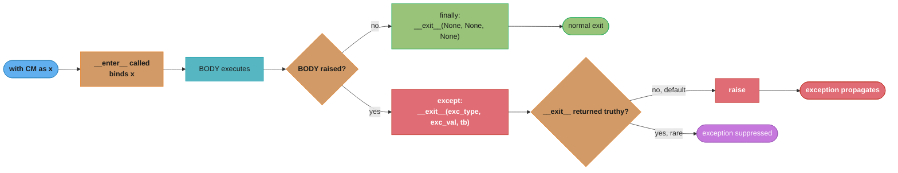
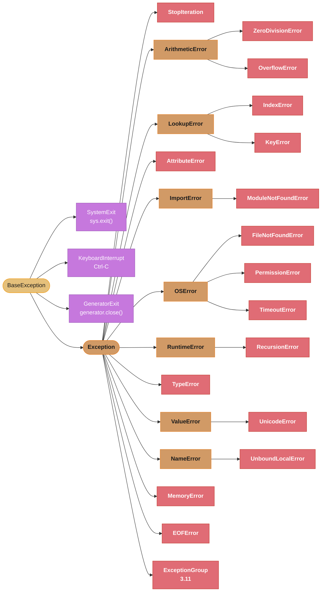
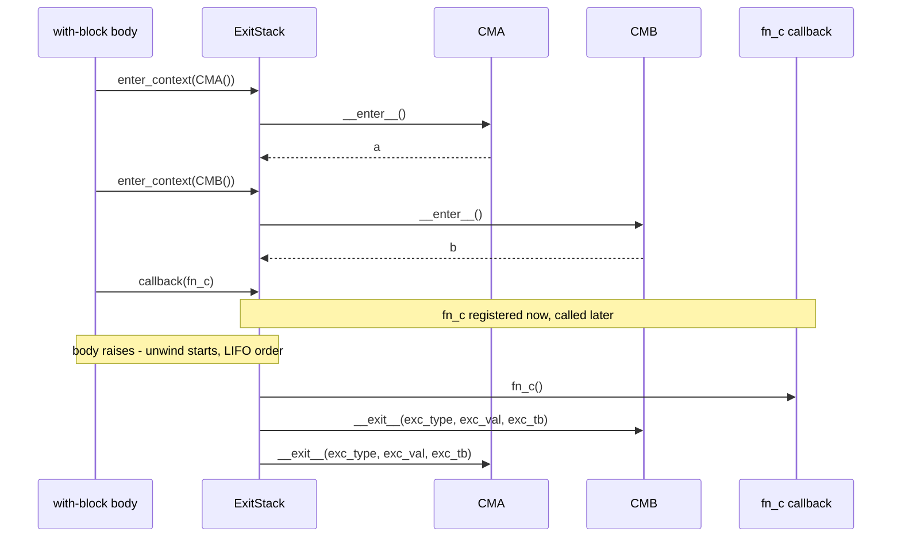
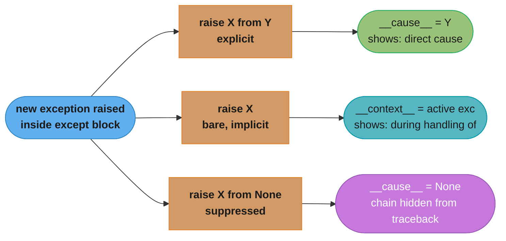
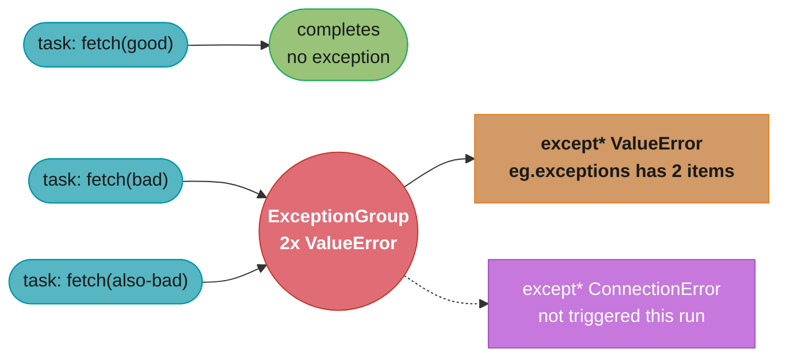

# Context Managers & Exceptions

## 1. Concept Overview

Context managers provide a structured protocol for acquiring and releasing resources — file handles, database connections, locks, timers — guaranteeing that cleanup runs even when exceptions occur. The `with` statement is the syntactic sugar that drives context managers; under the hood it calls `__enter__` at the start of the block and `__exit__` at the end, whether the block exits cleanly or via an exception.

Python's exception system is built on a class hierarchy rooted at `BaseException`. The day-to-day code normally deals with `Exception` subclasses, but understanding the full hierarchy is critical: `KeyboardInterrupt` and `SystemExit` inherit from `BaseException` directly, so an `except Exception` clause will not silence them. Python 3.11 adds `ExceptionGroup` and the matching `except*` syntax to handle the reality that concurrent tasks can fail simultaneously, as `asyncio.TaskGroup` demonstrates.

Together, context managers and the exception hierarchy are the backbone of correct, production-safe Python: they decide whether resources leak, whether errors are silently swallowed, and whether stack traces survive library boundaries.

---

## 2. Intuition

> A context manager is a bouncer at the door of a nightclub: it decides who gets in, escorts them out when time is up, and handles any incident that occurs while they are inside — all without you having to remember to call "close the door".

**Mental model:** Think of `with cm:` as a try/finally wrapper that a human can read in one glance. The `as` clause gives you whatever the bouncer hands you at the door (`__enter__` return value); the cleanup logic lives in `__exit__`, not scattered across every call site.

**Why it matters:** Resource leaks are among the most common production bugs in Python services — file descriptors left open under heavy concurrency exhaust OS limits, unclosed DB connections starve the pool, unreleased locks cause deadlocks. Context managers encode the invariant "if you open it, close it" in a reusable, composable unit.

**Key insight:** `__exit__` receives `(exc_type, exc_val, exc_tb)`. Returning a truthy value from `__exit__` suppresses the exception — which is almost never what you want. The default (`return None`, which is falsy) lets exceptions propagate normally.

---

## 3. Core Principles

**RAII in Python:** Resource Acquisition Is Initialization — resources are tied to the lifetime of an object or a `with` block, not to manual open/close calls scattered across business logic.

**Guaranteed cleanup:** The `__exit__` method is called in a `finally`-equivalent manner. Even if the body of the `with` block raises, calls `sys.exit()`, or hits a `return` statement mid-function, `__exit__` still runs.

**Separation of concerns:** The context manager owns the lifecycle; the `with` block body owns the business logic. Neither needs to know about the other's internal state.

**Composability:** Multiple context managers can be stacked on a single `with` line or composed dynamically via `contextlib.ExitStack`. Each is independent; the stack unwinds in LIFO order.

**Exception transparency:** By default, a context manager should let exceptions propagate. Suppressing exceptions in `__exit__` should be a deliberate, documented decision — never accidental.

**Async parity:** Async context managers (`__aenter__`/`__aexit__`) follow the same protocol as sync ones, but are awaited. They compose cleanly with `async with` and `asyncio.TaskGroup`.

---

## 4. Types / Architectures / Strategies

### 4.1 Class-based context managers

Implement `__enter__` and `__exit__` directly on a class. Best when the CM carries internal state (a connection, a lock object, timing metadata) that multiple methods need to share.

```python
class ManagedResource:
    def __enter__(self) -> "ManagedResource":
        # acquire resource
        return self          # value bound by `as`

    def __exit__(
        self,
        exc_type: type[BaseException] | None,
        exc_val: BaseException | None,
        exc_tb: object,
    ) -> bool:
        # release resource; return False/None to propagate exceptions
        return False
```

### 4.2 Generator-based via `@contextlib.contextmanager`

A single-yield generator decorated with `@contextmanager`. Everything before `yield` is `__enter__`; the yielded value is the `as` target; everything after `yield` (typically in a `finally` block) is `__exit__`. Best for lightweight CMs that do not need to persist state between enter and exit.

### 4.3 `contextlib.ExitStack`

A container that dynamically accumulates context managers and arbitrary cleanup callbacks. Unwinds them in LIFO order on exit. Essential when the number of resources to open is unknown until runtime (e.g., opening N files from a list).

### 4.4 Async context managers

`asynccontextmanager` from `contextlib` works identically to `contextmanager` but the function is `async def` and uses `await` expressions. FastAPI `yield` dependencies are compiled into async context managers by Starlette's dependency injection machinery.

### 4.5 `nullcontext` [3.7]

`contextlib.nullcontext` is a no-op CM used to conditionally apply a real CM without branching:

```python
ctx = lock if needs_lock else contextlib.nullcontext()
with ctx:
    ...
```

### 4.6 `suppress` from `contextlib`

Suppresses specified exception types cleanly:

```python
from contextlib import suppress
with suppress(FileNotFoundError):
    os.remove(path)
```

---

## 5. Architecture Diagrams

### The `with` desugaring



`__exit__` always runs, whether `BODY` raises or not (green path). Its return value is the only thing that decides what happens next: falsy re-raises the original exception (red path, the default), truthy silently suppresses it (purple, the case you should almost never hit).

### Exception hierarchy tree



`BaseException` splits into three signal exceptions that `except Exception` never catches (purple — `SystemExit`, `KeyboardInterrupt`, `GeneratorExit`) and the `Exception` branch (orange routing nodes) that fans out into the everyday catchable error types (red leaves). This is exactly why `except Exception` is safe for broad handlers but `except BaseException` is not (see Q7).

### ExitStack unwinding order



`ExitStack` enters `CMA` then `CMB` and registers `fn_c`. When the body raises, teardown always runs in strict LIFO order: `fn_c()` first, then `CMB.__exit__`, then `CMA.__exit__` — the reverse of the entry order.

### Async CM in FastAPI dependency


Every request opens the DB session through `__aenter__`, runs the handler against it, and always tears down through `__aexit__` (red — commit on success or rollback on exception, the path that must never be skipped).

---

## 6. How It Works — Detailed Mechanics

### 6.1 Class-based file lock CM

```python
import fcntl
import os
from types import TracebackType

class FileLock:
    def __init__(self, path: str) -> None:
        self._path = path
        self._fd: int | None = None

    def __enter__(self) -> "FileLock":
        self._fd = os.open(self._path, os.O_CREAT | os.O_RDWR)
        fcntl.flock(self._fd, fcntl.LOCK_EX)
        return self

    def __exit__(
        self,
        exc_type: type[BaseException] | None,
        exc_val: BaseException | None,
        exc_tb: TracebackType | None,
    ) -> bool:
        if self._fd is not None:
            fcntl.flock(self._fd, fcntl.LOCK_UN)
            os.close(self._fd)
            self._fd = None
        return False   # never suppress exceptions
```

Usage:

```python
with FileLock("/tmp/myapp.lock"):
    perform_critical_section()
```

**What the formula is telling you.** The `__exit__` signature is a four-value contract: "here is
what killed your block (three values), and here is my one-bit verdict on whether it keeps
travelling." That single returned bit is the only lever a context manager has over control flow —
everything else it does is bookkeeping.

| Symbol | What it is |
|--------|------------|
| `exc_type` | The exception's class, or `None` if the block finished cleanly |
| `exc_val` | The exception instance itself — the object carrying the message and args |
| `exc_tb` | The traceback object; the frame chain from `with` down to the `raise` |
| return value | The verdict. Truthy = swallow the exception; falsy = let it propagate |
| `return False` | Explicit "never suppress" — same effect as `None`, clearer to a reader |

**Walk one example.** Four exits through the same `FileLock`, with the flock released every time:

```
  how the block ended       exc_type        __exit__ returns   what the caller sees
  ---------------------     -------------   ----------------   --------------------
  fell off the end          None            False              normal completion
  raised ValueError         ValueError      False              ValueError propagates
  raised ValueError         ValueError      True               nothing -- swallowed
  hit `return` mid-func     None            False              the function returns

  In all four rows the fcntl.flock(LOCK_UN) + os.close() pair ran exactly once.
  Only the last column changed, and only the return value changed it.
```

Notice the third row is the dangerous one and the only one an author chooses. A `FileLock` that
returned `True` would release the lock *and* erase the reason the critical section failed — the
caller would see a clean return from code that never finished. That is why the method ends in an
explicit `return False` rather than falling off the end into an implicit `None`: both behave
identically, but one of them states the intent out loud.

### 6.2 `@contextlib.contextmanager` — timing and DB transaction

```python
import time
from contextlib import contextmanager
from collections.abc import Generator

@contextmanager
def timer(label: str) -> Generator[None, None, None]:
    start = time.perf_counter()
    try:
        yield
    finally:
        elapsed = time.perf_counter() - start
        print(f"{label}: {elapsed * 1000:.2f} ms")

with timer("heavy query"):
    result = db.execute(expensive_query)
```

DB transaction pattern:

```python
from contextlib import contextmanager
from collections.abc import Generator
import logging

logger = logging.getLogger(__name__)

@contextmanager
def transaction(conn) -> Generator[None, None, None]:
    conn.begin()
    try:
        yield
        conn.commit()
    except Exception:
        logger.exception("Rolling back transaction")
        conn.rollback()
        raise
```

Key rule: `try` wraps `yield`; `finally` (or `except`) guarantees cleanup.

### 6.3 `ExitStack` — opening N files at runtime

```python
from contextlib import ExitStack
from pathlib import Path

def merge_files(paths: list[Path], output: Path) -> None:
    with ExitStack() as stack:
        handles = [
            stack.enter_context(open(p, "r", encoding="utf-8"))
            for p in paths
        ]
        stack.callback(lambda: print("All files closed"))
        out = stack.enter_context(open(output, "w", encoding="utf-8"))
        for fh in handles:
            out.write(fh.read())
    # All N+1 file handles closed in LIFO order; callback fires first
```

`stack.callback(fn)` is equivalent to `__exit__` with no exception handling — the function is always called, receives no arguments, and its return value is ignored.

**Stated plainly.** "However many things you pushed onto the stack, exactly that many teardowns
run, in exactly the reverse order." The count is not a detail — it is the guarantee that makes
`ExitStack` safe when `N` is only known at runtime.

| Symbol | What it is |
|--------|------------|
| `N` | Number of input paths in `paths` — unknown until the function is called |
| `N + 1` | Open file handles: the `N` inputs plus the single `output` handle |
| `N + 2` | Total registered teardowns: `N + 1` handles plus the one `stack.callback` |
| LIFO | Last-in, first-out — teardown `k` fires before teardown `k - 1` |
| entry index `k` | Position in the push order, `1..N+2`; exit order is `N+2` down to `1` |

**Walk one example.** Merging three files, tracing the push order against the unwind order:

```
  push order (entry)                        exit order (LIFO)
  ------------------------------------      ---------------------------
  1  enter_context(open paths[0])           5  out.__exit__
  2  enter_context(open paths[1])           4  callback -> "All files closed"
  3  enter_context(open paths[2])           3  paths[2].__exit__
  4  callback(print "All files closed")     2  paths[1].__exit__
  5  enter_context(open output))            1  paths[0].__exit__

  N = 3 inputs  ->  handles open at peak = N + 1 = 4
                ->  teardowns registered = N + 2 = 5
                ->  exit index = (N + 3) - entry index      e.g. entry 2 exits 4th

  Scale it: N = 200 inputs -> 201 handles held at once, 202 teardowns, still all released.
```

**Why the count matters more than the order.** The reason `ExitStack` beats a hand-written
`try/finally` here is not the LIFO discipline — it is that partial entry is still safe. If
`enter_context` on `paths[2]` raises (a missing file, a permissions error), the two handles already
on the stack unwind normally and the remaining ones were never opened. A hand-rolled loop that
opened all `N + 1` handles first and wrapped the work in one `finally` leaks every handle opened
before the failure, because the `finally` never armed. With `N = 200`, that is up to 200 leaked
descriptors from one bad path in the list.

### 6.4 Async context managers and FastAPI dependencies

```python
from contextlib import asynccontextmanager
from collections.abc import AsyncGenerator
from sqlalchemy.ext.asyncio import AsyncSession, create_async_engine, async_sessionmaker

engine = create_async_engine("postgresql+asyncpg://user:pw@host/db")
SessionLocal = async_sessionmaker(engine, expire_on_commit=False)

@asynccontextmanager
async def db_session() -> AsyncGenerator[AsyncSession, None]:
    async with SessionLocal() as session:
        try:
            yield session
            await session.commit()
        except Exception:
            await session.rollback()
            raise

# FastAPI dependency using yield — equivalent to async CM
async def get_db() -> AsyncGenerator[AsyncSession, None]:
    async with db_session() as session:
        yield session
```

FastAPI compiles `yield` dependencies into an async context manager via `contextlib.asynccontextmanager` internally. The `yield` point separates setup (before) from teardown (after), with the teardown block running inside the request/response cycle after the response is sent.

### 6.5 Exception chaining

```python
# raise X from Y — explicit chaining, sets __cause__
def parse_config(raw: str) -> dict:
    try:
        return json.loads(raw)
    except json.JSONDecodeError as e:
        raise ValueError(f"Invalid config format: {raw[:40]}") from e

# raise inside except — implicit chaining, sets __context__
try:
    risky()
except RuntimeError:
    raise ValueError("wrapped")  # __context__ = original RuntimeError

# raise X from None — suppress chain (clean library boundary)
class ThirdPartyError(Exception): ...

def call_vendor_api(payload: dict) -> dict:
    try:
        return _vendor_client.post(payload)
    except _vendor_sdk.NetworkError as e:
        # Hide internal SDK detail from callers
        raise ThirdPartyError("Vendor API unavailable") from None
```

The three `raise` forms set different traceback attributes and print different display text — this is the mechanism behind Q5 and Q6:



Explicit chaining (green) is the recommended pattern for library boundaries that deliberately wrap an error; bare re-raise (teal) is what happens automatically if you do nothing special; `from None` (purple) locks the original cause away entirely, so use it only at stable API boundaries.

### 6.6 `ExceptionGroup` and `except*` [3.11]

```python
import asyncio

async def fetch(url: str) -> str:
    await asyncio.sleep(0.1)
    if "bad" in url:
        raise ValueError(f"Bad URL: {url}")
    return f"ok:{url}"

async def main() -> None:
    urls = ["https://good.example", "https://bad.example", "https://also-bad.example"]
    try:
        async with asyncio.TaskGroup() as tg:
            tasks = [tg.create_task(fetch(u)) for u in urls]
    except* ValueError as eg:
        for exc in eg.exceptions:
            print(f"ValueError caught: {exc}")
    except* ConnectionError as eg:
        for exc in eg.exceptions:
            print(f"Connection failed: {exc}")

asyncio.run(main())
```

`asyncio.TaskGroup` raises an `ExceptionGroup` collecting all task failures. `except*` matches a subset of the group by type and receives an `ExceptionGroup` containing only those matching exceptions. Multiple `except*` clauses can each handle different types from the same group.



Two of the three tasks fail with `ValueError`; `TaskGroup` merges both into one `ExceptionGroup` (red), and `except* ValueError` pulls out its matching subset. The sibling `except* ConnectionError` clause (dotted, purple) exists to handle a different failure type — it stays dormant on this particular run since no task raised one.

Manual construction:

```python
def validate_all(items: list[dict]) -> None:
    errors: list[Exception] = []
    for item in items:
        try:
            validate(item)
        except ValueError as e:
            errors.append(e)
    if errors:
        raise ExceptionGroup("validation errors", errors)
```

---

## 7. Real-World Examples

**FastAPI lifespan events** use `asynccontextmanager` to manage application-level resources (DB pools, HTTP client sessions, ML model loading):

```python
from contextlib import asynccontextmanager
from fastapi import FastAPI
import httpx

@asynccontextmanager
async def lifespan(app: FastAPI):
    app.state.http_client = httpx.AsyncClient(timeout=10.0)
    yield
    await app.state.http_client.aclose()

app = FastAPI(lifespan=lifespan)
```

**pytest fixtures** use `yield` in the same pattern — setup before yield, teardown after. The `contextmanager` protocol is the mental model for every pytest fixture with cleanup.

**SQLAlchemy sessions** expose `Session` as a context manager: `with Session(engine) as session` commits on clean exit and rolls back on exception.

**`tempfile.TemporaryDirectory`** is a class-based context manager that deletes the temp directory tree in `__exit__` regardless of exceptions — 7 lines of production code that have prevented countless resource leaks.

**`unittest.mock.patch`** is a context manager (and a decorator) that replaces an attribute for the duration of a `with` block and restores the original in `__exit__`.

---

## 8. Tradeoffs

| Approach | Pros | Cons | Best For |
|---|---|---|---|
| Class-based CM | Full control, stateful, reusable | Verbose (2 methods + `__init__`) | Complex lifecycle, shared state |
| `@contextmanager` | Concise, readable, less boilerplate | Generator overhead; harder to subclass | One-off or lightweight CMs |
| `ExitStack` | Dynamic, composable, N resources | More complex to read than explicit `with` | Runtime-determined resource count |
| `asynccontextmanager` | Native async, `await` inside | Requires async context everywhere | Async I/O resources, FastAPI deps |
| `suppress` | Clean suppression intent | Hides errors if overused | Expected, benign errors only |

| Exception strategy | When to use |
|---|---|
| Catch specific types | Normal business logic, recoverable errors |
| `except Exception` + log | Top-level handlers, middleware |
| `except BaseException` | Shutdown hooks that must clean up before exit |
| `raise X from Y` | Library code wrapping lower-level errors |
| `raise X from None` | Hiding internal SDK/vendor details |
| `ExceptionGroup` + `except*` [3.11] | Async task fan-out, batch validation |

---

## 9. When to Use / When NOT to Use

**Use context managers when:**
- Any resource must be deterministically released: files, sockets, DB connections, locks, temporary directories.
- Setup and teardown are always paired, even under exceptions.
- You want to express resource scope visually — the indented block makes the lifetime obvious.
- You need composable cleanup (ExitStack).
- Writing FastAPI `lifespan`, `yield` dependencies, or pytest fixtures.

**Do NOT use context managers when:**
- The resource lifetime deliberately extends beyond a single code block (e.g., a long-lived connection stored on `app.state` — use `lifespan` instead of ad-hoc `__enter__`).
- There is no cleanup to perform — avoid wrapping plain functions in a CM just for syntactic uniformity.
- The CM would suppress exceptions silently — prefer explicit exception handling.

**Use exception chaining (`raise X from Y`) when:**
- Your library layer wraps a lower-level exception in a higher-level domain error.
- You want callers to see the original cause in the traceback.

**Use `raise X from None` when:**
- The internal exception leaks implementation details (vendor SDK class names, internal paths) that would confuse API consumers.

**Use `ExceptionGroup`/`except*` [3.11] when:**
- Multiple concurrent tasks can fail independently (asyncio.TaskGroup, batch validation).
- You want to handle some failures and re-raise others in a single block.

**Avoid `except Exception: pass`** — this is almost always a bug.

---

## 10. Common Pitfalls

### Pitfall 1: Silently swallowing all exceptions

```python
# BROKEN: hides bugs, makes debugging impossible
def process(data: dict) -> None:
    try:
        result = transform(data)
        save(result)
    except Exception as e:
        pass   # silent black hole
```

```python
# FIX: log at minimum; only catch what you can handle
import logging
logger = logging.getLogger(__name__)

def process(data: dict) -> None:
    try:
        result = transform(data)
        save(result)
    except ValueError as e:
        logger.warning("Skipping invalid record: %s", e)
    except OSError:
        logger.exception("Storage failure; will retry")
        raise
```

### Pitfall 2: Manual resource management without `finally`

```python
# BROKEN: connection leaks if do_work() raises
def export(path: str) -> None:
    conn = db.connect()
    data = conn.fetchall("SELECT * FROM items")
    write_csv(path, data)
    conn.close()   # never reached on exception
```

```python
# FIX: use with statement or contextmanager
def export(path: str) -> None:
    with db.connect() as conn:
        data = conn.fetchall("SELECT * FROM items")
    write_csv(path, data)   # conn closed before this line
```

### Pitfall 3: Losing the original traceback when re-raising

```python
# BROKEN: original traceback is lost; __context__ is not set correctly
def call_api(payload: dict) -> dict:
    try:
        return requests.post(url, json=payload).json()
    except requests.RequestException as e:
        raise RuntimeError(str(e))   # wraps message as string, original chain lost
```

```python
# FIX: chain explicitly with `from`
def call_api(payload: dict) -> dict:
    try:
        return requests.post(url, json=payload).json()
    except requests.RequestException as e:
        raise RuntimeError("Upstream API call failed") from e
```

### Pitfall 4: Forgetting to re-raise in `@contextmanager` after handling

```python
# BROKEN: accidentally suppresses all exceptions
from contextlib import contextmanager

@contextmanager
def safe_section():
    try:
        yield
    except Exception:
        print("error occurred")
        # forgot `raise` — exception silently swallowed
```

```python
# FIX: re-raise after logging
@contextmanager
def safe_section():
    try:
        yield
    except Exception:
        logger.exception("Error in safe_section")
        raise
```

### Pitfall 5: Catching `BaseException` instead of `Exception` in middleware

```python
# BROKEN: intercepts Ctrl-C and sys.exit()
try:
    handle_request(req)
except BaseException as e:
    return error_response(e)
```

```python
# FIX: catch Exception, let BaseException propagate
try:
    handle_request(req)
except Exception as e:
    return error_response(e)
```

### Pitfall 6: `except*` before `except` [3.11] — `except*` cannot be mixed with plain `except`

```python
# BROKEN: SyntaxError at parse time
try:
    risky()
except ValueError:
    ...
except* TypeError as eg:   # SyntaxError: cannot use except* and except in same try
    ...
```

```python
# FIX: use only except* when working with ExceptionGroups
try:
    risky()
except* ValueError as eg:
    ...
except* TypeError as eg:
    ...
```

---

## 11. Technologies & Tools

| Tool / Library | Purpose | Notes |
|---|---|---|
| `contextlib` (stdlib) | `contextmanager`, `asynccontextmanager`, `ExitStack`, `suppress`, `nullcontext` | Zero dependencies; always available |
| `contextlib.ExitStack` | Dynamic CM composition | Python 3.3+; `AsyncExitStack` added 3.7 |
| `asyncio.TaskGroup` [3.11] | Structured concurrency; raises `ExceptionGroup` | Replaces `gather` with `return_exceptions=True` |
| `tenacity` | Retry logic as a decorator/CM with exception filtering | Popular in production HTTP clients |
| `structlog` | Structured exception logging; integrates with `__cause__`/`__context__` | Better than `logging.exception` in JSON log pipelines |
| `pytest` fixtures | `yield`-based setup/teardown using the same CM protocol | Automatic teardown even on test failure |
| `fastapi.Depends` with `yield` | Dependency injection lifecycle; async CMs under the hood | The idiomatic FastAPI resource pattern |
| `sqlalchemy.ext.asyncio` | `AsyncSession` as async CM | Works with `asynccontextmanager` and FastAPI `yield` |

---

## 12. Interview Questions with Answers

**Q1: What does `__exit__` returning `True` do, and when should you return `True`?**
Returning a truthy value from `__exit__` suppresses the exception — the `with` block exits cleanly as if no exception occurred. You should almost never return `True`. The only legitimate use is a CM specifically designed to swallow expected errors (e.g., `contextlib.suppress`). Returning `False` or `None` lets the exception propagate, which is the correct default.

**Q2: Explain how `@contextlib.contextmanager` converts a generator into a CM.**
The decorator wraps the generator function so that calling it returns a `_GeneratorContextManager` object. `__enter__` calls `next()` on the generator to run it up to the `yield` and returns the yielded value. `__exit__` resumes the generator after the `yield`; if the block raised an exception, `throw()` is called on the generator so the `except` clause in the generator body can handle it. If the block was clean, the generator runs its `finally` block and `StopIteration` is raised, signalling normal exit.

**Q3: Why must you wrap `yield` in a `try/finally` inside a `@contextmanager` function?**
Without `try/finally`, an exception in the `with` body causes `_GeneratorContextManager.__exit__` to call `generator.throw(exc)`, which re-raises inside the generator at the `yield` point. If there is no `except` or `finally` around the `yield`, the exception propagates out of the generator and `__exit__` re-raises it — the cleanup code below the `yield` is never reached. A `finally` block guarantees cleanup code runs regardless of whether an exception was thrown into the generator.

**Q4: What is `ExitStack` and why is it safer than nested `with` statements when the number of resources is dynamic?**
`ExitStack` is a context manager that maintains a stack of other context managers and cleanup callbacks, unwinding them in LIFO order when it exits. When the number of resources is unknown at write time (e.g., `N` files from a list), you cannot write `N` nested `with` statements. `ExitStack` lets you `enter_context()` in a loop. If any later `enter_context()` call fails, already-entered managers are cleaned up automatically, preventing partial resource leaks.

**Q5: What is the difference between `raise ValueError("msg") from original` and `raise ValueError("msg")`?**
`raise X from Y` sets `X.__cause__ = Y` and `X.__suppress_context__ = True`; the traceback display shows "The above exception was the direct cause of the following exception". Plain `raise X` inside an `except` block sets `X.__context__` to the active exception but leaves `__suppress_context__ = False`; the display shows "During handling of the above exception, another exception occurred". Use explicit chaining (`from`) when you deliberately wrap an error; implicit chaining is automatic but less clear about intent.

**Q6: When and why would you use `raise X from None`?**
`raise X from None` sets `__cause__ = None` and `__suppress_context__ = True`, which suppresses the exception chain in the traceback display. Use it in library code when the internal implementation detail (e.g., a third-party SDK exception class name, an internal file path) would confuse your callers. The trade-off is that the original root cause is harder to find; only use this at stable API boundaries, and always log the original exception internally before suppressing the chain.

**Q7: Why does `except Exception` not catch `KeyboardInterrupt` or `SystemExit`?**
Both `KeyboardInterrupt` and `SystemExit` inherit directly from `BaseException`, not from `Exception`. Python's exception hierarchy was deliberately split so that signals and interpreter exit events cannot be accidentally swallowed by broad exception handlers in user code. To intercept them you must explicitly catch `BaseException`, `KeyboardInterrupt`, or `SystemExit` — which is only appropriate in top-level shutdown hooks.

**Q8: Describe `ExceptionGroup` and `except*` [3.11]. When does `asyncio.TaskGroup` raise one?**
`ExceptionGroup("label", [exc1, exc2])` is a container exception holding multiple child exceptions. `except* SomeType as eg` in a try block extracts only the children matching `SomeType` into `eg.exceptions`; unmatched children are re-raised as a new `ExceptionGroup`. `asyncio.TaskGroup` collects all task failures and raises a single `ExceptionGroup` at the end of the `async with` block so callers can handle different failure types independently. This is the canonical use case for `except*`.

**Q9: How does FastAPI's `yield` dependency relate to async context managers?**
Starlette (FastAPI's ASGI foundation) wraps each `yield` dependency in `contextlib.asynccontextmanager` internally. Code before `yield` runs during request setup; code after `yield` (optionally in `try/finally`) runs during response teardown — after the route handler returns but before the response is fully flushed. This gives you deterministic resource cleanup that is scoped exactly to the HTTP request lifetime, with no risk of forgetting to release the resource.

**Q10: What happens if `__exit__` itself raises an exception?**
The new exception from `__exit__` replaces the original exception — the original is lost unless explicitly re-raised or chained. This is a common, subtle bug: a DB session's `__exit__` that raises during rollback hides the original application error. The fix is to wrap cleanup logic in `__exit__` in its own `try/except` and log the secondary failure while re-raising the original (or raising a combined exception).

**Q11: How do you use `contextlib.AsyncExitStack` in an async FastAPI lifespan to manage multiple async resources?**
`AsyncExitStack` (Python 3.7+) is the async equivalent of `ExitStack`. In a `lifespan` function, you `await stack.enter_async_context(SomeAsyncCM())` for each async resource. The stack ensures all resources are torn down in LIFO order when the application shuts down, even if some teardowns raise. This pattern avoids deeply nested `async with` blocks.

```python
from contextlib import AsyncExitStack, asynccontextmanager
from fastapi import FastAPI

@asynccontextmanager
async def lifespan(app: FastAPI):
    async with AsyncExitStack() as stack:
        app.state.db = await stack.enter_async_context(create_db_pool())
        app.state.redis = await stack.enter_async_context(create_redis_pool())
        app.state.http = await stack.enter_async_context(create_http_client())
        yield
    # All three cleaned up in reverse order automatically
```

**Q12: How would you implement a reentrant lock as a context manager in Python?**
Use `threading.RLock` as the underlying primitive, expose it as a CM by delegating `__enter__`/`__exit__` to the lock object, and add a counter tracking reentry depth:

```python
import threading

class ReentrantLock:
    def __init__(self) -> None:
        self._lock = threading.RLock()

    def __enter__(self) -> "ReentrantLock":
        self._lock.acquire()
        return self

    def __exit__(self, *args: object) -> bool:
        self._lock.release()
        return False
```

`threading.RLock` handles the reentry counting internally; the same thread can acquire it N times and must release it N times. The CM wrapper makes it safe to use with `with` without tracking acquire/release counts manually.

**Q13: Why does mixing `except*` and plain `except` in the same `try` block raise a `SyntaxError`?**
Python enforces that a single `try` block uses either all plain `except` clauses or all `except*` clauses, never a mix, because the two mechanisms model fundamentally different results — a plain `except` catches one specific exception instance, while `except*` catches a subset of an `ExceptionGroup` and can leave the remainder to propagate. Allowing both in one `try` would create ambiguity about whether a caught exception is a single object or a partitioned group. The fix is to convert the whole block to `except*` clauses once any handler in it needs to process `ExceptionGroup` members. This restriction is enforced at parse time, before the code ever runs, so it surfaces immediately in code review or CI rather than as a runtime surprise.

**Q14: How does `contextlib.suppress(SomeError)` work internally, and how is it safer than a bare `except SomeError: pass`?**
`contextlib.suppress` is a context manager whose `__exit__` method checks whether the exception type raised inside the `with` block matches one of the types passed to `suppress(...)`, returning `True` (swallowing it) only on a match and `False` (re-raising) otherwise. A bare `except SomeError: pass` does the same thing syntactically, but `suppress` communicates intent explicitly at the point of use — a reviewer scanning `with suppress(FileNotFoundError): os.remove(path)` immediately knows which error is expected and why, without reading a comment. Because `suppress` only matches the exact types you list, an unrelated exception still propagates normally. Reserve `suppress` for genuinely expected, benign failures; anything else should be caught and logged.

**Q15: What problem does `contextlib.nullcontext` solve, and when would you reach for it?**
`contextlib.nullcontext` is a no-op context manager that lets you apply a context manager conditionally without writing an `if/else` branch around the `with` statement. A common case is an optional lock: `ctx = lock if needs_lock else contextlib.nullcontext()` followed by a single `with ctx:` block that works whether or not locking is actually needed. Without `nullcontext`, you would need to duplicate the entire block body inside both an `if needs_lock: with lock:` branch and an `else:` branch, doubling the code to maintain. `nullcontext` optionally accepts a value to return from `__enter__`, so it can also stand in for a CM whose `as` target is sometimes `None`.

**Q16: In the case study's `managed_transaction`, why does the rollback logic catch `except BaseException` instead of `except Exception`?**
Catching `BaseException` ensures the transaction still rolls back even if the failure is a `KeyboardInterrupt` or `SystemExit`, both of which inherit directly from `BaseException` and would otherwise skip an `except Exception` clause entirely. A database transaction left open when the process receives Ctrl-C or a graceful shutdown signal can hold locks or leave partial writes uncommitted, so the case study treats "the block did not finish cleanly" as more important than "what kind of exception ended it." This is one of the few legitimate uses of `except BaseException` — general-purpose code and HTTP middleware should still catch only `Exception` (see Q7) so signals and interpreter exit are not accidentally intercepted. The trade-off is scoped narrowly to the rollback path, which re-raises immediately after cleanup rather than swallowing the signal.

---

## 13. Best Practices

**Always use `with` for resources.** Never call `.close()` manually in a `try/finally` when a context manager exists. The CM guarantees cleanup even if you forget the `finally`.

**Keep `__exit__` simple and robust.** Code inside `__exit__` runs during exception handling. If it raises, the original exception is lost. Wrap cleanup steps individually and log secondary failures.

**Return `False` from `__exit__` explicitly** if your CM should not suppress exceptions — this makes intent clear to readers even though `None` is the falsy default.

**Prefer `@contextmanager` for stateless CMs.** It is shorter, more readable, and forces you to put cleanup in `finally` (a visible reminder). Use a class only when you need persistent state or subclassing.

**Chain exceptions with `raise X from Y`** at every library boundary. Never `raise Exception(str(e))` — you throw away the original type, message, and traceback.

**Be specific in `except` clauses.** Catch the narrowest type that covers the error you can handle. Order clauses from most specific to least specific; Python matches the first compatible clause.

**Log `exc_info=True` (or `logger.exception(...)`) before re-raising** so that the stack trace appears in logs even when the exception is eventually caught higher up and transformed into an HTTP response.

**Use `ExceptionGroup` [3.11] for batch operations.** When validating or processing multiple items, collect all failures before raising, rather than failing fast on the first error. Callers can use `except*` to handle different failure types.

**Use `contextlib.suppress` only for truly expected, benign errors** such as deleting a file that may not exist. Document why suppression is intentional.

**Test that cleanup runs on exception.** Write a unit test that injects an exception into the `with` body and asserts that the resource was released. Missing this test is the primary reason resource leaks survive code review.

**Use `ExitStack` as the default** when combining more than three context managers, or when any CM is conditionally added. Deeply nested `with` statements are harder to reason about.

---

## 14. Case Study

### Building a Composable Transaction Context Manager for FastAPI

**Problem:** A FastAPI service runs multi-step database writes inside a route handler. If any step fails, all changes must be rolled back and the error logged. Additionally, the engineering team wants per-transaction latency metrics emitted to Prometheus. The challenge is composing two orthogonal concerns — transaction management and metrics — without interleaving their logic.

---

#### BROKEN version — `__exit__` does not handle exceptions properly

```python
# BROKEN: __exit__ does not re-raise; exception is silently lost
class BrokenTransaction:
    def __init__(self, conn) -> None:
        self._conn = conn

    def __enter__(self) -> "BrokenTransaction":
        self._conn.begin()
        return self

    def __exit__(self, exc_type, exc_val, exc_tb) -> None:
        if exc_type is not None:
            self._conn.rollback()
            # PROBLEM 1: return None is falsy, so exception propagates —
            # but rollback itself might raise, hiding the original error.
            # PROBLEM 2: no logging; the DBA sees rollback stats but
            # not the Python traceback that caused it.
        else:
            self._conn.commit()
        # PROBLEM 3: if commit() raises, the exception is unhandled and
        # propagates, but __exit__ already returned, leaving state unclear.
```

The above is broken in three ways: (1) a secondary exception from `rollback()` would replace the original exception silently; (2) there is no logging; (3) a failing `commit()` is not wrapped or logged.

---

#### FIX — robust transaction CM with logging and exception chaining

```python
import logging
import time
from contextlib import contextmanager
from collections.abc import Generator
from typing import Any

logger = logging.getLogger(__name__)


class TransactionError(RuntimeError):
    """Raised when a database transaction fails to commit or rollback."""


@contextmanager
def managed_transaction(conn: Any, label: str = "tx") -> Generator[Any, None, None]:
    """
    Context manager that begins, commits, or rolls back a DB transaction.

    - On clean exit: commits.
    - On exception: logs exc_info, rolls back, re-raises.
    - If rollback itself fails: logs the rollback error and raises
      TransactionError chained to the original exception.
    """
    conn.begin()
    exc_to_raise: BaseException | None = None
    try:
        yield conn
        conn.commit()
        logger.debug("Transaction '%s' committed", label)
    except BaseException as original:
        exc_to_raise = original
        logger.error(
            "Transaction '%s' failed, rolling back",
            label,
            exc_info=True,
        )
        try:
            conn.rollback()
        except Exception as rollback_err:
            raise TransactionError(
                f"Rollback failed for '{label}'"
            ) from rollback_err
        raise   # re-raise original after successful rollback
```

Key fixes:
- `except BaseException` (not just `Exception`) catches `KeyboardInterrupt` and `SystemExit` so we still roll back on Ctrl-C.
- `logger.error(..., exc_info=True)` records the full traceback before rollback.
- Rollback failures are chained with `from rollback_err`, not silently swallowed.
- The original exception is re-raised via bare `raise`, preserving its traceback.

---

#### Metrics CM using `@contextmanager`

```python
import time
from contextlib import contextmanager
from collections.abc import Generator
from prometheus_client import Histogram

TX_LATENCY = Histogram(
    "db_transaction_duration_seconds",
    "Database transaction duration",
    ["label", "status"],
)


@contextmanager
def measure_transaction(label: str) -> Generator[None, None, None]:
    start = time.perf_counter()
    status = "success"
    try:
        yield
    except Exception:
        status = "error"
        raise
    finally:
        elapsed = time.perf_counter() - start
        TX_LATENCY.labels(label=label, status=status).observe(elapsed)
        logger.debug("Transaction '%s' took %.3f ms (status=%s)", label, elapsed * 1000, status)
```

---

#### Composing both CMs with `ExitStack`

```python
from contextlib import ExitStack
from fastapi import APIRouter, Depends
from sqlalchemy.ext.asyncio import AsyncSession

router = APIRouter()


def get_conn():
    """Synchronous DB connection from pool (simplified)."""
    return db_pool.acquire()


@router.post("/orders")
def create_order(payload: dict, conn=Depends(get_conn)):
    with ExitStack() as stack:
        # Metrics wraps the outer scope
        stack.enter_context(measure_transaction("create_order"))
        # Transaction is the inner scope
        db = stack.enter_context(managed_transaction(conn, "create_order"))

        order = db.execute(
            "INSERT INTO orders (user_id, total) VALUES (%s, %s) RETURNING id",
            (payload["user_id"], payload["total"]),
        ).fetchone()

        db.execute(
            "INSERT INTO order_items (order_id, items) VALUES (%s, %s)",
            (order["id"], payload["items"]),
        )

    # ExitStack unwinds LIFO:
    # 1. managed_transaction.__exit__: commit (or rollback + re-raise)
    # 2. measure_transaction.__exit__: record latency, set status="error" if needed
    return {"order_id": order["id"]}
```

The LIFO unwinding means metrics are always recorded regardless of whether the transaction committed or rolled back, and the metric `status` label correctly reflects the outcome.

---

#### Async version using `AsyncExitStack` for a FastAPI `yield` dependency

```python
from contextlib import asynccontextmanager, AsyncExitStack
from collections.abc import AsyncGenerator
from fastapi import FastAPI
import httpx

@asynccontextmanager
async def async_managed_transaction(session: AsyncSession, label: str) -> AsyncGenerator[AsyncSession, None]:
    async with session.begin():
        try:
            yield session
        except Exception:
            logger.error("Async transaction '%s' rolling back", label, exc_info=True)
            raise


async def get_db_with_metrics(session: AsyncSession = Depends(get_db)):
    async with AsyncExitStack() as stack:
        await stack.enter_async_context(async_measure_transaction("request"))
        db = await stack.enter_async_context(async_managed_transaction(session, "request"))
        yield db
```

---

#### Testing that cleanup runs on exception

```python
import pytest
from unittest.mock import MagicMock

def test_rollback_on_exception():
    conn = MagicMock()
    conn.begin = MagicMock()
    conn.commit = MagicMock()
    conn.rollback = MagicMock()

    with pytest.raises(ValueError, match="intentional"):
        with managed_transaction(conn, "test"):
            raise ValueError("intentional failure")

    conn.begin.assert_called_once()
    conn.rollback.assert_called_once()
    conn.commit.assert_not_called()


def test_commit_on_clean_exit():
    conn = MagicMock()
    with managed_transaction(conn, "test"):
        pass  # no exception

    conn.commit.assert_called_once()
    conn.rollback.assert_not_called()
```

**Outcome:** The composable pattern gives a 40-line transaction CM and a 15-line metrics CM that each do one thing. The `ExitStack` composes them at the call site without either CM needing to know about the other. Adding a third concern (e.g., distributed tracing span) requires zero changes to existing CMs — only one `stack.enter_context()` line at the call site.
