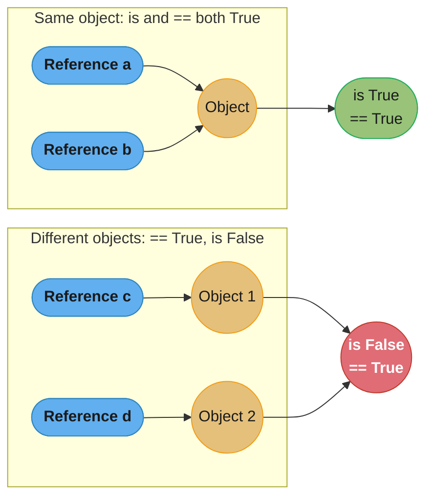
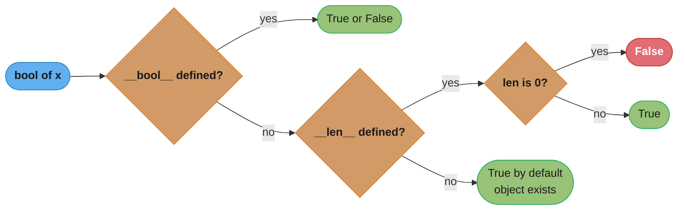
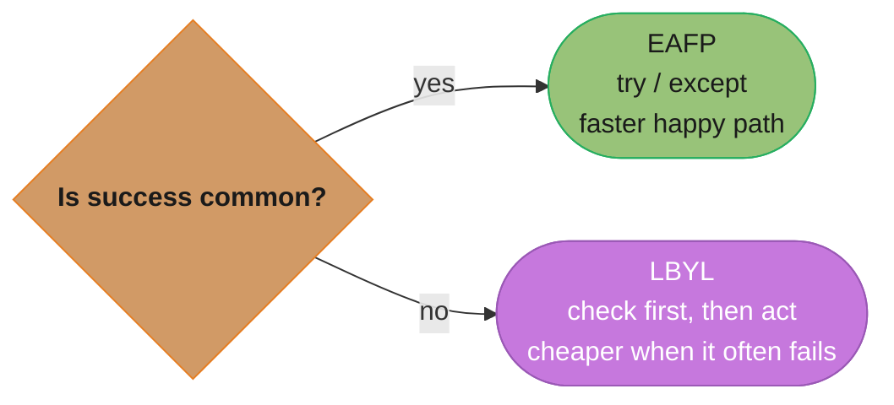
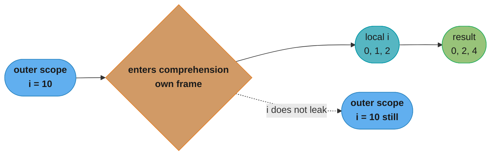
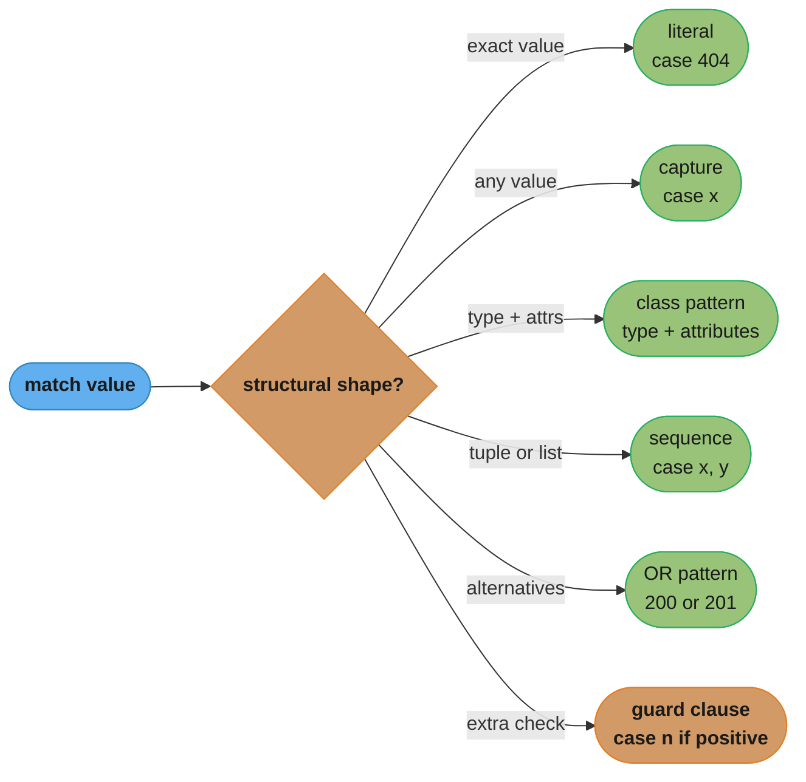
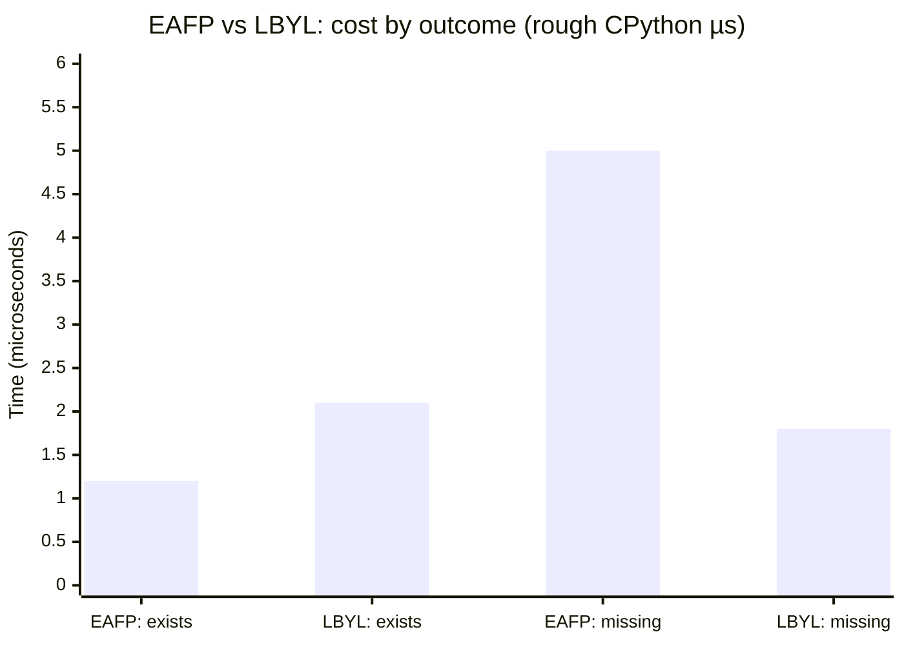

# Core Language Idioms

## 1. Concept Overview

Python's core language idioms are the idiomatic patterns that distinguish fluent Python from code that merely runs. They cover identity versus equality, how Python evaluates truthiness, two competing philosophies for handling preconditions (EAFP and LBYL), comprehension expressions and their scoping rules, extended unpacking, the walrus assignment operator [3.8], and structural pattern matching [3.10].

Mastering these idioms has three concrete payoffs. First, they produce shorter code with fewer intermediate variables. Second, they expose the CPython object model — understanding why `257 is 257` can return `False` in a fresh REPL tells you far more about Python internals than any textbook summary. Third, interviewers at every level test these patterns directly: the mutable-default-argument trap alone has ended more senior Python interviews than any algorithmic problem.

---

## 2. Intuition

> Python idioms are the traffic laws of the language: you *can* drive on the wrong side of the road and sometimes arrive safely, but you will surprise every other driver and eventually crash.

**Mental model.** Think of the Python object model as a graph of boxes (objects in memory) connected by named arrows (references). `is` asks "do two arrows point to the same box?" while `==` asks "do the contents of the two boxes look the same?" Truthiness is a Boolean lens applied to any box: Python calls the box's `__bool__` method (or `__len__` as a fallback) to decide. Every idiom in this module is an application of that object-graph mental model.

**Why it matters.** Senior Python engineers are expected to write code that other senior engineers can read without stopping. Non-idiomatic code — `if len(mylist) > 0:`, `if mylist == []:`, `if x != None:` — signals unfamiliarity with the language even when it produces the correct result. In a FastAPI codebase, these patterns appear in request validators, dependency functions, middleware, and background tasks. Idiomatic code also tends to be faster: CPython optimises truthiness checks and EAFP paths in ways that explicit length comparisons bypass.

**Key insight.** The mutable-default-argument trap, the integer cache, string interning, and comprehension scoping are not bugs — they are direct consequences of how CPython manages objects. Understanding the object model explains all of them at once rather than requiring four separate memorised rules.

---

## 3. Core Principles

**Identity vs equality.** `is` tests that two references point to the same object in memory (compares `id()`). `==` calls `__eq__`, which may return `True` for distinct objects with equal contents. Use `is` only for singletons: `None`, `True`, `False`, and enum members. Never use `is` to compare strings, integers outside the cached range, or any user-defined value.

**Truthiness.** Python evaluates any object as Boolean by calling `__bool__` first; if absent, it calls `__len__` and treats 0 as `False`. The canonical falsy values are: `None`, `False`, `0`, `0.0`, `0j`, `""`, `b""`, `[]`, `()`, `{}`, `set()`, `frozenset()`, and any object whose `__bool__` returns `False` or whose `__len__` returns `0`. Everything else is truthy. `is not None` is preferred over `!= None` because `__eq__` can be overridden; `is not` cannot.

**EAFP (Easier to Ask Forgiveness than Permission).** Python's preferred style: attempt the operation and catch exceptions when it fails. EAFP is faster when success is the common case because it eliminates a redundant lookup. It also avoids TOCTOU (time-of-check/time-of-use) race conditions present in LBYL code.

**LBYL (Look Before You Leap).** Check a precondition before performing the action. LBYL is appropriate when failure is common (the check is cheaper than constructing an exception) or when the operation has irreversible side effects.

**Comprehension scoping.** In Python 3, list, dict, set comprehensions and generator expressions each create their own scope. The iteration variable does not leak into the enclosing scope. This is different from Python 2 behaviour and from plain `for` loops.

**`is not None` idiom.** Always write `if value is not None:` not `if value != None:`. The latter can be silently overridden by a custom `__eq__`. The former is guaranteed to be a pure identity test.

---

## 4. Types / Architectures / Strategies

**Identity checks — singleton pattern.**
Use `is` / `is not` exclusively for: `None`, `True`, `False`, sentinel objects, and enum members. These are guaranteed singletons by the CPython runtime.

**Truthiness patterns — three tiers.**
- Built-in containers: empty means falsy, non-empty means truthy.
- Numeric types: zero is falsy.
- Custom classes: implement `__bool__` for semantic Boolean; fall back to `__len__` for sized containers.

**EAFP strategy.**
Wrap the operation in `try/except`. Catch the specific exception type, not `Exception` or bare `except`. Re-raise unexpected exceptions. EAFP is the dominant style in the standard library.

**LBYL strategy.**
Check membership, type, or attribute existence before accessing. Appropriate for UI input validation, CLI argument checking, and cases where the failure branch is more common than the success branch.

**Comprehension variants.**
- List comprehension: `[expr for x in it if cond]` — eagerly evaluates, returns `list`.
- Generator expression: `(expr for x in it if cond)` — lazy, returns `generator`; use when consuming once or piping to a function.
- Dict comprehension: `{k: v for k, v in pairs}`.
- Set comprehension: `{expr for x in it}`.

**Unpacking strategies.**
- Simple: `a, b = b, a`.
- Starred left: `first, *rest = items`.
- Starred right: `*init, last = items`.
- Interior discard: `a, *_, b = items`.

**Walrus `:=` [3.8].**
Assigns and returns a value in a single expression. Primary use cases: eliminating double computation in `while` loops, `if` conditions, and comprehension filters.

**`match`/`case` [3.10].**
Structural pattern matching. Four pattern kinds: literal, capture, class (with attribute matching), sequence. Supports OR patterns (`|`) and guard clauses (`if`). Not a dict dispatch replacement — it is a destructuring mechanism.

---

## 5. Architecture Diagrams

### CPython Object Model — `is` vs `==`


*Two references to the same object make both `is` and `==` true; two distinct objects with equal contents make `==` true but `is` false — that second case is the trap a naive `is` comparison falls into.*

### Truthiness Evaluation Chain


*`bool(x)` tries `__bool__` first; if that protocol is absent it falls back to `__len__` (zero is falsy); if neither is defined the object is truthy by default.*

### EAFP vs LBYL Decision Tree


*Choose EAFP when success is the common case — the exception-free happy path costs almost nothing in CPython; choose LBYL when failure is common or the operation is irreversible (Section 6.3 quantifies both).*

### Comprehension Scope Isolation (Python 3)


*The comprehension executes in its own frame: the `i` inside `[i*2 for i in range(3)]` never touches the outer `i`, so the outer scope's value survives unchanged — unlike Python 2 or a plain `for` loop, whose loop variable does leak into the enclosing scope.*

### `match`/`case` Routing by Shape [3.10]


*`match`/`case` [3.10] routes one value to a branch by structural shape — literal, capture, class, or sequence pattern — with OR patterns and guard clauses layering extra logic on top; this is destructuring, not the O(1) key lookup of a dict dispatch (Section 6.7).*

---

## 6. How It Works — Detailed Mechanics

### 6.1 `is` vs `==` and the CPython integer cache

CPython caches small integers in the range **-5 to 256** as singletons at startup. Any reference to these values within a single interpreter session will point to the same object.

```python
# Small integers — cached
a = 100
b = 100
print(a is b)   # True  — same cached object

# Large integers — NOT cached
a = 257
b = 257
print(a is b)   # False in a fresh interpreter / script boundary
                # (may be True in interactive REPL due to compile-time folding)
print(a == b)   # True  — values are equal

# Singletons — always use `is`
x: int | None = None
if x is None:          # correct
    pass
if x == None:          # wrong — __eq__ can be overridden
    pass
```

String interning: CPython interns string literals that look like identifiers (no spaces, no special chars) at compile time. Do not rely on this for equality checks.

```python
s1 = "hello"
s2 = "hello"
print(s1 is s2)   # True — interned at compile time (implementation detail)

s3 = "hello world"
s4 = "hello world"
print(s3 is s4)   # False in general — spaces prevent interning
print(s3 == s4)   # True — always use == for string equality
```

### 6.2 Truthiness deep dive

```python
from collections import Counter

# __bool__ delegation
class BankAccount:
    def __init__(self, balance: float) -> None:
        self.balance = balance

    def __bool__(self) -> bool:
        return self.balance > 0.0

acc = BankAccount(0.0)
print(bool(acc))   # False
if acc:
    print("account has funds")   # skipped

# Counter is falsy when empty
c: Counter[str] = Counter()
if not c:
    print("no counts yet")   # prints

c.update(["a", "b"])
if c:
    print("has counts")   # prints

# Prefer truthiness over explicit length check
items = [1, 2, 3]
if items:                      # idiomatic — calls __bool__ → __len__
    pass
if len(items) > 0:             # works but verbose
    pass
```

### 6.3 EAFP vs LBYL

```python
import os

# LBYL — check then act (race condition: file could be deleted between check and open)
def read_config_lbyl(path: str) -> str:
    if os.path.exists(path):          # check
        with open(path) as f:         # act
            return f.read()
    return ""

# EAFP — attempt then handle (no race condition window)
def read_config_eafp(path: str) -> str:
    try:
        with open(path) as f:
            return f.read()
    except FileNotFoundError:
        return ""

# Performance note (rough CPython numbers):
# EAFP when file exists:    ~1.2 µs  (no check overhead)
# LBYL when file exists:    ~2.1 µs  (stat() syscall + open)
# EAFP when file missing:   ~5.0 µs  (exception construction)
# LBYL when file missing:   ~1.8 µs  (stat() cheap failure)
# → use EAFP when success is the common case (>50% of calls succeed)
```


*When the file usually exists, EAFP's happy path (~1.2 µs) beats LBYL's stat-then-open (~2.1 µs); the crossover flips when the file is usually missing, where LBYL's cheap failed check (~1.8 µs) beats EAFP's ~5.0 µs exception cost — the numeric case for using EAFP only when success is common (Section 9).*

### 6.4 Comprehensions and generator expressions

```python
# List comprehension — eager, returns list
squares: list[int] = [x**2 for x in range(10)]

# Generator expression — lazy, returns generator; no square brackets
squares_gen = (x**2 for x in range(10))
total = sum(x**2 for x in range(10))   # no extra parens needed inside function call

# Dict comprehension
word_lengths: dict[str, int] = {word: len(word) for word in ["apple", "fig", "mango"]}

# Set comprehension
unique_lengths: set[int] = {len(word) for word in ["apple", "fig", "mango"]}

# Comprehension scope — variable does NOT leak in Python 3
i = 99
result = [i * 2 for i in range(5)]
print(i)   # 99 — outer i unchanged; comprehension has its own scope

# Walrus in comprehension filter — compute once, use twice
import re
data = ["  hello  ", "  ", "world  ", ""]
cleaned = [c for s in data if (c := s.strip())]
print(cleaned)   # ['hello', 'world']

# Nested comprehension (matrix transpose)
matrix = [[1, 2, 3], [4, 5, 6], [7, 8, 9]]
transposed = [[row[i] for row in matrix] for i in range(3)]
```

### 6.5 Unpacking and starred assignment

```python
# Swap without temp variable
a, b = 10, 20
a, b = b, a   # tuple packing on right, unpacking on left

# Starred — capture remainder as list
first, *rest = [1, 2, 3, 4]       # first=1, rest=[2,3,4]
*init, last  = [1, 2, 3, 4]       # init=[1,2,3], last=4
head, *_, tail = [1, 2, 3, 4, 5]  # head=1, _=[2,3,4], tail=5

# Discard with _
for _ in range(3):
    print("tick")

# Extended unpacking in function calls
def add(x: int, y: int, z: int) -> int:
    return x + y + z

args = [1, 2, 3]
print(add(*args))          # positional unpack

kwargs: dict[str, int] = {"x": 1, "y": 2, "z": 3}
print(add(**kwargs))       # keyword unpack

# Nested unpacking
pairs = [(1, "a"), (2, "b"), (3, "c")]
for num, letter in pairs:
    print(num, letter)
```

### 6.6 Walrus operator `:=` [3.8]

The walrus operator assigns a value to a variable as part of an expression. It returns the assigned value, so the assignment and the use occur in one step.

```python
import re

# Without walrus — double computation
line = "Error: disk full"
match = re.search(r"Error: (.+)", line)
if match:
    print(match.group(1))   # match computed once, used once — OK here

# With walrus — pattern: assign-and-test in one expression
lines = ["Info: ok", "Error: disk full", "Warning: low mem"]
errors = [m.group(1) for line in lines if (m := re.search(r"Error: (.+)", line))]
print(errors)   # ['disk full']

# Walrus in while loop — eliminates sentinel pattern
def process_chunks(path: str) -> int:
    total = 0
    with open(path, "rb") as f:
        while chunk := f.read(8192):   # assigns and tests in one expression
            total += len(chunk)
    return total

# Walrus in if — avoids computing value twice
def first_even(numbers: list[int]) -> int | None:
    if evens := [n for n in numbers if n % 2 == 0]:
        return evens[0]
    return None
```

### 6.7 Structural pattern matching `match`/`case` [3.10]

```python
from dataclasses import dataclass

# --- Literal pattern ---
def http_status_label(code: int) -> str:
    match code:
        case 200:
            return "OK"
        case 404:
            return "Not Found"
        case 500:
            return "Internal Server Error"
        case _:
            return "Unknown"

# --- Capture pattern ---
def describe_point(point: tuple[int, ...]) -> str:
    match point:
        case (0, 0):
            return "origin"
        case (x, 0):
            return f"on x-axis at {x}"
        case (0, y):
            return f"on y-axis at {y}"
        case (x, y):
            return f"at ({x}, {y})"
        case _:
            return "not a 2D point"

# --- Class pattern with dataclass ---
@dataclass
class Command:
    action: str
    target: str | None = None

def handle(cmd: Command) -> str:
    match cmd:
        case Command(action="quit"):
            return "exiting"
        case Command(action="open", target=str(t)):
            return f"opening {t}"
        case Command(action="delete", target=None):
            return "delete needs a target"
        case _:
            return "unknown command"

# --- OR patterns and guards ---
def classify(value: int) -> str:
    match value:
        case 0 | 1:
            return "binary digit"
        case n if n < 0:
            return "negative"
        case n if n > 100:
            return "large"
        case _:
            return "small positive"

# --- How match/case differs from dict dispatch ---
# Dict dispatch: O(1) lookup but only works for simple key→function mapping;
# cannot destructure, cannot guard, cannot match structure.
# match/case: structural destructuring + guards + capture in one construct.
```

---

## 7. Real-World Examples

**FastAPI dependency with EAFP.**

```python
from fastapi import Depends, HTTPException, Header

async def require_api_key(x_api_key: str | None = Header(default=None)) -> str:
    try:
        if not x_api_key:          # truthiness check — None and "" both falsy
            raise ValueError
        return x_api_key
    except ValueError:
        raise HTTPException(status_code=401, detail="API key required")
```

**Configuration loader using walrus and match/case [3.10].**

```python
import os

def load_setting(key: str) -> int | str | bool | None:
    if value := os.environ.get(key):   # walrus: assign and test
        match value.lower():
            case "true" | "1" | "yes":
                return True
            case "false" | "0" | "no":
                return False
            case v if v.isdigit():
                return int(v)
            case v:
                return v
    return None
```

**Chunked file processing with walrus.**

```python
import hashlib

def sha256_of_file(path: str) -> str:
    h = hashlib.sha256()
    with open(path, "rb") as f:
        while chunk := f.read(65536):   # 64 KiB chunks
            h.update(chunk)
    return h.hexdigest()
```

**Unpacking API response rows.**

```python
def parse_db_rows(rows: list[tuple[int, str, str]]) -> list[dict[str, object]]:
    return [
        {"id": uid, "name": name, "role": role}
        for uid, name, role in rows
    ]
```

---

## 8. Tradeoffs

| Idiom | Pros | Cons | When to avoid |
|---|---|---|---|
| `is None` | Cannot be overridden; explicit | Only for singletons | Comparing values or strings |
| EAFP | Faster happy path; no TOCTOU | Hides programmer errors if too broad | When failure is the common case |
| LBYL | Clear intent; fast on failure | Race conditions; double work | When success is common |
| List comprehension | Readable for simple transforms | Hard to read when nested >2 levels | Complex multi-step transforms |
| Generator expression | Memory-efficient; lazy | Single-use; harder to debug | When length needed up front |
| Walrus `:=` [3.8] | Eliminates double computation | Unfamiliar to Python <3.8 teams | One-liners that obscure intent |
| `match`/`case` [3.10] | Structural destructuring; readable | Python 3.10+ only | Simple key-value dispatch (use dict) |
| Starred unpacking | Concise multi-assignment | Requires Python 3.x | Fixed-length tuples where indices are clearer |

---

## 9. When to Use / When NOT to Use

**Use `is`** when checking against `None`, `True`, `False`, or a sentinel singleton you defined explicitly. Never use `is` for strings, integers, or any value that could be reconstructed.

**Use truthiness** (`if items:`, `if not result:`) instead of explicit length or equality checks against empty literals. Exception: when you need to distinguish `None` from `[]` — both are falsy, so use `if items is not None:` then separately check `if items:`.

**Use EAFP** when the operation succeeds the majority of the time — file reads, dict key access, attribute access on known-good objects. In CPython, exception raising costs roughly 3–5 µs; a successful `try` block with no exception costs essentially zero overhead.

**Use LBYL** when the operation is irreversible (database write, file delete), when failure is the typical case (user input validation), or when you need to give detailed feedback about which precondition failed.

**Use comprehensions** for transformations that map one sequence to another in one logical step. Switch to a `for` loop when you need early `break`, when you have side effects, or when nesting exceeds two levels.

**Use generator expressions** when the result is consumed once and you do not need random access or length. Pass directly to `sum()`, `max()`, `any()`, `all()`, or `join()`.

**Use walrus `:=` [3.8]** when you would otherwise compute the same value twice — once in the condition and once in the body. Do not use it to pack multiple unrelated assignments into one expression for cleverness.

**Use `match`/`case` [3.10]** when dispatching on the *structure* of data — nested tuples, dataclasses, sequences with variable length. Do not use it as a replacement for a simple `if/elif` chain on scalar strings or integers; a dict is cleaner there.

**Do NOT use** starred unpacking when the sequence length is fixed and named indices would be clearer (`row[0]` vs `id_, *_`). Do not use extended unpacking inside a `match` pattern if a sequence pattern is cleaner.

---

## 10. Common Pitfalls

### Pitfall 1 — Using `is` to compare strings

```python
# BROKEN
name = input("Enter name: ")
if name is "Alice":          # relies on interning — unreliable outside REPL
    print("Hello, Alice")

# FIX
if name == "Alice":          # always use == for value comparison
    print("Hello, Alice")
```

Interning is a CPython implementation detail, not a language guarantee. `is` on strings fails silently in production when strings are constructed at runtime.

### Pitfall 2 — Mutable default argument

```python
# BROKEN
def add_item(item: str, items: list = []) -> list:
    items.append(item)
    return items

print(add_item("a"))   # ['a']
print(add_item("b"))   # ['a', 'b']  — shared across calls!

# FIX
def add_item(item: str, items: list[str] | None = None) -> list[str]:
    if items is None:
        items = []
    items.append(item)
    return items

print(add_item("a"))   # ['a']
print(add_item("b"))   # ['b']  — fresh list each time
```

The default value `[]` is evaluated once when the `def` statement is executed, not once per call. Every call that omits `items` shares the same list object. The fix uses `None` as the sentinel (a safe singleton) and creates a fresh list inside the function body.

### Pitfall 3 — Un-Pythonic empty check

```python
# BROKEN
records: list[dict] = fetch_records()
if records == []:          # works but uses __eq__, slower, un-idiomatic
    return

# FIX
if not records:            # calls __bool__ → __len__; idiomatic and faster
    return
```

### Pitfall 4 — Expecting comprehension variable to leak (Python 2 habit)

```python
# BROKEN expectation (Python 2 style)
result = [x * 2 for x in range(5)]
print(x)   # NameError in Python 3 — x does not exist in outer scope

# FIX — if you need the final value, use a plain for loop or walrus
last_x = -1
for last_x in range(5):
    pass
print(last_x)   # 4 — for loop variable DOES leak into enclosing scope
```

### Pitfall 5 — Over-broad EAFP hiding real errors

```python
# BROKEN — silently swallows AttributeError, KeyError, anything
def get_user_name(data: dict) -> str:
    try:
        return data["user"]["name"].strip()
    except Exception:
        return "unknown"

# FIX — catch only what you intend to handle
def get_user_name(data: dict) -> str:
    try:
        return data["user"]["name"].strip()
    except (KeyError, AttributeError):
        return "unknown"
```

---

## 11. Technologies & Tools

| Tool / Feature | Purpose | Version | Notes |
|---|---|---|---|
| `dis` module | Disassemble bytecode to see `is` vs `==` at opcode level | stdlib | `dis.dis(lambda: a is b)` |
| `id()` built-in | Inspect object identity (memory address in CPython) | stdlib | `id(x) == id(y)` is equivalent to `x is y` |
| `sys.intern()` | Explicitly intern a string for identity-based dict keys | stdlib | Micro-optimisation for large symbol tables |
| `__future__` annotations | Postponed evaluation of annotations (PEP 563) | 3.7+ | Affects `__annotations__` dict; walrus still evaluates eagerly |
| `walrus operator :=` | Assign-and-return in expressions | 3.8 | PEP 572; not available in lambda bodies |
| `match`/`case` | Structural pattern matching | 3.10 | PEP 634; soft keywords, not reserved in older code |
| `mypy` / `pyright` | Static type checking catches `is` misuse on non-singletons | — | Warns on `x is "string"` |
| `ruff` linter | Rule `E711` flags `== None`; `E712` flags `== True/False` | — | Drop-in replacement for flake8 |

---

## 12. Interview Questions with Answers

**Q1:** What is the difference between `is` and `==` in Python, and when should you use each?

`is` tests object identity — whether two references point to the same object in memory (`id(a) == id(b)`); `==` tests equality by calling `__eq__`. Use `is` only for singletons: `None`, `True`, `False`, and explicitly defined sentinel objects. For all other comparisons — strings, numbers, containers, custom objects — use `==`. Using `is` to compare strings works by accident due to interning and will silently fail with runtime-constructed strings.

**Q2:** Why can `a = 257; b = 257; a is b` return `False`?

CPython caches integers only in the range -5 to 256 as singletons. Values outside this range are freshly allocated objects each time the literal appears in a new code object. In a script, `257` on line 1 and `257` on line 2 may be the same compile-time constant (the compiler folds constants within a code object), but across a REPL session boundary or separate function bodies they will be different objects. Always use `==` for numeric equality.

**Q3:** List all falsy values in Python.

`None`, `False`, `0`, `0.0`, `0j` (complex zero), `""` (empty string), `b""` (empty bytes), `[]` (empty list), `()` (empty tuple), `{}` (empty dict), `set()` (empty set), `frozenset()`, and any object whose `__bool__` returns `False` or whose `__len__` returns `0`. Everything else — including `"0"`, `[None]`, `0.00001` — is truthy.

**Q4:** What is the mutable-default-argument trap, and how do you fix it?

Default argument values are evaluated once when the `def` statement executes, not once per call. A mutable default (like `[]` or `{}`) is therefore shared across all calls that use the default. The fix is to use `None` as the default and create a fresh mutable object inside the function body: `def f(items: list | None = None): if items is None: items = []`. This pattern is so common that forgetting it in a code review is considered a significant oversight.

**Q5:** When is EAFP preferred over LBYL, and when is LBYL preferred?

EAFP is preferred when the operation succeeds the majority of the time, because the `try` block with no exception incurs essentially zero overhead in CPython while a precondition check always costs at least one attribute lookup or syscall. LBYL is preferred when failure is the common case (making exception construction the bottleneck), when the operation has irreversible side effects, or when you need granular feedback about which precondition failed (common in form validators).

**Q6:** Does a list comprehension variable leak into the enclosing scope in Python 3?

No. In Python 3, list, dict, and set comprehensions and generator expressions each execute in their own implicit scope. The iteration variable is local to the comprehension. This is the opposite of Python 2 behaviour. Plain `for` loops still leak their variable into the enclosing scope in both Python 2 and 3.

**Q7:** What problem does the walrus operator `:=` [3.8] solve?

It eliminates double computation when you need to both assign a value and test it in one expression. The canonical example is `while chunk := file.read(8192):` — without walrus you either assign before the loop (making it less readable) or call `read()` twice. It also enables comprehension filters that use the computed value: `[c for s in data if (c := s.strip())]`.

**Q8:** What are the four main pattern kinds in `match`/`case` [3.10]?

Literal patterns match exact values (`case 404:`). Capture patterns bind a name to the matched value (`case x:`). Class patterns match the type and optionally destructure attributes (`case Command(action="quit"):`). Sequence patterns match tuple or list structure (`case (x, y):`). Additionally, OR patterns combine alternatives (`case 200 | 201:`), and any pattern can have a guard clause (`case n if n > 0:`).

**Q9:** When should you use a generator expression instead of a list comprehension?

Use a generator expression when the result is consumed exactly once and you do not need its length or random access. Passing `(x**2 for x in data)` to `sum()`, `max()`, or `any()` avoids materialising an intermediate list in memory — for 10 million elements this saves roughly 80 MB (8 bytes per Python int reference). Use a list comprehension when you need to iterate the result multiple times, check `len()`, index into it, or pass it to a function that requires a sequence.

**Q10:** How does Python determine the truthiness of a custom class instance?

Python calls `__bool__` first; if that is not defined, it calls `__len__` and treats a return value of `0` as `False`. If neither is defined, the instance is always truthy (the object exists). To make a class semantically Boolean (a `BankAccount` with zero balance should be falsy), implement `__bool__`. To make a container class behave like built-in containers, implement `__len__`.

**Q11:** Why is `if x is not None` preferred over `if x != None`?

`is not None` is a guaranteed identity test against the singleton `None` object — it cannot be overridden. `!= None` calls `x.__ne__(None)`, which can return any value from a custom `__eq__` or `__ne__`. Third-party library objects (NumPy arrays, SQLAlchemy column expressions) override `__eq__` in ways that return non-Boolean objects, making `x != None` raise an exception or produce unexpected results in a Boolean context. `is not None` is always safe.

**Q12:** What is the difference between starred unpacking in assignment and in function calls?

In assignment (`first, *rest = items`), the starred variable collects zero or more elements from the iterable as a `list`. It can appear in any position but only once per assignment target. In function calls (`func(*args)`), the star unpacks an iterable into positional arguments. `**kwargs` in a call unpacks a mapping into keyword arguments. Both use the same `*` syntax but operate in different contexts — the assignment form is a language feature; the call form is an operator on the argument list.

**Q13:** What makes a string literal eligible for compile-time interning in CPython, and why is relying on it dangerous?

CPython interns string literals at compile time only when they look like identifiers — no spaces, no special characters, matching what could be a variable or attribute name — so `"hello"` is commonly interned but `"hello world"` is not. This is a CPython implementation detail, not a language guarantee: other implementations may intern differently or not at all, and even CPython's exact interning rules have changed across versions. Code that writes `if name is "Alice":` works by accident in a REPL where short literals get folded, then fails silently in production once `name` is built at runtime by concatenation or `.format()`. Always compare strings with `==`; reserve `is` for singletons and objects you explicitly interned yourself with `sys.intern()`.

**Q14:** When should you prefer a `dict` dispatch table over `match`/`case` [3.10], even though both can route on a value?

Prefer a `dict` of callables when you are dispatching on a single scalar key with no need to destructure — a `dict` lookup is O(1) and reads as plain function-call syntax, while `match`/`case` compiles to a sequence of pattern tests that is not guaranteed O(1). `match`/`case` earns its keep when the routing decision depends on *structure* — nested tuples, dataclass attributes, sequence length — because a `dict` key cannot express "any 2-tuple whose second element is zero" the way a sequence pattern can. Guard clauses (`case n if n > 0:`) and OR patterns (`case 200 | 201:`) let a single `match` block layer extra conditions that a plain dict dispatch cannot express without wrapping each value in a function. Reach for `match`/`case` when you need destructuring, and a `dict` when you only need name-to-function routing.

**Q15:** Why can't you use the walrus operator `:=` directly inside a `lambda` body?

The walrus operator `:=` [3.8] can appear inside a `lambda` body, but only when parenthesized: `lambda: (x := 5)` is legal, while the unparenthesized `lambda: x := 5` is a `SyntaxError`. Python's grammar accepts an assignment expression as a lambda's body only when parentheses turn it into a single atom; without them, `:=` is not a valid top-level lambda-body expression. In practice this rarely matters because a `lambda` that needs to assign-and-reuse a value is a sign the logic should be a named function instead, where a walrus can be used freely with or without parentheses. If you hit the unparenthesized form's `SyntaxError`, the quick fix is to add parentheses around the assignment; the more maintainable fix is to extract the lambda's body into a small named function. This is a narrow, low-frequency gotcha, but it explains why some walrus refactors that work at module level fail when moved into a `sorted(key=lambda x: ...)` call without the extra parens.

**Q16:** What is `sys.intern()` and when would you use it explicitly?

`sys.intern(string)` forces a string into CPython's intern table and returns the canonical interned copy, guaranteeing that all future calls with an equal string return the identical object. The main use case is a micro-optimization for large symbol tables or parsers that compare the same strings millions of times — once interned, comparisons can safely use `is` instead of `==`, and duplicate strings share one object in memory instead of many. This differs from the automatic compile-time interning of identifier-like literals (see Q13): `sys.intern()` works on any string, including ones built at runtime, and the guarantee is explicit rather than an implementation accident. Only reach for it after profiling shows string comparison or memory duplication is an actual bottleneck — for typical application code, `==` on regular strings is already fast enough.

---

## 13. Best Practices

- Always use `is` / `is not` for `None`, `True`, and `False`; never `==` or `!=` for these singletons.
- Prefer truthiness checks (`if items:`) over explicit comparisons to empty literals or length comparisons.
- Use EAFP as the default style; switch to LBYL only when failure is common or the operation is irreversible.
- Never use a mutable object as a default argument; use `None` and initialise inside the function body.
- Catch specific exception types in `except` clauses; never use bare `except:` or `except Exception:` unless you re-raise.
- Use generator expressions (`(...)`) instead of list comprehensions (`[...]`) when consuming the result once in a function call.
- Use walrus `:=` [3.8] to eliminate double computation; avoid it when it reduces readability by cramming unrelated logic into one line.
- Use `match`/`case` [3.10] for structural dispatch; use a `dict` of callables for simple string-to-function dispatch.
- Use `ruff` with rules `E711` and `E712` enabled to catch `== None`, `== True`, and `== False` patterns automatically in CI.
- Annotate all function signatures with type hints using the `X | Y` union syntax (Python 3.10+) rather than `Optional[X]`.
- In comprehensions, keep the logic to a single transformation step; move multi-step logic to a named function for readability.
- Prefer `_` for unused variables in unpacking (`a, _, b = triple`) and in loops (`for _ in range(n):`).

---

## 14. Case Study

### Refactoring a Legacy Configuration Parser to Idiomatic Python

**Context.** A FastAPI application reads a YAML-parsed configuration dictionary and dispatches setup logic based on the `type` key. The original code was written by a developer coming from Java and uses explicit length checks, `== None`, string comparison with `is`, and LBYL precondition chains. The goal is to refactor it to idiomatic Python 3.11 without changing observable behaviour.

**BROKEN — legacy version (47 lines of non-idiomatic code).**

```python
# BROKEN: legacy_config_parser.py
# Problems: LBYL, == None, is for strings, len() checks, no type hints

def parse_database_config(config):                 # no type hints
    if config == None:                             # should be `is None`
        return {}

    if len(config) == 0:                          # should be `not config`
        return {}

    db_type = config.get("type")
    if db_type == None:                            # should be `is None`
        raise ValueError("db type missing")

    result = {}

    if db_type is "postgres":                      # is on string — unreliable
        if config.get("host") != None:
            result["host"] = config["host"]
        if config.get("port") != None:
            result["port"] = int(config["port"])
        if config.get("ssl") != None:
            if config["ssl"] == True:              # should be truthiness check
                result["ssl"] = True
            else:
                result["ssl"] = False
    elif db_type is "sqlite":                      # is on string — unreliable
        if config.get("path") != None:
            result["path"] = config["path"]
        else:
            result["path"] = ":memory:"
    elif db_type is "redis":                       # is on string — unreliable
        if config.get("url") != None:
            result["url"] = config["url"]
        if config.get("max_connections") != None:
            max_conn = config.get("max_connections")
            if len(str(max_conn)) > 0:             # absurd check for truthy int
                result["max_connections"] = int(max_conn)
    else:
        raise ValueError("unknown db type: " + db_type)

    return result
```

**FIX — idiomatic version (27 lines).**

```python
# FIX: idiomatic_config_parser.py  (Python 3.11)
# Improvements: EAFP, is None, truthiness, walrus, match/case, type hints

def parse_database_config(config: dict | None) -> dict[str, object]:
    if config is None or not config:       # is None + truthiness; two falsy cases
        return {}

    try:
        db_type: str = config["type"]      # EAFP — KeyError if missing
    except KeyError:
        raise ValueError("db type missing")

    match db_type:                         # match/case [3.10] for structural dispatch
        case "postgres":
            result: dict[str, object] = {}
            if host := config.get("host"):                  # walrus [3.8]
                result["host"] = host
            if port := config.get("port"):
                result["port"] = int(port)
            result["ssl"] = bool(config.get("ssl"))         # truthiness
            return result

        case "sqlite":
            return {"path": config.get("path") or ":memory:"}   # or-default idiom

        case "redis":
            result = {}
            if url := config.get("url"):
                result["url"] = url
            if max_conn := config.get("max_connections"):   # walrus eliminates len(str(...))
                result["max_connections"] = int(max_conn)
            return result

        case unknown:
            raise ValueError(f"unknown db type: {unknown}")
```

**Metrics.**

| Metric | Legacy | Idiomatic |
|---|---|---|
| Lines of code | 47 | 27 |
| `== None` / `!= None` occurrences | 5 | 0 |
| `is` on string (unreliable) | 3 | 0 |
| `len()` checks | 3 | 0 |
| Type hints on signature | 0 | 2 |
| `match`/`case` used | No | Yes |
| Walrus `:=` used | No | 3 times |

The refactored version eliminates 43% of the lines, makes all equality checks correct by construction (no interning dependency), and uses `match`/`case` to make the dispatch structure immediately visible to any reader. The walrus operator removes the redundant `config.get()` calls that previously appeared once in the condition and once in the body.
