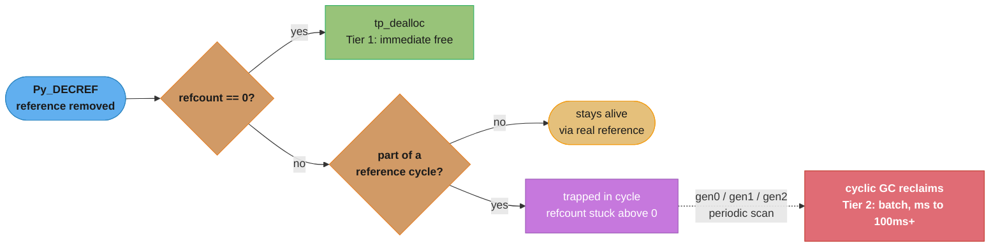
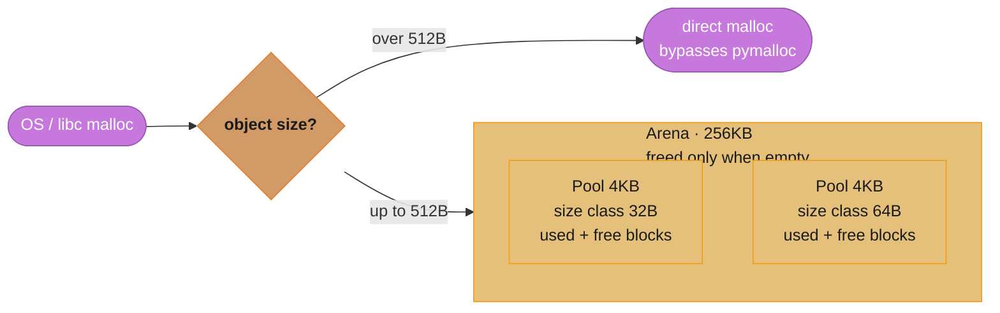
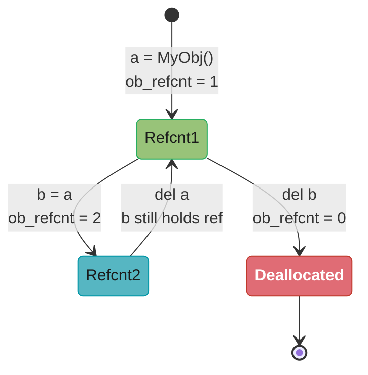
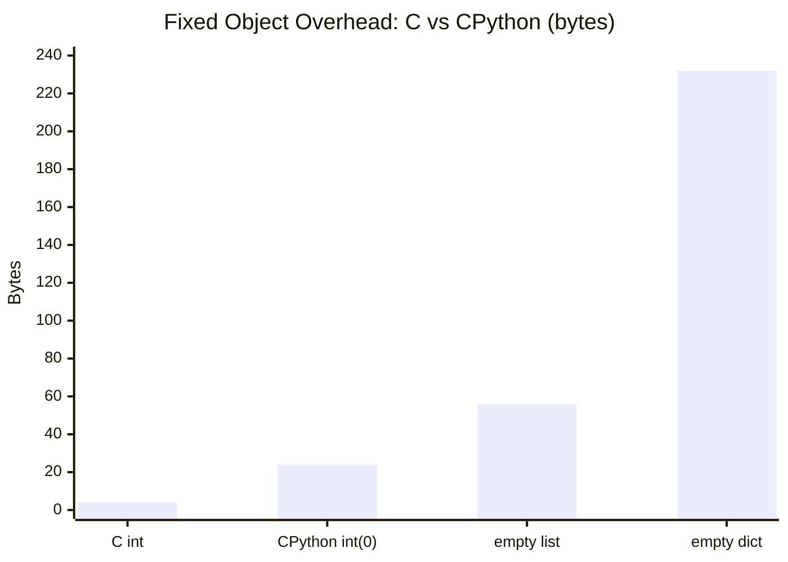

# CPython Memory Model

## 1. Concept Overview

CPython's memory model is the full machinery that governs how Python objects are created,
tracked, and destroyed at runtime. It is composed of three interlocking layers: reference
counting (the primary deallocation mechanism), the cyclic garbage collector (the fallback
for objects that form reference cycles), and a private allocator (`pymalloc`) that sits
between Python and the OS to reduce `malloc` overhead for small objects.

Every Python object — integer, string, list, function, class instance — is a C struct
(`PyObject`) allocated on the C heap. The interpreter maintains a reference count inside
that struct; when the count reaches zero the object is immediately destroyed. Because
reference counting alone cannot reclaim cycles (e.g., `a.next = b; b.prev = a`), the
cyclic GC periodically scans three object generations and reclaims unreachable groups.

Understanding this model is essential for writing FastAPI services that do not leak memory
across thousands of requests, for tuning GC parameters on latency-sensitive endpoints, and
for profiling allocations with `tracemalloc`.

Cross-references:
- See `../the_gil_and_free_threading/README.md` for how the GIL interacts with reference
  counting (refcount operations are not atomic without the GIL).
- See `../data_model_and_objects/README.md` for `__slots__`, which reduces per-instance
  memory overhead by eliminating the per-object `__dict__`.

---

## 2. Intuition

> A Python object is like a library book with a checkout log: every borrower increments
> a counter when they take it and decrements when they return it; the book is reshelved
> (freed) the instant the last borrower returns it — unless two borrowers are waiting on
> each other, in which case the librarian runs a weekly audit (GC) to break the deadlock.

**Mental model.** Think of memory management as a two-tier system. Tier 1 is instant and
cheap: every assignment/deletion adjusts a counter; zero count means immediate free. Tier
2 is batch and expensive: the cyclic GC scans objects that *could* form cycles (containers
like lists, dicts, instances) and reclaims groups of objects that are mutually reachable
but unreachable from outside.


*The reclamation decision every object faces on each `Py_DECREF`: reference counting handles the common case immediately (Tier 1), and only objects trapped in reference cycles fall through to the batched, higher-latency cyclic GC (Tier 2).*

**Why it matters.** In long-running FastAPI processes, failing to understand this model
causes:
- Memory leaks from uncollected cycles (especially with `__del__` finalizers).
- Unexpected GC pauses on large heaps (gen2 collections can take 100 ms or more).
- Confusion between `is` and `==` due to object interning.
- Incorrect memory profiling because `sys.getsizeof()` only reports shallow size.

**Key insight.** CPython's allocator never returns small-object memory to the OS during a
process lifetime — it holds arenas and reuses pools. A spike in small-object allocation
permanently inflates resident set size (RSS) even after those objects are freed. Only a
process restart or `ctypes.malloc_trim()` on Linux reclaims that address space.

---

## 3. Core Principles

1. **Reference counting is the default reclamation path.** Every `Py_INCREF` / `Py_DECREF`
   is O(1) and happens synchronously. No background threads, no stop-the-world for the
   common case.

2. **The cyclic GC is opt-in per type.** Only types that have a `tp_traverse` slot are
   tracked by the GC. Primitive types (`int`, `str`, `bytes`) are never tracked; `list`,
   `dict`, and user-defined classes are tracked.

3. **Three generations reflect the generational hypothesis.** Most objects die young.
   Collecting gen0 (young objects) frequently and gen2 (long-lived objects) rarely is
   optimal for throughput.

4. **`pymalloc` is a bump allocator within pools.** Allocating a 32-byte object is a
   pointer increment in the current pool — essentially free. Freeing returns the block to
   the pool's free-list, not to the OS.

5. **Object interning reduces allocation pressure.** Small integers and compile-time string
   literals are singletons. Comparing them with `is` is safe but relying on interning for
   correctness is an implementation detail, not a language guarantee.

6. **`tracemalloc` is the right profiling tool.** `cProfile` measures time; `tracemalloc`
   measures allocations with per-line granularity. For memory investigations always use
   `tracemalloc` first before reaching for external tools.

---

## 4. Types / Architectures / Strategies

### 4.1 Reference Counting (Primary)

Automatic, synchronous, zero-configuration. Works for the vast majority of objects. Cost:
two pointer-size writes per object creation/deletion. Thread safety is provided by the GIL
in CPython 3.11; free-threaded CPython 3.13 uses biased reference counting with per-thread
caches.

### 4.2 Cyclic Garbage Collector (Secondary)

Generational, stop-the-world within a single OS thread. Triggered when the number of
newly created objects minus deallocated objects in gen0 exceeds the gen0 threshold (700 by
default). Can be tuned, paused for hot loops, or partially replaced with `gc.freeze()` for
objects that will never be collected (e.g., module-level constants).

### 4.3 CPython Allocator (`pymalloc`)

Three-level hierarchy (arenas → pools → blocks) for objects 1–512 bytes. Objects larger
than 512 bytes bypass `pymalloc` and go directly to the OS `malloc`. The allocator is
single-threaded; the GIL serializes access.

### 4.4 Weak References

`weakref.ref` creates a reference that does not increment the refcount. The referent can
be GC'd while the weakref exists; accessing a dead weakref returns `None`. Used in caches
to allow GC to reclaim entries automatically.

### 4.5 Memory Profiling with `tracemalloc`

Built-in, low-overhead (relative to external tools). Captures stack traces at the point of
allocation. Works at the Python level — it does not see C-level allocations that bypass
`PyMem_Malloc`.

---

## 5. Architecture Diagrams

### 5.1 CPython Allocator Hierarchy


*Objects up to 512 bytes are served by pymalloc's arena/pool/block hierarchy; larger objects bypass it and go straight to the OS allocator. An arena (256 KB) holds many 4 KB pools, each dedicated to one 8-byte-stepped size class, and is returned to the OS only once every pool inside it is empty.*

### 5.2 Reference Count Lifecycle


*Each assignment or deletion synchronously adjusts `ob_refcnt`; the instant it reaches zero, `tp_dealloc` frees the object immediately — no scheduler, no GC pause, just the Tier-1 fast path from the mental model in Section 2.*

### 5.3 Generational GC Collection Flow

```mermaid
flowchart LR
    classDef io      fill:#61afef,stroke:#2e86c1,color:#1a1a1a,font-weight:bold
    classDef frozen  fill:#c678dd,stroke:#9b59b6,color:#fff
    classDef train   fill:#98c379,stroke:#27ae60,color:#1a1a1a
    classDef mathOp  fill:#d19a66,stroke:#e67e22,color:#1a1a1a,font-weight:bold
    classDef lossN   fill:#e06c75,stroke:#c0392b,color:#fff,font-weight:bold
    classDef req     fill:#56b6c2,stroke:#0097a7,color:#1a1a1a
    classDef base    fill:#e5c07b,stroke:#f39c12,color:#1a1a1a

    new(["New objects<br/>allocated"]) --> gen0["Gen 0<br/>threshold: 700 allocs<br/>collected frequently"]
    gen0 -->|"survivors<br/>promoted"| gen1["Gen 1<br/>threshold: 10 gen0 collects<br/>less frequent"]
    gen1 -->|"survivors<br/>promoted"| gen2["Gen 2<br/>threshold: 10 gen1 collects<br/>~100ms pause, rare"]
    gen2 -.->|"gc.freeze()"| pinned(["pinned forever<br/>never rescanned"])

    class new io
    class gen0 req
    class gen1 mathOp
    class gen2 frozen
    class pinned frozen
```


*Gen0's low threshold (700 net allocations) keeps collections cheap and frequent; survivors ratchet up through Gen1 and Gen2, where pauses can stretch to ~100 ms. `gc.freeze()` permanently exempts long-lived Gen2 survivors — module-level objects, for example — from ever being rescanned.*

### 5.4 PyObject C Struct Layout

```
PyObject (base of ALL Python objects):
  +0   ob_refcnt   (Py_ssize_t, 8 bytes on 64-bit)
  +8   ob_type     (PyTypeObject*, 8 bytes)
                   = 16 bytes minimum per object

PyVarObject (sequences: list, tuple, bytes, int):
  +0   ob_refcnt   (8 bytes)
  +8   ob_type     (8 bytes)
  +16  ob_size     (Py_ssize_t, 8 bytes — number of elements/digits)
                   = 24 bytes minimum

PyLongObject (int in Python 3.11):
  +0   ob_refcnt
  +8   ob_type
  +16  ob_size     (number of 30-bit digits; negative = negative int)
  +24  ob_digit[]  (array of uint32_t, one per 30-bit digit)
  int(0)  -> ob_size=0, no digits  -> 24 bytes total
  int(1)  -> ob_size=1, 1 digit    -> 28 bytes total
```

---

## 6. How It Works — Detailed Mechanics

### 6.1 PyObject C Struct and Object Overhead

Every Python object begins with the fields defined in `PyObject`. In CPython 3.11 on a
64-bit platform:

```c
/* Objects/object.h (simplified) */
typedef struct _object {
    Py_ssize_t ob_refcnt;   /* reference count, 8 bytes */
    PyTypeObject *ob_type;  /* pointer to type, 8 bytes */
} PyObject;                 /* 16 bytes minimum */

typedef struct {
    PyObject ob_base;
    Py_ssize_t ob_size;     /* element count or digit count */
} PyVarObject;              /* 24 bytes minimum */
```

Python's `int` is NOT a C `int`. It is `PyLongObject`, which stores arbitrary-precision
integers as an array of 30-bit "digits". Even `int(0)` allocates 24 bytes; `int(2**30)`
allocates 28 bytes (one digit slot).

```python
import sys

print(sys.getsizeof(0))          # 24  (int with zero digits)
print(sys.getsizeof(1))          # 28  (int with one 30-bit digit)
print(sys.getsizeof(2**30))      # 28  (still one digit)
print(sys.getsizeof(2**60))      # 32  (two digits)
print(sys.getsizeof([]))         # 56  (list header + 0 slots)
print(sys.getsizeof([None]))     # 64  (56 + 8 bytes for one pointer slot)
print(sys.getsizeof({}))         # 232 (empty dict in CPython 3.11)
print(sys.getsizeof(""))         # 49  (str header with Latin-1 kind)
print(sys.getsizeof("a"))        # 50  (str header + 1 byte for Latin-1 char)
```


*A plain C `int` costs 4 bytes; the same value as a CPython `PyLongObject` costs 24 bytes just for the header — the 6x overhead Q13 warns about for numeric-heavy workloads — and grows to 232 bytes for an empty `dict` before a single key is stored.*

### 6.2 Reference Counting Mechanics

Every object assignment calls `Py_INCREF` on the target; every variable going out of scope
or being reassigned calls `Py_DECREF`. When `ob_refcnt` drops to zero, `tp_dealloc` is
invoked immediately — no scheduler, no pause.

```python
import sys

x = object()
print(sys.getrefcount(x))   # 2: one for 'x', one for the getrefcount argument frame

y = x
print(sys.getrefcount(x))   # 3

del y
print(sys.getrefcount(x))   # 2

def holds_ref(obj: object) -> None:
    # Inside the function, 'obj' is another reference
    print(sys.getrefcount(obj))   # 3 while inside

holds_ref(x)
print(sys.getrefcount(x))   # 2 after function returns (frame destroyed)
```

`del x` does not necessarily free the object — it only removes the name binding and
decrements the count. If other names still reference the object, it stays alive.

```python
a = [1, 2, 3]
b = a           # refcount = 2
del a           # refcount = 1; list NOT freed yet
print(b)        # [1, 2, 3] — still alive through 'b'
del b           # refcount = 0 -> tp_dealloc called, memory released
```

### 6.3 Cyclic Garbage Collector

Reference counting cannot reclaim objects that form reference cycles:

```python
import gc

class Node:
    def __init__(self, val: int) -> None:
        self.val = val
        self.next: "Node | None" = None

gc.disable()           # turn off automatic GC so we can observe manually
a = Node(1)
b = Node(2)
a.next = b
b.next = a             # cycle: a -> b -> a
del a
del b
# refcounts are now 1 for each (the cycle keeps them alive)
# but nothing external references them

before = gc.collect()  # manually trigger; returns number of unreachable objects collected
print(before)          # 4 (a, b, and their __dict__ dicts, or similar container count)
gc.enable()
```

The GC works by computing "effective reference counts": it temporarily subtracts internal
references within the candidate set. Objects whose adjusted count reaches zero are
unreachable and can be freed.

Default thresholds (as returned by `gc.get_threshold()`):
- Gen0: 700 (net object allocations since last gen0 collect)
- Gen1: 10  (number of gen0 collections since last gen1 collect)
- Gen2: 10  (number of gen1 collections since last gen2 collect)

```python
import gc

print(gc.get_threshold())   # (700, 10, 10)

# Tune for a latency-sensitive server: collect gen0 more often to keep
# individual pauses short; allow gen2 to build up.
gc.set_threshold(400, 10, 10)

# Freeze all currently live objects into gen2 so they are never scanned again.
# Useful after importing all modules (module-level objects will never die).
gc.freeze()
print(gc.get_freeze_count())   # number of objects frozen
```

Typical GC pause times (CPython 3.11, 64-bit Linux, single-threaded):
- Gen0 collection: ~0.5–2 ms for heaps with tens of thousands of objects
- Gen2 collection: ~50–200 ms for heaps with millions of tracked objects

### 6.4 CPython Allocator Hierarchy

`pymalloc` is CPython's private allocator for objects 1–512 bytes:

```
Arena (256 KB):
  - Allocated via mmap/malloc from the OS
  - Divided into 64 pools of 4 KB each
  - CPython tracks a list of usable arenas; an arena is returned
    to the OS only when ALL its pools are empty

Pool (4 KB):
  - Dedicated to exactly ONE size class
  - Size classes: 8, 16, 24, 32, 40, 48 ... 512 bytes (64 classes, 8-byte steps)
  - Contains a singly-linked free-list of available blocks
  - Has a "freeblock" pointer and an "nfree" count

Block:
  - Fixed-size slot within a pool
  - When allocated: removed from the pool's free-list
  - When freed: returned to the pool's free-list (NOT to the OS)
```

```python
import ctypes
import sys

# Demonstrate that pymalloc memory is not released to OS after del
# (RSS stays elevated; only pool free-lists are updated)

big_list: list[int] = [i for i in range(1_000_000)]
print(f"Before del: {sys.getsizeof(big_list):,} bytes (shallow)")
del big_list
# RSS as reported by /proc/self/status or psutil will NOT drop significantly
# because the pools that held the list elements are retained in CPython arenas
```

For objects larger than 512 bytes, CPython calls `malloc` directly:

```python
import sys

large_bytes = b"x" * 600      # 600 > 512: bypasses pymalloc, goes to OS malloc
print(sys.getsizeof(large_bytes))   # 649 (header + 600 data bytes)
```

### 6.5 Object Interning

**Integer interning (-5 to 256):**

```python
a = 256
b = 256
print(a is b)   # True — same singleton object

a = 257
b = 257
print(a is b)   # False in a fresh interactive session (two allocations)
                # May be True inside a compiled code block (constant folding)

# The pre-allocated range is guaranteed by the CPython language spec comment
# (not the language spec itself — it is a CPython implementation detail)
```

**String interning:**

```python
import sys

# Identifiers and compile-time literals are often interned automatically
s1 = "hello"
s2 = "hello"
print(s1 is s2)      # True (same string object in compiled module)

# Strings with special characters are NOT automatically interned
s3 = "hello world"
s4 = "hello world"
print(s3 is s4)      # False (or True, depends on context — do not rely on this)

# Explicit interning
s5 = sys.intern("hello world")
s6 = sys.intern("hello world")
print(s5 is s6)      # True — guaranteed, both point to the same interned object
print(id(s5) == id(s6))   # True
```

**Singletons:** `None`, `True`, and `False` are each a single object:

```python
x: bool | None = None
print(x is None)    # True — always; use `is None`, not `== None`
print(True is True)  # True — always
```

### 6.6 `sys.getsizeof()` vs `__sizeof__()`

`__sizeof__()` returns the raw memory occupied by the object itself (without GC overhead).
`sys.getsizeof()` calls `__sizeof__()` and adds the GC header overhead (24 bytes for
objects tracked by the cyclic GC on CPython 3.11 64-bit).

```python
import sys

lst: list[int] = []
print(lst.__sizeof__())      # 32 (internal storage, no GC header)
print(sys.getsizeof(lst))    # 56 (32 + 24 GC overhead)

d: dict[str, int] = {}
print(d.__sizeof__())        # 208
print(sys.getsizeof(d))      # 232 (208 + 24)

# getsizeof is SHALLOW — it does not recurse into contained objects
nested: list[list[int]] = [[1, 2, 3], [4, 5, 6]]
print(sys.getsizeof(nested))    # 72 (56 + 2 pointer slots of 8 bytes each)
# The inner lists are NOT counted; you must recurse manually

def deep_size(obj: object, seen: set[int] | None = None) -> int:
    """Recursively compute total memory usage of obj and all referents."""
    if seen is None:
        seen = set()
    obj_id = id(obj)
    if obj_id in seen:
        return 0
    seen.add(obj_id)
    size = sys.getsizeof(obj)
    if hasattr(obj, "__dict__"):
        size += deep_size(obj.__dict__, seen)
    if hasattr(obj, "__iter__") and not isinstance(obj, (str, bytes, bytearray)):
        try:
            for item in obj:
                size += deep_size(item, seen)
        except TypeError:
            pass
    return size
```

### 6.7 `tracemalloc` — Memory Profiling

`tracemalloc` intercepts `PyMem_Malloc` and `PyMem_RawMalloc` to record the allocation
site (file, line, size). It has two operating modes: snapshot comparison (to find leaks)
and live monitoring (to find peaks).

```python
import tracemalloc

# --- Capture a baseline ---
tracemalloc.start(25)   # 25 = depth of captured stack frame

# ... application code runs here ...

current, peak = tracemalloc.get_traced_memory()
print(f"Current: {current / 1024:.1f} KB  Peak: {peak / 1024:.1f} KB")

snapshot1 = tracemalloc.take_snapshot()

# ... more code, suspected leak section ...

snapshot2 = tracemalloc.take_snapshot()
top_stats = snapshot2.compare_to(snapshot1, "lineno")

print("Top 10 memory increases:")
for stat in top_stats[:10]:
    print(stat)

tracemalloc.stop()
```

Example output from a leaking service:

```
Top 10 memory increases:
app/services/cache.py:42: size=18.2 MiB (+18.2 MiB), count=91234 (+91234), average=210 B
app/models/response.py:17: size=4.1 MiB (+4.1 MiB), count=20617 (+20617), average=210 B
```

The first line immediately points to `cache.py:42` — a module-level dict retaining
response objects and preventing GC from reclaiming them.

### 6.8 Weak References

A `weakref.ref` object does NOT increment the referent's `ob_refcnt`. If the referent's
refcount drops to zero (no strong references remain), the referent is deallocated and the
weakref automatically becomes "dead" (calling it returns `None`).

```python
import weakref
import gc

class HeavyResource:
    def __init__(self, name: str) -> None:
        self.name = name
        self.data = b"x" * (1024 * 1024)   # 1 MB payload

resource = HeavyResource("r1")
weak = weakref.ref(resource)

print(weak())              # <HeavyResource object ...>   (alive)
print(weak().name)         # r1

del resource               # refcount -> 0, immediate dealloc
gc.collect()               # ensure any cycles are cleared

print(weak())              # None  (referent was collected)

# weakref.finalize: callback on collection
def on_collect(name: str) -> None:
    print(f"Resource {name!r} was collected")

r2 = HeavyResource("r2")
finalizer = weakref.finalize(r2, on_collect, r2.name)
del r2                     # prints: Resource 'r2' was collected
```

**`WeakValueDictionary` for caches:**

```python
import weakref
from typing import Optional

_cache: weakref.WeakValueDictionary[str, "HeavyResource"] = (
    weakref.WeakValueDictionary()
)

def get_resource(key: str) -> "HeavyResource":
    result: Optional[HeavyResource] = _cache.get(key)
    if result is None:
        result = HeavyResource(key)
        _cache[key] = result   # stored as weak reference
    return result

r = get_resource("alpha")
# As long as 'r' exists, the entry survives.
# When 'r' goes out of scope, the entry is automatically removed from the dict.
```

---

## 7. Real-World Examples

### 7.1 FastAPI Request Handler Memory Lifecycle

Each HTTP request handled by a FastAPI/Starlette application:
1. Creates a `Request` object (scope dict, receive callable).
2. Runs dependency injection — each `Depends()` call creates intermediate objects.
3. Invokes the route handler, which returns a `Response` or `JSONResponse`.
4. After the ASGI send coroutine completes, the response body dict is released.
5. All of the above objects are short-lived and reclaimed by refcount before the GC
   ever runs — provided no module-level dict retains them.

### 7.2 Celery Worker with Long-Running Tasks

Celery workers are long-lived processes. Each task execution that allocates large
intermediate data (DataFrames, numpy arrays) relies on refcounting to release them after
the task returns. If a task stores results in a module-level accumulator, those objects
are never freed and RSS grows without bound. The solution is to use `WeakValueDictionary`
or explicit `del` plus `gc.collect()` for tasks known to create cycles.

### 7.3 Django/Flask ORM Queryset Memory Inflation

Large querysets (`MyModel.objects.all()`) pull all rows into memory as model instances.
Each instance has a `__dict__` (typically 232 bytes for an empty dict) plus attribute
storage. A queryset of 100,000 rows can easily consume 200–500 MB. Using `.iterator()`
(Django) or streaming results (SQLAlchemy `yield_per`) keeps only one batch of rows in
memory at a time, relying on refcounting to free each batch immediately.

---

## 8. Tradeoffs

| Mechanism | Reclamation Speed | Throughput Cost | Handles Cycles | Memory Returned to OS |
|---|---|---|---|---|
| Reference counting | Immediate (O(1)) | 2 writes per alloc/dealloc | No | Yes (when pool empties) |
| Cyclic GC gen0 | ~1–2 ms pause | Low (runs infrequently) | Yes | Yes (via refcount after cycle broken) |
| Cyclic GC gen2 | ~50–200 ms pause | High if triggered often | Yes | Yes |
| `gc.disable()` | N/A | Zero GC overhead | No — leaks cycles | N/A |
| `weakref` | Immediate when strong refs gone | Negligible | Prevents cycles forming | Yes |
| `tracemalloc` | N/A (profiling only) | 5–30% overhead | N/A | N/A |

| Object size | Allocator used | Memory returned to OS on free |
|---|---|---|
| 1–512 bytes | `pymalloc` (pool/arena) | Only when entire arena is free |
| 513+ bytes | OS `malloc` | Immediately (libc decides) |

---

## 9. When to Use / When NOT to Use

### When to use `gc.disable()`:
- Short-lived, performance-critical loops (e.g., parsing 100 M records) where you
  guarantee no cycles are created and no `__del__` methods exist.
- Always re-enable immediately after the loop.
- Combine with `gc.freeze()` beforehand to lock module-level objects into gen2 so they
  are never rescanned.

### When NOT to use `gc.disable()`:
- Long-running servers, workers, or any code that processes user-supplied objects with
  potential cycles (ORM instances with back-references, linked list nodes).
- Any code path that uses `__del__` finalizers — these prevent GC from breaking cycles.

### When to use `weakref`:
- Caches keyed by objects where you do not want to keep objects alive artificially.
- Observer/event patterns where listeners should not prevent emitters from being GC'd.
- Breaking deliberate cycles without restructuring the entire object graph.

### When NOT to use `weakref`:
- Objects that do not support weak references (e.g., plain `int`, `str`, `list`,
  `dict` — though subclasses of these do support it).
- Performance paths where `weakref` proxy indirection adds measurable latency.

### When to use `tracemalloc`:
- Diagnosing RSS growth in a running service.
- Finding the allocation hotspot in a data-processing pipeline.
- Writing tests that assert memory usage does not exceed a budget.

### When NOT to use `tracemalloc`:
- Production systems under sustained load (5–30% CPU overhead is typical).
- C extension allocations that bypass `PyMem_Malloc` — `tracemalloc` cannot see those.

---

## 10. Common Pitfalls

### Pitfall 1: Unbounded Module-Level Cache (BROKEN → FIX)

```python
# BROKEN: module-level dict holds strong references to every response object.
# Memory grows without bound as new requests arrive.

_response_cache: dict[str, dict] = {}

def get_response(key: str) -> dict:
    if key not in _response_cache:
        _response_cache[key] = _build_heavy_response(key)
    return _response_cache[key]
```

```python
# FIX: Use functools.lru_cache with a size limit, or WeakValueDictionary.

import functools
import weakref

# Option A: LRU cache with bounded size (evicts least-recently-used entries)
@functools.lru_cache(maxsize=1000)
def get_response_cached(key: str) -> dict:
    return _build_heavy_response(key)

# Option B: WeakValueDictionary — GC automatically evicts when no strong ref exists
_weak_cache: weakref.WeakValueDictionary[str, dict] = weakref.WeakValueDictionary()

def get_response(key: str) -> dict:
    result = _weak_cache.get(key)
    if result is None:
        result = _build_heavy_response(key)
        _weak_cache[key] = result
    return result
```

### Pitfall 2: Disabling GC Permanently in a Server (BROKEN → FIX)

```python
# BROKEN: GC is disabled at module import time and never re-enabled.
# Any code that creates circular references (ORM relationships, async tasks
# that capture 'self', linked structures) will leak indefinitely.

import gc
gc.disable()   # placed at top of application __init__.py

from fastapi import FastAPI
app = FastAPI()

@app.get("/items/{item_id}")
async def get_item(item_id: int) -> dict:
    # If any object created here forms a cycle, it NEVER gets collected.
    node = {"id": item_id}
    node["self_ref"] = node    # cycle!
    return {"id": item_id}
    # 'node' is deleted by name but cycle means refcount > 0;
    # with GC disabled, this leaks forever.
```

```python
# FIX: Only disable GC within a tightly scoped, provably cycle-free hot path.

import gc
from fastapi import FastAPI

app = FastAPI()

def parse_records_fast(raw: bytes) -> list[dict]:
    """Hot path: no cycles, no __del__, short-lived objects only."""
    gc.disable()
    try:
        return [{"val": b} for b in raw]   # no cycles
    finally:
        gc.enable()   # always re-enable

@app.get("/items/{item_id}")
async def get_item(item_id: int) -> dict:
    return {"id": item_id}   # GC is active for all normal request handling
```

### Pitfall 3: Trusting `sys.getsizeof()` for True Memory Cost

`sys.getsizeof` is shallow. A dict with 10,000 string keys and list values reports only
232 bytes (the dict header), completely hiding the contents.

```python
import sys

data = {"key": [1, 2, 3, 4, 5]}
print(sys.getsizeof(data))        # 232 — the dict header only
print(sys.getsizeof(data["key"])) # 104 — the list header + slots
# The actual integers inside the list are NOT counted either.
# Use the deep_size() function from Section 6 for accurate measurements.
```

### Pitfall 4: Using `is` for Equality Outside Singleton Checks

```python
# BROKEN: relying on integer interning for values outside [-5, 256]
def is_admin_id(user_id: int) -> bool:
    return user_id is 1000   # SyntaxWarning in 3.8+, WRONG behavior

# FIX: always use == for value comparison
def is_admin_id(user_id: int) -> bool:
    return user_id == 1000   # correct
```

### Pitfall 5: `__del__` Breaking the Cyclic GC

Objects with `__del__` that are part of a reference cycle were historically not collected
by the GC (Python < 3.4) and were placed in `gc.garbage`. In Python 3.4+, `__del__` is
called but the objects must be collected in the correct order, adding overhead.

```python
import gc

class Bad:
    def __init__(self) -> None:
        self.other: "Bad | None" = None

    def __del__(self) -> None:
        print(f"Finalizing {id(self)}")

a = Bad()
b = Bad()
a.other = b
b.other = a   # cycle with __del__: GC must determine safe finalization order

del a, b
gc.collect()  # prints two "Finalizing ..." lines but pause is longer than without __del__
```

Prefer `weakref.finalize` over `__del__` to avoid complicating GC cycle resolution.

---

## 11. Technologies & Tools

| Tool / Library | Purpose | Overhead | Notes |
|---|---|---|---|
| `tracemalloc` (stdlib) | Per-line Python allocation tracing | 5–30% CPU | Cannot see C-extension allocations |
| `memory_profiler` (PyPI) | Line-by-line RSS profiling | High (subprocess sampling) | Easier to read than tracemalloc for RSS |
| `guppy3` / `heapy` | Heap census by type | Low (one-shot) | Useful for "what types consume the most?" |
| `pympler` | `asizeof` — recursive size calculation | Low (one-shot) | Good replacement for manual deep_size() |
| `pyspy` | Sampling profiler (CPU + allocation) | Very low (~1%) | Works without code changes; reads /proc |
| `valgrind + massif` | C-level heap profiling | 10–50x slowdown | For CPython extensions and C library leaks |
| `gc` module (stdlib) | GC control: thresholds, freeze, collect | Zero when idle | Always available; essential for GC tuning |
| `weakref` module (stdlib) | Weak references and weak containers | Negligible | Built-in; no install required |

---

## 12. Interview Questions with Answers

**Q1: What is the `PyObject` C struct and why does it matter for Python memory?**
Every Python object begins with `ob_refcnt` (8 bytes, reference count) and `ob_type`
(8 bytes, pointer to the type), for a minimum overhead of 16 bytes per object. Sequences
add `ob_size` for 24 bytes minimum. Because even `int(0)` is a 24–28 byte heap allocation,
Python is significantly more memory-intensive than C for numeric-heavy workloads. Practical
guidance: use `numpy` arrays or `array.array` for bulk numeric storage to avoid per-element
PyObject overhead.

**Q2: Why does `sys.getrefcount(x)` always return at least 2?**
`getrefcount` receives `x` as a function argument, which creates a temporary reference in
the call frame, incrementing the count by 1 above the count you would expect. The count
reported is therefore always "true count + 1". Practical guidance: subtract 1 from the
result when interpreting refcounts from `getrefcount`.

**Q3: What happens when `ob_refcnt` reaches zero?**
The type's `tp_dealloc` function is called synchronously, immediately freeing the object's
memory back to the pool (or OS for large objects). There is no scheduling delay, no GC
pause, and no background thread involved — deallocation is part of the `Py_DECREF` macro
itself. Practical guidance: destructor code in `tp_dealloc` (e.g., `__del__`) runs
synchronously on the decrementing thread, which can cause latency spikes if destructors
are slow.

**Q4: What kinds of objects can form reference cycles and why can't refcounting handle them?**
Any mutable container that can hold references to other objects — `list`, `dict`, `set`,
and user-defined instances — can form cycles. In a cycle, each object's refcount is kept
above zero by the other objects in the cycle, even when no external code references any of
them. Refcounting requires the count to reach zero before freeing, which never happens in
a cycle. Practical guidance: avoid long-lived cycles in high-throughput services; use the
cyclic GC (keep it enabled) or restructure with weakrefs.

**Q5: Describe the three generations of the CPython cyclic GC and their default thresholds.**
Gen0 is for newly allocated objects; it is collected when the difference between new
allocations and deallocations exceeds 700 (default). Survivors are promoted to Gen1,
collected after 10 Gen0 collections. Gen1 survivors go to Gen2, collected after 10 Gen1
collections. This reflects the generational hypothesis: most objects die young, so
collecting young objects frequently is efficient. Practical guidance: use `gc.freeze()`
after module loading to pin long-lived objects into Gen2 and exclude them from future
scans.

**Q6: Explain CPython's `pymalloc` allocator hierarchy: arenas, pools, and blocks.**
Arenas are 256 KB regions obtained from the OS. Each arena is divided into 4 KB pools.
Each pool serves blocks of exactly one size class (8, 16, 24, ... 512 bytes). Allocation
is a pointer bump in the current pool's free-list — very fast. Freed blocks are returned
to the pool's free-list, NOT to the OS. An arena is returned to the OS only when all of
its pools are fully empty. Practical guidance: allocation spikes inflate RSS permanently
(within the process lifetime) because partially-used arenas are held even when blocks are
freed.

**Q7: What is object interning and which objects are interned by default in CPython?**
Interning means reusing a single canonical instance for all occurrences of a value instead
of allocating separate objects. By default, CPython interns integers from -5 to 256 (as
pre-allocated singletons) and many compile-time string literals that look like identifiers.
`None`, `True`, and `False` are always singletons. Practical guidance: use `is None` for
None checks; use `==` for all other equality comparisons because interning behavior is
an implementation detail not guaranteed by the language spec.

**Q8: What is the difference between `sys.getsizeof()` and `__sizeof__()`?**
`__sizeof__()` returns the raw size of the object without GC bookkeeping overhead.
`sys.getsizeof()` calls `__sizeof__()` and adds 24 bytes for the GC header on objects
tracked by the cyclic GC. Both are shallow — they do not recurse into referenced objects.
Practical guidance: for accurate total memory, use `pympler.asizeof` or a recursive
`deep_size()` function; never use `getsizeof` alone to size a nested data structure.

**Q9: How does `tracemalloc` work and what are its limitations?**
`tracemalloc` hooks into `PyMem_Malloc` and `PyMem_RawMalloc` to record each allocation's
size and up to N frames of the call stack (configured by `tracemalloc.start(N)`). It can
take snapshots and compute diffs to isolate allocations introduced between two points in
time. Its limitation is that it cannot see C-extension allocations that bypass CPython's
memory API — `numpy` internal buffers, for example, are invisible to `tracemalloc`.
Practical guidance: use `tracemalloc.compare_to` between a baseline and a suspected leak
window; look at `lineno` statistics to find the exact line responsible.

**Q10: What is a weak reference and when should you use one instead of a strong reference?**
A `weakref.ref` stores a reference that does not increment the referent's refcount. If the
referent has no remaining strong references, it is collected and the weak reference becomes
`None`. Use weakrefs in caches (so cached objects can be collected when no one else holds
them), in observer/listener registries (so listeners don't pin emitters), and to break
deliberate cycles. Do not use weakrefs for objects whose lifetime you actively need to
control, or for types that don't support weak references (built-in `int`, `str`, `list`
do NOT support weakrefs without subclassing). Practical guidance: use
`weakref.WeakValueDictionary` for value-caches and `weakref.WeakKeyDictionary` for
metadata attached to foreign objects.

**Q11: What is `gc.freeze()` and when should you call it?**
`gc.freeze()` moves all currently tracked objects into Gen2 and marks them as permanently
frozen — they are never scanned again by the GC. This is useful after full module
initialization: all module-level objects (class definitions, constants, global dicts) will
never be GC'd, so excluding them from future scans reduces GC work. Gunicorn calls
`gc.freeze()` after loading the application before forking workers, which also makes the
frozen pages copy-on-write friendly. Practical guidance: call `gc.freeze()` once, after
imports and application initialization, before serving traffic.

**Q12: How does the GIL interact with reference counting?**
The Global Interpreter Lock ensures that only one thread executes Python bytecode at a
time. Because `Py_INCREF` and `Py_DECREF` are not atomic — they are plain C integer
operations — the GIL prevents two threads from corrupting an object's refcount
simultaneously. In free-threaded CPython 3.13 (`--disable-gil`), biased reference counting
is used: each object has a per-thread cache of refcount deltas that are merged periodically,
avoiding contention. Practical guidance: do not rely on refcount atomicity in C extensions
that release the GIL; use `Py_INCREF`/`Py_DECREF` only while holding the GIL.

**Q13: Why is Python's `int` not a C `int`, and what are the memory implications?**
Python's `int` is `PyLongObject`, an arbitrary-precision integer stored as an array of
30-bit "digits" plus the standard 24-byte `PyVarObject` header. Even `int(0)` is 24 bytes
on CPython 3.11 64-bit. A C `int` is 4 bytes. For numerical work, this is a 6x overhead.
Practical guidance: use `array.array('l', ...)` for large lists of fixed-width integers,
or `numpy` arrays, to avoid per-element `PyLongObject` overhead.

**Q14: How can you detect that a finalizer (`__del__`) is preventing cycle collection?**
Check `gc.garbage` — Python < 3.4 places uncollectable cycles (those containing `__del__`)
here. In Python 3.4+, the list is populated only by objects that raise exceptions in
`__del__`. More practically, use `gc.set_debug(gc.DEBUG_UNCOLLECTABLE)` to print
uncollectable objects to stderr. Then use `gc.get_referrers(obj)` to find what holds a
reference to the suspect object. Practical guidance: prefer `weakref.finalize` over
`__del__` to keep cleanup logic decoupled from the GC cycle-breaking algorithm.

**Q15: What is the behavior of `del x` versus setting `x = None`?**
`del x` removes the name binding from the current namespace and decrements the refcount
of the bound object by 1. If the refcount reaches zero, the object is immediately freed.
`x = None` rebinds the name to the `None` singleton and also decrements the original
object's refcount by 1. The memory effect is identical as long as no other name references
the original object. The difference is that after `del x`, accessing `x` raises
`NameError`; after `x = None`, `x` is still accessible as `None`. Practical guidance: use
`del` when you want to release a large object AND communicate to readers that the variable
is no longer valid; use `= None` when the variable must remain in scope (e.g., a loop
variable that needs to be checked afterward).

---

## 13. Best Practices

1. **Keep the cyclic GC enabled in all long-running processes.** The overhead is negligible
   compared to the cost of debugging a memory leak caused by uncollected cycles.

2. **Call `gc.freeze()` once after application initialization.** This pins module-level
   objects and reduces per-request GC scan time, especially in Gunicorn pre-fork workers.

3. **Use `weakref.WeakValueDictionary` for module-level object caches.** This prevents
   caches from becoming the only strong reference keeping objects alive indefinitely.

4. **Profile with `tracemalloc`, not just RSS.** RSS includes fragmentation and
   unmapped-but-retained arenas; `tracemalloc` shows what Python code is actually allocating.

5. **Avoid `__del__` in classes that might form cycles.** Use `weakref.finalize` instead;
   it registers a cleanup callback that does not participate in cycle resolution.

6. **Use `sys.intern()` explicitly for hot strings.** If a string is used as a dict key in
   millions of lookups (e.g., JSON field names in a hot parsing loop), interning it reduces
   both memory usage and hash-lookup time.

7. **Prefer `array.array` or `numpy` for large numeric datasets.** Each Python `int` costs
   at least 24 bytes; an `array.array('l')` of the same values costs 8 bytes per element.

8. **Set `gc.set_threshold(400, 10, 10)` for low-latency APIs.** Collecting Gen0 more
   frequently (400 instead of 700) keeps individual pauses shorter at the cost of slightly
   higher total GC time.

9. **Use `__slots__` on data-heavy classes.** Eliminating `__dict__` from instances saves
   232 bytes per instance. See `../data_model_and_objects/README.md` for details.

10. **Measure before tuning.** Run `gc.get_stats()` in production to see actual Gen0/1/2
    collection frequencies and object counts before changing thresholds. Premature GC
    tuning without data frequently makes things worse.

---

## 14. Case Study

### Diagnosing a Memory Leak in a Long-Running FastAPI Service

**Scenario.** A FastAPI microservice handling document summarization grows by approximately
50 MB/hour under steady traffic (200 requests/minute). After 8 hours the container is
OOMKilled. The service uses no external databases — all state is in-process. No obvious
memory leak is visible in the code review.

**Step 1: Establish a Baseline with `tracemalloc`**

Add instrumentation to the application startup and to a `/debug/memory` endpoint:

```python
# app/lifespan.py
import tracemalloc
from contextlib import asynccontextmanager
from fastapi import FastAPI

@asynccontextmanager
async def lifespan(app: FastAPI):
    tracemalloc.start(30)   # capture 30 frames of stack per allocation
    yield
    tracemalloc.stop()

app = FastAPI(lifespan=lifespan)
```

```python
# app/routers/debug.py
import tracemalloc
from fastapi import APIRouter

router = APIRouter(prefix="/debug")
_baseline_snapshot = None

@router.post("/memory/baseline")
async def set_baseline() -> dict:
    global _baseline_snapshot
    _baseline_snapshot = tracemalloc.take_snapshot()
    current, peak = tracemalloc.get_traced_memory()
    return {"current_kb": round(current / 1024, 1), "peak_kb": round(peak / 1024, 1)}

@router.get("/memory/diff")
async def get_diff() -> dict:
    if _baseline_snapshot is None:
        return {"error": "call /debug/memory/baseline first"}
    current_snapshot = tracemalloc.take_snapshot()
    stats = current_snapshot.compare_to(_baseline_snapshot, "lineno")
    top = [
        {
            "file": str(s.traceback[0].filename),
            "line": s.traceback[0].lineno,
            "size_mib": round(s.size / (1024 * 1024), 3),
            "size_diff_mib": round(s.size_diff / (1024 * 1024), 3),
            "count": s.count,
            "count_diff": s.count_diff,
        }
        for s in stats[:15]
    ]
    current, peak = tracemalloc.get_traced_memory()
    return {"current_mb": round(current / (1024 * 1024), 1), "top_allocations": top}
```

**Step 2: Reproduce and Capture**

After calling `POST /debug/memory/baseline`, run 5,000 requests through the service, then
call `GET /debug/memory/diff`. The response shows:

```json
{
  "current_mb": 312.4,
  "top_allocations": [
    {
      "file": "app/services/summarizer.py",
      "line": 58,
      "size_mib": 287.1,
      "size_diff_mib": 287.1,
      "count": 4998,
      "count_diff": 4998
    },
    {
      "file": "app/models/response.py",
      "line": 23,
      "size_mib": 18.2,
      "size_diff_mib": 18.2,
      "count": 4998,
      "count_diff": 4998
    }
  ]
}
```

All 4,998 `SummaryResult` objects (one per request) are still alive. `summarizer.py:58`
is retaining them.

**Step 3: Identify the Leak**

```python
# app/services/summarizer.py  (BROKEN version)

_result_registry: dict[str, "SummaryResult"] = {}   # line 55: strong reference dict

class SummaryResult:                                  # line 57
    def __init__(self, doc_id: str, text: str) -> None:
        self.doc_id = doc_id
        self.summary = text
        self.metadata: dict[str, str] = {}
        _result_registry[doc_id] = self              # line 58: STRONG ref stored here
        # Intent was to allow other parts of the service to look up recent results.
        # Bug: the registry is never evicted; it retains every SummaryResult forever.
```

The registry was added to allow an experimental "result lookup" feature that was never
shipped. Every response object is retained indefinitely by `_result_registry`, preventing
refcount from reaching zero. The cyclic GC cannot help because there are no cycles — the
references are straight strong refs from the module-level dict.

**Step 4: Fix with `weakref.WeakValueDictionary`**

```python
# app/services/summarizer.py  (FIX version)

import weakref

# FIX: Use WeakValueDictionary so the registry does not extend object lifetimes.
# When the last strong reference to a SummaryResult is released (at end of request
# handler), the entry is automatically removed from the registry.
_result_registry: weakref.WeakValueDictionary[str, "SummaryResult"] = (
    weakref.WeakValueDictionary()
)

class SummaryResult:
    def __init__(self, doc_id: str, text: str) -> None:
        self.doc_id = doc_id
        self.summary = text
        self.metadata: dict[str, str] = {}
        _result_registry[doc_id] = self   # stored as weak reference — no refcount bump
```

**Step 5: Verify the Fix**

Run the same 5,000-request load test, then call `GET /debug/memory/diff`:

```json
{
  "current_mb": 18.7,
  "top_allocations": [
    {
      "file": "app/services/summarizer.py",
      "line": 58,
      "size_mib": 0.0,
      "size_diff_mib": 0.0,
      "count": 0,
      "count_diff": 0
    }
  ]
}
```

Memory growth is now 18.7 MB total across 5,000 requests — dominated by connection pool
and Starlette internal state — compared to 287 MB before the fix. The service no longer
grows without bound.

**Key lessons from this case study:**
- Module-level dicts are the most common source of unintended strong references in
  FastAPI services. Always ask "who owns this object's lifetime?" before storing it.
- `tracemalloc.compare_to()` with `"lineno"` resolution pinpoints the exact source line
  within minutes, eliminating guesswork.
- `WeakValueDictionary` is the idiomatic Python fix for registries and caches that should
  not control object lifetimes. The fix is a one-line type annotation change.
- Validate the fix with the same load profile: confirm both `size_diff_mib` and
  `count_diff` drop to zero for the suspect allocation site.
