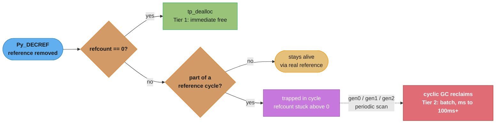
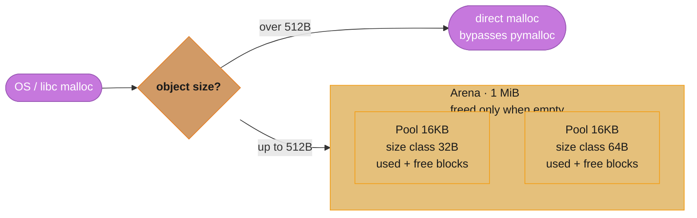
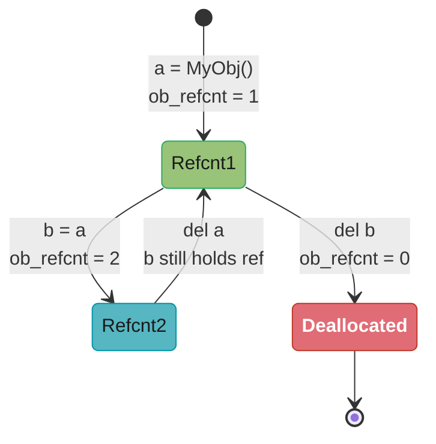
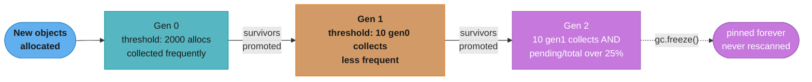
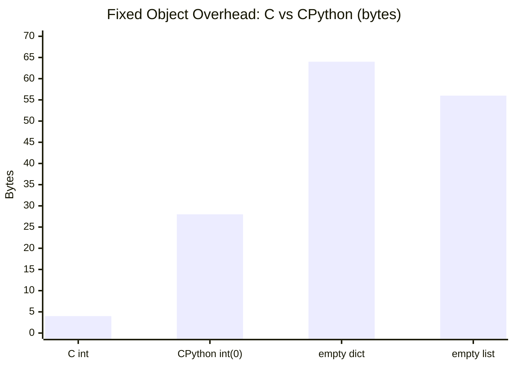

# CPython Memory Model

<!-- study-paths
senior: cpython_memory_model.md
files this module contributes to each curated path; omit a tier to leave it out
-->
## 1. Concept Overview

CPython's memory model is the full machinery that governs how Python objects are created,
tracked, and destroyed at runtime. It is composed of three interlocking layers: reference
counting (the primary deallocation mechanism), the cyclic garbage collector (the fallback
for objects that form reference cycles), and a private allocator (`pymalloc`) that sits
between Python and the OS to reduce `malloc` overhead for small objects.

Every Python object — integer, string, list, function, class instance — is a C struct
(`PyObject`) allocated on the C heap. The interpreter maintains a reference count inside
that struct; when the count reaches zero the object is immediately destroyed. Because
reference counting alone cannot reclaim cycles (e.g., `a.next = b; b.prev = a`), the
cyclic GC periodically scans three object generations and reclaims unreachable groups.

Understanding this model is essential for writing FastAPI services that do not leak memory
across thousands of requests, for tuning GC parameters on latency-sensitive endpoints, and
for profiling allocations with `tracemalloc`.

Cross-references:
- See `../the_gil_and_free_threading/README.md` for how the GIL interacts with reference
  counting (refcount operations are not atomic without the GIL).
- See `../data_model_and_objects/README.md` for `__slots__`, which reduces per-instance
  memory overhead by eliminating the per-object `__dict__`.

---

## 2. Intuition

> A Python object is like a library book with a checkout log: every borrower increments
> a counter when they take it and decrements when they return it; the book is reshelved
> (freed) the instant the last borrower returns it — unless two borrowers are waiting on
> each other, in which case the librarian runs a weekly audit (GC) to break the deadlock.

**Mental model.** Think of memory management as a two-tier system. Tier 1 is instant and
cheap: every assignment/deletion adjusts a counter; zero count means immediate free. Tier
2 is batch and expensive: the cyclic GC scans objects that *could* form cycles (containers
like lists, dicts, instances) and reclaims groups of objects that are mutually reachable
but unreachable from outside.


*The reclamation decision every object faces on each `Py_DECREF`: reference counting handles the common case immediately (Tier 1), and only objects trapped in reference cycles fall through to the batched, higher-latency cyclic GC (Tier 2).*

**Why it matters.** In long-running FastAPI processes, failing to understand this model
causes:
- Memory leaks from uncollected cycles (especially with `__del__` finalizers).
- Unexpected GC pauses on large heaps (gen2 collections can take 100 ms or more).
- Confusion between `is` and `==` due to object interning.
- Incorrect memory profiling because `sys.getsizeof()` only reports shallow size.

**Key insight.** CPython's allocator gives memory back to the OS only one whole arena at a
time — a single surviving object anywhere in a 1 MiB arena pins the entire arena. A spike in
small-object allocation therefore inflates resident set size (RSS) semi-permanently even
after those objects are freed. Only a process restart, or asking glibc to compact its own
heap with `ctypes.CDLL("libc.so.6").malloc_trim(0)` on Linux, reclaims that address space.

---

## 3. Core Principles

1. **Reference counting is the default reclamation path.** Every `Py_INCREF` / `Py_DECREF`
   is O(1) and happens synchronously. No background threads, no stop-the-world for the
   common case.

2. **The cyclic GC is opt-in per type.** Only types that have a `tp_traverse` slot are
   tracked by the GC. Primitive types (`int`, `str`, `bytes`) are never tracked; `list`,
   `dict`, and user-defined classes are tracked.

3. **Three generations reflect the generational hypothesis.** Most objects die young.
   Collecting gen0 (young objects) frequently and gen2 (long-lived objects) rarely is
   optimal for throughput.

4. **`pymalloc` is a bump allocator within pools.** Allocating a 32-byte object is a
   pointer increment in the current pool — essentially free. Freeing returns the block to
   the pool's free-list, not to the OS.

5. **Object interning reduces allocation pressure.** Small integers and compile-time string
   literals are singletons. Comparing them with `is` is safe but relying on interning for
   correctness is an implementation detail, not a language guarantee.

6. **`tracemalloc` is the right profiling tool.** `cProfile` measures time; `tracemalloc`
   measures allocations with per-line granularity. For memory investigations always use
   `tracemalloc` first before reaching for external tools.

---

## 4. Types / Architectures / Strategies

### 4.1 Reference Counting (Primary)

Automatic, synchronous, zero-configuration. Works for the vast majority of objects. Cost:
one read-modify-write of `ob_refcnt` per reference gained or lost. In the default build the
GIL provides thread safety. The free-threaded build (`python3.14t`, officially supported
since Python 3.14 under PEP 779) splits the count into a thread-local `ob_ref_local` owned
by the object's creating thread and a shared `ob_ref_shared` for everyone else — biased
reference counting — plus deferred reference counting for hot objects such as module
globals and type objects. Runtime-global objects are immortal and skip refcounting entirely
(Section 6.5).

### 4.2 Cyclic Garbage Collector (Secondary)

Generational, stop-the-world within a single OS thread. Triggered when the number of
newly created objects minus deallocated objects in gen0 exceeds the gen0 threshold (2000 by
default). Can be tuned, paused for hot loops, or partially replaced with `gc.freeze()` for
objects that will never be collected (e.g., module-level constants). The free-threaded build
does not use generations at all — every collection scans the whole heap, pausing the other
threads for the duration.

### 4.3 CPython Allocator (`pymalloc`)

Three-level hierarchy (arenas → pools → blocks) for objects 1–512 bytes. Objects larger
than 512 bytes bypass `pymalloc` and go directly to the OS `malloc`. In the default build
the GIL serializes access to the allocator's shared free-lists; the free-threaded build
replaces `pymalloc` entirely with **mimalloc**, which gives each thread its own heap
(`Py_GIL_DISABLED` is a compile error without `WITH_MIMALLOC`).

### 4.4 Weak References

`weakref.ref` creates a reference that does not increment the refcount. The referent can
be GC'd while the weakref exists; accessing a dead weakref returns `None`. Used in caches
to allow GC to reclaim entries automatically.

### 4.5 Memory Profiling with `tracemalloc`

Built-in, low-overhead (relative to external tools). Captures stack traces at the point of
allocation. Works at the Python level — it does not see C-level allocations that bypass
`PyMem_Malloc`.

---

## 5. Architecture Diagrams

### 5.1 CPython Allocator Hierarchy


*Objects up to 512 bytes are served by pymalloc's arena/pool/block hierarchy; larger objects bypass it and go straight to the OS allocator. On 64-bit an arena (1 MiB) holds 64 pools of 16 KiB, each dedicated to one 16-byte-stepped size class, and is returned to the OS only once every pool inside it is empty.*

### 5.2 Reference Count Lifecycle


*Each assignment or deletion synchronously adjusts `ob_refcnt`; the instant it reaches zero, `tp_dealloc` frees the object immediately — no scheduler, no GC pause, just the Tier-1 fast path from the mental model in Section 2.*

### 5.3 Generational GC Collection Flow


*Gen0's threshold (2000 net allocations) keeps collections cheap and frequent; survivors ratchet up through Gen1 and Gen2, where pauses can stretch to ~100 ms. Gen2 carries an extra guard: the counted 10 Gen1 collections are necessary but not sufficient — a full pass also requires `long_lived_pending / long_lived_total` to exceed 25%. `gc.freeze()` permanently exempts long-lived Gen2 survivors — module-level objects, for example — from ever being rescanned.*

### 5.4 PyObject C Struct Layout

```
PyObject (base of ALL Python objects):
  +0   ob_refcnt   (Py_ssize_t, 8 bytes on 64-bit)
  +8   ob_type     (PyTypeObject*, 8 bytes)
                   = 16 bytes minimum per object

PyVarObject (sequences: list, tuple, bytes):
  +0   ob_refcnt   (8 bytes)
  +8   ob_type     (8 bytes)
  +16  ob_size     (Py_ssize_t, 8 bytes — number of elements)
                   = 24 bytes minimum

PyLongObject (int) — NOT a PyVarObject since CPython 3.12:
  +0   ob_refcnt
  +8   ob_type
  +16  lv_tag      (uintptr_t, 8 bytes — digit count, sign and flag bits)
  +24  ob_digit[]  (array of uint32_t, one per 30-bit digit, at least 1 slot)
  int(0)  -> 0 digits, 1 slot allocated -> 28 bytes total
  int(1)  -> 1 digit                    -> 28 bytes total
  int(2**30) -> 2 digits                -> 32 bytes total
```

---

## 6. How It Works — Detailed Mechanics

### 6.1 PyObject C Struct and Object Overhead

Every Python object begins with the fields defined in `PyObject`. On a 64-bit platform:

```c
/* Include/object.h (simplified) */
typedef struct _object {
    Py_ssize_t ob_refcnt;   /* reference count, 8 bytes */
    PyTypeObject *ob_type;  /* pointer to type, 8 bytes */
} PyObject;                 /* 16 bytes minimum */

typedef struct {
    PyObject ob_base;
    Py_ssize_t ob_size;     /* element count */
} PyVarObject;              /* 24 bytes minimum */

/* Include/cpython/longintrepr.h — int stopped being a PyVarObject in 3.12 */
typedef struct _PyLongValue {
    uintptr_t lv_tag;       /* digit count, sign and flags, 8 bytes */
    digit ob_digit[1];      /* at least one 4-byte, 30-bit digit slot */
} _PyLongValue;

struct _longobject {
    PyObject_HEAD
    _PyLongValue long_value;
};                          /* 28 bytes minimum */
```

Python's `int` is NOT a C `int`. It is `PyLongObject`, which stores arbitrary-precision
integers as an array of 30-bit "digits". Even `int(0)` allocates 28 bytes, because the
struct always reserves one digit slot; `int(2**30)` needs two digits and allocates 32.

```python
import sys

print(sys.getsizeof(0))          # 28  (24-byte header + one reserved digit slot)
print(sys.getsizeof(1))          # 28  (one 30-bit digit)
print(sys.getsizeof(2**30))      # 32  (two digits: 2**30 needs 31 bits)
print(sys.getsizeof(2**60))      # 36  (three digits)
print(sys.getsizeof([]))         # 56  (list header + 0 slots)
print(sys.getsizeof([None]))     # 64  (56 + 8 bytes for one pointer slot)
print(sys.getsizeof({}))         # 64  (empty dict shares a static empty keys object)
print(sys.getsizeof(""))         # 41  (compact-ASCII str header + NUL terminator)
print(sys.getsizeof("a"))        # 42  (header + 1 byte for the ASCII char + NUL)
```


*A plain C `int` costs 4 bytes; the same value as a CPython `PyLongObject` costs 28 bytes — the 7x overhead Q13 warns about for numeric-heavy workloads — and an empty `dict` costs 64 bytes before a single key is stored.*

**What the formula is telling you.** "An integer's size is a 24-byte header plus four bytes per 30-bit chunk of the number, with one chunk always reserved — so Python charges you 28 bytes before it stores a single bit of information."

The header is the part that never amortizes. It is why a numeric workload in pure Python is memory-bound long before it is CPU-bound.

| Symbol | What it is |
|--------|------------|
| `ob_refcnt` | The reference count, 8 bytes. Present on literally every Python object |
| `ob_type` | Pointer to the type object, 8 bytes. Also on every object |
| `lv_tag` | 8 bytes packing the digit count, the sign, and the "is compact" flag |
| digit | One 30-bit chunk of the value, stored in a 4-byte `uint32_t` slot |
| 24 bytes | `PyObject` head plus `lv_tag` — the floor, paid before any digits |

**Walk one example.** Header plus `4 x max(1, ndigits)`, checked against `sys.getsizeof`:

```
  size(int) = 24 (header + lv_tag) + 4 x max(1, number of 30-bit digits)

    value          digits needed                        bytes
    0              0  (one slot still reserved)         24 +  4  = 28
    1              1                                    24 +  4  = 28
    2**30 - 1      1   (the largest one-digit value)    24 +  4  = 28
    2**30          2   (digit[0]=0, digit[1]=1)         24 +  8  = 32
    2**60 - 1      2                                    24 +  8  = 32
    2**60          3   (digit[0]=0, digit[1]=0, [2]=1)  24 + 12  = 36
```

**Now push it through a container.** A `list` stores pointers, not values, so the header cost
is paid once per distinct integer *on top of* the pointer array:

```
  list(range(1_000_000))

    list header                                     56 bytes
    pointer array   1,000,000 x 8 bytes  =   8,000,000 bytes
    sys.getsizeof(the list)              =   8,000,056 bytes   <- shallow, all it reports

    boxed integers    999,743 x 28 bytes =  27,992,804 bytes   <- invisible above
      (values -5..256 are immortal singletons: 257 of them are free)

    true resident cost                   =  35,992,860 bytes = 34.3 MiB

  array.array('q', range(1_000_000))     ~=   8,000,000 bytes =  7.6 MiB

  ratio: 4.5x -- and two thirds of those bytes are PyObject headers, not data
```

Check that against the mental model. Of the 35,992,860 bytes, only 4 bytes per integer is
the actual number: `999,743 x 24 = 23,993,832` bytes, **67%**, is pure per-object header and
refcount. The 8 MB pointer array is the price of indirection on top. This is the concrete
form of the guidance in Q1 and Q13 — reach for `array.array` or `numpy` for bulk numerics
not because Python integers are slow, but because two thirds of what you paid for was never
your data. (`array.array('q')` is int64 on every platform; `'l'` is a C `long`, which is
4 bytes on Windows.)

### 6.2 Reference Counting Mechanics

Every object assignment calls `Py_INCREF` on the target; every variable going out of scope
or being reassigned calls `Py_DECREF`. When `ob_refcnt` drops to zero, `tp_dealloc` is
invoked immediately — no scheduler, no pause.

```python
import sys

x = object()
print(sys.getrefcount(x))   # 2: one for 'x', one for the getrefcount argument frame

y = x
print(sys.getrefcount(x))   # 3

del y
print(sys.getrefcount(x))   # 2

def holds_ref(obj: object) -> None:
    # Inside the function, 'obj' is another reference
    print(sys.getrefcount(obj))   # 3 while inside

holds_ref(x)
print(sys.getrefcount(x))   # 2 after function returns (frame destroyed)
```

`del x` does not necessarily free the object — it only removes the name binding and
decrements the count. If other names still reference the object, it stays alive.

```python
a = [1, 2, 3]
b = a           # refcount = 2
del a           # refcount = 1; list NOT freed yet
print(b)        # [1, 2, 3] — still alive through 'b'
del b           # refcount = 0 -> tp_dealloc called, memory released
```

### 6.3 Cyclic Garbage Collector

Reference counting cannot reclaim objects that form reference cycles:

```python
import gc

class Node:
    def __init__(self, val: int) -> None:
        self.val = val
        self.next: "Node | None" = None

gc.disable()           # turn off automatic GC so we can observe manually
a = Node(1)
b = Node(2)
a.next = b
b.next = a             # cycle: a -> b -> a
del a
del b
# refcounts are now 1 for each (the cycle keeps them alive)
# but nothing external references them

before = gc.collect()  # manually trigger; returns number of unreachable objects collected
print(before)          # 2 — just a and b; since 3.11 instance attributes live in
                       # inline "managed" values, not a separate dict object
gc.enable()
```

The GC works by computing "effective reference counts": it temporarily subtracts internal
references within the candidate set. Objects whose adjusted count reaches zero are
unreachable and can be freed.

Default thresholds (as returned by `gc.get_threshold()`):
- Gen0: 2000 (net object allocations since last gen0 collect)
- Gen1: 10   (number of gen0 collections since last gen1 collect)
- Gen2: 10   (number of gen1 collections since last gen2 collect)

Gen2 has one extra guard the tuple does not show: a full collection also requires the ratio
`long_lived_pending / long_lived_total` to exceed a hardwired 25%. Without it, a program
that builds one large long-lived structure would do a full heap scan every 200,000 net
allocations and degrade to quadratic behaviour.

```python
import gc

print(gc.get_threshold())   # (2000, 10, 10)

# Tune for a latency-sensitive server: collect gen0 more often to keep
# individual pauses short; allow gen2 to build up.
gc.set_threshold(1000, 10, 10)

# Freeze all currently live objects into gen2 so they are never scanned again.
# Useful after importing all modules (module-level objects will never die).
gc.freeze()
print(gc.get_freeze_count())   # number of objects frozen
```

**In plain terms.** "Scan the newest objects after every 2000 net allocations; only escalate to the older, slower generations once you have done a lot of those cheap scans."

The trap in `(2000, 10, 10)` is that the three numbers are not in the same units. The first counts *objects*; the second and third count *collections*. Read them as one unit and you will mis-tune the server.

| Symbol | What it is |
|--------|------------|
| `2000` | Gen0 threshold, in **net allocations** — tracked objects created minus destroyed |
| first `10` | Gen1 threshold, in **Gen0 collections** since the last Gen1 pass |
| second `10` | Gen2 threshold, in **Gen1 collections** since the last Gen2 pass |
| net allocation | An allocation that was not matched by a deallocation; refcounted deaths do not count |
| tracked | Only container types have a `tp_traverse` slot; `int` and `str` never enter this count |

**Walk one example.** Convert the whole tuple into a single unit — net allocations:

```
  gc.get_threshold() -> (2000, 10, 10)

    gen0 collection : every  2,000 net allocations
    gen1 collection : every     10 gen0 collections =  10 x 2000 =  20,000 net allocs
    gen2 collection : every     10 gen1 collections = 100 x 2000 = 200,000 net allocs
                      (and only if long_lived_pending / long_lived_total > 25%)

  Now put a request rate on it. Take the case-study service in Section 14:
  200 requests/minute, and suppose each request nets 350 surviving tracked objects.

    gen0 fires every   2,000 / 350 =   5.7 requests  ->  35   times per minute
    gen1 fires every  20,000 / 350 =    57 requests  ->   3.5 times per minute
    gen2 fires every 200,000 / 350 =   571 requests  ->   0.35 times per minute
                                                         (once every ~3 minutes)

  Cost of that gen2 pass, at the 50-200 ms figure quoted just below:
    0.35 pause/minute x 50-200 ms = 0.03% to 0.12% of wall-clock in gen2 GC,
    but it lands on ONE unlucky request, which sees a 50-200 ms latency spike.
```

That last line is the whole reason GC tuning is a tail-latency topic and not a throughput
topic. The total overhead is a rounding error; the p99.9 is not.

**Reading the tuning knob.** `gc.set_threshold(1000, 10, 10)` changes only the first number,
so by the same arithmetic gen2 now fires every `1000 x 100 = 100,000` net allocations —
one pass per 286 requests instead of per 571. Gen0 passes get twice as frequent (every 1000
allocations instead of 2000) but each scans a smaller young set, so individual pauses shrink
while the total GC time rises slightly. That is the exact trade Best Practice 8 describes:
you are buying a shorter tail with a little more throughput.

Typical GC pause times (64-bit Linux, default build, single-threaded) — measure your own,
these scale with tracked-object count and pointer-chasing depth, not with heap bytes:
- Gen0 collection: ~0.5–2 ms for heaps with tens of thousands of objects
- Gen2 collection: ~50–200 ms for heaps with millions of tracked objects

### 6.4 CPython Allocator Hierarchy

`pymalloc` is CPython's private allocator for objects 1–512 bytes:

```
Arena (1 MiB on 64-bit; 256 KiB on 32-bit):
  - Allocated via mmap/malloc from the OS
  - Divided into 64 pools of 16 KiB each
  - CPython tracks a list of usable arenas; an arena is returned
    to the OS only when ALL its pools are empty

Pool (16 KiB on 64-bit; 4 KiB on 32-bit):
  - Dedicated to exactly ONE size class
  - Size classes: 16, 32, 48, 64 ... 512 bytes (32 classes, 16-byte steps)
    (ALIGNMENT is 16 on 64-bit platforms, 8 on 32-bit)
  - Contains a singly-linked free-list of available blocks
  - Has a "freeblock" pointer and an "nfree" count

Block:
  - Fixed-size slot within a pool
  - When allocated: removed from the pool's free-list
  - When freed: returned to the pool's free-list (NOT to the OS)
```

Confirm any of this on your own interpreter with `python3 -c "import sys;
sys._debugmallocstats()"`, which prints the live class/pool/arena census.

```
pools per arena = arena size / pool size
size classes    = max size class / step size
blocks per pool = (pool size - pool header) / size class
```

**The idea behind it.** "Buy memory from the OS in big slabs and hand it out in fixed-size slots — but you can only give a slab back when every single slot in it is free."

The three-level nesting is not the interesting part. The *release condition* is: freeing is per-block, but returning is per-arena, and those two granularities are 32,000x apart.

| Symbol | What it is |
|--------|------------|
| arena | 1 MiB bought from the OS via `mmap`/`malloc`; the only unit ever given back |
| pool | 16 KiB slice of an arena, pinned to exactly one size class for its lifetime |
| block | One fixed-size slot inside a pool — what a Python object actually occupies |
| size class | The rounded-up allocation size: 16, 32, 48, ... 512 bytes |
| free-list | Singly-linked list of freed blocks inside a pool, reused before any new block |

**Walk one example.** Every count in the diagram above, derived:

```
  Pools per arena   1,048,576 bytes / 16,384 bytes  =  64 pools

  Size classes      512 / 16                        =  32 classes (16, 32, ... 512)

  Blocks in one 16 KiB pool (16,384 - 48-byte pool header = 16,336 usable bytes):

      size class   16 B  ->  16,336 /  16  =  1,021 blocks
      size class   32 B  ->  16,336 /  32  =    510 blocks
      size class   64 B  ->  16,336 /  64  =    255 blocks
      size class  512 B  ->  16,336 / 512  =     31 blocks
```

**Now the release condition, which is where RSS goes wrong:**

```
  One surviving 32-byte object holds its 16 KiB pool open.
  One non-empty pool holds its whole 1 MiB arena open.

      bytes actually live           32
      bytes held from the OS 1,048,576
      amplification             32,768x

  Allocate 1,000,000 short-lived 32-byte objects, free all but 64 of them,
  and if those 64 survivors land in 64 different arenas:

      live data      64 x 32         =      2,048 bytes
      RSS retained   64 x 1,048,576  = 67,108,864 bytes  = 64 MiB
```

This is the arithmetic behind the Key Insight in Section 2 and the `big_list` example above:
a transient allocation spike does not inflate RSS because the memory is still in use, but
because *fragmentation* leaves one stubborn survivor in each arena. It also explains why the
fix is a process restart rather than a `gc.collect()` — the GC frees blocks, and blocks are
not the unit the OS gets back.

```python
import sys

# Demonstrate that pymalloc memory is not released to OS after del
# (RSS stays elevated; only pool free-lists are updated)

big_list: list[int] = [i for i in range(1_000_000)]
print(f"Before del: {sys.getsizeof(big_list):,} bytes (shallow)")
del big_list
# RSS as reported by /proc/self/status or psutil will NOT drop significantly
# because the pools that held the list elements are retained in CPython arenas
```

For objects larger than 512 bytes, CPython calls `malloc` directly:

```python
import sys

large_bytes = b"x" * 600      # 600 > 512: bypasses pymalloc, goes to OS malloc
print(sys.getsizeof(large_bytes))   # 633 (33-byte bytes header + 600 data bytes)
```

### 6.5 Object Interning

**Integer interning (-5 to 256):**

```python
a = 256
b = 256
print(a is b)   # True — same singleton object

a = 257
b = 257
print(a is b)   # False in a fresh interactive session (two allocations)
                # True inside a single compiled code block (constant folding),
                # e.g. when these three lines run as one module or function body

# The -5..256 range is a CPython implementation detail, not a language guarantee.
```

**Immortal objects [3.12].** PEP 683 gave a set of runtime-global objects a sentinel
reference count that `Py_INCREF` and `Py_DECREF` recognise and refuse to change. They are
never deallocated, and refcounting them costs nothing:

```python
import sys

print(sys.getrefcount(None))    # 4294967295 — the immortal sentinel, not a real count
print(sys.getrefcount(True))    # 4294967295
print(sys.getrefcount(42))      # 4294967295 — small ints are immortal singletons
print(sys.getrefcount([]))      # 1          — an ordinary, mortal object
```

Immortal are: `None`, `True`, `False`, `Ellipsis`, `NotImplemented`; every statically
allocated type object (`int`, `str`, `PyExc_ValueError`, ...); and the runtime's global
objects — the small-int cache and the interned identifier strings. The motivation is
multi-process and free-threaded: a refcount that never changes never dirties its page, so
a pre-fork worker keeps sharing those pages copy-on-write instead of faulting a private
copy on the first `None` it touches, and free-threaded builds avoid contending on the
hottest objects in the interpreter. The practical consequence for debugging: a huge
`sys.getrefcount()` result means "immortal", not "leaked 4 billion times".

**String interning:**

```python
import sys

# Identifiers and compile-time literals are often interned automatically
s1 = "hello"
s2 = "hello"
print(s1 is s2)      # True (same string object in compiled module)

# Strings with special characters are NOT automatically interned
s3 = "hello world"
s4 = "hello world"
print(s3 is s4)      # False (or True, depends on context — do not rely on this)

# Explicit interning
s5 = sys.intern("hello world")
s6 = sys.intern("hello world")
print(s5 is s6)      # True — guaranteed, both point to the same interned object
print(id(s5) == id(s6))   # True
```

**Singletons:** `None`, `True`, and `False` are each a single object:

```python
x: bool | None = None
print(x is None)    # True — always; use `is None`, not `== None`
print(True is True)  # True — always
```

### 6.6 `sys.getsizeof()` vs `__sizeof__()`

`__sizeof__()` returns the raw memory occupied by the object itself (without GC overhead).
`sys.getsizeof()` calls `__sizeof__()` and adds the `PyGC_Head` overhead — 16 bytes, two
pointer-size words — for objects tracked by the cyclic GC on 64-bit.

```python
import sys

lst: list[int] = []
print(lst.__sizeof__())      # 40 (internal storage, no GC header)
print(sys.getsizeof(lst))    # 56 (40 + 16 GC overhead)

d: dict[str, int] = {}
print(d.__sizeof__())        # 48
print(sys.getsizeof(d))      # 64 (48 + 16)

# getsizeof is SHALLOW — it does not recurse into contained objects
nested: list[list[int]] = [[1, 2, 3], [4, 5, 6]]
print(sys.getsizeof(nested))    # 72 (56 + 2 pointer slots of 8 bytes each)
# The inner lists are NOT counted; you must recurse manually

def deep_size(obj: object, seen: set[int] | None = None) -> int:
    """Recursively compute total memory usage of obj and all referents."""
    if seen is None:
        seen = set()
    obj_id = id(obj)
    if obj_id in seen:
        return 0
    seen.add(obj_id)
    size = sys.getsizeof(obj)
    if hasattr(obj, "__dict__"):
        size += deep_size(obj.__dict__, seen)
    if hasattr(obj, "__iter__") and not isinstance(obj, (str, bytes, bytearray)):
        try:
            for item in obj:
                size += deep_size(item, seen)
        except TypeError:
            pass
    return size
```

**Put simply.** "`getsizeof` measures the box, not the contents — it tells you how big the container's own bookkeeping is, and stops at the first pointer."

Every memory investigation that starts by printing `sys.getsizeof(my_big_structure)` and concludes "it's fine, only 184 bytes" has made this mistake.

| Symbol | What it is |
|--------|------------|
| `__sizeof__()` | Raw struct bytes the object occupies, GC header excluded |
| `sys.getsizeof()` | `__sizeof__()` plus 16 bytes of GC header, if the type is GC-tracked |
| shallow | Stops at pointers — the pointed-at objects are not counted |
| deep | Follows every reference transitively, deduplicating by `id()` |
| `seen` set | The dedup guard; without it, a cycle makes `deep_size` recurse forever |

**Walk one example.** The `nested` list from the code above, taken apart:

```
  nested = [[1, 2, 3], [4, 5, 6]]

    outer list header + 2 pointer slots            =  72 bytes  <- getsizeof stops here
    inner list [1, 2, 3]   (56 header + 4 slots)   =  88 bytes
    inner list [4, 5, 6]   (56 header + 4 slots)   =  88 bytes
    six integers           6 x 28 bytes            = 168 bytes

    deep_size(nested)                              = 416 bytes

    shallow understates by  416 / 72  =  5.8x
```

The 16-byte gap between the two APIs is worth naming, because it also shows up in the
`lst.__sizeof__()` vs `sys.getsizeof(lst)` pair above (40 vs 56): `getsizeof` adds the
`PyGC_Head` that GC-tracked types carry, so it is the more honest of the two — and still
5.8x short on a structure this trivial. On a real payload the multiplier is far worse: a
dict of 10,000 string keys reports only its own hash-table bytes and none of the keys or
values, per Pitfall 3. Use `deep_size` or `pympler.asizeof` whenever the question is "how
much RAM does this cost", and reserve `getsizeof` for the question it actually answers:
"how much does this one object header cost".

### 6.7 `tracemalloc` — Memory Profiling

`tracemalloc` installs hooks on all three CPython allocator domains — raw, mem and object —
to record the allocation site (file, line, size). It has two operating modes: snapshot
comparison (to find leaks) and live monitoring (to find peaks). Both CPU and memory
overhead scale with `nframe`; on allocation-dense code the slowdown is measured in
multiples, not percent, so keep `nframe` small in anything you leave running.

```python
import tracemalloc

# --- Capture a baseline ---
tracemalloc.start(25)   # 25 = depth of captured stack frame

# ... application code runs here ...

current, peak = tracemalloc.get_traced_memory()
print(f"Current: {current / 1024:.1f} KB  Peak: {peak / 1024:.1f} KB")

snapshot1 = tracemalloc.take_snapshot()

# ... more code, suspected leak section ...

snapshot2 = tracemalloc.take_snapshot()
top_stats = snapshot2.compare_to(snapshot1, "lineno")

print("Top 10 memory increases:")
for stat in top_stats[:10]:
    print(stat)

tracemalloc.stop()
```

Example output from a leaking service:

```
Top 10 memory increases:
app/services/cache.py:42: size=18.2 MiB (+18.2 MiB), count=91234 (+91234), average=210 B
app/models/response.py:17: size=4.1 MiB (+4.1 MiB), count=20617 (+20617), average=210 B
```

The first line immediately points to `cache.py:42` — a module-level dict retaining
response objects and preventing GC from reclaiming them.

### 6.8 Weak References

A `weakref.ref` object does NOT increment the referent's `ob_refcnt`. If the referent's
refcount drops to zero (no strong references remain), the referent is deallocated and the
weakref automatically becomes "dead" (calling it returns `None`).

```python
import weakref
import gc

class HeavyResource:
    def __init__(self, name: str) -> None:
        self.name = name
        self.data = b"x" * (1024 * 1024)   # 1 MB payload

resource = HeavyResource("r1")
weak = weakref.ref(resource)

print(weak())              # <HeavyResource object ...>   (alive)
print(weak().name)         # r1

del resource               # refcount -> 0, immediate dealloc
gc.collect()               # ensure any cycles are cleared

print(weak())              # None  (referent was collected)

# weakref.finalize: callback on collection
def on_collect(name: str) -> None:
    print(f"Resource {name!r} was collected")

r2 = HeavyResource("r2")
finalizer = weakref.finalize(r2, on_collect, r2.name)
del r2                     # prints: Resource 'r2' was collected
```

**`WeakValueDictionary` for caches:**

```python
import weakref
from typing import Optional

_cache: weakref.WeakValueDictionary[str, "HeavyResource"] = (
    weakref.WeakValueDictionary()
)

def get_resource(key: str) -> "HeavyResource":
    result: Optional[HeavyResource] = _cache.get(key)
    if result is None:
        result = HeavyResource(key)
        _cache[key] = result   # stored as weak reference
    return result

r = get_resource("alpha")
# As long as 'r' exists, the entry survives.
# When 'r' goes out of scope, the entry is automatically removed from the dict.
```

---

## 7. Real-World Examples

### 7.1 FastAPI Request Handler Memory Lifecycle

Each HTTP request handled by a FastAPI/Starlette application:
1. Creates a `Request` object (scope dict, receive callable).
2. Runs dependency injection — each `Depends()` call creates intermediate objects.
3. Invokes the route handler, which returns a `Response` or `JSONResponse`.
4. After the ASGI send coroutine completes, the response body dict is released.
5. All of the above objects are short-lived and reclaimed by refcount before the GC
   ever runs — provided no module-level dict retains them.

### 7.2 Celery Worker with Long-Running Tasks

Celery workers are long-lived processes. Each task execution that allocates large
intermediate data (DataFrames, numpy arrays) relies on refcounting to release them after
the task returns. If a task stores results in a module-level accumulator, those objects
are never freed and RSS grows without bound. The solution is to use `WeakValueDictionary`
or explicit `del` plus `gc.collect()` for tasks known to create cycles.

### 7.3 Django/Flask ORM Queryset Memory Inflation

Large querysets (`MyModel.objects.all()`) pull all rows into memory as model instances.
Each instance carries a per-object header, an attribute store, and a separately boxed
`PyObject` for every column value — a 20-column row is 21 heap objects, not one. A queryset
of 100,000 rows can easily consume 200–500 MB. Using `.iterator()`
(Django) or streaming results (SQLAlchemy `yield_per`) keeps only one batch of rows in
memory at a time, relying on refcounting to free each batch immediately.

---

## 8. Tradeoffs

| Mechanism | Reclamation Speed | Throughput Cost | Handles Cycles | Memory Returned to OS |
|---|---|---|---|---|
| Reference counting | Immediate (O(1)) | 1 read-modify-write per ref gained/lost | No | Only when the whole arena empties |
| Cyclic GC gen0 | ~1–2 ms pause | Low (runs infrequently) | Yes | Yes (via refcount after cycle broken) |
| Cyclic GC gen2 | ~50–200 ms pause | High if triggered often | Yes | Yes |
| `gc.disable()` | N/A | Zero GC overhead | No — leaks cycles | N/A |
| `weakref` | Immediate when strong refs gone | Negligible | Prevents cycles forming | Yes |
| `tracemalloc` | N/A (profiling only) | Multiples, not percent — grows with `nframe` | N/A | N/A |

| Object size | Allocator used | Memory returned to OS on free |
|---|---|---|
| 1–512 bytes | `pymalloc` (pool/arena) | Only when entire 1 MiB arena is free |
| 513+ bytes | OS `malloc` | Immediately (libc decides) |

---

## 9. When to Use / When NOT to Use

### When to use `gc.disable()`:
- Short-lived, performance-critical loops (e.g., parsing 100 M records) where you
  guarantee no cycles are created and no `__del__` methods exist.
- Always re-enable immediately after the loop.
- Combine with `gc.freeze()` beforehand to lock module-level objects into gen2 so they
  are never rescanned.

### When NOT to use `gc.disable()`:
- Long-running servers, workers, or any code that processes user-supplied objects with
  potential cycles (ORM instances with back-references, linked list nodes).
- Any code path that uses `__del__` finalizers — these prevent GC from breaking cycles.

### When to use `weakref`:
- Caches keyed by objects where you do not want to keep objects alive artificially.
- Observer/event patterns where listeners should not prevent emitters from being GC'd.
- Breaking deliberate cycles without restructuring the entire object graph.

### When NOT to use `weakref`:
- Objects that do not support weak references (e.g., plain `int`, `str`, `list`,
  `dict` — though subclasses of these do support it).
- Performance paths where `weakref` proxy indirection adds measurable latency.

### When to use `tracemalloc`:
- Diagnosing RSS growth in a running service.
- Finding the allocation hotspot in a data-processing pipeline.
- Writing tests that assert memory usage does not exceed a budget.

### When NOT to use `tracemalloc`:
- Production systems under sustained load. The slowdown on allocation-heavy code is a
  multiple of baseline, not a small percentage, and it rises sharply with `nframe`.
- C extension allocations that bypass CPython's memory API — `tracemalloc` cannot see those.
  `numpy` array buffers, for example, come from the C allocator directly.

---

## 10. Common Pitfalls

### Pitfall 1: Unbounded Module-Level Cache (BROKEN → FIX)

```python
# BROKEN: module-level dict holds strong references to every response object.
# Memory grows without bound as new requests arrive.

_response_cache: dict[str, dict] = {}

def get_response(key: str) -> dict:
    if key not in _response_cache:
        _response_cache[key] = _build_heavy_response(key)
    return _response_cache[key]
```

```python
# FIX: Use functools.lru_cache with a size limit, or WeakValueDictionary.

import functools
import weakref
from dataclasses import dataclass, field

# Option A: LRU cache with bounded size (evicts least-recently-used entries)
@functools.lru_cache(maxsize=1000)
def get_response_cached(key: str) -> dict:
    return _build_heavy_response(key)

# Option B: WeakValueDictionary — GC automatically evicts when no strong ref exists.
# The VALUE must be weak-referenceable: a plain dict/list/str is NOT, so wrap the
# payload in a class. weakref.WeakValueDictionary()[k] = {} raises
# "TypeError: cannot create weak reference to 'dict' object".
@dataclass
class Response:
    body: dict = field(default_factory=dict)

_weak_cache: weakref.WeakValueDictionary[str, Response] = weakref.WeakValueDictionary()

def get_response(key: str) -> Response:
    result = _weak_cache.get(key)
    if result is None:
        result = Response(_build_heavy_response(key))
        _weak_cache[key] = result
    return result
```

### Pitfall 2: Disabling GC Permanently in a Server (BROKEN → FIX)

```python
# BROKEN: GC is disabled at module import time and never re-enabled.
# Any code that creates circular references (ORM relationships, async tasks
# that capture 'self', linked structures) will leak indefinitely.

import gc
gc.disable()   # placed at top of application __init__.py

from fastapi import FastAPI
app = FastAPI()

@app.get("/items/{item_id}")
async def get_item(item_id: int) -> dict:
    # If any object created here forms a cycle, it NEVER gets collected.
    node = {"id": item_id}
    node["self_ref"] = node    # cycle!
    return {"id": item_id}
    # 'node' is deleted by name but cycle means refcount > 0;
    # with GC disabled, this leaks forever.
```

```python
# FIX: Only disable GC within a tightly scoped, provably cycle-free hot path.

import gc
from fastapi import FastAPI

app = FastAPI()

def parse_records_fast(raw: bytes) -> list[dict]:
    """Hot path: no cycles, no __del__, short-lived objects only."""
    gc.disable()
    try:
        return [{"val": b} for b in raw]   # no cycles
    finally:
        gc.enable()   # always re-enable

@app.get("/items/{item_id}")
async def get_item(item_id: int) -> dict:
    return {"id": item_id}   # GC is active for all normal request handling
```

### Pitfall 3: Trusting `sys.getsizeof()` for True Memory Cost

`sys.getsizeof` is shallow. A dict with 10,000 string keys and list values reports only its
own header and hash table — a few hundred KB — completely hiding megabytes of contents.

```python
import sys

data = {"key": [1, 2, 3, 4, 5]}
print(sys.getsizeof(data))        # 184 — the dict header and its hash table only
print(sys.getsizeof(data["key"])) # 104 — the list header + slots
# The actual integers inside the list are NOT counted either.
# Use the deep_size() function from Section 6 for accurate measurements.
```

### Pitfall 4: Using `is` for Equality Outside Singleton Checks

```python
# BROKEN: relying on integer interning for values outside [-5, 256]
def is_admin_id(user_id: int) -> bool:
    return user_id is 1000   # SyntaxWarning in 3.8+, WRONG behavior

# FIX: always use == for value comparison
def is_admin_id(user_id: int) -> bool:
    return user_id == 1000   # correct
```

### Pitfall 5: `__del__` Breaking the Cyclic GC

A cycle whose members define `__del__` is collectable — PEP 442 gave every object a
`tp_finalize` slot that the collector calls exactly once, before it breaks the cycle. What
it costs you is ordering: the GC must finalize every member of the cycle before it may clear
any of them. A finalizer that blocks on I/O, acquires a lock, or resurrects an object
therefore runs inside the collection pause and stretches it, and because the collecting
thread is whichever one happened to trip the threshold, that pause lands on an arbitrary
request.

```python
import gc

class Bad:
    def __init__(self) -> None:
        self.other: "Bad | None" = None

    def __del__(self) -> None:
        print(f"Finalizing {id(self)}")

a = Bad()
b = Bad()
a.other = b
b.other = a   # cycle with __del__: GC must determine safe finalization order

del a, b
gc.collect()  # prints two "Finalizing ..." lines but pause is longer than without __del__
```

Prefer `weakref.finalize` over `__del__` to avoid complicating GC cycle resolution.

---

## 11. Technologies & Tools

| Tool / Library | Purpose | Overhead | Notes |
|---|---|---|---|
| `tracemalloc` (stdlib) | Per-line Python allocation tracing | Multiples of baseline on hot paths | Cannot see C-extension allocations |
| `memray` (PyPI) | Full allocation tracing incl. C/C++ extensions, flame graphs, live TUI | Moderate; native-stack mode costs more | The modern default; the only common tool that sees `numpy`/C allocations |
| `guppy3` / `heapy` | Heap census by type | Low (one-shot) | Useful for "what types consume the most?" |
| `pympler` | `asizeof` — recursive size calculation | Low (one-shot) | Good replacement for manual deep_size() |
| `py-spy` | Sampling **CPU** profiler; `py-spy dump` for live stacks | Very low (~1%) | Attaches to a running PID with no code changes; does NOT profile allocations |
| `valgrind + massif` | C-level heap profiling | 10–50x slowdown | For CPython extensions and C library leaks |
| `gc` module (stdlib) | GC control: thresholds, freeze, collect | Zero when idle | Always available; essential for GC tuning |
| `weakref` module (stdlib) | Weak references and weak containers | Negligible | Built-in; no install required |

---

## 12. Interview Questions with Answers

**Q1: What is the `PyObject` C struct and why does it matter for Python memory?**
**Short:** Every Python object carries a 16-byte `PyObject` header of refcount plus type pointer.
Every Python object begins with `ob_refcnt` (8 bytes, reference count) and `ob_type`
(8 bytes, pointer to the type), for a minimum overhead of 16 bytes per object. Sequences
add `ob_size` for 24 bytes minimum. Because even `int(0)` is a 28-byte heap allocation,
Python is significantly more memory-intensive than C for numeric-heavy workloads. Practical
guidance: use `numpy` arrays or `array.array` for bulk numeric storage to avoid per-element
PyObject overhead.

**Q2: Why does `sys.getrefcount(x)` report one more than you expect, and when is the number meaningless?**
**Short:** `sys.getrefcount()` reports one extra for its own argument reference and is meaningless for immortals.
`getrefcount` receives `x` as a function argument, which creates a temporary reference in
the call frame, so the reported count is always "true count + 1". Subtract 1 when
interpreting it. The number is meaningless for immortal objects [3.12]: `None`, `True`,
`False`, small ints and static type objects carry a sentinel refcount that never changes,
and `sys.getrefcount(None)` returns 4294967295. Practical guidance: a result in the
billions means "immortal", not "leaked"; treat any refcount above a few thousand as a
signal to go look at `gc.get_referrers()` instead.

**Q3: What happens when `ob_refcnt` reaches zero?**
**Short:** When `ob_refcnt` hits zero, `tp_dealloc` frees the object synchronously, with no GC pause.
The type's `tp_dealloc` function is called synchronously, immediately freeing the object's
memory back to the pool (or OS for large objects). There is no scheduling delay, no GC
pause, and no background thread involved — deallocation is part of the `Py_DECREF` macro
itself. Practical guidance: destructor code in `tp_dealloc` (e.g., `__del__`) runs
synchronously on the decrementing thread, which can cause latency spikes if destructors
are slow.

**Q4: What kinds of objects can form reference cycles and why can't refcounting handle them?**
**Short:** Mutable containers referencing each other can form cycles that refcounting alone can't free.
Any mutable container that can hold references to other objects — `list`, `dict`, `set`,
and user-defined instances — can form cycles. In a cycle, each object's refcount is kept
above zero by the other objects in the cycle, even when no external code references any of
them. Refcounting requires the count to reach zero before freeing, which never happens in
a cycle. Practical guidance: avoid long-lived cycles in high-throughput services; use the
cyclic GC (keep it enabled) or restructure with weakrefs.

**Q5: Describe the three generations of the CPython cyclic GC and their default thresholds.**
**Short:** CPython's cyclic GC has three generations, promoting survivors and collecting gen0 most often.
Gen0 is for newly allocated objects; it is collected when the difference between new
allocations and deallocations exceeds 2000, the default returned by `gc.get_threshold()`.
Survivors are promoted to Gen1, collected after 10 Gen0 collections. Gen1 survivors go to
Gen2, collected after 10 Gen1 collections — and only if `long_lived_pending /
long_lived_total` also exceeds a hardwired 25%, which is what stops a program that builds
one big long-lived structure from degrading to quadratic full scans. This reflects the
generational hypothesis: most objects die young, so collecting young objects frequently is
efficient. Practical guidance: use `gc.freeze()` after module loading to pin long-lived
objects into the permanent generation and exclude them from future scans.

**Q6: Explain CPython's `pymalloc` allocator hierarchy: arenas, pools, and blocks.**
**Short:** CPython's pymalloc allocates via 1 MiB arenas split into 16 KiB pools of fixed-size blocks.
On 64-bit, arenas are 1 MiB regions obtained from the OS, each divided into 64 pools of
16 KiB. Each pool serves blocks of exactly one size class (16, 32, 48, ... 512 bytes — 32
classes at 16-byte alignment). Allocation is a pointer bump in the current pool's free-list
— very fast. Freed blocks are returned to the pool's free-list, NOT to the OS. An arena is
returned to the OS only when all of its pools are fully empty. Practical guidance:
allocation spikes inflate RSS for the life of the process because one surviving object pins
a whole 1 MiB arena; `python3 -c "import sys; sys._debugmallocstats()"` shows the live
arena and pool census.

**Q7: What is object interning and which objects are interned by default in CPython?**
**Short:** CPython interns small ints -5 to 256 and many identifier-like string literals by default.
Interning means reusing a single canonical instance for all occurrences of a value instead
of allocating separate objects. By default, CPython interns integers from -5 to 256 (as
pre-allocated singletons) and many compile-time string literals that look like identifiers.
`None`, `True`, and `False` are always singletons. Since 3.12 those singletons and the
small-int cache are also *immortal*: they carry a sentinel refcount that `Py_INCREF` and
`Py_DECREF` leave untouched, so they never dirty their memory page and stay copy-on-write
shared across pre-forked workers. Practical guidance: use `is None` for None checks; use
`==` for all other equality comparisons because interning behavior is an implementation
detail not guaranteed by the language spec.

**Q: Q7b: What are immortal objects and what problem do they solve?**
**Short:** Immortal objects (PEP 683) carry a sentinel refcount that increment/decrement never change.
Immortal objects (PEP 683, Python 3.12) are runtime-global objects given a sentinel
reference count that increment and decrement refuse to modify, so they are never
deallocated. The set covers `None`, `True`, `False`, `Ellipsis`, `NotImplemented`, every
statically allocated type object, and the interpreter's own global objects such as the
small-integer cache. The point is that a refcount which never changes never writes to its
page: a pre-fork server keeps sharing those pages copy-on-write instead of faulting a
private copy the first time a worker touches `None`, and free-threaded builds stop
contending on the hottest objects in the interpreter. Practical guidance: when
`sys.getrefcount()` returns something in the billions, the object is immortal — stop
looking for a leak there.

**Q8: What is the difference between `sys.getsizeof()` and `__sizeof__()`?**
**Short:** `sys.getsizeof()` adds GC header overhead on top of `__sizeof__()`'s raw object size.
`__sizeof__()` returns the raw size of the object without GC bookkeeping overhead.
`sys.getsizeof()` calls `__sizeof__()` and adds the 16-byte `PyGC_Head` on objects
tracked by the cyclic GC. Both are shallow — they do not recurse into referenced objects.
Practical guidance: for accurate total memory, use `pympler.asizeof` or a recursive
`deep_size()` function; never use `getsizeof` alone to size a nested data structure.

**Q9: How does `tracemalloc` work and what are its limitations?**
**Short:** `tracemalloc` hooks CPython's allocators to record allocation size and call-stack frames.
`tracemalloc` installs hooks on CPython's raw, mem and object allocator domains to record
each allocation's size and up to N frames of the call stack (configured by
`tracemalloc.start(N)`). It can take snapshots and compute diffs to isolate allocations
introduced between two points in time. Its limitations are that it cannot see C-extension
allocations that bypass CPython's memory API — `numpy` array buffers, for example — and
that its CPU and memory cost rises steeply with N, so it is a diagnostic tool, not
always-on instrumentation. Practical guidance: use `tracemalloc.compare_to` between a
baseline and a suspected leak window and read the `lineno` statistics; reach for `memray`
when the suspect allocations are inside a C extension.

**Q10: What is a weak reference and when should you use one instead of a strong reference?**
**Short:** A weak reference doesn't increment refcount, letting the referent be collected when unreferenced.
A `weakref.ref` stores a reference that does not increment the referent's refcount. If the
referent has no remaining strong references, it is collected and the weak reference becomes
`None`. Use weakrefs in caches (so cached objects can be collected when no one else holds
them), in observer/listener registries (so listeners don't pin emitters), and to break
deliberate cycles. Do not use weakrefs for objects whose lifetime you actively need to
control, or for types that don't support weak references (built-in `int`, `str`, `list`
do NOT support weakrefs without subclassing). Practical guidance: use
`weakref.WeakValueDictionary` for value-caches and `weakref.WeakKeyDictionary` for
metadata attached to foreign objects.

**Q11: What is `gc.freeze()` and when should you call it?**
**Short:** `gc.freeze()` moves tracked objects into a permanent generation the GC never scans again.
`gc.freeze()` moves every currently tracked object into a permanent generation that the GC
never scans again. This is useful after full module initialization: all module-level
objects (class definitions, constants, global dicts) will never be GC'd, so excluding them
from future scans reduces GC work. In a pre-fork server the second benefit is bigger than
the first — frozen objects are never traversed, so their refcounts are never written, so
their pages stay copy-on-write shared with the parent instead of being faulted into every
worker. No WSGI/ASGI server calls it for you; put it in the preload hook yourself
(Gunicorn's `post_worker_init`/`when_ready`, or a FastAPI `lifespan` before the first
request). Practical guidance: call `gc.freeze()` once, after imports and application
initialization, before serving traffic.

**Q12: How does the GIL interact with reference counting?**
**Short:** The GIL keeps `Py_INCREF`/`Py_DECREF` safe since those C integer operations aren't atomic.
The Global Interpreter Lock ensures that only one thread executes Python bytecode at a
time. Because `Py_INCREF` and `Py_DECREF` are not atomic — they are plain C integer
operations — the GIL prevents two threads from corrupting an object's refcount
simultaneously. The free-threaded build (`python3.14t`, officially supported since Python
3.14 under PEP 779) splits the count instead: `ob_ref_local` is written non-atomically by
the thread that owns the object, `ob_ref_shared` is written atomically by everyone else,
and the two are merged when ownership changes — biased reference counting. Hot objects like
module globals and type objects use deferred reference counting on top, and runtime-global
objects are immortal, so their counts are never touched at all. Practical guidance: do not
rely on refcount atomicity in C extensions that release the GIL; use
`Py_INCREF`/`Py_DECREF` only while holding the GIL, and see
`../the_gil_and_free_threading/README.md` for the free-threaded rules.

**Q13: Why is Python's `int` not a C `int`, and what are the memory implications?**
**Short:** Python's `int` is an arbitrary-precision `PyLongObject`, at least 28 bytes versus a 4-byte C int.
Python's `int` is `PyLongObject`, an arbitrary-precision integer stored as an array of
30-bit "digits" behind a 24-byte header (`PyObject` head plus the `lv_tag` word that packs
digit count, sign and flags). Since 3.12 it is no longer a `PyVarObject` — there is no
`ob_size`. Even `int(0)` is 28 bytes on 64-bit because one digit slot is always reserved.
A C `int` is 4 bytes, so this is a 7x overhead. Practical guidance: use
`array.array('q', ...)` for large lists of fixed-width integers, or `numpy` arrays, to
avoid per-element `PyLongObject` overhead.

**Q14: How can you detect that a finalizer (`__del__`) is preventing cycle collection?**
**Short:** Since PEP 442, a `__del__` finalizer never blocks cycle collection in CPython.
It almost certainly is not — since PEP 442 a `__del__` never blocks cycle collection, so
this is usually the wrong hypothesis to chase. `gc.garbage` should be empty; the docs say
the only remaining way to populate it is a C extension type with a non-`NULL` `tp_del` slot.
A finalizer that raises does not land the object there either: the traceback is printed as
"Exception ignored in" and the object is freed anyway. What `__del__` actually costs is
ordering — every member of a cycle must be finalized before any is cleared — so use
`gc.set_debug(gc.DEBUG_UNCOLLECTABLE)` to confirm nothing is stuck, `gc.set_debug(gc.DEBUG_SAVEALL)`
plus `gc.collect()` to capture everything the collector freed, and `gc.get_referrers(obj)`
to find what holds a suspect alive. Practical guidance: prefer `weakref.finalize` over
`__del__` so cleanup stays out of the cycle-breaking ordering constraint entirely.

**Q15: What is the behavior of `del x` versus setting `x = None`?**
**Short:** `del x` and `x = None` both decrement the refcount, but `del` also removes the name binding.
`del x` removes the name binding from the current namespace and decrements the refcount
of the bound object by 1. If the refcount reaches zero, the object is immediately freed.
`x = None` rebinds the name to the `None` singleton and also decrements the original
object's refcount by 1. The memory effect is identical as long as no other name references
the original object. The difference is that after `del x`, accessing `x` raises
`NameError`; after `x = None`, `x` is still accessible as `None`. Practical guidance: use
`del` when you want to release a large object AND communicate to readers that the variable
is no longer valid; use `= None` when the variable must remain in scope (e.g., a loop
variable that needs to be checked afterward).

---

## 13. Best Practices

1. **Keep the cyclic GC enabled in all long-running processes.** The overhead is negligible
   compared to the cost of debugging a memory leak caused by uncollected cycles.

2. **Call `gc.freeze()` once after application initialization.** This pins module-level
   objects and reduces per-request GC scan time, especially in Gunicorn pre-fork workers.

3. **Use `weakref.WeakValueDictionary` for module-level object caches.** This prevents
   caches from becoming the only strong reference keeping objects alive indefinitely.

4. **Profile with `tracemalloc`, not just RSS.** RSS includes fragmentation and
   unmapped-but-retained arenas; `tracemalloc` shows what Python code is actually allocating.

5. **Avoid `__del__` in classes that might form cycles.** Use `weakref.finalize` instead;
   it registers a cleanup callback that does not participate in cycle resolution.

6. **Use `sys.intern()` explicitly for hot strings.** If a string is used as a dict key in
   millions of lookups (e.g., JSON field names in a hot parsing loop), interning it reduces
   both memory usage and hash-lookup time.

7. **Prefer `array.array` or `numpy` for large numeric datasets.** Each Python `int` costs
   at least 28 bytes plus an 8-byte pointer to reach it; an `array.array('q')` of the same
   values costs 8 bytes per element, flat.

8. **Set `gc.set_threshold(1000, 10, 10)` for low-latency APIs.** Collecting Gen0 more
   frequently (1000 instead of the 2000 default) keeps individual pauses shorter at the cost
   of slightly higher total GC time.

9. **Use `__slots__` on data-heavy classes.** Since 3.11 instance attributes live in an
   inline "managed" value array rather than an eagerly created `__dict__`, so the win is
   smaller than it used to be — measure roughly 40–50 bytes per instance, not hundreds. It
   is still worth it at millions of instances, and it also prevents attribute typos. See
   `../data_model_and_objects/README.md` for details.

10. **Measure before tuning.** Run `gc.get_stats()` in production to see actual Gen0/1/2
    collection frequencies and object counts before changing thresholds. Premature GC
    tuning without data frequently makes things worse.

---

## 14. Case Study

### Diagnosing a Memory Leak in a Long-Running FastAPI Service

**Scenario.** A FastAPI microservice handling document summarization grows by approximately
690 MiB/hour under steady traffic (200 requests/minute). Baseline RSS is ~300 MiB and the
container limit is 2 GiB, so it is OOMKilled after roughly two and a half hours. The service
uses no external databases — all state is in-process. No obvious memory leak is visible in
the code review.

**Step 1: Establish a Baseline with `tracemalloc`**

Add instrumentation to the application startup and to a `/debug/memory` endpoint:

```python
# app/lifespan.py
import tracemalloc
from contextlib import asynccontextmanager
from fastapi import FastAPI

@asynccontextmanager
async def lifespan(app: FastAPI):
    tracemalloc.start(30)   # capture 30 frames of stack per allocation
    yield
    tracemalloc.stop()

app = FastAPI(lifespan=lifespan)
```

```python
# app/routers/debug.py
import tracemalloc
from fastapi import APIRouter

router = APIRouter(prefix="/debug")
_baseline_snapshot = None

@router.post("/memory/baseline")
async def set_baseline() -> dict:
    global _baseline_snapshot
    _baseline_snapshot = tracemalloc.take_snapshot()
    current, peak = tracemalloc.get_traced_memory()
    return {"current_kb": round(current / 1024, 1), "peak_kb": round(peak / 1024, 1)}

@router.get("/memory/diff")
async def get_diff() -> dict:
    if _baseline_snapshot is None:
        return {"error": "call /debug/memory/baseline first"}
    current_snapshot = tracemalloc.take_snapshot()
    stats = current_snapshot.compare_to(_baseline_snapshot, "lineno")
    top = [
        {
            "file": str(s.traceback[0].filename),
            "line": s.traceback[0].lineno,
            "size_mib": round(s.size / (1024 * 1024), 3),
            "size_diff_mib": round(s.size_diff / (1024 * 1024), 3),
            "count": s.count,
            "count_diff": s.count_diff,
        }
        for s in stats[:15]
    ]
    current, peak = tracemalloc.get_traced_memory()
    return {"current_mb": round(current / (1024 * 1024), 1), "top_allocations": top}
```

**Step 2: Reproduce and Capture**

After calling `POST /debug/memory/baseline`, run 5,000 requests through the service, then
call `GET /debug/memory/diff`. The response shows:

```json
{
  "current_mb": 312.4,
  "top_allocations": [
    {
      "file": "app/services/summarizer.py",
      "line": 58,
      "size_mib": 287.1,
      "size_diff_mib": 287.1,
      "count": 4998,
      "count_diff": 4998
    },
    {
      "file": "app/models/response.py",
      "line": 23,
      "size_mib": 18.2,
      "size_diff_mib": 18.2,
      "count": 4998,
      "count_diff": 4998
    }
  ]
}
```

All 4,998 `SummaryResult` objects (one per request) are still alive. `summarizer.py:58`
is retaining them. Sanity-check the arithmetic against the scenario before going further:
`287.1 MiB / 4,998 = 58.8 KiB` retained per request, and `200 req/min x 60 x 58.8 KiB =
690 MiB/hour` — exactly the observed growth rate, which confirms this one site is the whole
leak and not a contributor to it. The 5,000-request run itself took 25 minutes at that rate,
which is why 25/60 of an hour's growth showed up.

**Step 3: Identify the Leak**

```python
# app/services/summarizer.py  (BROKEN version)

_result_registry: dict[str, "SummaryResult"] = {}   # line 55: strong reference dict

class SummaryResult:                                  # line 57
    def __init__(self, doc_id: str, text: str) -> None:
        self.doc_id = doc_id
        self.summary = text
        self.metadata: dict[str, str] = {}
        _result_registry[doc_id] = self              # line 58: STRONG ref stored here
        # Intent was to allow other parts of the service to look up recent results.
        # Bug: the registry is never evicted; it retains every SummaryResult forever.
```

The registry was added to allow an experimental "result lookup" feature that was never
shipped. Every response object is retained indefinitely by `_result_registry`, preventing
refcount from reaching zero. The cyclic GC cannot help because there are no cycles — the
references are straight strong refs from the module-level dict.

**Step 4: Fix with `weakref.WeakValueDictionary`**

```python
# app/services/summarizer.py  (FIX version)

import weakref

# FIX: Use WeakValueDictionary so the registry does not extend object lifetimes.
# When the last strong reference to a SummaryResult is released (at end of request
# handler), the entry is automatically removed from the registry.
_result_registry: weakref.WeakValueDictionary[str, "SummaryResult"] = (
    weakref.WeakValueDictionary()
)

class SummaryResult:
    def __init__(self, doc_id: str, text: str) -> None:
        self.doc_id = doc_id
        self.summary = text
        self.metadata: dict[str, str] = {}
        _result_registry[doc_id] = self   # stored as weak reference — no refcount bump
```

**Step 5: Verify the Fix**

Run the same 5,000-request load test, then call `GET /debug/memory/diff`:

```json
{
  "current_mb": 18.7,
  "top_allocations": [
    {
      "file": "app/services/summarizer.py",
      "line": 58,
      "size_mib": 0.0,
      "size_diff_mib": 0.0,
      "count": 0,
      "count_diff": 0
    }
  ]
}
```

Memory growth is now 18.7 MB total across 5,000 requests — dominated by connection pool
and Starlette internal state — compared to 287 MB before the fix. The service no longer
grows without bound.

**Key lessons from this case study:**
- Module-level dicts are the most common source of unintended strong references in
  FastAPI services. Always ask "who owns this object's lifetime?" before storing it.
- `tracemalloc.compare_to()` with `"lineno"` resolution pinpoints the exact source line
  within minutes, eliminating guesswork.
- `WeakValueDictionary` is the idiomatic Python fix for registries and caches that should
  not control object lifetimes. The fix is a one-line type annotation change.
- Validate the fix with the same load profile: confirm both `size_diff_mib` and
  `count_diff` drop to zero for the suspect allocation site.
