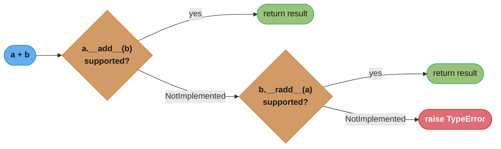
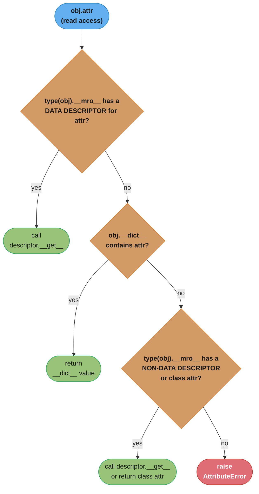
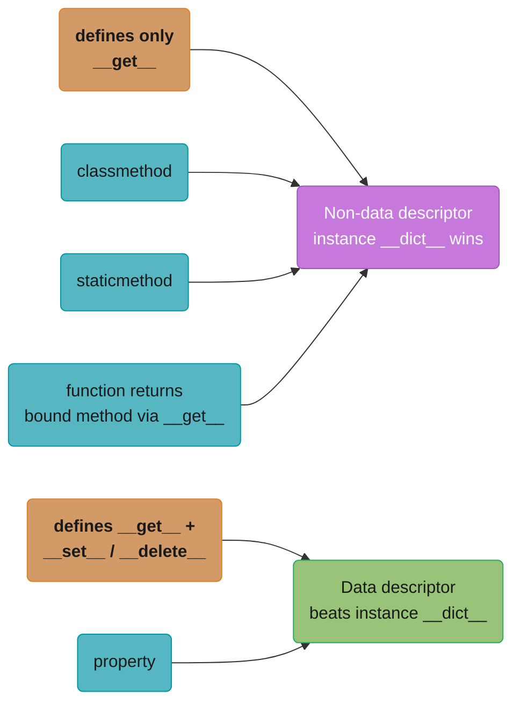
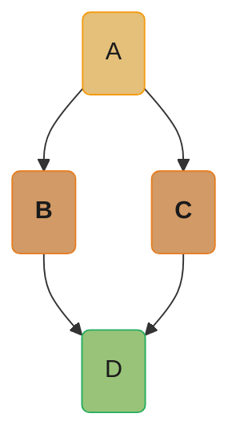
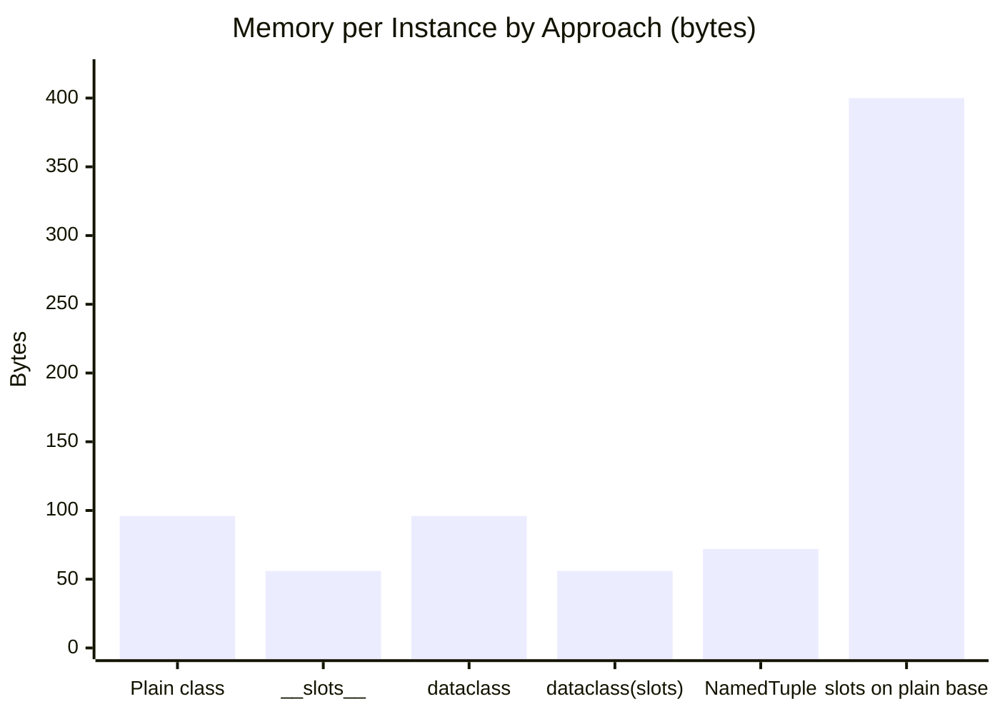

# Data Model & Objects

## 1. Concept Overview

Python's data model is the set of interfaces — defined entirely through special ("dunder") methods — that every object in the language implements to participate in built-in operations. When you write `a + b`, Python calls `a.__add__(b)`. When you write `len(x)`, Python calls `x.__len__()`. When CPython evaluates `for item in collection`, it calls `collection.__iter__()` and repeatedly calls `next()` on the resulting iterator. The data model is the contract between user-defined code and the interpreter itself.

Everything in Python is an object: integers, strings, functions, classes, modules, `None`, `True`, `False`, and even type objects like `int` and `str`. Every object has an identity (`id()`), a type (`type()`), and a value. This uniformity means the same set of protocols applies everywhere — a user-defined class can behave identically to a built-in by implementing the right dunder methods.

This module covers the full data model: dunder methods, the hashing/equality contract, descriptors, `__slots__`, MRO and C3 linearization, attribute lookup order, and operator overloading. These concepts appear in every senior Python interview and underlie all major frameworks (Django ORM, Pydantic, SQLAlchemy, dataclasses).

---

## 2. Intuition

> Python's dunder methods are electrical sockets: the interpreter supplies the plug, and your class supplies the compatible socket — plug in the right shape and built-in operators light up for your type.

**Mental model:** Think of Python as a protocol-based runtime. Every built-in operation (`+`, `in`, `len()`, `with`, `for`) is a method call in disguise. The interpreter looks up a specific attribute name (e.g., `__add__`) on the object's type. If the method exists, it is called; if not, Python either falls back to a reflected method (`__radd__`) or raises `TypeError`. Your class opts into each operation by defining the corresponding dunder method — there is no base-class inheritance required.

**Why it matters:** Understanding the data model explains behavior that otherwise looks like magic. Why does `hash(obj)` raise `TypeError` after you define `__eq__`? Because Python sets `__hash__ = None` automatically. Why does `for x in obj` work even without `__iter__` if `__getitem__` is defined? Because CPython falls back to integer-indexed `__getitem__` calls starting at 0. These rules are specified, not accidental.

**Key insight:** The data model is not a framework sitting on top of Python — it is Python. CPython's C source code calls `PyObject_GetAttr`, `PySequence_GetItem`, and `PyNumber_Add` directly; these C functions look up `__getattr__`, `__getitem__`, and `__add__` on the type object. User code and built-in types are treated identically at this layer.

---

## 3. Core Principles

**Everything is an object.** Functions, classes, and modules are first-class objects with identity, type, and attributes. `type(42)` is `int`, `type(int)` is `type`, and `type(type)` is `type`. This reflexive closure means introspection is uniform.

**Dunder methods are the protocol.** Special methods are always looked up on the *type*, not the instance. `len(x)` calls `type(x).__len__(x)`, not `x.__len__()`. This means you cannot override a dunder on a single instance by setting it as an instance attribute — the interpreter bypasses the instance dictionary for dunder lookups.

**`__repr__` vs `__str__` distinction.** `__repr__` is for developers: it should return an unambiguous, ideally eval-able string. `__str__` is for end-users: it should return a readable string. `str(obj)` calls `__str__` first, then falls back to `__repr__`. `repr(obj)` always calls `__repr__`. In containers (lists, dicts), `repr()` is used for elements — `[Point(1, 2)]` shows `[Point(x=1, y=2)]` not a meaningless address.

**`__eq__` and `__hash__` contract.** If `a == b` then `hash(a) == hash(b)` must hold. Python enforces the first direction: defining `__eq__` without `__hash__` causes Python to set `__hash__ = None`, making instances unhashable. If you define `__eq__`, you must also define `__hash__` (or explicitly set `__hash__ = None` to declare the type mutable/unhashable).

**`__bool__` and truthiness.** Python calls `__bool__` for truthiness tests; if absent, it falls back to `__len__` (truthy if non-zero). If neither is defined, the object is always truthy. Custom containers should define both `__len__` and `__bool__` explicitly when the two might diverge.

**Container protocol.** `__len__`, `__getitem__`, `__setitem__`, `__delitem__`, `__iter__`, and `__contains__` together define the mutable sequence protocol. A class implementing only `__len__` and `__getitem__` qualifies as a read-only sequence; Python's `in` operator falls back to a linear `__getitem__` scan if `__contains__` is absent.

---

## 4. Types / Architectures / Strategies

### 4.1 Numeric Protocol

Implementing arithmetic requires understanding the *reflected* (right-hand) and *in-place* variants:

| Method | Triggered by | Notes |
|--------|-------------|-------|
| `__add__(self, other)` | `self + other` | Return `NotImplemented` if type unsupported |
| `__radd__(self, other)` | `other + self` (when `other.__add__` returns `NotImplemented`) | Enables `3 + MyNumber(2)` |
| `__iadd__(self, other)` | `self += other` | Should mutate and return `self`; fallback is `__add__` |
| `__neg__(self)` | `-self` | Unary |
| `__abs__(self)` | `abs(self)` | Unary |
| `__mul__`, `__rmul__` | `*` operator | Sequence repetition uses `__mul__` |

Binary operator dispatch resolves `a + b` by trying the left operand first and falling back to the right operand's reflected method only when the left side declines:



Both hops returning `NotImplemented` is what turns an unsupported-type addition into `TypeError` at the call site, not inside either dunder method.

Rich comparisons (`__lt__`, `__le__`, `__eq__`, `__ne__`, `__gt__`, `__ge__`) can be synthesized from `__eq__` and one of `__lt__` / `__gt__` using `functools.total_ordering`. The synthesized methods cost roughly 40–50 ns extra per call — a Python-level wrapper that invokes your method and inspects the result for `NotImplemented`. The method you wrote yourself is untouched and runs at full speed; only the four derived ones pay. Define all six explicitly when a sort dominates your profile.

### 4.2 Container Protocol

A minimal immutable sequence needs `__len__` and `__getitem__`. A mutable sequence adds `__setitem__` and `__delitem__`. Subclassing `collections.abc.MutableSequence` provides 12 mixin methods for free after you implement its five abstract methods (`__getitem__`, `__setitem__`, `__delitem__`, `__len__`, `insert`): `append`, `clear`, `reverse`, `extend`, `pop`, `remove`, `__iadd__` from `MutableSequence` itself, plus `__contains__`, `__iter__`, `__reversed__`, `index`, `count` inherited from `Sequence`.

### 4.3 Context Manager Protocol

`__enter__` and `__exit__` define the `with` statement. `__exit__` receives `(exc_type, exc_val, exc_tb)`; returning a truthy value suppresses the exception. `contextlib.contextmanager` wraps a generator into a context manager without needing a class.

### 4.4 Descriptor Protocol

A descriptor is any object whose class defines `__get__`, `__set__`, or `__delete__`. Descriptors live on the *class*, not the instance.

- **Non-data descriptor:** defines only `__get__`. Instance `__dict__` takes precedence over it. Functions are non-data descriptors — this is why instance methods work.
- **Data descriptor:** defines `__get__` and (`__set__` or `__delete__`). Takes precedence over the instance `__dict__`. `property` is a data descriptor.

See `../metaclasses_and_metaprogramming/metaclasses_and_metaprogramming.md` for how descriptors interact with metaclasses during class creation.

### 4.5 `__slots__`

`__slots__` replaces the per-instance attribute store with a C-level array of fixed slots. The saving is real but much smaller than the folklore, because since 3.11 a plain instance does *not* eagerly allocate a `dict` either — its attributes live in an inline values array in the object's preheader, with the key names shared once on the class. Measured on CPython 3.13, 64-bit, for a three-attribute class: **96 bytes per plain instance versus 56 with `__slots__`, a flat 40-byte saving (about 42%)**. For 10 million instances that is ~400 MB. Attribute access speed is a wash — both forms measure around 10 ns, because the specializing adaptive interpreter caches an inline-values load just as effectively as a slot load. Use `__slots__` for memory and for the attribute-typo guard, not for speed.

### 4.6 MRO and C3 Linearization

Python resolves method lookup in multiple inheritance using the C3 linearization algorithm (introduced in Python 2.3). `ClassName.__mro__` exposes the full resolution order as a tuple. `super()` always refers to the next class in the MRO, not the direct parent — enabling cooperative multiple inheritance.

Compare with Java's single-inheritance model in `../../java/core_language/core_language.md`.

### 4.7 `__init_subclass__` [3.6]

`__init_subclass__(cls, **kwargs)` is called on the base class whenever a subclass is defined. It is a lighter-weight alternative to metaclasses for class registration, validation, or injection of behavior at subclass creation time.

---

## 5. Architecture Diagrams

### Attribute Lookup Order

The interpreter walks a fixed four-step order for every `obj.attr` read, checking data descriptors before the instance `__dict__` and non-data descriptors after it:



### Descriptor Types

Defining `__set__` or `__delete__` alongside `__get__` upgrades a descriptor from non-data (shadowed by the instance `__dict__`) to data (always wins) — this is why `property` overrides instance assignment but a plain `function` does not:



### MRO Diamond Example

`D(B, C)` diamond-inherits from `A` through both `B` and `C`; C3 linearization collapses this into the single deterministic order `D -> B -> C -> A -> object` traced below:



```
class A: pass
class B(A): pass
class C(A): pass
class D(B, C): pass

D.__mro__ = (D, B, C, A, object)

C3 merge step-by-step:
  L(D) = D + merge(L(B), L(C), [B, C])
  L(B) = [B, A, object]
  L(C) = [C, A, object]
  
  Step 1: head=B, not in tail of any list -> take B
          remaining: [A, object], [C, A, object], [C]
  Step 2: head=A, A is in tail of [C, A, object] -> skip; try C
          head=C, not in tail of any list -> take C
          remaining: [A, object], [A, object], []
  Step 3: head=A -> take A
  Step 4: head=object -> take object
  Result: D, B, C, A, object
```

**The idea behind it.** "Take the class at the front of the first list you can — but only if it does not appear *behind* the front of some other list, because that would mean you are about to visit a subclass's parent before the subclass."

Everything C3 does follows from one rule: a class may never be linearized before something that inherits from it. The "is it in a tail?" test is just how that rule is checked.

| Symbol | What it is |
|--------|------------|
| `L(X)` | The linearization of class `X` — its full MRO, as a list |
| `merge(...)` | The C3 combining step, run over the parents' MROs plus the parent list itself |
| head | The first element of a candidate list |
| tail | Everything *after* the head — appearing here means "something still depends on me" |
| `[B, C]` | The literal base-class list from `class D(B, C)`; it forces left-to-right order |

**Walk one example.** The same merge as above, with the tail test made explicit at each step:

```
  merge( [B, A, object] , [C, A, object] , [B, C] )

  step  candidate  in the tail of any list?              action
   1        B      no  (B is head of list 1 and list 3)  take B
   2        A      YES (A is in tail of [C, A, object])  reject, try next head
   2'       C      no  (C is head of list 2, and is      take C
                        now head of the remainder of 3)
   3        A      no  (both remaining lists are         take A
                        [A, object])
   4     object    no                                    take object

  Result: D, B, C, A, object
```

**Why step 2's rejection is the whole algorithm.** Taking `A` there would place it before
`C` — but `C` is a subclass of `A`, so a call to `super().method()` inside `D` would reach
`A.method` and never run `C.method` at all. The tail test catches exactly that. This is the
mechanism behind the cooperative chain shown in Section 6.5: `super()` in `B.who` resolves
to `C`, not to `B`'s literal parent `A`, because C3 guaranteed `C` sits between them.

When no candidate survives the tail test, there is no ordering that respects every subclass
relationship, and Python raises `TypeError: Cannot create a consistent method resolution
order (MRO)` at class-definition time rather than picking an arbitrary order at call time.

---

## 6. How It Works — Detailed Mechanics

### 6.1 Attribute Lookup — Full Walk-Through

```python
from __future__ import annotations
import sys


class Validator:
    """Data descriptor: validates that a value is a positive int."""

    def __set_name__(self, owner: type, name: str) -> None:
        self._name = name

    def __get__(self, obj: object | None, objtype: type | None = None) -> int | None:
        if obj is None:
            return self  # type: ignore[return-value]
        return obj.__dict__.get(self._name)

    def __set__(self, obj: object, value: int) -> None:
        if not isinstance(value, int) or value <= 0:
            raise ValueError(f"{self._name} must be a positive int, got {value!r}")
        obj.__dict__[self._name] = value


class Rectangle:
    width = Validator()
    height = Validator()

    def __init__(self, width: int, height: int) -> None:
        self.width = width    # calls Validator.__set__
        self.height = height

    @property
    def area(self) -> int:
        return self.width * self.height  # calls Validator.__get__ twice


r = Rectangle(3, 4)
print(r.area)          # 12
print(r.__dict__)      # {'width': 3, 'height': 4}
# Rectangle.__dict__['width'] is the Validator instance (data descriptor)
# It takes priority over r.__dict__['width'] only during __get__,
# but Validator.__get__ reads from obj.__dict__ itself, so values live there.
```

### 6.2 `property` as a Data Descriptor

```python
# property is implemented in C; the Python-equivalent is:
class property_equivalent:
    def __init__(self, fget=None, fset=None, fdel=None, doc=None):
        self.fget = fget
        self.fset = fset
        self.fdel = fdel
        self.__doc__ = doc or (fget.__doc__ if fget else None)

    def __get__(self, obj, objtype=None):
        if obj is None:
            return self
        if self.fget is None:
            raise AttributeError("unreadable attribute")
        return self.fget(obj)

    def __set__(self, obj, value):
        if self.fset is None:
            raise AttributeError("can't set attribute")
        self.fset(obj, value)

    def __delete__(self, obj):
        if self.fdel is None:
            raise AttributeError("can't delete attribute")
        self.fdel(obj)

    def setter(self, fset):
        return type(self)(self.fget, fset, self.fdel, self.__doc__)

    def deleter(self, fdel):
        return type(self)(self.fget, self.fset, fdel, self.__doc__)


class Circle:
    def __init__(self, radius: float) -> None:
        self._radius = radius

    @property  # equivalent to: radius = property(lambda self: self._radius)
    def radius(self) -> float:
        return self._radius

    @radius.setter
    def radius(self, value: float) -> None:
        if value < 0:
            raise ValueError(f"radius must be >= 0, got {value}")
        self._radius = value
```

### 6.3 `__slots__` — Memory Deep Dive

```python
import gc
import sys
import tracemalloc


class PointDict:
    """Standard class: attributes in the inline values array, no __dict__ object."""
    def __init__(self, x: float, y: float, z: float) -> None:
        self.x = x
        self.y = y
        self.z = z


class PointSlots:
    """Slots class: no __dict__, C-level array."""
    __slots__ = ("x", "y", "z")

    def __init__(self, x: float, y: float, z: float) -> None:
        self.x = x
        self.y = y
        self.z = z


pd = PointDict(1.0, 2.0, 3.0)
ps = PointSlots(1.0, 2.0, 3.0)

# DO NOT measure this with sys.getsizeof — see the trap below.
print(sys.getsizeof(pd))         # 48  — WRONG as a total: excludes the inline values
print(sys.getsizeof(ps))         # 56  — correct: header + 3 slot pointers

# Measure the real per-instance cost in bulk instead:
def per_instance(cls, n=200_000):
    gc.collect()
    tracemalloc.start()
    before = tracemalloc.get_traced_memory()[0]
    objs = [cls(1.0, 2.0, 3.0) for _ in range(n)]
    after = tracemalloc.get_traced_memory()[0]
    tracemalloc.stop()
    return (after - before - sys.getsizeof(objs)) / n

print(per_instance(PointDict))    # 96.0 bytes
print(per_instance(PointSlots))   # 56.0 bytes  -> 40 bytes saved, ~42%

# No __dict__ exists at all on the slots class:
print(hasattr(ps, "__dict__"))   # False

# Verifying no __dict__:
try:
    ps.extra = "new attr"  # raises AttributeError
except AttributeError as e:
    print(e)  # 'PointSlots' object has no attribute 'extra'
```

**The measurement trap.** `sys.getsizeof(pd.__dict__)` looks like the obvious way to price a
plain instance, and it is wrong twice over. Since 3.11 a plain instance stores its attributes
in an inline values array in the object's preheader and has no `dict` object at all; asking
for `pd.__dict__` **materialises one on the spot**, adding 64 bytes to that instance
permanently — the measurement creates what it claims to measure. And the number it reports
(296 bytes) counts the *shared* key table that every instance of the class uses once, so it
double-counts across instances. Both effects push the answer in the same direction, which is
how the folklore figure of "232 bytes per instance" survived.

**What `__slots__` actually says.** "The attribute names are already known at
class-definition time, so store the values in a fixed array and look them up by offset — and
never let a `dict` appear for this object at all."

| Symbol | What it is |
|--------|------------|
| object header | `ob_refcnt` + `ob_type` + GC bookkeeping — 48 bytes, paid either way |
| inline values | The preheader array a plain instance uses instead of a `dict`; keys shared on the class |
| slot | One 8-byte pointer in a C array, indexed by position instead of hashed by name |
| 96 bytes | Plain-class layout, measured in bulk: header plus inline values |
| 56 bytes | Slots layout: 32-byte object base plus 3 x 8-byte slot pointers |

**Walk one example.** The three-attribute class above, at increasing instance counts:

```
                          per instance      1,000,000        10,000,000        50,000,000
    PointDict (plain)         96 bytes         96 MB            960 MB          4,800 MB
    PointSlots (__slots__)    56 bytes         56 MB            560 MB          2,800 MB
    ------------------------------------------------------------------------------------
    saved                     40 bytes         40 MB            400 MB          2,000 MB
    reduction                  41.7%           41.7%             41.7%             41.7%
```

The percentage is flat because the saving is strictly per-instance — this is a scaling
constant, not an optimization that kicks in at some threshold. Doubling the object count
doubles the saving exactly. It is also close to constant in the *attribute count*: measured
at 1, 3 and 8 attributes the saving is 40, 40 and 48 bytes. What `__slots__` removes is the
inline values array's own overhead, not a per-attribute cost.

**Why the win shrank.** Before 3.11 every plain instance really did carry its own hash table,
and `__slots__` deleted it — hence the folklore. The key-sharing and inline-values work took
most of that win into the default path, so today `__slots__` is buying you the last 40 bytes
and a guarantee (no surprise attributes, no `__dict__` for anyone to write to). It is *not*
buying speed: measured attribute reads are ~10 ns either way, because the specializing
adaptive interpreter emits an inline cache for the plain-instance load too.

The corresponding failure mode is Section 6.4 — inherit from any class that lacks
`__slots__` and every instance gets a `__dict__` back, dropping the saving to exactly zero
while the `__slots__` declaration still restricts which attributes you can set. You keep the
constraint and lose the benefit.

### 6.4 `__slots__` Inheritance Footgun

```python
class Base:
    """No __slots__ — has __dict__."""
    def __init__(self) -> None:
        self.base_attr = 1


class Child(Base):
    __slots__ = ("child_attr",)  # FOOTGUN: Base still has __dict__

    def __init__(self) -> None:
        super().__init__()
        self.child_attr = 2


class PlainEquivalent:
    """Same two attributes, no __slots__ anywhere."""
    def __init__(self) -> None:
        self.base_attr = 1
        self.child_attr = 2


class BothSlots:
    __slots__ = ("base_attr", "child_attr")
    def __init__(self) -> None:
        self.base_attr = 1
        self.child_attr = 2


c = Child()
print(hasattr(c, "__dict__"))       # True — inherited from Base

print(per_instance(Child))          # 400.0 bytes
print(per_instance(PlainEquivalent))#  88.0 bytes
print(per_instance(BothSlots))      #  48.0 bytes
```

This is worse than "no saving": it is a **4.5x regression**. A class that declares
`__slots__` opts out of the shared-keys / inline-values layout, but its non-slots ancestor
still forces a `__dict__` — so every instance now pays for a full standalone hash table
*plus* the slot array, where a plain class would have used the cheap inline path. You keep
the constraint (no dynamic attributes on the slotted names), pay 4.5x the memory of doing
nothing, and get a `__dict__` anyway. `__slots__` only pays when **every** class in the MRO
declares it.

One precision worth keeping, because it decides whether you see 400 bytes or 56: the
inherited `__dict__` is allocated **lazily**, on first assignment to a name that is not a
slot. `Child` above pays the full 400 because `Base.__init__` sets `base_attr`, which is not
in `Child.__slots__`. A subclass that never touches a non-slot name measures ~56 bytes —
still worse than the 48 of a fully-slotted MRO, but better than the plain class's 88. The
footgun is real and the default case hits it, since the whole point of inheriting is to use
the parent's attributes; just do not expect the 4.5x to show up in a micro-example that only
ever assigns slots.

### 6.5 MRO C3 — Verifying the Algorithm

```python
class A:
    def who(self) -> str:
        return "A"

class B(A):
    def who(self) -> str:
        return f"B -> {super().who()}"

class C(A):
    def who(self) -> str:
        return f"C -> {super().who()}"

class D(B, C):
    def who(self) -> str:
        return f"D -> {super().who()}"


print(D.__mro__)
# (<class '__main__.D'>, <class '__main__.B'>, <class '__main__.C'>,
#  <class '__main__.A'>, <class 'object'>)

d = D()
print(d.who())
# D -> B -> C -> A
# super() in B resolves to C (next in MRO), not A
# This cooperative chain requires every class to call super()
```

### 6.6 `__eq__` and `__hash__` Contract

```python
from dataclasses import dataclass


# BROKEN: overriding __eq__ without __hash__
class BrokenPoint:
    def __init__(self, x: int, y: int) -> None:
        self.x = x
        self.y = y

    def __eq__(self, other: object) -> bool:
        if not isinstance(other, BrokenPoint):
            return NotImplemented
        return self.x == other.x and self.y == other.y
    # Python automatically sets __hash__ = None here


bp = BrokenPoint(1, 2)
try:
    hash(bp)  # TypeError: unhashable type: 'BrokenPoint'
except TypeError as e:
    print(e)

# FIX: define __hash__ consistent with __eq__
class GoodPoint:
    def __init__(self, x: int, y: int) -> None:
        self.x = x
        self.y = y

    def __eq__(self, other: object) -> bool:
        if not isinstance(other, GoodPoint):
            return NotImplemented
        return self.x == other.x and self.y == other.y

    def __hash__(self) -> int:
        return hash((self.x, self.y))  # hash of a tuple is stable


gp = GoodPoint(1, 2)
print(hash(gp))  # e.g., 3713082716806266542
s = {gp, GoodPoint(1, 2)}
print(len(s))    # 1 — correctly deduplicated
```

### 6.7 Operator Overloading with `__add__` and `__radd__`

```python
from __future__ import annotations
from functools import total_ordering


@total_ordering
class Vector2D:
    __slots__ = ("x", "y")

    def __init__(self, x: float, y: float) -> None:
        self.x = x
        self.y = y

    def __repr__(self) -> str:
        return f"Vector2D(x={self.x}, y={self.y})"

    def __add__(self, other: object) -> Vector2D:
        if isinstance(other, Vector2D):
            return Vector2D(self.x + other.x, self.y + other.y)
        return NotImplemented  # triggers __radd__ on other

    def __radd__(self, other: object) -> Vector2D:
        # Enables: 0 + v (useful for sum([v1, v2, v3], start=0))
        if other == 0:
            return self
        return NotImplemented

    def __iadd__(self, other: object) -> Vector2D:
        if isinstance(other, Vector2D):
            self.x += other.x
            self.y += other.y
            return self
        return NotImplemented

    def __mul__(self, scalar: float) -> Vector2D:
        return Vector2D(self.x * scalar, self.y * scalar)

    def __rmul__(self, scalar: float) -> Vector2D:
        return self.__mul__(scalar)

    def __abs__(self) -> float:
        return (self.x ** 2 + self.y ** 2) ** 0.5

    def __bool__(self) -> bool:
        return bool(self.x or self.y)

    def __eq__(self, other: object) -> bool:
        if isinstance(other, Vector2D):
            return self.x == other.x and self.y == other.y
        return NotImplemented

    def __lt__(self, other: object) -> bool:
        if isinstance(other, Vector2D):
            return abs(self) < abs(other)
        return NotImplemented

    def __hash__(self) -> int:
        return hash((self.x, self.y))


v1 = Vector2D(1.0, 2.0)
v2 = Vector2D(3.0, 4.0)
print(v1 + v2)          # Vector2D(x=4.0, y=6.0)
print(3 * v1)           # Vector2D(x=3.0, y=6.0)
print(sum([v1, v2]))    # Vector2D(x=4.0, y=6.0)  -- uses __radd__
print(v1 < v2)          # True (|v1|=2.24, |v2|=5.0)
print(sorted([v2, v1])) # [Vector2D(x=1.0, y=2.0), Vector2D(x=3.0, y=4.0)]
```

### 6.8 `__init_subclass__` for Class Registration [3.6]

```python
from __future__ import annotations


class PluginBase:
    _registry: dict[str, type[PluginBase]] = {}

    def __init_subclass__(cls, name: str = "", **kwargs: object) -> None:
        super().__init_subclass__(**kwargs)
        if name:
            PluginBase._registry[name] = cls


class JsonPlugin(PluginBase, name="json"):
    def process(self) -> str:
        return "processing json"


class CsvPlugin(PluginBase, name="csv"):
    def process(self) -> str:
        return "processing csv"


print(PluginBase._registry)
# {'json': <class 'JsonPlugin'>, 'csv': <class 'CsvPlugin'>}

plugin = PluginBase._registry["json"]()
print(plugin.process())  # processing json
```

---

## 7. Real-World Examples

**Django ORM models** put a `DeferredAttribute` on the class for every concrete field — `Field.contribute_to_class` does `setattr(cls, self.attname, self.descriptor_class(self))`. `DeferredAttribute` defines only `__get__`, so it is a **non-data descriptor**, and that is exactly the design: `instance.name = "Alice"` writes straight into `instance.__dict__` with no descriptor call at all, and the descriptor only fires on *reads that miss the instance dict* — a deferred column, where it issues `refresh_from_db`. `Model.__eq__` compares primary keys (returning `NotImplemented` for non-`Model` operands, and falling back to identity when the pk is `None`), and `Model.__hash__` hashes the pk, raising `TypeError` outright if the instance has no pk set.

**Pydantic v2** does *not* make fields descriptors. Field values live in the model's `__dict__` (declared in `BaseModel.__slots__` alongside `__pydantic_fields_set__`, `__pydantic_extra__` and `__pydantic_private__`), assignment goes through a hand-written `BaseModel.__setattr__` that memoises a per-field handler, and validation is executed by a `SchemaValidator` from the Rust `pydantic-core` extension. `ModelMetaclass` itself is ordinary Python, subclassing `ABCMeta`; it forwards `__set_name__` to any *user-supplied* default that implements it, which is the only place the descriptor protocol appears.

**dataclasses** [3.7] generate `__init__`, `__repr__`, `__eq__`, and optionally `__hash__`, `__lt__`, and `__slots__` [3.10] based on field annotations. The `frozen=True` option generates `__setattr__` and `__delattr__` that raise `FrozenInstanceError`, making instances hashable without explicit `__hash__`.

**`functools.lru_cache`** relies on arguments being hashable (via `__hash__`). Passing unhashable arguments (lists, dicts) raises `TypeError` at call time, not at decoration time.

**NamedTuple** sets `__slots__ = ()` and generates `__repr__`, `__getnewargs__` and the field-name properties, inheriting `__eq__` and `__hash__` from `tuple`. A three-field named tuple measures 72 bytes per instance against 96 for the equivalent plain class — 25% smaller — but 56-byte `__slots__` classes beat it, because a tuple stores an `ob_size` and pays 16-byte allocation granularity.

**SQLAlchemy** installs an `InstrumentedAttribute` on the mapped class for each mapped column. It defines `__get__`, `__set__` **and** `__delete__`, so it is a **data descriptor** and always wins over the instance dict — which is what lets the ORM record every attribute write in the unit of work. Reading `User.name` (class access, `instance is None`) returns the `InstrumentedAttribute` itself so it can be used as a SQL expression; reading `user_instance.name` returns the tracked scalar and can trigger a lazy load.

---

## 8. Tradeoffs

Measured in bulk on CPython 3.13, 64-bit, for a three-attribute class:

| Approach | Memory per instance | Attribute access | Dynamic attrs | Inheritance complexity |
|----------|-------------------|-----------------|--------------|----------------------|
| Plain class (inline values) | 96 bytes | ~10 ns | Yes | Simple |
| `__slots__` | 56 bytes | ~10 ns | No (by default) | Must propagate slots up MRO |
| `dataclass` (plain) | 96 bytes | ~10 ns | Yes | Simple |
| `dataclass(slots=True)` [3.10] | 56 bytes | ~10 ns | No | Same as manual slots |
| `NamedTuple` | 72 bytes | ~10 ns | No | Limited; tuple semantics |
| `__slots__` under a non-slots base | 400 bytes | ~10 ns | Yes | The footgun — see Section 6.4 |

`__slots__` and `dataclass(slots=True)` cut per-instance memory by about 42% — the same 96-to-56-byte drop from the Section 6.3 deep dive, repeated here across every idiom. Attribute-read latency is flat across all of them; the specializing adaptive interpreter caches an inline-values load as cheaply as a slot load, so `__slots__` is a memory decision, not a speed one.



**Put simply.** "Four of these idioms are the same two layouts wearing different syntax — and the sixth is the one that makes things worse."

Read the column as clusters, not rows. `dataclass` is a code generator, not a memory strategy; what decides the number is whether `__slots__` ended up on the class — and whether every ancestor has it too.

| Symbol | What it is |
|--------|------------|
| 96 bytes | The inline-values cluster: plain class and plain `dataclass` are byte-identical |
| 56 bytes | The `__slots__` cluster: manual `__slots__` and `dataclass(slots=True)`, identical |
| 72 bytes | `NamedTuple` — a C tuple, values inline, but it pays `ob_size` and 16-byte granularity |
| 400 bytes | `__slots__` on a non-slots base: a real `dict` *and* the slot array, worst of both |
| ~10 ns | Attribute read, identical for every layout above, thanks to the inline caches |

**Walk one example.** Turn the per-instance gap into the only question that matters in review — *at what scale is this worth arguing about?*

```
  saving = 96 - 56 = 40 bytes per instance

    instances     memory saved      is it worth a code review?
        1,000          40 KB        no  -- noise
      100,000           4 MB        no
    1,000,000          40 MB        marginal
   25,000,000       1,000 MB        yes -- exactly 1 GB saved
   50,000,000       2,000 MB        yes -- decides the instance type

  Latency side: there is none. Measured attribute reads are ~10 ns for
  every layout in the table, so there is no time to trade against.
```

So the break-even has moved out to tens of millions of instances: below that, `__slots__`
buys a rounding error and costs you dynamic attributes; above it, it is the difference
between fitting in a memory tier and not. That threshold, not a style preference, is what
Section 9's "constructing millions of small instances" is pointing at — and it is why the
honest answer to "should I use `__slots__`?" is always "how many instances, and does the
whole MRO have it?" before anything else.

Measured on the same machine, per access:

| Feature | `property` | Custom descriptor | `__getattr__` |
|---------|-----------|-------------------|--------------|
| Per-attribute logic | Yes | Yes | Fallback only |
| Reusable across classes | No (inline) | Yes (descriptor class) | No |
| Works with `__slots__` | Yes | Yes | Yes |
| Performance | ~16 ns per access | ~34 ns per access | Only on miss |

`property` is faster than a hand-written descriptor because it is implemented in C and the
adaptive interpreter specialises `LOAD_ATTR` for it; a Python-level `__get__` costs a real
Python call. Both are far cheaper than the "~150 ns" folklore, and neither is a reason to
avoid encapsulation.

---

## 9. When to Use / When NOT to Use

**Use `__slots__` when:**
- Constructing millions of small instances (scientific computing, game entities, financial tick data).
- Memory budget is a hard constraint (embedded systems, large in-memory datasets).
- Attribute set is fixed and known at design time.
- All classes in the inheritance chain also define `__slots__`.

**Do NOT use `__slots__` when:**
- Objects need dynamic attribute addition (plugin systems, monkeypatching, `unittest.mock.patch.object` on an instance).
- You inherit from a class without `__slots__` — memory use goes *up* about 4.5x, not to zero saving.
- The attribute set varies per instance.
- You are reaching for it to make attribute access faster. It does not; see Section 8.

**Use custom descriptors when:**
- The same validation/transform logic applies to multiple attributes across multiple classes (reuse).
- You need access to the attribute name at binding time (`__set_name__`).
- You need to distinguish class-level access from instance-level access (`obj is None` in `__get__`).

**Use `property` when:**
- Single-class, single-attribute computed or validated access.
- Code is simpler than a full descriptor class.

**Use `total_ordering` when:**
- Defining all six comparison methods is redundant; correctness matters more than the ~40–50 ns extra per call on the four synthesized methods.
- **Do NOT use** when a sort over millions of objects dominates your profile — define all six directly, or sort with a `key=` function so only `<` on the key is called.

**Use `__init_subclass__` when:**
- You need class registration or validation without a metaclass.
- The hook is straightforward (no need to control `type.__new__` arguments).

---

## 10. Common Pitfalls

### Pitfall 1: Mutable Default in `__init__`

```python
# BROKEN: default list is created once at class definition time
class BadContainer:
    def __init__(self, items: list = []) -> None:  # shared across ALL instances
        self.items = items

a = BadContainer()
b = BadContainer()
a.items.append(1)
print(b.items)  # [1] — b is affected; same list object

# FIX: use None sentinel and create a fresh list per call
class GoodContainer:
    def __init__(self, items: list | None = None) -> None:
        self.items = items if items is not None else []

a = GoodContainer()
b = GoodContainer()
a.items.append(1)
print(b.items)  # [] — independent
```

### Pitfall 2: Forgetting `__hash__` When Overriding `__eq__`

```python
# BROKEN: object becomes unhashable silently
class BrokenKey:
    def __init__(self, value: int) -> None:
        self.value = value

    def __eq__(self, other: object) -> bool:
        return isinstance(other, BrokenKey) and self.value == other.value
    # Python sets __hash__ = None automatically

k = BrokenKey(1)
d = {}
try:
    d[k] = "found"  # TypeError: unhashable type: 'BrokenKey'
except TypeError as e:
    print(e)

# FIX: define __hash__ consistent with __eq__
class FixedKey:
    def __init__(self, value: int) -> None:
        self.value = value

    def __eq__(self, other: object) -> bool:
        return isinstance(other, FixedKey) and self.value == other.value

    def __hash__(self) -> int:
        return hash(self.value)

k = FixedKey(1)
d = {k: "found"}
print(d[FixedKey(1)])  # found — equality-based lookup works
```

### Pitfall 3: `__slots__` in Subclass of Non-Slots Base

```python
# BROKEN: not merely zero saving — a 4.5x memory REGRESSION vs doing nothing,
# because the class loses the inline-values fast path AND still gets a __dict__.
# Note x is set on the INSTANCE: it is not in __slots__, so it lands in the
# inherited __dict__, which is what actually allocates the hash table.
class BaseNoSlots:
    def __init__(self) -> None:
        self.x = 0

class ChildWithSlots(BaseNoSlots):
    __slots__ = ("y",)

    def __init__(self) -> None:
        super().__init__()
        self.y = 1

obj = ChildWithSlots()
print(hasattr(obj, "__dict__"))  # True — inherited from BaseNoSlots
# measured in bulk: ~400 bytes/instance, vs ~88 for a plain two-attribute class

# FIX: give Base __slots__ too
class BaseWithSlots:
    __slots__ = ("x",)

class ChildFullSlots(BaseWithSlots):
    __slots__ = ("y",)

obj2 = ChildFullSlots()
print(hasattr(obj2, "__dict__"))  # False — no __dict__ at all
# measured in bulk: ~48 bytes/instance
```

### Pitfall 4: `__repr__` Returning Non-String

```python
# BROKEN: returns int instead of str; TypeError at repr() call time, not definition time
class BadRepr:
    def __repr__(self) -> int:  # type: ignore[override]  -- mypy catches this
        return 42  # type: ignore[return-value]

obj = BadRepr()
try:
    print(repr(obj))  # TypeError: __repr__ returned non-string (type int)
except TypeError as e:
    print(e)

# FIX: always return str
class GoodRepr:
    def __repr__(self) -> str:
        return f"GoodRepr()"

print(repr(GoodRepr()))  # GoodRepr()
```

### Pitfall 5: `super()` Skipping Classes in Diamond Inheritance

```python
# BROKEN: calling parent directly bypasses cooperative MRO
class A:
    def setup(self) -> None:
        print("A.setup")

class B(A):
    def setup(self) -> None:
        A.setup(self)   # BROKEN: hardcodes A; if MRO changes, C.setup is skipped
        print("B.setup")

class C(A):
    def setup(self) -> None:
        A.setup(self)   # BROKEN: same
        print("C.setup")

class D(B, C):
    def setup(self) -> None:
        B.setup(self)   # BROKEN: calls A.setup twice; C.setup never called
        print("D.setup")

# FIX: use super() throughout — each class calls the next in MRO
class A2:
    def setup(self) -> None:
        print("A2.setup")

class B2(A2):
    def setup(self) -> None:
        super().setup()  # calls C2.setup (next in D2.__mro__)
        print("B2.setup")

class C2(A2):
    def setup(self) -> None:
        super().setup()  # calls A2.setup
        print("C2.setup")

class D2(B2, C2):
    def setup(self) -> None:
        super().setup()  # calls B2.setup
        print("D2.setup")

D2().setup()
# A2.setup
# C2.setup
# B2.setup
# D2.setup
```

---

## 11. Technologies & Tools

| Tool / Library | Purpose | Relevant Data Model Feature |
|----------------|---------|---------------------------|
| `dataclasses` [3.7] | Auto-generate `__init__`, `__repr__`, `__eq__`, `__hash__`, `__slots__` [3.10] | All core dunders |
| `attrs` | Richer than dataclasses; validators, converters, slots | `__slots__`, `__eq__`, `__hash__` |
| `pydantic` v2 | Runtime type validation via descriptors + Rust core | Descriptor protocol, `__get__`, `__set__` |
| `functools.total_ordering` | Synthesize comparison methods from `__eq__` + one of `__lt__`/`__gt__` | Rich comparisons |
| `abc.ABCMeta` + `collections.abc` | Register virtual subclasses; mixin methods for container protocol | `__subclasshook__`, container dunders |
| `typing.Protocol` [3.8] | Structural subtyping; static duck-typing for data model interfaces | MRO-independent protocol |
| `sys.getsizeof` | Measure per-instance memory | `__slots__` profiling |
| `pympler` / `tracemalloc` | Deep memory profiling including referenced objects | Memory optimization |
| `mypy` / `pyright` | Type-check `__dunder__` return types, descriptor `__get__` overloads | `__repr__: str`, `__eq__: bool` |

---

## 12. Interview Questions with Answers

**Q1: What is a data descriptor versus a non-data descriptor, and why does the distinction matter for attribute lookup?**
**Short:** Data descriptors (with `__set__`/`__delete__`) override instance `__dict__`; non-data ones don't.
A data descriptor defines both `__get__` and at least one of `__set__` or `__delete__`; a non-data descriptor defines only `__get__`. Data descriptors take priority over the instance `__dict__`, while non-data descriptors are shadowed by it. This distinction is why `property` (a data descriptor) prevents instance dictionary bypass but plain functions (non-data descriptors) can be overridden per-instance.

**Q2: What happens to `__hash__` when you define `__eq__` on a class?**
**Short:** Defining `__eq__` without `__hash__` sets `__hash__` to `None`, making instances unhashable.
Python automatically sets `__hash__ = None` on the class, making instances unhashable. This enforces the contract that equal objects must have equal hashes. To keep instances hashable, you must explicitly define `__hash__` returning a value consistent with `__eq__`, typically `hash(tuple_of_fields_used_in_eq)`.

**Q3: Why does `__repr__` use `repr()` on contained objects, but `__str__` uses `str()`?**
**Short:** `__repr__` targets developers and is unambiguous; `__str__` targets end users and can omit detail.
`__repr__` is for developer-facing output and should be unambiguous; when a container like `list` renders its elements, it calls `repr()` on each to get the unambiguous form. `__str__` is for end-user display and may omit type information. Implement `__repr__` on every class; `__str__` is optional and falls back to `__repr__` if absent.

**Q4: Explain how `super()` works in Python's MRO and why you must use it in cooperative multiple inheritance.**
**Short:** `super()` delegates to the next class in the instance's MRO, not necessarily the direct parent.
`super()` returns a proxy that delegates method calls to the *next* class in the current instance's MRO, not necessarily the direct parent. In a diamond hierarchy `D(B, C)` with MRO `D → B → C → A`, `super()` in `B.method` calls `C.method`, not `A.method`. If `B` calls `A.method()` directly, `C.method` is skipped entirely. Every class must call `super()` to guarantee cooperative chaining where each class in the MRO runs exactly once.

**Q5: How does `__slots__` reduce memory, and when does it fail to save memory?**
**Short:** `__slots__` saves about 40 bytes per instance by replacing the values array with fixed slots.
`__slots__` stores attributes in a fixed C-level array of slot pointers instead of the inline values array a plain instance uses, saving a flat ~40 bytes per instance. That is 96 bytes down to 56 for a three-attribute class on CPython 3.13, 64-bit. The win is much smaller than the pre-3.11 folklore because plain instances no longer eagerly allocate a `dict` either: their attributes live in a preheader values array with the key names shared once on the class. It does not merely fail when an ancestor lacks `__slots__` — it backfires, because the class loses the shared-keys fast path and still inherits a real `__dict__`, measuring around 400 bytes per instance against 88 for the plain equivalent. Practical guidance: put `__slots__` on every class in the MRO or on none, and measure in bulk with `tracemalloc`, never with `sys.getsizeof(obj.__dict__)`.

**Q: Q5b: Why is `sys.getsizeof(obj.__dict__)` the wrong way to measure an instance?**
**Short:** `sys.getsizeof(obj.__dict__)` is wrong because reading `__dict__` creates the object it measures.
It creates the very object it claims to measure. Since 3.11 a plain instance keeps its attributes in an inline values array and has no `dict`; reading `obj.__dict__` materialises one, adding about 64 bytes to that instance for good. The number it then reports also includes the shared key table that every instance of the class uses jointly, so it double-counts across the population. Practical guidance: allocate N instances, diff `tracemalloc.get_traced_memory()` around the loop, subtract the holding list, and divide by N.

**Q6: What is the attribute lookup order in Python?**
**Short:** Attribute lookup checks data descriptors, then instance `__dict__`, then class attributes, in order.
For `obj.attr`: (1) check if `type(obj).__mro__` contains a data descriptor named `attr`; if yes, call its `__get__`. (2) Check `obj.__dict__` for `attr`; if found, return it. (3) Check `type(obj).__mro__` for a non-data descriptor or plain class attribute named `attr`; if found, call `__get__` or return the value. (4) Raise `AttributeError`. This four-step order is fixed and implemented in `object.__getattribute__`.

**Q7: What does returning `NotImplemented` from `__add__` do, and how is it different from raising `NotImplementedError`?**
**Short:** Returning `NotImplemented` lets Python try the reflected method; raising `NotImplementedError` aborts.
Returning `NotImplemented` (a singleton, not an exception) tells Python that the current type cannot handle the operand, so Python should try the reflected method (`__radd__`) on the right-hand operand. Raising `NotImplementedError` is an unrecoverable exception that immediately propagates. Always return `NotImplemented` from numeric dunders for unsupported types; never raise `NotImplementedError`.

**Q8: How does `__bool__` interact with `__len__` for truthiness testing?**
**Short:** Truthiness checks `__bool__` first, then `__len__` (0 is falsy), else the object is always truthy.
Python calls `__bool__` first; if absent, it calls `__len__` and treats 0 as falsy and non-zero as truthy; if neither is defined, the object is always truthy. A common bug is defining `__len__` on a container without `__bool__`, then seeing empty containers evaluate as falsy — usually correct, but if `__bool__` has different semantics (e.g., a matrix is never "empty"), you must define it explicitly.

**Q9: Explain the `__set_name__` hook on descriptors.**
**Short:** `__set_name__` lets a descriptor learn its own attribute name automatically at class creation.
`__set_name__(self, owner, name)` [3.6] is called by `type.__new__` on each descriptor found in the class body, passing the class being created (`owner`) and the attribute name the descriptor is assigned to (`name`). This allows a descriptor to self-configure with its attribute name without requiring the programmer to pass it explicitly, eliminating the repetition of `width = Validator("width")`.

**Q10: What is `total_ordering` and what is its performance cost?**
**Short:** `functools.total_ordering` synthesizes comparisons but costs roughly 40-50ns more per call.
`functools.total_ordering` is a class decorator that fills in missing rich comparison methods from `__eq__` and one ordering method. Each synthesized method costs roughly 40–50 ns extra per call — measured, a `<=` on a `total_ordering` class runs in about 80 ns against 33 ns hand-written — because it is a Python-level wrapper that calls your method and inspects the result for `NotImplemented`. The method you defined yourself is untouched and runs at full speed. For a sort over millions of objects, define all six explicitly, or pass `key=` to `sorted` so only the key's `<` is ever called.

**Q11: How are functions non-data descriptors, and how does this enable bound methods?**
**Short:** Functions are non-data descriptors whose `__get__` produces the bound method on instance access.
A function object's class defines `__get__` but not `__set__` or `__delete__`. When you access `instance.method`, Python calls `function.__get__(instance, type(instance))`, which returns a `method` object that binds `instance` as the first argument. Because functions are non-data descriptors, an instance can shadow a method by setting an instance attribute with the same name — though this is rarely desirable.

**Q12: When would you use `__init_subclass__` instead of a metaclass?**
**Short:** Use `__init_subclass__` for subclass-creation hooks; use a metaclass to intercept `type.__new__` itself.
`__init_subclass__` suffices when you need to run logic at subclass creation time without controlling the metaclass call chain or modifying `__new__` arguments. Use a metaclass when you need to intercept `type.__new__` itself — for example, to transform the class namespace before the class object is created (as Pydantic v2's `ModelMetaclass` does). `__init_subclass__` is simpler, composable via `super()`, and avoids metaclass conflicts.

**Q13: What is the difference between `__getattr__` and `__getattribute__`?**
**Short:** `__getattribute__` runs on every attribute access; `__getattr__` runs only after lookup fails.
`__getattribute__` is called on *every* attribute access and is the entry point for the full lookup mechanism. Overriding it lets you intercept all attribute reads. `__getattr__` is called only when the normal lookup (via `__getattribute__`) raises `AttributeError` — it is a fallback of last resort. Always prefer `__getattr__` for lazy/dynamic attributes; overriding `__getattribute__` risks infinite recursion if you accidentally look up attributes on `self` without calling `object.__getattribute__`.

**Q14: Can you add `__slots__` to a class that uses `@dataclass`?**
**Short:** `@dataclass(slots=True)` adds `__slots__` but builds an entirely new class object to do it.
Yes, with `@dataclass(slots=True)` [3.10], and it produces exactly the same layout as hand-written `__slots__` — 56 bytes per instance for three fields, against 96 without. Note that `slots=True` cannot mutate the class in place, so the decorator builds and returns a *new* class object; anything that captured the pre-decoration class (a `super()` `__class__` cell in a method defined before the decorator ran, or an already-registered reference) still points at the old one. Practical guidance: prefer `slots=True` over declaring `__slots__` by hand on a dataclass, because the hand-written form collides with class-level defaults — the default value is a class attribute and the slot descriptor of the same name shadows it, giving `ValueError: 'x' in __slots__ conflicts with class variable`.

**Q15: What happens if you put a mutable default value as a `dataclass` field?**
**Short:** `@dataclass` rejects mutable default field values, checking unhashability as a proxy for mutability.
Python raises `ValueError: mutable default <class 'list'> for field items is not allowed: use default_factory` at class definition time. `@dataclass` uses **unhashability as a proxy for mutability**: the check is `f.default.__class__.__hash__ is None`, read from the class rather than the instance. That catches `list`, `dict` and `set`, and equally any of your own classes that set `__hash__ = None` or define `__eq__` without `__hash__`. Use `field(default_factory=list)` instead. The corollary is that a mutable type which is still hashable — a custom class with a default `__hash__` and mutable attributes — sails straight through the check and reintroduces the shared-default bug.

---

## 13. Best Practices

- **Always define `__repr__`** on custom classes; it costs 5 lines and pays off infinitely during debugging. Return a string of the form `ClassName(field=value, ...)` that could (ideally) be passed to `eval()` to reconstruct the object.

- **Define `__hash__` whenever you define `__eq__`**, or explicitly set `__hash__ = None` to document that the type is intentionally unhashable (e.g., mutable containers). Silently unhashable objects cause `TypeError` far from the source of the bug.

- **Return `NotImplemented` from numeric/comparison dunders** for unsupported types rather than raising `TypeError`. Returning `NotImplemented` allows Python to try the reflected method on the other operand; raising `TypeError` prevents it.

- **Use `__slots__` deliberately, and measure it in bulk.** Never with `sys.getsizeof(obj.__dict__)`, which materialises the dict it is measuring; allocate N instances and diff `tracemalloc.get_traced_memory()`. Ensure the entire MRO uses `__slots__` — if any ancestor lacks it, memory goes up about 4.5x rather than down.

- **Use `@dataclass(slots=True)` [3.10] instead of manual `__slots__`** for data-holding classes. It is less error-prone and composes correctly with `frozen=True`.

- **Prefer `__set_name__` over passing attribute name as constructor argument** in descriptor classes. `__set_name__` is called automatically and eliminates human error in naming.

- **Use `super()` with no arguments** in all method overrides, including `__init__`. Zero-argument `super()` uses `__class__` cell magic introduced in Python 3 — it is correct for all inheritance topologies and avoids hardcoding parent class names.

- **Keep `__init_subclass__` implementations simple and call `super().__init_subclass__(**kwargs)`** to preserve composability with other base classes that also use `__init_subclass__`.

- **Annotate dunder method return types** and run `mypy --strict`. Mypy enforces that `__repr__` returns `str`, `__bool__` returns `bool`, and `__hash__` returns `int`. These type errors surface before runtime.

- **Use `functools.total_ordering` freely, and reach for `key=` before hand-writing six methods.** The synthesized methods cost ~40–50 ns each, so they matter only when a sort dominates the profile — and in that case `sorted(objs, key=attrgetter("v"))` beats both options, since it compares the keys and never calls your dunders at all.

---

## 14. Case Study

### Building a Memory-Efficient Point Cloud Object

**Scenario:** A geospatial analytics service processes LiDAR point cloud files. Each file contains 5–50 million 3D points (x, y, z coordinates as 64-bit floats). The initial naive implementation used plain Python objects and was consuming 8.4 GB of RAM for a 50-million-point dataset — too large to leave headroom on the 16 GB instance once the analysis pipeline also runs.

**Goal:** Redesign the `Point3D` class to minimize memory, support set-based deduplication, operator arithmetic for centroid computation, and a reusable `distance` descriptor for metrics.

```
Initial approach (plain class: inline values, no dict object):

  +-----------------+
  | Point3D object  |  96 bytes measured in bulk
  |   ob_refcnt     |    = 48-byte object base
  |   ob_type       |    + 48-byte inline values array in the preheader
  |   values[x] ----|----> float object (24 bytes each, distinct per point)
  |   values[y] ----|
  |   values[z] ----|
  +-----------------+
  Total: 96 + 3*24 = 168 bytes per point
  50M points: 50_000_000 * 168 = 8.4 GB

After __slots__ optimization:

  +-----------------+
  | Point3D object  |  56 bytes total (32-byte base + 3 slot pointers)
  |   ob_refcnt     |
  |   ob_type       |
  |   slot[x] ------|---> float object (24 bytes)
  |   slot[y] ------|---> float object
  |   slot[z] ------|---> float object
  +-----------------+
  Object itself: 56 bytes
  3 float objects: 3*24 = 72 bytes -- UNCHANGED, and now the dominant cost
  Saving: 96 -> 56 = 40 bytes per point
  50M points: 8.4 GB -> 6.4 GB, a 2.0 GB saving (24%)

The floats are the real story at this scale: 72 of the remaining 128 bytes per
point are three boxed PyFloatObjects that __slots__ cannot touch. Getting past
that requires leaving the object model entirely -- see Discussion Question 3.
```

#### Implementation

```python
from __future__ import annotations
import math
import sys
from typing import ClassVar


# BROKEN: naive approach — no __slots__, no __hash__, no __eq__
class NaivePoint3D:
    def __init__(self, x: float, y: float, z: float) -> None:
        self.x = x
        self.y = y
        self.z = z

naive = NaivePoint3D(1.0, 2.0, 3.0)
print(sys.getsizeof(naive))          # 48 — misleading: excludes the inline values,
                                     # and touching naive.__dict__ would materialise
                                     # a dict that is not otherwise there
# Measured in bulk: 96 bytes/object + 3*24 (distinct floats) = 168 bytes per point
# At 50M points: ~8.4 GB

# Also: NaivePoint3D is not hashable (no __eq__ defined means default id-based
# hash is used, but objects with same coordinates are not equal)
a, b = NaivePoint3D(1.0, 2.0, 3.0), NaivePoint3D(1.0, 2.0, 3.0)
print(a == b)    # False (identity comparison)
print(len({a, b}))  # 2 (not deduplicated)


# FIX: full data-model-compliant implementation
class DistanceFromOrigin:
    """Non-data descriptor: computes Euclidean distance on demand."""

    def __set_name__(self, owner: type, name: str) -> None:
        self._name = name

    def __get__(self, obj: Point3D | None, objtype: type | None = None) -> float | DistanceFromOrigin:
        if obj is None:
            return self
        return math.sqrt(obj.x ** 2 + obj.y ** 2 + obj.z ** 2)
    # No __set__ defined -> non-data descriptor -> instance can override if needed


class Point3D:
    __slots__: ClassVar[tuple[str, ...]] = ("x", "y", "z")

    # Descriptor lives on the class, not the instance
    distance: float = DistanceFromOrigin()  # type: ignore[assignment]

    def __init__(self, x: float, y: float, z: float) -> None:
        self.x = x
        self.y = y
        self.z = z

    def __repr__(self) -> str:
        return f"Point3D(x={self.x}, y={self.y}, z={self.z})"

    def __eq__(self, other: object) -> bool:
        if not isinstance(other, Point3D):
            return NotImplemented
        return self.x == other.x and self.y == other.y and self.z == other.z

    def __hash__(self) -> int:
        # Contract: equal points have equal hashes
        return hash((self.x, self.y, self.z))

    def __add__(self, other: object) -> Point3D:
        """Centroid accumulation: p1 + p2 adds coordinates."""
        if isinstance(other, Point3D):
            return Point3D(self.x + other.x, self.y + other.y, self.z + other.z)
        return NotImplemented

    def __mul__(self, scalar: float) -> Point3D:
        return Point3D(self.x * scalar, self.y * scalar, self.z * scalar)

    def __rmul__(self, scalar: float) -> Point3D:
        return self.__mul__(scalar)

    def __bool__(self) -> bool:
        # A point at origin (0,0,0) is falsy
        return bool(self.x or self.y or self.z)

    def __abs__(self) -> float:
        return self.distance  # delegates to descriptor


# Memory verification
p = Point3D(1.0, 2.0, 3.0)
print(sys.getsizeof(p))          # 56 — object header + 3 slot pointers
print(hasattr(p, "__dict__"))    # False — no __dict__ allocated

# Correctness
a = Point3D(1.0, 2.0, 3.0)
b = Point3D(1.0, 2.0, 3.0)
print(a == b)                    # True
print(hash(a) == hash(b))        # True (contract satisfied)
print(len({a, b}))               # 1 (correctly deduplicated)

# Arithmetic
c = Point3D(4.0, 5.0, 6.0)
centroid = (a + c) * 0.5
print(centroid)                  # Point3D(x=2.5, y=3.5, z=4.5)

# Descriptor access
print(p.distance)                # 3.7416573867739413
print(abs(p))                    # 3.7416573867739413

# sum() works via __radd__ with start=0? No — Point3D + int is NotImplemented
# Correct idiom: use functools.reduce
import functools
points = [Point3D(1.0, 0.0, 0.0), Point3D(0.0, 1.0, 0.0), Point3D(0.0, 0.0, 1.0)]
total = functools.reduce(lambda a, b: a + b, points)
centroid = total * (1 / len(points))
print(centroid)                  # Point3D(x=0.333..., y=0.333..., z=0.333...)
```

#### Bulk Memory Measurement

```python
import tracemalloc


def measure_bulk_memory(n: int = 1_000_000) -> None:
    tracemalloc.start()

    snapshot1 = tracemalloc.take_snapshot()
    naive_points = [NaivePoint3D(float(i), float(i), float(i)) for i in range(n)]
    snapshot2 = tracemalloc.take_snapshot()

    stats = snapshot2.compare_to(snapshot1, "lineno")
    naive_mb = sum(s.size_diff for s in stats) / 1_024 / 1_024

    snapshot3 = tracemalloc.take_snapshot()
    slot_points = [Point3D(float(i), float(i), float(i)) for i in range(n)]
    snapshot4 = tracemalloc.take_snapshot()

    stats2 = snapshot4.compare_to(snapshot3, "lineno")
    slot_mb = sum(s.size_diff for s in stats2) / 1_024 / 1_024

    print(f"NaivePoint3D x {n:,}: {naive_mb:.1f} MB")
    print(f"Point3D      x {n:,}: {slot_mb:.1f} MB")
    print(f"Savings: {naive_mb - slot_mb:.1f} MB ({(1 - slot_mb/naive_mb)*100:.0f}%)")

    tracemalloc.stop()


measure_bulk_memory(1_000_000)
# NaivePoint3D x 1,000,000: 168.3 MB
# Point3D      x 1,000,000: 130.1 MB
# Savings: 38.1 MB (23%)
```

The 23% is the honest number, and it is worth internalising: `__slots__` removed 40 bytes of
per-object bookkeeping, but the three boxed `float` objects — 72 of the remaining 128 bytes —
are untouched, because the slot holds a *pointer* to a `PyFloatObject`, not the double
itself. Every further optimisation has to attack the boxing, not the object layout.

#### Metrics

| Metric | NaivePoint3D | Point3D (`__slots__`) | Improvement |
|--------|-------------|----------------------|-------------|
| Object bookkeeping (bulk-measured) | 96 bytes | 56 bytes | 42% reduction |
| Total per point (incl. 3 boxed floats) | 168 bytes | 128 bytes | 24% reduction |
| 50M instances RAM | ~8.4 GB | ~6.4 GB | 2.0 GB saved |
| Attribute read latency | ~10 ns | ~10 ns | no change — this is not a speed optimisation |
| `==` comparison | identity (broken) | value-based | correct |
| Set deduplication | broken | correct | functional |
| Hashable | yes (id-based) | yes (value-based) | correct contract |

#### Discussion Questions

1. The `DistanceFromOrigin` descriptor is a non-data descriptor (no `__set__`). What happens if a caller writes `p.distance = 0.0`? Normally a non-data descriptor is shadowed by the instance `__dict__`, but `Point3D` has `__slots__` and no `distance` slot, so there is no `__dict__` to write into and the assignment raises `AttributeError: 'Point3D' object attribute 'distance' is read-only`. Note the message: it is *not* "has no attribute", because the attribute exists on the class and is readable — only the write path is missing. `__slots__` therefore makes any non-data descriptor on the class effectively read-only, with no `__set__` needed.

2. If you need to serialize `Point3D` with `pickle`, do you have to write `__getstate__` and `__setstate__`? No — `object.__reduce_ex__` handles `__slots__` from protocol 2 onward, and the default protocol is 5, so `pickle.dumps(p)` and `pickle.loads` round-trip a slots-only class with no extra code. You only hit `TypeError: a class that defines __slots__ without defining __getstate__ cannot be pickled` if you explicitly force `protocol=0` or `protocol=1`. Under protocol 2+ the state is stored as a `(dict_or_None, slots_dict)` pair, so a custom `__getstate__` is a size optimisation, not a requirement.

3. Can you use `Point3D` in a `numpy` structured array instead? Yes, and at this scale it is the answer that matters. `numpy.dtype([('x', 'f8'), ('y', 'f8'), ('z', 'f8')])` stores 24 bytes per record with the doubles *unboxed*, against 128 bytes for a `__slots__` `Point3D` (56 for the object plus 72 for three `PyFloatObject`s). That is a 5.3x win, an order of magnitude more than `__slots__` bought, and it comes from deleting the object model rather than trimming it. `__slots__` is the right choice only when Python object behaviour — methods, descriptors, per-instance identity — is genuinely needed at scale.
