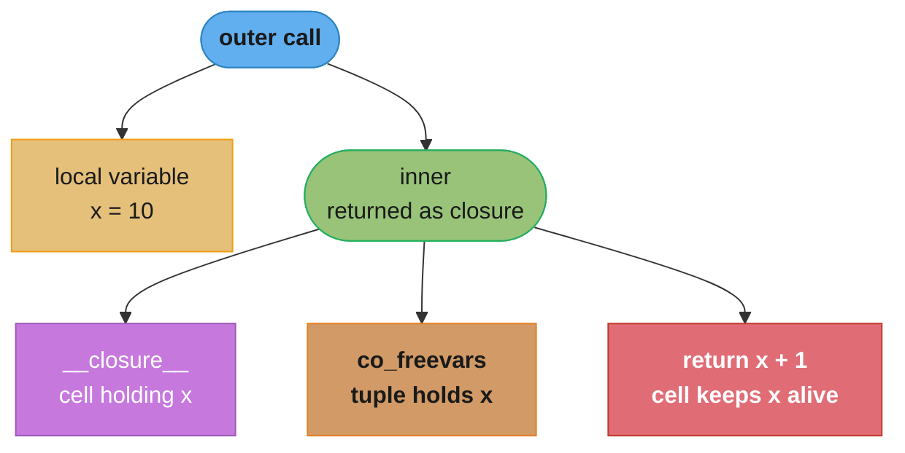
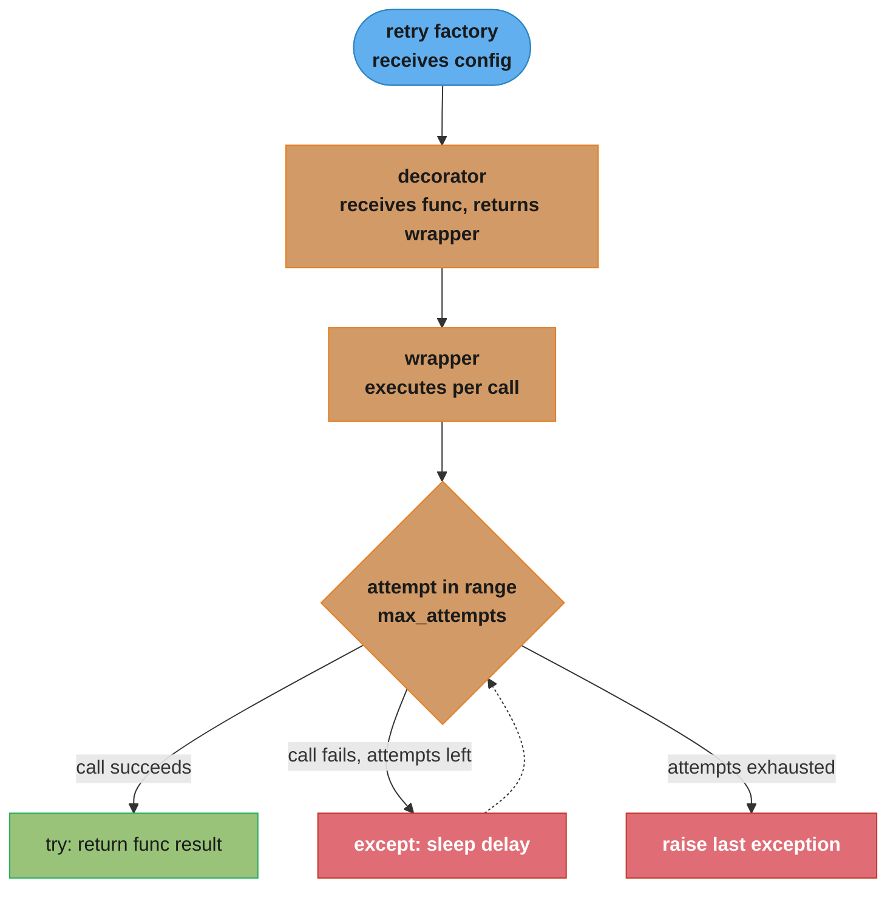
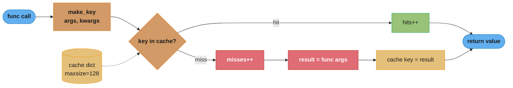
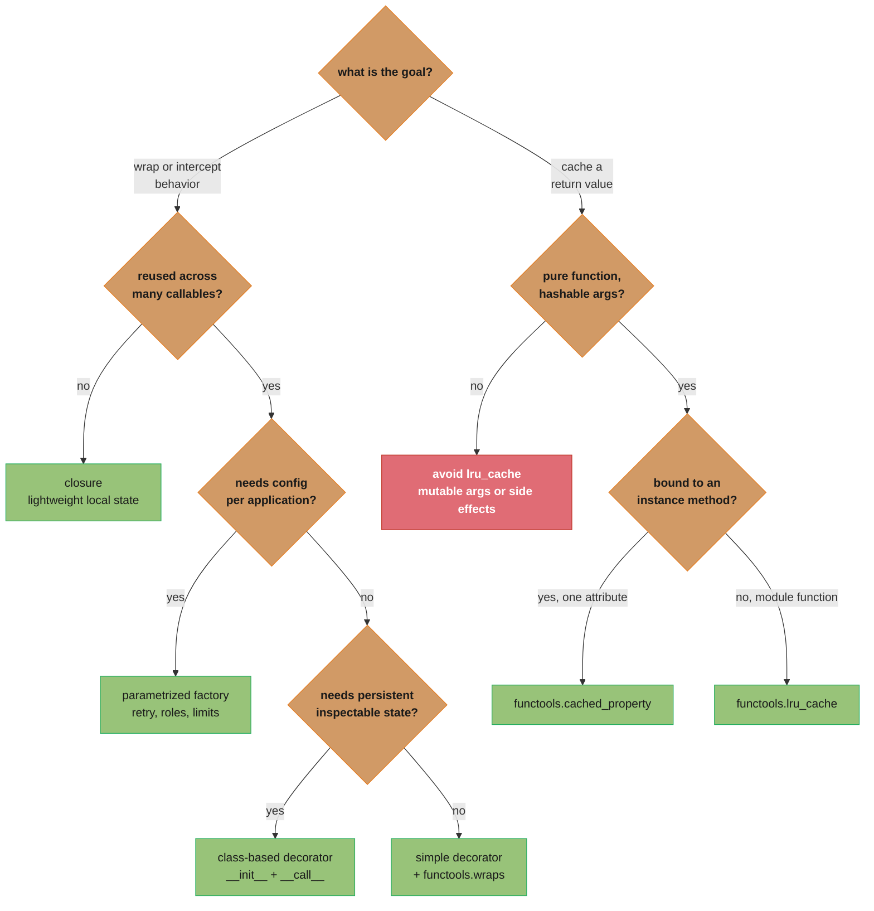
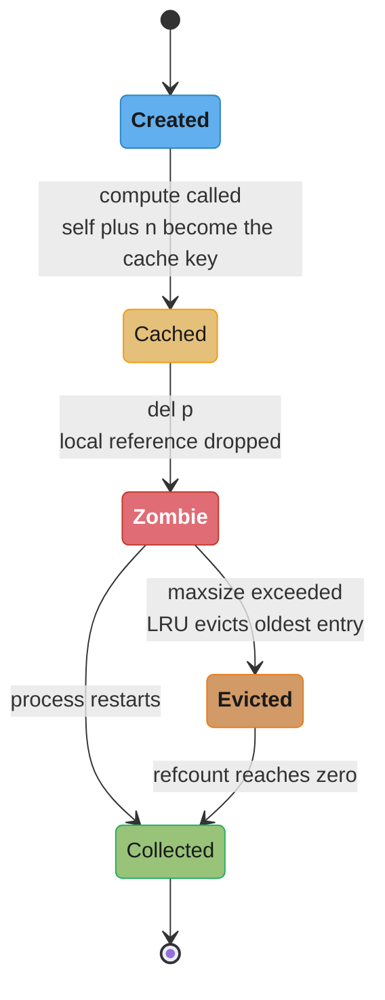

# Decorators & Closures

---

## 1. Concept Overview

Closures and decorators are Python's primary tools for higher-order function composition. A **closure** is a function that retains references to variables from its enclosing lexical scope even after that scope has finished executing. A **decorator** is a callable that wraps another callable, adding behavior before, after, or around the original — implemented using closures as the underlying mechanism.

Together they form the backbone of cross-cutting concerns in Python: logging, authentication, caching, rate-limiting, retry logic, and timing instrumentation. In FastAPI, decorators power every route registration, dependency injection, background task, and middleware hook.

---

## 2. Intuition

> A decorator is like a customs officer at an airport: every traveler (function call) must pass through the checkpoint (wrapper), the officer can inspect, modify, log, or reject the passenger before or after they reach their destination, yet the traveler's passport (original function identity) should remain unchanged.

**Mental model:** Think of closures as backpacks. When a nested function is created, Python packs all the free variables it references into that backpack (`__closure__`). Wherever the function travels, the backpack comes with it, keeping those values alive even after the outer function returns.

**Why it matters:** Without closures, every stateful helper would need a class. Closures give you lightweight, encapsulated state at function scope. Decorators let you apply that encapsulated behavior uniformly across many callables without repeating code — the core of the DRY principle at the function level.

**Key insight:** Decorators are *not* magic syntax. `@decorator` above a function definition is exactly `func = decorator(func)` executed at class or module load time. Understanding this eliminates confusion about when decorator code runs versus when wrapper code runs.

---

## 3. Core Principles

**Closures:**
- A closure is formed when a nested function references a free variable from an enclosing scope.
- Python stores captured variables in `cell` objects accessible via `func.__closure__`.
- `__code__.co_freevars` lists the names of captured variables.
- Mutation inside the closure requires `nonlocal` to rebind; it is not needed for mutating a mutable object (list, dict) in place.

**Decorators:**
- A decorator is any callable accepting a callable and returning a callable.
- The `@` syntax is purely syntactic sugar: `@dec` before `def f` is `f = dec(f)`.
- Decorator application occurs at definition time (import time), not call time.
- `functools.wraps` must be applied to the wrapper to preserve `__name__`, `__doc__`, `__annotations__`, and `__wrapped__`.

**Parametrized decorators (decorator factories):**
- Add one more outer function layer that accepts parameters and returns the actual decorator.
- Results in three levels of nesting: factory → decorator → wrapper.

**Class-based decorators:**
- Implement `__init__` to store the wrapped function and `__call__` to define wrapping behavior.
- Preferred when the decorator needs per-function mutable state that persists across calls (e.g., call counters, circuit breakers).

---

## 4. Types / Architectures / Strategies

| Category | Construction | Best For |
|---|---|---|
| Simple function decorator | `def dec(func)` returns `wrapper` | Stateless wrapping (logging, timing) |
| Parametrized decorator factory | Three-level nesting | Configurable behavior (retry count, roles) |
| Class-based decorator | `__init__` + `__call__` | Stateful wrapping (call count, circuit breaker) |
| `functools.lru_cache` | Built-in memoization | Pure functions with hashable args |
| `functools.cached_property` | Descriptor on class | Lazy computed attributes, computed once |
| `functools.partial` | Argument pre-filling | Specializing callables without closures |
| Stacked decorators | Multiple `@` lines | Composing independent concerns |

---

## 5. Architecture Diagrams

**Closure internals:**



*Each call to `make_multiplier` creates a fresh `inner` closure with its own `__closure__` cell, which is why `double` and `triple` in §6.1 never share state.*

**Decorator application at definition time:**

```mermaid
flowchart LR
    classDef io      fill:#61afef,stroke:#2e86c1,color:#1a1a1a,font-weight:bold
    classDef frozen  fill:#c678dd,stroke:#9b59b6,color:#fff
    classDef train   fill:#98c379,stroke:#27ae60,color:#1a1a1a
    classDef mathOp  fill:#d19a66,stroke:#e67e22,color:#1a1a1a,font-weight:bold
    classDef lossN   fill:#e06c75,stroke:#c0392b,color:#fff,font-weight:bold
    classDef req     fill:#56b6c2,stroke:#0097a7,color:#1a1a1a
    classDef base    fill:#e5c07b,stroke:#f39c12,color:#1a1a1a

    subgraph ML["Module Load - decoration order, bottom-up"]
        direction LR
        s1(["get_user defined"]) --> s2["apply require_role<br/>admin role"]
        s2 --> s3["apply authenticate"]
    end

    subgraph CT["Call Time - execution order, top-down"]
        direction LR
        c1(["get_user called"]) --> c2["authenticate wrapper runs"]
        c2 --> c3["require_role wrapper runs"]
        c3 --> c4["original get_user runs"]
    end

    s3 -.->|"invoked later, at runtime"| c1

    class s1 io
    class s2,s3 mathOp
    class c1 io
    class c2,c3 mathOp
    class c4 train
```



*Decoration runs once, bottom-up, at module load; execution runs per call, top-down, through each wrapper before reaching the original — the ordering that trips people up in Q10 and Pitfall 5.*

**Parametrized decorator three-level structure:**



*Three nesting levels — factory, decorator, wrapper — with the retry loop re-entering on failure and raising only after `max_attempts` is exhausted.*

**lru_cache internals:**



*A hit short-circuits to an O(1) dict lookup; a miss computes, stores, and returns — the mechanic behind the hits/misses counters `cache_info()` reports in §6.7.*

---

## 6. How It Works — Detailed Mechanics

### 6.1 Closure anatomy

```python
import inspect
from typing import Callable

def make_multiplier(factor: int) -> Callable[[int], int]:
    def multiply(x: int) -> int:
        return x * factor          # 'factor' is a free variable
    return multiply

double = make_multiplier(2)
triple = make_multiplier(3)

# Inspect the closure
print(double.__code__.co_freevars)   # ('factor',)
print(double.__closure__)            # (<cell at 0x...>,)
print(double.__closure__[0].cell_contents)  # 2

# Using inspect module
closure_vars = inspect.getclosurevars(double)
print(closure_vars.nonlocals)   # {'factor': 2}
print(closure_vars.globals)     # {}

double(5)   # 10
triple(5)   # 15
```

Each call to `make_multiplier` creates a **new** cell object. `double` and `triple` each carry an independent `factor` cell — they do not share state.

### 6.2 The `nonlocal` keyword

`nonlocal` is required only when you want to *rebind* (reassign) a name in the enclosing scope, not merely mutate a mutable object it points to.

```python
def make_counter() -> Callable[[], int]:
    count = 0

    def increment() -> int:
        nonlocal count      # rebind, not just read
        count += 1
        return count

    return increment

counter = make_counter()
counter()  # 1
counter()  # 2
counter()  # 3

# Without nonlocal — UnboundLocalError:
def make_broken_counter() -> Callable[[], int]:
    count = 0
    def increment() -> int:
        count += 1          # Python sees assignment → treats count as local → UnboundLocalError
        return count
    return increment
```

Contrast with mutating a mutable container — `nonlocal` not needed:

```python
def make_list_counter() -> Callable[[], int]:
    state: list[int] = [0]
    def increment() -> int:
        state[0] += 1       # mutating the list, not rebinding 'state'
        return state[0]
    return increment
```

### 6.3 Simple function decorator (broken: metadata loss)

```python
# BROKEN — __name__ and __doc__ are lost
def log_calls(func):
    def wrapper(*args, **kwargs):
        """Wrapper docstring."""
        print(f"Calling {func.__name__}")
        return func(*args, **kwargs)
    return wrapper

@log_calls
def greet(name: str) -> str:
    """Return a greeting."""
    return f"Hello, {name}"

print(greet.__name__)   # 'wrapper'  ← WRONG
print(greet.__doc__)    # 'Wrapper docstring.'  ← WRONG
```

### 6.4 Fix with `functools.wraps`

```python
import functools

def log_calls(func):
    @functools.wraps(func)          # copies __name__, __doc__, __annotations__, __wrapped__
    def wrapper(*args, **kwargs):
        print(f"Calling {func.__name__}")
        return func(*args, **kwargs)
    return wrapper

@log_calls
def greet(name: str) -> str:
    """Return a greeting."""
    return f"Hello, {name}"

print(greet.__name__)       # 'greet'       ← correct
print(greet.__doc__)        # 'Return a greeting.'  ← correct
print(greet.__wrapped__)    # <function greet at 0x...>  ← original accessible
```

`functools.wraps` calls `functools.update_wrapper` which copies `__module__`, `__name__`, `__qualname__`, `__annotations__`, `__doc__`, and sets `__wrapped__` to the original function. This matters for introspection tools, Sphinx, FastAPI's OpenAPI schema generation, and `help()`.

### 6.5 Parametrized decorator factory

```python
import functools
import time
from typing import Callable, TypeVar

F = TypeVar("F", bound=Callable)

def retry(
    max_attempts: int = 3,
    delay: float = 1.0,
    exceptions: tuple[type[Exception], ...] = (Exception,),
) -> Callable[[F], F]:
    """Factory: returns a decorator that retries on specified exceptions."""

    def decorator(func: F) -> F:
        @functools.wraps(func)
        def wrapper(*args, **kwargs):
            last_exc: Exception | None = None
            for attempt in range(1, max_attempts + 1):
                try:
                    return func(*args, **kwargs)
                except exceptions as exc:
                    last_exc = exc
                    if attempt < max_attempts:
                        time.sleep(delay)
            raise last_exc  # type: ignore[misc]

        return wrapper  # type: ignore[return-value]

    return decorator


@retry(max_attempts=3, delay=0.5, exceptions=(ConnectionError, TimeoutError))
def fetch_data(url: str) -> dict:
    """Fetch JSON from remote URL."""
    ...
```

Three levels: `retry(...)` returns `decorator`, `decorator(func)` returns `wrapper`, `wrapper(...)` runs per call.

### 6.6 Class-based decorator

Use a class when the decorator needs per-function mutable state that survives across multiple calls.

```python
import functools
from typing import Any, Callable

class CallCounter:
    """Counts invocations of the decorated function."""

    def __init__(self, func: Callable) -> None:
        functools.update_wrapper(self, func)   # makes @functools.wraps work for class
        self._func = func
        self.call_count: int = 0

    def __call__(self, *args: Any, **kwargs: Any) -> Any:
        self.call_count += 1
        return self._func(*args, **kwargs)


@CallCounter
def process(item: str) -> str:
    return item.upper()

process("a")
process("b")
print(process.call_count)   # 2
```

When to prefer class-based over function-based: when state must be inspectable/resettable externally (`process.call_count`), when the decorator needs `__get__` for descriptor protocol support, or when the implementation spans multiple methods for clarity.

### 6.7 `functools.lru_cache`

```python
import functools

@functools.lru_cache(maxsize=128)   # 128-entry LRU eviction; None = unbounded
def fibonacci(n: int) -> int:
    if n < 2:
        return n
    return fibonacci(n - 1) + fibonacci(n - 2)

fibonacci(30)
print(fibonacci.cache_info())
# CacheInfo(hits=28, misses=31, maxsize=128, currsize=31)

fibonacci.cache_clear()             # evict all entries
print(fibonacci.cache_info())
# CacheInfo(hits=0, misses=0, maxsize=128, currsize=0)
```

Cache key is built from positional args and keyword args using `_make_key`. All arguments must be **hashable**. Passing a list raises `TypeError: unhashable type: 'list'`. For `maxsize=None` the underlying data structure is a plain dict (O(1) lookup); for finite `maxsize` it uses an internal doubly-linked list to implement LRU eviction (O(1) operations via dict + list).

**Thread safety:** `lru_cache` is thread-safe in CPython as of 3.8 (uses a reentrant lock internally). Hit-rate overhead is ~50 ns per cache hit on a 2023 laptop.

### 6.8 `functools.cached_property` (Python 3.8+)

```python
import functools
import math

class Circle:
    def __init__(self, radius: float) -> None:
        self.radius = radius

    @functools.cached_property
    def area(self) -> float:
        print("computing area...")
        return math.pi * self.radius ** 2

c = Circle(5.0)
print(c.area)   # prints "computing area..." then 78.53...
print(c.area)   # returns cached value silently — no recomputation
print(c.__dict__)  # {'radius': 5.0, 'area': 78.539...}
```

`cached_property` works as a **non-data descriptor**: on first access Python calls `__get__`, computes the value, and stores it directly in the instance `__dict__`. On subsequent accesses the instance dict shadows the descriptor. This means:

- The class must have a writable `__dict__` (no `__slots__` without explicit slot for cache).
- **NOT thread-safe** by default. Two threads accessing simultaneously can compute twice.
- Invalidation requires `del instance.area`.

### 6.9 Stacking decorators

```python
import functools

def uppercase(func):
    @functools.wraps(func)
    def wrapper(*args, **kwargs):
        result = func(*args, **kwargs)
        return result.upper()
    return wrapper

def exclaim(func):
    @functools.wraps(func)
    def wrapper(*args, **kwargs):
        return func(*args, **kwargs) + "!"
    return wrapper

@uppercase          # applied second (outermost)
@exclaim            # applied first (innermost)
def greet(name: str) -> str:
    return f"hello {name}"

# Equivalent to: greet = uppercase(exclaim(greet))
# Call order: uppercase.wrapper → exclaim.wrapper → original greet
print(greet("world"))   # "HELLO WORLD!"
```

Decoration order: bottom-up (innermost `@` applied first). Execution order: top-down (outermost wrapper runs first). This is the single most common source of confusion with stacked decorators.

### 6.10 FastAPI timing decorator

```python
import functools
import logging
import time
from collections.abc import Callable
from typing import Any

import fastapi

logger = logging.getLogger(__name__)
app = fastapi.FastAPI()


def log_execution_time(func: Callable) -> Callable:
    """Log wall-clock execution time of a route handler."""
    @functools.wraps(func)
    async def wrapper(*args: Any, **kwargs: Any) -> Any:
        start = time.perf_counter()
        try:
            result = await func(*args, **kwargs)
            return result
        finally:
            elapsed_ms = (time.perf_counter() - start) * 1_000
            logger.info(
                "route=%s duration_ms=%.2f",
                func.__qualname__,
                elapsed_ms,
            )
    return wrapper


@app.get("/items/{item_id}")
@log_execution_time
async def get_item(item_id: int) -> dict[str, int]:
    """Retrieve a single item by ID."""
    return {"item_id": item_id}
```

In FastAPI routes, the timing decorator wraps the coroutine, so it must be declared `async`. Note decorator order: `@app.get` registers the final callable (which is the `log_execution_time` wrapper) as the route handler.

---

## 7. Real-World Examples

**Django:** `@login_required`, `@permission_required`, `@cache_page(60 * 15)` are parametrized decorators wrapping view functions. `@staticmethod` and `@classmethod` are built-in class-based decorators implementing the descriptor protocol.

**FastAPI:** `@app.get`, `@app.post` are method calls returning parametrized decorators that register routes at import time. `@app.on_event("startup")` follows the same pattern.

**Python stdlib:** `@property` is a class-based descriptor decorator. `@functools.total_ordering` fills in missing comparison methods. `@contextlib.contextmanager` transforms a generator into a context manager.

**Celery:** `@app.task(bind=True, max_retries=3)` is a three-level factory that converts a function into a registered Task class with retry infrastructure.

**Production:** HTTP clients wrap calls with retry decorators — `tenacity` is the production standard, a parametrized decorator factory supporting exponential backoff, jitter, stop conditions, and async.

---

## 8. Tradeoffs

| Aspect | Function Decorator | Class-based Decorator | `lru_cache` |
|---|---|---|---|
| State across calls | Requires mutable closure cell | Natural via `self.*` attributes | Built-in dict |
| Introspectability | Need explicit attributes on wrapper | Natural attributes on instance | `cache_info()` |
| Descriptor support | Must implement `__get__` manually | Implement `__get__` manually | N/A |
| Code clarity | Compact for stateless wrapping | Verbose but explicit for stateful | Zero boilerplate |
| Thread safety | Depends on implementation | Depends on implementation | Safe in CPython 3.8+ |
| Async support | Must mirror async/sync of wrapped | Same | Sync only (use `async_lru` for async) |

| Approach | When to Choose |
|---|---|
| Simple `@functools.wraps` decorator | Stateless cross-cutting concern (logging, timing) |
| Parametrized factory | Configurable behavior (retry count, roles, rate limit) |
| Class-based decorator | Stateful (call count, circuit breaker, rate limit window) |
| `lru_cache` | Pure function, hashable args, hot path memoization |
| `cached_property` | Expensive per-instance computation, single-threaded access |
| `functools.partial` | Pre-filling arguments without full decorator overhead |

---

## 9. When to Use / When NOT to Use

**Use closures when:**
- You need a lightweight stateful callable without a full class.
- You are building a decorator and need to capture configuration from an outer scope.
- You want a factory that produces customized functions (e.g., `make_validator(schema)`).

**Use decorators when:**
- The same behavior (auth check, logging, retry, caching) must be applied to many callables.
- You want the wrapping to be declarative and visible at the definition site.
- Framework integration requires decoration (FastAPI route registration, pytest fixtures).

**Do NOT use decorators when:**
- The behavior is unique to a single function — inline code is clearer.
- You need to conditionally apply behavior per-call based on runtime data — pass parameters instead.
- The decorator alters the function's signature in a way that breaks type checkers — use `typing.ParamSpec` + `typing.Concatenate` to preserve signatures.

**Do NOT use `lru_cache` when:**
- Arguments are mutable (lists, dicts, sets) — results in `TypeError`.
- The function has side effects that must run every call.
- Applied to an instance method without `methodtools` — `self` leaks into the cache, holding instance alive indefinitely.
- The function's return value depends on external state (time, DB) that changes between calls.

**Do NOT use `cached_property` when:**
- The class uses `__slots__` without a slot for `__dict__`.
- Multiple threads access the same instance simultaneously — race condition on first access.
- The computed value can become stale and needs cache invalidation beyond a simple `del`.

**Decision tree — which construct to reach for:**



*Section 9 distilled into one flow: closures for local state, decorators for cross-cutting behavior (factory when configurable, class-based when stateful, simple otherwise), and `lru_cache`/`cached_property` reserved for pure, hashable, single-threaded memoization.*

---

## 10. Common Pitfalls

### Pitfall 1: Late-binding closure in a loop

**BROKEN:**
```python
from typing import Callable

# All lambdas capture variable 'i', not the value at loop time
funcs: list[Callable[[], int]] = [lambda: i for i in range(5)]
print([f() for f in funcs])   # [4, 4, 4, 4, 4]  ← all return last value of i
```

Python closures capture variables by reference (via cell objects), not by value. After the loop, `i` equals 4. All five lambdas share the same cell pointing to `i`.

**FIX — use default argument to bind the value at creation time:**
```python
funcs_fixed: list[Callable[[], int]] = [lambda i=i: i for i in range(5)]
print([f() for f in funcs_fixed])  # [0, 1, 2, 3, 4]  ← correct
```

Default arguments are evaluated at function definition time, creating a separate binding per iteration. Alternatively, use a factory function: `def make_f(i): return lambda: i`.

---

### Pitfall 2: Mutable default argument captured in decorator closure

**BROKEN:**
```python
import functools

def tag_with_labels(labels: list[str] = []) -> ...:   # shared mutable default
    def decorator(func):
        @functools.wraps(func)
        def wrapper(*args, **kwargs):
            print(f"Labels: {labels}")
            return func(*args, **kwargs)
        labels.append("called")   # mutates the shared default list
        return wrapper
    return decorator

@tag_with_labels()
def action_a(): ...

@tag_with_labels()
def action_b(): ...

action_a()   # Labels: ['called']   ← accumulated from action_a's decoration
action_b()   # Labels: ['called', 'called']   ← WRONG
```

The same list object is reused across all calls to `tag_with_labels()` because Python evaluates default arguments once at function definition time.

**FIX — use a sentinel and create a new list inside the factory:**
```python
from typing import Sequence

_SENTINEL = object()

def tag_with_labels(labels: Sequence[str] | None = None) -> ...:
    resolved: list[str] = list(labels) if labels is not None else []
    def decorator(func):
        @functools.wraps(func)
        def wrapper(*args, **kwargs):
            print(f"Labels: {resolved}")
            return func(*args, **kwargs)
        return wrapper
    return decorator
```

Each call to `tag_with_labels()` creates a fresh `resolved` list captured in a new closure cell.

---

### Pitfall 3: `@lru_cache` on an instance method (memory leak)

**BROKEN:**
```python
import functools

class DataProcessor:
    def __init__(self, multiplier: int) -> None:
        self.multiplier = multiplier

    @functools.lru_cache(maxsize=256)   # caches (self, n) — holds self alive
    def compute(self, n: int) -> int:
        return n * self.multiplier

p = DataProcessor(2)
p.compute(10)
# 'p' cannot be garbage collected — lru_cache holds a strong reference to self
# In a web server creating one DataProcessor per request, this is a memory leak
del p   # reference count still > 0 due to cache entry
```

`lru_cache` is a function-level cache. When applied to an unbound function it works fine. When applied inside a class, each call stores `(self, n)` as the cache key, keeping a strong reference to `self`.

**FIX — use `cached_property` for per-instance, or `methodtools.lru_cache`, or cache at class level:**
```python
import functools
import math

class Circle:
    def __init__(self, radius: float) -> None:
        self.radius = radius

    @functools.cached_property           # computes once, stored in instance.__dict__
    def area(self) -> float:
        return math.pi * self.radius ** 2

# OR: cache the method at the class level with a weak-reference key (methodtools)
# pip install methodtools
# from methodtools import lru_cache
# @lru_cache(maxsize=256)
# def compute(self, n: int) -> int: ...
```

**Reference lifecycle — why `del p` does not free memory:**



*`del p` only drops the local variable's reference — `self` stays alive as part of the `(self, n)` cache key until LRU eviction or a process restart finally lets it go (see Q7).*

---

### Pitfall 4: Forgetting `functools.wraps` breaks introspection

FastAPI reads `__name__`, `__doc__`, and `__annotations__` from route handlers to generate OpenAPI schemas. A decorator without `@functools.wraps` silently replaces these with the wrapper's attributes, producing incorrect or missing API documentation. Always apply `@functools.wraps(func)` inside every decorator wrapper.

---

### Pitfall 5: Stacking order confusion

```python
@a    # outer
@b    # inner
def f(): ...
# equivalent to: f = a(b(f))
# Execution: a's wrapper → b's wrapper → original f
# If @a is @app.get("/path"), FastAPI receives b(f), not f
# If @b strips type hints, @app.get cannot read response_model
```

Always place FastAPI's `@app.get/post/...` as the **outermost** decorator (topmost line) so it receives the fully decorated function with its metadata still intact from `functools.wraps`.

---

## 11. Technologies & Tools

| Tool / Library | Purpose | Notes |
|---|---|---|
| `functools` (stdlib) | `wraps`, `lru_cache`, `cached_property`, `partial`, `reduce` | Zero dependency, production-grade |
| `inspect` (stdlib) | `getclosurevars`, `signature`, `getmembers` | Closure introspection, runtime reflection |
| `wrapt` | Transparent function wrapping | Preserves descriptor protocol, better than `functools.wraps` for class methods |
| `tenacity` | Production retry with jitter, wait strategies, stop conditions | Better than hand-rolled retry for production services |
| `cachetools` | LRU, LFU, TTL, RR caches | Thread-safe, TTL expiry, good for methods |
| `methodtools` | `lru_cache` safe for instance methods via weak references | Prevents memory leaks from caching `self` |
| `async_lru` | `lru_cache` for async functions | `asyncio`-compatible memoization |
| `typing.ParamSpec` | Preserves parameter types through decorators | Python 3.10+; essential for typed decorator factories |
| `typing.Concatenate` | Adds parameters to a `ParamSpec` | Used to inject extra args (e.g., `request`) through decorators |

---

## 12. Interview Questions with Answers

**Q1: What is a closure, and what three conditions must be true for one to form?**
A closure forms when (1) there is a nested function, (2) the nested function references at least one free variable from the enclosing scope, and (3) the enclosing function returns (or otherwise exposes) the nested function. When these hold, Python packages the referenced variables into cell objects accessible via `func.__closure__`, keeping them alive beyond the lifetime of the outer function's stack frame. Inspect them with `inspect.getclosurevars(func)`.

**Q2: What is the difference between `global` and `nonlocal`?**
`global` declares that a name refers to the module-level namespace; `nonlocal` declares that a name refers to the nearest enclosing function scope (not global). Use `nonlocal` when you need to *rebind* (assign to) a variable in a closure — mere mutation of a mutable object does not require it. `global` is needed to rebind module-level names from within a function.

**Q3: Why does `@decorator` syntax run at import time, not at call time?**
`@decorator` above `def f` is syntactic sugar for `f = decorator(f)` which Python executes when it encounters the `def` statement during module parsing. This means decorator setup code (outer function body) runs once at import time. The wrapper's body runs per call. This matters in FastAPI: `@app.get("/path")` registers the route immediately when the module is imported, regardless of whether the app has started.

**Q4: What does `functools.wraps` actually do under the hood?**
It calls `functools.update_wrapper(wrapper, wrapped, assigned=WRAPPER_ASSIGNMENTS, updated=WRAPPER_UPDATES)`. This copies `__module__`, `__name__`, `__qualname__`, `__annotations__`, `__doc__` from `wrapped` to `wrapper`, updates `wrapper.__dict__` with `wrapped.__dict__`, and sets `wrapper.__wrapped__ = wrapped`. Without it, tools like `help()`, Sphinx, and FastAPI's OpenAPI generator see the wrapper's attributes instead of the original function's, producing wrong documentation and schema.

**Q5: Explain the three-level structure of a parametrized decorator.**
Level 1 is the *factory function* (e.g., `retry(max_attempts=3)`) — it receives configuration and returns the decorator. Level 2 is the *decorator* — it receives the function to wrap and returns the wrapper. Level 3 is the *wrapper* — it runs on every invocation, implementing the actual behavior. The factory exists solely to create a closure over the configuration values so the decorator and wrapper can access them without being passed those values explicitly.

**Q6: When should you use a class-based decorator instead of a function-based one?**
Use a class-based decorator when the decorator needs per-function mutable state that must persist across calls and be externally inspectable or resettable (e.g., `process.call_count`, circuit breaker state). Implement `__init__` to store the wrapped function and configuration, `__call__` for the wrapping behavior, and `__get__` if the decorator should work correctly on instance methods (to bind `self`). Function-based decorators are simpler for stateless concerns.

**Q7: What happens if you apply `@lru_cache` to an instance method without any workaround?**
The cache key becomes `(self, *args, **kwargs)`. The `lru_cache` dictionary holds a strong reference to `self`, preventing garbage collection even after all other references to the instance are dropped. In a web server that creates short-lived objects per request, this is a memory leak — objects accumulate in the cache until `maxsize` evicts them or the process restarts. Fix by using `cached_property` for single computed values, `methodtools.lru_cache` (weak-reference keying), or restructuring the cache to class level with an explicit key that does not include `self`.

**Q8: What is `functools.cached_property` and how does it differ from `@property` + manual caching?**
`cached_property` is a non-data descriptor: on first access it computes the value and stores it in the instance's `__dict__` under the property name; subsequent access reads from `__dict__` directly without calling the descriptor again. Vs `@property` + manual cache: zero boilerplate, no `if self._val is None` guard. Limitations: not thread-safe (two simultaneous threads can both compute), requires a writable `__dict__` (incompatible with `__slots__` unless a `__dict__` slot is added), and invalidation requires `del instance.prop`.

**Q9: Describe the late-binding closure bug and two ways to fix it.**
The bug: closures capture the *variable* (cell reference), not its *value* at creation time. In a loop `[lambda: i for i in range(5)]`, all five lambdas share one cell pointing to `i`; after the loop `i == 4`, so all return 4. Fix 1 — default argument binding: `lambda i=i: i` — default args are evaluated at function definition time, creating a fresh binding per iteration. Fix 2 — factory function: `def make_f(i): return lambda: i` — each call creates a new closure scope with its own `i` cell.

**Q10: How does stacking decorators work, and what order are they applied and executed?**
Application order is bottom-up: the decorator closest to `def` is applied first, the topmost decorator last. This means `@a` on top and `@b` below is equivalent to `f = a(b(f))`. Execution order is the reverse — top-down: `a`'s wrapper runs first, calls `b`'s wrapper, which calls the original function. For FastAPI routes, `@app.get` must be topmost (outermost) so it receives the final wrapped function and can inspect its signature for dependency injection and schema generation.

**Q11: How do you write a type-safe decorator factory that preserves the wrapped function's signature?**
Use `typing.ParamSpec` (Python 3.10+) to capture the parameter spec and `typing.Callable[[ParamSpec], ReturnType]` for the return type:

```python
from typing import Callable, TypeVar
from typing import ParamSpec

P = ParamSpec("P")
R = TypeVar("R")

def log_calls(func: Callable[P, R]) -> Callable[P, R]:
    @functools.wraps(func)
    def wrapper(*args: P.args, **kwargs: P.kwargs) -> R:
        print(f"calling {func.__name__}")
        return func(*args, **kwargs)
    return wrapper
```

Without `ParamSpec`, type checkers lose parameter information at the decoration boundary, which breaks IDE autocompletion for decorated FastAPI endpoints.

**Q12: What is `functools.partial` and when is it better than a closure?**
`functools.partial(func, *args, **kwargs)` returns a new callable with some arguments pre-filled. Prefer it over a closure when you only need to bind arguments (not add behavior), when you want the result to be introspectable (`partial_obj.func`, `.args`, `.keywords`), or when performance is critical (`partial` is C-implemented, ~15% faster than a Python wrapper). Use a closure when you need to add behavior around the call.

**Q13: How would you make a cached_property thread-safe?**
Three options: (1) implement a custom descriptor that acquires a per-instance `threading.Lock` before checking and setting the cached value — safe but adds lock overhead per access; (2) accept the duplicate-compute race for idempotent properties where computing twice is harmless and bounded; (3) restructure to compute at `__init__` and store in a plain attribute. Python 3.12 does not add thread-safety to `cached_property` — the custom lock-based descriptor remains the recommended production solution.

**Q14: Explain `__wrapped__` and why it matters.**
`functools.wraps` sets `wrapper.__wrapped__ = func` (the original function). This chain allows tooling to unwrap decorators: `inspect.unwrap(f)` follows `__wrapped__` links until it reaches a function with no `__wrapped__`. FastAPI uses `inspect.unwrap` to find the original handler's signature for dependency injection parsing. Without `__wrapped__`, FastAPI cannot discover path parameters and query dependencies, causing runtime errors or incorrect OpenAPI schemas.

**Q15: What is the difference between a decorator that wraps a function and one that replaces it entirely?**
Most decorators return a wrapper that calls the original function (transparent wrapping). A *replacement decorator* returns something entirely different — e.g., `@functools.total_ordering` returns a modified class, `@dataclass` returns a new class, `@property` returns a descriptor object. For class decorators, replacement is common: `@dataclass` inspects and modifies the class, then returns it (or a new class). Understanding whether a decorator wraps or replaces is critical for debugging: if `isinstance(obj, OriginalClass)` returns `False` after decoration, the decorator replaced the class.

**Q16: How would you implement a decorator that works correctly on both regular functions and async functions?**
Inspect with `inspect.iscoroutinefunction(func)` and return either an async or sync wrapper:

```python
import asyncio
import functools
import inspect
from typing import Callable, Any

def universal_log(func: Callable) -> Callable:
    if inspect.iscoroutinefunction(func):
        @functools.wraps(func)
        async def async_wrapper(*args: Any, **kwargs: Any) -> Any:
            print(f"async call: {func.__name__}")
            return await func(*args, **kwargs)
        return async_wrapper
    else:
        @functools.wraps(func)
        def sync_wrapper(*args: Any, **kwargs: Any) -> Any:
            print(f"sync call: {func.__name__}")
            return func(*args, **kwargs)
        return sync_wrapper
```

This pattern is essential in FastAPI projects where some utilities are sync and some are async.

---

## 13. Best Practices

1. **Always use `@functools.wraps(func)` in every wrapper** — without it, introspection tools, FastAPI's OpenAPI generation, and `help()` see the wrapper's identity instead of the original's.

2. **Return the correct coroutine type.** If the decorated function is `async def`, the wrapper must also be `async def` and `await` the call. A sync wrapper around an async function returns a coroutine object instead of the result.

3. **Use `typing.ParamSpec` for typed decorator factories** — preserves parameter types through the decoration boundary for IDE autocompletion and static analysis (mypy, pyright).

4. **Never apply `@lru_cache` directly to instance methods** — use `cached_property` for single computed values, or `methodtools.lru_cache` for multi-argument caching.

5. **Default arguments over late-binding in loop closures** — when creating callables in a loop that capture the loop variable, use `lambda x=x: x` or a factory function to bind the current value.

6. **Avoid mutable default arguments in decorator factories** — use `None` as the sentinel and construct fresh mutable defaults inside the factory body.

7. **Keep decorators focused on one concern** — a decorator that logs, retries, and authenticates simultaneously is hard to test. Compose three single-responsibility decorators instead.

8. **Test decorators in isolation** — call `func.__wrapped__` (set by `functools.wraps`) to get the original function for unit tests that only want to test the core logic without the cross-cutting behavior.

9. **Place `@app.get/post` as the topmost decorator** in FastAPI routes so it receives the final wrapped function with correct metadata from inner `functools.wraps` applications.

10. **Document decorator behavior in the decorator's own docstring**, not the wrapper's — explain what behavior it adds, what exceptions it may raise (e.g., retry exhausted), and what configuration parameters mean.

11. **Use `cachetools.TTLCache` over `lru_cache` when cached data can become stale** — `lru_cache` has no TTL; stale data silently persists until `cache_clear()` or process restart.

12. **Prefer `tenacity` over hand-rolled retry decorators in production** — `tenacity` handles jitter, exponential backoff, stop conditions, retry predicates, and async, all tested and documented.

---

## 14. Case Study

### Building a Retry Decorator with Exponential Backoff

**Context:** A FastAPI microservice calls a downstream ML inference API. The inference endpoint is occasionally overloaded, returning HTTP 503 or raising `httpx.ConnectTimeout`. Calls should be retried with exponential backoff — wait 1s after first failure, 2s after second, 4s after third — before propagating the error to the caller.

**Requirements:**
- `max_attempts = 3`
- `initial_delay = 1.0` seconds
- `backoff_factor = 2.0` (delay doubles each attempt)
- Only retry on `(httpx.ConnectTimeout, httpx.HTTPStatusError)` — not on all exceptions
- Must work for both sync and async callables
- Must preserve function metadata (`__name__`, `__doc__`, type hints)
- FastAPI route must use it and still generate correct OpenAPI docs

---

**BROKEN — sync-only, no `functools.wraps`, flat delay, catches all exceptions:**

```python
# BROKEN
def retry_broken(max_attempts=3, delay=1.0):
    def decorator(func):
        def wrapper(*args, **kwargs):   # sync only — TypeError on async routes
            for attempt in range(max_attempts):
                try:
                    return func(*args, **kwargs)
                except Exception:       # too broad; no backoff; metadata lost
                    if attempt < max_attempts - 1:
                        time.sleep(delay)
                    else:
                        raise
        return wrapper                  # __name__='wrapper', __doc__=None
    return decorator
```

**FIX — async-compatible with exponential backoff:**

```python
import asyncio
import functools
import inspect
import logging
import time
from collections.abc import Callable
from typing import Any, TypeVar

import httpx
import fastapi
from pydantic import BaseModel

logger = logging.getLogger(__name__)

F = TypeVar("F", bound=Callable[..., Any])


def retry(
    max_attempts: int = 3,
    initial_delay: float = 1.0,
    backoff_factor: float = 2.0,
    exceptions: tuple[type[Exception], ...] = (Exception,),
) -> Callable[[F], F]:
    """Retry with exponential backoff. Raises last exception after all attempts exhausted."""
    if max_attempts < 1:
        raise ValueError(f"max_attempts must be >= 1, got {max_attempts}")

    def decorator(func: F) -> F:
        if inspect.iscoroutinefunction(func):
            @functools.wraps(func)
            async def async_wrapper(*args: Any, **kwargs: Any) -> Any:
                delay = initial_delay
                last_exc: Exception | None = None

                for attempt in range(1, max_attempts + 1):
                    try:
                        return await func(*args, **kwargs)
                    except exceptions as exc:
                        last_exc = exc
                        logger.warning(
                            "attempt=%d/%d func=%s error=%s",
                            attempt,
                            max_attempts,
                            func.__qualname__,
                            exc,
                        )
                        if attempt < max_attempts:
                            await asyncio.sleep(delay)
                            delay *= backoff_factor

                raise last_exc  # type: ignore[misc]

            return async_wrapper  # type: ignore[return-value]

        else:
            @functools.wraps(func)
            def sync_wrapper(*args: Any, **kwargs: Any) -> Any:
                delay = initial_delay
                last_exc: Exception | None = None

                for attempt in range(1, max_attempts + 1):
                    try:
                        return func(*args, **kwargs)
                    except exceptions as exc:
                        last_exc = exc
                        logger.warning(
                            "attempt=%d/%d func=%s error=%s",
                            attempt,
                            max_attempts,
                            func.__qualname__,
                            exc,
                        )
                        if attempt < max_attempts:
                            time.sleep(delay)
                            delay *= backoff_factor

                raise last_exc  # type: ignore[misc]

            return sync_wrapper  # type: ignore[return-value]

    return decorator


# --- FastAPI integration ---

app = fastapi.FastAPI(title="Inference Proxy")

INFERENCE_URL = "http://inference-service/predict"


class PredictRequest(BaseModel):
    text: str


class PredictResponse(BaseModel):
    label: str
    score: float


@retry(
    max_attempts=3,
    initial_delay=1.0,
    backoff_factor=2.0,
    exceptions=(httpx.ConnectTimeout, httpx.HTTPStatusError),
)
async def call_inference(client: httpx.AsyncClient, payload: dict[str, str]) -> dict:
    """Call downstream ML inference endpoint with retry logic."""
    response = await client.post(INFERENCE_URL, json=payload, timeout=5.0)
    response.raise_for_status()
    return response.json()


@app.post("/predict", response_model=PredictResponse)
async def predict(body: PredictRequest) -> PredictResponse:
    """
    Classify text via downstream inference service.

    Retries up to 3 times with exponential backoff (1s, 2s, 4s)
    on connection timeout or HTTP 5xx errors.
    """
    async with httpx.AsyncClient() as client:
        data = await call_inference(client, {"text": body.text})
    return PredictResponse(label=data["label"], score=data["score"])
```

**Behavior:** attempt 1 at t=0s fails, waits 1.0s; attempt 2 at t=1s fails, waits 2.0s; attempt 3 at t=3s succeeds or propagates the final exception. Total worst-case added latency: 3.0s over 3 attempts.

**FastAPI correctness:** `@functools.wraps` preserves `call_inference.__name__` and `__doc__`; `asyncio.sleep` (not `time.sleep`) keeps the event loop unblocked; `response_model=PredictResponse` works because type annotations on `predict` are intact; `call_inference.__wrapped__` exposes the original coroutine for unit testing.

**Testing:** Access `call_inference.__wrapped__` (set by `functools.wraps`) to bypass the decorator in unit tests and test core logic directly. Use the decorated version in integration tests to verify retry counts and backoff timing against a mock server that returns 503 on the first two requests.
