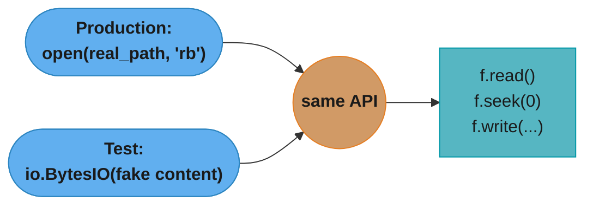
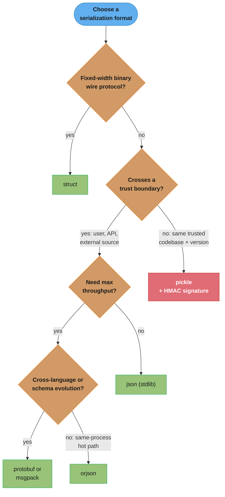
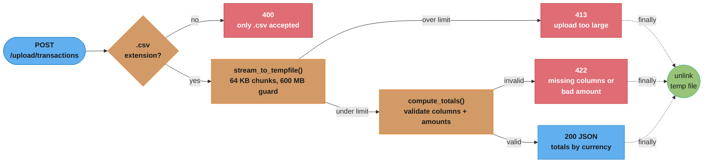

# File I/O & Serialization

## 1. Concept Overview

File I/O and serialization are the mechanisms by which a Python program exchanges data with the
outside world — persisting state to disk, reading configuration, processing uploaded files, and
transmitting structured data across process or network boundaries.

Modern Python (3.11+) provides a layered toolkit:

- **`pathlib.Path`** — object-oriented filesystem navigation, replacing `os.path` string juggling
- **`open()` built-in** — text and binary modes with explicit encoding and buffering control
- **`json`** — human-readable serialization for REST APIs and config files
- **`csv`** — tabular text data with dialect-aware parsing
- **`pickle`** — Python-object graph persistence (trusted-source only)
- **`struct`** — precise binary packing for protocols and file formats
- **`tempfile`** — safe scratch space for ephemeral processing
- **`io.StringIO` / `io.BytesIO`** — in-memory file-like objects for testing and streaming

FastAPI integrates these primitives through `UploadFile`, `StreamingResponse`, and `BackgroundTasks`,
making file I/O understanding critical for building production upload, export, and ETL endpoints.

---

## 2. Intuition

> Think of Python's I/O stack as a plumbing system: raw bytes flow through pipes (file descriptors),
> valves control direction (read/write/append), filters add interpretation (encoding, buffering),
> and the format layer at the top determines what shape the water takes (JSON, CSV, binary structs).

**Mental model:** Every I/O operation has three concerns — *where* (path), *how* (mode, encoding,
buffering), and *what shape* (serialization format). Get any one wrong and data corrupts silently
or fails loudly in production.

**Why it matters:** Data bugs from wrong encoding or unsafe deserialization are among the most
common production incidents. A FastAPI service that reads user-uploaded CSVs with the wrong
encoding will silently mangle customer records. A service that unpickles untrusted payloads is
a remote-code-execution vulnerability.

**Key insight:** Text mode is a *decoding layer* on top of binary mode. `open(path, "r")` is
shorthand for "open binary, then decode each chunk to `str` using the system locale encoding."
Always make that decoding explicit: `open(path, encoding="utf-8")`. The `pathlib` operators `/`
and `read_text()` / `write_bytes()` bake this in conveniently.

---

## 3. Core Principles

1. **Always use context managers.** `with open(...) as f:` guarantees the file descriptor is
   released even if an exception is raised mid-write. Unclosed file handles accumulate silently
   until the process hits the OS limit.

2. **Specify encoding explicitly.** The default encoding is `locale.getpreferredencoding(False)`,
   which is UTF-8 on Linux/macOS but often CP1252 on Windows. Hard-code `encoding="utf-8"` for
   all text files that cross machine or process boundaries.

3. **Separate path manipulation from I/O.** Use `pathlib.Path` objects for all path construction;
   call `.read_text()` / `.write_bytes()` / `open()` only at the leaves of your logic.

4. **Treat `pickle` as a trusted-peer protocol, not a serialization format.** It executes
   arbitrary Python during deserialization. Use `json` or `msgpack` for data that crosses trust
   boundaries.

5. **Stream large files; do not load them into RAM.** A 2 GB CSV upload will OOM a FastAPI worker
   if read with `await file.read()`. Chunk to a `tempfile`, then process line-by-line.

6. **Use `io.BytesIO` / `io.StringIO` in tests.** Replace real files with in-memory objects so
   tests run without disk I/O and are trivially parallelizable.

---

## 4. Types / Architectures / Strategies

### 4.1 Text Mode vs Binary Mode

| Mode string | Decoded? | Use case |
|-------------|----------|----------|
| `"r"` | Yes (str) | Human-readable text files |
| `"w"` | Yes (str) | Overwrite text file |
| `"a"` | Yes (str) | Append to text file |
| `"rb"` | No (bytes) | Images, archives, binary protocols |
| `"wb"` | No (bytes) | Write raw binary |
| `"r+b"` | No (bytes) | Read-write binary (seek required) |

### 4.2 Serialization Format Spectrum


Formats slide from human-readable and slow (JSON, CSV, TOML/YAML) toward compact and fast (msgpack, Protobuf, struct); Pickle lands in the fast cluster but is marked UNSAFE because unpickling executes arbitrary code (see §6.5 and §10 Pitfall 2).

### 4.3 Buffering Strategies

- **Unbuffered** (`buffering=0`): raw binary only; every `write()` goes to the kernel
- **Line-buffered** (`buffering=1`): text mode only; flush on `\n` (default for TTYs)
- **Fully-buffered** (`buffering=N`): accumulates N bytes before a syscall (default for files)
- **Default**: Python picks 8 KB blocks for regular files; use `flush()` or `fsync()` when
  durability matters (e.g., writing a checksum file after copying data)

### 4.4 Path Strategy: `pathlib` vs `os.path`

```
os.path (legacy)          pathlib (modern, 3.4+)
────────────────          ──────────────────────
os.path.join(a, b, c)     Path(a) / b / c
os.path.exists(p)         Path(p).exists()
os.path.splitext(p)       Path(p).stem, .suffix
os.makedirs(p, exist_ok)  Path(p).mkdir(parents=True, exist_ok=True)
open(p).read()            Path(p).read_text(encoding="utf-8")
```

---

## 5. Architecture Diagrams

### FastAPI File Upload Pipeline

```mermaid
flowchart LR
    classDef io      fill:#61afef,stroke:#2e86c1,color:#1a1a1a,font-weight:bold
    classDef frozen  fill:#c678dd,stroke:#9b59b6,color:#fff
    classDef train   fill:#98c379,stroke:#27ae60,color:#1a1a1a
    classDef mathOp  fill:#d19a66,stroke:#e67e22,color:#1a1a1a,font-weight:bold
    classDef lossN   fill:#e06c75,stroke:#c0392b,color:#fff,font-weight:bold
    classDef req     fill:#56b6c2,stroke:#0097a7,color:#1a1a1a
    classDef base    fill:#e5c07b,stroke:#f39c12,color:#1a1a1a

    client(["HTTP Client"]) -->|"multipart/<br/>form-data"| fastapi("FastAPI /<br/>Starlette")
    fastapi -->|"UploadFile<br/>async chunks"| step1

    subgraph handler["Endpoint handler"]
        step1["1. NamedTemporaryFile<br/>delete=False"] --> step2["2. chunk loop<br/>read, tmp.write"]
        step2 --> step3["3. csv.DictReader<br/>parse rows"]
        step3 --> step4["4. json.dumps<br/>DecimalEncoder"]
    end

    step4 --> response(["JSON response<br/>to client"])

    class client,response io
    class fastapi req
    class step1,step2,step3,step4 mathOp
```



The endpoint handler streams the multipart upload through four sequential steps — spool to a temp file, chunk-read, parse as CSV, then re-serialize with a `Decimal`-aware encoder — before the JSON response goes back to the client.

### in-memory I/O for Tests



Real files and `io.BytesIO` implement the identical `read()`/`seek()`/`write()` interface, so tests substitute an in-memory buffer for `open()` without changing the code under test.

### Binary Protocol Framing with `struct`

```
Wire bytes:
┌──────────────┬─────────────────────────────────┐
│  Length (4B) │  Payload (N bytes)              │
│  big-endian  │  arbitrary binary data          │
└──────────────┴─────────────────────────────────┘

struct.pack(">I", len(payload)) + payload
struct.unpack(">I", header_bytes)[0]  →  N
```

---

## 6. How It Works — Detailed Mechanics

### 6.1 `pathlib.Path` — Modern Filesystem Operations

```python
from pathlib import Path

# Locate files relative to the current source file
BASE_DIR: Path = Path(__file__).parent
CONFIG_FILE: Path = BASE_DIR / "config" / "settings.json"

# User home and standard directories
uploads: Path = Path.home() / "uploads"
uploads.mkdir(parents=True, exist_ok=True)

# Glob and rglob
py_files: list[Path] = list(BASE_DIR.glob("*.py"))
all_md: list[Path] = list(BASE_DIR.rglob("**/*.md"))

# Stat
size_bytes: int = CONFIG_FILE.stat().st_size

# Safe rename (atomic replace on same filesystem)
tmp = CONFIG_FILE.with_suffix(".tmp")
tmp.write_text(new_content, encoding="utf-8")
tmp.replace(CONFIG_FILE)  # replace() is atomic; rename() raises if target exists

# Read / write convenience methods
text: str = CONFIG_FILE.read_text(encoding="utf-8")
CONFIG_FILE.write_bytes(b"\x89PNG\r\n")
```

### 6.2 Text vs Binary Mode and Encoding

```python
# Always specify encoding; never rely on locale default
with open("data.txt", "r", encoding="utf-8") as f:
    content: str = f.read()

# Binary mode: no decoding, returns bytes
with open("image.png", "rb") as f:
    header: bytes = f.read(8)

# Append mode: position at EOF; does not truncate
with open("app.log", "a", encoding="utf-8") as f:
    f.write("2024-01-15 request completed\n")

# CSV: newline="" prevents double-\r\n on Windows
import csv
with open("data.csv", "r", newline="", encoding="utf-8") as f:
    reader = csv.DictReader(f)
    rows: list[dict] = list(reader)

# Manual flush + fsync for durability guarantee
with open("critical.dat", "wb") as f:
    f.write(payload)
    f.flush()           # Python buffer → OS kernel buffer
    import os
    os.fsync(f.fileno())  # OS kernel buffer → physical disk
```

### 6.3 `json` — Serialization with Custom Encoders

```python
import json
from decimal import Decimal
from datetime import datetime
from uuid import UUID


class AppEncoder(json.JSONEncoder):
    """Handles Decimal, datetime, UUID — common FastAPI serialization needs."""

    def default(self, obj: object) -> object:
        if isinstance(obj, Decimal):
            return str(obj)          # "19.99" — exact, no float rounding
        if isinstance(obj, datetime):
            return obj.isoformat()   # "2024-01-15T10:30:00"
        if isinstance(obj, UUID):
            return str(obj)          # "550e8400-e29b-41d4-a716-446655440000"
        return super().default(obj)


data = {
    "price": Decimal("19.99"),
    "created_at": datetime(2024, 1, 15, 10, 30),
    "id": UUID("550e8400-e29b-41d4-a716-446655440000"),
}

serialized: str = json.dumps(data, cls=AppEncoder, indent=2)

# Parsing with error handling
raw = '{"price": "invalid json'
try:
    parsed = json.loads(raw)
except json.JSONDecodeError as e:
    print(f"Bad JSON at line {e.lineno} col {e.colno}: {e.msg}")

# Fast path: orjson drops in for standard json on hot paths
# import orjson
# serialized: bytes = orjson.dumps(data, default=str)
# parsed = orjson.loads(serialized)
```

### 6.4 `csv` — DictReader and DictWriter

```python
import csv
from pathlib import Path


def read_transactions(path: Path) -> list[dict[str, str]]:
    with open(path, newline="", encoding="utf-8") as f:
        reader = csv.DictReader(f)
        return list(reader)


def write_transactions(path: Path, rows: list[dict], fieldnames: list[str]) -> None:
    with open(path, "w", newline="", encoding="utf-8") as f:
        writer = csv.DictWriter(f, fieldnames=fieldnames)
        writer.writeheader()
        writer.writerows(rows)


# Using csv.Sniffer to auto-detect delimiter
def sniff_and_read(path: Path) -> list[dict[str, str]]:
    with open(path, newline="", encoding="utf-8") as f:
        sample = f.read(1024)
        dialect = csv.Sniffer().sniff(sample)
        f.seek(0)
        reader = csv.DictReader(f, dialect=dialect)
        return list(reader)
```

### 6.5 `pickle` — Trusted IPC Only

```python
import pickle
import hmac
import hashlib

SECRET_KEY = b"super-secret-key-32-bytes-long!!"


def safe_dump(obj: object, path: str) -> None:
    """Dump with HMAC signature to detect tampering."""
    data: bytes = pickle.dumps(obj, protocol=5)
    sig: bytes = hmac.new(SECRET_KEY, data, hashlib.sha256).digest()
    with open(path, "wb") as f:
        f.write(sig + data)


def safe_load(path: str) -> object:
    """Load only if HMAC matches."""
    with open(path, "rb") as f:
        raw = f.read()
    sig, data = raw[:32], raw[32:]
    expected = hmac.new(SECRET_KEY, data, hashlib.sha256).digest()
    if not hmac.compare_digest(sig, expected):
        raise ValueError("Pickle file signature mismatch — possible tampering")
    return pickle.loads(data)   # safe: signature verified
```

### 6.6 `io.StringIO` and `io.BytesIO`

```python
import io
import csv


def csv_to_string(rows: list[dict], fieldnames: list[str]) -> str:
    """Serialize CSV to an in-memory string without touching the disk."""
    buf = io.StringIO()
    writer = csv.DictWriter(buf, fieldnames=fieldnames)
    writer.writeheader()
    writer.writerows(rows)
    return buf.getvalue()


def build_binary_response(chunks: list[bytes]) -> bytes:
    """Assemble binary payload in memory."""
    buf = io.BytesIO()
    for chunk in chunks:
        buf.write(chunk)
    buf.seek(0)                 # rewind before reading
    return buf.read()


# Testing: inject BytesIO instead of real file
def process_upload(file_obj: io.RawIOBase) -> list[str]:
    return [line.decode("utf-8").strip() for line in file_obj]


# In a test:
fake_upload = io.BytesIO(b"line1\nline2\nline3\n")
result = process_upload(fake_upload)
assert result == ["line1", "line2", "line3"]
```

### 6.7 `struct` — Binary Protocol Framing

```python
import struct

# Format string reference:
#   >   big-endian
#   I   unsigned 4-byte int
#   H   unsigned 2-byte short
#   B   unsigned 1-byte
HEADER_FORMAT = struct.Struct(">IH")   # 6 bytes: (length, message_type)


def frame_message(msg_type: int, payload: bytes) -> bytes:
    """Pack a length-prefixed message for a binary TCP protocol."""
    header = HEADER_FORMAT.pack(len(payload), msg_type)
    return header + payload


def unframe_message(data: bytes) -> tuple[int, bytes]:
    """Unpack the first message from a buffer."""
    if len(data) < HEADER_FORMAT.size:
        raise ValueError("Buffer too short for header")
    length, msg_type = HEADER_FORMAT.unpack(data[: HEADER_FORMAT.size])
    payload = data[HEADER_FORMAT.size : HEADER_FORMAT.size + length]
    if len(payload) < length:
        raise ValueError(f"Incomplete payload: expected {length}, got {len(payload)}")
    return msg_type, payload


# Round-trip example
raw_msg = b"hello binary world"
framed = frame_message(msg_type=1, payload=raw_msg)
mtype, body = unframe_message(framed)
assert body == raw_msg

# Parsing PNG IHDR (first 25 bytes of any PNG)
PNG_MAGIC = b"\x89PNG\r\n\x1a\n"
IHDR_FORMAT = struct.Struct(">IIBBBBB")  # width, height, bit_depth, color_type, ...

def parse_png_dimensions(path: str) -> tuple[int, int]:
    with open(path, "rb") as f:
        magic = f.read(8)
        if magic != PNG_MAGIC:
            raise ValueError("Not a PNG file")
        f.read(4)  # chunk length
        f.read(4)  # "IHDR"
        ihdr = f.read(13)
    width, height = struct.unpack(">II", ihdr[:8])
    return width, height
```

### 6.8 `tempfile` — Safe Scratch Space

```python
import tempfile
import os
from pathlib import Path


def process_large_upload(data_stream) -> Path:
    """Write an upload to a named temp file that outlives the CM."""
    tmp = tempfile.NamedTemporaryFile(
        suffix=".csv",
        delete=False,       # file persists after CM exit
        dir="/tmp/uploads", # explicit dir; default is OS temp dir
    )
    try:
        for chunk in data_stream:
            tmp.write(chunk)
        tmp.flush()
        return Path(tmp.name)
    finally:
        tmp.close()         # close fd; file remains on disk


def cleanup_temp(path: Path) -> None:
    path.unlink(missing_ok=True)


# Temp directory (test fixture pattern)
def write_test_config() -> Path:
    tmpdir = Path(tempfile.mkdtemp())
    cfg = tmpdir / "settings.json"
    cfg.write_text('{"debug": true}', encoding="utf-8")
    return cfg   # caller removes tmpdir when done


# Context-manager temp (auto-deleted)
def with_temp_example() -> None:
    with tempfile.NamedTemporaryFile(suffix=".bin", mode="wb") as f:
        f.write(b"\x00" * 1024)
        f.flush()
        # file auto-deleted when CM exits (delete=True default)
```

---

## 7. Real-World Examples

### 7.1 FastAPI Export Endpoint — Streaming CSV Response

```python
import csv
import io
from fastapi import FastAPI
from fastapi.responses import StreamingResponse

app = FastAPI()


def generate_csv_rows(records: list[dict]) -> io.StringIO:
    buf = io.StringIO()
    writer = csv.DictWriter(buf, fieldnames=records[0].keys())
    writer.writeheader()
    writer.writerows(records)
    buf.seek(0)
    return buf


@app.get("/export/users")
def export_users():
    records = [
        {"id": 1, "name": "Alice", "email": "alice@example.com"},
        {"id": 2, "name": "Bob", "email": "bob@example.com"},
    ]
    buf = generate_csv_rows(records)
    return StreamingResponse(
        buf,
        media_type="text/csv",
        headers={"Content-Disposition": "attachment; filename=users.csv"},
    )
```

### 7.2 Atomic Config Write

```python
import json
from pathlib import Path


def save_config(config: dict, path: Path) -> None:
    """Write atomically: write to .tmp, then replace."""
    tmp = path.with_suffix(".tmp")
    tmp.write_text(json.dumps(config, indent=2), encoding="utf-8")
    tmp.replace(path)  # atomic on POSIX; best-effort on Windows
```

### 7.3 Binary Log File Parser

```python
import struct
from pathlib import Path
from dataclasses import dataclass

ENTRY_FMT = struct.Struct(">dI")  # 8-byte float timestamp + 4-byte uint event_id

@dataclass
class LogEntry:
    timestamp: float
    event_id: int


def parse_binary_log(path: Path) -> list[LogEntry]:
    entries: list[LogEntry] = []
    with open(path, "rb") as f:
        while chunk := f.read(ENTRY_FMT.size):
            if len(chunk) < ENTRY_FMT.size:
                break
            ts, eid = ENTRY_FMT.unpack(chunk)
            entries.append(LogEntry(timestamp=ts, event_id=eid))
    return entries
```

---

## 8. Tradeoffs

### Serialization Format Comparison

| Format | Speed | Human-readable | Type support | Security | Python-only |
|--------|-------|----------------|--------------|----------|-------------|
| `json` (stdlib) | Slow | Yes | Primitives only | Safe | No |
| `orjson` | Very fast (3-10x) | Yes (bytes) | datetime, UUID built-in | Safe | No |
| `msgpack` | Fast | No | Rich types | Safe | No |
| `pickle` | Moderate | No | Full Python graph | **UNSAFE** | Yes |
| `protobuf` | Fast | No (binary) | Schema-enforced | Safe | No |
| `struct` | Fastest | No | Fixed-width primitives | Safe | No |

### `pathlib` vs `os.path`

| Concern | `pathlib` | `os.path` |
|---------|-----------|-----------|
| Readability | High (`/` operator) | Low (nested calls) |
| OS-agnostic | Yes (auto separators) | Yes |
| Type safety | `Path` object | `str` |
| IDE support | Excellent | Adequate |
| Python version | 3.4+ | Always |
| Method richness | High (glob, stat, read_text) | Low |

### Text vs Binary Mode

| Concern | Text mode | Binary mode |
|---------|-----------|-------------|
| Output type | `str` | `bytes` |
| Encoding | Decodes automatically | No decoding |
| Line endings | Translates `\r\n` ↔ `\n` | Preserves exactly |
| Use case | Config, CSV, JSON | Images, archives, protocols |
| Risk | Silent encoding bug | None |

---

## 9. When to Use / When NOT to Use

The choice among formats reduces to a short sequence of questions — wire-protocol shape, trust boundary, throughput, and cross-language needs:



Pickle only survives the trust-boundary check when the producer and consumer are the same codebase at the same version; everywhere else, prefer `json`/`orjson` for safety or `protobuf`/`msgpack` when a schema or cross-language contract is needed.

### Use `json` when:
- Exchanging data with any non-Python system (REST API, frontend, third-party service)
- Writing config files that humans will edit
- Logging structured events

### Do NOT use `json` when:
- You need sub-millisecond serialization at 100k+ req/s (use `orjson` or `msgpack`)
- Your schema has complex binary data (use protobuf)

### Use `pickle` when:
- Caching Python objects between trusted processes on the same machine (e.g., ML model weights
  cached between gunicorn workers using shared memory)
- The producer and consumer are the same codebase at the same version

### Do NOT use `pickle` when:
- The data comes from a user, an API, a database, or any external source
- The data will be stored durably and loaded by a future version of the code

### Use `struct` when:
- Implementing or parsing a binary wire protocol (TCP framing, file format magic bytes)
- You need zero-overhead serialization of numeric data (sensor logs, telemetry)

### Use `io.BytesIO` / `io.StringIO` when:
- Writing unit tests for code that accepts file-like objects
- Building an in-memory response body (CSV export, ZIP archive) before sending

### Use `tempfile` when:
- Processing uploads too large to hold in memory
- Running subprocesses that require file arguments
- Creating test fixtures

---

## 10. Common Pitfalls

### Pitfall 1 — Encoding omission (BROKEN → FIX)

**BROKEN:**
```python
# Reads with system locale encoding — CP1252 on Windows, UTF-8 on Linux
# Silently mangles accented characters, €, £, etc.
with open("prices.csv") as f:
    data = f.read()
```

**FIX:**
```python
with open("prices.csv", encoding="utf-8") as f:
    data = f.read()
```

For files from external sources where encoding is unknown, use `chardet` or `charset-normalizer`
to detect it: `charset_normalizer.detect(raw_bytes)["encoding"]`.

---

### Pitfall 2 — Unpickling untrusted data (BROKEN → FIX)

**BROKEN:**
```python
import pickle

# user_input comes from a FastAPI request body — arbitrary code execution
@app.post("/load-session")
def load_session(payload: bytes = Body(...)):
    session = pickle.loads(payload)   # CVE waiting to happen
    return session
```

**FIX:**
```python
import json

@app.post("/load-session")
def load_session(payload: str = Body(...)):
    try:
        session = json.loads(payload)  # safe, no code execution
    except json.JSONDecodeError:
        raise HTTPException(status_code=400, detail="Invalid session data")
    return session
```

If you must use `pickle` for inter-process caching, sign with HMAC and verify before loading
(see §6.5).

---

### Pitfall 3 — File handle leak on exception (BROKEN → FIX)

**BROKEN:**
```python
f = open("output.dat", "wb")
f.write(compute_data())   # raises ValueError midway
f.close()                 # never reached; fd leaks until GC
```

**FIX:**
```python
with open("output.dat", "wb") as f:
    f.write(compute_data())  # exception propagates; fd always closed
```

Every `open()` call must appear inside a `with` block. CPython's reference-counting GC does close
file handles when the object is collected, but PyPy and Jython do not — and even in CPython,
exhausting the process file-descriptor limit before GC runs is a real production failure mode.

---

### Pitfall 4 — CSV double newline on Windows

```python
# BROKEN: open without newline="" on Windows produces \r\r\n
with open("out.csv", "w") as f:
    writer = csv.writer(f)
    writer.writerow(["a", "b"])

# FIX: always pass newline="" so csv controls line endings
with open("out.csv", "w", newline="", encoding="utf-8") as f:
    writer = csv.writer(f)
    writer.writerow(["a", "b"])
```

---

### Pitfall 5 — Forgetting `buf.seek(0)` on BytesIO

```python
# BROKEN: writes data then reads from current position (EOF) → returns b""
buf = io.BytesIO()
buf.write(b"important data")
content = buf.read()    # b""

# FIX
buf = io.BytesIO()
buf.write(b"important data")
buf.seek(0)
content = buf.read()    # b"important data"
```

---

### Pitfall 6 — `Path.rename()` vs `Path.replace()` cross-device

```python
# BROKEN: rename() raises OSError if src and dst are on different filesystems
Path("/tmp/work.tmp").rename("/data/output.csv")

# FIX: use shutil.move() for cross-device moves, or replace() within same FS
import shutil
shutil.move("/tmp/work.tmp", "/data/output.csv")  # copies + unlinks if needed
```

---

## 11. Technologies & Tools

| Tool | Speed | Human-readable | Type support | Security | Cross-language |
|------|-------|----------------|--------------|----------|----------------|
| `json` (stdlib) | ~100 MB/s | Yes (str) | Primitives | Safe | Yes |
| `orjson` | ~800 MB/s | Yes (bytes) | datetime, UUID, numpy | Safe | Yes |
| `msgpack` | ~400 MB/s | No (binary) | Rich types + ext | Safe | Yes |
| `pickle` | ~200 MB/s | No (binary) | Full Python graph | **Unsafe** | No |
| `protobuf` | ~500 MB/s | No (binary) | Schema-enforced | Safe | Yes |
| `struct` | Memory speed | No (binary) | Fixed-width numerics | Safe | Yes |

**`pathlib`** (stdlib, 3.4+) — preferred for all path manipulation.

**`chardet` / `charset-normalizer`** — encoding detection for files from unknown sources.
`charset-normalizer` is faster and `requests`-compatible.

**`orjson`** — drop-in replacement for `json` in hot paths. Serializes `datetime`, `UUID`, and
`numpy` arrays without a custom encoder. Returns `bytes` instead of `str`.

**`msgpack-python`** — compact binary serialization; good for Redis caching and inter-service
messaging where JSON is too verbose.

**`lz4` / `zstd`** — combine with `pickle` or `msgpack` for fast compressed caching.

---

## 12. Interview Questions with Answers

**Q1: Why should you always specify `encoding="utf-8"` when opening text files in Python?**
The default encoding is `locale.getpreferredencoding(False)`, which varies by OS (UTF-8 on Linux/macOS, CP1252 on many Windows systems). Omitting it makes your code behave differently across environments, silently corrupting any non-ASCII characters on Windows. Always hardcode `encoding="utf-8"` for portability.

**Q2: What is the difference between `Path.rename()` and `Path.replace()`?**
`rename()` raises `FileExistsError` if the destination exists (on Windows; POSIX allows overwrite). `replace()` atomically overwrites the destination on all platforms. Use `replace()` for atomic file writes: write to a `.tmp` file, then `replace()` into the final path. This pattern prevents readers from observing a partially-written file.

**Q3: Why is `pickle.loads(untrusted_bytes)` a critical security vulnerability?**
The `pickle` protocol can encode arbitrary Python opcodes, including calls to `os.system()`, `exec()`, or `subprocess.Popen()`. Deserializing attacker-controlled bytes runs those opcodes in the process — arbitrary remote code execution. Use `json` or `msgpack` for untrusted data, or verify a HMAC signature before loading pickle from a trusted cache.

**Q4: How does `io.BytesIO` improve testability?**
It implements the same `read()`, `write()`, `seek()`, and `tell()` interface as a real file object, but stores data in memory. Code that accepts a file-like object can be tested by passing a `BytesIO` with pre-loaded content, eliminating disk I/O from tests and making them faster and deterministic.

**Q5: What does `newline=""` do in `open()`, and why does it matter for `csv`?**
Setting `newline=""` disables Python's universal newline translation, leaving the raw bytes (including `\r\n`) unchanged. The `csv` module expects to handle line endings itself. Without `newline=""`, on Windows Python translates `\r\n` to `\n` on read and adds an extra `\r` on write, producing double blank lines between rows in the output CSV.

**Q6: Explain the difference between `f.flush()` and `os.fsync(f.fileno())`.**
`f.flush()` moves data from Python's user-space buffer to the OS kernel buffer. The data is now visible to other processes but still in volatile RAM. `os.fsync()` instructs the kernel to commit its buffer to physical storage, guaranteeing durability through a power loss. Use both when writing critical data (database write-ahead log, checksum file).

**Q7: When would you use `struct` over `json` or `pickle`?**
Use `struct` when implementing or parsing a binary wire protocol where byte layout is dictated externally (network protocol, binary file format), or when serializing high-frequency numeric data (sensor readings, financial tick data) where `json` overhead is unacceptable. `struct` produces the exact byte sequence you specify; `json` and `pickle` add framing overhead.

**Q8: What is `struct.Struct`, and why is it preferable to repeated `struct.pack()` calls?**
`struct.Struct(format)` pre-compiles the format string into a C-level object, avoiding re-parsing the format on every call. For hot paths that pack/unpack thousands of messages per second, this can reduce CPU time by 30-50%. Instantiate once at module level: `HEADER = struct.Struct(">IH")`.

**Q9: How do you safely create a temp file that persists after the `with` block exits?**
Use `tempfile.NamedTemporaryFile(delete=False)`. With `delete=True` (the default), the OS deletes the file when the CM exits. With `delete=False`, the file persists; you are responsible for calling `path.unlink()` in a `finally` block or background task. Always write to the temp file, close it, then pass its path to downstream code.

**Q10: What is the difference between `path.glob("*.py")` and `path.rglob("**/*.py")`?**
`glob()` matches only in the immediate directory; `rglob()` is recursive, equivalent to `glob("**/*.py")`. `rglob` can be slow on large directory trees; prefer `glob` with an explicit depth when you know the structure.

**Q11: How would you handle a JSON payload with `Decimal` values in a FastAPI endpoint?**
FastAPI's default `JSONResponse` uses the stdlib `json` encoder, which raises `TypeError` for `Decimal`. Two options: (1) subclass `json.JSONEncoder` and pass `cls=MyEncoder` to `json.dumps()`; (2) use `orjson`, which serializes `Decimal` as a string by default. Always use `str` or `Decimal` representation in JSON — never convert to `float`, which loses precision for financial values.

**Q12: Explain the `pathlib` `/` operator. What Python feature does it use?**
`Path` overrides `__truediv__` (the `/` division operator) to return a new `Path` representing the concatenated path: `Path("/data") / "uploads" / "file.csv"` returns `Path("/data/uploads/file.csv")`. This uses Python's operator overloading mechanism. The result is always a `Path` object regardless of which side is a string, as long as the left operand is a `Path`.

---

## 13. Best Practices

1. **Use `pathlib.Path` for all path construction.** Never concatenate strings with `+` or `os.sep`.
   Reserve `str(path)` only for APIs that do not accept `Path` objects (e.g., some legacy libraries).

2. **Specify `encoding="utf-8"` on every `open()` call in text mode.** Make it a linting rule
   (`flake8-bugbear` B014 or ruff `UP015`).

3. **Atomic writes: write to `.tmp`, then `replace()`.** Never overwrite a file in place; partial
   writes leave corrupt files visible to concurrent readers.

4. **Stream uploads to `tempfile`, do not buffer in memory.** For any endpoint accepting user
   uploads, set `chunk_size=65536` and loop until the upload is fully written to disk.

5. **Never unpickle untrusted bytes.** If you need a fast binary format for untrusted data, use
   `msgpack` with explicit schema validation or `protobuf`.

6. **Prefer `orjson` in hot paths.** It is a drop-in replacement returning `bytes` instead of `str`
   and handles `datetime`, `UUID`, and numpy arrays without a custom encoder.

7. **Always pass `newline=""` when opening CSV files.** This applies to both reading and writing.

8. **Use `struct.Struct` for compiled formats.** Define format objects at module level, not inside
   loops.

9. **Rewind `BytesIO` before reading.** After any series of `write()` calls, call `buf.seek(0)`
   before `buf.read()`. Add a test that catches this.

10. **Clean up temp files explicitly.** Use `try/finally` or `contextlib.ExitStack` to call
    `path.unlink(missing_ok=True)` after processing, even if an exception occurs.

11. **Log file paths with sizes.** When a file operation fails in production, a log line like
    `"Failed to process file={path} size={path.stat().st_size}"` cuts diagnosis time dramatically.

12. **Validate file magic bytes before processing.** Do not trust the client-supplied
    `Content-Type` or file extension. Read the first 16 bytes and check against known magic bytes
    (PNG: `\x89PNG`, PDF: `%PDF`, ZIP: `PK\x03\x04`).

---

## 14. Case Study

### Building a FastAPI File Upload and Processing Endpoint

**Scenario:** A financial data platform accepts CSV uploads of transaction records, computes
summary statistics (totals per currency with `Decimal` precision), and returns JSON. Files can
be up to 500 MB.

---

#### Step 1 — Naive Implementation (BROKEN)

```python
from fastapi import FastAPI, UploadFile
import csv, io, json
from decimal import Decimal

app = FastAPI()


class DecimalEncoder(json.JSONEncoder):
    def default(self, obj):
        if isinstance(obj, Decimal):
            return str(obj)
        return super().default(obj)


# BROKEN: reads the entire upload into RAM at once
# A 500 MB file on 20 concurrent workers = 10 GB RAM spike
@app.post("/upload/transactions")
async def upload_transactions_broken(file: UploadFile):
    content: bytes = await file.read()   # OOM risk
    text = content.decode("utf-8")
    reader = csv.DictReader(io.StringIO(text))
    totals: dict[str, Decimal] = {}
    for row in reader:
        currency = row["currency"]
        amount = Decimal(row["amount"])
        totals[currency] = totals.get(currency, Decimal("0")) + amount
    return json.loads(json.dumps({"totals": totals}, cls=DecimalEncoder))
```

**Problems:**
- `await file.read()` loads the entire file into memory before any processing begins.
- At 20 concurrent uploads of 500 MB each, the worker pool requires 10 GB RAM.
- If the upload is interrupted mid-read, all work is discarded and no partial progress is logged.

---

#### Step 2 — Fixed Implementation (FIX)

```python
import csv
import io
import json
import os
import tempfile
from decimal import Decimal
from pathlib import Path
from typing import Iterator

from fastapi import FastAPI, HTTPException, UploadFile
from fastapi.responses import JSONResponse

app = FastAPI()

CHUNK_SIZE = 65_536  # 64 KB per read — fits in L2 cache on most CPUs
MAX_FILE_BYTES = 600 * 1024 * 1024  # 600 MB guard


class DecimalEncoder(json.JSONEncoder):
    def default(self, obj: object) -> object:
        if isinstance(obj, Decimal):
            return str(obj)
        return super().default(obj)


async def stream_to_tempfile(file: UploadFile) -> Path:
    """
    Stream UploadFile to a named temp file in 64 KB chunks.
    Returns the Path; caller is responsible for unlinking.
    """
    tmp = tempfile.NamedTemporaryFile(
        suffix=".csv",
        delete=False,
        mode="wb",
    )
    tmp_path = Path(tmp.name)
    total = 0
    try:
        while True:
            chunk: bytes = await file.read(CHUNK_SIZE)
            if not chunk:
                break
            total += len(chunk)
            if total > MAX_FILE_BYTES:
                raise HTTPException(
                    status_code=413,
                    detail=f"Upload exceeds {MAX_FILE_BYTES // 1024 // 1024} MB limit",
                )
            tmp.write(chunk)
        tmp.flush()
        os.fsync(tmp.fileno())  # ensure bytes hit disk before we close
    finally:
        tmp.close()
    return tmp_path


def compute_totals(csv_path: Path) -> dict[str, str]:
    """
    Read the CSV line-by-line (O(1) memory) and sum amounts per currency.
    Returns a dict of currency → Decimal-as-str for exact precision.
    """
    totals: dict[str, Decimal] = {}
    with open(csv_path, newline="", encoding="utf-8") as f:
        reader = csv.DictReader(f)
        if reader.fieldnames is None or not {"currency", "amount"}.issubset(
            set(reader.fieldnames)
        ):
            raise HTTPException(
                status_code=422,
                detail="CSV must contain 'currency' and 'amount' columns",
            )
        for row in reader:
            currency = row["currency"].strip().upper()
            try:
                amount = Decimal(row["amount"].strip())
            except Exception:
                raise HTTPException(
                    status_code=422,
                    detail=f"Invalid amount value: {row['amount']!r}",
                )
            totals[currency] = totals.get(currency, Decimal("0")) + amount

    # Serialize with DecimalEncoder: Decimal → str, no float precision loss
    return {k: str(v) for k, v in totals.items()}


@app.post("/upload/transactions")
async def upload_transactions(file: UploadFile) -> JSONResponse:
    """
    Accept a CSV upload, stream to disk in chunks, compute per-currency
    totals with Decimal precision, return JSON.
    """
    if not file.filename or not file.filename.lower().endswith(".csv"):
        raise HTTPException(status_code=400, detail="Only .csv files accepted")

    tmp_path: Path | None = None
    try:
        tmp_path = await stream_to_tempfile(file)
        totals = compute_totals(tmp_path)
        payload = json.dumps(
            {"filename": file.filename, "totals": totals},
            cls=DecimalEncoder,
            indent=2,
        )
        return JSONResponse(content=json.loads(payload))
    finally:
        if tmp_path is not None:
            tmp_path.unlink(missing_ok=True)  # always clean up, even on error
```

The fixed endpoint's control flow — three guard checks run before any totals are returned, and the temp file is always unlinked afterward regardless of outcome:



The 413 size guard and 422 validation both fire before any totals are computed; whichever branch is taken, the `finally` block unlinks the temp file, so the upload never leaves a scratch file behind.

---

#### Step 3 — Unit Tests with `io.BytesIO`

```python
import io
import pytest
from decimal import Decimal
from pathlib import Path
import tempfile

from fastapi.testclient import TestClient

# Import from the module above (assumed importable as `app_module`)
# from app_module import app, compute_totals

client = TestClient(app)


def make_csv_bytes(rows: list[dict]) -> bytes:
    """Build a CSV in memory without touching disk."""
    import csv
    buf = io.StringIO()
    writer = csv.DictWriter(buf, fieldnames=["currency", "amount"])
    writer.writeheader()
    writer.writerows(rows)
    return buf.getvalue().encode("utf-8")


def test_compute_totals_basic(tmp_path: Path) -> None:
    """compute_totals should sum amounts per currency with Decimal precision."""
    csv_content = make_csv_bytes([
        {"currency": "USD", "amount": "100.50"},
        {"currency": "EUR", "amount": "200.00"},
        {"currency": "USD", "amount": "49.50"},
    ])
    csv_file = tmp_path / "test.csv"
    csv_file.write_bytes(csv_content)

    totals = compute_totals(csv_file)
    assert totals["USD"] == "150.00"
    assert totals["EUR"] == "200.00"


def test_upload_endpoint_returns_json():
    csv_bytes = make_csv_bytes([{"currency": "GBP", "amount": "75.25"}])
    response = client.post(
        "/upload/transactions",
        files={"file": ("sales.csv", io.BytesIO(csv_bytes), "text/csv")},
    )
    assert response.status_code == 200
    body = response.json()
    assert body["totals"]["GBP"] == "75.25"


def test_upload_rejects_non_csv():
    response = client.post(
        "/upload/transactions",
        files={"file": ("data.xlsx", io.BytesIO(b"fake"), "application/octet-stream")},
    )
    assert response.status_code == 400
```

---

#### Key Design Decisions

| Decision | Rationale |
|----------|-----------|
| 64 KB chunk size | Fits in L2 cache; balances syscall overhead vs memory footprint |
| `delete=False` + explicit `unlink()` | Temp file must outlive the CM; manual cleanup in `finally` ensures no leaks |
| `newline=""` on CSV read | Cross-platform correctness; avoids double `\r\n` on Windows |
| `Decimal` for amounts | Exact base-10 arithmetic; `float("0.1") + float("0.2") == 0.30000000000000004` |
| `DecimalEncoder` → `str` | JSON has no decimal type; `str` preserves trailing zeros unlike `float` |
| HMAC-signed pickle (not shown here) | If caching aggregated results with pickle, sign before storing |

This pattern — stream to `tempfile`, process line-by-line, serialize with a custom encoder,
clean up in `finally` — applies to any large-file processing endpoint regardless of format.
