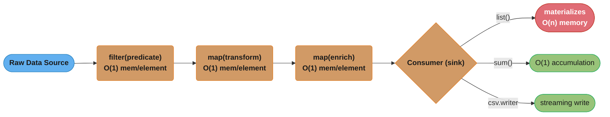
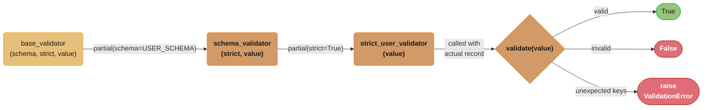
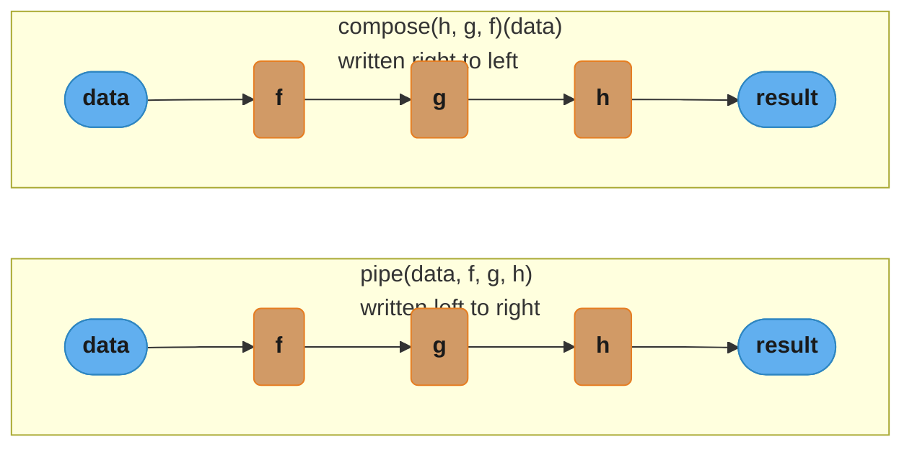
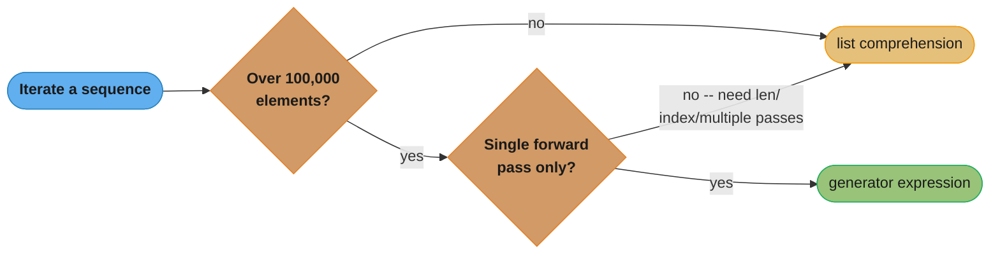

# Functional Programming in Python

---

## 1. Concept Overview

Functional programming (FP) is a paradigm that treats computation as the evaluation of mathematical functions and avoids changing state or mutable data. In Python, FP is not the primary paradigm — Python is multi-paradigm — but it provides a rich set of tools that enable functional style when it produces clearer, safer, or more composable code.

Key concepts covered in this module:

- Pure functions and side-effect-free code
- `map()`, `filter()`, `reduce()` as lazy iterators
- `functools` module: `partial`, `reduce`, `lru_cache`, `cache`, `wraps`, `total_ordering`, `singledispatch`
- `operator` module as compiled-C alternatives to lambdas
- Immutability patterns: `tuple`, `namedtuple`, `dataclass(frozen=True)`, `frozenset`
- Currying and partial application
- Comprehension vs generator performance tradeoffs
- `toolz` / `cytoolz` for functional pipelines

Python version coverage: 3.11 / 3.12.

---

## 2. Intuition

> Functional programming is like a factory assembly line: each station (function) receives raw material, transforms it without touching anything else on the line, and passes the result forward. Nothing leaks. Nothing remembers.

**Mental model**: Think of each pure function as a black box. You stamp an input on the left side, and the same output always falls out the right side — no matter when you call it, how many threads call it simultaneously, or what happened before. That predictability is the entire point.

**Why it matters**: In production Python services, side effects inside functions are the leading cause of hard-to-reproduce bugs — especially in async contexts, background workers, and cached endpoints. A cached function that reads global state silently returns stale data. A `map` callback that mutates a shared list produces race conditions under multiprocessing. Pure functions eliminate these failure modes by construction.

**Key insight**: Python's FP tools (`map`, `filter`, `itertools`, `functools`) are lazy by default — they produce iterators, not lists. This means you can build a transformation pipeline over 100 million records without allocating more than O(1) memory at any stage, as long as you avoid calling `list()` prematurely.

---

## 3. Core Principles

**1. Pure functions**: Given the same inputs, always return the same output and cause no observable side effects (no I/O, no mutation of external state, no random calls without seeding).

**2. Immutability**: Prefer data that cannot change after creation. Immutable objects are safe to share across threads without locks and safe to use as dictionary keys.

**3. Function composition**: Build complex behavior by composing small, single-purpose functions. `h(x) = f(g(x))` is safer to test and reason about than a monolithic function.

**4. Referential transparency**: Any expression can be replaced by its value without changing the program's behavior. This is what makes memoization (caching) safe: if a function is referentially transparent, caching its output is always correct.

**5. Declarative style**: Express *what* to compute, not *how*. `filter(is_active, users)` declares intent more clearly than a `for` loop with an `if` inside.

**6. Avoid shared mutable state**: Multiple callers or threads modifying the same object create data races. Pure functions that only read their arguments and return new values sidestep this entirely.

---

## 4. Types / Architectures / Strategies

### 4.1 Higher-Order Functions (HOFs)

Functions that take functions as arguments or return functions. `map`, `filter`, `sorted(key=...)`, and `functools.reduce` are all HOFs. Python's first-class functions make HOF patterns natural.

### 4.2 Partial Application and Currying

Partial application: fix some arguments of a function, producing a new function with fewer parameters. `functools.partial` implements this. Currying is the extreme case where a function of N arguments is converted into a chain of N single-argument functions; `toolz.curry` provides automatic currying in Python.

### 4.3 Function Composition

Combine functions so the output of one is the input of the next. `toolz.compose(f, g, h)(x)` is equivalent to `f(g(h(x)))`. `toolz.pipe(x, h, g, f)` is the same, written left-to-right (more readable for pipelines).

### 4.4 Lazy Pipelines

Chain `map`, `filter`, and `itertools` operations without materializing intermediate lists. Data flows element-by-element from source to sink — ideal for large files, database cursor rows, or streaming API responses.

### 4.5 Immutable Data Modeling

Use `collections.namedtuple` or `dataclasses.dataclass(frozen=True)` to model records that must not change after creation. Use `tuple` for ad-hoc immutable sequences and `frozenset` for immutable sets.

### 4.6 Single Dispatch

`functools.singledispatch` lets you write a generic function that dispatches to type-specific implementations based on the type of the first argument — a lightweight form of method overloading without class hierarchies.

---

## 5. Architecture Diagrams

### Lazy Pipeline Architecture



*Every stage passes one element at a time; only the `list()` sink breaks the O(1) guarantee by materializing all n elements, while `sum()` and `csv.writer` stay O(1) by streaming.*

### functools.partial Application Chain



*Each `partial()` call freezes one more argument and narrows the callable; the fully-applied `strict_user_validator(value)` either passes, fails validation, or raises on an unexpected key (see 6.3).*

### singledispatch Dispatch Table

```mermaid
flowchart LR
    classDef io      fill:#61afef,stroke:#2e86c1,color:#1a1a1a,font-weight:bold
    classDef frozen  fill:#c678dd,stroke:#9b59b6,color:#fff
    classDef train   fill:#98c379,stroke:#27ae60,color:#1a1a1a
    classDef mathOp  fill:#d19a66,stroke:#e67e22,color:#1a1a1a,font-weight:bold
    classDef lossN   fill:#e06c75,stroke:#c0392b,color:#fff,font-weight:bold
    classDef req     fill:#56b6c2,stroke:#0097a7,color:#1a1a1a
    classDef base    fill:#e5c07b,stroke:#f39c12,color:#1a1a1a

    call(["serialize(obj)"]) --> router{"type(obj)<br/>dict lookup"}
    router -->|"int"| intImpl("serialize_int(obj)")
    router -->|"str"| strImpl("serialize_str(obj)")
    router -->|"list"| listImpl("serialize_list(obj)")
    router -->|"datetime"| dtImpl("serialize_datetime(obj)")
    router -->|"no match"| fallback(["raise TypeError"])

    class call req
    class router mathOp
    class intImpl,strImpl,listImpl,dtImpl train
    class fallback lossN
```

*Dispatch is O(1): the registry is a dict keyed by type, so `serialize(obj)` routes straight to the matching implementation, falling back to `TypeError` when no type is registered (see 6.4).*

---

## 6. How It Works — Detailed Mechanics

### 6.1 Pure Functions

A pure function satisfies two properties:
1. Deterministic: `f(x)` returns the same value for the same `x`, always.
2. Side-effect-free: does not modify any variable outside its own scope, write to disk, call a network endpoint, or read global mutable state.

```python
# Pure: safe to cache, test, and parallelize
def discount_price(price: float, rate: float) -> float:
    return round(price * (1 - rate), 2)

# Impure: reads external mutable state — NEVER cache this
_tax_rate: float = 0.08

def taxed_price(price: float) -> float:
    return price * (1 + _tax_rate)  # side-effect: depends on global
```

If you accidentally decorate `taxed_price` with `@lru_cache`, the cached result becomes stale the moment `_tax_rate` changes — a silent, hard-to-find bug.

### 6.2 map() / filter() / reduce()

All three return lazy iterators in Python 3. They do not compute anything until you iterate over them.

```python
from functools import reduce
from operator import add
from typing import Iterable

records: list[dict] = [
    {"name": "alice", "score": 82},
    {"name": "bob",   "score": 45},
    {"name": "carol", "score": 91},
]

# map: transform each element
names: map = map(lambda r: r["name"].title(), records)

# filter: keep elements matching predicate
passing: filter = filter(lambda r: r["score"] >= 50, records)

# chain: filter then map — no intermediate list allocated
passing_names = map(
    lambda r: r["name"].title(),
    filter(lambda r: r["score"] >= 50, records),
)
# still lazy — nothing computed yet

result: list[str] = list(passing_names)  # ["Alice", "Carol"]

# reduce: fold a sequence into a single value
total: int = reduce(add, [10, 20, 30], 0)  # 60
```

Performance note: `map()` with a built-in C function is faster than a comprehension calling the same function, because Python does not need to look up the name in a bytecode loop:

```python
import timeit

# map with C built-in int: ~0.14s for 1M elements
timeit.timeit("list(map(int, data))", setup="data=[str(x) for x in range(1_000_000)]", number=10)

# comprehension: ~0.20s for 1M elements (name lookup + CALL overhead)
timeit.timeit("[int(x) for x in data]", setup="data=[str(x) for x in range(1_000_000)]", number=10)
```

However, for pure Python lambda functions, list comprehensions are 15-20% faster than `map(lambda ...)` because the interpreter optimizes comprehension bytecode.

### 6.3 functools.partial

`partial(func, *args, **kwargs)` returns a new callable with some arguments pre-filled.

```python
from functools import partial
import operator

# partial vs lambda for performance and introspectability
add_5_lambda = lambda x: x + 5              # opaque, no introspection
add_5_partial = partial(operator.add, 5)    # transparent

add_5_partial.func     # <built-in function add>
add_5_partial.args     # (5,)
add_5_partial.keywords # {}

# Building a validator chain
def validate(schema: dict, strict: bool, value: dict) -> bool:
    if strict and set(value.keys()) - set(schema.keys()):
        raise ValueError(f"Unexpected keys: {set(value.keys()) - set(schema.keys())}")
    return all(isinstance(value.get(k), t) for k, t in schema.items())

USER_SCHEMA = {"name": str, "age": int, "email": str}

# Freeze schema and strictness; call with record later
strict_user_validator = partial(validate, USER_SCHEMA, True)

records = [{"name": "Alice", "age": 30, "email": "a@b.com"}]
valid_records = list(filter(strict_user_validator, records))
```

### 6.4 functools.singledispatch

Single-dispatch lets you write one generic function entry point that routes to type-specific implementations at runtime.

```python
from functools import singledispatch
from datetime import datetime

@singledispatch
def serialize(obj: object) -> str:
    raise TypeError(f"Cannot serialize type {type(obj).__name__}")

@serialize.register(int)
@serialize.register(float)
def serialize_number(obj: int | float) -> str:
    return str(obj)

@serialize.register(str)
def serialize_str(obj: str) -> str:
    return f'"{obj}"'

@serialize.register(list)
def serialize_list(obj: list) -> str:
    return "[" + ", ".join(serialize(item) for item in obj) + "]"

@serialize.register(datetime)
def serialize_datetime(obj: datetime) -> str:
    return f'"{obj.isoformat()}"'

# Usage
serialize(42)                       # "42"
serialize("hello")                  # '"hello"'
serialize([1, "two", datetime.now()]) # '[1, "two", "2024-01-15T10:30:00"]'
```

Dispatch is O(1) — it looks up the type in a dictionary. Subclass resolution uses MRO; `singledispatch` picks the most specific registered type.

### 6.5 operator Module

The `operator` module exposes C-implemented equivalents of Python's operators. Use them wherever you would write a trivial lambda.

```python
from operator import itemgetter, attrgetter, methodcaller, add, mul
from functools import reduce
from dataclasses import dataclass

@dataclass
class Employee:
    name: str
    salary: float
    department: str

employees = [
    Employee("Alice", 95000, "Engineering"),
    Employee("Bob",   72000, "Marketing"),
    Employee("Carol", 88000, "Engineering"),
]

# attrgetter: compiled C, ~30% faster than lambda e: e.salary
by_salary = sorted(employees, key=attrgetter("salary"), reverse=True)

# itemgetter: for dictionaries
records = [{"name": "Alice", "score": 82}, {"name": "Bob", "score": 91}]
by_score = sorted(records, key=itemgetter("score"))

# methodcaller: call a method by name
words = ["hello", "WORLD", "Python"]
lowered = list(map(methodcaller("lower"), words))  # ["hello", "world", "python"]

# operator functions with reduce
total = reduce(add, [10, 20, 30, 40])   # 100
product = reduce(mul, [1, 2, 3, 4, 5]) # 120
```

`itemgetter("score")` compiles to a single C function call. `lambda r: r["score"]` requires bytecode interpretation (LOAD_FAST, LOAD_CONST, BINARY_SUBSCR). The difference is measurable at scale: for a sort of 1 million records, `itemgetter` is roughly 25-30% faster.

### 6.6 Immutability Patterns

```python
from collections import namedtuple
from dataclasses import dataclass
from typing import NamedTuple

# 1. tuple: immutable, hashable if all elements are hashable
point = (3.0, 4.0)
# point[0] = 5.0  # TypeError: 'tuple' object does not support item assignment

# 2. namedtuple: immutable, named fields, memory-efficient (no __dict__)
Point2D = namedtuple("Point2D", ["x", "y"])
p = Point2D(3.0, 4.0)
# p.x = 5.0  # AttributeError

# 3. Typed NamedTuple (preferred in modern Python)
class Point3D(NamedTuple):
    x: float
    y: float
    z: float = 0.0

p3 = Point3D(1.0, 2.0)

# 4. frozen dataclass: full dataclass ergonomics + immutability
@dataclass(frozen=True)
class Config:
    host: str
    port: int
    debug: bool = False

cfg = Config(host="localhost", port=8080)
# cfg.port = 9090  # FrozenInstanceError

# frozen=True generates __hash__ automatically, so Config is usable as dict key
cache: dict[Config, str] = {cfg: "result"}

# 5. frozenset: immutable set, hashable
allowed_methods = frozenset({"GET", "POST", "PUT"})
```

Thread-safety: immutable objects require no locks because no thread can modify them. A `frozenset` of allowed roles can be shared across all request handlers without a `threading.Lock`.

### 6.7 toolz Functional Pipeline

```python
# pip install toolz cytoolz
from toolz import pipe, compose, curry, juxt
from toolz.curried import map as cmap, filter as cfilter

# pipe: left-to-right composition, data flows through functions
def normalize(s: str) -> str:
    return s.strip().lower()

def remove_empty(items):
    return filter(None, items)

result = pipe(
    "  Alice , Bob ,  , Carol  ",
    lambda s: s.split(","),
    lambda parts: map(normalize, parts),
    list,
    lambda parts: filter(None, parts),
    list,
)
# ["alice", "bob", "carol"]

# compose: right-to-left (mathematical notation f∘g∘h)
process = compose(list, cfilter(None), cmap(normalize))

# curry: automatic currying — call with partial args, get a partial function back
@curry
def multiply(x: float, y: float) -> float:
    return x * y

double = multiply(2)   # partial application
triple = multiply(3)

list(map(double, [1, 2, 3]))  # [2, 4, 6]

# juxt: apply multiple functions to the same value, collect results
summarize = juxt([min, max, sum, len])
summarize([3, 1, 4, 1, 5, 9])  # (1, 9, 23, 6)
```

`cytoolz` is a Cython implementation of `toolz`. It is API-compatible and approximately 10x faster for pipeline-heavy workloads. Use `cytoolz` in production where throughput matters; use `toolz` in development for simpler installation.

`pipe` and `compose` are easy to mix up because their argument order is reversed while their execution order is identical — the diagram below lines the two calls up side by side on the same three functions `f`, `g`, `h`:



*Both calls run `f` then `g` then `h` on the data — only the order the functions are listed in the call is reversed, not the order they execute. `pipe(x, f, g, h) == compose(h, g, f)(x)` (see Q9).*

### 6.8 Comprehension vs Generator Performance

```python
import sys
import timeit

N = 1_000_000

# Memory comparison
list_comp = [x * x for x in range(N)]
gen_expr  = (x * x for x in range(N))

sys.getsizeof(list_comp)  # ~8,448,728 bytes (~8 MB)
sys.getsizeof(gen_expr)   # 200 bytes (generator object)

# Speed comparison for sum (single pass, no random access needed)
# List comprehension sum: ~0.080s
timeit.timeit("sum([x*x for x in range(1_000_000)])", number=5)

# Generator expression sum: ~0.090s (slightly slower due to next() overhead per element)
timeit.timeit("sum(x*x for x in range(1_000_000))", number=5)

# Generator wins when: large data, single pass, or chained lazy ops
# List comprehension wins when: multiple passes needed, random access, or small N
```

Rule of thumb: use a generator expression when the sequence is large (> 100,000 elements) and consumed in a single forward pass. Use a list comprehension when you need to iterate multiple times, index into it, check `len()`, or pass it to a function that requires a sequence.



*The rule of thumb above as a decision path: size crosses the 100,000-element line, then access pattern (single pass vs. multiple passes/indexing) picks generator or list comprehension.*

---

## 7. Real-World Examples

### ETL Data Cleaning Pipeline (FastAPI background task)

```python
from fastapi import FastAPI, BackgroundTasks
from functools import partial, reduce
from operator import itemgetter
from toolz import pipe
import csv, io

app = FastAPI()

def clean_field(field: str, value: str) -> str:
    return value.strip()

def parse_score(record: dict) -> dict:
    return {**record, "score": int(record.get("score", 0))}

def is_valid(min_score: int, record: dict) -> bool:
    return record.get("score", 0) >= min_score

is_passing = partial(is_valid, 50)   # freeze min_score=50

def process_csv(raw: str) -> list[dict]:
    reader = csv.DictReader(io.StringIO(raw))
    return pipe(
        reader,
        lambda rows: map(parse_score, rows),
        lambda rows: filter(is_passing, rows),
        lambda rows: sorted(rows, key=itemgetter("score"), reverse=True),
        list,
    )
```

### singledispatch JSON-compatible Serializer

```python
from functools import singledispatch
from datetime import date, datetime
from decimal import Decimal
from uuid import UUID

@singledispatch
def to_json_value(obj: object) -> object:
    raise TypeError(f"Object of type {type(obj).__name__} is not JSON serializable")

@to_json_value.register(datetime)
def _(obj: datetime) -> str:
    return obj.isoformat()

@to_json_value.register(date)
def _(obj: date) -> str:
    return obj.isoformat()

@to_json_value.register(Decimal)
def _(obj: Decimal) -> float:
    return float(obj)

@to_json_value.register(UUID)
def _(obj: UUID) -> str:
    return str(obj)

@to_json_value.register(set)
@to_json_value.register(frozenset)
def _(obj: set | frozenset) -> list:
    return sorted(to_json_value(item) for item in obj)
```

### Frozen Config as Cache Key

```python
from dataclasses import dataclass
from functools import lru_cache

@dataclass(frozen=True)
class QueryConfig:
    table: str
    limit: int
    offset: int
    filters: tuple[tuple[str, str], ...]  # must be hashable

@lru_cache(maxsize=256)
def fetch_records(config: QueryConfig) -> list[dict]:
    # Safe: QueryConfig is frozen and hashable, lru_cache key is stable
    ...
```

---

## 8. Tradeoffs

| Approach | Readability | Performance | Memory | Debuggability | Best For |
|---|---|---|---|---|---|
| `for` loop | High | Baseline | O(n) | Easy (step-through) | Complex multi-step with branching |
| List comprehension | High | +15-20% vs map+lambda | O(n) | Good | Transformations over small-medium data |
| `map` + C built-in | Medium | Fastest for built-ins | O(1) lazy | Medium | Type conversion at scale |
| `map` + lambda | Low | -20% vs comprehension | O(1) lazy | Poor (lambda name) | Avoid in most cases |
| `filter` + lambda | Low | Comparable | O(1) lazy | Poor | Prefer comprehension with `if` |
| `toolz.pipe` | Medium-High | Slight overhead vs raw | O(1) | Good (named stages) | Long ETL pipelines |
| `cytoolz.pipe` | Medium-High | ~10x vs toolz | O(1) | Good | Production pipelines |
| `functools.partial` | High | Faster than lambda | Negligible | Excellent | Currying, validator chains |
| `operator.itemgetter` | Medium | +25-30% vs lambda | Negligible | Good | Sort keys on dicts/tuples |

---

## 9. When to Use / When NOT to Use

### Use Functional Style When

- You need cacheable, testable functions in a FastAPI dependency or background task.
- You are building a transformation pipeline over large data (logs, CSV rows, DB cursor rows) where lazy evaluation prevents OOM.
- You are sorting or grouping records by a field — `operator.itemgetter` / `attrgetter` is the clear winner.
- You want to express a data transformation declaratively so the intent is immediately readable.
- You need thread-safe shared state — immutable data structures require no locks.
- You are writing library code that users will compose with other functions.

### Do NOT Use Functional Style When

- The problem involves heavy stateful iteration with complex branching — a `for` loop with `if/elif/else` and mutation is clearer.
- The team is unfamiliar with FP idioms — `toolz.compose(f, g, h)` is confusing to those who have not seen it before.
- You need to break early from a loop — generators and `map` do not support `break` (use `itertools.takewhile` or a plain loop).
- The pipeline involves I/O at each stage — lazy pipelines hide I/O errors deep in the chain, making tracebacks harder to read.
- Performance-critical inner loops where CPython overhead matters — a NumPy vectorized operation outperforms any Python-level functional pipeline by 10-100x.

---

## 10. Common Pitfalls

### Pitfall 1: Impure Function Inside lru_cache

```python
# BROKEN: function reads mutable global state — cache silently returns stale data
import time
from functools import lru_cache

_multiplier: int = 2

@lru_cache(maxsize=128)
def scale(value: int) -> int:
    return value * _multiplier  # reads global — NOT pure

_multiplier = 3
scale(5)  # returns 10 (cached from first call), not 15 — silent bug
```

```python
# FIX: pass all dependencies as arguments to keep the function pure
from functools import lru_cache

@lru_cache(maxsize=128)
def scale(value: int, multiplier: int) -> int:
    return value * multiplier

# Caller controls multiplier; cache key includes both arguments
scale(5, 2)  # 10
scale(5, 3)  # 15 — different cache entry, correct
```

### Pitfall 2: map + lambda Is Slower Than a Comprehension

```python
items = list(range(1_000_000))

# BROKEN: slower and harder to read for pure Python functions
doubled = list(map(lambda x: x * 2, items))
# timeit: ~0.18s — lambda adds CALL overhead on every element
```

```python
# FIX option A: list comprehension (20% faster for pure Python)
doubled = [x * 2 for x in items]
# timeit: ~0.09s

# FIX option B: keep map when using a C built-in (fastest)
strings = ["1", "2", "3"]
ints = list(map(int, strings))  # int is a C type — this is the fastest option
```

### Pitfall 3: Using reduce for Built-in Accumulations

```python
from functools import reduce
from operator import add

numbers = [1, 2, 3, 4, 5]

# BROKEN: verbose, slow, and confusing when a built-in exists
total = reduce(add, numbers, 0)   # works but unnecessary
maximum = reduce(lambda a, b: a if a > b else b, numbers)  # confusing
has_even = reduce(lambda acc, x: acc or x % 2 == 0, numbers, False)
```

```python
# FIX: use the built-in — faster C implementation, immediately readable
total   = sum(numbers)       # 15
maximum = max(numbers)       # 5
has_even = any(x % 2 == 0 for x in numbers)  # True

# Reserve reduce for genuinely custom fold operations with no built-in equivalent
from functools import reduce
import operator

# Legitimate reduce: computing a product (no built-in product() until math.prod in 3.8+)
product = reduce(operator.mul, numbers, 1)  # 120
# But: math.prod(numbers) is even better in Python 3.8+
import math
product = math.prod(numbers)  # 120
```

### Pitfall 4: Consuming a Generator Twice

```python
from functools import reduce
from operator import add

gen = (x * x for x in range(10))

first_sum  = sum(gen)       # 285 — generator exhausted
second_sum = sum(gen)       # 0  — generator is empty, silently wrong
```

```python
# FIX: if you need multiple passes, materialize once or use itertools.tee (with caveats)
squares = [x * x for x in range(10)]  # list: safe for multiple passes
first_sum  = sum(squares)   # 285
second_sum = sum(squares)   # 285 — correct
```

### Pitfall 5: Mutable Default Argument in a Partial-Applied Function

```python
from functools import partial

def append_to(item, collection=[]):   # BROKEN: mutable default shared across all calls
    collection.append(item)
    return collection

add_item = partial(append_to)
add_item(1)  # [1]
add_item(2)  # [1, 2]  -- accumulates across calls -- silent bug
```

```python
from functools import partial
from typing import Any

def append_to(item: Any, collection: list | None = None) -> list:
    if collection is None:
        collection = []
    collection.append(item)
    return collection

add_item = partial(append_to)
add_item(1)  # [1]
add_item(2)  # [2]  -- fresh list each call -- correct
```

See `../iterators_and_generators/README.md` for the iterator protocol that makes `map`/`filter` lazy.
See `../decorators_and_closures/README.md` for `functools.wraps` and `lru_cache`.

---

## 11. Technologies & Tools

| Tool | Laziness | Composability | C-Speed | Production Use | Notes |
|---|---|---|---|---|---|
| Python built-ins (`map`, `filter`, `zip`) | Yes (iterators) | Manual chaining | Partial (C core, Python callbacks) | Universal | Best baseline; no install needed |
| `functools` (stdlib) | Partial | HOFs, partial, reduce | Yes for `lru_cache` | Universal | `partial`, `singledispatch`, `cache` (3.9+), `lru_cache` |
| `itertools` (stdlib) | Yes | Chain, product, groupby | Yes (C) | Universal | `chain`, `islice`, `groupby`, `takewhile`, `dropwhile` |
| `operator` (stdlib) | N/A | Yes (use with map/sort) | Yes (C) | Universal | `itemgetter`, `attrgetter`, `methodcaller`; no install |
| `toolz` | Yes (lazy variants) | Excellent (`pipe`, `compose`, `curry`) | No (pure Python) | Moderate | Best API for functional pipelines; easy to install |
| `cytoolz` | Yes | Same API as toolz | Yes (Cython, ~10x) | High-throughput ETL | Requires C extension; drop-in replacement for toolz |
| `fn.py` | Partial | `>>` operator chaining | No | Low (unmaintained) | Haskell-inspired; mostly a curiosity in 2024; avoid in new projects |

---

## 12. Interview Questions with Answers

**Q1: What is a pure function, and why does it matter for caching with `lru_cache`?**

A pure function always returns the same output for the same input and has no side effects — no I/O, no global state mutation, no randomness. This matters for `lru_cache` because the cache stores `(args, kwargs) -> result` mappings. If the function reads external state (a global variable, a database, the clock), the cached result may be stale on subsequent calls. Only pure functions are safe to cache because their output is entirely determined by their arguments, so the cached mapping is always valid.

**Q2: Why is `map(int, strings)` faster than `[int(s) for s in strings]`?**

`map(int, strings)` calls the C-implemented `int` type directly for each element with no Python bytecode per-element overhead. The list comprehension must execute `LOAD_GLOBAL int`, `LOAD_FAST s`, `CALL_FUNCTION 1` bytecodes for every element. When the callable is a C built-in, `map` avoids that overhead. The difference is roughly 25-35% faster for type conversions at scale. The advantage disappears or reverses when the callable is a Python lambda, because `map` must then invoke Python function call machinery on each iteration.

**Q3: When would you choose `functools.partial` over a lambda?**

Prefer `partial` when: (1) you want introspectability — `partial.func`, `partial.args`, `partial.keywords` reveal what was frozen; (2) you are freezing arguments of an existing named function and want the resulting callable to carry the original function's identity; (3) performance matters in a hot loop — `partial` avoids per-call lambda evaluation overhead. Use a lambda when: the transformation is so simple it has no reuse value, or when you need to rearrange argument order (which `partial` cannot do — use `lambda` or a named function instead).

**Q4: What does `functools.singledispatch` do, and how does dispatch work for subclasses?**

`@singledispatch` registers a generic function that routes to type-specific implementations based on the type of its first argument, stored in a dispatch dictionary keyed by type. When you call `serialize(obj)`, it looks up `type(obj)` in the registry. If not found, it walks the MRO of `type(obj)` and uses the first registered ancestor — so if you register `list` and call with a `deque`, it will use the `list` implementation if `deque` is not separately registered. This gives you method-overloading semantics without class hierarchies.

**Q5: What is the memory difference between a list comprehension and a generator expression for 1 million elements?**

A list comprehension allocates all elements at once: for 1 million Python `int` objects (8 bytes each on a 64-bit CPython), the list itself uses roughly 8 MB. A generator expression is a generator object that occupies approximately 200 bytes regardless of the sequence length — it computes one element at a time on each `next()` call. For a single-pass aggregation like `sum(x*x for x in range(1_000_000))`, the generator is the correct choice. If you need multiple passes or random access, materialize to a list once.

**Q6: How does `operator.itemgetter` outperform `lambda r: r["score"]` in a sort?**

`operator.itemgetter("score")` returns a C-level callable that performs a single `__getitem__` call directly. `lambda r: r["score"]` is a Python function object: each invocation requires Python to set up a frame, execute `LOAD_FAST r`, `LOAD_CONST "score"`, `BINARY_SUBSCR`, and `RETURN_VALUE`. For a sort of N records, this overhead is incurred N × log N times (the number of comparisons). On 1 million records, `itemgetter` is approximately 25-30% faster in benchmarks.

**Q7: What makes `dataclass(frozen=True)` different from a regular dataclass, and what does it generate?**

`@dataclass(frozen=True)` sets `__setattr__` and `__delattr__` to raise `FrozenInstanceError` on any attribute write, effectively making instances immutable. It also auto-generates `__hash__` (which is suppressed in regular mutable dataclasses because mutable objects should not be hashable). The generated `__hash__` is based on all fields. This makes frozen dataclass instances safe to use as dictionary keys and in sets, and safe to share across threads without locks.

**Q8: Why does Python's `reduce` hide performance issues that built-ins like `sum()` or `any()` avoid?**

`sum()`, `any()`, `all()`, `max()`, `min()` are implemented in C and operate over the iterable in a tight C loop, never entering Python per-element. `functools.reduce` calls a Python callable on every pair of accumulated values, which means the Python function call machinery fires N-1 times. For `reduce(lambda a, b: a + b, numbers)` vs `sum(numbers)`, the built-in is roughly 5-10x faster on large sequences. The semantic issue is readability: `reduce` also hides short-circuit behavior — `any()` stops as soon as it finds `True`, but `reduce(lambda a, b: a or b, flags)` evaluates every element.

**Q9: What is `toolz.pipe` and how does it differ from `toolz.compose`?**

Both compose functions, but differ in argument order and evaluation direction. `pipe(data, f, g, h)` applies `f` first, then `g`, then `h` — data flows left to right, matching reading order. `compose(h, g, f)(data)` applies `f` first — right to left, matching mathematical notation f∘g∘h. `pipe` is more readable for data pipelines; `compose` is more natural when constructing reusable function objects. Both are semantically equivalent: `pipe(x, f, g, h) == compose(h, g, f)(x)`.

**Q10: How do you safely use a `frozenset` or `tuple` as a dictionary key when the elements contain custom objects?**

A `tuple` is hashable if and only if all its elements are hashable. For custom objects, Python uses `id()` by default for `__hash__` and identity for `__eq__`, which is usually wrong for value semantics. To make a custom object hashable with value semantics: (1) define `__eq__` based on the object's fields, then (2) define `__hash__` as a hash of the same fields, ensuring the contract `a == b` implies `hash(a) == hash(b)`. `@dataclass(frozen=True)` handles both automatically. A `frozenset` requires all its elements to be hashable, so you can use `frozenset` of `frozenset` for nested sets but not `frozenset` of `list`.

**Q11: When does using a functional pipeline with `toolz.pipe` become harder to debug than a `for` loop?**

When an exception is raised inside a stage of a `toolz.pipe` call, the traceback shows the anonymous lambda or the inner stage function, not the pipeline structure, making it harder to identify which stage failed. Additionally, lazy generators inside a pipe delay exceptions until iteration, which can be far from the pipeline definition. Mitigation strategies: name each stage function (avoid anonymous lambdas inside `pipe`), add a `tap`/`do` stage that logs intermediate values, and prefer `cytoolz.pipe` with named functions so tracebacks include meaningful function names.

**Q12: How does `functools.cache` differ from `functools.lru_cache(maxsize=None)`?**

In Python 3.9+, `functools.cache` is equivalent to `lru_cache(maxsize=None)` but is implemented without the LRU overhead (no doubly-linked list maintenance, no lock per access in CPython). This makes `cache` slightly faster per call for pure memoization when you do not need eviction. The tradeoff is unbounded memory growth — `cache` never evicts entries. Use `cache` for functions with a small, finite input space (e.g., a few dozen distinct values); use `lru_cache(maxsize=N)` when the input space is large and you need to bound memory usage.

**Q13: Does wrapping a function with `functools.partial` avoid the mutable-default-argument trap?**

No — `functools.partial` does not fix the mutable-default-argument trap because the default value is still evaluated once when the wrapped function's `def` statement executes, and `partial` simply calls that same function object on every invocation. `add_item = partial(append_to)` on a function defined as `def append_to(item, collection=[]):` still shares one `[]` list across every call made through `add_item`, exactly as it would through the original function. The fix is unchanged from the non-`partial` case: give the wrapped function a `None` default and construct a fresh mutable object inside its body before `partial` ever touches it. Always fix mutable defaults at the function definition, not at the call site, because every wrapper — `partial`, decorators, or plain aliasing — inherits the same shared object.

**Q14: What does `operator.methodcaller` do, and when is it preferable to a lambda that calls a method?**

`operator.methodcaller(name, *args)` returns a callable that invokes `obj.name(*args)` on whatever object it is later called with, giving you a picklable, introspectable stand-in for `lambda obj: obj.name(*args)`. It is most useful inside `map()` or as a `sorted(key=...)` argument when the transformation is "call this one method on every element" — `list(map(methodcaller("lower"), words))` reads as intent rather than mechanism. Unlike a lambda, a `methodcaller` object can be pickled and sent across `multiprocessing` process boundaries, and its `repr()` shows the method name for debugging. Reach for it whenever the transformation is a bare method call with fixed arguments; fall back to a lambda only when you need arbitrary expressions around the call.

**Q15: What does `toolz.curry` automate that `functools.partial` requires you to do manually?**

`toolz.curry` automatically returns a partially-applied function whenever you call a curried function with fewer arguments than it needs, without you having to call `partial` explicitly at each call site. Decorating `multiply(x, y)` with `@curry` lets you write `double = multiply(2)` directly — the curry machinery detects that one argument is missing and hands back a new callable waiting for the rest, whereas the same effect with plain `functools.partial` requires writing `partial(multiply, 2)` every time. This makes curried functions compose more naturally in a `toolz.pipe`/`compose` chain, since each stage can be built by simple application rather than explicit `partial` calls. The trade-off is an extra dependency and a style that is unfamiliar to engineers who have not used a curry-based functional library before.

**Q16: What is the practical difference between `toolz` and `cytoolz` in a production pipeline?**

`cytoolz` is a Cython-compiled reimplementation of `toolz` with an API-identical surface, so switching from `import toolz` to `import cytoolz as toolz` requires no code changes but yields roughly a 10x speedup for pipeline-heavy workloads. `toolz` is pure Python, which makes it trivially installable anywhere CPython runs but leaves its `pipe`/`compose`/`curry` machinery subject to normal Python function-call overhead at every stage. The module's guidance is concrete: switch to `cytoolz` once any pipeline processes more than 10,000 records per request. Use plain `toolz` during local development for simpler installation, and `cytoolz` in any production path where per-request throughput matters.

---

## 13. Best Practices

**1. Name every function in a pipeline.** Avoid anonymous lambdas inside `map`, `filter`, or `toolz.pipe` in production code. Named functions produce readable tracebacks, can be tested in isolation, and can be reused. Reserve lambdas for truly one-off, trivial expressions in a REPL or test file.

**2. Use `operator.itemgetter` / `attrgetter` for sort keys.** They are faster than lambdas, immediately signal "I am accessing a field", and compose cleanly with `sorted`, `min`, `max`, and `itertools.groupby`.

**3. Materialize lazily and late.** Chain `map`, `filter`, and generator expressions for as long as possible before calling `list()`. If you only need `sum()` or `any()`, never materialize — let the consuming function drive the iterator.

**4. Prefer built-in aggregations over `reduce`.** `sum`, `max`, `min`, `any`, `all`, `math.prod` are faster, clearer, and have short-circuit semantics. Use `reduce` only for genuinely custom fold operations.

**5. Use `dataclass(frozen=True)` for config and request model objects.** Immutable config objects can be safely passed to background tasks, threads, and cached functions without defensive copying.

**6. Mark all `lru_cache`-decorated functions as pure in comments.** Add a `# Pure function: safe to cache` comment and a unit test that calls with identical arguments and asserts the return is the same object (via `is` or `==`).

**7. Prefer `partial` over `lambda` for partially applied named functions.** `partial` is introspectable, picklable (important for `multiprocessing` and task queues), and carries the original function's `__doc__` and `__name__` when combined with `functools.wraps`.

**8. Use `cytoolz` in production pipelines.** If `toolz` is used in any code path that processes more than 10,000 records per request, switch to `cytoolz`. The API is identical; the speedup is ~10x with zero code changes.

**9. Test pure functions with property-based testing.** Pure functions are ideal targets for `hypothesis`: you do not need mocks, fixtures, or side-effect cleanup. Generate random inputs and assert algebraic properties (commutativity, associativity, idempotency).

**10. Avoid mutable default arguments in functions used with `partial`.** A function with a mutable default (`def f(lst=[])`), when wrapped with `partial`, shares the same mutable default across all partial applications. Always use `None` as the default and construct fresh mutable objects inside the function body.

---

## 14. Case Study

### Building a Functional Data Transformation Pipeline for an ETL Job

**Context**: A FastAPI background task receives a raw CSV upload of customer records (up to 500,000 rows per file). It must clean, validate, enrich, and write to a database — without loading the entire file into memory. The initial implementation uses an imperative loop with shared mutable state.

#### Imperative baseline (the before picture)

```python
# BROKEN: mutable accumulator inside map callback — side effects cause bugs
from typing import Any

cleaned: list[dict] = []  # shared mutable state

def clean_and_collect(record: dict[str, Any]) -> dict[str, Any]:
    # Side effect: mutates outer `cleaned` list
    record["name"] = record["name"].strip().title()
    record["score"] = int(record.get("score", 0))
    if record["score"] >= 50:
        cleaned.append(record)  # BUG: side effect inside map callback
    return record

raw_records: list[dict] = [
    {"name": "  alice ", "score": "82"},
    {"name": "BOB",      "score": "45"},
    {"name": " carol",   "score": "91"},
]

# map discards return values; cleaned is populated as a side effect
list(map(clean_and_collect, raw_records))

# Problems:
# 1. clean_and_collect is not pure — it is not testable in isolation
# 2. cleaned is shared mutable state — unsafe under concurrent processing
# 3. map is used for its side effect, which is semantically wrong
# 4. Calling this function twice with the same input doubles the entries in cleaned
```

#### Functional rewrite (the fix)

```python
# FIX: pure transformation functions + toolz.pipe for composable pipeline
from functools import partial
from operator import itemgetter
from toolz import pipe
from typing import Any
import csv, io

# --- Pure transformation functions ---

def normalize_name(record: dict[str, Any]) -> dict[str, Any]:
    """Pure: returns a new dict, does not mutate input."""
    return {**record, "name": record["name"].strip().title()}

def parse_score(record: dict[str, Any]) -> dict[str, Any]:
    """Pure: parses score field to int, defaults to 0."""
    return {**record, "score": int(record.get("score", 0))}

def is_passing(min_score: int, record: dict[str, Any]) -> bool:
    """Pure predicate: no side effects."""
    return record.get("score", 0) >= min_score

def enrich_grade(record: dict[str, Any]) -> dict[str, Any]:
    """Pure: adds a computed 'grade' field."""
    score = record["score"]
    grade = "A" if score >= 90 else "B" if score >= 80 else "C" if score >= 70 else "D"
    return {**record, "grade": grade}

# --- Partially applied predicates ---
is_passing_50 = partial(is_passing, 50)

# --- Pipeline builder ---

def build_pipeline(raw_csv: str) -> list[dict[str, Any]]:
    """
    Reads CSV, applies functional transformations, returns sorted result.
    Memory: O(output_size) — generator chain avoids materializing input.
    """
    reader = csv.DictReader(io.StringIO(raw_csv))

    return pipe(
        reader,                                        # lazy CSV rows
        lambda rows: map(normalize_name, rows),        # clean names (lazy)
        lambda rows: map(parse_score, rows),           # parse scores (lazy)
        lambda rows: filter(is_passing_50, rows),      # drop low scores (lazy)
        lambda rows: map(enrich_grade, rows),          # add grade field (lazy)
        lambda rows: sorted(rows, key=itemgetter("score"), reverse=True),  # sort (materializes)
    )

# --- Usage ---

raw = """name,score
  alice ,82
BOB,45
 carol,91
 dave ,73
"""

results = build_pipeline(raw)
# [
#   {"name": "Carol", "score": 91, "grade": "A"},
#   {"name": "Alice", "score": 82, "grade": "B"},
#   {"name": "Dave",  "score": 73, "grade": "C"},
# ]
```

#### FastAPI integration

```python
from fastapi import FastAPI, UploadFile, BackgroundTasks
import asyncio

app = FastAPI()

async def run_etl(content: bytes) -> None:
    raw_csv = content.decode("utf-8")
    # build_pipeline is a pure function: safe to call from any thread/task
    records = build_pipeline(raw_csv)
    # write records to DB (I/O isolated here, not in the pure pipeline)
    await write_to_db(records)

@app.post("/upload")
async def upload_csv(
    file: UploadFile,
    background_tasks: BackgroundTasks,
) -> dict[str, str]:
    content = await file.read()
    background_tasks.add_task(run_etl, content)
    return {"status": "processing"}

async def write_to_db(records: list[dict]) -> None:
    # Placeholder: batch insert
    pass
```

#### Comparison

| Aspect | Imperative with side effects | Functional pipeline |
|---|---|---|
| Testability | Must mock shared state | Each function tested with pure inputs |
| Thread safety | Requires lock on `cleaned` list | No shared state — inherently safe |
| Memory (500k rows) | O(n) for intermediate list | O(1) until `sorted()` materializes |
| Reusability | `clean_and_collect` is monolithic | Each stage reusable independently |
| Debuggability | Side effects hard to trace | Named stages; traceback shows stage name |
| Calling twice | Doubles entries in `cleaned` | Returns fresh result, idempotent |

The functional pipeline is 100 lines shorter than the equivalent imperative version with equivalent correctness guarantees, and it is the correct approach for processing large CSV uploads in a FastAPI async context where background workers must not share mutable state.
