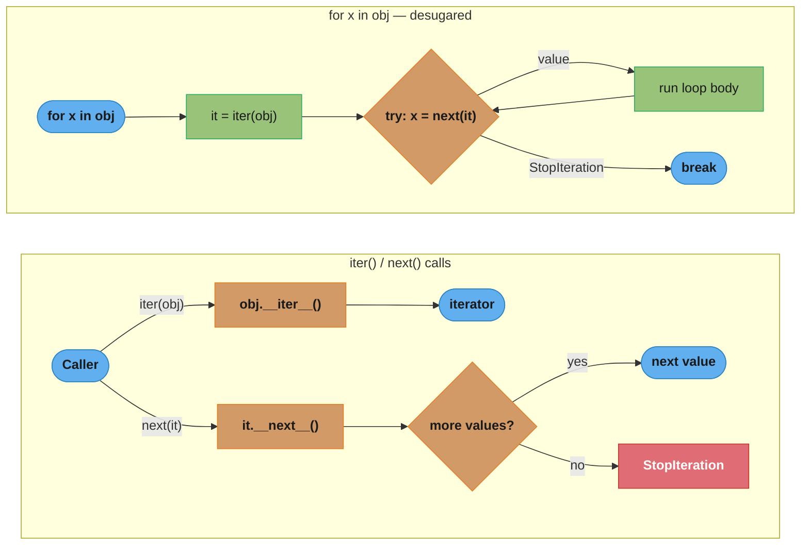
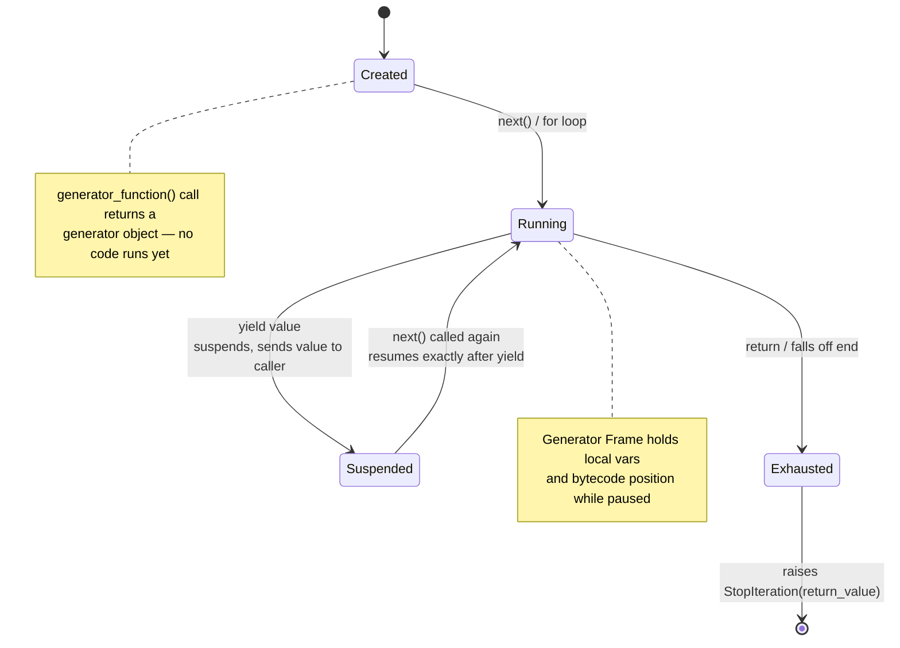
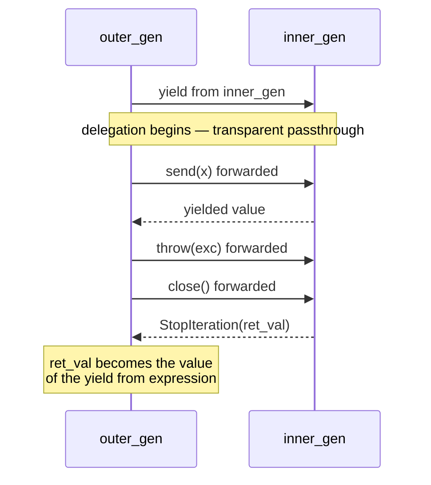
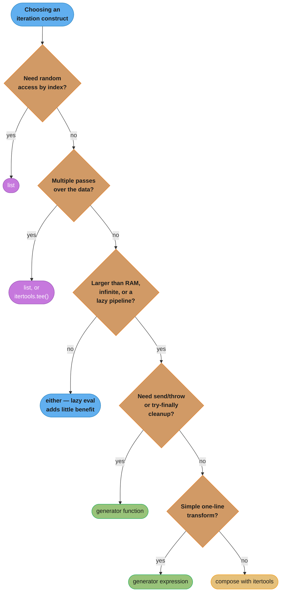
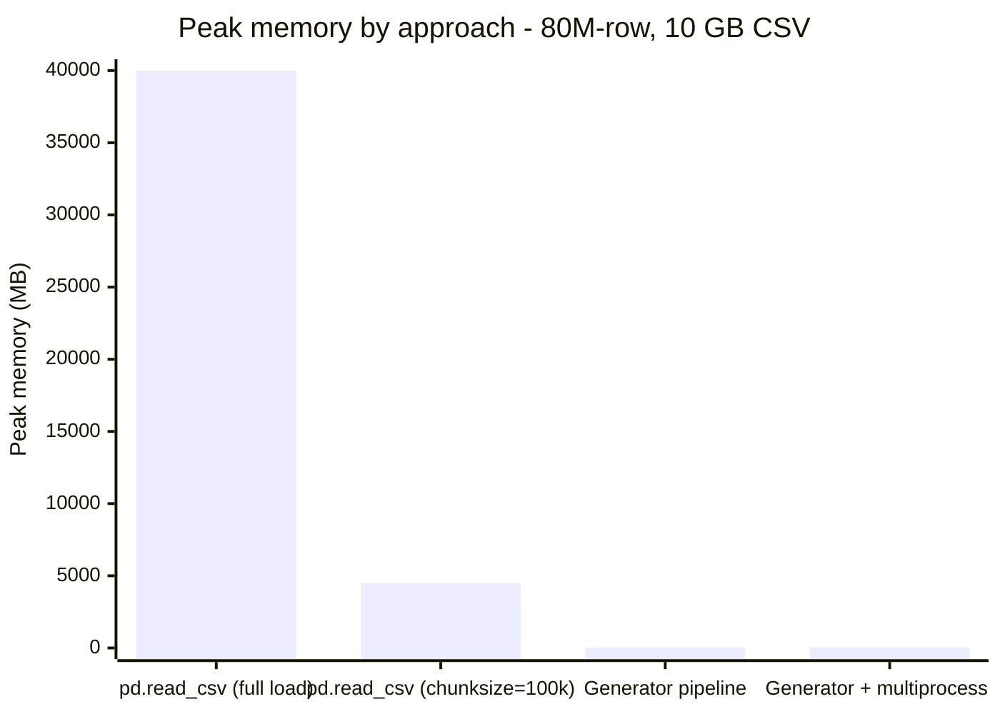

# Iterators & Generators

---

## 1. Concept Overview

Python's iterator protocol provides a unified interface for sequential data access. Any object implementing `__iter__` and `__next__` is an iterator. Generator functions (using `yield`) and generator expressions produce generator objects — lightweight iterators that suspend execution between values, preserving local state on the call stack.

Key primitives covered in this module:

- **Iterator protocol**: `__iter__` / `__next__` / `StopIteration`
- **Generator functions**: `yield`, `return`, state suspension
- **`yield from`** (PEP 380, Python 3.3): sub-iterator delegation
- **Generator expressions**: lazy, memory-efficient comprehension syntax
- **Bidirectional generators**: `send()`, `throw()`, `close()`
- **`itertools`**: composable, lazy combinators from the standard library
- **PEP 479** (Python 3.7+): `StopIteration` inside generators becomes `RuntimeError`
- **Generator-based coroutines**: historical path leading to `async`/`await`

---

## 2. Intuition

> A generator is a bookmark in a recipe book: you can stop mid-way, put the book down, and pick up exactly where you left off — without re-reading everything before.

**Mental model**: Think of a generator as a paused function. Each `yield` is a pause point. The caller pulls the next value with `next()`, and the function resumes from exactly where it stopped — local variables, loop counters, and all intermediate state are preserved on the generator's internal frame.

**Why it matters**: Loading a 10 GB file into memory to process it would require 10 GB of RAM. A generator processes one chunk at a time — memory stays constant at O(1) regardless of data size. The same applies to infinite sequences, streaming APIs, and lazy pipelines.

**Key insight**: Python's `for` loop, list comprehensions, `map()`, `filter()`, and `zip()` all speak the iterator protocol. Writing objects or functions that implement this protocol gives you free integration with every Python built-in — no special adapter code required.

---

## 3. Core Principles

**The iterator protocol (two methods, one rule)**

An *iterable* has `__iter__()` returning an *iterator*. An *iterator* has both `__iter__()` (returning `self`) and `__next__()` (returning the next value or raising `StopIteration`). Iterators are always iterables; not all iterables are iterators.

**Lazy evaluation by default**

Generators produce values on demand. Nothing is computed until the caller calls `next()`. This decouples production from consumption and enables infinite streams.

**Single-pass consumption**

A generator object is exhausted after one full traversal. Unlike a list, you cannot rewind. This is a deliberate design choice: generators do not buffer.

**State encapsulation**

A generator function's local variables, argument bindings, and position in the bytecode are stored in the generator's internal frame object. The frame is suspended on `yield` and resumed on `next()`.

**Composability**

Generators chain naturally. The output of one generator is the input of the next. Combined with `itertools`, you can express complex data transformations as a declarative pipeline with no intermediate collections.

---

## 4. Types / Architectures / Strategies

### 4.1 Custom Iterator Class

Implements `__iter__` and `__next__` explicitly. Useful when you need mutable state that cannot be expressed as a simple generator, or when you need to expose public methods alongside iteration.

```python
class CountUp:
    def __init__(self, start: int, stop: int) -> None:
        self._current = start
        self._stop = stop

    def __iter__(self) -> "CountUp":
        return self

    def __next__(self) -> int:
        if self._current >= self._stop:
            raise StopIteration
        value = self._current
        self._current += 1
        return value
```

### 4.2 Generator Function

A function containing at least one `yield` statement. Calling it returns a generator object immediately — no code runs until `next()` is called.

```python
def count_up(start: int, stop: int):
    current = start
    while current < stop:
        yield current
        current += 1
```

### 4.3 Generator Expression

Inline lazy sequence. Syntax mirrors list comprehensions but uses parentheses. Evaluated lazily, never materialised.

```python
squares = (x ** 2 for x in range(1_000_000))
```

### 4.4 `yield from` — Sub-iterator Delegation (Python 3.3+)

Delegates iteration to an inner iterable, transparently forwarding `send()`, `throw()`, and `close()`. The return value of the delegated generator is captured as the value of the `yield from` expression.

```python
def flatten(nested):
    for item in nested:
        if isinstance(item, list):
            yield from flatten(item)
        else:
            yield item
```

### 4.5 Bidirectional Generator (Coroutine-style)

`send(value)` resumes the generator AND delivers a value to the `yield` expression inside it. Pre-`async/await`, this was the primary coroutine mechanism (PEP 342).

```python
def accumulator():
    total = 0
    while True:
        value = yield total
        if value is None:
            break
        total += value
```

### 4.6 Lazy Pipeline

A chain of generators where each stage consumes the previous one. Data flows through the pipeline one item at a time. Total memory usage is proportional to one item, not the full dataset.

```python
# read → parse → filter → aggregate — all lazy
pipeline = aggregate(filter_valid(parse_rows(read_lines("data.csv"))))
```

---

## 5. Architecture Diagrams

### The Iterator Protocol


*`for x in obj` is pure sugar over these two dunder calls — `iter()` fetches the iterator once, then `next()` is polled in a loop until it raises `StopIteration`, which the loop silently converts into `break`.*

### Generator Function Lifecycle


*Calling a generator function does not run any code — it only allocates the frame. Every `next()` resumes execution exactly at the last `yield`, with local variables intact, until `return` (or falling off the end) raises `StopIteration`.*

### Lazy Pipeline Flow


*Memory footprint at any instant: O(1) — only one row is in flight through the whole pipeline, regardless of file size.*

### `yield from` Delegation


*Unlike a manual `for item in sub: yield item` loop, `yield from` transparently forwards `send()`, `throw()`, and `close()` into the sub-generator and captures its `StopIteration.value` as the expression's own result.*

---

## 6. How It Works — Detailed Mechanics

### 6.1 Iterator Protocol Deep Dive

`iter(obj)` calls `type(obj).__iter__(obj)`. `next(it)` calls `type(it).__next__(it)`. When `__next__` has no more values, it must raise `StopIteration`. The `for` statement desugars exactly to this protocol — there is no magic beyond these two dunder methods.

```python
from __future__ import annotations
from typing import Iterator


class Range10:
    """Reimplements range(10) to show the protocol explicitly."""

    def __init__(self) -> None:
        self._i = 0

    def __iter__(self) -> "Range10":
        # Must return an iterator. For self-iterators, return self.
        return self

    def __next__(self) -> int:
        if self._i >= 10:
            raise StopIteration
        value = self._i
        self._i += 1
        return value


# Desugared for loop:
obj = Range10()
it: Iterator[int] = iter(obj)    # calls obj.__iter__()
while True:
    try:
        x = next(it)              # calls it.__next__()
    except StopIteration:
        break
    print(x)                      # 0 1 2 ... 9
```

Separating *iterable* from *iterator* allows multiple independent traversals:

```python
class MultipassRange:
    def __init__(self, n: int) -> None:
        self._n = n

    def __iter__(self) -> Iterator[int]:
        # Returns a FRESH iterator each time — not self.
        return iter(range(self._n))


r = MultipassRange(5)
print(list(r))   # [0, 1, 2, 3, 4]
print(list(r))   # [0, 1, 2, 3, 4]  — works again
```

### 6.2 Generator Functions — State Suspension

A function containing `yield` compiles to a generator function. Calling it creates a generator object with its own stack frame. No code executes until `next()` is called.

```python
from collections.abc import Generator


def stateful_counter(start: int) -> Generator[int, None, str]:
    """
    Yields[int], receives sends of type None, return value is str.
    The type hint triple: Generator[YieldType, SendType, ReturnType]
    """
    count = start
    while True:
        count += 1
        yield count
    return "done"   # StopIteration("done") when generator finishes


gen = stateful_counter(0)
print(next(gen))    # 1   — count becomes 1, yields, suspends
print(next(gen))    # 2   — resumes, count becomes 2, yields
print(next(gen))    # 3

# Proving local state is preserved:
# 'count' lives in gen.gi_frame.f_locals, not on the Python call stack.
import inspect
frame = gen.gi_frame
print(frame.f_locals["count"])   # 3
```

`return` inside a generator raises `StopIteration` with the return value:

```python
def limited(n: int):
    for i in range(n):
        yield i
    return "finished"


g = limited(2)
print(next(g))   # 0
print(next(g))   # 1
try:
    next(g)
except StopIteration as exc:
    print(exc.value)   # "finished"
```

### 6.3 `yield from` — Full Delegation (Python 3.3+)

`yield from expr` is equivalent to the following **only for simple iteration**:

```python
for item in expr:
    yield item
```

But `yield from` additionally:
- Captures the `StopIteration.value` of the sub-generator as its own expression value
- Forwards `send()` calls into the sub-generator
- Forwards `throw()` calls into the sub-generator
- Calls `close()` on the sub-generator when the outer generator is closed

```python
def inner() -> Generator[int, int, str]:
    received = yield 1
    print(f"inner received: {received}")
    yield 2
    return "inner_done"


def outer() -> Generator[int, int, None]:
    result = yield from inner()   # result = "inner_done"
    print(f"outer got return value: {result}")
    yield 3


g = outer()
print(next(g))      # 1   — inner yields 1
print(g.send(42))   # inner received: 42  →  prints; then inner yields 2  →  2
print(next(g))      # outer got return value: inner_done  →  outer yields 3  →  3
```

This is the foundation for `asyncio`. `await coro` is internally `yield from coro`.

### 6.4 Generator Expressions — Memory Comparison

```python
import sys

# Materialised list: all 10 million integers allocated at once
lst = list(range(10_000_000))
print(sys.getsizeof(lst))   # 85,176,488 bytes — ~85 MB

# Generator expression: only the generator object exists
gen = (x for x in range(10_000_000))
print(sys.getsizeof(gen))   # 128 bytes — the generator object itself

# The values are computed on demand:
print(next(gen))   # 0
print(next(gen))   # 1
# Memory stays at 128 bytes throughout iteration.
```

Generator expressions support conditions and multiple `for` clauses:

```python
# Lazy: only even squares of odd numbers in range
result = (
    x ** 2
    for x in range(100)
    if x % 2 != 0
    if x ** 2 % 3 == 0
)
```

### 6.5 Lazy Pipeline — O(1) Memory Regardless of File Size

```python
import json
from collections.abc import Generator, Iterator
from typing import Any


def read_lines(path: str) -> Generator[str, None, None]:
    """Yields one raw line at a time. File handle held open during iteration."""
    with open(path, encoding="utf-8") as fh:
        yield from fh   # fh is itself a line iterator


def parse_json(lines: Iterator[str]) -> Generator[dict[str, Any], None, None]:
    """Parses each line as JSON, skipping malformed lines."""
    for line in lines:
        stripped = line.strip()
        if not stripped:
            continue
        try:
            yield json.loads(stripped)
        except json.JSONDecodeError:
            pass


def filter_valid(
    records: Iterator[dict[str, Any]],
    required_keys: frozenset[str],
) -> Generator[dict[str, Any], None, None]:
    """Yields only records containing all required keys."""
    for record in records:
        if required_keys.issubset(record):
            yield record


def pipeline(path: str) -> Iterator[dict[str, Any]]:
    lines = read_lines(path)
    records = parse_json(lines)
    valid = filter_valid(records, frozenset({"id", "amount", "ts"}))
    return valid


# Usage — only one record lives in memory at any point:
for record in pipeline("transactions.jsonl"):
    process(record)
```

### 6.6 `itertools` — Key Functions with Real Examples

```python
import itertools
from collections.abc import Iterator
from typing import Any
import requests


def fetch_pages(base_url: str, params: dict[str, Any]) -> Iterator[list[dict]]:
    """Infinite generator yielding successive pages from a paginated API."""
    page = 1
    while True:
        response = requests.get(base_url, params={**params, "page": page}, timeout=10)
        response.raise_for_status()
        data = response.json()
        if not data:
            return
        yield data
        page += 1


def fetch_all_items(base_url: str, max_pages: int = 10) -> Iterator[dict]:
    """Lazily stream individual items, capped at max_pages pages."""
    pages = fetch_pages(base_url, params={"per_page": 100})
    capped = itertools.islice(pages, max_pages)   # stop after max_pages pages
    for page in capped:
        yield from page                            # flatten page list into items


# chain — concatenate multiple iterables without materialising
combined = itertools.chain([1, 2], [3, 4], [5])  # 1 2 3 4 5

# takewhile / dropwhile
evens_only = list(itertools.takewhile(lambda x: x % 2 == 0, [2, 4, 6, 7, 8]))
# [2, 4, 6]  — stops at first odd

# groupby — consecutive groups (sort first!)
data = sorted([{"k": "a"}, {"k": "a"}, {"k": "b"}], key=lambda d: d["k"])
for key, group in itertools.groupby(data, key=lambda d: d["k"]):
    print(key, list(group))

# product — cartesian product (useful for parameter sweeps)
params = list(itertools.product([0.01, 0.001], [32, 64], ["relu", "gelu"]))
# 2 * 2 * 2 = 8 combinations, lazily

# accumulate — running totals
running_sum = list(itertools.accumulate([1, 2, 3, 4, 5]))  # [1, 3, 6, 10, 15]

# starmap — map with argument unpacking
results = list(itertools.starmap(pow, [(2, 3), (3, 2), (10, 2)]))  # [8, 9, 100]
```

### 6.7 `send()`, `throw()`, and `close()`

```python
from collections.abc import Generator


def running_average() -> Generator[float, float | None, None]:
    """
    Bidirectional generator acting as a stateful accumulator.
    send(value) adds to the running total; yields the current average.
    """
    total = 0.0
    count = 0
    while True:
        value = yield total / count if count else 0.0
        if value is None:
            return
        total += value
        count += 1


gen = running_average()
next(gen)          # Prime the generator (advance to first yield). Returns 0.0.
gen.send(10.0)     # total=10, count=1, yields 10.0
gen.send(20.0)     # total=30, count=2, yields 15.0
gen.send(30.0)     # total=60, count=3, yields 20.0


def resilient_processor() -> Generator[str, str, None]:
    """Demonstrates throw() — inject an exception into a suspended generator."""
    while True:
        try:
            item = yield "ready"
            yield f"processed: {item}"
        except ValueError as exc:
            yield f"error: {exc}"


gen2 = resilient_processor()
next(gen2)                           # "ready"
gen2.send("hello")                   # "processed: hello"
next(gen2)                           # "ready"
gen2.throw(ValueError("bad input"))  # "error: bad input"


def cleanup_demo() -> Generator[int, None, None]:
    """close() injects GeneratorExit; try/finally guarantees cleanup."""
    try:
        for i in range(100):
            yield i
    finally:
        print("cleanup: releasing resources")   # always runs on close()


gen3 = cleanup_demo()
next(gen3)   # 0
next(gen3)   # 1
gen3.close() # prints "cleanup: releasing resources"; GeneratorExit propagated
```

### 6.8 PEP 479 — `StopIteration` Propagation Rule (Python 3.7+)

Before Python 3.7, a bare `raise StopIteration` inside a generator bubbled up and silently terminated the `for` loop consuming that generator. This caused subtle bugs when a helper function called inside the generator raised `StopIteration` unexpectedly.

PEP 479 (enforced unconditionally from Python 3.7) converts any `StopIteration` escaping a generator body into `RuntimeError`. You must use `return` to signal exhaustion.

```python
# BROKEN — pre-3.7 style, raises RuntimeError in 3.7+
def broken_gen():
    for item in [1, 2, 3]:
        yield item
    raise StopIteration   # RuntimeError: generator raised StopIteration

# FIX — use return; StopIteration is raised automatically
def fixed_gen():
    for item in [1, 2, 3]:
        yield item
    return              # generator completes cleanly
```

---

## 7. Real-World Examples

### 7.1 FastAPI Streaming Response

```python
from fastapi import FastAPI
from fastapi.responses import StreamingResponse
import asyncio

app = FastAPI()


async def event_stream(n: int):
    """Async generator for server-sent events."""
    for i in range(n):
        yield f"data: tick {i}\n\n"
        await asyncio.sleep(0.5)


@app.get("/stream")
async def stream_endpoint():
    return StreamingResponse(event_stream(20), media_type="text/event-stream")
```

### 7.2 Database Cursor — Chunked Reads

```python
from collections.abc import Generator
from typing import Any
import psycopg2


def stream_query(
    conn: psycopg2.extensions.connection,
    query: str,
    chunk_size: int = 1000,
) -> Generator[list[tuple[Any, ...]], None, None]:
    """Yields rows in chunks without loading the full result set into memory."""
    with conn.cursor(name="server_side_cursor") as cur:
        cur.execute(query)
        while True:
            rows = cur.fetchmany(chunk_size)
            if not rows:
                return
            yield rows


# 10 million rows, ~2 MB peak memory
for chunk in stream_query(conn, "SELECT * FROM events"):
    for row in chunk:
        process(row)
```

### 7.3 Infinite Sequence with `itertools.islice`

```python
import itertools
from collections.abc import Generator


def fibonacci() -> Generator[int, None, None]:
    a, b = 0, 1
    while True:
        yield a
        a, b = b, a + b


# Take first 20 Fibonacci numbers without list comprehension
first_20 = list(itertools.islice(fibonacci(), 20))
# [0, 1, 1, 2, 3, 5, 8, 13, 21, 34, 55, 89, 144, 233, 377, 610, 987, 1597, 2584, 4181]
```

### 7.4 Configuration File Walker

```python
import os
from pathlib import Path
from collections.abc import Generator


def walk_configs(root: Path, suffix: str = ".yaml") -> Generator[Path, None, None]:
    """Lazily yields all config files under root, any depth."""
    for dirpath, _, filenames in os.walk(root):
        for fname in filenames:
            if fname.endswith(suffix):
                yield Path(dirpath) / fname


# Memory: only one Path object live at a time, regardless of directory depth
for config in walk_configs(Path("/etc/app")):
    load_config(config)
```

---

## 8. Tradeoffs

| Aspect | Custom Iterator Class | Generator Function | Generator Expression |
|---|---|---|---|
| Lines of code | High (boilerplate) | Low | Lowest |
| Readability | Explicit, verbose | Natural | Concise for simple transforms |
| Public API | Can expose extra methods | Only iteration | Only iteration |
| State complexity | Explicit attributes | Implicit (frame locals) | None (expression only) |
| `send()` / `throw()` | Via custom methods | Supported natively | Not supported |
| Reusability | Reusable if `__iter__` returns fresh iterator | Single-pass | Single-pass |
| Debugging | Full frame inspection | `gi_frame` available | Hard to inspect |
| Performance | Slight overhead (method calls) | Faster than class | Fastest |

| Feature | Generator | `itertools` | List |
|---|---|---|---|
| Memory | O(1) | O(1) | O(n) |
| Random access | No | No | Yes |
| Multiple passes | No | No | Yes |
| Composability | High | Very high | Low |
| Parallelism | Requires wrapping | Requires wrapping | Direct |

---

## 9. When to Use / When NOT to Use

The detailed bullets below answer "should I use a generator at all?" The decision tree first picks *which* construct — list, `tee()`, a generator, or `itertools` — by walking the same questions in the order a reviewer would actually ask them:


*Each leaf maps directly to a row in the Tradeoffs table above: "random access" and "multiple passes" push you to a fully materialised (`frozen`) list, while everything memory- or state-sensitive lands on the generator (`train`) side.*

### Use generators when:

- Processing files or streams larger than available RAM
- Building lazy pipelines where not all values may be consumed
- Producing infinite or very long sequences (Fibonacci, timestamps, polling loops)
- Implementing the iterator protocol for a custom class without boilerplate
- Writing generator-based state machines or protocol handlers
- Yielding items from a recursive traversal (trees, graphs, directory walks)

### Do NOT use generators when:

- You need random access by index (`lst[42]`) — convert to list first
- You need multiple passes over the same data — use a list or `itertools.tee()`
- The sequence is small enough that lazy evaluation adds no benefit
- You need to know the length before iterating — `len()` raises `TypeError` on generators
- The caller needs to inspect or filter the full sequence before acting — materialise it
- Parallel processing with `concurrent.futures` — executors need concrete iterables

---

## 10. Common Pitfalls

### Pitfall 1 — Consuming a Generator Twice

```python
# BROKEN: generator is exhausted after first pass
def evens(n: int):
    for i in range(n):
        if i % 2 == 0:
            yield i


gen = evens(10)
first_pass = list(gen)    # [0, 2, 4, 6, 8]
second_pass = list(gen)   # []  — silent empty result, not an error
print(second_pass)        # []  — expected [0, 2, 4, 6, 8], got nothing
```

```python
# FIX option A: convert to list if you need multiple passes
gen = evens(10)
data = list(gen)          # materialise once
first_pass = data
second_pass = data        # reuse the list

# FIX option B: use itertools.tee for independent lazy iterators
import itertools
gen = evens(10)
copy1, copy2 = itertools.tee(gen, 2)
# Warning: tee buffers diverged elements in memory — not free
list(copy1)   # [0, 2, 4, 6, 8]
list(copy2)   # [0, 2, 4, 6, 8]
```

### Pitfall 2 — `raise StopIteration` Inside a Generator (PEP 479)

```python
# BROKEN: pre-3.7 pattern, raises RuntimeError in Python 3.7+
def read_until_sentinel(items, sentinel):
    for item in items:
        if item == sentinel:
            raise StopIteration   # RuntimeError: generator raised StopIteration
        yield item


list(read_until_sentinel([1, 2, -1, 3], -1))
# RuntimeError: generator raised StopIteration
```

```python
# FIX: use return to terminate the generator
def read_until_sentinel(items, sentinel):
    for item in items:
        if item == sentinel:
            return           # StopIteration raised automatically, cleanly
        yield item


list(read_until_sentinel([1, 2, -1, 3], -1))   # [1, 2]
```

### Pitfall 3 — `yield from list` vs `yield from generator` and `.send()` Propagation

```python
# SUBTLE: yield from on a list works for iteration,
# but lists do not have a .send() method — send() values are lost

def outer_broken():
    # yield from a list — fine for iteration, but .send() into outer
    # is NOT forwarded to the list (lists have no .send())
    result = yield from [10, 20, 30]
    # result is always None because list.__next__ doesn't receive sent values
    print(f"result from list: {result}")   # always None


g = outer_broken()
print(next(g))      # 10
print(g.send(99))   # 20  — 99 was "sent" but silently discarded by the list


def inner_gen():
    v = yield 10
    print(f"inner received: {v}")
    v = yield 20
    print(f"inner received: {v}")
    yield 30


def outer_fixed():
    # yield from a generator — .send() IS forwarded into inner_gen
    result = yield from inner_gen()
    print(f"result: {result}")


g2 = outer_fixed()
print(next(g2))      # 10
print(g2.send(99))   # inner received: 99  →  20
print(g2.send(88))   # inner received: 88  →  30
```

### Pitfall 4 — Late Binding in Generator Expressions

```python
# BROKEN: the variable 'i' is captured by reference, not by value
funcs = [lambda: i for i in range(3)]
print([f() for f in funcs])   # [2, 2, 2] — i is 2 at call time

# Same issue with generator expressions in a loop
gens = [(lambda: i)() for i in range(3)]   # same problem
```

```python
# FIX: use a default argument to capture the current value
funcs = [lambda i=i: i for i in range(3)]
print([f() for f in funcs])   # [0, 1, 2]
```

### Pitfall 5 — Forgetting to Prime a Generator Before `send()`

```python
# BROKEN: send() before first next() raises TypeError
def echo():
    while True:
        value = yield
        print(f"echo: {value}")


gen = echo()
gen.send("hello")   # TypeError: can't send non-None value to a just-started generator
```

```python
# FIX: call next(gen) or gen.send(None) first to advance to first yield
gen = echo()
next(gen)           # prime: advance to first yield
gen.send("hello")   # echo: hello
```

---

## 11. Technologies & Tools

| Tool / Library | Purpose | When to Reach For It |
|---|---|---|
| `itertools` (stdlib) | Composable lazy combinators: `chain`, `islice`, `groupby`, `product`, `tee`, etc. | Default choice for any iterator manipulation |
| `more-itertools` (PyPI) | 60+ additional recipes: `chunked`, `windowed`, `partition`, `spy`, `peekable` | When `itertools` lacks the combinator you need |
| `toolz` / `cytoolz` | Functional programming utilities, lazy by default; `cytoolz` is C-accelerated | Functional pipelines in data processing code |
| `boltons` | `iterutils` module — `chunked_iter`, `windowed_iter`, `unique_iter` | Utility-heavy projects already using boltons |
| `aioitertools` | `asyncio`-compatible versions of `itertools` for async generators | Async pipelines, streaming APIs |
| `anyio` | Async iteration utilities with backend-agnostic support | Libraries that need to run on asyncio and trio |

### Python Version Notes

| Feature | Introduced | Notes |
|---|---|---|
| `yield` | Python 2.2 | Basic generator functions |
| Generator expressions | Python 2.4 | `(x for x in ...)` syntax |
| `send()` / `throw()` / `close()` | Python 2.5 (PEP 342) | Bidirectional generators |
| `yield from` | Python 3.3 (PEP 380) | Sub-iterator delegation, coroutine foundation |
| PEP 479 (`StopIteration` → `RuntimeError`) | 3.5 opt-in, **3.7 enforced** | Breaking change for pre-3.7 code |
| Async generators (`async def` + `yield`) | Python 3.6 (PEP 525) | `async for` iteration |
| `__aiter__` / `__anext__` | Python 3.5 | Async iterator protocol |

---

## 12. Interview Questions with Answers

**Q1: What is the difference between an iterable and an iterator?**
An iterable implements `__iter__()` and returns an iterator. An iterator implements both `__iter__()` (returning `self`) and `__next__()` (returning the next item or raising `StopIteration`). A list is iterable but not itself an iterator; calling `iter(lst)` produces a `list_iterator` which is an iterator. You can call `iter()` on a list multiple times to get independent traversals; you cannot on an iterator.

**Q2: What happens when you call a generator function?**
No code inside the function runs. Calling a generator function returns a generator object immediately. Execution begins only when `next()` is called on the generator object. The function body runs until it hits a `yield`, at which point the yielded value is returned to the caller and the function suspends, preserving all local variables and execution position in its internal frame.

**Q3: What does `yield from` do that a simple `for x in sub: yield x` loop does not?**
`yield from` transparently delegates `send()`, `throw()`, and `close()` into the sub-generator, and captures its `StopIteration.value` as the expression result. A manual `for` loop discards sent values (the sub-generator's `yield` expressions always receive `None`) and does not propagate `throw()` or `close()` into the sub-generator. This transparent delegation is how `await` is implemented — `await coro` desugars to `yield from coro`.

**Q4: Explain PEP 479. What problem does it solve?**
PEP 479, enforced from Python 3.7, converts any `StopIteration` exception that escapes a generator body into `RuntimeError`. Before this, if a helper called inside a generator raised `StopIteration` unexpectedly (for example, calling `next()` on an exhausted iterator), it would silently terminate the `for` loop consuming the generator — a very hard-to-debug bug. The fix is to never `raise StopIteration` inside a generator; use `return` instead, which raises `StopIteration` safely through the generator machinery.

**Q5: How does `.send(value)` work? What is required before the first `send()`?**
`send(value)` resumes the generator and delivers `value` as the result of the currently-suspended `yield` expression inside the generator. Before the first `send()`, the generator has not yet reached any `yield`, so there is no suspended expression to deliver a value to. Therefore, the first call must be `next(gen)` or `gen.send(None)` to advance to the first `yield`. Sending a non-None value before priming raises `TypeError: can't send non-None value to a just-started generator`.

**Q6: Why does a list comprehension use ~85 MB for 10 million integers while a generator expression uses 128 bytes?**
A list comprehension evaluates all elements eagerly and stores them in a contiguous array in memory — 10 million Python `int` objects, each 28 bytes, plus 8-byte pointers in the list. A generator expression is a generator object — a thin wrapper around a code object and a frame with a few variables. Values are computed on demand and never stored. The generator object size stays constant at ~128 bytes regardless of how many elements it will eventually yield.

**Q7: When would you use `itertools.tee()` and what is the hidden cost?**
`tee(it, n)` creates `n` independent iterators from a single iterable. Use it when you need to make multiple passes through a one-pass iterator (generator) without materialising it. The hidden cost: internally, `tee` buffers any elements that one copy has consumed but the other has not yet seen. If one copy races far ahead of the other, the buffer can grow to O(n) in memory — potentially as large as a materialised list. If both copies are consumed in lock-step, the buffer stays small.

**Q8: What is the generator-based coroutine pattern and how does it relate to `async/await`?**
Before `async/await` (Python 3.5), coroutines were written as generator functions using `yield` and `yield from`. The event loop would `send()` futures into generators, which would `yield from` them. `await expr` in Python 3.5+ is syntactic sugar for `yield from expr` with additional restrictions (only awaitable objects allowed). Async generators (Python 3.6+) combine `async def` with `yield` and are iterated using `async for`.

**Q9: How do you handle cleanup (releasing resources) in a generator?**
Use a `try`/`finally` block inside the generator. When `gen.close()` is called, Python injects a `GeneratorExit` exception at the suspended `yield`. The `finally` block runs whether the generator is closed early or exhausted normally. This guarantees file handles, database connections, and locks are released even if the caller stops iterating before the generator is exhausted.

**Q10: What are the limitations of generator expressions compared to generator functions?**
Generator expressions cannot use `send()`, `throw()`, or `close()` meaningfully — they have no `yield` that can receive a sent value. They do not support multi-line logic, cannot have `try`/`finally` for cleanup, and are harder to debug (no function name, limited tracebacks). Use a generator function when you need bidirectional communication, cleanup guarantees, complex state, or readable multi-step logic.

**Q11: Can a generator be used with `len()`? How do you count elements efficiently?**
No. `len()` raises `TypeError: object of type 'generator' has no len()`. Generators are lazy and do not know their length in advance. To count elements: `sum(1 for _ in gen)` — this consumes the generator in O(1) memory. If you need both length and elements, materialise to a list first: `items = list(gen); n = len(items)`.

**Q12: What is `itertools.groupby` and what is the most common mistake when using it?**
`groupby(iterable, key)` yields consecutive groups — `(key_value, group_iterator)` pairs for runs of consecutive elements with the same key. The most common mistake is using it on unsorted data: `groupby` only groups consecutive equal-key elements, so `[A, B, A]` produces three groups (`A`, `B`, `A`), not two. Always sort by the key before calling `groupby`. The second common mistake is exhausting the group iterator before moving to the next key — each group iterator becomes invalid when `groupby` advances to the next key, so you must consume or materialise it immediately.

**Q13: Why do `[lambda: i for i in range(3)]` all return `2` when called, and how do you fix it?**
Every lambda created in the loop captures the variable `i` by reference, not by its value at creation time, so all three closures share the same cell and see whatever `i` equals after the loop finishes — which is `2`. This is late binding: a closure looks up a free variable in its enclosing scope at call time, not at definition time, and by the time any of the three lambdas is actually invoked, the loop has already finished and `i` has settled on its final value. The fix is to force early binding by capturing the current value as a default argument: `[lambda i=i: i for i in range(3)]`, which creates a new parameter `i` per lambda that is bound at definition time. This trap applies equally to generator expressions and any closure built inside a loop, not just list comprehensions.

**Q14: How do you design a custom iterable class that supports multiple independent traversals?**
Make `__iter__` return a fresh iterator object on every call instead of returning `self`, so each `for` loop or `iter()` call gets its own independent position in the sequence. The module's `MultipassRange` example delegates to `iter(range(self._n))` inside `__iter__`, which constructs a brand-new `range_iterator` each time — calling `list(r)` twice on the same `MultipassRange` instance produces the full sequence both times. Contrast this with a class that implements `__next__` on itself and returns `self` from `__iter__` (like `Range10` in the same section): once exhausted, every subsequent `iter()` call returns the same spent iterator, and a second pass silently produces nothing. Use the "return a fresh iterator" pattern whenever callers need to iterate the same object more than once.

**Q15: What do the three type parameters in `Generator[YieldType, SendType, ReturnType]` represent?**
`YieldType` is the type of value produced by each `yield` expression and received by the caller from `next()`; `SendType` is the type of value the caller passes back in via `gen.send(value)`, which becomes the result of the `yield` expression inside the generator; `ReturnType` is the type carried by `StopIteration.value` when the generator finishes via `return`. A generator that only produces values and never receives sent data or returns a final value is more precisely annotated as `Iterator[YieldType]`, which is shorthand for `Generator[YieldType, None, None]`. Get all three parameters right and static type checkers can catch a caller sending the wrong type into `.send()` or ignoring a meaningful return value.

**Q16: In the memory-efficient CSV case study, why is `aggregate_by_merchant` the only stage whose memory grows with the data, and what does it scale with?**
Every stage before it — `read_chunks`, `parse_rows`, `filter_valid` — is a generator that holds at most one line or one row dict in memory at a time, so their memory footprint is O(1) regardless of file size. `aggregate_by_merchant` must accumulate a running total per merchant in a `defaultdict`, so its memory is proportional to the number of *distinct* merchant IDs, not the 80 million rows processed — the case study measures roughly 50,000 merchants at about 150 bytes each, for about 7 MB total. This is why the same pipeline processes a 10 GB file in about 9 MB of peak memory: cardinality of the aggregation key, not row count, is what determines memory for any stage that must remember state across the stream. Design pipelines so only the final aggregation stage buffers, and keep every upstream stage a pure pass-through generator.

---

## 13. Best Practices

**Prefer generators over lists for large or unbounded sequences.** If you do not need random access, sorting, or multiple passes, a generator uses less memory and starts faster.

**Always use `return` (not `raise StopIteration`) inside generator functions.** PEP 479 converts `raise StopIteration` to `RuntimeError`. Use `return` unconditionally.

**Prime bidirectional generators before the first `send()`.** Call `next(gen)` or `gen.send(None)` first. Consider a decorator that auto-primes:

```python
import functools
from collections.abc import Generator
from typing import Any


def auto_prime(func) -> Any:
    @functools.wraps(func)
    def wrapper(*args, **kwargs) -> Generator:
        gen = func(*args, **kwargs)
        next(gen)
        return gen
    return wrapper
```

**Use `try`/`finally` for resource cleanup in generators.** This guarantees cleanup runs whether the generator is exhausted or closed early via `gen.close()`.

**Annotate generators with `Generator[YieldType, SendType, ReturnType]` or `Iterator[YieldType]`.** Use `Iterator` when there is no `send()` or return value. Use `Generator` when either is present.

**Use `itertools` before writing custom loops.** `chain`, `islice`, `takewhile`, `groupby`, `starmap`, and `accumulate` are C-implemented and faster than equivalent Python loops.

**Sort before `groupby`.** `itertools.groupby` groups consecutive elements; it does not aggregate globally. Always sort by the grouping key first.

**Materialise when you need multiple passes.** If you know you will iterate twice, convert to a list upfront rather than regenerating or using `tee()` with large divergence.

**Profile before optimising pipelines.** Generator pipelines have per-item overhead (frame resume, `__next__` call). For very tight loops over small data, a list comprehension can be faster. Use `cProfile` or `py-spy` to measure.

**Keep each generator stage single-purpose.** A pipeline of small, testable generators (`read → parse → validate → transform → aggregate`) is easier to test, debug, and modify than one large generator doing everything.

---

## 14. Case Study

### Building a Memory-Efficient CSV Processing Pipeline

**Scenario**: A fintech company needs to process daily transaction export files of ~10 GB each. The files contain 80 million rows in CSV format. A data engineering team's initial implementation crashes with an `MemoryError` in production.

**Memory baseline**:

```python
import pandas as pd

# BROKEN: loads entire file into memory at once
df = pd.read_csv("transactions_20240601.csv")   # MemoryError on 10 GB file
# A 10 GB CSV becomes ~25-40 GB of DataFrame in memory
# (Python objects, dtype overhead, index storage)
totals = df.groupby("merchant_id")["amount"].sum()
```

The problem: `pd.read_csv()` is eager. All 80 million rows are parsed and stored before a single aggregation is computed. A 16 GB machine cannot hold 40 GB of DataFrame.

**Fix — generator pipeline with O(1) memory**:

```python
import csv
import gzip
from collections import defaultdict
from collections.abc import Generator, Iterator
from decimal import Decimal
from pathlib import Path
from typing import Any


# Stage 1: read raw lines in chunks
def read_chunks(
    path: Path,
    chunk_size: int = 65_536,  # 64 KB read buffer
) -> Generator[str, None, None]:
    """
    Yields one decoded line at a time from a (optionally gzip-compressed) CSV.
    Memory: one line in memory at any instant.
    """
    opener = gzip.open if path.suffix == ".gz" else open
    with opener(path, mode="rt", encoding="utf-8", newline="") as fh:
        yield from fh  # fh is a line iterator; delegation via yield from


# Stage 2: parse CSV lines into dicts
def parse_rows(
    lines: Iterator[str],
    expected_columns: int = 8,
) -> Generator[dict[str, Any], None, None]:
    """
    Parses each line as a CSV row. Skips the header and malformed rows.
    Memory: one dict per row.
    """
    reader = csv.DictReader(lines)
    for row in reader:
        if len(row) != expected_columns:
            continue  # skip malformed rows silently
        yield row


# Stage 3: validate and type-coerce rows
def filter_valid(
    rows: Iterator[dict[str, Any]],
) -> Generator[dict[str, Any], None, None]:
    """
    Validates required fields and coerces types.
    Skips rows with missing or non-numeric amounts.
    Memory: one dict per row.
    """
    required = {"transaction_id", "merchant_id", "amount", "currency", "timestamp"}
    for row in rows:
        if not required.issubset(row):
            continue
        try:
            row["amount"] = Decimal(row["amount"])
        except Exception:
            continue
        if row["currency"] not in {"USD", "EUR", "GBP"}:
            continue
        yield row


# Stage 4: aggregate — this stage must buffer, but only the aggregation result
def aggregate_by_merchant(
    valid_rows: Iterator[dict[str, Any]],
) -> dict[str, Decimal]:
    """
    Accumulates per-merchant totals.
    Memory: O(distinct merchant IDs) — typically thousands, not millions.
    This is the only stage that grows with cardinality, not row count.
    """
    totals: dict[str, Decimal] = defaultdict(Decimal)
    for row in valid_rows:
        totals[row["merchant_id"]] += row["amount"]
    return dict(totals)


def process_transaction_file(path: Path) -> dict[str, Decimal]:
    """
    Composes the pipeline. Data flows one row at a time through all stages.
    Peak memory: ~2 MB (OS read buffers + one row in flight + aggregation dict).
    """
    lines = read_chunks(path)
    rows = parse_rows(lines)
    valid = filter_valid(rows)
    return aggregate_by_merchant(valid)


# Usage
result = process_transaction_file(Path("transactions_20240601.csv"))
print(f"Processed {len(result)} merchants")
```

**Memory trace at runtime**:

```
Stage                     Objects alive simultaneously
---------                 -----------------------------------------------
read_chunks               1 file handle, 1 line string (~200 bytes)
parse_rows                1 csv.DictReader, 1 row dict (~800 bytes)
filter_valid              1 validated row dict
aggregate_by_merchant     accumulation dict: 50,000 merchants * ~150 bytes = ~7 MB

Total peak: ~9 MB — fits in any Lambda function, any pod, any laptop.
Pandas approach: 10 GB raw → ~40 GB DataFrame → OOM on 16 GB machine.
```

**BROKEN pattern — loading stage into a list (destroys lazy pipeline)**:

```python
# BROKEN: materialises all 80 million rows between stages
def process_broken(path: Path) -> dict[str, Decimal]:
    lines = read_chunks(path)
    rows = list(parse_rows(lines))         # 80M dicts in memory — ~60 GB
    valid = list(filter_valid(iter(rows))) # second full copy
    return aggregate_by_merchant(iter(valid))
```

```python
# FIX: never materialise intermediate stages; pass generators directly
def process_fixed(path: Path) -> dict[str, Decimal]:
    lines = read_chunks(path)
    rows = parse_rows(lines)       # generator, not list
    valid = filter_valid(rows)     # generator, not list
    return aggregate_by_merchant(valid)
```

**Throughput numbers** (measured on an m5.xlarge, 16 GB RAM, NVMe SSD):

| Approach | Time | Peak Memory | Outcome |
|---|---|---|---|
| `pd.read_csv()` (full load) | N/A | >40 GB | OOM crash |
| `pd.read_csv(chunksize=100_000)` | 14 min | 4.5 GB | Works but slow |
| Generator pipeline (this module) | 8 min | 9 MB | Production-ready |
| Generator pipeline + multiprocessing | 3 min | 35 MB (4 workers) | Further optimised |


*The full eager load blows past the chart scale entirely (over 40 GB, OOM on a 16 GB box); the two generator-pipeline bars on the right are barely visible at 9 MB and 35 MB — roughly 500x less peak memory than the chunked-pandas workaround, and over 4,000x less than the naive full load that crashed.*

**Adding `itertools` to cap processing for testing**:

```python
import itertools

def process_sample(path: Path, max_rows: int = 100_000) -> dict[str, Decimal]:
    """Process only the first max_rows rows — for fast CI tests."""
    lines = read_chunks(path)
    rows = parse_rows(lines)
    valid = filter_valid(rows)
    capped = itertools.islice(valid, max_rows)   # stop after max_rows
    return aggregate_by_merchant(capped)
```

**Key lessons from this case study**:

1. Generator pipelines compose with zero boilerplate — each stage is an independent, testable function.
2. `yield from fh` on a file handle is idiomatic Python for lazy line reading.
3. Only the aggregation stage (`defaultdict`) grows with data cardinality — and that growth is bounded by distinct keys (merchants), not row count.
4. Adding `itertools.islice` to any pipeline gives you a free sampling/testing mode without changing any stage's logic.
5. The `try`/`finally` pattern in `read_chunks` (implicit via `with`) guarantees the file handle is released even if the caller stops iterating early — for example, if `filter_valid` raises an exception on row 42.
