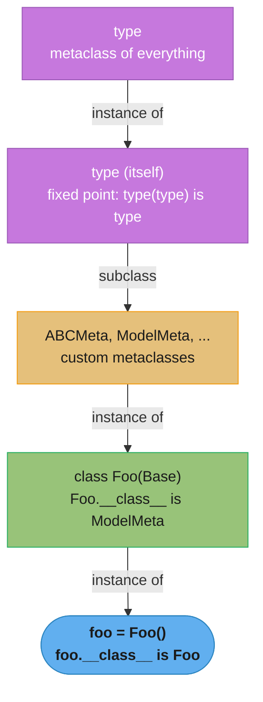
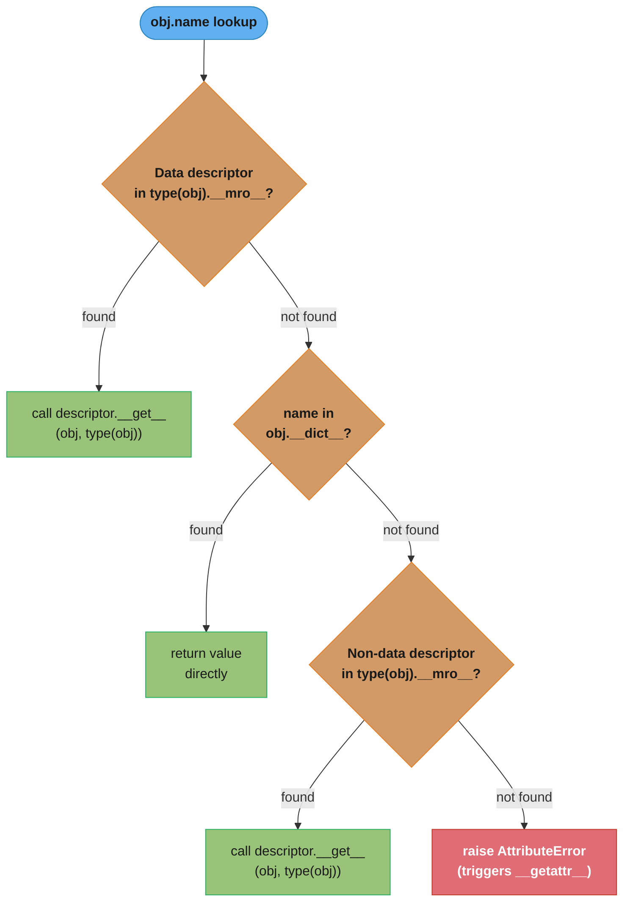
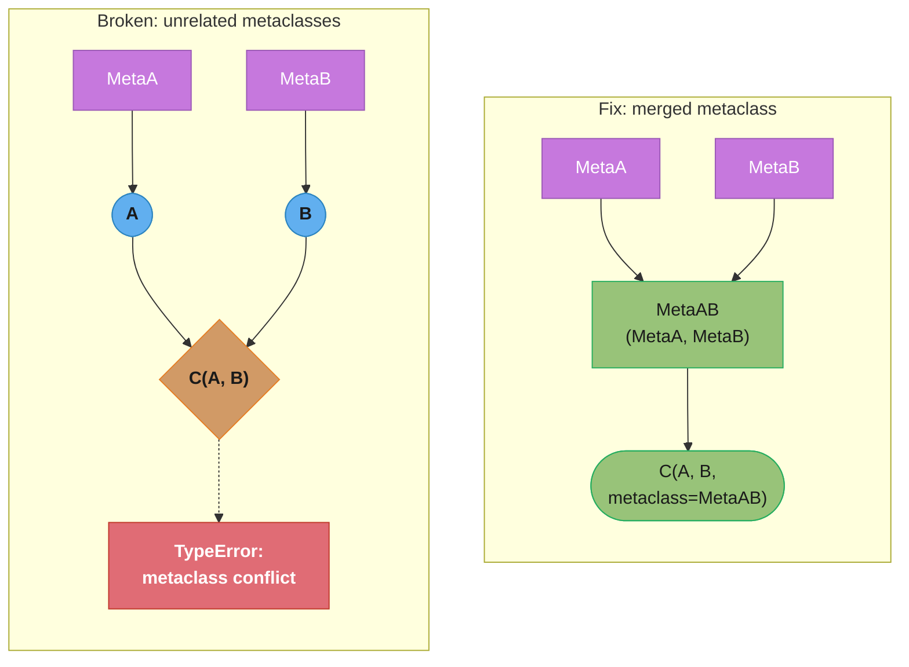
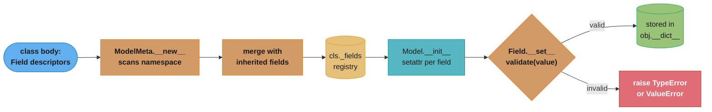

# Metaclasses & Metaprogramming

## 1. Concept Overview

Metaprogramming is the practice of writing code that reads, generates, or modifies other code at runtime or at class-creation time. In Python, the central vehicle for metaprogramming is the **metaclass** — the class of a class. Just as ordinary objects are instances of classes, classes are instances of metaclasses. The default metaclass for every user-defined class is `type`.

This module covers:

- `type()` as a class factory and as a metaclass
- Custom metaclasses via `class Foo(metaclass=MyMeta)`
- `__new__` vs `__init__` in the context of class creation
- `__prepare__` for custom class namespaces
- `__init_subclass__` [3.6] — a lighter-weight alternative to metaclasses for many use cases
- `__set_name__` [3.6] — lets descriptors discover their own attribute name
- Descriptors deep dive: data descriptors, non-data descriptors, the full attribute lookup chain
- `__getattr__` vs `__getattribute__` — two very different hooks
- Dynamic class creation with `type()` and `types.new_class()`
- `abc.ABCMeta` and abstract base classes
- `@dataclass` internals [3.7]
- `__class_getitem__` for generic-style subscripting

---

## 2. Intuition

> A metaclass is to a class what a class is to an object — it is the factory and enforcer that decides how classes themselves are shaped, validated, and registered.

**Mental model**: Imagine a class as a blueprint for objects. A metaclass is the blueprint for that blueprint — it governs what names a class is allowed to have, what base classes are acceptable, what methods must exist, and even what happens when the class is subclassed.

**Why it matters**: Most Python frameworks rely on metaprogramming under the hood. Django ORM's `Model`, SQLAlchemy's `DeclarativeBase`, Pydantic's `BaseModel`, Python's own `dataclasses`, `enum.Enum`, and `abc.ABCMeta` all use metaclasses or descriptor protocols. Understanding the machinery lets you debug cryptic `TypeError: metaclass conflict` errors, write your own ORMs or validation frameworks, and reason clearly about what Python does when it executes a `class` statement.

**Key insight**: The `class` keyword is not a declaration — it is an expression that invokes a callable (the metaclass) with three arguments: the class name, a tuple of base classes, and the class body namespace dictionary. Everything else follows from that.

---

## 3. Core Principles

1. **Classes are objects.** Every class in Python is an instance of some metaclass. `type(int)` is `type`. `type(type)` is `type`. This is a fixed point.

2. **`type` is the root metaclass.** `type` is simultaneously a metaclass (it creates classes) and a class (it is itself an instance of `type`). All user-defined metaclasses must inherit from `type`.

3. **Class creation is a four-step protocol.** `__prepare__` → execute body → `__new__` → `__init__`. Each step can be intercepted.

4. **Descriptors implement attribute semantics.** The dot operator (`.`) is not a simple dictionary lookup. It invokes the descriptor protocol, which lets objects like `property`, `classmethod`, `staticmethod`, and user-defined descriptors control what assignment and retrieval mean.

5. **Data descriptors shadow instance dictionaries.** A descriptor that defines `__set__` takes priority over `instance.__dict__`. A non-data descriptor (only `__get__`) loses to `instance.__dict__`. This distinction is the source of many surprises.

6. **Prefer simpler tools first.** Metaclasses are powerful but rarely necessary. `__init_subclass__`, `__set_name__`, `@classmethod`, and class decorators solve most problems with less cognitive overhead.

---

## 4. Types / Architectures / Strategies

### 4.1 Direct `type()` call (dynamic class creation)

```python
MyClass = type("MyClass", (object,), {"x": 42, "greet": lambda self: "hello"})
```

Use when you need to generate classes programmatically — for example, building ORM models from a database schema at startup.

### 4.2 Custom metaclass

```python
class Meta(type):
    def __new__(mcs, name, bases, namespace):
        ...
        return super().__new__(mcs, name, bases, namespace)
```

Use when you need to intercept or modify the class object itself at creation time.

### 4.3 `__init_subclass__` [3.6]

```python
class Base:
    def __init_subclass__(cls, **kwargs):
        super().__init_subclass__(**kwargs)
        ...
```

Use when you only need to react when a subclass is defined — plugin registration, required-attribute enforcement, auto-registration in a registry.

### 4.4 Class decorator

```python
@enforce_slots
class Foo:
    ...
```

Use when you need a one-off transformation of the finished class object. Simpler than a metaclass because it receives the completed class.

### 4.5 Descriptor protocol

Implement `__get__`, `__set__`, `__delete__` on a class to control attribute access on instances of another class. Used by `property`, `classmethod`, `staticmethod`, ORM fields, typed attributes.

### 4.6 `abc.ABCMeta` strategy

Inherit from `abc.ABC` (which uses `ABCMeta`) and mark methods with `@abstractmethod` to enforce interface contracts at subclass instantiation time.

### 4.7 `@dataclass` [3.7] (declarative metaprogramming)

The `@dataclass` decorator reads `__annotations__` and synthesizes `__init__`, `__repr__`, `__eq__`, optionally `__hash__` and comparison methods. It is metaprogramming without writing a metaclass.

---

## 5. Architecture Diagrams

### 5.1 The metaclass inheritance chain



Every class is an instance of some metaclass, and every metaclass is ultimately a subclass of `type` — the chain bottoms out at `type` itself, the one fixed point where `type(type) is type`.

### 5.2 Class body execution — four-step protocol

```mermaid
flowchart LR
    classDef io      fill:#61afef,stroke:#2e86c1,color:#1a1a1a,font-weight:bold
    classDef frozen  fill:#c678dd,stroke:#9b59b6,color:#fff
    classDef train   fill:#98c379,stroke:#27ae60,color:#1a1a1a
    classDef mathOp  fill:#d19a66,stroke:#e67e22,color:#1a1a1a,font-weight:bold
    classDef lossN   fill:#e06c75,stroke:#c0392b,color:#fff,font-weight:bold
    classDef req     fill:#56b6c2,stroke:#0097a7,color:#1a1a1a
    classDef base    fill:#e5c07b,stroke:#f39c12,color:#1a1a1a

    src(["class Foo(Base,<br/>metaclass=Meta): x = 1"]) --> S1["Step 1: determine metaclass<br/>bases + metaclass= kwarg to Meta"]
    S1 --> S2["Step 2: Meta.__prepare__<br/>returns namespace (default: empty dict)"]
    S2 --> S3["Step 3: exec(class_body, namespace)<br/>populates x=1, __module__, __qualname__"]
    S3 --> S4["Step 4: Meta.__new__ allocates,<br/>then Meta.__init__ configures"]
    S4 --> out(["Foo class object"])

    class src io
    class S1,S2,S3,S4 mathOp
    class out train
```



Each step can be intercepted independently — overriding `__prepare__`, `__new__`, or `__init__` lets a metaclass hook in at exactly the stage it needs.

### 5.3 Attribute lookup chain (MRO + descriptor protocol)



Data descriptors are checked first and win even over `instance.__dict__`; only when no data descriptor exists does the instance dictionary get a chance, with non-data descriptors as the final fallback before `__getattr__`.

### 5.4 Descriptor classification

```
  Descriptor type    | __get__ | __set__ | __delete__ | Beats instance __dict__?
  ─────────────────────────────────────────────────────────────────────────────
  Data descriptor    |  yes    |  yes    |  opt.      | YES
  Data descriptor    |  yes    |  no     |  yes       | YES  (delete-only)
  Non-data desc.     |  yes    |  no     |  no        | NO
  Plain attribute    |  n/a    |  n/a    |  n/a       | stored in __dict__
  ─────────────────────────────────────────────────────────────────────────────
  Examples:
    property          → data descriptor
    classmethod       → non-data descriptor
    staticmethod      → non-data descriptor
    functions         → non-data descriptor (bound via __get__)
```

### 5.5 Decoding the lookup order

**What this actually says.** "Ask the class first, but only about the attributes the class insisted on owning; anything else, ask the instance; and only if both come up empty, ask the class again about the leftovers."

The whole priority rule is one sentence: *defining `__set__` is how a class attribute buys the right to be consulted before the instance*. That is why `property` can never be shadowed by an instance attribute while a plain method can.

| Symbol | What it is |
|--------|------------|
| `type(obj).__mro__` | The class's linearized ancestor tuple — the exact order the class-side scan walks |
| `obj.__dict__` | The instance's own attribute dictionary — one flat hash lookup, no walking |
| `__get__` | Makes an object a descriptor at all; without it the attribute is returned as-is |
| `__set__` / `__delete__` | Either one promotes a descriptor to *data* descriptor, which wins over `obj.__dict__` |
| Data descriptor | Checked in pass 1, before the instance dict. `property`, `__slots__` members, ORM fields |
| Non-data descriptor | Checked in pass 3, after the instance dict. Plain functions, `classmethod`, `staticmethod` |

**Walk one example.** Count the dictionary probes for the case-study `Product` class, whose MRO is `(Product, Model, object)` — three entries:

```
  MRO = (Product, Model, object)          depth d = 3

  p1.price          -- data descriptor, found in Product.__dict__ (MRO slot 1)
    pass 1 probe Product.__dict__   -> HIT, has __set__  -> data descriptor
    total probes = 1                -> short-circuits, instance dict never read

  p1.name           -- same shape
    total probes = 1

  p1.missing        -- worst case, attribute exists nowhere
    pass 1  Product, Model, object  = 3 probes  (data-descriptor scan)
    pass 2  p1.__dict__             = 1 probe   (instance dict)
    pass 3  Product, Model, object  = 3 probes  (non-data / plain scan)
    total probes = 3 + 1 + 3 = 7    -> AttributeError -> __getattr__ fires
```

A hit on a data descriptor costs `1` probe; a total miss costs `2d + 1 = 7`. This is the arithmetic behind the guidance that `__getattr__`-based proxies are cheap: the fallback only runs after the miss path has already failed, so it is never on the hot path for attributes that actually exist. It is also why deep inheritance chains are measurably slower on *misses* only — `d` grows the `2d + 1`, but a found data descriptor still costs one probe regardless of depth.

---

## 6. How It Works — Detailed Mechanics

### 6.1 `type()` — two signatures

```python
# Single-arg: return the type of an object
print(type(42))          # <class 'int'>
print(type(int))         # <class 'type'>
print(type(type))        # <class 'type'>  — the fixed point

# Three-arg: create a class dynamically
MyClass = type("MyClass", (object,), {"x": 42})
obj = MyClass()
print(obj.x)             # 42
print(type(obj))         # <class '__main__.MyClass'>
```

The three-argument form is exactly what happens when Python executes a `class` statement with `type` as the metaclass.

### 6.2 Custom metaclass — enforcing docstrings

```python
class DocstringEnforcer(type):
    """Metaclass that requires all public methods to have docstrings."""

    def __new__(
        mcs,
        name: str,
        bases: tuple[type, ...],
        namespace: dict,
        **kwargs,
    ) -> "DocstringEnforcer":
        for attr_name, attr_value in namespace.items():
            if (
                not attr_name.startswith("_")
                and callable(attr_value)
                and not getattr(attr_value, "__doc__", None)
            ):
                raise TypeError(
                    f"Public method '{attr_name}' on class '{name}' "
                    f"must have a docstring."
                )
        return super().__new__(mcs, name, bases, namespace, **kwargs)

    def __init__(
        cls,
        name: str,
        bases: tuple[type, ...],
        namespace: dict,
        **kwargs,
    ) -> None:
        # __new__ created the class object; __init__ configures it
        super().__init__(name, bases, namespace, **kwargs)


class Service(metaclass=DocstringEnforcer):
    def process(self, data: str) -> str:
        """Transform the data."""
        return data.upper()


# This would raise TypeError at class definition time:
# class BadService(metaclass=DocstringEnforcer):
#     def process(self, data):   # no docstring → TypeError
#         return data
```

**`__new__` vs `__init__` in metaclasses:**

- `__new__(mcs, name, bases, namespace)` is called first and must return the new class object. Use it when you need to modify `name`, `bases`, or `namespace` before the class object is allocated.
- `__init__(cls, name, bases, namespace)` receives the already-created class object as `cls`. Use it for post-creation setup such as registering the class in a registry.

### 6.3 `__prepare__` — ordered or instrumented namespace

```python
import collections

class OrderedMeta(type):
    @classmethod
    def __prepare__(
        mcs,
        name: str,
        bases: tuple[type, ...],
        **kwargs,
    ) -> dict:
        # Return an OrderedDict so attribute definition order is preserved
        # (redundant in 3.7+ where dict is ordered, but illustrates the hook)
        return collections.OrderedDict()

    def __new__(mcs, name, bases, namespace, **kwargs):
        cls = super().__new__(mcs, name, bases, dict(namespace), **kwargs)
        cls._definition_order = list(namespace.keys())
        return cls


class Protocol(metaclass=OrderedMeta):
    version = "1.0"
    encoding = "utf-8"
    timeout = 30


print(Protocol._definition_order)
# ['__module__', '__qualname__', 'version', 'encoding', 'timeout']
```

### 6.4 `__init_subclass__` [3.6] — plugin registry

```python
from typing import ClassVar


class Plugin:
    """Base class for all plugins. Subclasses register themselves automatically."""

    _registry: ClassVar[dict[str, type]] = {}

    def __init_subclass__(cls, plugin_name: str = "", **kwargs: object) -> None:
        super().__init_subclass__(**kwargs)
        name = plugin_name or cls.__name__
        Plugin._registry[name] = cls
        print(f"Registered plugin: {name!r}")


class JSONPlugin(Plugin, plugin_name="json"):
    def serialize(self, data: object) -> str:
        import json
        return json.dumps(data)


class CSVPlugin(Plugin, plugin_name="csv"):
    def serialize(self, data: object) -> str:
        return str(data)


print(Plugin._registry)
# {'json': <class 'JSONPlugin'>, 'csv': <class 'CSVPlugin'>}
```

`__init_subclass__` is called on the **parent class** each time one of its subclasses is created. It receives the new subclass as `cls`. For most plugin/registry patterns this is cleaner than a full metaclass because no `Meta` class is needed.

### 6.5 `__set_name__` [3.6] — self-aware descriptor

```python
class ValidatedField:
    """Descriptor that enforces a type constraint and auto-discovers its name."""

    def __init__(self, expected_type: type) -> None:
        self.expected_type = expected_type
        self.private_name: str = ""   # set in __set_name__

    def __set_name__(self, owner: type, name: str) -> None:
        # Called by type.__new__ when the descriptor is assigned to a class attribute
        self.public_name = name
        self.private_name = f"_{name}"

    def __get__(self, obj: object | None, objtype: type | None = None) -> object:
        if obj is None:
            return self          # accessed on the class → return descriptor itself
        return getattr(obj, self.private_name, None)

    def __set__(self, obj: object, value: object) -> None:
        if not isinstance(value, self.expected_type):
            raise TypeError(
                f"{self.public_name!r} expects {self.expected_type.__name__}, "
                f"got {type(value).__name__}"
            )
        setattr(obj, self.private_name, value)


class User:
    username: str = ValidatedField(str)
    age: int = ValidatedField(int)

    def __init__(self, username: str, age: int) -> None:
        self.username = username   # calls ValidatedField.__set__
        self.age = age


u = User("alice", 30)
print(u.username)   # "alice"
# u.age = "thirty"  # raises TypeError: 'age' expects int, got str
```

Without `__set_name__`, the descriptor would not know it is stored as `username` or `age` — you would have to pass the name explicitly to `__init__`, a fragile pattern.

### 6.6 Descriptor deep dive — the full lookup simulation

```python
# Simulating what type.__getattribute__ does for obj.name

def simulate_getattr(obj: object, name: str) -> object:
    obj_type = type(obj)

    # Walk MRO looking for a descriptor
    for base in obj_type.__mro__:
        if name in base.__dict__:
            attr = base.__dict__[name]
            # Check: is it a DATA descriptor?
            if hasattr(type(attr), "__set__") or hasattr(type(attr), "__delete__"):
                # Data descriptor wins over instance __dict__
                return type(attr).__get__(attr, obj, obj_type)
            break

    # Check instance __dict__
    if name in obj.__dict__:
        return obj.__dict__[name]

    # Walk MRO again for NON-DATA descriptor or plain value
    for base in obj_type.__mro__:
        if name in base.__dict__:
            attr = base.__dict__[name]
            if hasattr(type(attr), "__get__"):
                return type(attr).__get__(attr, obj, obj_type)
            return attr

    raise AttributeError(name)
```

**TypedDescriptor — validated type assignment:**

```python
class TypedDescriptor:
    def __set_name__(self, owner: type, name: str) -> None:
        self.name = name

    def __init__(self, dtype: type) -> None:
        self.dtype = dtype
        self.name = ""

    def __get__(self, obj: object | None, objtype: type | None = None) -> object:
        if obj is None:
            return self
        try:
            return obj.__dict__[self.name]
        except KeyError:
            raise AttributeError(self.name)

    def __set__(self, obj: object, value: object) -> None:
        if not isinstance(value, self.dtype):
            raise TypeError(f"{self.name}: expected {self.dtype}, got {type(value)}")
        obj.__dict__[self.name] = value    # store directly in instance dict
```

Note: even though the value is stored in `obj.__dict__`, the data descriptor still wins on every lookup because the MRO scan for data descriptors happens before the `instance.__dict__` check.

### 6.7 `__getattr__` vs `__getattribute__`

```python
class SafeProxy:
    """__getattr__ is the safe fallback — only called on AttributeError."""

    def __init__(self, wrapped: object) -> None:
        # Use object.__setattr__ to avoid recursion through our own __setattr__
        object.__setattr__(self, "_wrapped", wrapped)

    def __getattr__(self, name: str) -> object:
        # Only reached when normal lookup fails
        return getattr(object.__getattribute__(self, "_wrapped"), name)


import math
proxy = SafeProxy(math)
print(proxy.pi)        # 3.141592653589793 — delegated via __getattr__
print(proxy.sqrt(9))   # 3.0
```

`__getattribute__` intercepts **every** attribute access. Override it only when you need to transform all attribute lookups unconditionally:

```python
class LowercaseProxy:
    def __init__(self, target: object) -> None:
        object.__setattr__(self, "_target", target)

    def __getattribute__(self, name: str) -> object:
        # Must call object.__getattribute__ to avoid recursing on "_target"
        if name.startswith("_"):
            return object.__getattribute__(self, name)
        target = object.__getattribute__(self, "_target")
        return getattr(target, name.lower())
```

### 6.8 `abc.ABCMeta` and abstract base classes

```python
from abc import ABC, abstractmethod


class Shape(ABC):
    @abstractmethod
    def area(self) -> float:
        """Return the area of the shape."""
        ...

    @abstractmethod
    def perimeter(self) -> float:
        """Return the perimeter."""
        ...

    def describe(self) -> str:
        return f"area={self.area():.2f}, perimeter={self.perimeter():.2f}"


class Circle(Shape):
    def __init__(self, radius: float) -> None:
        self.radius = radius

    def area(self) -> float:
        import math
        return math.pi * self.radius ** 2

    def perimeter(self) -> float:
        import math
        return 2 * math.pi * self.radius


# Shape()  → TypeError: Can't instantiate abstract class Shape
#            with abstract methods area, perimeter

# Virtual subclass — no inheritance required:
class Triangle:
    def area(self) -> float: return 6.0
    def perimeter(self) -> float: return 12.0

Shape.register(Triangle)
print(isinstance(Triangle(), Shape))   # True
```

`ABCMeta.__subclasshook__` can further customize `isinstance` checks without requiring explicit registration.

### 6.9 `@dataclass` internals [3.7]

```python
from dataclasses import dataclass, field, fields, asdict
from typing import ClassVar


@dataclass(order=True, frozen=False)
class Point:
    x: float
    y: float
    z: float = 0.0
    _cache: ClassVar[dict] = {}          # ClassVar fields are excluded

    tags: list[str] = field(default_factory=list)   # fresh list per instance

    def distance_from_origin(self) -> float:
        return (self.x**2 + self.y**2 + self.z**2) ** 0.5


p1 = Point(1.0, 2.0)
p2 = Point(1.0, 2.0)
print(p1 == p2)         # True  — __eq__ generated from x, y, z, tags
print(p1 < Point(2.0, 0.0))  # True — __lt__ generated (order=True)

# Inspect the generated fields:
for f in fields(Point):
    print(f.name, f.type, f.default)

print(asdict(p1))       # {'x': 1.0, 'y': 2.0, 'z': 0.0, 'tags': []}
```

Internally, `@dataclass` does roughly:

```python
# What the decorator synthesizes (simplified):
def __init__(self, x: float, y: float, z: float = 0.0, tags=None):
    self.x = x
    self.y = y
    self.z = z
    self.tags = [] if tags is None else tags   # wrong! use default_factory instead

def __repr__(self): ...
def __eq__(self, other): ...
```

The `field(default_factory=list)` mechanism avoids the mutable-default-argument trap because the factory is called fresh for each instance.

### 6.10 `__class_getitem__` for generics

```python
class TypedList:
    """A list that carries type information at the class level."""

    def __class_getitem__(cls, item: type) -> "TypedList":
        # Called when you write TypedList[int]
        alias = type(f"TypedList[{item.__name__}]", (cls,), {"_item_type": item})
        return alias


IntList = TypedList[int]
print(IntList._item_type)   # <class 'int'>
print(IntList.__name__)     # TypedList[int]
```

Built-in `list[int]`, `dict[str, int]`, etc. all use `__class_getitem__` (PEP 585, Python 3.9+).

---

## 7. Real-World Examples

### 7.1 Django ORM `Model`

Django's `ModelBase` metaclass scans the class body for `Field` instances, builds `_meta` (an `Options` object), sets up the `id` auto-field, wires up the manager, and adds the class to the app registry — all at class-definition time, before any object is instantiated. The `__set__` on each `Field` descriptor intercepts attribute assignment to track dirty fields for partial `UPDATE` queries.

### 7.2 Pydantic `BaseModel` [v2]

Pydantic v2 uses `ModelMetaclass` to read `__annotations__`, build a `__pydantic_core_schema__` (a Rust-backed validation plan), and generate `__init__`, `model_validate`, and `model_dump`. `__set_name__` lets each `FieldInfo` descriptor self-register. The resulting validation is 5-50x faster than pure Python because the schema is compiled once at class-creation time.

### 7.3 Python `enum.Enum`

`EnumMeta` overrides `__prepare__` to return a special `_EnumDict` that intercepts assignments and remembers the definition order, detects duplicate values, and stores member metadata. It also overrides `__new__` to convert all members from plain values into `Enum` instances and `__getitem__` so `Color["RED"]` works.

### 7.4 SQLAlchemy `DeclarativeBase`

SQLAlchemy uses a metaclass (or `__init_subclass__` in 2.0) to collect `Column`, `relationship`, and `mapped_column` descriptors, build the `Table` object, and register the class with the mapper. Every attribute defined as `mapped_column(String)` is a descriptor whose `__get__` returns the SQL column expression when accessed on the class and the instance value when accessed on an instance.

### 7.5 FastAPI dependency injection

FastAPI inspects function signatures using `inspect.signature` and `typing.get_type_hints` at router registration time — a form of runtime metaprogramming that avoids metaclasses entirely. Each route handler's parameter types drive automatic request parsing, validation (via Pydantic), and OpenAPI schema generation.

---

## 8. Tradeoffs

| Approach | Complexity | Inheritance-friendly | Readable | Best for |
|---|---|---|---|---|
| Metaclass | High | Metaclass conflict risk | Low | Framework-level class invariants |
| `__init_subclass__` | Low | Yes — calls super() | High | Plugin registration, required attrs |
| Class decorator | Low | Not inherited | High | One-off class transformations |
| `@dataclass` | Very low | Partially | Very high | Data-holding classes |
| Descriptor | Medium | Yes | Medium | Per-attribute validation / computation |
| `abc.ABCMeta` | Low | Yes | High | Interface enforcement |

| Feature | `__getattr__` | `__getattribute__` |
|---|---|---|
| When called | Only on AttributeError | Every attribute access |
| Infinite recursion risk | Low | High |
| Performance impact | Minimal (fallback) | High (every access) |
| Typical use | Proxy, lazy attributes | Full attribute interception |

---

## 9. When to Use / When NOT to Use

### Use metaclasses when:
- You are building a framework where users subclass your base class and you need class-level invariants enforced at definition time (not at runtime).
- You need to modify `bases` or the class `name` itself before the class object exists.
- You need `__prepare__` to provide a custom namespace (e.g., `OrderedDict`, a `_EnumDict`).

### Use `__init_subclass__` when:
- You need to react to subclass creation without touching the metaclass machinery.
- Plugin registration, auto-indexing, or adding required class variables.
- This covers 80 % of metaclass use cases with far less complexity.

### Use descriptors when:
- You need computed, validated, or lazily-loaded attributes.
- You want a reusable per-attribute pattern (type checking, range enforcement, caching).
- Building ORM fields, configuration descriptors, or property-like abstractions.

### Do NOT use metaclasses when:
- A class decorator achieves the same result — decorators are simpler and composable.
- You only need `__init_subclass__` — prefer it.
- You are working in an existing class hierarchy where a metaclass conflict is likely.
- The problem is instance-level, not class-level — metaclasses touch the class, not instances.

### Do NOT override `__getattribute__` when:
- `__getattr__` (fallback only) is sufficient.
- You are not prepared to call `object.__getattribute__` as the base case on every path.

---

## 10. Common Pitfalls

### Pitfall 1 — BROKEN: `__getattribute__` infinite recursion

```python
# BROKEN
class BadProxy:
    def __init__(self, target):
        self.target = target          # triggers __getattribute__ → __setattr__ → OK
                                      # but reading self.target below recurses

    def __getattribute__(self, name):
        # Accessing self.target calls __getattribute__("target") → infinite recursion
        return getattr(self.target, name)   # INFINITE RECURSION
```

```python
# FIX: always route through object.__getattribute__ for your own internal attrs
class GoodProxy:
    def __init__(self, target: object) -> None:
        object.__setattr__(self, "_target", target)

    def __getattribute__(self, name: str) -> object:
        if name.startswith("_"):
            return object.__getattribute__(self, name)   # safe — no recursion
        target = object.__getattribute__(self, "_target")
        return getattr(target, name)
```

Rule: every `__getattribute__` override must eventually call `object.__getattribute__(self, name)` for its own private attributes.

### Pitfall 2 — BROKEN: metaclass conflict

```python
# BROKEN: two metaclasses that do not share a common subclass

class MetaA(type): pass
class MetaB(type): pass

class A(metaclass=MetaA): pass
class B(metaclass=MetaB): pass

class C(A, B): pass
# TypeError: metaclass conflict: the metaclass of a derived class must be a
# (non-strict) subclass of the metaclasses of all its bases
```

```python
# FIX option 1: create a merged metaclass
class MetaAB(MetaA, MetaB): pass

class C(A, B, metaclass=MetaAB): pass   # now works

# FIX option 2: if you control one of them, switch to __init_subclass__
class A:
    def __init_subclass__(cls, **kwargs):
        super().__init_subclass__(**kwargs)
        # do what MetaA used to do

class B(metaclass=MetaB): pass
class C(A, B): pass   # no conflict — A has no metaclass now
```

**Visualizing the conflict**: the diagram below shows why `C(A, B)` fails when `MetaA` and `MetaB` share no relationship, and how a merged `MetaAB(MetaA, MetaB)` satisfies the "subclass of every base's metaclass" rule.



### Pitfall 3 — mutable default in `@dataclass`

```python
# BROKEN
from dataclasses import dataclass

@dataclass
class Config:
    tags: list = []     # TypeError: mutable default <class 'list'> is not allowed
```

```python
# FIX
from dataclasses import dataclass, field

@dataclass
class Config:
    tags: list[str] = field(default_factory=list)
```

### Pitfall 4 — non-data descriptor shadowed by instance dict

```python
class Logger:
    def __get__(self, obj, objtype=None):
        print("accessed")
        return 42

class Foo:
    x = Logger()   # non-data descriptor — no __set__

f = Foo()
f.__dict__["x"] = 99   # instance dict wins!
print(f.x)             # 99 — Logger.__get__ is never called
```

Fix: add `__set__` to make it a data descriptor, or use `__slots__` to eliminate the instance dict for that attribute.

### Pitfall 5 — forgetting `super().__init_subclass__(**kwargs)` in a chain

```python
# BROKEN: breaks cooperative inheritance
class A:
    def __init_subclass__(cls, **kwargs):
        # Forgot super() call — if B also defines __init_subclass__, it never runs
        pass

class B(A):
    def __init_subclass__(cls, **kwargs):
        super().__init_subclass__(**kwargs)   # never reached if A swallows it
```

Always call `super().__init_subclass__(**kwargs)` and `super().__new__(mcs, name, bases, namespace)` to maintain cooperative metaclass behavior.

---

## 11. Technologies & Tools

| Tool / Library | Metaclass / Meta technique used | Notes |
|---|---|---|
| `abc.ABCMeta` (stdlib) | Metaclass; `__subclasshook__` | Python 3.4+; `ABC` convenience base |
| `dataclasses` (stdlib) | Class decorator; reads `__annotations__` | Python 3.7+; `dataclasses.dataclass` |
| `typing.Protocol` | `ABCMeta` subclass | Structural subtyping; no registration needed |
| `enum.Enum` | `EnumMeta` + custom `__prepare__` | `_EnumDict` enforces uniqueness |
| Pydantic v2 | `ModelMetaclass`; `__set_name__` | Rust core; schema compiled at class time |
| Django ORM | `ModelBase` metaclass | `Options` / `_meta`; field registry |
| SQLAlchemy 2.0 | `__init_subclass__` + descriptors | Replaced metaclass in 2.0 |
| `attrs` | Class decorator + `__init_subclass__` | Faster than dataclasses for large classes |
| `mypy` / `pyright` | Static analysis; `__class_getitem__` | Understand `Generic[T]` via `__class_getitem__` |
| `typeguard` | Runtime `isinstance` wrapping | Uses `ABCMeta` virtual subclass mechanism |

---

## 12. Interview Questions with Answers

**Q1: What is a metaclass in Python and how does it relate to `type`?**
A metaclass is the class of a class — it is the factory responsible for creating class objects. `type` is the default metaclass for all user-defined classes. When you write `class Foo: ...`, Python calls `type("Foo", (object,), namespace)` to produce the class object. Every custom metaclass must inherit from `type` because `type.__new__` contains the machinery to allocate and configure class objects. A practical implication: `type(MyClass)` returns its metaclass, just as `type(obj)` returns `obj`'s class.

**Q2: What is the difference between `__new__` and `__init__` in a metaclass?**
`__new__(mcs, name, bases, namespace)` is called first and must return the new class object; it controls allocation. `__init__(cls, name, bases, namespace)` is called on the already-created class and performs post-creation configuration. Use `__new__` when you need to modify `namespace`, rename the class, or change `bases` before allocation. Use `__init__` for side effects like registering the class in a global dictionary. If `__new__` returns an object that is not an instance of the metaclass, `__init__` is skipped.

**Q3: What does `__prepare__` do and when would you override it?**
`__prepare__(mcs, name, bases, **kwargs)` is called before the class body is executed and must return the namespace dictionary in which the body will run. The default returns `{}`. Override it to return a custom mapping — for example, `collections.OrderedDict` to capture definition order (unnecessary in Python 3.7+ where `dict` is ordered), or a `_EnumDict` that rejects duplicate member names. `__prepare__` must be a `classmethod` or `staticmethod` on the metaclass.

**Q4: When should you prefer `__init_subclass__` over a metaclass?**
Prefer `__init_subclass__` when you only need to react to subclass creation — plugin registration, auto-indexing, enforcing required class variables. It requires no `Meta` class, avoids metaclass conflict, plays well with cooperative inheritance via `super()`, and is far more readable. Use a metaclass only when you need `__prepare__`, need to modify `bases` or `namespace` before the class exists, or need to intercept class creation for third-party base classes you do not control.

**Q5: What is a data descriptor vs a non-data descriptor?**
A data descriptor defines `__set__` (and/or `__delete__`) in addition to `__get__`. A non-data descriptor defines only `__get__`. The distinction controls priority in attribute lookup: data descriptors take priority over the instance `__dict__`, while the instance `__dict__` takes priority over non-data descriptors. `property` is a data descriptor; `staticmethod` and `classmethod` and plain functions are non-data descriptors. This is why `f.x = 99` overwrites a function binding on an instance (`f.__dict__["x"] = 99`) but cannot shadow a `property`.

**Q6: Explain `__set_name__` and what problem it solves.**
`__set_name__(self, owner, name)` is called by `type.__new__` on every descriptor object assigned as a class attribute, passing the owning class and the attribute name. Before [3.6], descriptors had to be constructed with the attribute name explicitly: `username = ValidatedField("username", str)`. With `__set_name__`, the descriptor self-registers: `username = ValidatedField(str)` and the descriptor learns it is stored as `"username"` automatically. This eliminates the DRY violation and prevents mismatches where the variable name differs from the string passed to `__init__`.

**Q7: What is the difference between `__getattr__` and `__getattribute__`?**
`__getattribute__` is called on **every** attribute access, before any dictionary lookup. `__getattr__` is called only when the normal attribute lookup (including `__getattribute__`) raises `AttributeError`. Override `__getattr__` for proxy patterns, lazy loading, or dynamic attributes — it is safe and low-risk. Override `__getattribute__` only when you need to intercept all attribute reads unconditionally; you must call `object.__getattribute__(self, name)` internally or risk infinite recursion.

**Q8: How does `abc.ABCMeta` enforce abstract methods?**
`ABCMeta.__new__` collects all methods decorated with `@abstractmethod` across the MRO into `cls.__abstractmethods__` (a `frozenset`). `object.__new__` checks this set at instantiation time: if it is non-empty, it raises `TypeError`. Subclasses that override all abstract methods get an empty `__abstractmethods__` and can be instantiated. The `register()` method adds a class as a virtual subclass without inheritance, making `isinstance(obj, MyABC)` return `True` even though the class does not inherit from the ABC.

**Q9: How does `@dataclass` generate `__init__` and what is the `field()` factory for?**
The `@dataclass` decorator inspects `cls.__annotations__` at decoration time, builds an `__init__` function with positional parameters matching the annotated attributes in definition order, and attaches it to the class. For attributes with `field(default_factory=fn)`, the generated `__init__` calls `fn()` each time a new instance is created, avoiding the shared-mutable-default trap. `field()` also controls `repr=`, `compare=`, `hash=`, `init=`, and `metadata`. The `fields(cls)` function returns a tuple of `Field` objects for introspection.

**Q10: What is `__class_getitem__` and how does it enable generics?**
`__class_getitem__(cls, item)` is a classmethod called when you write `MyClass[SomeType]`. Python's built-in `list`, `dict`, `tuple` implement it to return `types.GenericAlias` objects that carry type information for static type checkers. User-defined classes implement it to support the same `Class[T]` subscription syntax without inheriting from `Generic[T]`. For type-checker integration, combining `__class_getitem__` with `typing.Generic` is the standard pattern.

**Q11: What causes a metaclass conflict and how do you resolve it?**
A metaclass conflict occurs when a class tries to inherit from two bases whose metaclasses are not related by inheritance — Python cannot determine which metaclass to use for the derived class. The error message is `TypeError: metaclass conflict: the metaclass of a derived class must be a (non-strict) subclass of the metaclasses of all its bases`. Resolution: create a merged metaclass that inherits from both conflicting metaclasses, or eliminate one of the metaclasses by replacing it with `__init_subclass__` or a class decorator.

**Q12: How does the descriptor protocol interact with `__slots__`?**
When a class defines `__slots__ = ("x",)`, Python creates a `member_descriptor` (a data descriptor) for each slot name on the class. This data descriptor stores the value in a C-level slot in the instance struct rather than in `__dict__`. Because it is a data descriptor, it takes priority over any instance dict entry — but `__slots__` eliminates `__dict__` entirely for slotted attributes, saving roughly 40-50 bytes per instance for classes with many instances. See `../data_model_and_objects/README.md` for `__slots__` coverage.

**Q13: Can a metaclass change what bases a class inherits from?**
Yes. In `__new__`, the `bases` tuple can be replaced before calling `super().__new__`. This is used by `abc.ABCMeta` to strip `ABC` from `bases` (to avoid diamond problems in the final class MRO) and by some ORMs to inject a mixin automatically. Modifying `bases` is powerful but fragile — always verify MRO correctness with `cls.__mro__` after the fact.

**Q14: What is `typing.Protocol` and how does it differ from `abc.ABC`?**
`Protocol` (PEP 544, Python 3.8+) enables structural subtyping: a class satisfies a `Protocol` if it has the required methods and attributes, regardless of inheritance. No `register()` call or explicit inheritance is needed — static type checkers (mypy, pyright) verify compatibility. `abc.ABC` uses nominal subtyping: a class must explicitly inherit from the ABC or be registered. See `../the_type_system_and_typing/README.md` for full `Protocol` coverage.

**Q15: Walk through what Python does when it executes `class Foo(Bar, metaclass=Meta): x = 1`.**
1. Python calls `Meta.__prepare__("Foo", (Bar,))` to get the class namespace (default `{}`).
2. The class body `x = 1` is executed inside that namespace, producing `{"x": 1, "__module__": ..., "__qualname__": "Foo"}`.
3. Python calls `Meta("Foo", (Bar,), namespace)`, which invokes `Meta.__call__`.
4. `Meta.__call__` invokes `Meta.__new__(Meta, "Foo", (Bar,), namespace)`, which allocates the class object and returns it.
5. `Meta.__call__` then invokes `Meta.__init__(Foo, "Foo", (Bar,), namespace)` for post-creation setup.
6. The name `Foo` in the enclosing scope is bound to the returned class object.
7. For each value in `namespace` that is a descriptor with `__set_name__`, Python calls `value.__set_name__(Foo, attr_name)`.
8. `Bar.__init_subclass__` is called with `Foo` as the argument.

**Q16: How does the `property` built-in work as a data descriptor?**
`property` is a built-in type that implements `__get__`, `__set__`, and `__delete__`. `__get__` calls the getter function; `__set__` calls the setter (or raises `AttributeError` if none is defined); `__delete__` calls the deleter. Because it defines `__set__`, it is a data descriptor and therefore wins over `instance.__dict__`. The `@property`, `@x.setter`, `@x.deleter` decorator syntax creates and replaces `property` objects on the class with increasingly populated getter/setter/deleter slots.

---

## 13. Best Practices

1. **Reach for `__init_subclass__` before writing a metaclass.** It handles the most common metaclass use case — reacting to subclass creation — with zero metaclass overhead and no conflict risk.

2. **Use `__set_name__` in every descriptor.** Never require callers to pass the attribute name to the descriptor constructor. `__set_name__` was added precisely to eliminate that anti-pattern.

3. **Always call `super().__new__` and `super().__init__` in metaclass methods.** Skipping the super call silently breaks cooperative metaclass composition.

4. **Use `object.__getattribute__(self, name)` as the base case in `__getattribute__` overrides.** Accessing any attribute via `self.anything` inside `__getattribute__` re-enters the method and causes infinite recursion.

5. **Prefer `object.__setattr__(self, name, value)` in `__init__` for proxy classes.** This bypasses any custom `__setattr__` on the proxy and prevents recursion during initialization.

6. **Keep `__prepare__` pure.** It should only return a namespace object, not perform side effects, because it is called before the class body executes.

7. **Document why a metaclass is used.** Metaclasses are not obvious. A one-line comment in the class docstring explaining the metaclass's purpose prevents future maintainers from removing it accidentally.

8. **Use `@dataclass(frozen=True)` for value objects.** Frozen dataclasses generate `__hash__` and make instances usable as dict keys and set members.

9. **Use `fields()`, `asdict()`, `astuple()` from `dataclasses` for introspection.** Do not manually inspect `__annotations__` on a dataclass — the `fields()` API is the stable interface.

10. **Test metaclass behavior with explicit subclass creation.** Write a test that defines a subclass inside the test function body; verify that required attributes are present, prohibited patterns raise, and registries contain the expected entries.

11. **Avoid metaclass use for logging or tracing.** Class decorators or `__init_subclass__` are simpler and do not require understanding the full metaclass protocol.

12. **Prefer `typing.Protocol` over `abc.ABCMeta` for type-checking purposes.** `Protocol` gives structural typing without requiring inheritance, making code easier to unit-test with duck-typed test doubles.

---

## 14. Case Study

### Building a Self-Registering ORM Field System with Descriptors

**Goal**: implement a minimal ORM field system where:
- `Field` subclasses are defined as class attributes
- The model metaclass collects all fields at class-creation time
- Fields validate on assignment
- The system is extensible without touching the metaclass

---

**High-level flow** (the shape the fix in Steps 2–3 converges on): the metaclass runs once per class definition to build the field registry, while each descriptor's `__set__` runs on every assignment to validate and store per-instance state.



---

#### Step 1 — BROKEN: naive class variable validator (wrong approach)

```python
# BROKEN: using a plain class variable for validation — all instances share state

class BadIntField:
    def __init__(self, min_val: int, max_val: int) -> None:
        self.min_val = min_val
        self.max_val = max_val
        self.value: int | None = None   # PROBLEM: shared across all instances!

    def validate(self, v: int) -> int:
        if not (self.min_val <= v <= self.max_val):
            raise ValueError(f"{v} out of range [{self.min_val}, {self.max_val}]")
        return v


class Product:
    price = BadIntField(0, 10_000)


p1 = Product()
p2 = Product()
Product.price.value = 100   # sets on the class-level descriptor — both see it!
print(p1.price.value)       # 100  — was not set on p1, yet visible
print(p2.price.value)       # 100  — same problem
```

The fundamental issue: `BadIntField.value` is stored on the descriptor object, which is a class attribute shared across all instances.

---

#### Step 2 — FIX: proper descriptor with `__get__`/`__set__` and `__set_name__`

```python
from __future__ import annotations
from dataclasses import dataclass, field
from typing import Any


class Field:
    """Base descriptor for ORM-style fields."""

    def __set_name__(self, owner: type, name: str) -> None:
        self.public_name = name
        self.private_name = f"_field_{name}"

    def __get__(self, obj: object | None, objtype: type | None = None) -> Any:
        if obj is None:
            return self   # class-level access returns the descriptor itself
        return getattr(obj, self.private_name, None)

    def __set__(self, obj: object, value: Any) -> None:
        value = self.validate(value)
        setattr(obj, self.private_name, value)

    def validate(self, value: Any) -> Any:
        """Subclasses override to add type/range constraints."""
        return value


class ValidatedIntField(Field):
    """Integer field with min/max enforcement."""

    def __init__(self, min_val: int = 0, max_val: int = 2**31) -> None:
        self.min_val = min_val
        self.max_val = max_val

    def validate(self, value: Any) -> int:
        if not isinstance(value, int):
            raise TypeError(
                f"Field '{self.public_name}' expects int, got {type(value).__name__}"
            )
        if not (self.min_val <= value <= self.max_val):
            raise ValueError(
                f"Field '{self.public_name}': {value} is outside "
                f"[{self.min_val}, {self.max_val}]"
            )
        return value


class ValidatedStrField(Field):
    """String field with optional max-length enforcement."""

    def __init__(self, max_length: int = 255) -> None:
        self.max_length = max_length

    def validate(self, value: Any) -> str:
        if not isinstance(value, str):
            raise TypeError(
                f"Field '{self.public_name}' expects str, got {type(value).__name__}"
            )
        if len(value) > self.max_length:
            raise ValueError(
                f"Field '{self.public_name}': length {len(value)} exceeds "
                f"max_length {self.max_length}"
            )
        return value
```

---

#### Step 3 — Metaclass that collects fields at class-creation time

```python
class ModelMeta(type):
    """
    Metaclass for ORM Model classes.
    Scans the class namespace for Field instances and stores them
    in cls._fields (ordered dict) at class-creation time.
    """

    def __new__(
        mcs,
        name: str,
        bases: tuple[type, ...],
        namespace: dict[str, Any],
        **kwargs: Any,
    ) -> "ModelMeta":
        # Collect Field instances from this class body
        own_fields: dict[str, Field] = {
            attr: value
            for attr, value in namespace.items()
            if isinstance(value, Field)
        }

        # Inherit fields from base Model classes (support single-table inheritance)
        inherited_fields: dict[str, Field] = {}
        for base in bases:
            inherited_fields.update(getattr(base, "_fields", {}))

        cls = super().__new__(mcs, name, bases, namespace, **kwargs)

        # Merge: own fields override inherited fields with the same name
        cls._fields = {**inherited_fields, **own_fields}
        return cls


class Model(metaclass=ModelMeta):
    """Base class for all ORM models."""

    _fields: dict[str, Field]   # populated by ModelMeta at class-creation time

    def __init__(self, **kwargs: Any) -> None:
        for name, field_obj in self.__class__._fields.items():
            if name in kwargs:
                setattr(self, name, kwargs[name])    # triggers Field.__set__ → validate

    def to_dict(self) -> dict[str, Any]:
        return {name: getattr(self, name) for name in self._fields}

    def __repr__(self) -> str:
        pairs = ", ".join(
            f"{k}={v!r}" for k, v in self.to_dict().items() if v is not None
        )
        return f"{self.__class__.__name__}({pairs})"
```

---

#### Step 4 — Define concrete models and verify per-instance isolation

```python
class Product(Model):
    name: str = ValidatedStrField(max_length=100)
    price: int = ValidatedIntField(min_val=0, max_val=1_000_000)
    quantity: int = ValidatedIntField(min_val=0, max_val=99_999)


class DiscountedProduct(Product):
    """Inherits name/price/quantity and adds discount_pct."""
    discount_pct: int = ValidatedIntField(min_val=0, max_val=100)


# Verify fields collected at class-creation time
print(list(Product._fields))
# ['name', 'price', 'quantity']

print(list(DiscountedProduct._fields))
# ['name', 'price', 'quantity', 'discount_pct']

# Per-instance isolation — the original BROKEN pattern is fixed
p1 = Product(name="Laptop", price=999, quantity=5)
p2 = Product(name="Mouse", price=25, quantity=100)
print(p1)   # Product(name='Laptop', price=999, quantity=5)
print(p2)   # Product(name='Mouse', price=25, quantity=100)

# Validation fires on assignment
try:
    p1.price = -1
except ValueError as e:
    print(e)   # Field 'price': -1 is outside [0, 1000000]

try:
    p1.name = "X" * 200
except ValueError as e:
    print(e)   # Field 'name': length 200 exceeds max_length 100

d = DiscountedProduct(name="Keyboard", price=79, quantity=10, discount_pct=15)
print(d.to_dict())
# {'name': 'Keyboard', 'price': 79, 'quantity': 10, 'discount_pct': 15}
```

---

#### Decoding the cost model

**Read it like this.** "Pay for discovering the fields once, when the class is written down; pay for checking a value once, every time somebody assigns one."

Two costs live at two different lifetimes here, and conflating them is the classic ORM performance bug. The metaclass cost is per *class*; the descriptor cost is per *assignment*.

| Symbol | What it is |
|--------|------------|
| `ModelMeta.__new__` | Runs exactly once per `class` statement, at import time, never again |
| `cls._fields` | The finished registry — a plain dict, so later reads are one hash lookup |
| `inherited_fields` | Merged from bases once, which is why `DiscountedProduct` needs no rescan of `Product` |
| `Field.__set__` | Runs once per attribute assignment — this is the only genuinely per-instance cost |
| `N` | Number of instances created at runtime |

**Walk one example.** Two model classes, then a bulk load of 100,000 `Product` rows:

```
  class-definition time (import, happens once)
    ModelMeta.__new__ for Product            -> 3 fields found  (name, price, quantity)
    ModelMeta.__new__ for DiscountedProduct  -> 3 inherited + 1 own = 4 fields
    total registry builds = 2                -> then never again

  runtime, N = 100,000 Product instances
    Field.__set__ calls = N x 3 = 300,000    -> one validate() per assigned attribute
    field-discovery work  = 0                -> the registry is already built

  the naive alternative: rediscover fields inside __init__ on every instance
    extra namespace scans = N x 3 = 300,000  -> 150,000x more discovery work
                                                than the 2 scans above
```

The 300,000 `validate()` calls are irreducible — that is the feature. The 300,000 *rediscovery* scans are pure waste, and moving that work into `ModelMeta.__new__` is what deletes them. This is the general shape of every metaclass-based framework: hoist all per-class work to class-creation time so the per-instance path does nothing but the work that is genuinely per-instance.

**Why `_fields` must be merged, not recomputed.** Without the `inherited_fields` merge, `DiscountedProduct._fields` would hold only `discount_pct`, and `Model.__init__` would silently skip `name`, `price`, and `quantity` — no error, just three attributes that are never set. Silent data loss is the failure mode, which is why the merge is not an optimization but a correctness requirement.

---

#### Key design decisions

- **`__set_name__`** lets each `Field` store values in `obj._field_<name>` without being told its attribute name.
- **Data descriptor** (`__set__` defined) ensures validation fires even if caller bypasses `__init__` and assigns directly: `p1.price = -1`.
- **`ModelMeta.__new__`** collects fields once at class-creation time (O(n) cost per class, not per instance).
- **Inheritance support**: `DiscountedProduct._fields` contains all four fields because `ModelMeta.__new__` merges inherited fields.

---

### Cross-references

- See `../data_model_and_objects/README.md` for `__slots__` and the basic descriptor protocol — including how `member_descriptor` interacts with the slot storage layout.
- See `../the_type_system_and_typing/README.md` for `Protocol` as a typing-level alternative to `ABCMeta` — structural subtyping without inheritance or registration.
