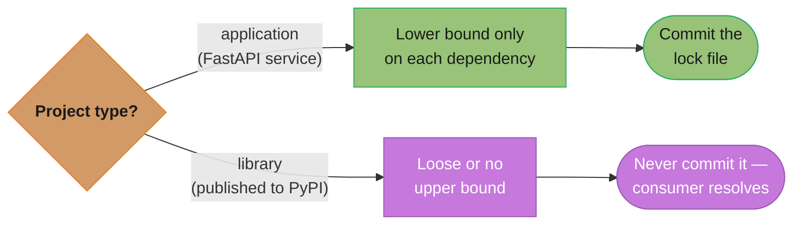
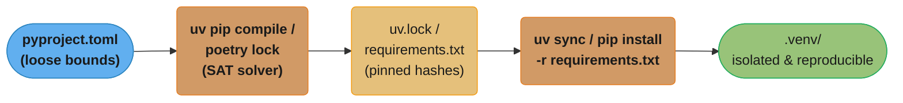
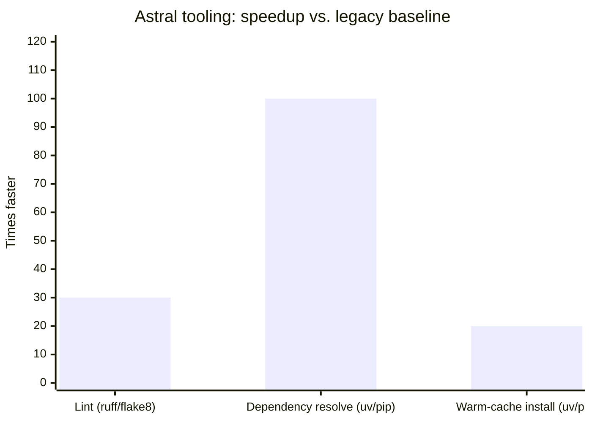

# Packaging & Project Tooling

## 1. Concept Overview

Python packaging is the set of standards, tools, and workflows that turn a collection of `.py` files into a distributable, installable unit with declared dependencies, metadata, and build instructions. It answers three questions: how do you declare what your project is, how do you install it into an environment, and how do you share it with others.

For most of Python's history these concerns were addressed by a patchwork of incompatible tools — `setup.py`, `distutils`, `setuptools`, `pip`, `pipenv`, `tox`, and hand-crafted `requirements.txt` files. Three PEPs standardized the modern approach:

- **PEP 517** (2017): Decouples the build frontend (`pip`) from the build backend (`setuptools`, `hatchling`, `flit`, etc.) via a standard interface.
- **PEP 518** (2018): Introduces `pyproject.toml` and the `[build-system]` table so tools know which backend to use without executing `setup.py`.
- **PEP 621** (2021): Standardizes the `[project]` table in `pyproject.toml` for package metadata (name, version, authors, dependencies).

These PEPs together enable a single `pyproject.toml` to replace `setup.py`, `setup.cfg`, `MANIFEST.in`, and scattered tool configuration files.

Python 3.11 and 3.12 are the current production targets. Python 3.12 ships `tomllib` in the stdlib (read-only TOML parser), removing the need for a `tomli` dependency in build tools.

---

## 2. Intuition

> A Python package is like a self-contained appliance: the `pyproject.toml` is the instruction manual listing every part and specification, the wheel (`.whl`) is the pre-assembled unit ready to plug in, the virtual environment is the dedicated outlet that prevents this appliance from interfering with others, and tools like `uv` are the express courier that gets everything installed in seconds instead of minutes.

**Mental model**: Think of a Python project as a product shipped from a factory. The `pyproject.toml` is the bill of materials — it lists every dependency, the version constraints, and how to build the artifact. The build backend (e.g., `hatchling`) is the factory floor — it reads the bill of materials and produces either a wheel (pre-built) or an sdist (raw materials for the buyer to build). `pip` or `uv` is the supply chain — it resolves, downloads, and installs the right versions. The virtual environment is the warehouse — it keeps your product's parts separate from every other product's parts on the same machine.

**Why it matters**: In production FastAPI services, broken dependency environments cause most non-code outages. A mismatched transitive dependency can make a service fail to start. Reproducible builds via lock files, fast installs via `uv`, and strict type checking via `mypy`/`pyright` prevent the entire class of "works on my machine" failures.

**Key insight**: The shift from `requirements.txt` to `pyproject.toml` + a lock file is not just syntactic — it enforces the distinction between *direct* dependencies (what your code imports) and *transitive* dependencies (what those packages need), making upgrades safe and auditable.

---

## 3. Core Principles

- **Single source of truth**: `pyproject.toml` is the canonical location for all project metadata, tool configuration, and dependency declarations. No `setup.py`, no `setup.cfg`, no scattered `tox.ini`.
- **Reproducibility**: A lock file (generated by `uv pip compile`, `poetry lock`, or `pip-compile`) pins every transitive dependency to an exact version and hash, guaranteeing that a `uv sync` in CI produces exactly the same environment as on a developer's laptop.
- **Environment isolation**: Virtual environments prevent global Python pollution. One project's `requests==2.31.0` cannot conflict with another project's `requests==2.28.0` on the same machine.
- **Separation of direct vs. transitive dependencies**: Direct deps go in `pyproject.toml` (with loose version bounds). Transitive deps are managed by the resolver and written to a lock file. Never hand-edit transitive pins.
- **Build backend abstraction (PEP 517)**: The build frontend (`pip`, `uv`) calls a standard interface on the backend (`setuptools`, `hatchling`, `flit`). Switching backends requires only changing one line in `[build-system]`.
- **Static analysis as first-class tooling**: `ruff` for linting and formatting, `mypy`/`pyright` for type checking. Both run in pre-commit hooks and CI, not just as optional developer steps.
- **Semantic versioning**: Version numbers communicate intent — breaking changes increment MAJOR, new backward-compatible features increment MINOR, bug fixes increment PATCH.

---

## 4. Types / Architectures / Strategies

### Dependency Declaration Strategies

**Application projects** (FastAPI services, scripts): declare dependencies in `pyproject.toml` with minimum version lower bounds (`fastapi>=0.111.0`). Generate a lock file for deployment. The lock file is committed to the repository.

**Library projects** (packages published to PyPI): declare dependencies with loose upper bounds or no upper bounds (`fastapi>=0.100.0`). Never commit a lock file to a library repo — let the user's resolver pick compatible versions. The lock file is for development only and listed in `.gitignore`.



*Applications own their deployment environment, so pinning and committing the lock file buys reproducibility; libraries are consumed by many different resolvers, so a committed lock file would be ignored — or worse, mistaken for a hard requirement.*

### Build Distribution Types

**Wheel** (`.whl`): A ZIP archive with a standardized naming convention. Pre-built — no compilation needed at install time. For pure Python packages the tag is `py3-none-any` (works on any platform). For C extension packages separate wheels exist per Python version and platform (e.g., `cp312-cp312-manylinux_2_17_x86_64.whl`). Install time: milliseconds.

**Source distribution / sdist** (`.tar.gz`): Archive of raw source files. Requires running the build backend at install time. Platform-agnostic but slower to install. Used as a fallback when no matching wheel exists.

### Virtual Environment Strategies

**`venv`** (stdlib, Python 3.3+): `python -m venv .venv`. Lightweight, no additional install. The standard for most projects.

**`uv venv`**: Creates a venv 10-100x faster than `python -m venv`. Backed by a global cache — packages are hard-linked rather than copied, so disk usage is minimal.

**`conda`**: Full environment manager including non-Python packages. Used in data science / ML for packages like `numpy` with custom BLAS/LAPACK builds. Heavier than `venv`. Not recommended for pure Python web services.

### Lock File Strategies

**`uv pip compile`**: Reads `requirements.in` or `pyproject.toml` and writes a fully pinned `requirements.txt` with hashes. Fast, reproducible, compatible with standard `pip install -r`.

**`poetry lock`**: Similar, generates `poetry.lock`. Integrated into the poetry workflow.

**`pip-tools`** (`pip-compile`): The original `requirements.in` → `requirements.txt` approach. Slower than `uv`.

---

## 5. Architecture Diagrams

### Project Layout (src layout — recommended)

```
my-fastapi-service/
├── pyproject.toml          ← single source of truth
├── uv.lock                 ← committed lock file (uv >=0.4)
├── .pre-commit-config.yaml ← pre-commit hook definitions
├── Makefile                ← developer convenience targets
├── Dockerfile              ← multi-stage build
├── src/
│   └── myservice/
│       ├── __init__.py
│       ├── py.typed        ← PEP 561 marker (typed package)
│       ├── main.py         ← FastAPI app entry point
│       ├── api/
│       │   ├── __init__.py
│       │   └── routes.py
│       └── core/
│           ├── __init__.py
│           └── config.py
└── tests/
    ├── __init__.py
    ├── conftest.py
    └── test_routes.py
```

### Build Pipeline

**Build & publish flow** — source moves through the PEP 517 frontend/backend split into `dist/`, then out to the registry via `twine` or `uv publish`.


**Resolver & installer flow** — the SAT solver expands loose bounds into a fully pinned lock file before anything reaches the isolated `.venv/`.



---

## 6. How It Works — Detailed Mechanics

### Complete `pyproject.toml` for a FastAPI Service

```toml
[build-system]
# PEP 518: tells pip/uv which backend to use before installing anything
requires = ["hatchling"]
build-backend = "hatchling.build"

# PEP 621: standardized project metadata
[project]
name = "myservice"
version = "1.0.0"
description = "Production FastAPI microservice"
readme = "README.md"
requires-python = ">=3.11"
license = { text = "MIT" }
authors = [{ name = "Rutik", email = "dev@example.com" }]

# Direct runtime dependencies — loose lower bounds only
dependencies = [
    "fastapi>=0.111.0",
    "uvicorn[standard]>=0.29.0",
    "pydantic>=2.7.0",
    "pydantic-settings>=2.2.0",
    "sqlalchemy>=2.0.0",
    "asyncpg>=0.29.0",
    "httpx>=0.27.0",
]

[project.optional-dependencies]
dev = [
    "ruff>=0.4.0",
    "mypy>=1.10.0",
    "pre-commit>=3.7.0",
]
test = [
    "pytest>=8.2.0",
    "pytest-asyncio>=0.23.0",
    "pytest-cov>=5.0.0",
    "httpx>=0.27.0",       # needed for TestClient
    "respx>=0.21.0",       # mock httpx calls
]

[project.scripts]
# Creates a CLI entry point: `myservice-server` invokes this
myservice-server = "myservice.main:run"

# hatchling: tells it to find packages in src/
[tool.hatch.build.targets.wheel]
packages = ["src/myservice"]

# ruff: replaces flake8 + isort + pyupgrade + black
[tool.ruff]
target-version = "py311"
line-length = 88
src = ["src", "tests"]

[tool.ruff.lint]
select = [
    "E",   # pycodestyle errors
    "W",   # pycodestyle warnings
    "F",   # pyflakes (unused imports, undefined names)
    "I",   # isort (import ordering)
    "UP",  # pyupgrade (modernize syntax: f-strings, typing aliases)
    "B",   # flake8-bugbear (likely bugs and design issues)
    "C4",  # flake8-comprehensions (unnecessary comprehensions)
    "SIM", # flake8-simplify
]
ignore = ["E501"]  # line length handled by formatter

[tool.ruff.lint.isort]
known-first-party = ["myservice"]

[tool.ruff.format]
# ruff format is a black-compatible formatter
quote-style = "double"
indent-style = "space"

# mypy strict mode for the src tree
[tool.mypy]
python_version = "3.11"
strict = true
warn_return_any = true
warn_unused_configs = true
# FastAPI uses pydantic which mypy needs a plugin for
plugins = ["pydantic.mypy"]

[[tool.mypy.overrides]]
module = ["asyncpg.*", "uvicorn.*"]
ignore_missing_imports = true

# pytest configuration
[tool.pytest.ini_options]
asyncio_mode = "auto"          # pytest-asyncio: all async tests run automatically
testpaths = ["tests"]
addopts = "--cov=src/myservice --cov-report=term-missing --cov-fail-under=80"
```

### `uv` Usage in Practice

```bash
# Install uv (single binary, no Python required)
curl -LsSf https://astral.sh/uv/install.sh | sh

# Create a virtual environment (10x faster than python -m venv)
uv venv .venv

# Activate (same as standard venv)
source .venv/bin/activate

# Install project with all optional deps
uv pip install -e ".[dev,test]"

# Generate a pinned lock file from pyproject.toml
uv pip compile pyproject.toml -o requirements.lock --all-extras

# Install from lock file (CI, Docker)
uv pip install -r requirements.lock

# Run a script without activating venv
uv run python src/myservice/main.py

# uv sync: reads pyproject.toml + uv.lock and installs exactly
uv sync --all-extras
```

`uv` maintains a global cache of downloaded wheels at `~/.cache/uv/`. Subsequent installs hard-link from this cache rather than re-downloading, making reinstalls nearly instant.

### Wheels vs sdist

```python
# Wheel naming: {distribution}-{version}(-{build})?-{python}-{abi}-{platform}.whl
# Pure Python (works everywhere):
#   myservice-1.0.0-py3-none-any.whl
#
# C extension (platform-specific):
#   myservice-1.0.0-cp312-cp312-manylinux_2_17_x86_64.whl
#   myservice-1.0.0-cp312-cp312-macosx_13_0_arm64.whl

# Build both:
python -m build          # produces both .whl and .tar.gz in dist/
python -m build --wheel  # wheel only

# Inspect wheel contents (it's a ZIP):
import zipfile
with zipfile.ZipFile("dist/myservice-1.0.0-py3-none-any.whl") as z:
    print(z.namelist())
```

### Editable Installs

```bash
# Install as editable — source tree is the package, no copy made
uv pip install -e .

# Python now resolves `import myservice` to ./src/myservice/
# Modifying ./src/myservice/routes.py is immediately reflected in tests

# How it works internally:
# Creates myservice.pth or __editable__.myservice.pth in site-packages
# pointing back to the src/ directory.
```

### `ruff` for Linting and Formatting

```bash
# Lint — check for issues
ruff check src/ tests/

# Lint with auto-fix (safe fixes only)
ruff check --fix src/ tests/

# Format — replaces black
ruff format src/ tests/

# Check both in one pass (CI mode — no changes, exit non-zero on issues)
ruff check --no-fix src/ && ruff format --check src/
```

Example ruff output:
```
src/myservice/api/routes.py:12:5: F401 [*] `os` imported but unused
src/myservice/core/config.py:7:1: I001 Import block is unsorted
Found 2 errors.
[*] 2 fixable with the `--fix` option.
```

### `mypy` Static Type Checking

```python
# src/myservice/py.typed   ← empty marker file (PEP 561)
# Its presence tells mypy and pyright that this package ships type information

# Example: strict mode catches this at check-time, not runtime
from fastapi import FastAPI

app = FastAPI()

def process(value: str) -> int:
    return value  # mypy error: Incompatible return value type
                  # (got "str", expected "int")

# Run:
# mypy --strict src/
# src/myservice/core/handler.py:4: error: Incompatible return value type
# (got "str", expected "int")  [return-value]
```

Suppressing a specific error category:
```python
import some_untyped_library  # type: ignore[import-untyped]
result = some_untyped_library.call()  # type: ignore[no-any-return]
```

### Pre-commit Configuration

```yaml
# .pre-commit-config.yaml
repos:
  - repo: https://github.com/astral-sh/ruff-pre-commit
    rev: v0.4.10
    hooks:
      - id: ruff
        args: [--fix, --exit-non-zero-on-fix]
        types_or: [python, pyi]
      - id: ruff-format
        types_or: [python, pyi]

  - repo: https://github.com/pre-commit/mirrors-mypy
    rev: v1.10.0
    hooks:
      - id: mypy
        args: [--strict]
        additional_dependencies:
          - "pydantic>=2.7.0"
          - "pydantic-settings>=2.2.0"
          - "fastapi>=0.111.0"
          - "types-requests"
        files: ^src/

  - repo: https://github.com/pre-commit/pre-commit-hooks
    rev: v4.6.0
    hooks:
      - id: check-merge-conflict
      - id: check-toml
      - id: end-of-file-fixer
      - id: trailing-whitespace
```

```bash
# Install hooks into .git/hooks/pre-commit
pre-commit install

# Run all hooks against all files (CI, first setup)
pre-commit run --all-files

# Skip hooks for an emergency commit (avoid in normal workflow)
git commit --no-verify -m "emergency hotfix"
```

### Semantic Versioning

```
MAJOR.MINOR.PATCH
  │      │     └── Bug fix, backward compatible
  │      └──────── New feature, backward compatible
  └─────────────── Breaking API change

Version constraint operators (used in pyproject.toml / poetry):
  "fastapi>=0.111.0"          # lower bound only (application style)
  "fastapi>=0.100.0,<1.0.0"   # bounded range (library style)
  "^0.111.0"  (poetry caret)  # >=0.111.0, <0.112.0  (pre-1.0 special case)
  "^1.2.0"    (poetry caret)  # >=1.2.0, <2.0.0
  "~1.2.0"    (poetry tilde)  # >=1.2.0, <1.3.0

python-semantic-release reads conventional commits to auto-bump:
  feat: ...   → MINOR bump
  fix: ...    → PATCH bump
  feat!: ...  → MAJOR bump (breaking change marker)
  BREAKING CHANGE: in footer → MAJOR bump
```

### Publishing to PyPI

```bash
# Build distribution artifacts
python -m build

# Check artifacts before uploading
twine check dist/*

# Upload to PyPI (prompts for credentials or uses PYPI_TOKEN env var)
twine upload dist/*

# Or with uv (uv 0.4+):
uv publish --token $PYPI_TOKEN

# Upload to TestPyPI first (recommended)
twine upload --repository testpypi dist/*
```

---

## 7. Real-World Examples

**Astral (uv, ruff)**: Astral built both `ruff` and `uv` in Rust. `ruff` replaces an entire ecosystem (`flake8` + 50 plugins + `isort` + `pyupgrade` + `black`) with a single binary that runs 10-100x faster. On the CPython codebase (500k+ lines), `ruff check` completes in under 1 second vs. flake8's 30+ seconds. `uv` resolves the full Django dependency graph in under 100ms vs. pip's 10-30 seconds.



*Three unrelated operations — linting CPython (30+s to under 1s), resolving Django's full dependency graph (10-30s to under 100ms), and a warm-cache single-package install (about 200ms to about 10ms) — all land in the same 20-100x band, showing the Rust rewrite is not a one-off win on a single code path.*

**FastAPI itself**: Uses `pyproject.toml` with `hatchling` as the build backend. Has separate optional dependency groups: `[all]`, `[dev]`, `[doc]`, `[test]`. Maintains type stubs and ships `py.typed` so IDE integrations provide full type inference for FastAPI applications.

**Pydantic**: Ships wheels for 24 platform/Python combinations on every release, built via `maturin` (Rust-backed build backend). Pure Python fallback available. Uses `ruff` for linting, `mypy` in strict mode for the entire codebase (100,000+ lines typed).

**Stripe Python SDK**: Uses `pyproject.toml` with strict `mypy` (all public APIs fully annotated). Generates type stubs (`.pyi` files) from their OpenAPI spec. Ships `py.typed`. Uses `semantic-release` for automated version bumping triggered by commit messages.

**Google Cloud Python client libraries**: All use `pyproject.toml`, ship `py.typed`, and use `nox` (similar to `tox`) to run tests across Python 3.8-3.12 in isolated environments. Each library has separate wheels built for CPython and PyPy.

---

## 8. Tradeoffs

| Concern | `pip` + `requirements.txt` | `uv` | `poetry` | `hatch` |
|---|---|---|---|---|
| Install speed | Baseline (1x) | 10-100x faster | 2-5x faster than pip | Similar to pip |
| Lock file | Manual (`pip freeze`) | `uv pip compile` or `uv.lock` | `poetry.lock` (built-in) | No built-in lock |
| Virtual env management | `python -m venv` separately | `uv venv` (built-in) | Built-in (`poetry shell`) | Built-in |
| Publishing to PyPI | `twine` separately | `uv publish` (built-in) | `poetry publish` (built-in) | `hatch publish` |
| Python version management | No | `uv python install 3.12` | No (use pyenv) | No (use pyenv) |
| Build backend | N/A (installer only) | N/A (uses any PEP 517 backend) | Custom (poetry-core) | hatchling |
| Adoption | Universal legacy | Rapidly growing (2023+) | Large (data science) | Moderate |
| PEP 621 compliance | N/A | Yes (reads standard `[project]`) | Partial (uses `[tool.poetry]`) | Yes |

### Wheel vs sdist

| Attribute | Wheel (`.whl`) | sdist (`.tar.gz`) |
|---|---|---|
| Install time | Fast (unzip + copy) | Slow (build step required) |
| Platform | Specific (C extensions) or universal (pure Python) | Platform-agnostic |
| Build tools required | No | Yes (`gcc`, `cmake`, etc.) |
| Reproducibility | High (pre-built artifact) | Lower (build environment varies) |
| PyPI file size | Larger (multiple wheels per release) | Single file |

---

## 9. When to Use / When NOT to Use

### Use `pyproject.toml` + `uv` when:
- Starting any new Python project in 2024+. There is no reason to create `setup.py`.
- Building a FastAPI service that needs reproducible Docker builds.
- You want a single tool (`uv`) to manage venvs, install packages, run scripts, and generate lock files.
- CI build times matter — `uv` cache hits make installs nearly instant.

### Use `poetry` when:
- Your team already has a `poetry.lock` workflow and is unwilling to migrate.
- You prefer an integrated experience where the same tool manages versions, builds, and publishing.
- Working in a data science / ML team that standardized on poetry.

### Use `conda` when:
- You need non-Python binary dependencies (CUDA, MKL, HDF5) managed as a unit.
- Working with Jupyter notebooks or scientific computing stacks where conda channels provide optimized builds.
- Do NOT use conda for pure Python web services — the overhead is unnecessary.

### Do NOT use `setup.py` for new projects:
- `setup.py` executes arbitrary code during install, making builds non-reproducible and creating a security surface.
- Deprecated in favor of declarative `pyproject.toml`.
- Still required for very old packages with complex build logic; use `setup.py` + `setup.cfg` only to maintain existing packages, not for new ones.

### Do NOT use `pip freeze` as your lock file workflow:
- `pip freeze` includes every package in the environment (including tools like `ruff`, `pytest`) in a flat list with no dependency graph information.
- Use `uv pip compile` or `poetry lock` which track which packages are direct vs. transitive and support hash verification.

---

## 10. Common Pitfalls

### BROKEN: Pinning without a lock file workflow

```
# requirements.txt (BROKEN approach)
fastapi==0.111.0
starlette==0.37.2
pydantic==2.7.1
anyio==4.3.0
# ... 40 more transitive deps pinned manually
```

This works until `anyio` releases 4.4.0 and `starlette` releases 0.38.0 with incompatible constraints. Your environment breaks on the next fresh install.

```toml
# FIX: pyproject.toml with direct deps only (loose bounds)
[project]
dependencies = [
    "fastapi>=0.111.0",
    "pydantic>=2.7.0",
]
```

```bash
# FIX: generate reproducible lock file with uv
uv pip compile pyproject.toml -o requirements.lock
# Commit requirements.lock (not requirements.txt from pip freeze)
# Install in CI/Docker:
uv pip install -r requirements.lock
```

The lock file records the full dependency graph with hashes. When `anyio` releases a new version, `uv pip compile --upgrade` tests whether the new version satisfies all constraints before writing a new lock.

---

### BROKEN: Missing `py.typed` in a library package

```
# Package structure (BROKEN)
src/mylib/
    __init__.py
    models.py     # has full type annotations

# setup.cfg or pyproject.toml (BROKEN — no py.typed listed)
[tool.hatch.build.targets.wheel]
packages = ["src/mylib"]
```

When consumers install this library and run `mypy --strict` on their code, mypy treats the library as untyped and silently ignores all type information. Pycharm and VS Code show no type hints for the library's public API.

```
# FIX: add an empty py.typed marker file
src/mylib/
    __init__.py
    models.py
    py.typed      ← empty file, signals PEP 561 compliance
```

```toml
# FIX: pyproject.toml — ensure py.typed is included in the wheel
[tool.hatch.build.targets.wheel]
packages = ["src/mylib"]
# hatchling includes all files by default; explicitly list if using include filter:
# include = ["src/mylib/**", "src/mylib/py.typed"]
```

Now `mypy --strict consumer_code/` sees the library's type annotations and catches type errors at the call site.

---

### Other Common Pitfalls

**Flat layout vs. src layout confusion**: Without `src/`, `import myservice` in tests may resolve to the local directory instead of the installed package, hiding import errors that only appear in production. Always use the `src/` layout.

**Platform-specific wheels in a multi-arch Docker environment**: Building a wheel on `x86_64` and copying it into an `arm64` container image fails at import time for C extensions. Use multi-platform builds or install from the lock file in the final container stage.

**`pre-commit` hook version drift**: Specifying `rev: v0.4.10` for ruff in `.pre-commit-config.yaml` while developers run `ruff==0.5.0` locally causes inconsistent lint results. Run `pre-commit autoupdate` quarterly and pin the result.

**Importing from `__future__` annotations incorrectly**: In Python 3.11, `from __future__ import annotations` makes all annotations strings (deferred evaluation). This breaks `pydantic` v2 model field resolution unless you use `model_rebuild()` or switch to `from __future__ import annotations` aware config.

---

## 11. Technologies & Tools

| Tool | Category | Speed | Lock file | Venv mgmt | Publish | Python mgmt | Notes |
|---|---|---|---|---|---|---|---|
| `pip` | Installer | 1x (baseline) | No (use pip-tools) | No | No | No | Universal, ships with Python |
| `uv` | Installer + resolver | 10-100x | `uv.lock` / `requirements.lock` | Yes (`uv venv`) | Yes (`uv publish`) | Yes (`uv python`) | Rust, 2023+, PEP 621 compliant |
| `poetry` | All-in-one | 2-5x | `poetry.lock` | Yes | Yes | No | Custom `[tool.poetry]` table |
| `hatch` | Build + env | Similar to pip | No | Yes (`hatch env`) | Yes | No | PEP 621 compliant, hatchling backend |
| `pip-tools` | Lock file only | 1-2x | `requirements.txt` | No | No | No | `pip-compile` + `pip-sync` |
| `ruff` | Lint + format | 10-100x vs flake8 | N/A | N/A | N/A | N/A | Rust, replaces flake8/black/isort |
| `mypy` | Type checker | Moderate | N/A | N/A | N/A | N/A | Most established, daemon mode fast |
| `pyright` | Type checker | Fast | N/A | N/A | N/A | N/A | Microsoft, powers Pylance in VS Code |
| `pre-commit` | Git hooks | N/A | N/A | N/A | N/A | N/A | Runs hooks on staged files |
| `twine` | Publishing | N/A | N/A | N/A | Yes | N/A | Mature, works with any build system |

**`ruff` rule coverage**: E/W (pycodestyle), F (pyflakes), I (isort), UP (pyupgrade), B (bugbear), C4 (comprehensions), SIM (simplify), ANN (annotations), ARG (unused args), DTZ (datetime timezone), EM (error message strings), G (logging format), PTH (pathlib), RUF (ruff-specific).

**`mypy` vs `pyright`**: `mypy` is more conservative (fewer false positives, safer for CI gates). `pyright` is more aggressive (more false positives, but catches more real errors). Many teams run `pyright` in IDE and `mypy --strict` in CI.

---

## 12. Interview Questions with Answers

**Q1: What problem does `pyproject.toml` solve, and which PEPs define it?**
`pyproject.toml` provides a single, declarative file that replaces `setup.py`, `setup.cfg`, `MANIFEST.in`, and scattered tool config files. PEP 517 decouples build frontends from backends via a standard interface. PEP 518 introduces the `[build-system]` table so tools know which backend to invoke. PEP 621 standardizes the `[project]` metadata table (name, version, dependencies). Before these PEPs, `setup.py` executed arbitrary Python code during install, making builds non-reproducible and creating security risks.

**Q2: What is the difference between a wheel and an sdist, and when does each matter?**
A wheel (`.whl`) is a pre-built archive — install time is just unzipping and copying files. An sdist (`.tar.gz`) is raw source that requires running the build backend at install time, which may involve compiling C extensions. Pure Python wheels use the tag `py3-none-any` and work everywhere. C extension wheels are platform-specific (e.g., `cp312-cp312-manylinux_2_17_x86_64`). In production Docker builds, always install from wheels — missing a wheel for your platform triggers an sdist build that may fail if the build tools are absent.

**Q3: Explain how `uv` achieves 10-100x speed improvement over `pip`.**
`uv` is written in Rust and uses several techniques: a global wheel cache (`~/.cache/uv/`) with hard links (install is a metadata operation, not a copy), a parallel SAT resolver that resolves dependencies concurrently rather than sequentially, and pre-compiled Rust routines for TOML parsing, hash verification, and file system operations. On a warm cache hit, installing a package is ~10ms vs. pip's ~200ms because no network request or file copy occurs — only a directory entry is created.

**Q4: What is an editable install and when do you use it?**
`pip install -e .` or `uv pip install -e .` installs the package by reference to the source tree instead of copying files into `site-packages`. Python's import machinery finds the package at `src/mypackage/` directly. Changes to source files are immediately reflected without reinstalling. Use editable installs during development when you have multiple internal packages that depend on each other — without it, you would need to reinstall after every change. Never use editable installs in production containers.

**Q5: Why should library packages not commit a lock file, while application projects should?**
A library (published to PyPI) is consumed by many different applications, each with its own set of dependencies. Committing a lock file would have no effect on consumers (they don't read your lock file) and could falsely imply the exact pinned versions are required. The library should declare loose bounds in `[project.dependencies]` and let the consumer's resolver find compatible versions. An application (deployed to a specific environment) must be fully reproducible — every developer and every CI run must produce the same environment — so committing the lock file guarantees this.

**Q6: What does `py.typed` do and what happens if you omit it from a library?**
`py.typed` is an empty marker file defined in PEP 561. Its presence in a package's directory signals to type checkers (mypy, pyright) that the package ships type information and that type checking should be applied to it. Without `py.typed`, mypy treats the entire package as `Any` — all calls to the library's functions return `Any`, all type errors in usage are suppressed, and consumers lose all IDE autocompletion and type safety benefits. Fix: create an empty `src/mylib/py.typed` and ensure it is included in the wheel.

**Q7: How does `ruff` differ from `flake8` + `black` + `isort`, and why would you migrate?**
`ruff` is a single Rust binary that implements the rules of `flake8` (and 50+ plugins), `black`-compatible formatting, and `isort` import sorting. It is 10-100x faster — checking the entire CPython codebase takes under 1 second vs. 30+ seconds with flake8. It uses the same configuration format (`pyproject.toml`) for all rules. Migration is a drop-in replacement for most projects: `ruff check` replaces `flake8`, `ruff format` replaces `black`, and isort configuration maps directly to `[tool.ruff.lint.isort]`. The main reason not to migrate is if you use a custom flake8 plugin that ruff does not yet support.

**Q8: What is `pre-commit` and how does it differ from running linters in CI?**
`pre-commit` is a framework that installs git hooks (stored in `.pre-commit-config.yaml`) that run before each commit on the developer's machine. It creates isolated environments for each hook. The key difference from CI: pre-commit catches issues before they are committed, giving the developer immediate feedback and preventing a CI failure cycle. CI still runs the same checks (via `pre-commit run --all-files`) as the authoritative gate, but the developer loop is much faster. `pre-commit autoupdate` keeps hook versions current.

**Q9: Explain semantic versioning constraints: what is the difference between `^1.2.0` and `~1.2.0` in poetry?**
`^1.2.0` (caret) allows updates that do not change the left-most non-zero digit: for `>=1.0.0`, this means `>=1.2.0, <2.0.0`. It assumes semantic versioning is honored — any 1.x version is backward compatible. `~1.2.0` (tilde) allows only patch-level updates: `>=1.2.0, <1.3.0`. Use caret for most dependencies where you trust the upstream project follows semver. Use tilde when you are conservative about minor version changes, e.g., a library that has historically made breaking changes in minor releases.

**Q10: How do you set up a full dependency resolution and lock workflow with `uv`?**
Declare direct dependencies in `pyproject.toml` under `[project.dependencies]` with loose lower bounds. Run `uv pip compile pyproject.toml --all-extras -o requirements.lock` to generate a fully pinned lock file with SHA-256 hashes for every package. Commit `requirements.lock` to the repository. In CI and Docker, run `uv pip install --require-hashes -r requirements.lock` — the `--require-hashes` flag makes the install fail if any package hash does not match, preventing supply chain attacks. To upgrade a specific package: `uv pip compile --upgrade-package fastapi pyproject.toml -o requirements.lock`.

**Q11: What is the src layout and why is it preferred over a flat layout?**
The src layout places package source under `src/mypackage/` rather than directly in the project root. Without the src layout, running `pytest` from the project root makes `import mypackage` resolve to the local directory (not the installed package), hiding import errors that would appear in production (e.g., missing `__init__.py`, incorrect package data). With the src layout, the local directory is never on `sys.path` during tests — you must install the package (even as editable) before tests run, making the test environment match production more closely.

**Q12: How do you publish a package to PyPI in a CI/CD pipeline?**
Configure `PYPI_TOKEN` as a repository secret. In the release workflow (triggered by a version tag), run `python -m build` to produce the wheel and sdist in `dist/`. Run `twine check dist/*` to verify the artifacts meet PyPI requirements (valid metadata, valid README rendering). Run `twine upload dist/* --non-interactive --username __token__ --password $PYPI_TOKEN`. Alternatively, use `uv publish --token $PYPI_TOKEN`. Use TestPyPI for staging. For automated version bumping, integrate `python-semantic-release` which reads conventional commit messages to determine the next version, updates `pyproject.toml`, creates a git tag, and triggers the release workflow.

**Q13: What happens when you build a wheel with C extensions on an x86_64 machine and copy it into an arm64 Docker container?**
The import fails at runtime because the compiled `.so` file inside the wheel contains x86_64 machine code that the arm64 container's Python interpreter cannot load. Wheel filenames encode the target platform (`cp312-cp312-manylinux_2_17_x86_64` versus `...macosx_13_0_arm64`), so `pip`/`uv` reject an incompatible wheel during a normal install, but a wheel copied in manually as a build artifact skips that check and fails only when the code actually imports. Fix it with Docker's multi-platform build support (`docker buildx build --platform linux/amd64,linux/arm64`) so each architecture gets its own compiled wheel, or install from the lock file inside each target container's own build stage.

**Q14: What causes different lint results between a developer's local `ruff` run and CI when both use `pre-commit`?**
The `rev:` field pinned in `.pre-commit-config.yaml` can drift out of sync with the `ruff` version installed in a developer's local environment. `pre-commit` creates an isolated environment per hook using the pinned `rev`, so CI always runs the exact pinned version, but a developer who ran `ruff check` directly instead of `pre-commit run` uses whatever version their local binary happens to be. New rules added between the pinned and installed versions produce lint results that pass locally but fail in CI, or the reverse. Run `pre-commit autoupdate` on a regular cadence and commit the updated `rev` so both paths converge on the same version.

**Q15: How can `from __future__ import annotations` break a Pydantic v2 model in a FastAPI project?**
It turns every type annotation into an unevaluated string, so Pydantic can no longer resolve forward references to build the model's validators at class-definition time. Normally Pydantic inspects `__annotations__` immediately when the class body executes; with deferred evaluation enabled it sees the literal string `"UUID"` instead of the `UUID` class and cannot resolve it without extra help. The fix is to call `model_rebuild()` once all referenced types are in scope. This mostly bites nested or forward-referenced models defined across multiple files where the referenced type is not yet imported at parse time.

**Q16: How do `mypy` and `pyright` differ in strictness, and why might a team run both?**
`mypy` is more conservative and produces fewer false positives, which makes it a safer gate for blocking CI on type errors. `pyright`, which also powers Pylance in VS Code, is more aggressive and surfaces more real errors, at the cost of more false positives that can frustrate a hard CI gate. A common split is running `pyright` in the IDE for fast, in-editor feedback during development, while `mypy --strict` runs in CI as the authoritative check that must pass before merge. This gives developers early, high-recall signal without letting pyright's noisier findings block a release.

---

## 13. Best Practices

- **Always use the src layout**: `src/mypackage/` prevents the common pytest import confusion and better mirrors the installed package structure.
- **Commit the lock file for applications, not for libraries**: Applications need reproducibility; libraries need flexibility for their consumers' resolvers.
- **Use `uv` for new projects**: It is the fastest tool available, is PEP 621 compliant, and handles venvs, installs, lock file generation, and publishing in a single binary.
- **Pin hook revisions in `.pre-commit-config.yaml`**: Always specify exact `rev:` tags, never `rev: latest`. Run `pre-commit autoupdate` quarterly and review the diff.
- **Add `py.typed` to every library package**: This single empty file enables downstream type safety at zero cost.
- **Run `mypy --strict` on all source files, not just changed files**: Type errors are often caused by callers, not definitions. Strict mode on the full source tree catches cross-module type errors.
- **Separate direct and transitive dependency concerns**: Do not manually pin transitive dependencies in `pyproject.toml`. Let the resolver handle them via the lock file.
- **Use `ruff` with the `UP` (pyupgrade) rule set**: It automatically modernizes syntax (e.g., `Optional[str]` → `str | None`, `Dict[str, Any]` → `dict[str, Any]`) for Python 3.10+ targets.
- **Test wheel installation in CI**: Add a CI step that installs the built wheel in a fresh virtualenv and runs a smoke test (`python -c "import mypackage; print(mypackage.__version__)"`) before publishing.
- **Use `[project.optional-dependencies]` groups**: Keep dev and test dependencies separate from runtime dependencies. CI test jobs install `.[test]`; developers install `.[dev,test]`.
- **Validate `pyproject.toml` in CI**: Run `python -m build --dry-run` or `hatch build --clean` to verify the build configuration before attempting a release.
- **Set `requires-python` precisely**: `requires-python = ">=3.11"` prevents accidental installation on Python 3.9 where f-string improvements and `tomllib` are unavailable.

---

## 14. Case Study

### Setting Up a Production-Grade FastAPI Project from Scratch

**Scenario**: A team is building a new FastAPI microservice for a payment processing backend. Requirements: reproducible builds in CI and Docker, type safety, fast developer feedback, automated lint/format checks, and a publishable internal package hosted on a private PyPI registry.

**Project structure**:

```
payment-service/
├── pyproject.toml
├── uv.lock
├── requirements.lock        ← generated by uv pip compile
├── .pre-commit-config.yaml
├── Makefile
├── Dockerfile
├── src/
│   └── payment_service/
│       ├── __init__.py
│       ├── py.typed
│       ├── main.py
│       ├── api/
│       │   ├── __init__.py
│       │   └── payments.py
│       └── core/
│           ├── __init__.py
│           └── config.py
└── tests/
    ├── conftest.py
    └── test_payments.py
```

**Complete `pyproject.toml`**:

```toml
[build-system]
requires = ["hatchling"]
build-backend = "hatchling.build"

[project]
name = "payment-service"
version = "1.0.0"
requires-python = ">=3.11"
dependencies = [
    "fastapi>=0.111.0",
    "uvicorn[standard]>=0.29.0",
    "pydantic>=2.7.0",
    "pydantic-settings>=2.2.0",
    "httpx>=0.27.0",
    "structlog>=24.1.0",
]

[project.optional-dependencies]
test = [
    "pytest>=8.2.0",
    "pytest-asyncio>=0.23.0",
    "pytest-cov>=5.0.0",
    "httpx>=0.27.0",
    "respx>=0.21.0",
]
dev = [
    "ruff>=0.4.0",
    "mypy>=1.10.0",
    "pre-commit>=3.7.0",
]

[tool.hatch.build.targets.wheel]
packages = ["src/payment_service"]

[tool.ruff]
target-version = "py311"
line-length = 88
src = ["src", "tests"]

[tool.ruff.lint]
select = ["E", "W", "F", "I", "UP", "B", "C4", "SIM"]

[tool.mypy]
python_version = "3.11"
strict = true
plugins = ["pydantic.mypy"]

[[tool.mypy.overrides]]
module = ["uvicorn.*", "structlog.*"]
ignore_missing_imports = true

[tool.pytest.ini_options]
asyncio_mode = "auto"
testpaths = ["tests"]
addopts = "--cov=src/payment_service --cov-report=term-missing --cov-fail-under=85"
```

**`Makefile`**:

```makefile
.PHONY: install lint test build clean

install:
	uv venv .venv
	uv pip install -e ".[dev,test]"
	pre-commit install

lint:
	ruff check src/ tests/
	ruff format --check src/ tests/
	mypy --strict src/

format:
	ruff check --fix src/ tests/
	ruff format src/ tests/

test:
	pytest tests/ -v

build:
	python -m build

lock:
	uv pip compile pyproject.toml --all-extras -o requirements.lock

clean:
	rm -rf dist/ .venv/ .mypy_cache/ .ruff_cache/ .pytest_cache/
```

**BROKEN: `requirements.txt` committed without a lock workflow**:

```
# requirements.txt (BROKEN — output of `pip freeze` on developer's machine)
fastapi==0.111.0
anyio==4.3.0
httpx==0.27.0
pydantic==2.7.1
starlette==0.37.2
# ... 35 more unpredictable transitive pins

# Problems:
# 1. Developer A has Python 3.11, freezes environment with package X==1.2.3
# 2. Developer B has Python 3.12, installs same requirements.txt — gets different
#    transitive dep Y because X==1.2.3 pulls a different Y on 3.12
# 3. Docker build on linux/amd64 gets different binary wheels than macOS arm64
# 4. Next month, pip silently resolves to a newer compatible version of
#    an unlisted transitive dep, breaking the service
```

**FIX: `uv pip compile` for reproducible lock file**:

```bash
# FIX: generate a proper lock file from pyproject.toml
uv pip compile pyproject.toml \
    --all-extras \
    --generate-hashes \
    --output-file requirements.lock

# requirements.lock (generated — commit this, not pip freeze output)
# This file is autogenerated by uv pip compile. Do not edit manually.
#
# fastapi==0.111.0 \
#     --hash=sha256:abc123...
# anyio==4.4.0 \
#     --hash=sha256:def456...
# ... (complete transitive closure with hashes)

# Install in CI with hash verification (rejects tampered packages):
uv pip install --require-hashes -r requirements.lock

# Update a single package when a security patch is released:
uv pip compile --upgrade-package httpx pyproject.toml \
    --all-extras --generate-hashes -o requirements.lock
```

**Multi-stage `Dockerfile` using `uv`**:

```dockerfile
# syntax=docker/dockerfile:1.7

# Stage 1: dependency installation (cached layer)
FROM python:3.12-slim AS builder

# Install uv (single binary, ~10MB, no Python required)
COPY --from=ghcr.io/astral-sh/uv:0.4.10 /uv /usr/local/bin/uv

WORKDIR /build

# Copy only dependency files first (Docker layer cache: only invalidated
# when pyproject.toml or requirements.lock changes, not on source changes)
COPY pyproject.toml requirements.lock ./

# Install dependencies into /build/.venv (no --system to keep isolated)
RUN uv pip install --require-hashes -r requirements.lock \
    --python /usr/local/bin/python3 \
    --target /build/deps

# Stage 2: production image
FROM python:3.12-slim AS production

WORKDIR /app

# Copy installed dependencies from builder
COPY --from=builder /build/deps /usr/local/lib/python3.12/site-packages

# Copy application source
COPY src/ ./src/

# Run as non-root
RUN useradd --create-home appuser
USER appuser

EXPOSE 8000
CMD ["python", "-m", "uvicorn", "payment_service.main:app", \
     "--host", "0.0.0.0", "--port", "8000"]
```

**Key outcomes**:
- `make lint` runs in under 2 seconds (ruff + mypy on ~3,000 lines).
- `make test` runs in under 10 seconds with full coverage reporting.
- Docker image build on a warm cache (only source changed) takes 8 seconds vs. 90 seconds with pip.
- CI catches type errors, import issues, and style violations before merge.
- Lock file ensures the staging deployment is byte-for-byte identical to the production deployment.
- `pre-commit` hooks prevent unformatted or untyped code from entering the repository.
