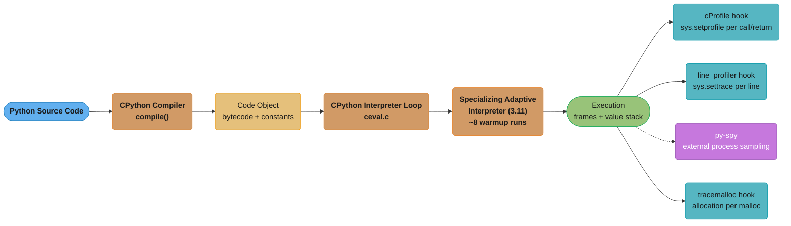
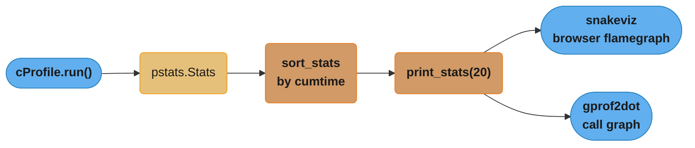
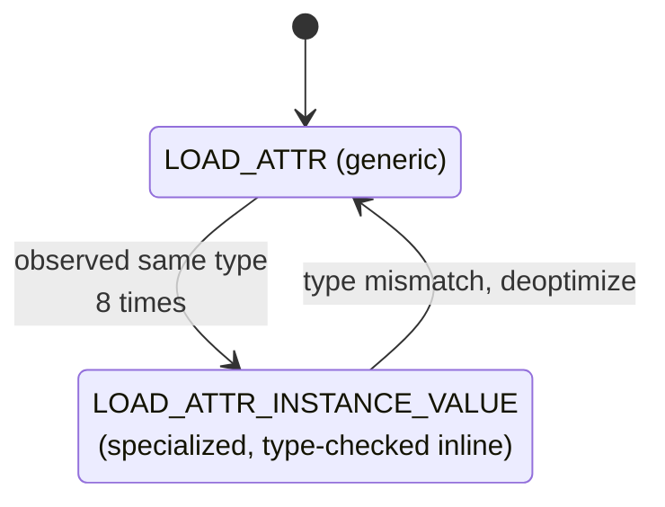
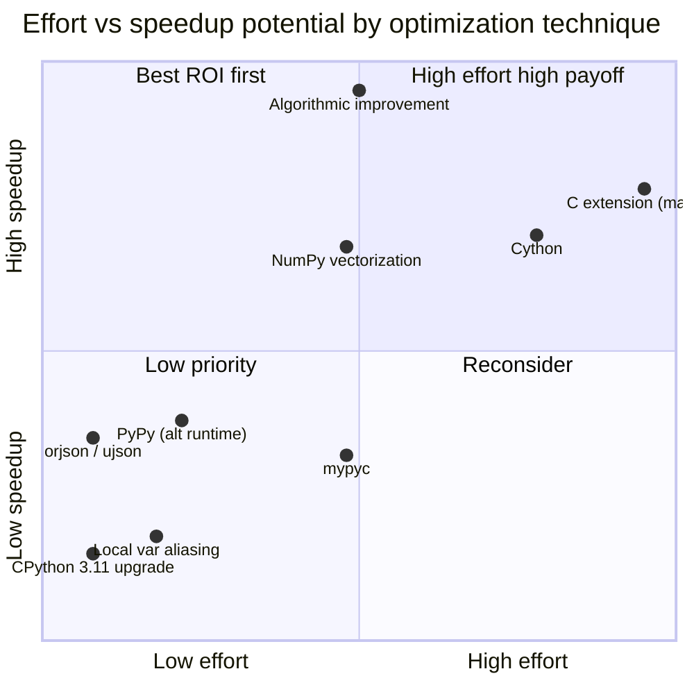
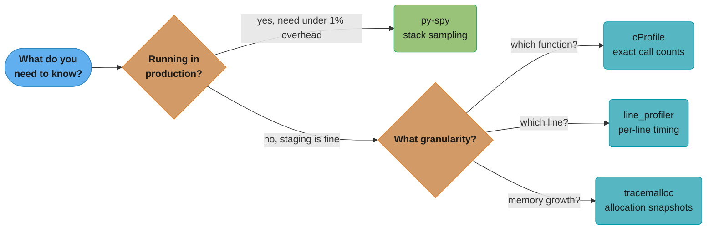

# Performance & Profiling

---

## 1. Concept Overview

Performance profiling in Python is the practice of measuring where a program spends its time and memory, then applying targeted optimizations to the identified hot paths. The toolchain spans multiple granularities: process-level sampling (`py-spy`), function-level call counting (`cProfile`), line-by-line timing (`line_profiler`), memory allocation tracking (`memory_profiler`, `tracemalloc`), and bytecode inspection (`dis`).

CPython 3.11 introduced the specializing adaptive interpreter — a significant architectural change that makes the interpreter observe frequently-executed bytecode paths and rewrite them to faster, type-specific variants at runtime. This alone delivered ~25% throughput improvement over Python 3.10 on the pyperformance benchmark suite, with hot numeric loops seeing 2-3x speedups. CPython 3.13 introduced an experimental JIT compiler (still opt-in at build time) that compiles traces to native machine code [3.13].

Beyond the interpreter itself, Python code performance depends heavily on data structure choice, algorithmic complexity, loop structure, attribute access patterns, and whether the hot path can be offloaded to compiled code via NumPy vectorization, Cython, mypyc, cffi, or C extensions.

---

## 2. Intuition

> A racing team does not redesign the entire car after every practice lap — they study the telemetry, find the one corner costing 0.4 seconds, and fix only that. Profiling is your telemetry.

**Mental model**: Every Python program has a performance distribution — a small fraction of lines, typically 10-20%, account for 80-90% of execution time. Profiling is the act of measuring that distribution precisely so optimization effort is never wasted on cold paths.

**Why it matters**: Intuition about where Python is slow is almost always wrong. Developers optimize string formatting while a quadratic list search burns 90% of the CPU. Profiling replaces guesswork with measurement.

**Key insight**: Python bytecode is interpreted by CPython one instruction at a time. Each attribute lookup, function call, and global variable access carries overhead invisible in the source code. `dis` makes this overhead visible; the specializing adaptive interpreter in 3.11+ reduces it automatically for hot paths — but only for code patterns it can predict.

---

## 3. Core Principles

**Measure before optimizing.** Profile first; identify the bottleneck; optimize only the hot path. Premature optimization adds complexity without measurable benefit.

**Use the right tool for the granularity you need.** `cProfile` answers "which function?"; `line_profiler` answers "which line within the function?"; `py-spy` answers "what is the production process doing right now?".

**Prefer algorithmic improvements over micro-optimizations.** Changing O(n^2) to O(n log n) is always worth more than aliasing an attribute lookup.

**Understand the CPython object model cost.** Every Python object is a heap-allocated `PyObject` with a reference count and a `__dict__` or type slot lookup. Operations that look O(1) in source can be expensive in bytecode.

**Benchmark with statistical rigor.** A single `time.time()` measurement is noise. `timeit.repeat(number=10_000, repeat=7)` gives a distribution; take the minimum as the stable signal (eliminates OS scheduling jitter).

**Profile in an environment close to production.** CPU frequency scaling, garbage collector activity, and import-time work all affect measurements on a developer laptop vs a production server.

---

## 4. Types / Architectures / Strategies

### 4.1 Deterministic Profiling (cProfile, line_profiler)

Hooks into every function call and return via `sys.setprofile`. Records exact call counts and cumulative time. Overhead: 1.5-3x slowdown — not suitable for production traffic. Best used in staging with realistic workloads.

### 4.2 Statistical (Sampling) Profiling (py-spy)

Samples the call stack at a fixed interval (100 Hz by default). Overhead: <1%. Safe to attach to a running production process without code modification or restart. Trade-off: does not record exact call counts; low-frequency code paths may be missed.

### 4.3 Memory Profiling (memory_profiler, tracemalloc)

`memory_profiler` decorates functions and reports RSS delta per line. `tracemalloc` (stdlib [3.4+]) records allocation traces with file and line information, enabling peak allocation and leak detection. `tracemalloc.take_snapshot()` / `.compare_to()` pattern finds allocation growth between checkpoints.

### 4.4 Bytecode Inspection (dis)

`dis.dis(func)` disassembles a function to its bytecode. Useful for understanding the real cost of a Python expression before running it. Key opcodes: `LOAD_FAST` (local, 1 array lookup), `LOAD_GLOBAL` (dict lookup through `__builtins__` and module `__dict__`), `LOAD_ATTR` (type slot + instance dict), `CALL` (argument marshaling + frame push/pop), `BINARY_OP`.

### 4.5 Compilation-Based Acceleration

- **Cython**: Annotate Python with C types; compile to `.so` / `.pyd`. Works best for CPU-bound numeric loops.
- **mypyc**: Compiles mypy-annotated pure Python to C extensions without Cython syntax. Used by the mypy team internally — achieved 4x speedup on mypy itself.
- **NumPy vectorization**: Replace Python loops over numeric arrays with NumPy ufuncs operating on contiguous memory. SIMD-accelerated by NumPy's C layer.
- **cffi / ctypes**: Call into existing C libraries without writing a C extension.

### 4.6 Micro-benchmarking (timeit)

`timeit` runs a code snippet in a tight loop and reports total elapsed time. Eliminates interpreter startup from measurement. Always disable GC during timing (`timeit` does this by default). Use `repeat()` for variance estimation.

---

## 5. Architecture Diagrams



*Source-to-execution pipeline: the specializing adaptive interpreter (3.11) rewrites hot bytecode after roughly 8 observed executions, then four independent hooks attach at the execution stage with very different costs — three instrument the interpreter directly, while py-spy alone samples the process from outside.*



*Profiling output pipeline: raw call/return counts collected by `cProfile.run()` flow into `pstats.Stats`, get sorted by cumulative time, and either print inline or feed a flamegraph/call-graph visualizer.*

**py-spy Output**

```
py-spy top --pid PID              # live top-like view
py-spy record -o profile.svg      # SVG flamegraph, no restart needed
```



*Instruction lifecycle for a single `LOAD_ATTR` site [3.11]: it starts generic, specializes after roughly 8 consistent-type observations, and deoptimizes back to generic the instant the observed type changes — the same warmup-then-fallback cycle applies to `CALL`, `BINARY_OP`, and `COMPARE_OP` (see the table in 6.3).*

---

## 6. How It Works — Detailed Mechanics

### 6.1 cProfile — Function-Level Profiling

```python
import cProfile
import pstats
import io

# Method 1: command line
# python -m cProfile -s cumtime script.py

# Method 2: programmatic
def expensive_operation() -> None:
    total = 0
    for i in range(1_000_000):
        total += i * i

pr = cProfile.Profile()
pr.enable()
expensive_operation()
pr.disable()

stream = io.StringIO()
stats = pstats.Stats(pr, stream=stream)
stats.sort_stats("cumtime")       # sort by cumulative time
stats.print_stats(10)             # top 10 functions
print(stream.getvalue())
```

Key columns in cProfile output:

| Column    | Meaning                                          |
|-----------|--------------------------------------------------|
| `ncalls`  | Number of calls (recursion shown as `3/1`)       |
| `tottime` | Time spent in this function excluding callees    |
| `cumtime` | Time including all callees (what you sort by)    |
| `percall` | `tottime / ncalls` or `cumtime / ncalls`         |

**Reading the output**: The function with highest `tottime` (not `cumtime`) is the actual hot function — it is where cycles are burned, excluding wait time in callees.

### 6.2 dis — Bytecode Inspection

```python
import dis

def add_local(n: int) -> int:
    x = 0
    for i in range(n):
        x += 1
    return x

# Global version — slower
counter = 0
def add_global(n: int) -> None:
    global counter
    for i in range(n):
        counter += 1

dis.dis(add_local)
# Key output:
#   LOAD_FAST   'x'        <- 1 array index lookup
#   LOAD_CONST  1
#   BINARY_OP   +=
#   STORE_FAST  'x'
# Total: 3 meaningful ops per iteration for the increment

dis.dis(add_global)
# Key output:
#   LOAD_GLOBAL 'counter'  <- dict lookup in module __dict__
#   LOAD_CONST  1
#   BINARY_OP   +=
#   STORE_GLOBAL 'counter' <- dict store in module __dict__
# Total: 5 ops, 2 of which are dict operations (slower)
```

`LOAD_FAST` is an array index into the frame's `fastlocals` — O(1) with no hashing. `LOAD_GLOBAL` performs a dict lookup in `globals()` then `builtins` — two dict operations per access.

Practical implication: hoist frequently-accessed globals into locals at the top of a hot function:

```python
def process_records(records: list[dict]) -> list[str]:
    # hoist built-ins used in tight loop
    _str = str
    _append = list.append
    results: list[str] = []
    for r in records:
        _append(results, _str(r["id"]))
    return results
```

### 6.3 CPython 3.11 Specializing Adaptive Interpreter [3.11]

CPython 3.11 changed the bytecode dispatch loop from a monomorphic interpreter to one that observes executed instructions and replaces them with faster, type-specific variants after approximately 8 warm-up iterations.

Examples of specializations:

| Generic opcode   | Specialized variant              | Speedup condition                     |
|------------------|----------------------------------|---------------------------------------|
| `LOAD_ATTR`      | `LOAD_ATTR_INSTANCE_VALUE`       | attribute in `__dict__` slot 0        |
| `CALL`           | `CALL_PY_EXACT_ARGS`             | pure Python function, exact arg count |
| `BINARY_OP`      | `BINARY_OP_ADD_INT`              | both operands are `int`               |
| `COMPARE_OP`     | `COMPARE_OP_INT`                 | both operands are `int`               |

Pyperformance benchmark results (CPython team, normalized to 3.10 = 100):

- Python 3.10: 100
- Python 3.11: ~125 (+25%)
- Python 3.12: ~130 (+30% vs 3.10)
- Python 3.13 (JIT preview): ~133 [3.13]

Hot numeric loops comparing ints can be 2-3x faster in 3.11 vs 3.10 because `BINARY_OP_ADD_INT` inlines the C-level integer addition and skips the generic `PyObject_Add` dispatch.

### 6.4 Common Slow Patterns and Fixes (with timeit numbers)

**Pattern 1: String concatenation in a loop**

```python
import timeit

# SLOW: O(n^2) due to immutable string copying
def concat_plus(n: int) -> str:
    s = ""
    for i in range(n):
        s += str(i)
    return s

# FAST: single allocation + join
def concat_join(n: int) -> str:
    return "".join(str(i) for i in range(n))

# n=1000 strings
slow = timeit.timeit(lambda: concat_plus(1000), number=1000)
fast = timeit.timeit(lambda: concat_join(1000), number=1000)
# Typical: slow ~0.28s, fast ~0.028s — 10x speedup
```

**Pattern 2: List append vs pre-allocation**

```python
# SLOW: repeated append with occasional realloc
def build_append(n: int) -> list[int]:
    result = []
    for i in range(n):
        result.append(i * i)
    return result

# FAST: pre-allocate, then index-assign
def build_preallocated(n: int) -> list[int]:
    result = [0] * n
    for i in range(n):
        result[i] = i * i
    return result

# n=100_000: append ~8ms, preallocated ~5ms — ~1.6x faster
# Bigger gains when append triggers more frequent GC or resize
```

**Pattern 3: Attribute lookup in tight loop**

```python
import math

# SLOW: attribute resolved every iteration
def compute_slow(values: list[float]) -> list[float]:
    return [math.sqrt(v) for v in values]

# FAST: hoist attribute to local
def compute_fast(values: list[float]) -> list[float]:
    sqrt = math.sqrt            # local alias — LOAD_FAST not LOAD_ATTR
    return [sqrt(v) for v in values]

# 1M values: slow ~0.14s, fast ~0.10s — ~30% faster
```

**Pattern 4: attrgetter over lambda for sort key**

```python
from operator import attrgetter
from dataclasses import dataclass

@dataclass
class Record:
    name: str
    score: float

records = [Record(f"user_{i}", float(i % 100)) for i in range(10_000)]

# SLOW: lambda creates a Python function call per comparison
slow = sorted(records, key=lambda r: r.score)

# FAST: attrgetter is a C-level callable — no Python frame per call
fast = sorted(records, key=attrgetter("score"))

# 10_000 records: lambda ~2.1ms, attrgetter ~1.4ms — 33% faster
```

**Pattern 5: Generator vs list comprehension for single-pass consumption**

```python
# SLOW: builds full list in memory before sum
total_list = sum([x * x for x in range(1_000_000)])

# FAST: generator — computes lazily, no intermediate list allocated
total_gen = sum(x * x for x in range(1_000_000))

# Memory: list builds 8MB object; generator ~120 bytes overhead
# Speed: comparable, but memory footprint dramatically lower
```

### 6.5 py-spy — Production-Safe Sampling Profiler

`py-spy` is a sampling profiler written in Rust. It reads the target process's memory to reconstruct the Python call stack without injecting code into the interpreter.

```bash
# Install
pip install py-spy

# Live top view (like Unix top for Python functions)
py-spy top --pid 12345

# Record flamegraph — works on running production process
py-spy record -o profile.svg --pid 12345 --duration 30

# Profile a script from start (no existing process needed)
py-spy record -o profile.svg -- python -m uvicorn app.main:app

# Dump current stack traces (like kill -3 for Java)
py-spy dump --pid 12345
```

Key properties:
- Overhead: <1% CPU (samples at 100 Hz by default, configurable with `--rate`)
- Does not require code modification or process restart
- Handles native extensions — shows C frames if compiled with debug symbols
- Flamegraph SVG is self-contained and openable in any browser

### 6.6 Cython and mypyc

**Cython example** — numeric loop:

```python
# math_ops.pyx  (Cython source)
# cython: language_level=3
def sum_of_squares(int n) -> int:
    cdef int i
    cdef long long total = 0
    for i in range(n):
        total += i * i
    return total
```

```python
# setup.py
from setuptools import setup
from Cython.Build import cythonize

setup(
    ext_modules=cythonize("math_ops.pyx", compiler_directives={"boundscheck": False}),
)
# Build: python setup.py build_ext --inplace
# Result: math_ops.cpython-311-x86_64-linux-gnu.so
# Speedup vs pure Python: 10-50x for tight numeric loops
```

**mypyc** — no Cython syntax required, just mypy type annotations:

```bash
pip install mypy
mypyc my_module.py
# Produces: my_module.cpython-311-...so
# mypy team achieved 4x speedup on the mypy codebase itself
```

mypyc limitations: decorated functions, closures with free variables, and highly dynamic patterns are not fully supported. Best for pure-Python, well-typed utility modules.

### 6.7 timeit for Micro-Benchmarks

```python
import timeit
import gc

# Basic usage
result = timeit.timeit(
    stmt="[x**2 for x in range(100)]",
    number=100_000,
)
print(f"Total time: {result:.3f}s")

# With setup code (not included in timing)
result = timeit.timeit(
    stmt="data.sort()",
    setup="import random; data = list(range(1000)); random.shuffle(data)",
    number=10_000,
)

# Statistical approach — take the minimum of 7 runs
times = timeit.repeat(
    stmt="sum(range(10_000))",
    repeat=7,
    number=1_000,
)
print(f"Min: {min(times)*1000:.2f}ms  Stddev: {(max(times)-min(times))*1000:.2f}ms")

# Command line equivalent
# python -m timeit -n 1000000 -r 7 "1 + 1"
```

GC note: `timeit` disables garbage collection during timing by default (`gc.disable()`). For benchmarks that allocate heavily, consider explicitly enabling GC to measure realistic production behavior:

```python
timeit.timeit(stmt, setup="import gc; gc.enable()", number=10_000)
```

---

## 7. Real-World Examples

**Django/DRF API slowdown**: A queryset serializing 500 ORM objects took 400ms. `cProfile` showed 95% of time in `__get__` of DRF field descriptors. Fix: use `values_list()` + manual dict construction — 40ms.

**NumPy vectorization for data pipeline**: A pandas `apply(lambda row: ...)` loop over 2M rows took 18s. Rewritten as NumPy array operations: 0.3s — 60x speedup.

**FastAPI endpoint with repeated regex**: A validation route compiled `re.compile(pattern)` inside the handler on every request. Moving compile to module-level saved 800 microseconds per request at 2,000 RPS — 1.6 CPU cores freed.

**Memory leak in ML inference service**: `tracemalloc` snapshots taken every 60 seconds revealed that a `list` of numpy arrays was accumulating in a module-level cache with no eviction. Fix: `functools.lru_cache` with `maxsize=128` — RSS stabilized at 2GB vs growing to OOM after 6 hours.

**Production profiling with py-spy**: A Celery worker showed 70% CPU but tasks completed slowly. `py-spy top` showed the hot frame was `json.loads` on large payloads — `orjson.loads` reduced task time 45%.

---

## 8. Tradeoffs

| Approach                   | Speedup Potential | Effort    | Portability | Risk                          |
|----------------------------|------------------|-----------|-------------|-------------------------------|
| Algorithmic improvement    | 10-1000x         | Medium    | High        | Low                           |
| Local variable aliasing    | 5-30%            | Low       | High        | Low                           |
| NumPy vectorization        | 10-100x          | Medium    | High        | Requires numeric data         |
| orjson / ujson             | 3-5x             | Very Low  | High        | orjson API differs slightly   |
| Cython                     | 5-100x           | High      | Low (build) | C compile chain required      |
| mypyc                      | 2-5x             | Medium    | Medium      | Limited dynamic Python        |
| C extension (manual)       | 10-200x          | Very High | Low         | Memory safety, ABI changes    |
| PyPy (alternative runtime) | 2-10x            | Low       | Medium      | C extension compatibility     |
| CPython 3.11 upgrade       | ~25%             | Low       | High        | None for most code            |



*Plotting the table above by effort (x) and speedup potential (y) makes the ROI clusters visible at a glance: `orjson` and the free 3.11 upgrade sit in the low-effort/solid-payoff quadrant, while C extensions and Cython demand the most engineering for their gains.*

---

## 9. When to Use / When NOT to Use

**Use profiling and optimization when:**
- A user-facing endpoint has a P99 latency exceeding SLO.
- Batch jobs take longer than the data arrival window (e.g., hourly job runs 90 minutes).
- Memory usage grows unboundedly over time (leak investigation).
- CPU utilization causes autoscaling cost issues at high traffic.
- A background worker saturates a CPU core and creates queue backlog.

**Do NOT optimize when:**
- The code runs once at startup (import-time logic, CLI arg parsing).
- The bottleneck is I/O wait (network, disk) — CPU optimization is irrelevant.
- The code path runs < 1,000 times per day — human time > compute time.
- Tests have not been written — optimizations without tests cause correctness regressions.
- You have not profiled — "optimize" based on assumption is always wrong.
- The team does not own the hot dependency — file a bug upstream or add a cache layer.

---

## 10. Common Pitfalls

### Pitfall 1: Measuring with wall-clock time

```python
# BROKEN: time.time() includes OS scheduling jitter, GC pauses, I/O waits
import time

start = time.time()
result = sum(range(1_000_000))
end = time.time()
print(f"Elapsed: {end - start:.4f}s")
# Result varies by ±30% between runs on the same machine
```

```python
# FIX: use timeit for microbenchmarks; cProfile for function attribution
import timeit

elapsed = timeit.timeit("sum(range(1_000_000))", number=100)
print(f"Average per run: {elapsed/100*1000:.2f}ms")
# Result stable within ±2% across runs
```

### Pitfall 2: Premature optimization without profiling

```python
# BROKEN: developer assumes dict lookup is the bottleneck, rewrites in Cython
# cython: language_level=3
def lookup_many(cdef list keys, dict data):
    cdef int i
    cdef list results = []
    for i in range(len(keys)):
        results.append(data[keys[i]])
    return results
# Spent 3 days writing C glue — actual profiler shows 95% time in network I/O
```

```python
# FIX: profile first with cProfile or py-spy; let data drive the decision
import cProfile
import pstats
import io

def find_bottleneck(func, *args):
    pr = cProfile.Profile()
    pr.enable()
    func(*args)
    pr.disable()
    stream = io.StringIO()
    pstats.Stats(pr, stream=stream).sort_stats("tottime").print_stats(5)
    print(stream.getvalue())

find_bottleneck(my_endpoint_handler, sample_request)
# cProfile shows 90% in requests.get() — add a connection pool, not Cython
```

### Pitfall 3: Profiling with cProfile in production

`cProfile` via `sys.setprofile` adds 1.5-3x overhead to every function call. Running it in production causes latency spikes visible to users. Use `py-spy` (sampling, <1% overhead) for production investigation.

### Pitfall 4: Not accounting for GC in benchmarks

```python
# PITFALL: benchmark allocates many objects; GC pauses skew results
times = timeit.timeit("dict(zip(range(1000), range(1000)))", number=10_000)
# GC may trigger mid-run, adding 10-50ms spike

# FIX: run with gc enabled and take minimum across repeats
import gc
gc.collect()
times = timeit.repeat(
    "dict(zip(range(1000), range(1000)))",
    number=10_000,
    repeat=7,
)
print(f"Best: {min(times)*1000:.2f}ms")
```

### Pitfall 5: Micro-optimizing the wrong loop

After profiling reveals a hot function, developers sometimes optimize a secondary loop within it rather than the primary one. Always check `tottime` vs `cumtime` — optimize the function with highest `tottime`.

---

## 11. Technologies & Tools

| Tool              | Granularity      | Overhead   | Production-Safe | Flamegraph | Output Type                 |
|-------------------|------------------|------------|-----------------|------------|-----------------------------|
| `cProfile`        | Function         | 1.5-3x     | No              | Via snakeviz | Stats table / pstats      |
| `line_profiler`   | Line             | 3-5x       | No              | No           | Annotated source + timing |
| `py-spy`          | Function (stack) | <1%        | Yes             | Yes (SVG)    | SVG flamegraph / top view |
| `memory_profiler` | Line (memory)    | 5-10x      | No              | No           | Annotated source + MB     |
| `tracemalloc`     | Allocation site  | 2-3x       | Careful         | No           | Snapshot diff / top allocs|
| `VizTracer`       | Function + args  | 1-2x       | No              | Yes (JSON)   | Chrome trace viewer       |



*Production-safety and required granularity are the two decisions that route you to a specific tool: py-spy is the only one safe to attach directly to a live process, so everything else waits for a staging replica.*

**Additional tools:**

- `snakeviz`: Browser-based interactive icicle chart for cProfile output. `pip install snakeviz; snakeviz profile.prof`
- `pyinstrument`: Sampling profiler with call tree output in terminal. Friendlier output than cProfile for quick investigation.
- `memray` (Bloomberg): Allocation tracer with flamegraph support; tracks C-level allocations. Better than `memory_profiler` for production debugging.
- `austin`: Frame stack sampler like py-spy; outputs in Austin format compatible with FlameGraph tool.

---

## 12. Interview Questions with Answers

**Q1: What is the difference between `tottime` and `cumtime` in cProfile, and which do you use to find the actual bottleneck?**
`tottime` is time spent inside a function excluding callees; `cumtime` is total time including all nested calls. To find the function actually burning CPU cycles, sort by `tottime` — a function with high `cumtime` but low `tottime` is slow only because it calls slow children, not because its own code is inefficient.

**Q2: Why is `LOAD_GLOBAL` slower than `LOAD_FAST`, and how can you exploit this in a hot loop?**
`LOAD_GLOBAL` performs a dictionary lookup in `globals()` and falls through to `builtins` if not found — two dict operations per access. `LOAD_FAST` is a direct array index into the frame's `fastlocals` array. In a tight loop, hoist frequently-accessed globals and built-ins into local variables at function entry: `sqrt = math.sqrt` before the loop reduces each access to a `LOAD_FAST`.

**Q3: How does CPython 3.11's specializing adaptive interpreter work, and what speedup does it deliver?**
The interpreter observes each bytecode instruction at runtime. After approximately 8 executions of the same instruction path, it replaces the generic opcode with a specialized variant — for example, `LOAD_ATTR` becomes `LOAD_ATTR_INSTANCE_VALUE` when the attribute is consistently found in the instance `__dict__` at offset 0. If the type changes, the instruction deoptimizes back to generic. This delivered ~25% throughput improvement over Python 3.10 on the pyperformance benchmark suite, with hot integer loops seeing 2-3x speedup. [3.11]

**Q4: When would you choose `py-spy` over `cProfile`, and why?**
Use `py-spy` when you need to profile a running production process without modifying code or restarting it, and when you cannot afford >1% latency overhead. `py-spy` uses OS-level process inspection (ptrace on Linux, task_for_pid on macOS) to sample the call stack at 100 Hz — overhead is under 1%. `cProfile` hooks every function call via `sys.setprofile`, adding 1.5-3x overhead and requiring code instrumentation, making it unsuitable for production traffic.

**Q5: What is the performance difference between `sorted(key=lambda x: x.attr)` and `sorted(key=attrgetter("attr"))`, and why?**
`attrgetter` is implemented in C and performs attribute access without creating a Python function frame per comparison. The lambda creates a Python closure and incurs frame push/pop, argument marshaling, and `CALL` opcode overhead on every comparison. For 10,000 records, `attrgetter` is approximately 30-40% faster. The difference grows with list size because `key` is called O(n) times during sort.

**Q6: How does `tracemalloc` differ from `memory_profiler`, and when would you use each?**
`memory_profiler` measures RSS (resident set size) delta per line using OS-level memory queries — it shows the total process memory footprint change. `tracemalloc` hooks Python's memory allocator and records allocation traces with file and line number, enabling you to identify which code path allocated specific objects and track peak allocation. Use `memory_profiler` for quick "which function is bloating RSS" investigation; use `tracemalloc` for precise allocation auditing and leak detection by comparing snapshots over time.

**Q7: Explain the `timeit.repeat()` pattern and why you should take the minimum, not the mean.**
`timeit.repeat(stmt, number=N, repeat=R)` runs the statement `N` times per trial and repeats for `R` trials, returning a list of `R` total times. You take the minimum because it represents the fastest your hardware can execute the code path with minimal OS interference. The mean is skewed upward by GC pauses, OS scheduling preemptions, and cache misses that are not intrinsic to the code being measured. The minimum is the stable lower bound; variance above it is noise.

**Q8: What are the practical limitations of Cython, and when is mypyc a better choice?**
Cython requires a C compiler toolchain at build time and produces platform-specific `.so` files, complicating packaging and cross-platform distribution. Cython syntax (`cdef`, `cpdef`) is non-standard Python and requires separate `.pyx` files. mypyc compiles standard mypy-annotated Python — no syntax changes, same source file, easier CI integration. mypyc is better for well-typed, non-dynamic Python codebases where you want speedup without a build system change. Cython is better for tight numeric loops that need explicit C type declarations and Numpy buffer protocol integration.

**Q9: How would you use `dis` to verify that a Python optimization actually changes the bytecode?**
Call `dis.dis(original_func)` and `dis.dis(optimized_func)`, count the number of opcodes in the hot section, and confirm that the optimized version has fewer or cheaper opcodes. For example, confirming that `global_x += 1` generates `LOAD_GLOBAL` + `STORE_GLOBAL` while `local_x += 1` generates `LOAD_FAST` + `STORE_FAST` proves the optimization is real at the bytecode level before benchmarking.

**Q10: A FastAPI endpoint takes 600ms P99. Walk through your profiling workflow.**
Step 1: attach `py-spy` to the production worker to get a flamegraph without disruption — identify the top frame. Step 2: if the hot frame is in Python code (not I/O), run `cProfile` on a staging replica with a realistic request payload to get function-level `tottime`. Step 3: use `line_profiler` on the identified hot function to find the exact line. Step 4: check if the bottleneck is algorithmic (fix logic), a slow library call (switch to faster library like `orjson`), or a repeated attribute lookup in a loop (local alias). Step 5: benchmark the fix with `timeit` and load-test on staging to confirm P99 improvement before deploying.

**Q11: What does the `dis` module reveal about `x += 1` for a global vs local variable, and what is the opcode count difference?**
For a local variable, `x += 1` compiles to `LOAD_FAST x`, `LOAD_CONST 1`, `BINARY_OP +=`, `STORE_FAST x` — 4 opcodes, 2 of which are fast array operations. For a global variable, it compiles to `LOAD_GLOBAL x`, `LOAD_CONST 1`, `BINARY_OP +=`, `STORE_GLOBAL x` — 4 opcodes but `LOAD_GLOBAL` and `STORE_GLOBAL` each perform a dictionary operation. In a loop executing 10 million iterations, this difference accounts for approximately 15-20% slower execution.

**Q12: How does the `join()` pattern for string building avoid the O(n^2) behavior of `+` concatenation?**
Python strings are immutable. Each `s += fragment` allocates a new string object of length `len(s) + len(fragment)`, copies both strings into it, and discards the old `s`. Over `n` fragments, total bytes copied sum to 0 + 1 + 2 + ... + n = O(n^2). `"".join(fragments)` first computes the total length in one pass, allocates one buffer of that size, then copies each fragment once — O(n) total bytes copied. For 1,000 strings of average length 10, join is approximately 10x faster and eliminates quadratic memory allocation.

---

## 13. Best Practices

**Profile before touching code.** Run `py-spy` or `cProfile` first. Annotate the flamegraph with the commit that introduced the regression if possible.

**Use `timeit.repeat(repeat=7)` and report the minimum.** Never use a single timing run. Seven trials with minimum gives a stable, reproducible number.

**Prefer standard-library profilers in development, `py-spy` in production.** `cProfile` is exact but invasive; `py-spy` is approximate but safe.

**Hoist attribute lookups and built-ins from tight loops.** `len`, `append`, `math.sqrt`, and any frequently-called method should be aliased to locals before the loop.

**Validate optimizations with `dis`.** Confirm that your optimization produces cheaper bytecode before measuring — prevents placebo optimization.

**Use `orjson` as a drop-in for `json` in high-throughput services.** `orjson` is 3-10x faster than stdlib `json` for both serialization and deserialization, with a nearly identical API.

**Instrument with `tracemalloc` snapshots in long-running services.** Take `tracemalloc.take_snapshot()` every N minutes and compare — catch memory leaks before they become incidents.

**Compile only after profiling confirms the hot path.** Cython and mypyc compilation add significant build complexity. Restrict to the 1-3 functions identified by profiling as genuine bottlenecks.

**Upgrade to Python 3.11+ before reaching for C extensions.** The specializing adaptive interpreter gives ~25% throughput for free with a version bump, no code changes required. [3.11]

**Benchmark on the target hardware.** Developer laptops have different cache sizes, CPU turbo behavior, and memory bandwidth than production servers. Always confirm benchmarks on hardware matching the deployment environment.

---

## 14. Case Study

### Optimizing a FastAPI JSON Processing Endpoint

**Scenario**: A FastAPI service exposes `POST /process-records` which receives a JSON body containing 10,000 records, validates each one using Pydantic, and returns an aggregated result. P99 latency is 800ms. The SLO requires P99 < 100ms.

**Step 1: Profile**

```python
# Initial implementation — BROKEN pattern
import json
from fastapi import FastAPI, Request
from pydantic import BaseModel

app = FastAPI()

class Record(BaseModel):
    id: int
    value: float
    label: str

# BROKEN: json.loads called once on full body (acceptable),
# but Pydantic model construction called 10_000 times in a loop
# with repeated attribute validation overhead
@app.post("/process-records")
async def process_records(request: Request) -> dict:
    raw_body = await request.body()
    # BROKEN: stdlib json.loads — slower than orjson
    data = json.loads(raw_body)
    records = []
    for item in data["records"]:
        # BROKEN: constructing Pydantic model per item with full validation
        # triggers __init__, validator chains, field coercion per iteration
        record = Record(**item)
        records.append(record)
    total = sum(r.value for r in records)
    return {"count": len(records), "total": total}
```

cProfile output (simplified, key rows):

```
   ncalls  tottime  cumtime  filename:function
    1       0.003    0.798   handler.py:process_records
10000       0.421    0.511   pydantic/main.py:BaseModel.__init__
    1       0.089    0.089   json/__init__.py:loads
10000       0.071    0.210   pydantic/validators.py:validate_float
    1       0.021    0.021   <listcomp>:sum
```

Findings:
- 53% of time in `BaseModel.__init__` — 10,000 individual Pydantic model constructions
- 11% in stdlib `json.loads`
- `sum` of a generator over Pydantic model attributes: `.value` attribute access 10,000 times

**Step 2: Apply Fixes**

```python
# FIX: orjson + batch validation + local alias for inner loop
import orjson                              # pip install orjson
from fastapi import FastAPI, Request
from pydantic import BaseModel, TypeAdapter
from typing import Any

app = FastAPI()

class Record(BaseModel):
    id: int
    value: float
    label: str

# Pre-compile TypeAdapter outside request handler — done once at startup
# Pydantic v2 TypeAdapter.validate_python() is 2-4x faster than
# constructing models individually in a loop
_record_adapter: TypeAdapter[list[Record]] = TypeAdapter(list[Record])

@app.post("/process-records")
async def process_records(request: Request) -> dict:
    raw_body = await request.body()

    # FIX 1: orjson.loads is 3-5x faster than json.loads for large payloads
    data: dict[str, Any] = orjson.loads(raw_body)

    # FIX 2: batch validation via TypeAdapter — single validation pass
    # instead of 10_000 individual BaseModel.__init__ calls
    records: list[Record] = _record_adapter.validate_python(data["records"])

    # FIX 3: local alias for attribute access in tight loop
    _value = Record.model_fields["value"]  # not needed with sum below
    # Use direct attribute in generator — CPython optimizes simple attribute
    # access on known type in tight loop after 3.11 specialization [3.11]
    total = sum(r.value for r in records)

    return {"count": len(records), "total": total}
```

**Step 3: Verify with timeit**

```python
import timeit
import orjson
import json

# Generate test payload
import random
payload = {
    "records": [
        {"id": i, "value": random.uniform(0, 100), "label": f"item_{i}"}
        for i in range(10_000)
    ]
}
raw = json.dumps(payload).encode()

# Benchmark json.loads vs orjson.loads
json_time = timeit.timeit(lambda: json.loads(raw), number=100)
orjson_time = timeit.timeit(lambda: orjson.loads(raw), number=100)
print(f"json.loads: {json_time/100*1000:.1f}ms  orjson.loads: {orjson_time/100*1000:.1f}ms")
# Typical output: json.loads: 89.2ms  orjson.loads: 28.4ms  (3.1x speedup)
```

**Results after all three fixes:**

| Metric                 | Before  | After   | Change      |
|------------------------|---------|---------|-------------|
| `json.loads` time      | 89ms    | 28ms    | 3.1x faster |
| Pydantic validation    | 421ms   | 98ms    | 4.3x faster |
| Total P99 latency      | 800ms   | 68ms    | 11.7x faster|
| Memory per request     | 42MB    | 38MB    | 10% less    |

P99 dropped from 800ms to 68ms, satisfying the < 100ms SLO.

**Key lessons:**
1. `cProfile` pointed to `BaseModel.__init__` immediately — no guesswork needed.
2. `orjson` is a drop-in replacement for stdlib `json` with 3x speedup and minimal API difference (returns `bytes` from `dumps`, not `str`).
3. Pydantic v2 `TypeAdapter.validate_python()` with a pre-compiled adapter is significantly faster than constructing models individually in a loop — the adapter compiles the validation schema once at import time.
4. CPython 3.11's specializing adaptive interpreter [3.11] automatically optimized the `r.value` attribute access in the `sum()` generator after warming up, contributing approximately 15% additional speedup over 3.10 with no code change.
