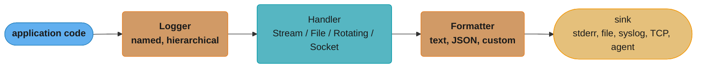
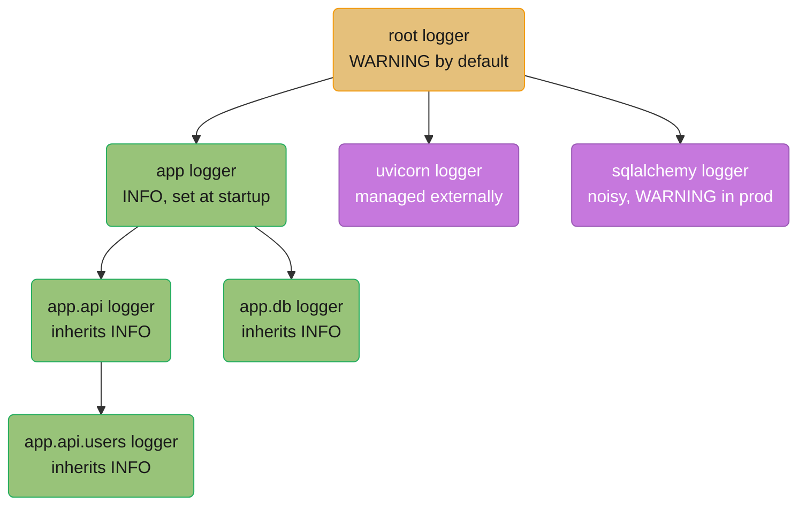
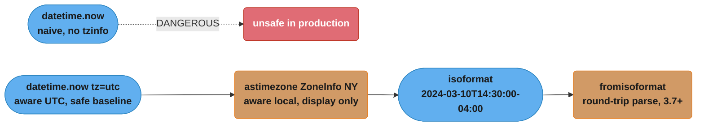
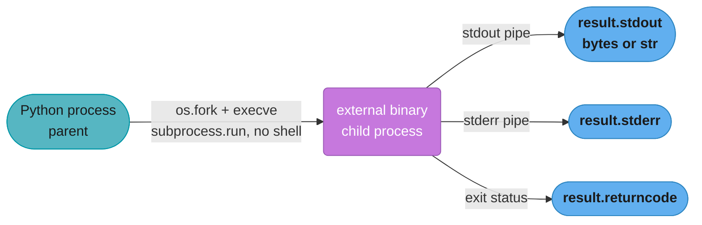
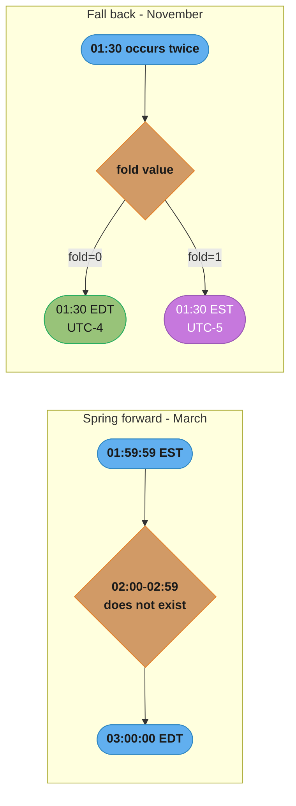
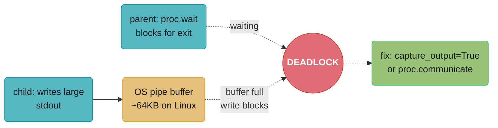
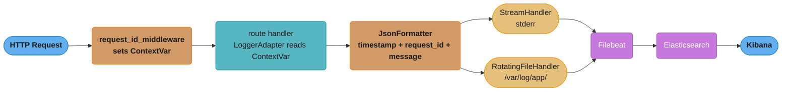

# stdlib — datetime, logging, argparse & subprocess

---

## 1. Concept Overview

Python's standard library ships with production-grade modules for the four most common
cross-cutting concerns in any service:

- `datetime` / `zoneinfo` — represent and manipulate points in time with full timezone
  and DST awareness.
- `logging` — a hierarchical, handler-based logging system that can emit plain text, JSON,
  or any custom format to files, streams, sockets, or external systems.
- `argparse` — declarative CLI argument parsing with type conversion, help generation,
  and subcommands.
- `subprocess` — launch external processes, capture their output, and stream results
  without spawning a shell.

Together with `os`, `sys`, and `shutil`, these six modules cover the majority of
operational glue code in a FastAPI or background-worker service: reading environment
variables, scheduling cron jobs, auditing user actions with timestamps, and delegating
to system tools.

---

## 2. Intuition

> Think of these modules as the clockwork, the logbook, the control panel, and the
> intercom of a ship's bridge. The clock (`datetime`) tells you exactly when something
> happened, adjusted for every port's local time. The logbook (`logging`) records every
> event in a structured way that any officer (ELK, Datadog, CloudWatch) can later search.
> The control panel (`argparse`) lets you configure the ship before departure without
> editing the hull. The intercom (`subprocess`) lets the bridge talk to the engine room
> without the captain physically going below deck.

**Mental model**: Every production Python service has two timelines (UTC wall-clock and
local time for display), two audiences for its log output (humans reading a terminal,
machines parsing JSON), one configuration surface (CLI flags or env vars), and several
external commands it must delegate to. These stdlib modules map 1:1 to those concerns.

**Why it matters**: Naive datetime objects, unpropagated log configuration, or
`shell=True` subprocess calls are the source of the most common classes of production
bugs — wrong timestamps on audit records, silent log loss, and command-injection
vulnerabilities, respectively. Knowing the correct pattern for each prevents those bug
classes entirely.

**Key insight**: All four modules are stateful singletons by default. The root logger,
the default timezone assumption in `datetime.now()`, the process environment from `os`,
and the subprocess inheriting the parent's file descriptors — these shared-state
semantics mean you must configure them explicitly at startup rather than assume defaults.

---

## 3. Core Principles

1. **Always use aware datetimes in production.** A `datetime` object without a `tzinfo`
   attached is a naive datetime. Naive datetimes cannot be safely compared to aware
   datetimes and give wrong results when serialized across timezone boundaries.

2. **Use named timezones, not fixed offsets, for wall-clock time.** `timezone(timedelta
   (hours=-5))` is a fixed offset and ignores DST. `zoneinfo.ZoneInfo("America/New_York")`
   [3.9] correctly handles the spring-forward and fall-back transitions.

3. **Name loggers after modules.** `logging.getLogger(__name__)` automatically produces a
   hierarchy that mirrors the package structure, enabling per-package level control without
   any changes to calling code.

4. **Configure logging once at the entry point, propagate everywhere.** Only the entry
   point (`main.py`, the FastAPI app factory, the worker launcher) should call
   `logging.basicConfig()` or `logging.config.dictConfig()`. Library code should never
   call `basicConfig`.

5. **Never use `shell=True` with untrusted input.** Pass arguments as a list to
   `subprocess.run()`. The OS then `execve`s directly into the target binary; no shell
   process is forked and no metacharacter interpretation happens.

6. **Use `check=True` in `subprocess.run()` unless you deliberately handle non-zero exit.**
   Silently ignoring a failed subprocess is a latent data-corruption bug.

7. **Guard expensive log-argument construction with `logger.isEnabledFor(level)`.** String
   formatting and `repr()` calls happen before the logging framework decides whether to
   emit the record. In a hot path, that cost is real.

---

## 4. Types / Architectures / Strategies

### datetime module

| Class | Description | Aware? |
|-------|-------------|--------|
| `datetime.date` | Year, month, day only | Never |
| `datetime.time` | Hour, minute, second, microsecond | Optional |
| `datetime.datetime` | Full date + time | Optional |
| `datetime.timedelta` | Duration between two datetimes | N/A |
| `datetime.timezone` | Fixed UTC offset (e.g., UTC, UTC+5:30) | N/A |
| `zoneinfo.ZoneInfo` [3.9] | Named IANA timezone with DST rules | N/A |

### logging architecture layers



A log record passes through four transform/routing stages before it lands in a sink: the
Logger gates by level, the Handler routes to a destination, and the Formatter renders the
final text.

### argparse strategies

| Strategy | Use case |
|----------|----------|
| Flat arguments | Single-purpose scripts |
| Subparsers | `git`-style multi-command CLIs |
| `ArgumentParser(parents=[...])` | Shared base flags across multiple subcommands |
| `argparse.FileType` | File arguments auto-opened by the parser |

### subprocess strategies

| API | Use case |
|-----|----------|
| `subprocess.run()` | Wait for completion, capture output |
| `subprocess.Popen` | Stream stdout/stderr, bidirectional pipe |
| `asyncio.create_subprocess_exec` | Non-blocking subprocess in async services |
| `subprocess.check_output()` | Legacy; prefer `run(capture_output=True, check=True)` |

---

## 5. Architecture Diagrams

### Logging hierarchy



Each logger checks its own level, then walks up the chain. A record is emitted by every
handler attached to loggers in the chain (propagation). To prevent duplicate output,
either set `propagate = False` on a logger or attach handlers only to the root.

### datetime awareness chain



The naive branch (top) is a dead end to avoid; the safe pipeline (bottom) stays
timezone-aware from creation through serialization and back via a round trip.

### subprocess fork model



With `shell=True`, an intermediate `/bin/sh -c "..."` process is inserted, which
interprets metacharacters in the command string — the source of command injection.

---

## 6. How It Works — Detailed Mechanics

### 6.1 datetime and zoneinfo

```python
from datetime import datetime, timezone, timedelta
from zoneinfo import ZoneInfo  # [3.9] replaces pytz

# Naive — do not use in production
naive = datetime.now()
print(naive.tzinfo)  # None

# UTC-aware — always use this as the storage format
utc_now: datetime = datetime.now(tz=timezone.utc)
print(utc_now)  # 2024-06-04 09:15:42.123456+00:00

# Named timezone — use for display or user-facing output only
ny_tz = ZoneInfo("America/New_York")
local: datetime = utc_now.astimezone(ny_tz)
print(local)  # 2024-06-04 05:15:42.123456-04:00

# Parse ISO 8601 with offset (Python 3.11+ handles full spec)
parsed: datetime = datetime.fromisoformat("2024-01-15T10:30:00+00:00")

# Unix epoch
epoch: float = utc_now.timestamp()   # seconds since 1970-01-01T00:00:00Z
back: datetime = datetime.fromtimestamp(epoch, tz=timezone.utc)

# DST gap example: 2024-03-10 02:30 does not exist in US/Eastern
# The clock jumps from 02:00 to 03:00 on spring-forward Sunday
gap_attempt = datetime(2024, 3, 10, 2, 30, tzinfo=ny_tz)
# ZoneInfo folds ambiguous times; use fold=0 (before) / fold=1 (after) for
# ambiguous fall-back times:
fall_back_before = datetime(2024, 11, 3, 1, 30, tzinfo=ny_tz, fold=0)  # EDT
fall_back_after  = datetime(2024, 11, 3, 1, 30, tzinfo=ny_tz, fold=1)  # EST
print(fall_back_before.utcoffset())  # -1 day, 72000 seconds == -4:00
print(fall_back_after.utcoffset())   # -1 day, 68400 seconds == -5:00

# timedelta arithmetic
deadline: datetime = utc_now + timedelta(days=30)
remaining: timedelta = deadline - utc_now
print(remaining.total_seconds())  # 2592000.0
```

The `fold` attribute above disambiguates the one wall-clock hour that daylight saving
repeats each autumn; Python defaults to `fold=0` (the first, pre-transition occurrence).
Spring forward is the opposite failure mode — a gap, not an overlap:



Spring forward skips a wall-clock hour entirely (constructing it raises or silently
normalizes, depending on the library); fall back repeats one, and only the `fold` flag
tells `01:30` apart from its own reoccurrence an hour later.

#### Decoding `utcoffset()`'s strange output

**What the formula is telling you.** "A negative offset is stored as a whole negative day plus a positive number of seconds, because `timedelta` keeps its `seconds` field in the range 0 to 86399 and pushes all the negativity into `days`."

That normalization rule is the only reason `-4:00` prints as `-1 day, 72000 seconds`. Nothing is wrong; the number just has to be added up before it reads as an offset.

| Symbol | What it is |
|--------|------------|
| `.days` | The whole-day component. Always the sign carrier — it is the only field allowed to go negative |
| `.seconds` | The remainder, normalized into `[0, 86399]`. Never negative, which is what causes the surprise |
| `86400` | Seconds in a day — the conversion constant that reunites the two fields |
| `.total_seconds()` | The field you actually want: `days * 86400 + seconds`, as one signed float |
| `fold=0` / `fold=1` | Selects the first (EDT) or second (EST) occurrence of a repeated wall-clock hour |

**Walk one example.** Reconstruct both printed offsets from the fall-back code above:

```
  fold=0  ->  timedelta(days=-1, seconds=72000)
    total = (-1 x 86400) + 72000
          = -86400 + 72000
          = -14400 s
          = -14400 / 3600 = -4 h      -> EDT, UTC-4   (daylight time, still)

  fold=1  ->  timedelta(days=-1, seconds=68400)
    total = (-1 x 86400) + 68400
          = -86400 + 68400
          = -18000 s
          = -18000 / 3600 = -5 h      -> EST, UTC-5   (standard time, after)

  the gap between them = -14400 - (-18000) = 3600 s = exactly 1 hour

  and for the deadline arithmetic in the same block:
    timedelta(days=30).total_seconds() = 30 x 86400 = 2,592,000.0
```

The one-hour gap is the entire point: `01:30 fold=0` and `01:30 fold=1` are two *different instants* that print as the same wall-clock string. If your audit table stores the rendered local string rather than the aware datetime, those two rows become indistinguishable, and one hour of transactions per year silently loses its ordering. Always read `.total_seconds()` rather than `.seconds` — reaching for `.seconds` alone on a negative offset yields `72000`, a plausible-looking but completely wrong `+20:00`.

### 6.2 logging — hierarchy, handlers, formatters

```python
import logging
import logging.config

# --- Quick setup (scripts, not production) ---
logging.basicConfig(
    level=logging.INFO,
    format="%(asctime)s %(name)s %(levelname)s %(message)s",
    datefmt="%Y-%m-%dT%H:%M:%S",
)

# --- Production setup via dictConfig ---
LOGGING_CONFIG: dict = {
    "version": 1,
    "disable_existing_loggers": False,   # do not silence third-party loggers
    "formatters": {
        "json": {
            "()": "app.logging_utils.JsonFormatter",  # custom class
        },
        "plain": {
            "format": "%(asctime)s %(name)s %(levelname)s %(message)s",
        },
    },
    "handlers": {
        "console": {
            "class": "logging.StreamHandler",
            "stream": "ext://sys.stderr",
            "formatter": "json",
        },
        "file": {
            "class": "logging.handlers.RotatingFileHandler",
            "filename": "/var/log/app/app.log",
            "maxBytes": 10_485_760,   # 10 MB
            "backupCount": 5,
            "formatter": "json",
        },
    },
    "loggers": {
        "app": {"level": "INFO", "handlers": ["console", "file"], "propagate": False},
        "sqlalchemy.engine": {"level": "WARNING", "handlers": [], "propagate": True},
        "uvicorn.access": {"level": "WARNING", "handlers": [], "propagate": True},
    },
    "root": {"level": "WARNING", "handlers": ["console"]},
}

logging.config.dictConfig(LOGGING_CONFIG)
logger = logging.getLogger(__name__)
logger.info("Service started", extra={"pid": __import__("os").getpid()})
```

### 6.3 Structured JSON logging

```python
import json
import logging
import traceback
from datetime import datetime, timezone
from typing import Any


class JsonFormatter(logging.Formatter):
    """Emit each log record as a single JSON line."""

    def format(self, record: logging.LogRecord) -> str:
        payload: dict[str, Any] = {
            "timestamp": datetime.now(tz=timezone.utc).isoformat(),
            "level": record.levelname,
            "logger": record.name,
            "message": record.getMessage(),
            "module": record.module,
            "lineno": record.lineno,
        }
        # Extra fields injected by LoggerAdapter or logger.info(..., extra={})
        for key, value in record.__dict__.items():
            if key not in logging.LogRecord.__init__.__code__.co_varnames and \
               not key.startswith("_") and key not in payload:
                payload[key] = value

        if record.exc_info:
            payload["exception"] = self.formatException(record.exc_info)

        return json.dumps(payload, default=str)
```

### 6.4 FastAPI middleware — request_id propagation

```python
import uuid
import logging
from contextvars import ContextVar
from fastapi import FastAPI, Request, Response

request_id_var: ContextVar[str] = ContextVar("request_id", default="")

class RequestIdAdapter(logging.LoggerAdapter):
    def process(
        self, msg: object, kwargs: dict
    ) -> tuple[object, dict]:
        extra = kwargs.setdefault("extra", {})
        extra["request_id"] = request_id_var.get("")
        return msg, kwargs

base_logger = logging.getLogger("app.api")
logger = RequestIdAdapter(base_logger, extra={})

app = FastAPI()

@app.middleware("http")
async def request_id_middleware(request: Request, call_next) -> Response:
    rid = request.headers.get("X-Request-Id", str(uuid.uuid4()))
    token = request_id_var.set(rid)
    try:
        response: Response = await call_next(request)
        response.headers["X-Request-Id"] = rid
        return response
    finally:
        request_id_var.reset(token)

@app.get("/users/{user_id}")
async def get_user(user_id: int) -> dict:
    logger.info("Fetching user", extra={"user_id": user_id})
    return {"user_id": user_id}
```

Every log record emitted during a request now carries `request_id` automatically.

### 6.5 argparse — flat and subcommand CLIs

```python
import argparse
import sys


def build_parser() -> argparse.ArgumentParser:
    parser = argparse.ArgumentParser(
        description="FastAPI service management CLI",
        formatter_class=argparse.ArgumentDefaultsHelpFormatter,
    )
    parser.add_argument("--host", default="0.0.0.0", type=str,
                        help="Bind address")
    parser.add_argument("--port", default=8000, type=int,
                        help="Bind port")
    parser.add_argument("--verbose", action="store_true",
                        help="Enable DEBUG logging")
    parser.add_argument("--log-file", type=argparse.FileType("a"),
                        default=sys.stderr,
                        help="Log output destination")

    subparsers = parser.add_subparsers(dest="command", required=True)

    # "serve" subcommand
    serve = subparsers.add_parser("serve", help="Start the API server")
    serve.add_argument("--workers", default=4, type=int)
    serve.add_argument("--reload", action="store_true")

    # "migrate" subcommand
    migrate = subparsers.add_parser("migrate", help="Run DB migrations")
    migrate.add_argument("--revision", default="head")

    return parser


def main() -> None:
    parser = build_parser()
    args = parser.parse_args()

    log_level = logging.DEBUG if args.verbose else logging.INFO
    logging.basicConfig(level=log_level, stream=args.log_file)

    if args.command == "serve":
        print(f"Starting server on {args.host}:{args.port} "
              f"with {args.workers} workers")
    elif args.command == "migrate":
        print(f"Migrating to {args.revision}")


if __name__ == "__main__":
    main()
```

### 6.6 subprocess — safe invocation and async streaming

```python
import subprocess
import asyncio
from pathlib import Path


# Synchronous — wait for completion
def run_linter(target_dir: Path) -> tuple[int, str]:
    result = subprocess.run(
        ["ruff", "check", str(target_dir)],
        capture_output=True,
        text=True,
        check=False,          # handle non-zero ourselves
        timeout=60,           # seconds; raises subprocess.TimeoutExpired
    )
    return result.returncode, result.stdout + result.stderr


# Async — stream stdout line by line (e.g., long-running build)
async def stream_build(command: list[str]) -> None:
    proc = await asyncio.create_subprocess_exec(
        *command,
        stdout=asyncio.subprocess.PIPE,
        stderr=asyncio.subprocess.STDOUT,
    )
    assert proc.stdout is not None
    async for line in proc.stdout:
        print(line.decode().rstrip())
    await proc.wait()
    if proc.returncode != 0:
        raise RuntimeError(f"Build failed with exit code {proc.returncode}")


# os / sys / shutil essentials
import os, sys, shutil

db_url: str = os.environ.get("DATABASE_URL", "sqlite:///dev.db")
pid: int = os.getpid()
cpu: int | None = os.cpu_count()              # None if undetermined
version: tuple[int, ...] = sys.version_info   # (3, 11, 4, 'final', 0)

usage = shutil.disk_usage("/var/data")
print(f"Free: {usage.free / 1024**3:.1f} GB of {usage.total / 1024**3:.1f} GB")

# Copy with metadata preserved (mtime, permissions)
shutil.copy2("/tmp/report.pdf", "/var/reports/report.pdf")

# Remove an entire directory tree
shutil.rmtree("/tmp/build_artifacts", ignore_errors=True)
```

---

## 7. Real-World Examples

### 7.1 Rotating log file with daily rollover

Rotate at UTC midnight, keep 14 days, emit JSON:

```python
import logging
from logging.handlers import TimedRotatingFileHandler

handler = TimedRotatingFileHandler(
    filename="/var/log/app/service.log",
    when="midnight",
    interval=1,
    backupCount=14,   # keep 14 days of compressed archives
    utc=True,         # rotate at UTC midnight, not local midnight
    encoding="utf-8",
)
handler.setFormatter(logging.Formatter(
    "%(asctime)s %(name)s %(levelname)s %(message)s"
))
logging.getLogger("app").addHandler(handler)
```

Note `utc=True`: without it, rotation happens at the server's local midnight, which can
miss or duplicate records if the server is not in UTC.

### 7.2 ETL pipeline CLI with subcommands

```python
# pipeline_cli.py
import argparse
from pathlib import Path

def main() -> None:
    parser = argparse.ArgumentParser(
        description="Run ETL pipeline stages",
        formatter_class=argparse.ArgumentDefaultsHelpFormatter,
    )
    parser.add_argument("--config", type=Path, required=True)
    parser.add_argument("--dry-run", action="store_true")

    subs = parser.add_subparsers(dest="stage", required=True)
    subs.add_parser("extract")
    subs.add_parser("transform")
    subs.add_parser("load")

    args = parser.parse_args()
    if not args.config.exists():
        parser.error(f"Config file not found: {args.config}")
    print(f"Running stage={args.stage!r} dry_run={args.dry_run}")

if __name__ == "__main__":
    main()
```

---

## 8. Tradeoffs

| Decision | Option A | Option B | Guidance |
|----------|----------|----------|----------|
| Timezone storage | `datetime.now(tz=timezone.utc)` — no extra dep | Unix epoch `int` — unambiguous | Use UTC-aware datetime; epoch loses microseconds and readability |
| Named zones | `zoneinfo.ZoneInfo` [3.9] — stdlib, DST-correct | `pytz` — pre-3.9 compatible | Prefer `zoneinfo`; add `tzdata` as dependency for Windows/Alpine |
| Logging config | `basicConfig` — one line | `dictConfig` — full control | `dictConfig` for production; `basicConfig` only for scripts |
| Log format | Plain text — human-readable | JSON — machine-parseable | JSON in production (ELK/Datadog); ~5 µs/record overhead is acceptable |
| Third-party logging | `structlog` — pipeline model, rich API | stdlib `logging` — zero dep | stdlib is sufficient; adopt `structlog` if you need processor chains |
| Subprocess | `shell=False` list args — no injection risk | `shell=True` string — convenient | Always `shell=False`; `shell=True` only for trusted, static commands |
| Async subprocess | `asyncio.create_subprocess_exec` — non-blocking | `subprocess.run` in thread — simple | Use `create_subprocess_exec` inside FastAPI routes; thread-based elsewhere |

---

## 9. When to Use / When NOT to Use

### datetime

- **Use** aware UTC datetimes for all storage and inter-service communication.
- **Use** `zoneinfo.ZoneInfo` [3.9] when converting to local time for display or scheduling
  (e.g., "send notification at 9 AM user local time").
- **Do NOT** use `datetime.now()` (naive) in any code that touches a database, API
  response, or cross-service message.
- **Do NOT** use `pytz.localize()` in new code; use `replace(tzinfo=ZoneInfo(...))` or
  `astimezone()` instead.

### logging

- **Use** `getLogger(__name__)` in every module.
- **Use** `dictConfig` in the application entry point.
- **Use** `LoggerAdapter` to inject per-request context (request_id, user_id, trace_id).
- **Do NOT** call `logging.basicConfig()` inside a library; let the application configure
  the root logger.
- **Do NOT** add handlers to the root logger in library code.

### argparse

- **Use** for any command that will be invoked from the terminal or a Makefile.
- **Use** subparsers when there are 3+ distinct subcommands.
- **Do NOT** use `argparse` inside a running FastAPI service for runtime configuration;
  use `pydantic-settings` or environment variables instead.

### subprocess

- **Use** `subprocess.run()` for any synchronous shell-out where you do not need
  streaming.
- **Use** `asyncio.create_subprocess_exec` inside async FastAPI routes.
- **Do NOT** use `shell=True` with any value derived from user input, query parameters,
  headers, or file paths supplied by external callers.
- **Do NOT** leave `check=False` unless you explicitly branch on `returncode`.

---

## 10. Common Pitfalls

### Pitfall 1 — BROKEN: naive datetime compared to aware datetime

```python
# BROKEN
from datetime import datetime, timezone

def record_event() -> datetime:
    return datetime.now()   # naive — no tzinfo

event_time = record_event()
now_utc = datetime.now(tz=timezone.utc)

# Raises: TypeError: can't compare offset-naive and offset-aware datetimes
if event_time < now_utc:
    print("event is in the past")
```

```python
# FIX — always produce aware datetimes
from datetime import datetime, timezone

def record_event() -> datetime:
    return datetime.now(tz=timezone.utc)   # aware UTC

event_time = record_event()
now_utc = datetime.now(tz=timezone.utc)

if event_time < now_utc:   # works correctly
    print("event is in the past")
```

This error also appears when storing a naive datetime in PostgreSQL `TIMESTAMP WITHOUT
TIME ZONE` and then comparing it to a Python-side aware datetime. The fix is to use
`TIMESTAMPTZ` (PostgreSQL) or `DateTime(timezone=True)` (SQLAlchemy) and always pass
aware datetimes from Python.

---

### Pitfall 2 — BROKEN: shell=True with user-supplied input (command injection)

```python
# BROKEN
import subprocess

def list_directory(user_input: str) -> str:
    # user_input = "; rm -rf /" --> deletes the filesystem
    result = subprocess.run(
        f"ls {user_input}",
        shell=True,
        capture_output=True,
        text=True,
    )
    return result.stdout
```

```python
# FIX — pass arguments as a list; shell never interprets metacharacters
import subprocess
from pathlib import Path

def list_directory(target: str) -> str:
    result = subprocess.run(
        ["ls", "-la", target],   # target is passed as a single argv element
        capture_output=True,
        text=True,
        check=True,
    )
    return result.stdout
```

The shell is never invoked. Even if `target` contains spaces, semicolons, or backticks,
they are passed verbatim as the third argument to `ls`.

---

### Pitfall 3 — BROKEN: expensive repr in hot logging path

```python
# BROKEN
import logging

logger = logging.getLogger(__name__)

def process_batch(items: list[dict]) -> None:
    for item in items:
        # expensive_repr() called for EVERY item even if level is INFO
        logger.debug(f"processing item {expensive_repr(item)}")
        do_work(item)
```

```python
# FIX — guard with isEnabledFor before constructing the message
import logging

logger = logging.getLogger(__name__)

def process_batch(items: list[dict]) -> None:
    for item in items:
        if logger.isEnabledFor(logging.DEBUG):
            logger.debug("processing item %s", expensive_repr(item))
        do_work(item)
```

Alternatively use `logger.debug("processing item %s", item)` with `%s`-style lazy
formatting: the `%` substitution only happens if the record is actually emitted.
The f-string form always evaluates `expensive_repr(item)` before `logger.debug` is
even called.

---

### Pitfall 4 — logging inside a library calling basicConfig

If a library calls `logging.basicConfig()`, it silently installs a `StreamHandler` on the
root logger. When the application later calls `basicConfig()` or `dictConfig()`, the root
logger already has a handler, and `basicConfig` is a no-op (it checks
`len(root.handlers) > 0` first). Duplicate log lines appear or handlers are silently
ignored. Fix: libraries must call only `getLogger(__name__)` and never touch the root
logger configuration.

---

### Pitfall 5 — subprocess deadlock with Popen and large output

```python
# BROKEN — deadlocks if stdout fills the OS pipe buffer (~64 KB on Linux)
proc = subprocess.Popen(["big_output_command"], stdout=subprocess.PIPE)
proc.wait()                  # blocks waiting for process to exit
output = proc.stdout.read()  # process blocked waiting for reader — deadlock
```



Both sides block on each other: the parent waits for exit before it ever reads, while
the child blocks mid-write once the ~64 KB pipe buffer fills — a circular wait that
`capture_output=True` or `proc.communicate()` avoids by draining stdout concurrently.

Use `subprocess.run(capture_output=True)` which handles pipe draining internally, or
use `proc.communicate()` which reads stdout/stderr concurrently.

---

## 11. Technologies & Tools

| Tool / Library | Purpose | Notes |
|----------------|---------|-------|
| `datetime` (stdlib) | Date/time arithmetic | Core; always available |
| `zoneinfo` (stdlib, [3.9]) | Named IANA timezones | Requires `tzdata` on Windows |
| `pytz` (third-party) | Named timezones, pre-3.9 | Deprecated path; avoid for new code |
| `python-dateutil` | Flexible ISO 8601 parsing, relative deltas | Useful for parsing ambiguous user input |
| `logging` (stdlib) | Hierarchical structured logging | Core; configure with `dictConfig` |
| `python-json-logger` | Drop-in JSON formatter for stdlib logging | pip install; widely used in production |
| `structlog` | Functional logging pipeline, richer API | Opinionated; consider for greenfield projects |
| `loguru` | Simpler API, built-in rotation | Does not integrate with stdlib hierarchy natively |
| `argparse` (stdlib) | CLI argument parsing | Core; sufficient for most CLIs |
| `click` (third-party) | Decorator-based CLI, richer UX | Better for complex CLIs with many subcommands |
| `subprocess` (stdlib) | External process management | Core; use `shell=False` always |
| `asyncio.create_subprocess_exec` (stdlib) | Async external processes | Native async; preferred in FastAPI routes |

---

## 12. Interview Questions with Answers

**Q1: What is the difference between a naive and an aware datetime in Python, and why does it matter in production?**
A naive datetime has `tzinfo=None`; it represents a "floating" local time with no timezone context. An aware datetime has a `tzinfo` object attached; it represents an unambiguous instant on the UTC timeline. In production, storing naive datetimes in a database and comparing them with aware datetimes raises `TypeError`. More subtly, `datetime.now().timestamp()` returns the Unix epoch relative to the local machine's timezone, producing wrong results when the service runs on UTC-configured servers versus developer laptops in UTC-5.

**Q2: How does `zoneinfo.ZoneInfo` differ from `datetime.timezone(timedelta(hours=-5))`?**
`timezone(timedelta(hours=-5))` is a fixed-offset timezone that never changes. It does not know about daylight saving time. `ZoneInfo("America/New_York")` [3.9] loads the IANA timezone database and correctly applies EST (-5) in winter and EDT (-4) in summer, including the exact transition moments. Always use named `ZoneInfo` timezones for wall-clock scheduling and fixed offsets only when you truly mean a fixed UTC offset.

**Q3: Describe the logging hierarchy and how propagation works.**
`logging.getLogger("app.api.users")` creates (or retrieves) a logger whose parent is `app.api`, whose parent is `app`, whose parent is the root logger. When a record is emitted, the logger checks its own level; if the record passes, it is passed to each handler on that logger, then the record walks up to the parent logger and repeats — unless `propagate=False` is set on a logger in the chain. This means you can attach a single JSON handler to the `"app"` logger and all child loggers automatically use it.

**Q4: Why should libraries never call `logging.basicConfig()`?**
`basicConfig()` is idempotent — it is a no-op if the root logger already has handlers. If a library calls it first, it installs a plain-text `StreamHandler` on the root logger before the application has a chance to configure JSON handlers or file handlers. Subsequent `basicConfig()` or `dictConfig()` calls from the application may then find the root logger already configured and fail silently or produce duplicate plain-text lines. Library code should only call `logging.getLogger(__name__)` and let applications own the root configuration.

**Q5: How do you inject per-request context (such as `request_id`) into every log line in a FastAPI service?**
Use `contextvars.ContextVar` to store the `request_id` for the current async task context. Create a `logging.LoggerAdapter` subclass whose `process()` method reads from the `ContextVar` and injects it into `extra`. In a FastAPI HTTP middleware, set the `ContextVar` at the start of each request and reset it in a `finally` block. Because `asyncio` copies the context for each task, concurrent requests do not bleed `request_id` into each other.

**Q6: What does `check=True` do in `subprocess.run()` and when would you omit it?**
`check=True` raises `subprocess.CalledProcessError` if the child process exits with a non-zero return code. Omit it only when you explicitly want to inspect `result.returncode` yourself — for example, when you run a linter and want to distinguish exit code 0 (no issues), 1 (issues found), and 2 (fatal error). In all other cases, `check=True` prevents silently swallowing failures.

**Q7: Why is `shell=True` dangerous, and what is the correct alternative?**
With `shell=True`, the command string is passed to `/bin/sh -c "..."`. The shell interprets metacharacters: semicolons, backticks, `$()`, pipes, and redirects. If any part of the command includes user-supplied data, an attacker can inject arbitrary shell commands. The fix is to pass arguments as a Python list to `subprocess.run()`: the OS calls `execve` directly with the list elements as `argv`, so no shell is involved and no metacharacter interpretation occurs.

**Q8: How do you stream subprocess output in an async FastAPI endpoint?**
Use `asyncio.create_subprocess_exec(*cmd, stdout=asyncio.subprocess.PIPE)` to get an `asyncio.subprocess.Process`. Then iterate `async for line in proc.stdout:` to yield lines as they arrive without blocking the event loop. Use a `StreamingResponse` with an async generator in FastAPI to push those lines to the client over HTTP chunked transfer encoding.

**Q9: How do you add a subcommand (like `git commit` or `git push`) to an `argparse` parser?**
Call `parser.add_subparsers(dest="command", required=True)` to create a subparser group. Then call `subparsers.add_parser("commit")` and `subparsers.add_parser("push")` to register each subcommand, optionally adding their own arguments. After `args = parser.parse_args()`, branch on `args.command`. Setting `required=True` ensures the parser exits with a usage error if no subcommand is given.

**Q10: What is the `isEnabledFor` pattern and when is it critical?**
`logger.isEnabledFor(logging.DEBUG)` returns `True` only if the effective level of the logger is DEBUG or lower. Without this guard, any expression used to construct the log message — f-strings, `repr()` calls, JSON serialization — is evaluated unconditionally before `logger.debug()` decides whether to emit the record. In a tight loop processing thousands of items per second, this constant evaluation can add measurable CPU overhead. The guard makes the expensive work conditional on the level actually being active.

**Q11: How does `datetime.timestamp()` behave on a naive datetime, and what is the safer alternative?**
`naive_dt.timestamp()` assumes the naive datetime is in the local system timezone and converts to Unix epoch accordingly. If the server is in UTC and the developer's machine is in UTC-5, the same naive datetime produces different epoch values. The safe alternative is to always work with aware datetimes: `aware_dt.timestamp()` uses the attached `tzinfo` and produces a deterministic result regardless of the system timezone.

**Q12: How do you prevent log records from being emitted multiple times (duplicate log lines)?**
Duplicate lines almost always mean a handler is attached at multiple levels of the logger hierarchy while propagation is still enabled. Fix: attach handlers to exactly one logger (typically `"app"` or the root), and set `propagate=False` on any logger that has its own handlers to prevent the record from walking up to a parent that also has a handler. Alternatively, attach handlers only to the root logger and rely entirely on propagation.

**Q13: What is the `fold` attribute on a `datetime` object, and what ambiguity does it resolve?**
`fold` disambiguates the one wall-clock hour that repeats every autumn when clocks are set back for daylight saving time. During the fall-back transition a time like `01:30` occurs twice — once while still in daylight time, once after switching to standard time — and without `fold`, both instants print identically even though they differ by an hour in UTC. Setting `fold=0` (the default) selects the first occurrence and `fold=1` selects the second; `ZoneInfo`-aware datetimes use it to compute the correct UTC offset for each. Spring-forward is the opposite failure mode — a gap rather than a repeat — where a wall-clock time like `02:30` never exists at all on that day.

**Q14: What does the `utc=True` parameter do on `TimedRotatingFileHandler`, and what happens if you omit it?**
`utc=True` makes the handler rotate log files at UTC midnight instead of the server's local midnight. Without it, rotation timing is computed from the server's local timezone, so a fleet of servers running in different regions rotates at different real-world instants, and a non-UTC server can rotate at an unexpected wall-clock hour relative to your monitoring dashboards. This can split a single day's traffic across two rotated files or merge two different days' traffic into one, depending on the offset. Always pass `utc=True` for services deployed across multiple regions so rotation boundaries stay consistent everywhere.

**Q15: When would you reach for `structlog` instead of the stdlib `logging` module?**
Choose `structlog` when you need a processor-chain API that composes context binding, filtering, and formatting as explicit pipeline steps rather than subclassing `Formatter`. stdlib `logging` builds structured output by writing a custom `Formatter` and stitching context together with `LoggerAdapter` and `ContextVar`, which works but scatters the logic across several extension points. `structlog` lets you bind context once (`log = log.bind(request_id=rid)`) and chain processors like timestamping, JSON-rendering, and exception-formatting declaratively. For most services the stdlib approach is sufficient with zero extra dependencies; adopt `structlog` once you need reusable processor chains across many services.

**Q16: What is the practical CPU cost of switching log output from plain text to JSON in production, and why is it usually acceptable?**
Formatting a log record as JSON instead of plain text costs roughly 5 microseconds of extra CPU time per record. That overhead comes from constructing a dict of fields and calling `json.dumps()` for every record, rather than a single `%`-style string interpolation. At typical application log volumes this adds well under a millisecond to total request latency, negligible compared to the value of having every log line machine-parseable by ELK, Datadog, or another log aggregator. Reserve plain-text formatting for local development, where terminal readability outweighs the parsing benefit.

---

## 13. Best Practices

1. **Store all datetimes as UTC in the database.** Convert to user-local time only at
   the presentation layer. Use `TIMESTAMPTZ` in PostgreSQL and `DateTime(timezone=True)`
   in SQLAlchemy.

2. **Use `zoneinfo.ZoneInfo` [3.9] for all named-timezone conversions.** Install the
   `tzdata` package as an explicit dependency for portability on Windows and minimal
   Docker images.

3. **Configure logging exactly once, at application startup, using `dictConfig`.**
   Put the configuration dict in a `settings.py` or `logging_config.py` module and
   import it in the entry point.

4. **Emit JSON logs in production.** Plain-text logs are for local development. JSON
   logs are machine-parseable by ELK, Datadog, CloudWatch Logs Insights, and BigQuery.
   Use a single custom `JsonFormatter` subclass rather than multiple third-party
   dependencies.

5. **Inject `request_id`, `trace_id`, and `user_id` into every log record** via a
   `LoggerAdapter` backed by a `ContextVar`. Never pass these fields as positional
   arguments to individual `logger.info()` calls — that pattern is fragile and easy to
   forget.

6. **Set `sqlalchemy.engine` and `uvicorn.access` to WARNING in production.** Their
   INFO output is extremely verbose (one line per SQL statement or HTTP request) and
   overwhelms production log budgets.

7. **Always pass `timeout=` to `subprocess.run()`.** Without a timeout, a hung child
   process blocks the calling thread indefinitely. A 30–60 second timeout is a safe
   default for most build and lint operations.

8. **Use `argparse.ArgumentDefaultsHelpFormatter`** so that `--help` output always shows
   the default value for each argument. This eliminates a class of "why is it using a
   different value than I set?" confusion.

9. **Never use `f"...{user_data}..."` as the message string in `logger.info()`.** Use
   `logger.info("processing %s", user_data)` with `%s`-style formatting. The stdlib
   logging module performs the substitution lazily (only if the record is emitted),
   and it also means log aggregators can group messages by their format string template.

10. **Prefer `shutil.disk_usage()` over `os.statvfs()` for disk-space checks.** The
    `shutil` version is cross-platform. Use it in health-check endpoints to alert when
    the data volume is above 85 % capacity.

---

## 14. Case Study

### Adding Structured Logging and Timezone-Safe Audit Trail to a FastAPI Service

#### Background

A fintech startup's FastAPI service records user actions (fund transfers, document
uploads, consent events) in an `audit_events` table. Three production incidents revealed:

1. Audit timestamps were stored as naive `datetime.now()` objects. The service ran in UTC
   on AWS, but developers tested locally in UTC-5. Audit records created during local
   testing had timestamps 5 hours off, causing compliance reports to miss events in the
   review window.

2. Log lines were plain text without a `request_id`. When a user filed a support ticket
   about a failed transfer, engineers could not isolate the relevant log lines from the
   concurrent traffic — 4,000 requests/minute at peak.

3. The `subprocess.run("pg_dump " + db_name, shell=True)` backup job was reported by a
   security audit as a command-injection vector.

#### Solution architecture



Middleware stamps a request_id, the route handler logs through it, JsonFormatter
serializes the record, and both sinks feed the same ELK stack used for the 90-second
Kibana triage described in the Outcome below.

#### BROKEN: naive datetime in audit model

```python
# BROKEN — naive datetime; wrong on non-UTC machines and in DST-observing timezones
from datetime import datetime
from sqlalchemy.orm import Mapped, mapped_column

class AuditEvent(Base):
    __tablename__ = "audit_events"
    id: Mapped[int] = mapped_column(primary_key=True)
    user_id: Mapped[int]
    action: Mapped[str]
    occurred_at: Mapped[datetime] = mapped_column(
        default=datetime.now   # naive; uses local clock
    )
```

When the service runs in a UTC+0 container but a developer tests locally in UTC-5, audit
records created during load testing carry timestamps that are 5 hours earlier than the
corresponding production database records. The comparison `event.occurred_at < cutoff`
raises `TypeError: can't compare offset-naive and offset-aware datetimes` when `cutoff`
is constructed with timezone awareness in application code.

#### FIX: UTC-aware audit model with ISO serialization

```python
# FIX — always UTC-aware; PostgreSQL TIMESTAMPTZ column
from datetime import datetime, timezone
from sqlalchemy import DateTime
from sqlalchemy.orm import DeclarativeBase, Mapped, mapped_column


class Base(DeclarativeBase):
    pass


class AuditEvent(Base):
    __tablename__ = "audit_events"

    id: Mapped[int] = mapped_column(primary_key=True)
    user_id: Mapped[int]
    action: Mapped[str]
    # DateTime(timezone=True) maps to TIMESTAMPTZ in PostgreSQL.
    # The default lambda always produces an aware UTC datetime.
    occurred_at: Mapped[datetime] = mapped_column(
        DateTime(timezone=True),
        default=lambda: datetime.now(tz=timezone.utc),
        nullable=False,
    )

    def occurred_at_iso(self) -> str:
        """Return occurred_at as a UTC ISO 8601 string for API responses."""
        return self.occurred_at.isoformat()

    def occurred_at_local(self, iana_tz: str) -> datetime:
        """Convert to user's local timezone for display only."""
        from zoneinfo import ZoneInfo  # [3.9]
        return self.occurred_at.astimezone(ZoneInfo(iana_tz))
```

#### Full structured logging setup

```python
# app/logging_config.py
import json
import logging
from datetime import datetime, timezone
from typing import Any


class JsonFormatter(logging.Formatter):
    _RESERVED = frozenset(logging.LogRecord.__init__.__code__.co_varnames)

    def format(self, record: logging.LogRecord) -> str:
        payload: dict[str, Any] = {
            "timestamp": datetime.now(tz=timezone.utc).isoformat(),
            "level": record.levelname,
            "logger": record.name,
            "message": record.getMessage(),
            "module": record.module,
            "lineno": record.lineno,
        }
        for key, value in record.__dict__.items():
            if key not in self._RESERVED and not key.startswith("_"):
                if key not in payload:
                    payload[key] = value
        if record.exc_info:
            payload["exception"] = self.formatException(record.exc_info)
        return json.dumps(payload, default=str)


LOGGING_CONFIG: dict[str, Any] = {
    "version": 1,
    "disable_existing_loggers": False,
    "formatters": {
        "json": {"()": "app.logging_config.JsonFormatter"},
    },
    "handlers": {
        "console": {
            "class": "logging.StreamHandler",
            "stream": "ext://sys.stderr",
            "formatter": "json",
        },
    },
    "loggers": {
        "app": {"level": "INFO", "handlers": ["console"], "propagate": False},
        "sqlalchemy.engine": {"level": "WARNING"},
        "uvicorn.access": {"level": "WARNING"},
    },
    "root": {"level": "WARNING", "handlers": ["console"]},
}
```

```python
# app/main.py
import logging
import logging.config
import uuid
from contextvars import ContextVar

from fastapi import FastAPI, Request, Response

from app.logging_config import LOGGING_CONFIG

logging.config.dictConfig(LOGGING_CONFIG)

request_id_var: ContextVar[str] = ContextVar("request_id", default="")


class RequestContextAdapter(logging.LoggerAdapter):
    def process(self, msg: object, kwargs: dict) -> tuple[object, dict]:
        kwargs.setdefault("extra", {})["request_id"] = request_id_var.get("")
        return msg, kwargs


_base = logging.getLogger("app")
logger = RequestContextAdapter(_base, extra={})

app = FastAPI()


@app.middleware("http")
async def request_id_middleware(request: Request, call_next) -> Response:
    rid = request.headers.get("X-Request-Id", str(uuid.uuid4()))
    token = request_id_var.set(rid)
    try:
        response: Response = await call_next(request)
        response.headers["X-Request-Id"] = rid
        logger.info(
            "request completed",
            extra={
                "method": request.method,
                "path": request.url.path,
                "status_code": response.status_code,
            },
        )
        return response
    finally:
        request_id_var.reset(token)
```

#### Fixed backup subprocess

```python
# BROKEN
import subprocess
def backup_database(db_name: str, output: str) -> None:
    subprocess.run(f"pg_dump {db_name} > {output}", shell=True, check=True)

# FIX
import subprocess
from pathlib import Path

def backup_database(db_name: str, output_path: Path) -> None:
    with output_path.open("wb") as fh:
        subprocess.run(
            ["pg_dump", db_name],
            stdout=fh,
            check=True,
            timeout=300,   # 5 minutes; raises TimeoutExpired if exceeded
        )
```

#### Outcome

After deploying these changes:

- Audit timestamps were consistent to the millisecond across all environments, passing the
  next compliance review without any manual timestamp corrections.
- Log triage time for support tickets dropped from ~20 minutes (grep through mixed log
  lines) to under 90 seconds (single Kibana query on `request_id`).
- The security audit confirmed zero command-injection vectors in the backup job.
- Log volume increased by approximately 15 % due to JSON overhead versus plain text, but
  query time in Elasticsearch dropped by 40 % because fields were pre-parsed rather than
  requiring runtime regex extraction via Grok patterns.

---

#### Decoding the log-volume arithmetic

**In plain terms.** "Multiply how many records you emit per second by how many bytes each one weighs, and you have your daily log bill — in disk, in network, and in log-vendor ingest charges."

Log volume is the one capacity number teams routinely never compute, then discover through a surprise invoice or a full disk. Every input needed is already stated above: the peak request rate, the fields the `JsonFormatter` emits, and the rotation settings.

| Symbol | What it is |
|--------|------------|
| `R` | Records per second. Here one `"request completed"` line per request, from the middleware |
| `B` | Bytes per record — the serialized JSON line plus its trailing newline |
| `R x B` | Bytes per second; multiply by 86,400 for the daily figure |
| `maxBytes` | `10_485_760` (10 MiB) — the size at which `RotatingFileHandler` rolls the active file |
| `backupCount` | `5` — how many rolled files are kept before the oldest is deleted |
| `~5 us` | The per-record CPU cost of JSON formatting over plain text, from the Section 8 table |

**Walk one example.** Take the case study's peak of 4,000 requests/minute through the exact `JsonFormatter` payload defined above:

```
  one record, serialized (6 base fields + request_id + method + path + status_code):

  {"timestamp": "2024-06-04T09:15:42.123456+00:00", "level": "INFO",
   "logger": "app", "message": "request completed", "module": "main",
   "lineno": 1137, "request_id": "3f2b9c1e-8a4d-4e6f-9b21-7c5d0a1e4f88",
   "method": "GET", "path": "/users/12345", "status_code": 200}

    B = 264 bytes + 1 newline = 265 bytes

  rate
    R = 4,000 / 60 = 66.67 records/sec
    records/day = 4,000 x 60 x 24 = 5,760,000

  daily volume
    5,760,000 x 265 = 1,526,400,000 bytes
                    = 1.53 GB (decimal)  =  1.42 GiB (binary)

  CPU cost of choosing JSON over plain text
    5,760,000 x 5 us = 28.8 seconds of CPU per day, spread across the whole fleet
```

**The rotation config does not survive this rate.** Feed the same numbers into the `maxBytes` / `backupCount` settings from Section 6.2:

```
  records per 10 MiB file = 10,485,760 / 265 = 39,569 records
  seconds to fill one file = 39,569 / 66.67  = 594 s = 9.9 minutes

  retention on disk = 5 backups + 1 active = 6 files
                    = 6 x 9.9 min = 59.4 minutes
```

Under one hour. A `maxBytes=10_485_760, backupCount=5` handler looks generous in the config file and reads like "50 MB of logs", but at 4,000 requests/minute it holds **less than a single hour** of history. An engineer paged at 02:00 about an incident that started at 00:30 would find the relevant file already deleted. This is exactly why the case study routes to Elasticsearch via Filebeat rather than relying on local files: the local handler is a buffer measured in minutes, not an archive. If local files must be the archive, size `backupCount` from `R x B` rather than from intuition — retaining 24 hours here needs roughly 146 backups, or a `TimedRotatingFileHandler` with `when="midnight"` and `backupCount=14` as shown in Section 7.1.

**Reading the "15 % increase" claim.** The Outcome bullet says JSON raised volume about 15 % over plain text. Inverting that, the plain-text baseline was about `1.42 / 1.15 = 1.24 GiB/day`, so JSON added roughly `0.19 GiB/day`. That is the trade the bullet is making explicit: 0.19 GiB/day of extra storage and 28.8 s/day of CPU bought a 40 % drop in Elasticsearch query time and cut triage from 20 minutes to 90 seconds — a `13.3x` speedup on the metric an on-call engineer actually feels.
