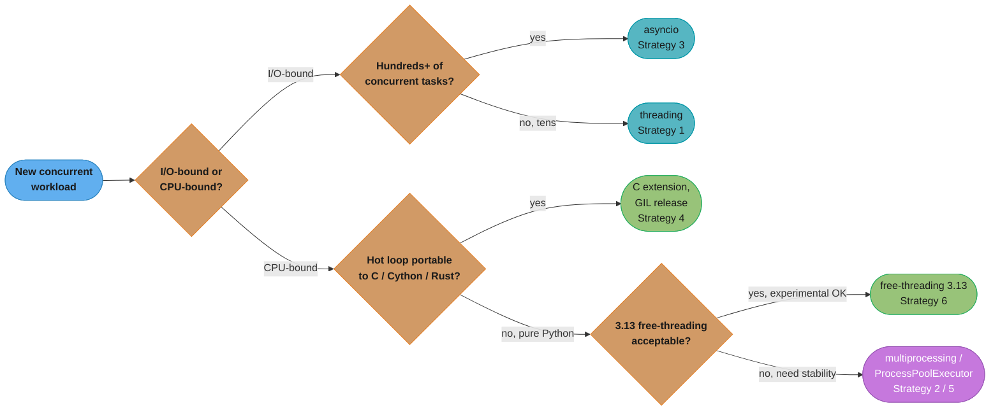
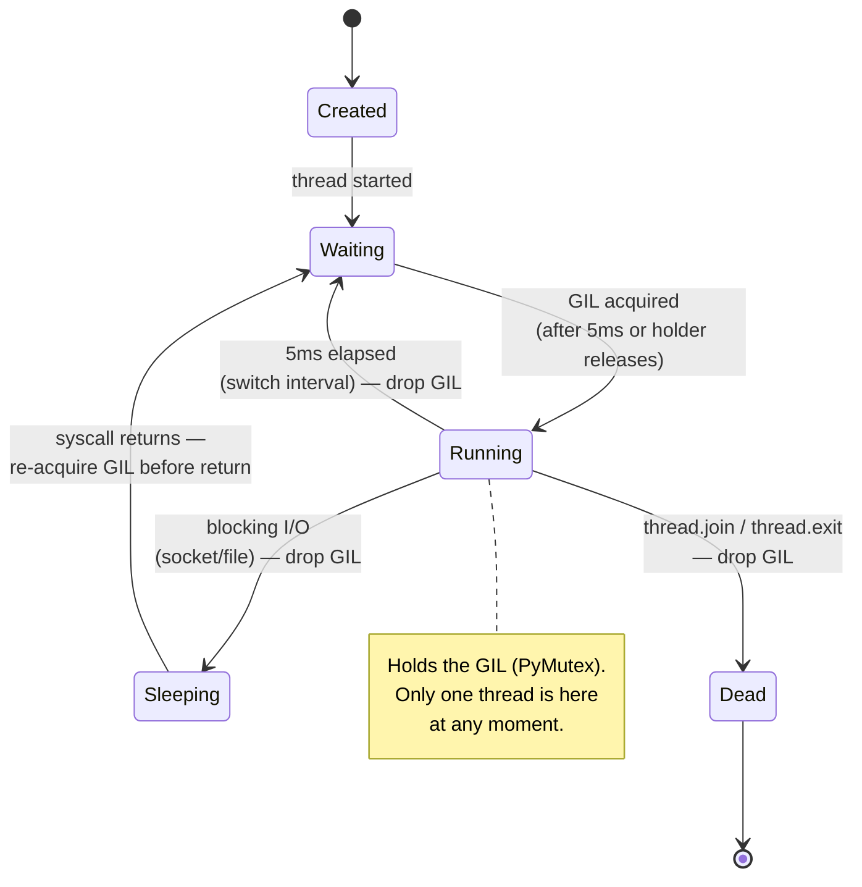
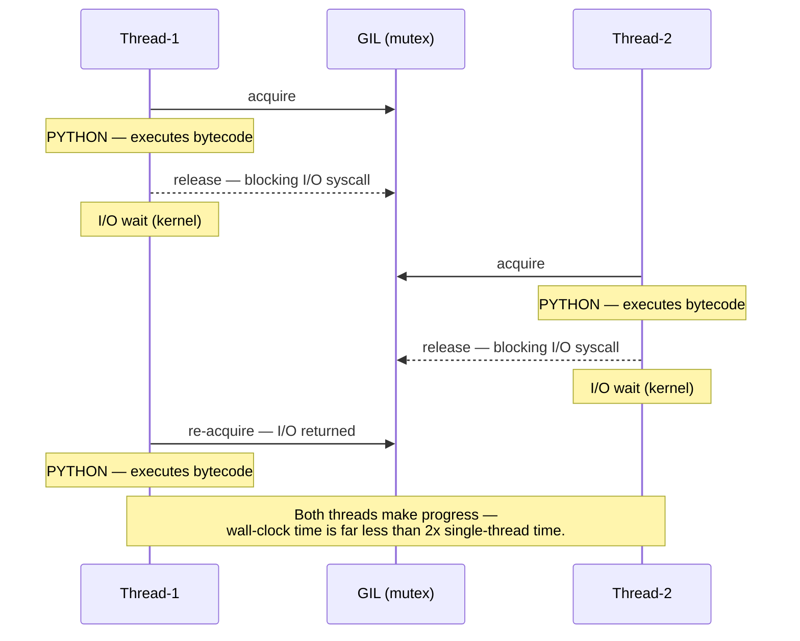
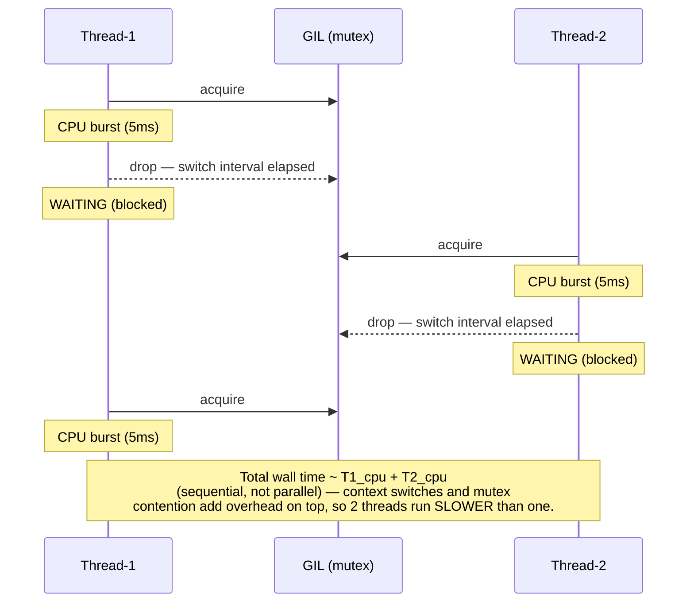
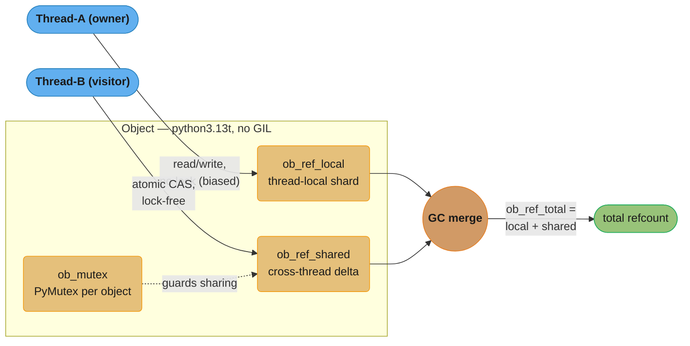
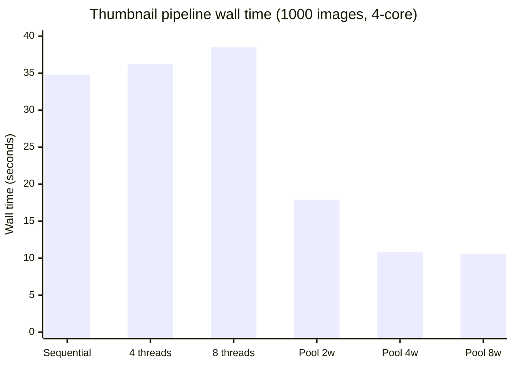

# The GIL & Free-Threading

---

## 1. Concept Overview

The CPython Global Interpreter Lock (GIL) is a mutex that allows only one thread to execute Python
bytecode at any given moment inside a single CPython process. It was introduced in Python 1.5 to make
CPython's reference-counting memory management thread-safe without requiring fine-grained per-object
locking. The consequence is that CPU-bound multi-threaded Python programs do not scale across cores,
while I/O-bound programs run well because the GIL is released during blocking system calls.

Python 3.12 introduced PEP 684, giving each sub-interpreter its own independent GIL. Python 3.13
introduced PEP 703, an optional GIL-free build (`python3.13t`) that replaces reference counting with
biased reference counting and per-object locking, allowing true parallel CPU execution across threads at
the cost of requiring explicit thread safety in all Python and extension code.

**Python version relevance:**
- Python 2: GIL check every 100 bytecodes (sys.getcheckinterval)
- Python 3.2+: GIL check every 5ms (sys.getswitchinterval, default 0.005)
- Python 3.12: PEP 684, per-interpreter GIL
- Python 3.13: PEP 703, free-threading build (`python3.13t`, experimental)

---

## 2. Intuition

> The GIL is a single-lane bridge: many cars (threads) can queue up, but only one crosses at a time —
> and the toll booth (I/O wait) briefly lifts the barrier so traffic flows freely during idle moments.

**Mental model:** Imagine a kitchen with one chef's knife shared by all cooks. Every cook (thread) must
grab the knife before doing any real work (executing bytecode). A cook can put the knife down while
waiting for the oven timer (blocking I/O), letting another cook use it. If all cooks are chopping
(CPU-bound), they spend more time grabbing and releasing the knife than actually cooking.

**Why it matters:** Understanding the GIL determines whether you reach for `threading`, `multiprocessing`,
or `asyncio` when writing concurrent Python. Choosing wrongly — using threads for a CPU-bound pipeline,
for instance — produces code that is slower than single-threaded and harder to debug.

**Key insight:** The GIL is a CPython implementation detail, not a Python language specification. Jython
and PyPy-STM have no GIL. More importantly, the GIL does not protect your application-level data
structures. A `dict` update is not atomically safe for compound check-then-act operations even with the
GIL present; the GIL only ensures that a single bytecode instruction is uninterruptible, not a sequence
of them.

---

## 3. Core Principles

**1. One thread executes bytecode at a time.**
The GIL is a `PyMutex` (a pthread mutex on POSIX) held by the thread currently running Python
bytecode. All other threads block on that mutex.

**2. GIL release happens on a timer, not on every bytecode.**
Since Python 3.2, CPython sets a switch interval of 5 ms (`sys.getswitchinterval()` returns `0.005`).
After 5 ms of continuous execution the current thread requests a GIL drop, allowing another thread to
acquire it. The old Python 2 model checked every 100 bytecodes; the 3.2+ model is wall-clock based,
giving fairer scheduling between threads doing different amounts of work per bytecode.

**3. Blocking I/O releases the GIL unconditionally.**
CPython's socket, file, and subprocess wrappers call `Py_BEGIN_ALLOW_THREADS` before every blocking
syscall and `Py_END_ALLOW_THREADS` after. This means I/O-bound threads give up the GIL for the full
duration of the system call, allowing other threads to run in parallel. This is why `threading` works
well for HTTP servers, database clients, and file I/O.

**4. The GIL does NOT make your data structures thread-safe.**
`list.append` is protected at the bytecode level, but `counter += 1` compiles to `LOAD`, `ADD`,
`STORE` — three bytecodes — and the GIL can be released between any two. Application-level compound
operations require explicit `threading.Lock`.

**5. C extensions can release the GIL.**
NumPy, SciPy, OpenCV, and cryptographic libraries wrap their compute in
`Py_BEGIN_ALLOW_THREADS` / `Py_END_ALLOW_THREADS`. While those C functions run, other Python threads
can execute bytecode. This is why NumPy matrix operations effectively run in parallel when called from
multiple threads.

**6. PEP 703 (Python 3.13) makes the GIL optional.**
The `python3.13t` binary removes the global lock. Each object gets a per-object biased reference
count and a thread-local reference count shard. Thread safety for mutable shared state is now entirely
the programmer's responsibility.

---

## 4. Types / Architectures / Strategies



This condenses the six strategies below plus the Section 9 usage rules into one path: heavy I/O
concurrency goes to asyncio, lighter I/O-bound work to threading, a portable CPU hotspot to a C
extension, and everything else to multiprocessing — with 3.13's free-threading as an experimental
alternative once the C-extension dependencies are audited for GIL safety.

### Strategy 1: threading — best for I/O-bound work

Use `threading.Thread` or `concurrent.futures.ThreadPoolExecutor` when tasks spend most of their time
waiting on I/O (HTTP, database, file). The GIL is released during every blocking call, so threads
genuinely overlap. Memory is shared; communication is cheap.

### Strategy 2: multiprocessing — best for CPU-bound work

`multiprocessing.Pool` and `concurrent.futures.ProcessPoolExecutor` spawn separate OS processes, each
with its own GIL-protected CPython interpreter. True parallelism on CPU tasks. Overhead: process
startup (~50–100 ms per worker), inter-process communication (pickle serialisation), no shared memory
by default.

### Strategy 3: asyncio — best for high-concurrency I/O

Single-threaded cooperative concurrency via an event loop. No GIL interaction at all; tasks yield
voluntarily at `await` points. Thousands of concurrent connections with minimal memory overhead.
Requires async-native libraries (aiohttp, asyncpg, etc.).

### Strategy 4: C extensions with GIL release

For CPU-bound hotspots in Python code, write a C/Cython/Rust extension that calls
`Py_BEGIN_ALLOW_THREADS` before the compute block. Other Python threads run while the extension does
heavy work. Used by NumPy's linear algebra, Pillow's image codecs, and pydantic-core.

### Strategy 5: ProcessPoolExecutor + asyncio (mixed workloads)

`loop.run_in_executor(ProcessPoolExecutor(...), fn)` submits CPU-bound work to a process pool without
blocking the event loop. The event loop continues handling I/O while workers crunch numbers.

### Strategy 6: Python 3.13 free-threading

Build Python with `--disable-gil` or install `python3.13t`. Pass `-X gil=0` to verify the GIL is
actually disabled. True thread parallelism without multiprocessing overhead. Currently experimental;
many C extensions still require a GIL and will fail or re-enable it automatically.

---

## 5. Architecture Diagrams

### Diagram 1: Thread state machine — GIL acquisition and release



Every thread cycles between WAITING (blocked on the GIL mutex) and RUNNING (holding it); the only
ways out of RUNNING are the 5ms switch-interval timer, a blocking I/O syscall, or thread exit — the
three release paths described in Core Principles 2 and 3.

### Diagram 2: I/O-bound timeline — two threads sharing the GIL



While Thread-1 sleeps in the kernel waiting on I/O, it has released the GIL, so Thread-2 can acquire
it and run Python bytecode in the gap — this overlap is why `threading` works well for I/O-bound code.

### Diagram 3: CPU-bound timeline — GIL contention



Unlike the I/O-bound case, there is no idle gap for another thread to fill — each 5ms CPU burst forces
a drop-and-reacquire handoff, so the two threads run one after another instead of overlapping.

### Diagram 4: PEP 703 free-threading — per-object biased reference counting



Splitting the refcount into an owner-only local shard and a cross-thread shared delta is what removes
the lock from the hot path: the owning thread never blocks, and only the rarer cross-thread update
needs the per-object mutex or an atomic CAS.

---

## 6. How It Works — Detailed Mechanics

### 6.1 Inspecting and tuning the switch interval

```python
import sys

# Default: 0.005 seconds = 5 ms
print(sys.getswitchinterval())  # 0.005

# Increase for throughput (fewer context switches, better for batch work)
sys.setswitchinterval(0.020)  # 20ms

# Decrease for latency / more responsive GUIs
sys.setswitchinterval(0.001)  # 1ms — more thrashing, more overhead
```

**What this actually says.** "A GIL-holding thread gets at most this many seconds of uninterrupted
bytecode before it is told to hand the lock over." The knob does not change how much work gets done —
it only changes how finely that work is chopped up, and every chop costs a handoff.

| Symbol | What it is |
|--------|------------|
| `sys.getswitchinterval()` | Current ceiling on one thread's GIL tenure, in seconds. Default `0.005` |
| `0.005` | 5 milliseconds — the Python 3.2+ default, replacing Python 2's "every 100 bytecodes" |
| `1 / interval` | Forced handoffs per second per running thread. The cost driver |
| handoff | Drop the mutex, signal a waiter, wake it, reload its stack/cache. Not free |

**Walk one example.** Convert the interval into a handoff budget, then price it using this module's own
6.3 benchmark (single-threaded `1.80s` vs two threads `2.10s`):

```
  interval        forced handoffs per second
  --------        --------------------------
   1 ms                    1000
   5 ms  (default)          200
  20 ms                      50

  Two-thread CPU run measured at 2.10s, single-thread at 1.80s:
    extra wall time      = 2.10 - 1.80          = 0.30 s
    handoffs in 2.10 s   = 2.10 / 0.005         = 420
    amortized cost each  = 0.30 / 420           = 0.000714 s  = 714 us

  Linear model, same work at a different interval:
     1 ms -> 2.10/0.001 = 2100 handoffs -> 1.80 + 2100 x 0.000714 = 3.30 s  (worse)
    20 ms -> 2.10/0.020 =  105 handoffs -> 1.80 +  105 x 0.000714 = 1.88 s  (better)
```

714 microseconds is far more than a pthread mutex handoff actually costs — a raw uncontended
acquire/release is a few microseconds at most. The rest is convoy effect and cache damage: the
outgoing thread's working set is evicted while the incoming thread reloads its own. That is why the
fix for CPU-bound code is never "tune the interval" but "stop sharing the lock" — and why Q9 in
Section 12 warns that *lowering* the interval makes thrashing worse.

### 6.2 Benchmark: GIL does NOT hurt I/O-bound work

```python
import threading
import time
import urllib.request


URLS = [
    "https://httpbin.org/delay/1",
] * 6  # 6 URLs each taking ~1 second


def fetch(url: str) -> None:
    urllib.request.urlopen(url, timeout=10)


def sequential() -> float:
    start = time.perf_counter()
    for url in URLS:
        fetch(url)
    return time.perf_counter() - start


def threaded(num_threads: int = 6) -> float:
    start = time.perf_counter()
    threads = [threading.Thread(target=fetch, args=(url,)) for url in URLS]
    for t in threads:
        t.start()
    for t in threads:
        t.join()
    return time.perf_counter() - start


if __name__ == "__main__":
    seq_time = sequential()
    thr_time = threaded()
    print(f"Sequential: {seq_time:.2f}s")   # ~6.0s (6 x 1s serially)
    print(f"Threaded:   {thr_time:.2f}s")   # ~1.1s (all in parallel, GIL released during I/O)
    print(f"Speedup:    {seq_time / thr_time:.1f}x")  # ~5.5x
```

### 6.3 Benchmark: GIL DOES hurt CPU-bound work

```python
import threading
import time


def count_down(n: int) -> None:
    while n > 0:
        n -= 1


N = 50_000_000


def single_threaded() -> float:
    start = time.perf_counter()
    count_down(N)
    return time.perf_counter() - start


def two_threads() -> float:
    start = time.perf_counter()
    t1 = threading.Thread(target=count_down, args=(N // 2,))
    t2 = threading.Thread(target=count_down, args=(N // 2,))
    t1.start(); t2.start()
    t1.join(); t2.join()
    return time.perf_counter() - start


if __name__ == "__main__":
    single = single_threaded()
    dual = two_threads()
    print(f"Single-threaded: {single:.2f}s")  # e.g. 1.80s
    print(f"Two threads:     {dual:.2f}s")    # e.g. 2.10s — SLOWER due to GIL contention
    print(f"Ratio:           {dual / single:.2f}x")  # > 1.0 means threads hurt
```

**Read it like this.** "Threads let waiting overlap; they do not let *computing* overlap. So I/O time
collapses to the slowest task, while CPU time still adds up." That single sentence is the whole GIL
decision rule, and it is a difference between `max()` and `sum()`.

| Symbol | What it is |
|--------|------------|
| `t_i` | Wall time of task `i` run alone |
| `T_serial` | `sum(t_i)` — one task after another, the baseline |
| `T_threads` (I/O) | `max(t_i)` — GIL is dropped for the whole syscall, so waits overlap |
| `T_threads` (CPU) | `sum(t_i) + handoff cost` — bytecode never overlaps, so nothing is saved |
| `T_procs` (CPU) | `sum(t_i)/W + spawn` — `W` separate interpreters, `W` separate GILs |
| `W` | Worker processes, capped by physical cores |

**Walk one example.** Four tasks, 2 seconds each, on a 4-core machine — once as I/O waits, once as
pure-Python compute:

```
                        I/O-bound (sleep on socket)      CPU-bound (pure Python loop)
  ----------------      ---------------------------      ---------------------------
  serial                4 x 2.0        = 8.00 s          4 x 2.0        = 8.00 s
  4 threads             max(2,2,2,2)   = 2.00 s          8.00 + handoffs > 8.00 s
  4 processes           ~2.00 s (overkill)               8.00/4 + 0.10  = 2.10 s

  speedup vs serial     threads 8.00/2.00 = 4.0x         threads       < 1.0x  (slower)
                                                         processes 8.00/2.10 = 3.81x

  Handoffs the CPU threads must pay for: 8.00 / 0.005 = 1600 forced GIL drops.
```

The same four threads are a 4x win in the left column and a loss in the right one, with no code
difference except what the task does inside. The process column pays a one-time `~0.10 s` spawn and
still returns 3.81x — this is exactly the trade Section 6.4 makes, and it is why the Section 4
decision tree branches on "I/O-bound or CPU-bound?" before anything else.

### 6.4 Fix CPU-bound work with multiprocessing

```python
import multiprocessing
import time


def count_down(n: int) -> None:
    while n > 0:
        n -= 1


N = 50_000_000


def with_pool(workers: int = 4) -> float:
    start = time.perf_counter()
    # Each worker gets its own Python interpreter and GIL
    with multiprocessing.Pool(processes=workers) as pool:
        pool.map(count_down, [N // workers] * workers)
    return time.perf_counter() - start


if __name__ == "__main__":
    elapsed = with_pool(4)
    print(f"multiprocessing.Pool(4): {elapsed:.2f}s")
    # On a 4-core machine: ~0.55s vs ~1.80s single-threaded → ~3.3x speedup
```

### 6.5 GIL thrashing — short CPU bursts are worst-case

```python
import threading
import time


def mixed_work(iterations: int) -> None:
    """Short Python compute bursts between no real I/O — worst GIL case."""
    result = 0
    for i in range(iterations):
        result += i * i  # very short CPU burst, GIL released every 5ms
    return result


def thrash_test(num_threads: int, iterations_per_thread: int) -> float:
    start = time.perf_counter()
    threads = [
        threading.Thread(target=mixed_work, args=(iterations_per_thread,))
        for _ in range(num_threads)
    ]
    for t in threads:
        t.start()
    for t in threads:
        t.join()
    return time.perf_counter() - start


# Threads constantly fight for the GIL, causing excessive context switches
# 4 threads is NOT 4x faster — it is often 2–3x SLOWER than single-threaded
```

### 6.6 Profiling GIL contention with sys.settrace

```python
import sys
import threading
import time


gil_waits: list[float] = []
_wait_start: float | None = None


def trace_gil(frame, event, arg):
    global _wait_start
    if event == "call" and frame.f_code.co_name == "_release_save":
        _wait_start = time.perf_counter()
    elif event == "call" and frame.f_code.co_name == "_acquire_restore":
        if _wait_start is not None:
            gil_waits.append(time.perf_counter() - _wait_start)
            _wait_start = None
    return trace_gil


# Better in practice: use py-spy or gil-load from PyPI
# pip install py-spy  →  py-spy record -o profile.svg -- python my_script.py
# pip install gil-load →  measures fraction of time GIL is contended
```

### 6.7 Python 3.13 free-threading

```python
# Requires: python3.13t -X gil=0 script.py
# Check at runtime whether GIL is disabled:
import sys

if sys.version_info >= (3, 13):
    gil_enabled: bool = sys._is_gil_enabled()  # type: ignore[attr-defined]
    print(f"GIL enabled: {gil_enabled}")  # False when running python3.13t -X gil=0

# Free-threading lets threads run Python bytecode in parallel on separate cores.
# But: ALL shared mutable state now needs explicit locking — the GIL no longer
# protects incref/decref, and compound dict/list operations are not atomic.
```

---

## 7. Real-World Examples

**Django + Gunicorn:** Gunicorn uses `--workers` (processes) for CPU isolation and optionally
`--threads` (threads per worker) for handling concurrent I/O-heavy requests. The GIL means each
process can only run one CPU-bound request at a time, but simultaneous database queries from multiple
threads within one worker do run in parallel because psycopg2 releases the GIL during network I/O.

**NumPy / SciPy:** `np.dot`, `np.linalg.svd`, and most BLAS/LAPACK calls release the GIL. A program
that spawns four threads and calls `np.matmul` on independent arrays can achieve close to 4x throughput
on a 4-core machine, despite CPython's GIL, because the compute runs entirely inside the C extension.

**Celery:** Celery workers are separate processes (each with its own GIL). Tasks never share the
parent GIL. Within a single Celery worker, `prefork` concurrency spawns child processes; `gevent` and
`eventlet` concurrency use cooperative coroutines that bypass the GIL by replacing blocking I/O with
non-blocking wrappers.

**Python 3.13 / Anthropic's tokenizers:** The `tiktoken` library already uses Rust (via PyO3) which
releases the Python GIL during tokenisation. This pattern — a Rust or C extension doing the heavy
work outside the GIL — is a common performance architecture that predates free-threading.

**asyncio HTTP servers (FastAPI + Uvicorn):** asyncio avoids the GIL issue entirely for I/O-bound
handlers. There is one thread, one GIL holder, and the event loop cooperatively yields at every
`await`. CPU-bound handlers block the entire event loop and should be offloaded to a
`ProcessPoolExecutor` via `asyncio.get_event_loop().run_in_executor`.

---

## 8. Tradeoffs

| Dimension | threading | multiprocessing | asyncio | C extension (GIL release) | free-threading 3.13 |
|---|---|---|---|---|---|
| CPU parallelism | None (GIL) | Full (separate process) | None (single thread) | Full (inside C layer) | Full (experimental) |
| I/O concurrency | Good (GIL released) | Good (I/O per process) | Excellent (event loop) | N/A | Good |
| Memory sharing | Direct (shared heap) | Copy / shared memory | Direct (single thread) | Direct | Direct (but unsafe) |
| Startup overhead | ~0.1 ms per thread | ~50–100 ms per process | ~0 ms per coroutine | N/A | ~0.1 ms per thread |
| IPC complexity | Low (Queue, Lock) | High (pickle, Pipe) | None (await) | None | Low (but lock needed) |
| Debugging difficulty | Medium (race conditions) | Low (isolated state) | Medium (callback hell) | High (C/Cython) | High (data races) |
| Python version | All | All | 3.4+ (mature 3.7+) | All (PyO3 / Cython) | 3.13+ only |
| Best use case | I/O-bound tasks | CPU-bound tasks | High-concurrency I/O | CPU hotspots in Python | Parallel CPU (future) |


Plotting the table's two most decisive rows makes the GIL's core trade visible: threading and asyncio
sit in the bottom-right (I/O specialists, zero CPU parallelism), multiprocessing and C extensions sit
top-left (full CPU parallelism, weak I/O overlap), and only the still-experimental free-threading build
edges toward the top-right quadrant that no stable CPython strategy currently occupies.

---

## 9. When to Use / When NOT to Use

### Use threading when:
- Tasks are I/O-bound: HTTP calls, database queries, file reads, socket I/O
- You need shared mutable state between tasks and can manage locks
- You want low-latency task switching (e.g., GUI responsiveness, background polling)
- Your CPU-bound sections are inside C extensions that release the GIL

### Use multiprocessing when:
- Tasks are CPU-bound pure-Python (image processing, JSON parsing, numerical work)
- You need to fully utilise all CPU cores
- Tasks are independent and communicate via return values (easy to pickle)
- Memory isolation is acceptable (each process has its own copy of data)

### Use asyncio when:
- You have hundreds or thousands of concurrent I/O-bound operations
- Latency is critical and context-switch overhead matters
- Your libraries support async (aiohttp, asyncpg, aiofiles, etc.)

### Do NOT use threading when:
- Work is CPU-bound and pure-Python — you will get slower results than single-threaded
- You expect "more threads = more speed" without understanding the GIL
- You need true parallel CPU execution — use multiprocessing or C extensions instead

### Do NOT use free-threading (3.13) yet when:
- Your project uses C extensions that assume the GIL (will auto-re-enable GIL or crash)
- Your codebase has no thread-safety audit (shared mutable state is now dangerous)
- You are in a production environment requiring stability (still experimental as of 3.13)

---

## 10. Common Pitfalls

### Pitfall 1: Using threads for CPU-bound work expecting speedup

```python
# BROKEN — developer expects 4 threads to be 4x faster on CPU work
import threading
import time


def compute(n: int) -> int:
    total = 0
    for i in range(n):
        total += i * i
    return total


def broken_parallel():
    threads = [threading.Thread(target=compute, args=(10_000_000,)) for _ in range(4)]
    start = time.perf_counter()
    for t in threads:
        t.start()
    for t in threads:
        t.join()
    elapsed = time.perf_counter() - start
    print(f"4 threads (CPU-bound): {elapsed:.2f}s")  # ~6.0s — WORSE than single (1.5s)
```

```python
# FIX — use ProcessPoolExecutor for CPU-bound work
from concurrent.futures import ProcessPoolExecutor
import time


def compute(n: int) -> int:
    total = 0
    for i in range(n):
        total += i * i
    return total


def fixed_parallel():
    start = time.perf_counter()
    with ProcessPoolExecutor(max_workers=4) as executor:
        futures = [executor.submit(compute, 10_000_000) for _ in range(4)]
        results = [f.result() for f in futures]
    elapsed = time.perf_counter() - start
    print(f"ProcessPoolExecutor(4): {elapsed:.2f}s")  # ~0.5s — ~3x speedup on 4-core
```

### Pitfall 2: Assuming GIL makes dict operations fully thread-safe

```python
# BROKEN — check-then-act is NOT atomic even with the GIL
import threading


counter: dict[str, int] = {"value": 0}


def broken_increment():
    # LOAD_GLOBAL counter → LOAD_CONST "value" → BINARY_SUBSCR → LOAD_CONST 1
    # BINARY_ADD → STORE_SUBSCR  — GIL can drop between any two bytecodes
    current = counter["value"]   # read
    counter["value"] = current + 1  # GIL may have been released between read and write


threads = [threading.Thread(target=broken_increment) for _ in range(1000)]
for t in threads:
    t.start()
for t in threads:
    t.join()
print(counter["value"])  # Expected 1000, likely 950–999 due to lost updates
```

```python
# FIX — use threading.Lock for compound operations
import threading


counter: dict[str, int] = {"value": 0}
lock = threading.Lock()


def fixed_increment():
    with lock:
        counter["value"] += 1  # now atomic at the application level


threads = [threading.Thread(target=fixed_increment) for _ in range(1000)]
for t in threads:
    t.start()
for t in threads:
    t.join()
print(counter["value"])  # Always 1000
```

### Pitfall 3: Releasing GIL in a C extension without protecting shared C state

```c
/* BROKEN C extension — releases GIL but accesses shared global C struct */
static int shared_counter = 0;  /* shared across threads */

static PyObject* broken_compute(PyObject* self, PyObject* args) {
    Py_BEGIN_ALLOW_THREADS   /* release GIL — other threads can now run */
    /* BUG: shared_counter is a C global, not protected by any mutex */
    /* Two threads can read-modify-write simultaneously */
    shared_counter += 1;     /* data race — undefined behaviour in C */
    do_heavy_work();
    Py_END_ALLOW_THREADS     /* re-acquire GIL */
    return PyLong_FromLong(shared_counter);
}
```

```c
/* FIX — protect C-level shared state with its own mutex, separate from the GIL */
#include <pthread.h>
static int shared_counter = 0;
static pthread_mutex_t c_mutex = PTHREAD_MUTEX_INITIALIZER;

static PyObject* fixed_compute(PyObject* self, PyObject* args) {
    Py_BEGIN_ALLOW_THREADS
    pthread_mutex_lock(&c_mutex);   /* C-level lock — independent of the GIL */
    shared_counter += 1;
    pthread_mutex_unlock(&c_mutex);
    do_heavy_work();                /* GIL still released during heavy work */
    Py_END_ALLOW_THREADS
    return PyLong_FromLong(shared_counter);
}
/* Rule: Py_BEGIN/END_ALLOW_THREADS guards Python objects only.
   All C-level shared state needs its own synchronisation primitive. */
```

### Pitfall 4: Forgetting that asyncio still needs ProcessPoolExecutor for CPU work

```python
# BROKEN — running CPU-bound work in an async function blocks the event loop
import asyncio


async def broken_handler():
    # This blocks the ENTIRE event loop for the duration of the computation
    # No other requests can be served while this runs
    result = sum(i * i for i in range(10_000_000))
    return result
```

```python
# FIX — offload CPU work to a process pool
import asyncio
from concurrent.futures import ProcessPoolExecutor


_pool = ProcessPoolExecutor(max_workers=4)


def cpu_bound_work() -> int:
    return sum(i * i for i in range(10_000_000))


async def fixed_handler():
    loop = asyncio.get_running_loop()
    result = await loop.run_in_executor(_pool, cpu_bound_work)
    return result
```

---

## 11. Technologies & Tools

| Tool / Library | GIL impact | Use case | Overhead | Shared state | Python version |
|---|---|---|---|---|---|
| `threading.Thread` | Blocked for CPU; released for I/O | I/O-bound concurrent tasks | ~0.1 ms startup | Direct (shared heap) | All |
| `multiprocessing.Pool` | None (separate processes) | CPU-bound tasks | ~50–100 ms startup; pickle IPC | Copy (pickle) | All |
| `concurrent.futures.ProcessPoolExecutor` | None (separate processes) | CPU-bound with futures API | ~50–100 ms startup | Copy (pickle) | 3.2+ |
| `asyncio` + `aiohttp` | None (single thread) | High-concurrency I/O | Near-zero per coroutine | Direct (single thread) | 3.4+ (mature 3.7+) |
| `python3.13t` (free-threading) | Removed | CPU-bound Python threads | Low (atomic ops replace lock) | Direct (unsafe without locks) | 3.13 (experimental) |
| `py-spy` | Measures GIL contention | Profiling and sampling | Negligible (out-of-process) | N/A | All |
| `gil-load` (PyPI) | Reports GIL hold fraction | Diagnosing GIL bottlenecks | Negligible | N/A | All |
| NumPy / SciPy | Releases GIL in C layer | Numeric CPU work in threads | None extra | numpy arrays | All |
| Cython with `nogil` | Releases GIL in Cython blocks | Custom CPU hotspots | Build step | Cython typed views | All |

**Profiling commands:**

```bash
# Profile GIL contention with py-spy (no code changes required)
pip install py-spy
py-spy record -o profile.svg -- python my_script.py

# Measure GIL hold fraction
pip install gil-load
python -c "import gil_load; gil_load.start(); import my_heavy_module; my_heavy_module.run()"

# Verify free-threading is active (3.13t)
python3.13t -c "import sys; print(sys._is_gil_enabled())"  # False = GIL disabled
python3.13t -X gil=0 -c "import sys; print(sys._is_gil_enabled())"  # Force disable
```

---

## 12. Interview Questions with Answers

**Q1: What is the GIL and why does CPython have one?**
The GIL is a mutex that ensures only one thread executes Python bytecode at a time inside a single CPython process. It was introduced because CPython uses reference counting for memory management, and incrementing/decrementing reference counts is not thread-safe without some form of locking. Adding fine-grained per-object locks was considered but would have been slower for single-threaded programs (which are the majority) because every object access would acquire a lock. The GIL is the pragmatic compromise: one global lock, fast single-threaded performance, limited multi-threaded CPU parallelism. In interviews, always frame the GIL as an implementation choice of CPython, not a Python language requirement.

**Q2: When exactly is the GIL released?**
The GIL is released in two situations: first, automatically every 5 ms of continuous execution (the switch interval, configurable via `sys.setswitchinterval`); second, unconditionally before any blocking I/O syscall such as socket reads, file reads, subprocess waits, and sleep. C extensions can also release it explicitly with `Py_BEGIN_ALLOW_THREADS`. The 5 ms timer replaced the Python 2 model of releasing every 100 bytecodes; the wall-clock model gives fairer scheduling when threads execute different numbers of bytecodes per time unit.

**Q3: Does the GIL make Python's built-in data structures thread-safe?**
No, not for compound operations. Individual bytecode instructions are uninterruptible while the GIL is held, so a single `list.append` or a single `dict.__setitem__` is effectively atomic. But any multi-step operation — read-modify-write, check-then-act, iteration with mutation — is not atomic. The GIL can be released between the bytecodes of `counter += 1` (three bytecodes: LOAD, ADD, STORE). Always use `threading.Lock` or `threading.RLock` for compound operations on shared mutable state.

**Q4: I have a CPU-bound program. Will using more threads speed it up?**
No, and it will likely slow it down slightly. With the standard CPython GIL, adding threads to a CPU-bound program produces no parallel execution. Instead, threads spend time contending for the GIL — each thread runs for at most 5 ms before being forced to drop it, causing context switches and cache evictions. Benchmarks typically show 2-thread CPU programs running 10–20% slower than single-threaded. The fix is `multiprocessing.Pool` or `ProcessPoolExecutor`, which use separate processes with separate GILs.

**Q5: What is "GIL thrashing" and when does it occur?**
GIL thrashing is when multiple threads spend more wall-clock time fighting to acquire the GIL than doing actual work. It is worst when threads execute short Python bursts interleaved with no real I/O — every 5 ms the current thread must give up the GIL, signal a waiting thread, and the new thread acquires it only to be interrupted again after 5 ms. The overhead of the mutex round-trip (signal, wake-up, context switch) can dominate. The symptom is CPU-bound programs running slower with more threads. The diagnosis is measuring wall time vs CPU time with `time.perf_counter` and `resource.getrusage`.

**Q6: How does NumPy achieve parallelism despite the GIL?**
NumPy's heavy computational routines (matrix multiplication, FFT, sort) are implemented in C and BLAS libraries that call `Py_BEGIN_ALLOW_THREADS` before entering the compute block. While those C functions run, the GIL is free and other Python threads can execute bytecode. If you launch four threads each calling `np.matmul` on independent arrays, all four C-level computations can run simultaneously on four cores. The GIL is only re-acquired when returning Python objects. The same pattern applies to OpenCV, SciPy, pydantic-core (Rust via PyO3), and any C extension doing its own heavy work.

**Q7: What is PEP 703 and what problem does it solve?**
PEP 703, accepted for Python 3.13, defines an optional GIL-free build of CPython (`python3.13t`). It solves the core problem: CPU-bound multi-threaded Python programs cannot use multiple cores. The implementation replaces the global reference count (which required the GIL for thread safety) with biased reference counting, where each object tracks a "local" refcount owned by the creating thread and a "shared" refcount updated with atomic operations by other threads. The GIL is removed; true parallel CPU execution is possible. The cost: all shared mutable state now requires explicit synchronisation, many C extensions that assumed the GIL will break or auto-re-enable it, and performance of single-threaded code is slightly lower due to atomic operations on the shared refcount shard.

**Q8: What is PEP 684 (sub-interpreters) and how does it differ from PEP 703?**
PEP 684, shipped in Python 3.12, gives each sub-interpreter its own independent GIL. Multiple sub-interpreters in the same process can run Python bytecode truly in parallel, each with its own GIL. Unlike PEP 703, the GIL still exists per interpreter; the change is that multiple GILs coexist in one process. Sub-interpreters have stricter isolation requirements (no shared mutable Python objects between them), and the `interpreters` module API is still experimental. PEP 684 is a stepping stone toward PEP 703: it proves the per-interpreter GIL architecture before removing the GIL entirely.

**Q9: How would you diagnose a program that is slower with 4 threads than with 1 thread?**
First, determine whether the work is CPU-bound or I/O-bound by running with `time` and observing CPU usage — if CPU is pinned at ~100% with 4 threads instead of ~400%, the GIL is the bottleneck. Use `py-spy` to sample the call stack and see if threads are frequently blocked on GIL acquisition. Measure with `time.perf_counter` in single-threaded vs multi-threaded mode to confirm the regression. If confirmed CPU-bound, the fix is `ProcessPoolExecutor` or `multiprocessing.Pool`. Also check the switch interval: decreasing it (more switches) will make thrashing worse; increasing it reduces overhead but hurts responsiveness.

**Q10: When should you use asyncio instead of threading for I/O-bound work?**
Use asyncio when you have hundreds or thousands of concurrent I/O-bound tasks and memory overhead matters — each coroutine costs ~1–2 KB of stack vs ~8 MB default for a threading.Thread. asyncio also avoids race conditions entirely for I/O-bound code because there is no preemption; context switches only happen at explicit `await` points. Use threading when you need to call synchronous blocking libraries that have no async equivalent, or when the number of concurrent tasks is small (fewer than ~100) and thread overhead is acceptable. In FastAPI, handler functions decorated with `async def` run on the event loop; those decorated with `def` are automatically run in a thread pool.

**Q11: What is the difference between `threading.Lock` and `threading.RLock`?**
`threading.Lock` is a simple non-reentrant mutex: a thread that already holds the lock and tries to acquire it again will deadlock. `threading.RLock` (reentrant lock) allows the same thread to acquire it multiple times without blocking; it tracks an acquisition count and only releases when the count reaches zero. Use `RLock` when a function that acquires a lock can call another function that also acquires the same lock (recursive data structures, decorator chains). Use plain `Lock` in all other cases — it is slightly faster and the non-reentrancy often catches programming mistakes.

**Q12: How does `concurrent.futures.ProcessPoolExecutor` compare to `multiprocessing.Pool`?**
Both spawn worker processes and bypass the GIL for CPU-bound work. `ProcessPoolExecutor` provides a higher-level `Future`-based API, integrates with `asyncio` via `loop.run_in_executor`, and raises exceptions cleanly through the `Future`. `multiprocessing.Pool` provides `map`, `starmap`, `imap_unordered`, and `apply_async`, which are more convenient for bulk data parallelism with streaming results. For new code, prefer `ProcessPoolExecutor`; it is part of the standard library's stable high-level futures API and cooperates with asyncio. Use `multiprocessing.Pool` when you need `imap_unordered` for streaming or when you need `multiprocessing.shared_memory` for zero-copy shared buffers.

**Q13: What does `sys.getswitchinterval()` return and what does it control?**
It returns `0.005` (5 milliseconds), the maximum time a thread holds the GIL before being forced to release it and signal waiting threads. In Python 2 this was controlled by `sys.getcheckinterval()` which returned 100 (bytecodes). The switch to wall-clock-based switching in Python 3.2 improved fairness: a thread doing heavy computation (many bytecodes per ms) and a thread doing light computation (few bytecodes per ms) now get equal wall-clock time instead of equal bytecode counts. You can tune this for specific workloads, but the default 5 ms is appropriate for most production applications.

**Q14: Can you make a Python dict operation thread-safe without an explicit lock?**
For single-key reads and writes (single bytecode operations) the GIL provides incidental atomicity in CPython — a `d[key]` read or `d[key] = value` write will not be partially executed. However, CPython's implementation details are not part of the language specification, and this atomicity is not guaranteed across Python versions or implementations. More importantly, any logic that reads a value and then writes a derived value (`d[k] = d[k] + 1`) is never atomic. The correct answer for interviews: do not rely on GIL atomicity for correctness; use `threading.Lock` for any compound dict operation.

**Q15: How does free-threading affect C extension compatibility?**
Many C extensions check at import time whether the GIL is enabled and raise an error or automatically re-enable it if not. CPython 3.13 includes a mechanism: if an extension module does not declare `Py_mod_gil = Py_MOD_GIL_NOT_USED`, CPython re-enables the GIL when that module is imported, even in `python3.13t -X gil=0` mode. This means even in free-threading mode, importing an incompatible C extension silently re-enables the GIL for the entire process. Check via `sys._is_gil_enabled()` after imports to verify the GIL is actually off. The ecosystem is gradually being audited; NumPy 2.x has added free-threading support.

**Q16: What threading primitives should you know for a senior Python interview?**
`threading.Lock` (mutex), `threading.RLock` (reentrant mutex), `threading.Condition` (wait/notify for producer-consumer), `threading.Semaphore` (counting semaphore for rate limiting), `threading.Event` (one-shot flag for signaling), `threading.Barrier` (phase synchronisation for N threads), `queue.Queue` (thread-safe FIFO; use this for producer-consumer instead of `Lock + list`). Know that `queue.Queue.put` and `queue.Queue.get` are thread-safe and blocking, and that the `queue` module is the recommended way to pass data between threads without explicit locking.

**Q17: How do you share large data between processes in Python without pickle overhead?**
Use `multiprocessing.shared_memory` (Python 3.8+) to allocate a named shared memory block accessible from multiple processes. Build a NumPy array backed by shared memory with `np.ndarray(..., buffer=shm.buf)` — zero-copy read access from all worker processes. For read-only data (model weights, lookup tables), consider `multiprocessing.Pool` with `initializer` to load data once per worker process. Alternatively, use memory-mapped files (`mmap`) or Apache Arrow's shared-memory IPC for structured data. Avoid passing large objects through `Pool.map` return values — they are pickled and unpickled per task.

**Q18: What is the practical advice for a team starting a new Python microservice that needs parallelism?**
Default to `asyncio` + `async def` handlers for I/O-bound work (database calls, external APIs, cache reads) — this covers 80% of web service workloads. For CPU-bound operations (report generation, image processing, ML inference), use a dedicated task queue (Celery with prefork workers, or `ProcessPoolExecutor`) to offload work from the event loop. Avoid raw `threading.Thread` in application code except for wrapping legacy synchronous libraries. Do not adopt free-threading (python3.13t) in production until the extension ecosystem matures (target: Python 3.15–3.16 timeframe). Profile before optimising: most "slow" services are I/O-bound, not GIL-bound.

---

## 13. Best Practices

**1. Profile before choosing a concurrency model.**
Measure CPU usage and wall time. If `top` shows one CPU core at 100% and others idle, suspect the GIL. If CPU is low but latency is high, you are I/O-bound — threads or asyncio will help; multiprocessing will not.

**2. Use the right executor for the right work.**
I/O-bound: `ThreadPoolExecutor`. CPU-bound: `ProcessPoolExecutor`. Both provide the same `Future` API and integrate with asyncio via `run_in_executor`.

**3. Keep process pool workers warm.**
Creating a `ProcessPoolExecutor` per request adds 50–100 ms overhead. Create pools at module level or application startup and reuse them for the application lifetime.

**4. Do not pass large objects across process boundaries unless necessary.**
Every argument and return value of `ProcessPoolExecutor.submit` is pickled. Passing a 100 MB DataFrame to a worker is slower than processing it in-process. Use shared memory, memory-mapped files, or worker initializers for large read-only data.

**5. Use `queue.Queue` for inter-thread communication, not bare `Lock + list`.**
`queue.Queue` is implemented with `threading.Condition` internally and handles all locking correctly. It also supports `maxsize` for backpressure.

**6. Set explicit timeouts on all blocking calls.**
`lock.acquire(timeout=5.0)`, `queue.get(timeout=1.0)`, `thread.join(timeout=30.0)`. Deadlocks in production should surface as timeouts, not infinite hangs.

**7. Test thread safety with `threading.Barrier` and stress tests.**
Unit tests are single-threaded and miss race conditions. Add a stress test that runs 100 threads doing compound operations for 5 seconds and asserts invariants at the end.

**8. Keep free-threading behind a feature flag.**
If experimenting with `python3.13t`, wrap free-threaded code paths in a flag checked with `sys._is_gil_enabled()`. This lets you A/B test performance and roll back safely if C extension incompatibilities are found.

**9. Do not manually call `sys.setswitchinterval` in library code.**
Tuning the switch interval is a deployment-level decision. Library code that modifies it will surprise callers. Document it as an operator knob in README or deployment docs, not in application logic.

**10. Name your threads.**
`threading.Thread(name="db-writer", target=fn)` makes stack traces and logs dramatically easier to read. In production, always name threads and thread pools.

---

## 14. Case Study

### Parallelizing a CPU-Bound Image Thumbnail Pipeline

**Scenario:**
An image hosting service needs to generate 1000 thumbnails (resize 4K images to 256x256 JPEG) during
a batch job. The naive implementation is sequential: each image takes ~35 ms to decode and resize in
pure Python + Pillow. Total sequential time: ~35 s. The team wants to cut this to under 12 s.

---

**Attempt 1 (BROKEN): Adding threads, expecting speedup**

```python
# BROKEN — developer assumes threads will parallelize CPU-bound Pillow work
import threading
import time
from pathlib import Path
from PIL import Image


def make_thumbnail(src: Path, dst: Path) -> None:
    with Image.open(src) as img:
        img.thumbnail((256, 256), Image.LANCZOS)
        img.save(dst, "JPEG", quality=85)


def broken_threaded_pipeline(images: list[tuple[Path, Path]]) -> float:
    start = time.perf_counter()
    threads = [
        threading.Thread(target=make_thumbnail, args=(src, dst))
        for src, dst in images
    ]
    for t in threads:
        t.start()
    for t in threads:
        t.join()
    return time.perf_counter() - start


# Result on a 4-core machine (1000 images, ~35ms each):
# Sequential:          34.8s
# 4 threads (broken):  36.2s  ← SLOWER — GIL prevents parallel decode/resize
# 8 threads (broken):  38.5s  ← even worse — more GIL contention, more context switches
#
# Why: Pillow's resize in Python mode holds the GIL for the full operation.
# The libjpeg decode does release the GIL briefly, but the numpy/pixel math does not.
```

---

**Attempt 2 (FIX): ProcessPoolExecutor — correct approach**

```python
# FIX — separate processes bypass the GIL entirely
from concurrent.futures import ProcessPoolExecutor, as_completed
import time
from pathlib import Path
from PIL import Image


def make_thumbnail(args: tuple[str, str]) -> str:
    """Must be a module-level function for pickling."""
    src_str, dst_str = args
    src, dst = Path(src_str), Path(dst_str)
    with Image.open(src) as img:
        img.thumbnail((256, 256), Image.LANCZOS)
        img.save(dst, "JPEG", quality=85)
    return dst_str


def fixed_process_pipeline(
    images: list[tuple[Path, Path]],
    max_workers: int = 4,
) -> float:
    start = time.perf_counter()
    args = [(str(src), str(dst)) for src, dst in images]
    with ProcessPoolExecutor(max_workers=max_workers) as executor:
        futures = {executor.submit(make_thumbnail, a): a for a in args}
        completed = 0
        for future in as_completed(futures):
            future.result()  # raises if worker raised
            completed += 1
    return time.perf_counter() - start


# Result on a 4-core machine (1000 images):
# ProcessPoolExecutor(1):  35.1s   baseline
# ProcessPoolExecutor(2):  17.9s   ~1.96x speedup
# ProcessPoolExecutor(4):  10.8s   ~3.24x speedup  ← meets the <12s target
# ProcessPoolExecutor(8):  10.6s   ~3.30x speedup  (diminishing returns, I/O bound)
#
# Note: 8 workers gives minimal improvement over 4 because the JPEG save
# becomes I/O-bound at 8 parallel writers hitting the same disk.
```

---

**Attempt 3: Verify that Pillow with libjpeg DOES release the GIL (education point)**

```python
import sys

# In Python 3.13t (free-threading), we can verify parallelism directly.
# In standard CPython, verify that Pillow's libjpeg path releases the GIL
# by checking whether threading gives speedup for decode-only (no resize):

import threading
import time
from pathlib import Path
from PIL import Image


def decode_only(path: Path) -> None:
    with Image.open(path) as img:
        img.load()  # force full decode — libjpeg releases GIL


def measure_decode(paths: list[Path], use_threads: bool) -> float:
    start = time.perf_counter()
    if use_threads:
        threads = [threading.Thread(target=decode_only, args=(p,)) for p in paths]
        for t in threads: t.start()
        for t in threads: t.join()
    else:
        for p in paths:
            decode_only(p)
    return time.perf_counter() - start

# Typical result (100 large JPEGs, 4 threads):
# Sequential decode:  8.2s
# 4-thread decode:    4.1s  ← ~2x speedup — libjpeg releases GIL!
# But resize (LANCZOS in Python) adds back GIL contention, killing the gain.
# Fix: use Pillow-SIMD or pillow-avif-plugin with C-level resize for full parallelism.
```

---

**Summary of timing results:**



Threading only makes this CPU-bound pipeline slower (36.2s at 4 threads, 38.5s at 8 — up to 11% worse
than sequential); `ProcessPoolExecutor(4)` is the sweet spot at 10.8s (3.2x speedup, meeting the
sub-12s target), with 8 workers gaining almost nothing once JPEG writes become I/O-bound.

**Stated plainly.** "Speedup is just old time divided by new time — and Amdahl's Law says the part you
could not parallelize sets a hard ceiling no number of workers can break through." Running the pool
numbers through Amdahl turns "8 workers barely helped" from a shrug into a measurement.

| Symbol | What it is |
|--------|------------|
| `S(W)` | Speedup with `W` workers: `T(1) / T(W)`. `3.25` means the job finished 3.25x sooner |
| `p` | Fraction of the work that genuinely parallelizes |
| `1 - p` | Serial fraction — setup, spawn, the single-threaded tail. Never shrinks |
| `S(W) = 1 / ((1-p) + p/W)` | Amdahl's Law: the best `W` workers can do |
| `1 / (1-p)` | The ceiling at infinite workers. `p = 0.923` caps you at 13x, forever |

**Walk one example.** Fit `p` from the measured 4-worker run, then use it to predict 8 workers and
compare against what was actually observed:

```
  measured:  Pool(1) = 35.1s   Pool(2) = 17.9s   Pool(4) = 10.8s   Pool(8) = 10.6s

  S(4) = 35.1 / 10.8 = 3.25

  solve 3.25 = 1 / ((1-p) + p/4)
        (1-p) + p/4 = 1/3.25 = 0.3077
        1 - 0.75p   = 0.3077
                  p = 0.9231        ->  serial fraction 1-p = 0.0769  (2.70 s of 35.1 s)

  predict         observed      verdict
  S(2) = 1.86     1.96          close -- model holds
  S(4) = 3.25     3.25          fitted here by construction
  S(8) = 5.20     3.31          MISSES BY 1.89x -- a second bottleneck appeared
  S(inf)= 13.0    --            ceiling: 2.70 s of serial work can never be removed
```

The 8-worker gap is the finding. If the GIL were the only constraint, Amdahl predicts `5.20x`; the
run delivers `3.31x`. Something that was not a bottleneck at 4 workers became one at 8 — here, eight
processes writing JPEGs to the same disk. This is the standard way to use Amdahl in practice: not to
predict speedup, but to detect the moment your measured curve *stops* following the prediction, which
is the moment your bottleneck moved.

**Key lessons:**
1. Threading for CPU-bound Pillow work is slower than sequential due to GIL contention.
2. `ProcessPoolExecutor(4)` achieves ~3.2x speedup on a 4-core machine with zero code restructuring.
3. Pickup past 4 workers is minimal because the JPEG write path becomes disk I/O bound.
4. Always measure; do not assume that more concurrency primitives equals more speed.

**Cross-references:**
- Compare with Java's synchronized blocks and JVM threading model: [`../../java/concurrency/README.md`](../../java/concurrency/README.md)
- For asyncio's approach to concurrency (no GIL needed for I/O-bound): [`../asyncio_and_event_loop/README.md`](../asyncio_and_event_loop/README.md)
