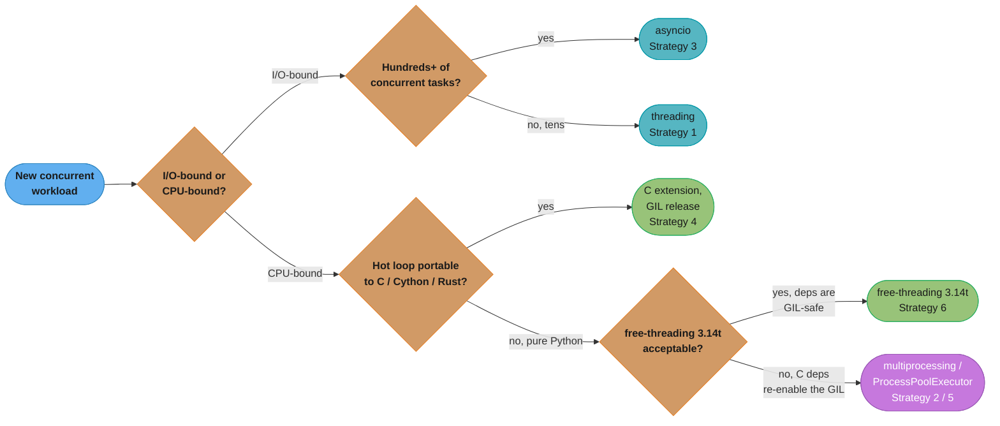
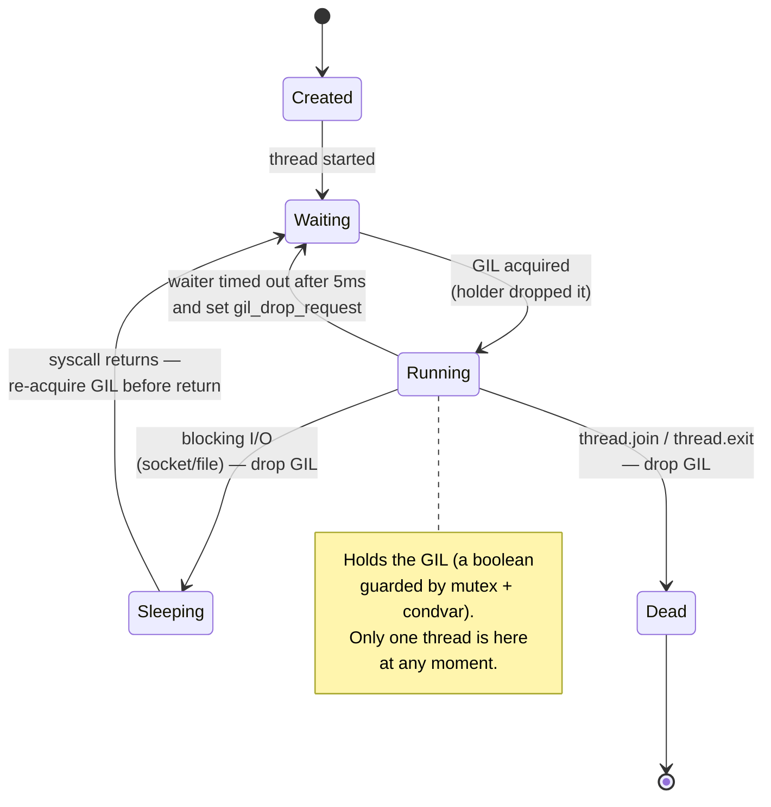
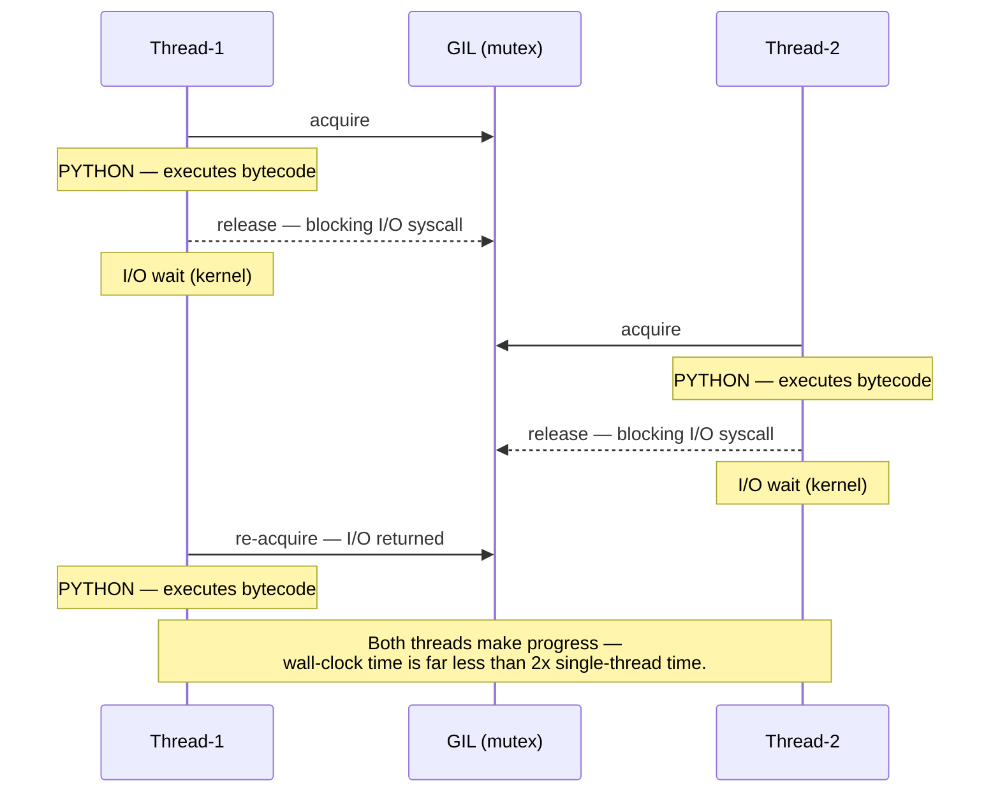
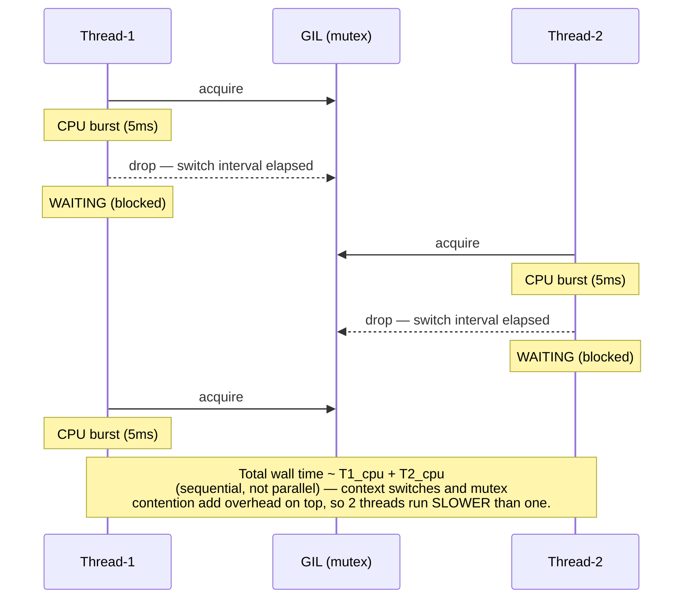
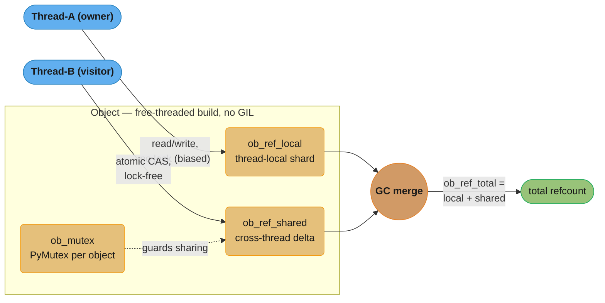
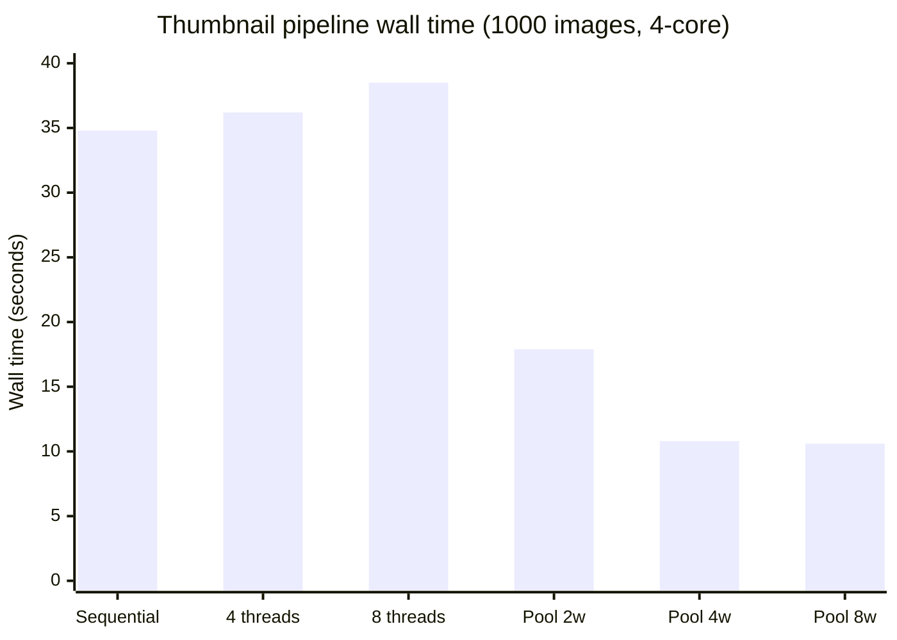

# The GIL & Free-Threading

<!-- study-paths
senior: the_gil_and_free_threading.md
principal: the_gil_and_free_threading.md
files this module contributes to each curated path; omit a tier to leave it out
-->
---

## 1. Concept Overview

The CPython Global Interpreter Lock (GIL) is a mutex that allows only one thread to execute Python
bytecode at any given moment inside a single CPython process. Guido van Rossum added it in 1992, when
threading support first landed in CPython, to make reference-counting memory management thread-safe
without requiring fine-grained per-object locking. The consequence is that CPU-bound multi-threaded
Python programs do not scale across cores, while I/O-bound programs run well because the GIL is
released during blocking system calls.

Python 3.12 introduced PEP 684, giving each sub-interpreter its own independent GIL. Python 3.13
introduced PEP 703, an optional GIL-free build (`python3.13t`) that replaces plain reference counting
with biased reference counting and per-object locking, allowing true parallel CPU execution across
threads at the cost of requiring explicit thread safety in all Python and extension code. Python 3.14
promoted that build from experimental to **officially supported** (PEP 779) and cut the single-threaded
penalty to roughly 5–10%.

**Python version relevance:**
- Python 2: GIL check every 100 bytecodes (sys.getcheckinterval)
- Python 3.2+: GIL switch interval of 5ms (sys.getswitchinterval, default 0.005)
- Python 3.12: PEP 684, per-interpreter GIL
- Python 3.13: PEP 703, free-threading build (`python3.13t`), experimental
- Python 3.14: PEP 779, free-threading officially supported (`python3.14t`); PEP 734
  `concurrent.interpreters` exposes per-interpreter GILs from the standard library

---

## 2. Intuition

> The GIL is a single-lane bridge: many cars (threads) can queue up, but only one crosses at a time —
> and the toll booth (I/O wait) briefly lifts the barrier so traffic flows freely during idle moments.

**Mental model:** Imagine a kitchen with one chef's knife shared by all cooks. Every cook (thread) must
grab the knife before doing any real work (executing bytecode). A cook can put the knife down while
waiting for the oven timer (blocking I/O), letting another cook use it. If all cooks are chopping
(CPU-bound), they spend more time grabbing and releasing the knife than actually cooking.

**Why it matters:** Understanding the GIL determines whether you reach for `threading`, `multiprocessing`,
or `asyncio` when writing concurrent Python. Choosing wrongly — using threads for a CPU-bound pipeline,
for instance — produces code that is slower than single-threaded and harder to debug.

**Key insight:** The GIL is a CPython implementation detail, not a Python language specification. Jython
and PyPy-STM have no GIL. More importantly, the GIL does not protect your application-level data
structures. A `dict` update is not atomically safe for compound check-then-act operations even with the
GIL present; the GIL only ensures that a single bytecode instruction is uninterruptible, not a sequence
of them.

---

## 3. Core Principles

**1. One thread executes bytecode at a time.**
In `Python/ceval_gil.c` the GIL is a `locked` boolean guarded by a mutex plus a condition variable
(`gil->mutex`, `gil->cond` — pthread primitives on POSIX). The thread running Python bytecode owns it;
all other threads wait on the condition variable.

**2. GIL handoff is driven by a waiting thread, not by a timer inside the holder.**
Since Python 3.2, CPython sets a switch interval of 5 ms (`sys.getswitchinterval()` returns `0.005`).
A thread blocked on the GIL waits on the condition variable with that timeout; when it times out and
the GIL is still held by the same holder, it sets the `_PY_GIL_DROP_REQUEST_BIT` on the holder's eval
breaker, and the holder drops the lock at its next eval-breaker check. A thread that is alone therefore
never drops the GIL on a timer — the 5 ms is the maximum a *contending* thread waits, not a quantum the
holder spends. The old Python 2 model checked every 100 bytecodes; the 3.2+ model is wall-clock based,
giving fairer scheduling between threads doing different amounts of work per bytecode.

**3. Blocking I/O releases the GIL unconditionally.**
CPython's socket, file, and subprocess wrappers call `Py_BEGIN_ALLOW_THREADS` before every blocking
syscall and `Py_END_ALLOW_THREADS` after. This means I/O-bound threads give up the GIL for the full
duration of the system call, allowing other threads to run in parallel. This is why `threading` works
well for HTTP servers, database clients, and file I/O.

**4. The GIL does NOT make your data structures thread-safe.**
`list.append` is protected at the bytecode level, but `counter += 1` compiles to `LOAD`, `ADD`,
`STORE` — three bytecodes — and the GIL can be released between any two. Application-level compound
operations require explicit `threading.Lock`.

**5. C extensions can release the GIL.**
NumPy, SciPy, OpenCV, and cryptographic libraries wrap their compute in
`Py_BEGIN_ALLOW_THREADS` / `Py_END_ALLOW_THREADS`. While those C functions run, other Python threads
can execute bytecode. This is why NumPy matrix operations effectively run in parallel when called from
multiple threads.

**6. PEP 703 makes the GIL optional, and PEP 779 makes that supported.**
The free-threaded binary (`python3.14t`) removes the global lock. Each object gets a per-object biased
reference count and a thread-local reference count shard. Thread safety for mutable shared state is now
entirely the programmer's responsibility. Since Python 3.14 this build is officially supported, not
experimental, and its single-threaded penalty is roughly 5–10%.

---

## 4. Types / Architectures / Strategies



This condenses the six strategies below plus the Section 9 usage rules into one path: heavy I/O
concurrency goes to asyncio, lighter I/O-bound work to threading, a portable CPU hotspot to a C
extension, and everything else to multiprocessing — with the officially supported 3.14 free-threading
build as the alternative once the C-extension dependencies are audited for GIL safety.

### Strategy 1: threading — best for I/O-bound work

Use `threading.Thread` or `concurrent.futures.ThreadPoolExecutor` when tasks spend most of their time
waiting on I/O (HTTP, database, file). The GIL is released during every blocking call, so threads
genuinely overlap. Memory is shared; communication is cheap.

### Strategy 2: multiprocessing — best for CPU-bound work

`multiprocessing.Pool` and `concurrent.futures.ProcessPoolExecutor` spawn separate OS processes, each
with its own GIL-protected CPython interpreter. True parallelism on CPU tasks. Overhead: process
startup, inter-process communication (pickle serialisation), no shared memory by default. Startup cost
depends entirely on the start method — measured on CPython 3.13, one worker costs a couple of
milliseconds under `forkserver` and tens of milliseconds under `spawn`, because `spawn` re-executes the
interpreter and re-imports your modules. Since Python 3.14 the default is `forkserver` on POSIX and
`spawn` on macOS and Windows; `fork` is no longer the default anywhere.

### Strategy 3: asyncio — best for high-concurrency I/O

Single-threaded cooperative concurrency via an event loop. No GIL interaction at all; tasks yield
voluntarily at `await` points. Thousands of concurrent connections with minimal memory overhead.
Requires async-native libraries (aiohttp, asyncpg, etc.).

### Strategy 4: C extensions with GIL release

For CPU-bound hotspots in Python code, write a C/Cython/Rust extension that calls
`Py_BEGIN_ALLOW_THREADS` before the compute block. Other Python threads run while the extension does
heavy work. Used by NumPy's linear algebra, Pillow's image codecs, and pydantic-core.

### Strategy 5: ProcessPoolExecutor + asyncio (mixed workloads)

`loop.run_in_executor(ProcessPoolExecutor(...), fn)` submits CPU-bound work to a process pool without
blocking the event loop. The event loop continues handling I/O while workers crunch numbers.

### Strategy 6: free-threading (`python3.14t`)

Install the free-threaded build (`python3.14t`, or configure CPython with `--disable-gil`) and confirm
with `sys._is_gil_enabled()`. `PYTHON_GIL=1` / `-X gil=1` turns the GIL back on in that same build, which
is how you A/B the two modes on one binary. True thread parallelism without multiprocessing overhead,
officially supported since 3.14. The remaining constraint is the C-extension ecosystem: a module that
does not declare itself GIL-free silently re-enables the GIL for the whole process on import.

---

## 5. Architecture Diagrams

### Diagram 1: Thread state machine — GIL acquisition and release



Every thread cycles between WAITING (blocked on the GIL condition variable) and RUNNING (holding it);
the only ways out of RUNNING are a contending thread's drop request after its 5ms wait times out, a
blocking I/O syscall, or thread exit — the three release paths described in Core Principles 2 and 3.

### Diagram 2: I/O-bound timeline — two threads sharing the GIL



While Thread-1 sleeps in the kernel waiting on I/O, it has released the GIL, so Thread-2 can acquire
it and run Python bytecode in the gap — this overlap is why `threading` works well for I/O-bound code.

### Diagram 3: CPU-bound timeline — GIL contention



Unlike the I/O-bound case, there is no idle gap for another thread to fill — each 5ms CPU burst forces
a drop-and-reacquire handoff, so the two threads run one after another instead of overlapping.

### Diagram 4: PEP 703 free-threading — per-object biased reference counting



Splitting the refcount into an owner-only local shard and a cross-thread shared delta is what removes
the lock from the hot path: the owning thread never blocks, and only the rarer cross-thread update
needs the per-object mutex or an atomic CAS.

---

## 6. How It Works — Detailed Mechanics

### 6.1 Inspecting and tuning the switch interval

```python
import sys

# Default: 0.005 seconds = 5 ms
print(sys.getswitchinterval())  # 0.005

# Increase for throughput (fewer context switches, better for batch work)
sys.setswitchinterval(0.020)  # 20ms

# Decrease for latency / more responsive GUIs
sys.setswitchinterval(0.001)  # 1ms — more thrashing, more overhead
```

**What this actually says.** "A GIL-holding thread gets at most this many seconds of uninterrupted
bytecode before it is told to hand the lock over." The knob does not change how much work gets done —
it only changes how finely that work is chopped up, and every chop costs a handoff.

| Symbol | What it is |
|--------|------------|
| `sys.getswitchinterval()` | Current ceiling on one thread's GIL tenure, in seconds. Default `0.005` |
| `0.005` | 5 milliseconds — the Python 3.2+ default, replacing Python 2's "every 100 bytecodes" |
| `1 / interval` | Forced handoffs per second per running thread. The cost driver |
| handoff | Drop the mutex, signal a waiter, wake it, reload its stack/cache. Not free |

**Walk one example.** Convert the interval into a handoff budget, then price it using the illustrative
6.3 figures (single-threaded `1.80s` vs two threads `2.10s`). Treat that pair as a worked example, not
a measurement: the real ratio is heavily machine-dependent — on CPython 3.13 the two-thread run is
often within a few percent of single-threaded — and every number below is derived from it.

```
  interval        forced handoffs per second
  --------        --------------------------
   1 ms                    1000
   5 ms  (default)          200
  20 ms                      50

  Two-thread CPU run measured at 2.10s, single-thread at 1.80s:
    extra wall time      = 2.10 - 1.80          = 0.30 s
    handoffs in 2.10 s   = 2.10 / 0.005         = 420
    amortized cost each  = 0.30 / 420           = 0.000714 s  = 714 us

  Linear model, same work at a different interval:
     1 ms -> 2.10/0.001 = 2100 handoffs -> 1.80 + 2100 x 0.000714 = 3.30 s  (worse)
    20 ms -> 2.10/0.020 =  105 handoffs -> 1.80 +  105 x 0.000714 = 1.88 s  (better)
```

714 microseconds is far more than a pthread mutex handoff actually costs — a raw uncontended
acquire/release is a few microseconds at most. The rest is convoy effect and cache damage: the
outgoing thread's working set is evicted while the incoming thread reloads its own. That is why the
fix for CPU-bound code is never "tune the interval" but "stop sharing the lock" — and why Q9 in
Section 12 warns that *lowering* the interval makes thrashing worse.

### 6.2 Benchmark: GIL does NOT hurt I/O-bound work

```python
import threading
import time
import urllib.request


URLS = [
    "https://httpbin.org/delay/1",
] * 6  # 6 URLs each taking ~1 second


def fetch(url: str) -> None:
    urllib.request.urlopen(url, timeout=10)


def sequential() -> float:
    start = time.perf_counter()
    for url in URLS:
        fetch(url)
    return time.perf_counter() - start


def threaded(num_threads: int = 6) -> float:
    start = time.perf_counter()
    threads = [threading.Thread(target=fetch, args=(url,)) for url in URLS]
    for t in threads:
        t.start()
    for t in threads:
        t.join()
    return time.perf_counter() - start


if __name__ == "__main__":
    seq_time = sequential()
    thr_time = threaded()
    print(f"Sequential: {seq_time:.2f}s")   # ~6.0s (6 x 1s serially)
    print(f"Threaded:   {thr_time:.2f}s")   # ~1.1s (all in parallel, GIL released during I/O)
    print(f"Speedup:    {seq_time / thr_time:.1f}x")  # ~5.5x
```

### 6.3 Benchmark: GIL DOES hurt CPU-bound work

```python
import threading
import time


def count_down(n: int) -> None:
    while n > 0:
        n -= 1


N = 50_000_000


def single_threaded() -> float:
    start = time.perf_counter()
    count_down(N)
    return time.perf_counter() - start


def two_threads() -> float:
    start = time.perf_counter()
    t1 = threading.Thread(target=count_down, args=(N // 2,))
    t2 = threading.Thread(target=count_down, args=(N // 2,))
    t1.start(); t2.start()
    t1.join(); t2.join()
    return time.perf_counter() - start


if __name__ == "__main__":
    single = single_threaded()
    dual = two_threads()
    print(f"Single-threaded: {single:.2f}s")  # illustrative: 1.80s
    print(f"Two threads:     {dual:.2f}s")    # illustrative: 2.10s — no parallel speedup
    print(f"Ratio:           {dual / single:.2f}x")  # >= 1.0 means threads did not help
```

The absolute times and the exact ratio depend on the machine and the CPython version; what is
reproducible is the *shape*. Splitting the same loop across two threads never finishes meaningfully
sooner than one thread, because no two threads run bytecode at the same time — measured ratios cluster
just above `1.00x`, and the excess is the handoff and cache cost priced in Section 6.1.

**Read it like this.** "Threads let waiting overlap; they do not let *computing* overlap. So I/O time
collapses to the slowest task, while CPU time still adds up." That single sentence is the whole GIL
decision rule, and it is a difference between `max()` and `sum()`.

| Symbol | What it is |
|--------|------------|
| `t_i` | Wall time of task `i` run alone |
| `T_serial` | `sum(t_i)` — one task after another, the baseline |
| `T_threads` (I/O) | `max(t_i)` — GIL is dropped for the whole syscall, so waits overlap |
| `T_threads` (CPU) | `sum(t_i) + handoff cost` — bytecode never overlaps, so nothing is saved |
| `T_procs` (CPU) | `sum(t_i)/W + spawn` — `W` separate interpreters, `W` separate GILs |
| `W` | Worker processes, capped by physical cores |

**Walk one example.** Four tasks, 2 seconds each, on a 4-core machine — once as I/O waits, once as
pure-Python compute:

```
                        I/O-bound (sleep on socket)      CPU-bound (pure Python loop)
  ----------------      ---------------------------      ---------------------------
  serial                4 x 2.0        = 8.00 s          4 x 2.0        = 8.00 s
  4 threads             max(2,2,2,2)   = 2.00 s          8.00 + handoffs > 8.00 s
  4 processes           ~2.00 s (overkill)               8.00/4 + 0.10  = 2.10 s

  speedup vs serial     threads 8.00/2.00 = 4.0x         threads       < 1.0x  (slower)
                                                         processes 8.00/2.10 = 3.81x

  Handoffs the CPU threads must pay for: 8.00 / 0.005 = 1600 forced GIL drops.
```

The same four threads are a 4x win in the left column and a loss in the right one, with no code
difference except what the task does inside. The process column pays a one-time `~0.10 s` spawn and
still returns 3.81x — this is exactly the trade Section 6.4 makes, and it is why the Section 4
decision tree branches on "I/O-bound or CPU-bound?" before anything else.

### 6.4 Fix CPU-bound work with multiprocessing

```python
import multiprocessing
import time


def count_down(n: int) -> None:
    while n > 0:
        n -= 1


N = 50_000_000


def with_pool(workers: int = 4) -> float:
    start = time.perf_counter()
    # Each worker gets its own Python interpreter and GIL
    with multiprocessing.Pool(processes=workers) as pool:
        pool.map(count_down, [N // workers] * workers)
    return time.perf_counter() - start


if __name__ == "__main__":
    elapsed = with_pool(4)
    print(f"multiprocessing.Pool(4): {elapsed:.2f}s")
    # On a 4-core machine: ~0.55s vs ~1.80s single-threaded → ~3.3x speedup
```

### 6.5 GIL thrashing — short CPU bursts are worst-case

```python
import threading
import time


def mixed_work(iterations: int) -> int:
    """Short Python compute bursts between no real I/O — worst GIL case."""
    result = 0
    for i in range(iterations):
        result += i * i  # pure bytecode; a contending thread forces a handoff every 5ms
    return result


def thrash_test(num_threads: int, iterations_per_thread: int) -> float:
    start = time.perf_counter()
    threads = [
        threading.Thread(target=mixed_work, args=(iterations_per_thread,))
        for _ in range(num_threads)
    ]
    for t in threads:
        t.start()
    for t in threads:
        t.join()
    return time.perf_counter() - start


# Threads constantly fight for the GIL, causing excessive context switches.
# 4 threads is NOT 4x faster: the total bytecode work is unchanged, so the run
# lands at or just above the single-threaded time. Lowering the switch interval
# makes it worse; the only real fix is to stop sharing the lock (Section 6.4).
```

### 6.6 Measuring GIL contention: CPU time versus wall time

```python
import threading
import time


def cpu(n: int) -> None:
    while n > 0:
        n -= 1


def gil_pressure(num_threads: int, n: int) -> float:
    """Ratio of CPU time burned to wall time elapsed.

    ~1.0 with N threads means only one core was ever busy -- the GIL is the wall.
    ~N means the threads genuinely ran in parallel (C extension releasing the
    GIL, or a free-threaded build).
    """
    t0, c0 = time.perf_counter(), time.process_time()   # process_time sums all threads
    threads = [threading.Thread(target=cpu, args=(n,)) for _ in range(num_threads)]
    for t in threads:
        t.start()
    for t in threads:
        t.join()
    wall = time.perf_counter() - t0
    cpu_s = time.process_time() - c0
    print(f"{num_threads} threads: wall {wall:.2f}s  cpu {cpu_s:.2f}s  cpu/wall {cpu_s / wall:.2f}")
    return cpu_s / wall


gil_pressure(1, 20_000_000)   # 1 threads: wall 0.31s  cpu 0.31s  cpu/wall 1.00
gil_pressure(4, 20_000_000)   # 4 threads: wall 1.33s  cpu 1.32s  cpu/wall 1.00

# The 4-thread run took 4x the wall time and still only ever used one core.
# For a call-stack view of which threads hold the lock, sample out-of-process:
#   pip install py-spy
#   py-spy record --gil -o profile.svg -- python my_script.py   # --gil: only GIL holders
```

### 6.7 Free-threading

```python
# Run on the free-threaded build: python3.14t script.py
import sys
import sysconfig

# Was this interpreter BUILT without the GIL?
built_free_threaded = bool(sysconfig.get_config_var("Py_GIL_DISABLED"))

# Is the GIL actually off right now? A free-threaded build still re-enables it
# when PYTHON_GIL=1 / -X gil=1 is set, or when an incompatible C extension is
# imported -- so check AFTER your imports, not before them.
if sys.version_info >= (3, 13):
    gil_enabled: bool = sys._is_gil_enabled()  # type: ignore[attr-defined]
    print(f"built free-threaded: {built_free_threaded}, GIL enabled now: {gil_enabled}")

# Free-threading lets threads run Python bytecode in parallel on separate cores.
# But: ALL shared mutable state now needs explicit locking — the GIL no longer
# protects incref/decref, and compound dict/list operations are not atomic.
```

---

## 7. Real-World Examples

**Django + Gunicorn:** Gunicorn uses `--workers` (processes) for CPU isolation and optionally
`--threads` (threads per worker) for handling concurrent I/O-heavy requests. The GIL means each
process can only run one CPU-bound request at a time, but simultaneous database queries from multiple
threads within one worker do run in parallel because psycopg releases the GIL around the libpq calls
that wait on the network.

**NumPy / SciPy:** `np.dot`, `np.linalg.svd`, and most BLAS/LAPACK calls release the GIL. A program
that spawns four threads and calls `np.matmul` on independent arrays can achieve close to 4x throughput
on a 4-core machine, despite CPython's GIL, because the compute runs entirely inside the C extension.

**Celery:** Celery workers are separate processes (each with its own GIL). Tasks never share the
parent GIL. Within a single Celery worker, `prefork` concurrency spawns child processes; `gevent` and
`eventlet` concurrency use cooperative coroutines that bypass the GIL by replacing blocking I/O with
non-blocking wrappers.

**Rust-backed tokenizers:** OpenAI's `tiktoken` puts the BPE merge loop in Rust behind PyO3 bindings,
and its `encode` / `encode_ordinary` bindings wrap the Rust call in `py.detach(...)` — PyO3's
release-the-GIL scope — so a thread pool encoding independent documents genuinely scales across cores.
This pattern, a Rust or C extension doing the heavy work outside the GIL, is a common performance
architecture that predates free-threading.

**asyncio HTTP servers (FastAPI + Uvicorn):** asyncio avoids the GIL issue entirely for I/O-bound
handlers. There is one thread, one GIL holder, and the event loop cooperatively yields at every
`await`. CPU-bound handlers block the entire event loop and should be offloaded to a
`ProcessPoolExecutor` via `asyncio.get_event_loop().run_in_executor`.

---

## 8. Tradeoffs

| Dimension | threading | multiprocessing | asyncio | C extension (GIL release) | free-threading |
|---|---|---|---|---|---|
| CPU parallelism | None (GIL) | Full (separate process) | None (single thread) | Full (inside C layer) | Full |
| I/O concurrency | Good (GIL released) | Good (I/O per process) | Excellent (event loop) | N/A | Good |
| Memory sharing | Direct (shared heap) | Copy / shared memory | Direct (single thread) | Direct | Direct (but unsafe) |
| Startup overhead | ~0.1 ms per thread | ms under forkserver, tens of ms under spawn | ~0 ms per coroutine | N/A | ~0.1 ms per thread |
| IPC complexity | Low (Queue, Lock) | High (pickle, Pipe) | None (await) | None | Low (but lock needed) |
| Debugging difficulty | Medium (race conditions) | Low (isolated state) | Medium (callback hell) | High (C/Cython) | High (data races) |
| Python version | All | All | 3.4+ (mature 3.7+) | All (PyO3 / Cython) | 3.13 experimental, 3.14+ supported |
| Best use case | I/O-bound tasks | CPU-bound tasks | High-concurrency I/O | CPU hotspots in Python | Parallel CPU in one process |


Plotting the table's two most decisive rows makes the GIL's core trade visible: threading and asyncio
sit in the bottom-right (I/O specialists, zero CPU parallelism), multiprocessing and C extensions sit
top-left (full CPU parallelism, weak I/O overlap), and the free-threading build — supported since 3.14
— is the only one that reaches the top-right quadrant, doing both in a single process.

---

## 9. When to Use / When NOT to Use

### Use threading when:
- Tasks are I/O-bound: HTTP calls, database queries, file reads, socket I/O
- You need shared mutable state between tasks and can manage locks
- You want low-latency task switching (e.g., GUI responsiveness, background polling)
- Your CPU-bound sections are inside C extensions that release the GIL

### Use multiprocessing when:
- Tasks are CPU-bound pure-Python (image processing, JSON parsing, numerical work)
- You need to fully utilise all CPU cores
- Tasks are independent and communicate via return values (easy to pickle)
- Memory isolation is acceptable (each process has its own copy of data)

### Use asyncio when:
- You have hundreds or thousands of concurrent I/O-bound operations
- Latency is critical and context-switch overhead matters
- Your libraries support async (aiohttp, asyncpg, aiofiles, etc.)

### Do NOT use threading when:
- Work is CPU-bound and pure-Python — you will get slower results than single-threaded
- You expect "more threads = more speed" without understanding the GIL
- You need true parallel CPU execution — use multiprocessing or C extensions instead

### Do NOT use free-threading when:
- Any dependency ships a C extension that has not declared itself GIL-free — importing one silently
  re-enables the GIL for the whole process, so you pay the single-threaded penalty and get nothing
- Your codebase has no thread-safety audit (shared mutable state is now genuinely dangerous)
- The workload is already I/O-bound; asyncio or a thread pool on the standard build is simpler and
  does not cost the 5–10% single-threaded penalty

---

## 10. Common Pitfalls

### Pitfall 1: Using threads for CPU-bound work expecting speedup

```python
# BROKEN — developer expects 4 threads to be 4x faster on CPU work
import threading
import time


def compute(n: int) -> int:
    total = 0
    for i in range(n):
        total += i * i
    return total


def broken_parallel():
    threads = [threading.Thread(target=compute, args=(10_000_000,)) for _ in range(4)]
    start = time.perf_counter()
    for t in threads:
        t.start()
    for t in threads:
        t.join()
    elapsed = time.perf_counter() - start
    print(f"4 threads (CPU-bound): {elapsed:.2f}s")
    # One compute(10M) alone takes ~1.5s, so four of them is ~6.0s of bytecode.
    # The 4 threads finish in ~6.0s: exactly what running them one after another
    # would have cost. Threading bought nothing, and handoffs made it marginally worse.
```

```python
# FIX — use ProcessPoolExecutor for CPU-bound work
from concurrent.futures import ProcessPoolExecutor
import time


def compute(n: int) -> int:
    total = 0
    for i in range(n):
        total += i * i
    return total


def fixed_parallel():
    start = time.perf_counter()
    with ProcessPoolExecutor(max_workers=4) as executor:
        futures = [executor.submit(compute, 10_000_000) for _ in range(4)]
        results = [f.result() for f in futures]
    elapsed = time.perf_counter() - start
    print(f"ProcessPoolExecutor(4): {elapsed:.2f}s")
    # 4 workers x 1.5s of work on 4 cores ~ 1.5s wall + pool startup ~ 1.7s.
    # That is ~3.5x faster than the 4-thread version -- the same work, four GILs.
```

### Pitfall 2: Assuming GIL makes dict operations fully thread-safe

```python
# BROKEN — read-modify-write is NOT atomic, even with the GIL
import threading
import time


counter: dict[str, int] = {"value": 0}


def broken_increment() -> None:
    for _ in range(50_000):
        current = counter["value"]        # subscript LOAD
        time.sleep(0)                     # any GIL release point can land HERE
        counter["value"] = current + 1    # add + subscript STORE, on a stale read


threads = [threading.Thread(target=broken_increment) for _ in range(4)]
for t in threads:
    t.start()
for t in threads:
    t.join()
print(counter["value"])  # Expected 200000; measured 50054 / 50055 / 50118 on 3.13
```

```python
# FIX — use threading.Lock for compound operations
import threading


counter: dict[str, int] = {"value": 0}
lock = threading.Lock()


def fixed_increment() -> None:
    for _ in range(50_000):
        with lock:
            counter["value"] += 1  # now atomic at the application level


threads = [threading.Thread(target=fixed_increment) for _ in range(4)]
for t in threads:
    t.start()
for t in threads:
    t.join()
print(counter["value"])  # Always 200000
```

**Why the `time.sleep(0)` is in there, and why removing it is the real trap.** Take it out and the
same loop prints the correct `200000` on CPython every time — which is exactly how this bug survives
code review. The GIL is only relinquished at an *eval-breaker checkpoint*, and the compiled
subscript-load / add / subscript-store sequence contains none between the read and the write, so the
window is usually never sampled. It is not closed, only rarely hit. Insert any call that can yield —
a log line, a metric, a cache lookup, a `time.sleep(0)` — and the loss appears instantly, as above.
On a free-threaded build there is no GIL to serialise anything and the loss is constant. Never reason
about atomicity from "it passed"; wrap every compound operation on shared state in a lock.

### Pitfall 3: Releasing GIL in a C extension without protecting shared C state

```c
/* BROKEN C extension — releases GIL but accesses shared global C struct */
static int shared_counter = 0;  /* shared across threads */

static PyObject* broken_compute(PyObject* self, PyObject* args) {
    Py_BEGIN_ALLOW_THREADS   /* release GIL — other threads can now run */
    /* BUG: shared_counter is a C global, not protected by any mutex */
    /* Two threads can read-modify-write simultaneously */
    shared_counter += 1;     /* data race — undefined behaviour in C */
    do_heavy_work();
    Py_END_ALLOW_THREADS     /* re-acquire GIL */
    return PyLong_FromLong(shared_counter);
}
```

```c
/* FIX — protect C-level shared state with its own mutex, separate from the GIL */
#include <pthread.h>
static int shared_counter = 0;
static pthread_mutex_t c_mutex = PTHREAD_MUTEX_INITIALIZER;

static PyObject* fixed_compute(PyObject* self, PyObject* args) {
    Py_BEGIN_ALLOW_THREADS
    pthread_mutex_lock(&c_mutex);   /* C-level lock — independent of the GIL */
    shared_counter += 1;
    pthread_mutex_unlock(&c_mutex);
    do_heavy_work();                /* GIL still released during heavy work */
    Py_END_ALLOW_THREADS
    return PyLong_FromLong(shared_counter);
}
/* Rule: Py_BEGIN/END_ALLOW_THREADS guards Python objects only.
   All C-level shared state needs its own synchronisation primitive. */
```

### Pitfall 4: Forgetting that asyncio still needs ProcessPoolExecutor for CPU work

```python
# BROKEN — running CPU-bound work in an async function blocks the event loop
import asyncio


async def broken_handler():
    # This blocks the ENTIRE event loop for the duration of the computation
    # No other requests can be served while this runs
    result = sum(i * i for i in range(10_000_000))
    return result
```

```python
# FIX — offload CPU work to a process pool
import asyncio
from concurrent.futures import ProcessPoolExecutor


_pool = ProcessPoolExecutor(max_workers=4)


def cpu_bound_work() -> int:
    return sum(i * i for i in range(10_000_000))


async def fixed_handler():
    loop = asyncio.get_running_loop()
    result = await loop.run_in_executor(_pool, cpu_bound_work)
    return result
```

---

## 11. Technologies & Tools

| Tool / Library | GIL impact | Use case | Overhead | Shared state | Python version |
|---|---|---|---|---|---|
| `threading.Thread` | Blocked for CPU; released for I/O | I/O-bound concurrent tasks | ~0.1 ms startup | Direct (shared heap) | All |
| `multiprocessing.Pool` | None (separate processes) | CPU-bound tasks | ~50–100 ms startup; pickle IPC | Copy (pickle) | All |
| `concurrent.futures.ProcessPoolExecutor` | None (separate processes) | CPU-bound with futures API | ~50–100 ms startup | Copy (pickle) | 3.2+ |
| `asyncio` + `aiohttp` | None (single thread) | High-concurrency I/O | Near-zero per coroutine | Direct (single thread) | 3.4+ (mature 3.7+) |
| `python3.14t` (free-threading) | Removed | CPU-bound Python threads | 5–10% single-threaded penalty | Direct (unsafe without locks) | 3.13 experimental, 3.14+ supported |
| `concurrent.interpreters` | One GIL per interpreter | CPU-bound work without process IPC | Interpreter creation; no pickle for shareable types | Isolated (explicit queues) | 3.14+ |
| `py-spy record --gil` | Samples only GIL holders | Finding which stacks own the lock | Negligible (out-of-process) | N/A | All |
| `time.process_time()` vs `perf_counter()` | Exposes cpu/wall ratio | First-line GIL diagnosis, no install | Zero | N/A | All |
| NumPy / SciPy | Releases GIL in C layer | Numeric CPU work in threads | None extra | numpy arrays | All |
| Cython with `nogil` | Releases GIL in Cython blocks | Custom CPU hotspots | Build step | Cython typed views | All |

**Profiling commands:**

```bash
# Profile GIL contention with py-spy (no code changes required)
pip install py-spy
py-spy record -o profile.svg -- python my_script.py
py-spy record --gil -o gil.svg -- python my_script.py   # only stacks holding the GIL
py-spy dump --pid 12345                                 # snapshot every thread right now

# Verify free-threading is active
python3.14t -c "import sys; print(sys._is_gil_enabled())"            # False = GIL disabled
PYTHON_GIL=1 python3.14t -c "import sys; print(sys._is_gil_enabled())"  # True = forced back on

# Confirm the BUILD is free-threaded, independently of the runtime state
python3.14t -c "import sysconfig; print(sysconfig.get_config_var('Py_GIL_DISABLED'))"  # 1
```

---

## 12. Interview Questions with Answers

**Q1: What is the GIL and why does CPython have one?**
**Short:** The GIL is a CPython mutex letting only one thread run Python bytecode at a time, needed for safe reference counting.
The GIL is a mutex that ensures only one thread executes Python bytecode at a time inside a single CPython process. It was introduced because CPython uses reference counting for memory management, and incrementing/decrementing reference counts is not thread-safe without some form of locking. Adding fine-grained per-object locks was considered but would have been slower for single-threaded programs (which are the majority) because every object access would acquire a lock. The GIL is the pragmatic compromise: one global lock, fast single-threaded performance, limited multi-threaded CPU parallelism. In interviews, always frame the GIL as an implementation choice of CPython, not a Python language requirement.

**Q2: When exactly is the GIL released?**
**Short:** The GIL releases when a waiting thread's timeout triggers a drop request, and unconditionally around any blocking syscall.
The GIL is released on two triggers: a contending thread's drop request, and any blocking syscall. The drop request is the part most candidates get backwards — the *waiting* thread waits on the GIL condition variable with the switch-interval timeout (5 ms), and on timing out it sets `gil_drop_request` on the holder's eval breaker; the holder then releases at its next eval-breaker check. A thread running alone never drops the GIL on a timer, because nobody asks it to. The second trigger is unconditional: socket reads, file reads, subprocess waits and `sleep` all release around the syscall, and C extensions do the same explicitly with `Py_BEGIN_ALLOW_THREADS`. The wall-clock switch interval replaced Python 2's "every 100 bytecodes", giving fairer scheduling when threads execute different numbers of bytecodes per unit time.

**Q3: Does the GIL make Python's built-in data structures thread-safe?**
**Short:** The GIL makes single bytecode instructions atomic, but multi-step compound operations like counter += 1 are not.
No, not for compound operations. Individual bytecode instructions are uninterruptible while the GIL is held, so a single `list.append` or a single `dict.__setitem__` is effectively atomic. But any multi-step operation — read-modify-write, check-then-act, iteration with mutation — is not atomic. The GIL can be released between the bytecodes of `counter += 1` (three bytecodes: LOAD, ADD, STORE). Always use `threading.Lock` or `threading.RLock` for compound operations on shared mutable state.

**Q4: I have a CPU-bound program. Will using more threads speed it up?**
**Short:** More threads do not speed up CPU-bound Python code under the GIL, and can even slow it down slightly from contention.
No, and it will likely slow it down slightly. With the standard CPython GIL, adding threads to a CPU-bound program produces no parallel execution. Instead, threads spend time contending for the GIL — a waiting thread forces a handoff roughly every 5 ms, costing a context switch and a cache eviction each time. The measured penalty is small and machine-dependent, often only a few percent, which is precisely why the mistake survives: the run is not dramatically broken, it is merely never faster. The fix is `multiprocessing.Pool`, `ProcessPoolExecutor`, or a free-threaded build.

**Q5: What is "GIL thrashing" and when does it occur?**
**Short:** GIL thrashing is when threads spend more time fighting over the lock than doing actual work.
GIL thrashing is when multiple threads spend more wall-clock time fighting to acquire the GIL than doing actual work. It is worst when threads execute short Python bursts interleaved with no real I/O — every 5 ms a waiting thread forces the holder to give up the GIL, and the newly woken thread acquires it only to be forced out again 5 ms later. The overhead of the round-trip (signal, wake-up, context switch, cold cache) can dominate. The symptom is CPU-bound programs that get no faster, or marginally slower, with more threads. The diagnosis is comparing `time.process_time()` against `time.perf_counter()`: with N threads a cpu/wall ratio near 1.0 means only one core was ever busy.

**Q6: How does NumPy achieve parallelism despite the GIL?**
**Short:** NumPy releases the GIL around its C and BLAS compute routines, letting multiple threads run those parts in parallel.
NumPy's heavy computational routines (matrix multiplication, FFT, sort) are implemented in C and BLAS libraries that call `Py_BEGIN_ALLOW_THREADS` before entering the compute block. While those C functions run, the GIL is free and other Python threads can execute bytecode. If you launch four threads each calling `np.matmul` on independent arrays, all four C-level computations can run simultaneously on four cores. The GIL is only re-acquired when returning Python objects. The same pattern applies to OpenCV, SciPy, pydantic-core (Rust via PyO3), and any C extension doing its own heavy work.

**Q7: What is PEP 703 and what problem does it solve?**
**Short:** PEP 703 defines CPython's optional free-threaded build, officially supported since 3.14, that removes the GIL entirely.
PEP 703 defines an optional GIL-free build of CPython, shipped experimentally in 3.13 and made officially supported in 3.14 by PEP 779. It solves the core problem: CPU-bound multi-threaded Python programs cannot use multiple cores. The implementation replaces the plain global reference count (which required the GIL for thread safety) with biased reference counting, where each object tracks a "local" refcount owned by the creating thread and a "shared" refcount updated with atomic operations by other threads. The GIL is removed; true parallel CPU execution is possible. The cost: all shared mutable state now requires explicit synchronisation, C extensions that assumed the GIL re-enable it on import unless they declare otherwise, and single-threaded code runs roughly 5–10% slower in 3.14 — down from a far larger penalty in the 3.13 preview, which is what changed the recommendation.

**Q8: What is PEP 684 (sub-interpreters) and how does it differ from PEP 703?**
**Short:** PEP 684 gives each sub-interpreter its own separate GIL, so multiple sub-interpreters can run bytecode in parallel.
PEP 684, shipped in Python 3.12, gives each sub-interpreter its own independent GIL. Multiple sub-interpreters in the same process can run Python bytecode truly in parallel, each with its own GIL. Unlike PEP 703, the GIL still exists per interpreter; the change is that multiple GILs coexist in one process. Sub-interpreters impose strict isolation — no shared mutable Python objects between them — so you pass data through explicit queues rather than a shared heap. Python 3.14 exposed this from the standard library via PEP 734's `concurrent.interpreters` module and an `InterpreterPoolExecutor`, so it is now a real option alongside processes: cheaper than a process because there is no fork or re-exec, stricter than a thread because nothing mutable is shared.

**Q9: How would you diagnose a program that is slower with 4 threads than with 1 thread?**
**Short:** A CPU time to wall time ratio near 1.0 across multiple threads confirms the GIL, not I/O, is the bottleneck.
Start by comparing CPU time to wall time, because that one ratio separates a GIL problem from every other cause. If `time.process_time()` divided by `time.perf_counter()` is near 1.0 while 4 threads run, only one core was ever busy and the GIL is the bottleneck. Then use `py-spy record --gil` to sample only the stacks that actually hold the lock, which names the offending function directly. Measure single-threaded vs multi-threaded wall time to confirm the regression. If confirmed CPU-bound, the fix is `ProcessPoolExecutor`, `multiprocessing.Pool`, `concurrent.interpreters`, or a free-threaded build. Do not reach for the switch interval: decreasing it makes thrashing worse, and increasing it only trades responsiveness for a marginal gain.

**Q10: When should you use asyncio instead of threading for I/O-bound work?**
**Short:** Use asyncio for large numbers of concurrent I/O-bound tasks, since each task costs far less memory than a thread.
Use asyncio when you have hundreds or thousands of concurrent I/O-bound tasks and per-task memory matters. An `asyncio.Task` plus its coroutine frame measures about 1.4 KB on CPython 3.13, while every thread reserves a stack of hundreds of KB up to the platform's 8 MB default — mostly untouched virtual address space, but still one kernel-scheduled thread each. asyncio also avoids race conditions entirely for I/O-bound code because there is no preemption; context switches only happen at explicit `await` points. Use threading when you need to call synchronous blocking libraries that have no async equivalent, or when the number of concurrent tasks is small (fewer than ~100) and thread overhead is acceptable. In FastAPI, handler functions decorated with `async def` run on the event loop; those decorated with `def` are automatically run in a thread pool.

**Q11: What is the difference between `threading.Lock` and `threading.RLock`?**
**Short:** threading.Lock deadlocks if the same thread re-acquires it, while RLock lets the same thread re-acquire it safely.
`threading.Lock` is a simple non-reentrant mutex: a thread that already holds the lock and tries to acquire it again will deadlock. `threading.RLock` (reentrant lock) allows the same thread to acquire it multiple times without blocking; it tracks an acquisition count and only releases when the count reaches zero. Use `RLock` when a function that acquires a lock can call another function that also acquires the same lock (recursive data structures, decorator chains). Use plain `Lock` in all other cases — it is slightly faster and the non-reentrancy often catches programming mistakes.

**Q12: How does `concurrent.futures.ProcessPoolExecutor` compare to `multiprocessing.Pool`?**
**Short:** ProcessPoolExecutor offers a Future-based API that integrates with asyncio, while multiprocessing.Pool suits streaming bulk data.
Both spawn worker processes and bypass the GIL for CPU-bound work. `ProcessPoolExecutor` provides a higher-level `Future`-based API, integrates with `asyncio` via `loop.run_in_executor`, and raises exceptions cleanly through the `Future`. `multiprocessing.Pool` provides `map`, `starmap`, `imap_unordered`, and `apply_async`, which are more convenient for bulk data parallelism with streaming results. For new code, prefer `ProcessPoolExecutor`; it is part of the standard library's stable high-level futures API and cooperates with asyncio. Use `multiprocessing.Pool` when you need `imap_unordered` for streaming or when you need `multiprocessing.shared_memory` for zero-copy shared buffers.

**Q13: What does `sys.getswitchinterval()` return and what does it control?**
**Short:** sys.getswitchinterval returns the 5-millisecond maximum time a thread may hold the GIL before being forced to yield it.
It returns `0.005` (5 milliseconds), the maximum time a thread holds the GIL before being forced to release it and signal waiting threads. In Python 2 this was controlled by `sys.getcheckinterval()` which returned 100 (bytecodes). The switch to wall-clock-based switching in Python 3.2 improved fairness: a thread doing heavy computation (many bytecodes per ms) and a thread doing light computation (few bytecodes per ms) now get equal wall-clock time instead of equal bytecode counts. You can tune this for specific workloads, but the default 5 ms is appropriate for most production applications.

**Q14: Can you make a Python dict operation thread-safe without an explicit lock?**
**Short:** Single-key dict reads and writes are atomic under the GIL, but this is a CPython detail, not a language guarantee.
For single-key reads and writes (single bytecode operations) the GIL provides incidental atomicity in CPython — a `d[key]` read or `d[key] = value` write will not be partially executed. However, CPython's implementation details are not part of the language specification, and this atomicity is not guaranteed across Python versions or implementations. More importantly, any logic that reads a value and then writes a derived value (`d[k] = d[k] + 1`) is never atomic. The correct answer for interviews: do not rely on GIL atomicity for correctness; use `threading.Lock` for any compound dict operation.

**Q15: How does free-threading affect C extension compatibility?**
**Short:** Importing one C extension without free-threading support re-enables the GIL for the entire process at import time.
A free-threaded build re-enables the GIL for the whole process the moment it imports an extension that has not opted in. The mechanism: unless an extension module declares `Py_mod_gil = Py_MOD_GIL_NOT_USED`, CPython turns the GIL back on permanently at import and raises `RuntimeWarning: The global interpreter lock (GIL) has been enabled to load module 'X', which has not declared that it can run safely without the GIL`. One unaudited transitive dependency therefore costs the entire benefit while you still pay the build's single-threaded penalty, and a warning filter that swallows `RuntimeWarning` hides it. Always call `sys._is_gil_enabled()` *after* all imports rather than at startup; run with `-W error::RuntimeWarning` in CI so the regression fails the build. `PYTHON_GIL=0` / `-X gil=0` overrides the re-enable and keeps the GIL off at your own risk — it does not make the import fail. The major numeric and data stack — NumPy, SciPy, scikit-learn, Pillow, pydantic-core — now publishes free-threaded wheels (`cp314t`), which is what made 3.14 usable in practice.

**Q16: What threading primitives should you know for a senior Python interview?**
**Short:** Lock, RLock, Condition, Semaphore, Event, Barrier, and queue.Queue cover nearly every threading interview question.
Seven cover essentially every question: `Lock`, `RLock`, `Condition`, `Semaphore`, `Event`, `Barrier` and `queue.Queue`. `threading.Lock` is a plain mutex and `RLock` a reentrant one; `Condition` is wait/notify for producer-consumer; `Semaphore` is a counting permit for rate limiting; `Event` is a one-shot broadcast flag; `Barrier` is phase synchronisation for N threads; `queue.Queue` is a thread-safe FIFO and is what you should reach for instead of `Lock + list`. Know that `queue.Queue.put` and `queue.Queue.get` are thread-safe and blocking, and that the `queue` module is the recommended way to pass data between threads without explicit locking.

**Q17: How do you share large data between processes in Python without pickle overhead?**
**Short:** multiprocessing.shared_memory lets processes share a NumPy array with zero copying instead of pickling it each time.
Use `multiprocessing.shared_memory` (Python 3.8+) to allocate a named shared memory block accessible from multiple processes. Build a NumPy array backed by shared memory with `np.ndarray(..., buffer=shm.buf)` — zero-copy read access from all worker processes. For read-only data (model weights, lookup tables), consider `multiprocessing.Pool` with `initializer` to load data once per worker process. Alternatively, use memory-mapped files (`mmap`) or Apache Arrow's shared-memory IPC for structured data. Avoid passing large objects through `Pool.map` return values — they are pickled and unpickled per task.

**Q18: What is the practical advice for a team starting a new Python microservice that needs parallelism?**
**Short:** Default to asyncio for I/O-bound work and a process pool or task queue for CPU-bound work in a new microservice.
Default to `asyncio` + `async def` handlers for I/O-bound work (database calls, external APIs, cache reads) — this covers the large majority of web service workloads. For CPU-bound operations (report generation, image processing, ML inference), use a dedicated task queue (Celery with prefork workers, or `ProcessPoolExecutor`) to offload work from the event loop. Avoid raw `threading.Thread` in application code except for wrapping legacy synchronous libraries. Free-threading is a supported option from 3.14, but adopt it only after auditing every C dependency for a free-threaded wheel and asserting `sys._is_gil_enabled() is False` in a startup check — otherwise you pay the 5–10% single-threaded penalty for nothing. Profile before optimising: most "slow" services are I/O-bound, not GIL-bound.

---

## 13. Best Practices

**1. Profile before choosing a concurrency model.**
Measure CPU usage and wall time. If `top` shows one CPU core at 100% and others idle, suspect the GIL. If CPU is low but latency is high, you are I/O-bound — threads or asyncio will help; multiprocessing will not.

**2. Use the right executor for the right work.**
I/O-bound: `ThreadPoolExecutor`. CPU-bound: `ProcessPoolExecutor`. Both provide the same `Future` API and integrate with asyncio via `run_in_executor`.

**3. Keep process pool workers warm.**
Creating a `ProcessPoolExecutor` per request adds 50–100 ms overhead. Create pools at module level or application startup and reuse them for the application lifetime.

**4. Do not pass large objects across process boundaries unless necessary.**
Every argument and return value of `ProcessPoolExecutor.submit` is pickled. Passing a 100 MB DataFrame to a worker is slower than processing it in-process. Use shared memory, memory-mapped files, or worker initializers for large read-only data.

**5. Use `queue.Queue` for inter-thread communication, not bare `Lock + list`.**
`queue.Queue` is implemented with `threading.Condition` internally and handles all locking correctly. It also supports `maxsize` for backpressure.

**6. Set explicit timeouts on all blocking calls.**
`lock.acquire(timeout=5.0)`, `queue.get(timeout=1.0)`, `thread.join(timeout=30.0)`. Deadlocks in production should surface as timeouts, not infinite hangs.

**7. Test thread safety with `threading.Barrier` and stress tests.**
Unit tests are single-threaded and miss race conditions. Add a stress test that runs 100 threads doing compound operations for 5 seconds and asserts invariants at the end.

**8. Keep free-threading behind a feature flag.**
On `python3.14t`, gate free-threaded code paths on `sys._is_gil_enabled()` checked *after* imports, and fail startup if it comes back `True` when you expected `False`. The same binary runs both modes (`PYTHON_GIL=1` forces the GIL on), so this gives you a clean A/B and a safe rollback if a C extension turns out to be incompatible.

**9. Do not manually call `sys.setswitchinterval` in library code.**
Tuning the switch interval is a deployment-level decision. Library code that modifies it will surprise callers. Document it as an operator knob in README or deployment docs, not in application logic.

**10. Name your threads.**
`threading.Thread(name="db-writer", target=fn)` makes stack traces and logs dramatically easier to read. In production, always name threads and thread pools.

---

## 14. Case Study

### Parallelizing a CPU-Bound Image Thumbnail Pipeline

**Scenario:**
An image hosting service needs to generate 1000 thumbnails (resize 4K images to 256x256 JPEG) during
a batch job. The naive implementation is sequential: each image takes ~35 ms to decode and resize in
pure Python + Pillow. Total sequential time: ~35 s. The team wants to cut this to under 12 s.

---

**Attempt 1 (BROKEN): Adding threads, expecting speedup**

```python
# BROKEN — developer assumes threads will parallelize CPU-bound Pillow work
from concurrent.futures import ThreadPoolExecutor
import time
from pathlib import Path
from PIL import Image


def make_thumbnail(src: Path, dst: Path) -> None:
    with Image.open(src) as img:
        img.thumbnail((256, 256), Image.Resampling.LANCZOS)
        img.save(dst, "JPEG", quality=85)


def broken_threaded_pipeline(
    images: list[tuple[Path, Path]],
    max_workers: int = 4,
) -> float:
    start = time.perf_counter()
    with ThreadPoolExecutor(max_workers=max_workers) as pool:
        futures = [pool.submit(make_thumbnail, src, dst) for src, dst in images]
        for f in futures:
            f.result()
    return time.perf_counter() - start


# Result on a 4-core machine (1000 images, ~35ms each):
# Sequential:          34.8s
# 4 threads (broken):  36.2s  ← SLOWER — GIL prevents parallel decode/resize
# 8 threads (broken):  38.5s  ← even worse — more GIL contention, more context switches
#
# Why: Pillow's C layer never calls Py_BEGIN_ALLOW_THREADS — not for decode,
# not for resize, not for encode — so it holds the GIL for the whole operation.
# See Attempt 3 for how to check that for any extension.
```

---

**Attempt 2 (FIX): ProcessPoolExecutor — correct approach**

```python
# FIX — separate processes bypass the GIL entirely
from concurrent.futures import ProcessPoolExecutor, as_completed
import time
from pathlib import Path
from PIL import Image


def make_thumbnail(args: tuple[str, str]) -> str:
    """Must be a module-level function for pickling."""
    src_str, dst_str = args
    src, dst = Path(src_str), Path(dst_str)
    with Image.open(src) as img:
        img.thumbnail((256, 256), Image.Resampling.LANCZOS)
        img.save(dst, "JPEG", quality=85)
    return dst_str


def fixed_process_pipeline(
    images: list[tuple[Path, Path]],
    max_workers: int = 4,
) -> float:
    start = time.perf_counter()
    args = [(str(src), str(dst)) for src, dst in images]
    with ProcessPoolExecutor(max_workers=max_workers) as executor:
        futures = {executor.submit(make_thumbnail, a): a for a in args}
        completed = 0
        for future in as_completed(futures):
            future.result()  # raises if worker raised
            completed += 1
    return time.perf_counter() - start


# Result on a 4-core machine (1000 images):
# ProcessPoolExecutor(1):  35.1s   baseline
# ProcessPoolExecutor(2):  17.9s   ~1.96x speedup
# ProcessPoolExecutor(4):  10.8s   ~3.25x speedup  ← meets the <12s target
# ProcessPoolExecutor(8):  10.6s   ~3.31x speedup  (diminishing returns, I/O bound)
#
# Note: 8 workers gives minimal improvement over 4 because the JPEG save
# becomes I/O-bound at 8 parallel writers hitting the same disk.
```

---

**Attempt 3: Find out WHY threading failed, before assuming it should have worked**

```python
# The decisive question is not "is this work in C?" but "does that C code
# call Py_BEGIN_ALLOW_THREADS?". Being written in C is not enough: an
# extension that never releases the GIL blocks every other Python thread for
# the whole call, exactly as if the work were pure Python.
#
# Pillow's own C sources answer it directly:
#
#   $ grep -c ALLOW_THREADS src/_imaging.c src/decode.c src/encode.c
#   src/_imaging.c:0        <- resize / thumbnail
#   src/decode.c:0          <- JPEG decode
#   src/encode.c:0          <- JPEG encode
#
# Zero. Pillow holds the GIL for decode, resize AND encode, so no stage of
# make_thumbnail() can overlap with another thread. That is the whole
# explanation for Attempt 1: there was never a gap for a second thread to
# fill, which is why 4 threads landed on the sequential time.
#
# Contrast with NumPy, whose BLAS-backed kernels DO wrap the compute in
# Py_BEGIN_ALLOW_THREADS -- that is why np.matmul in four threads really does
# use four cores while Image.thumbnail in four threads uses one.
#
# Practical consequence: never infer "C extension, therefore parallel".
# Grep the extension, or measure the cpu/wall ratio (Section 6.6) -- with
# 4 threads, a ratio near 1.0 means the extension is holding the GIL.
```

---

**Summary of timing results:**



Threading only makes this CPU-bound pipeline slower (36.2s at 4 threads, 38.5s at 8 — up to 11% worse
than sequential); `ProcessPoolExecutor(4)` is the sweet spot at 10.8s (3.2x speedup, meeting the
sub-12s target), with 8 workers gaining almost nothing once JPEG writes become I/O-bound.

**Stated plainly.** "Speedup is just old time divided by new time — and Amdahl's Law says the part you
could not parallelize sets a hard ceiling no number of workers can break through." Running the pool
numbers through Amdahl turns "8 workers barely helped" from a shrug into a measurement.

| Symbol | What it is |
|--------|------------|
| `S(W)` | Speedup with `W` workers: `T(1) / T(W)`. `3.25` means the job finished 3.25x sooner |
| `p` | Fraction of the work that genuinely parallelizes |
| `1 - p` | Serial fraction — setup, spawn, the single-threaded tail. Never shrinks |
| `S(W) = 1 / ((1-p) + p/W)` | Amdahl's Law: the best `W` workers can do |
| `1 / (1-p)` | The ceiling at infinite workers. `p = 0.923` caps you at 13x, forever |

**Walk one example.** Fit `p` from the measured 4-worker run, then use it to predict 8 workers and
compare against what was actually observed:

```
  measured:  Pool(1) = 35.1s   Pool(2) = 17.9s   Pool(4) = 10.8s   Pool(8) = 10.6s

  S(4) = 35.1 / 10.8 = 3.25

  solve 3.25 = 1 / ((1-p) + p/4)
        (1-p) + p/4 = 1/3.25 = 0.3077
        1 - 0.75p   = 0.3077
                  p = 0.9231        ->  serial fraction 1-p = 0.0769  (2.70 s of 35.1 s)

  predict         observed      verdict
  S(2) = 1.86     1.96          close -- model holds
  S(4) = 3.25     3.25          fitted here by construction
  S(8) = 5.20     3.31          OVERSHOOTS BY 1.89 -- a second bottleneck appeared
  S(inf)= 13.0    --            ceiling: 2.70 s of serial work can never be removed
```

The 8-worker gap is the finding. If the GIL were the only constraint, Amdahl predicts `5.20x`; the
run delivers `3.31x`. Something that was not a bottleneck at 4 workers became one at 8 — here, eight
processes writing JPEGs to the same disk. This is the standard way to use Amdahl in practice: not to
predict speedup, but to detect the moment your measured curve *stops* following the prediction, which
is the moment your bottleneck moved.

**Key lessons:**
1. Threading for CPU-bound Pillow work is slower than sequential, because Pillow never releases the
   GIL — verify that per extension rather than assuming "C means parallel".
2. `ProcessPoolExecutor(4)` achieves ~3.25x speedup on a 4-core machine with zero code restructuring.
3. The gain past 4 workers is minimal because the JPEG write path becomes disk I/O bound.
4. Always measure; do not assume that more concurrency primitives equals more speed.

**Cross-references:**
- Compare with Java's synchronized blocks and JVM threading model: [`../../java/concurrency/concurrency.md`](../../java/concurrency/concurrency.md)
- For asyncio's approach to concurrency (no GIL needed for I/O-bound): [`../asyncio_and_event_loop/asyncio_and_event_loop.md`](../asyncio_and_event_loop/asyncio_and_event_loop.md)
