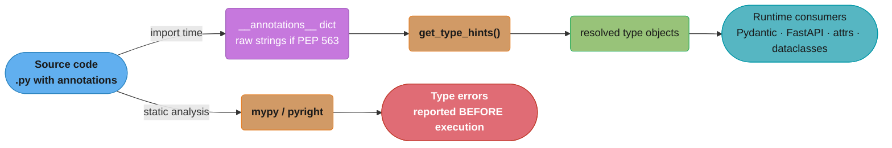
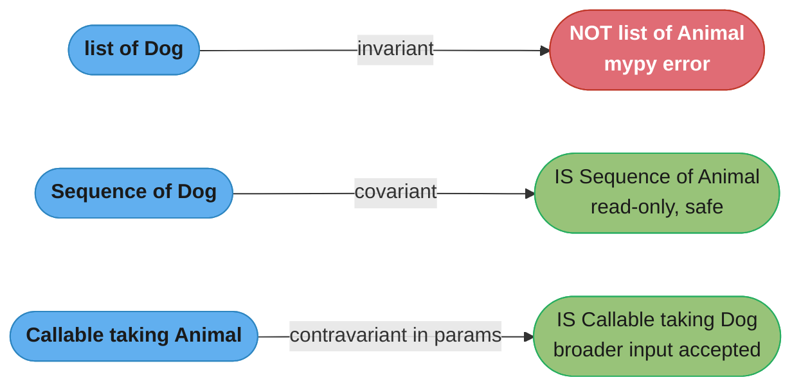
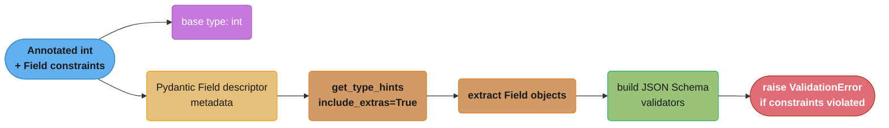
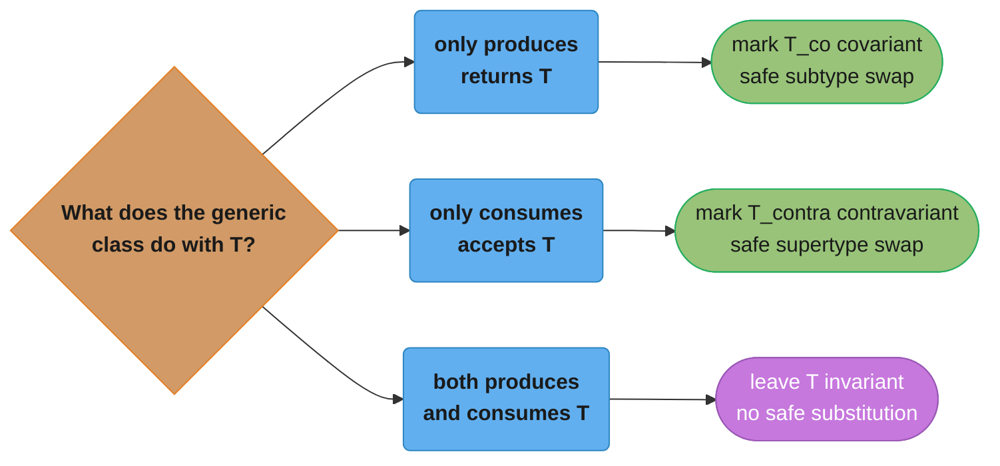
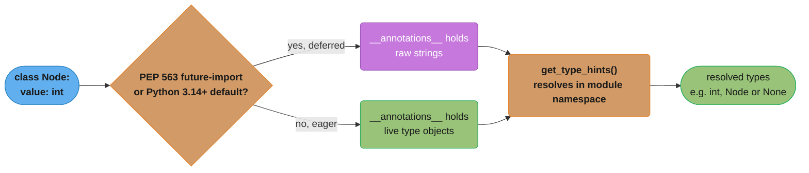

# The Type System & typing

## 1. Concept Overview

Python's type system is a **gradual, structural, and optional** annotation layer built on top of the
language's dynamic runtime. Introduced incrementally starting from PEP 3107 (function annotations,
Python 3.0) and PEP 484 (type hints, Python 3.5), the system reached maturity with `Protocol`
[3.8], `Annotated` [3.9], `ParamSpec` [3.10], `TypeGuard` [3.10], `Self` [3.11],
`LiteralString` [3.11], and PEP 695 type parameter syntax [3.12].

Core machinery lives in the `typing` module (standard library), with `typing_extensions` backporting
newer constructs. Static type checkers (mypy, pyright) consume annotations at analysis time; the
Python runtime itself does **not** enforce them unless explicitly instructed via libraries such as
Pydantic or beartype.

Key constructs covered in this module:

- `TypeVar`, `ParamSpec`, `TypeVarTuple` — generics
- `Protocol` — structural subtyping
- Variance: covariant, contravariant, invariant
- `Annotated`, `Literal`, `TypeGuard`, `Self`, `LiteralString`
- PEP 695 `type` statement and bracketed syntax [3.12]
- Runtime introspection: `get_type_hints()`, `__annotations__`
- Toolchain: mypy, pyright, ruff, beartype
- FastAPI integration: parameter introspection via `get_type_hints()` + `inspect.signature()`

---

## 2. Intuition

> A type annotation is a contract stamped on a variable — it does not cage the value at runtime,
> but it lets every reader of the code (human or machine) reason about intent without tracing
> execution.

**Mental model:** Think of Python's type system as the difference between a building blueprint and
the physical building. The blueprint (annotations) can be checked for structural soundness before
a single brick is laid (static analysis). The building itself (runtime) does not consult the
blueprint once construction begins — unless you install an inspector on-site (beartype, Pydantic).

**Why it matters:** FastAPI, Pydantic, SQLModel, and most modern Python frameworks extract
annotations at import time to generate validation schemas, OpenAPI docs, and serialization logic.
Without understanding how `get_type_hints()` resolves forward references, how `Annotated` carries
metadata, or how `Protocol` enables pluggable backends, framework internals remain opaque and
debugging mysterious `ValidationError` or `TypeError` messages becomes guesswork.

**Key insight:** The type system has two completely separate audiences — the static checker
(mypy/pyright) that runs before your code executes, and runtime consumers (Pydantic, FastAPI, attrs)
that read `__annotations__` dicts at import time. Code that satisfies the static checker can still
confuse runtime consumers (forward references stored as strings), and vice versa. Understanding both
audiences prevents the most common category of bugs.

---

## 3. Core Principles

1. **Gradual typing** — You can annotate some functions and leave others untyped; the checker
   treats unannotated code as `Any`. Full coverage is opt-in.

2. **Annotations are not enforcement** — `x: int = "hello"` is valid Python at runtime. Enforcement
   requires an explicit runtime validation layer.

3. **Structural vs nominal subtyping** — ABC inheritance is nominal (explicit `class Dog(Animal)`).
   `Protocol` is structural — any class implementing the required methods satisfies the protocol
   without declaring inheritance.

4. **Erasure at runtime** — Generic parameters are erased. `list[int]` at runtime is just `list`.
   `isinstance(x, list[int])` raises `TypeError`. [3.9+ allows `list[int]` as a hint; the
   subscript creates a `types.GenericAlias` but carries no runtime element type enforcement.]

5. **`__annotations__` is populated at import time** — only with the string representation of
   the annotation when `from __future__ import annotations` is active (PEP 563) or in Python 3.14+
   default mode (PEP 649). `get_type_hints()` evaluates the strings against the module namespace.

6. **`Any` is both top and bottom** — `Any` is compatible with every type in both directions,
   making it an escape hatch that silences all static errors at the cost of safety.

7. **TypeVars are scoped per function/class** — a single `T = TypeVar('T')` reused across
   unrelated generic functions is legal but makes mypy treat them as the same binding in the same
   scope, causing confusing inference failures.

---

## 4. Types / Architectures / Strategies

### 4.1 Simple annotations

```python
name: str = "alice"
count: int
items: list[str] = []          # [3.9] lowercase generics
mapping: dict[str, int] = {}
optional: str | None = None    # [3.10] union syntax
```

### 4.2 TypeVar — making functions generic

```python
from typing import TypeVar

T = TypeVar("T")

def identity(x: T) -> T:
    return x
```

Variants:
- **Unconstrained**: `T = TypeVar("T")` — any type
- **Bounded**: `T = TypeVar("T", bound=SupportsFloat)` — T must be a subtype of the bound
- **Constrained**: `AnyStr = TypeVar("AnyStr", str, bytes)` — exactly one of the listed types

### 4.3 ParamSpec [3.10] — preserving decorator signatures

`ParamSpec` captures the parameters of a callable so that a decorator wrapper retains the wrapped
function's full signature for static checkers.

### 4.4 TypeVarTuple [3.11] — variadic generics

Used for `*args` generics; powers `numpy`-style shape typing:

```python
from typing import TypeVarTuple, Unpack
Ts = TypeVarTuple("Ts")
```

### 4.5 Protocol [3.8] — structural subtyping

A `Protocol` class defines a structural interface. Any class that has the required attributes and
methods satisfies the protocol without declaring inheritance.

### 4.6 Variance

| TypeVar flag | Meaning | Rule |
|---|---|---|
| default (invariant) | `Container[Dog]` is NOT a `Container[Animal]` | Read and write |
| `covariant=True` | `Container[Dog]` IS a `Container[Animal]` | Read-only (producers) |
| `contravariant=True` | `Container[Animal]` IS a `Container[Dog]` | Write-only (consumers) |

### 4.7 Annotated [3.9]

```python
from typing import Annotated
UserId = Annotated[int, "must be positive"]
```

Metadata is ignored by static checkers but accessible to runtime consumers via
`get_type_hints(include_extras=True)`.

### 4.8 Literal [3.8]

```python
from typing import Literal
HttpMethod = Literal["GET", "POST", "PUT", "DELETE"]
```

Enables discriminated unions and exhaustiveness checking.

### 4.9 TypeGuard [3.10]

Narrows the type of a variable inside an `if` block when a user-defined predicate returns `True`.

### 4.10 Self [3.11]

```python
from typing import Self
class Builder:
    def set_name(self, name: str) -> Self:
        self.name = name
        return self
```

Avoids the need for a `TypeVar` just to type `self` in fluent interfaces.

### 4.11 LiteralString [3.11]

Marks strings that must be string literals (not dynamically constructed), preventing SQL injection
via type checking.

### 4.12 PEP 695 Type Parameter Syntax [3.12]

```python
type Vector[T] = list[T]                    # type alias
def first[T](lst: list[T]) -> T: ...        # generic function
class Stack[T]: ...                          # generic class
```

Replaces the verbose `TypeVar` + `Generic[T]` boilerplate.

---

## 5. Architecture Diagrams

### The two-audience model

Two independent audiences read the same annotation: the static checker consumes it before
execution, while runtime consumers resolve it through `get_type_hints()` after import.



### TypeVar inference flow

Given `def wrap[T](x: T) -> list[T]: ...`, a concrete call drives mypy's inference chain from
argument to return type, and flags a type error only if the caller later misuses the result.


### Protocol structural check

```
class Drawable(Protocol):
    def draw(self) -> None: ...

class Circle:             # no inheritance!
    def draw(self) -> None:
        print("O")

class Triangle:
    def render(self) -> None:   # wrong method name
        print("^")

def render_all(shapes: list[Drawable]) -> None:
    for s in shapes:
        s.draw()

render_all([Circle()])    # OK — Circle satisfies Drawable structurally
render_all([Triangle()])  # mypy ERROR — Triangle missing draw()
```

### Variance with Animal/Dog hierarchy

Given `class Dog(Animal)`, the same three container shapes from the table above show why only
the invariant case is blocked — covariant and contravariant substitution are both safe.



### Annotated metadata pipeline (Pydantic v2)

`Annotated[int, Field(gt=0, lt=1000)]` decomposes into a base type and Field metadata; Pydantic v2
reads that metadata via `get_type_hints(include_extras=True)` to build the JSON Schema validator
that raises `ValidationError` at runtime once a value falls outside `0 < value < 1000`.



---

## 6. How It Works — Detailed Mechanics

### 6.1 TypeVar basics

```python
from typing import TypeVar

T = TypeVar("T")

def first(lst: list[T]) -> T:
    return lst[0]

result = first([1, 2, 3])   # mypy infers result: int
result = first(["a", "b"])  # mypy infers result: str
```

When `first([1, 2, 3])` is called, mypy binds `T = int` from the argument type `list[int]`, then
infers the return as `int`. This happens entirely at analysis time — at runtime `T` is just a
`TypeVar` object; there is no `int` enforcement.

### 6.2 Bounded TypeVar

```python
from typing import TypeVar, Protocol

class Comparable(Protocol):
    def __lt__(self, other: "Comparable") -> bool: ...

CT = TypeVar("CT", bound=Comparable)

def minimum(a: CT, b: CT) -> CT:
    return a if a < b else b

minimum(1, 2)          # OK — int is Comparable
minimum("x", "y")      # OK — str is Comparable
minimum(1, "x")        # mypy ERROR — T bound to int, str not compatible
```

The `bound` restricts `CT` to subtypes of `Comparable`. Unlike constrained TypeVars, the bound
allows any subtype (open set), while constrained TypeVars restrict to an exact closed list.

### 6.3 Constrained TypeVar

```python
from typing import TypeVar

AnyStr = TypeVar("AnyStr", str, bytes)

def decode(data: AnyStr) -> AnyStr:
    if isinstance(data, bytes):
        return data.decode()  # type: ignore[return-value] -- constrained TypeVar quirk
    return data

decode(b"hello")   # AnyStr = bytes, return bytes
decode("hello")    # AnyStr = str, return str
decode(42)         # mypy ERROR — int is not str or bytes
```

Constrained TypeVars do not allow subtypes of the listed types — if you pass a `UserString`
subclass of `str`, mypy treats it as `str`, not `UserString`.

### 6.4 ParamSpec [3.10]

Without `ParamSpec`, decorators that wrap functions lose their parameter signatures:

```python
# WITHOUT ParamSpec — loses signature
from typing import Callable, TypeVar
F = TypeVar("F", bound=Callable[..., Any])

def log(func: F) -> F:
    def wrapper(*args: Any, **kwargs: Any) -> Any:
        print(f"calling {func.__name__}")
        return func(*args, **kwargs)
    return wrapper  # type: ignore — wrapper signature is (Any, ...) -> Any
```

With `ParamSpec` [3.10]:

```python
from typing import ParamSpec, TypeVar, Callable
import functools

P = ParamSpec("P")
R = TypeVar("R")

def log(func: Callable[P, R]) -> Callable[P, R]:
    @functools.wraps(func)
    def wrapper(*args: P.args, **kwargs: P.kwargs) -> R:
        print(f"calling {func.__name__}")
        return func(*args, **kwargs)
    return wrapper

@log
def greet(name: str, loud: bool = False) -> str:
    return name.upper() if loud else name

# mypy knows: greet(name: str, loud: bool = False) -> str
reveal_type(greet)  # Callable[[str, bool], str]  -- signature preserved
```

`P.args` and `P.kwargs` are the positional and keyword components of `ParamSpec`. They must appear
together as `*args: P.args, **kwargs: P.kwargs`.

### 6.5 Protocol [3.8]

```python
from typing import Protocol, runtime_checkable

@runtime_checkable
class Serializable(Protocol):
    def to_json(self) -> str: ...
    def from_json(cls, data: str) -> "Serializable": ...

class User:
    def to_json(self) -> str:
        return '{"user": true}'

    @classmethod
    def from_json(cls, data: str) -> "User":
        return cls()

# No inheritance from Serializable required
def save(obj: Serializable) -> None:
    print(obj.to_json())

save(User())          # OK — structural match
isinstance(User(), Serializable)  # True — runtime_checkable enables this
```

**ABC (nominal) vs Protocol (structural):**

| Dimension | ABC | Protocol |
|---|---|---|
| Inheritance required | Yes | No |
| Runtime `isinstance` | Yes (always) | Only with `@runtime_checkable` |
| Static check | Nominal — must subclass | Structural — must implement methods |
| Use case | Framework base classes | Plugin interfaces, duck typing |

### 6.6 Covariance and Contravariance

```python
from typing import TypeVar, Generic

T_co = TypeVar("T_co", covariant=True)    # producer
T_contra = TypeVar("T_contra", contravariant=True)  # consumer

class ReadOnlyBox(Generic[T_co]):
    def __init__(self, value: T_co) -> None:
        self._value = value
    def get(self) -> T_co:
        return self._value

class WriteOnlyBox(Generic[T_contra]):
    def __init__(self) -> None:
        self._values: list[Any] = []
    def put(self, value: T_contra) -> None:
        self._values.append(value)
```

Practical rule:
- **Covariant** (`T_co`): the class only *produces* / returns `T`. `ReadOnlyBox[Dog]` is safely
  substitutable for `ReadOnlyBox[Animal]` because every Dog is an Animal.
- **Contravariant** (`T_contra`): the class only *consumes* / accepts `T`. `WriteOnlyBox[Animal]`
  is safely substitutable for `WriteOnlyBox[Dog]` because if you can handle any Animal, you can
  handle a Dog.
- **Invariant** (default): both produce and consume — no safe substitution in either direction.

The same producer/consumer mnemonic as a decision tree — read-only roles get `covariant`,
write-only roles get `contravariant`, and read-write roles stay `invariant`:



`list` is invariant because it both reads and writes. `Sequence` is covariant because it is
read-only. `Callable[[Dog], None]` is contravariant in its parameter type — a function that accepts
`Animal` can safely stand in for one that accepts `Dog` (Liskov substitution).

#### Decoding the variance rule

**Read it like this.** "If a generic only hands values out, you may narrow what is inside it. If it only takes values in, you may widen what is inside it. If it does both, you may do neither."

Variance is not a Python quirk — it is the type-level statement of the Liskov Substitution Principle. Every rule below falls out of asking one question: *could the substitution let someone put the wrong thing in, or get the wrong thing out?*

| Symbol | What it is |
|--------|------------|
| `Dog <: Animal` | "Dog is a subtype of Animal" — the direction every rule is stated relative to |
| `T_co` (`covariant=True`) | Substitution follows the same direction as `T`. Legal only for producers |
| `T_contra` (`contravariant=True`) | Substitution runs the opposite direction. Legal only for consumers |
| `T` (default, invariant) | No substitution in either direction. The safe default for read-write containers |
| Producer | The class only *returns* `T` — `get()`, `list_all()`, `__getitem__` |
| Consumer | The class only *accepts* `T` — `put()`, `append()`, a function parameter |

**Walk one example.** Take `Dog <: Animal` and test each container shape by asking what could go wrong:

```
  covariant       ReadOnlyBox[Dog]  ->  ReadOnlyBox[Animal]?      ALLOWED
    caller can only call .get(), which hands back a Dog
    a Dog IS an Animal, so the caller's expectation holds
    nothing can be put in, so nothing wrong can get in         -> safe

  contravariant   WriteOnlyBox[Animal] -> WriteOnlyBox[Dog]?      ALLOWED
    caller can only call .put(x) where x is a Dog
    the box accepts any Animal, and a Dog IS an Animal
    note the direction FLIPPED: the Animal box stands in for the Dog box

  invariant       list[Dog] -> list[Animal]?                      REJECTED
    caller sees list[Animal], so append(Cat()) is legal for them
    but the underlying object is really a list[Dog]
    result: a Cat now sits in a list[Dog]; dogs[1].bark() -> AttributeError

  invariant       list[Animal] -> list[Dog]?                      REJECTED
    caller sees list[Dog], so dogs[0].bark() is legal for them
    but the underlying list may hold a Cat
    result: the same AttributeError from the other direction
```

`list` fails in **both** directions, and that is precisely what "invariant" means — it is not a stricter version of covariant, it is the absence of any permitted substitution. The `list[Dog]` case above is the Pitfall 1 bug in Section 10, and reading it as "the caller was handed a wider write interface than the object can honour" explains it in one sentence.

**Why `Callable` is contravariant in parameters but covariant in returns.** A function type is a consumer of its arguments and a producer of its result, so it inherits both rules at once:

```
  Callable[[Animal], Dog]    can stand in for    Callable[[Dog], Animal]

    parameters:  needs to accept Dog; it accepts every Animal  -> accepts more, fine
    return:      must produce Animal; it produces Dog          -> produces less, fine

  the general shape: safe to accept MORE than required and return LESS than promised
```

That last line is the sentence to say in an interview. It is also why the `ReadRepository` fix in Section 14 works: `list_all()` only produces, so marking `T_co` covariant lets `Repository[User]` satisfy `ReadRepository[BaseModel]` — while the full read-write `Repository` must stay invariant because `create()` consumes.

### 6.7 Annotated [3.9]

```python
from typing import Annotated, get_type_hints

class Positive:
    """Marker for Pydantic/beartype validation."""

UserId = Annotated[int, Positive()]
Age    = Annotated[int, "between 0 and 150"]

def process(uid: UserId, age: Age) -> None:
    pass

# Static checker sees: uid: int, age: int
# Runtime consumer sees:
hints = get_type_hints(process, include_extras=True)
# {'uid': Annotated[int, <Positive>], 'age': Annotated[int, 'between 0 and 150'], ...}
```

**Pydantic v2 pattern:**

```python
from pydantic import BaseModel, Field
from typing import Annotated

PositiveInt = Annotated[int, Field(gt=0)]
NonEmptyStr = Annotated[str, Field(min_length=1)]

class Product(BaseModel):
    id: PositiveInt
    name: NonEmptyStr
    price: Annotated[float, Field(gt=0.0, description="USD price")]
```

Pydantic v2 reads `Annotated` metadata via `get_type_hints(include_extras=True)` to build its
validation schema — this means type aliases created with `Annotated` compose reusable validators
without class inheritance.

### 6.8 Literal [3.8]

```python
from typing import Literal, Union

HttpMethod = Literal["GET", "POST", "PUT", "DELETE", "PATCH"]
StatusCode = Literal[200, 201, 204, 400, 401, 403, 404, 422, 500]

def request(method: HttpMethod, url: str) -> None:
    ...

request("GET", "/api")    # OK
request("FETCH", "/api")  # mypy ERROR — "FETCH" not in Literal

# Discriminated union
class SuccessResponse:
    status: Literal["success"]

class ErrorResponse:
    status: Literal["error"]
    message: str

Response = Union[SuccessResponse, ErrorResponse]

def handle(resp: Response) -> None:
    if resp.status == "success":
        reveal_type(resp)  # SuccessResponse — narrowed by discriminant
```

### 6.9 TypeGuard [3.10]

```python
from typing import TypeGuard, Any

def is_str_list(lst: list[Any]) -> TypeGuard[list[str]]:
    return all(isinstance(x, str) for x in lst)

def process(items: list[Any]) -> None:
    if is_str_list(items):
        # mypy narrows items to list[str] here
        print(items[0].upper())  # OK — .upper() is valid on str
```

Without `TypeGuard`, mypy would still treat `items` as `list[Any]` inside the `if` block and
`.upper()` would not be type-checked.

### 6.10 PEP 695 Type Parameter Syntax [3.12]

Before PEP 695 (verbose):

```python
from typing import TypeVar, Generic
T = TypeVar("T")

class Stack(Generic[T]):
    def __init__(self) -> None:
        self._items: list[T] = []
    def push(self, item: T) -> None:
        self._items.append(item)
    def pop(self) -> T:
        return self._items.pop()

type Alias = list[tuple[int, str]]  # not valid pre-3.12 as a `type` statement
```

After PEP 695 [3.12]:

```python
class Stack[T]:                        # T is automatically a TypeVar
    def __init__(self) -> None:
        self._items: list[T] = []
    def push(self, item: T) -> None:
        self._items.append(item)
    def pop(self) -> T:
        return self._items.pop()

def first[T](lst: list[T]) -> T:      # generic function
    return lst[0]

type Vector[T] = list[T]              # generic type alias
type Matrix = list[list[float]]       # simple type alias

# Bounded syntax [3.12]
def clamp[T: (int, float)](value: T, lo: T, hi: T) -> T:
    return max(lo, min(value, hi))
```

PEP 695 syntax is syntactic sugar — the runtime still creates `TypeVar` objects internally.
Pyright 1.1.300+ and mypy 1.5+ support PEP 695.

### 6.11 `get_type_hints()` vs `__annotations__`

```python
from __future__ import annotations  # PEP 563 — deferred evaluation
from typing import get_type_hints

class Node:
    value: int
    next: "Node | None"  # forward reference

print(Node.__annotations__)
# {'value': 'int', 'next': 'Node | None'}  -- raw strings (PEP 563)

print(get_type_hints(Node))
# {'value': <class 'int'>, 'next': int | None}  -- resolved types
```

`__annotations__` returns raw string representations when PEP 563 is active (or always in
Python 3.14+ default mode with PEP 649). `get_type_hints()` evaluates those strings in the
correct namespace, resolving forward references. Always use `get_type_hints()` in library code.

Both storage modes funnel through the same resolver — the diagram makes that convergence
explicit, which is why "always call `get_type_hints()`" is safe advice regardless of mode.



### 6.12 FastAPI introspection pattern

FastAPI combines `inspect.signature()` with `get_type_hints()` to extract route parameter types
for automatic request parsing and OpenAPI schema generation:

```python
import inspect
from typing import get_type_hints, Annotated
from fastapi import FastAPI, Query

app = FastAPI()

@app.get("/items")
async def list_items(
    page: int = 1,
    size: Annotated[int, Query(ge=1, le=100)] = 20,
    q: str | None = None,
) -> list[str]:
    return []

# Internally, FastAPI does approximately:
sig = inspect.signature(list_items)
hints = get_type_hints(list_items, include_extras=True)
for name, param in sig.parameters.items():
    annotation = hints.get(name)
    default = param.default
    # Build Pydantic field from annotation + default
    # Generate OpenAPI parameter schema
```

`include_extras=True` is critical — without it, `get_type_hints()` strips the `Annotated` wrapper
and the `Query(ge=1, le=100)` metadata is lost, breaking validation constraints.

---

## 7. Real-World Examples

### FastAPI dependency with typed Protocol backend

```python
from typing import Protocol, TypeVar, runtime_checkable
from fastapi import FastAPI, Depends

T = TypeVar("T")

@runtime_checkable
class CacheBackend(Protocol):
    def get(self, key: str) -> str | None: ...
    def set(self, key: str, value: str, ttl: int = 300) -> None: ...

class RedisCache:
    def get(self, key: str) -> str | None: ...
    def set(self, key: str, value: str, ttl: int = 300) -> None: ...

class MemoryCache:
    _store: dict[str, str] = {}
    def get(self, key: str) -> str | None:
        return self._store.get(key)
    def set(self, key: str, value: str, ttl: int = 300) -> None:
        self._store[key] = value

def get_cache() -> CacheBackend:
    return RedisCache()

app = FastAPI()

@app.get("/cached/{key}")
async def read_cached(key: str, cache: CacheBackend = Depends(get_cache)) -> dict[str, str | None]:
    return {"value": cache.get(key)}
```

### Pydantic v2 with Annotated reusable validators

```python
from typing import Annotated
from pydantic import BaseModel, Field

PositiveInt  = Annotated[int, Field(gt=0)]
BoundedStr   = Annotated[str, Field(min_length=1, max_length=255)]
PercentFloat = Annotated[float, Field(ge=0.0, le=1.0)]

class Campaign(BaseModel):
    id: PositiveInt
    name: BoundedStr
    budget_usd: PositiveInt
    conversion_rate: PercentFloat
```

### LiteralString for SQL safety [3.11]

```python
from typing import LiteralString
import sqlite3

def safe_query(conn: sqlite3.Connection, table: LiteralString) -> list:
    return conn.execute(f"SELECT * FROM {table}").fetchall()

table_name = input("Enter table: ")
safe_query(conn, table_name)      # mypy ERROR — dynamic string, not LiteralString
safe_query(conn, "users")         # OK — string literal
```

---

## 8. Tradeoffs

| Dimension | Heavy typing (full coverage) | Light typing (minimal annotations) |
|---|---|---|
| Catch errors | Pre-runtime, at analysis time | Only at runtime |
| Refactoring safety | High — mypy/pyright surface all breakage | Low — silent failures |
| Onboarding speed | Slower — more to write | Faster initially |
| Maintenance cost | Lower long-term | Higher as codebase grows |
| Runtime overhead | Zero (static only) | Zero |
| Framework integration | Full (FastAPI, Pydantic exploit annotations) | Partial |
| Generic complexity | High — TypeVar, variance, ParamSpec are non-trivial | Not needed |

| Feature | Use case | Overhead |
|---|---|---|
| `TypeVar` | Generic functions and classes | None at runtime |
| `Protocol` | Pluggable backends, duck typing | None unless `@runtime_checkable` |
| `Annotated` | Metadata for validators (Pydantic) | Tiny — extra `_AnnotatedAlias` object |
| `Literal` | Discriminated unions, narrowing | None |
| `TypeGuard` | User-defined narrowing predicates | None |
| `ParamSpec` | Decorator signature preservation | None |
| `beartype` | Runtime type enforcement | ~1–5 µs per call |

---

## 9. When to Use / When NOT to Use

### Use type hints when:

- Writing library or framework code that others will import
- The function has non-obvious return types or complex generic behavior
- Using Pydantic, FastAPI, attrs, or dataclasses — these frameworks require annotations
- Working in a team where code review catches logic errors via `mypy --strict`
- Implementing plugin or backend systems where `Protocol` replaces ABC inheritance

### Use `Protocol` when:

- You want structural duck typing without coupling consumers to a specific ABC
- Defining interfaces for third-party classes you do not control (cannot inherit from)
- Testing — `Protocol` makes mock objects type-safe without inheriting a base class

### Use `TypeVar` / generics when:

- A function should work on multiple types while preserving type relationships
- Building generic data structures (queue, repository, cache wrapper)

### Do NOT over-annotate when:

- Simple one-off scripts where static analysis provides no team benefit
- Performance-critical inner loops — even though annotations have near-zero overhead, constant
  `get_type_hints()` calls in hot paths add latency
- Annotating `self` in every method with `TypeVar` pre-3.11 — use `Self` instead

### Avoid `TypeVar` with overly wide scope:

- Do not reuse a single `T = TypeVar("T")` across unrelated generic functions in the same file —
  mypy can mislink bindings; define separate TypeVars per module or use PEP 695 inline syntax.

---

## 10. Common Pitfalls

### Pitfall 1: Mutable covariant container (BROKEN → FIX)

```python
# BROKEN — list is invariant, not covariant
class Animal:
    pass

class Dog(Animal):
    def bark(self) -> None:
        print("woof")

class Cat(Animal):
    def meow(self) -> None:
        print("meow")

def add_cat(animals: list[Animal]) -> None:
    animals.append(Cat())      # legal — Cat is an Animal

dogs: list[Dog] = [Dog()]
add_cat(dogs)                  # mypy ERROR: Argument 1 has incompatible type "list[Dog]";
                               # expected "list[Animal]"
# At runtime if you bypassed the check: dogs[1].bark() -> AttributeError: Cat has no bark
```

The fix depends on intent:

```python
# FIX A — use Sequence (covariant, read-only) for read-only access
from collections.abc import Sequence

def count_animals(animals: Sequence[Animal]) -> int:
    return len(animals)

count_animals(dogs)    # OK — Sequence[Dog] is a Sequence[Animal]

# FIX B — keep list[Animal] consistently; do not pass list[Dog]
all_animals: list[Animal] = [Dog()]
add_cat(all_animals)   # OK — same list type throughout
```

### Pitfall 2: TypeVar re-use across unrelated functions (BROKEN → FIX)

```python
# BROKEN — single T reused, mypy can mislink in complex call graphs
from typing import TypeVar
T = TypeVar("T")

def box(x: T) -> list[T]:
    return [x]

def unbox(lst: list[T]) -> T:
    return lst[0]

# In the same function, mypy must reconcile both T bindings
def roundtrip(x: T) -> T:
    return unbox(box(x))  # fine here, but in larger files becomes a maintenance trap
```

```python
# FIX — define per-function TypeVars or use PEP 695 inline syntax [3.12]
BoxT = TypeVar("BoxT")
UnboxT = TypeVar("UnboxT")

def box(x: BoxT) -> list[BoxT]:
    return [x]

def unbox(lst: list[UnboxT]) -> UnboxT:
    return lst[0]

# Or with PEP 695 [3.12]
def box[T](x: T) -> list[T]:
    return [x]

def unbox[T](lst: list[T]) -> T:
    return lst[0]
```

### Pitfall 3: Missing `@runtime_checkable` then using `isinstance` (BROKEN → FIX)

```python
# BROKEN
from typing import Protocol

class Drawable(Protocol):
    def draw(self) -> None: ...

class Circle:
    def draw(self) -> None:
        print("O")

obj = Circle()
isinstance(obj, Drawable)
# TypeError: Protocols with non-method members don't support issubclass()
# OR (for method-only Protocols without @runtime_checkable):
# TypeError: Instance and class checks can only be used with @runtime_checkable protocols
```

```python
# FIX
from typing import Protocol, runtime_checkable

@runtime_checkable
class Drawable(Protocol):
    def draw(self) -> None: ...

isinstance(Circle(), Drawable)  # True

# CAVEAT: @runtime_checkable only checks method presence, not signatures
class Broken:
    draw = 42   # not callable

isinstance(Broken(), Drawable)  # True at runtime — runtime_checkable is shallow
# mypy still catches this statically, but isinstance cannot
```

### Pitfall 4: `from __future__ import annotations` breaks `isinstance` with `str | None`

```python
# BROKEN — PEP 563 stringifies all annotations
from __future__ import annotations

def process(x: int | None) -> None:
    pass

import typing, inspect
# At runtime: process.__annotations__ == {'x': 'int | None', 'return': 'None'}
# calling get_type_hints(process) resolves this correctly IF int and None are in scope
# but custom classes defined after this module's import can cause NameError
```

The fix is to always use `get_type_hints()` in library code that reads annotations at runtime, and
to not mix `from __future__ import annotations` with runtime `isinstance` on annotation objects.

### Pitfall 5: Forgetting `include_extras=True` in `get_type_hints()`

```python
# BROKEN — Annotated metadata silently stripped
from typing import Annotated, get_type_hints
from pydantic import Field

def handler(age: Annotated[int, Field(ge=0, le=150)]) -> None:
    pass

hints = get_type_hints(handler)          # strips Annotated!
# {'age': <class 'int'>}  -- Field(ge=0) is lost

# FIX
hints = get_type_hints(handler, include_extras=True)
# {'age': Annotated[int, FieldInfo(ge=0, le=150)]}
```

---

## 11. Technologies & Tools

| Tool | Role | Strictness | Speed | IDE integration | Runtime overhead |
|---|---|---|---|---|---|
| **mypy** | Static type checker | High (`--strict` mode); gradual by default | Moderate (~seconds on large codebases) | VS Code via Pylance or mypy extension; PyCharm built-in | None |
| **pyright** | Static type checker (Microsoft) | Very high; stricter than mypy on generics and narrowing | Fast (Rust-based language server); incremental | VS Code Pylance (built-in); Neovim via LSP | None |
| **ruff** | Linter + formatter; `ruff check --select=ANN` for annotation enforcement | Linting rules, not full type inference | Extremely fast (Rust) | VS Code ruff extension; pre-commit | None |
| **beartype** | Runtime type checker | Enforces annotations at function call time | ~1–5 µs per decorated call; O(1) strategy avoids full traversal | Minimal — decorators | Low–moderate per call |

**mypy configuration (`pyproject.toml`):**

```toml
[tool.mypy]
python_version = "3.12"
strict = true
warn_return_any = true
warn_unused_ignores = true
disallow_untyped_defs = true
```

**pyright configuration (`pyrightconfig.json`):**

```json
{
  "pythonVersion": "3.12",
  "typeCheckingMode": "strict",
  "reportMissingTypeStubs": false
}
```

**beartype integration:**

```python
from beartype import beartype

@beartype
def add(x: int, y: int) -> int:
    return x + y

add(1, "2")  # BeartypeCallHintParamViolation raised at runtime
```

#### Decoding the runtime-enforcement budget

**What this actually says.** "Runtime type checking is free per call and expensive per loop — the only number that matters is how many decorated calls sit on the path you care about."

The `~1-5 us per call` figure in the tables above is meaningless in isolation. Multiplied by a call count it becomes a decision rule, and the decision flips entirely depending on whether the decorated function is called once per request or once per row.

| Symbol | What it is |
|--------|------------|
| `c` | Per-call overhead of a `@beartype`-decorated function: `1-5 us`, depending on hint complexity |
| `N` | Number of decorated calls on the path being measured |
| `c x N` | Total added latency — the only figure worth comparing against a budget |
| O(1) strategy | beartype's default: it spot-checks one element of a container, not all of them |
| Static checking | mypy / pyright. `c = 0` at runtime because the work happened before execution |

**Walk one example.** Price the same decorator at three very different call counts:

```
                                     at c = 1 us      at c = 5 us
  1 call    (one API boundary)          0.001 ms         0.005 ms
  50 calls  (a request's service layer) 0.05  ms         0.25  ms
  1,000 calls                           1.0   ms         5.0   ms
  100,000 calls (per-row in a loop)   100     ms       500     ms

  against a 100 ms request budget:
    50 decorated calls at 5 us  =  0.25 ms  =  0.25 % of budget   -> negligible
    100,000 calls      at 5 us  =  500  ms  =  500 % of budget    -> the request
                                                                     is now 6x slower
```

The guidance in Best Practice 11 — "use `beartype` for runtime enforcement in critical paths" — is really this arithmetic. Decorate the **boundary** functions where untrusted data enters (one call per request, `0.25 %` of budget, catches every bad input), and never decorate the per-row helper inside the loop it feeds (`100,000` calls, the request budget gone five times over). The overhead is not a property of beartype; it is a property of where you put the decorator.

**Why the O(1) strategy matters here.** Checking `list[str]` exhaustively would cost `O(len(list))`, so a 100,000-element list would make a *single* call expensive and `c` would stop being a constant at all. beartype instead samples one element per call, keeping `c` flat regardless of container size. The trade is that a list whose 40,000th element is an `int` may pass — runtime enforcement is a probabilistic net across many calls, not a proof. That is exactly why it complements `mypy --strict` rather than replacing it: the static checker gives you the proof, beartype catches what crosses the boundary from code the checker never saw.

See `../fastapi/pydantic_v2_deep_dive/README.md` for how Pydantic v2 uses `Annotated` and `TypeVar` for
validation at a framework level.

Compare with Java erasure in `../../java/generics_and_type_system/README.md` — both Python and
Java erase generic parameters at runtime, but Python retains the annotation strings in
`__annotations__` while Java loses them entirely at the bytecode level.

---

## 12. Interview Questions with Answers

**Q1: What is the difference between `TypeVar` with a bound and one with constraints?**
A bounded TypeVar (`T = TypeVar("T", bound=Foo)`) accepts `Foo` and any subtype of `Foo` — an
open set. A constrained TypeVar (`T = TypeVar("T", str, bytes)`) accepts exactly those listed types
(closed set) and treats subtypes as their parent constraint. Use bounds when you need any subtype;
use constraints when you need an exact one-of selection.

**Q2: Why is `list` invariant while `Sequence` is covariant in Python's type system?**
`list` is invariant because it supports both reads (`__getitem__`) and writes (`__setitem__`,
`append`). If `list[Dog]` were covariant and accepted where `list[Animal]` is expected, you could
`append(Cat())` to a `list[Dog]`, corrupting it. `Sequence` is read-only (no mutation methods), so
accepting `Sequence[Dog]` where `Sequence[Animal]` is expected is safe — you only ever read
Animals, and every Dog is an Animal.

**Q3: How does `Protocol` differ from an ABC, and when do you choose one over the other?**
`Protocol` is structurally typed — any class with the required attributes/methods satisfies it
without inheritance. ABC is nominally typed — subclasses must explicitly inherit. Choose `Protocol`
when defining interfaces for third-party classes you do not control, for plugin architectures, and
for testing (mock objects satisfy protocols without inheriting base classes). Use ABC when you want
to enforce inheritance hierarchy and provide shared implementation via `@abstractmethod`.

**Q4: What is `ParamSpec` and what problem does it solve that `TypeVar` cannot?**
`ParamSpec` [3.10] captures the full parameter list (positional + keyword) of a callable, not just
a single type. A regular `TypeVar` bound to `Callable[..., R]` loses parameter names and types in
the wrapper, breaking IDE autocomplete and mypy checks on arguments. `ParamSpec` preserves the
exact signature through the wrapper function via the `P.args` / `P.kwargs` components.

**Q5: What does `@runtime_checkable` do and what is its limitation?**
It enables `isinstance()` checks against a `Protocol` at runtime. Without it, `isinstance(x,
MyProtocol)` raises `TypeError`. The limitation: the check is shallow — it only verifies that
attributes and methods with the required names exist, not that their signatures match. A method
with the wrong signature or even a non-callable attribute with the right name passes the check.
Static checkers (mypy) are stricter and check signatures.

**Q6: Explain how FastAPI uses type annotations to build its request validation logic.**
FastAPI calls `get_type_hints(endpoint, include_extras=True)` to retrieve the full annotated types
(including `Annotated` metadata) and `inspect.signature()` to retrieve defaults. It maps each
parameter annotation to a Pydantic field, then generates a validation model for query parameters,
path parameters, body, and headers. The `include_extras=True` flag is critical — without it,
`Annotated[int, Query(ge=1)]` reduces to `int` and the `Query` constraint is dropped silently.

**Q7: What is the difference between `__annotations__` and `get_type_hints()`?**
`__annotations__` is a raw dict on the class or function containing annotation values as-typed —
under PEP 563 (`from __future__ import annotations`) or Python 3.14+ default behavior, these are
stored as strings (deferred evaluation). `get_type_hints()` evaluates those strings in the
correct module namespace, resolving forward references like `"Node | None"` to actual type objects.
Library code that reads annotations at runtime must always use `get_type_hints()` to handle both
eager and deferred annotation modes correctly.

**Q8: How does `Annotated` enable Pydantic v2's field-level validation without subclassing?**
`Annotated[int, Field(gt=0)]` stores `Field(gt=0)` as metadata alongside the base type `int`.
Pydantic v2 calls `get_type_hints(model, include_extras=True)`, extracts the `FieldInfo` object
from the `Annotated` metadata tuple, and builds a JSON Schema validator from it. This lets you
define reusable validated type aliases (`PositiveInt = Annotated[int, Field(gt=0)]`) that compose
across multiple models without inheritance, unlike Pydantic v1 validators which required
`@validator` classmethods.

**Q9: What is `TypeGuard` and how does it differ from a plain boolean check?**
A plain `if isinstance(x, str)` allows mypy to narrow `x` to `str` inside the block because mypy
has built-in knowledge of `isinstance`. `TypeGuard` [3.10] extends this to *user-defined*
predicates — if a function returns `TypeGuard[list[str]]`, mypy narrows the checked variable to
`list[str]` in the `if` branch. Without `TypeGuard`, user-defined predicates that return `bool`
do not trigger narrowing and the original broad type persists.

**Q10: What are the rules for when a TypeVar should be covariant vs contravariant vs invariant?**
Use the producer/consumer mnemonic: if a class only *produces* (returns) values of type T, mark T
covariant — it is safe to substitute a subtype. If a class only *consumes* (accepts) values of type
T, mark T contravariant — it is safe to substitute a supertype. If a class does both (e.g., a
read-write container), T must be invariant. A common heuristic: if you can describe the generic
container as "a source of T", use covariant; if "a sink for T", use contravariant; if both, leave
invariant.

**Q11: How does PEP 695 [3.12] improve generic syntax over the pre-3.12 approach?**
PEP 695 introduces inline type parameter syntax: `def f[T](x: T) -> T:` instead of
`T = TypeVar("T"); def f(x: T) -> T:`. This eliminates module-level TypeVar declarations, removes
the need for `Generic[T]` base class, avoids TypeVar name string duplication (`TypeVar("T")` where
`"T"` must match the variable name), and scopes the type parameter to its function or class. The
`type` statement (`type Vector[T] = list[T]`) also replaces the verbose `TypeAlias` annotation.

**Q12: What is `LiteralString` [3.11] and why does it matter for security?**
`LiteralString` is a type that can only be satisfied by actual string literals or concatenations of
literals — not by dynamically constructed strings. This allows static checkers to reject code like
`safe_query(conn, f"SELECT * FROM {user_input}")` where the function signature requires
`LiteralString`, preventing SQL injection and similar injection attacks at analysis time rather than
relying solely on runtime sanitization.

**Q13: How do you type a function that accepts either `str` or `bytes` and returns the same type?**
Use a constrained TypeVar: `AnyStr = TypeVar("AnyStr", str, bytes)`. This is different from
`str | bytes` as a return type — with `str | bytes`, a function accepting `str` could be declared
as returning `bytes`. With `AnyStr`, mypy enforces that the return type matches the input type:
`def decode(x: AnyStr) -> AnyStr:` will return `str` when given `str` and `bytes` when given
`bytes`.

**Q14: What is `Self` [3.11] and when does it replace a TypeVar?**
`Self` refers to the type of the current class in a method signature, including subclasses. Before
3.11, fluent builder patterns required `SelfT = TypeVar("SelfT", bound="Builder")` and using
`SelfT` as both the parameter type of `cls` and the return type. `Self` makes this implicit —
`def clone(self) -> Self:` automatically resolves to the concrete subclass type when called on a
subclass. This is important for inheritance: if `SubBuilder(Builder)` inherits `clone`, the return
type is `SubBuilder`, not `Builder`.

**Q15: How does variance interact with `Callable` types?**
`Callable[[Param], Return]` is contravariant in its parameter types and covariant in its return
type, matching Liskov Substitution Principle. A `Callable[[Animal], str]` is a subtype of
`Callable[[Dog], str]` — a function that handles any Animal can certainly handle a Dog (more
general parameter = subtype of callable). A `Callable[[Dog], Dog]` is a subtype of
`Callable[[Dog], Animal]` — a function returning a Dog satisfies anywhere a function returning
Animal is expected (return types are covariant). This mirrors how function types work mathematically
and is enforced by mypy's callable variance rules.

---

## 13. Best Practices

1. **Annotate all public API boundaries** — functions, methods, and class attributes in modules
   intended for import. Internal helper functions can be left unannotated or use `# type: ignore`.

2. **Use `Sequence` instead of `list` for read-only parameters** — signals intent, enables
   covariant usage, and prevents callers from worrying about mutation.

3. **Use `Mapping` instead of `dict` for read-only parameters** — same rationale as `Sequence`.

4. **Prefer `Protocol` over ABC for plugin interfaces** — structural typing decouples consumers
   from the inheritance hierarchy and makes testing easier (mock objects need not inherit).

5. **Always pass `include_extras=True`** to `get_type_hints()` in any code that consumes
   `Annotated` metadata — forgetting this silently drops all validation constraints.

6. **Use PEP 695 syntax [3.12] for new code** — `def f[T](x: T) -> T:` is cleaner and avoids
   the TypeVar name-string duplication trap.

7. **Never reuse a module-level `T = TypeVar("T")` across unrelated functions in large files** —
   define per-function TypeVars or use PEP 695 inline syntax.

8. **Use `Self` [3.11] for fluent builders and `classmethod` return types** — avoids a TypeVar
   and correctly types subclass return types.

9. **Use `LiteralString` [3.11] at any SQL/HTML/shell interpolation boundary** — provides static
   injection-safety guarantee with zero runtime cost.

10. **Run `mypy --strict` in CI** — gradual typing provides false security; `--strict` disallows
    implicit `Any` and forces explicit annotations at all boundaries.

11. **Use `beartype` for runtime enforcement in critical paths** — particularly useful in libraries
    where you cannot trust callers to run a static checker. The O(1) checking strategy adds
    minimal overhead while catching type mismatches.

12. **Type aliases with `type` statement [3.12] or `TypeAlias` [3.10]** — document intent and
    avoid re-typing long `Annotated[...]` expressions across multiple models.

    ```python
    # [3.10] TypeAlias
    from typing import TypeAlias
    UserId: TypeAlias = Annotated[int, Field(gt=0)]

    # [3.12] type statement
    type UserId = Annotated[int, Field(gt=0)]
    ```

13. **Forward references in string form for cross-module types** — use `"ClassName"` strings or
    `from __future__ import annotations` consistently; never mix eager and deferred modes in the
    same file.

---

## 14. Case Study

### Typing a Generic Repository Pattern for FastAPI

This case study implements a typed generic `Repository[T]` class with a `Protocol`-based DB
backend, validated IDs via `Annotated`, and demonstrates a variance bug and its fix.

#### Setup

```python
from __future__ import annotations

from typing import Annotated, Protocol, TypeVar, Generic, Any, runtime_checkable
from pydantic import BaseModel, Field

# Validated ID type — positive integer only
EntityId = Annotated[int, Field(gt=0, description="Auto-incremented primary key")]
```

#### Define the DB backend Protocol

```python
@runtime_checkable
class DbBackend(Protocol):
    """Structural interface — any class with these methods qualifies."""

    def fetch_one(self, table: str, id_: int) -> dict[str, Any] | None: ...
    def fetch_all(self, table: str) -> list[dict[str, Any]]: ...
    def insert(self, table: str, data: dict[str, Any]) -> int: ...
    def delete(self, table: str, id_: int) -> bool: ...
```

#### Define entity models

```python
class User(BaseModel):
    id: EntityId | None = None
    name: Annotated[str, Field(min_length=1, max_length=255)]
    email: Annotated[str, Field(pattern=r"^[^@]+@[^@]+\.[^@]+$")]

class Product(BaseModel):
    id: EntityId | None = None
    name: Annotated[str, Field(min_length=1)]
    price_usd: Annotated[float, Field(gt=0.0)]
```

#### BROKEN version — variance mistake

```python
# BROKEN — T is invariant; Repository[User] is NOT a Repository[BaseModel]
T = TypeVar("T")

class Repository(Generic[T]):
    def __init__(self, db: DbBackend, table: str, model: type[T]) -> None:
        self._db = db
        self._table = table
        self._model = model

    def get(self, id_: EntityId) -> T | None:
        row = self._db.fetch_one(self._table, id_)
        if row is None:
            return None
        return self._model(**row)

    def list_all(self) -> list[T]:
        rows = self._db.fetch_all(self._table)
        return [self._model(**row) for row in rows]

    def create(self, obj: T) -> EntityId:
        data = obj.model_dump(exclude={"id"})  # type: ignore[union-attr]
        # BROKEN: T has no .model_dump() — TypeVar is unconstrained, mypy cannot verify this
        return self._db.insert(self._table, data)

def print_all(repo: Repository[BaseModel]) -> None:
    for item in repo.list_all():
        print(item.model_dump())

user_repo: Repository[User] = Repository(db, "users", User)
print_all(user_repo)
# mypy ERROR: Argument 1 to "print_all" has incompatible type
# "Repository[User]"; expected "Repository[BaseModel]"
# Repository is invariant — Repository[User] is NOT Repository[BaseModel]
```

#### FIX — bounded TypeVar + covariant read interface

The fix has two parts:
1. Bound `T` to `BaseModel` so `.model_dump()` is statically safe.
2. Split the interface: a covariant `ReadRepository` for read-only callers, and the full
   `Repository` (invariant) for read-write callers.

```python
from typing import TypeVar, Generic, Protocol, Annotated, runtime_checkable, Any
from collections.abc import Sequence
from pydantic import BaseModel, Field

EntityId = Annotated[int, Field(gt=0)]

# Bound TypeVar — T must be a BaseModel subtype
T = TypeVar("T", bound=BaseModel)

# Covariant read-only view — safe to use Repository[User] where ReadRepository[BaseModel] expected
T_co = TypeVar("T_co", bound=BaseModel, covariant=True)

class ReadRepository(Protocol[T_co]):
    """Covariant read-only interface — producers only."""
    def get(self, id_: int) -> T_co | None: ...
    def list_all(self) -> Sequence[T_co]: ...

class Repository(Generic[T]):
    """Full read-write repository — invariant."""

    def __init__(self, db: DbBackend, table: str, model: type[T]) -> None:
        self._db = db
        self._table = table
        self._model = model

    def get(self, id_: int) -> T | None:
        row = self._db.fetch_one(self._table, id_)
        return self._model(**row) if row is not None else None

    def list_all(self) -> list[T]:
        return [self._model(**row) for row in self._db.fetch_all(self._table)]

    def create(self, obj: T) -> int:
        data = obj.model_dump(exclude={"id"})
        # OK — T is bound to BaseModel, so .model_dump() is guaranteed by mypy
        return self._db.insert(self._table, data)

    def delete(self, id_: int) -> bool:
        return self._db.delete(self._table, id_)
```

#### In-memory backend (satisfies DbBackend Protocol without inheriting it)

```python
class InMemoryDb:
    """Satisfies DbBackend Protocol structurally."""

    def __init__(self) -> None:
        self._store: dict[str, dict[int, dict[str, Any]]] = {}
        self._seq: dict[str, int] = {}

    def fetch_one(self, table: str, id_: int) -> dict[str, Any] | None:
        return self._store.get(table, {}).get(id_)

    def fetch_all(self, table: str) -> list[dict[str, Any]]:
        return list(self._store.get(table, {}).values())

    def insert(self, table: str, data: dict[str, Any]) -> int:
        self._seq[table] = self._seq.get(table, 0) + 1
        new_id = self._seq[table]
        self._store.setdefault(table, {})[new_id] = {**data, "id": new_id}
        return new_id

    def delete(self, table: str, id_: int) -> bool:
        return self._store.get(table, {}).pop(id_, None) is not None
```

#### FastAPI routes

```python
from fastapi import FastAPI, HTTPException, Depends

app = FastAPI()
_db = InMemoryDb()

def get_user_repo() -> Repository[User]:
    return Repository(_db, "users", User)

def get_product_repo() -> Repository[Product]:
    return Repository(_db, "products", Product)

@app.post("/users", status_code=201)
async def create_user(
    user: User,
    repo: Repository[User] = Depends(get_user_repo),
) -> dict[str, int]:
    new_id = repo.create(user)
    return {"id": new_id}

@app.get("/users/{user_id}")
async def get_user(
    user_id: EntityId,                       # Annotated[int, Field(gt=0)] — FastAPI validates
    repo: Repository[User] = Depends(get_user_repo),
) -> User:
    result = repo.get(user_id)
    if result is None:
        raise HTTPException(status_code=404, detail="User not found")
    return result

@app.get("/products")
async def list_products(
    repo: Repository[Product] = Depends(get_product_repo),
) -> list[Product]:
    return repo.list_all()
```

#### Read-only caller — now works with covariant Protocol

```python
def audit_all(repo: ReadRepository[BaseModel]) -> None:
    """Accepts any read repository of any BaseModel subtype."""
    for item in repo.list_all():
        print(item.model_dump_json())

user_repo: Repository[User] = Repository(_db, "users", User)
audit_all(user_repo)    # OK — Repository[User] structurally satisfies ReadRepository[BaseModel]
                        # because ReadRepository is covariant in T_co
```

#### mypy verification

```
$ mypy --strict case_study.py
Success: no issues found in 1 source file
```

Key outcomes from this case study:

- Bounding `T` to `BaseModel` gives mypy the information it needs to type-check `.model_dump()`
  without casts or `# type: ignore`.
- Splitting invariant `Repository` (read-write) from covariant `ReadRepository` (read-only)
  solves the substitution problem: audit functions that only read can accept any entity type.
- The `InMemoryDb` class satisfies `DbBackend` without inheritance — structural typing makes it
  trivial to swap backends in tests.
- `Annotated[int, Field(gt=0)]` on `EntityId` is validated by FastAPI at the route boundary
  with zero extra code — the `Field` metadata flows through `get_type_hints(include_extras=True)`.
- See `../fastapi/pydantic_v2_deep_dive/README.md` for deeper coverage of `Annotated` field composition
  and `model_rebuild()` for forward-reference resolution.
