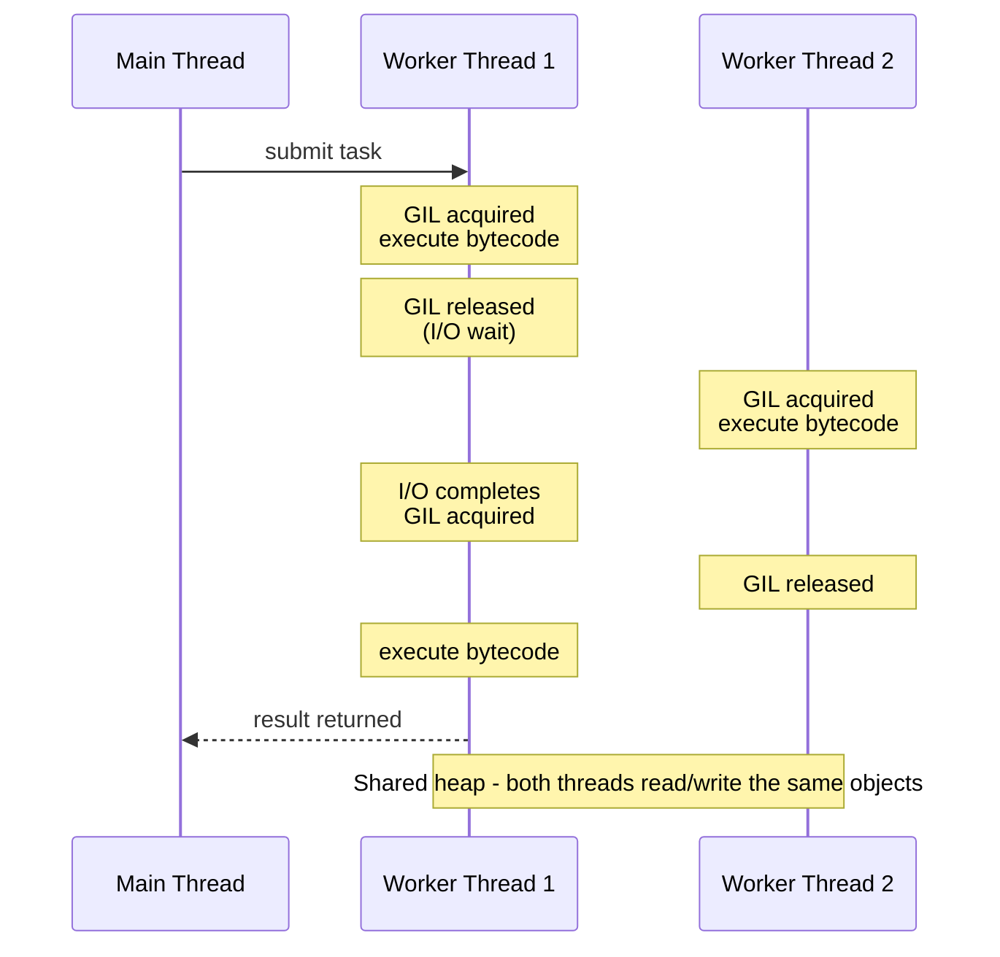
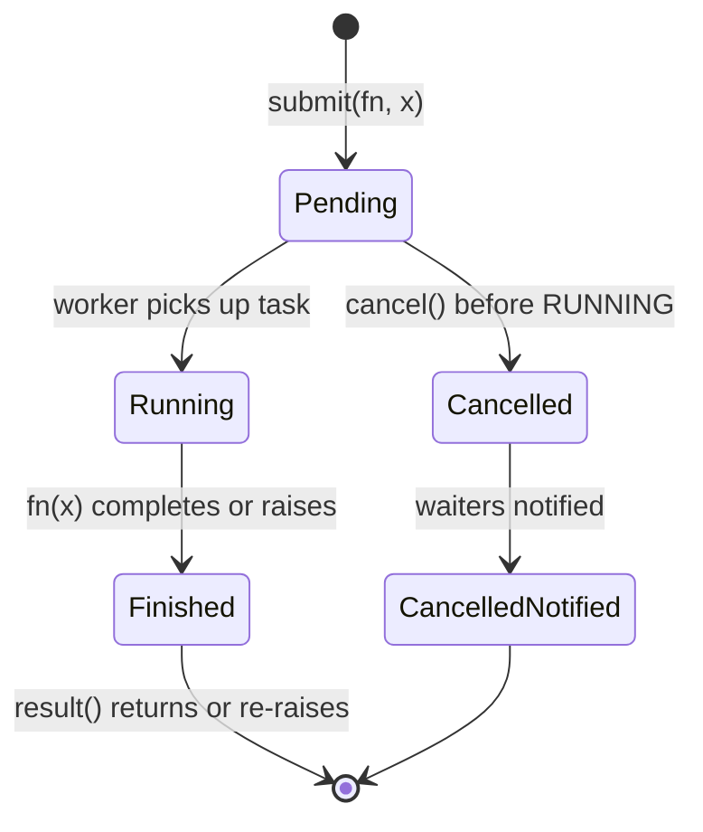
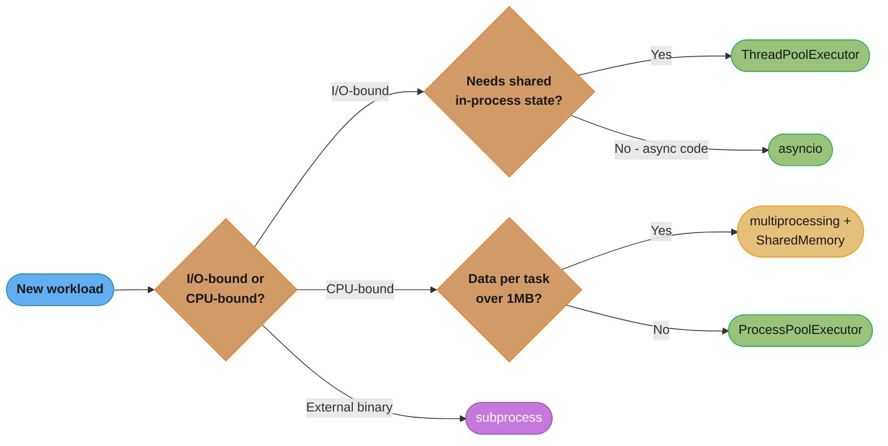
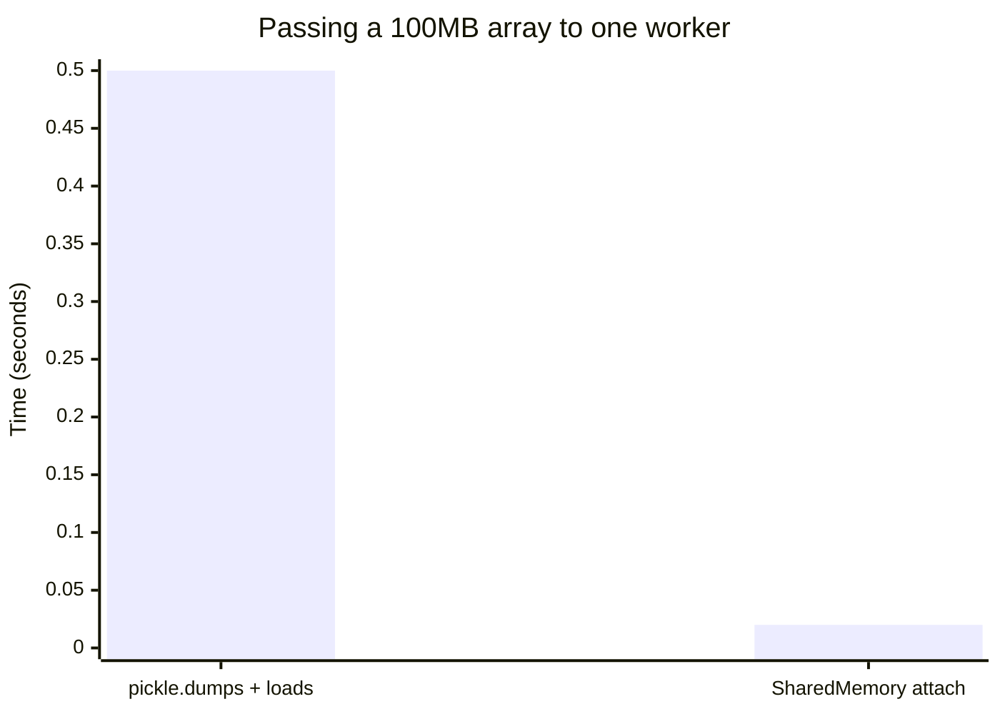
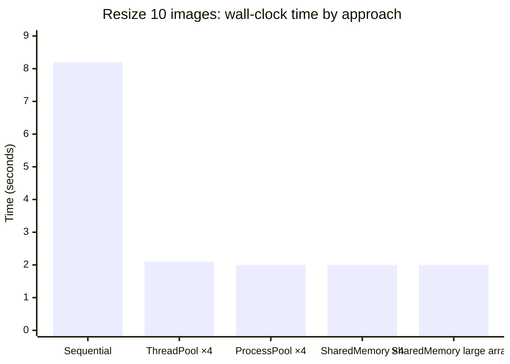

# Threading & Multiprocessing

---

## 1. Concept Overview

Python offers three distinct models for concurrent and parallel execution:

- **Threading** (`threading` module): multiple OS threads sharing the same CPython interpreter and memory space. The Global Interpreter Lock (GIL) allows only one thread to execute Python bytecode at a time, making threads suitable for I/O-bound work but not CPU-bound work.
- **Multiprocessing** (`multiprocessing` module): spawns separate OS processes, each with its own GIL and memory space. True parallelism for CPU-bound work. Communication requires pickling data across process boundaries.
- **`concurrent.futures`**: high-level executor abstraction over both models. `ThreadPoolExecutor` wraps threads; `ProcessPoolExecutor` wraps processes. Preferred for most application code.

Python 3.8 added `multiprocessing.shared_memory` for zero-copy shared buffers across processes. Python 3.12 introduced experimental free-threaded mode (no GIL) via `--disable-gil` build flag.

See `../the_gil_and_free_threading/README.md` for why multiprocessing outperforms threading for CPU-bound work.
See `../asyncio_and_event_loop/README.md` for the asyncio alternative to threading for I/O-bound concurrency.

---

## 2. Intuition

> A restaurant kitchen: threading is like multiple cooks sharing one knife — only one can chop at a time (the GIL), but they all use the same counter (shared memory). Multiprocessing is like opening three separate kitchens — each has its own knife and counter, so they truly work in parallel, but moving ingredients between kitchens (pickling) takes time.

**Mental model**: Threading saves latency by overlapping I/O waits. Multiprocessing saves wall-clock time by adding CPU cores.

**Why it matters**: A FastAPI service that calls a slow third-party API benefits from threading or asyncio — the thread releases the GIL during socket I/O. A service that processes large images or runs ML inference benefits from `ProcessPoolExecutor` — the GIL no longer blocks parallel computation.

**Key insight**: The GIL is not a flaw in the threading model — it is a deliberate CPython design that guarantees safe memory management at the cost of parallel CPU execution. Choosing between threading and multiprocessing is fundamentally a question of whether your bottleneck is I/O wait or CPU cycles.

---

## 3. Core Principles

**GIL behavior**: CPython's GIL is released during I/O operations (socket reads, file reads, `time.sleep`), C-extension computation (NumPy, Pillow JPEG decode), and subprocess calls. Python bytecode execution itself holds the GIL.

**Thread safety**: Shared mutable state across threads is unsafe unless protected by a synchronization primitive. The GIL does not make Python code thread-safe — it merely ensures individual bytecode instructions are atomic. A `+=` on a shared integer is NOT safe because it compiles to multiple bytecodes (LOAD, ADD, STORE).

**Pickling contract**: `multiprocessing` serializes all arguments and return values via `pickle`. Only picklable objects can cross process boundaries. Module-level functions, built-in types, and `functools.partial` are picklable. `lambda` functions, closures capturing local state, and file handles are not.

**Daemon threads**: A daemon thread is killed automatically when all non-daemon threads (including `main`) exit. Non-daemon threads keep the process alive until they finish. Default is `daemon=False`.

**Process creation cost**: On Linux, `fork()` is cheap (copy-on-write). On macOS (Python 3.8+) and Windows, the default start method is `spawn` — it imports the entire module from scratch, adding ~0.1–0.3s startup overhead per process.

---

## 4. Types / Architectures / Strategies

| Strategy | Module | GIL Released? | Shared Memory? | Best For |
|---|---|---|---|---|
| `threading.Thread` | `threading` | During I/O / C extensions | Yes (risky) | I/O-bound, callbacks |
| `ThreadPoolExecutor` | `concurrent.futures` | During I/O / C extensions | Yes (risky) | I/O-bound pool |
| `multiprocessing.Pool` | `multiprocessing` | N/A (separate GIL) | No (pickle) | CPU-bound batch |
| `ProcessPoolExecutor` | `concurrent.futures` | N/A (separate GIL) | No (pickle) | CPU-bound pool |
| `SharedMemory` | `multiprocessing.shared_memory` | N/A | Yes (raw bytes) | Large data CPU-bound |
| `subprocess` | `subprocess` | Yes | No (pipes/files) | External programs |

**Thread pool sizing heuristics**:
- I/O-bound: `max_workers = min(32, os.cpu_count() + 4)` (Python default for `ThreadPoolExecutor`)
- CPU-bound: `max_workers = os.cpu_count()` — one process per physical core
- Database connection pools: match `max_workers` to your DB connection pool size (typically 10–20)

---

## 5. Architecture Diagrams

**Threading — shared memory, serialized bytecode**:



**Multiprocessing — separate heaps, data crosses via pickle**:

```mermaid
sequenceDiagram
    participant M as Main Process
    participant W1 as Worker Process 1
    participant W2 as Worker Process 2

    M->>W1: pickle(args)
    M->>W2: pickle(args)
    Note over W1: own GIL<br/>execute(args)
    Note over W2: own GIL<br/>execute(args)
    W1-->>M: pickle(result)
    W2-->>M: pickle(result)
    Note over M,W2: Separate heaps - no sharing; each process runs a full Python interpreter
```

**`concurrent.futures` state machine**:



**`queue.Queue` internal structure**:


**Choosing a concurrency model**:



*Synthesizes the decision criteria from Sections 3, 4, and 9 into one path: I/O-bound work stays on threads (or `asyncio` for async codebases); CPU-bound work moves to processes, and once a task's data exceeds ~1 MB the ~0.5s/100MB pickle cost (Section 6.8) tips the choice toward `SharedMemory`.*

---

## 6. How It Works — Detailed Mechanics

### 6.1 `threading.Thread`

```python
import threading
import time
from typing import Any

def fetch_url(url: str, results: list[str], index: int) -> None:
    # Simulates I/O; GIL is released during actual socket I/O
    time.sleep(0.1)
    results[index] = f"response from {url}"

def run_parallel_fetch(urls: list[str]) -> list[str]:
    results: list[str] = [""] * len(urls)
    threads: list[threading.Thread] = []

    for i, url in enumerate(urls):
        t = threading.Thread(
            target=fetch_url,
            args=(url, results, i),
            daemon=True,          # killed if main exits unexpectedly
            name=f"fetcher-{i}",
        )
        threads.append(t)
        t.start()

    for t in threads:
        t.join(timeout=5.0)     # wait at most 5 s per thread

    return results

# Introspection
print(threading.current_thread().name)   # MainThread
print(len(threading.enumerate()))        # count of live threads
```

### 6.2 Synchronization Primitives

**Lock — mutual exclusion**:

```python
import threading

_counter = 0
_lock = threading.Lock()

def increment(n: int) -> None:
    global _counter
    for _ in range(n):
        with _lock:              # equivalent to _lock.acquire() / _lock.release()
            _counter += 1

# Non-blocking acquire with timeout:
acquired = _lock.acquire(blocking=True, timeout=1.0)
if acquired:
    try:
        ...
    finally:
        _lock.release()
```

**RLock — reentrant lock**:

```python
import threading

class SafeCounter:
    def __init__(self) -> None:
        self._lock = threading.RLock()   # NOT threading.Lock — see pitfall below
        self._value = 0

    def increment(self) -> None:
        with self._lock:
            self._value += 1
            self._log()          # calls another method that also acquires the lock

    def _log(self) -> None:
        with self._lock:         # RLock: same thread re-acquires without deadlocking
            print(f"value={self._value}")

# With threading.Lock(), the nested with _lock: would deadlock.
```

**Semaphore — limit concurrent access**:

```python
import threading
import time

_pool_semaphore = threading.Semaphore(5)   # max 5 concurrent DB connections

def query_db(query: str) -> str:
    with _pool_semaphore:       # blocks if 5 others already inside
        time.sleep(0.05)        # simulate DB call
        return f"result for {query}"
```

**Event — signal between threads**:

```python
import threading

_ready = threading.Event()

def producer() -> None:
    time.sleep(1.0)
    _ready.set()           # unblock all waiters

def consumer() -> None:
    _ready.wait(timeout=5.0)   # blocks until set() or timeout
    if _ready.is_set():
        print("producer signaled ready")
    _ready.clear()             # reset for reuse
```

**Condition — wait for a predicate**:

```python
import threading
import queue

_cond = threading.Condition()
_buffer: list[int] = []

def consumer() -> None:
    with _cond:
        _cond.wait_for(lambda: len(_buffer) > 0)   # atomically releases lock and waits
        item = _buffer.pop(0)
    print(f"consumed {item}")

def producer(item: int) -> None:
    with _cond:
        _buffer.append(item)
        _cond.notify()         # wake one waiter; notify_all() wakes all
```

**Barrier — synchronize N threads at a checkpoint**:

```python
import threading

_barrier = threading.Barrier(3)   # wait for all 3 threads

def worker(worker_id: int) -> None:
    print(f"worker {worker_id} reached barrier")
    _barrier.wait()               # all 3 must reach here before any proceeds
    print(f"worker {worker_id} proceeding")
```

### 6.3 Thread-Local Storage

```python
import threading
from typing import Optional

_local = threading.local()

def set_request_id(request_id: str) -> None:
    _local.request_id = request_id

def get_request_id() -> Optional[str]:
    return getattr(_local, "request_id", None)

# FastAPI middleware pattern using thread-local for synchronous code:
def middleware_set_context(request_id: str) -> None:
    _local.request_id = request_id
    _local.db_session = None      # each thread gets its own session

# SQLAlchemy scoped_session uses threading.local internally to bind
# one Session object per thread.
```

### 6.4 `queue.Queue` — Thread-Safe Communication

```python
import queue
import threading
from typing import Any

def worker(q: queue.Queue[Any]) -> None:
    while True:
        try:
            item = q.get(block=True, timeout=1.0)
        except queue.Empty:
            break
        process(item)
        q.task_done()      # signal that this item is processed

def process(item: Any) -> None:
    pass

def run_worker_pool(items: list[Any], num_workers: int = 4) -> None:
    q: queue.Queue[Any] = queue.Queue(maxsize=100)   # bounded to prevent OOM

    threads = [threading.Thread(target=worker, args=(q,), daemon=True)
               for _ in range(num_workers)]
    for t in threads:
        t.start()

    for item in items:
        q.put(item)         # blocks if maxsize reached — applies backpressure

    q.join()                # blocks until all task_done() calls match put() calls

# Variants:
# queue.LifoQueue()     — LIFO (stack), useful for depth-first work
# queue.PriorityQueue() — min-heap; items must be comparable tuples (priority, item)
```

### 6.5 `concurrent.futures.ThreadPoolExecutor`

```python
from concurrent.futures import ThreadPoolExecutor, as_completed, Future
import requests

def fetch(url: str) -> str:
    return requests.get(url, timeout=10).text

def fetch_all(urls: list[str]) -> list[str]:
    results: list[str] = []

    with ThreadPoolExecutor(max_workers=10) as executor:
        # submit() returns Future immediately
        future_to_url: dict[Future[str], str] = {
            executor.submit(fetch, url): url for url in urls
        }

        for future in as_completed(future_to_url):   # yields as each finishes
            url = future_to_url[future]
            try:
                results.append(future.result())
            except Exception as exc:
                print(f"{url} raised {exc}")

    return results

# Simple map — blocks until all complete, preserves order:
def fetch_all_ordered(urls: list[str]) -> list[str]:
    with ThreadPoolExecutor(max_workers=10) as executor:
        return list(executor.map(fetch, urls, timeout=30))
```

### 6.6 `multiprocessing.Pool`

```python
from multiprocessing import Pool
import os

def resize_image(args: tuple[str, int, int]) -> str:
    """Module-level function — required for pickling."""
    path, width, height = args
    # Pillow work here...
    return f"resized:{path}"

def process_images(paths: list[str]) -> list[str]:
    num_workers = os.cpu_count() or 4
    with Pool(processes=num_workers) as pool:
        # map: blocks until all done, loads all results into memory
        results = pool.map(resize_image, [(p, 800, 600) for p in paths])

        # starmap: unpack tuple args automatically
        results2 = pool.starmap(resize_image, [(p, 800, 600) for p in paths])

        # imap: lazy iterator, lower memory for large datasets
        for result in pool.imap(resize_image, [(p, 800, 600) for p in paths], chunksize=10):
            print(result)

        # apply_async: fire-and-forget, returns AsyncResult
        ar = pool.apply_async(resize_image, args=(("img.jpg", 800, 600),))
        result3 = ar.get(timeout=10)

    return results
```

### 6.7 Shared Memory (Python 3.8+)

```python
from multiprocessing import shared_memory, Process
import numpy as np

def worker_shared(shm_name: str, shape: tuple[int, ...], dtype: str) -> None:
    """Attach to existing shared memory — no data copy."""
    existing_shm = shared_memory.SharedMemory(name=shm_name)
    array = np.ndarray(shape, dtype=dtype, buffer=existing_shm.buf)
    array[:] = array * 2        # modify in-place, main process sees it
    existing_shm.close()

def demonstrate_shared_memory() -> None:
    data = np.array([1.0, 2.0, 3.0, 4.0], dtype=np.float64)
    shm = shared_memory.SharedMemory(create=True, size=data.nbytes)

    shared_array = np.ndarray(data.shape, dtype=data.dtype, buffer=shm.buf)
    shared_array[:] = data      # copy once into shared memory

    p = Process(target=worker_shared, args=(shm.name, data.shape, str(data.dtype)))
    p.start()
    p.join()

    print(shared_array)         # [2. 4. 6. 8.] — modified by worker without pickling

    shm.close()
    shm.unlink()                # must unlink to free OS shared memory

# Value and Array — simpler typed shared memory:
from multiprocessing import Value, Array

def counter_demo() -> None:
    counter = Value('i', 0)        # 'i' = signed int; has built-in lock
    arr = Array('d', range(10))    # 'd' = double; also has built-in lock

    def increment() -> None:
        for _ in range(1000):
            with counter.get_lock():
                counter.value += 1

    procs = [Process(target=increment) for _ in range(4)]
    for p in procs:
        p.start()
    for p in procs:
        p.join()

    print(counter.value)    # 4000
```

### 6.8 Pickling Cost — Concrete Numbers

```python
import pickle
import numpy as np
import time

# 100 MB float64 array
arr = np.random.rand(12_500_000)   # 100 MB

start = time.perf_counter()
data = pickle.dumps(arr)
loaded = pickle.loads(data)
elapsed = time.perf_counter() - start
print(f"Pickle 100MB array: {elapsed:.3f}s")   # ~0.5s — significant overhead

# Shared memory: effectively 0s for the worker — only one copy in kernel memory
# Rule: if passing > 1 MB to a subprocess, prefer SharedMemory or mmap
```

**Pickle vs shared memory — the 100 MB transfer cost**:



*Pickling round-trips the full 100 MB through serialization (about 0.5s); attaching to an existing `SharedMemory` buffer costs only one kernel-level copy, effectively 0s. This gap is why the rule above switches to `SharedMemory` once a task's data passes 1 MB.*

---

## 7. Real-World Examples

**FastAPI background CPU task using ProcessPoolExecutor**:

```python
from concurrent.futures import ProcessPoolExecutor
from fastapi import FastAPI, BackgroundTasks
import asyncio

_cpu_executor = ProcessPoolExecutor(max_workers=4)
app = FastAPI()

def heavy_computation(data: list[float]) -> float:
    return sum(x ** 2 for x in data)

@app.post("/compute")
async def compute(data: list[float]) -> dict[str, float]:
    loop = asyncio.get_event_loop()
    result = await loop.run_in_executor(_cpu_executor, heavy_computation, data)
    return {"result": result}
```

**Thread-safe request-ID propagation in FastAPI**:

```python
import threading
from fastapi import FastAPI, Request
from starlette.middleware.base import BaseHTTPMiddleware
import uuid

_request_local = threading.local()
app = FastAPI()

class RequestIDMiddleware(BaseHTTPMiddleware):
    async def dispatch(self, request: Request, call_next):
        _request_local.request_id = request.headers.get("X-Request-ID", str(uuid.uuid4()))
        response = await call_next(request)
        response.headers["X-Request-ID"] = _request_local.request_id
        return response

def get_current_request_id() -> str:
    return getattr(_request_local, "request_id", "unknown")

app.add_middleware(RequestIDMiddleware)
```

**Subprocess for external programs**:

```python
import subprocess
import shlex

def run_ffmpeg(input_path: str, output_path: str) -> tuple[int, str, str]:
    cmd = f"ffmpeg -i {shlex.quote(input_path)} -vcodec libx264 {shlex.quote(output_path)}"
    proc = subprocess.run(
        shlex.split(cmd),
        capture_output=True,
        text=True,
        timeout=300,
    )
    return proc.returncode, proc.stdout, proc.stderr
```

---

## 8. Tradeoffs

| Dimension | `threading` | `multiprocessing` | `asyncio` |
|---|---|---|---|
| CPU-bound speedup | None (GIL) | Linear with cores | None |
| I/O-bound speedup | Yes | Yes (overkill) | Yes (best) |
| Memory overhead | ~8 MB per thread | ~30 MB per process | ~few KB per coroutine |
| Shared state | Easy but risky | Hard (pickle / SharedMemory) | Easy (single thread) |
| Startup cost | ~1 ms | ~100–300 ms (spawn) | Negligible |
| Debugging | Hard (race conditions) | Hard (IPC) | Medium (traceable) |
| GIL interaction | Blocked for bytecode | Independent GIL | Single GIL, coop yield |
| Best use case | I/O-bound + legacy sync | CPU-bound batch | I/O-bound async |

**`Pool.map` vs `Pool.imap`**:

| | `map` | `imap` |
|---|---|---|
| Returns | `list` (all at once) | Iterator (lazy) |
| Memory | Loads all results | Streams one at a time |
| Ordering | Preserved | Preserved (`imap`) or not (`imap_unordered`) |
| Use case | Small datasets | Large / streaming datasets |

---

## 9. When to Use / When NOT to Use

**Use `threading.Thread` / `ThreadPoolExecutor` when**:
- Work is I/O-bound: HTTP calls, DB queries, file reads
- You need shared in-process state across tasks
- Task count is high and you want to avoid process spawn overhead
- You are wrapping C extensions that release the GIL (Pillow, lxml, NumPy I/O)

**Use `multiprocessing.Pool` / `ProcessPoolExecutor` when**:
- Work is CPU-bound: image processing, ML inference, compression
- Each task is independent and can be serialized via pickle
- You need true parallelism across multiple CPU cores
- Data per task is small enough that pickle overhead is acceptable (< 1 MB)

**Use `multiprocessing.shared_memory` when**:
- Data per task exceeds 1 MB (NumPy arrays, large buffers)
- You need zero-copy access from multiple processes
- Multiple workers need to read the same large read-only dataset

**Use `subprocess` when**:
- You need to run an external binary (ffmpeg, git, pandoc)
- The tool is a separate process with its own lifecycle
- Communication is via stdin/stdout/files rather than Python objects

**Do NOT use**:
- `threading` for CPU-bound work — GIL negates any parallelism gain
- `multiprocessing` for I/O-bound work in async FastAPI — asyncio handles it more efficiently
- Bare `threading.Thread` when `ThreadPoolExecutor` suffices — manual thread management is error-prone
- `Pool.map` with very large lists when `Pool.imap` would avoid loading all results into memory

---

## 10. Common Pitfalls

### Pitfall 1: Daemon Thread Without Cleanup

```python
# BROKEN: daemon=True on a thread that must complete before exit
import threading
import atexit

def flush_metrics() -> None:
    import time
    time.sleep(2.0)
    print("metrics flushed")   # may never print — daemon killed when main exits

t = threading.Thread(target=flush_metrics, daemon=True)  # BROKEN: daemon=True
t.start()
# main exits immediately, daemon thread killed before sleep(2.0) completes
```

```python
# FIX: daemon=False with explicit join registered via atexit
import threading
import atexit

_cleanup_thread: threading.Thread | None = None

def flush_metrics() -> None:
    import time
    time.sleep(2.0)
    print("metrics flushed")   # always prints

def _join_cleanup() -> None:
    if _cleanup_thread is not None:
        _cleanup_thread.join(timeout=10.0)

_cleanup_thread = threading.Thread(target=flush_metrics, daemon=False)  # FIX
atexit.register(_join_cleanup)   # guaranteed to run before interpreter exit
_cleanup_thread.start()
```

### Pitfall 2: `lambda` Passed to `multiprocessing.Pool`

```python
# BROKEN: lambda is not picklable — PicklingError at runtime
from multiprocessing import Pool

data = [1, 2, 3, 4, 5]

with Pool(processes=4) as pool:
    results = pool.map(lambda x: x ** 2, data)   # BROKEN: PicklingError
# AttributeError: Can't pickle local object '<lambda>'
```

```python
# FIX 1: module-level function
from multiprocessing import Pool

def square(x: int) -> int:       # module-level — picklable
    return x ** 2

with Pool(processes=4) as pool:
    results = pool.map(square, [1, 2, 3, 4, 5])   # FIX: works correctly

# FIX 2: functools.partial for parameterized functions
from multiprocessing import Pool
import functools

def power(x: int, exp: int) -> int:
    return x ** exp

cube = functools.partial(power, exp=3)   # partial is picklable

with Pool(processes=4) as pool:
    results = pool.map(cube, [1, 2, 3, 4, 5])
```

### Pitfall 3: Race Condition on Shared Mutable State

```python
# BROKEN: appending to a shared list from multiple threads — data loss
import threading

shared_results: list[int] = []

def worker(value: int) -> None:
    # list.append is NOT guaranteed atomic in all CPython contexts
    # and is certainly not safe in free-threaded Python 3.13+
    shared_results.append(value)   # BROKEN: race condition

threads = [threading.Thread(target=worker, args=(i,)) for i in range(1000)]
for t in threads:
    t.start()
for t in threads:
    t.join()

print(len(shared_results))   # may be less than 1000 — items lost
```

```python
# FIX 1: use threading.Lock
import threading

shared_results: list[int] = []
_lock = threading.Lock()

def worker(value: int) -> None:
    with _lock:
        shared_results.append(value)   # FIX: atomic under lock

# FIX 2: use queue.Queue (preferred for producer-consumer patterns)
import threading
import queue

result_queue: queue.Queue[int] = queue.Queue()

def worker(value: int) -> None:
    result_queue.put(value)   # thread-safe, no explicit lock needed

threads = [threading.Thread(target=worker, args=(i,)) for i in range(1000)]
for t in threads:
    t.start()
for t in threads:
    t.join()

results = list(result_queue.queue)
print(len(results))   # always 1000
```

### Pitfall 4: Deadlock from Lock Ordering

```python
# BROKEN: thread A acquires lock1 then lock2; thread B acquires lock2 then lock1
import threading

lock1 = threading.Lock()
lock2 = threading.Lock()

def thread_a() -> None:
    with lock1:
        with lock2:   # BROKEN: waits for lock2 while holding lock1
            pass

def thread_b() -> None:
    with lock2:
        with lock1:   # BROKEN: waits for lock1 while holding lock2
            pass

# Fix: always acquire locks in a consistent global order
# or use threading.RLock with timeout + retry
```

---

## 11. Technologies & Tools

| Tool | Type | GIL? | Best For | Limitation |
|---|---|---|---|---|
| `threading.Thread` | Thread | Yes | I/O-bound tasks | No CPU parallelism |
| `ThreadPoolExecutor` | Thread pool | Yes | I/O-bound pools | No CPU parallelism |
| `multiprocessing.Pool` | Process pool | No | CPU-bound batch | Pickle overhead |
| `ProcessPoolExecutor` | Process pool | No | CPU-bound with futures | Pickle overhead |
| `multiprocessing.shared_memory` | IPC | No | Large NumPy arrays | Manual lifecycle |
| `multiprocessing.Value/Array` | IPC | No | Simple typed counters | Fixed size |
| `queue.Queue` | In-process | Yes | Thread-safe communication | Single process only |
| `multiprocessing.Queue` | IPC | No | Cross-process queues | Pickle overhead |
| `subprocess` | External proc | Released | Shell commands, binaries | No Python sharing |
| `Ray` | Distributed | No | Multi-machine parallelism | Heavy dependency |
| `Dask` | Parallel DataFrame | No | Large data / ML pipelines | Setup complexity |

---

## 12. Interview Questions with Answers

**Q1: What is the GIL and how does it affect threading vs multiprocessing?**
The GIL (Global Interpreter Lock) is a mutex in CPython that allows only one thread to execute Python bytecode at a time. For I/O-bound work, threads still provide speedup because the GIL is released during blocking I/O system calls. For CPU-bound work, threads offer no parallelism — only multiprocessing bypasses the GIL by running separate interpreter instances in separate OS processes. If your profiling shows > 80% CPU time with < 20% I/O wait, choose `ProcessPoolExecutor`.

**Q2: When should you use `ThreadPoolExecutor` over `ProcessPoolExecutor`?**
Use `ThreadPoolExecutor` for I/O-bound work (HTTP calls, database queries, file reads) where threads spend most of their time waiting on system calls and the GIL is released. Use `ProcessPoolExecutor` for CPU-bound work (image processing, compression, ML inference) where Python bytecode execution is the bottleneck. `ThreadPoolExecutor` starts in < 1 ms per task; `ProcessPoolExecutor` pays a ~100–300 ms spawn overhead but achieves true CPU parallelism.

**Q3: What is a deadlock and how do you avoid it?**
A deadlock occurs when two or more threads are each waiting for a lock held by another, creating a circular dependency where none can proceed. To avoid deadlocks: (1) always acquire multiple locks in a consistent global order, (2) use `lock.acquire(timeout=...)` with retry logic, (3) use `threading.RLock` when the same thread needs to re-acquire a lock, and (4) prefer higher-level abstractions like `queue.Queue` that eliminate explicit lock management.

**Q4: What is a race condition and how do you detect one?**
A race condition occurs when the outcome depends on the non-deterministic scheduling order of threads. Example: two threads read `x = 0`, both increment to `1`, both write `x = 1` — one increment is lost. Detection methods: (1) Python's `threading.settrace` or the `racedetector` mode in PyPy, (2) deliberately introduce `time.sleep(0)` in critical sections to increase scheduling probability, (3) use stress testing with `ThreadSanitizer` via CPython debug builds, (4) audit all shared mutable state access.

**Q5: Why is `lambda` not picklable for `multiprocessing.Pool`?**
`pickle` serializes objects by reference — it stores the module path and qualified name of a callable, then reconstructs it in the worker process by importing that name. `lambda` functions are anonymous and have no qualified name in any module, so `pickle` cannot store a reference to them. Module-level named functions work because workers can `import module; getattr(module, "function_name")`. `functools.partial` wraps a picklable function with bound arguments and is itself picklable.

**Q6: What is thread-local storage and when should you use it in FastAPI?**
Thread-local storage (`threading.local()`) gives each thread its own independent copy of a variable — reads and writes in thread A do not affect thread B's view. Use it when: (1) synchronous FastAPI endpoints run in a thread pool and each request needs its own context (request ID, database session), (2) wrapping thread-unsafe libraries that have per-thread state (SQLAlchemy scoped sessions). For async FastAPI handlers, prefer `contextvars.ContextVar` instead — `threading.local` does not propagate across `await` boundaries.

**Q7: How does `queue.Queue` achieve thread safety?**
`queue.Queue` internally uses a `collections.deque` protected by a `threading.Condition` (which wraps a `threading.Lock`). `put()` acquires the lock, appends to the deque, and calls `notify()` to wake a waiting consumer. `get()` acquires the lock, calls `wait()` if the deque is empty (atomically releasing the lock), and pops once notified. The `task_done()` / `join()` mechanism uses a separate `Condition` and a pending-tasks counter to block `join()` until all items are processed.

**Q8: What is the difference between `Pool.map` and `Pool.imap`?**
`Pool.map(fn, iterable)` converts the iterable to a list upfront, distributes chunks to workers, waits for all results, and returns a fully materialized list — suitable for small to medium datasets where all results fit in memory. `Pool.imap(fn, iterable, chunksize=1)` returns an iterator that yields results lazily as they complete, preserving order. `Pool.imap_unordered` yields results as soon as any worker finishes, ignoring order — fastest for heterogeneous task durations. For a 10 GB dataset, `imap` avoids loading 10 GB into memory simultaneously.

**Q9: How does `multiprocessing.shared_memory` differ from `multiprocessing.Value`?**
`multiprocessing.Value('i', 0)` provides a single typed C value (int, float, etc.) backed by shared memory, with a built-in `RLock` for safe concurrent access. It is limited to primitive types and fixed size. `multiprocessing.shared_memory.SharedMemory` creates a raw bytes buffer of arbitrary size in OS shared memory, accessible via `memoryview`. Combined with NumPy, it enables zero-copy sharing of large arrays — a 100 MB NumPy array takes ~0s to "pass" to a worker via shared memory vs ~0.5s via pickle. `SharedMemory` requires explicit `close()` and `unlink()` lifecycle management.

**Q10: What is `concurrent.futures.as_completed` and when do you use it?**
`as_completed(futures)` returns an iterator that yields `Future` objects in the order they complete — not the order they were submitted. Use it when: (1) you want to process results as soon as they arrive (streaming dashboard), (2) tasks have variable duration and you don't want fast tasks to wait for slow ones, (3) you need early termination on first error. In contrast, `executor.map()` preserves submission order by buffering completed results until their turn.

**Q11: How do you safely pass large NumPy arrays to worker processes?**
Option 1: `multiprocessing.shared_memory.SharedMemory` — write array into shared buffer once, pass only the `shm.name` string to workers, reconstruct with `np.ndarray(..., buffer=shm.buf)`. Zero-copy for reads; coordination needed for writes. Option 2: memory-mapped files (`np.memmap`) — workers open the same file path, OS page cache handles sharing. Good for read-only datasets. Option 3: pickle (default) — avoid for arrays > 1 MB due to ~0.5s/100 MB overhead. Rule of thumb: if worker startup time (0.1–0.3s) exceeds pickle time for your array size, SharedMemory is worth the complexity.

**Q12: What happens if a worker process in `ProcessPoolExecutor` raises an exception?**
The exception is caught in the worker, pickled, and sent back to the main process. When you call `future.result()`, the exception is re-raised in the main thread. If the worker crashes hard (segfault, OOM kill), the future raises `concurrent.futures.process.BrokenProcessPool`. You should catch `Exception` from `future.result()` individually per future, and wrap the entire executor in a try/finally to ensure `executor.shutdown(wait=True)` is called (the context manager does this automatically).

**Q13: How does `threading.Barrier` work and what is it useful for?**
`threading.Barrier(n)` provides a synchronization point where exactly `n` threads must call `barrier.wait()` before any of them proceeds past it. Each call decrements an internal counter; when it reaches zero, all waiting threads are released simultaneously. Useful for: parallel test setup (all workers must finish initialization before any starts the actual load), phased parallel algorithms (all workers complete phase 1 before any starts phase 2), and tournament-style parallel benchmarks.

**Q14: When would you choose `subprocess` over `multiprocessing`?**
Choose `subprocess` when: (1) running external binaries that are not Python (ffmpeg, git, curl, pandoc), (2) the tool has its own memory management and you just need its output, (3) you need shell piping or redirection, (4) you want to run system commands for orchestration. Choose `multiprocessing` when: (1) running Python functions in parallel, (2) you need to pass Python objects (not just strings) efficiently, (3) you need shared memory or `Value`/`Array`. `subprocess` has lower overhead for invoking external tools and avoids the Python object serialization problem entirely.

**Q15: How does the `multiprocessing` start method affect behavior on macOS and Windows?**
Python 3.8+ changed the default start method on macOS from `fork` to `spawn`. `fork` duplicates the parent process memory (cheap, copy-on-write) but can cause deadlocks in forked processes that inherited lock state from the parent — particularly with Objective-C frameworks on macOS. `spawn` starts a fresh Python interpreter and re-imports the main module (adds ~0.1–0.3s per worker but is safe). Windows only supports `spawn`. Use `if __name__ == "__main__":` guard on Windows/macOS to prevent recursive spawning. `forkserver` is a third option: one fork server holds a clean state and forks from it.

---

## 13. Best Practices

1. **Prefer `concurrent.futures` over raw threads/processes**: `ThreadPoolExecutor` and `ProcessPoolExecutor` provide lifecycle management, exception propagation, and `Future` handles. Raw `Thread` is appropriate only when you need fine-grained control (daemon status, custom join logic).

2. **Size thread pools to match the bottleneck**: For DB-bound work, match `max_workers` to your connection pool size (typically 10–20). For pure I/O, `min(32, cpu_count + 4)` is the Python default. For CPU-bound, set `max_workers = cpu_count`.

3. **Use `queue.Queue` for producer-consumer, not shared lists**: `Queue` eliminates explicit lock management and handles backpressure via `maxsize`. Always call `task_done()` after processing to enable `q.join()`.

4. **Set `daemon=True` only for threads that can be safely abandoned**: Worker threads that flush logs, persist metrics, or hold database connections must be `daemon=False` with explicit `join()` registered via `atexit.register()`.

5. **Always write module-level functions for `multiprocessing`**: Functions passed to `Pool.map` must be picklable. Use `functools.partial` for parameterization. Never use `lambda` or closures.

6. **Call `shm.unlink()` exactly once per `SharedMemory` object**: `close()` detaches the mapping; `unlink()` deletes the OS shared memory segment. Forgetting `unlink()` leaks kernel resources (visible in `/dev/shm` on Linux). Use a `try/finally` block.

7. **Protect `multiprocessing.Value` with its lock**: `Value` has a `get_lock()` method returning a `Lock`-like object. Always use `with counter.get_lock(): counter.value += 1` — the lock is not acquired automatically.

8. **Prefer `asyncio` over threading for new FastAPI I/O work**: `async def` endpoints in FastAPI run on the event loop without threads. Reserve threads for legacy sync libraries that cannot be made async. Use `asyncio.get_event_loop().run_in_executor(_cpu_executor, fn, arg)` to offload CPU work from an async handler.

9. **Profile before parallelizing**: Use `cProfile` or `py-spy` to confirm your bottleneck. Threading helps I/O-bound code only when the GIL is actually released. A task that holds the GIL 95% of the time gains nothing from 16 threads.

10. **Use `concurrent.futures.as_completed` with timeouts for fault-tolerant pipelines**: `future.result(timeout=30)` raises `TimeoutError` rather than hanging. Cancel futures before shutdown: `for f in pending_futures: f.cancel()`.

---

## 14. Case Study

### Parallel Image Resizing Service

**Scenario**: A media platform needs to resize 10 uploaded JPEG images (average 8 MB each, 4000×3000 px) to 800×600 px thumbnails. We benchmark four approaches to select the production strategy.

**Setup**:

```python
# BROKEN: lambda passed to Pool — PicklingError
from multiprocessing import Pool
from pathlib import Path

image_paths = [f"/images/img_{i}.jpg" for i in range(10)]

with Pool(processes=4) as pool:
    # lambda is not picklable — raises AttributeError at runtime
    results = pool.map(
        lambda path: resize_to_thumbnail(path, width=800, height=600),   # BROKEN
        image_paths
    )
# AttributeError: Can't pickle local object '<lambda>'
```

```python
# FIX: module-level function
from multiprocessing import Pool
from concurrent.futures import ThreadPoolExecutor, ProcessPoolExecutor, as_completed
from multiprocessing import shared_memory
import numpy as np
from PIL import Image
import time
import os
from pathlib import Path

# Module-level — picklable
def resize_image_file(path: str, width: int = 800, height: int = 600) -> str:
    """Resize a JPEG and save; returns output path."""
    img = Image.open(path)
    img.thumbnail((width, height), Image.LANCZOS)
    out_path = path.replace(".jpg", "_thumb.jpg")
    img.save(out_path, "JPEG", quality=85)
    return out_path

def resize_and_return_array(path: str, width: int = 800, height: int = 600) -> bytes:
    """Return resized image as raw bytes (for pickling comparison)."""
    img = Image.open(path)
    img.thumbnail((width, height), Image.LANCZOS)
    arr = np.array(img)
    return arr.tobytes()   # pickle this across process boundary

def resize_into_shared(shm_name: str, slot: int, path: str, width: int = 800, height: int = 600) -> None:
    """Write resized image array directly into shared memory slot."""
    existing_shm = shared_memory.SharedMemory(name=shm_name)
    img = Image.open(path)
    img.thumbnail((width, height), Image.LANCZOS)
    arr = np.array(img, dtype=np.uint8)   # shape: (600, 800, 3)
    offset = slot * arr.nbytes
    np.copyto(
        np.ndarray(arr.shape, dtype=arr.dtype, buffer=existing_shm.buf, offset=offset),
        arr
    )
    existing_shm.close()
```

**Approach 1 — Sequential (baseline)**:

```python
def sequential_resize(paths: list[str]) -> float:
    start = time.perf_counter()
    for path in paths:
        resize_image_file(path)
    elapsed = time.perf_counter() - start
    print(f"Sequential: {elapsed:.2f}s for {len(paths)} images")
    return elapsed

# Result: 8.2s for 10 images @ ~0.82s per image
```

**Approach 2 — ThreadPoolExecutor (4 workers)**:

```python
def threaded_resize(paths: list[str]) -> float:
    start = time.perf_counter()
    with ThreadPoolExecutor(max_workers=4) as executor:
        futures = {executor.submit(resize_image_file, path): path for path in paths}
        for future in as_completed(futures):
            future.result()   # re-raise any exception
    elapsed = time.perf_counter() - start
    print(f"ThreadPoolExecutor (4 workers): {elapsed:.2f}s")
    return elapsed

# Result: 2.1s
# Why threads help here: Pillow releases the GIL during JPEG encode/decode
# (C extension). So 4 threads truly overlap JPEG I/O + C computation.
```

**Approach 3 — ProcessPoolExecutor (4 workers)**:

```python
def process_resize(paths: list[str]) -> float:
    start = time.perf_counter()
    with ProcessPoolExecutor(max_workers=4) as executor:
        list(executor.map(resize_image_file, paths))
    elapsed = time.perf_counter() - start
    print(f"ProcessPoolExecutor (4 workers): {elapsed:.2f}s")
    return elapsed

# Result: 2.0s
# Marginally faster than threading for this workload because process isolation
# avoids any GIL contention between threads during Python overhead portions.
# Spawn overhead (~0.3s) is amortized across 10 tasks.
```

**Approach 4 — Shared Memory (return large arrays without pickle)**:

```python
def shared_memory_resize(paths: list[str]) -> float:
    from multiprocessing import Pool

    n_images = len(paths)
    thumb_shape = (600, 800, 3)
    thumb_bytes = int(np.prod(thumb_shape))     # 1,440,000 bytes per image
    total_bytes = n_images * thumb_bytes

    # Allocate shared buffer for all thumbnails
    shm = shared_memory.SharedMemory(create=True, size=total_bytes)

    start = time.perf_counter()
    with Pool(processes=4) as pool:
        pool.starmap(
            resize_into_shared,
            [(shm.name, i, path) for i, path in enumerate(paths)]
        )
    elapsed = time.perf_counter() - start

    # Read all results from shared memory — zero-copy
    all_thumbs = np.ndarray((n_images, *thumb_shape), dtype=np.uint8, buffer=shm.buf)
    print(f"SharedMemory resize (4 procs): {elapsed:.2f}s, result shape={all_thumbs.shape}")

    shm.close()
    shm.unlink()
    return elapsed

# Result: 2.0s resize + ~0s for result retrieval (no pickle)
# vs ProcessPoolExecutor returning bytes: 2.0s resize + ~0.14s pickle overhead
# Pickle overhead: 10 images × 1.44 MB = 14.4 MB × ~10 MB/s pickle = 0.14s extra
# For 100 MB arrays per image, shared memory saves ~5s total.
```

**Benchmark Summary**:



*Threading and multiprocessing both land near 2.0s — a ~4× speedup over the 8.2s sequential baseline — because Pillow's JPEG codec releases the GIL; SharedMemory matches that compute time while also removing the pickle cost on the return path (Approach 4 above).*

**Production Decision**:

For JPEG resizing where images are written to disk: `ThreadPoolExecutor` at 4–8 workers is simplest and nearly as fast as multiprocessing. For in-memory array pipelines returning large NumPy results: `ProcessPoolExecutor` + `SharedMemory` eliminates pickle overhead and is the only option that scales to 100+ MB results without serialization cost.

```python
# Production FastAPI endpoint
from fastapi import FastAPI, UploadFile
from concurrent.futures import ThreadPoolExecutor
import asyncio

app = FastAPI()
_resize_pool = ThreadPoolExecutor(max_workers=8)

@app.post("/resize")
async def resize_uploaded(file: UploadFile) -> dict[str, str]:
    contents = await file.read()
    loop = asyncio.get_event_loop()
    # Offload blocking Pillow work to thread pool; event loop stays unblocked
    out_path = await loop.run_in_executor(
        _resize_pool,
        resize_image_file,
        f"/tmp/{file.filename}",
    )
    return {"output": out_path}
```

---

*See `../the_gil_and_free_threading/README.md` for why multiprocessing outperforms threading for CPU-bound work, including free-threaded Python 3.13 benchmarks.*

*See `../asyncio_and_event_loop/README.md` for the asyncio alternative to threading for I/O-bound concurrency, including `asyncio.TaskGroup` and structured concurrency patterns.*
