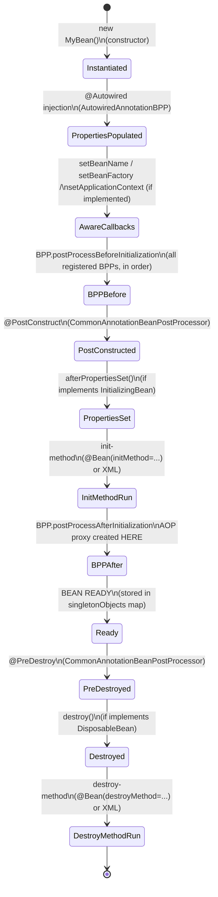
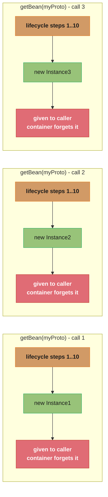
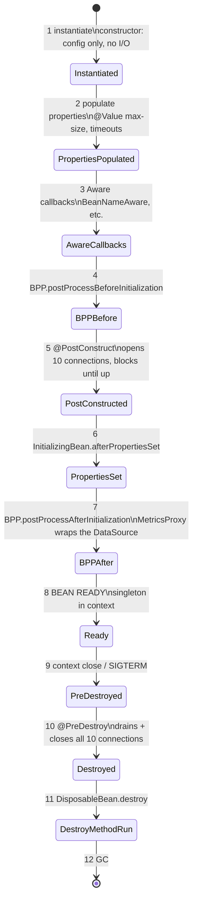

# Bean Lifecycle

## 1. Concept Overview

The Spring bean lifecycle is the complete sequence of events from when a bean is requested from the container through its creation, initialization, use, and eventual destruction. Understanding this lifecycle is essential for writing correct Spring code — most initialization bugs, circular dependency errors, and resource-leak issues trace back to misunderstanding when each lifecycle phase executes.

Spring provides multiple hook points at each phase, allowing beans and framework extensions to participate in the lifecycle.

---

## 2. Intuition

Think of a bean's lifecycle like hiring and onboarding an employee:
1. **Instantiation** — HR creates the hire record (object constructed)
2. **Property injection** — IT sets up equipment and access (dependencies injected)
3. **Awareness callbacks** — Employee gets told their manager's name and department (Aware interfaces)
4. **BeanPostProcessor.before** — Compliance check before first day (pre-init processing)
5. **@PostConstruct / init** — Employee attends orientation and setup tasks (initialization logic)
6. **BeanPostProcessor.after** — Manager wraps employee in a security escort proxy (post-init, AOP proxy creation)
7. **Ready** — Employee works (bean in use)
8. **@PreDestroy / destroy** — Employee does offboarding tasks (cleanup logic)

**Key insight:** AOP proxies are created in `postProcessAfterInitialization`. This means `@Transactional` and `@Cacheable` are applied AFTER your `@PostConstruct` runs — your init method runs on the raw bean, not the proxy.

---

## 3. Core Principles

1. **Instantiation before injection:** The constructor runs first, then dependencies are injected. Constructor injection combines these two phases.
2. **Aware interfaces are called before BeanPostProcessors:** `BeanNameAware`, `BeanFactoryAware`, `ApplicationContextAware` callbacks run after property injection but before any `BeanPostProcessor`.
3. **Multiple initialization mechanisms exist:** `@PostConstruct`, `InitializingBean.afterPropertiesSet()`, and `@Bean(initMethod=...)` are all valid. They execute in that order if all three are present.
4. **Prototype beans are not destroyed by the container:** Only singleton beans go through the destroy phase. The container creates prototype beans but does not track them — `@PreDestroy` never fires for prototypes.
5. **BeanPostProcessor applies to all other beans:** A `BeanPostProcessor` bean processes every other bean in the context (but not itself).

---

## 4. Types / Architectures / Strategies

### Complete Bean Lifecycle Sequence

```
1.  Instantiation            (constructor invoked)
2.  Populate Properties      (@Autowired fields and setters injected)
3.  BeanNameAware            (setBeanName(String name))
4.  BeanFactoryAware         (setBeanFactory(BeanFactory bf))
5.  ApplicationContextAware  (setApplicationContext(ApplicationContext ctx))
6.  BPP.postProcessBefore    (BeanPostProcessor.postProcessBeforeInitialization)
7.  @PostConstruct           (JSR-250 init annotation)
8.  InitializingBean         (afterPropertiesSet())
9.  init-method              (@Bean(initMethod="...") or XML init-method)
10. BPP.postProcessAfter     (BeanPostProcessor.postProcessAfterInitialization)
                             -> AOP proxy created HERE
11. READY                    (returned to callers)
--- destroy phase ---
12. @PreDestroy              (JSR-250 destroy annotation)
13. DisposableBean           (destroy())
14. destroy-method           (@Bean(destroyMethod="...") or XML destroy-method)
```

### Bean Scopes

| Scope | Lifecycle | Use Case | Container Manages Destroy? |
|-------|-----------|----------|---------------------------|
| `singleton` | One instance per ApplicationContext | Stateless services, repos | Yes |
| `prototype` | New instance per `getBean()` or injection | Stateful objects, per-request helpers | No |
| `request` | One per HTTP request | Web: request-scoped data (e.g., user context) | Yes (on request end) |
| `session` | One per HTTP session | Web: shopping cart, user preferences | Yes (on session end) |
| `application` | One per ServletContext | Web: app-wide shared state | Yes (on context destroy) |
| `websocket` | One per WebSocket session | WebSocket apps | Yes (on ws close) |

### BeanPostProcessor vs BeanFactoryPostProcessor

| Interface | Operates On | Runs When | Examples |
|-----------|-------------|-----------|---------|
| `BeanFactoryPostProcessor` | `BeanDefinition` metadata | After all BeanDefs loaded, before any bean created | `PropertySourcesPlaceholderConfigurer` |
| `BeanPostProcessor` | Bean instances | After construction + injection, before/after init | `AutowiredAnnotationBeanPostProcessor`, `AnnotationAwareAspectJAutoProxyCreator` |

---

## 5. Architecture Diagrams



The AOP proxy is created at `BPPAfter`, one step before `Ready` — anything that runs earlier (the constructor, `@PostConstruct`) executes on the raw, unproxied bean.



Each prototype `getBean()` call independently runs the full 1-10 lifecycle and hands off a fresh instance; the container keeps no reference afterward, so `@PreDestroy` never fires for any of them.

---

## 6. How It Works — Detailed Mechanics

### Implementing Lifecycle Hooks

```java
@Component
public class DatabaseConnectionPool
        implements BeanNameAware, ApplicationContextAware,
                   InitializingBean, DisposableBean {

    @Autowired
    private DataSourceConfig config;

    private String beanName;
    private ApplicationContext ctx;
    private HikariDataSource pool;

    // Phase 3: BeanNameAware
    @Override
    public void setBeanName(String name) {
        this.beanName = name;
        System.out.println("Bean name set: " + name);
    }

    // Phase 5: ApplicationContextAware
    @Override
    public void setApplicationContext(ApplicationContext ctx) {
        this.ctx = ctx;
    }

    // Phase 7: @PostConstruct (preferred for most cases)
    @PostConstruct
    public void postConstruct() {
        System.out.println("@PostConstruct: config injected, initializing...");
        // config is guaranteed to be injected here
    }

    // Phase 8: InitializingBean (framework-style, ties code to Spring API)
    @Override
    public void afterPropertiesSet() throws Exception {
        System.out.println("afterPropertiesSet: creating pool");
        this.pool = new HikariDataSource(config.toHikariConfig());
    }

    // Phase 12: @PreDestroy (preferred)
    @PreDestroy
    public void preDestroy() {
        System.out.println("@PreDestroy: cleanup starting");
    }

    // Phase 13: DisposableBean
    @Override
    public void destroy() throws Exception {
        if (pool != null) {
            pool.close();
            System.out.println("Connection pool closed");
        }
    }
}
```

### Scope Gotcha — Prototype in Singleton

```java
// BROKEN: prototype bean injected into singleton — only injected ONCE
@Component
@Scope("prototype")
public class RequestContext {
    private String requestId = UUID.randomUUID().toString();
    public String getRequestId() { return requestId; }
}

@Service
public class OrderService {
    @Autowired
    private RequestContext ctx;  // Injected ONCE at OrderService init time
                                 // ctx.getRequestId() always returns same ID!
}

// FIX 1: ObjectProvider — lazy, per-call retrieval
@Service
public class OrderService {
    @Autowired
    private ObjectProvider<RequestContext> ctxProvider;

    public void processOrder(Order order) {
        RequestContext ctx = ctxProvider.getObject();  // new instance each call
        // use ctx.getRequestId()
    }
}

// FIX 2: @Lookup method injection (Spring replaces method body with getBean)
@Service
public abstract class OrderService {
    @Lookup
    protected abstract RequestContext getRequestContext();

    public void processOrder(Order order) {
        RequestContext ctx = getRequestContext();  // new instance each call
    }
}

// FIX 3: Scoped proxy (transparent, works with field injection)
@Component
@Scope(value = "prototype", proxyMode = ScopedProxyMode.TARGET_CLASS)
public class RequestContext { ... }

@Service
public class OrderService {
    @Autowired
    private RequestContext ctx;  // Injects a CGLIB proxy
    // proxy.getRequestId() delegates to a new instance each call
}
```

### FactoryBean vs @Bean Method

```java
// FactoryBean — legacy pattern used in older Spring integrations
@Component
public class MyServiceFactoryBean implements FactoryBean<MyService> {
    @Override
    public MyService getObject() throws Exception {
        // Custom construction logic
        return new MyService(complexInit());
    }

    @Override
    public Class<?> getObjectType() { return MyService.class; }

    @Override
    public boolean isSingleton() { return true; }
}

// ctx.getBean("myServiceFactoryBean") -> returns MyService (the product)
// ctx.getBean("&myServiceFactoryBean") -> returns MyServiceFactoryBean (the factory)

// Modern equivalent: @Bean method (simpler, preferred)
@Configuration
public class AppConfig {
    @Bean
    public MyService myService() {
        return new MyService(complexInit());
    }
}
```

### SmartLifecycle for Ordered Startup/Shutdown

```java
@Component
public class KafkaConsumerManager implements SmartLifecycle {
    private volatile boolean running = false;

    @Override
    public void start() {
        running = true;
        System.out.println("Kafka consumers started");
    }

    @Override
    public void stop() {
        running = false;
        System.out.println("Kafka consumers stopped");
    }

    @Override
    public boolean isRunning() { return running; }

    @Override
    public int getPhase() {
        return Integer.MAX_VALUE;  // Start last, stop first
        // Lower phase = starts first, stops last
        // DEFAULT_PHASE = 2147483647 (Integer.MAX_VALUE)
    }

    @Override
    public boolean isAutoStartup() { return true; }
}
```

---

## 7. Real-World Examples

**Connection pool initialization:** A `HikariCP` pool creates 10 connections in `@PostConstruct`. If the database is unavailable, startup fails with a clear error. Without `@PostConstruct`, the first request would fail at runtime without context.

**Cache preloading:** A product catalog service loads 10,000 SKUs into an in-memory cache in `afterPropertiesSet()`. This runs after the repository is injected, ensuring data is ready before the first request.

**Message consumer registration:** A Kafka consumer starts polling in `SmartLifecycle.start()` (after all beans are ready) and cleanly unsubscribes in `stop()` (before beans are destroyed), ensuring no messages are processed against a partially torn-down context.

**Metrics registration:** `@PostConstruct` registers JVM and business metrics with a `MeterRegistry` bean that was injected. Because AOP proxies are not yet created at `@PostConstruct` time, metrics code executes on the raw bean — which is correct behavior.

---

## 8. Tradeoffs

| Hook | Pros | Cons |
|------|------|------|
| `@PostConstruct` | No Spring API coupling, JSR-250 standard | Must be instance method, not static |
| `InitializingBean` | Checked exceptions allowed | Ties code to Spring API |
| `@Bean(initMethod=...)` | Works with third-party classes | Requires Java config |
| `@PreDestroy` | No Spring API coupling | Not called for prototype beans |
| `DisposableBean` | Checked exceptions | Ties code to Spring API |
| `@Bean(destroyMethod=...)` | Works with third-party classes | Requires Java config |

---

## 9. When to Use / When NOT to Use

**Use @PostConstruct when:**
- Validating injected dependencies (throw if required config is missing)
- Starting background threads after all dependencies are ready
- Loading initial data into caches
- Registering resources (JMX beans, metrics)

**Use @PreDestroy when:**
- Closing connections, streams, or channels
- Stopping schedulers or thread pools
- Unregistering from external systems

**Do NOT:**
- Access injected dependencies in constructors (use `@PostConstruct` instead)
- Rely on `@PreDestroy` for prototype beans (never called)
- Implement both `@PostConstruct` AND `InitializingBean` in the same class (confusing and redundant)
- Use Aware interfaces for application logic; they are framework extension points

---

## 10. Common Pitfalls

### Pitfall 1: Using Injected Beans in the Constructor

```java
// BROKEN: dependency not yet injected during constructor
@Service
public class ReportService {
    @Autowired
    private ReportRepository repo;

    public ReportService() {
        List<Report> reports = repo.findAll();  // NullPointerException! repo is null
    }
}

// FIXED: move init logic to @PostConstruct
@Service
public class ReportService {
    @Autowired
    private ReportRepository repo;

    private List<Report> reports;

    @PostConstruct
    public void init() {
        this.reports = repo.findAll();  // safe: repo injected before @PostConstruct
    }
}
```

### Pitfall 2: @PreDestroy Not Called for Prototype Beans

```java
// BROKEN ASSUMPTION: expecting @PreDestroy to close resources for prototype beans
@Component
@Scope("prototype")
public class FileProcessor {
    private FileInputStream fis;

    @PostConstruct
    public void open() throws IOException {
        this.fis = new FileInputStream("/tmp/data.csv");
    }

    @PreDestroy
    public void close() throws IOException {
        fis.close();  // NEVER CALLED — prototype beans not destroyed by container
    }
}

// FIX: Use try-with-resources or implement Closeable; let callers manage lifecycle
// OR: change to request scope if inside a web application
@Component
@Scope(value = "request", proxyMode = ScopedProxyMode.TARGET_CLASS)
public class FileProcessor {
    @PreDestroy
    public void close() { ... }  // Called at end of HTTP request — works correctly
}
```

### Pitfall 3: Circular Dependency with Constructor Injection

```java
// BROKEN: Spring cannot resolve constructor circular dependency
@Service
public class ServiceA {
    private final ServiceB b;
    public ServiceA(ServiceB b) { this.b = b; }
}

@Service
public class ServiceB {
    private final ServiceA a;
    public ServiceB(ServiceA a) { this.a = a; }
}
// BeanCurrentlyInCreationException: Requested bean 'serviceA' is currently in creation

// FIX: Break the cycle by restructuring — extract a third service with shared logic
// If restructuring is not possible, use setter injection (but reconsider the design)
@Service
public class ServiceA {
    private ServiceB b;

    @Autowired
    public void setServiceB(ServiceB b) { this.b = b; }
}
// Spring Boot 2.6+: spring.main.allow-circular-references=true required even for this
```

### Pitfall 4: Assuming AOP Proxy is Active in @PostConstruct

```java
// GOTCHA: @Transactional does NOT apply to @PostConstruct
// The AOP proxy wrapping @Transactional is created AFTER @PostConstruct runs
@Service
public class DataMigrationService {
    @Autowired
    private UserRepository repo;

    @PostConstruct
    @Transactional  // This annotation has NO EFFECT here!
    public void migrate() {
        repo.save(new User("admin"));  // Runs WITHOUT a transaction
        // If save fails partway through, no rollback occurs
    }
}

// FIXED: Use ApplicationListener or @EventListener to run transactional init after context is ready
@Component
public class DataMigrationService {
    @Autowired
    private UserRepository repo;

    @EventListener(ContextRefreshedEvent.class)
    @Transactional
    public void migrate() {
        repo.save(new User("admin"));  // Proxy is active; @Transactional works
    }
}
```

---

## 11. Technologies & Tools

| Component | Role |
|-----------|------|
| `CommonAnnotationBeanPostProcessor` | Processes `@PostConstruct`, `@PreDestroy`, `@Resource` |
| `AutowiredAnnotationBeanPostProcessor` | Processes `@Autowired`, `@Value`, `@Inject` |
| `AnnotationAwareAspectJAutoProxyCreator` | Creates AOP proxies in `postProcessAfterInitialization` |
| `InitDestroyAnnotationBeanPostProcessor` | Base class for JSR-250 annotation processing |
| `ObjectProvider<T>` | Lazy, optional, and multi-bean injection |
| `@Scope` + `ScopedProxyMode` | Scoped beans with transparent proxy injection |
| `SmartLifecycle` | Ordered start/stop with phase control |

---

## 12. Interview Questions with Answers

**Q: What is the complete Spring bean lifecycle sequence?**
Instantiation (constructor) → populate properties (@Autowired injection) → BeanNameAware.setBeanName → BeanFactoryAware.setBeanFactory → ApplicationContextAware.setApplicationContext → BeanPostProcessor.postProcessBeforeInitialization → @PostConstruct → InitializingBean.afterPropertiesSet → init-method → BeanPostProcessor.postProcessAfterInitialization (AOP proxy created here) → READY → @PreDestroy → DisposableBean.destroy → destroy-method. Knowing this sequence explains almost every initialization bug in Spring.

**Q: Why is the AOP proxy created after @PostConstruct and not before?**
`BeanPostProcessor.postProcessAfterInitialization` runs after all initialization hooks complete. `AnnotationAwareAspectJAutoProxyCreator` is a `BeanPostProcessor` that creates CGLIB/JDK proxies. This means `@PostConstruct` always runs on the raw bean, not the proxy. Consequently, `@Transactional` in `@PostConstruct` has no effect. Use `@EventListener(ContextRefreshedEvent.class)` for initialization logic that needs to run within a transaction.

**Q: What happens when you inject a prototype bean into a singleton?**
The prototype bean is injected exactly once at singleton initialization time. All subsequent calls use that same instance. This defeats the purpose of prototype scope. Fix options: `ObjectProvider<T>` for lazy per-call retrieval, `@Lookup` method injection (Spring overrides the method body), or scoped proxy with `@Scope(proxyMode = ScopedProxyMode.TARGET_CLASS)`. The proxy approach is most transparent for callers.

**Q: What is the difference between @PostConstruct and InitializingBean.afterPropertiesSet()?**
Both execute at the same lifecycle phase, with `@PostConstruct` running first if both are present. `@PostConstruct` is preferred because it is a JSR-250 standard annotation that does not tie your code to the Spring API. `InitializingBean` requires your class to implement a Spring interface and allows checked exceptions. `@Bean(initMethod=...)` is the best choice for third-party classes you cannot annotate. For your own code, use `@PostConstruct`.

**Q: Does @PreDestroy get called for prototype beans?**
No. The container creates prototype beans but does not retain a reference to them after delivery. The container cannot call `@PreDestroy` on objects it does not track. Only singleton beans (and other container-managed scoped beans like request/session) have their destroy lifecycle called. If your prototype bean holds resources (connections, file handles), the caller is responsible for cleanup. This is a common memory/resource leak in Spring applications.

**Q: What are the Aware interfaces and when should you implement them?**
`BeanNameAware`, `BeanFactoryAware`, `ApplicationContextAware` (and others) provide callbacks for beans to obtain framework infrastructure references. They run after property injection but before `BeanPostProcessor`. You should implement them only when writing framework extensions, not application beans. Application beans should never hold an `ApplicationContext` reference — that is the Service Locator anti-pattern. Use `@Autowired` injection for application-level dependencies.

**Q: What is BeanPostProcessor and what are its two methods?**
`BeanPostProcessor` has two methods: `postProcessBeforeInitialization(Object bean, String beanName)` (runs before `@PostConstruct`) and `postProcessAfterInitialization(Object bean, String beanName)` (runs after all init methods, returns the bean or a proxy replacement). Both must return the bean (or a modified/wrapped version of it). Returning `null` is not permitted. Spring uses `BeanPostProcessor`s to implement `@Autowired`, `@Value`, `@PostConstruct`, and AOP proxying.

**Q: What is the difference between @Bean(initMethod=...) and @PostConstruct?**
`@PostConstruct` is declared on a method inside the bean class — requires access to modify the source. `@Bean(initMethod="methodName")` is declared in the `@Configuration` class — works for third-party classes you cannot modify. Both execute at the same lifecycle point (after `InitializingBean.afterPropertiesSet()`). For Spring libraries integrating external resources (HikariCP, Flyway), `initMethod` is the standard approach.

**Q: What is SmartLifecycle and how does phase ordering work?**
`SmartLifecycle` extends `Lifecycle` with a `getPhase()` method. During `start()`, lower phase numbers start first. During `stop()`, higher phase numbers stop first (reverse order). This ensures that infrastructure beans (phase 0) start before application beans (phase MAX_VALUE) and stop after them. Spring Boot's embedded Tomcat uses a high phase so that it starts after all application beans are ready and stops before beans are destroyed — ensuring no requests are processed against a partially destroyed context.

**Q: Can a @Configuration class be a BeanPostProcessor?**
Yes, but with caveats. `BeanPostProcessor` beans are instantiated very early in the container lifecycle — before `BeanFactoryPostProcessors` run and before other singleton beans are ready. A `BeanPostProcessor` that `@Autowired` non-infrastructure beans may trigger those beans' premature instantiation, causing them to miss certain `BeanFactoryPostProcessor` processing (like property placeholder resolution). Spring logs a warning: "Bean X is not eligible for processing by all BeanPostProcessors". Prefer keeping `BeanPostProcessor` implementations simple with minimal dependencies.

**Q: What happens during context shutdown? What order do beans get destroyed?**
During `AbstractApplicationContext.close()`, Spring calls `destroySingletons()` on the `BeanFactory`. Beans are destroyed in reverse dependency order: a bean that depends on others is destroyed first, then its dependencies. For explicit ordering, implement `SmartLifecycle` with phase values (higher phase = destroyed first) or use `@DependsOn`. `@PreDestroy` runs first, then `DisposableBean.destroy()`, then `destroy-method`. This orderly shutdown ensures connections are not closed while other beans are still using them.

**Q: What is the difference between singleton scope and prototype scope?**
Singleton: one instance per ApplicationContext, created eagerly at startup (unless `@Lazy`), managed for its full lifecycle including destruction. Prototype: new instance created for every `getBean()` call or injection point, initialization lifecycle runs fully, but the container never calls `@PreDestroy` or `destroy()`. Prototype beans must have their resources cleaned up by their consumers. For web apps, `request` and `session` scopes provide scoped lifecycle management with automatic destruction.

**Q: How does Spring resolve the initialization order of singleton beans?**
Spring builds a dependency graph from injection relationships (`@Autowired` fields, constructor parameters, `@DependsOn` annotations). Beans are initialized in dependency-first order using a depth-first traversal. If bean A requires bean B and C, B and C are fully initialized before A. Cycles in constructor injection are detected immediately. Cycles in setter/field injection are resolved by exposing partially initialized beans via the early singleton object cache (`earlySingletonObjects`).

**Q: What is the purpose of ObjectProvider<T>?**
`ObjectProvider<T>` provides lazy, optional, and multi-bean access to Spring-managed beans. Key methods: `getObject()` (throws if not found), `getIfAvailable()` (returns null if not found), `getIfUnique()` (returns null if multiple beans), `stream()` (iterate all matching beans). It is more explicit than `@Autowired(required=false)` and avoids the need for `Optional<T>` workarounds. Primarily used for optional dependencies and prototype beans that should be retrieved on each call.

**Q: What is the @Lazy annotation and when does it apply?**
`@Lazy` on a `@Component` or `@Bean` delays instantiation until first requested. `@Lazy` on an `@Autowired` injection point creates a CGLIB proxy at injection time but delays actual bean instantiation until the proxy is first invoked. `spring.main.lazy-initialization=true` makes all beans lazy globally. Lazy init reduces startup time but moves initialization errors from startup to first-use, which is undesirable in production. Use selectively for beans with expensive initialization that may not be needed (e.g., rarely-used admin endpoints).

---

## 13. Best Practices

1. **Prefer constructor injection** — it ensures dependencies are injected before any lifecycle hooks and makes the bean's requirements explicit.
2. **Use @PostConstruct for initialization**, not constructors — injected dependencies are available, code is cleaner.
3. **Use @PreDestroy for resource cleanup** — always close connections, streams, and thread pools.
4. **Avoid @PreDestroy on prototype beans** — it never fires; use try-with-resources or caller-managed cleanup.
5. **Do not call transactional methods from @PostConstruct** — AOP proxies are not yet active; use `@EventListener(ContextRefreshedEvent.class)` instead.
6. **Minimize Aware interface usage** — application code should never implement `ApplicationContextAware`.
7. **Use ObjectProvider** for optional or prototype dependencies instead of `@Autowired(required=false)`.
8. **Understand SmartLifecycle** for startup/shutdown ordering in microservices with health checks.
9. **Test lifecycle hooks independently** — `@PostConstruct` and `@PreDestroy` can be called manually in unit tests without Spring context.
10. **Avoid lazy=true globally in production** — fail-fast on startup is preferable to mysterious first-request failures.

---

## 14. Case Study

### Scenario: Managed Database Connection Pool Bean

A trade-settlement service (Spring Boot 3.2 / Java 17) wraps its own `DatabaseConnectionPool` as a Spring-managed singleton. Operational requirements:

- Pool initializes 10 live connections at startup; the service must not accept traffic before the pool is ready
- On shutdown (Kubernetes SIGTERM, ~30s grace), all in-flight work must finish and every connection must close cleanly — leaked sockets exhausted the database's connection limit in a prior incident
- Every `DataSource` bean must be transparently wrapped with a metrics proxy to count borrows/returns
- The service handles ~3,000 queries/sec across the 10 connections

**Put simply.** "Ten connections serving three thousand queries a second is a statement about query duration, not about pool size — each query has 3.3 milliseconds to finish, and anything slower means requests are queueing for a connection rather than running."

Pool size and throughput are never independent facts. Little's Law fixes the third number the moment you state two of them.

| Symbol | What it is |
|--------|------------|
| `λ` (lambda) | Query rate — **~3,000 queries/sec** |
| `L` | Pool size — **10** connections, the concurrency ceiling |
| `W` | Service time per query. `W = L / λ` |
| SIGTERM grace | **~30 s** Kubernetes gives the pod before `SIGKILL` |
| `timeout-per-shutdown-phase` | **25 s** Spring allows in-flight work to drain |

**Walk one example.** Derive the query budget, then check the shutdown budget:

```
  Little's Law:  L = lambda x W   ->   W = L / lambda

    W = 10 connections / 3,000 queries per sec
      = 0.00333 sec
      = 3.3 ms per query, average, including network round-trip

  Check it in reverse:  3,000 x 0.00333 sec = 10.0 connections busy. Consistent.

  What a slower query costs:
    W =  3.3 ms -> pool supports 10 / 0.0033 = 3,000 queries/sec   (at capacity)
    W = 10.0 ms -> pool supports 10 / 0.0100 = 1,000 queries/sec   (2/3 shortfall)
    W = 33.0 ms -> pool supports 10 / 0.0330 =   303 queries/sec   (10x shortfall)

  Shutdown budget:
    30 s SIGTERM grace - 25 s graceful drain = 5 s left for @PreDestroy
    -> closing 10 connections must complete inside 5 s, or SIGKILL leaks them
```

The 3.3 ms is unforgiving: one query degrading to 10 ms drops the pool's ceiling to a third of the required rate, and callers start blocking on connection acquisition rather than on the database. The symptom looks like a slow database; the cause is an undersized pool for the new service time.

**Why the 5-second gap is the number that prevents the leak.** The 25 s and 30 s figures were chosen so that they do not collide — the drain finishes with 5 seconds to spare, and `@PreDestroy` runs inside that margin. Set `timeout-per-shutdown-phase` to 30 s and the two budgets meet exactly: the drain consumes the entire grace period, `SIGKILL` arrives before `@PreDestroy` closes anything, and all 10 sockets leak — the precise incident this design was built to prevent. The graceful-shutdown timeout must always be strictly less than the orchestrator's grace period, by enough time to actually run the teardown.

The lifecycle hooks (`@PostConstruct`, `@PreDestroy`) and a `BeanPostProcessor` make this clean and centralized.

### Architecture Overview



The pool serves ~3,000 queries/sec while in the `Ready` state; SIGTERM (Kubernetes grace period) drives it through the mirrored teardown sequence so all 10 connections close cleanly instead of leaking.

### Implementation

The pool opens connections in `@PostConstruct` (after all properties are injected) and drains them in `@PreDestroy`.

```java
@Component
public class DatabaseConnectionPool {

    @Value("${pool.size:10}")
    private int size;
    private final List<Connection> connections = new CopyOnWriteArrayList<>();
    private final DataSource dataSource;

    public DatabaseConnectionPool(DataSource dataSource) {
        this.dataSource = dataSource;   // constructor: wiring only, no I/O yet
    }

    @PostConstruct
    public void init() throws SQLException {
        for (int i = 0; i < size; i++) {
            connections.add(dataSource.getConnection());   // eager: fail fast at startup
        }
        log.info("Connection pool initialized with {} connections", connections.size());
    }

    @PreDestroy
    public void shutdown() {
        log.info("Draining {} connections", connections.size());
        for (Connection c : connections) {
            try { if (!c.isClosed()) c.close(); }           // graceful close — no leaks
            catch (SQLException e) { log.warn("Close failed", e); }
        }
        connections.clear();
    }
}
```

A `BeanPostProcessor` wraps every `DataSource` bean with a metrics proxy at step 7, with zero changes to the beans themselves.

```java
@Component
public class DataSourceMetricsProcessor implements BeanPostProcessor {
    private final MeterRegistry registry;
    DataSourceMetricsProcessor(MeterRegistry registry) { this.registry = registry; }

    @Override
    public Object postProcessAfterInitialization(Object bean, String name) {
        if (bean instanceof DataSource ds) {
            return Proxy.newProxyInstance(
                ds.getClass().getClassLoader(),
                new Class<?>[]{DataSource.class},
                (proxy, method, args) -> {
                    if ("getConnection".equals(method.getName())) {
                        registry.counter("datasource.borrow", "bean", name).increment();
                    }
                    return method.invoke(ds, args);
                });
        }
        return bean;
    }
}
```

A `SmartLifecycle` (optional) can coordinate ordered start/stop across multiple resource beans, but for a single pool the `@PostConstruct`/`@PreDestroy` pair plus `server.shutdown=graceful` is sufficient.

```properties
server.shutdown=graceful
spring.lifecycle.timeout-per-shutdown-phase=25s   # finish in-flight work before @PreDestroy closes pool
```

### Metrics

| Metric | Before | After |
|--------|--------|-------|
| Connections leaked per restart | 10 | 0 |
| DB "too many connections" incidents | 2/month | 0 |
| Startup-to-ready delay | unbounded (lazy) | ~120 ms (eager init) |
| First-request failures after deploy | intermittent | 0 |

### Common Pitfalls

**Pitfall 1 — calling an `@Async` method from `@PostConstruct`.**

```java
// BROKEN: at @PostConstruct the async proxy/executor isn't ready -> runs synchronously
@PostConstruct
public void warmUp() {
    this.refreshAsync();   // self-invocation + async proxy not yet applied
}
@Async
public void refreshAsync() { /* expected on a background thread, actually runs inline */ }
```

```java
// FIX: defer async work until the context is fully started
@EventListener(ApplicationReadyEvent.class)
public void warmUpAfterStartup() {
    asyncService.refreshAsync();   // proxy active, executor available
}
```

**Pitfall 2 — expecting `@PreDestroy` on a prototype bean.**

```java
// BROKEN: Spring does NOT track prototype lifecycle; cleanup() never runs
@Component
@Scope("prototype")
public class TempBuffer {
    @PreDestroy public void cleanup() { release(); }   // never called by Spring
}
```

```java
// FIX: manage prototype teardown yourself, e.g. try-with-resources / explicit destroy
@Component
@Scope("prototype")
public class TempBuffer implements AutoCloseable {
    @Override public void close() { release(); }
}
// caller: try (TempBuffer b = provider.getObject()) { ... }
```

**Pitfall 3 — circular dependency where both beans use `@PostConstruct`.**

```java
// BROKEN: A.init() reads B's state, B.init() reads A's state -> order is non-deterministic
@Component class A { @Autowired B b; @PostConstruct void init(){ b.value(); } }
@Component class B { @Autowired A a; @PostConstruct void init(){ a.value(); } }
```

```java
// FIX: break the init-time coupling; do cross-bean work after both are fully constructed
@Component class A {
    @Autowired B b;
    @EventListener(ContextRefreshedEvent.class)   // both beans guaranteed initialized
    void onReady() { b.value(); }
}
```

### Interview Discussion Points

**Walk through the Spring bean lifecycle for a bean that opens external resources.** The container instantiates it (constructor), populates dependencies, fires `*Aware` callbacks, runs `BeanPostProcessor.postProcessBeforeInitialization`, then `@PostConstruct`/`InitializingBean.afterPropertiesSet`, then `postProcessAfterInitialization` (where proxies/wrappers are applied), making the bean ready. On shutdown it runs `@PreDestroy`/`DisposableBean.destroy`. Resource acquisition belongs in `@PostConstruct` (all deps injected) and release in `@PreDestroy`, never in the constructor.

**Why not open connections in the constructor?** At constructor time the bean is only partially configured — `@Value`-injected properties and setter/field dependencies are not yet applied, and post-processors have not run. Doing I/O there couples object creation to external availability and bypasses the proxying/metrics that happen in `postProcessAfterInitialization`. `@PostConstruct` runs after the bean is fully wired, which is the correct point.

**How does a `BeanPostProcessor` differ from a `BeanFactoryPostProcessor`?** A `BeanFactoryPostProcessor` runs once, early, and mutates bean *definitions* (metadata) before any bean is instantiated — e.g. property placeholder resolution. A `BeanPostProcessor` runs for every bean *instance* around its initialization callbacks, which is where Spring applies AOP proxies and where you can wrap or replace instances (as with the DataSource metrics proxy).

**Why is `@PreDestroy` never called on prototype beans?** Spring fully manages singleton lifecycles but only instantiates and configures prototypes — it hands them off and forgets them, so it has no reference to invoke destruction callbacks. The caller owns prototype cleanup, typically via `AutoCloseable`/try-with-resources or an explicit destroy method.

**How do you guarantee graceful shutdown so connections are not leaked?** Set `server.shutdown=graceful` and a `spring.lifecycle.timeout-per-shutdown-phase` so the web server stops accepting new requests and lets in-flight ones drain before lifecycle teardown; `@PreDestroy` then closes each connection. Combined with a Kubernetes `terminationGracePeriodSeconds` longer than the phase timeout, this prevents abrupt socket termination.

**What problems arise from a circular dependency with `@PostConstruct` cross-calls, and how do you resolve them?** Even when Spring resolves the cycle (via setter/field injection), the relative order of the two `@PostConstruct` methods is undefined, so one may observe the other in a half-initialized state. The clean fix is to remove init-time coupling and perform the cross-bean interaction after the context is fully refreshed, via an `ApplicationReadyEvent`/`ContextRefreshedEvent` listener.

---

## Related / See Also

- [IoC Container](../ioc_container/README.md) — BeanFactory context and container bootstrap
- [Spring Proxies](../spring_proxies/README.md) — BeanPostProcessor creates proxies
- [Spring AOP](../spring_aop/README.md) — AOP lifecycle hooks
- [LLD: Singleton Pattern](../../lld/creational/singleton/README.md) — the GoF pattern behind Spring's default singleton bean scope
