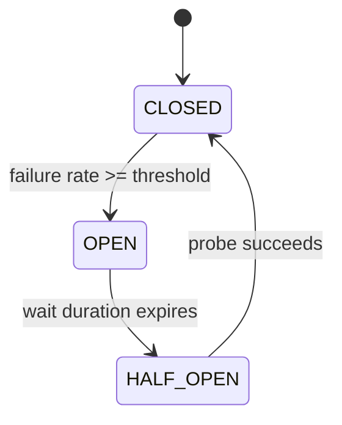
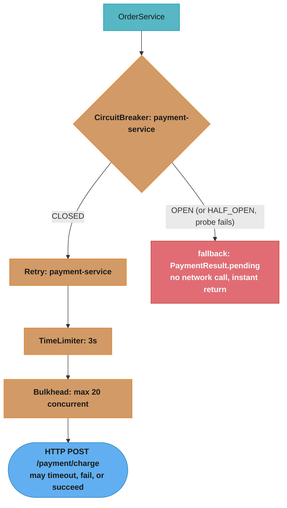
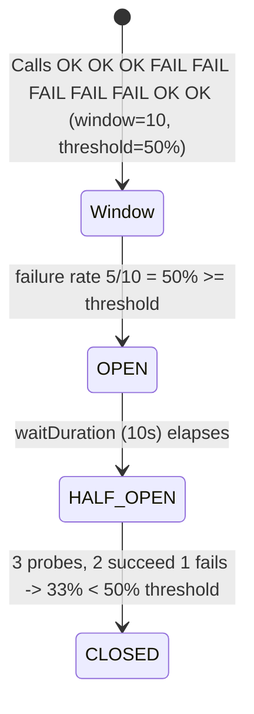

# Resilience4j Patterns for Spring Services

> **Resilience is not about preventing failures — it's about containing them.**  
> Every distributed service will have downstream dependencies that are slow, unavailable, or
> returning errors. Resilience4j's patterns — circuit breaker, retry, rate limiter, bulkhead,
> and time limiter — limit how far a single dependency failure propagates before it takes your
> service down with it.

---

## 1. Concept Overview

Resilience4j is a lightweight fault-tolerance library for Java, designed specifically for
functional programming and reactive/non-blocking styles. It replaces Netflix Hystrix (end-of-life
since 2018) and integrates directly with Spring Boot Actuator for metrics and health indicators.

**The five core patterns:**
1. **Circuit Breaker** — stops calling a failing dependency for a recovery window, then probes
2. **Retry** — retries transient failures with configurable backoff and jitter
3. **Rate Limiter** — limits call rate to a downstream dependency (protects the downstream)
4. **Bulkhead** — limits concurrent calls per dependency (protects your service)
5. **Time Limiter** — enforces a maximum duration per call, preventing indefinite blocking

**Composition order** (outermost to innermost):
```
Retry( CircuitBreaker( RateLimiter( TimeLimiter( Bulkhead( Function ) ) ) ) )
```
This is Resilience4j's documented **default aspect order**, not a suggestion — Retry is the
outermost aspect, so a retried call gets a fresh circuit-breaker decision each attempt. Override it
per aspect with `resilience4j.retry.retry-aspect-order`,
`resilience4j.circuitbreaker.circuit-breaker-aspect-order` and the matching properties for the
other three. The bulkhead is innermost: it limits actual concurrent calls, independent of retries.

---

## 2. Intuition

Think of each pattern as a layer of electrical protection:

- **Circuit Breaker** = circuit breaker switch: trips when overloaded, needs manual reset or
  auto-reset after cooling down. Prevents cascading damage.
- **Retry** = auto-restart relay: tries again after a brief pause. Only for transient failures.
- **Rate Limiter** = current limiter: ensures you draw at most N amps. Protects the supply.
- **Bulkhead** = fuse: limits the maximum current draw in this circuit. Protects your service.
- **Time Limiter** = thermal cutoff: cuts power if it gets too hot (too slow). Prevents lockup.

**Key insight:** A retry without a circuit breaker amplifies load on a failing downstream. If
50 callers each retry 3 times, a failing service receives 150 calls instead of 50 — making
recovery harder. The circuit breaker's open state is what makes retry safe: once the CB trips,
the inner call is rejected instantly and a fallback is served without touching the network.

But that only holds if you tell Retry to stop. Retry sits *outside* the circuit breaker in the
default order, and its default exception set is "retry everything" — so an open circuit produces
`CallNotPermittedException`, and Retry dutifully burns its whole budget re-asking a breaker that is
guaranteed to say no. Put `CallNotPermittedException` in the retry's `ignoreExceptions` and the
combination behaves the way people assume it already does.

---

## 3. Core Principles

### 3.1 Circuit Breaker state machine



- **CLOSED**: normal operation; failure rate tracked over sliding window
- **OPEN**: all calls fail immediately with `CallNotPermittedException` (no actual call made)
- **HALF_OPEN**: permits `permittedNumberOfCallsInHalfOpenState` probe calls to test recovery

### 3.2 Sliding window types

- **COUNT_BASED**: tracks last N calls; immediate response to a burst of failures
- **TIME_BASED**: tracks calls in last N seconds; more accurate under variable traffic

### 3.3 Exception classification

Not all exceptions should count as failures:
- `NetworkTimeoutException` → failure (circuit breaker should count it)
- `InvalidInputException` → ignore (caller bug, not dependency health)
- `NotFoundException` → record success (404 is a valid response, not a service failure)

Use `recordExceptions` / `ignoreExceptions` / `recordException(Predicate<Throwable>)` to classify.

---

## 4. Configuration and Usage

### 4.1 Spring Boot YAML configuration

```yaml
resilience4j:
  circuitbreaker:
    instances:
      payment-service:
        registerHealthIndicator: true       # /actuator/health shows CB state
        slidingWindowType: COUNT_BASED
        slidingWindowSize: 20               # evaluate over last 20 calls
        minimumNumberOfCalls: 10            # wait for 10 calls before evaluating
        permittedNumberOfCallsInHalfOpenState: 3
        automaticTransitionFromOpenToHalfOpenEnabled: true
        waitDurationInOpenState: 10s        # stay open for 10s before probing
        failureRateThreshold: 50            # trip if ≥ 50% of last 20 calls fail
        slowCallRateThreshold: 80           # trip if ≥ 80% of calls take > slowCallDurationThreshold
        slowCallDurationThreshold: 2s       # calls > 2s count as "slow"
        recordExceptions:
          - java.net.ConnectException
          - java.util.concurrent.TimeoutException
          - org.springframework.web.client.HttpServerErrorException
        ignoreExceptions:
          - com.example.InvalidInputException
          - com.example.NotFoundException

  retry:
    instances:
      payment-service:
        maxAttempts: 3
        waitDuration: 500ms                 # 500ms fixed; use exponentialBackoff for production
        enableExponentialBackoff: true
        exponentialBackoffMultiplier: 2.0
        exponentialMaxWaitDuration: 10s     # cap at 10s per retry delay
        retryExceptions:
          - java.net.ConnectException
          - org.springframework.web.client.HttpServerErrorException$InternalServerError
        ignoreExceptions:
          - com.example.InvalidInputException

  ratelimiter:
    instances:
      payment-service:
        limitForPeriod: 100                 # 100 calls per period
        limitRefreshPeriod: 1s              # period = 1 second → 100 calls/sec
        timeoutDuration: 200ms              # wait up to 200ms for a permit

  bulkhead:
    instances:
      payment-service:
        maxConcurrentCalls: 20              # max 20 concurrent calls to payment service
        maxWaitDuration: 100ms              # wait 100ms for a slot; otherwise reject

  timelimiter:
    instances:
      payment-service:
        timeoutDuration: 3s                 # call must complete in 3 seconds
        cancelRunningFuture: true           # cancel the CompletableFuture on timeout
```

### 4.2 `@CircuitBreaker` annotation

```java
import io.github.resilience4j.circuitbreaker.annotation.CircuitBreaker;
import io.github.resilience4j.retry.annotation.Retry;

@Service
public class OrderService {

    @Autowired
    private PaymentClient paymentClient;

    // CircuitBreaker name must match YAML instance name
    @CircuitBreaker(name = "payment-service", fallbackMethod = "paymentFallback")
    @Retry(name = "payment-service")
    public PaymentResult chargeCustomer(Order order) {
        return paymentClient.charge(order.getPaymentDetails());
    }

    // Fallback method: same return type + Throwable parameter
    private PaymentResult paymentFallback(Order order, CallNotPermittedException ex) {
        // CB is open: fast fallback (no actual call)
        log.warn("Payment circuit open; returning PENDING for order {}", order.id());
        return PaymentResult.pending(order.id(), "payment-service-unavailable");
    }

    private PaymentResult paymentFallback(Order order, Exception ex) {
        // All other exceptions after retries exhausted
        log.error("Payment failed after retries for order {}: {}", order.id(), ex.getMessage());
        return PaymentResult.failed(order.id(), "payment-error");
    }
}
```

**Fallback method resolution:** Resilience4j uses the most specific exception type in the
fallback signature. Define a fallback for `CallNotPermittedException` (CB open) separately
from a general `Exception` fallback (retries exhausted). The annotation approach uses
Spring AOP — the same self-invocation trap applies: calling `chargeCustomer()` from within
`OrderService` bypasses the proxy and the circuit breaker.

---

### 4.3 Programmatic API (when annotation AOP self-invocation is an issue)

```java
@Service
public class PaymentService {

    private final CircuitBreaker circuitBreaker;
    private final Retry retry;
    private final Bulkhead bulkhead;
    private final StripeClient stripeClient;

    public PaymentService(CircuitBreakerRegistry cbRegistry,
                          RetryRegistry retryRegistry,
                          BulkheadRegistry bulkheadRegistry,
                          StripeClient stripeClient) {
        this.circuitBreaker = cbRegistry.circuitBreaker("payment-service");
        this.retry = retryRegistry.retry("payment-service");
        this.bulkhead = bulkheadRegistry.bulkhead("payment-service");
        this.stripeClient = stripeClient;
    }

    public ChargeResult charge(PaymentRequest request) {
        // Compose decorators (order: bulkhead → circuitBreaker → retry → actual call)
        Supplier<ChargeResult> supplier = Decorators
            .ofSupplier(() -> stripeClient.charge(request))
            .withBulkhead(bulkhead)
            .withCircuitBreaker(circuitBreaker)
            .withRetry(retry)
            .withFallback(List.of(CallNotPermittedException.class, BulkheadFullException.class),
                ex -> ChargeResult.pending(request.orderId(), "service-unavailable"))
            .decorate();

        return Try.ofSupplier(supplier)
            .recover(ex -> ChargeResult.failed(request.orderId(), ex.getMessage()))
            .get();
    }
}
```

---

### 4.4 Broken pattern — Retry amplifying load on an open circuit

The real defect is not the nesting — Retry outside CircuitBreaker is Resilience4j's shipped
default and cannot be changed by reordering annotations. It is that Retry, by default, retries
*every* exception, including the `CallNotPermittedException` an open breaker throws.

**Broken:**
```yaml
# BROKEN: retryExceptions unset means "retry anything". When the CB is OPEN, each of the 3
# attempts gets an instant CallNotPermittedException and Retry fires again -- three rejections
# in microseconds, zero recovery value, and the retry metrics report failures that never
# reached the network.
resilience4j:
  retry:
    instances:
      payment-service:
        maxAttempts: 3
```

**Fixed:**
```yaml
# CORRECT: an open circuit ends the attempt immediately; only genuinely transient
# failures consume the retry budget.
resilience4j:
  retry:
    instances:
      payment-service:
        maxAttempts: 3
        retryExceptions:
          - java.net.ConnectException
          - java.util.concurrent.TimeoutException
        ignoreExceptions:
          - io.github.resilience4j.circuitbreaker.CallNotPermittedException
          - io.github.resilience4j.bulkhead.BulkheadFullException
```

**Swapping the annotation lines changes nothing.** Spring AOP advice order comes from each
aspect's `Ordered` value, not from the order annotations appear on the method. If you genuinely
need a different nesting, set the `*-aspect-order` properties — and note that the default exists
for a reason: with Retry outermost, an attempt that fails transiently is re-evaluated by the
breaker as a separate call, which is what keeps the breaker's failure-rate window honest.
**Verify with a test** — assert the breaker's state and the retry metrics together.

---

### 4.5 Monitoring circuit breaker state

```java
@Configuration
public class CircuitBreakerMonitoring {

    @EventListener
    public void onStateTransition(CircuitBreakerOnStateTransitionEvent event) {
        log.warn("CircuitBreaker [{}] transitioned from {} to {}",
            event.getCircuitBreakerName(),
            event.getStateTransition().getFromState(),
            event.getStateTransition().getToState());
    }

    @EventListener
    public void onCallNotPermitted(CircuitBreakerOnCallNotPermittedEvent event) {
        meterRegistry.counter("circuitbreaker.rejected.calls",
            "name", event.getCircuitBreakerName()).increment();
    }
}
```

With `registerHealthIndicator: true`, the circuit breaker state appears in
`/actuator/health`:
```json
{
  "circuitBreakers": {
    "status": "DOWN",
    "details": {
      "payment-service": {
        "status": "CIRCUIT_OPEN",
        "details": { "failureRate": "65%", "slowCallRate": "20%", ... }
      }
    }
  }
}
```

---

## 5. Architecture Diagrams

### Circuit breaker protecting a downstream call



### State transition with sliding window metrics



---

## 6. How It Works — Detailed Mechanics

### Sliding window implementation

Resilience4j uses a circular `BitSet` (COUNT_BASED) or a `SlidingTimeWindowMetrics` ring
buffer (TIME_BASED) to track outcomes. No locks are needed because updates use `AtomicLong`
CAS operations — the same pattern as [../../../java/case_studies/cross_cutting/concurrency_memory_visibility_primitives.md].
This makes the circuit breaker itself near-zero overhead when CLOSED: a CAS on the atomic
counter + ring buffer slot update at ~5 ns/op.

### Rate limiter — `AtomicRateLimiter` token bucket

```
Every limitRefreshPeriod (1s):
  Available permits reset to limitForPeriod (100)

On each call:
  if (availablePermits > 0):
    availablePermits--; return immediately
  else:
    wait up to timeoutDuration for a new cycle to begin
    if cycle begins before timeout: permit granted
    else: throw RequestNotPermitted
```

The internal `AtomicRateLimiter` uses a single `AtomicLong` combining available permits and
the cycle start time in one 64-bit value, enabling a single CAS to atomically check and
decrement. Under high contention (many threads competing for permits), CAS retries grow —
similar to the `AtomicLong` contention curve from [../../../java/case_studies/cross_cutting/benchmarking_with_jmh.md].

### Bulkhead variants

| Type | Mechanism | Overhead | Best for |
|------|-----------|----------|---------|
| `SemaphoreBulkhead` | `Semaphore` with fixed permits | ~50 ns/call | Sync services; virtual threads (Java 21+) |
| `ThreadPoolBulkhead` | Dedicated `ThreadPoolExecutor` | ~5 µs/call | Async; isolating slow external calls |

`SemaphoreBulkhead` with virtual threads (Java 21+) is preferred: virtual threads are cheap,
so the overhead of a dedicated `ThreadPoolBulkhead` is rarely justified. See
[../../../java/structured_concurrency_and_loom/structured_concurrency_and_loom.md] for virtual thread integration.

---

## 7. Real-World Examples

### Netflix Hystrix — what it got right, and why the successor looks different

Netflix open-sourced Hystrix in 2012 and it is the reason this pattern is a household name. It
went into maintenance mode in November 2018, with Resilience4j named in its own README as the
recommended alternative. The design difference worth understanding: Hystrix isolated every
dependency behind a **dedicated thread pool** by default, so a slow dependency could not consume
the caller's threads — real isolation, paid for with a thread hand-off on every single call.
Resilience4j makes that opt-in (`ThreadPoolBulkhead`) and defaults to a semaphore, which counts
concurrent calls without moving work between threads. On virtual threads the case for the thread
pool weakens further still: the thing it was protecting — a scarce platform thread — is no longer
scarce.

### AWS — the arguments against blanket fallbacks and static retry

Two pieces from the Amazon Builders' Library reshape how these patterns get configured. "Timeouts,
retries and backoff with jitter" is the origin of the jitter advice below, and its central
finding is that backoff alone does not fix a thundering herd — it merely moves the spike, because
every client backs off by the *same* amount. Randomness is what spreads it, and full jitter
(`random(0, min(cap, base × 2^attempt))`) spreads it best. Its second point is subtler and often
missed: retries multiply load exactly when the system is least able to absorb it, so a retry
budget matters more than a retry count — cap retries as a *fraction of total traffic*, not per
call site.

The companion piece on fallbacks argues something genuinely counterintuitive: a fallback path is
the code you exercise least and therefore trust least, and it fails at precisely the moment the
primary path already has. That is a direct warning about §4.2's `PaymentResult.pending()` — it is
safe only because it does nothing but return a value. A fallback that reads a replica, hits a
different region, or writes a queue is a second system in the failure path, and needs the same
load testing as the primary.

### Cell-based architecture — the bulkhead at infrastructure scale

The `Bulkhead` in this library limits concurrent calls inside one JVM. The same idea at the fleet
level is cell-based architecture: partition the fleet into independent cells, route each customer
to exactly one, and a failure — a poison request, a bad deploy, an overloaded dependency — is
contained to the fraction of customers in that cell rather than taking the service down. Same
principle, three orders of magnitude apart in granularity, and worth naming in an interview
because it shows the pattern is about blast radius, not about semaphores.

### Time limiter — the arithmetic that makes it non-optional

A downstream that fails fast is easy. A downstream that *succeeds slowly* is what kills services,
because nothing errors and nothing alerts. Take a 200-thread pool, a dependency that degrades from
100 ms to 45 s, and 50 req/s of demand: threads are all consumed in 200/50 = **4 seconds**, and
from then on the service's effective throughput is 200/45 = **4.4 req/s** against 50 arriving —
the queue grows by 45 requests every second until something bursts. No exception is thrown at any
point. A `TimeLimiter` at 3 s converts the slow success into a `TimeoutException`, which caps
thread occupancy at 3 s and lets the circuit breaker's `slowCallRateThreshold` see the degradation
and open. Time limiter and slow-call detection are the pair that make slow failures visible.

---

## 8. Tradeoffs

| Pattern | Protects | Overhead | Risk if misconfigured |
|---------|----------|---------|----------------------|
| Circuit Breaker | Your service from cascading failure | ~5 ns/call (CLOSED state) | Too aggressive threshold → CB trips on normal error spikes; too conservative → never opens |
| Retry | Against transient failures (network blip) | N× the call overhead | Retrying non-idempotent writes causes duplicate orders/payments |
| Rate Limiter | Downstream service from overload | ~50 ns/call | Too low limit → your service throttles itself unnecessarily |
| Bulkhead | Your thread pool from one slow dependency | 50 ns (semaphore) to 5 µs (thread pool) | Too few concurrent calls → rejected requests; too many → no isolation |
| Time Limiter | Thread pool from zombie slow calls | ~1 µs/call (timer overhead) | Too short timeout → cuts off legitimate slow operations (batch queries) |

---

## 9. When to Use / When NOT to Use

### Use Circuit Breaker when:
- Calling any external HTTP service or downstream microservice
- The downstream can become unavailable and you have a valid fallback (cache, default, queue)
- You want to prevent your service from wasting resources on an unavailable dependency

### Use Retry when:
- The failure mode is transient (network blip, temporary rate limit, brief service restart)
- The operation is idempotent (GET, idempotent PUT, read-only DB query)

### Do NOT use Retry when:
- The operation is non-idempotent (payment charge, order creation) without idempotency keys
- The failure is persistent (always-failing configuration, wrong credentials) — retry amplifies load without benefit
- The circuit breaker is already open — retry on an open CB wastes time on `CallNotPermittedException`

### Use Rate Limiter when:
- You have an API quota for a downstream service (Stripe: 100 req/s; Twilio: 25 req/s)
- You want to implement cooperative rate limiting (each instance limits itself)

### Do NOT use Rate Limiter as the primary backpressure mechanism for your own endpoints —
use a gateway-level rate limiter (Redis token bucket in Spring Cloud Gateway) instead. See
[../design_distributed_rate_limiter_spring.md] for the correct architecture.

---

## 10. Common Pitfalls

### Pitfall 1 — Retrying non-idempotent operations

**Broken:**
```java
@Retry(name = "payment-service")
public PaymentResult charge(Order order) {
    // Non-idempotent: if the first call succeeds but the response is lost (network timeout),
    // a retry will charge the customer twice
    return paymentClient.chargeCard(order.getPaymentDetails());
}
```

**Fixed:**
```java
@Retry(name = "payment-service",
       retryExceptions = { ConnectException.class, HttpServerErrorException.class })
public PaymentResult charge(Order order) {
    // Idempotency key ensures the payment provider deduplicates retries
    return paymentClient.chargeCard(
        order.getPaymentDetails()
            .withIdempotencyKey(order.id() + "-v1"));
}
```

Always pass an idempotency key with payment/write retries. See
[../design_idempotent_payment_api.md] for the full idempotency key pattern.

---

### Pitfall 2 — Circuit breaker on a health check endpoint

**Broken:**
```java
// Kubernetes liveness probe calls /actuator/health which internally calls
// a circuit-breaker-protected method — CB opens on health checks,
// causing Kubernetes to restart the pod when downstream is slow
@CircuitBreaker(name = "payment-service")
public boolean isPaymentServiceHealthy() {
    return paymentClient.ping();
}
```

Health checks must not use circuit breakers — they should be passive aggregation of
`CircuitBreaker.getState()`, not active calls to the dependency.

---

### Pitfall 3 — `minimumNumberOfCalls` too low

With `slidingWindowSize=10, minimumNumberOfCalls=2`: after just 2 calls, if both fail, the
CB trips. This is too sensitive — one bad network packet trips the circuit. Set
`minimumNumberOfCalls = slidingWindowSize / 2` at minimum; usually 10–20 calls.

---

### Pitfall 4 — Missing fallback for `BulkheadFullException`

When the bulkhead is full, Resilience4j throws `BulkheadFullException`. Without a fallback,
this propagates up as an unhandled 500 error to the caller. Always define a fallback for
`BulkheadFullException` that returns a graceful degraded response (HTTP 503 + Retry-After
header, or a cached response).

---

### Pitfall 5 — Shared circuit breaker instance for different endpoints

A single `payment-service` circuit breaker instance counts failures from ALL endpoints
(`/charge`, `/refund`, `/status`). If `/status` is slow (DB timeout), the CB trips and blocks
`/charge` too. Use separate instance names for logically distinct operations: `payment-charge`,
`payment-refund`, `payment-status`.

---

## 11. Technologies & Tools

| Tool | Role | Notes |
|------|------|-------|
| resilience4j-spring-boot3 | Spring Boot auto-configuration | Still the artifact name on Boot 4 (it targets Spring Framework 6+); includes all 5 patterns + Actuator integration |
| resilience4j-micrometer | Metrics integration | Publishes CB state, call metrics to Micrometer |
| resilience4j-reactor | Reactive support | Decorates `Mono`/`Flux` with CB/Retry for WebFlux |
| Spring Cloud Circuit Breaker | Vendor-neutral abstraction (Resilience4j is the reference implementation; the Hystrix binding was dropped) | `CircuitBreakerFactory` for portability |
| Spring Cloud Gateway `CircuitBreaker` filter | Gateway-level CB | `SpringCloudCircuitBreakerResilience4JFilterFactory`; per-route breaker with `fallbackUri` |
| `io.github.resilience4j:resilience4j-all` | Core library | Include all patterns; Spring Boot starter auto-configures them |
| Chaos Monkey for Spring Boot | Test CB/Retry under failure | `chaos.monkey.enabled=true` injects latency/errors |
| Testcontainers + WireMock | Integration tests for R4j patterns | Simulate downstream failures; verify CB state transitions |

---

## 12. Interview Questions with Answers

**Q1. What is the circuit breaker pattern and why is it needed in microservices?**
A circuit breaker monitors calls to a downstream dependency and "trips" to an OPEN state
when the failure rate exceeds a threshold. In the OPEN state, calls are rejected immediately
without reaching the failing dependency, serving a fallback response instead. This prevents
cascading failures: without a circuit breaker, a slow downstream causes threads to pile up
waiting for responses, eventually exhausting the caller's thread pool and causing it to fail
too — propagating the failure upstream. The circuit breaker limits the blast radius of any
single dependency failure to a configurable degraded-mode fallback, while giving the failing
service time to recover without being bombarded with requests that would prevent recovery.

**Q2. Explain the three states of a Resilience4j circuit breaker and the transitions between them.**
The CLOSED state is normal operation: calls pass through, and a sliding window tracks the
failure rate. When the failure rate (or slow-call rate) exceeds the configured threshold after
`minimumNumberOfCalls` evaluations, the CB transitions to OPEN. In OPEN state, all calls fail
immediately with `CallNotPermittedException` — no actual call to the dependency is made.
After `waitDurationInOpenState` (e.g., 10s), the CB transitions to HALF_OPEN, allowing
`permittedNumberOfCallsInHalfOpenState` probe calls. If the probes succeed (failure rate < threshold),
the CB returns to CLOSED. If probes still fail at the threshold rate, the CB returns to OPEN.
This state machine prevents both perpetual failure (open never closes) and premature recovery
(half-open is cautious about declaring recovery).

**Q3. In what order does Resilience4j compose its aspects, and what breaks if you ignore it?**
Retry is the outermost aspect by default: `Retry( CircuitBreaker( RateLimiter( TimeLimiter(
Bulkhead( Function ) ) ) ) )`. So each retry attempt makes a fresh trip through the circuit
breaker rather than the breaker seeing one aggregate outcome — which is what keeps the breaker's
failure-rate window measuring actual calls. The trap is that Retry's default exception set is
"everything", so once the breaker is OPEN each attempt gets an instant `CallNotPermittedException`
and Retry immediately fires again, burning `maxAttempts` rejections in microseconds for zero
recovery benefit and polluting the retry metrics with failures that never reached the network.
The fix is exception classification, not reordering: put `CallNotPermittedException` (and
`BulkheadFullException`) in the retry's `ignoreExceptions`. Reordering the annotations on the
method does nothing at all — Spring AOP orders advice by each aspect's `Ordered` value, which
Resilience4j exposes as `resilience4j.retry.retry-aspect-order` and its siblings, so that is the
only knob that actually changes the nesting.

**Q4. When should you use `SemaphoreBulkhead` vs `ThreadPoolBulkhead`?**
`SemaphoreBulkhead` limits concurrent calls by blocking the calling thread in the semaphore
if the bulkhead is full. It adds ~50 ns overhead and works well with synchronous and
virtual-thread-based services. `ThreadPoolBulkhead` submits calls to a dedicated
`ThreadPoolExecutor`, so the calling thread is never blocked — it either gets a `Future`
immediately or receives `BulkheadFullException` if the pool's queue is full. The dedicated
thread pool provides true isolation: a slow dependency cannot consume threads from your
main executor. Use `ThreadPoolBulkhead` for highly variable response-time dependencies where
you need the main thread pool to remain fully responsive. Use `SemaphoreBulkhead` for
Java 21+ virtual threads (a blocked virtual thread is cheap) or when the dependency is fast
and isolation overhead matters.

**Q5. What is a time limiter and how does it differ from a connection timeout?**
A `TimeLimiter` enforces a maximum duration for the *entire call*, including any retries and
queuing time, by timing out a `CompletableFuture` after the configured duration. A connection
timeout controls only the TCP connection establishment phase, and a read timeout controls
only the time between receiving response bytes. A slow service that accepts the connection,
sends HTTP 200, but then streams data slowly at 1 byte/second would not trigger connection
or read timeouts — but would trigger a `TimeLimiter` after 3s. Use both: connection timeout +
read timeout at the HTTP client level to handle network-layer issues, and `TimeLimiter` at
the Resilience4j level to bound the total operation time. For Spring's `RestTemplate`, set
`connectTimeout` and `readTimeout` in `SimpleClientHttpRequestFactory`; wrap the call in
a Resilience4j `TimeLimiter` for end-to-end enforcement.

**Q6. How do you prevent the thundering herd problem when retrying after a circuit breaker opens?**
When the CB transitions to HALF_OPEN, `permittedNumberOfCallsInHalfOpenState` probe calls
are admitted. Set this to 3–5 calls, not 50 — a small probe sample is sufficient to determine
if the service recovered. For retries, use exponential backoff with jitter: `fullJitter`
strategy randomises each retry wait between 0 and `min(base × 2^attempt, maxBackoff)`.
With 1,000 callers all retrying after a 30s outage, jitter spreads retries over the backoff
window instead of creating a 1,000-call burst at the same instant. Full-jitter distributes
load most evenly; decorrelated-jitter (AWS recommendation) prevents lock-step between
multiple retriers.

**Q7. How does Resilience4j integrate with Micrometer for observability?**
With `resilience4j-micrometer` on the classpath and `registerHealthIndicator: true`, Resilience4j
automatically publishes metrics to the `MeterRegistry`. Key metrics: `resilience4j.circuitbreaker.calls`
(tagged by state: success/failure/not_permitted/timeout), `resilience4j.circuitbreaker.state`
(gauge: 0=closed, 1=open, 2=half_open), `resilience4j.retry.calls` (success after retry,
failed without retry, etc.), `resilience4j.bulkhead.available.concurrent.calls` (remaining
permits). Wire a Grafana alert on `resilience4j.circuitbreaker.state = 1` (OPEN) sustained
for >60s → page on-call. Combine with the OTel trace context from
[otel_observability_for_spring.md](./otel_observability_for_spring.md) to correlate CB trips
with specific slow requests.

**Q8. What happens when both the circuit breaker and the rate limiter are applied? Which fires first?**
With the correct composition (CB outer, RateLimiter inner), the request reaches the RateLimiter
first (innermost). If the rate limit is exceeded, `RequestNotPermitted` is thrown — the CB
counts this as a failure (unless you configure `ignoreExceptions` to exclude it). If allowed
by RateLimiter, the actual call is made; its outcome updates the CB's sliding window. The key
consequence: if your service is calling a dependency faster than the rate limit allows, the
resulting `RequestNotPermitted` exceptions may trip the circuit breaker, causing the CB to open
even though the dependency is healthy. Fix: either set `ignoreExceptions` on the CB for
`RequestNotPermitted`, or configure the RateLimiter to have a `timeoutDuration` long enough
that callers queue and wait rather than fail immediately.

**Q9. How would you test Resilience4j circuit breaker behaviour in a Spring Boot integration test?**
Use Testcontainers + WireMock to simulate downstream failures:

```java
@SpringBootTest
class CircuitBreakerTest {
    @Autowired
    private OrderService orderService;

    @Autowired
    private CircuitBreakerRegistry circuitBreakerRegistry;

    @Test
    void shouldOpenCircuitAfter10FailuresIn20Calls() {
        // Configure WireMock to return 500 for all payment calls
        stubFor(post("/payment/charge").willReturn(serverError()));

        // Make 10 failing calls (minimumNumberOfCalls=10, failureRateThreshold=50%)
        for (int i = 0; i < 10; i++) {
            try { orderService.chargeCustomer(testOrder()); } catch (Exception ignored) {}
        }

        CircuitBreaker cb = circuitBreakerRegistry.circuitBreaker("payment-service");
        assertThat(cb.getState()).isEqualTo(CircuitBreaker.State.OPEN);

        // Verify fallback is returned when CB is open
        PaymentResult result = orderService.chargeCustomer(testOrder());
        assertThat(result.status()).isEqualTo("PENDING");
        assertThat(result.reason()).isEqualTo("payment-service-unavailable");
    }
}
```

Also assert on Micrometer metrics: `counter("resilience4j.circuitbreaker.not_permitted_calls")`.

**Q10. Describe the recommended Resilience4j configuration for a payment service integration.**
For a payment service with 100ms typical response, 500ms P99, and 5,000 req/min throughput:
- **CircuitBreaker**: `slidingWindowType=COUNT_BASED`, `slidingWindowSize=20`,
  `minimumNumberOfCalls=10`, `failureRateThreshold=50`, `slowCallRateThreshold=80`,
  `slowCallDurationThreshold=2s`, `waitDurationInOpenState=15s`,
  `permittedNumberOfCallsInHalfOpenState=3`. Record: `ConnectException`, `HttpServerErrorException`.
  Ignore: `BadRequestException`, `NotFoundException`.
- **Retry**: `maxAttempts=2` (1 initial + 1 retry), `enableExponentialBackoff=true`,
  `exponentialBackoffMultiplier=2`, `exponentialMaxWaitDuration=1s`. Retry only on `ConnectException`
  and `HttpServerErrorException`. Add idempotency key to payment calls.
- **TimeLimiter**: `timeoutDuration=3s` (6× typical response; 3× P99 to allow for spikes but
  prevent zombie threads).
- **SemaphoreBulkhead**: `maxConcurrentCalls=50` (at 100ms avg, 50 concurrent = 500 req/s),
  `maxWaitDuration=100ms`.
- **Monitoring**: `registerHealthIndicator=true` for all; Grafana alert on CB state=OPEN >30s.

---

## 13. Best Practices

- **Keep the default composition order** — Retry( CircuitBreaker( RateLimiter( TimeLimiter( Bulkhead( fn ) ) ) ) ) — and add `CallNotPermittedException`/`BulkheadFullException` to the retry's `ignoreExceptions` so an open circuit ends the attempt instead of consuming the retry budget
- **Define fallbacks for every exception type** that Resilience4j can throw:
  `CallNotPermittedException`, `BulkheadFullException`, `RequestNotPermitted`, `TimeoutException`
- **Use separate CB instances per logical operation** — not one per downstream service
- **Add idempotency keys before enabling retry** on any write operation
- **Never test Resilience4j with unit tests only** — use Testcontainers + WireMock to verify
  state transitions and fallback behaviour
- **Configure `minimumNumberOfCalls ≥ 10`** — prevents CB tripping on the first 2 calls during
  startup
- **Monitor `circuitbreaker.state` gauge** in Grafana — a CB stuck OPEN for > 5 minutes means
  the downstream has not recovered and needs manual intervention
- **Use `automaticTransitionFromOpenToHalfOpenEnabled=true`** — prevents the CB from staying
  open forever if no traffic arrives to trigger the state check
- **Set `waitDurationInOpenState` based on typical recovery time** of the dependency — too short
  means the CB oscillates; too long means false degradation

---

## 14. Case Study

### Circuit breaker in the API gateway — design_api_gateway.md

Reference case study: [../design_api_gateway.md](../design_api_gateway.md)

The Spring Cloud Gateway in that case study uses a Resilience4j circuit breaker per route.
The key configuration from that study:

```yaml
spring:
  cloud:
    gateway:
      server:
        webflux:                          # Gateway 5 namespaces routes by server flavour
          routes:
            - id: payment-service
              uri: lb://payment-service
              predicates:
                - Path=/api/payment/**
              filters:
                - name: CircuitBreaker
                  args:
                    name: payment-service
                    fallbackUri: forward:/fallback/payment
                - name: Retry
                  args:
                    retries: 1
                    methods: GET          # Only retry idempotent methods
                    backoff:
                      firstBackoff: 50ms
                      maxBackoff: 500ms
```

**Production incident prevented (from §9 of that case study):**
During a 2023 Black Friday load test, the payment service's database connection pool exhausted,
causing P99 response time to rise to 45s (well above the 3s TimeLimiter threshold). Without the
circuit breaker: 50k req/min × 45s wait = 37,500 requests in-flight simultaneously → 37,500
gateway threads → OOM crash of the gateway. With the circuit breaker: after 10 calls failing
due to 3s timeout, CB trips OPEN. All subsequent payment requests receive the fallback response
(`PaymentResult.pending()`) within 5ms. The order service queues them for retry via the outbox
pattern (see [../design_event_driven_microservice.md](../design_event_driven_microservice.md)).
Payment service recovers in 30s; CB transitions HALF_OPEN → CLOSED; pending orders processed.
**Zero data loss; zero user-visible errors beyond "payment processing" status.**

See also: [otel_observability_for_spring.md](./otel_observability_for_spring.md) for how
circuit breaker state transitions are correlated with traces and alerts.
