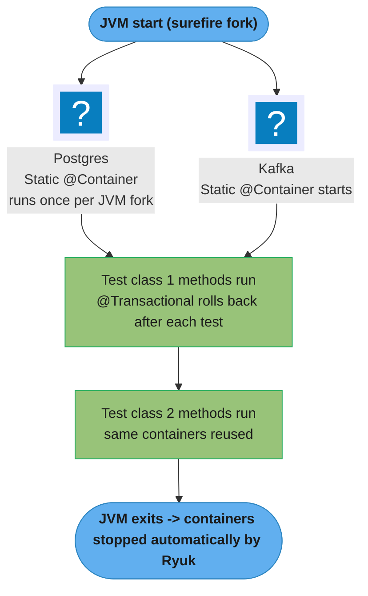

# Testcontainers and Integration Test Strategy for Spring Services

> **A test that passes on H2 but fails on PostgreSQL is not a test — it's a false comfort.**  
> Testcontainers starts real Docker containers (Postgres, Redis, Kafka) for your tests, then
> tears them down automatically. The result is integration tests that run in CI with the same
> database, message broker, and cache behaviour you will face in production.

---

## 1. Concept Overview

Testcontainers is a Java library that manages Docker container lifecycles in JUnit tests.
It provides pre-built module classes for common dependencies (`PostgreSQLContainer`,
`KafkaContainer`, `RedisContainer`, etc.) and a generic `GenericContainer` for anything
with a Docker image.

In Spring Boot 3.1+, the `@ServiceConnection` annotation eliminates boilerplate: when you
annotate a Testcontainers container field with `@ServiceConnection`, Spring Boot automatically
reads the container's dynamic port and hostname and configures the corresponding
`DataSource`, `RedisConnectionFactory`, or Kafka properties — no manual
`@DynamicPropertySource` required.

**What Testcontainers replaces:**
- H2/HSQLDB in-memory DB mocks (wrong dialect, wrong isolation behaviour)
- Embedded Kafka (`EmbeddedKafkaBroker` — different from real Kafka in partition behaviour)
- Fakeredis / mocked `RedisTemplate` (no TTL, no pub/sub behaviour)
- Wiremock-only tests for DB-backed services (cannot test transaction boundaries)

---

## 2. Intuition

Think of Testcontainers as a **pop-up kitchen** for each test run. Instead of cooking in your
living room (in-memory substitutes that don't behave like a real kitchen), you spin up a
real kitchen (Docker container), cook the meal (run the test), and then tear down the kitchen
(container is destroyed). Every test starts fresh.

The key analogy for **`@ServiceConnection`**: it is the kitchen's plumbing — once the
container starts, Spring Boot automatically connects to it without you needing to wire
any pipes manually.

**Key insight:** The test pyramid in microservices is flatter than in monoliths. A single
`@SpringBootTest` with Testcontainers, exercising a real DB + real Kafka, is more valuable
than 10 unit tests with mocks, because the most common production bugs involve interaction
between components (transaction boundaries, Kafka offset commits, Redis TTL expiry) that
mocks silently ignore.

---

## 3. Core Principles

### 3.1 Test slices vs full context

| Annotation | What loads | Testcontainers need |
|-----------|-----------|---------------------|
| `@WebMvcTest` | Only MVC layer (controllers, filters, security) | None (no DB/Kafka) |
| `@DataJpaTest` | Only JPA layer (repositories, entities) | PostgreSQL container |
| `@DataRedisTest` | Only Redis repos | Redis container |
| `@SpringBootTest` | Full application context | All dependencies |

Use slices for unit-style integration tests (fast: <5s); use `@SpringBootTest` for end-to-end
scenario tests. Testcontainers containers should be shared across the test suite with
`@Container` + `static` to avoid starting/stopping them per test class.

### 3.2 Container reuse strategies

| Strategy | Container lifecycle | Startup cost per test run |
|----------|-------------------|--------------------------|
| Per-test-class static `@Container` | Starts once per JVM fork | Fast (reused in same JVM) |
| `@Testcontainers` + `@Container` instance | Per test class | Medium |
| Testcontainers `withReuse(true)` | Persists across test runs (daemon) | Very fast (0 startup) |
| `GenericContainer` in `@BeforeEach` | Per test method | Slow |

Use per-test-class static containers as the default; enable reuse (`withReuse(true)`) for
development-time feedback speed.

---

## 4. Setup and Configuration

### 4.1 Maven dependencies (versions managed by the Spring Boot BOM)

```xml
<dependency>
    <groupId>org.springframework.boot</groupId>
    <artifactId>spring-boot-testcontainers</artifactId>
    <scope>test</scope>
</dependency>
<dependency>
    <groupId>org.testcontainers</groupId>
    <artifactId>postgresql</artifactId>
    <scope>test</scope>
</dependency>
<dependency>
    <groupId>org.testcontainers</groupId>
    <artifactId>kafka</artifactId>
    <scope>test</scope>
</dependency>
<!-- There is no org.testcontainers:redis artifact. Use a GenericContainer on the
     redis image (as below), or the community module com.redis:testcontainers-redis. -->
<dependency>
    <groupId>org.springframework.boot</groupId>
    <artifactId>spring-boot-starter-test</artifactId>
    <scope>test</scope>
</dependency>
```

### 4.2 `@ServiceConnection` — zero boilerplate wiring (Spring Boot 3.1+)

```java
import org.springframework.boot.testcontainers.service.connection.ServiceConnection;
import org.testcontainers.containers.PostgreSQLContainer;
import org.testcontainers.containers.KafkaContainer;
import org.testcontainers.junit.jupiter.Container;
import org.testcontainers.junit.jupiter.Testcontainers;

@SpringBootTest
@Testcontainers
class OrderServiceIntegrationTest {

    // @ServiceConnection: Spring Boot reads the container's host/port and
    // auto-configures spring.datasource.url, username, password
    @Container
    @ServiceConnection
    static PostgreSQLContainer<?> postgres =
        new PostgreSQLContainer<>("postgres:18-alpine");

    // Auto-configures spring.kafka.bootstrap-servers.
    // org.testcontainers.kafka.KafkaContainer runs the official apache/kafka image in
    // KRaft mode. The old org.testcontainers.containers.KafkaContainer is deprecated;
    // for the Confluent image use org.testcontainers.kafka.ConfluentKafkaContainer.
    @Container
    @ServiceConnection
    static KafkaContainer kafka = new KafkaContainer("apache/kafka:4.0.0");

    // Redis works with @ServiceConnection too -- spring-boot-data-redis ships a
    // RedisContainerConnectionDetailsFactory. A plain GenericContainer needs the name
    // hint, because the factory matches on it rather than on a container subclass.
    @Container
    @ServiceConnection(name = "redis")
    static GenericContainer<?> redis =
        new GenericContainer<>("redis:8-alpine").withExposedPorts(6379);

    // If you do hand-wire it, the properties are spring.data.redis.*:
    // spring.redis.host/port were deprecated at ERROR level in Boot 3.0 and bind to
    // nothing now, so a @DynamicPropertySource using them fails silently and the test
    // quietly talks to localhost:6379 instead of the container.

    @Autowired
    private OrderService orderService;

    @Autowired
    private OrderRepository orderRepository;
}
```

### 4.3 `@DataJpaTest` with Testcontainers (replace H2 entirely)

```java
@DataJpaTest
@AutoConfigureTestDatabase(replace = AutoConfigureTestDatabase.Replace.NONE)  // don't replace with H2!
@Testcontainers
class OrderRepositoryTest {

    @Container
    @ServiceConnection
    static PostgreSQLContainer<?> postgres =
        new PostgreSQLContainer<>("postgres:18-alpine")
            .withInitScript("test-data.sql");  // seed reference data

    @Autowired
    private OrderRepository orderRepository;

    @Autowired
    private TestEntityManager entityManager;

    @Test
    @Transactional
    void findByCustomerIdAndStatus_shouldRespectDatabaseIndex() {
        Order order = new Order(UUID.randomUUID(), "customer-123", OrderStatus.PENDING);
        entityManager.persist(order);
        entityManager.flush();

        List<Order> result = orderRepository.findByCustomerIdAndStatus(
            "customer-123", OrderStatus.PENDING);

        assertThat(result).hasSize(1);
        assertThat(result.get(0).customerId()).isEqualTo("customer-123");
    }

    @Test
    void concurrentUpdate_shouldRespectOptimisticLocking() {
        // Test that @Version optimistic locking actually works on PostgreSQL
        Order order = orderRepository.save(new Order(...));
        long originalVersion = order.version();

        // Simulate concurrent update
        jdbcTemplate.update("UPDATE orders SET status='PROCESSING' WHERE id=?", order.id());

        // Now try to update via JPA — should throw OptimisticLockException
        order.setStatus(OrderStatus.CANCELLED);
        assertThatThrownBy(() -> orderRepository.saveAndFlush(order))
            .isInstanceOf(OptimisticLockException.class);
    }
}
```

The `Replace.NONE` flag is critical — without it, `@DataJpaTest` replaces the datasource
with H2 even if a Testcontainer provides a real PostgreSQL.

---

## 5. Architecture Diagrams

### Test pyramid for a Spring microservice

```
        /\
       /  \
      / E2E\   (2-5 tests) Full system: all services + containers
     /------\
    /  Integ \  (20-50 tests) @SpringBootTest + Testcontainers
   /----------\
  /  Slice     \  (50-100 tests) @DataJpaTest, @WebMvcTest
 /--------------\
/ Unit (Service) \  (100-300 tests) @ExtendWith(MockitoExtension) — mock all deps
 ‾‾‾‾‾‾‾‾‾‾‾‾‾‾‾‾
```

For microservices with external data stores, the middle two layers (integration + slice) are
most valuable. A failing `@DataJpaTest` on real PostgreSQL catches: wrong index definition,
missing `@Column(nullable=false)`, wrong `FetchType` causing N+1, incorrect `@Lock` type.

### Container lifecycle in a test suite



The Ryuk container (started automatically by Testcontainers) monitors JVM lifecycle and
kills orphaned containers even if the JVM crashes.

---

## 6. How It Works — Detailed Mechanics

### 6.1 Full `@SpringBootTest` — event-driven flow test

```java
@SpringBootTest(webEnvironment = SpringBootTest.WebEnvironment.RANDOM_PORT)
@Testcontainers
class OrderSagaIntegrationTest {

    @Container
    @ServiceConnection
    static PostgreSQLContainer<?> postgres = new PostgreSQLContainer<>("postgres:18-alpine");

    @Container
    @ServiceConnection
    static KafkaContainer kafka = new KafkaContainer("apache/kafka:4.0.0");

    @Autowired
    private TestRestTemplate restTemplate;

    @Autowired
    private OrderRepository orderRepository;

    @Autowired
    private TestKafkaConsumer testConsumer;   // the @TestConfiguration bean from §6.2

    @Test
    void createOrder_shouldPublishEvent_andConsumerProcessesPayment()
            throws InterruptedException {
        // Arrange: the capturing consumer is a BEAN (see §6.2) -- a @KafkaListener
        // annotation cannot be written inside a method body; it only applies to a method
        // on a Spring bean, and the code below would not compile.
        testConsumer.reset();

        // Act: create order via REST endpoint
        CreateOrderRequest request = new CreateOrderRequest("customer-123", List.of("item-1"));
        ResponseEntity<OrderResponse> response =
            restTemplate.postForEntity("/api/orders", request, OrderResponse.class);

        // Assert: HTTP 201 + order persisted in DB
        assertThat(response.getStatusCode()).isEqualTo(HttpStatus.CREATED);
        UUID orderId = response.getBody().orderId();
        Order savedOrder = orderRepository.findById(orderId).orElseThrow();
        assertThat(savedOrder.status()).isEqualTo(OrderStatus.PENDING);

        // Assert: Kafka event was published (poll up to 10s). Awaitility rather than a
        // bare sleep -- it returns as soon as the condition holds.
        await().atMost(Duration.ofSeconds(10))
               .untilAsserted(() -> assertThat(testConsumer.getMessages("order.created"))
                   .anySatisfy(m -> assertThat(m).contains(orderId.toString())));
    }
}
```

### 6.2 `TestKafkaConsumer` — robust Kafka test helper

```java
@Component
@Profile("test")
public class TestKafkaConsumer {

    private final Map<String, List<String>> received = new ConcurrentHashMap<>();

    @KafkaListener(topics = {"order.created", "order.paid", "order.cancelled"},
                   groupId = "test-consumer-group")
    public void consume(ConsumerRecord<String, String> record) {
        received.computeIfAbsent(record.topic(), k -> new CopyOnWriteArrayList<>())
            .add(record.value());
    }

    public void waitForMessage(String topic, int count, Duration timeout)
            throws InterruptedException {
        long deadline = System.currentTimeMillis() + timeout.toMillis();
        while (System.currentTimeMillis() < deadline) {
            if (received.getOrDefault(topic, List.of()).size() >= count) return;
            Thread.sleep(100);
        }
        throw new AssertionError("Expected " + count + " messages on " + topic +
            " but got " + received.getOrDefault(topic, List.of()).size());
    }

    public List<String> getMessages(String topic) {
        return List.copyOf(received.getOrDefault(topic, List.of()));
    }

    public void reset() { received.clear(); }
}
```

### 6.3 Transaction isolation test — catches H2 divergence

```java
// This test ONLY works on real PostgreSQL (H2 does not enforce REPEATABLE READ correctly)
@DataJpaTest
@AutoConfigureTestDatabase(replace = AutoConfigureTestDatabase.Replace.NONE)
@Testcontainers
class InventoryTransactionTest {

    @Container
    @ServiceConnection
    static PostgreSQLContainer<?> postgres = new PostgreSQLContainer<>("postgres:18-alpine");

    @Autowired
    private DataSource dataSource;

    @Test
    void reserveInventory_shouldNotAllowDoubleBooking() throws Exception {
        // Simulate two concurrent transactions both trying to reserve the last item
        UUID itemId = seedInventory(1);  // 1 item in stock

        ExecutorService pool = Executors.newFixedThreadPool(2);
        CountDownLatch start = new CountDownLatch(1);
        List<Future<Boolean>> results = new ArrayList<>();

        for (int i = 0; i < 2; i++) {
            results.add(pool.submit(() -> {
                start.await();
                return reserveWithPessimisticLock(itemId);  // SELECT ... FOR UPDATE
            }));
        }

        start.countDown();  // both transactions start simultaneously

        List<Boolean> outcomes = results.stream()
            .map(f -> { try { return f.get(); } catch (Exception e) { return false; } })
            .collect(Collectors.toList());

        // Exactly one should succeed; one should fail (lock wait timeout or rollback)
        long successes = outcomes.stream().filter(Boolean::booleanValue).count();
        assertThat(successes).isEqualTo(1);  // H2 would often let both through
    }
}
```

### 6.4 Broken pattern — shared container with dirty state

**Broken:**
```java
// BROKEN: container is shared but tests mutate state without rollback
// Test A inserts order #1; Test B asserts "no orders exist" → fails non-deterministically
@SpringBootTest
@Testcontainers
class OrderRepositoryTest_Broken {
    @Container
    static PostgreSQLContainer<?> postgres = new PostgreSQLContainer<>("postgres:18-alpine");

    @Test
    void test_A_insertsOrder() {
        orderRepository.save(new Order("customer-1"));  // persists permanently
    }

    @Test
    void test_B_assertsEmpty() {
        assertThat(orderRepository.count()).isEqualTo(0);  // FAILS if test A ran first
    }
}
```

**Fixed — option 1: `@Transactional` rollback**
```java
@SpringBootTest
@Transactional   // every test method runs in a transaction that rolls back after
@Testcontainers
class OrderRepositoryTest_Fixed {
    // Each test gets a clean-slate database
}
```

**Fixed — option 2: explicit cleanup in `@AfterEach`**
```java
@AfterEach
void cleanup() {
    orderRepository.deleteAll();   // or use @Sql("cleanup.sql")
}
```

Use `@Transactional` rollback for simple repository tests. Use explicit cleanup for tests that
test Kafka event publishing (Kafka offsets are not rolled back with `@Transactional`).

---

### 6.5 WireMock for external HTTP dependencies

```java
// When the dependency has no Testcontainers module (e.g., Stripe, Twilio)
@SpringBootTest
@Testcontainers
class PaymentServiceTest {

    @Container
    @ServiceConnection
    static PostgreSQLContainer<?> postgres = new PostgreSQLContainer<>("postgres:18-alpine");

    // WireMock as a Testcontainers GenericContainer
    @Container
    static WireMockContainer wiremock =
        new WireMockContainer("wiremock/wiremock:3.4.2")
            .withMappingFromResource("stripe-charge-success.json");

    @DynamicPropertySource
    static void wireMockProperties(DynamicPropertyRegistry registry) {
        registry.add("stripe.base-url", () -> wiremock.getBaseUrl());
    }

    @Test
    void charge_shouldReturnSuccess_whenStripeResponds200() {
        PaymentResult result = paymentService.charge(testRequest());
        assertThat(result.status()).isEqualTo("SUCCESS");
    }

    @Test
    void charge_shouldReturnFailed_whenStripeReturns500() {
        wiremock.stubFor(post("/v1/charges").willReturn(serverError()));
        assertThatThrownBy(() -> paymentService.charge(testRequest()))
            .isInstanceOf(PaymentGatewayException.class);
    }
}
```

---

## 7. Real-World Examples

### Pivotal/VMware — Spring Boot's official Testcontainers support

Spring Boot 3.1 (2023) added first-class `@ServiceConnection` support, reflecting the Spring
team's position that Testcontainers is the preferred integration test strategy. The `spring-boot-testcontainers`
module auto-discovers container types (PostgreSQL, MySQL, Redis, Kafka, RabbitMQ, MongoDB, etc.)
and configures the corresponding Spring Boot auto-configuration. No more manual
`@DynamicPropertySource` for supported containers — this was the primary friction point in the
3.0 era. Reference: Spring Boot 3.1 release notes (2023).

### Reusing containers across runs — what `withReuse(true)` actually costs

Reuse is the single biggest wall-clock win available, and it is opt-in on both sides: the
container must call `.withReuse(true)` **and** the developer must set
`testcontainers.reuse.enable=true` in `~/.testcontainers.properties`. Without the second, the
flag is ignored — which is exactly the behaviour you want, because reuse deliberately disables
Ryuk's cleanup so the container survives JVM exit. That is why reuse is a local-development
feature and not a CI one: on a build agent the container would outlive the job, leaking state
into the next build on the same node. In CI, keep a single `static` container in an
`AbstractIntegrationTest` base class and let Ryuk reap it at JVM exit.

### Pin the image version, and pin it to what production runs

Testcontainers makes the database version a line of code, which cuts both ways. `postgres:latest`
means a silently different engine between two runs of the same test. Pinning to the production
minor version is the point of the exercise — a query plan validated against 18.1 tells you
nothing if production runs 15. In regulated environments this becomes the argument for
Testcontainers rather than a nice-to-have: you can demonstrate that the tested engine and the
production engine are byte-identical images, which no in-memory substitute can claim.

### The idempotency test that only a real broker can run

The highest-value test this makes possible is publishing the same event twice and asserting the
business outcome appears once. `EmbeddedKafkaBroker` will happily pass a naive version of that
test because it does not reproduce consumer-group rebalancing or offset-commit timing — the two
mechanisms that actually generate duplicates in production. Real broker, two identical sends,
assert one row: three lines that catch the whole class of at-least-once bugs described in
[../design_event_driven_microservice.md](../design_event_driven_microservice.md).

---

## 8. Tradeoffs

| Approach | Test fidelity | Speed | Infrastructure complexity | Use case |
|----------|--------------|-------|--------------------------|---------|
| Testcontainers real DB | High — exact production behaviour | Slow (5–30s startup) | Docker in CI required | Integration + slice tests for data layer |
| H2 in-memory | Low — dialect differences, wrong isolation | Very fast | None | Acceptable only for pure JPQL syntax checks |
| `EmbeddedKafkaBroker` | Medium — single-broker, no partitioning behaviour | Fast (2-3s) | None | Simple produce/consume unit tests |
| Testcontainers Kafka | High | Medium (8-10s) | Docker in CI | Idempotency, consumer group, rebalance tests |
| WireMock | Medium — controls response; no state | Fast (1s) | None | External HTTP APIs (Stripe, Twilio) |
| Testcontainers + WireMock | High for HTTP contracts | Medium | Docker | Provider-side contract tests |
| In-process Redis (`embedded-redis`) | Low — no TTL accuracy, no pub/sub | Fast | None | Avoid; use Testcontainers Redis instead |

---

## 9. When to Use / When NOT to Use

### Use Testcontainers when:
- Testing code that uses DB-specific features (JSON columns, LISTEN/NOTIFY, `FOR UPDATE SKIP LOCKED`)
- Testing transaction isolation, optimistic/pessimistic locking behaviour
- Testing Kafka consumer group rebalancing, exactly-once semantics
- Testing Redis TTL expiry, pub/sub, or Lua scripting
- Any time the in-memory substitute has known behaviour differences from the real system

### Use in-memory / mock substitutes when:
- Pure service-layer logic with no DB/Kafka interaction (test via unit tests with Mockito)
- Testing MVC layer (controllers, filters) — `@WebMvcTest` + MockMvc is faster
- Prototyping or rapid TDD loops where startup speed is paramount
- The test only checks serialisation/deserialisation logic (no state persistence)

### Do NOT use Testcontainers when:
- Docker is unavailable in the CI environment (some air-gapped environments)
- The test must run in <100ms (Testcontainers adds a minimum of 2–5s JVM-lifetime startup)
- You are testing pure business logic with no infrastructure dependencies

---

## 10. Common Pitfalls

### Pitfall 1 — Forgetting `Replace.NONE` in `@DataJpaTest`

**Broken:**
```java
@DataJpaTest  // Spring Boot replaces datasource with H2 by default!
@Testcontainers
class UserRepositoryTest {
    @Container @ServiceConnection
    static PostgreSQLContainer<?> postgres = new PostgreSQLContainer<>("postgres:18-alpine");
    // PROBLEM: Spring replaces the datasource with H2; postgres container is never used
}
```

**Fixed:**
```java
@DataJpaTest
@AutoConfigureTestDatabase(replace = AutoConfigureTestDatabase.Replace.NONE)  // keep Postgres
@Testcontainers
class UserRepositoryTest { /* ... */ }
```

---

### Pitfall 2 — Non-static container fields (restarts for every test method)

**Broken:**
```java
@Testcontainers
class OrderTest {
    @Container  // instance field → container starts/stops for each test METHOD → very slow
    PostgreSQLContainer<?> postgres = new PostgreSQLContainer<>("postgres:18-alpine");
}
```

**Fixed:**
```java
@Testcontainers
class OrderTest {
    @Container  // static → container starts once per test CLASS
    static PostgreSQLContainer<?> postgres = new PostgreSQLContainer<>("postgres:18-alpine");
}
```

A non-static container starts and stops for every `@Test` method — 5–10s per method for
PostgreSQL. A static container starts once for the whole class — typically 200–500ms amortised
per test.

---

### Pitfall 3 — Test-order dependency with missing `@Transactional` rollback

Without `@Transactional` on test methods or `@AfterEach` cleanup, a test that inserts data
leaves it for the next test. When the test suite runs in parallel (`@Execution(CONCURRENT)`),
this causes non-deterministic failures. Fix: use `@Transactional` on the test class (rolls back
after each method) or explicit `@AfterEach` deletion. For Kafka tests, explicit cleanup is
required since Kafka offsets are not transactional.

---

### Pitfall 4 — Slow CI due to container startup per test class

When each test class starts its own `PostgreSQLContainer`, CI with 50 test classes starts
50 containers sequentially. Fix: use a `@TestConfiguration` base class or a JUnit 5
`Extension` that manages a shared container as a static singleton across all test classes.

```java
// SharedPostgresContainer.java
public class SharedPostgresContainer {
    public static final PostgreSQLContainer<?> INSTANCE;
    static {
        INSTANCE = new PostgreSQLContainer<>("postgres:18-alpine");
        INSTANCE.start();
    }
}

// In each test class:
@DynamicPropertySource
static void configureDb(DynamicPropertyRegistry registry) {
    registry.add("spring.datasource.url", SharedPostgresContainer.INSTANCE::getJdbcUrl);
    registry.add("spring.datasource.username", SharedPostgresContainer.INSTANCE::getUsername);
    registry.add("spring.datasource.password", SharedPostgresContainer.INSTANCE::getPassword);
}
```

---

### Pitfall 5 — Mocking the repository inside a `@SpringBootTest`

`@MockitoBean` in a `@SpringBootTest` replaces the real repository with a Mockito mock, so
`@Transactional` on the service layer commits to a real database while the service reads from
the mock — the two diverge and the test asserts on state that was never persisted. When using
Testcontainers, do not mock repository/DB components; let the real repository hit the real
container. Reserve `@MockitoBean` for things you genuinely cannot run locally: external HTTP
clients (Stripe, Twilio) and, when Kafka is not under test, the `KafkaTemplate`.

Note the annotation itself: `@MockBean` and `@SpyBean` were deprecated in Boot 3.4 and
**removed in Boot 4.0**. The replacements are `@MockitoBean` and `@MockitoSpyBean`, and they
live in `org.springframework.test.context.bean.override.mockito` — Spring Framework's
bean-override support, not Boot's.

---

## 11. Technologies & Tools

| Tool | Role | Notes |
|------|------|-------|
| `org.testcontainers:postgresql` | PostgreSQL container | Pin to the production minor (`postgres:18-alpine`), never `latest` |
| `org.testcontainers:kafka` | Kafka container | `org.testcontainers.kafka.KafkaContainer` on `apache/kafka` (KRaft, no ZooKeeper); `ConfluentKafkaContainer` for `cp-kafka`. The old `containers.KafkaContainer` is deprecated |
| Redis | Redis container | No official module — `GenericContainer` on `redis:8-alpine` with `@ServiceConnection(name = "redis")`, or `com.redis:testcontainers-redis` |
| `spring-boot-testcontainers` | `@ServiceConnection` auto-wiring | Auto-configures datasource, Redis, Kafka, RabbitMQ, Mongo and more from the running container |
| WireMock | HTTP mock server | `org.wiremock:wiremock-standalone`, or `org.wiremock.integrations.testcontainers:wiremock-testcontainers-module` for `WireMockContainer` |
| `spring-security-test` | `@WithMockUser`, `SecurityMockMvcRequestPostProcessors` | Test secured endpoints without real auth |
| Awaitility | Async assertions | `Awaitility.await().atMost(10, SECONDS).until(...)` — polls for async Kafka events |
| `@Sql` | Seed SQL before test | `@Sql("test-data.sql")` on test class/method; runs before test, can run cleanup after |
| Testcontainers Cloud | Remote container execution in CI | Offloads Docker to Testcontainers Cloud SaaS; removes Docker requirement from CI |
| `@DirtiesContext` | Reset Spring context after test | Use sparingly — very slow; prefer `@Transactional` rollback or container state cleanup |

---

## 12. Interview Questions with Answers

**Q1. Why use Testcontainers instead of H2 in-memory for Spring Boot integration tests?**
H2 is a different database engine from PostgreSQL — it has different SQL dialect, different
transaction isolation behaviour, no support for JSON column operators, no `FOR UPDATE SKIP LOCKED`,
and different index behaviour. A query that works in H2 tests may fail in production PostgreSQL
due to a missing sequence, a PostgreSQL-specific feature, or a transaction isolation difference.
Testcontainers starts a real PostgreSQL Docker container for tests, ensuring that test SQL,
transaction boundaries, and query plans are identical to production. The startup cost (5–10s per
JVM session with a static container) is a one-time overhead, not per-test overhead. The bug
detection improvement — especially for transaction isolation and locking bugs — easily justifies
the cost.

**Q2. What does `@ServiceConnection` do and what problem does it solve?**
`@ServiceConnection` (Spring Boot 3.1+) is a Testcontainers annotation that instructs Spring Boot
to read the Docker container's dynamic host and port after startup and automatically configure the
corresponding Spring Boot properties. For a `PostgreSQLContainer`, it sets
`spring.datasource.url`, `spring.datasource.username`, and `spring.datasource.password`.
Previously, this required a `@DynamicPropertySource` method that manually read
`container.getJdbcUrl()`, `container.getUsername()`, etc. — 10–15 lines of boilerplate per
container. `@ServiceConnection` reduces this to a single annotation, eliminates copy-paste
errors in the URL format, and is updated by the Spring team when property names change between
Boot versions.

**Q3. What is `@AutoConfigureTestDatabase(replace = Replace.NONE)` and when is it required?**
By default, `@DataJpaTest` replaces the application's configured `DataSource` with an H2
in-memory database, regardless of what is declared in `application.yaml`. This is Spring Boot's
"test slice" default for fast test execution without external dependencies. When using
Testcontainers, this default causes the container to be started but ignored — the actual tests
run against H2. `Replace.NONE` disables this replacement, allowing the `DataSource` configured
by `@ServiceConnection` (from the Testcontainers PostgreSQL container) to be used. Always add
`Replace.NONE` when using any non-H2 container with `@DataJpaTest`. This is the single most
common Testcontainers setup mistake.

**Q4. How do you test a Kafka event-driven flow end-to-end with Testcontainers?**
Use a `KafkaContainer` with `@ServiceConnection` to get a real Kafka broker; deploy a
`@KafkaListener` in a `@TestConfiguration` bean that writes received messages to a
`CopyOnWriteArrayList`; use `Awaitility.await().atMost(10, SECONDS).untilAsserted()` to wait for
the message to arrive. The test: (1) calls the REST endpoint that triggers the business logic,
(2) asserts the DB state was changed, (3) waits for the Kafka message to arrive in the test
consumer, (4) asserts the message content. Key pitfalls: reset the test consumer's state in
`@BeforeEach` to prevent cross-test message pollution; use a unique consumer group per test class
to avoid offset reuse from previous test runs.

**Q5. How do you handle test isolation when tests share a Testcontainers database?**
Three strategies: (1) `@Transactional` on the test class or method — Spring rolls back the
transaction after each test; the DB returns to the pre-test state. Works for most
`@DataJpaTest` and `@SpringBootTest` scenarios but not for Kafka (Kafka offsets are not
transactional). (2) `@Sql(scripts="cleanup.sql", executionPhase=AFTER_TEST_METHOD)` — runs
explicit `DELETE` statements after each test. More explicit but requires maintaining cleanup
scripts. (3) Separate schemas or databases per test class — Testcontainers `withDatabaseName()`
can create a unique DB name per test class; the trade-off is higher container overhead or one
shared Postgres with separate schemas. The `@Transactional` approach is simplest for pure DB
tests; explicit cleanup is required for tests that verify Kafka events.

**Q6. What is the startup performance impact of Testcontainers and how do you minimise it?**
A `PostgreSQLContainer` takes 5–10 seconds to start from a cold Docker pull, or 1–2 seconds
from a cached image. Without optimisation, 50 test classes × 1.5s = 75s of container overhead.
Minimise with: (1) `static @Container` fields — container starts once per JVM session (not per
test method). (2) `withReuse(true)` in `~/.testcontainers.properties testcontainers.reuse.enable=true`
— container persists between JVM runs; Docker Ryuk detects old containers; most useful in
developer local loops (saves 5–10s per test run). (3) Alpine images — `postgres:18-alpine` is
~100 MB vs the Debian-based `postgres:18` at ~450 MB; faster to pull and start. (4) Testcontainers Cloud — offloads
container startup to a remote daemon; removes the Docker requirement from CI agents.

**Q7. How do you test optimistic locking behaviour with Testcontainers?**
`@Version` field optimistic locking in JPA throws `OptimisticLockException` when two
transactions both read an entity with version N and both try to save with version N (only
the first `UPDATE` succeeds; the second sees 0 rows updated and throws). Testing this requires
real PostgreSQL: (1) Load entity in transaction A, (2) load the same entity in transaction B
(simulated with a second connection via `DataSource` directly), (3) transaction B updates and
commits, (4) transaction A tries to update → `OptimisticLockException`. H2 supports this test
but with different timing behaviour. Real PostgreSQL with `SERIALIZABLE` isolation can produce
different exception types. Testcontainers ensures the test runs on the exact PostgreSQL version
and configuration of production.

**Q8. How would you test a scheduled job (`@Scheduled`) in a Spring Boot integration test?**
`@Scheduled` methods are managed by Spring's `TaskScheduler`. Options: (1) Use
`@SpringBootTest` with the full context (which includes the scheduler); `@Autowired` the
`Scheduler` or the component directly and call the scheduled method manually without waiting
for the timer. (2) Use `TaskSchedulerTestUtils.triggerImmediately()` or Spring's
`@SchedulerLock` integration for ShedLock tests. (3) For Testcontainers-backed tests: trigger
the scheduled method directly via the service reference, then assert on the DB state in the
Testcontainers PostgreSQL. Never rely on the actual timer firing in an integration test —
timing-dependent tests are flaky. Disable the scheduler in test config
(`spring.task.scheduling.pool.size=0`) and invoke the `@Scheduled` method directly.

**Q9. What is the role of `Awaitility` in Testcontainers-based asynchronous tests?**
Awaitility is a fluent DSL for polling-based assertions on async state changes:
```java
await().atMost(10, SECONDS)
       .pollInterval(200, MILLISECONDS)
       .untilAsserted(() -> {
           assertThat(orderRepository.findById(orderId)).isPresent();
           assertThat(kafkaConsumer.getMessages("order.paid")).hasSize(1);
       });
```
Without Awaitility, you would use `Thread.sleep(5000)` — adding 5s to every async test even
when the event arrives in 200ms. Awaitility polls every 200ms and passes as soon as the
assertion succeeds, typically completing in 0.5–2s instead of sleeping 5s. For Testcontainers
Kafka tests, Awaitility is the standard way to assert that a consumer received an expected
message without introducing fixed-delay sleeps.

**Q10. Describe a complete test strategy for a Spring Boot service with PostgreSQL, Kafka, and Redis.**
Layer the tests: (1) Unit tests (`@ExtendWith(MockitoExtension.class)`) for pure service logic
with mocked repositories and event publishers — fast, 100+ tests, <1s total. (2) Slice tests:
`@DataJpaTest` + Testcontainers PostgreSQL + `Replace.NONE` for repository layer (N+1 detection,
locking, indexes); `@WebMvcTest` + MockMvc for controller layer (request mapping, validation,
error handling). (3) Integration tests: `@SpringBootTest` + Testcontainers PostgreSQL + Kafka +
Redis for end-to-end scenarios (create order → event published → payment service consumes →
outbox committed). (4) Contract tests: Pact consumer-driven contracts for inter-service HTTP
APIs. (5) Resilience tests: Testcontainers + WireMock with simulated failures, circuit breaker
trip, Resilience4j fallback validation. The Testcontainers containers are shared as static
fields in a base test class; each test class inherits them. Total test suite: <5 minutes in CI.

---

## 13. Best Practices

- **Never use H2 for production-equivalent tests** — use Testcontainers PostgreSQL with the
  exact same major version as production.
- **Always add `Replace.NONE`** when using `@DataJpaTest` with Testcontainers.
- **Declare containers as `static @Container` fields** — prevents per-test-method restarts.
- **Use `@ServiceConnection`** for all natively supported containers (Postgres, Kafka, MySQL,
  RabbitMQ, MongoDB, Elasticsearch) — eliminates `@DynamicPropertySource` boilerplate.
- **Test idempotency explicitly** — publish the same Kafka event twice; assert the business
  outcome appears exactly once in the DB.
- **Use Awaitility for async assertions** — never `Thread.sleep(n)` in tests.
- **Pin Docker image versions** — `postgres:18-alpine` not `postgres:latest`; prevents
  unexpected behaviour changes between CI runs.
- **Test circuit breaker and resilience patterns** with Testcontainers + WireMock timeout
  simulation; verify that the CB trips and the fallback fires correctly.
- **Validate schema migrations** in the test suite — run Flyway/Liquibase migrations against
  the Testcontainers DB as part of test startup; this catches migration SQL errors before deploy.

---

## 14. Case Study

### Testing the distributed caching service — design_distributed_caching.md

Reference case study: [../design_distributed_caching.md](../design_distributed_caching.md)

The two-level cache (Caffeine L1 + Redis L2) has several hard-to-test behaviours that require
real Redis:

1. **TTL accuracy**: Caffeine TTL and Redis TTL are configured separately; tests must verify
   that eviction happens at the right time relative to each other.
2. **Pub/Sub invalidation**: when one instance evicts a key via `@CacheEvict`, a Redis Pub/Sub
   message invalidates the Caffeine L1 on all other instances — requires a real Redis connection.
3. **Cache stampede prevention**: `@Cacheable(sync=true)` on Caffeine locks the key; the test
   must verify that concurrent threads get the same result with only one DB call.

```java
@SpringBootTest
@Testcontainers
class TwoLevelCacheIntegrationTest {

    @Container
    @ServiceConnection
    static PostgreSQLContainer<?> postgres = new PostgreSQLContainer<>("postgres:18-alpine");

    @Container
    @ServiceConnection(name = "redis")
    static GenericContainer<?> redis =
        new GenericContainer<>("redis:8-alpine").withExposedPorts(6379);

    @Autowired private ProductService productService;
    @Autowired private CacheManager caffeineCacheManager;

    @Test
    void cacheEvict_shouldInvalidateL1ViaRedisPubSub() throws InterruptedException {
        // Warm L1 cache
        productService.getProduct("prod-1");
        assertThat(caffeineCacheManager.getCache("products").get("prod-1")).isNotNull();

        // Evict via the service (triggers Redis Pub/Sub)
        productService.updateProduct("prod-1", newData);

        // Wait for async Pub/Sub listener to invalidate L1
        await().atMost(2, SECONDS)
               .untilAsserted(() ->
                   assertThat(caffeineCacheManager.getCache("products").get("prod-1"))
                       .isNull());  // L1 invalidated by Pub/Sub
    }

    @Test
    void stampedePrevention_shouldCallDbOnlyOnce_forConcurrentCacheRequests()
            throws InterruptedException {
        // Prime: no cache entry
        caffeineCacheManager.getCache("products").evict("prod-2");

        AtomicInteger dbCallCount = new AtomicInteger(0);
        // (Inject a spy on the repository to count calls)

        int threads = 10;
        ExecutorService pool = Executors.newFixedThreadPool(threads);
        CountDownLatch start = new CountDownLatch(1);

        for (int i = 0; i < threads; i++) {
            pool.submit(() -> { start.await(); return productService.getProduct("prod-2"); });
        }

        start.countDown();
        pool.shutdown();
        pool.awaitTermination(5, SECONDS);

        // sync=true: Caffeine locking means exactly 1 DB call despite 10 concurrent threads
        assertThat(dbCallCount.get()).isEqualTo(1);
    }
}
```

These tests cannot be written with Mockito mocks — they require a real Redis container for
Pub/Sub and a real Caffeine cache manager wired into a real Spring context. Testcontainers
makes both possible in CI with a 6-second startup cost shared across the test class.

See also: [otel_observability_for_spring.md](./otel_observability_for_spring.md) for adding
tracing assertions to integration tests (verifying that spans are correctly created and propagated).
