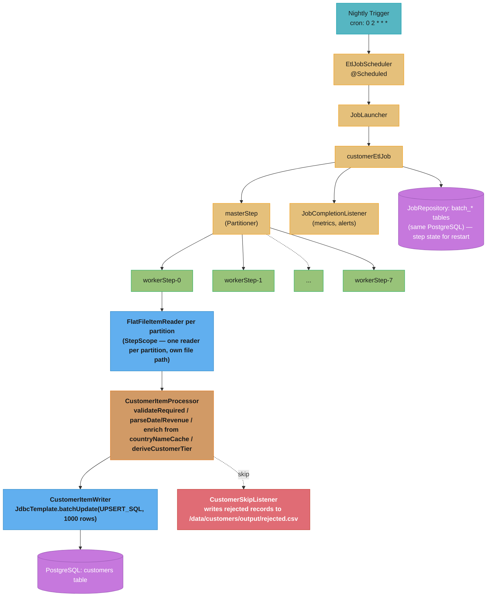

# Design: ETL Batch Pipeline with Spring Batch

> "A batch job is a relay race where the baton is never dropped: if a runner falls
> (crashed process), the race resumes from exactly that runner's baton position, not
> from the starting line. Spring Batch's `JobRepository` is the race official who
> tracks every baton handoff."

**Key insight:** Reliability in batch comes from two complementary properties. First,
chunk-based commits make failure granular — only the in-flight chunk rolls back, not the
whole job. Second, the `JobRepository` makes progress durable — the next launch *knows*
where the last launch left off and skips completed work. Without both, a mid-run crash
means starting over.

See also: [Testcontainers and test strategy](./cross_cutting/testcontainers_and_test_strategy.md),
[JVM tuning and GC for services](../../java/case_studies/cross_cutting/jvm_tuning_and_gc_for_services.md)

---

## 1. Requirements Clarification

**Functional requirements:**
- Read 10 million CSV records (~5 GB across multiple files) from a directory nightly.
- Validate and transform each record: type conversion, business-rule validation (email, country code), enrichment from an in-memory reference cache.
- Bulk-write to PostgreSQL with `INSERT ... ON CONFLICT DO UPDATE` (idempotent reruns).
- Skip malformed records (up to 1% of total = 100,000 records); log them to a
  rejected-records CSV file without failing the job.
- Restart from last successful checkpoint if the job fails partway through.

**Non-functional requirements:**
- Complete within a 3-hour nightly window (2 AM–5 AM).
- Throughput: ≥3.5 million records/hour = ~1,000 records/sec sustained.
- Single-machine deployment: 8-core server, 32 GB RAM.
- Retry on transient DB errors (up to 3 times); skip on permanent validation errors.
- Expose job metrics (records read/written/skipped, duration) via Micrometer.

**Out of scope:** Streaming ingestion, multi-machine remote partitioning, real-time
validation API, schema inference from CSV.

---

## 2. Scale Estimation

**Throughput math:**
```
Target:             10,000,000 records / 3 hours = 3,333,333 rec/hr = 926 rec/sec
Safety margin:      926 × 1.2 = 1,111 rec/sec target throughput

Chunk size = 1,000: 10,000,000 / 1,000 = 10,000 total chunks
Per-chunk latency:  ~200ms (read 1,000 lines + process + JDBC batchUpdate)
Single-threaded:    10,000 × 200ms = 2,000s = 33.3 min (well within 3h)
8 partitions (parallel): 10,000 / 8 = 1,250 chunks/partition
  1,250 × 200ms = 250s = 4.2 min per partition (ideal)
  Real-world (6× speedup due to DB contention): ~6 min total
```

**DB connection budget:**
```
8 partition threads, each holds 1 connection while writing:  8 connections
Spring Batch metadata TX (JobRepository):                    2 connections
Total minimum HikariCP pool:                                 10 connections
Recommended (headroom):                                      12-15 connections
  A pool < gridSize causes partition threads to block on connection acquisition,
  serializing the "parallel" job to single-threaded throughput.
```

**Memory budget:**
```
FlatFileItemReader:    streams line-by-line, O(1) memory (DO NOT load files into List)
Chunk working set:     1,000 items × ~2 KB/item = ~2 MB per partition
8 partitions live:     8 × 2 MB = 16 MB chunk data (negligible on 32 GB)
Country reference cache: 250 countries × ~200 bytes = ~50 KB (loaded once at startup)
JVM heap:              6-8 GB (-Xmx8g -Xms4g); most is free; G1GC default 200ms pause target
```

**Disk I/O budget:**
```
5 GB total CSV input: 8 partitions read in parallel = ~625 MB per partition
Sequential read rate: typical SSD 500 MB/s -> 1.25s to read all files
Bottleneck is NOT I/O — it is database write throughput
```

---

## 3. High-Level Architecture



**Component inventory:**

| Component | Responsibility |
|---|---|
| `CustomerPartitioner` | Maps input CSV files to `gridSize=8` execution contexts (one file path per context) |
| `FlatFileItemReader` (`@StepScope`) | Reads CSV line-by-line; restartable (persists `read.count` in `ExecutionContext`) |
| `CustomerItemProcessor` | Stateless transform + validation; throws `ValidationException` to trigger skip |
| `CustomerItemWriter` | JDBC `batchUpdate` UPSERT; 1 batch per chunk = 1 DB round-trip for 1,000 rows |
| `CustomerSkipListener` | Called on skip during read/process/write; writes to rejected-records file |
| `JobCompletionListener` | Aggregates step metrics, records Micrometer counters, sends alert on failure |
| `EtlJobScheduler` | `@Scheduled(cron="0 0 2 * * *")` — triggers nightly launch with stable `run.date` param |

---

## 4. Component Deep Dives

### 4.1 Job Configuration with Partitioned Steps

```java
@Configuration
public class CustomerEtlJobConfig {

    @Bean
    public Job customerEtlJob(JobRepository jobRepository, Step masterStep,
                               JobCompletionListener jobCompletionListener) {
        return new JobBuilder("customerEtlJob", jobRepository)
            .incrementer(new RunIdIncrementer())  // for fresh runs only; restart uses same JobInstance
            .listener(jobCompletionListener)
            .start(masterStep)
            .build();
    }

    @Bean
    public Step masterStep(JobRepository jobRepository, Step workerStep,
                            CustomerPartitioner partitioner) {
        return new StepBuilder("masterStep", jobRepository)
            .partitioner("workerStep", partitioner)
            .step(workerStep)
            .gridSize(8)                          // 8 partitions = 8 concurrent threads
            .taskExecutor(partitionTaskExecutor())
            .build();
    }

    @Bean
    public Step workerStep(JobRepository jobRepository,
                            PlatformTransactionManager transactionManager,
                            CustomerItemProcessor processor,
                            CustomerItemWriter writer,
                            CustomerSkipListener skipListener) {
        return new StepBuilder("workerStep", jobRepository)
            .<RawCustomerRecord, CustomerRecord>chunk(1000, transactionManager)
            .reader(customerItemReader(null))     // null — injected by @StepScope at runtime
            .processor(processor)
            .writer(writer)
            .faultTolerant()
            .skipLimit(100_000)                   // 1% of 10M
            .skip(ValidationException.class)
            .skip(FlatFileParseException.class)
            .retryLimit(3)
            .retry(TransientDataAccessException.class)
            .listener(skipListener)
            .build();
    }

    @Bean
    @StepScope
    public FlatFileItemReader<RawCustomerRecord> customerItemReader(
            @Value("#{stepExecutionContext['filePath']}") String filePath) {
        return new FlatFileItemReaderBuilder<RawCustomerRecord>()
            .name("customerItemReader")
            .resource(new FileSystemResource(filePath))
            .delimited().delimiter(",")
            .names("customerId", "firstName", "lastName", "email",
                   "dateOfBirth", "countryCode", "annualRevenue")
            .linesToSkip(1)                       // skip CSV header
            .targetType(RawCustomerRecord.class)
            .build();
    }

    @Bean
    public TaskExecutor partitionTaskExecutor() {
        ThreadPoolTaskExecutor executor = new ThreadPoolTaskExecutor();
        executor.setCorePoolSize(8);
        executor.setMaxPoolSize(8);
        executor.setQueueCapacity(0);             // no queuing; partitions start immediately
        executor.setThreadNamePrefix("batch-partition-");
        executor.initialize();
        return executor;
    }
}
```

### 4.2 BROKEN/FIX — Stateful ItemProcessor Leaks Data Across Chunks

```java
// BROKEN: instance field holds state across chunks and across partition threads
@Component
public class EnrichingProcessor implements ItemProcessor<Record, Record> {
    private BigDecimal runningTotal = BigDecimal.ZERO; // shared mutable state!

    @Override
    public Record process(Record item) {
        runningTotal = runningTotal.add(item.getAmount()); // corrupts under parallelism
        item.setRunningTotal(runningTotal);                // stale data for every item
        return item;
    }
}
```

Under 8-partition parallelism, two threads share the `@Component` singleton and corrupt
each other's `runningTotal`. Items get enriched with wrong values — silent data corruption.

```java
// FIX 1: make the processor a pure function of its input — no cross-item state
@Component
public class CustomerItemProcessor implements ItemProcessor<RawCustomerRecord, CustomerRecord> {

    private final Map<String, String> countryNameCache; // loaded once at startup, read-only

    public CustomerItemProcessor(CountryReferenceService countryReferenceService) {
        this.countryNameCache = countryReferenceService.loadAllCountries(); // immutable after init
    }

    @Override
    public CustomerRecord process(RawCustomerRecord raw) throws Exception {
        validateRequired(raw);
        validateEmail(raw.getEmail());

        CustomerRecord customer = new CustomerRecord();
        customer.setCustomerId(raw.getCustomerId().trim());
        customer.setEmail(raw.getEmail().trim().toLowerCase());
        customer.setDateOfBirth(parseDate(raw.getDateOfBirth(), raw.getLineNumber()));
        customer.setCountryCode(raw.getCountryCode().trim().toUpperCase());

        String countryName = countryNameCache.get(customer.getCountryCode());
        if (countryName == null)
            throw new ValidationException("Unknown country code: " + customer.getCountryCode());
        customer.setCountryName(countryName);

        BigDecimal revenue = parseRevenue(raw.getAnnualRevenue(), raw.getLineNumber());
        customer.setAnnualRevenue(revenue);
        customer.setCustomerTier(deriveCustomerTier(revenue));
        return customer;
    }
}
```

```java
// FIX 2: if per-execution state is genuinely needed, @StepScope creates a fresh instance per partition
@Bean
@StepScope
public ItemProcessor<Record, Record> scopedProcessor(
        @Value("#{stepExecutionContext['partitionKey']}") String key) {
    return new PartitionLocalProcessor(key); // fresh instance per partition, not shared
}
```

The rule: `ItemProcessor` must be stateless (pure function). Running aggregates belong in
the database, not in a shared processor field.

### 4.3 Item Writer — Bulk JDBC Upsert

```java
@Component
public class CustomerItemWriter implements ItemWriter<CustomerRecord> {

    private static final String UPSERT_SQL = """
        INSERT INTO customers
            (customer_id, first_name, last_name, email, date_of_birth,
             country_code, country_name, annual_revenue, customer_tier, updated_at)
        VALUES (?, ?, ?, ?, ?, ?, ?, ?, ?, NOW())
        ON CONFLICT (customer_id) DO UPDATE SET
            first_name = EXCLUDED.first_name,
            email = EXCLUDED.email,
            date_of_birth = EXCLUDED.date_of_birth,
            country_code = EXCLUDED.country_code,
            country_name = EXCLUDED.country_name,
            annual_revenue = EXCLUDED.annual_revenue,
            customer_tier = EXCLUDED.customer_tier,
            updated_at = NOW()
        """;

    private final JdbcTemplate jdbcTemplate;

    @Override
    public void write(Chunk<? extends CustomerRecord> chunk) throws Exception {
        List<? extends CustomerRecord> items = chunk.getItems();
        jdbcTemplate.batchUpdate(UPSERT_SQL, new BatchPreparedStatementSetter() {
            @Override
            public void setValues(PreparedStatement ps, int i) throws SQLException {
                CustomerRecord r = items.get(i);
                ps.setString(1, r.getCustomerId());
                ps.setString(2, r.getFirstName());
                ps.setString(3, r.getLastName());
                ps.setString(4, r.getEmail());
                ps.setDate(5, java.sql.Date.valueOf(r.getDateOfBirth()));
                ps.setString(6, r.getCountryCode());
                ps.setString(7, r.getCountryName());
                ps.setBigDecimal(8, r.getAnnualRevenue());
                ps.setString(9, r.getCustomerTier());
            }
            @Override public int getBatchSize() { return items.size(); }
        });
    }
}
```

### 4.4 Skip Listener and Job Completion Listener

```java
@Component
public class CustomerSkipListener implements SkipListener<RawCustomerRecord, CustomerRecord> {

    @Value("${batch.output.rejected-file:/data/customers/output/rejected.csv}")
    private String rejectedFilePath;

    @Override
    public void onSkipInProcess(RawCustomerRecord item, Throwable t) {
        writeRejected("PROCESS_ERROR", item.getCustomerId(), t.getMessage());
    }

    @Override
    public void onSkipInRead(Throwable t) { writeRejected("READ_ERROR", "N/A", t.getMessage()); }

    @Override
    public void onSkipInWrite(CustomerRecord item, Throwable t) {
        writeRejected("WRITE_ERROR", item.getCustomerId(), t.getMessage());
    }

    private synchronized void writeRejected(String phase, String id, String reason) {
        try (PrintWriter w = new PrintWriter(new BufferedWriter(
                new FileWriter(rejectedFilePath, true)))) {
            w.println(Instant.now() + "," + phase + "," + id + "," +
                      reason.replace(",", ";"));
        } catch (IOException e) {
            log.error("Failed to write rejected record: {}", e.getMessage());
        }
    }
}
```

```java
@Component
public class JobCompletionListener implements JobExecutionListener {

    @Override
    public void afterJob(JobExecution jobExecution) {
        long read  = jobExecution.getStepExecutions().stream().mapToLong(se -> se.getReadCount()).sum();
        long write = jobExecution.getStepExecutions().stream().mapToLong(se -> se.getWriteCount()).sum();
        long skip  = jobExecution.getStepExecutions().stream().mapToLong(se -> se.getSkipCount()).sum();
        Duration dur = Duration.between(jobExecution.getStartTime(), jobExecution.getEndTime());

        log.info("ETL complete: status={} read={} written={} skipped={} durationSec={}",
                 jobExecution.getStatus(), read, write, skip, dur.toSeconds());

        meterRegistry.counter("batch.records.read",    "job", "customerEtlJob").increment(read);
        meterRegistry.counter("batch.records.written", "job", "customerEtlJob").increment(write);
        meterRegistry.counter("batch.records.skipped", "job", "customerEtlJob").increment(skip);

        if (jobExecution.getStatus() == BatchStatus.FAILED) {
            alertService.sendAlert("ETL job FAILED after " + dur.toMinutes() + " min");
        } else if (read > 0 && (double) skip / read > 0.02) {
            alertService.sendAlert("ETL skip rate > 2%: " + skip + "/" + read);
        }
    }
}
```

### 4.5 BROKEN/FIX — JobParametersIncrementer Breaks Restart

```java
// BROKEN: every launch gets a unique run.id -> always a new JobInstance -> restart = full reprocess
jobLauncher.run(importJob,
    new JobParametersBuilder()
        .addLong("run.id", System.currentTimeMillis()) // always unique
        .toJobParameters());
// On restart after failure: Spring Batch creates brand-new JobInstance,
// reprocesses all 10M records from zero, double-writes 750,000 already-committed rows.
```

```java
// FIX: use a stable identifying parameter so restart matches the failed JobInstance
@Scheduled(cron = "0 0 2 * * *")
public void runNightly() throws Exception {
    JobParameters params = new JobParametersBuilder()
        .addString("run.date", LocalDate.now().toString())  // stable for the day
        // non-identifying restart key (does not create new instance):
        .addLong("attempt", System.currentTimeMillis(), false) // false = non-identifying
        .toJobParameters();
    jobLauncher.run(customerEtlJob, params);
}
// Relaunch after failure: pass the SAME run.date -> Spring Batch finds FAILED instance -> resume
```

---

## 5. Design Decisions & Tradeoffs

| Decision | Choice | Alternative | Rationale |
|---|---|---|---|
| Parallel strategy | `TaskExecutorPartitioner` (in-process, 8 threads) | Remote partitioning (separate JVMs/pods) | Single 8-core machine has sufficient capacity; remote adds broker + worker deployments for no throughput gain |
| Chunk size | 1,000 | 100 (high TX overhead) / 10,000 (high rollback cost) | 1,000-row batches achieve 1,200 rec/sec per thread; 100-row batches 600 rec/sec; 10,000-row batches increase reprocessing on retry |
| DB insert strategy | `JdbcBatchItemWriter` with UPSERT | PostgreSQL `COPY` command | COPY is 3–5× faster but cannot do `ON CONFLICT DO UPDATE`; UPSERT enables idempotent reruns without pre-truncate |
| Skip vs fail-fast | `.skipLimit(100_000)` for `ValidationException` | Fail the whole job on first bad record | Business requirement: 1% malformed records are expected; silent skip with audit log is the correct tradeoff |
| ItemProcessor enrichment | Pre-load country cache (250 entries) at startup | DB lookup per record | 250 countries × 10M lookups = 250M DB reads if not cached; pre-load at startup adds ~50ms, saves ~500s |
| Partition strategy | File-per-partition | Line-range within a single file | Simpler (no byte-offset seeking); `FlatFileItemReader` does not support range-based reads natively |

### @JobScope vs @StepScope lifecycle

| Scope | Bean created when | Destroyed when | Use for |
|---|---|---|---|
| `@StepScope` | step execution starts | step execution ends | readers/writers/processors needing partition-specific state or late-bound parameters |
| `@JobScope` | job execution starts | job execution ends | beans needing job parameters but shared across steps |
| singleton | context refresh | context shutdown | stateless shared components only |

`@StepScope` is critical for partitioned jobs: under `TaskExecutorPartitioner` each partition runs as a separate `StepExecution`, so `@StepScope` creates a fresh bean per partition — giving each reader its own file path and read cursor.

---

## 6. Real-World Implementations

**LinkedIn (Feed Processing):** LinkedIn's offline feed ranking pipeline processes billions of events nightly using a partitioned job architecture conceptually identical to Spring Batch's master-worker model. Critical difference: they shard by `memberId` range (not files) to ensure a member's full activity history lands in one partition, making per-member aggregations local to a single thread.

**Salesforce (Data Export):** Salesforce's Bulk API for large-scale data export uses a chunk-commit model: 200-row batches committed as separate SOQL operations, each with its own retry budget. The design mirrors Spring Batch's chunk-oriented processing — if a batch fails, only 200 records are retried, not the full export job.

**Healthcare clearinghouses (EDI 835 processing):** Medical claim remittance processing (EDI 835 files) is one of the oldest Spring Batch use cases. A single payer can send 100k+ claim records in one nightly 835 file. The skip-and-log pattern is mandated by CMS compliance: invalid claims must be rejected with an audit record rather than failing the entire remittance.

**E-commerce platforms (catalog refresh):** Major e-commerce platforms run Spring Batch jobs to nightly sync product catalog from ERP systems (~5M SKUs, ~2 GB CSV). The key pattern: skip-and-alert for missing required fields (product ID, GTIN), upsert for price/inventory fields that update daily. Parallel partitioning is by category hierarchy so cache warm-up is partition-local.

**AWS Glue (managed equivalent):** AWS Glue ETL provides a managed equivalent: DynamicFrames for schema inference, Job Bookmarks for restart (equivalent to `JobRepository`), and Worker nodes for parallelism (equivalent to remote partitioning). For on-prem or non-AWS workloads, Spring Batch provides equivalent functionality without managed infrastructure costs.

---

## 7. Technologies & Tools

| Tool | Restart support | Parallel processing | Skip/retry | Spring integration | When to choose |
|---|---|---|---|---|---|
| **Spring Batch 5.x** | `JobRepository` + checkpoint | `TaskExecutorPartitioner` / remote | `.faultTolerant().skip().retry()` | Native | Default for Spring Boot ETL; single or multi-machine batch |
| **Spring Integration** | Via message store + polling | Message channels | Error channel routing | Native | When processing needs to be reactive/streaming rather than checkpoint-based |
| **Apache Spark** | Checkpointing + stage retry | Native (distributed) | Custom accumulator | Via spark-java | When data volume requires multiple machines; for 10M records, Spark is overkill |
| **Apache Flink** | Savepoints | Native (distributed) | Via side outputs | Via Flink-Spring | Real-time streaming with windowed batch semantics; excessive for nightly-file ETL |
| **AWS Glue** | Job bookmarks | Managed worker nodes | Built-in | None | Cloud-native, no ops burden; tight AWS lock-in |
| **Temporal** | Workflow durability log | Activity workers | Retry policies on activities | Via SDK | When ETL requires human approval gates or multi-day orchestration |

---

## 8. Operational Playbook

### (a) Metrics to Monitor

- `batch.records.skipped{job=customerEtlJob}`: alert if > 2% skip rate
- `batch.job.duration{job=customerEtlJob,status=COMPLETED}`: alert if > 2.5 hours (approaching window limit)
- Prometheus: `batch_step_execution_write_count` per partition — if one partition is significantly behind others, it has a hot partition or DB connection starvation issue
- PostgreSQL: `pg_stat_activity` — check for long-running batch transactions; a stuck partition holds a lock for the entire chunk duration

### (b) Job Status Inspection

```
# Check if job is running or in which state partitions are:
GET /actuator/batch/jobs/customerEtlJob
GET /actuator/batch/jobs/customerEtlJob/{jobInstanceId}

# Useful DB query for current step execution state:
SELECT step_name, status, read_count, write_count, skip_count, start_time
FROM BATCH_STEP_EXECUTION
WHERE job_execution_id = (
  SELECT max(job_execution_id) FROM BATCH_JOB_EXECUTION WHERE job_instance_id = <id>
)
ORDER BY step_name;
```

### (c) Incident Runbooks

**Runbook 1: Job stuck — partitions not completing**
- Symptom: job running > 2 hours; `batch_step_execution_status = STARTED` for multiple partitions; no progress in `write_count`
- Diagnose: check `pg_stat_activity` for blocking queries on `customers` table; check for long-held chunk transactions; check if `partitionTaskExecutor` thread pool is saturated (partition thread waiting for DB connection)
- Mitigate: if connection starvation, increase `hikari.maximum-pool-size` by +4 and restart; if blocking query, identify and kill it via `SELECT pg_cancel_backend(pid)`
- Resolve: confirm `write_count` advancing; monitor completion within remaining window

**Runbook 2: Skip rate exceeds limit — job failed with SkipLimitExceededException**
- Symptom: job status `FAILED`, exit description `SkipLimitExceededException`; `rejected.csv` has > 100,000 entries
- Diagnose: inspect `rejected.csv` — look for systemic pattern (all same field, same country code, all from one source file)
- Mitigate: if source data quality issue (upstream ETL bug), notify data team and await re-drop of corrected files; if legitimate data variability increase, temporarily raise `.skipLimit(200_000)` and relaunch with same `run.date`
- Resolve: relaunch with same identifying parameters to resume from failed partition

**Runbook 3: Manual restart after partial failure**
1. Identify the failed job instance: `SELECT * FROM BATCH_JOB_EXECUTION ORDER BY create_time DESC LIMIT 5`
2. Find the failed `run.date` parameter: `SELECT * FROM BATCH_JOB_EXECUTION_PARAMS WHERE job_execution_id = <id>`
3. Fix the root cause (disk full, downstream DB outage, etc.)
4. Relaunch with the exact same `run.date`: completed partitions are skipped automatically
5. DO NOT use a new `run.date` — this creates a new `JobInstance` and reprocesses everything

**Runbook 4: Job launcher conflict (two jobs launched simultaneously)**
- Symptom: `JobExecutionAlreadyRunningException` in logs; second launch rejected
- Diagnose: check if the previous nightly run is still running (exceeded its 3-hour window) or if ShedLock failed to prevent double-trigger
- Mitigate: if the previous run is healthy, let it complete; if it is stuck, mark `BATCH_JOB_EXECUTION` status manually to `ABANDONED` and relaunch after root cause is fixed
- Resolve: investigate why the previous run exceeded window; tune chunk size, partition count, or DB connection pool

---

## 9. Common Pitfalls & War Stories

### War Story 1: Stateful Processor Corrupted Revenue Totals

An enrichment processor accumulated a running revenue sum in an instance field to compute tier thresholds dynamically. Under 8-partition parallelism, two partition threads mutated the same `runningTotal` field simultaneously. Revenue totals were corrupted — GOLD customers were downgraded to SILVER, triggering incorrect pricing for ~12,000 customers over a 6-week period until a weekly audit query caught the discrepancy. (See §4.2 for the BROKEN/FIX.)

**Root cause:** `@Component` beans are singletons shared across all threads. `ItemProcessor` must be stateless or `@StepScope`d.

### War Story 2: JobParametersIncrementer on Restart Reprocessed Everything

The job used `new RunIdIncrementer().getNext(params)` on every launch, including manual operator restarts. When a job failed at 7.5 million records, the operator relaunched — but a new `run.id` created a brand-new `JobInstance`, so Spring Batch saw no existing instance to resume. All 10 million records were reprocessed from scratch, writing 7.5 million duplicate rows (deduplicated by UPSERT, but the reprocessing took 2.5 hours and missed the data SLA). (See §4.5 for the BROKEN/FIX.)

**Root cause:** Identifying parameters determine `JobInstance` identity. A restart MUST use the same identifying parameters as the original run.

### War Story 3: HikariCP Pool Too Small — Silent Job Serialization

A team provisioned a HikariCP pool of 8 connections for a job with `gridSize=8`. Each worker partition acquired a connection for the duration of the chunk write. With 8 partitions and 8 connections, there were zero remaining connections for the Spring Batch `JobRepository` metadata writes, causing all partition threads to block on `HikariCP.getConnection()` after each chunk commit. The job ran — but serially, at ~1/8th expected throughput, taking 6 hours instead of 45 minutes.

**Root cause:** `pool_size < gridSize + metadata_connections`. Set pool to at least `gridSize + 4`. Monitor `hikaricp.connections.pending` — nonzero pending is the diagnostic signal.

### War Story 4: preventRestart() Called After a Production Incident

After a job ran twice due to a scheduling misconfiguration, a developer added `.preventRestart()` to the `JobBuilder` to prevent re-runs. This was deployed without review. Three weeks later, the nightly job failed at midnight, and no restart was possible — `preventRestart()` causes Spring Batch to throw `JobRestartException` on any relaunch of a non-`COMPLETED` instance. The only recovery was deleting the `BATCH_JOB_EXECUTION` row manually and reprocessing from scratch.

**Fix:** Never call `.preventRestart()` on a job that processes large volumes — restartability is the primary operational safety net. Use ShedLock or `@SchedulerLock` to prevent duplicate launches instead.

---

## 10. Capacity Planning

### Chunk and throughput math

```
10,000,000 records, chunk 1,000 = 10,000 total chunks
Per-chunk time:    200ms (read + process + write 1,000 items)
Single-threaded:   10,000 × 200ms = 2,000s = 33 min (1 instance)
8 partitions:      Ideal 8× = 4.2 min; real-world 6× speedup = ~6 min

Throughput verification:
  8 partitions × 1,000 records/chunk / 0.200s = 40,000 records/sec (ideal)
  With 6× speedup: ~30,000 records/sec = 1.8M records/min (well within 3h budget)
```

### Partition and connection sizing formula

```
Required DB connections = gridSize + metadata_connections
                        = 8 + 4 (JobRepository, Spring internals)
                        = 12 minimum
                        = 15 recommended (headroom for retries + monitoring queries)

HikariCP pool:     hikari.maximum-pool-size: 15
                   hikari.minimum-idle: 8 (always-on, avoid cold-start latency)
```

### Memory and GC budget

```
Chunk working set:    8 partitions × 1,000 items × 2 KB = 16 MB (Eden space)
Country cache:        50 KB (negligible, survives G1 marking trivially)
JVM heap:             -Xmx8g -Xms4g (leave 24 GB for OS page cache on 32 GB machine)
GC tuning:            G1GC default; -XX:MaxGCPauseMillis=200 (default)
                      Monitor: if Young GC > 200ms, increase -XX:G1NewSizePercent=30

JDBC batch benchmark:
  Chunk 100:    ~600 rec/sec per thread (too many transactions)
  Chunk 1,000:  ~1,200 rec/sec per thread (chosen)
  Chunk 10,000: ~1,400 rec/sec per thread (marginal gain; +10× rollback cost)
  -> Chunk 1,000 is the optimum: high throughput, manageable rollback scope
```

---

## 11. Interview Discussion Points

**Q: What happens when you restart a failed job — will completed partitions be reprocessed?**

A: No. Spring Batch stores each `StepExecution` status in the `JobRepository`. When relaunched with the same identifying job parameters, Spring Batch finds the existing `JobInstance`, checks `BATCH_STEP_EXECUTION` for each partition, and skips those in `COMPLETED` status. Only partitions in `FAILED` or `STARTED` status are reprocessed. This requires the reader to be restartable (`FlatFileItemReader` persists `read.count` in `ExecutionContext`) and the job to NOT call `.preventRestart()`.

**Q: How do you prevent two instances of the cron job from running simultaneously?**

A: Spring Batch's `JobRepository` prevents concurrent execution of the same `JobInstance` by throwing `JobExecutionAlreadyRunningException` if an instance is already `STARTED`. For distributed deployments where multiple JVMs share the same DB, use ShedLock with `@SchedulerLock(name="customerEtlJob", lockAtMostFor="3h")` to ensure only one instance acquires the lock and triggers the launch. The `JobRepository` DB constraint serves as a second line of defense.

**Q: The skip limit is 1%. What happens if exactly skip-limit+1 records are bad?**

A: Spring Batch throws `SkipLimitExceededException` and fails the job with status `FAILED`. The `JobCompletionListener.afterJob()` detects `BatchStatus.FAILED` and fires an alert. The job can then be investigated, the skip limit temporarily raised, and relaunched. Setting the skip limit at 1% is a data quality contract — exceeding it means the source data has a systemic problem that should not be silently absorbed.

**Q: Why must an ItemProcessor be stateless, and what if it genuinely needs per-run state?**

A: An `ItemProcessor` bean is a singleton shared across all chunks and partition threads. Any mutable instance field leaks state between chunks (data corruption) and threads (race conditions). The fix for cross-item state is `@StepScope` — a fresh processor instance per step (and per partition), isolated from sibling threads. Running aggregates that span the full job belong in a dedicated aggregation step or directly in the database.

**Q: How do you tune chunk size and partition count to process 10M records fastest?**

A: Profile first. With 8 cores and `gridSize=8`, each partition handles 1.25M records. Set `HikariCP pool ≥ gridSize + 4` or partition threads block on connection acquisition, serializing the job. Benchmark chunk sizes: 100-row batches are CPU-bound on transaction overhead; 1,000-row batches balance transaction overhead vs rollback cost and achieve ~1,200 rec/sec per thread; 10,000-row batches add <200 rec/sec but triple rollback scope on retry. Tune until the bottleneck shifts from transactions to actual I/O or CPU.

**Q: What is the difference between @JobScope and @StepScope?**

A: Both defer bean creation to runtime for late parameter binding. `@JobScope` beans live for the job execution lifetime — useful for beans needing `#{jobParameters['run.date']}`. `@StepScope` beans live for the step execution lifetime — and under partitioning, a fresh instance per partition step execution. This is what makes a `@StepScope` reader safe under parallelism: each partition reader has its own `read.count` cursor and file path. A `@StepScope` bean injected into a singleton requires `proxyMode = ScopedProxyMode.TARGET_CLASS`.

**Q: Why can launching with a unique `run.id` each time break restart?**

A: Spring Batch identifies a `JobInstance` by its identifying parameters. A unique `run.id` (e.g., `System.currentTimeMillis()`) on every launch creates a brand-new instance each time — so relaunching after failure does not resume the failed instance; it starts fresh and double-writes already-committed rows. Use a stable identifying parameter (`run.date=2026-05-24`) for the business identity of a run. Use `addLong("attempt", timestamp, false)` for non-identifying uniqueness if needed.

**Q: How would you implement a progress API for the running job?**

A: Spring Boot Actuator with Spring Batch provides `/actuator/batch/jobs/{name}` and `/actuator/batch/jobs/{name}/{instanceId}` endpoints that query the `JobRepository` for current `StepExecution` read/write/skip counts. For real-time Grafana dashboards, expose the step execution write count via a Micrometer gauge (`Gauge.builder("batch.write.count").register(registry)`) updated in a `ChunkListener.afterChunk()` — Prometheus scrapes it every 15 seconds, giving a live throughput view.

**Q: How do you handle the case where CSV files arrive late?**

A: The `CustomerPartitioner` throws `IllegalStateException` if no files exist, failing the `masterStep` before any processing starts. The job status is `FAILED` and an alert fires. The operational procedure: fix file delivery, drop files into the input directory, then relaunch with the same `run.date`. For proactive handling, use Spring Integration's `FileReadingMessageSource` to watch the directory and trigger the job only when all expected files have arrived, with a configurable timeout (e.g., files must arrive by 2:30 AM or the job is skipped and an incident is opened).

**Q: How does Spring Batch implement exactly-once processing at the database level, and what is the role of the `JobRepository`?**

A: Spring Batch uses optimistic locking on `StepExecution` rows — the `JobRepository` stores every chunk commit as a database transaction that increments a `version` column. If two concurrent executions try to commit the same step, the second update fails (`ObjectOptimisticLockingFailureException`) and the job fails safely. This prevents duplicate writes even under at-least-once chunk retry. The `JobRepository` also stores the exact last committed read count; on restart, the `FlatFileItemReader` skips that many records to resume exactly at the failure point, achieving effectively-once semantics for file-sourced jobs.
