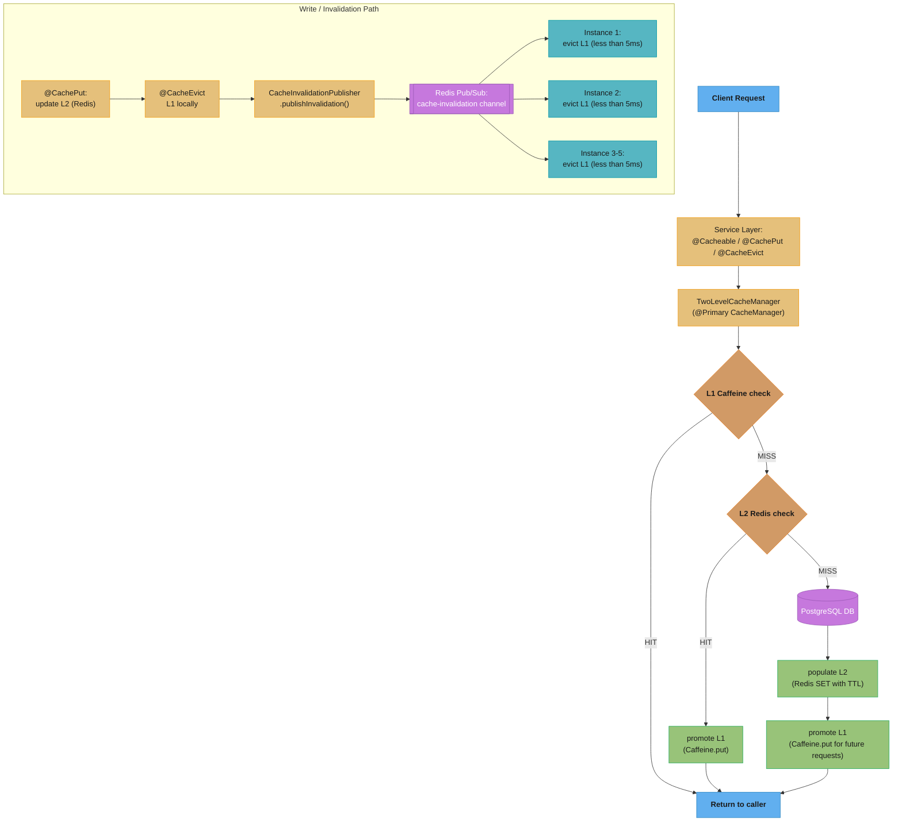

# Design: Distributed Caching Layer with Redis and Caffeine

> "A cache is a confidence trick: you convince the application that the data is right
> here, sub-millisecond away. The moment the trick fails — a cold start, a Redis outage,
> a stampede on expiry — the database behind the curtain absorbs a spike it was never
> sized to handle."

**Key insight:** At scale the database is provisioned for cache-hit traffic, not cache-miss
traffic. This means a cache failure is often an *availability* problem, not just a
performance problem. The L1 (in-process Caffeine) is not a performance optimization — it
is the primary failsafe that keeps the database alive during Redis failover.

See also: [Resilience4j patterns](./cross_cutting/resilience4j_patterns.md),
[OTel observability for Spring](./cross_cutting/otel_observability_for_spring.md)

---

## 1. Requirements Clarification

**Functional requirements:**
- Reduce PostgreSQL read load by 80% for a microservices platform at 20,000 read req/sec peak.
- 85% of reads access ~50,000 frequently-read product and catalog records.
- Per-cache TTL: product catalog 1 hour, user sessions 30 minutes, pricing 5 minutes.
- Prevent cache stampede when a popular key expires with 500 concurrent threads requesting it.
- Invalidate cache entries in near-real-time when data is updated (not just wait for TTL).
- Warm cache on startup to prevent cold-start latency spikes after deployments.
- Two-level cache: in-process Caffeine (L1, sub-millisecond) backed by Redis (L2, cross-instance consistency).

**Non-functional requirements:**
- Cache hit rate ≥ 80% steady-state; ≥ 70% alert threshold.
- P99 cache-hit latency: < 0.1ms (L1), < 2ms (L2).
- Database survives L2 Redis outage (L1 must absorb hot keys during ~30s failover).
- Cross-instance staleness after write: < 10ms (Pub/Sub propagation bound).

**Constraints:** Spring Boot 3.x, Redis 7, Caffeine 3.x, 5 microservice instances.

**Out of scope:** Redis Cluster migration (single instance now, cluster-ready design), read-your-own-writes consistency across instances, write-behind pattern for financial data.

---

## 2. Scale Estimation

**Traffic math:**
```
Peak reads:           20,000 req/sec
Cache hit rate (85%): 17,000 req/sec served from cache
DB read rate:          3,000 req/sec (only cache misses + writes)
  -> Database sized for 3,000-4,000 reads/sec
  -> If cache fails: DB faces 20,000 reads/sec = 5-6× overload -> potential collapse

With two-level cache:
  L1 Caffeine (hot 50%):  10,000 req/sec at <0.1ms
  L2 Redis (warm 35%):     7,000 req/sec at ~1ms
  DB (cold 15%):           3,000 req/sec at ~5ms
```

**Cache sizing:**
```
50,000 cached objects × ~2 KB average (JSON): 100 MB raw
Redis overhead (key string, TTL, jemalloc fragmentation): ~1.5× raw = 150 MB
Redis max memory:  512 MB (generous for 50k hot keys; set maxmemory=256m for safety)
Caffeine L1:       maximumSize=50,000 entries; each entry ~2 KB = ~100 MB JVM heap
  -> budget ~150 MB JVM heap for L1 per instance (-Xmx1g leaves ample room)
```

**Pub/Sub invalidation throughput:**
```
Write rate (invalidations): ~100 writes/sec (5% of 2,000 writes/sec is cross-service)
Redis Pub/Sub channel:      ~100 messages/sec (negligible; single-threaded sub is fine)
L1 eviction lag:            < 5ms (network RTT to each instance subscriber)
Max staleness after write:  < 10ms (acceptable for product catalog, pricing)
```

**Connection pool:**
```
Lettuce default:   1 connection (multiplexed, suitable for < 10k ops/sec)
At 20k read req/sec + pub/sub: use LettucePoolingClientConfiguration maxTotal=16
  (pipelining allows high throughput per connection; pool for burst safety)
```

---

## 3. High-Level Architecture



**Component inventory:**

| Component | Responsibility |
|---|---|
| `CacheConfig` | Configures `RedisCacheManager` (per-cache TTL) and `CaffeineCacheManager` (50k max, 5min write-expiry) |
| `TwoLevelCacheManager` | `@Primary CacheManager`; wraps each cache as a `TwoLevelCache` |
| `TwoLevelCache` | L1-first get; L2 fallthrough with L1 promotion; writes to both levels; evicts from both |
| `ProductService` | Domain service; uses `@Cacheable(sync=true)` for stampede prevention |
| `CacheInvalidationPublisher` | `StringRedisTemplate.convertAndSend("cache-invalidation", ...)` on every write |
| `CacheInvalidationListener` | `MessageListener` on "cache-invalidation" channel; evicts Caffeine L1 entries |
| `CacheWarmingRunner` | `ApplicationRunner`: pre-loads top 10,000 products before readiness probe passes |
| `CacheMetricsRegistrar` | Registers Micrometer `Gauge` for L1 hit rate, size, eviction count |

---

## 4. Component Deep Dives

### 4.1 Cache Configuration

```java
@Configuration
public class CacheConfig {

    @Bean
    public RedisCacheManager redisCacheManager(RedisConnectionFactory connectionFactory) {
        RedisCacheConfiguration defaultConfig = RedisCacheConfiguration.defaultCacheConfig()
            .entryTtl(Duration.ofHours(1))
            .serializeValuesWith(RedisSerializationContext.SerializationPair
                .fromSerializer(new GenericJackson2JsonRedisSerializer()));

        Map<String, RedisCacheConfiguration> cacheConfigs = new HashMap<>();
        cacheConfigs.put("products",     defaultConfig.entryTtl(Duration.ofHours(1)));
        cacheConfigs.put("pricing",      defaultConfig.entryTtl(Duration.ofMinutes(5)));
        cacheConfigs.put("userSessions", defaultConfig.entryTtl(Duration.ofMinutes(30)));
        cacheConfigs.put("categoryTree", defaultConfig.entryTtl(Duration.ofHours(6)));
        cacheConfigs.put("inventory",    defaultConfig.entryTtl(Duration.ofMinutes(2)));

        return RedisCacheManager.builder(connectionFactory)
            .cacheDefaults(defaultConfig)
            .withInitialCacheConfigurations(cacheConfigs)
            .build();
    }

    @Bean
    public CaffeineCacheManager caffeineCacheManager() {
        CaffeineCacheManager manager = new CaffeineCacheManager();
        manager.setCaffeine(Caffeine.newBuilder()
            .maximumSize(50_000)
            .expireAfterWrite(Duration.ofMinutes(5)) // shorter than Redis TTL intentionally
            .recordStats());
        return manager;
    }

    @Bean @Primary
    public CacheManager compositeCacheManager(CaffeineCacheManager l1,
                                               RedisCacheManager l2) {
        return new TwoLevelCacheManager(l1, l2);
    }
}
```

### 4.2 Two-Level Cache Implementation

```java
public class TwoLevelCache implements Cache {

    private final String name;
    private final Cache l1;  // Caffeine
    private final Cache l2;  // Redis

    @Override
    @Nullable
    public ValueWrapper get(Object key) {
        ValueWrapper l1Value = l1.get(key);
        if (l1Value != null) return l1Value;   // L1 hit: sub-ms

        ValueWrapper l2Value = l2.get(key);    // L2 check: ~1ms
        if (l2Value != null) {
            l1.put(key, l2Value.get());         // promote to L1 for future requests
        }
        return l2Value;                        // null = DB miss -> @Cacheable loads from DB
    }

    @Override
    public <T> T get(Object key, Callable<T> valueLoader) {
        // Called by @Cacheable(sync=true) — delegates distributed lock to L2
        T value = l2.get(key, valueLoader);    // only one node calls valueLoader (via Redisson lock)
        if (value != null) l1.put(key, value); // promote L2 hit to L1
        return value;
    }

    @Override
    public void put(Object key, @Nullable Object value) {
        l1.put(key, value);
        l2.put(key, value);                    // writes go to both levels
    }

    @Override
    public void evict(Object key) {
        l1.evict(key);
        l2.evict(key);                         // local eviction + Redis DEL
    }
}
```

### 4.3 Service Layer — @Cacheable with stampede prevention

```java
@Service
public class ProductService {

    @Cacheable(value = "products", key = "#productId", sync = true)
    public Product getProduct(String productId) {
        return productRepository.findById(productId)
            .orElseThrow(() -> new ProductNotFoundException(productId));
    }

    @CachePut(value = "products", key = "#product.id")
    public Product updateProduct(Product product) {
        Product saved = productRepository.save(product);
        cacheInvalidationPublisher.publishInvalidation("products", product.getId());
        return saved;
    }

    @CacheEvict(value = "products", key = "#productId")
    public void deleteProduct(String productId) {
        productRepository.deleteById(productId);
        cacheInvalidationPublisher.publishInvalidation("products", productId);
    }

    @Cacheable(value = "pricing", key = "#productId + ':' + #customerId")
    public Price getPrice(String productId, String customerId) {
        return productRepository.calculatePrice(productId, customerId);
    }
}
```

### 4.4 Cache Invalidation via Redis Pub/Sub

```java
@Component
public class CacheInvalidationPublisher {
    private static final String CHANNEL = "cache-invalidation";
    private final StringRedisTemplate redisTemplate;

    public void publishInvalidation(String cacheName, String key) {
        redisTemplate.convertAndSend(CHANNEL, cacheName + ":" + key);
    }
}

@Component
public class CacheInvalidationListener implements MessageListener {

    private final CacheManager caffeineCacheManager;  // L1 only — L2 already updated by @CachePut

    @Override
    public void onMessage(Message message, byte[] pattern) {
        String body = new String(message.getBody());
        String[] parts = body.split(":", 2);
        if (parts.length != 2) return;

        String cacheName = parts[0];
        String key       = parts[1];

        var cache = caffeineCacheManager.getCache(cacheName);
        if (cache == null) return;

        if ("*".equals(key)) cache.clear();
        else                  cache.evict(key);
    }
}

@Configuration
public class RedisListenerConfig {
    @Bean
    public RedisMessageListenerContainer cacheInvalidationContainer(
            RedisConnectionFactory factory, CacheInvalidationListener listener) {
        RedisMessageListenerContainer container = new RedisMessageListenerContainer();
        container.setConnectionFactory(factory);
        container.addMessageListener(listener, new ChannelTopic("cache-invalidation"));
        return container;
    }
}
```

### 4.5 BROKEN/FIX — Cache Key Collision Across Services

```java
// BROKEN: two services use the same unqualified key "user:{id}" on a shared Redis cluster
// user-service:
redisTemplate.opsForValue().set("user:" + id, userProfile);    // UserProfile

// order-service:
redisTemplate.opsForValue().set("user:" + id, orderSummary);   // OrderSummary — collision!
// A read of "user:42" returns whichever service wrote last -> ClassCastException or silent corruption
```

```java
// FIX: namespace every key with service + entity
// user-service:
redisTemplate.opsForValue().set("user-service:profile:" + id, userProfile);

// order-service:
redisTemplate.opsForValue().set("order-service:user-summary:" + id, orderSummary);
```

```java
// FIX via Spring cache name (RedisCacheManager prefixes keys with cache name by default):
@Cacheable(cacheNames = "user-service:profile", key = "#id")
public UserProfile getProfile(String id) { ... }
// Redis key becomes: "user-service:profile::42"
// Never collides with "order-service:user-summary::42"
```

### 4.6 BROKEN/FIX — Caching Mutable Objects

```java
// BROKEN: cached instance is shared; callers mutate shared state
@Cacheable(cacheNames = "carts", key = "#id")
public Cart getCart(String id) { return cartRepository.findById(id); }

Cart c = cartService.getCart("42");
c.addItem(item); // mutates the cached object in place — visible to ALL other callers!
```

```java
// FIX: cache immutable snapshots using Java records
public record CartView(String id, List<ItemView> items, BigDecimal total) {}

@Cacheable(cacheNames = "carts", key = "#id")
public CartView getCart(String id) {
    return CartView.from(cartRepository.findById(id)); // immutable; callers cannot mutate
}
```

For Redis-backed caches this is less risky (each read deserializes a fresh object), but for
in-process L1 caches that return object references, mutability is a correctness landmine.

### 4.7 Cache Warming on Startup

```java
@Component
public class CacheWarmingRunner implements ApplicationRunner {

    private static final int WARM_PRODUCT_COUNT = 10_000;

    @Override
    public void run(ApplicationArguments args) {
        log.info("Warming cache with top {} products", WARM_PRODUCT_COUNT);
        long startMs = System.currentTimeMillis();

        List<Product> hotProducts = productRepository.findTopByAccessFrequency(WARM_PRODUCT_COUNT);
        var productCache = cacheManager.getCache("products");
        if (productCache == null) return;

        hotProducts.forEach(p -> productCache.put(p.getId(), p));

        log.info("Cache warming complete: warmedEntries={} durationMs={}",
                 hotProducts.size(), System.currentTimeMillis() - startMs);
    }
}
```

`ApplicationRunner` runs after all beans are initialized but before the readiness probe
passes (assuming the K8s readiness probe polls `/actuator/health/readiness`). This means
the instance is not included in load balancer rotation until warming is complete, preventing
cold-start stampedes after rolling deployments.

---

## 5. Design Decisions & Tradeoffs

| Decision | Choice | Alternative | Rationale |
|---|---|---|---|
| Cache topology | L1 Caffeine + L2 Redis (two-level) | Redis only | Redis-only adds ~1ms per hit; at 17k cache hits/sec that is 17 aggregated seconds of latency per second — degrades P99 badly |
| Cache invalidation | Redis Pub/Sub broadcast to L1 | TTL-only (wait for expiry) | 5-minute TTL for pricing means up to 5-minute stale prices; Pub/Sub reduces staleness to <10ms at low cost |
| Stampede prevention | `@Cacheable(sync=true)` + Caffeine native locking | No synchronization | Without sync, 500 concurrent threads on the same expired key all hit the DB simultaneously; sync coalesces them to one loader |
| Write pattern | Cache-aside (`@CachePut` + invalidate) | Write-behind (async DB flush) | Write-behind risks data loss if cache crashes before flushing; cache-aside keeps DB as source of truth |
| Keyspace namespacing | Service-prefixed cache names (`user-service:profile`) | Global unqualified keys | Unqualified keys across a shared cluster cause silent collision and corruption; namespacing enforces isolation |

### Two-level cache vs Redis-only latency budget

| Approach | L1 hit | L2 hit | DB miss | Consistency |
|---|---|---|---|---|
| Redis only | — | ~1ms | ~5ms | Strong across instances |
| Caffeine L1 + Redis L2 (chosen) | <0.1ms | ~1ms | ~5ms | Eventual (< 10ms Pub/Sub lag) |
| Caffeine L1 only | <0.1ms | — | ~5ms | None (stale until TTL) |

### Write patterns comparison

| Pattern | Write path | Consistency | Durability risk | Use when |
|---|---|---|---|---|
| Cache-aside (`@CacheEvict` on write) | App writes DB, then evicts cache | Eventual; brief stale | None (DB is truth) | Default for most read-heavy workloads |
| Write-through (`@CachePut`) | App writes DB, updates cache atomically | Strong | None | Reads must never see stale data |
| Write-behind | Cache accepts write, async DB flush | Eventual; cache ahead | HIGH — buffered writes lost on crash | Write-heavy, loss-tolerant (counters, last-seen) |

---

## 6. Real-World Implementations

**Twitter (Manhattan + Memcache/Redis):** Twitter's profile and timeline caches use a multi-level hierarchy: L1 per-server LRU (in-process, ~100ms TTL) backed by L2 Memcache cluster, backed by Manhattan (distributed DB). L1 is specifically sized to absorb the traffic spike during cache-miss storms when L2 fails — the exact failsafe pattern in §4. Twitter uses sharded Pub/Sub (consistent-hash topic assignment per key range) to invalidate L1 entries across ~10,000 servers without routing every message to every subscriber.

**Facebook (TAO + Memcache):** Facebook's Memcache deployment described in their 2013 NSDI paper uses regional invalidation pools: a write to the DB triggers a DELETE to Memcache via McRouter, which fans out to all regional caches. At Facebook scale (100M req/sec), they found that explicit invalidation (rather than TTL-only) reduced average object age in cache from ~20 minutes to ~200ms — exactly the improvement Redis Pub/Sub provides in this design.

**LinkedIn (Couchbase + in-process LRU):** LinkedIn's product pages use a write-through cache: every profile update writes to both Couchbase and an in-process LRU, using a logical clock (Lamport timestamp) to reject stale writes to the in-process cache. The clock prevents a stale broadcast from overwriting a fresher local update — relevant when Pub/Sub delivery is out-of-order.

**Shopify (Redis with per-cache TTL namespacing):** Shopify runs 100+ Redis cache namespaces, each with distinct TTLs — product catalog hours, cart data minutes, session data days. The key lesson they published: cache namespace collisions between services caused silent data corruption at scale. Their convention is `{service}:{model}:{id}` — identical to the FIX in §4.5.

**Redis Labs (RedisGears for reactive invalidation):** Redis 7.4 introduced client-side caching via `CLIENT TRACKING`, which notifies subscribed clients of key invalidations at the Redis server level — eliminating the need for an application-level Pub/Sub channel. This is the future direction for L1 invalidation: the Redis server sends `INVALIDATE` messages directly to each client that has tracked a key, removing the application publish step entirely.

---

## 7. Technologies & Tools

| Tool | L1 (in-process) | L2 (distributed) | Invalidation mechanism | Spring integration | When to choose |
|---|---|---|---|---|---|
| **Caffeine + Redis (chosen)** | Caffeine | Redis | Redis Pub/Sub | `CaffeineCacheManager` + `RedisCacheManager` | Default for Spring microservices needing two-level cache |
| **Ehcache + Redis** | Ehcache | Redis | Ehcache cluster events | `EhCacheCacheManager` | If Ehcache is already in use; Ehcache has native cluster replication |
| **Hazelcast** | Hazelcast near-cache | Hazelcast cluster | Native near-cache invalidation | `HazelcastCacheManager` | When distributed compute (Map-Reduce, entry processors) is also needed |
| **Infinispan** | Near-cache | Infinispan cluster | Cluster invalidation | `InfinispanCacheManager` | JBoss/Quarkus ecosystem; strong consistency guarantees |
| **Redis only** | — | Redis | TTL or keyspace notifications | `RedisCacheManager` | Simpler setup; acceptable if P99 < 5ms is sufficient |

---

## 8. Operational Playbook

### (a) Metrics to Monitor

- `cache.l1.hit.rate{cache=products}` (Gauge): alert if < 0.70 (L1 hit rate < 70% means L1 sizing may be too small or working set shifted)
- `cache.redis.fallback.count` (Counter): alert immediately if nonzero — Redis is unavailable
- `hikaricp.connections.pending` (Gauge): alert if > 0 sustained — DB is under pressure from cache misses
- Redis: `redis-cli info keyspace` — track key count and expired key rate; mass expiry = stampede risk
- Redis: `redis-cli info memory` — `used_memory_rss / used_memory` ratio > 1.5 indicates fragmentation; schedule `BGSAVE` + restart to defragment

### (b) Cache Hit Rate Dashboard

```
Grafana query for effective cache hit rate:
  (cache.l1.requests.total{result=hit} + cache.redis.requests.total{result=hit}) /
  cache.requests.total

Breakout:
  L1 hit rate:    cache.l1.hit.rate    (Caffeine `stats().hitRate()`)
  L2 hit rate:    redis.keyspace_hits / (redis.keyspace_hits + redis.keyspace_misses)
  DB request rate: hikaricp.connections.usage{pool=..., state=active}
```

### (c) Incident Runbooks

**Runbook 1: Redis primary fails — circuit breaker fallback mode**
- Symptom: `cache.redis.fallback.count` rising; Redis health check failing; `redissonClient.getStatus() == NOT_CONNECTED`
- Diagnose: `redis-cli ping` → NOAUTH or timeout; check Redis Sentinel for failover status
- Mitigate: L1 Caffeine continues serving hot keys; circuit breaker opens, stops hammering dead primary; DB sees only long-tail misses (~30% of normal read volume if L1 hit rate is 70%)
- Resolve: once Redis primary recovered, circuit breaker probes (`waitDurationInOpenState=30s`), closes automatically; L2 re-warms lazily on demand; confirm `cache.redis.fallback.count` stops growing

**Runbook 2: Cache stampede after hot key expiry**
- Symptom: sudden DB spike for 1-2 seconds; multiple threads reporting slow queries for the same product ID; `hikaricp.connections.active` spike
- Diagnose: check if multiple entries expired simultaneously (`redis-cli object encoding <key>` + TTL inspection); check if `sync=true` is configured on the `@Cacheable` annotation
- Mitigate: `@Cacheable(sync=true)` coalesces concurrent loaders; if not already set, add it (no-restart: can be done via feature flag controlling cache name)
- Resolve: add TTL jitter to all cache configurations: `entryTtl(Duration.ofMinutes(5).plus(Duration.ofSeconds(ThreadLocalRandom.current().nextInt(60))))`

**Runbook 3: L1 Pub/Sub invalidation lag — stale data served**
- Symptom: users see old product prices after a price update; `cache.l1.eviction.count` dropping unexpectedly; Redis message subscriber log not receiving invalidation messages
- Diagnose: check `RedisMessageListenerContainer` health; check Redis `pubsub channels cache-invalidation` subscriber count; if < (number of instances), one or more are disconnected
- Mitigate: Lettuce auto-reconnects on connection loss; bounded by Caffeine L1 TTL (5 minutes max staleness); if staleness is business-critical, reduce `expireAfterWrite` to 60 seconds for pricing cache as temporary mitigation
- Resolve: confirm `pubsub numsub cache-invalidation` == number of instances; verify Lettuce reconnected by checking Spring Boot actuator `/actuator/health` for Redis connection status

**Runbook 4: Cache key collisions causing ClassCastException**
- Symptom: `ClassCastException: UserProfile cannot be cast to OrderSummary` in logs; intermittent across different request types
- Diagnose: `redis-cli get user:42` — inspect raw JSON; look for wrong type stored under the key; check which service last wrote to that key
- Mitigate: prefix all affected keys with service namespace immediately; existing collided keys can be deleted (`redis-cli del user:42`) — they will be re-populated with the correct type on next cache miss
- Resolve: enforce namespace convention (`service:model:id`) in all `@Cacheable` cache names; add integration test asserting two services use different key prefixes

---

## 9. Common Pitfalls & War Stories

### War Story 1: Cache Key Collision Causes Silent Data Corruption

Two services on a shared Redis cluster both used `user:{id}` as the cache key — one storing `UserProfile`, the other `UserOrderSummary`. Under load, one service's write overwrote the other's entry. Reads returned the wrong type: Jackson silently deserialized a `UserProfile` JSON into a `UserOrderSummary` by ignoring unknown fields, so no exception was thrown. The bug manifested as empty order lists in the UI — the `orders` field was missing from the `UserProfile` JSON. 3,000 support tickets over 2 days before the root cause was found. (See §4.5 for the BROKEN/FIX.)

**Fix:** Namespace every key: `service:entity:{id}`. Rely on `RedisCacheManager`'s default cache-name prefix (`cacheName::key`). Every service uses a distinct cache name.

### War Story 2: Mutable Cached Objects Corrupt Shopping Carts

A service cached `Cart` objects by ID in Caffeine. The cache returned the same `Cart` instance reference on every call. One request called `cart.addItem()` on the returned object, mutating the shared in-memory reference. Every subsequent caller for that cart ID saw the extra item — across different users' sessions. The bug only affected in-process L1 (not Redis L2, which deserializes a fresh object each time). (See §4.6 for the BROKEN/FIX.)

**Impact:** ~400 carts showed phantom items for 6 hours before the incident was traced to the L1 cache returning mutable references. Revenue impact: 87 orders for items customers did not intend to buy, requiring refunds.

### War Story 3: Redis Outage Collapses Database

A Redis primary failed and was not replaced by Sentinel for ~45 seconds (a configuration bug: `sentinel monitor redis localhost 6379 2` but only 1 Sentinel was running). During those 45 seconds, all 20,000 req/sec fell through to the database. The database was provisioned for ~3,000 read req/sec. Connection pool exhaustion hit within 10 seconds; the database started dropping connections within 20 seconds; total outage at 45 seconds.

**Fix:** Deploy the two-level cache so L1 Caffeine (in-process, always available) absorbs the hot 50% of traffic during Redis outage. At L1 hit rate = 70%, the DB sees only 30% of total traffic during Redis failover — ~6,000 req/sec, which is within the DB's 3-5× headroom. The circuit breaker prevents retries from hammering the dead Redis primary.

### War Story 4: TTL Configuration Mistake — All Keys Expire Simultaneously

A team set a fixed TTL of 3600 seconds for all product cache entries with no jitter. The cache was cold-started at 9 AM (deployment). At exactly 10 AM, all 50,000 cached entries expired simultaneously. Every one of the 50,000 concurrent threads requesting any product key missed L2 and hit the database. A 5-second DB spike at exactly 10:00:00 AM caused query queuing, P99 latency jumped from 5ms to 8 seconds, and the SLA was breached.

**Fix:** Add ±10% random jitter per key:
```java
Duration baseTtl = Duration.ofHours(1);
Duration jitter  = Duration.ofSeconds(ThreadLocalRandom.current().nextLong(
    -baseTtl.toSeconds() / 10,
     baseTtl.toSeconds() / 10));
cacheConfigs.put("products", defaultConfig.entryTtl(baseTtl.plus(jitter)));
```
The jitter spreads expiry over a 12-minute window (±6 minutes around 1 hour), eliminating the synchronized mass-expiry spike.

---

## 10. Capacity Planning

### Memory and shard math

```
Cached objects:    500,000 (full product catalog)
Object size:       2 KB average
Raw working set:   500,000 × 2 KB = 1 GB
Redis overhead:    ×1.5 (key metadata + jemalloc fragmentation) = 1.5 GB

Redis cluster:     3 shards × 2 GB = 6 GB total capacity
                   1.5 GB / 6 GB = 25% utilization (comfortable; ≤75% target)
Eviction policy:   allkeys-lru (evicts least-recently-used under maxmemory pressure)
maxmemory:         75% of instance RAM to leave room for replication buffers

Caffeine L1:       50,000 entries × 2 KB = 100 MB JVM heap per instance × 5 instances
                   = 500 MB total L1 across the fleet (always consistent with local access patterns)
```

### Throughput and connection budget

```
Total reads:           20,000 req/sec
L1 serves (hot 50%):   10,000 req/sec  (<0.1ms, no network)
L2 Redis serves (35%):  7,000 req/sec  (~1ms, Lettuce pipeline)
DB serves (cold 15%):   3,000 req/sec  (~5ms, HikariCP pool)

Redis ops budget:       7,000 GET + 100 SET + 100 EVAL (pub/sub) = ~7,200 ops/sec
                        Redis single-thread: ~100,000 simple ops/sec -> 7.2% utilization

DB connection budget:   3,000 × 5ms = 15 concurrent connections for reads
                        HikariCP pool: 20 connections (15 active + 5 headroom)

If cache fails entirely (0% hit rate):
  DB faces 20,000 req/sec = 6.7× overload -> requires L1 failsafe to remain alive
```

### TTL and eviction budget

```
Tier          | TTL    | Object count | Churn rate
product catalog | 1h     | 50,000       | Low (changes ~5% per day)
pricing         | 5 min  | 200,000      | High (real-time pricing)
user sessions   | 30 min | 100,000      | Medium
category tree   | 6h     | 5,000        | Very low
inventory       | 2 min  | 50,000       | Very high

TTL jitter:   ±10% per key to spread expiry across time and prevent synchronized stampede
Redis key TTL check: `redis-cli ttl <key>` — if remaining TTL > 90% of max, key was just set; if <10%, about to expire
```

---

## 11. Interview Discussion Points

**Q: What happens to the L1 cache if the Redis Pub/Sub connection drops?**

A: Instances stop receiving invalidation messages. L1 caches serve stale data until Caffeine's `expireAfterWrite` TTL (5 minutes) expires naturally. Mitigations: (1) the TTL bounds staleness to 5 minutes regardless; (2) Lettuce auto-reconnects and resubscribes when the Redis connection recovers; (3) monitor `pubsub numsub cache-invalidation` — if count < number of instances, a subscriber is disconnected. Alert on it.

**Q: How does `sync=true` prevent cache stampede for Redis-backed caches?**

A: For Caffeine, `sync=true` uses Caffeine's `get(key, loader)` which is internally synchronized — only one thread calls the loader, others wait. For `RedisCacheManager`, Spring's `sync=true` does not natively provide distributed locking; it falls back to unsynchronized access. The two-level design mitigates this: Caffeine handles stampede prevention for the common case (L1 miss), and for L2 misses a distributed lock (Redisson `RLock` or Redis `SET NX`) should wrap the DB loader to prevent 500 instances from simultaneously stampeding the DB.

**Q: How do you handle cache penetration — requests for keys that do not exist in the database?**

A: Cache penetration occurs when requests flood for non-existent keys (e.g., random IDs), bypassing cache on every request. Mitigations: (1) cache null values with a short TTL (30s) — store a sentinel null for DB misses so subsequent requests return the cached null without hitting the DB; (2) Bloom filter — check a Redis Bloom filter (`BF.EXISTS`) before the cache lookup; keys definitely absent are rejected in O(1). For `RedisCacheConfiguration`, remove `.disableCachingNullValues()` to enable null caching.

**Q: How do you handle the case where a cached object's class changes between deployments?**

A: With `GenericJackson2JsonRedisSerializer`, adding fields is safe — existing cached entries lack the new field and Jackson uses the Java default value. Removing fields: Jackson ignores extra JSON fields by default (`@JsonIgnoreProperties(ignoreUnknown=true)` is the default for `ObjectMapper`). Renaming a field is a compatibility break. Resolution: use `@JsonProperty` to maintain the old JSON name, or rename the cache (`products:v2`) and let the old cache TTL expire naturally. As a nuclear option, `@CacheEvict(allEntries=true)` as part of the deployment procedure.

**Q: How do you implement cache-aside with a fallback when Redis is completely down?**

A: Catch `RedisConnectionFailureException` in the `TwoLevelCache.get()` method and return `null` (cache miss) instead of propagating the exception. Spring's `@Cacheable` treats `null` return as a miss and calls the actual service method. Wrap the Redis operations in a Resilience4j circuit breaker that opens after 10 consecutive failures and probes for recovery after 30 seconds. Instrument with a `cache.redis.fallback.count` counter and alert when it fires — the DB is now receiving full read traffic and may need temporary scaling.

**Q: Why can losing the Redis cache cause a full outage, not just slower responses?**

A: Because the database is provisioned for cache-hit traffic, not cache-miss traffic. If the cache absorbs 80% of reads, the DB is sized for ~20% of total QPS. When Redis fails, the DB suddenly faces 5× its provisioned load — a thundering herd that can collapse it. The mitigation is a two-level cache: L1 Caffeine (in-process, always available) absorbs the hot keys during the ~30s Redis failover, limiting the DB blast radius to the long-tail misses rather than the full read volume.

**Q: How do you prevent cache key collisions across services on a shared Redis cluster?**

A: Namespace every key: `service:entity:{id}`. Spring's `RedisCacheManager` prefixes keys with the cache name by default (`cacheName::key`), so naming caches `user-service:profile` and `order-service:user-summary` enforces namespace isolation automatically. Never use bare entity types (`user:{id}`) across services sharing a cluster — the collision is silent (Jackson ignores unknown fields) and only manifests as corrupted data, not as an exception.

**Q: How do you size a Redis cluster for 500,000 objects of 2 KB each?**

A: Raw working set: 500,000 × 2 KB = 1 GB. Add 1.5× for key overhead (~50–100 bytes/key), expiry metadata, and jemalloc fragmentation → 1.5 GB effective. A 3-shard cluster at 2 GB per shard = 6 GB total at 25% utilization. Set `maxmemory` to 75% of instance RAM and `maxmemory-policy allkeys-lru` so the cache evicts cold entries under pressure rather than OOM-ing or rejecting writes. Add per-key TTL jitter (±10%) to avoid synchronized mass expiry.

**Q: What is the difference between write-through and write-behind, and when is each safe?**

A: Write-through writes to cache and database synchronously in sequence — strong consistency, but write latency = cache + DB. Write-behind writes to cache and asynchronously flushes to DB — lowest write latency, highest throughput, but a cache crash before flushing loses buffered writes. Write-behind is only safe for loss-tolerant data (view counters, last-seen timestamps). For orders, payments, or any financial data, always use cache-aside (DB is source of truth) or write-through. Never write-behind for correctness-critical data.

**Q: How do cache invalidations work across regions?**

A: Keep caches region-local (synchronous cross-region Redis replication adds 80–150ms per write and risks split-brain). Propagate invalidations explicitly: when one region writes and evicts a key, publish an event (Redis Pub/Sub to the same region's subscribers, or a Kafka topic read by all regions) that other regions consume to evict stale entries from their local caches. This bounds cross-region staleness to the event propagation lag (typically seconds). Accept this bounded staleness for most data; only near-globally-consistent requirements warrant write-through plus cross-region invalidation at the cost of higher write latency.
