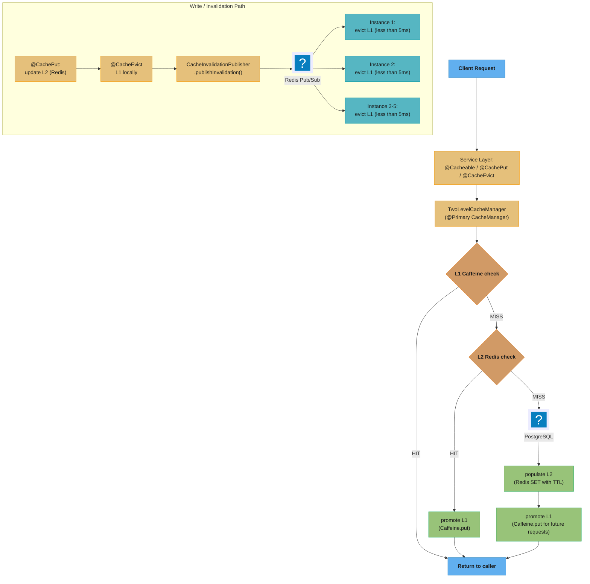

# Design: Distributed Caching Layer with Redis and Caffeine

> "A cache is a confidence trick: you convince the application that the data is right
> here, sub-millisecond away. The moment the trick fails — a cold start, a Redis outage,
> a stampede on expiry — the database behind the curtain absorbs a spike it was never
> sized to handle."

**Key insight:** At scale the database is provisioned for cache-hit traffic, not cache-miss
traffic. This means a cache failure is often an *availability* problem, not just a
performance problem. The L1 (in-process Caffeine) is not a performance optimization — it
is the primary failsafe that keeps the database alive during Redis failover.

See also: [Resilience4j patterns](./cross_cutting/resilience4j_patterns.md),
[OTel observability for Spring](./cross_cutting/otel_observability_for_spring.md)

---

## 1. Requirements Clarification

**Functional requirements:**
- Reduce PostgreSQL read load by 80% for a microservices platform at 20,000 read req/sec peak.
- 85% of reads access ~50,000 frequently-read product and catalog records.
- Per-cache TTL: product catalog 1 hour, user sessions 30 minutes, pricing 5 minutes.
- Prevent cache stampede when a popular key expires with 500 concurrent threads requesting it.
- Invalidate cache entries in near-real-time when data is updated (not just wait for TTL).
- Warm cache on startup to prevent cold-start latency spikes after deployments.
- Two-level cache: in-process Caffeine (L1, sub-millisecond) backed by Redis (L2, cross-instance consistency).

**Non-functional requirements:**
- Cache hit rate ≥ 80% steady-state; ≥ 70% alert threshold.
- P99 cache-hit latency: < 0.1ms (L1), < 2ms (L2).
- Database survives L2 Redis outage (L1 must absorb hot keys during ~30s failover).
- Cross-instance staleness after write: < 10ms (Pub/Sub propagation bound).

**Constraints:** Spring Boot 4.1 (Spring Framework 7, Jackson 3), Redis 8, Caffeine 3.2, 5 microservice instances.

**Out of scope:** Redis Cluster migration (single instance now, cluster-ready design), read-your-own-writes consistency across instances, write-behind pattern for financial data.

---

## 2. Scale Estimation

**Traffic math:**
```
Peak reads:           20,000 req/sec
Cache hit rate (85%): 17,000 req/sec served from cache
DB read rate:          3,000 req/sec (only cache misses + writes)
  -> Database sized for 3,000-4,000 reads/sec
  -> If cache fails: DB faces 20,000 reads/sec = 20,000/3,000 = 6.7× overload -> collapse

With two-level cache:
  L1 Caffeine (hot 50%):  10,000 req/sec at <0.1ms
  L2 Redis (warm 35%):     7,000 req/sec at ~1ms
  DB (cold 15%):           3,000 req/sec at ~5ms
```

**Cache sizing:**
```
50,000 cached objects × ~2 KB average (JSON): 100 MB raw
Redis overhead (key string, TTL, jemalloc fragmentation): ~1.5× raw = 150 MB
Redis max memory:  512 MB (generous for 50k hot keys; set maxmemory=256m for safety)
Caffeine L1:       maximumSize=50,000 entries; each entry ~2 KB = ~100 MB JVM heap
  -> budget ~150 MB JVM heap for L1 per instance (-Xmx1g leaves ample room)
```

**Pub/Sub invalidation throughput:**
```
Write rate (invalidations): ~100 writes/sec (5% of 2,000 writes/sec is cross-service)
Redis Pub/Sub channel:      ~100 messages/sec (negligible; single-threaded sub is fine)
L1 eviction lag:            < 5ms (network RTT to each instance subscriber)
Max staleness after write:  < 10ms (acceptable for product catalog, pricing)
```

**Connection pool:**
```
Lettuce default:   1 connection (multiplexed, suitable for < 10k ops/sec)
At 20k read req/sec + pub/sub: use LettucePoolingClientConfiguration maxTotal=16
  (pipelining allows high throughput per connection; pool for burst safety)
```

---

## 3. High-Level Architecture


```mermaid
flowchart TD
    classDef io      fill:#61afef,stroke:#2e86c1,color:#1a1a1a,font-weight:bold
    classDef frozen  fill:#c678dd,stroke:#9b59b6,color:#fff
    classDef train   fill:#98c379,stroke:#27ae60,color:#1a1a1a
    classDef mathOp  fill:#d19a66,stroke:#e67e22,color:#1a1a1a,font-weight:bold
    classDef lossN   fill:#e06c75,stroke:#c0392b,color:#fff,font-weight:bold
    classDef req     fill:#56b6c2,stroke:#0097a7,color:#1a1a1a
    classDef base    fill:#e5c07b,stroke:#f39c12,color:#1a1a1a

    CR[Client Request] --> SVC["Service Layer:\n@Cacheable / @CachePut / @CacheEvict"]
    SVC --> MGR["TwoLevelCacheManager\n(@Primary CacheManager)"]
    MGR --> L1Q{L1 Caffeine check}
    L1Q -->|HIT| RET[Return to caller]
    L1Q -->|MISS| L2Q{L2 Redis check}
    L2Q -->|HIT| PROM2["promote L1\n(Caffeine.put)"]
    PROM2 --> RET
    L2Q -->|MISS| DB
    DB@{ icon: "logos:postgresql", form: "square", label: "PostgreSQL", pos: "b", h: 44 }
    DB --> POP["populate L2\n(Redis SET with TTL)"]
    POP --> PROM1["promote L1\n(Caffeine.put for future requests)"]
    PROM1 --> RET

    subgraph WRITE["Write / Invalidation Path"]
        CP["@CachePut:\nupdate L2 (Redis)"] --> EV["@CacheEvict\nL1 locally"]
        EV --> PUB["CacheInvalidationPublisher\n.publishInvalidation()"]
        PUB --> CH
        CH@{ icon: "logos:redis", form: "square", label: "Redis Pub/Sub", pos: "b", h: 44 }
        CH --> I1["Instance 1:\nevict L1 (less than 5ms)"]
        CH --> I2["Instance 2:\nevict L1 (less than 5ms)"]
        CH --> I3["Instance 3-5:\nevict L1 (less than 5ms)"]
    end

    class CR,RET io
    class SVC,MGR base
    class L1Q,L2Q mathOp
    class PROM1,PROM2,POP train
    class CP,EV,PUB base
    class I1,I2,I3 req
```

**Component inventory:**

| Component | Responsibility |
|---|---|
| `CacheConfig` | Configures `RedisCacheManager` (per-cache TTL) and `CaffeineCacheManager` (50k max, 5min write-expiry) |
| `TwoLevelCacheManager` | `@Primary CacheManager`; wraps each cache as a `TwoLevelCache` |
| `TwoLevelCache` | L1-first get; L2 fallthrough with L1 promotion; writes to both levels; evicts from both |
| `ProductService` | Domain service; uses `@Cacheable(sync=true)` for stampede prevention |
| `CacheInvalidationPublisher` | `StringRedisTemplate.convertAndSend("cache-invalidation", ...)` on every write |
| `CacheInvalidationListener` | `MessageListener` on "cache-invalidation" channel; evicts Caffeine L1 entries |
| `CacheWarmingRunner` | `ApplicationRunner`: pre-loads top 10,000 products before readiness probe passes |
| `CacheMetricsRegistrar` | Registers Micrometer `Gauge` for L1 hit rate, size, eviction count |

---

## 4. Component Deep Dives

### 4.1 Cache Configuration

```java
@Configuration
public class CacheConfig {

    @Bean
    public RedisCacheManager redisCacheManager(RedisConnectionFactory connectionFactory) {
        RedisCacheConfiguration defaultConfig = RedisCacheConfiguration.defaultCacheConfig()
            .entryTtl(Duration.ofHours(1))
            .serializeValuesWith(RedisSerializationContext.SerializationPair
                .fromSerializer(GenericJacksonJsonRedisSerializer.builder().build()));

        Map<String, RedisCacheConfiguration> cacheConfigs = new HashMap<>();
        cacheConfigs.put("products",     defaultConfig.entryTtl(Duration.ofHours(1)));
        cacheConfigs.put("pricing",      defaultConfig.entryTtl(Duration.ofMinutes(5)));
        cacheConfigs.put("userSessions", defaultConfig.entryTtl(Duration.ofMinutes(30)));
        cacheConfigs.put("categoryTree", defaultConfig.entryTtl(Duration.ofHours(6)));
        cacheConfigs.put("inventory",    defaultConfig.entryTtl(Duration.ofMinutes(2)));

        return RedisCacheManager.builder(connectionFactory)
            .cacheDefaults(defaultConfig)
            .withInitialCacheConfigurations(cacheConfigs)
            .build();
    }

    @Bean
    public CaffeineCacheManager caffeineCacheManager() {
        CaffeineCacheManager manager = new CaffeineCacheManager();
        manager.setCaffeine(Caffeine.newBuilder()
            .maximumSize(50_000)
            .expireAfterWrite(Duration.ofMinutes(5)) // shorter than Redis TTL intentionally
            .recordStats());
        return manager;
    }

    @Bean @Primary
    public CacheManager compositeCacheManager(CaffeineCacheManager l1,
                                               RedisCacheManager l2) {
        return new TwoLevelCacheManager(l1, l2);
    }
}
```

### 4.2 Two-Level Cache Implementation

```java
public class TwoLevelCache implements Cache {

    private final String name;
    private final Cache l1;  // Caffeine
    private final Cache l2;  // Redis

    @Override
    @Nullable
    public ValueWrapper get(Object key) {
        ValueWrapper l1Value = l1.get(key);
        if (l1Value != null) return l1Value;   // L1 hit: sub-ms

        ValueWrapper l2Value = l2.get(key);    // L2 check: ~1ms
        if (l2Value != null) {
            l1.put(key, l2Value.get());         // promote to L1 for future requests
        }
        return l2Value;                        // null = DB miss -> @Cacheable loads from DB
    }

    @Override
    public <T> T get(Object key, Callable<T> valueLoader) {
        // Called by @Cacheable(sync=true). L1 (Caffeine) coalesces loaders WITHIN this JVM.
        // RedisCache does NOT coalesce across nodes — its writer is lock-free by default, and
        // even lockingRedisCacheWriter() locks the whole cache, not the key. Cross-node
        // coalescing needs an explicit per-key lock (§11) if the DB cannot take N loaders.
        T value = l1.get(key, () -> l2.get(key, valueLoader));
        if (value != null) l1.put(key, value); // promote L2 hit to L1
        return value;
    }

    @Override
    public void put(Object key, @Nullable Object value) {
        l1.put(key, value);
        l2.put(key, value);                    // writes go to both levels
    }

    @Override
    public void evict(Object key) {
        l1.evict(key);
        l2.evict(key);                         // local eviction + Redis DEL
    }
}
```

### 4.3 Service Layer — @Cacheable with stampede prevention

```java
@Service
public class ProductService {

    @Cacheable(value = "products", key = "#productId", sync = true)
    public Product getProduct(String productId) {
        return productRepository.findById(productId)
            .orElseThrow(() -> new ProductNotFoundException(productId));
    }

    @CachePut(value = "products", key = "#product.id")
    public Product updateProduct(Product product) {
        Product saved = productRepository.save(product);
        cacheInvalidationPublisher.publishInvalidation("products", product.getId());
        return saved;
    }

    @CacheEvict(value = "products", key = "#productId")
    public void deleteProduct(String productId) {
        productRepository.deleteById(productId);
        cacheInvalidationPublisher.publishInvalidation("products", productId);
    }

    @Cacheable(value = "pricing", key = "#productId + ':' + #customerId")
    public Price getPrice(String productId, String customerId) {
        return productRepository.calculatePrice(productId, customerId);
    }
}
```

### 4.4 Cache Invalidation via Redis Pub/Sub

```java
@Component
public class CacheInvalidationPublisher {
    private static final String CHANNEL = "cache-invalidation";
    private final StringRedisTemplate redisTemplate;

    public void publishInvalidation(String cacheName, String key) {
        redisTemplate.convertAndSend(CHANNEL, cacheName + ":" + key);
    }
}

@Component
public class CacheInvalidationListener implements MessageListener {

    private final CacheManager caffeineCacheManager;  // L1 only — L2 already updated by @CachePut

    @Override
    public void onMessage(Message message, byte[] pattern) {
        String body = new String(message.getBody());
        String[] parts = body.split(":", 2);
        if (parts.length != 2) return;

        String cacheName = parts[0];
        String key       = parts[1];

        var cache = caffeineCacheManager.getCache(cacheName);
        if (cache == null) return;

        if ("*".equals(key)) cache.clear();
        else                  cache.evict(key);
    }
}

@Configuration
public class RedisListenerConfig {
    @Bean
    public RedisMessageListenerContainer cacheInvalidationContainer(
            RedisConnectionFactory factory, CacheInvalidationListener listener) {
        RedisMessageListenerContainer container = new RedisMessageListenerContainer();
        container.setConnectionFactory(factory);
        container.addMessageListener(listener, new ChannelTopic("cache-invalidation"));
        return container;
    }
}
```

### 4.5 BROKEN/FIX — Cache Key Collision Across Services

```java
// BROKEN: two services use the same unqualified key "user:{id}" on a shared Redis cluster
// user-service:
redisTemplate.opsForValue().set("user:" + id, userProfile);    // UserProfile

// order-service:
redisTemplate.opsForValue().set("user:" + id, orderSummary);   // OrderSummary — collision!
// A read of "user:42" returns whichever service wrote last -> ClassCastException or silent corruption
```

```java
// FIX: namespace every key with service + entity
// user-service:
redisTemplate.opsForValue().set("user-service:profile:" + id, userProfile);

// order-service:
redisTemplate.opsForValue().set("order-service:user-summary:" + id, orderSummary);
```

```java
// FIX via Spring cache name (RedisCacheManager prefixes keys with cache name by default):
@Cacheable(cacheNames = "user-service:profile", key = "#id")
public UserProfile getProfile(String id) { ... }
// Redis key becomes: "user-service:profile::42"
// Never collides with "order-service:user-summary::42"
```

### 4.6 BROKEN/FIX — Caching Mutable Objects

```java
// BROKEN: cached instance is shared; callers mutate shared state
@Cacheable(cacheNames = "carts", key = "#id")
public Cart getCart(String id) { return cartRepository.findById(id); }

Cart c = cartService.getCart("42");
c.addItem(item); // mutates the cached object in place — visible to ALL other callers!
```

```java
// FIX: cache immutable snapshots using Java records
public record CartView(String id, List<ItemView> items, BigDecimal total) {}

@Cacheable(cacheNames = "carts", key = "#id")
public CartView getCart(String id) {
    return CartView.from(cartRepository.findById(id)); // immutable; callers cannot mutate
}
```

For Redis-backed caches this is less risky (each read deserializes a fresh object), but for
in-process L1 caches that return object references, mutability is a correctness landmine.

### 4.7 Cache Warming on Startup

```java
@Component
public class CacheWarmingRunner implements ApplicationRunner {

    private static final int WARM_PRODUCT_COUNT = 10_000;

    @Override
    public void run(ApplicationArguments args) {
        log.info("Warming cache with top {} products", WARM_PRODUCT_COUNT);
        long startMs = System.currentTimeMillis();

        List<Product> hotProducts = productRepository.findTopByAccessFrequency(WARM_PRODUCT_COUNT);
        var productCache = cacheManager.getCache("products");
        if (productCache == null) return;

        hotProducts.forEach(p -> productCache.put(p.getId(), p));

        log.info("Cache warming complete: warmedEntries={} durationMs={}",
                 hotProducts.size(), System.currentTimeMillis() - startMs);
    }
}
```

`ApplicationRunner` runs after all beans are initialized but before the readiness probe
passes (assuming the K8s readiness probe polls `/actuator/health/readiness`). This means
the instance is not included in load balancer rotation until warming is complete, preventing
cold-start stampedes after rolling deployments.

---

## 5. Design Decisions & Tradeoffs

| Decision | Choice | Alternative | Rationale |
|---|---|---|---|
| Cache topology | L1 Caffeine + L2 Redis (two-level) | Redis only | Redis-only adds ~1ms per hit; at 17k cache hits/sec that is 17 aggregated seconds of latency per second — degrades P99 badly |
| Cache invalidation | Redis Pub/Sub broadcast to L1 | TTL-only (wait for expiry) | 5-minute TTL for pricing means up to 5-minute stale prices; Pub/Sub reduces staleness to <10ms at low cost |
| Stampede prevention | `@Cacheable(sync=true)` + Caffeine native locking | No synchronization | Without sync, 500 concurrent threads on the same expired key all hit the DB simultaneously; sync coalesces them to one loader |
| Write pattern | Cache-aside (`@CachePut` + invalidate) | Write-behind (async DB flush) | Write-behind risks data loss if cache crashes before flushing; cache-aside keeps DB as source of truth |
| Keyspace namespacing | Service-prefixed cache names (`user-service:profile`) | Global unqualified keys | Unqualified keys across a shared cluster cause silent collision and corruption; namespacing enforces isolation |

### Two-level cache vs Redis-only latency budget

| Approach | L1 hit | L2 hit | DB miss | Consistency |
|---|---|---|---|---|
| Redis only | — | ~1ms | ~5ms | Strong across instances |
| Caffeine L1 + Redis L2 (chosen) | <0.1ms | ~1ms | ~5ms | Eventual (< 10ms Pub/Sub lag) |
| Caffeine L1 only | <0.1ms | — | ~5ms | None (stale until TTL) |

### Write patterns comparison

| Pattern | Write path | Consistency | Durability risk | Use when |
|---|---|---|---|---|
| Cache-aside (`@CacheEvict` on write) | App writes DB, then evicts cache | Eventual; brief stale | None (DB is truth) | Default for most read-heavy workloads |
| Write-through (`@CachePut`) | App writes DB, updates cache atomically | Strong | None | Reads must never see stale data |
| Write-behind | Cache accepts write, async DB flush | Eventual; cache ahead | HIGH — buffered writes lost on crash | Write-heavy, loss-tolerant (counters, last-seen) |

---

## 6. Real-World Implementations

**Facebook — "Scaling Memcache at Facebook" (NSDI 2013):** the reference text for this whole design. Two of its findings land directly here. First, invalidation is driven off the database's own commit log: a daemon (`mcsqueal`) tails the MySQL log, extracts the deletes, and broadcasts them to the cache tier — the write path never has to remember to invalidate, which is precisely the failure mode of the application-level `publishInvalidation()` call in §4.4. Second, the paper is explicit that stale sets and thundering herds are handled with **leases**: on a miss, memcached hands exactly one client a lease token that entitles it to load from the database, and makes the rest wait. That is `sync=true` at cluster scale, and it is the mechanism this design has to reimplement (§11) because `RedisCache` does not provide it.

**Redis server-assisted client-side caching (`CLIENT TRACKING`, Redis 6.0+):** the server tracks which keys each client has cached and pushes `INVALIDATE` messages to exactly those clients — on the same connection under RESP3, or redirected through Pub/Sub under RESP2. This is the L1-invalidation channel in §4.4 implemented by the database instead of by the application: no `cache-invalidation` topic to publish to, no missed publish when a code path forgets, and no fan-out to instances that never cached the key. Lettuce supports tracking, so the application-level publisher in §4.4 is best read as what you build when your client or proxy does not.

**AWS ElastiCache and other managed Redis** expose the same trap this design is built around: the cache is sized and priced as an optimization, but the database behind it is provisioned for post-cache traffic, which quietly makes the cache a hard availability dependency. This is why §1 lists "database survives L2 outage" as a non-functional *requirement* rather than a nice-to-have, and why the L1 tier exists at all.

**Caffeine** (the L1 here) is worth understanding rather than treating as an LRU: it uses **W-TinyLFU**, a frequency sketch that admits a new entry only if it is estimated to be more valuable than the victim it would evict. That is why a 50,000-entry L1 holds the genuinely hot working set instead of being scanned out by a single sweep over the catalog — a plain LRU of the same size would be, and the cache-warming runner in §4.7 would be undone by the first bulk export job.

---

## 7. Technologies & Tools

| Tool | L1 (in-process) | L2 (distributed) | Invalidation mechanism | Spring integration | When to choose |
|---|---|---|---|---|---|
| **Caffeine + Redis (chosen)** | Caffeine | Redis | Redis Pub/Sub | `CaffeineCacheManager` + `RedisCacheManager` | Default for Spring microservices needing two-level cache |
| **Ehcache 3 + Redis** | Ehcache 3 | Redis | Terracotta clustered tier | `JCacheCacheManager` (Ehcache 3 is a JSR-107 provider) | If Ehcache is already in use; Spring's old `EhCacheCacheManager` is gone, so integration is via JCache |
| **Hazelcast** | Hazelcast near-cache | Hazelcast cluster | Native near-cache invalidation | `HazelcastCacheManager` | When distributed compute (entry processors, distributed queries) is also needed |
| **Infinispan** | Near-cache | Infinispan cluster | Cluster invalidation | `SpringEmbeddedCacheManager` / `SpringRemoteCacheManager` | JBoss/Quarkus ecosystem; embedded or Hot Rod remote |
| **Redis only** | — | Redis | TTL or keyspace notifications | `RedisCacheManager` | Simpler setup; acceptable if P99 < 5ms is sufficient |

---

## 8. Operational Playbook

### (a) Metrics to Monitor

- `cache.l1.hit.rate{cache=products}` (Gauge): alert if < 0.70 (L1 hit rate < 70% means L1 sizing may be too small or working set shifted)
- `cache.redis.fallback.count` (Counter): alert immediately if nonzero — Redis is unavailable
- `hikaricp.connections.pending` (Gauge): alert if > 0 sustained — DB is under pressure from cache misses
- Redis: `redis-cli info keyspace` — track key count and expired key rate; mass expiry = stampede risk
- Redis: `redis-cli info memory` — `mem_fragmentation_ratio` (`used_memory_rss / used_memory`) > 1.5 indicates fragmentation; enable `activedefrag yes` to compact online rather than restarting the instance

### (b) Cache Hit Rate Dashboard

```
Grafana query for effective cache hit rate:
  (cache.l1.requests.total{result=hit} + cache.redis.requests.total{result=hit}) /
  cache.requests.total

Breakout:
  L1 hit rate:    cache.l1.hit.rate    (Caffeine `stats().hitRate()`)
  L2 hit rate:    redis.keyspace_hits / (redis.keyspace_hits + redis.keyspace_misses)
  DB request rate: hikaricp.connections.usage{pool=..., state=active}
```

### (c) Incident Runbooks

**Runbook 1: Redis primary fails — circuit breaker fallback mode**
- Symptom: `cache.redis.fallback.count` rising; `/actuator/health/redis` reporting DOWN; Lettuce logging reconnect attempts
- Diagnose: `redis-cli ping` → NOAUTH or timeout; check Redis Sentinel for failover status
- Mitigate: L1 Caffeine continues serving hot keys; circuit breaker opens, stops hammering dead primary; DB sees only long-tail misses (~30% of normal read volume if L1 hit rate is 70%)
- Resolve: once Redis primary recovered, circuit breaker probes (`waitDurationInOpenState=30s`), closes automatically; L2 re-warms lazily on demand; confirm `cache.redis.fallback.count` stops growing

**Runbook 2: Cache stampede after hot key expiry**
- Symptom: sudden DB spike for 1-2 seconds; multiple threads reporting slow queries for the same product ID; `hikaricp.connections.active` spike
- Diagnose: check if multiple entries expired simultaneously (`redis-cli object encoding <key>` + TTL inspection); check if `sync=true` is configured on the `@Cacheable` annotation
- Mitigate: `@Cacheable(sync=true)` coalesces concurrent loaders; if not already set, add it (no-restart: can be done via feature flag controlling cache name)
- Resolve: add per-entry TTL jitter to all cache configurations — `entryTtl((key, value) -> Duration.ofMinutes(5).plusSeconds(ThreadLocalRandom.current().nextInt(60)))`. Use the `TtlFunction` overload, not `entryTtl(Duration)`: the latter is evaluated once at startup, so every key still expires in lockstep

**Runbook 3: L1 Pub/Sub invalidation lag — stale data served**
- Symptom: users see old product prices after a price update; `cache.l1.eviction.count` dropping unexpectedly; Redis message subscriber log not receiving invalidation messages
- Diagnose: check `RedisMessageListenerContainer` health; check Redis `pubsub channels cache-invalidation` subscriber count; if < (number of instances), one or more are disconnected
- Mitigate: Lettuce auto-reconnects on connection loss; bounded by Caffeine L1 TTL (5 minutes max staleness); if staleness is business-critical, reduce `expireAfterWrite` to 60 seconds for pricing cache as temporary mitigation
- Resolve: confirm `pubsub numsub cache-invalidation` == number of instances; verify Lettuce reconnected by checking Spring Boot actuator `/actuator/health` for Redis connection status

**Runbook 4: Cache key collisions causing ClassCastException**
- Symptom: `ClassCastException: UserProfile cannot be cast to OrderSummary` in logs; intermittent across different request types
- Diagnose: `redis-cli get user:42` — inspect raw JSON; look for wrong type stored under the key; check which service last wrote to that key
- Mitigate: prefix all affected keys with service namespace immediately; existing collided keys can be deleted (`redis-cli del user:42`) — they will be re-populated with the correct type on next cache miss
- Resolve: enforce namespace convention (`service:model:id`) in all `@Cacheable` cache names; add integration test asserting two services use different key prefixes

---

## 9. Common Pitfalls & War Stories

### War Story 1: Cache Key Collision Causes Silent Data Corruption

Two services on a shared Redis cluster both used `user:{id}` as the cache key — one storing `UserProfile`, the other `UserOrderSummary`. Under load, one service's write overwrote the other's entry. Reads returned the wrong type: Jackson silently deserialized a `UserProfile` JSON into a `UserOrderSummary` by ignoring unknown fields, so no exception was thrown. The bug manifested as empty order lists in the UI — the `orders` field was missing from the `UserProfile` JSON. 3,000 support tickets over 2 days before the root cause was found. (See §4.5 for the BROKEN/FIX.)

**Fix:** Namespace every key: `service:entity:{id}`. Rely on `RedisCacheManager`'s default cache-name prefix (`cacheName::key`). Every service uses a distinct cache name.

### War Story 2: Mutable Cached Objects Corrupt Shopping Carts

A service cached `Cart` objects by ID in Caffeine. The cache returned the same `Cart` instance reference on every call. One request called `cart.addItem()` on the returned object, mutating the shared in-memory reference. Every subsequent caller for that cart ID saw the extra item — across different users' sessions. The bug only affected in-process L1 (not Redis L2, which deserializes a fresh object each time). (See §4.6 for the BROKEN/FIX.)

**Impact:** ~400 carts showed phantom items for 6 hours before the incident was traced to the L1 cache returning mutable references. Revenue impact: 87 orders for items customers did not intend to buy, requiring refunds.

### War Story 3: Redis Outage Collapses Database

A Redis primary failed and was not replaced by Sentinel for ~45 seconds (a configuration bug: `sentinel monitor redis localhost 6379 2` but only 1 Sentinel was running). During those 45 seconds, all 20,000 req/sec fell through to the database. The database was provisioned for ~3,000 read req/sec. Connection pool exhaustion hit within 10 seconds; the database started dropping connections within 20 seconds; total outage at 45 seconds.

**Fix:** Deploy the two-level cache so L1 Caffeine (in-process, always available) absorbs the hot 50% of traffic during Redis outage. At L1 hit rate = 70%, the DB sees only 30% of total traffic during Redis failover — 6,000 req/sec against a DB provisioned for 3,000. That is 2× over, not 6.7× over: latency degrades and the pool queues, but the DB stays up long enough for Sentinel to promote a replica. The circuit breaker prevents retries from hammering the dead Redis primary.

### War Story 4: TTL Configuration Mistake — All Keys Expire Simultaneously

A team set a fixed TTL of 3600 seconds for all product cache entries with no jitter. The cache was cold-started at 9 AM (deployment). At exactly 10 AM, all 50,000 cached entries expired simultaneously. Every one of the 50,000 concurrent threads requesting any product key missed L2 and hit the database. A 5-second DB spike at exactly 10:00:00 AM caused query queuing, P99 latency jumped from 5ms to 8 seconds, and the SLA was breached.

**Fix:** Add ±10% random jitter per key. The jitter must be drawn *per entry*, which means
`entryTtl(TtlFunction)` — the `entryTtl(Duration)` overload takes one fixed value, so drawing
a random `Duration` at configuration time just shifts every key's expiry together and leaves
the stampede exactly where it was:

```java
Duration baseTtl = Duration.ofHours(1);
long spread = baseTtl.toSeconds() / 10;            // +/-10% = +/-360 s

// TtlFunction is invoked on every write, so each key draws its own TTL
cacheConfigs.put("products", defaultConfig.entryTtl((key, value) ->
    baseTtl.plusSeconds(ThreadLocalRandom.current().nextLong(-spread, spread))));
```
The jitter spreads expiry over a 12-minute window (±6 minutes around 1 hour), eliminating the synchronized mass-expiry spike.

---

## 10. Capacity Planning

### Memory and shard math

```
Cached objects:    500,000 (full product catalog)
Object size:       2 KB average
Raw working set:   500,000 × 2 KB = 1 GB
Redis overhead:    ×1.5 (key metadata + jemalloc fragmentation) = 1.5 GB

Redis cluster:     3 shards × 2 GB = 6 GB total capacity
                   1.5 GB / 6 GB = 25% utilization (comfortable; ≤75% target)
Eviction policy:   allkeys-lru (evicts least-recently-used under maxmemory pressure)
maxmemory:         75% of instance RAM to leave room for replication buffers

Caffeine L1:       50,000 entries × 2 KB = 100 MB JVM heap per instance × 5 instances
                   = 500 MB total L1 across the fleet (always consistent with local access patterns)
```

### Throughput and connection budget

```
Total reads:           20,000 req/sec
L1 serves (hot 50%):   10,000 req/sec  (<0.1ms, no network)
L2 Redis serves (35%):  7,000 req/sec  (~1ms, Lettuce pipeline)
DB serves (cold 15%):   3,000 req/sec  (~5ms, HikariCP pool)

Redis ops budget:       7,000 GET + 100 SET + 100 EVAL (pub/sub) = ~7,200 ops/sec
                        Redis single-thread: ~100,000 simple ops/sec -> 7.2% utilization

DB connection budget:   3,000 × 5ms = 15 concurrent connections for reads
                        HikariCP pool: 20 connections (15 active + 5 headroom)

If cache fails entirely (0% hit rate):
  DB faces 20,000 req/sec = 6.7× overload -> requires L1 failsafe to remain alive
```

### TTL and eviction budget

```
Tier          | TTL    | Object count | Churn rate
product catalog | 1h     | 50,000       | Low (changes ~5% per day)
pricing         | 5 min  | 200,000      | High (real-time pricing)
user sessions   | 30 min | 100,000      | Medium
category tree   | 6h     | 5,000        | Very low
inventory       | 2 min  | 50,000       | Very high

TTL jitter:   ±10% per key to spread expiry across time and prevent synchronized stampede
Redis key TTL check: `redis-cli ttl <key>` — if remaining TTL > 90% of max, key was just set; if <10%, about to expire
```

---

## 11. Interview Discussion Points

**Q: What happens to the L1 cache if the Redis Pub/Sub connection drops?**

A: Instances stop receiving invalidation messages. L1 caches serve stale data until Caffeine's `expireAfterWrite` TTL (5 minutes) expires naturally. Mitigations: (1) the TTL bounds staleness to 5 minutes regardless; (2) Lettuce auto-reconnects and resubscribes when the Redis connection recovers; (3) monitor `pubsub numsub cache-invalidation` — if count < number of instances, a subscriber is disconnected. Alert on it.

**Q: How does `sync=true` prevent cache stampede for Redis-backed caches?**

A: It does not — `sync=true` is a per-JVM guarantee, and only Caffeine actually delivers it here. Caffeine's `get(key, loader)` computes under the entry's lock, so of 500 threads in one instance exactly one calls the loader and the other 499 wait on it. `RedisCacheManager` builds a lock-free `RedisCacheWriter` by default; opting into `RedisCacheWriter.lockingRedisCacheWriter(cf)` does not fix this either, because that lock is held at *cache* granularity to make `putIfAbsent`/`clean` non-overlapping, not at key granularity to elect one loader. So with 5 instances you get 5 concurrent DB loads, not 500 — usually acceptable. When it is not, wrap the loader in an explicit per-key distributed lock (Redisson `RLock`, or `SET key token NX PX 30000` with a token-checking release), which is the same election memcached performs with leases.

**Q: How do you handle cache penetration — requests for keys that do not exist in the database?**

A: Cache penetration occurs when requests flood for non-existent keys (e.g., random IDs), bypassing cache on every request. Mitigations: (1) cache null values with a short TTL (30s) — store a sentinel null for DB misses so subsequent requests return the cached null without hitting the DB; (2) Bloom filter — check a Redis Bloom filter (`BF.EXISTS`) before the cache lookup; keys definitely absent are rejected in O(1). For `RedisCacheConfiguration`, remove `.disableCachingNullValues()` to enable null caching.

**Q: How do you handle the case where a cached object's class changes between deployments?**

A: With `GenericJacksonJsonRedisSerializer`, adding fields is safe — existing cached entries lack the new field and Jackson uses the Java default value. Removing a field is also safe on Jackson 3, whose `FAIL_ON_UNKNOWN_PROPERTIES` defaults to **false**, so the now-unmapped JSON property is ignored rather than throwing (Jackson 2 defaulted the opposite way and would throw `UnrecognizedPropertyException`; Spring Boot always disabled it for you, which is why the difference rarely bit anyone). Renaming a field is a compatibility break either way. Resolution: use `@JsonProperty` to maintain the old JSON name, or rename the cache (`products:v2`) and let the old cache TTL expire naturally. As a nuclear option, `@CacheEvict(allEntries=true)` as part of the deployment procedure.

**Q: How do you implement cache-aside with a fallback when Redis is completely down?**

A: Catch `RedisConnectionFailureException` in the `TwoLevelCache.get()` method and return `null` (cache miss) instead of propagating the exception. Spring's `@Cacheable` treats `null` return as a miss and calls the actual service method. Wrap the Redis operations in a Resilience4j circuit breaker that opens after 10 consecutive failures and probes for recovery after 30 seconds. Instrument with a `cache.redis.fallback.count` counter and alert when it fires — the DB is now receiving full read traffic and may need temporary scaling.

**Q: Why can losing the Redis cache cause a full outage, not just slower responses?**

A: Because the database is provisioned for cache-hit traffic, not cache-miss traffic. If the cache absorbs 80% of reads, the DB is sized for ~20% of total QPS. When Redis fails, the DB suddenly faces 5× its provisioned load — a thundering herd that can collapse it. The mitigation is a two-level cache: L1 Caffeine (in-process, always available) absorbs the hot keys during the ~30s Redis failover, limiting the DB blast radius to the long-tail misses rather than the full read volume.

**Q: How do you prevent cache key collisions across services on a shared Redis cluster?**

A: Namespace every key: `service:entity:{id}`. Spring's `RedisCacheManager` prefixes keys with the cache name by default (`cacheName::key`), so naming caches `user-service:profile` and `order-service:user-summary` enforces namespace isolation automatically. Never use bare entity types (`user:{id}`) across services sharing a cluster — the collision is silent (Jackson ignores unknown fields) and only manifests as corrupted data, not as an exception.

**Q: How do you size a Redis cluster for 500,000 objects of 2 KB each?**

A: Raw working set: 500,000 × 2 KB = 1 GB. Add 1.5× for key overhead (~50–100 bytes/key), expiry metadata, and jemalloc fragmentation → 1.5 GB effective. A 3-shard cluster at 2 GB per shard = 6 GB total at 25% utilization. Set `maxmemory` to 75% of instance RAM and `maxmemory-policy allkeys-lru` so the cache evicts cold entries under pressure rather than OOM-ing or rejecting writes. Add per-key TTL jitter (±10%) to avoid synchronized mass expiry.

**Q: What is the difference between write-through and write-behind, and when is each safe?**

A: Write-through writes to cache and database synchronously in sequence — strong consistency, but write latency = cache + DB. Write-behind writes to cache and asynchronously flushes to DB — lowest write latency, highest throughput, but a cache crash before flushing loses buffered writes. Write-behind is only safe for loss-tolerant data (view counters, last-seen timestamps). For orders, payments, or any financial data, always use cache-aside (DB is source of truth) or write-through. Never write-behind for correctness-critical data.

**Q: How do cache invalidations work across regions?**

A: Keep caches region-local (synchronous cross-region Redis replication adds 80–150ms per write and risks split-brain). Propagate invalidations explicitly: when one region writes and evicts a key, publish an event (Redis Pub/Sub to the same region's subscribers, or a Kafka topic read by all regions) that other regions consume to evict stale entries from their local caches. This bounds cross-region staleness to the event propagation lag (typically seconds). Accept this bounded staleness for most data; only near-globally-consistent requirements warrant write-through plus cross-region invalidation at the cost of higher write latency.
