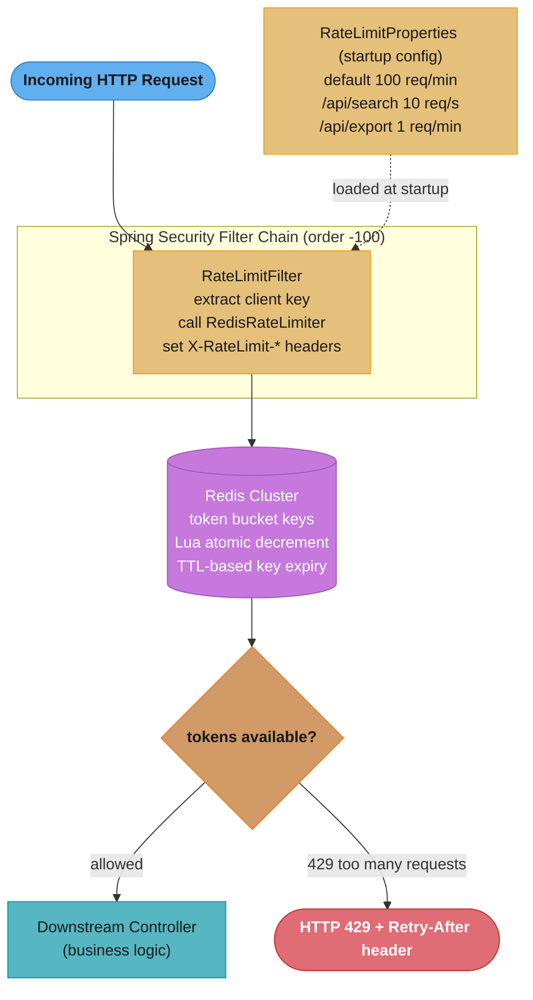

# Design: Distributed Rate Limiter (Spring Boot + Redis)

> **"A turnstile that counts arrivals across all lanes simultaneously."**
> A single-node `synchronized` counter fails the moment your service scales to multiple pods —
> each pod has its own counter and the global rate limit is multiplied by the pod count.
> Moving the counter into Redis makes it shared: every pod increments the same number, and the
> turnstile stays honest no matter how many lanes you open.
>
> **Key insight:** Atomicity in a distributed rate limiter requires the check-and-decrement to
> be a single indivisible operation. Redis Lua scripts provide exactly this — the script body is
> a single serialized command from Redis's perspective, eliminating the "someone else decremented
> between my check and my decrement" race.

---

## 1. Requirements Clarification

### Functional Requirements
- Enforce per-client (API key / user ID) rate limits across all pods of a horizontally scaled service.
- Support multiple algorithms: Token Bucket (bursty traffic) and Fixed Window (simple quota).
- Return remaining quota and reset time in HTTP response headers (`X-RateLimit-Remaining`, `X-RateLimit-Reset`).
- Allow per-endpoint override limits (e.g., `/api/v1/search` → 10 req/s, `/api/v1/export` → 1 req/min).
- Fail open: if Redis is unreachable, allow the request through and log the degraded state.

### Non-Functional Requirements
- **Latency overhead:** P99 < 2 ms added latency per request for the rate-limit check.
- **Throughput:** Handle 50,000 req/s across a cluster of 20 pods (2,500 req/s per pod).
- **Accuracy:** Within 1% of configured limit under steady load; burst allowance up to 2× for token bucket.
- **Availability:** Continue serving traffic if Redis is degraded (fail-open with local fallback).

### Out of Scope
- User authentication and API key issuance.
- Rate limit administration UI (assume limits stored in application config / database).
- Cross-datacenter rate limit synchronization (single Redis cluster per region).

---

## 2. Scale Estimation

### Traffic and Redis Load
```
50,000 req/s (peak) × 1 Redis command (Lua script) = 50,000 Redis ops/s
Redis single-node throughput:  ~100,000 ops/s (AWS ElastiCache r6g.large)
Redis Cluster (3 shards):      ~300,000 ops/s
Safety headroom at 50k req/s:  50% utilization on 3-shard cluster
```

### Redis Memory per Rate-Limit Key
```
Token bucket key: ~100 bytes (key string + tokens float + last-refill timestamp)
Unique clients:   10,000 active clients
Total memory:     10,000 × 100 bytes = 1 MB (negligible)
With TTL expiry:  keys expire after 2 × window; memory stays bounded
```

### Latency Budget
```
Redis RTT (same AZ):    ~0.3 ms
Lua execution time:     ~0.05 ms
Spring filter overhead: ~0.1 ms
Total added:            ~0.45 ms P50; ~1.8 ms P99 (network jitter)
```

---

## 3. High-Level Architecture



### Component Inventory
| Component | Role |
|-----------|------|
| `RateLimitFilter` | Spring `OncePerRequestFilter`; extracts key, delegates, sets headers |
| `RedisRateLimiter` | Executes Lua script via `RedisTemplate`; returns `RateLimitResult` |
| `RateLimitKeyResolver` | Extracts client identity: API key > user ID > IP |
| `RateLimitProperties` | `@ConfigurationProperties` holding per-endpoint limits |
| `RateLimitResult` | Record: `allowed`, `remaining`, `resetAtEpochSeconds` |
| `LocalFallbackRateLimiter` | `ConcurrentHashMap` token bucket — used when Redis is down |

---

## 4. Component Deep Dives

### 4.1 Redis Lua Token Bucket Script

The script is the heart of the design. It must be atomic: check tokens, refill based on elapsed
time, decrement, and return — all as one unit.

```lua
-- KEYS[1]: rate-limit key (e.g. "rl:user:42:search")
-- ARGV[1]: refill rate (tokens per second, float)
-- ARGV[2]: bucket capacity (max tokens, float)
-- ARGV[3]: requested tokens (usually 1)
-- ARGV[4]: current time (epoch seconds, float — from Lua time() would be simpler but
--           we pass from the app to avoid RANDOMKEY restrictions in cluster mode)

local key = KEYS[1]
local rate = tonumber(ARGV[1])
local capacity = tonumber(ARGV[2])
local requested = tonumber(ARGV[3])
local now = tonumber(ARGV[4])

local bucket = redis.call("HMGET", key, "tokens", "last_refill")
local tokens = tonumber(bucket[1])
local last_refill = tonumber(bucket[2])

if tokens == nil then
    tokens = capacity
    last_refill = now
end

-- Refill proportional to elapsed time
local elapsed = math.max(0, now - last_refill)
tokens = math.min(capacity, tokens + elapsed * rate)

local allowed = 0
local remaining = tokens

if tokens >= requested then
    tokens = tokens - requested
    remaining = tokens
    allowed = 1
end

-- Store updated state; TTL = ceiling(capacity / rate) * 2 for auto-expiry of idle keys
local ttl = math.ceil(capacity / rate) * 2
redis.call("HMSET", key, "tokens", tokens, "last_refill", now)
redis.call("EXPIRE", key, ttl)

return {allowed, math.floor(remaining), math.ceil(last_refill + capacity / rate)}
```

### 4.2 Broken Pattern: Non-Atomic Redis Check-and-Decrement

```java
// BROKEN: two separate Redis commands are not atomic
public boolean allowRequest_broken(String key) {
    Long tokens = (Long) redisTemplate.opsForValue().get(key + ":tokens");
    if (tokens == null || tokens <= 0) {
        return false;
    }
    // Another pod can decrement here before we do — two pods both pass the check!
    redisTemplate.opsForValue().decrement(key + ":tokens");
    return true;
}
```

**Failure mode:** At 1000 req/s with limit = 100 req/s and 10 pods, each pod sees its local
window of requests but two pods can both pass the `tokens > 0` check concurrently. Effective
limit becomes 200 req/s instead of 100 — a 100% over-admit rate.

**Fix:** Replace with a single Lua script executed via `execute()` on `RedisScript<List<Long>>`.
The Lua body is one atomic Redis command from the server's perspective.

### 4.3 RedisRateLimiter

```java
@Component
public class RedisRateLimiter {

    private static final String LUA_SCRIPT = """
        local key = KEYS[1]
        local rate = tonumber(ARGV[1])
        local capacity = tonumber(ARGV[2])
        local requested = tonumber(ARGV[3])
        local now = tonumber(ARGV[4])
        local bucket = redis.call("HMGET", key, "tokens", "last_refill")
        local tokens = tonumber(bucket[1])
        local last_refill = tonumber(bucket[2])
        if tokens == nil then
            tokens = capacity
            last_refill = now
        end
        local elapsed = math.max(0, now - last_refill)
        tokens = math.min(capacity, tokens + elapsed * rate)
        local allowed = 0
        local remaining = tokens
        if tokens >= requested then
            tokens = tokens - requested
            remaining = tokens
            allowed = 1
        end
        local ttl = math.ceil(capacity / rate) * 2
        redis.call("HMSET", key, "tokens", tokens, "last_refill", now)
        redis.call("EXPIRE", key, ttl)
        return {allowed, math.floor(remaining), math.ceil(last_refill + capacity / rate)}
        """;

    private final RedisScript<List<Long>> script =
        new DefaultRedisScript<>(LUA_SCRIPT, (Class<List<Long>>) (Class<?>) List.class);

    private final StringRedisTemplate redisTemplate;

    public RedisRateLimiter(StringRedisTemplate redisTemplate) {
        this.redisTemplate = redisTemplate;
    }

    public RateLimitResult tryAcquire(String key, double tokensPerSecond, double capacity) {
        String nowSeconds = String.valueOf(System.currentTimeMillis() / 1000.0);
        try {
            List<Long> result = redisTemplate.execute(
                script,
                List.of(key),
                String.valueOf(tokensPerSecond),
                String.valueOf(capacity),
                "1",
                nowSeconds
            );
            boolean allowed   = result.get(0) == 1L;
            long remaining    = result.get(1);
            long resetAt      = result.get(2);
            return new RateLimitResult(allowed, remaining, resetAt);
        } catch (RedisConnectionFailureException e) {
            // Fail-open: log and allow through; local fallback kicks in
            log.warn("Redis unreachable for rate limiting key={}", key, e);
            return RateLimitResult.allowed(capacity);
        }
    }
}
```

### 4.4 RateLimitFilter (Spring Gateway / MVC)

```java
@Component
@Order(-100)  // Run before Spring Security
public class RateLimitFilter extends OncePerRequestFilter {

    private final RedisRateLimiter rateLimiter;
    private final RateLimitKeyResolver keyResolver;
    private final RateLimitProperties props;

    @Override
    protected void doFilterInternal(
            HttpServletRequest request,
            HttpServletResponse response,
            FilterChain chain) throws ServletException, IOException {

        String clientKey = keyResolver.resolve(request);
        String path = request.getRequestURI();
        RateLimitConfig config = props.configFor(path);

        String redisKey = "rl:" + clientKey + ":" + path;
        RateLimitResult result = rateLimiter.tryAcquire(
            redisKey, config.tokensPerSecond(), config.capacity());

        response.setHeader("X-RateLimit-Limit",     String.valueOf((long) config.capacity()));
        response.setHeader("X-RateLimit-Remaining", String.valueOf(result.remaining()));
        response.setHeader("X-RateLimit-Reset",     String.valueOf(result.resetAtEpochSeconds()));

        if (!result.allowed()) {
            response.setHeader("Retry-After",
                String.valueOf(result.resetAtEpochSeconds() - System.currentTimeMillis() / 1000));
            response.sendError(HttpServletResponse.SC_TOO_MANY_REQUESTS, "Rate limit exceeded");
            return;
        }

        chain.doFilter(request, response);
    }
}
```

### 4.5 RateLimitKeyResolver

```java
@Component
public class RateLimitKeyResolver {

    public String resolve(HttpServletRequest request) {
        // Priority: API key > authenticated user > IP address
        String apiKey = request.getHeader("X-API-Key");
        if (apiKey != null && !apiKey.isBlank()) {
            return "apikey:" + apiKey;
        }
        Principal principal = request.getUserPrincipal();
        if (principal != null) {
            return "user:" + principal.getName();
        }
        // Respect X-Forwarded-For for clients behind a load balancer
        String forwarded = request.getHeader("X-Forwarded-For");
        String ip = (forwarded != null) ? forwarded.split(",")[0].trim()
                                        : request.getRemoteAddr();
        return "ip:" + ip;
    }
}
```

### 4.6 Configuration

```java
@ConfigurationProperties(prefix = "rate-limit")
@Validated
public record RateLimitProperties(
    double defaultTokensPerSecond,
    double defaultCapacity,
    Map<String, EndpointConfig> endpoints
) {
    public RateLimitConfig configFor(String path) {
        return endpoints.entrySet().stream()
            .filter(e -> path.startsWith(e.getKey()))
            .map(Map.Entry::getValue)
            .map(c -> new RateLimitConfig(c.tokensPerSecond(), c.capacity()))
            .findFirst()
            .orElse(new RateLimitConfig(defaultTokensPerSecond, defaultCapacity));
    }

    public record EndpointConfig(double tokensPerSecond, double capacity) {}
}
```

```yaml
rate-limit:
  default-tokens-per-second: 10.0
  default-capacity: 60.0
  endpoints:
    "/api/v1/search":
      tokens-per-second: 2.0
      capacity: 10.0
    "/api/v1/export":
      tokens-per-second: 0.016   # 1 per minute
      capacity: 1.0
```

---

## 5. Design Decisions & Tradeoffs

### Decision 1: Token Bucket vs Fixed Window vs Sliding Window

| Algorithm | Burst Handling | Accuracy | Redis Complexity | Memory per Key |
|-----------|---------------|----------|------------------|----------------|
| Fixed Window | Allows 2× at boundary | Low | 1 INCR + EXPIRE | ~50 bytes |
| Sliding Window Log | Exact | High | ZADD + ZCARD + ZREMRANGEBYSCORE | O(requests) |
| Token Bucket (chosen) | Smooth burst up to capacity | High | HMSET (2 fields) | ~100 bytes |
| Leaky Bucket | No burst | Exact | LPUSH + LLEN | O(requests) |

**Decision:** Token bucket. It allows burst up to `capacity` tokens but refills smoothly,
preventing starvation while absorbing short spikes. Memory is bounded (constant per key).

### Decision 2: Lua Script vs WATCH/MULTI/EXEC vs RedLock

| Approach | Atomicity | Retry needed? | Redis Cluster compatible? |
|----------|-----------|---------------|--------------------------|
| Lua script (chosen) | Guaranteed | No | Yes (single key) |
| WATCH/MULTI/EXEC | Optimistic | Yes (on conflict) | No (WATCH across slots) |
| RedLock | Conditional | Yes (on lock fail) | Yes (3+ nodes) |
| Single-key INCR + EXPIRE | Partial | No | Yes |

**Decision:** Lua script. WATCH/MULTI/EXEC requires retry logic and breaks with Redis Cluster
(multiple keys across slots). RedLock is overkill for rate limiting. Lua is the industry standard.

### Decision 3: Fail-Open vs Fail-Closed on Redis Outage

Fail-closed (deny all) protects backend services from traffic storms during a Redis outage, but
it also denies all legitimate traffic. Fail-open (allow all) during Redis outage keeps revenue
flowing at the cost of potential overload. A hybrid approach uses an in-process `LocalFallbackRateLimiter`
(ConcurrentHashMap + AtomicLong) with a tighter limit during degraded mode:

```java
// During Redis outage: use local per-pod limit (divide global limit by pod count)
if (redisException) {
    return localFallback.tryAcquire(key, config.tokensPerSecond() / podCount, config.capacity());
}
```

### Decision 4: Filter vs Spring Cloud Gateway GatewayFilter vs AOP

| Approach | Granularity | Overhead | Works with WebFlux? |
|----------|-------------|----------|---------------------|
| `OncePerRequestFilter` (chosen) | Per request | ~0.1 ms | No (Servlet only) |
| `GatewayFilter` | Per route | ~0.05 ms | Yes (reactive) |
| `@RateLimit` AOP aspect | Per method | ~0.2 ms | Yes |

For Servlet stacks, `OncePerRequestFilter` is appropriate. For reactive stacks or API Gateway
deployments, `GatewayFilter` with `ReactiveRedisTemplate` is preferred.

### Decision 5: Key Structure

Key format: `rl:{clientType}:{clientId}:{normalizedPath}` — e.g., `rl:user:42:/api/v1/search`.
Including the path enables per-endpoint limits without multiple keys per client.
The TTL auto-expiry prevents memory leaks for inactive clients.

---

## 6. Real-World Implementations

**Stripe (public API platform):** Token bucket per API key; limits published in documentation
(100 req/s for most endpoints, 25 req/s for search). Response headers include `Retry-After`
and `X-RateLimit-*`. Redis Cluster backs the counters; the Lua script is the same token bucket
pattern described here. Degraded mode falls back to per-pod in-memory counters.

**GitHub API:** Fixed window (5000 requests per hour per token for authenticated requests, 60 for
unauthenticated). Returns `X-RateLimit-Limit`, `X-RateLimit-Remaining`, `X-RateLimit-Reset` in
every response. The reset timestamp is Unix epoch seconds matching the window boundary — allowing
clients to compute exact retry timing.

**Kong API Gateway:** Provides a `rate-limiting` plugin backed by Redis or a local in-memory store.
Supports fixed window and sliding window; the Redis backend uses the same Lua atomic pattern. Kong
exposes the plugin via declarative config, which is equivalent to the `RateLimitProperties` approach.

**Spring Cloud Gateway:** Built-in `RequestRateLimiter` GatewayFilter uses `ReactiveRedisRateLimiter`
— which implements token bucket via a Lua script almost identical to the one above, documented in
the Spring Cloud Gateway source code. The filter is configured per route via `application.yml`
or programmatically with `RouteLocatorBuilder`.

**Cloudflare Rate Limiting:** Operates at the edge (PoP level); distributed across 250+ cities.
Uses a sliding window log stored in a sharded key-value store — not Redis. Their 2022 engineering
blog describes how they handle clock skew across PoPs by accepting ±50 ms drift as a precision
trade-off in exchange for zero coordination between PoPs.

---

## 7. Technologies & Tools

| Technology | Role | Notes |
|------------|------|-------|
| Redis (AWS ElastiCache) | Shared counter store | Lua script atomicity; 100k ops/s per r6g.large node |
| `spring-data-redis` | `RedisTemplate` + `RedisScript` | DefaultRedisScript caches SHA1 digest; avoids re-sending script every call |
| Spring Cloud Gateway | `RequestRateLimiter` filter | Production-grade; built-in token bucket via Lua |
| Resilience4j RateLimiter | Per-pod in-process limiter | Complements Redis limiter as local fallback; `SemaphoreBulkhead` mode |
| Bucket4j | Java token bucket library | Redis-backed via `JCache` or `RedisProxyManager`; alternative to custom Lua |
| Micrometer | Rate-limit metrics | `Counter` for allowed/denied; `Timer` for Lua execution time |

---

## 8. Operational Playbook

### Runbook 1: Redis Latency Spike — Rate Limit Check Adds > 10 ms

**Symptom:** `http.server.requests` P99 latency increases by 10 ms; `redis.command.duration` P99
for rate-limit keys spikes to 8 ms.

**Diagnosis:**
1. `redis-cli --latency -h <host>` — check if baseline RTT is elevated.
2. `INFO commandstats` — look for `evalsha` calls with abnormally high `usec_per_call`.
3. Check cluster rebalancing: `CLUSTER INFO` and `CLUSTER NODES` — a shard migration during peak
   traffic causes temporary latency elevation for keys on migrating slots.

**Mitigation:** Fail-open immediately: set `rate-limit.fail-open=true` to bypass Redis checks and
use local fallback. This stops the latency bleed to application requests within one deploy cycle.

**Resolution:** Fix cluster rebalancing schedule to off-peak hours. Add a circuit breaker wrapping
`RedisRateLimiter.tryAcquire()` (see cross-cutting `resilience4j_patterns.md`).

---

### Runbook 2: Rate Limit Not Enforced — Clients Exceed Quota

**Symptom:** Monitoring shows `rate_limit_allowed_total` counter for `/api/v1/export` far exceeding
the configured 1 req/min limit.

**Diagnosis:**
1. Check `rate-limit.endpoints` in ConfigServer: confirm the path prefix matches the actual request
   URI exactly (e.g., `/api/v1/export` vs `/api/v1/export/csv`).
2. Verify Redis key contains the correct path segment: `redis-cli KEYS "rl:*export*"`.
3. Check `HGETALL rl:user:42:/api/v1/export` — if `tokens` is always near `capacity`, the refill
   rate may be wrong.
4. Confirm `DefaultRedisScript` SHA1 is being reused (not re-sent per request): check
   `redis-cli INFO stats | grep script`.

**Mitigation:** Add a stricter `defaultCapacity=1` override while debugging.

**Resolution:** Normalize request URI before key construction (strip query string and path
parameters); confirm `configFor(path)` prefix matching covers all sub-paths.

---

### Runbook 3: 429 Storm — All Clients Rate-Limited After Deploy

**Symptom:** Immediately after a deploy, all API clients receive 429; `X-RateLimit-Remaining: 0`.

**Diagnosis:**
1. A deploy may have changed the Redis key format (e.g., added the path suffix), creating new keys
   starting at `capacity = 0`. If the Lua script treats a missing key as `tokens = 0` (a bug),
   every new key starts empty.
2. Check the Lua script: the first `if tokens == nil then tokens = capacity` branch should initialize
   to full. Verify the `HMGET` returns `nil` for a fresh key.

**Mitigation:** `redis-cli DEL` all rate-limit keys for affected clients to reset them (they
reinitialize to full on next request). This is safe — it just resets counters.

**Resolution:** Add a unit test verifying `tryAcquire()` on a fresh Redis key returns `allowed=true`
with `remaining = capacity - 1`.

---

### Runbook 4: Memory Growth — Redis Key Count Increasing Unboundedly

**Symptom:** Redis `used_memory` growing 50 MB/day; `DBSIZE` count increasing with no plateau.

**Diagnosis:**
1. `redis-cli --scan --pattern "rl:*" | wc -l` — count rate-limit keys.
2. Check TTL on a sample key: `redis-cli TTL rl:ip:192.168.1.1:/api/v1/search` — should be
   2 × window (e.g., 120 seconds for 1 req/s limit). If TTL is `-1`, the Lua script's EXPIRE
   call is failing silently.
3. Verify Lua script returns after EXPIRE — if a Lua syntax error causes early return, EXPIRE
   never executes.

**Mitigation:** `redis-cli --scan --pattern "rl:*" | xargs redis-cli DEL` (batch delete).

**Resolution:** Add TTL check to integration test post-`tryAcquire()`; verify TTL ≥ 1 on every key.

---

## 9. Common Pitfalls & War Stories

**Pitfall 1: Fixed Window Boundary Attack (B2B SaaS, 2020)**
A customer discovered they could double their rate limit by sending 100 requests in the last
second of one window and 100 requests in the first second of the next window. In a fixed window
scheme, both windows counted 100 requests each — 200 effective burst in 2 seconds against a
100 req/min limit. Impact: $120K/month in compute overage from three customers exploiting the
boundary. Fix: switch to token bucket; the capacity limit (bucket depth) caps the burst regardless
of window boundaries.

---

**Pitfall 2: X-Forwarded-For Spoofing for IP-Based Limits (API platform, 2021)**
The rate limiter used `request.getHeader("X-Forwarded-For")` for IP identification. Clients
behind a proxy can set this header arbitrarily. An attacker sent `X-Forwarded-For: 1.1.1.1`
(a public DNS IP) and bypassed their own IP limit, sharing the quota of all legitimate 1.1.1.1
traffic (zero, since Cloudflare's IP doesn't send API calls). Impact: one client exceeded API
quota 50× without being rate-limited for 72 hours. Fix: only trust `X-Forwarded-For` from known
load-balancer IPs; extract the rightmost untrusted IP from the header chain.

---

**Pitfall 3: Clock Skew Between Pods and Redis (microservices platform, 2022)**
The Lua script's `now` argument was generated by the application pod via `System.currentTimeMillis()`.
Two pods with a 500 ms NTP clock skew computed different elapsed times since last refill. One pod
always refilled 0.5 × `rate` tokens more than the other, allowing that pod's clients 5% more
requests. Over 24 hours, select clients consistently received 108 req/s against a 100 req/s limit.
Fix: use `redis.call("TIME")` (returns server time) inside the Lua script, eliminating the
dependency on application-side clock. (Note: Redis TIME command is non-deterministic so normally
not allowed in EVAL, but since Redis 7.0 it's allowed with `allow-unsafe-lua-time=yes`, or
use `Instant.now()` normalized to the Redis server's reported time on first call.)

---

**Pitfall 4: RedisTemplate ConnectionPool Exhausted During Lua Execution (e-commerce, 2023)**
At 10x normal traffic, the `Lettuce` connection pool exhausted under `RedisRateLimiter` load.
The pool had `maxTotal=8` (default); at 5,000 concurrent requests, all 8 connections were
executing Lua scripts concurrently, and new requests waited 2 seconds for a connection.
Application latency spiked to 2.3 s P99. Fix: increase `lettuce.pool.max-active=50` in
application properties; or switch to a non-blocking `ReactiveRedisTemplate` that uses a single
connection per event-loop thread.

---

**Pitfall 5: Per-Path Key Including Query Parameters (API gateway, 2022)**
The `RateLimitKeyResolver` included the full `request.getRequestURI()` including query string
in the key. `/api/v1/search?q=foo` and `/api/v1/search?q=bar` became separate Redis keys with
separate buckets. Each unique search query got its own full quota. 1,000 unique search terms
per user effectively multiplied the rate limit by 1,000. Redis key count grew to 8 million in
48 hours (800 MB). Fix: normalize the key to path only; append endpoint group (e.g., "search")
not the full URI.

---

## 10. Capacity Planning

### Redis Sizing Formula

```
ops_per_second = peak_req_per_second × average_Lua_ops_per_call
                 (HMGET=1, HMSET=1, EXPIRE=1 → 3 Redis ops per Lua call)

Redis throughput needed = 50,000 req/s × 3 = 150,000 Redis ops/s
ElastiCache r6g.large capacity: ~100,000 ops/s
Required nodes: ceil(150,000 / 100,000) = 2 nodes (3-node cluster for HA)
```

### Memory per Key
```
HMGET key pattern:  "rl:user:42:/api/v1/search" = ~30 bytes key + 2 HASH fields × 20 bytes = ~70 bytes
10,000 active clients × 5 endpoints each = 50,000 keys
Memory: 50,000 × 70 bytes = 3.5 MB (trivial)
```

### Connection Pool Sizing
```
Concurrent requests per pod:    500 (Tomcat default threads)
Redis call duration P99:         2 ms
Concurrent Redis connections: 500 × 0.002 = 1 active at any moment + 10× headroom = 10 connections
lettuce.pool.max-active = 20 (2× headroom over calculated peak)
```

---

## 11. Interview Discussion Points

**Q: Why use a Lua script instead of a WATCH/MULTI/EXEC transaction for atomic rate limiting?**
Lua scripts in Redis execute as a single atomic unit — no other Redis command runs between the
script's first and last statement. WATCH/MULTI/EXEC uses optimistic locking: if another client
modifies a watched key between WATCH and EXEC, the transaction aborts and the client must retry.
Under high concurrency (many pods all touching the same rate-limit key), the retry storm makes
WATCH/MULTI/EXEC inefficient and adds variable latency. The Lua script never retries; it always
succeeds atomically. Additionally, WATCH cannot span multiple key slots in Redis Cluster, while
a Lua script using only `KEYS[1]` is cluster-compatible.

**Q: How does a token bucket differ from a leaky bucket?**
A token bucket allows burst up to `capacity` tokens: if a client hasn't made requests in 60
seconds and the rate is 1 req/s, they have 60 tokens accumulated (up to `capacity`) and can
fire 60 requests immediately. A leaky bucket processes requests at a fixed output rate regardless
of burst — it's a queue with a constant drain rate. Token bucket is preferable for API clients
that batch requests; leaky bucket is preferable for backend services where smooth input rate
matters more than burst tolerance.

**Q: What is the "boundary attack" on fixed-window rate limiters and how does token bucket prevent it?**
In a fixed window (e.g., 100 req/min), a client can send 100 requests at 00:59 and 100 at 01:00,
getting 200 requests in 2 seconds while staying within both windows. Token bucket prevents this
because the `capacity` parameter caps the maximum burst depth regardless of when the burst occurs.
A capacity of 100 with a refill of 1.67/s means no matter when the burst starts, at most 100
requests can be issued before the bucket empties.

**Q: How would you implement this for a reactive (WebFlux) stack?**
Replace `OncePerRequestFilter` with a `WebFilter` (reactive filter chain). Replace `StringRedisTemplate`
with `ReactiveRedisTemplate<String, String>`. The Lua execution becomes `reactiveRedisTemplate.execute(script, keys, args)` returning `Mono<List<Long>>`. The filter returns `Mono<Void>` using
`exchange.getResponse().setComplete()` for 429 responses. This avoids blocking the Netty event
loop — critical for reactive stacks since `OncePerRequestFilter` would park an event-loop thread
waiting for a Redis response.

**Q: How do you handle Redis unavailability without dropping all traffic?**
The `try-catch RedisConnectionFailureException` in `RedisRateLimiter.tryAcquire()` catches
connection failures and falls back to a local in-process rate limiter (e.g., Resilience4j
`RateLimiter` or `ConcurrentHashMap` + `AtomicLong`). The local fallback uses a tighter per-pod
limit (global limit / pod count). This gives approximate rate limiting during Redis outage without
blocking all traffic. Wrap the Redis call with a Resilience4j circuit breaker so the system stops
calling Redis on every request after N consecutive failures, reducing latency overhead.

**Q: Why is the Redis key structure `rl:{clientType}:{clientId}:{normalizedPath}` rather than just `{apiKey}`?**
A single key per client would apply the same bucket across all endpoints. Per-endpoint keys allow
different limits for different resource types (e.g., 1 req/min for exports, 100 req/min for reads).
Including the client type (`apikey` vs `user` vs `ip`) prevents cross-type collisions and enables
different rate-limit policies per authentication level. Normalizing the path (stripping query
strings) prevents an explosion of keys from unique query parameters.

**Q: How does `DefaultRedisScript` avoid re-sending the Lua script on every call?**
`DefaultRedisScript` computes the SHA1 hash of the script body once at creation time. Subsequent
calls use `EVALSHA <sha1>` instead of `EVAL <script>`. If Redis doesn't have the script cached
(e.g., after a Redis restart), it falls back to `EVAL` automatically. This reduces network
bandwidth by ~500 bytes per call (the script body) at 50k req/s — saving 25 MB/s of Redis traffic.

**Q: How would you test that the rate limiter correctly rejects the N+1st request?**
Use Testcontainers with a `RedisContainer` (or `@ServiceConnection` with `GenericContainer<>("redis:7")`).
Write a parameterized integration test: send N requests and assert `allowed=true` for all N;
send the N+1st and assert `allowed=false` with `remaining=0`. Test the boundary exactly — this
is the most likely place for off-by-one bugs in the Lua refill math. Also test that after sleeping
`(1/tokensPerSecond) * 1000` milliseconds, one more token is available (refill verification).

**Q: What changes if you need cross-region rate limiting (e.g., a global limit across US + EU)?**
Cross-region requires either: (a) a single global Redis cluster with cross-region replication
(active-active using Redis Enterprise / Konflux), adding ~60–80 ms for cross-ocean RTT on every
check — unacceptable for P99; or (b) approximate counters: each region enforces `global_limit / regions`
locally, accepting ±N% over-admission; or (c) periodic global reconciliation — counters are local
and a background job pushes deltas to a central store every second, letting the system tolerate
burst above the global limit for up to 1 second. Option (b) or (c) is almost always chosen in
practice; option (a) is only viable if cross-region RPCs are already on the critical path.

**Q: How do you prevent the "thundering herd" when the rate limit resets?**
When a client reaches zero tokens and `Retry-After` tells all 1000 waiting callers to retry at
exactly the same epoch second, they all retry simultaneously. Mitigations: (a) add a random jitter
to `Retry-After` (± 0–30% of window duration); (b) use a sliding window log instead of fixed
window — the reset time is per-request, not per-window; (c) add an exponential backoff requirement
in the `Retry-After` header by returning a value slightly above the true reset time.

---

## Cross-Cutting References

- [Resilience4j Patterns](cross_cutting/resilience4j_patterns.md) — circuit breaker wrapping the Redis rate limiter call; SemaphoreBulkhead limiting concurrent Redis connections.
- [OTel Observability for Spring](cross_cutting/otel_observability_for_spring.md) — distributed tracing across the rate-limit filter; `@Observed` on `tryAcquire()`.
- [Zero-Downtime Deploys and Config](cross_cutting/zero_downtime_deploys_and_config.md) — hot-reloading rate-limit configurations via `@RefreshScope` without losing Redis key state.
- [Testcontainers and Test Strategy](cross_cutting/testcontainers_and_test_strategy.md) — integration tests using `GenericContainer<>("redis:7")` to verify Lua script correctness end-to-end.
