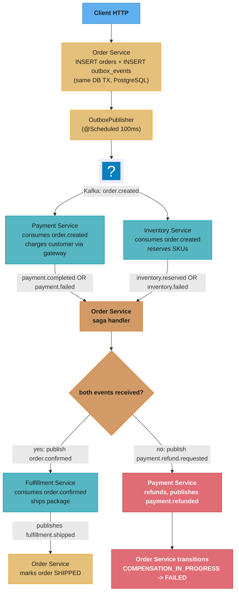

# Design: Event-Driven Order Processing Microservice
> "A choreography saga is a distributed relay race where each runner hands the baton to the
> next without a referee. If a runner drops the baton, every runner from that point
> backwards must undo their leg — coordinated by reaction, not by command."

**Key insight:** An event-driven system never calls another service directly. It writes an
event, disappears, and trusts that the subscriber will act on it — eventually, at least
once. This indirection is what enables independent scaling and graceful failure isolation,
but it moves consistency from synchronous guarantees to idempotent, compensating reactions.

See also: [Resilience4j patterns](./cross_cutting/resilience4j_patterns.md),
[Testcontainers and test strategy](./cross_cutting/testcontainers_and_test_strategy.md)

---

## 1. Requirements Clarification

**Functional requirements:**
- Accept orders and coordinate a distributed transaction across Order, Payment, Inventory,
  and Fulfillment services via events (no synchronous inter-service calls).
- Guarantee no order is silently lost even if a downstream service is temporarily
  unavailable.
- Compensate automatically: if payment succeeds but inventory is unavailable, trigger a
  refund through the same event-driven pipeline.
- Provide full auditability — every state transition (PENDING → PAYMENT_CONFIRMED →
  COMPENSATION_IN_PROGRESS → FAILED) must be traceable by correlation ID.

**Non-functional requirements:**
- 50,000 orders/hour sustained; 5× peak = 250,000 orders/hour (~70 orders/sec peak).
- At-least-once delivery with idempotent consumers (no duplicate charges, no
  double-shipping).
- End-to-end saga latency ≤ 5 seconds at P99 (order placed to CONFIRMED).
- Recovery from broker partition outage within 30 seconds; consumer lag SLO < 60 seconds.

**Constraints:** Spring Boot 4.1 / spring-kafka 4.1, Apache Kafka 4.x (KRaft — no ZooKeeper),
PostgreSQL, choreography-based Saga (no orchestrator service).

**Out of scope:** Payment gateway integration details, inventory management UI, A/B testing
of routing strategies, multi-currency orders.

---

## 2. Scale Estimation

**Traffic math:**
```
Sustained:      50,000 orders/hr = 13.9 orders/sec
Peak (5×):      250,000 orders/hr = 69.4 orders/sec ~ 70 orders/sec
Events per order (fanout): 1 order.created → 4 downstream events (payment, inventory,
                           fulfillment, compensation path) → ~4× amplification
Peak event rate:            70 × 4 = 280 events/sec across all topics
```

**Outbox throughput:**
```
Per instance:   100ms poll × batch 100 = 1,000 events/sec
For 280 events/sec peak: 1 instance sufficient; 2 for HA failover
Safety factor (5× spike): 10 poller instances via SELECT ... FOR UPDATE SKIP LOCKED
```

**Kafka partition sizing:**
```
Rule: partitions >= peak concurrent consumers per group
Target consumer concurrency: 8 threads per service × 2 HA instances = 16 active consumers
Partition count per topic:  16 partitions (never reduce — key ordering breaks)
Replication factor:         3 (tolerate 1 broker loss without data loss)
Retention:                  7 days for at-least-once replay
Topic count:                8 (order.created, order.confirmed, payment.completed,
                               payment.failed, payment.refund.requested, payment.refunded,
                               inventory.reserved, inventory.failed)
```

**Storage:**
```
Event payload avg:   2 KB (JSON with order ID, customer ID, amount, timestamps)
Peak event rate:     280 events/sec × 2 KB = 560 KB/sec
Daily volume:        560 KB/sec × 86,400s = 47 GB/day across all topics
Retention at 7 days: 330 GB total across Kafka cluster
PostgreSQL outbox:   < 1 GB (published rows pruned after 7 days)
```

**Consumer lag budget:**
```
SLO: < 60s of volume = < 70 events/sec × 60s = 4,200 events behind (alert at 50%)
Page threshold: 2,100 events of consumer lag per group
```

---

## 3. High-Level Architecture



**Component inventory:**

| Component | Responsibility |
|---|---|
| Order Service | Domain aggregate, outbox writer, saga state machine |
| OutboxEventPublisher | Scheduled poller: unpublished rows → Kafka, `FOR UPDATE SKIP LOCKED` |
| PaymentEventConsumer | Idempotent consumer with `processed_events` table check |
| InventoryEventConsumer | `@RetryableTopic` with DLT handler for transient failures |
| SagaCompensationService | Checks current order state before writing compensation outbox event |
| KafkaProducerConfig | Idempotent producer (`ENABLE_IDEMPOTENCE_CONFIG=true`, `acks=all`) |
| KafkaConsumerConfig | Manual ack (`MANUAL_IMMEDIATE`), concurrency=3, no auto-commit |

**Data flow narrative:**
1. `OrderService.createOrder()` writes `orders` row and `outbox_events` row in one `@Transactional` block. Both commit or both roll back — no dual-write window.
2. `OutboxEventPublisher` polls every 100ms, locks unpublished rows with `FOR UPDATE SKIP LOCKED`, sends to Kafka synchronously, marks published.
3. Downstream consumers check `processed_events` before acting. Idempotency key = `(event_id, consumer_group)` with a UNIQUE constraint. Duplicate = ack without processing.
4. Compensation is triggered by the saga handler writing a `PAYMENT_REFUND_REQUESTED` outbox event in the same transaction as the status update.

---

## 4. Component Deep Dives

### 4.1 Transactional Outbox — Domain Entity and Outbox Event

The outbox pattern uses a single local transaction to solve the dual-write problem between
a database and a message broker.

```java
@Entity
@Table(name = "orders")
public class Order {

    @Id
    private UUID id;

    private String customerId;
    private BigDecimal totalAmount;

    @Enumerated(EnumType.STRING)
    private OrderStatus status;

    private Instant createdAt;
    private Instant updatedAt;

    protected Order() {}

    public static Order create(String customerId, BigDecimal totalAmount) {
        Order order = new Order();
        order.id = UUID.randomUUID();
        order.customerId = customerId;
        order.totalAmount = totalAmount;
        order.status = OrderStatus.PENDING;
        order.createdAt = Instant.now();
        order.updatedAt = Instant.now();
        return order;
    }

    public void transitionTo(OrderStatus newStatus) {
        if (!status.canTransitionTo(newStatus)) {
            throw new IllegalStateException(
                "Cannot transition from " + status + " to " + newStatus);
        }
        this.status = newStatus;
        this.updatedAt = Instant.now();
    }

    public UUID getId() { return id; }
    public OrderStatus getStatus() { return status; }
    public String getCustomerId() { return customerId; }
    public BigDecimal getTotalAmount() { return totalAmount; }
}
```

```java
@Entity
@Table(name = "outbox_events")
public class OutboxEvent {

    @Id
    @GeneratedValue(strategy = GenerationType.IDENTITY)
    private Long id;

    private UUID aggregateId;
    private String aggregateType;
    private String eventType;

    @Column(columnDefinition = "jsonb")
    private String payload;

    private boolean published;
    private Instant createdAt;
    private Instant publishedAt;

    protected OutboxEvent() {}

    public static OutboxEvent of(UUID aggregateId, String aggregateType,
                                  String eventType, String payload) {
        OutboxEvent event = new OutboxEvent();
        event.aggregateId = aggregateId;
        event.aggregateType = aggregateType;
        event.eventType = eventType;
        event.payload = payload;
        event.published = false;
        event.createdAt = Instant.now();
        return event;
    }

    public void markPublished() {
        this.published = true;
        this.publishedAt = Instant.now();
    }

    public Long getId() { return id; }
    public UUID getAggregateId() { return aggregateId; }
    public String getEventType() { return eventType; }
    public String getPayload() { return payload; }
    public boolean isPublished() { return published; }
}
```

**Order Service — atomic write of business row and outbox row:**

```java
@Service
public class OrderService {

    private final OrderRepository orderRepository;
    private final OutboxEventRepository outboxEventRepository;
    private final ObjectMapper objectMapper;

    public OrderService(OrderRepository orderRepository,
                        OutboxEventRepository outboxEventRepository,
                        ObjectMapper objectMapper) {
        this.orderRepository = orderRepository;
        this.outboxEventRepository = outboxEventRepository;
        this.objectMapper = objectMapper;
    }

    @Transactional
    public Order createOrder(String customerId, BigDecimal totalAmount) throws Exception {
        Order order = Order.create(customerId, totalAmount);
        orderRepository.save(order);

        String payload = objectMapper.writeValueAsString(Map.of(
            "orderId", order.getId().toString(),
            "customerId", order.getCustomerId(),
            "totalAmount", order.getTotalAmount().toString()
        ));

        outboxEventRepository.save(
            OutboxEvent.of(order.getId(), "Order", "ORDER_CREATED", payload));

        return order;
    }

    @Transactional
    public void handlePaymentCompleted(String orderId) {
        Order order = orderRepository.findById(UUID.fromString(orderId))
            .orElseThrow(() -> new IllegalArgumentException("Order not found: " + orderId));
        order.transitionTo(OrderStatus.PAYMENT_CONFIRMED);
        orderRepository.save(order);
    }
}
```

### 4.2 BROKEN/FIX — Event Published Before Commit

**Broken:** publishing directly to Kafka inside the service method but outside outbox:

```java
// BROKEN: Kafka send is not part of the DB transaction
@Transactional
public void createOrder(OrderRequest req) {
    Order order = orderRepository.save(toEntity(req));
    kafkaTemplate.send("orders", new OrderCreatedEvent(order)); // escapes if TX rolls back
    paymentService.charge(req); // if THIS throws, TX rolls back but event is already on wire
}
```

If `paymentService.charge()` throws, the DB transaction rolls back — but the Kafka message
is already published. Downstream services ship goods for a non-existent order.

**Fix:** write the event to the outbox table in the same transaction; let a poller publish
it post-commit:

```java
// FIX: transactional outbox — event row committed atomically with order row
@Transactional
public void createOrder(OrderRequest req) {
    Order order = orderRepository.save(toEntity(req));
    paymentService.charge(req);
    outboxRepository.save(new OutboxEvent(
        "orders", order.getId().toString(),
        serialize(new OrderCreatedEvent(order)))); // commits or rolls back with order
    // No kafkaTemplate.send here. Outbox poller publishes after commit is durable.
}
```

### 4.3 Outbox Publisher with `FOR UPDATE SKIP LOCKED`

```java
@Component
public class OutboxEventPublisher {

    private static final Logger log = LoggerFactory.getLogger(OutboxEventPublisher.class);
    private static final int BATCH_SIZE = 100;

    private final OutboxEventRepository outboxEventRepository;
    private final KafkaTemplate<String, String> kafkaTemplate;

    public OutboxEventPublisher(OutboxEventRepository outboxEventRepository,
                                 KafkaTemplate<String, String> kafkaTemplate) {
        this.outboxEventRepository = outboxEventRepository;
        this.kafkaTemplate = kafkaTemplate;
    }

    @Scheduled(fixedDelay = 100)
    @Transactional
    public void publishPendingEvents() {
        // Must be the FOR UPDATE SKIP LOCKED query below -- a plain derived finder
        // (findTop100ByPublishedFalseOrderByCreatedAtAsc) takes no locks, so every
        // instance selects the same rows and publishes every event N times.
        List<OutboxEvent> pending = outboxEventRepository.findAndLockUnpublished(BATCH_SIZE);

        if (pending.isEmpty()) return;

        for (OutboxEvent event : pending) {
            try {
                String topic = resolveKafkaTopic(event.getEventType());
                kafkaTemplate.send(topic,
                                   event.getAggregateId().toString(),
                                   event.getPayload())
                             .get(); // synchronous: ensures Kafka ack before marking published

                event.markPublished();
                outboxEventRepository.save(event);
            } catch (Exception e) {
                log.error("Failed to publish outbox event id={}: {}",
                          event.getId(), e.getMessage());
                // leave published=false; retry in next poll cycle
            }
        }
    }

    private String resolveKafkaTopic(String eventType) {
        return switch (eventType) {
            case "ORDER_CREATED"            -> "order.created";
            case "ORDER_CONFIRMED"          -> "order.confirmed";
            case "ORDER_FAILED"             -> "order.failed";
            case "PAYMENT_REFUND_REQUESTED" -> "payment.refund.requested";
            default -> throw new IllegalArgumentException("Unknown event type: " + eventType);
        };
    }
}
```

PostgreSQL query for multi-instance safety:
```java
// In OutboxEventRepository:
@Query(value = """
    SELECT * FROM outbox_events
    WHERE published = false
    ORDER BY created_at ASC
    LIMIT :limit
    FOR UPDATE SKIP LOCKED
    """, nativeQuery = true)
List<OutboxEvent> findAndLockUnpublished(@Param("limit") int limit);
```

`SKIP LOCKED` means each poller instance grabs non-overlapping rows rather than queueing
behind the same lock, achieving ~N× throughput across N instances.

### 4.4 Idempotent Consumer and `@RetryableTopic`

```java
@Component
public class PaymentEventConsumer {

    private final ProcessedEventRepository processedEventRepository;
    private final OrderService orderService;
    private final ObjectMapper objectMapper;

    @KafkaListener(
        topics = "payment.completed",
        groupId = "order-service-payment-consumer",
        containerFactory = "ackKafkaListenerContainerFactory"
    )
    @Transactional
    public void onPaymentCompleted(ConsumerRecord<String, String> record,
                                    Acknowledgment ack) throws Exception {
        String eventId = extractEventId(record);

        if (processedEventRepository.existsByEventIdAndConsumerGroup(
                eventId, "order-service-payment-consumer")) {
            ack.acknowledge();
            return;
        }

        JsonNode payload = objectMapper.readTree(record.value());
        String orderId = payload.get("orderId").asText();

        orderService.handlePaymentCompleted(orderId);

        processedEventRepository.save(
            new ProcessedEvent(eventId, "order-service-payment-consumer"));

        ack.acknowledge();
    }

    private String extractEventId(ConsumerRecord<String, String> record) {
        var header = record.headers().lastHeader("event-id");
        if (header != null) return new String(header.value());
        return record.topic() + "-" + record.partition() + "-" + record.offset();
    }
}
```

```java
@Component
public class InventoryEventConsumer {

    @RetryableTopic(
        attempts = "4",
        backoff = @Backoff(delay = 1000, multiplier = 10, maxDelay = 60000),
        // Creates: inventory.failed-retry-0, -retry-1, -retry-2, inventory.failed-dlt
        topicSuffixingStrategy = TopicSuffixingStrategy.SUFFIX_WITH_INDEX_VALUE,
        dltTopicSuffix = "-dlt",
        include = {org.apache.kafka.common.errors.RetriableException.class}
    )
    @KafkaListener(topics = "inventory.failed", groupId = "order-service-inventory-consumer")
    @Transactional
    public void onInventoryFailed(ConsumerRecord<String, String> record) throws Exception {
        String eventId = extractEventId(record);

        if (processedEventRepository.existsByEventIdAndConsumerGroup(
                eventId, "order-service-inventory-consumer")) {
            return;
        }

        var payload = objectMapper.readTree(record.value());
        String orderId = payload.get("orderId").asText();
        String reason = payload.get("reason").asText();

        sagaCompensationService.compensateForInventoryFailure(orderId, reason);
        processedEventRepository.save(
            new ProcessedEvent(eventId, "order-service-inventory-consumer"));
    }

    @DltHandler
    public void handleDlt(ConsumerRecord<String, String> record,
                          @Header(KafkaHeaders.DLT_ORIGINAL_TOPIC) String originalTopic,
                          @Header(KafkaHeaders.DLT_EXCEPTION_MESSAGE) String failure) {
        // RECEIVED_TOPIC here would just say "...-dlt". DLT_ORIGINAL_TOPIC is the topic the
        // message actually failed on, which is what you need to replay it.
        log.error("Exhausted retries; originalTopic={} key={} cause={}",
                  originalTopic, record.key(), failure);
        // persist to dead_letter_events table + fire PagerDuty alert
    }
}
```

### 4.5 Saga Compensation Service

```java
@Service
public class SagaCompensationService {

    @Transactional
    public void compensateForInventoryFailure(String orderId, String reason) throws Exception {
        Order order = orderRepository.findById(UUID.fromString(orderId))
            .orElseThrow(() -> new IllegalArgumentException("Order not found: " + orderId));

        if (order.getStatus() == OrderStatus.PAYMENT_CONFIRMED) {
            order.transitionTo(OrderStatus.COMPENSATION_IN_PROGRESS);
            orderRepository.save(order);

            String refundPayload = objectMapper.writeValueAsString(Map.of(
                "orderId", orderId,
                "customerId", order.getCustomerId(),
                "amount", order.getTotalAmount().toString(),
                "reason", "inventory_unavailable: " + reason
            ));

            outboxEventRepository.save(OutboxEvent.of(
                order.getId(), "Order", "PAYMENT_REFUND_REQUESTED", refundPayload));
        } else {
            order.transitionTo(OrderStatus.FAILED);
            orderRepository.save(order);
        }
    }
}
```

### 4.6 Kafka Producer and Consumer Configuration

```java
@Configuration
public class KafkaProducerConfig {

    @Bean
    public ProducerFactory<String, String> producerFactory() {
        Map<String, Object> props = new HashMap<>();
        props.put(ProducerConfig.BOOTSTRAP_SERVERS_CONFIG, "localhost:9092");
        props.put(ProducerConfig.KEY_SERIALIZER_CLASS_CONFIG, StringSerializer.class);
        props.put(ProducerConfig.VALUE_SERIALIZER_CLASS_CONFIG, StringSerializer.class);
        props.put(ProducerConfig.ENABLE_IDEMPOTENCE_CONFIG, true);
        props.put(ProducerConfig.ACKS_CONFIG, "all");
        props.put(ProducerConfig.RETRIES_CONFIG, Integer.MAX_VALUE);
        props.put(ProducerConfig.MAX_IN_FLIGHT_REQUESTS_PER_CONNECTION, 5);  // max with idempotence

        // Do NOT set TRANSACTIONAL_ID_CONFIG here. It makes the factory transaction-capable,
        // and KafkaTemplate.send() outside a transaction then fails fast:
        //   IllegalStateException: No transaction is in process; possible solutions: ...
        // The outbox publisher in §4.3 sends plainly, so every publish would throw and the
        // outbox would silently never drain. Idempotence alone gives the dedup-on-retry
        // guarantee this design needs; transactions would only add value for a
        // consume-transform-produce loop entirely inside Kafka.
        return new DefaultKafkaProducerFactory<>(props);
    }

    @Bean
    public KafkaTemplate<String, String> kafkaTemplate() {
        return new KafkaTemplate<>(producerFactory());
    }
}

@Configuration
public class KafkaConsumerConfig {

    @Bean(name = "ackKafkaListenerContainerFactory")
    public ConcurrentKafkaListenerContainerFactory<String, String>
            ackKafkaListenerContainerFactory() {
        ConcurrentKafkaListenerContainerFactory<String, String> factory =
            new ConcurrentKafkaListenerContainerFactory<>();
        factory.setConsumerFactory(consumerFactory());
        factory.getContainerProperties().setAckMode(ContainerProperties.AckMode.MANUAL_IMMEDIATE);
        factory.setConcurrency(3);
        return factory;
    }

    @Bean
    public ConsumerFactory<String, String> consumerFactory() {
        Map<String, Object> props = new HashMap<>();
        props.put(ConsumerConfig.BOOTSTRAP_SERVERS_CONFIG, "localhost:9092");
        props.put(ConsumerConfig.KEY_DESERIALIZER_CLASS_CONFIG, StringDeserializer.class);
        props.put(ConsumerConfig.VALUE_DESERIALIZER_CLASS_CONFIG, StringDeserializer.class);
        props.put(ConsumerConfig.ENABLE_AUTO_COMMIT_CONFIG, false);
        props.put(ConsumerConfig.AUTO_OFFSET_RESET_CONFIG, "earliest");
        props.put(ConsumerConfig.MAX_POLL_RECORDS_CONFIG, 50);
        return new DefaultKafkaConsumerFactory<>(props);
    }
}
```

---

## 5. Design Decisions & Tradeoffs

### Key decision table

| Decision | Choice | Alternative | Rationale |
|---|---|---|---|
| Event delivery guarantee | At-least-once + idempotent consumer | Exactly-once (Kafka EOS) | EOS cannot cross the payment-gateway boundary at any price, so the throughput cost (commonly cited around 10-20%, versus near-zero for idempotence alone) buys nothing the gateway idempotency key does not already give |
| Saga coordination | Choreography | Orchestrator service | No central bottleneck; services stay independent; tradeoff is that full saga history requires correlating logs by order ID |
| Event write mechanism | Transactional outbox | Direct Kafka publish / CDC Debezium | Outbox is atomic with business write; CDC simpler to operate but requires Debezium connector deployment |
| Consumer failure handling | `@RetryableTopic` with DLT | Simple retry in listener | Keeps poison messages from blocking the partition; exponential backoff (1s→10s→60s×3) avoids thundering herd |
| Partition count | 16 per topic | 8 | `peak_consumers × 2` headroom; partitions cannot decrease without breaking key-based ordering |

### Choreography vs Orchestration detail

| Aspect | Choreography (chosen) | Orchestration |
|---|---|---|
| Centralized visibility | Low — requires log correlation by orderId | High — orchestrator tracks saga state |
| Coupling | Low — services react to events only | Higher — services must expose compensation endpoints to orchestrator |
| Failure handling | Distributed — each service compensates | Centralized — orchestrator issues compensations, single point of failure |
| Operational complexity | Log correlation tooling needed | Orchestrator needs its own HA deployment |

### Exactly-Once vs At-Least-Once for payments

Kafka EOS (`enable.idempotence=true`, transactional producer, `read_committed` consumer) only guarantees end-to-end exactly-once *within* Kafka. A payment gateway call lives outside Kafka — it can time out with unknown state regardless of Kafka guarantees. The pragmatic answer is at-least-once delivery with idempotency at the gateway via a stable payment intent ID. The gateway returns the original result on redelivery rather than charging again.

---

## 6. Real-World Implementations

**The Saga pattern (Garcia-Molina & Salem, 1987)** predates microservices by three decades. The
original paper's subject was long-lived database transactions: split one into a sequence of
sub-transactions, each with a compensating transaction that semantically undoes it, and accept that
the whole is *not* isolated. That last part is the concession this design inherits and the one most
often forgotten — an order sitting in `PAYMENT_CONFIRMED` while inventory is still deciding is a
partial state genuinely visible to everyone. Compensation is not rollback: a refund is a second
fact, not the erasure of the first, which is exactly why §4.5 transitions to
`COMPENSATION_IN_PROGRESS` rather than back to `PENDING`.

**Debezium** is the outbox pattern productised, and it ships an `EventRouter` transformation
designed for exactly the table in §4.1 — it reads the WAL, routes each outbox row to a topic from
its `aggregatetype` column, uses `aggregateid` as the message key, and unwraps the payload so
consumers never see the envelope. Adopting it deletes the `@Scheduled` poller, the `published`
column and the `SKIP LOCKED` query in one move. The cost is a Kafka Connect cluster to operate and
a replication slot to watch: a slot whose consumer has stopped pins the WAL, and PostgreSQL will
fill the disk rather than drop it.

**AWS**: the same shape without any of the parts. A DynamoDB write is atomic with the stream record
it emits, so DynamoDB Streams *are* the outbox — no table, no poller, no dual write — and a Lambda
relays to EventBridge or SNS. Consumer idempotency uses a conditional write on a dedup item, the
DynamoDB equivalent of the `processed_events` UNIQUE constraint here. AWS's own guidance is the one
worth internalising: choreography for short flows, Step Functions (orchestration) once the flow is
long enough that "which step is it on?" stops being answerable from logs — which is precisely the
weakness §5's comparison table concedes.

**Axon Framework** takes the opposite bet: make sagas a first-class runtime concept
(`@Saga`, `@StartSaga`, `@SagaEventHandler`, `@EndSaga`), with saga state persisted and correlated
for you, and the event store itself acting as the outbox. You trade the freedom of §4.5's hand-rolled
state machine for the framework's model of one — worth it when event sourcing is already a
requirement, over-large when you only needed four topics and a status column.

---

## 7. Technologies & Tools

| Tool | Saga support | Outbox mechanism | Retry/DLT | Test support | When to choose |
|---|---|---|---|---|---|
| **Spring Kafka + @RetryableTopic** | Manual via event handlers | Manual (your code) | Built-in retry topics + DLT | Embedded Kafka for unit, Testcontainers for integration | Default choice for Spring Boot projects |
| **Spring Cloud Stream** | Manual | Manual | Binder-specific | Same | When you want binder abstraction (Kafka/RabbitMQ without code change) |
| **Axon Framework** | First-class `@Saga` | Axon Server event store | Automatic sequenced delivery | `AxonServerEmbeddedEventStore` | When event sourcing + CQRS is a requirement (financial, audit-heavy) |
| **Eventuate Tram** | First-class saga orchestration and choreography | Transactional outbox built-in | CDC (Debezium) | Docker Compose based | When you want a fully managed outbox + saga library without implementing it |
| **Temporal** | `@WorkflowMethod` (orchestration) | Temporal's durable execution log | Automatic retries, timeouts | Temporal Test Server | When sagas exceed 5 steps, need human approval, or require multi-day timeouts |

---

## 8. Operational Playbook

### (a) Consumer Health Monitoring

**What to track:**
- Consumer group lag per topic per partition (Kafka `kafka.consumer.fetch-manager-metrics`)
- DLT message count per topic (alert immediately on any DLT message)
- Outbox table row count for `published = false` (alert if > 5,000 rows)
- `processed_events` table row count (prune daily; growing unboundedly indicates GC job failure)

**Lag SLO expression (Prometheus):**
```
kafka_consumer_group_lag{group="order-service-payment-consumer"} /
kafka_topic_partition_current_offset{topic="payment.completed"}
> 0.1  # alert if lag > 10% of total offset (proxy for >60s at current rate)
```

### (b) Distributed Tracing for Saga Correlation

Every service propagates `X-Order-ID` and `X-Correlation-ID` as Kafka headers. Micrometer
Tracing (with OTLP exporter) creates a span per Kafka send/receive. Saga reconstruction
query in Jaeger/Grafana Tempo:
```
{service.name=~"order|payment|inventory|fulfillment"} | logfmt | orderId="<id>"
```
Cross-reference: [OTel observability for Spring](cross_cutting/otel_observability_for_spring.md)

### (c) Incident Runbooks

**Runbook 1: Consumer lag growing (broker issue or slow handler)**
- Symptom: `kafka_consumer_group_lag > 2,100` for any group; end-to-end saga latency P99 > 5s
- Diagnose: check partition leader for affected topic; check consumer logs for `CommitFailedException` (rebalance loop) or long handler durations
- Mitigate: if rebalance loop, increase `max.poll.interval.ms` or reduce `max.poll.records`; if slow handler, add horizontal consumer instances (up to partition count)
- Resolve: scale consumers to drain lag; verify broker leader election complete; page if lag > 60s sustained

**Runbook 2: DLT filling up (poison message blocking partition)**
- Symptom: `DLT message count > 0` for any topic; associated service logs show repeated `RetryableTopic` exhaustion
- Diagnose: inspect DLT message payload and stack trace in `dead_letter_events` table; determine if schema mismatch, unexpected null, or transient dependency (DB down)
- Mitigate: if transient — fix dependency and replay DLT manually using `KafkaTemplate.send()` to original topic; if schema — fix consumer to handle both old and new schema (Jackson `@JsonIgnoreProperties(ignoreUnknown=true)`)
- Resolve: confirm DLT stops accumulating; monitor processed count recovers

**Runbook 3: Outbox table bloat (cleanup job failing)**
- Symptom: `outbox_events` table > 10 GB; PostgreSQL autovacuum falling behind; INSERT latency rising
- Diagnose: check `@Scheduled` cleanup job logs for exceptions; check PostgreSQL `pg_stat_user_tables` for dead tuple count on `outbox_events`
- Mitigate: run manual `DELETE FROM outbox_events WHERE published = true AND published_at < NOW() - INTERVAL '7 days' LIMIT 10000` in batches to avoid lock contention
- Resolve: partition `outbox_events` by `created_at` range (monthly) so future cleanup is a `DROP TABLE` on the old partition — O(1) and lock-free

**Runbook 4: Saga stuck in COMPENSATION_IN_PROGRESS**
- Symptom: orders stuck in `COMPENSATION_IN_PROGRESS` for > 10 minutes; customer sees neither confirmed nor refunded state
- Diagnose: check `outbox_events` for `PAYMENT_REFUND_REQUESTED` rows with `published = false`; check Payment Service DLT for failed refund events
- Mitigate: if outbox poller stopped — restart the instance; if Payment Service DLT — manually replay; if state machine corrupted — `UPDATE orders SET status = 'FAILED' WHERE id = ? AND status = 'COMPENSATION_IN_PROGRESS'` after confirming no refund was processed
- Resolve: idempotent design means replaying the outbox event is always safe; confirm order moves to FAILED within one poll cycle (100ms)

---

## 9. Common Pitfalls & War Stories

### War Story 1: Dual-Write Race Causes Phantom Shipments

**Scenario:** Order service published `order.created` to Kafka directly inside `@Transactional`, then committed the database transaction. Under GC pause load, the Kafka send completed but the database transaction rolled back due to a connection timeout from a different service within the same Saga.

**Impact:** Downstream services fulfilled 0.01% of orders (estimated 50 orders per week at 50k orders/hour) where no corresponding order row existed. Manual investigation required for each phantom shipment. Customer refund rate for these was 100%.

```java
// BROKEN: event escapes the transaction
@Transactional
public void createOrder(OrderRequest req) {
    Order order = orderRepository.save(toEntity(req));
    kafkaTemplate.send("orders", new OrderCreatedEvent(order)); // sent regardless of TX outcome
    paymentService.charge(req); // this throws -> TX rolls back, but Kafka event is permanent
}
```

```java
// FIX: write event to outbox table in same TX; poller publishes after commit
@Transactional
public void createOrder(OrderRequest req) {
    Order order = orderRepository.save(toEntity(req));
    paymentService.charge(req);
    outboxRepository.save(new OutboxEvent(
        "orders", order.getId().toString(),
        serialize(new OrderCreatedEvent(order))));
    // No kafkaTemplate.send here.
}
```

Resolution: migrated to transactional outbox. Phantom shipments dropped to zero. P99 order placement latency increased by ~100ms (outbox poll interval) — accepted as the correct tradeoff.

### War Story 2: Ack Before Processing Causes Silent Event Loss

**Scenario:** A developer configured `AckMode.RECORD` but acknowledged the offset at the start of the handler before calling the downstream database. When a pod was killed mid-deployment, the committed offset was ahead of the last successfully processed message — those events were never reprocessed.

**Impact:** ~200 payment.completed events lost per deployment cycle (weekly deployments). Caused 200 orders per week stuck in PAYMENT_CONFIRMED with no subsequent SHIPPED state transition. Discovered 3 weeks later via customer support escalations.

```java
// BROKEN: ack at the start, then crash half-way through
@KafkaListener(topics = "orders")
public void handle(OrderEvent e, Acknowledgment ack) {
    ack.acknowledge();           // offset committed immediately
    inventoryService.reserve(e); // crash here = event lost forever, offset already advanced
}
```

```java
// FIX: ack only after successful processing; idempotency guard at the top
@KafkaListener(topics = "orders", containerFactory = "manualAckFactory")
public void handle(OrderEvent e, Acknowledgment ack) {
    if (processedRepository.existsById(e.getEventId())) {
        ack.acknowledge();
        return;
    }
    inventoryService.reserve(e);
    processedRepository.save(new ProcessedEvent(e.getEventId()));
    ack.acknowledge(); // offset advances only after durable processing
}
```

### War Story 3: Partition Count Too Low — Hot Partition Bottleneck

A team launched with 4 partitions for `order.created`, using `customerId` as the message key for ordering guarantees. After a Black Friday spike, 60% of orders came from 2 customers (B2B bulk orders). Those 2 customers' keys always hash to the same 2 partitions, leaving 6 consumer threads idle while 2 are saturated. Consumer lag grew to 15 minutes.

Resolution: increase partition count to 16 (requires a rolling restart of all consumer groups; key-to-partition assignment changes for existing keys — acceptable for new events). For B2B bulk orders, switched message key to `orderId` (unique per event) to ensure even distribution. Ordering guarantees for a given order are maintained by the single-partition property per key.

### War Story 4: `processed_events` Table Not Pruned — Query Slows to 30s

The `processed_events` table grew to 800M rows over 18 months (no cleanup job deployed). The idempotency check `SELECT 1 FROM processed_events WHERE event_id = ? AND consumer_group = ?` degraded from <1ms to 30s as the index B-tree depth grew. All consumers in the affected group timed out, triggering a Kafka rebalance loop.

Fix: add a `processed_at` column, create a partial index on `(event_id, consumer_group)` WHERE `processed_at > NOW() - INTERVAL '30 days'`, and run a nightly `DELETE ... WHERE processed_at < NOW() - INTERVAL '30 days'` in batches of 10,000. For PostgreSQL, range-partition the table by `processed_at` month so pruning is a DDL `DETACH PARTITION` + `DROP TABLE`.

---

## 10. Capacity Planning

### Partition sizing formula

```
Throughput does NOT size partitions here. A single partition sustains tens of MB/s;
at 280 events/sec x 2 KB = 560 KB/s the whole peak fits on one. Partitions are sized by
consumer parallelism, because a group can run at most one consumer thread per partition:

partitions = peak_concurrent_consumers x headroom
           = (8 threads/instance x 2 HA instances) x 1
           = 16          // matches §2; raise later if you add instances, never lower it

consumer_instances = ceil(partitions / concurrency_per_instance)
                   = ceil(16 / 8)
                   = 2 instances per consumer group for full parallelism

Over-provisioning partitions is not free either: each one costs open file handles, memory
on every broker, and longer leader elections, so 16 is a ceiling on parallelism you have
committed to, not a spare-capacity purchase.
```

### Throughput and thread math

```
Target ingest:            10,000 events/sec (headroom for 70 orders/sec × 4 fanout × 35×)
Consumer groups (fanout): 5 services consume order.created
Handler invocations:      10,000 x 5 = 50,000 handler calls/sec across fleet

Per handler budget (DB upsert + idempotency check): ~2ms average
Required parallelism:     50,000 x 0.002s = 100 concurrent handlers
Per-instance concurrency: 8 (Kafka listener concurrency=8)
Consumer instances needed: ceil(100 / 8) = 13 instances across all 5 services
```

### Outbox poller capacity

```
Poll interval:   100ms
Batch per poll:  100 events
Per instance:    1,000 events/sec
At the 70 orders/sec peak: 70 x 4 fanout = 280 events/sec -> 1 instance at 28% utilization
  (70 orders/sec is ALREADY the 5x peak from §2 — do not apply the multiplier twice)
Safety headroom: 2 poller instances using SKIP LOCKED so neither publishes the other's rows
```

### Memory and lag budget

```
Consumer fetch buffer:  max.partition.fetch.bytes 1 MB x 16 partitions = 16 MB per consumer
In-flight records:      max.poll.records 50 x ~2 KB = 100 KB per poll loop
Lag SLO:                < 60s volume = < 70 events/sec × 60s = 4,200 events
Alert threshold:        50% of SLO = 2,100 events per consumer group
```

### Hardware recommendation

```
Kafka cluster: 3 brokers, each 16 vCPU / 64 GB RAM / 2 TB SSD
  -> 47 GB/day x 7 days retention (§2) x replication factor 3 = 987 GB of stored log,
     i.e. ~330 GB per broker against 2 TB — room to extend retention to ~30 days if
     replay windows need it

Order Service: 2 instances, each 4 vCPU / 8 GB RAM
  -> 2 outbox pollers + 8 consumer threads each; JVM heap 4 GB with G1GC

PostgreSQL: r6g.2xlarge (8 vCPU, 64 GB RAM), 1 TB gp3 storage
  -> outbox + orders + processed_events; HikariCP maximumPoolSize raised to 20 (default is 10)
  -> add read replica for heavy saga-state queries
```

---

## 11. Interview Discussion Points

**Q: What happens if the outbox publisher crashes between sending the Kafka message and marking the event as published?**

A: The event will be sent again on the next poll cycle, producing a duplicate message in Kafka. Consumers must be idempotent — the `processed_events` table with a UNIQUE constraint on `(event_id, consumer_group)` prevents double-processing. Neither the outbox alone nor idempotent consumers alone are sufficient; both are required. The outbox prevents loss; idempotency prevents double processing on redelivery.

**Q: How do you prevent the `outbox_events` table from growing unboundedly?**

A: A nightly `@Scheduled` job deletes rows where `published = true AND published_at < NOW() - INTERVAL '7 days'`, executed in batches of 10,000 to avoid lock contention. For production scale, partition the table by `created_at` using PostgreSQL range partitioning — pruning becomes a `DETACH PARTITION; DROP TABLE` (DDL, O(1), no VACUUM needed) instead of a row-by-row DELETE.

**Q: How does the Saga handle simultaneous payment and inventory failure?**

A: In choreography, both `payment.failed` and `inventory.failed` events arrive independently. Each handler checks current order status — if status is already FAILED, the second handler is a no-op. The first consumer wins the status transition. No compensation is needed for `payment.failed` because no money was charged. The design is idempotent: receiving either event in any order leads to the correct terminal FAILED state.

**Q: Why prefer at-least-once plus idempotency over Kafka exactly-once for payment events?**

A: Kafka EOS only works end-to-end within Kafka (topic-to-topic via transactional producers and `read_committed` consumers). A payment gateway call is external — it can time out with unknown outcome regardless of Kafka guarantees, so EOS does not make the charge exactly-once; it only makes the *event* exactly-once. The correct solution is passing a stable idempotency key (payment intent ID) to the gateway so redelivery returns the original result instead of charging twice. Separate the two knobs when reasoning about cost: `enable.idempotence=true` is essentially free and you should always have it on (it deduplicates producer retries), while transactions add per-commit coordinator round trips and are commonly measured in the 10-20% throughput range. Here you pay that for a guarantee the gateway has to provide anyway.

**Q: How do you implement `SELECT FOR UPDATE SKIP LOCKED` and why is it needed for the outbox poller?**

A: Without `SKIP LOCKED`, multiple poller instances would block on the same row locks and serialize. `SKIP LOCKED` causes each instance to immediately skip rows another transaction has locked, so N instances process N non-overlapping batches concurrently:
```java
@Query(value = "SELECT * FROM outbox_events WHERE published = false ORDER BY created_at ASC LIMIT :limit FOR UPDATE SKIP LOCKED", nativeQuery = true)
List<OutboxEvent> findAndLockUnpublished(@Param("limit") int limit);
```
The lock is held for the duration of the `@Transactional` block (read → Kafka send → mark published), preventing any other instance from picking up the same row.

**Q: How do you size the number of Kafka partitions?**

A: Partitions bound consumer parallelism — a consumer group can have at most one active consumer thread per partition. Provision `partitions = peak_expected_consumers × 2` for headroom, since partitions can only be increased later (never decreased without breaking key-based ordering). Also verify per-partition throughput limits and distribute partitions across brokers for balance. For 8 concurrent consumers we provision 16 partitions.

**Q: What happens to consumer lag during a broker outage, and how do you alert on it?**

A: During the outage, offsets stop advancing for partitions whose leaders are lost, so lag grows at the full ingest rate. Kafka elects a new leader from in-sync replicas within seconds to ~30s worst case (`replica.lag.time.max.ms`). After recovery, consumers drain lag at their throughput. Alert on lag expressed in time (records-behind ÷ consume rate) not raw record count — a lag-in-seconds metric is independent of throughput fluctuations. Page when lag exceeds the SLO (e.g., 60 seconds of expected volume).

**Q: How do you handle schema evolution without breaking consumers?**

A: Use JSON (or Avro with Schema Registry) and follow consumer-driven contract testing. JSON consumers must ignore unknown fields. On Jackson 3 (Spring Boot 4's default) that is already the behaviour — `FAIL_ON_UNKNOWN_PROPERTIES` defaults to **false**; on Jackson 2 it defaulted to true and Spring Boot turned it off for you. Do not rely on either: annotate the DTO `@JsonIgnoreProperties(ignoreUnknown = true)` so the contract survives a hand-built `ObjectMapper`. Producers may freely add new optional fields. Removing or renaming a field requires a two-phase migration: (1) add new field as optional and deploy all consumers that handle it; (2) once all consumers are on the new version, drop the old field from producers. Avro with `BACKWARD` compatibility enforcement automates this check in CI.

**Q: Why is message key choice critical for Kafka partitioning?**

A: The key determines which partition a message lands on via `hash(key) % numPartitions`. Within a partition, ordering is guaranteed; across partitions it is not. If you key by `customerId`, a B2B customer placing 1,000 bulk orders will hash to a single partition, creating a hot partition while others sit idle. Keying by `orderId` ensures uniform distribution when order IDs are random UUIDs. Choose the key based on what ordering you actually need: `orderId` for per-order ordering, `customerId` only if cross-order ordering is required (rare).

**Q: How would you migrate this design from polling outbox to CDC (Debezium)?**

A: The outbox table structure stays identical — only the publishing mechanism changes. Debezium connects to PostgreSQL's logical replication slot and streams `INSERT` events from `outbox_events` to Kafka in near-real-time (milliseconds vs 100ms poll). Benefits: lower latency, no SKIP LOCKED contention, no `@Scheduled` thread needed. Costs: Debezium connector deployment, WAL retention configuration, PostgreSQL logical replication slot management (a stale slot can cause WAL to accumulate indefinitely). Migrate by: (1) deploy Debezium connector alongside the existing poller; (2) once CDC is confirmed stable, disable the poller; (3) drop the `@Scheduled` bean.

**Q: How do you test the saga end-to-end in a CI pipeline without a real Kafka cluster?**

A: Two approaches. Unit: use `@EmbeddedKafka` (Spring Kafka Test) for fast in-process tests; topics are created automatically, no external process needed. Integration: use Testcontainers with the Confluent Kafka image — starts a real broker in Docker, exercises partitioning, rebalancing, and DLT routing that `@EmbeddedKafka` does not. For saga testing, write an event to the outbox, trigger the outbox poller manually via `@Autowired OutboxEventPublisher; publisher.publishPendingEvents()`, then assert saga state transitions. Testcontainers also enables testing Debezium CDC pipelines by adding a PostgreSQL container with logical replication enabled. See: [Testcontainers and test strategy](./cross_cutting/testcontainers_and_test_strategy.md).
