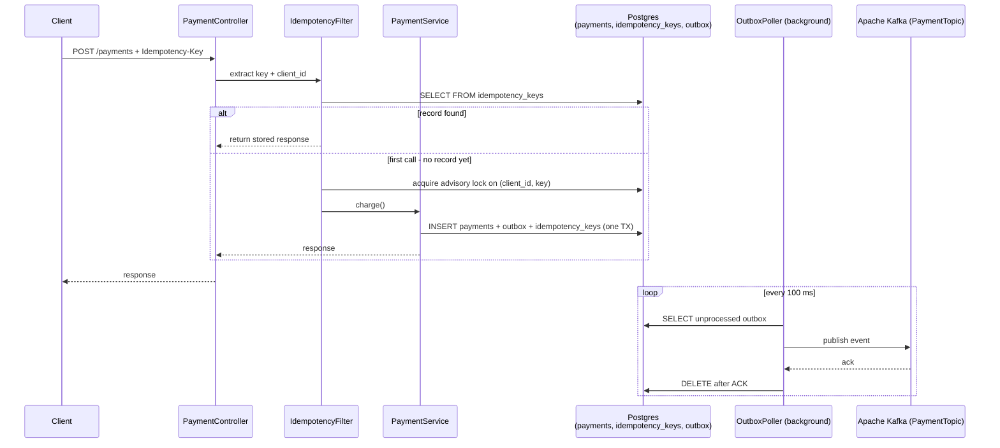

# Design: Idempotent Payment API (Spring Boot + Outbox Pattern)

> **"A post office that refuses to deliver the same letter twice."**
> Network retries are inevitable — mobile clients drop connections, load balancers time out,
> and deployments cause brief unavailability. Without idempotency, every retry risks a duplicate
> charge. An idempotency key is the client's contract: "this is my first attempt; any subsequent
> call with the same key is a retry, not a new payment."
>
> **Key insight:** Idempotency in a payment API is not a cache — it's a protocol contract.
> The first execution determines the canonical outcome; all subsequent executions with the same
> key return that outcome without re-executing business logic. The hardest part is ensuring
> the database write and the downstream event publication happen as a single atomic unit.

---

## 1. Requirements Clarification

### Functional Requirements
- Process payment requests identified by a client-supplied idempotency key (UUID or string up to 64 chars).
- Return the same response (success or failure) for all retries with the same idempotency key, within a 24-hour window.
- On the first call with a new key: validate, charge the payment method, and publish a `PaymentProcessed` event.
- On retry with an existing key (same client ID + key): return the stored response without re-charging.
- On key collision (different client ID, same key): return a distinct error (`IDEMPOTENCY_KEY_CONFLICT`).
- Publish `PaymentProcessed` / `PaymentFailed` events to Kafka using the outbox pattern.

### Non-Functional Requirements
- **Exactly-once charge:** A payment must be executed at most once per idempotency key, even under concurrent retries.
- **Latency:** P99 < 200 ms for payment processing (excluding payment provider round-trip).
- **Availability:** 99.99%; continue accepting requests during brief outbox poller outages (Kafka optional on critical path).
- **Durability:** Idempotency records persist for 24 hours; payment records persist indefinitely.

### Out of Scope
- Payment provider integration (Stripe/Braintree API calls).
- Fraud detection.
- Currency conversion.

---

## 2. Scale Estimation

### Traffic
```
Peak payments:         10,000 req/min = 167 req/s
Retry rate:            20% of requests are retries (idempotency cache hits)
Net new payments:      134 req/s
Outbox events:         134 PaymentProcessed events/s
```

### Storage
```
Idempotency keys:  24-hour TTL; at 134/s × 86,400 s = 11,577,600 records/day
Record size:       ~500 bytes (key + client_id + response JSON + timestamps)
Daily storage:     11,577,600 × 500 = 5.8 GB (indexed by (client_id, key))
Partitioned:       drop partitions older than 25 hours; steady-state ~6 GB
Outbox table:      events older than 5 minutes deleted after ACK; < 50,000 rows at any time
```

### Database Load
```
New payment path:     1 idempotency INSERT + 1 payment INSERT + 1 outbox INSERT (same TX)
Retry path:           1 idempotency SELECT (no write)
Reads:    167 req/s × 1 SELECT = 167 reads/s (trivial; index on (client_id, idempotency_key))
Writes:   134 req/s × 3 INSERTs in one TX = 134 TX/s (lightweight for Postgres)
```

---

## 3. High-Level Architecture



### Component Inventory
| Component | Role |
|-----------|------|
| `IdempotencyFilter` | Checks existing keys; acquires advisory lock for concurrent requests |
| `PaymentService` | `@Transactional` method wrapping payment + outbox + idempotency writes |
| `IdempotencyRepository` | JPA repository for `idempotency_keys` table |
| `OutboxRepository` | JPA repository for `outbox` table |
| `OutboxPoller` | `@Scheduled` every 100 ms; publishes events to Kafka; deletes after ACK |
| `PaymentProviderClient` | HTTP client wrapping external payment API (Stripe/Braintree) |

---

## 4. Component Deep Dives

### 4.1 Idempotency Key Schema

```sql
CREATE TABLE idempotency_keys (
    client_id       VARCHAR(64)  NOT NULL,
    idempotency_key VARCHAR(64)  NOT NULL,
    status          VARCHAR(16)  NOT NULL,  -- IN_PROGRESS, COMPLETED, FAILED
    request_hash    VARCHAR(64)  NOT NULL,  -- SHA-256 of request body
    response_body   TEXT,                   -- stored JSON response (nullable until complete)
    http_status     INT,
    expires_at      TIMESTAMPTZ  NOT NULL DEFAULT NOW() + INTERVAL '24 hours',
    created_at      TIMESTAMPTZ  NOT NULL DEFAULT NOW(),
    PRIMARY KEY (client_id, idempotency_key)
);

CREATE INDEX idx_idempotency_expires ON idempotency_keys (expires_at);
```

### 4.2 Outbox Table Schema

```sql
CREATE TABLE outbox (
    id             BIGSERIAL    PRIMARY KEY,
    aggregate_type VARCHAR(64)  NOT NULL,   -- "Payment"
    aggregate_id   UUID         NOT NULL,   -- payment_id
    event_type     VARCHAR(64)  NOT NULL,   -- "PaymentProcessed"
    payload        JSONB        NOT NULL,
    created_at     TIMESTAMPTZ  NOT NULL DEFAULT NOW(),
    published      BOOLEAN      NOT NULL DEFAULT FALSE
);

CREATE INDEX idx_outbox_unpublished ON outbox (published, created_at) WHERE published = FALSE;
```

### 4.3 IdempotencyService

```java
@Service
@Transactional
public class IdempotencyService {

    private final IdempotencyRepository repo;
    private final EntityManager em;

    public Optional<IdempotencyRecord> findExisting(String clientId, String key) {
        return repo.findByClientIdAndIdempotencyKey(clientId, key);
    }

    public void acquireAdvisoryLock(String clientId, String key) {
        // PostgreSQL advisory lock: prevents two concurrent requests from both
        // proceeding to INSERT simultaneously. Lock is released at end of transaction.
        long lockId = (long) clientId.hashCode() << 32 | (key.hashCode() & 0xFFFFFFFFL);
        em.createNativeQuery("SELECT pg_advisory_xact_lock(:lockId)")
          .setParameter("lockId", lockId)
          .getSingleResult();
    }

    public IdempotencyRecord saveInProgress(String clientId, String key, String requestHash) {
        IdempotencyRecord record = IdempotencyRecord.builder()
            .clientId(clientId)
            .idempotencyKey(key)
            .status(IdempotencyStatus.IN_PROGRESS)
            .requestHash(requestHash)
            .expiresAt(Instant.now().plus(24, ChronoUnit.HOURS))
            .build();
        return repo.save(record);
    }

    public void markCompleted(IdempotencyRecord record, String responseBody, int httpStatus) {
        record.setStatus(IdempotencyStatus.COMPLETED);
        record.setResponseBody(responseBody);
        record.setHttpStatus(httpStatus);
        repo.save(record);
    }
}
```

### 4.4 Broken Pattern: Idempotency Check Outside the Transaction

```java
// BROKEN: check and insert are in separate transactions
public ResponseEntity<PaymentResponse> charge_broken(
        String idempotencyKey, PaymentRequest request) {

    // Transaction 1: check
    Optional<IdempotencyRecord> existing = idempotencyRepo.findByKey(idempotencyKey);
    if (existing.isPresent()) {
        return ResponseEntity.ok(existing.get().getStoredResponse());
    }

    // [Window of vulnerability: two concurrent requests BOTH pass the check above]

    // Transaction 2: insert + charge
    PaymentResponse response = paymentProvider.charge(request);
    idempotencyRepo.save(new IdempotencyRecord(idempotencyKey, response));
    return ResponseEntity.ok(response);
}
```

**Failure mode:** Two concurrent retries both pass the `findByKey` check (key not yet in DB),
both call `paymentProvider.charge()`, and both succeed — double charge.

**Fix:** Acquire a PostgreSQL advisory lock on `(clientId, key)` before the check. Only one
thread holds the lock at a time; the second waits, then finds the record on re-check.

### 4.5 PaymentService (Transactional Outbox)

```java
@Service
public class PaymentService {

    private final PaymentRepository paymentRepo;
    private final OutboxRepository outboxRepo;
    private final IdempotencyService idempotencyService;
    private final PaymentProviderClient providerClient;

    @Transactional
    public PaymentResponse charge(String clientId, String idempotencyKey,
                                  String requestHash, PaymentRequest request) {
        // Acquire advisory lock — ensures only one concurrent call proceeds per (clientId, key)
        idempotencyService.acquireAdvisoryLock(clientId, idempotencyKey);

        // Double-check after lock acquisition
        Optional<IdempotencyRecord> existing =
            idempotencyService.findExisting(clientId, idempotencyKey);
        if (existing.isPresent() && existing.get().getStatus() == IdempotencyStatus.COMPLETED) {
            return deserialize(existing.get().getResponseBody());
        }

        // Mark IN_PROGRESS — visible to other transactions only after commit
        IdempotencyRecord inProgress =
            idempotencyService.saveInProgress(clientId, idempotencyKey, requestHash);

        // Call payment provider (external; not in DB transaction — idempotent by key at Stripe too)
        PaymentResult result = providerClient.charge(request);

        // Write payment record
        Payment payment = paymentRepo.save(Payment.from(result, request));

        // Write outbox event (same transaction as payment INSERT)
        outboxRepo.save(OutboxEvent.builder()
            .aggregateType("Payment")
            .aggregateId(payment.getId())
            .eventType("PaymentProcessed")
            .payload(toJson(new PaymentProcessedEvent(payment.getId(), result.chargeId())))
            .build());

        // Mark idempotency record complete
        PaymentResponse response = PaymentResponse.from(payment);
        idempotencyService.markCompleted(inProgress, toJson(response), 200);

        return response;
        // All three INSERTs committed atomically
    }
}
```

### 4.6 OutboxPoller

```java
@Component
public class OutboxPoller {

    private final OutboxRepository outboxRepo;
    private final KafkaTemplate<String, String> kafkaTemplate;
    private static final int BATCH_SIZE = 100;

    @Scheduled(fixedDelay = 100)  // every 100 ms
    @Transactional
    public void pollAndPublish() {
        List<OutboxEvent> events = outboxRepo.findUnpublished(BATCH_SIZE);
        for (OutboxEvent event : events) {
            try {
                kafkaTemplate.send(
                    "payments." + event.getEventType().toLowerCase(),
                    event.getAggregateId().toString(),
                    event.getPayload()
                ).get(5, TimeUnit.SECONDS);         // block for ACK from Kafka broker
                outboxRepo.delete(event);           // delete only after broker ACK
            } catch (Exception e) {
                log.error("Failed to publish outbox event id={}", event.getId(), e);
                // Do NOT delete — will be retried on next poll
            }
        }
    }
}
```

### 4.7 Request Body Mismatch Detection

```java
// Detect conflicting retries: same key, different request body
String incomingHash = sha256(objectMapper.writeValueAsBytes(request));
if (existing.isPresent()) {
    if (!existing.get().getRequestHash().equals(incomingHash)) {
        throw new IdempotencyConflictException(
            "Idempotency key reused with different request body");
    }
}
```

This prevents a client bug where the same key is accidentally reused for two different payments.

---

## 5. Design Decisions & Tradeoffs

### Decision 1: PostgreSQL Advisory Locks vs Redis Distributed Lock (Redisson)

| Approach | Overhead | Requires | Lock scope |
|----------|----------|----------|-----------|
| `pg_advisory_xact_lock` (chosen) | ~0.1 ms | Same DB connection | Released at TX end |
| Redis SETNX (Redisson) | ~0.5 ms | Redis + retry logic | Manual release; TTL needed |
| DB unique constraint + upsert | ~0.2 ms | Nothing extra | Constraint enforced by DB |

**Decision:** Advisory lock within the same transaction. The payment already requires a DB
transaction; the advisory lock adds minimal overhead and is automatically released on commit
or rollback. No additional infrastructure needed.

### Decision 2: Outbox vs Direct Kafka Publish in @Transactional

Dual write (DB commit + Kafka publish in the same transaction) is not atomically possible without
XA/2PC, which is slow and not supported by modern Kafka clients. Options:
- **Direct publish inside @Transactional**: Kafka publish could succeed but DB rollback follows, or
  vice versa — guaranteed inconsistency.
- **Outbox pattern** (chosen): Write to outbox inside the DB transaction. A separate poller publishes
  outbox events to Kafka and deletes them after ACK. Kafka failure = events stay in outbox, retry on
  next poll. DB commit = event guaranteed to be published eventually.

### Decision 3: Soft-Delete vs Physical Delete of Idempotency Records

Soft-delete (`deleted_at` timestamp) allows audit queries but complicates the idempotency lookup
(must filter `deleted_at IS NULL`). Physical delete with a time-partitioned table is cleaner:
drop the partition after 25 hours. Spring Data JPA's `@Query` for lookup is simpler with physical delete.

### Decision 4: 24-Hour vs 7-Day Idempotency Window

Payment providers like Stripe use a 24-hour window. A 7-day window increases storage 7× and creates
a larger attack surface for replay attacks with stale keys. 24 hours covers realistic retry patterns
(mobile apps retrying for hours) without excessive storage cost.

### Decision 5: Polling vs Change Data Capture (Debezium) for Outbox

| Approach | Latency | Complexity | DB load |
|----------|---------|------------|---------|
| `@Scheduled` polling (chosen) | ~100 ms | Low | 1 SELECT + N DELETEs per 100 ms |
| Debezium CDC (WAL-based) | < 10 ms | High (Kafka Connect + Zookeeper) | Reads WAL; no query overhead |

**Decision:** Polling for payments (100 ms latency is acceptable; simpler ops). Debezium for
high-frequency events (> 1000 events/s) where polling lag is unacceptable.

---

## 6. Real-World Implementations

**Stripe:** Idempotency keys on all mutation endpoints; 24-hour window; keys stored per-customer in
a distributed KV store. Stripe's implementation detects "locking conflicts" (concurrent requests
with the same key) and returns HTTP 409 with `type: idempotency_replayed_differently` if the
request body differs. Public API docs describe the exact behavior.

**Braintree:** Similar to Stripe; `X-Idempotency-Key` header; 7-day window. Braintree also enforces
that the same payment amount must be submitted with each retry (no partial retry allowed).

**Adyen (payments processor):** Uses a `reference` field (unique per merchant per payment) as the
idempotency identifier. Duplicate references within 24 hours return the original response. Their
engineering blog describes their outbox + polling approach for downstream reconciliation events.

**Shopify:** Idempotent order creation via `X-Request-Id` header. The engineering team's 2020 blog
post ("Resiliency in payment processing") describes their use of PostgreSQL advisory locks for
concurrent duplicate prevention — the same approach described in §4.3.

**Netflix (billing):** Uses a hybrid: in-database idempotency records for high-value billing events
(idempotency window = 72 hours) and Kafka Exactly-Once Semantics (EOS) transactions for low-value
notification events. Public engineering blog describes the two-tier approach.

---

## 7. Technologies & Tools

| Technology | Role | Notes |
|------------|------|-------|
| PostgreSQL | Payment + idempotency + outbox storage | Advisory locks, JSONB for outbox payload, partitioning for expiry |
| Spring Data JPA | `@Transactional` wrapping 3 INSERTs | `EntityManager.createNativeQuery` for advisory lock |
| Apache Kafka | Event bus for PaymentProcessed/Failed events | At-least-once from outbox poller; deduplicate at consumer |
| `spring-kafka` `KafkaTemplate` | Synchronous publish with ACK | `.get(5, SECONDS)` blocks poller thread until broker ACK |
| Micrometer | `payment.charge.duration`, `idempotency.cache.hit_rate` | Gauge on outbox table size for lag monitoring |
| Debezium (alternative) | CDC-based outbox relay | Lower latency than polling; higher operational complexity |

---

## 8. Operational Playbook

### Runbook 1: Duplicate Charge Detected

**Symptom:** Customer reports two charges for the same transaction. `payments` table has two rows
with same `(client_id, external_reference)`.

**Diagnosis:**
1. Query idempotency_keys for the customer's client_id and expected key: `SELECT * FROM idempotency_keys WHERE client_id = ? AND idempotency_key = ?`
2. If two records exist: advisory lock failed (race condition) or the client used two different keys.
3. If one record exists with `status=COMPLETED` but two payment rows: the outbox fired twice or
   the payment provider was called twice.

**Mitigation:** Issue a refund via payment provider API for the duplicate charge. Add compensation
record to `payments` table.

**Resolution:** Reproduce with a load test hitting the same idempotency key at high concurrency.
Verify advisory lock is being acquired (`pg_locks` during the test). Ensure `acquireAdvisoryLock()`
is called before the `findExisting()` check.

---

### Runbook 2: Outbox Backlog Growing — Kafka Unreachable

**Symptom:** `outbox` table size growing (> 10,000 unpublished rows); `OutboxPoller` logs
`Failed to publish outbox event` in a loop.

**Diagnosis:**
1. `kafka-topics.sh --describe --topic payments.paymentprocessed` — check broker availability.
2. Check Kafka connect: `kafka-broker-api-versions.sh --bootstrap-server <host>:9092`.

**Mitigation:** Payments continue to be accepted (outbox pattern decouples Kafka from the hot path).
Downstream consumers (notifications, analytics) are delayed but not blocked. Alert after 5 minutes
of Kafka unavailability; SLA for event delivery is best-effort (no hard SLA for Kafka consumers).

**Resolution:** Restore Kafka; outbox poller automatically drains the backlog. Verify event ordering
is preserved (outbox rows are polled in `created_at ASC` order).

---

### Runbook 3: Idempotency Key Collision — Client Bug

**Symptom:** `IdempotencyConflictException` spike in logs; clients receiving 409 errors.

**Diagnosis:**
1. Check which `client_id` is generating the collisions.
2. Compare `request_hash` of stored vs incoming: `SELECT request_hash FROM idempotency_keys WHERE client_id = ? AND idempotency_key = ?`.

**Resolution:** The client is generating non-random keys (e.g., using a constant UUID or a user-visible
order number). Require clients to use UUID v4 for idempotency keys; add documentation and SDK
code that generates the key per request, not per user.

---

### Runbook 4: Advisory Lock Causing P99 Latency Spike

**Symptom:** `payment.charge.duration` P99 increases from 100 ms to 800 ms under traffic spike.

**Diagnosis:**
1. `SELECT * FROM pg_locks WHERE locktype = 'advisory'` — count concurrent advisory locks.
2. `pg_stat_activity` — check sessions waiting on advisory lock.
3. Payment provider round-trip time: if provider response is 700 ms P99, the lock is held for 700 ms,
   queuing subsequent retries for the same key.

**Mitigation:** Separate the payment provider call from the DB transaction: call provider first
(with provider-side idempotency key), then begin transaction. This shortens the advisory lock hold time.

```java
// Optimized: call provider outside the transaction, then commit atomically
PaymentResult result = providerClient.charge(request);  // outside @Transactional
paymentService.recordAndPublish(clientId, idempotencyKey, requestHash, result);  // @Transactional
```

---

## 9. Common Pitfalls & War Stories

**Pitfall 1: IN_PROGRESS Records Never Cleaned Up After Crash (fintech startup, 2021)**
The payment service crashed after writing `IN_PROGRESS` to `idempotency_keys` but before
committing the payment. On restart, those keys were stuck in `IN_PROGRESS`. Client retries returned
neither success nor failure — they hit the `IN_PROGRESS` guard and returned 409 for 24 hours.
Impact: $45K in delayed payments that required manual intervention. Fix: add a `stale_timeout`
check — if `status=IN_PROGRESS` and `created_at < NOW() - INTERVAL '5 minutes'`, treat as failed
and allow the retry to re-execute.

---

**Pitfall 2: Outbox Published But Idempotency Record Not Committed (payment platform, 2022)**
An exception between the payment INSERT and the idempotency INSERT caused the DB transaction to
roll back. However, the developer had accidentally called `kafkaTemplate.send()` inside the
`@Transactional` block, not from the outbox poller. Kafka published `PaymentProcessed` but
the payment row was rolled back — downstream services thought the payment succeeded but no
payment record existed. 37 fraudulent fulfillments before caught. Fix: never call Kafka directly
inside `@Transactional`; always use the outbox pattern.

---

**Pitfall 3: Client Reusing Keys Across Payment Attempts (e-commerce, 2023)**
A mobile app developer mistakenly used the user's session ID (unchanged across sessions) as the
idempotency key. After a failed payment, the customer tried a different card. The retry returned
the original failed payment result (same key → same stored response). The second charge attempt
was silently dropped. Fix: idempotency keys must be generated per-attempt, not per-session.
Added validation: reject keys that don't match UUID v4 format.

---

**Pitfall 4: Outbox Poller Deleted Events Before Consumer Acknowledged (message bus migration, 2022)**
The `OutboxPoller` called `outboxRepo.delete()` after `kafkaTemplate.send()` completed, but `send()`
returned a `ListenableFuture` that was never `.get()`-ed. The future completed asynchronously;
if the broker was slow, `delete()` ran before the message was durably written to Kafka.
On broker restart, 2,400 payment events were lost (deleted from outbox but not written to Kafka).
Impact: 2,400 unfulfilled orders. Fix: call `kafkaTemplate.send().get(5, SECONDS)` to block
until the broker ACKs before deleting the outbox row.

---

**Pitfall 5: Hash Collision in Advisory Lock Key Computation (load test finding, 2023)**
The advisory lock ID was computed as `clientId.hashCode() << 32 | key.hashCode()`. Java's
`String.hashCode()` is 32-bit — two different `(clientId, key)` pairs with the same hash would
share a lock, serializing unrelated requests. Under load with 10,000 concurrent distinct keys,
~23 lock collisions per second (birthday problem: ~0.023% collision rate for 10k values in 2^32
space) caused phantom serialization. Fix: use `MurmurHash3.hash128()` (64-bit, near-zero collision
rate) or compute the advisory lock from a UUID column, not Java's `hashCode()`.

---

## 10. Capacity Planning

### Database Sizing

```
Write throughput:
  New payments:       134 TX/s × 3 INSERTs = 402 row writes/s
  Retry reads:         33 SELECT/s
  Outbox deletes:     134 DELETE/s
  Total IOPS:         ~569 IOPS (within AWS db.t3.medium capability of 3000 IOPS)

Storage growth:
  Idempotency table:  134 rows/s × 86,400 s × 500 bytes = 5.8 GB/day (partitioned; drop after 25h)
  Payments table:     134 rows/s × 86,400 s × 200 bytes = 2.3 GB/day (retained indefinitely)
  Outbox table:       ~50,000 rows maximum × 1 KB = 50 MB steady-state
```

### Kafka Sizing
```
Events per second:   134 PaymentProcessed/s
Message size:        ~2 KB
Throughput:          134 × 2 KB = 268 KB/s (trivial for Kafka; single partition is fine initially)
Retention:           7 days × 134 × 2 KB × 86,400 = 162 GB (single partition; replicate 3×)
```

---

## 11. Interview Discussion Points

**Q: What is the outbox pattern and why does it solve the dual-write problem?**
The outbox pattern inserts an event record into an `outbox` table within the same database
transaction as the business state change. A separate poller reads unpublished outbox rows and
publishes them to Kafka, deleting them only after the broker ACKs. The atomic DB commit ensures
the event exists if and only if the state change succeeded — no separate Kafka transaction needed.
The trade-off is eventual consistency: the event reaches consumers 100–500 ms after the DB commit,
not synchronously. Use when message order and at-least-once delivery matter; add consumer-side
deduplication for exactly-once semantics.

**Q: Why is the advisory lock acquired before the idempotency key lookup, not after?**
The advisory lock + re-check pattern is a double-check with mutual exclusion. Without the lock,
two concurrent requests both pass the initial `findExisting` check (key not found), both proceed
to charge the payment provider, and both insert — causing a duplicate charge. The advisory lock
ensures that only one thread can proceed past the check. The second thread waits for the lock,
re-checks, finds the IN_PROGRESS or COMPLETED record, and returns the stored response.
This is the distributed equivalent of DCL (double-checked locking) with the advisory lock as
the synchronization primitive.

**Q: What happens to in-flight payments if the service crashes between the payment provider call and the DB commit?**
The payment provider has charged the card (the charge succeeded externally), but the DB transaction
never committed — so there's no `payment` row and no `idempotency_keys` record. On the client's
next retry, the idempotency key is not found (no committed record), the service calls the payment
provider again, and (if the provider is idempotent by provider-side reference) the second call
may return the same charge ID. If the provider is NOT idempotent, there is a second charge.
Mitigation: always pass a stable provider-side idempotency key (e.g., `"pmt-" + clientId + "-" + idempotencyKey`)
to Stripe/Braintree so the provider deduplicates at their level.

**Q: How would you implement exactly-once semantics end-to-end (charge + event delivery)?**
Exactly-once end-to-end requires: (a) idempotent charge at the provider level (provider-side
idempotency key), (b) atomic write of payment + outbox in one DB transaction, (c) Kafka producer
EOS transactions (idempotent producer + transactional API), and (d) idempotent consumer
(deduplicate at consumer side using payment ID as deduplication key). Even with all four, the
consumer must be able to handle replays from Kafka. Full exactly-once is a contract across all
four layers, not a single mechanism.

**Q: What is the 24-hour idempotency window and what happens when a client retries after the window expires?**
After 24 hours, the idempotency record is deleted (partition drop or TTL expiry). A retry with
the same key is treated as a new payment — the idempotency guard doesn't match an existing record.
This is intentional: a retry 24 hours later is almost certainly not a network retry but a
human re-attempt. The client should generate a new idempotency key for genuinely new payment
attempts. If a 72-hour window is needed (e.g., batch reconciliation), increase the TTL and
partition rotation accordingly.

**Q: How does request body hashing protect against idempotency key reuse across different payments?**
The `request_hash` (SHA-256 of the canonical request body) stored with the idempotency record
is compared against the incoming request body hash. If they differ (same key, different amount or
recipient), the service returns HTTP 409 with a `IDEMPOTENCY_KEY_CONFLICT` error. This catches
client bugs where the same key is mistakenly used for two distinct operations. Without this check,
the second payment silently returns the first payment's result — a correctness hazard.

**Q: How would you scale the idempotency key storage beyond a single Postgres instance?**
Partition the `idempotency_keys` table by `client_id % N` (horizontal sharding) across N Postgres
instances. Route each request to the correct shard deterministically by `client_id`. Advisory
locks only need to be cross-pod within the same shard (same DB). Alternatively, use Redis with
a `SETNX` lock: `SET rl:{clientId}:{key} IN_PROGRESS NX EX 86400`. The first caller wins the
SETNX; retries read the stored value. Redis TTL replaces table partitions. Downside: Redis data
loss on restart requires Redis persistence (`AOF+fsync`) or Redis Cluster with replicas.

**Q: What monitoring metrics are essential for an idempotency + outbox system?**
Critical metrics: (a) `idempotency.cache.hit_rate` — percentage of requests that are retries
(should be < 30%; high rate indicates client retry storm); (b) `outbox.lag` — count of unpublished
outbox rows (should be < 1,000 at steady state; spike indicates Kafka issue); (c) `payment.in_progress.stale_count` — count of IN_PROGRESS records older than 5 minutes (should be 0; non-zero
indicates crash-recovery gap); (d) `payment.provider.latency.p99` — controls advisory lock hold
time. Alert if outbox lag > 5,000 rows for > 5 minutes.

**Q: What is the difference between provider-side idempotency (Stripe idempotency key) and API-side idempotency (your own idempotency_keys table), and do you need both?**

A: Provider-side idempotency (Stripe's `Idempotency-Key` header) prevents double-charging at the payment processor level — if your service crashes after calling Stripe but before committing to your DB, the retry sends the same header and Stripe returns the original charge ID without re-charging. API-side idempotency (your `idempotency_keys` table) prevents calling the payment provider at all on retries that arrive after a successful commit — protecting against double-charging when the provider call succeeded and your DB commit also succeeded. You need both: Stripe idempotency covers the crash-after-provider-call gap; your table covers the crash-after-commit gap and the "same client key, different network path" case.

**Q: How would you test concurrent duplicate payment submissions in a Spring integration test?**

A: Use `Testcontainers` with `PostgreSQLContainer` (real advisory lock) and fire two `CompletableFuture.runAsync()` calls with the same idempotency key simultaneously. Assert that exactly one `payment` row exists in the database after both complete, and that the second call returned the same response body as the first. This is the only reliable way to verify the advisory lock works — mocking the database would not test the actual lock acquisition. Use `@Transactional(propagation=NOT_SUPPORTED)` on the test method to avoid wrapping both threads in the same outer transaction, which would defeat the lock test.

---

## Cross-Cutting References

- [Zero-Downtime Deploys and Config](cross_cutting/zero_downtime_deploys_and_config.md) — rolling deploys without leaving orphaned IN_PROGRESS idempotency records; `spring.lifecycle.timeout-per-shutdown-phase=30s` allows in-flight transactions to commit.
- [OTel Observability for Spring](cross_cutting/otel_observability_for_spring.md) — distributed trace spanning payment controller, PaymentService, and OutboxPoller; `@Observed` on `charge()` for latency metrics.
- [Testcontainers and Test Strategy](cross_cutting/testcontainers_and_test_strategy.md) — integration tests with `PostgreSQLContainer` + `KafkaContainer` verifying exactly-once outbox delivery and idempotency under concurrent retries.
- [Resilience4j Patterns](cross_cutting/resilience4j_patterns.md) — circuit breaker wrapping payment provider call; prevents cascade failure if Stripe/Braintree is slow.
