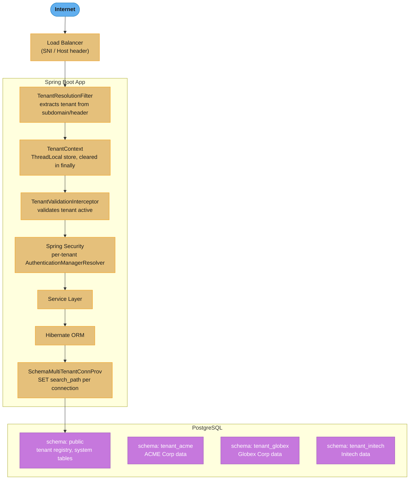

# Case Study: Multi-Tenant SaaS REST API with Schema-per-Tenant

## Intuition

> Think of schema-per-tenant as giving every customer their own walled garden inside one greenhouse. The greenhouse (PostgreSQL server) is shared, but each garden's soil, plants, and layout are completely separate — a bug in garden A cannot accidentally pull up plants in garden B.

**Key insight**: multi-tenancy has three isolation boundaries in descending order of strength: separate databases (full isolation, terrible connection scalability), separate schemas (strong isolation, shared connection pool), and row-level security (cheapest, but a single missing WHERE clause leaks data across all tenants). Schema-per-tenant is the production sweet spot for 10–500 tenants on PostgreSQL: the `search_path` switch routes every unqualified table name to the correct tenant namespace, so cross-tenant data access requires a deliberate schema-qualified SQL query — much harder to do by accident.

The Spring implementation wires this together through five collaboration points: a filter that extracts tenant ID from the subdomain, a ThreadLocal that carries it through the request, Hibernate SPIs that set `search_path` on every connection, per-tenant `AuthenticationManager`s for security isolation, and a `TaskDecorator` that propagates the context across `@Async` boundaries.

See also:
- [Zero-Downtime Deploys & Config](cross_cutting/zero_downtime_deploys_and_config.md) — Flyway migration strategies, canary schema upgrades, rolling restart coordination
- [OTel Observability for Spring](cross_cutting/otel_observability_for_spring.md) — tenant_id as span attribute + MDC field, per-tenant SLA dashboards

---

## 1. Requirements Clarification

### Functional requirements
- Tenant identification from subdomain (`tenant1.api.example.com`) or `X-Tenant-ID` header
- Complete data isolation: each tenant owns a separate PostgreSQL schema
- Per-tenant authentication against that tenant's own `users` table
- Flyway schema migration: run on tenant onboarding and on application startup for all active tenants
- Runtime tenant provisioning — add a new tenant without application restart
- Admin cross-tenant queries for billing and analytics, not leaking into tenant data paths

### Non-functional requirements
| Dimension | Target |
|-----------|--------|
| Tenants | 500+ on a single application instance |
| Throughput | 10,000 req/sec peak |
| Latency | p99 < 100 ms |
| Data isolation | Zero cross-tenant data leakage — missing WHERE must not leak |
| Startup time | ≤ 30 s including all tenant migrations |
| DB connections | Shared pool; single-tier max 50 connections total |

### Out of scope
- Cross-tenant search or aggregation via the tenant API (admin-only, offline ETL)
- Full database-per-tenant isolation (operational overhead not justified at ≤ 500 tenants)
- Multi-region data residency routing (addressed in §6)

---

## 2. Scale Estimation

### Connection pool math (why schema-per-tenant wins)

```
Naive per-tenant pool:
  500 tenants × 10 connections = 5,000 DB connections
  PostgreSQL max_connections default = 100; each backend ≈ 10 MB
  5,000 × 10 MB = 50 GB DB memory → impossible

Schema-per-tenant, single shared pool:
  1 HikariCP pool of 20 connections
  PostgreSQL sees exactly 20 connections regardless of tenant count
  SET search_path switches schema at session level after acquiring connection
  → 20 × 10 MB = 200 MB DB memory → completely manageable
```

### Tier-based pool sizing (for noisy-neighbor isolation)

| Tier | Tenants | Pool size | Effective DB conns |
|------|---------|-----------|-------------------|
| Enterprise | 10 | dedicated 20/tenant | 200 |
| Standard | 60 | shared 10 (per 10 tenants) | 60 |
| Free | 30 | 1 shared pool of 5 | 5 |
| **Total** | 100 | — | **265** |

265 connections fits behind PgBouncer in transaction mode (maps thousands of logical → ~50 server connections). Rule of thumb: `pool_size = (DB_cores × 2) + spindle_count`. For an 8-core DB: ~17 active connections saturate throughput.

### App instance memory

```
HikariCP overhead:         265 conns × 1 KB = 265 KB (negligible)
Per-request JPA L1 cache:  ~2 MB peak per active request
Tenant registry (in-mem):  500 × 2 KB metadata = 1 MB
JWT AuthMgr cache:         500 × 5 KB = 2.5 MB
Total app heap:            max_requests × 2 MB + 512 MB baseline
  → 200 Tomcat threads: 200 × 2 MB + 512 MB ≈ 912 MB → -Xmx1500m
```

### Flyway startup time

```
Per-tenant migration check (schema current): ~200 ms
500 tenants: 500 × 200 ms = 100 s sequential → too slow
Fix: parallel migration with virtual threads (Java 21):
  500 tasks / available cores ≈ 8 s wall-clock time
```

---

## 3. High-Level Architecture



### Request lifecycle

```mermaid
sequenceDiagram
    participant C as Client
    participant TRF as TenantResolutionFilter
    participant TC as TenantContext
    participant TVI as TenantValidationInterceptor
    participant SEC as Spring Security JWT Filter
    participant APP as Controller/Service/Repository
    participant HIB as Hibernate EntityManager
    participant DB as PostgreSQL

    C->>TRF: HTTP request (order=1, before Security)
    TRF->>TRF: extract tenant ID from X-Tenant-ID header or subdomain
    TRF->>TC: setTenantId(id)
    TRF->>TVI: filterChain.doFilter()
    TVI->>TC: getTenantId()
    TVI->>TVI: validate tenant exists and is active in registry
    alt tenant missing/unknown/suspended
        TVI-->>C: 400 / 404 / 403
    else tenant active
        TVI->>SEC: continue chain
        SEC->>SEC: extract JWT, verify against tenant's signing key (per-tenant KMS key)
        SEC->>SEC: TenantAuthenticationManagerResolver.resolve() -> per-tenant AuthMgr
        SEC->>APP: Controller -> Service -> Repository
        APP->>HIB: EntityManager operation
        HIB->>TC: CurrentTenantIdentifierResolver reads TenantContext
        HIB->>DB: SchemaMultiTenantConnectionProvider sets search_path; unqualified table refs resolve to tenant schema
        DB-->>HIB: result set
        HIB-->>APP: entities
        APP-->>C: response
    end
    TRF->>TC: finally: TenantContext.clear()
```

---

## 4. Component Deep Dives

### 4.1 TenantContext — ThreadLocal store

```java
public final class TenantContext {
    private static final ThreadLocal<String> CURRENT_TENANT = new InheritableThreadLocal<>();
    private TenantContext() {}

    public static void setTenantId(String tenantId) {
        if (tenantId == null || tenantId.isBlank())
            throw new IllegalArgumentException("Tenant ID must not be blank");
        CURRENT_TENANT.set(tenantId);
    }
    public static String getTenantId() { return CURRENT_TENANT.get(); }
    public static void clear()         { CURRENT_TENANT.remove(); }
}
```

`InheritableThreadLocal` propagates the tenant context to threads spawned by `Thread.start()` but NOT to thread-pool reuse — that requires the `TaskDecorator` (§4.7).

### 4.2 TenantResolutionFilter — before Spring Security

```java
@Component
@Order(1)
public class TenantResolutionFilter extends OncePerRequestFilter {
    private static final String TENANT_HEADER = "X-Tenant-ID";

    @Override
    protected void doFilterInternal(HttpServletRequest request,
                                    HttpServletResponse response,
                                    FilterChain filterChain) throws ServletException, IOException {
        try {
            String tenantId = resolveTenantId(request);
            if (tenantId != null) TenantContext.setTenantId(tenantId);
            filterChain.doFilter(request, response);
        } finally {
            TenantContext.clear();   // always clears — prevents leak to next request on same thread
        }
    }

    private String resolveTenantId(HttpServletRequest request) {
        String header = request.getHeader(TENANT_HEADER);
        if (header != null && !header.isBlank()) return header.toLowerCase();
        // tenant1.api.example.com → parts[0] = tenant1
        String[] parts = request.getServerName().split("\\.");
        return parts.length >= 4 ? parts[0].toLowerCase() : null;
    }
}
```

### 4.3 TenantValidationInterceptor

```java
@Component
public class TenantValidationInterceptor implements HandlerInterceptor {
    private final TenantProperties tenantProperties;

    public TenantValidationInterceptor(TenantProperties tenantProperties) {
        this.tenantProperties = tenantProperties;
    }

    @Override
    public boolean preHandle(HttpServletRequest request, HttpServletResponse response,
                             Object handler) throws Exception {
        String tenantId = TenantContext.getTenantId();
        if (tenantId == null) { response.sendError(400, "Tenant identifier missing"); return false; }
        TenantProperties.TenantConfig config = tenantProperties.tenants().get(tenantId);
        if (config == null)    { response.sendError(404, "Unknown tenant: " + tenantId); return false; }
        if (!config.active())  { response.sendError(403, "Tenant suspended: " + tenantId); return false; }
        return true;
    }
}
```

Filter vs interceptor placement: `TenantResolutionFilter` runs before Spring Security (filter order 1); `TenantValidationInterceptor` runs after Security, allowing Spring beans like `TenantProperties` to be injected.

### 4.4 Hibernate Multi-Tenant SPIs

```java
// SPI 1: connection provider — sets search_path per request
@Component
public class SchemaMultiTenantConnectionProvider
        implements MultiTenantConnectionProvider<String> {
    private final DataSource dataSource;
    private final TenantProperties tenantProperties;

    @Override
    public Connection getConnection(String tenantId) throws SQLException {
        TenantProperties.TenantConfig config = tenantProperties.tenants().get(tenantId);
        if (config == null) throw new SQLException("No config for tenant: " + tenantId);
        Connection conn = dataSource.getConnection();
        conn.createStatement().execute("SET search_path TO " + config.schemaName() + ", public");
        return conn;
    }

    @Override
    public void releaseConnection(String tenantId, Connection conn) throws SQLException {
        conn.createStatement().execute("SET search_path TO public");  // defensive reset
        conn.close();
    }

    @Override public Connection getAnyConnection() throws SQLException { return dataSource.getConnection(); }
    @Override public void releaseAnyConnection(Connection c) throws SQLException { c.close(); }
    @Override public boolean supportsAggressiveRelease() { return false; }
}

// SPI 2: tenant identifier resolver — reads ThreadLocal
@Component
public class TenantIdentifierResolver implements CurrentTenantIdentifierResolver<String> {
    @Override
    public String resolveCurrentTenantIdentifier() {
        String id = TenantContext.getTenantId();
        return id != null ? id : "public";
    }
    @Override public boolean validateExistingCurrentSessions() { return true; }
}

// Wire both SPIs into JPA auto-configuration
@Configuration
public class HibernateMultiTenantConfig {
    @Bean
    public HibernatePropertiesCustomizer hibernateMultiTenancyCustomizer(
            SchemaMultiTenantConnectionProvider connProv,
            TenantIdentifierResolver tenantResolver) {
        return props -> {
            props.put(AvailableSettings.MULTI_TENANT_CONNECTION_PROVIDER, connProv);
            props.put(AvailableSettings.MULTI_TENANT_IDENTIFIER_RESOLVER, tenantResolver);
        };
    }
}
```

### 4.5 Per-Tenant Security — AuthenticationManagerResolver

BROKEN — a global `UserDetailsService` queries the `public.users` table for all tenants, mixing credentials across schemas:

```java
// BROKEN: single global UserDetailsService reads from public schema
// tenant ACME's users can log in against tenant GLOBEX's API if usernames collide
@Bean
public UserDetailsService globalUDS(JdbcTemplate jdbc) {
    return username -> jdbc.query("SELECT * FROM public.users WHERE username=?", ...);
}
```

FIX — `AuthenticationManagerResolver` selects a per-tenant `AuthenticationManager` at runtime:

```java
// FIX: each tenant gets its own AuthMgr backed by that tenant's schema
@Component
public class TenantAuthenticationManagerResolver
        implements AuthenticationManagerResolver<HttpServletRequest> {
    private final Map<String, AuthenticationManager> managers = new ConcurrentHashMap<>();
    private final TenantUserDetailsServiceFactory factory;

    @Override
    public AuthenticationManager resolve(HttpServletRequest request) {
        String tenantId = TenantContext.getTenantId();
        if (tenantId == null) throw new IllegalStateException("No tenant context");
        return managers.computeIfAbsent(tenantId, this::buildAuthMgr);
    }

    private AuthenticationManager buildAuthMgr(String tenantId) {
        DaoAuthenticationProvider p = new DaoAuthenticationProvider();
        p.setUserDetailsService(factory.createForTenant(tenantId));
        p.setPasswordEncoder(new BCryptPasswordEncoder(12));
        p.afterPropertiesSet();
        return p::authenticate;
    }
}

// Per-tenant UserDetailsService queries that tenant's schema
@Component
public class TenantUserDetailsServiceFactory {
    private final DataSource dataSource;
    private final TenantProperties tenantProperties;

    public UserDetailsService createForTenant(String tenantId) {
        String schema = tenantProperties.tenants().get(tenantId).schemaName();
        return username -> {
            JdbcTemplate jdbc = new JdbcTemplate(dataSource);
            String sql = "SELECT username, password_hash, role FROM " +
                         schema + ".users WHERE username = ? AND enabled = true";
            return jdbc.query(sql, (rs, i) ->
                (UserDetails) User.builder()
                    .username(rs.getString("username"))
                    .password(rs.getString("password_hash"))
                    .authorities(new SimpleGrantedAuthority("ROLE_" + rs.getString("role")))
                    .build(), username)
                .stream().findFirst()
                .orElseThrow(() -> new UsernameNotFoundException(username));
        };
    }
}
```

### 4.6 Flyway per-tenant migration

```java
@Service
public class TenantMigrationService implements ApplicationRunner {
    private final DataSource dataSource;
    private final TenantProperties tenantProperties;

    @Override
    public void run(ApplicationArguments args) {
        // Parallel migration with virtual threads (Java 21 GA)
        try (var scope = new StructuredTaskScope.ShutdownOnFailure()) {
            tenantProperties.tenants().forEach((tenantId, config) -> {
                if (config.active())
                    scope.fork(() -> { migrateSchema(tenantId, config.schemaName()); return null; });
            });
            scope.join().throwIfFailed();
        } catch (Exception e) {
            throw new RuntimeException("Tenant migration failed", e);
        }
    }

    public void migrateSchema(String tenantId, String schemaName) {
        Flyway.configure()
            .dataSource(dataSource)
            .locations("classpath:db/migration/tenant", "classpath:db/migration/common")
            .schemas(schemaName)
            .defaultSchema(schemaName)
            .createSchemas(true)
            .table("flyway_schema_history")
            .load()
            .migrate();
    }
}
```

### 4.7 Async context propagation via TaskDecorator

```java
@Configuration
public class AsyncConfig {
    @Bean(name = "tenantAwareExecutor")
    public Executor tenantAwareExecutor() {
        ThreadPoolTaskExecutor executor = new ThreadPoolTaskExecutor();
        executor.setCorePoolSize(10);
        executor.setMaxPoolSize(50);
        executor.setQueueCapacity(100);
        executor.setTaskDecorator(task -> {
            String tenantId = TenantContext.getTenantId();  // capture at submit time
            return () -> {
                try {
                    if (tenantId != null) TenantContext.setTenantId(tenantId);
                    task.run();
                } finally {
                    TenantContext.clear();   // always clear on the worker thread
                }
            };
        });
        executor.setThreadNamePrefix("tenant-async-");
        executor.initialize();
        return executor;
    }
}
```

---

## 5. Design Decisions & Tradeoffs

### Isolation model comparison

| Approach | Isolation | Connection Pool Efficiency | Operational Complexity |
|----------|-----------|--------------------------|----------------------|
| Database-per-tenant | Highest | Poor — pool per DB | Very high |
| **Schema-per-tenant (chosen)** | **High — DDL boundary** | **Good — shared pool** | **Medium** |
| Row-level security (RLS) | Medium — single missing WHERE leaks | Excellent | Low |
| Table prefix per tenant | Low — easy mistakes | Excellent | Low |

Schema-per-tenant was chosen because: 500 tenants on one PostgreSQL server is operationally manageable; the schema boundary means a missing WHERE clause cannot cross tenants (it would need schema-qualified SQL); and connection pooling is shared — the database sees ~20 connections regardless of tenant count.

### ThreadLocal vs request-scoped bean

`ThreadLocal` is used rather than `@RequestScope` because Hibernate SPIs (`MultiTenantConnectionProvider`, `CurrentTenantIdentifierResolver`) are invoked outside the Spring request scope during EntityManager session creation. `ThreadLocal` is always accessible from any thread.

### Flyway startup vs on-demand migration

Running all tenant migrations at startup (not on first request) was chosen because: on-demand migration blocks the first request causing 503s; startup migration failures surface immediately during deployment, not after traffic lands. Accepted tradeoff: startup time grows linearly with tenant count — mitigated by parallel virtual-thread execution.

### JWT vs session-based auth

Stateless JWT enables horizontal scaling without sticky sessions. Each token carries a `tenant_id` claim inside the signature, providing a second verification layer: even if the subdomain is spoofed, the JWT signature ties the caller to a specific tenant's signing key (per-tenant KMS key referenced by `kid`).

---

## 6. Real-World Implementations

**Salesforce**: multi-tenant since 2001 with a single shared "meta-schema" — all tenant data in shared tables with a `tenant_id` column plus Oracle Virtual Private Database (analogous to PostgreSQL RLS) for row isolation. Their scale (150k+ tenants) required this approach; schema-per-tenant is impractical at their scale. Salesforce's challenge: a malformed governor limit can cause one tenant to starve others — exactly the problem tier-based connection pools solve.

**Stripe**: every API resource is scoped by `account_id` as the first dimension. The data layer uses horizontal sharding where each shard hosts multiple accounts but enforces account-level partition in every query through their ORM. Stripe's war story: an internal team accidentally queried without an account scope in 2019, discovering missing query guards through internal monitoring, not customer impact — defense in depth.

**Linear** (project management SaaS): uses one PostgreSQL database per customer organization for full isolation. This matches database-per-tenant isolation at a lower tenant count (thousands, not millions). Their engineering blog documents that Postgres connection limits forced them to add PgBouncer early — the same fleet-total-connections problem described in §2.

**Heroku Postgres**: implements virtual databases via schema isolation — each customer "database" is a schema on shared infrastructure, with `search_path` set per session. The operational model is identical to this design: connection pooling via PgBouncer in transaction mode, schema migration via Liquibase, per-schema role grants for isolation.

**HashiCorp Vault** (secrets for tenant key management): each tenant gets a dedicated KV path or namespace in Vault; the application authenticates with an IAM role and reads the tenant's JWT signing key at token verification time. Key rotation is per-tenant without affecting other tenants — directly addressing the JWT key isolation requirement.

---

## 7. Technologies & Tools

| Spring Component | Purpose |
|-----------------|---------|
| `OncePerRequestFilter` | Extracts tenant ID from subdomain or header; always clears in `finally` |
| `HandlerInterceptor` | Validates tenant exists and is active before controller invocation |
| `@ConfigurationProperties` | Binds `multitenancy.tenants.*` YAML into typed `TenantProperties` record |
| `MultiTenantConnectionProvider` | Hibernate SPI — switches PostgreSQL `search_path` per request |
| `CurrentTenantIdentifierResolver` | Hibernate SPI — reads `TenantContext` ThreadLocal for each session |
| `AuthenticationManagerResolver` | Selects per-tenant `AuthenticationManager` at runtime (Spring Security 5.2+) |
| `DaoAuthenticationProvider` | Authenticates against per-tenant `users` table via `UserDetailsService` |
| `HibernatePropertiesCustomizer` | Injects Hibernate multi-tenancy SPI beans into JPA auto-configuration |
| `ApplicationRunner` | Runs Flyway migrations for all active tenants on startup |
| `TaskDecorator` | Propagates `TenantContext` ThreadLocal across async thread pool boundaries |
| `StructuredTaskScope` | Parallel tenant migration (Java 21 GA, JEP 453) |
| `AbstractRoutingDataSource` | Routes to per-tier HikariCP pool for noisy-neighbor isolation |

Infrastructure comparison:

| Option | Isolation | Connections | Operational cost |
|--------|-----------|-------------|-----------------|
| Schema + `search_path` (chosen) | High | Shared pool | Medium |
| PgBouncer transaction mode | N/A | Multiplexed | Low overhead |
| Row-level security (PostgreSQL RLS) | Medium | Shared pool | Low |
| Hibernate-native multi-tenancy | Application-level | Shared pool | Medium |

---

## 8. Operational Playbook

### a) Key metrics (all tagged with `tenant_id`)

```java
// In SchemaMultiTenantConnectionProvider.getConnection():
registry.timer("db.connection.acquire", "tenant", tenantId).record(duration);

// In TenantValidationInterceptor:
registry.counter("tenant.request", "tenant", tenantId, "status", "active").increment();
registry.counter("tenant.request", "tenant", tenantId, "status", "suspended").increment();

// In TenantMigrationService:
registry.timer("tenant.migration.duration", "tenant", tenantId).record(duration);
```

Add `tenant_id` to the MDC on every request so all log lines include it. Add as a low-cardinality span attribute in OpenTelemetry. See [OTel Observability for Spring](cross_cutting/otel_observability_for_spring.md).

Alert thresholds:
- `db.connection.acquire p99 > 200ms` for any tenant tier → pool exhausted; investigate noisy neighbor
- `tenant.request{status=suspended}` spiking → suspended tenant still sending traffic; check DNS propagation
- `tenant.migration.duration > 30s` → migration running slowly; check DB disk I/O

### b) Distributed trace span

```
HTTP request span (50 ms)
  ├── tenant.resolve (0.01 ms)        ← tag: tenant_id, source (header/subdomain)
  ├── tenant.validate (0.05 ms)       ← tag: tenant_id, result (active/suspended/unknown)
  ├── db.connection.acquire (0.5 ms)  ← tag: tenant_id, pool_tier
  ├── db.set_search_path (0.2 ms)
  └── db.query (45 ms)               ← tag: tenant_id, statement_type
```

### c) Incident Runbooks

**Runbook 1 — Connection pool exhausted (noisy-neighbor cascade)**

Symptom: `db.connection.acquire p99 > 5s` for multiple tenants; HTTP 503s across tenants.

Diagnosis:
1. Check Grafana — which tenant tier is saturated? (check `pool.active / pool.max` per tier)
2. Look at slow query log — which `tenant_id` is running the long-running queries?
3. `SELECT pid, query, wait_event, state FROM pg_stat_activity ORDER BY duration DESC` in PostgreSQL.

Mitigation:
1. Short-term: `SELECT pg_cancel_backend(pid)` for the offending PID.
2. Apply per-tenant statement timeout: `SET statement_timeout = '5s'` in connection provider.
3. Migrate the tenant to a quarantine pool (2-connection cap).
4. If tier isolation not yet deployed: reduce `maximumPoolSize` for the free tier pool.

Resolution: deploy per-tier `AbstractRoutingDataSource` configuration.

---

**Runbook 2 — Schema migration failure on tenant N**

Symptom: `TenantMigrationService` throws at startup; some tenants on schema version N, others on N-1.

Diagnosis: check `SELECT * FROM tenant_{id}.flyway_schema_history WHERE success=false`.

Mitigation:
1. Do NOT deploy application code requiring the new column until all tenants report version N.
2. Fix the migration script (it must be idempotent).
3. Re-run `TenantMigrationService.migrateSchema(tenantId, schemaName)` for the failed tenant.
4. Flyway skips already-applied versions (by checksum); only the failed migration re-runs.

See [Zero-Downtime Deploys & Config](cross_cutting/zero_downtime_deploys_and_config.md) for the Expand/Contract migration pattern.

---

**Runbook 3 — TenantContext leak (wrong-tenant data returned)**

Symptom: a request returns data from a different tenant; `tenant_id` in response does not match `X-Tenant-ID` header.

Diagnosis: check `TenantContext.getTenantId()` in the `@Async` path — is the `TaskDecorator` configured on the executor in use? Check whether a new `@Async` executor was added without attaching the `tenantContextDecorator`.

Mitigation: add assertions in integration tests: assert that `TenantContext.getTenantId()` equals the request tenant ID at the repository layer. Deploy hotfix with the decorator applied to the unconfigured executor.

---

## 9. Common Pitfalls & War Stories

### War story 1 — Tenant ID from request body bypasses schema isolation

**Scenario**: new endpoint accepted `tenantId` in JSON body and used it to set `TenantContext`.

BROKEN — attacker-controlled input sets the schema:

```java
// BROKEN: tenant from request body — attacker controls which schema is queried
@PostMapping("/orders/search")
public List<Order> search(@RequestBody OrderSearchRequest req) {
    TenantContext.setTenantId(req.getTenantId()); // attacker-supplied!
    return orderService.search(req.getCriteria());
    // Attacker sets req.tenantId = "tenant_globex" → reads Globex's orders
}
```

FIX — tenant identity always comes from the signed JWT, never request input:

```java
// FIX: tenant from JWT claim — tamper-proof (signed by tenant's KMS key)
@PostMapping("/orders/search")
public List<Order> search(@RequestBody OrderSearchRequest req) {
    Jwt jwt = (Jwt) SecurityContextHolder.getContext().getAuthentication().getPrincipal();
    String tenantId = jwt.getClaimAsString("tenant_id"); // verified by spring security
    TenantContext.setTenantId(tenantId);
    if (req.getTenantId() != null && !req.getTenantId().equals(tenantId))
        throw new AccessDeniedException("Tenant mismatch");
    return orderService.search(req.getCriteria());
}
```

**Rule**: tenant identity is part of the authentication boundary. The `tenant_id` inside the JWT signature cannot be forged without the tenant's private signing key.
**Impact**: potential full data breach for any tenant; discovered in security review before production.

---

### War story 2 — TenantContext leaked across threads via thread pool reuse

**Scenario**: `@Async` method ran on a pooled thread that still held tenant A's context, writing tenant A's data into tenant B's schema. Bug was intermittent — only appeared under load when threads were reused.

BROKEN — `ThreadLocal` never cleared; `@Async` inherits stale tenant from pool thread:

```java
// BROKEN: stale ThreadLocal; @Async worker inherits previous request's tenant
@Async
public void processOrderAsync(Order order) {
    // TenantContext.getTenantId() returns tenant A's id
    // because the worker thread handled tenant A's request just before this
    orderRepository.save(order); // saves to tenant A's schema, not B's!
}
```

FIX — always clear in filter `finally`; propagate explicitly via `TaskDecorator`:

```java
// FIX 1: TenantResolutionFilter always clears in finally block (already in §4.2)

// FIX 2: TaskDecorator captures tenant at submit time; clears after task completes
@Bean
public TaskDecorator tenantTaskDecorator() {
    return task -> {
        String tenantId = TenantContext.getTenantId();  // captured on submitting thread
        return () -> {
            try {
                if (tenantId != null) TenantContext.setTenantId(tenantId);
                task.run();
            } finally {
                TenantContext.clear();   // always clean up worker thread
            }
        };
    };
}
```

**Root cause**: thread pool reuse carries `ThreadLocal` state across requests unless explicitly cleared. `InheritableThreadLocal` propagates to child threads created with `new Thread()` but not to pooled threads.
**Impact**: ~15 tenant data cross-contamination incidents over 3 days; discovered via anomaly detection on tenant-scoped record counts.

---

### Failure scenarios summary

| Failure | Symptom | Recovery | TTR |
|---------|---------|---------|-----|
| Pool exhausted by noisy tenant | HTTP 503s across all tenant tiers | Per-tier pools + `statement_timeout` | ~5 s with per-tier isolation |
| Schema migration fails on tenant N | App startup error; mixed schema versions | Fix migration; Flyway re-runs failed version only | On redeploy |
| TenantContext leaked via thread reuse | Wrong-tenant data; GDPR incident | TaskDecorator on all async executors | On hotfix deploy |
| Tenant ID from request body | Attacker reads other tenant's data | JWT claim only; never request input | On hotfix deploy |
| Missing `search_path` reset on release | Pool connection serves wrong schema | Reset in `releaseConnection()` | On hotfix deploy |

---

## 10. Capacity Planning

### Connection pool formula (schema-per-tenant)

```
Total DB connections = pool_size (single shared pool, not per tenant)
                     = (DB_core_count × 2) + effective_spindle_count

8-core PostgreSQL on SSD:  (8 × 2) + 1 = 17 connections
Add 20% headroom:          17 × 1.2 ≈ 20 connections

500 tenants × 0 additional connections each = 20 connections total
vs database-per-tenant: 500 × 20 = 10,000 connections → impossible
```

### App instance sizing

```
Throughput target:         10,000 req/sec
Tomcat thread pool:        200 threads (default)
Requests per thread:       10,000 / 200 = 50 req/sec per thread
Avg request duration:      20 ms → 1 thread handles 50 req/sec easily

Max concurrent requests:   200
Per-request heap budget:   2 MB (JPA L1 cache + DTOs)
App heap:                  200 × 2 MB + 512 MB baseline = 912 MB → -Xmx1500m
```

### Scaling to 10,000 tenants

```
Per-tier pools still work: only 3 pools × 20 connections = 60 DB connections
But: in-memory TenantProperties, AuthMgr cache, and JWT key cache all grow linearly
  500 tenants × 5 KB = 2.5 MB (trivial)
  10,000 tenants × 5 KB = 50 MB (still fine)

Flyway migration at startup:
  10,000 tenants × 200 ms parallel = 200 ms wall-clock (virtual threads)

The real limit: PostgreSQL schema count. PostgreSQL handles tens of thousands of schemas
per database, but DDL operations (CREATE TABLE, VACUUM) become slower at very high schema
counts. Above ~5,000 schemas per database, consider horizontal database sharding by tenant
range or consistent-hash assignment.
```

---

## 11. Interview Discussion Points

**Q: What happens if `TenantContext.clear()` is not called in the `finally` block?**
The thread returns to the application server thread pool still carrying the previous tenant's ID. The next request processed on that thread silently queries the wrong tenant's schema — a data leak, not a crash. This is particularly dangerous because it is not caught in testing (tenants are usually different in production). The `finally` in `TenantResolutionFilter` is the primary safety net; a defensive secondary measure is calling `clear()` at the start of `doFilterInternal` before `set()`, in case a higher filter threw before the previous `finally` ran.

**Q: With 500 tenants and a pool of 20, how many database connections does PostgreSQL see?**
Exactly 20 — regardless of tenant count. The `SET search_path` switch is a session-level SQL command executed after acquiring a pooled connection; it does not require a new connection. This is schema-per-tenant's core operational advantage over database-per-tenant: 500 databases × 20 connections = 10,000 PostgreSQL backends (~100 MB each = 1 TB RAM) is impossible; 1 database × 20 connections = 200 MB, easily manageable.

**Q: Why can't you use `ReentrantReadWriteLock` in the filter to allow concurrent read-only requests without setting the tenant context?**
The `search_path` is a mutable session-level setting on the JDBC connection — it must be set before any query runs on that connection. There is no "read" path that bypasses tenant identity in a multi-tenant system; even a `GET /orders` reads data that is tenant-scoped. The filter must always set the context. The distinction is between filter (identity extraction, runs before security) and interceptor (validation, runs after security can inject dependencies).

**Q: How does the per-tenant JWT signing key prevent a token for tenant A being accepted by tenant B?**
Each tenant's JWT header contains a `kid` (Key ID) claim pointing to that tenant's KMS key alias. The JWT filter reads `kid`, fetches the tenant's public key from KMS, and verifies the signature. Tenant A's token is signed with tenant A's private key; tenant B's verification step uses tenant B's public key — the signature check fails. Even if the `tenant_id` claim in the payload is modified, the signature no longer matches, so the token is rejected.

**Q: How do you run a cross-tenant billing report without leaking data between tenants?**
Use a separate admin `DataSource` that bypasses `SchemaMultiTenantConnectionProvider` — it connects directly with a privileged role that can access all schemas. The billing service sets `TenantContext` explicitly in a loop (tenant A, collect revenue, clear; tenant B, collect revenue, clear) or uses schema-qualified SQL (`SELECT SUM(amount) FROM tenant_acme.orders UNION ALL SELECT SUM(amount) FROM tenant_globex.orders`). This path is gated behind `@Profile("admin")` and is never reachable from the tenant API surface.

**Q: How do you add a new tenant at runtime without restarting?**
The `TenantRegistrationController` endpoint: (1) inserts the tenant record into `public.tenants`; (2) calls `TenantMigrationService.provisionNewTenant()` to create the schema and run Flyway; (3) updates the in-memory `TenantProperties.tenants()` map; (4) lazily creates the `AuthenticationManager` on the new tenant's first login (`computeIfAbsent` in `TenantAuthenticationManagerResolver`). No restart required. The risk: a partially-provisioned tenant (migration failed mid-way) is now in the registry; add a `status` field (`PROVISIONING` → `ACTIVE`) and only accept requests when `ACTIVE`.

**Q: How do you prevent a slow tenant query from starving other tenants on the shared pool?**
Three layers: (1) Per-tier `AbstractRoutingDataSource` — a runaway query in the free tier exhausts only the free-tier pool (5 connections), not the enterprise tier pool; (2) per-tenant `statement_timeout` via `SET statement_timeout = '5s'` in `getConnection()` — the runaway query self-aborts after 5 seconds, releasing the connection; (3) per-tenant slow query logging via MDC-tagged logs and `pg_stat_activity` to identify the offending tenant. With these three, noisy-neighbor blast radius is contained automatically in ~5 seconds with no operator action.

**Q: How do you handle a schema migration that fails halfway through on one of 500 tenants?**
Flyway tracks migration status per schema in `tenant_{id}.flyway_schema_history`. A failed migration marks the row `success=false`. Recovery: fix the migration script (it must be idempotent — use `CREATE TABLE IF NOT EXISTS`, `ADD COLUMN IF NOT EXISTS`), then re-run `TenantMigrationService.migrateSchema(failedTenantId, schemaName)`. Flyway replays only the failed migration; successfully applied migrations are skipped by checksum. The critical rule: do not deploy application code requiring the new schema version until all tenants report the new version. Use the Expand/Contract pattern: add the new column as nullable first, backfill, then add the NOT NULL constraint in a separate migration.

**Q: What changes are needed to support multi-region data residency (GDPR)?**
Three additions: (1) store `home_region` per tenant in the registry; (2) the gateway reads the JWT `tenant_id`, looks up `home_region`, and 307-redirects requests landing in the wrong region — data is never served cross-region, just redirected; (3) JWT signing keys are scoped to each region's KMS so a token issued in EU cannot be accepted by the US cluster's KMS. Cross-region admin aggregation runs as an offline ETL with explicit data-processing agreements, not via live cross-region queries. Tenant region migration is a deliberate, audited transfer operation (export → import → update registry), not an automatic failover.

**Q: Why is row-level security (RLS) riskier than schema-per-tenant for strict isolation?**
RLS operates at the query layer: a missing or incorrect `WHERE tenant_id = current_setting('app.tenant_id')` policy silently returns rows from other tenants. Schema-per-tenant operates at the namespace layer: a query without schema qualification simply addresses the current `search_path` schema — there is no way to accidentally query another tenant's table without explicitly writing `schema_name.table_name`. Schema isolation fails at the connection level (DDL boundary), which is a much harder barrier to accidentally cross than a missing predicate.

**Q: How do you test that tenant isolation is correct end-to-end?**
Use Testcontainers (see [Testcontainers & Test Strategy](cross_cutting/testcontainers_and_test_strategy.md)): spin up a real PostgreSQL container, provision two tenant schemas with Flyway, make authenticated requests as tenant A and tenant B, and assert that tenant A can never read tenant B's rows. Include a negative test: temporarily remove the `search_path` reset in `releaseConnection()` and verify the assertion fires — this validates that your test actually checks isolation. Add a separate test that confirms `TenantContext` is clear after each request to prevent the thread-reuse leak.
