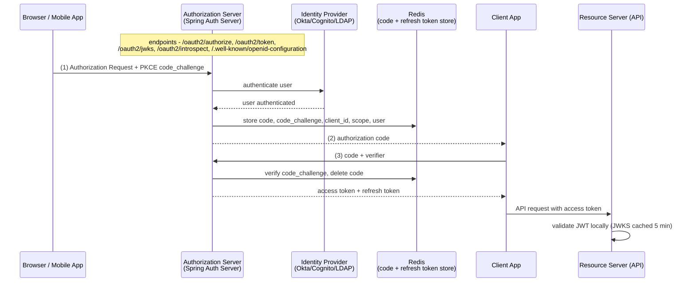

# Design: OAuth 2.1 Authorization Server (Spring Authorization Server)

> **"A trusted notary that issues time-limited credentials."**
> An authorization server is the single source of trust for "who are you and what can you do."
> It does not know your business logic — it only issues signed tokens that downstream services
> can verify without calling home. Every access decision ultimately traces back to a token the
> authorization server issued.
>
> **Key insight:** The authorization server's primary security obligation is to ensure that
> only the entity who proved their identity (the user) can redeem an authorization code, and
> that clients can never forge tokens. PKCE, short-lived tokens, refresh token rotation, and
> JWKS key rotation each address a different class of token theft or replay attack.

---

## 1. Requirements Clarification

### Functional Requirements
- Issue OAuth 2.1 authorization codes, access tokens (JWT), and refresh tokens to registered clients.
- Support PKCE (RFC 7636) for public clients (mobile apps, SPAs) and confidential clients.
- Provide a JWKS endpoint (`/oauth2/jwks`) so resource servers can verify tokens offline.
- Support client credential flow (machine-to-machine) and authorization code flow (user-facing).
- Expose OpenID Connect discovery document (`/.well-known/openid-configuration`).
- Rotate signing keys without invalidating in-flight tokens (dual-key rollover).

### Non-Functional Requirements
- **Latency:** Token issuance P99 < 50 ms; JWKS endpoint P99 < 10 ms (cached).
- **Availability:** 99.99% (four nines); authorization server downtime breaks all authentication.
- **Security:** Tokens expire in 15 minutes; refresh tokens expire in 7 days; refresh token rotation
  on every use (invalidate old, issue new).
- **Scalability:** Stateless token verification at resource servers (JWT + JWKS); authorization server
  handles 10,000 token requests/min (167 req/s).

### Out of Scope
- User identity storage (delegated to an Identity Provider via OIDC federation).
- Multi-factor authentication (handled by the IdP).
- Fine-grained authorization (handled by resource servers using token claims).

---

## 2. Scale Estimation

### Traffic
```
Active users:                      100,000
Average sessions per user per day: 3
Average token refreshes per session: 4 (15-min tokens, 1-hour sessions)
Token requests per day:            100,000 × 3 × 4 = 1,200,000
Sustained:                         1,200,000 / 86,400 = 13.9 req/s
Peak multiplier (10×):             139 req/s
```

That peak is what §1's "10,000 token requests/min" non-functional target provisions for
(10,000/60 = 167 req/s), leaving ~20% headroom above the modelled peak. Note the daily total is
1.2M requests, not 12M — the 10x multiplier applies to the instantaneous rate, not to the day.

### Storage
```
Authorization codes: TTL = 60 s; at the 139 req/s peak: 139 × 60 = 8,340 concurrent codes
                     (an upper bound — refresh-token grants mint no code)
Refresh tokens:      TTL = 7 days; 100,000 users × 3 sessions = 300,000 active refresh tokens
Refresh token size:  ~200 bytes each → 300,000 × 200 = 60 MB in Redis
JWKS keys:           2–3 RSA-2048 or EC P-256 keys; ~5 KB total in config/database
```

### Pod Sizing
```
JWT signing (RSA-2048): ~2,000 signatures/s per CPU core
Peak 139 req/s needs 0.07 of a core; 2 pods × 2 cores = 8,000 sig/s = 58× headroom
  -> pods are sized by availability (survive losing one), never by signing throughput
Memory per pod: 256 MB (Spring Authorization Server is not memory-hungry)
```

---

## 3. High-Level Architecture



### Data Flow (Authorization Code + PKCE)
1. Client generates `code_verifier` (random, 43–128 chars), computes `code_challenge = BASE64URL(SHA256(verifier))`.
2. Client sends `GET /oauth2/authorize?response_type=code&client_id=X&redirect_uri=Y&code_challenge=Z&code_challenge_method=S256`.
3. Auth server authenticates user (via IdP or local login); stores `(code, code_challenge, client_id, scope, user)` in Redis with 60 s TTL.
4. Auth server redirects to `redirect_uri?code=<code>`.
5. Client sends `POST /oauth2/token` with `grant_type=authorization_code&code=<code>&code_verifier=<verifier>`.
6. Auth server retrieves code from Redis, verifies `BASE64URL(SHA256(verifier)) == code_challenge`.
7. Auth server issues JWT access token (15 min) + refresh token (7 days); deletes code from Redis.
8. On token expiry, client sends `POST /oauth2/token` with `grant_type=refresh_token&refresh_token=<old>`.
9. Auth server validates refresh token, issues new access + refresh token pair, **invalidates the old refresh token** (rotation).

---

## 4. Component Deep Dives

### 4.1 Spring Authorization Server Configuration

```java
@Configuration
@EnableWebSecurity
public class AuthorizationServerConfig {

    @Bean
    @Order(1)
    public SecurityFilterChain authorizationServerFilterChain(HttpSecurity http) throws Exception {
        OAuth2AuthorizationServerConfiguration.applyDefaultSecurity(http);
        http.getConfigurer(OAuth2AuthorizationServerConfigurer.class)
            .oidc(Customizer.withDefaults());  // Enable OIDC 1.0

        http.exceptionHandling(ex -> ex
            .defaultAuthenticationEntryPointFor(
                new LoginUrlAuthenticationEntryPoint("/login"),
                new MediaTypeRequestMatcher(MediaType.TEXT_HTML)));

        return http.build();
    }

    @Bean
    @Order(2)
    public SecurityFilterChain defaultSecurityFilterChain(HttpSecurity http) throws Exception {
        http.authorizeHttpRequests(auth -> auth.anyRequest().authenticated())
            .formLogin(Customizer.withDefaults());
        return http.build();
    }

    @Bean
    public RegisteredClientRepository registeredClientRepository() {
        RegisteredClient webApp = RegisteredClient.withId(UUID.randomUUID().toString())
            .clientId("web-app")
            .clientSecret("{bcrypt}" + new BCryptPasswordEncoder().encode("secret"))
            .clientAuthenticationMethod(ClientAuthenticationMethod.CLIENT_SECRET_BASIC)
            .authorizationGrantType(AuthorizationGrantType.AUTHORIZATION_CODE)
            .authorizationGrantType(AuthorizationGrantType.REFRESH_TOKEN)
            .redirectUri("https://app.example.com/callback")
            .scope(OidcScopes.OPENID)
            .scope(OidcScopes.PROFILE)
            .scope("read:orders")
            .clientSettings(ClientSettings.builder()
                .requireProofKey(true)                // Enforce PKCE
                .requireAuthorizationConsent(false)   // Skip consent screen for trusted clients
                .build())
            .tokenSettings(TokenSettings.builder()
                .accessTokenTimeToLive(Duration.ofMinutes(15))
                .refreshTokenTimeToLive(Duration.ofDays(7))
                .reuseRefreshTokens(false)            // Rotate on every use
                .build())
            .build();

        RegisteredClient m2mClient = RegisteredClient.withId(UUID.randomUUID().toString())
            .clientId("payment-service")
            .clientSecret("{bcrypt}" + new BCryptPasswordEncoder().encode("svc-secret"))
            .clientAuthenticationMethod(ClientAuthenticationMethod.CLIENT_SECRET_BASIC)
            .authorizationGrantType(AuthorizationGrantType.CLIENT_CREDENTIALS)
            .scope("write:payments")
            .tokenSettings(TokenSettings.builder()
                .accessTokenTimeToLive(Duration.ofMinutes(5))
                .build())
            .build();

        return new InMemoryRegisteredClientRepository(webApp, m2mClient);
    }
}
```

### 4.2 JWT Token Customization

Add custom claims (user roles, tenant ID) to issued access tokens:

```java
@Bean
public OAuth2TokenCustomizer<JwtEncodingContext> tokenCustomizer(UserDetailsService userDetailsService) {
    return context -> {
        if (context.getTokenType().equals(OAuth2TokenType.ACCESS_TOKEN)) {
            Authentication principal = context.getPrincipal();
            if (principal instanceof UsernamePasswordAuthenticationToken) {
                UserDetails user = userDetailsService.loadUserByUsername(principal.getName());
                Set<String> roles = user.getAuthorities().stream()
                    .map(GrantedAuthority::getAuthority)
                    .collect(Collectors.toSet());
                context.getClaims()
                    .claim("roles", roles)
                    .claim("tenant_id", resolveTenantId(principal.getName()));
            }
        }
    };
}
```

### 4.3 JWKS Key Rotation Without Token Invalidation

```java
@Bean
public JWKSource<SecurityContext> jwkSource() {
    // Generate two keys: one for signing new tokens, one kept for verifying in-flight tokens
    RSAKey activeKey  = generateRsaKey("key-2024-06");    // kid = "key-2024-06"
    RSAKey previousKey = generateRsaKey("key-2024-03");   // kid = "key-2024-03"
    JWKSet jwkSet = new JWKSet(List.of(activeKey, previousKey));
    return new ImmutableJWKSet<>(jwkSet);
}

// Resource servers call /oauth2/jwks, get both public keys, and verify by kid claim
// Active tokens use "key-2024-06"; tokens issued before rotation use "key-2024-03"
// Remove "key-2024-03" after its tokens' max TTL (15 min) has elapsed

private static RSAKey generateRsaKey(String keyId) {
    try {
        KeyPairGenerator generator = KeyPairGenerator.getInstance("RSA");
        generator.initialize(2048);
        KeyPair keyPair = generator.generateKeyPair();
        return new RSAKey.Builder((RSAPublicKey) keyPair.getPublic())
            .privateKey(keyPair.getPrivate())
            .keyID(keyId)
            .build();
    } catch (Exception e) {
        throw new IllegalStateException("Failed to generate RSA key", e);
    }
}
```

### 4.4 Broken Pattern: Storing Authorization Codes In-Memory

```java
// BROKEN: in-memory ConcurrentHashMap for authorization codes
private final Map<String, AuthCode> codes = new ConcurrentHashMap<>();

public void storeCode(String code, AuthCode authCode) {
    codes.put(code, authCode);
    // No TTL; no eviction; codes accumulate forever
    // Two auth server pods have separate maps: code issued on pod-1 cannot be redeemed on pod-2
}
```

**Failure mode 1:** Code issued on pod-1 is redirected to the client. Client calls `/oauth2/token`
which is load-balanced to pod-2. Pod-2 has no record of the code — returns `invalid_grant` error.
**Failure mode 2:** Unused codes accumulate in memory. 10,000 authorization attempts × 200 bytes
= 2 MB/hour; after one week of leakage = 336 MB OOM crash.

**Fix:** Use Spring Authorization Server's `JdbcOAuth2AuthorizationService` backed by PostgreSQL
or `RedisOAuth2AuthorizationService` (community extension). Authorization codes are stored centrally
with TTL enforcement.

### 4.5 Redis-Backed Authorization Service

```java
@Configuration
public class TokenStoreConfig {

    // Spring Authorization Server ships exactly two OAuth2AuthorizationService
    // implementations: InMemory and Jdbc. There is no Redis one on the classpath -- the
    // project publishes a Redis *sample* you adapt, so this is code you own and test.
    @Bean
    public OAuth2AuthorizationService authorizationService(
            RegisteredClientRepository clients,
            RedisTemplate<String, OAuth2Authorization> redisTemplate) {
        return new RedisOAuth2AuthorizationService(redisTemplate, clients);
    }

    @Bean
    public OAuth2AuthorizationConsentService authorizationConsentService(
            RegisteredClientRepository clients,
            RedisTemplate<String, OAuth2AuthorizationConsent> redisTemplate) {
        return new RedisOAuth2AuthorizationConsentService(redisTemplate, clients);
    }
}
```

### 4.6 Resource Server Configuration

```java
@Configuration
@EnableMethodSecurity
public class ResourceServerConfig {

    @Bean
    public SecurityFilterChain resourceServerFilterChain(HttpSecurity http) throws Exception {
        http.oauth2ResourceServer(oauth2 -> oauth2
            .jwt(jwt -> jwt
                .jwkSetUri("https://auth.example.com/oauth2/jwks")
                // Nimbus caches the key set for 5 minutes (JWKSourceBuilder
                // DEFAULT_CACHE_TIME_TO_LIVE = 300_000 ms), refreshes 30 s ahead of expiry,
                // and re-fetches on an unknown kid -- but rate-limits that to once per 30 s
                // so an unknown-kid flood cannot be turned into a DoS on the JWKS endpoint.
            )
        );
        http.authorizeHttpRequests(auth -> auth
            .requestMatchers("/api/orders/**").hasAuthority("SCOPE_read:orders")
            .anyRequest().authenticated()
        );
        return http.build();
    }
}
```

---

## 5. Design Decisions & Tradeoffs

### Decision 1: JWT vs Opaque Tokens

| Property | JWT | Opaque Token |
|----------|-----|-------------|
| Verification | Local (JWKS cached) | Remote introspection call |
| Latency | 0 ms (offline) | ~5–10 ms (introspection endpoint) |
| Revocation | Hard (must wait for expiry) | Immediate (delete from store) |
| Token size | 300–600 bytes | 32 bytes |
| Info leakage | Claims visible in payload | Opaque to client |

**Decision:** JWT for access tokens (low latency, offline verification). Short 15-minute TTL
mitigates the revocation gap — a stolen token expires quickly.

### Decision 2: Refresh Token Rotation vs Long-Lived Refresh Tokens

With rotation disabled, a stolen refresh token can be reused indefinitely. With rotation enabled,
each refresh creates a new refresh token and invalidates the old. If the old token is presented
after rotation, the authorization server detects a "refresh token reuse" attack (two valid tokens
for the same session) and revokes the entire token family.

**Decision:** `reuseRefreshTokens(false)`. The cost is that single-use refresh tokens require
both old-token deletion and new-token issuance to be atomic — Spring Authorization Server handles
this transactionally when using `JdbcOAuth2AuthorizationService`.

### Decision 3: PKCE vs Client Secret for Confidential Clients

PKCE is mandatory for public clients (SPA, mobile). For confidential clients (server-side web apps),
PKCE adds a defense-in-depth layer against authorization code interception. OAuth 2.1 (draft) makes
PKCE mandatory for all clients. Spring Authorization Server's `requireProofKey(true)` enforces this.

### Decision 4: InMemory vs JDBC vs Redis Token Store

| Store | Suitable for | Limitation |
|-------|-------------|-----------|
| `InMemoryOAuth2AuthorizationService` (ships) | Single-pod dev/test | Lost on restart; no cross-pod sharing |
| `JdbcOAuth2AuthorizationService` (ships) | Production multi-pod | DB write on every token operation; needs a job to reap expired rows |
| Redis (you write it, from the project's sample) | Production high-throughput | Not a supported artifact — your code, your bugs; data loss on Redis failure |

**Decision:** Redis for authorization codes (60-second TTL; fast reads) + PostgreSQL for refresh
tokens (7-day lifetime; need durability; survive Redis restart).

### Decision 5: EC P-256 vs RSA-2048 Signing Keys

| Algorithm | Signature size | Signing speed | Verification speed | Token size |
|-----------|---------------|--------------|-------------------|------------|
| RSA-2048 | 256 bytes | ~0.5 ms | ~0.05 ms | ~600 bytes |
| EC P-256 | 64 bytes | ~0.1 ms | ~0.1 ms | ~400 bytes |

EC P-256 (ES256) produces smaller tokens and signs 5× faster. Modern clients and Java (since 11)
support ES256. Use EC P-256 for new deployments; keep RSA-2048 for compatibility with legacy clients.

---

## 6. Real-World Implementations

**Google:** publishes its signing keys at `https://www.googleapis.com/oauth2/v3/certs` and rotates
them on a rolling basis, which is the reason the dual-key design in §4.3 is not optional for anyone
consuming Google tokens: you cannot pin a key, and you must handle a `kid` you have never seen by
re-fetching rather than rejecting. Google's published guidance is to respect the `Cache-Control`
max-age on that endpoint rather than hard-coding a refresh interval — the fix §9 Pitfall 3 arrives
at the hard way.

**Spring Authorization Server:** the official successor to the long-retired Spring Security OAuth2
project, now versioned in lockstep with Spring Security (7.1 alongside Spring Security 7.1 and
Spring Boot 4.1). Worth knowing what it deliberately is *not*: it is an authorization server
library, not an identity provider. There is no user store, no admin UI, no MFA and no user
federation in the box — §1 puts all of that out of scope precisely because the framework does too.
If you want those, you want Keycloak, and the comparison below is really "library you embed" versus
"product you operate".

**Keycloak:** the open-source alternative that inverts that trade — a full IdP with user federation,
MFA, an admin console and live key rotation through the UI, at the cost of running a separate
product with its own database, upgrade cadence and operational surface. Choose Spring Authorization
Server when identity already lives somewhere else and you need to mint tokens against it; choose
Keycloak when you need the identity system itself.

**OAuth 2.1** remains an IETF draft (`draft-ietf-oauth-v2-1`) rather than a published RFC, but the
substantive changes are already settled and already implemented by the major providers: PKCE
required for all clients, the implicit and password grants removed, and exact string matching on
redirect URIs. Building to it today is not early adoption; it is what §4.1's
`requireProofKey(true)` and the absence of any implicit-grant configuration reflect.

---

## 7. Technologies & Tools

| Technology | Role | Notes |
|------------|------|-------|
| Spring Authorization Server 7.1 | OAuth2 / OIDC server | Versioned with Spring Security 7.1 / Spring Boot 4.1; successor to the retired Spring Security OAuth2 |
| Nimbus JOSE+JWT | JWT encoding / JWKS | Bundled with Spring Authorization Server; handles RS256, ES256, PS256 |
| Spring Security 7.1 | Resource server filter chain | `oauth2ResourceServer()` DSL; JWKS auto-fetch + 5-min cache |
| Redis (Lettuce) | Authorization code + consent store | Hand-written `OAuth2AuthorizationService`, adapted from the project's Redis sample |
| PostgreSQL | Refresh token + client registration store | `JdbcOAuth2AuthorizationService`; survives Redis restart |
| `spring-security-oauth2-jose` | JWT validation at resource server | Bundled; `NimbusJwtDecoder` with JWKS cache |

---

## 8. Operational Playbook

### Runbook 1: Token Signing Key Rotation

**Trigger:** Scheduled quarterly or on key compromise detection.

**Steps:**
1. Generate new key with new `kid` (e.g., `key-2024-09`).
2. Add new key to `jwkSource()` alongside current key — resource servers cache JWKS for 5 minutes.
3. Deploy auth server with both keys: new key is the default signer; old key retained in JWKS for verification.
4. Wait 15 minutes (access token TTL) — all outstanding tokens signed by old key expire.
5. Remove old key from `jwkSource()` and redeploy.

**Pitfall:** Removing the old key before its tokens expire causes `invalid_signature` errors at resource
servers for up to 15 minutes. Always wait at least one full access token TTL after switching the
active key before removing the old key.

---

### Runbook 2: Refresh Token Reuse Attack Detected

**Symptom:** the token endpoint returns `400` with `error=invalid_grant` — Spring Authorization
Server's response for a refresh token that is no longer active, which is what a rotated-away token
becomes. Note that SAS invalidates the tokens of that authorization; it does not implement
family-wide revocation across a user's other sessions, so that is a policy you add.

**Diagnosis:**
1. Check auth server logs for `principal_name` and `client_id` of the attacked session.
2. Determine if the reuse is from a legitimate client retry (network timeout on the first refresh)
   or an attacker using a stolen token.

**Mitigation for legitimate retry:** Allow a 2-second grace window where the same refresh token can
be reused once. Spring Authorization Server does not build this in; implement via a short TTL Redis
key `used:<old_refresh_token>` with 2 s TTL before deletion.

**Resolution:** Inform the user their session was terminated due to a suspected security event.
Require re-authentication.

---

### Runbook 3: JWKS Endpoint Down — Resource Servers Rejecting All Tokens

**Symptom:** Resource servers return 401 on all requests; logs show `Failed to fetch JWKS`.

**Diagnosis:**
1. Check auth server health: `GET /actuator/health`.
2. Verify JWKS is reachable: `curl https://auth.example.com/oauth2/jwks`.
3. Check whether the resource server's JWKS cache has expired — the Nimbus default TTL behind
   `NimbusJwtDecoder` is 5 minutes, with a refresh attempted 30 s before expiry.

**Mitigation:** Resource servers using `NimbusJwtDecoder` with `jwkSetUri` hold the JWKS in memory
for 5 minutes and re-fetch either on an unknown `kid` or when the TTL lapses. So a JWKS outage
shorter than ~5 minutes is invisible: existing tokens keep verifying from cache. Past that the
cache goes cold and every request 401s, which is why this is a 5-minute budget, not an hour.

**Resolution:** Deploy auth server in at least 2 pods behind a load balancer with `minReadySeconds=30`
and readiness probe on `/actuator/health/readiness`. The JWKS endpoint must be available before
pods receive traffic.

---

### Runbook 4: Client Secret Leaked in Git

**Symptom:** A developer accidentally committed `client_secret: my-secret` to a public repository.

**Mitigation:**
1. Immediately revoke all active tokens for the affected `client_id`:
   `DELETE FROM oauth2_authorization WHERE registered_client_id = '<id>'` (JDBC store).
2. Generate a new `client_secret` in the `registered_client` table (BCrypt-hashed).
3. Rotate env vars in all deployments using the affected client.

**Resolution:** Store client secrets in Vault or K8s Secrets; never in `application.yml`.
Use `@ConfigurationProperties` bound to `SPRING_SECURITY_OAUTH2_CLIENT_*` environment variables.

---

## 9. Common Pitfalls & War Stories

**Pitfall 1: Clock Skew Beyond the Default Tolerance (financial SaaS, 2022)**
Know what Spring actually validates before you debug this. `JwtTimestampValidator` — the only
timestamp validator `JwtValidators.createDefault()` installs — reads exactly two claims, `exp`
and `nbf`, and allows a **60-second** default skew in both directions (`DEFAULT_MAX_CLOCK_SKEW`).
It never looks at `iat`, so a token that appears to have been *issued* in the future is not
rejected by Spring, and a skew of a few tens of seconds is silently absorbed.

What actually broke: a VM whose clock had drifted **four minutes** behind after NTP stopped, well
past the 60-second allowance. Every token the auth server issued looked not-yet-valid, and the
resource server returned 401 with `Jwt used before <nbf>` — the literal message from the validator,
which is what to grep for. Fix: NTP is the fix. Widening the skew with
`new JwtTimestampValidator(Duration.ofSeconds(90))` buys headroom but also extends the life of
every expired token by the same amount, so it treats the symptom and weakens `exp` to do it.
Alert on host clock offset instead.

---

**Pitfall 2: Refresh Token Rotation Race Condition (mobile app backend, 2021)**
Mobile apps on poor networks sometimes retry the `POST /oauth2/token?grant_type=refresh_token`
request on timeout. With rotation enabled, the server issued a new token but the client didn't
receive the response. The client retried with the original (now-invalidated) refresh token.
The auth server revoked the entire session (security policy). 15% of mobile users on 3G/4G
connections were logged out daily. Fix: implement a 5-second replay window using Redis — store
`replay:<old_refresh_token>` → `<new_refresh_token>` with 5 s TTL. On reuse within the window,
return the cached new token instead of revoking.

---

**Pitfall 3: JWKS Cached Indefinitely by CDN (enterprise API platform, 2023)**
The JWKS endpoint (`/oauth2/jwks`) was served through a CDN with a misconfigured 24-hour cache-control.
After a key rotation, resource servers continued verifying with the old JWKS from CDN cache for
24 hours. New tokens signed with the new key failed verification. Fix: set `Cache-Control: max-age=3600`
on the JWKS endpoint; configure CDN to respect `Cache-Control` headers.

---

**Pitfall 4: Scope Inflation via Token Customizer Bug (SaaS platform, 2022)**
A `OAuth2TokenCustomizer` that loaded user roles from the database accidentally included every role
in the database rather than only the user's assigned roles — a SQL join without a WHERE clause.
All access tokens for the next 2 hours contained `roles: ["ADMIN", "SUPERUSER", "BILLING_ADMIN", ...]`
for every user. A security audit triggered by an anomaly detection alert caught it in 45 minutes.
No known exploitation. Fix: integration tests that verify token claims for specific test users;
automated security scanning of token payloads in staging.

---

**Pitfall 5: Missing PKCE Enforcement — Authorization Code Interception (pen-test finding, 2023)**
A mobile banking app used the authorization code flow without PKCE (`requireProofKey=false`).
A pen-tester installed a malicious app that registered the same custom URI scheme (`banking://callback`)
as the legitimate app. On Android, when the legitimate app initiated the OAuth flow, the authorization
code redirect was intercepted by the malicious app (OS asked the user which app to open). The malicious
app exchanged the code for a token — successfully, because no PKCE verifier was required.
Fix: enable `requireProofKey(true)` on all clients; mandated by OAuth 2.1 for all flows.

---

## 10. Capacity Planning

### Token Signing Throughput

```
RSA-2048 signing:  ~2,000 signatures/s per CPU core (no HSM)
EC P-256 signing:  ~10,000 signatures/s per CPU core
Peak token demand: 139 req/s (including token refresh)
Cores needed (EC): 139 / 10,000 = 0.014 core; 2 pods × 2 cores = 40,000 sig/s = 288× margin
  -> signing is never the constraint here; an HSM would be, at ~1,000 ops/s
```

### Redis Load (Authorization Codes)
```
Active codes:     139 new codes/s × 60 s TTL = 8,340 concurrent codes in Redis
Redis reads:      139 HGET/s (code lookups)
Redis writes:     139 HSET/s (code storage) + 139 DEL/s (code redemption) = 278 writes/s
Total Redis ops:  ~417 ops/s (negligible for a single r6g.small)
```

### PostgreSQL Load (Refresh Tokens)
```
Active refresh tokens: 300,000 (100k users × 3 sessions)
Refreshes:             1,200,000/day / 1,440 min = 833/min = 13.9/s at steady state
Each rotation:         1 read + 1 delete + 1 insert = ~42 ops/s
Postgres IOPS:         well under 100 — the refresh-token store is never the bottleneck
```

---

## 11. Interview Discussion Points

**Q: What is PKCE and why is it required for mobile and SPA clients?**
PKCE (Proof Key for Code Exchange) prevents authorization code interception attacks on public
clients. The client generates a random `code_verifier` and sends `code_challenge = BASE64URL(SHA256(verifier))`
in the authorization request. When exchanging the code for tokens, it sends the original `code_verifier`.
The authorization server verifies `SHA256(verifier) == stored_challenge` before issuing tokens.
An attacker who intercepts the authorization code cannot exchange it without the `code_verifier`,
which never left the legitimate client. OAuth 2.1 mandates PKCE for all clients.

**Q: Why are access tokens short-lived (15 minutes) while refresh tokens are long-lived (7 days)?**
Access tokens are sent on every API request — they're the highest-value target for theft.
A 15-minute TTL limits the window during which a stolen access token is useful without requiring
revocation infrastructure at every resource server. Refresh tokens are sent only to the authorization
server over a secure channel, are stored server-side, and can be invalidated immediately on
compromise. The longer TTL (7 days) avoids forcing users to re-authenticate daily, while rotation
on every use detects theft: if an attacker uses a stolen refresh token, the legitimate client's
next refresh detects the invalidated token and triggers session revocation.

**Q: How do resource servers verify JWT tokens without calling the authorization server on every request?**
Resource servers fetch the JWKS (JSON Web Key Set) from the authorization server's `/oauth2/jwks`
endpoint at startup and cache it locally. To verify a JWT, the resource server reads the `kid`
(key ID) claim from the JWT header, finds the matching public key in the cached JWKS, and verifies
the JWT signature cryptographically. No network call is needed per request. If the `kid` is not
in the cache (e.g., after a key rotation), the resource server re-fetches JWKS once to handle the
rotation. The Nimbus default behind `NimbusJwtDecoder` is a 5-minute cache TTL with a refresh 30 s ahead
of expiry, plus an on-demand re-fetch when an unknown `kid` appears, rate-limited to once per 30 s.

**Q: What is refresh token rotation and how does it detect token theft?**
With rotation, every successful token refresh consumes the current refresh token and issues a new
one. If a stolen refresh token is used by an attacker after the legitimate client has already used
it (rotation means the old token is now invalid), the authorization server detects that an already-
invalidated token was presented. This is a "refresh token reuse" signal — the server should revoke
the entire token family (all refresh tokens for that session) and force re-authentication. Without
rotation, a stolen refresh token is valid indefinitely until it expires (7 days), giving an
attacker a week-long access window.

**Q: How would you handle a key rotation without invalidating existing tokens?**
Maintain at least two keys in the JWKS endpoint simultaneously: the new active key (used for
signing new tokens) and the previous key (retained for verifying existing tokens). Resource
servers cache the full JWKS with both keys. Tokens signed by the old key include the old `kid`
in their header; resource servers verify against the matching key. Wait for two things before
removing the old key: one full access-token TTL (15 minutes), so every token it signed has expired,
plus one JWKS cache TTL (5 minutes), so no resource server is still serving the old key set from
cache. Removing it earlier produces 401s for up to that window.

**Q: What is the difference between `OAuth2AuthorizationService` backed by Redis vs JDBC?**
Redis: stores authorization codes, access tokens, and refresh tokens as hash values with TTL-based
expiry. Extremely fast reads/writes (~0.3 ms); TTL auto-expires tokens without a cleanup job.
Risk: Redis failure loses all active sessions (no durability). JDBC: stores tokens in a relational
table with strong consistency and durability. Slower writes (~2–5 ms); requires a cleanup job to
delete expired rows. For high-throughput scenarios: use Redis for short-lived codes; use JDBC for
long-lived refresh tokens where durability matters.

**Q: How do you prevent the authorization server from becoming a single point of failure?**
Run at least 2 pods behind a load balancer. The authorization server is mostly stateless for
JWT verification (keys loaded from config). State (codes, tokens) must be centralized in Redis
or JDBC — not in-memory. For multi-region HA: deploy an authorization server per region with
a shared token store (ElastiCache Global Datastore or Aurora Global Database). Resource servers
cache the JWKS for 5 minutes, so an auth-server outage shorter than that is invisible to already-
issued tokens — a real but much smaller cushion than an hour, and worth widening deliberately with
`NimbusJwtDecoder.withJwkSetUri(uri).cache(cache)` if you want a longer grace period.

**Q: How do you implement per-resource fine-grained authorization using OAuth2 scopes?**
Scopes defined at authorization time (`read:orders`, `write:payments`) are embedded as JWT claims
(`scope` claim). Resource servers check `hasAuthority("SCOPE_read:orders")` using Spring Security's
`@EnableMethodSecurity` + `@PreAuthorize`. For row-level access (only see your own orders),
scopes alone are insufficient — the resource server must additionally filter by the `sub` (user ID)
claim from the JWT. OAuth2 scopes are coarse-grained (capability); row-level policies are implemented
in the resource server's business logic.

**Q: What are the implications of using `requireAuthorizationConsent(false)`?**
With consent skipped, users are not shown a screen asking them to approve the requested scopes —
the authorization server silently grants them. This is appropriate for first-party applications
(your own SPA/mobile app accessing your own APIs) where the user already agreed to terms of service.
For third-party integrations (like an OAuth app on GitHub that accesses your data), consent MUST
be enabled — users need to see and approve what data they're granting access to. Disabling consent
for third-party clients is an OAuth2 security anti-pattern.

**Q: How would you implement client credential flow for machine-to-machine authentication?**
Machine-to-machine services use `grant_type=client_credentials`. The service authenticates with
its `client_id` + `client_secret` (or private key JWT for higher security). No user is involved.
The issued access token contains `client_id` as `sub` and the granted `scope`. In Spring Authorization
Server, register the client with `AuthorizationGrantType.CLIENT_CREDENTIALS` and the allowed scopes.
Resource servers verify the token the same way (JWKS-based JWT verification). Use short-lived tokens
(5 minutes); services should cache tokens until near-expiry and request a fresh one before expiry.

---

## Cross-Cutting References

- [Zero-Downtime Deploys and Config](cross_cutting/zero_downtime_deploys_and_config.md) — rolling key rotation without token invalidation; `@RefreshScope` for JWKS configuration reloading.
- [Testcontainers and Test Strategy](cross_cutting/testcontainers_and_test_strategy.md) — integration testing OAuth2 flows with a real `PostgreSQLContainer` for token storage.
- [OTel Observability for Spring](cross_cutting/otel_observability_for_spring.md) — distributed tracing of token issuance; `@Observed` on token generation methods.
- [Resilience4j Patterns](cross_cutting/resilience4j_patterns.md) — circuit breaker protecting resource server JWKS re-fetch; retry + timeout for token introspection endpoint.
