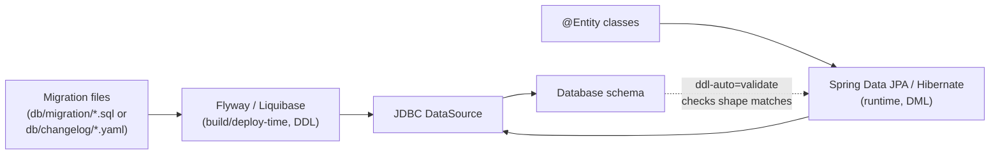
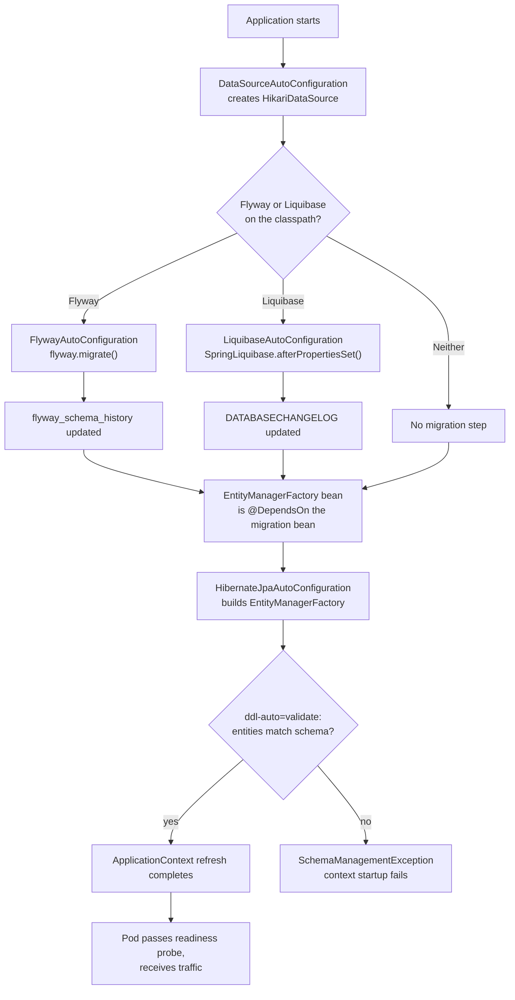
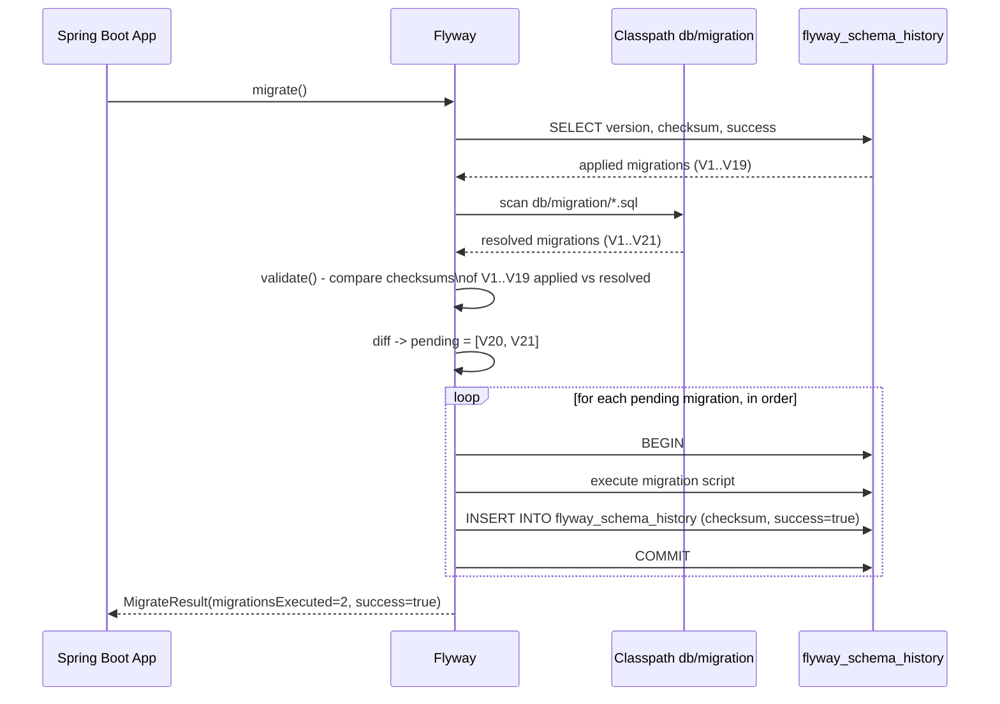
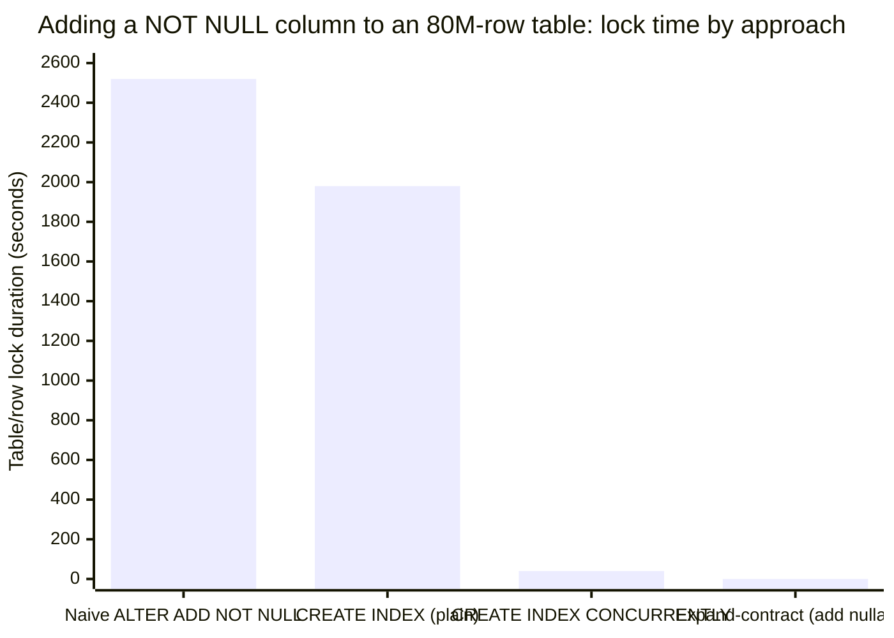
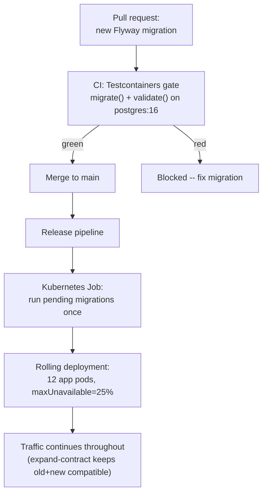

# Database Migrations in Spring — Flyway & Liquibase

---

## 1. Concept Overview

Database migrations are version-controlled, ordered changes to a schema — new tables, new columns, new indexes, data fixes — applied deterministically across every environment. In the Spring ecosystem the two dominant tools are **Flyway** (SQL-first: you write the exact DDL, it tracks what ran) and **Liquibase** (declarative: you describe the intended change in XML/YAML/JSON/SQL, it generates dialect-correct DDL). Both integrate with Spring Boot through autoconfiguration: drop a migration file on the classpath, and it runs automatically the next time the application context starts, with zero extra wiring.

Migrations solve a problem that is easy to underestimate: a schema is not a file you edit, it is a *sequence of committed changes* that many different environments (a laptop, a CI runner, staging, production) must apply in the exact same order to reach the exact same state. `flyway_schema_history` and `DATABASECHANGELOG` are each tool's ledger of that sequence — the database's own memory of exactly what has happened to it.



Key terms:
- **Migration**: one versioned, ordered unit of schema change.
- **Schema history table**: `flyway_schema_history` (Flyway) or `DATABASECHANGELOG` (Liquibase) — the applied-migration ledger.
- **Checksum**: a content hash Flyway/Liquibase uses to detect that an already-applied migration file was edited after the fact.
- **Expand-contract**: the multi-deploy pattern that keeps a schema compatible with two application versions running at once.
- **`ddl-auto`**: Hibernate's own schema-management knob — a *different, narrower* mechanism than a migration tool, covered in Section 6.8.

---

## 2. Intuition

One-line analogy: a migration tool is a git log for your schema — you replay committed, ordered patches, and you never edit history after the fact.

Mental model: think of `flyway_schema_history`/`DATABASECHANGELOG` as the database's own memory. Point any environment at any database and ask "what state are you in," and the history table answers precisely — not app configuration, not a wiki page, not tribal knowledge of who ran what by hand three years ago.

Why it matters: schema changes carry the highest blast radius of any change category in a running system. A single bad `ALTER TABLE` can lock an 80-million-row table for tens of minutes, or silently drop a column half the running fleet still reads from — application bugs usually degrade a feature, but a bad migration can take down every feature that touches that table at once.

Key insight: the moment more than one version of your application can be live against the same schema — true for the entire duration of any rolling deployment — a migration is not one atomic event. It is a negotiation between what the old code needs and what the new code needs, and the migration tool only handles the mechanical apply-and-track half of that; expand-contract is the discipline that makes the negotiation safe.

---

## 3. Core Principles

1. **Immutable, append-only history.** Once a migration has run anywhere, its file is never edited — corrections ship as a new migration, never a patch to the old one.
2. **Checksum integrity.** Both tools hash migration content and compare it against the stored hash on every run, turning silent drift into a loud, fail-fast error.
3. **The database is the single source of truth for its own state.** `flyway_schema_history`/`DATABASECHANGELOG` — not a spreadsheet, not a Confluence page — tells you exactly which migrations a given database has applied.
4. **Backward compatibility during rollout.** Because rolling deployments run old and new code simultaneously, a schema change must satisfy both versions at once, not just the version being deployed.
5. **Idempotent definitions for anything that should always reflect "latest."** Views, stored procedures, and seed/reference data belong in repeatable migrations that re-run on change, not one-time versioned steps.
6. **DDL privilege separation from application runtime privilege.** The identity that runs migrations needs `CREATE`/`ALTER`/`DROP`; the identity your application pool uses at 2 AM under user traffic should need only `SELECT`/`INSERT`/`UPDATE`/`DELETE`.

---

## 4. Types / Architectures / Strategies

### 4.1 Flyway Migration Types

| Type | Prefix | Runs | Typical content |
|---|---|---|---|
| Versioned | `V` | Exactly once, in strict version order | Table/column DDL, one-time data fixes |
| Repeatable | `R` | Whenever its checksum changes, after all pending versioned migrations | Views, stored procedures, seed data |
| Undo | `U` | On explicit `flyway undo` (Teams/Enterprise only) | Hand-written reverse of a `V` migration |
| Baseline | `B` (auto-generated) | Once, as a synthetic marker row | Represents "everything before this point," not a real script |

Naming convention: `V<version>__<description>.sql` — version separators may use dots or underscores (`V2_1__` and `V2.1__` both resolve to version `2.1`), a double underscore separates version from description, and underscores in the description render as spaces in the recorded history.

```
src/main/resources/db/migration/
  V1__create_customers_table.sql
  V2__create_orders_table.sql
  V2.1__add_orders_customer_id_index.sql
  V20__add_phone_e164_nullable.sql
  R__refresh_customer_ltv_view.sql
```

### 4.2 Liquibase Changelog Formats

Liquibase changesets can be authored in XML, YAML, JSON, or a specially formatted SQL file — all four describe the same declarative model (a `changeSet` with an `id`, an `author`, and one or more `changes`), and a master changelog `include`s or `includeAll`s the individual files:

```yaml
# db/changelog/db.changelog-master.yaml
databaseChangeLog:
  - include:
      file: db/changelog/001-initial-schema.yaml
  - include:
      file: db/changelog/002-add-loyalty-tier.yaml
  - includeAll:
      path: db/changelog/releases/2026.07/
```

### 4.3 Migration Execution Strategies in a Spring Boot Deployment

| Strategy | How it runs | Best for |
|---|---|---|
| In-app auto-migrate (default) | Every pod calls `migrate()`/`update()` during its own `ApplicationContext` startup | Small teams, low replica counts, simplicity |
| Dedicated migration step | A Kubernetes Job, Helm pre-upgrade hook, or CI/CD release stage runs the migration once, before the rollout begins | Larger fleets, strict zero-downtime SLAs, avoiding N-pod lock contention |

### 4.4 Zero-Downtime Change Categories

| Category | Examples | Safe in one migration? |
|---|---|---|
| Additive-only | New nullable column, new table, new index (concurrently) | Yes |
| Destructive | Drop column, drop table, rename column | No — needs expand-contract (Section 6.11) |
| Type-changing / constraint-tightening | Widen/narrow a column type, add `NOT NULL` | No — needs expand-contract or a validated two-step constraint add |

The SQL-level mechanics of each `ALTER` variant — which ones are instant metadata-only changes versus full table rewrites on a given PostgreSQL version — are covered in depth in [Database Migrations — Zero Downtime](../../database/database_migrations_zero_downtime/README.md); this module focuses on how Flyway/Liquibase and Spring wire that theory into an actual deploy pipeline.

---

## 5. Architecture Diagrams

### Spring Boot Startup Ordering



The dependency edge into node I is the whole point of this diagram: Spring Boot forces migrations to complete *before* Hibernate ever inspects the schema, so `validate` is checking post-migration reality, never a stale pre-migration snapshot.

### Flyway `migrate()` Sequence



### Liquibase Changelog Lock Lifecycle

```mermaid
stateDiagram-v2
    [*] --> Unlocked
    Unlocked --> Locked: pod A calls update();\nsets LOCKED=true, LOCKEDBY=host/pid
    Locked --> Unlocked: changelog applied,\nlock released
    Locked --> Locked: pods B, C... poll and wait\n(changeLogLockWaitTimeMinutes)
    Locked --> Stuck: pod A killed mid-migration,\nlock row never cleared
    Stuck --> Unlocked: operator runs\nliquibase releaseLocks
    Stuck --> Stuck: every new deploy fails fast\nwith LockException
```



### Blocking Duration by Approach



The first two bars are full-table operations that hold a blocking lock for the entire table rewrite or index build; `CONCURRENTLY` trades a longer build time for no write-blocking lock; expand-contract's first step (adding a nullable column) is a metadata-only change on PostgreSQL 11+ and finishes in milliseconds, deferring all the expensive work to a paced, lock-free backfill.

### Expand-Contract Timeline (Visual Intuition)

```
Expand-Contract: orders.customer_phone -> customer_phone_e164 (80M rows, 12 pods)

Phase 0  BEFORE
  columns:  customer_phone
  old pods: read/write customer_phone       new pods: (not yet deployed)

Phase 1  EXPAND            (V20__add_phone_e164_nullable.sql)
  columns:  customer_phone, customer_phone_e164 (nullable)
  old pods: read/write customer_phone       new pods: write BOTH columns

Phase 2  BACKFILL          (batched, outside the migration transaction)
  columns:  customer_phone, customer_phone_e164 (fully populated)
  old pods: read/write customer_phone       new pods: write BOTH, read e164

Phase 3  ENFORCE + CUTOVER (V22__enforce_phone_e164_not_null.sql)
  columns:  customer_phone (idle), customer_phone_e164 NOT NULL
  old pods: retired                         new pods: read/write e164 only

Phase 4  CONTRACT          (V23__drop_phone.sql)
  columns:  customer_phone_e164 NOT NULL only
  old pods: gone                            new pods: read/write e164 only

Invariant held at every phase: every pod's live code finds every column it touches.
```

Each row is a deploy, not a moment — the whole point of spreading the change across four phases is that at no single instant does a running pod, old or new, reference a column that is not there.

---

## 6. How It Works — Detailed Mechanics

### 6.1 Flyway Versioned Migrations and the Schema History Table

Every versioned migration Flyway resolves from the classpath gets a row in `flyway_schema_history` the first time it runs:

```
version | description             | script                             | checksum    | success
1       | create customers table  | V1__create_customers_table.sql    | -1834920123 | true
2       | create orders table     | V2__create_orders_table.sql       | 402881193   | true
...
20      | add phone e164 nullable | V20__add_phone_e164_nullable.sql   | -841472345  | true
```

`checksum` is a CRC32 hash of the migration file's content, computed fresh on every `migrate()`/`validate()` call and compared to the stored value — this is what makes editing an applied migration unsafe (Section 6.7). `success` is `false` for a migration that started but did not finish; Flyway refuses to proceed past a failed row until it is resolved (Section 6.7).

### 6.2 Flyway Repeatable Migrations

```sql
-- R__refresh_customer_ltv_view.sql
CREATE OR REPLACE VIEW customer_ltv_summary AS
SELECT customer_id, SUM(total_amount) AS lifetime_value, COUNT(*) AS order_count
FROM orders
GROUP BY customer_id;
```

Repeatable migrations always run *after* all pending versioned migrations in a given `migrate()` call, and Flyway decides to re-run one purely by checksum comparison — editing an `R__` file is expected and safe, unlike editing a `V__` file. Use them for views, stored procedures, and reference/seed data: anything that should reflect "the latest definition," not "one point-in-time change."

### 6.3 Baseline — Adopting Flyway on an Existing Database

```properties
spring.flyway.baseline-on-migrate=true
spring.flyway.baseline-version=1
```

`baselineOnMigrate` tells Flyway to insert a synthetic baseline row instead of failing on a non-empty schema it has never managed before — essential when adopting Flyway on a database that already has years of DBA-run DDL behind it. Get `baseline-version` wrong and Flyway either skips migrations that were never really applied (the database is missing real schema objects) or tries to re-run DDL that already exists and fails with "relation already exists" — always diff the live schema against the migration set before choosing the value.

### 6.4 Out-of-Order Execution

```properties
spring.flyway.out-of-order=true
```

By default Flyway requires strictly increasing version order; `out-of-order` allows a lower-numbered migration to apply after a higher one already ran. This matters when two feature branches develop in parallel — branch A merges and ships `V24` first, branch B (started earlier) merges later and ships `V23` — and without it the second deploy fails outright because `23 < 24` is already applied. Keep it off by default; enabling it means the sequence that ran in production is not necessarily the sequence anyone tested end-to-end.

### 6.5 Callbacks

```sql
-- afterMigrate.sql — runs after every successful migrate() call
REFRESH MATERIALIZED VIEW CONCURRENTLY customer_ltv_summary;
```

```java
@Component
public class MigrationMetricsCallback implements Callback {

    private final MeterRegistry meterRegistry;
    public MigrationMetricsCallback(MeterRegistry meterRegistry) { this.meterRegistry = meterRegistry; }

    @Override
    public boolean supports(Event event, Context context) {
        return event == Event.AFTER_MIGRATE || event == Event.AFTER_MIGRATE_ERROR;
    }

    @Override
    public boolean canHandleInTransaction(Event event, Context context) { return true; }

    @Override
    public void handle(Event event, Context context) {
        meterRegistry.counter("flyway.migrate", "result", event.getId()).increment();
    }

    @Override
    public String getCallbackName() { return "MigrationMetricsCallback"; }
}
```

Naming-convention callbacks (`beforeMigrate.sql`, `afterEachMigrate.sql`) run automatically if present; the `Callback` interface is for logic too complex for SQL, such as emitting a metric or validating an invariant before allowing the run to proceed. Keep callback logic idempotent — it fires on every `migrate()` call, including ones where nothing was actually pending.

### 6.6 `clean` — Danger and Defaults

```properties
# Spring Boot's own default — do not flip this in any profile that could touch shared data
spring.flyway.clean-disabled=true
```

`flyway clean` drops every object Flyway manages in the target schema: tables, views, sequences, all of it. Spring Boot disables it by default specifically so a copy-pasted command or a misconfigured profile cannot wipe a production database. The only legitimate use is an ephemeral database — local dev, a CI-provisioned schema, or a Testcontainers instance that is thrown away regardless of outcome.

### 6.7 Checksum Mismatch — the Concrete Failure Mode

A developer "quickly fixes a typo" by hand-editing `V14__add_index_orders_customer_id.sql`, which already ran in staging weeks ago. The next `migrate()` anywhere that already applied `V14` fails immediately:

```
Caused by: org.flywaydb.core.api.exception.FlywayValidateException: Validate failed:
Migration checksum mismatch for migration version 14
-> Applied to database : -1834920123
-> Resolved locally    : 1927300512
```

Flyway recomputes the checksum of every resolved migration on the classpath and compares it against what is stored in `flyway_schema_history`; any difference — even a single character of whitespace — trips this guard. The correct fix is to never touch an applied migration: ship the correction as a new file (`V25__fix_index_name.sql`). `flyway repair` exists to reconcile checksums after a reviewed, intentional manual change to the database (or to remove a failed-migration row) — it is an operator tool for cleaning up history, not a way to bypass the check.

### 6.8 Spring Boot Auto-Configuration Ordering vs JPA `ddl-auto`

Spring Boot's Flyway/Liquibase autoconfiguration registers a `BeanFactoryPostProcessor` that adds the migration bean as a `@DependsOn` target for any JPA `EntityManagerFactory` bean. This is what guarantees Hibernate only ever inspects the schema *after* migrations have run — without it, `ddl-auto=validate` could race a pending migration and fail spuriously, or worse, pass by accident against a stale schema.

```java
// If you hand-roll a DataSource/EntityManagerFactory outside Boot's autoconfiguration
// (a second, non-primary database, for example), wire the ordering yourself:
@Bean
@DependsOn("flyway")
public LocalContainerEntityManagerFactoryBean secondaryEntityManagerFactory(
        @Qualifier("secondaryDataSource") DataSource dataSource) {
    // ...
}
```

`ddl-auto` and a migration tool are not competitors, they are different layers:

```properties
spring.jpa.hibernate.ddl-auto=validate
```

`validate` makes Hibernate compare your `@Entity` mappings against the actual schema at startup and fail fast on any mismatch — but it never mutates the schema itself. Flyway/Liquibase own every schema change; Hibernate's job is only to confirm the schema it is about to run against actually matches the object model. Boot's own default already reflects this split: embedded databases (H2, HSQL) default `ddl-auto` to `create-drop` for zero-config test convenience, but a real database (Postgres, MySQL) with no detected embedded driver defaults to `none` — production behavior is not "safe by accident," it is `none` until you explicitly add a migration tool and set `validate`.

### 6.9 Liquibase Changesets — XML, YAML, and SQL for the Same Change

The same change — add a `loyalty_tier` column, defaulted and non-null — expressed three ways:

```xml
<!-- 002-add-loyalty-tier.xml -->
<databaseChangeLog xmlns="http://www.liquibase.org/xml/ns/dbchangelog">
    <changeSet id="20260115-01-add-loyalty-tier" author="rutik46">
        <preConditions onFail="MARK_RAN">
            <not><columnExists tableName="customers" columnName="loyalty_tier"/></not>
        </preConditions>
        <addColumn tableName="customers">
            <column name="loyalty_tier" type="varchar(20)" defaultValue="STANDARD">
                <constraints nullable="false"/>
            </column>
        </addColumn>
        <rollback>
            <dropColumn tableName="customers" columnName="loyalty_tier"/>
        </rollback>
    </changeSet>
</databaseChangeLog>
```

```yaml
# 002-add-loyalty-tier.yaml
databaseChangeLog:
  - changeSet:
      id: 20260115-01-add-loyalty-tier
      author: rutik46
      preConditions:
        onFail: MARK_RAN
        not:
          columnExists:
            tableName: customers
            columnName: loyalty_tier
      changes:
        - addColumn:
            tableName: customers
            columns:
              - column:
                  name: loyalty_tier
                  type: varchar(20)
                  defaultValue: STANDARD
                  constraints:
                    nullable: false
      rollback:
        - dropColumn:
            tableName: customers
            columnName: loyalty_tier
```

```sql
--liquibase formatted sql

--changeset rutik46:20260115-01-add-loyalty-tier
--preconditions onFail:MARK_RAN
--precondition-sql-check expectedResult:0 SELECT COUNT(*) FROM information_schema.columns WHERE table_name='customers' AND column_name='loyalty_tier'
ALTER TABLE customers ADD COLUMN loyalty_tier VARCHAR(20) NOT NULL DEFAULT 'STANDARD';
--rollback ALTER TABLE customers DROP COLUMN loyalty_tier;
```

All three are functionally identical to Liquibase: same `id`+`author`+`filepath` uniqueness key, same generated DDL, same row in `DATABASECHANGELOG`. Choose based on team preference — SQL-formatted changelogs read naturally to a SQL-first team while keeping Liquibase's preconditions and rollback metadata; XML/YAML read better when the changelog must stay portable across database vendors.

### 6.10 Liquibase Lock Table, Contexts, Labels, Preconditions, and Rollback

`DATABASECHANGELOGLOCK` is a single-row mutex table (`ID`, `LOCKED`, `LOCKGRANTED`, `LOCKEDBY`) that every Liquibase-enabled instance must acquire before applying changesets, preventing two application instances from racing the same changelog concurrently. `DATABASECHANGELOG` records one row per applied changeset (`ID`, `AUTHOR`, `FILENAME`, `DATEEXECUTED`, `MD5SUM`, `EXECTYPE`, `CONTEXTS`, `LABELS`, among others) — Liquibase's equivalent of `flyway_schema_history`.

```properties
spring.liquibase.contexts=prod
spring.liquibase.labels=!experimental
```

- **Contexts** are boolean tags (`context="!test"`) traditionally used to gate a changeset by deployment environment or purpose — exclude test-only seed data from a production run, for example.
- **Labels** are a more general cross-cutting tagging mechanism — a feature name, a team, a release train — that combine with `AND`/`OR`/`NOT` expressions independent of environment.
- **Preconditions** guard a changeset with a runtime check (`tableExists`, `columnExists`, `dbms`, or a custom SQL check) before it runs. `onFail` controls behavior when the condition evaluates false; `onError` controls behavior when *evaluating* the precondition itself throws (a permissions error, say). Both accept `HALT`, `CONTINUE`, `MARK_RAN`, or `WARN` — `MARK_RAN` records the changeset as applied without running it, correct for "this column already exists from a legacy script," dangerous if used to paper over a genuine failure.
- **Rollback** is auto-generated only for simple, reversible change types (`addColumn` reverses to `dropColumn`, `createTable` reverses to `dropTable`); anything that touches data, or narrows/loses information, needs an explicit `<rollback>` block, because there is no generic way to "un-drop" a column's data.

### 6.11 Broken -> Fix: One-Shot Destructive Change vs Expand-Contract

**BROKEN — a single migration renames a column a live fleet still depends on:**

```sql
-- V12__rename_phone_to_phone_number.sql  (BROKEN)
ALTER TABLE orders RENAME COLUMN customer_phone TO customer_phone_number;
```

The instant this commits, every currently-running pod on the old application version — which still maps its JPA entity field to the `customer_phone` column — starts failing every read and write that touches `orders` with `PSQLException: column "customer_phone" does not exist`. During a rolling deployment this is not a brief blip; it is a multi-minute outage affecting every old-code pod still cycling through the rollout, and it cannot be "un-renamed" without shipping another migration.

**FIX — expand-contract across four versioned migrations and deploys:**

```sql
-- V20__add_phone_e164_nullable.sql  (Deploy 1 -- EXPAND)
ALTER TABLE orders ADD COLUMN customer_phone_e164 VARCHAR(20);
-- nullable, no default -> metadata-only change on PostgreSQL 11+, old code completely unaffected
```

```java
// Deploy 1 code -- dual-write, read still comes from the legacy column
@Entity
public class Order {
    @Column(name = "customer_phone") private String customerPhone;              // legacy, still read
    @Column(name = "customer_phone_e164") private String customerPhoneE164;     // new, write-only for now
}
```

```sql
-- for tables small enough that a single UPDATE is safe (roughly under a few million rows),
-- a plain versioned migration is fine:
-- V21__backfill_phone_e164_small_table.sql  (Deploy 2 -- MIGRATE DATA)
UPDATE orders SET customer_phone_e164 = to_e164(customer_phone)
WHERE customer_phone_e164 IS NULL;
```

At 80,000,000 rows that single `UPDATE` would hold one transaction open for hours and generate an enormous amount of WAL — deliberately *not* something to embed in a Flyway migration. Instead the backfill runs as a separate, resumable, batched job outside the migration's transaction scope:

```java
@Component
public class PhoneE164BackfillRunner {

    private static final int BATCH_SIZE = 10_000;
    private final JdbcTemplate jdbc;

    public PhoneE164BackfillRunner(JdbcTemplate jdbc) { this.jdbc = jdbc; }

    // Triggered by an ops runbook step, not by every pod on every boot.
    public void backfill(long maxId) {
        long lastId = 0;
        while (lastId < maxId) {
            int updated = jdbc.update("""
                UPDATE orders SET customer_phone_e164 = to_e164(customer_phone)
                WHERE id > ? AND id <= ? AND customer_phone_e164 IS NULL
                """, lastId, lastId + BATCH_SIZE);
            lastId += BATCH_SIZE;
            sleepBriefly();   // paces writes, keeps replica lag under control
        }
    }
}
```

**Read it like this.** "Total rows divided by batch size gives the number of round trips; the wall-clock budget divided by that count gives you the pace each batch must hold — and the sleep, not the `UPDATE`, is what fills most of that pace." Batch sizing is therefore a two-sided choice: too small and the round-trip count explodes, too large and one transaction holds locks and generates WAL faster than the replicas can consume it.

| Symbol | What it is |
|--------|------------|
| `80,000,000` | Rows in `orders` that need the new column populated |
| `BATCH_SIZE = 10_000` | Rows updated inside one autocommit transaction — one lock/WAL unit |
| `lastId` | Resumable cursor. A crashed job restarts from here, not from row 0 |
| `sleepBriefly()` | The pacing knob. Deliberately idle time that lets replicas catch up |
| `3h 40m` | The wall-clock budget quoted in the case study's results table |

**Walk one example.** The case study's numbers, pushed through:

```
  batches      = 80,000,000 / 10,000            = 8,000 batches
  budget       = 3h 40m = 3 x 3600 + 40 x 60    = 13,200 seconds
  pace         = 13,200 s / 8,000 batches       = 1.65 s per batch
  throughput   = 80,000,000 / 13,200            ~ 6,061 rows/second

  if the UPDATE itself costs ~50 ms:
    real DB work = 8,000 x 0.05 s               = 400 s = ~6.7 minutes
    sleepBriefly = 1.65 - 0.05                  ~ 1.60 s per batch
```

The job runs for nearly four hours but only about seven minutes of that is database work.
The other 99% is deliberate idling — that is the whole point. Replica lag stays under the
200 ms target because writes arrive in small, spaced bursts rather than one continuous
flood.

**Why the batch size is not "as large as possible."** Raising `BATCH_SIZE` to 1,000,000
cuts the round trips to 80, but each transaction now locks a million rows and emits a
million rows of WAL in one burst — exactly the replication-lag spike the pacing exists to
prevent, and a long-running transaction that blocks vacuum on a hot table. Dropping it to
100 gives 800,000 round trips, and per-statement overhead starts dominating the actual
work. Ten thousand rows sits in the flat middle of that curve.

```sql
-- V22__enforce_phone_e164_not_null.sql  (Deploy 3 -- ENFORCE + CUTOVER)
-- Run only after verifying: SELECT count(*) FROM orders WHERE customer_phone_e164 IS NULL -> 0
ALTER TABLE orders ALTER COLUMN customer_phone_e164 SET NOT NULL;
```

```java
// Deploy 3 code -- reads and writes move to the new column exclusively
@Entity
public class Order {
    @Column(name = "customer_phone_e164") private String customerPhoneE164;
}
```

```sql
-- V23__drop_phone.sql  (Deploy 4 -- CONTRACT)
ALTER TABLE orders DROP COLUMN customer_phone;
```

The deep, version-specific mechanics of *why* `ADD COLUMN` is instant on PostgreSQL 11+ but a full rewrite on 10 and below, and how `NOT VALID` + `VALIDATE CONSTRAINT` avoids a blocking scan when enforcing `NOT NULL`, live in [Database Migrations — Zero Downtime](../../database/database_migrations_zero_downtime/README.md).

### 6.12 CI Gating with Testcontainers

```java
@Testcontainers
class FlywayMigrationTest {

    @Container
    static PostgreSQLContainer<?> postgres =
        new PostgreSQLContainer<>("postgres:16-alpine").withDatabaseName("appdb");

    @Test
    void allMigrationsApplyCleanlyFromEmptySchema() {
        Flyway flyway = Flyway.configure()
            .dataSource(postgres.getJdbcUrl(), postgres.getUsername(), postgres.getPassword())
            .locations("classpath:db/migration")
            .load();

        MigrateResult result = flyway.migrate();

        assertThat(result.success).isTrue();
        assertThat(result.migrationsExecuted).isGreaterThan(0);
    }

    @Test
    void validateDetectsNoChecksumDrift() {
        Flyway flyway = Flyway.configure()
            .dataSource(postgres.getJdbcUrl(), postgres.getUsername(), postgres.getPassword())
            .locations("classpath:db/migration")
            .load();
        flyway.migrate();

        assertThatCode(flyway::validate).doesNotThrowAnyException();
    }
}
```

Running this against the same database engine and major version as production — not an in-memory substitute — is the entire point: it catches dialect-specific failures (`CREATE INDEX CONCURRENTLY`, JSON operators, partitioning syntax) that pass silently against H2 but fail against real Postgres, plus catches checksum drift before it reaches a shared environment. See [Spring Testing](../spring_testing/README.md) for the general `@DataJpaTest` + `@AutoConfigureTestDatabase(replace=NONE)` + Testcontainers patterns this migration-CI gate builds on.

---

## 7. Real-World Examples

**Legacy monolith adoption.** A 12-year-old logistics platform's `shipments` schema had been hand-maintained via DBA-run scripts with no tracked history. Adopting Flyway used `baselineOnMigrate=true` with `baselineVersion=47`, matching a hand-audited snapshot of the "current" schema, so every change from that point forward is tracked without replaying a decade of undocumented DDL.

**Multi-tenant SaaS, schema-per-tenant.** A B2B platform with 500-plus tenant schemas runs the same versioned migration set once per tenant using a Flyway placeholder (`${tenantSchema}`) and a deploy-time loop calling `Flyway.configure().schemas(tenantId)...migrate()` per tenant, logging failures per tenant without one bad tenant blocking the other 499.

**Fintech ledger, privilege separation.** A payments service's connection pool uses a `ledger_app` role limited to `SELECT`/`INSERT`/`UPDATE` on ledger tables, while `spring.flyway.url`/`user`/`password` points at a separate `ledger_migrate` role with `CREATE`/`ALTER` rights — so a compromised application credential cannot alter schema or drop a table.

**Reporting views kept fresh with repeatable migrations.** An analytics team owns a dozen materialized reporting views defined as `R__` repeatable migrations; editing the view SQL and merging the pull request is the entire deployment process, because Flyway detects the changed checksum and re-creates the view on the next `migrate()` with no manual DBA step.

**Kubernetes pre-upgrade migration Job.** A platform team runs Liquibase as a Helm pre-upgrade hook — a one-shot Kubernetes Job that must complete before the Deployment rolls — instead of letting 20 API-server replicas race each other for `DATABASECHANGELOGLOCK` on boot, cutting migration-related startup latency and eliminating lock contention entirely.

---

## 8. Tradeoffs

### Flyway vs Liquibase

| Aspect | Flyway | Liquibase |
|---|---|---|
| Primary authoring format | Plain SQL (Java migrations possible) | XML, YAML, JSON, or formatted SQL |
| Change model | Imperative — you write the exact DDL | Declarative — describe the change, it generates DDL |
| History table | `flyway_schema_history` | `DATABASECHANGELOG` + `DATABASECHANGELOGLOCK` |
| Rollback | Community: none; Teams: undo migrations | Built into OSS: auto for simple changes, explicit for the rest |
| Preconditions | None built-in (hand-write SQL guards) | First-class `<preConditions>` |
| Cross-database portability | Low — SQL is dialect-specific | High — one changelog can target multiple vendors |
| Contexts / labels | None built-in | Yes |
| Spring Boot autoconfiguration | Yes (`spring.flyway.*`) | Yes (`spring.liquibase.*`) |
| Best for | SQL-comfortable teams, one or two DB engines | Multi-vendor support, built-in rollback/preconditions |

### `ddl-auto` Modes

| Mode | Mutates schema? | Prod-safe? | Typical use |
|---|---|---|---|
| `none` | No | Yes | Default for non-embedded DBs; migrations own everything |
| `validate` | No | Yes (recommended) | Fails fast on entity/schema mismatch; schema owned by Flyway/Liquibase |
| `update` | Yes, additive-ish | No | Local prototyping only |
| `create` | Yes, drops and recreates | No | Ephemeral test schemas only |
| `create-drop` | Yes, drops on shutdown | No | `@DataJpaTest`/H2-backed unit tests only |

### Versioned vs Repeatable Migrations

| | Versioned (`V__`) | Repeatable (`R__`) |
|---|---|---|
| Runs | Exactly once, in version order | Whenever checksum changes |
| Editable after applied | No — checksum mismatch | Yes, by design |
| Execution order | Strict version order, before repeatables | After all pending versioned migrations |
| Typical content | Table/column DDL, one-time fixes | Views, procedures, seed data |

### In-App Auto-Migrate vs Dedicated Migration Step

| | In-app auto-migrate | Dedicated migration Job/step |
|---|---|---|
| When it runs | Every pod, every boot | Once, before rollout begins |
| Contention under N replicas | N pods race for the lock; N-1 wait | None — single runner |
| Rollback coupling | Tied to app deploy/rollback | Decoupled — can gate rollout on success |
| Setup complexity | Zero — Boot autoconfigures it | Extra CI/CD or Helm hook plumbing |
| Best for | Small teams, low replica counts | Large fleets, strict zero-downtime SLAs |

### Expand-Contract vs One-Shot Change

| | One-shot destructive change | Expand-contract |
|---|---|---|
| Deploys required | 1 | 3-4 |
| Old-code compatibility | Broken immediately | Preserved throughout |
| Rollback safety | Poor — schema and code coupled | Good — each phase independently revertible |
| Operational overhead | Low | Higher (batch jobs, phase tracking) |
| Appropriate for | Additive-only changes | Renames, type changes, `NOT NULL`, drops |

---

## 9. When to Use / When NOT to Use

**Use Flyway/Liquibase-managed migrations when:**
- Schema evolves continuously across a team of more than one engineer
- You need a provable audit trail of exactly what changed, when
- Deployments are rolling/zero-downtime and schema changes must be sequenced against code releases
- You want CI-enforced guarantees that migrations apply cleanly before merge
- Multiple environments must provably sit at the same schema version

**Do NOT rely on a migration tool alone when:**
- The datastore is genuinely schemaless (MongoDB, DynamoDB) — version the model at the document/application layer; Flyway/Liquibase's NoSQL extensions cover only structural concerns like index creation
- A one-time, multi-hour data backfill is needed — run it as a dedicated batch/ETL job outside the app's boot path, never as a migration that blocks every pod's startup or holds one giant transaction open
- You need instant, always-reversible rollback for arbitrary changes — neither tool gives you "undo anything" for free; Flyway Community has no rollback at all, and Liquibase's auto-rollback covers only simple additive changes
- The work is a pure data-warehouse/ELT transformation with no coupling to an application's entity model — a lineage-aware tool built for that purpose is a better fit than a Flyway SQL file

---

## 10. Common Pitfalls

### Pitfall 1: One-Shot Rename Breaks the Running Old Version

A payments team shipped `ALTER TABLE orders RENAME COLUMN customer_phone TO customer_phone_number;` as a single migration alongside a code deploy. Kubernetes rolled 12 replicas over roughly 8 minutes with `maxUnavailable=25%`; the instant the migration committed, every pod still on old code — up to 9 of 12 mid-rollout — started throwing `PSQLException: column "customer_phone" does not exist` on every request touching orders. Roughly 6,200 checkout requests failed in the 4 minutes before the rollout finished, and the on-call engineer had to roll the code deployment back (the rename itself could only be undone by another migration) to stop the failures. The fix is always expand-contract (Section 6.11), never a same-deploy rename.

### Pitfall 2: `ddl-auto=update` Silent Drift

A staging environment ran `ddl-auto=update` "temporarily" during a hotfix. Hibernate widened a `NUMERIC(19,2)` money column to match one developer's locally modified entity; a second developer's branch still declared the old precision, and the next `update` run silently narrowed it back. With no migration history to diff against, nobody noticed until a monthly reconciliation report flagged 1,140 invoices with truncated cent values six weeks later, and root-causing it took two days precisely because there was no log of what had changed the schema, only the already-corrupted current state.

### Pitfall 3: Checksum Mismatch Blocks a Release

A developer "quickly fixed a typo" by hand-editing an already-deployed `V14__add_index_orders_customer_id.sql` instead of writing a new migration. The next `migrate()` against the shared staging database failed instantly with `Migration checksum mismatch for migration version 14`, blocking the entire release train for 45 minutes until the on-call engineer traced it to the edited file and reverted it in favor of a fresh `V25__` migration (Section 6.7).

### Pitfall 4: Stuck `DATABASECHANGELOGLOCK`

A Liquibase-managed service had its migrating pod OOM-killed mid-`update()` during a memory-constrained deploy window; the lock row was never released. The next three deployment attempts over 20 minutes all failed at the same step with `LockException: Could not acquire change log lock`, until an operator confirmed via `DATABASECHANGELOG` that the interrupted changeset had not partially applied and ran `liquibase releaseLocks` to clear it.

### Pitfall 5: `CREATE INDEX CONCURRENTLY` Inside a Transaction, Caught Only in Production

A migration adding an index to a 40-million-row `events` table used `CREATE INDEX CONCURRENTLY` to avoid locking writes. It passed CI because the test suite ran migrations against H2, which does not enforce PostgreSQL's transaction restrictions on that statement. In production, Flyway's default transactional wrapping caused an immediate `ERROR: CREATE INDEX CONCURRENTLY cannot run inside a transaction block`, failing the deploy and leaving an `INVALID` index that had to be dropped and recreated after adding an `executeInTransaction=false` directive to the script — a direct argument for gating CI with a real database engine (Section 6.12), not H2.

### Pitfall 6: Line-Ending Checksum Drift Across Operating Systems

A contributor's `git config core.autocrlf=true` silently rewrote every migration file's line endings from LF to CRLF on checkout. Flyway's checksum is sensitive to raw byte content, so the entire migration set showed as "changed" in CI even though no SQL logic differed, blocking merges team-wide until `.gitattributes` was added to force LF for `db/migration/**`.

---

## 11. Technologies & Tools

| Tool | Role |
|---|---|
| Flyway Community 10.x | SQL-first migrations, `flyway_schema_history`, callbacks |
| Flyway Teams/Enterprise | Undo migrations, drift detection, dry-run scripting |
| Liquibase OSS 4.x | Declarative changesets, built-in rollback, preconditions |
| Liquibase Pro | Quality/policy checks, structured drift reporting |
| Spring Boot `spring-boot-starter-data-jpa` | Auto-wires `EntityManagerFactory` as `@DependsOn` the migration bean |
| Testcontainers 1.20.x | Real Postgres/MySQL in CI for migration-apply tests |
| JUnit 5.10 | Test runner driving the migration CI gate |
| pt-online-schema-change / gh-ost | Online DDL for large-table `ALTER`s outside expand-contract's scope |
| Atlas (Ariga) | Schema-as-code alternative with diff-based migration generation |
| DBeaver / DataGrip | Manual review of generated SQL/changelog diffs before merge |
| Spring Boot Actuator | `/actuator/flyway` and `/actuator/liquibase` expose applied-migration history at runtime |

### Key Spring Boot Properties

```yaml
spring:
  flyway:
    enabled: true
    locations: classpath:db/migration
    baseline-on-migrate: true
    baseline-version: 1
    out-of-order: false
    validate-on-migrate: true
    clean-disabled: true          # Boot default -- never flip in a prod profile
    url: ${MIGRATION_DB_URL}      # optional: separate, higher-privilege connection
    user: ${MIGRATION_DB_USER}
    password: ${MIGRATION_DB_PASSWORD}

  liquibase:
    enabled: true
    change-log: classpath:db/changelog/db.changelog-master.yaml
    contexts: prod
    labels: "!experimental"
    default-schema: public

  jpa:
    hibernate:
      ddl-auto: validate          # never update/create/create-drop outside embedded-DB tests
```

---

## 12. Interview Questions with Answers

**What's the practical difference between Flyway and Liquibase, and how do you choose between them?**
Flyway is SQL-first: each migration is a plain SQL file applied in version order and tracked in `flyway_schema_history`. Liquibase is declarative and database-agnostic: changesets describe an intent (XML, YAML, JSON, or formatted SQL) that Liquibase translates into dialect-correct DDL, tracked in `DATABASECHANGELOG`, and it ships built-in rollback and preconditions in its free tier — Flyway Community has neither (undo migrations are Teams-only; preconditions must be hand-written as SQL guards). Choose Flyway when the team is SQL-comfortable and targets one or two database engines; choose Liquibase when one changelog must run against multiple database vendors, or you want rollback/precondition support without a paid license.

**What causes a Flyway "checksum mismatch" error, and how do you fix it correctly?**
A checksum mismatch means a migration file's content changed after Flyway already recorded its checksum from a prior run. Flyway recomputes a CRC32 checksum of every resolved migration on the classpath each time you call `migrate()` or `validate()`, compares it against the stored value, and refuses to proceed on any difference — a fail-fast guard against silently divergent history between environments. The correct fix is to never hand-edit an applied migration; ship the correction as a new migration, and reserve `flyway repair` (which rewrites stored checksums to match the current files) for reconciling a change you have already reviewed and accepted, not for bypassing the check.

**Why is `spring.jpa.hibernate.ddl-auto=update` dangerous in production, and what should you use instead?**
Setting `ddl-auto=update` lets Hibernate inspect your `@Entity` classes and silently ALTER the live schema to match them, with no history, no review, and no rollback path. Two developers running `update` against the same database can each apply conflicting, untracked changes, and Hibernate's diff is conservative about destructive changes, so drift accumulates invisibly until data is silently truncated or a later `validate` run catches it by surprise. In production, set `ddl-auto=validate`: Hibernate compares entity mappings against the actual schema at startup and fails fast on any mismatch, but never mutates the schema itself — Flyway or Liquibase owns every schema change.

**Why can't you edit a migration file after it has already been applied anywhere?**
A migration's checksum is fixed the moment it first runs, so any later edit — even whitespace — produces a checksum-mismatch failure everywhere it already ran. Every `validate()` call recomputes the checksum from the current file and compares it against what is stored in the history table. Migrations are meant to be an immutable, append-only log of exactly what happened to the schema, not a mutable "current state" file, and editing history breaks that guarantee. If a migration was wrong, write a new one that corrects it instead of touching the old file.

**What is Flyway's `baseline` for, and what breaks if you get `baselineVersion` wrong?**
`baseline` tells Flyway to treat an existing, non-empty database as already being at a given version, inserting a synthetic marker row instead of replaying every migration from scratch. It exists for adopting Flyway on a database that predates it — one already created by DBA scripts or a legacy tool — so you don't hand-write migrations for years of prior history. Get `baselineVersion` wrong and Flyway either silently skips migrations that were never actually applied, leaving the database missing real schema objects, or tries to re-apply changes that already exist and fails on "relation already exists" — always verify the live schema against the migration set before choosing the value.

**What is `DATABASECHANGELOGLOCK`, and what happens when a pod crashes while holding it?**
`DATABASECHANGELOGLOCK` is Liquibase's mutex table — every instance must acquire it before applying changesets, preventing two application instances from racing the same changelog concurrently. If the pod holding the lock is killed mid-migration before releasing it, the `LOCKED` flag never clears, and every subsequent deploy fails fast with `LockException: Could not acquire change log lock` — the database is not damaged, but the release pipeline is stuck. Recovery is a manual operator step: confirm the previous attempt did not leave the schema half-applied, then run `liquibase releaseLocks`.

**Why does adding a `NOT NULL` column in one migration break a live rolling deployment, and what fixes it?**
A single migration that adds a required column, or renames or drops one, breaks any old-code pod still running against that schema the instant it commits. During a rolling deployment, old-code pods keep running against the same database for the entire rollout window, so the schema must satisfy both versions at once. The fix is the expand-contract pattern: add the column as nullable first (old code unaffected), backfill it in batches, deploy code that writes both old and new columns, cut reads over once the backfill is verified complete, then enforce `NOT NULL` and drop the old column only after nothing references it. Never ship a schema change and a breaking code change as a single atomic step when more than one application version can be live at once.

**Why does `CREATE INDEX CONCURRENTLY` fail inside a Flyway migration, and how do you run it safely?**
PostgreSQL refuses to run `CREATE INDEX CONCURRENTLY` inside any transaction block, but Flyway wraps each SQL migration in a transaction by default. The statement fails immediately with a transaction-block error inside a normal versioned migration. The fix takes that specific migration out of Flyway's transaction wrapper: newer Flyway versions support a `-- flyway:executeInTransaction=false` directive as the first line of the script, or `spring.flyway.mixed=true` allows non-transactional statements alongside transactional ones in the same file. Because a non-transactional migration cannot be rolled back automatically on failure, test it against a production-sized clone first and be ready to `DROP INDEX CONCURRENTLY` and retry if it leaves an `INVALID` index behind.

**What is Flyway's `out-of-order` setting, and when do you actually need it?**
`out-of-order` lets Flyway apply a lower-numbered migration after a higher-numbered one has already run, instead of failing validation because history is not strictly increasing. It matters when two feature branches develop in parallel: branch A merges and ships a higher version number first, and branch B — started earlier but merged later — ships a lower one, which fails outright without this setting. Keep it disabled by default and enable it narrowly, because out-of-order execution means the sequence applied in production is not necessarily the sequence anyone tested end-to-end in CI.

**What is a "repeatable" migration (`R__`), and how does Flyway decide when to re-run it?**
A repeatable migration re-runs automatically whenever its file's checksum changes, unlike a versioned migration, which runs exactly once. Repeatable migrations always execute after all pending versioned migrations in a given `migrate()` call, and Flyway detects a change purely by comparing the current file's checksum against the last one recorded in `flyway_schema_history` — editing an `R__` file is expected and safe, unlike editing a `V__` file. Use them for views, stored procedures, and seed data — anything that should always reflect the latest definition rather than one point-in-time change.

**How does Spring Boot guarantee Flyway or Liquibase runs before Hibernate validates the schema?**
Spring Boot registers a `BeanFactoryPostProcessor` that makes the JPA `EntityManagerFactory` bean `@DependsOn` the Flyway or Liquibase bean. That forces the container to run the migration step before it ever builds the `EntityManagerFactory`. This ordering is what makes `ddl-auto=validate` reliable: Hibernate validates against the schema state after migrations ran, never before, so a pending migration can never masquerade as a schema mismatch. Without this wiring — a hand-rolled `DataSource`/`EntityManagerFactory` setup outside Boot's autoconfiguration — you must add the `@DependsOn` relationship yourself or Hibernate can race the migration.

**What's the difference between Liquibase's automatic rollback and a custom `<rollback>` block?**
Liquibase auto-generates rollback only for simple, reversible change types — `addColumn` reverses to `dropColumn`, `createTable` reverses to `dropTable` — with zero extra authoring. Anything Liquibase cannot infer safely, such as a data migration or a column drop that would lose data, needs an explicit `<rollback>` block with the exact statements that undo the change, because there is no generic way to "un-drop" a column's data. Always author an explicit rollback for any changeset that touches data, not just schema shape, and test the rollback path in CI the same way you test the forward migration.

**What are Liquibase contexts and labels, and how are they different?**
Contexts are boolean tags evaluated at runtime, traditionally used to gate a changeset by deployment environment or purpose, such as excluding test-only seed data from a production run. Labels are a more general-purpose tagging mechanism for cross-cutting groupings — a feature name, a team, a release train — that combine with AND/OR/NOT expressions independent of environment. Use contexts for "should this changeset run in this environment" and labels for "which changesets belong to this feature or workstream," and never rely on either as a substitute for a real access-control boundary.

**What does a Liquibase precondition do, and what's the difference between `onFail` and `onError`?**
A precondition is a guard — `tableExists`, `columnExists`, `dbms`, or a custom SQL check — evaluated before a changeset runs, letting you skip or halt it based on the database's actual state rather than an assumption. `onFail` controls what happens when the precondition itself evaluates to false; `onError` controls what happens when evaluating the precondition throws an error, such as a permissions problem — both accept `HALT`, `CONTINUE`, `MARK_RAN`, or `WARN`. `MARK_RAN` is the one to use carefully: it records the changeset as applied without running it, correct for "this table already has this column from a legacy script" but dangerous if used to paper over a real failure.

**Why should the database user that runs migrations differ from the one your application uses at runtime?**
The migration user needs DDL privileges — `CREATE`, `ALTER`, `DROP` — while the application should only ever need DML privileges to operate on data. Giving the runtime user DDL rights means a SQL-injection bug or a leaked credential can drop tables, not just read or corrupt rows. Spring Boot supports this directly: `spring.flyway.url`/`user`/`password` (or the Liquibase equivalents) can point the migration tool at a privileged connection while `spring.datasource.*` stays scoped to a low-privilege application user. Treat the migration credential like a deployment secret used only during the migration step, not something baked into every running pod's connection pool.

**What actually happens to a migration's history row when it fails halfway through?**
Flyway inserts a `success=false` row for the failed migration and stops immediately, refusing to proceed to later migrations until that row is resolved. On databases with transactional DDL the failed statement's own changes roll back, but earlier statements already committed within the same script may remain, depending on how the script is structured; recovery means fixing the underlying issue and retrying after removing the failed row (or via `flyway repair`), or manually reverting the partial change and correcting the migration file. This is why migrations should stay small and single-purpose — a 200-line migration that fails on line 150 leaves a far messier partial state than five 40-line migrations would.

**How do you keep a broken migration from ever reaching production?**
Run the full migration set against a real database engine — the same major version as production — as a CI gate on every pull request. Use Testcontainers, not an in-memory substitute like H2, applying every migration from empty and asserting a clean `validate()`. This catches dialect-specific failures (`CREATE INDEX CONCURRENTLY`, JSON operators, partitioning syntax) that pass silently against H2 but fail against real Postgres or MySQL, plus catches checksum drift before it reaches a shared environment. Treat a red migration-CI job exactly like a failing unit test: it blocks merge, full stop.

**What are Flyway callbacks, and what are they typically used for?**
Callbacks are hook points — `beforeMigrate`, `afterMigrate`, `beforeEachMigrate`, and others — in the migration lifecycle. They run custom SQL or Java logic at a specific point, named by convention or implemented via the `Callback` interface for logic too complex for SQL. Common uses are emitting a metric when a migration run starts or finishes, refreshing a materialized view after all versioned migrations complete, or validating an invariant before allowing the run to proceed. Keep callback logic idempotent — it runs on every `migrate()` invocation, including ones where zero migrations were actually pending.

**Why is `flyway clean` disabled by default in Spring Boot, and when would you ever enable it?**
`flyway clean` drops every object Flyway manages, and Spring Boot disables it by default so a misconfigured or copy-pasted command can never wipe a production database by accident. The only legitimate uses are ephemeral environments — a local dev database, a CI database created fresh for a test run, or a Testcontainers instance discarded regardless of outcome. Never set `clean-disabled=false` on any configuration profile that could plausibly point at a shared or production data source, even temporarily for "just this one fix."

**How do you run schema-per-tenant migrations for a multi-tenant application?**
Each tenant gets its own schema, and the same versioned migration set runs once per tenant. You parameterize Flyway's target schema per invocation — `spring.flyway.schemas=tenant_42`, or a runtime loop calling `Flyway.configure().schemas(tenantId).load().migrate()` for each known tenant — with placeholders letting one migration file generate tenant-scoped DDL without duplicating SQL per tenant. The operational cost is real: 500 tenants means 500 independent migration histories to track, and a single migration release becomes 500 sequential or carefully parallelized `migrate()` calls. This pattern only scales cleanly with automation wrapped around it — a manual per-tenant rollout does not.

---

## 13. Best Practices

1. **Keep every migration small and single-purpose.** One `ALTER`, one intent — a failure on line 3 of a 5-line file is trivial to diagnose; a failure on line 150 of a monolith script is not.
2. **Never edit an applied migration.** Ship a new one, even to fix a typo — the checksum guard exists precisely to catch this.
3. **Use `ddl-auto=validate` in every real environment.** Reserve `update`/`create`/`create-drop` for `@DataJpaTest`/embedded-database unit tests only.
4. **Run migration-apply tests against the same database engine and major version as production**, via Testcontainers — never trust H2 parity beyond the simplest DDL.
5. **Separate the migration credential from the application's runtime credential.** DDL privileges do not belong in a pool of connections handling user traffic.
6. **Default to expand-contract for any rename, type change, `NOT NULL` addition, or drop.** Treat "one migration, one deploy, breaking change" as a code-review red flag.
7. **Batch large backfills** — thousands of rows per transaction, not millions — and pace them to avoid replication lag or lock contention on a live table.
8. **Prefer a dedicated migration step over in-app auto-migrate once you run more than a handful of replicas.** It removes N-pod lock contention entirely.
9. **Verify `clean` is disabled everywhere except ephemeral/test databases** — check this explicitly in every configuration profile that could touch shared data.
10. **Write an explicit `<rollback>` for any Liquibase changeset that touches data, not just schema shape.** Do not trust auto-rollback beyond simple additive changes.
11. **Gate merges on a green migration-CI job, exactly like any other test.** A red migration test blocks the pull request, full stop.
12. **Version-control migration files in the same repository and pull request as the code that depends on them**, so schema history and code history stay reviewable together.

---

## 14. Case Study

### Scenario

A payments platform needs to standardize `orders.customer_phone` to E.164 format for a new SMS notification vendor integration — a rename plus a data transformation, not a pure additive change. The `orders` table holds 80,000,000 rows on PostgreSQL 16, served by 12 Kubernetes replicas on a rolling deployment (`maxUnavailable=25%`, `maxSurge=25%`, full rollout roughly 8 minutes), running Spring Boot 3.3 on Java 17 with Flyway 10.x. Checkout traffic is continuous, so zero read/write downtime is a hard requirement, and every migration pull request must pass a Testcontainers-backed CI gate against PostgreSQL 16 before merge.

### Architecture Overview



### Implementation

The migration files, dual-write entity, and batched backfill runner are exactly the broken-vs-fixed sequence from Section 6.11 (`V20` add-nullable, out-of-band batched backfill, `V22` enforce-and-cutover, `V23` drop) applied to this specific table. The migration step itself runs once via the Kubernetes Job in the diagram above rather than racing across 12 pods, per the tradeoff in Section 8. CI gating uses the exact `FlywayMigrationTest` from Section 6.12, run against `postgres:16-alpine` so a `CREATE INDEX CONCURRENTLY`- or dialect-specific failure never reaches the release pipeline.

```java
// Validation gate before Deploy 3 (V22) is allowed to proceed
@Component
public class BackfillCompletionCheck {
    private final JdbcTemplate jdbc;
    public BackfillCompletionCheck(JdbcTemplate jdbc) { this.jdbc = jdbc; }

    public boolean backfillComplete() {
        Long remaining = jdbc.queryForObject(
            "SELECT count(*) FROM orders WHERE customer_phone_e164 IS NULL", Long.class);
        return remaining != null && remaining == 0L;
    }
}
```

### Metrics

| Metric | One-shot approach (rejected in design review) | Expand-contract (shipped) |
|---|---|---|
| Deploys required | 1 | 4 |
| Estimated failed requests during rollout | ~6,200 (modeled from a prior incident, Section 10 Pitfall 1) | 0 |
| Rows backfilled | n/a (in-place rename) | 80,000,000 (batched, 10,000 rows/batch) |
| Backfill wall-clock time | n/a | 3h 40m (paced to keep replica lag under 200 ms) |
| Migration CI failures caught pre-merge (first month) | 0 (no CI gate previously) | 3 (2 checksum drift, 1 `CONCURRENTLY`-in-transaction) |
| Production incidents from this change | n/a | 0 |

### Common Pitfalls

**Skipping straight to the rename.** The design review's first draft was a single `RENAME COLUMN` migration — exactly Section 10 Pitfall 1 — and was caught only because the migration-CI gate's `validate()` pass prompted a manual review of the diff before merge, not because any automated check flags "this is destructive."

**Trusting H2 for the index migration.** An early version of `V20` included `CREATE INDEX CONCURRENTLY idx_orders_phone_e164` bundled into the same migration as the column add; it passed the local H2-backed test suite and was only caught by the Testcontainers gate against real PostgreSQL (Section 10 Pitfall 5), which is exactly why the CI gate targets Postgres 16, not H2.

### Interview Discussion Points

**Why not just run the rename in a single migration, given Flyway wraps it in a transaction?** A transaction guarantees the migration itself is atomic, not that the *application fleet* is atomic — 12 pods do not deploy instantaneously, so old code is still running against the new schema the moment the transaction commits, transaction or no transaction.

**Why gate CI with Testcontainers instead of trusting `flyway validate` alone?** `validate` only confirms checksums match; it says nothing about whether the SQL is valid against the target database engine's actual dialect and transaction rules, which is precisely the class of failure (`CREATE INDEX CONCURRENTLY` inside a transaction) that reached production before the gate existed.

**Why use a dedicated migration Job instead of letting each of the 12 pods auto-migrate on boot?** Twelve pods racing for the same lock serializes eleven of them behind the twelfth for no benefit, adds startup latency to every rollout, and couples migration timing to pod scheduling instead of to a single, observable release step.

**How do you know the backfill is safe to cut over from?** The `BackfillCompletionCheck` query is the gate — cutover to `V22` (enforce `NOT NULL`) only proceeds once it returns zero remaining nulls, not on a fixed timer.

**What would you do differently if this were a `DROP TABLE` instead of a column rename?** The same expand-contract discipline applies at a coarser grain: stop all writes to the table from new code first (write to its replacement instead), verify zero reads remain via query logging or a feature flag, and only then schedule the drop — the four-phase shape does not change, only the size of what moves between phases.

---

## Related / See Also

- [Spring Data JPA](../spring_data_jpa/README.md) — the runtime DML layer this module's `ddl-auto=validate` guidance directly supports
- [Spring Testing](../spring_testing/README.md) — the Testcontainers and test-slice patterns the CI migration gate builds on
- [Database Migrations — Zero Downtime](../../database/database_migrations_zero_downtime/README.md) — SQL-level, version-specific mechanics of each `ALTER` operation behind expand-contract
- [Database Migrations (Backend)](../../backend/database_migrations/README.md) — general migration theory and online-DDL tooling (gh-ost, pt-online-schema-change) beyond the Spring/Flyway/Liquibase integration covered here
