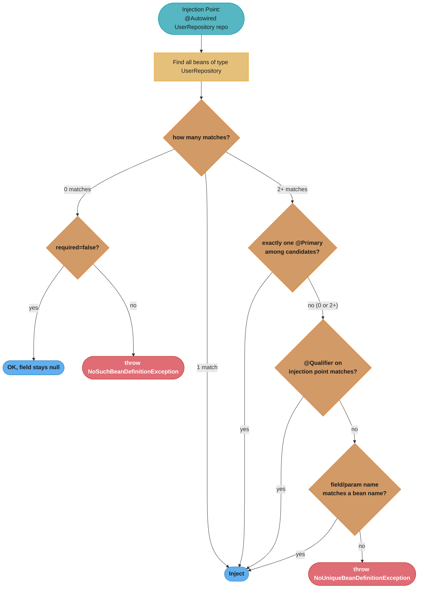
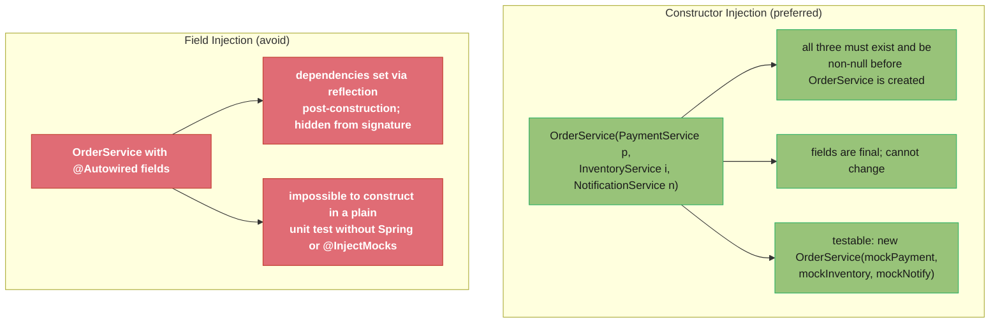
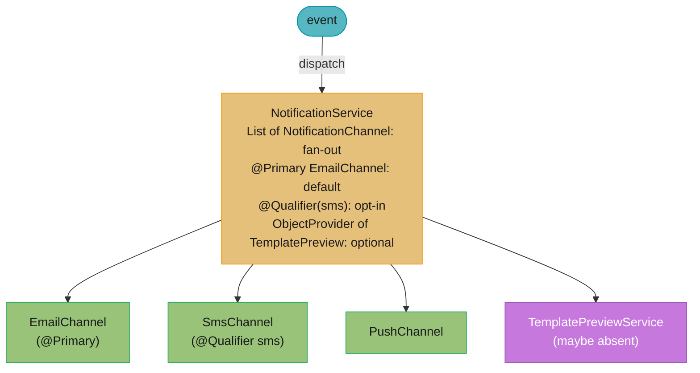

# Dependency Injection

## 1. Concept Overview

Dependency Injection (DI) is the mechanism by which the Spring container supplies a bean's dependencies, rather than the bean creating or fetching them itself. A bean declares what it needs (via constructor parameters, setter methods, or annotated fields), and the container resolves and provides the correct implementations at runtime.

DI is the practical manifestation of the Dependency Inversion Principle: depend on abstractions, not concretions. The container wires concrete implementations to abstract interfaces.

---

## 2. Intuition

Think of a restaurant chef who declares "I need a knife, a cutting board, and fresh vegetables." The kitchen manager (container) supplies these tools without the chef having to go to the storage room. The chef focuses on cooking (business logic), not on sourcing tools (object creation).

**One-line analogy:** DI is like a power outlet — your appliance declares it needs electricity (an interface), and the building wiring (container) delivers the correct voltage and current at the right outlet.

**Why it matters:** Without DI, unit testing requires creating all transitive dependencies manually. A `UserService` that creates its own `UserRepository` which creates its own `DataSource` becomes untestable in isolation. DI allows injecting mock `UserRepository` in tests without touching the production database.

**Key insight:** The three injection types differ in *when* the dependency is available. Constructor injection makes dependencies available immediately (in the constructor). Setter injection makes them available after `@PostConstruct`. Field injection makes them available after construction (same as setter but without the method).

---

## 3. Core Principles

1. **Depend on interfaces, not implementations:** Inject `UserRepository` (interface), not `JpaUserRepository` (implementation).
2. **Let the container own object creation:** Never `new` a dependency inside a Spring bean.
3. **Fail fast on missing dependencies:** Required injections (`@Autowired`) throw `NoSuchBeanDefinitionException` at startup, not at runtime.
4. **Prefer immutability:** Constructor-injected dependencies can be `final` fields; field-injected ones cannot.
5. **Make dependencies explicit:** Constructor injection documents required dependencies in the method signature; field injection hides them.

---

## 4. Types / Architectures / Strategies

### Three Injection Types

| Type | Mechanism | `final` fields? | Works in tests without Spring? | Circular dep? |
|------|-----------|----------------|-------------------------------|---------------|
| Constructor | Parameters to constructor | Yes | Yes (just call `new`) | Detected immediately |
| Setter | `@Autowired` on setter method | No | Possible (call setter) | Can be resolved |
| Field | `@Autowired` on field | No | No (requires reflection) | Can be resolved |

### Resolution Order

When multiple beans match an injection point, Spring resolves in this priority:
1. **Exact type match** with `@Primary` annotation on one candidate
2. **Qualifier match** via `@Qualifier("beanName")` on injection point
3. **Name match:** field/parameter name matches bean name
4. `NoUniqueBeanDefinitionException` if still ambiguous

### Injection Annotations Comparison

| Annotation | Source | Resolution Strategy | Notes |
|------------|--------|---------------------|-------|
| `@Autowired` | Spring | Type first, then name | `required=true` by default |
| `@Qualifier` | Spring | Name qualifier with `@Autowired` | Must pair with `@Autowired` |
| `@Resource` | JSR-250 | Name first, then type | Works standalone (no `@Autowired` needed) |
| `@Inject` | JSR-330 | Type first (like `@Autowired`) | No `required=false` support |
| `@Value` | Spring | Property/SpEL expression | Not for bean injection |

---

## 5. Architecture Diagrams





---

## 6. How It Works — Detailed Mechanics

### Constructor Injection (Recommended)

```java
@Service
public class OrderService {
    private final PaymentService paymentService;
    private final InventoryService inventoryService;
    private final NotificationService notificationService;

    // Spring 4.3+: @Autowired optional when single constructor
    public OrderService(PaymentService paymentService,
                        InventoryService inventoryService,
                        NotificationService notificationService) {
        this.paymentService = paymentService;       // final field
        this.inventoryService = inventoryService;   // final field
        this.notificationService = notificationService;
    }
}

// Unit test: no Spring context needed
class OrderServiceTest {
    @Test
    void processOrder_chargesPayment() {
        PaymentService mockPayment = mock(PaymentService.class);
        InventoryService mockInventory = mock(InventoryService.class);
        NotificationService mockNotify = mock(NotificationService.class);

        OrderService service = new OrderService(mockPayment, mockInventory, mockNotify);
        service.processOrder(new Order("item-1"));

        verify(mockPayment).charge(any());
    }
}
```

### Field Injection (Anti-Pattern — Avoid)

```java
// BROKEN: cannot test without Spring; cannot make fields final; hidden dependencies
@Service
public class OrderService {
    @Autowired
    private PaymentService paymentService;    // hidden; appears in no constructor/method

    @Autowired
    private InventoryService inventoryService;

    // To test this: need Spring context or Mockito @InjectMocks (fragile)
}

// FIXED: constructor injection (see above)
```

### @Primary and @Qualifier

```java
// Two beans of the same type
@Component("mysqlPaymentService")
public class MySQLPaymentService implements PaymentService { }

@Component("stripePaymentService")
@Primary  // used when no @Qualifier is specified
public class StripePaymentService implements PaymentService { }

// Injection
@Service
public class OrderService {
    // Gets StripePaymentService (because @Primary)
    @Autowired
    private PaymentService defaultPayment;

    // Gets MySQLPaymentService explicitly
    @Autowired
    @Qualifier("mysqlPaymentService")
    private PaymentService legacyPayment;
}
```

### @Resource (Name-First Resolution)

```java
// @Resource resolves by name first, type second (opposite of @Autowired)
@Service
public class OrderService {
    // Looks for bean named "stripePaymentService" first, then type PaymentService
    @Resource(name = "stripePaymentService")
    private PaymentService paymentService;

    // When name not specified: uses field name "paymentService" as bean name
    @Resource
    private PaymentService paymentService;  // looks for bean "paymentService"
}
```

### Injecting Collections of Beans

```java
// Inject ALL implementations of an interface
@Service
public class NotificationService {
    private final List<NotificationChannel> channels;

    // Spring injects ALL NotificationChannel beans in this list
    public NotificationService(List<NotificationChannel> channels) {
        this.channels = channels;  // [EmailChannel, SmsChannel, PushChannel]
    }

    // Inject as Map: bean name -> bean instance
    public NotificationService(Map<String, NotificationChannel> channelMap) {
        // channelMap = {"emailChannel" -> EmailChannel, "smsChannel" -> SmsChannel}
    }
}

// Order the list with @Order
@Component
@Order(1)  // lower value = earlier in list
public class EmailChannel implements NotificationChannel { }

@Component
@Order(2)
public class SmsChannel implements NotificationChannel { }
```

### ObjectProvider — Lazy and Optional Injection

```java
@Service
public class ReportService {
    private final ObjectProvider<CacheService> cacheProvider;

    public ReportService(ObjectProvider<CacheService> cacheProvider) {
        this.cacheProvider = cacheProvider;
    }

    public Report generateReport(String type) {
        // Optional: get cache only if available
        CacheService cache = cacheProvider.getIfAvailable();
        if (cache != null) {
            return cache.getReport(type);
        }
        return buildReport(type);  // expensive operation
    }

    // For prototype beans: get new instance each call
    public void sendReport(Report report) {
        ReportSender sender = senderProvider.getObject();  // new instance each call
        sender.send(report);
    }
}
```

### @Value Injection

```java
@Component
public class AppConfig {
    // Property placeholder
    @Value("${app.max-connections:10}")  // default = 10
    private int maxConnections;

    // SpEL expression
    @Value("#{systemProperties['user.home']}")
    private String userHome;

    // Environment variable
    @Value("${DB_PASSWORD}")
    private String dbPassword;

    // SpEL with bean reference
    @Value("#{configService.getTimeout()}")
    private Duration timeout;

    // List from comma-separated property
    @Value("${allowed.hosts}")  // app.allowed.hosts=host1,host2,host3
    private List<String> allowedHosts;
}
```

---

## 7. Real-World Examples

**Payment service routing:** An `OrderService` injects a `Map<String, PaymentGateway>` where each key is the gateway name. At runtime, orders route to Stripe, PayPal, or Braintree by looking up the gateway name in the map — all wired by Spring with zero conditional logic in `OrderService`.

**Feature flags with @Conditional:** Two `FeatureToggleService` beans: a `DatabaseFeatureToggle` (reads from DB) and a `HardcodedFeatureToggle` (reads from properties). The `@ConditionalOnProperty(name="features.store", havingValue="database")` controls which is active. Switching feature backends requires only a property change.

**Multi-notification channels:** A `List<NotificationChannel>` injection collects all active channels (Email, SMS, Push) registered in the context. Adding a new channel requires only creating a new `@Component` — no changes to `NotificationService`. This is the Open/Closed Principle in action.

---

## 8. Tradeoffs

| Injection Type | Testability | Immutability | Verbosity | Circular Dep Detection | IDE Support |
|----------------|-------------|--------------|-----------|------------------------|-------------|
| Constructor | Excellent | Yes (final) | More verbose for many deps | Immediate | Full |
| Setter | Good | No | Medium | Deferred | Full |
| Field | Poor | No | Least verbose | Deferred | Full (but warns) |

---

## 9. When to Use / When NOT to Use

**Use constructor injection for:**
- All required dependencies (the vast majority)
- Any bean you want to unit-test without Spring
- Libraries and shared components

**Use setter injection for:**
- Truly optional dependencies (though `ObjectProvider` is better)
- Circular dependencies that cannot be redesigned (last resort)

**Use @Qualifier when:**
- Multiple beans of the same type exist and different injection points need different ones

**Do NOT use field injection because:**
- Cannot declare fields `final` → bean is mutable
- Hidden dependencies (no constructor/method signature reveals them)
- Cannot instantiate bean in tests without reflection or Spring context
- IntelliJ and SonarQube both warn about it

---

## 10. Common Pitfalls

### Pitfall 1: NoUniqueBeanDefinitionException — Multiple Matching Beans

```java
// BROKEN: two beans of type DataSource, Spring doesn't know which to inject
@Bean
public DataSource primaryDataSource() { return new HikariDataSource(primaryConfig); }

@Bean
public DataSource auditDataSource() { return new HikariDataSource(auditConfig); }

@Service
public class UserService {
    @Autowired
    private DataSource dataSource;  // NoUniqueBeanDefinitionException!
}

// FIX: Mark one as @Primary or use @Qualifier
@Bean
@Primary
public DataSource primaryDataSource() { ... }

// OR explicit qualifier at injection point
@Service
public class UserService {
    @Autowired
    @Qualifier("primaryDataSource")
    private DataSource dataSource;
}
```

### Pitfall 2: @Autowired on Static Field (Silently Does Nothing)

```java
// BROKEN: Spring does not inject static fields
@Component
public class ConfigHolder {
    @Autowired
    private static AppProperties props;  // props remains null!

    public static String getTimeout() {
        return props.getTimeout();  // NullPointerException
    }
}

// FIX: use instance field or @PostConstruct to initialize static from instance
@Component
public class ConfigHolder {
    private static AppProperties staticProps;

    @Autowired
    private AppProperties props;

    @PostConstruct
    public void init() {
        ConfigHolder.staticProps = this.props;
    }

    public static String getTimeout() {
        return staticProps.getTimeout();  // safe after init
    }
}
```

### Pitfall 3: @Autowired in @Configuration Lite Mode (No Proxy)

```java
// BROKEN: @Component (lite mode) @Bean methods are NOT proxied
// calling another @Bean method returns a NEW instance, not the singleton
@Component  // <- lite mode, not @Configuration
public class AppConfig {
    @Bean
    public DataSource dataSource() { return new HikariDataSource(); }

    @Bean
    public TransactionManager txManager() {
        return new DataSourceTransactionManager(dataSource());  // NEW DataSource created!
        // dataSource() is called as a regular method, not through the proxy
    }
}

// FIX: use @Configuration (full mode — CGLIB-proxied, inter-@Bean calls return singletons)
@Configuration  // <- full mode, CGLIB proxy ensures singleton semantics
public class AppConfig {
    @Bean
    public DataSource dataSource() { return new HikariDataSource(); }

    @Bean
    public TransactionManager txManager() {
        return new DataSourceTransactionManager(dataSource());  // returns same singleton
    }
}
```

### Pitfall 4: Injecting Value Annotation with Wrong Default

```java
// BROKEN: missing property causes startup failure with cryptic message
@Value("${max.retries}")  // property not defined anywhere
private int maxRetries;
// IllegalArgumentException: Could not resolve placeholder 'max.retries'

// FIX: provide a default value
@Value("${max.retries:3}")  // defaults to 3 if not configured
private int maxRetries;

// ALSO BROKEN: type mismatch
@Value("${timeout.seconds}")  // property = "five"
private int timeoutSeconds;
// ConversionFailedException: "five" cannot be converted to int

// FIX: use proper property value ("5" not "five")
```

---

## 11. Technologies & Tools

| Component | Role |
|-----------|------|
| `AutowiredAnnotationBeanPostProcessor` | Processes `@Autowired`, `@Value`, `@Inject` |
| `CommonAnnotationBeanPostProcessor` | Processes `@Resource` (JSR-250) |
| `ObjectProvider<T>` | Lazy, optional, multi-bean injection |
| `@Primary` | Mark default bean when multiple candidates exist |
| `@Qualifier` | Disambiguate bean selection by name |
| `@Resource` | JSR-250 name-first injection |
| `@Inject` | JSR-330 type-first injection (no `required=false`) |
| `@Value` | Property/SpEL injection |
| `ConfigurableBeanFactory` | Programmatic bean retrieval (avoid in app code) |

---

## 12. Interview Questions with Answers

**What are the three types of dependency injection in Spring and which is preferred?**
Constructor injection (via constructor parameters), setter injection (via `@Autowired` setter methods), and field injection (via `@Autowired` on instance fields). Constructor injection is strongly preferred because it makes dependencies explicit (visible in method signature), allows `final` fields (immutability), enables testing without Spring (just call `new`), and provides fail-fast behavior when a required dependency is missing. Field injection is an anti-pattern despite its convenience.

**How does Spring resolve ambiguity when multiple beans of the same type exist?**
Spring first checks for `@Primary` on one of the candidates. If that fails or multiple have `@Primary`, it checks for a `@Qualifier` annotation on the injection point. If still ambiguous, it tries matching by field/parameter name against bean names. If all resolution strategies fail, `NoUniqueBeanDefinitionException` is thrown at startup. Best practice: use `@Primary` for the default implementation, `@Qualifier` for explicit overrides.

**What is the difference between @Autowired, @Resource, and @Inject?**
`@Autowired` (Spring) resolves by type first, then by name if ambiguous; supports `required=false`. `@Resource` (JSR-250) resolves by name first, then by type; no `required` attribute. `@Inject` (JSR-330) resolves by type like `@Autowired` but without `required=false` support. For maximum portability, use `@Inject` (JSR-330). For Spring-specific features like `required=false`, use `@Autowired`. For name-based lookup, use `@Resource`.

**Why is field injection considered an anti-pattern?**
Four reasons: (1) fields cannot be `final` — the bean is mutable; (2) dependencies are hidden — no constructor/method reveals them; (3) unit testing requires Spring context or Mockito `@InjectMocks` (fragile, breaks with multiple same-type dependencies); (4) violates the explicit dependency principle. IntelliJ IDEA, SonarQube, and the Spring team all recommend constructor injection. The only acceptable use of field injection is in `@SpringBootTest` integration tests where the test class itself is not a Spring bean.

**What happens when @Autowired cannot find a required bean?**
With `required=true` (default), Spring throws `NoSuchBeanDefinitionException` at startup during `finishBeanFactoryInitialization`, immediately failing the context refresh. With `required=false` or `@Autowired(required=false)`, the field is left `null` and the application starts. `ObjectProvider<T>` is the preferred alternative to `required=false` because it is explicit about optionality and provides null-safe methods like `getIfAvailable()`.

**How do you inject all beans of a given type into one injection point?**
Declare the injection point as `List<T>` to get all matching beans in `@Order` order, or as `Map<String, T>` to get a map of bean name to bean instance. Spring automatically collects all beans of type `T` from the context and injects them. This is extremely useful for plugin patterns (strategy pattern), notification channels, validators, or processing pipelines where adding a new bean automatically plugs it in.

**What is ObjectProvider and when is it better than @Autowired(required=false)?**
`ObjectProvider<T>` provides explicit optional injection with null-safe methods (`getIfAvailable()`, `getIfUnique()`, `stream()`). It is better than `required=false` because it is self-documenting (makes optionality explicit in the code), provides access to multiple beans, and enables lazy initialization (the bean is not requested until `getObject()` is called). It is also the correct solution for injecting prototype beans into singleton beans without the singleton becoming stale.

**What is the difference between @Primary and @Qualifier?**
`@Primary` is declared on the bean class/method and makes that bean the default whenever type resolution is ambiguous — it is a global preference. `@Qualifier` is declared at the injection point and overrides the default for that specific injection — it is a local override. Use `@Primary` for "this is the main implementation"; use `@Qualifier` to explicitly select a specific non-primary bean at a specific injection point. Both can coexist: `@Primary` wins when no `@Qualifier` is specified.

**How does @Value injection work and what are its limitations?**
`@Value` is processed by `AutowiredAnnotationBeanPostProcessor` using `PropertySourcesPlaceholderConfigurer` (for `${...}` expressions) and `ExpressionEvaluator` (for `#{...}` SpEL expressions). Limitations: (1) cannot inject complex bean graphs (only primitives, Strings, and simple collections); (2) if a property is missing without a default, context fails to start; (3) type conversion happens automatically but fails with cryptic errors for malformed values; (4) `@Value` does not support reloading at runtime (use `@ConfigurationProperties` with `@RefreshScope` for that).

**Can you inject a Spring bean into a non-Spring-managed object?**
Not directly via `@Autowired`. Options: (1) use `@Configurable` with AspectJ load-time weaving (complex setup); (2) call `SpringBeanAutowiringSupport.processInjectionBasedOnCurrentContext(this)` in the object's constructor (legacy); (3) redesign so the non-Spring object is created by a Spring-managed factory; (4) use `ApplicationContext.getBean()` (service locator, anti-pattern). The cleanest solution is usually option 3 — make the factory a Spring bean and have it create the instances.

**What is the effect of @Autowired on a constructor with multiple parameters?**
Since Spring 4.3, `@Autowired` is implicit on a class with a single constructor. With multiple constructors, `@Autowired` must be placed explicitly on the preferred constructor. If no constructor is annotated and none has no-arg form, Spring throws `NoSuchMethodException`. Each constructor parameter is resolved as a separate injection point. This is why constructor injection is explicit about all required dependencies — missing one fails with a clear error at context startup.

**How does Spring handle circular dependencies with constructor injection?**
It throws `BeanCurrentlyInCreationException` immediately at startup. Spring tracks in-progress beans in `singletonsCurrentlyInCreation`. When bean A's constructor requires B, and B's constructor requires A, Spring detects the cycle and fails. There is no way to resolve constructor circular dependencies in Spring — the design must be changed. Common fixes: extract a third bean with shared logic, use events, or change one injection to setter/field injection (which Spring can resolve via early references, though this is still a design smell).

**What is the difference between @Autowired on a field vs @Autowired on a constructor when a dependency is null?**
With field injection, if the bean is not available and `required=false`, the field stays `null` — your code must null-check everywhere. With constructor injection, there is no `required=false` (the parameter is either resolved or startup fails). This makes constructor injection safer: a missing required dependency causes an informative startup failure rather than a silent `null` that causes a `NullPointerException` during a production request at 2am.

**What is `ObjectProvider<T>` and when should you use it over `@Autowired(required=false)`?**
`ObjectProvider<T>` (Spring 4.3) is an injection point that provides lazy, on-demand access to a bean with safe handling of optional and multiple-bean scenarios. Unlike `@Autowired(required=false)` which silently injects null when the bean is absent, `ObjectProvider` exposes `getIfAvailable()`, `getIfUnique()`, and `stream()`. Use cases: (1) **Optional dependency** — `provider.getIfAvailable()` returns null cleanly without `NullPointerException` surprises. (2) **Deferred resolution** — `provider.getObject()` resolves the bean lazily on first call, avoiding circular dependency issues. (3) **Multiple candidates** — `provider.stream()` iterates all matching beans, ordered by `@Order`. `ObjectProvider` is preferred over `@Autowired(required=false) Optional<T>` because it works for both single and multiple beans and gives the injection point a name that is visible in IDE warnings and Spring's actuator beans report.

**What is `@Lazy` and how does it interact with circular dependencies?**
`@Lazy` on a bean definition (class or `@Bean` method) defers instantiation until first access — the proxy is injected at wiring time, but the actual bean is created on first method call. On an injection point (`@Autowired @Lazy`), Spring injects a lazy-resolution proxy instead of the real bean. This can break circular dependency cycles: if A requires B (constructor) and B requires A (constructor), add `@Lazy` to one constructor parameter. Spring injects a proxy for A into B's constructor — B is fully created, then A's constructor completes using the real B, then the proxy for A in B's dependency resolves to the real A on first call. Caution: `@Lazy` on a class means it is not initialized during application startup, so startup-time validation (e.g., configuration binding errors) won't be caught until the first access. Use `@Lazy` only for genuinely expensive optional beans and circular dependency resolution of last resort.

---

## 13. Best Practices

1. **Use constructor injection for all required dependencies** — it is the Spring team's recommendation and makes code testable without the container.
2. **Declare injected fields `final`** with constructor injection — enforces immutability.
3. **Use `@Primary` on default implementations** and `@Qualifier` only where a non-default is needed.
4. **Prefer `ObjectProvider<T>` over `@Autowired(required=false)`** — more explicit and null-safe.
5. **Use `@Value` with default values** — `${property.key:defaultValue}` prevents startup failures for optional configuration.
6. **Use `@ConfigurationProperties` instead of `@Value` for complex config** — better binding, validation, and IDE support.
7. **Avoid injecting `ApplicationContext`** — it is the Service Locator anti-pattern.
8. **Avoid field injection in production code** — restrict it to test classes where `@MockBean` or `@Autowired` on test fields is acceptable.
9. **Use `Map<String, T>` injection for plugin patterns** — extensible without modifying the injection point.
10. **Limit the number of constructor parameters to ~4** — if you need more, it is a signal that the class has too many responsibilities.

---

## 14. Case Study

### Scenario: Multi-Strategy Notification Service

A SaaS platform (Spring Boot 3.2 / Java 17) sends transactional notifications across Email, SMS, and Push. Requirements:

- Fan-out to all enabled channels for some events, single channel for others
- Email is the default channel when no preference is specified
- A user can opt into a specific channel by name
- An expensive, optional `TemplatePreviewService` is only present in some deployments and must not be a hard dependency
- ~8,000 notifications/sec at peak; channel set must be extensible without editing the dispatcher

DI features — collection injection, `@Primary`, `@Qualifier`, and `ObjectProvider` — make this clean and testable.

### Architecture Overview



### Implementation

All implementations are collected via `List<NotificationChannel>`; `@Primary` marks the default; a custom qualifier annotation selects a specific channel.

```java
public interface NotificationChannel {
    void send(String recipient, String message);
    ChannelType type();
}

@Component
@Primary                                   // default when injecting a single NotificationChannel
public class EmailChannel implements NotificationChannel {
    private final JavaMailSender mail;
    public EmailChannel(JavaMailSender mail) { this.mail = mail; }   // required dep, constructor
    public void send(String to, String msg) { /* ... */ }
    public ChannelType type() { return ChannelType.EMAIL; }
}

@Component
@Qualifier("sms")
public class SmsChannel implements NotificationChannel {
    private final SmsGateway gateway;
    public SmsChannel(SmsGateway gateway) { this.gateway = gateway; }
    public void send(String to, String msg) { /* ... */ }
    public ChannelType type() { return ChannelType.SMS; }
}
```

The dispatcher uses constructor injection for required collaborators and `ObjectProvider` for the optional preview service.

```java
@Service
public class NotificationService {
    private final List<NotificationChannel> channels;          // all implementations
    private final NotificationChannel defaultChannel;          // @Primary -> EmailChannel
    private final ObjectProvider<TemplatePreviewService> previewProvider;

    public NotificationService(List<NotificationChannel> channels,
                               NotificationChannel defaultChannel,
                               ObjectProvider<TemplatePreviewService> previewProvider) {
        this.channels = channels;
        this.defaultChannel = defaultChannel;
        this.previewProvider = previewProvider;
    }

    public void broadcast(String recipient, String message) {
        // optional dependency: only used if a bean exists in this deployment
        previewProvider.ifAvailable(p -> p.validate(message));
        channels.forEach(c -> c.send(recipient, message));
    }

    public void sendDefault(String recipient, String message) {
        defaultChannel.send(recipient, message);               // EmailChannel via @Primary
    }
}
```

Specific-channel selection uses `@Qualifier`, and tests need no Spring container at all.

```java
@Service
public class OtpService {
    private final NotificationChannel sms;
    public OtpService(@Qualifier("sms") NotificationChannel sms) { this.sms = sms; }
    public void sendOtp(String phone, String code) { sms.send(phone, "OTP: " + code); }
}

@Test
void broadcast_hitsAllChannels() {
    NotificationChannel email = mock(NotificationChannel.class);
    NotificationChannel push  = mock(NotificationChannel.class);
    var svc = new NotificationService(List.of(email, push), email,
                                      mock(ObjectProvider.class));
    svc.broadcast("u@x.com", "hi");
    verify(email).send(eq("u@x.com"), eq("hi"));
    verify(push).send(eq("u@x.com"), eq("hi"));
}
```

### Metrics

| Metric | Before (hard-coded) | After (DI) |
|--------|---------------------|------------|
| Files changed to add a channel | 5 | 1 (new `@Component`) |
| Dispatcher unit test setup | full Spring context (~3s) | plain `new` (~5ms) |
| Optional-dependency NPEs | 4/quarter | 0 (`ObjectProvider`) |
| Channel-selection ambiguity errors at startup | recurring | 0 (`@Primary`/`@Qualifier`) |

### Common Pitfalls

**Pitfall 1 — field injection inside a `@Configuration` class breaks `@Bean` ordering.**

```java
// BROKEN: field injected dep may be null when a @Bean method runs during context bootstrap
@Configuration
public class AppConfig {
    @Autowired private MeterRegistry registry;     // not guaranteed set when bean() is invoked
    @Bean public Stats stats() { return new Stats(registry); }   // possible NPE
}
```

```java
// FIX: declare the dependency as a @Bean method parameter — Spring orders creation correctly
@Configuration
public class AppConfig {
    @Bean public Stats stats(MeterRegistry registry) { return new Stats(registry); }
}
```

**Pitfall 2 — `@Autowired(required=false)` silently leaves a null, NPE later.**

```java
// BROKEN: no bean present -> field stays null -> NPE at first use, far from the cause
@Autowired(required = false)
private AuditClient auditClient;
public void record(Event e) { auditClient.send(e); }   // NPE in production
```

```java
// FIX: model optionality explicitly with ObjectProvider
private final ObjectProvider<AuditClient> auditProvider;
public void record(Event e) {
    auditProvider.ifAvailable(c -> c.send(e));          // no-op when absent
}
```

**Pitfall 3 — circular dependency: setter injection "works", constructor injection fails fast.**

```java
// BROKEN: A and B require each other via constructor -> BeanCurrentlyInCreationException
@Component class A { A(B b){} }
@Component class B { B(A a){} }
```

```java
// FIX: break the cycle (extract shared logic) or, if unavoidable, use @Lazy on one side
@Component class A { A(@Lazy B b){} }   // injects a proxy, deferring B's full creation
@Component class B { B(A a){} }
```

### Interview Discussion Points

**How does injecting `List<NotificationChannel>` work, and how is order controlled?** Spring collects every bean implementing the interface into the list automatically, so adding a new `@Component` extends behavior with no dispatcher change (Open/Closed). Ordering follows `@Order`/`Ordered` or `@Priority`; without them order is undefined, so never rely on collection position for correctness.

**When do `@Primary` and `@Qualifier` apply, and which wins?** `@Primary` designates the default bean chosen when a single instance of a type is injected without further qualification. `@Qualifier` names a specific bean at the injection point and takes precedence over `@Primary` when both are present, letting most callers get the default while specific callers opt into another implementation.

**Why use `ObjectProvider` instead of `@Autowired(required=false)`?** `ObjectProvider` gives lazy, null-safe access via `getIfAvailable()`/`ifAvailable()`/`getIfUnique()`, so optionality and ambiguity are handled explicitly at the call site. `required=false` leaves a raw null field that defers the failure to first use, producing NPEs far from the missing-bean cause.

**Why is constructor injection preferred over field injection?** It makes dependencies explicit and final (immutable, thread-safe), allows the object to be constructed and unit-tested without Spring, and surfaces unresolvable or circular dependencies at startup rather than at runtime. Field injection hides dependencies, prevents `final`, and complicates testing.

**Why does field injection in a `@Configuration` class cause subtle bugs?** `@Bean` methods can be invoked during context bootstrap before field injection on the configuration instance has completed, so an injected field may still be null when the bean method reads it. Declaring the dependency as a method parameter lets the container resolve and order creation correctly.

**How do you resolve a genuine circular dependency safely?** First try to remove it by extracting the shared behavior into a third collaborator, since a cycle usually signals a design smell. If it is truly required, switch one side to setter injection or annotate one constructor parameter with `@Lazy` so Spring injects a proxy and defers full creation, breaking the construction-time cycle.

---

## Related / See Also

- [IoC Container](../ioc_container/README.md) — ApplicationContext and bean registration
- [Spring Configuration](../spring_configuration/README.md) — @Bean methods
- [Spring Boot Auto-Configuration](../spring_boot_autoconfiguration/README.md) — auto-wiring
- [Case Study: DI Container (Java)](../../java/case_studies/design_di_container_java.md) — reflection-based IoC
- [LLD: SOLID Principles](../../lld/solid_principles/README.md) — the Dependency Inversion Principle DI frameworks exist to satisfy
- [LLD: Dependency Inversion Principle](../../lld/solid_principles/DependencyInversion.md) — deep dive on the specific principle
- [LLD: Factory Method Pattern](../../lld/creational/factory_method/README.md) — `BeanFactory` is a Factory Method at framework scale
