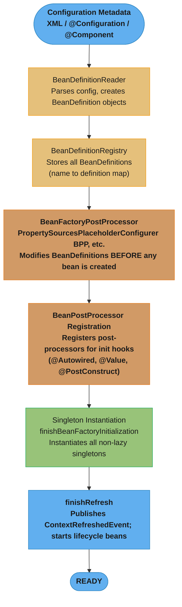
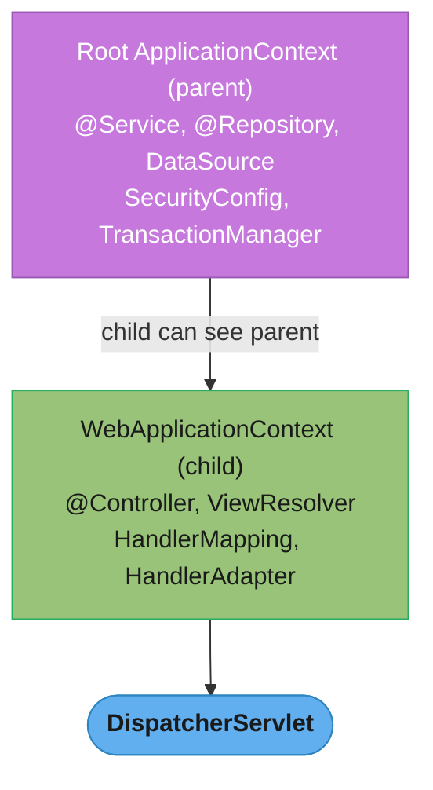
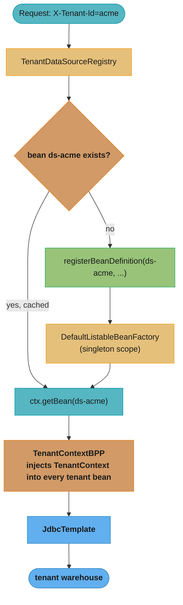

# IoC Container

## 1. Concept Overview

The Spring IoC (Inversion of Control) container is the core of the Spring Framework. It manages the complete lifecycle of Spring beans — creating them, wiring their dependencies, and destroying them when the application shuts down. "Inversion of Control" means the container, not your code, controls when and how objects are created and connected.

The two primary IoC container implementations are `BeanFactory` (the lean core) and `ApplicationContext` (the full-featured extension used in almost all real applications).

---

## 2. Intuition

Think of the IoC container as a restaurant kitchen manager. You write a recipe (bean definition) specifying what ingredients (dependencies) a dish (bean) needs. The kitchen manager (container) sources the ingredients, prepares the dish at the right time, and delivers it to whoever orders it. You never manage ingredients yourself — the manager handles it all.

**One-line analogy:** The IoC container is a smart object factory that assembles everything for you based on instructions (configuration metadata).

**Why it matters:** Without IoC, every object must manually create and manage its dependencies — leading to tight coupling, hard-to-test code, and configuration scattered across the codebase. Spring's container centralizes this wiring.

**Key insight:** The container is not magic. At startup it reads bean definitions (from XML, annotations, or Java config), builds a dependency graph, and instantiates beans in the correct order. Once you understand the startup sequence, most Spring gotchas become predictable.

---

## 3. Core Principles

1. **Dependency Inversion:** High-level modules depend on abstractions, not concrete implementations. The container injects implementations at runtime.
2. **Single Source of Truth for Wiring:** All bean creation and dependency resolution happens in one place — the container.
3. **Lifecycle Management:** The container owns object lifecycle (creation, initialization, destruction). Beans should not manage their own lifecycle.
4. **Configuration Metadata Separation:** The "what exists" (beans) and "how to wire them" (dependencies) are separate from the business logic.
5. **Eagerness by Default (ApplicationContext):** ApplicationContext instantiates all singleton beans at startup, catching misconfiguration early.

---

## 4. Types / Architectures / Strategies

### BeanFactory
- Lowest-level container interface (`org.springframework.beans.factory.BeanFactory`)
- Lazy initialization: beans created only on first `getBean()` call
- No built-in support for event publishing, i18n, or application lifecycle events
- Rarely used directly; primarily for resource-constrained environments

### ApplicationContext
- Extends `BeanFactory`; adds: event publishing, i18n (`MessageSource`), resource loading, `@PostConstruct`/`@PreDestroy` lifecycle
- Eager initialization: all singleton beans instantiated at startup
- Primary interface used in all production Spring applications

### ApplicationContext Implementations

| Implementation | When to Use |
|----------------|-------------|
| `AnnotationConfigApplicationContext` | Standalone apps with Java config / `@Component` scanning |
| `ClassPathXmlApplicationContext` | Legacy XML configuration |
| `FileSystemXmlApplicationContext` | XML config loaded from filesystem path |
| `WebApplicationContext` | Web applications; aware of `ServletContext` |
| `AnnotationConfigServletWebServerApplicationContext` | Spring Boot web apps (auto-selected) |
| `AnnotationConfigReactiveWebServerApplicationContext` | Spring Boot WebFlux apps (auto-selected) |

### Parent/Child Context Hierarchy
Spring MVC creates a **child** ApplicationContext (servlet context) from a **parent** root context:
- Root context: service beans, repositories, datasources
- Child context: MVC beans (controllers, view resolvers, interceptors)
- Child can see parent beans; parent cannot see child beans
- Spring Boot collapses this to a single context unless explicitly configured otherwise

---

## 5. Architecture Diagrams



The `refresh()` pipeline: configuration metadata becomes `BeanDefinition`s, `BeanFactoryPostProcessor`s edit that metadata, `BeanPostProcessor`s register their hooks, then non-lazy singletons are instantiated and the context is marked ready.



Classic Spring MVC's child `WebApplicationContext` sees every bean in the root `Parent`, but the root cannot see child-only MVC beans — Spring Boot collapses this into a single context by default.

---

## 6. How It Works — Detailed Mechanics

### Refresh Lifecycle (AbstractApplicationContext.refresh())

The `refresh()` method is the heartbeat of container startup. It executes in this order:

```java
// Simplified pseudocode of AbstractApplicationContext.refresh()
public void refresh() {
    // 1. Prepare context (set start date, active flags, init property sources)
    prepareRefresh();

    // 2. Create (or refresh) the underlying BeanFactory
    //    Reads all BeanDefinitions from config metadata
    ConfigurableListableBeanFactory beanFactory = obtainFreshBeanFactory();

    // 3. Configure BeanFactory (ClassLoader, BeanPostProcessors like
    //    ApplicationContextAwareProcessor, etc.)
    prepareBeanFactory(beanFactory);

    // 4. Hook for subclasses to further modify BeanFactory after standard init
    postProcessBeanFactory(beanFactory);

    // 5. Invoke BeanFactoryPostProcessor implementations
    //    (PropertySourcesPlaceholderConfigurer resolves ${...} here)
    invokeBeanFactoryPostProcessors(beanFactory);

    // 6. Register BeanPostProcessor instances
    //    (@Autowired, @Value, @PostConstruct processors registered here)
    registerBeanPostProcessors(beanFactory);

    // 7. Initialize MessageSource for i18n
    initMessageSource();

    // 8. Initialize ApplicationEventMulticaster
    initApplicationEventMulticaster();

    // 9. Initialize other special beans (e.g., Tomcat embedded server in Boot)
    onRefresh();

    // 10. Register ApplicationListener beans
    registerListeners();

    // 11. Instantiate ALL non-lazy singleton beans
    finishBeanFactoryInitialization(beanFactory);

    // 12. Publish ContextRefreshedEvent; start Lifecycle beans
    finishRefresh();
}
```

### BeanDefinition Internals

A `BeanDefinition` is the metadata object stored in the registry for each bean:

```java
// What BeanDefinition captures (simplified)
public interface BeanDefinition {
    String getBeanClassName();        // "com.example.UserService"
    String getScope();                // "singleton", "prototype", etc.
    boolean isSingleton();
    boolean isPrototype();
    boolean isLazyInit();
    String[] getDependsOn();          // explicit @DependsOn dependencies
    ConstructorArgumentValues getConstructorArgumentValues();
    MutablePropertyValues getPropertyValues();
    String getInitMethodName();       // @Bean(initMethod=...)
    String getDestroyMethodName();    // @Bean(destroyMethod=...)
}
```

### @Import, @ImportResource, ImportSelector

```java
// @Import: directly import another @Configuration class or @Component
@Configuration
@Import({DataSourceConfig.class, CacheConfig.class})
public class AppConfig { }

// ImportSelector: programmatically decide what to import
public class MyImportSelector implements ImportSelector {
    @Override
    public String[] selectImports(AnnotationMetadata metadata) {
        // Return fully-qualified class names to import
        return new String[]{"com.example.FooConfig", "com.example.BarConfig"};
    }
}

// ImportBeanDefinitionRegistrar: directly register BeanDefinitions
public class MyRegistrar implements ImportBeanDefinitionRegistrar {
    @Override
    public void registerBeanDefinitions(AnnotationMetadata meta,
                                        BeanDefinitionRegistry registry) {
        registry.registerBeanDefinition("myBean",
            new RootBeanDefinition(MyBean.class));
    }
}
```

### Shutdown Hook — Critical for Resource Cleanup

```java
// WITHOUT shutdown hook: @PreDestroy and DisposableBean.destroy() NOT called
ApplicationContext ctx = new AnnotationConfigApplicationContext(AppConfig.class);
// ...app runs...
// JVM exits: beans NOT destroyed, DB connections NOT closed, schedulers still running!

// WITH shutdown hook: graceful shutdown guaranteed
ConfigurableApplicationContext ctx =
    new AnnotationConfigApplicationContext(AppConfig.class);
ctx.registerShutdownHook();  // or ctx.close() explicitly

// Spring Boot does this automatically via SpringApplication
```

---

## 7. Real-World Examples

**E-commerce platform startup:**
A Spring Boot app starts, the container reads 300+ `@Component`/`@Service`/`@Repository` beans, resolves their dependencies, instantiates them in correct order (DataSource first, then repositories, then services, then controllers). If any `@Autowired` field cannot be resolved, startup fails immediately with a clear error — better than a NullPointerException at 3am in production.

**Multi-tenant SaaS:**
Uses child ApplicationContexts per tenant, each with tenant-specific DataSource and configuration beans, while sharing the parent context's common infrastructure beans.

**Testing with @SpringBootTest:**
`@SpringBootTest` triggers a full `refresh()` of the ApplicationContext. Subsequent tests with the same context configuration reuse the cached context (Spring's test context caching) — one of the most important performance optimizations in Spring test suites.

---

## 8. Tradeoffs

| Aspect | BeanFactory | ApplicationContext |
|--------|-------------|-------------------|
| Startup speed | Fast (lazy) | Slower (eager singleton init) |
| Memory at startup | Lower | Higher (all singletons loaded) |
| Fail-fast | No (errors at first access) | Yes (misconfiguration caught at startup) |
| Event support | No | Yes (ApplicationEvent) |
| i18n / MessageSource | No | Yes |
| @PostConstruct support | No (without extra config) | Yes (via BPP) |
| Typical usage | Unit tests, resource-constrained | All production applications |

---

## 9. When to Use / When NOT to Use

**Use ApplicationContext when:**
- Building any production Spring application (always)
- You need event publishing, i18n, or lifecycle management
- You want fail-fast behavior at startup (recommended for microservices readiness probes)

**Use BeanFactory when:**
- Writing Spring internals / framework extensions
- Resource-constrained environments where startup memory matters (rare)
- Unit testing minimal slices without full context

**Do NOT:**
- Call `getBean()` from application code (Service Locator anti-pattern; use injection instead)
- Hold a reference to `ApplicationContext` in domain objects (violates DI principle)
- Create multiple ApplicationContexts in the same JVM without a clear parent/child relationship

---

## 10. Common Pitfalls

### Pitfall 1: Missing Shutdown Hook (Resource Leak)

```java
// BROKEN: Scheduled tasks, DB connections, Kafka consumers NOT stopped
public static void main(String[] args) {
    AnnotationConfigApplicationContext ctx =
        new AnnotationConfigApplicationContext(AppConfig.class);
    runApp();
    // JVM exits — no cleanup
}

// FIXED: Always register shutdown hook for standalone apps
public static void main(String[] args) {
    ConfigurableApplicationContext ctx =
        new AnnotationConfigApplicationContext(AppConfig.class);
    ctx.registerShutdownHook();  // registers JVM shutdown hook
    runApp();
    // JVM exit triggers DisposableBean.destroy() on all beans
}
// Spring Boot handles this automatically
```

### Pitfall 2: Calling getBean() in Application Code (Service Locator Anti-Pattern)

```java
// BROKEN: Hides dependencies, makes testing hard
@Service
public class OrderService {
    @Autowired
    private ApplicationContext ctx;  // dependency on container!

    public void processOrder(Order order) {
        PaymentService ps = ctx.getBean(PaymentService.class);  // anti-pattern
        ps.charge(order);
    }
}

// FIXED: Inject directly
@Service
public class OrderService {
    private final PaymentService paymentService;

    public OrderService(PaymentService paymentService) {
        this.paymentService = paymentService;
    }
}
```

### Pitfall 3: Assuming Context is Ready During Construction

```java
// BROKEN: @PostConstruct not yet called; @Autowired fields not yet injected
//         in constructors of beans that depend on this bean being initialized
@Component
public class CacheWarmup {
    @Autowired
    private UserRepository repo;

    public CacheWarmup() {
        repo.findAll(); // NullPointerException! repo not injected yet
    }
}

// FIXED: Use @PostConstruct for initialization after injection
@Component
public class CacheWarmup {
    @Autowired
    private UserRepository repo;

    @PostConstruct
    public void init() {
        repo.findAll(); // safe: called after all dependencies injected
    }
}
```

---

## 11. Technologies & Tools

| Tool | Role |
|------|------|
| `spring-context` jar | Core ApplicationContext implementation |
| `spring-beans` jar | BeanFactory, BeanDefinition, BeanPostProcessor |
| `spring-core` jar | Resource loading, type conversion utilities |
| `@SpringBootApplication` | Triggers auto-configuration + component scan |
| `spring-context-indexer` | Compile-time component index for faster scanning |
| `--debug` flag | Prints full ConditionEvaluationReport on startup |
| `/actuator/beans` | Lists all beans and their dependencies at runtime |
| Spring Initializr | Project scaffolding with correct Spring Boot starters |

---

## 12. Interview Questions with Answers

**What is the difference between BeanFactory and ApplicationContext?**
`BeanFactory` is the basic IoC container with lazy initialization; `ApplicationContext` extends it with eager singleton initialization, event publishing, i18n support, and `@PostConstruct`/`@PreDestroy` lifecycle. `ApplicationContext` is used in all production applications; `BeanFactory` is only used for testing or resource-constrained environments. In practice, always use `ApplicationContext` unless you have a specific reason not to.

**What happens during ApplicationContext.refresh()?**
`refresh()` is the container's startup sequence: it reads BeanDefinitions from configuration metadata, runs `BeanFactoryPostProcessors` (resolving property placeholders), registers `BeanPostProcessors` (for `@Autowired`, `@PostConstruct`), instantiates all non-lazy singletons in dependency order, and publishes `ContextRefreshedEvent`. Any misconfiguration (missing required bean, circular constructor dependency) causes an exception here. This is the "fail-fast" behavior that makes Spring apps reliable.

**What is a BeanDefinition and what does it contain?**
A `BeanDefinition` is the metadata object Spring stores for each bean: the class name, scope (singleton/prototype), init/destroy method names, constructor arguments, property values, lazy flag, and explicit `@DependsOn` dependencies. It is created from your configuration metadata (annotations, XML, Java config) before any bean is instantiated. `BeanFactoryPostProcessors` can modify these definitions before instantiation.

**What is the difference between @Import and @ComponentScan?**
`@ComponentScan` discovers `@Component`-annotated classes by classpath scanning within specified packages. `@Import` explicitly registers specific `@Configuration` classes, `ImportSelector` results, or `ImportBeanDefinitionRegistrar` programmatic registrations. `@Import` is more precise and does not require classpath scanning; it is how Spring Boot auto-configuration works internally. Use `@Import` for library/framework integration; use `@ComponentScan` for your own application code.

**What is the ApplicationContext parent/child hierarchy? Where is it used?**
A child `ApplicationContext` can see all beans from its parent but the parent cannot see child beans. Classic Spring MVC uses this: the root context (parent) holds services and repositories, while the servlet context (child) holds MVC infrastructure (controllers, view resolvers). Spring Boot collapses this into a single context for simplicity. This hierarchy is still useful for multi-tenant systems or plugin architectures.

**Why should you register a shutdown hook with ApplicationContext?**
Without a shutdown hook, JVM exit does not trigger `@PreDestroy` methods, `DisposableBean.destroy()`, or `destroyMethod` on beans. This leaks resources: database connections remain open, Kafka consumers do not commit final offsets, scheduled tasks continue in background threads. `ctx.registerShutdownHook()` registers a JVM shutdown hook that calls `ctx.close()`, triggering orderly bean destruction. Spring Boot registers this automatically via `SpringApplication`.

**What is the BeanFactoryPostProcessor and when does it run?**
`BeanFactoryPostProcessor` runs after all `BeanDefinition`s are loaded but before any bean is instantiated. It receives the `ConfigurableListableBeanFactory` and can modify or add `BeanDefinition`s. The most important built-in example is `PropertySourcesPlaceholderConfigurer`, which resolves `${property.key}` placeholders in bean definitions. Do not instantiate application beans inside a `BeanFactoryPostProcessor`; it runs too early in the lifecycle.

**What is the difference between BeanFactoryPostProcessor and BeanPostProcessor?**
`BeanFactoryPostProcessor` operates on `BeanDefinition`s (metadata) before any bean is created. `BeanPostProcessor` operates on fully constructed bean instances, with hooks before and after initialization (`postProcessBeforeInitialization` / `postProcessAfterInitialization`). `BeanPostProcessor` is how `@Autowired`, `@Value`, `@PostConstruct`, and AOP proxying are implemented. `BeanFactoryPostProcessor` modifies the recipe; `BeanPostProcessor` modifies the cooked dish.

**How does Spring detect circular dependencies at startup?**
Spring tracks beans currently being created in a `Set<String> singletonsCurrentlyInCreation`. When creating bean A requires bean B, which requires bean A (constructor injection), Spring detects that A is already in the "currently creating" set and throws `BeanCurrentlyInCreationException`. For setter/field injection, Spring can resolve circular deps by exposing the partially initialized bean via `earlySingletonObjects`. Spring Boot 2.6+ disables circular dependency resolution by default.

**What is @DependsOn and when would you use it?**
`@DependsOn("beanName")` tells the container to initialize the specified bean before the current one, even when there is no direct injection dependency. This is needed when a bean relies on a side effect of another bean's initialization — for example, a bean that registers a JNDI resource or sets a system property that the current bean reads during its own initialization. Without `@DependsOn`, the order is non-deterministic. Use sparingly; a direct injection dependency is usually better design.

**What are SmartLifecycle and Lifecycle interfaces used for?**
`Lifecycle` beans have `start()` and `stop()` methods called when the `ApplicationContext` starts and stops. `SmartLifecycle` extends this with a `getPhase()` method (lower phase = starts first, stops last) and `isAutoStartup()`. Spring Boot uses `SmartLifecycle` for the embedded server (Tomcat starts after all beans are initialized, stops before they are destroyed). Use `SmartLifecycle` when you have a resource (server, connection, scheduler) that should start after all beans are ready.

**What is the FactoryBean<T> and how does it differ from a @Bean method?**
`FactoryBean<T>` is a special bean that produces other beans of type `T`. Requesting `beanName` from the container returns the product (`T`), not the factory. Requesting `&beanName` returns the `FactoryBean` itself. This pattern pre-dates Java config and is used in legacy Spring integrations (e.g., `LocalSessionFactoryBean` for Hibernate). A `@Bean` method is the modern equivalent and is simpler for most cases. Know `FactoryBean` for legacy codebase interviews.

**How does @Lazy affect ApplicationContext startup?**
`@Lazy` on a `@Component` or `@Bean` delays that bean's instantiation until first requested (via injection or `getBean()`). `spring.main.lazy-initialization=true` makes all beans lazy globally. This reduces startup time (useful for fast-test iteration) but moves initialization errors from startup to first-request time, which is undesirable in production where Kubernetes readiness probes check startup health. Spring Boot 2.4+ introduced a startup actuator endpoint to profile which beans are slow to initialize.

**What events does ApplicationContext publish and how do you listen to them?**
The container publishes: `ContextRefreshedEvent` (refresh complete), `ContextStartedEvent`, `ContextStoppedEvent`, `ContextClosedEvent`, and request-scoped events in web apps. Listen with `@EventListener` on any bean method: `@EventListener public void onRefresh(ContextRefreshedEvent e) {...}`. For async events, add `@Async`. For ordering, add `@Order`. Custom events extend `ApplicationEvent` and are published via `applicationContext.publishEvent(new MyEvent(this))`. Events are synchronous by default; all listeners execute in the publisher's thread.

**What is the difference between ClassPathXmlApplicationContext and AnnotationConfigApplicationContext?**
`ClassPathXmlApplicationContext` reads XML files from the classpath and builds `BeanDefinition`s from XML element tags (`<bean>`, `<property>`). `AnnotationConfigApplicationContext` reads `@Configuration` classes and `@Component`-annotated classes (via scanning) and builds `BeanDefinition`s from annotations. Both implement `ApplicationContext` and behave identically after startup. XML config is legacy and rarely used in new code; annotated Java config is the modern standard.

---

## 13. Best Practices

1. **Always use `ApplicationContext`, never `BeanFactory`** in application code.
2. **Register a shutdown hook** (`ctx.registerShutdownHook()`) for standalone apps; Spring Boot does this automatically.
3. **Never call `getBean()` from application beans** — use constructor injection.
4. **Minimize `@ComponentScan` scope** — scanning too many packages slows startup.
5. **Use `spring-context-indexer`** (`spring-context-indexer` Maven dependency) to generate a compile-time component index, eliminating classpath scanning entirely.
6. **Avoid circular dependencies** — they are a design smell. Restructure instead of working around them.
7. **Use `@DependsOn` sparingly** — prefer direct injection to express dependencies.
8. **Understand the startup sequence** — most Spring misconfiguration errors happen in phases 1-5 of `refresh()`. Read the exception stack trace from the top.
9. **Use `/actuator/beans`** to introspect which beans are in the context and their dependencies.
10. **Prefer `@Configuration` with explicit `@Bean` methods** for infrastructure beans (DataSource, TransactionManager) over `@Component` scanning — they are more explicit and easier to test.

---

## 14. Case Study

### Scenario: Plugin-Based Analytics Platform with Runtime Bean Registration

**Context.** A multi-tenant analytics SaaS lets each tenant connect its own warehouse (Postgres, Snowflake, BigQuery). Tenant `DataSource` beans cannot be known at compile time — they are registered **programmatically at runtime** the first time a tenant makes a request, using `DefaultListableBeanFactory.registerBeanDefinition()`. The platform holds **~50 tenant-specific `DataSource` beans** live, each cached for the tenant's session lifetime. Peak: 3,000 tenant queries/sec across 50 active warehouses.

### Architecture



A new tenant ID misses the bean-existence check, triggers runtime `registerBeanDefinition`, then falls through to the same cached-lookup path every subsequent request takes.

### Runtime Bean Registration

```java
@Component
public class TenantDataSourceRegistry {

    private final DefaultListableBeanFactory beanFactory;   // from ConfigurableApplicationContext

    public TenantDataSourceRegistry(ConfigurableApplicationContext ctx) {
        this.beanFactory = (DefaultListableBeanFactory) ctx.getBeanFactory();
    }

    public DataSource forTenant(TenantConfig cfg) {
        String beanName = "ds-" + cfg.id();
        if (!beanFactory.containsBeanDefinition(beanName)) {
            BeanDefinition def = BeanDefinitionBuilder
                .genericBeanDefinition(HikariDataSource.class)
                .addPropertyValue("jdbcUrl", cfg.jdbcUrl())
                .addPropertyValue("username", cfg.username())
                .addPropertyValue("password", cfg.password())
                .addPropertyValue("maximumPoolSize", 5)
                .setScope(BeanDefinition.SCOPE_SINGLETON)   // one pool per tenant, reused
                .getBeanDefinition();
            beanFactory.registerBeanDefinition(beanName, def);   // container now manages it
        }
        return beanFactory.getBean(beanName, DataSource.class);  // lazily instantiated on first get
    }
}
```

```java
// A BeanPostProcessor injects the resolved TenantContext into tenant-scoped components
@Component
public class TenantContextBeanPostProcessor implements BeanPostProcessor {
    @Override
    public Object postProcessBeforeInitialization(Object bean, String name) {
        if (bean instanceof TenantAware aware) {
            aware.setTenantContext(TenantContextHolder.current());
        }
        return bean;
    }
}
```

```
BeanFactory vs ApplicationContext refresh:
- BeanFactory: lazy, no auto BPP/BFPP registration, no event publishing, no i18n.
- ApplicationContext.refresh(): runs BFPPs -> registers BPPs -> instantiates non-lazy singletons
  -> publishes ContextRefreshedEvent. Runtime registration here happens AFTER refresh, so the new
  bean is instantiated lazily on first getBean(), not during the refresh cycle.
```

### Metrics

- Cold tenant registration + pool warm-up: **~120ms** (one-time per tenant).
- Cached tenant lookup (`containsBeanDefinition` + `getBean`): **<0.1ms**.
- 50 live tenant pools x 5 connections = **250 connections** budgeted; idle pools evicted after 10 min.

### Pitfalls

**Pitfall 1 — Calling `getBean()` during `BeanFactoryPostProcessor` execution.**
```java
// BROKEN: a BFPP that resolves a bean forces premature instantiation before BPPs are registered,
// so that bean (and its dependencies) skip post-processing (no AOP, no @Transactional proxy)
public class BadBFPP implements BeanFactoryPostProcessor {
    public void postProcessBeanFactory(ConfigurableListableBeanFactory bf) {
        MetricsService m = bf.getBean(MetricsService.class);  // premature -> proxying skipped
    }
}
```
```java
// FIXED: a BFPP only inspects/edits BeanDefinitions; never instantiate beans here
public class GoodBFPP implements BeanFactoryPostProcessor {
    public void postProcessBeanFactory(ConfigurableListableBeanFactory bf) {
        BeanDefinition bd = bf.getBeanDefinition("metricsService");
        bd.setLazyInit(true);   // mutate metadata, do not create the instance
    }
}
```

**Pitfall 2 — `@Autowired` on a `BeanFactoryPostProcessor` causes a circular bootstrap.**
```java
// BROKEN: BFPPs run before normal beans exist; autowiring forces early creation of dependencies
// and emits "is not eligible for getting processed by all BeanPostProcessors" warnings
public class TenantBFPP implements BeanFactoryPostProcessor {
    @Autowired DataSource dataSource;   // pulled in too early, proxying skipped
}
```
```java
// FIXED: pass collaborators lazily via ObjectProvider, resolved only when actually needed
public class TenantBFPP implements BeanFactoryPostProcessor {
    public void postProcessBeanFactory(ConfigurableListableBeanFactory bf) {
        ObjectProvider<DataSource> ds = bf.getBeanProvider(DataSource.class);
        // ds.getIfAvailable() only when a definition truly requires it, not at BFPP time
    }
}
```

**Pitfall 3 — Prototype bean injected into a singleton is created only once.**
```java
// BROKEN: @Autowired resolves once at singleton creation; the "prototype" is effectively a singleton
@Component
class ReportRunner {
    @Autowired QueryJob job;   // prototype, but the SAME instance reused on every run
    void run() { job.execute(); }
}
```
```java
// FIXED: use ObjectProvider (or ApplicationContext.getBean) to get a fresh prototype per call
@Component
class ReportRunner {
    private final ObjectProvider<QueryJob> jobs;
    ReportRunner(ObjectProvider<QueryJob> jobs) { this.jobs = jobs; }
    void run() { jobs.getObject().execute(); }   // new QueryJob each invocation
}
```

### Interview Q&A

**Why register tenant `DataSource` beans at runtime instead of declaring them as `@Bean`?** Tenants and their warehouse credentials are unknown at compile time and change while the app runs. `registerBeanDefinition()` lets the container manage, cache, and lifecycle-scope each pool while still applying BPP injection and dependency resolution, which a plain map of `DataSource` objects would not get.

**What is the difference between `BeanFactory` and `ApplicationContext` here?** `BeanFactory` is the raw container with lazy instantiation and no automatic post-processing. `ApplicationContext` extends it with automatic `BeanPostProcessor`/`BeanFactoryPostProcessor` registration, event publishing, and message resolution. Runtime registration uses the underlying `DefaultListableBeanFactory` exposed by the context.

**At what point in `refresh()` are post-processors applied, and why does that matter for runtime beans?** `refresh()` registers BFPPs, then BPPs, then instantiates non-lazy singletons. A bean registered after refresh is instantiated lazily on first `getBean()` and still passes through the already-registered BPPs, so tenant-context injection works for late-registered beans.

**Why does instantiating a bean inside a BFPP break proxying?** BPPs (which create AOP/transaction proxies) are not all registered yet when BFPPs run. A bean created during BFPP execution bypasses those BPPs, so it never gets wrapped — `@Transactional`, `@Async`, and caching advice silently do nothing on it.

**Why is a prototype injected into a singleton not "really" a prototype?** Dependency injection happens once, when the singleton is created. The container resolves the prototype a single time and stores that reference. To get a new instance per use, the singleton must ask the container each time via `ObjectProvider`, method injection (`@Lookup`), or `ApplicationContext.getBean()`.

**How do you bound resource usage with 50 live tenant pools?** Cap each pool small (5 connections), evict idle pools after a timeout, and monitor total connections against the warehouse limits. Because each pool is a managed singleton, eviction means removing the bean definition and closing the `DataSource`, so reconnecting a tenant simply re-registers it.

---

## Related / See Also

- [Bean Lifecycle](../bean_lifecycle/README.md) — instantiation and post-processing sequence
- [Dependency Injection](../dependency_injection/README.md) — wiring beans together
- [Spring Configuration](../spring_configuration/README.md) — @Configuration, @Conditional
- [Case Study: DI Container (Java)](../../java/case_studies/design_di_container_java.md) — mini-IoC built from scratch
- [LLD: Factory Method Pattern](../../lld/creational/factory_method/README.md) — `BeanFactory`/`ApplicationContext` is a Factory Method at framework scale: callers ask for a bean by type/name and never invoke `new` themselves
